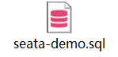

# 一、分布式事务 Seata

## 1 引言

### 1.1 事务的ACID原则


### 1.2 分布式服务案例

微服务下单业务，在下单时会调用订单服务，创建订单并写入数据库。然后订单服务调用账户服务和库存服务：

- 账户服务负责扣减用户余额
- 库存服务负责扣减商品库存


### 1.3 演示分布式事务问题

1、创建数据库，名为seata_demo，然后导入课前资料提供的SQL文件



seata-demo.sql

```sql
/*
 Navicat Premium Data Transfer

 Source Server         : local
 Source Server Type    : MySQL
 Source Server Version : 50622
 Source Host           : localhost:3306
 Source Schema         : seata_demo

 Target Server Type    : MySQL
 Target Server Version : 50622
 File Encoding         : 65001

 Date: 24/06/2021 19:55:35
*/

SET NAMES utf8mb4;
SET FOREIGN_KEY_CHECKS = 0;

-- ----------------------------
-- Table structure for account_tbl
-- ----------------------------
DROP TABLE IF EXISTS `account_tbl`;
CREATE TABLE `account_tbl`  (
  `id` int(11) NOT NULL AUTO_INCREMENT,
  `user_id` varchar(255) CHARACTER SET utf8 COLLATE utf8_general_ci NULL DEFAULT NULL,
  `money` int(11) UNSIGNED NULL DEFAULT 0,
  PRIMARY KEY (`id`) USING BTREE
) ENGINE = InnoDB AUTO_INCREMENT = 2 CHARACTER SET = utf8 COLLATE = utf8_general_ci ROW_FORMAT = COMPACT;

-- ----------------------------
-- Records of account_tbl
-- ----------------------------
INSERT INTO `account_tbl` VALUES (1, 'user202103032042012', 1000);

-- ----------------------------
-- Table structure for order_tbl
-- ----------------------------
DROP TABLE IF EXISTS `order_tbl`;
CREATE TABLE `order_tbl`  (
  `id` int(11) NOT NULL AUTO_INCREMENT,
  `user_id` varchar(255) CHARACTER SET utf8 COLLATE utf8_general_ci NULL DEFAULT NULL,
  `commodity_code` varchar(255) CHARACTER SET utf8 COLLATE utf8_general_ci NULL DEFAULT NULL,
  `count` int(11) NULL DEFAULT 0,
  `money` int(11) NULL DEFAULT 0,
  PRIMARY KEY (`id`) USING BTREE
) ENGINE = InnoDB AUTO_INCREMENT = 1 CHARACTER SET = utf8 COLLATE = utf8_general_ci ROW_FORMAT = COMPACT;

-- ----------------------------
-- Records of order_tbl
-- ----------------------------

-- ----------------------------
-- Table structure for storage_tbl
-- ----------------------------
DROP TABLE IF EXISTS `storage_tbl`;
CREATE TABLE `storage_tbl`  (
  `id` int(11) NOT NULL AUTO_INCREMENT,
  `commodity_code` varchar(255) CHARACTER SET utf8 COLLATE utf8_general_ci NULL DEFAULT NULL,
  `count` int(11) UNSIGNED NULL DEFAULT 0,
  PRIMARY KEY (`id`) USING BTREE,
  UNIQUE INDEX `commodity_code`(`commodity_code`) USING BTREE
) ENGINE = InnoDB AUTO_INCREMENT = 2 CHARACTER SET = utf8 COLLATE = utf8_general_ci ROW_FORMAT = COMPACT;

-- ----------------------------
-- Records of storage_tbl
-- ----------------------------
INSERT INTO `storage_tbl` VALUES (1, '100202003032041', 10);

SET FOREIGN_KEY_CHECKS = 1;

```

2、导入课前资料提供的微服务


3、启动nacos


4、测试下单功能，发出Post请求:

```http
curl --location --request POST 'http://localhost:8082/order?userId=user202103032042012&commodityCode=100202003032041&count=2&money=200'
```

### 1.4 分布式服务的事务问题

在分布式系统下，一个业务跨越多个服务或数据源，每个服务都是一个分支事务，要保证所有分支事务最终状态一致，这样的事务就是**分布式事务**。


### 1.5 学习目标


## 2 理论基础

### 2.1 CAP定理

1998年，加州大学的计算机科学家Eric Brewer提出，分布式系统有三个指标：

- Consistency（一致性）
- Availability（可用性）
- Partition tolerance（分区容错性）

Eric Brewer说，分布式系统无法同时满足这三个指标。

这个结论就叫做CAP定理。


#### 2.1.1 Consistency（一致性）

**Consistency（一致性）**：用户访问分布式系统中的任意节点，得到的数据必须一致


#### 2.1.2 Availability（可用性）

**Availability（可用性）**：用户访问集群中的任意健康节点，必须能得到响应，而不是超时或拒绝。


#### 2.1.3 Partition tolerance（分区容错性）

**Partition（分区）**：因为网络故障或其它原因导致分布式系统中的部分节点与其它节点失去连接，形成独立分区。

**Tolerance（容错）**：在集群出现分区时，整个系统也要持续对外提供服务。


#### 2.1.4 总结

简述CAP定理内容？

- 分布式系统节点通过网络连接，一定会出现分区问题（P）
- 当分区出现时，系统的一致性（C）和可用性（A）就无法同时满足

> 也就是说：只有CP或者AP模型

Elasticsearch集群是CP还是AP模型？

- ES集群出现分区时，故障节点会被剔除集群，数据分片会重新分配到其它节点，保证数据一致。因此是低可用性，高一致性，属于CP模型

### 2.2 BASE理论

BASE理论是对CAP的一种解决思路，包含三个思想：

- **Basically Available（基本可用）：**分布式系统在出现故障时，允许损失部分可用性，即保证核心可用。

- **Soft State（软状态）：**在一定的时间内，允许出现中间状态，比如临时的不一致状态。
- **Eventually Consistency（最终一致性）：**虽然无法保证强一致性，但是在软状态结束后，最终达到数据一致。

而分布式事务最大的问题是各个子事务的一致性问题，因此可以借鉴CAP定理和BASE理论

- **AP模式：**各个子事务分别执行和提交，允许出现结果不一致，然后采用弥补措施恢复数据即可，实现**最终一致。**
- **CP模式：**各个子事务执行后互相等待，同时提交，同时回滚，达到**强一致**。但事务等待过程中，处于弱可用状态。

### 2.3 分布式事务模型

解决分布式事务，各个子系统之间必须能感知到彼此的事务状态，才能保证状态一致，因此需要一个事务协调者来协调每一个事务的参与者（子系统事务）。

这里的子系统事务，称为**分支事务**；有关联的各个分支事务在一起被称为**全局事务**。


### 2.4 总结

**简述BASE理论的三个思想**

- 基本可用
- 软状态
- 最终一致性

**解决分布式事务的思想和模型**

- **全局事务：**整个分布式事务
- **分支事务：**分布式事务中包含的每个子系统的事务
- **最终一致思想：**各分支事务分别执行并提交，如果有不一致的情况，再想办法恢复数据
- **强一致思想：**各个分支事务执行完业务不要提交，等待彼此结果。而后统一提交或回滚。

## 3 初始Seata

- Seata架构
- 部署TC服务
- 微服务集成Seata

### 3.1 Seata架构

#### 3.1.1 Seata官网介绍

Seata是2019年1月份蚂蚁金服和阿里巴巴共同开源的分布式事务解决方案。致力于提供高性能和简单易用的分布式事务服务，为用户打造一站式的分布式解决方案。

官网地址：https://seata.io/zh-cn/index.html，其中的文档、博客中提供了大量的使用说明、源码分析。


##### 1 Seata是什么

Seata 是一款开源的分布式事务解决方案，致力于在微服务架构下提供高性能和简单易用的分布式事务服务。在 Seata 开源之前，其内部版本在阿里系内部一直扮演着应用架构层数据一致性的中间件角色，帮助经济体平稳的度过历年的双11，对上层业务进行了有力的技术支撑。经过多年沉淀与积累，其商业化产品先后在阿里云、金融云上售卖。2019.1 为了打造更加完善的技术生态和普惠技术成果，Seata 正式宣布对外开源，未来 Seata 将以社区共建的形式帮助用户快速落地分布式事务解决方案。


##### 2 微服务生态全景图


##### 3 特色功能

- #### 微服务框架支持

  目前已支持Dubbo、Spring Cloud、Sofa-RPC、Motan 和 gRPC 等RPC框架，其他框架持续集成中

- #### AT 模式

  提供无侵入自动补偿的事务模式，目前已支持MySQL、Oracle、PostgreSQL、TiDB 和 MariaDB。H2、DB2、SQLServer、达梦开发中

- #### TCC 模式

  支持 TCC 模式并可与 AT 混用，灵活度更高

- #### SAGA 模式

  为长事务提供有效的解决方案,提供编排式与注解式(开发中)

- #### XA 模式

  支持已实现 XA 接口的数据库的 XA 模式，目前已支持MySQL、Oracle、TiDB和MariaDB

- #### 高可用

  支持计算分离集群模式，水平扩展能力强的数据库和 Redis 存储模式.Raft模式Preview阶段


#### 3.1.2 Seata事务管理的三个重要的角色

- **TC（Transaction Coordinator）-事务协调者**：维护全局和分支事务的状态，协调全局事务提交或回滚。
- **TM（Transaction Manager）-事务管理者**：定义全局事务的范围、开始全局事务、提交或回滚全局事务。
- **RM（Resource Manager）-资源管理者**：管理分支事务处理的资源，与TC建立连接以注册分支事务和报告分支事务的状态，并驱动分支事务提交或回滚。


#### 3.1.3 Seata提供了四种不同的分布式事务解决方案

- **XA模式：**强一致性分阶段事务模式，牺牲了一定的可用性，无业务侵入。
- **TCC模式：**最终一致性的分阶段事务模式，有业务侵入。
- **AT模式：**最终一致性的分阶段事务模式，无业务侵入，也是Seata的默认模式。
- **SAGA模式：**长事务模式，有业务侵入。

### 3.2 部署TC服务

#### 3.2.1 部署服务

##### 1 部署Seata的tc-server

###### 1.1 下载

首先我们要下载seata-server包，地址在[http](http://seata.io/zh-cn/blog/download.html)[://seata.io/zh-cn/blog/download](http://seata.io/zh-cn/blog/download.html)[.](http://seata.io/zh-cn/blog/download.html)[html](http://seata.io/zh-cn/blog/download.html) 

当然，课前资料也准备好了：


###### 1.2 解压

在非中文目录解压缩这个zip包，其目录结构如下：


###### 1.3 修改配置

修改conf目录下的registry.conf文件：


内容如下：

```properties
registry {
  # tc服务的注册中心类，这里选择nacos，也可以是eureka、zookeeper等
  type = "nacos"

  nacos {
    # seata tc 服务注册到 nacos的服务名称，可以自定义
    application = "seata-tc-server"
    serverAddr = "127.0.0.1:8848"
    group = "DEFAULT_GROUP"
    namespace = ""
    cluster = "SH"
    username = "nacos"
    password = "nacos"
  }
}

config {
  # 读取tc服务端的配置文件的方式，这里是从nacos配置中心读取，这样如果tc是集群，可以共享配置
  type = "nacos"
  # 配置nacos地址等信息
  nacos {
    serverAddr = "127.0.0.1:8848"
    namespace = ""
    group = "SEATA_GROUP"
    username = "nacos"
    password = "nacos"
    dataId = "seataServer.properties"
  }
}
```

##### 2 在nacos添加配置

特别注意，为了让tc服务的集群可以共享配置，我们选择了nacos作为统一配置中心。因此服务端配置文件seataServer.properties文件需要在nacos中配好。

格式如下：


配置内容如下：

```properties
# 数据存储方式，db代表数据库
store.mode=db
store.db.datasource=druid
store.db.dbType=mysql
store.db.driverClassName=com.mysql.jdbc.Driver
store.db.url=jdbc:mysql://127.0.0.1:3306/seata?useUnicode=true&rewriteBatchedStatements=true
store.db.user=root
store.db.password=123
store.db.minConn=5
store.db.maxConn=30
store.db.globalTable=global_table
store.db.branchTable=branch_table
store.db.queryLimit=100
store.db.lockTable=lock_table
store.db.maxWait=5000
# 事务、日志等配置
server.recovery.committingRetryPeriod=1000
server.recovery.asynCommittingRetryPeriod=1000
server.recovery.rollbackingRetryPeriod=1000
server.recovery.timeoutRetryPeriod=1000
server.maxCommitRetryTimeout=-1
server.maxRollbackRetryTimeout=-1
server.rollbackRetryTimeoutUnlockEnable=false
server.undo.logSaveDays=7
server.undo.logDeletePeriod=86400000

# 客户端与服务端传输方式
transport.serialization=seata
transport.compressor=none
# 关闭metrics功能，提高性能
metrics.enabled=false
metrics.registryType=compact
metrics.exporterList=prometheus
metrics.exporterPrometheusPort=9898
```


==其中的数据库地址、用户名、密码都需要修改成你自己的数据库信息。==


##### 3 创建数据库表

特别注意：tc服务在管理分布式事务时，需要记录事务相关数据到数据库中，你需要提前创建好这些表。

新建一个名为seata的数据库，运行课前资料提供的sql文件：


这些表主要记录全局事务、分支事务、全局锁信息：

```mysql
SET NAMES utf8mb4;
SET FOREIGN_KEY_CHECKS = 0;

-- ----------------------------
-- 分支事务表
-- ----------------------------
DROP TABLE IF EXISTS `branch_table`;
CREATE TABLE `branch_table`  (
  `branch_id` bigint(20) NOT NULL,
  `xid` varchar(128) CHARACTER SET utf8 COLLATE utf8_general_ci NOT NULL,
  `transaction_id` bigint(20) NULL DEFAULT NULL,
  `resource_group_id` varchar(32) CHARACTER SET utf8 COLLATE utf8_general_ci NULL DEFAULT NULL,
  `resource_id` varchar(256) CHARACTER SET utf8 COLLATE utf8_general_ci NULL DEFAULT NULL,
  `branch_type` varchar(8) CHARACTER SET utf8 COLLATE utf8_general_ci NULL DEFAULT NULL,
  `status` tinyint(4) NULL DEFAULT NULL,
  `client_id` varchar(64) CHARACTER SET utf8 COLLATE utf8_general_ci NULL DEFAULT NULL,
  `application_data` varchar(2000) CHARACTER SET utf8 COLLATE utf8_general_ci NULL DEFAULT NULL,
  `gmt_create` datetime(6) NULL DEFAULT NULL,
  `gmt_modified` datetime(6) NULL DEFAULT NULL,
  PRIMARY KEY (`branch_id`) USING BTREE,
  INDEX `idx_xid`(`xid`) USING BTREE
) ENGINE = InnoDB CHARACTER SET = utf8 COLLATE = utf8_general_ci ROW_FORMAT = Compact;

-- ----------------------------
-- 全局事务表
-- ----------------------------
DROP TABLE IF EXISTS `global_table`;
CREATE TABLE `global_table`  (
  `xid` varchar(128) CHARACTER SET utf8 COLLATE utf8_general_ci NOT NULL,
  `transaction_id` bigint(20) NULL DEFAULT NULL,
  `status` tinyint(4) NOT NULL,
  `application_id` varchar(32) CHARACTER SET utf8 COLLATE utf8_general_ci NULL DEFAULT NULL,
  `transaction_service_group` varchar(32) CHARACTER SET utf8 COLLATE utf8_general_ci NULL DEFAULT NULL,
  `transaction_name` varchar(128) CHARACTER SET utf8 COLLATE utf8_general_ci NULL DEFAULT NULL,
  `timeout` int(11) NULL DEFAULT NULL,
  `begin_time` bigint(20) NULL DEFAULT NULL,
  `application_data` varchar(2000) CHARACTER SET utf8 COLLATE utf8_general_ci NULL DEFAULT NULL,
  `gmt_create` datetime NULL DEFAULT NULL,
  `gmt_modified` datetime NULL DEFAULT NULL,
  PRIMARY KEY (`xid`) USING BTREE,
  INDEX `idx_gmt_modified_status`(`gmt_modified`, `status`) USING BTREE,
  INDEX `idx_transaction_id`(`transaction_id`) USING BTREE
) ENGINE = InnoDB CHARACTER SET = utf8 COLLATE = utf8_general_ci ROW_FORMAT = Compact;

SET FOREIGN_KEY_CHECKS = 1;
```

seata-tc-server.sql

```sql
/*
 Navicat Premium Data Transfer

 Source Server         : local
 Source Server Type    : MySQL
 Source Server Version : 50622
 Source Host           : localhost:3306
 Source Schema         : seata_demo

 Target Server Type    : MySQL
 Target Server Version : 50622
 File Encoding         : 65001

 Date: 20/06/2021 12:38:37
*/

SET NAMES utf8mb4;
SET FOREIGN_KEY_CHECKS = 0;

-- ----------------------------
-- Table structure for branch_table
-- ----------------------------
DROP TABLE IF EXISTS `branch_table`;
CREATE TABLE `branch_table`  (
  `branch_id` bigint(20) NOT NULL,
  `xid` varchar(128) CHARACTER SET utf8 COLLATE utf8_general_ci NOT NULL,
  `transaction_id` bigint(20) NULL DEFAULT NULL,
  `resource_group_id` varchar(32) CHARACTER SET utf8 COLLATE utf8_general_ci NULL DEFAULT NULL,
  `resource_id` varchar(256) CHARACTER SET utf8 COLLATE utf8_general_ci NULL DEFAULT NULL,
  `branch_type` varchar(8) CHARACTER SET utf8 COLLATE utf8_general_ci NULL DEFAULT NULL,
  `status` tinyint(4) NULL DEFAULT NULL,
  `client_id` varchar(64) CHARACTER SET utf8 COLLATE utf8_general_ci NULL DEFAULT NULL,
  `application_data` varchar(2000) CHARACTER SET utf8 COLLATE utf8_general_ci NULL DEFAULT NULL,
  `gmt_create` datetime(6) NULL DEFAULT NULL,
  `gmt_modified` datetime(6) NULL DEFAULT NULL,
  PRIMARY KEY (`branch_id`) USING BTREE,
  INDEX `idx_xid`(`xid`) USING BTREE
) ENGINE = InnoDB CHARACTER SET = utf8 COLLATE = utf8_general_ci ROW_FORMAT = Compact;

-- ----------------------------
-- Records of branch_table
-- ----------------------------

-- ----------------------------
-- Table structure for global_table
-- ----------------------------
DROP TABLE IF EXISTS `global_table`;
CREATE TABLE `global_table`  (
  `xid` varchar(128) CHARACTER SET utf8 COLLATE utf8_general_ci NOT NULL,
  `transaction_id` bigint(20) NULL DEFAULT NULL,
  `status` tinyint(4) NOT NULL,
  `application_id` varchar(32) CHARACTER SET utf8 COLLATE utf8_general_ci NULL DEFAULT NULL,
  `transaction_service_group` varchar(32) CHARACTER SET utf8 COLLATE utf8_general_ci NULL DEFAULT NULL,
  `transaction_name` varchar(128) CHARACTER SET utf8 COLLATE utf8_general_ci NULL DEFAULT NULL,
  `timeout` int(11) NULL DEFAULT NULL,
  `begin_time` bigint(20) NULL DEFAULT NULL,
  `application_data` varchar(2000) CHARACTER SET utf8 COLLATE utf8_general_ci NULL DEFAULT NULL,
  `gmt_create` datetime NULL DEFAULT NULL,
  `gmt_modified` datetime NULL DEFAULT NULL,
  PRIMARY KEY (`xid`) USING BTREE,
  INDEX `idx_gmt_modified_status`(`gmt_modified`, `status`) USING BTREE,
  INDEX `idx_transaction_id`(`transaction_id`) USING BTREE
) ENGINE = InnoDB CHARACTER SET = utf8 COLLATE = utf8_general_ci ROW_FORMAT = Compact;

-- ----------------------------
-- Records of global_table
-- ----------------------------


-- ----------------------------
-- Records of lock_table
-- ----------------------------

SET FOREIGN_KEY_CHECKS = 1;

```

##### 4 启动TC服务

进入bin目录，运行其中的seata-server.bat即可：


启动成功后，seata-server应该已经注册到nacos注册中心了。


打开浏览器，访问nacos地址：http://localhost:8848，然后进入服务列表页面，可以看到seata-tc-server的信息：


### 3.3 微服务集成Seata

> ps: 在集成之前需要根据课前资料创建数据库表先
>
> seata-demo.sql
>
> ```sql
> /*
>  Navicat Premium Data Transfer
> 
>  Source Server         : local
>  Source Server Type    : MySQL
>  Source Server Version : 50622
>  Source Host           : localhost:3306
>  Source Schema         : seata_demo
> 
>  Target Server Type    : MySQL
>  Target Server Version : 50622
>  File Encoding         : 65001
> 
>  Date: 24/06/2021 19:55:35
> */
> 
> SET NAMES utf8mb4;
> SET FOREIGN_KEY_CHECKS = 0;
> 
> -- ----------------------------
> -- Table structure for account_tbl
> -- ----------------------------
> DROP TABLE IF EXISTS `account_tbl`;
> CREATE TABLE `account_tbl`  (
>   `id` int(11) NOT NULL AUTO_INCREMENT,
>   `user_id` varchar(255) CHARACTER SET utf8 COLLATE utf8_general_ci NULL DEFAULT NULL,
>   `money` int(11) UNSIGNED NULL DEFAULT 0,
>   PRIMARY KEY (`id`) USING BTREE
> ) ENGINE = InnoDB AUTO_INCREMENT = 2 CHARACTER SET = utf8 COLLATE = utf8_general_ci ROW_FORMAT = COMPACT;
> 
> -- ----------------------------
> -- Records of account_tbl
> -- ----------------------------
> INSERT INTO `account_tbl` VALUES (1, 'user202103032042012', 1000);
> 
> -- ----------------------------
> -- Table structure for order_tbl
> -- ----------------------------
> DROP TABLE IF EXISTS `order_tbl`;
> CREATE TABLE `order_tbl`  (
>   `id` int(11) NOT NULL AUTO_INCREMENT,
>   `user_id` varchar(255) CHARACTER SET utf8 COLLATE utf8_general_ci NULL DEFAULT NULL,
>   `commodity_code` varchar(255) CHARACTER SET utf8 COLLATE utf8_general_ci NULL DEFAULT NULL,
>   `count` int(11) NULL DEFAULT 0,
>   `money` int(11) NULL DEFAULT 0,
>   PRIMARY KEY (`id`) USING BTREE
> ) ENGINE = InnoDB AUTO_INCREMENT = 1 CHARACTER SET = utf8 COLLATE = utf8_general_ci ROW_FORMAT = COMPACT;
> 
> -- ----------------------------
> -- Records of order_tbl
> -- ----------------------------
> 
> -- ----------------------------
> -- Table structure for storage_tbl
> -- ----------------------------
> DROP TABLE IF EXISTS `storage_tbl`;
> CREATE TABLE `storage_tbl`  (
>   `id` int(11) NOT NULL AUTO_INCREMENT,
>   `commodity_code` varchar(255) CHARACTER SET utf8 COLLATE utf8_general_ci NULL DEFAULT NULL,
>   `count` int(11) UNSIGNED NULL DEFAULT 0,
>   PRIMARY KEY (`id`) USING BTREE,
>   UNIQUE INDEX `commodity_code`(`commodity_code`) USING BTREE
> ) ENGINE = InnoDB AUTO_INCREMENT = 2 CHARACTER SET = utf8 COLLATE = utf8_general_ci ROW_FORMAT = COMPACT;
> 
> -- ----------------------------
> -- Records of storage_tbl
> -- ----------------------------
> INSERT INTO `storage_tbl` VALUES (1, '100202003032041', 10);
> 
> SET FOREIGN_KEY_CHECKS = 1;
> 
> ```
>
> 

#### 3.3.1 引入依赖

首先，我们需要在微服务中引入seata依赖：

```xml
<dependency>
    <groupId>com.alibaba.cloud</groupId>
    <artifactId>spring-cloud-starter-alibaba-seata</artifactId>
    <exclusions>
        <!--版本较低，1.3.0，因此排除-->
        <exclusion>
            <artifactId>seata-spring-boot-starter</artifactId>
            <groupId>io.seata</groupId>
        </exclusion>
    </exclusions>
</dependency>
<!--seata starter 采用1.4.2版本-->
<dependency>
    <groupId>io.seata</groupId>
    <artifactId>seata-spring-boot-starter</artifactId>
    <version>${seata.version}</version>
</dependency>
```


#### 3.3.2 修改配置文件

需要修改application.yml文件，添加一些配置：让微服务通过注册中心找到seata-tc-server

```yaml
seata:
  registry: # TC服务注册中心的配置，微服务根据这些信息去注册中心获取tc服务地址
    # 参考tc服务自己的registry.conf中的配置
    type: nacos
    nacos: # tc
      server-addr: 127.0.0.1:8848
      namespace: ""
      group: DEFAULT_GROUP
      application: seata-tc-server # tc服务在nacos中的服务名称
      cluster: SH
  tx-service-group: seata-demo # 事务组，根据这个获取tc服务的cluster名称
  service:
    vgroup-mapping: # 事务组与TC服务cluster的映射关系
      seata-demo: SH
```


#### 3.3.3 总结

nacos服务名称组成包括？

- namespace + group + serviceName + cluster

seata客户端获取tc的cluster名称方式

- 以`tx-group-service`的值为key到vgroupMapping中查找


## 4 动手实践

- XA模式
- AT模式
- TCC模式
- SAGA模式

### 4.1 XA模式

> 官网地址：
>
> https://seata.io/zh-cn/docs/dev/mode/xa-mode.html

#### 4.1.1 XA模式原理

XA规范是X/Open 组织定义的分布式事务处理（DTP，Distributed Transaction Processing）标准，XA规范描述了全局的TM与局部的RM之间的接口，几乎所有主流的数据库都对XA规范提供了支持。

- 事务都成功的流程


- 事务部分失败的流程


#### 4.1.2 Seata的XA模式

seata的XA模式做了一些调整，但大体相似


**RM一阶段的工作**

1. 注册分支事务到TC
2. 执行分支业务sql但不提交
3. 报告执行状态到TC

**TC二阶段的工作**

- TC检测各分支事务的执行状态
  - 如果都成功，通知所有的RM提交事务
  - 如果有失败，通知所有的RM回滚事务

**RM二阶段的工作**

- 接收TC指令，提交或回滚事务

简化版的流程图


##### 4.1.2.1 小总结

**XA模式的优点**

- 事务的强一致性，满足ACID原则
- 常用数据库都支持，实现简单，并且没有代码侵入

**XA模式的缺点**

- 因为一阶段需要锁定数据库资源，等待二阶段结束才释放，性能较差
- 依赖关系型数据库实现事务

#### 4.1.3 实现XA模式

##### 1 修改application.yml文件（每个参与事务的微服务），开启XA模式

```yml
seata:
  data-source-proxy-mode: XA # 开启数据源代理的XA模式
```

##### 2 给发起全局事务的入口方法添加@GlobalTransaction注解，本例中是OrderServiceImpl中的create方法：

```java
    @Override
    @GlobalTransactional
    public Long create(Order order) {
        // 创建订单
        orderMapper.insert(order);
        try {
            // 扣用户余额
            accountClient.deduct(order.getUserId(), order.getMoney());
            // 扣库存
            storageClient.d,educt(order.getCommodityCode(), order.getCount());

        } catch (FeignException e) {
            log.error("下单失败，原因:{}", e.contentUTF8(), e);
            throw new RuntimeException(e.contentUTF8(), e);
        }
        return order.getId();
    }
```

##### 3 重启服务并测试

```http
curl --location --request POST 'http://localhost:8082/order?userId=user202103032042012&commodityCode=100202003032041&count=2&money=200'
```


**每个分支事务都成功的日志**


**有分支事务失败的日志**


#### 4 补充

##### 4.1 bug1

```java
io.seata.common.exception.FrameworkException: can not connect to services-server.
```

**原因**

seata服务是部署在虚拟机上的，而seata注册在nacos上的是内网的地址，

而我们的程序是部署在本地的，本地地址是链接不上虚拟机的内网地址的

**解决方案**


```sh
[root@localhost bin]# sh seata-server.sh -p 8091 -h 192.168.125.135
```


##### 4.2 bug2

```java
java.lang.NoSuchMethodException: com.mysql.cj.conf.PropertySet.getBooleanReadableProperty
```

**原因**

在解决分布式事务时，用`seata`的@GlobalTransactional这个注解报了以下错误

报这个错误的原因是mysql版本不兼容

通过查看源码可以看到mysql的版本是8.0.11，这里我用的是最新版，所以报了这个错误

`com.alibaba.druid.util.MySqlUtils#createXAConnection`


**解决方案**

将MySQL的版本更新为8.0.11即可

```xml
<mysql.version>8.0.11</mysql.version>
```

### 4.2 AT模式

> 官网地址：
>
> https://seata.io/zh-cn/docs/dev/mode/at-mode.html

#### 4.2.1 AT模式原理

AT模式同样是分阶段提交的事务模型，不过弥补了XA模型中资源锁定周期过长的缺陷。


**阶段一RM的工作**

- 注册分支事务
- **记录undo-log（数据快照）**
- 执行业务sql并**提交**
- 报告事务状态

**阶段二提交时RM的工作**

- 删除undo-log即可

**阶段二回滚时RM的工作**

- 根据undo-log恢复数据到更新前

**举例说明**

例如，一个分支业务的SQL是这样的：

```sql
update tb_account set money = money - 10 where id = 1
```


##### 4.2.1.1 小总结

简述AT模式与XA模式的最大区别是什么？

| 模式       | XA                               | AT                             |
| ---------- | -------------------------------- | ------------------------------ |
| 锁定资源   | XA模式一阶段不提交事务，锁定资源 | AT模式一阶段提交，不锁定资源   |
| 回滚机制   | XA模式依赖数据库机制实现回滚     | AT模式利用数据快照实现数据回滚 |
| 是否强一致 | XA模式强一致                     | AT模式最终一致                 |

#### 4.2.2 AT模式的脏写问题


#### 4.2.3 AT模式的写隔离

##### 1 seata事务的写隔离


##### 2 seata事务和非seata事务的写隔离


##### 3 小总结

**AT模式的优点**

- 一阶段完成直接提交事务，释放数据库资源，性能比较好
- 利用全局锁实现读写隔离
- 没有代码侵入，框架自动完成回滚和提交

**AT模式的缺点**

- 两阶段之间属于软状态，属于最终一致
- 框架的快照功能会影响性能，但比XA模式要好很多

#### 4.2.4 实现AT模式

AT模式中的快照生成、回滚等动作都是由框架自动完成，没有任何代码侵入，因此实现非常简单。

##### 1、导入课前资料提供的Sql文件：seata-at.sql，其中lock_table导入到TC服务关联的数据库，undo_log表导入到微服务关联的数据库

**local_table导入到seata库**

```sql
-- ----------------------------
-- Table structure for lock_table
-- ----------------------------
DROP TABLE IF EXISTS `lock_table`;
CREATE TABLE `lock_table`  (
  `row_key` varchar(128) CHARACTER SET utf8 COLLATE utf8_general_ci NOT NULL,
  `xid` varchar(96) CHARACTER SET utf8 COLLATE utf8_general_ci NULL DEFAULT NULL,
  `transaction_id` bigint(20) NULL DEFAULT NULL,
  `branch_id` bigint(20) NOT NULL,
  `resource_id` varchar(256) CHARACTER SET utf8 COLLATE utf8_general_ci NULL DEFAULT NULL,
  `table_name` varchar(32) CHARACTER SET utf8 COLLATE utf8_general_ci NULL DEFAULT NULL,
  `pk` varchar(36) CHARACTER SET utf8 COLLATE utf8_general_ci NULL DEFAULT NULL,
  `gmt_create` datetime NULL DEFAULT NULL,
  `gmt_modified` datetime NULL DEFAULT NULL,
  PRIMARY KEY (`row_key`) USING BTREE,
  INDEX `idx_branch_id`(`branch_id`) USING BTREE
) ENGINE = InnoDB CHARACTER SET = utf8 COLLATE = utf8_general_ci ROW_FORMAT = Compact;


```

**undo_log导入到seata_demo库**

```sql
-- ----------------------------
-- Table structure for undo_log
-- ----------------------------
DROP TABLE IF EXISTS `undo_log`;
CREATE TABLE `undo_log`  (
  `branch_id` bigint(20) NOT NULL COMMENT 'branch transaction id',
  `xid` varchar(100) CHARACTER SET utf8 COLLATE utf8_general_ci NOT NULL COMMENT 'global transaction id',
  `context` varchar(128) CHARACTER SET utf8 COLLATE utf8_general_ci NOT NULL COMMENT 'undo_log context,such as serialization',
  `rollback_info` longblob NOT NULL COMMENT 'rollback info',
  `log_status` int(11) NOT NULL COMMENT '0:normal status,1:defense status',
  `log_created` datetime(6) NOT NULL COMMENT 'create datetime',
  `log_modified` datetime(6) NOT NULL COMMENT 'modify datetime',
  UNIQUE INDEX `ux_undo_log`(`xid`, `branch_id`) USING BTREE
) ENGINE = InnoDB CHARACTER SET = utf8 COLLATE = utf8_general_ci COMMENT = 'AT transaction mode undo table' ROW_FORMAT = Compact;

-- ----------------------------
-- Records of undo_log
-- ----------------------------
```

官网的undo_log版本

```sql
-- 注意此处0.7.0+ 增加字段 context
CREATE TABLE `undo_log` (
  `id` bigint(20) NOT NULL AUTO_INCREMENT,
  `branch_id` bigint(20) NOT NULL,
  `xid` varchar(100) NOT NULL,
  `context` varchar(128) NOT NULL,
  `rollback_info` longblob NOT NULL,
  `log_status` int(11) NOT NULL,
  `log_created` datetime NOT NULL,
  `log_modified` datetime NOT NULL,
  PRIMARY KEY (`id`),
  UNIQUE KEY `ux_undo_log` (`xid`,`branch_id`)
) ENGINE=InnoDB AUTO_INCREMENT=1 DEFAULT CHARSET=utf8;
```


##### 2、修改application.yml文件，将事务模式修改为AT模式即可

```yml
seata:
  data-source-proxy-mode: AT # 开启数据源代理的AT模式（AT模式是默认的模式）
```

##### 3、重启微服务测试

### 4.3 TCC模式

> 官网的TCC地址：
>
> https://seata.io/zh-cn/docs/dev/mode/tcc-mode.html

#### 4.3.1 TCC模式原理

TCC模式与AT模式非常相似，每阶段都是独立事务，不同的是TCC是通过人工编码来实现数据恢复。需要实现三个方法：

- **Try：**资源的检测和预留
- **Confirm：**完成资源操作业务；要求Try成功Confirm一定要成功
- **Cancel：**预留资源释放，可以理解为try的反向操作

举例，一个扣减用户余额的业务。假设账户A原来余额是100，需要余额扣减30元。

- 阶段一（Try）：检查余额是否充足，如果充足则冻结金额增加30元，可用余额扣除30


- 阶段二：假如要提交（Confirm），则冻结金额扣减30


- 阶段三：假如要回滚（Cancel），则冻结金额扣减30，可用余额增加30


##### 4.3.1.1 TCC工作模型图


**TM一阶段**

- 开启全局事务
- 调用分支

**RM一阶段**

- 注册分支事务
- 资源预留（Try）
- 报告事务状态

**TM二阶段**

- 提交或回滚全局事务

**TC二阶段**

- 检查分支事务状态，根据分支事务状态，来决定是提交还是回滚
  - 提交，然后调用Confirm
  - 回滚，然后调用Cancel


##### 4.3.1.2 小总结

**TCC模式的每个阶段是做什么的？**

- **Try：**资源检查和预留
- **Confirm：**业务执行和提交
- **Cancel：**预留资源的释放

**TCC的优点是什么？**

- 一阶段完成直接提交事务，释放数据库资源，性能好
- 相比AT模型，无需生成快照，无需使用全局锁，性能最强
- 不依赖数据库事务，而是依赖补偿操作，可以用于非事务型数据库

**TCC的缺点是什么？**

- 有代码侵入，需要人为编写Try、Confirm和Cancel接口，实现麻烦
- 软状态，事务是最终一致
- 需要考虑Confirm和Cancel的失败情况，做好幂等处理

#### 4.3.2 案例：改造account-service服务，利用TCC实现分布式事务

需求如下：

- 修改account-service，编写try、confirm、cancel逻辑
- try业务：添加冻结金额，扣减可用金额
- confirm业务：删除冻结金额
- cancel业务：删除冻结金额，恢复可用金额
- 保证confirm、cancel接口的**幂等性**
- 允许**空回滚**
- 拒绝**业务悬挂**

##### 4.3.2.1 TCC的空回滚和业务悬挂

###### 1 空回滚

当某分支事务的try阶段阻塞时，可能导致全局事务超时而触发二阶段的cancel操作。在未执行try操作时先执行了cancel操作，这时cancel不能做回滚，就是**空回滚**。

###### 2 业务悬挂

对于已经空回滚的业务，如果以后继续执行try，就永远不可能confirm和cancel，这就是**业务悬挂**。应当阻止空回滚后的try操作，避免悬挂


##### 4.3.2.2 业务分析

为了实现空回滚、防止业务悬挂，以及幂等性要求。我们必须要在数据库记录冻结金额的同时，记录当前事务id和执行状态，为此我们设计了一张表：

```sql
CREATE TABLE `account_freeze_tbl` (
  `xid` varchar(128) CHARACTER SET utf8mb3 COLLATE utf8_general_ci NOT NULL,
  `user_id` varchar(255) CHARACTER SET utf8mb3 COLLATE utf8_general_ci DEFAULT NULL COMMENT '用户id',
  `freeze_money` int unsigned DEFAULT '0' COMMENT '冻结金额',
  `state` int DEFAULT NULL COMMENT '事务状态，0:try，1:confirm，2:cancel',
  PRIMARY KEY (`xid`) USING BTREE
) ENGINE=InnoDB DEFAULT CHARSET=utf8mb4 COLLATE=utf8mb4_0900_ai_ci;
```

> 将这张表插入到seata_demo中

###### 1 Try业务

- 记录冻结金额和事务状态到`account_freeze`表
- 扣减account表可用金额

###### 2 Confirm业务

- 根据`xid`（事务ID）删除`account_freeze`表的冻结记录

###### 3 Cancel业务

- 修改`account_freeze`表的冻结金额为0，state状态为2
- 修改`account`表，恢复可用金额

###### 4 如何判断是否空回滚

- cancel业务中，根据`xid`（事务ID）查询`account_freeze`，如果为null则说明try还没进行，需要空回滚

###### 5 如何避免业务悬挂

- try业务中，根据`xid`（事务ID）查询`account_freeze`，如果为已经存在则证明cancel已经执行，拒绝执行try业务

##### 4.3.2.3 声明TCC接口

TCC的Try、Confirm、Cancel方法都需要在接口中基于注解来声明，语法如下：

```java
import io.seata.rm.tcc.api.BusinessActionContext;
import io.seata.rm.tcc.api.BusinessActionContextParameter;
import io.seata.rm.tcc.api.LocalTCC;
import io.seata.rm.tcc.api.TwoPhaseBusinessAction;

@LocalTCC
public interface AccountTCCService {
    /**
     * Try逻辑，@TwoPhaseBusinessAction中的name属性要与当前方法名一致，用于指定Try逻辑对应的方法
     *
     * @param userId 用户id
     * @param money  扣减金额
     */
    @TwoPhaseBusinessAction(name = "deduct", commitMethod = "confirm", rollbackMethod = "cancel")
    void deduct(@BusinessActionContextParameter(paramName = "userId") String userId,
                @BusinessActionContextParameter(paramName = "money") int money);

    /**
     * 二阶段confirm确认方法、可以另外命名，但是要保证与commitMethod的值一致
     *
     * @param context 上下文，可以传递try方法@BusinessActionContextParameter注解声明的参数
     * @return 执行是否成功
     */
    boolean confirm(BusinessActionContext context);

    /**
     * 二阶段回滚方法，要保证与rollbackMethod一致
     *
     * @param context 上下文，可以传递try方法@BusinessActionContextParameter注解声明的参数
     * @return 执行是否成功
     */
    boolean cancel(BusinessActionContext context);
}

```

##### 4.3.2.4 具体实现

###### 1 实现AccountTCCService接口，编写业务逻辑

```java
package cn.itcast.account.service.impl;

import cn.itcast.account.entity.AccountFreeze;
import cn.itcast.account.mapper.AccountFreezeMapper;
import cn.itcast.account.mapper.AccountMapper;
import cn.itcast.account.service.AccountTCCService;
import io.seata.core.context.RootContext;
import io.seata.rm.tcc.api.BusinessActionContext;
import lombok.extern.slf4j.Slf4j;
import org.springframework.beans.factory.annotation.Autowired;
import org.springframework.stereotype.Service;

@Slf4j
@Service
public class AccountTCCServiceImpl implements AccountTCCService {
    @Autowired
    private AccountMapper accountMapper;

    @Autowired
    private AccountFreezeMapper accountFreezeMapper;

    /**
     * Try逻辑，@TwoPhaseBusinessAction中的name属性要与当前方法名一致，用于指定Try逻辑对应的方法
     *
     * @param userId 用户id
     * @param money  扣减金额
     */
    @Override
    public void deduct(String userId, int money) {
        try {
            String xid = RootContext.getXID();
            // 1 如何避免业务悬挂
            // try业务中，根据`xid`（事务ID）查询`account_freeze`，如果为已经存在则证明cancel已经执行，拒绝执行try业务
            AccountFreeze accountFreeze = accountFreezeMapper.selectById(xid);
            if (accountFreeze != null) {
                return;
            }

            // 2 记录冻结金额和事务状态到`account_freeze`表
            accountFreeze = new AccountFreeze();
            accountFreeze.setXid(xid);
            accountFreeze.setUserId(userId);
            accountFreeze.setFreezeMoney(money);
            accountFreeze.setState(AccountFreeze.State.TRY);
            accountFreezeMapper.insert(accountFreeze);
            // 3 扣减account表可用金额
            accountMapper.deduct(userId, money);
        } catch (Exception e) {
            throw new RuntimeException("扣款失败，可能是余额不足! ", e);
        }
        log.info("扣款成功");
    }

    /**
     * 二阶段confirm确认方法、可以另外命名，但是要保证与commitMethod的值一致
     *
     * @param context 上下文，可以传递try方法@BusinessActionContextParameter注解声明的参数
     * @return 执行是否成功
     */
    @Override
    public boolean confirm(BusinessActionContext context) {
        // 1 获取事务ID
        String xid = context.getXid();
        log.info("TCC Confirm执行了，事务ID: {}", xid);

        // 2 根据`xid`（事务ID）删除`account_freeze`表的冻结记录
        int count = accountFreezeMapper.deleteById(xid);
        return count == 1;
    }

    /**
     * 二阶段回滚方法，要保证与rollbackMethod一致
     *
     * @param context 上下文，可以传递try方法@BusinessActionContextParameter注解声明的参数
     * @return 执行是否成功
     */
    @Override
    public boolean cancel(BusinessActionContext context) {

        String xid = context.getXid();
        log.info("TCC cancel执行了，事务ID: {}", xid);
        // 1 如何判断是否需要空回滚
        // cancel业务中，根据`xid`（事务ID）查询`account_freeze`，如果为null则说明try还没进行，需要空回滚
        AccountFreeze accountFreeze = accountFreezeMapper.selectById(xid);
        // 空回滚的判断，判断accountFreeze是否为null，为null则证明try还未执行，需要空回滚
        if (accountFreeze == null) {
            // try还未执行，需要空回滚
            log.info("TCC cancel执行了空回滚，事务ID: {}", xid);
            accountFreeze = new AccountFreeze();
            accountFreeze.setXid(xid);
            accountFreeze.setUserId(context.getActionContext("userId").toString());
            accountFreeze.setFreezeMoney(0);
            accountFreeze.setState(AccountFreeze.State.CANCEL);
            accountFreezeMapper.insert(accountFreeze);
            return true;
        }

        // 2 幂等处理
        if (AccountFreeze.State.CANCEL == accountFreeze.getState()) {
            // 已经处理过一次CANCEL了，无需重复处理
            log.info("TCC cancel执行了幂等处理，事务ID: {}", xid);
            return true;
        }


        // 3 修改`account`表，恢复可用金额
        accountMapper.refund(accountFreeze.getUserId(), accountFreeze.getFreezeMoney());
        // 4 修改`account_freeze`表的冻结金额为0，state状态为2
        accountFreeze.setFreezeMoney(0);
        accountFreeze.setState(AccountFreeze.State.CANCEL);
        int count = accountFreezeMapper.updateById(accountFreeze);
        return count == 1;
    }
}

```

###### 2 修改`AccountController`将注入的`AccountService`修改为`AccountTCCService`

```java
@Autowired
private AccountTCCService accountService;
```

###### 3 启动测试

### 4.4 SAGA模式

> ps: 这部分就是简单带过了，没有详细讲解，需要的小伙伴可以去官网学习Saga的具体使用
>
> https://seata.io/zh-cn/docs/user/saga.html

Saga模式是SEATA提供的长事务解决方案。也分为两个阶段

- **一阶段**：直接提交本地事务
- **二阶段**：成功则什么都不做；失败则通过编写补偿业务来回滚

**适用场景：**

- 业务流程长、业务流程多
- 参与者包含其它公司或遗留系统服务，无法提供 TCC 模式要求的三个接口

**Saga模式的优点：**

- 事务参与者可以基于事件驱动实现异步调用，吞吐高
- 一阶段直接提交事务，无锁，性能好
- 不用编写TCC中的三个阶段，实现简单

**缺点：**

- 软状态持续时间不确定，时效性差
- 没有锁，没有事务隔离，会有脏写问题


#### 4.4.1 Saga的实现

**基于状态机引擎的 Saga 实现：**

目前SEATA提供的Saga模式是基于状态机引擎来实现的，机制是：

1、通过状态图来定义服务调用的流程并生成 json 状态语言定义文件

2、状态图中一个节点可以是调用一个服务，节点可以配置它的补偿节点

3、状态图 json 由状态机引擎驱动执行，当出现异常时状态引擎反向执行已成功节点对应的补偿节点将事务回滚

> 注意: 异常发生时是否进行补偿也可由用户自定义决定

4、可以实现服务编排需求，支持单项选择、并发、子流程、参数转换、参数映射、服务执行状态判断、异常捕获等功能

**示例状态图:**


#### 4.4.2 Saga使用教程

https://cloud.tencent.com/developer/article/2130947

or

https://www.yuque.com/liuyangfang-hangzhou/java/dp3e3d80lg1kl02t

### 4.5 四种模式的对比

| 模式 |**XA**                         |**AT**                                       |**TCC**                                                   |**SAGA**                                                     |
| ------------ | ------------------------------ | -------------------------------------------- | --------------------------------------------------------- | ------------------------------------------------------------ |
|**一致性**   |强一致                         |弱一致                                       |弱一致                                                    |最终一致                                                     |
|**隔离性**   |完全隔离                       |基于全局锁隔离                               |基于资源预留隔离                                          |无隔离                                                       |
|**代码侵入** |无                             |无                                           |有，要编写三个接口                                        |有，要编写状态机和补偿业务                                   |
|**性能**     |差                             |好                                           |非常好                                                    |非常好                                                       |
|**场景**     |对一致性、隔离性有高要求的业务 |基于关系型数据库的大多数分布式事务场景都可以 |对性能要求较高的事务。<br/>有非关系型数据库要参与的事务。 |业务流程长、业务流程多<br/>参与者包含其它公司或遗留系统服务，无法提供  TCC  模式要求的三个接口 |

## 5 Seata高可用

### 5.1 高可用集群架构

#### 5.1.1 TC的异地多机房容灾架构

TC服务作为Seata的核心服务，一定要保证高可用和异地容灾。

> 下面两幅图，演示了，TC服务是如何从SH集群切换到HZ集群的


### 5.2 实现高可用集群

#### 5.2.1 TC服务的高可用和异地容灾

##### 1 模拟异地容灾的TC集群

计划启动两台seata的tc服务节点：

| 节点名称 | ip地址    | 端口号 | 集群名称 |
| -------- | --------- | ------ | -------- |
| seata    | 127.0.0.1 | 8091   | SH       |
| seata2   | 127.0.0.1 | 8092   | HZ       |

之前我们已经启动了一台seata服务，端口是8091，集群名为SH。

现在，将seata目录复制一份，起名为seata2

修改seata2/conf/registry.conf内容如下：

```nginx
registry {
  # tc服务的注册中心类，这里选择nacos，也可以是eureka、zookeeper等
  type = "nacos"

  nacos {
    # seata tc 服务注册到 nacos的服务名称，可以自定义
    application = "seata-tc-server"
    serverAddr = "127.0.0.1:8848"
    group = "DEFAULT_GROUP"
    namespace = ""
    cluster = "HZ"
    username = "nacos"
    password = "nacos"
  }
}

config {
  # 读取tc服务端的配置文件的方式，这里是从nacos配置中心读取，这样如果tc是集群，可以共享配置
  type = "nacos"
  # 配置nacos地址等信息
  nacos {
    serverAddr = "127.0.0.1:8848"
    namespace = ""
    group = "SEATA_GROUP"
    username = "nacos"
    password = "nacos"
    dataId = "seataServer.properties"
  }
}
```


进入seata2/bin目录，然后运行命令：

```powershell
seata-server.bat -p 8092
```


打开nacos控制台，查看服务列表：


点进详情查看：


##### 2 将事务组映射配置到nacos

接下来，我们需要将tx-service-group与cluster的映射关系都配置到nacos配置中心。

新建一个配置：


配置的内容如下：

```properties
# 事务组映射关系
service.vgroupMapping.seata-demo=SH

service.enableDegrade=false
service.disableGlobalTransaction=false
# 与TC服务的通信配置
transport.type=TCP
transport.server=NIO
transport.heartbeat=true
transport.enableClientBatchSendRequest=false
transport.threadFactory.bossThreadPrefix=NettyBoss
transport.threadFactory.workerThreadPrefix=NettyServerNIOWorker
transport.threadFactory.serverExecutorThreadPrefix=NettyServerBizHandler
transport.threadFactory.shareBossWorker=false
transport.threadFactory.clientSelectorThreadPrefix=NettyClientSelector
transport.threadFactory.clientSelectorThreadSize=1
transport.threadFactory.clientWorkerThreadPrefix=NettyClientWorkerThread
transport.threadFactory.bossThreadSize=1
transport.threadFactory.workerThreadSize=default
transport.shutdown.wait=3
# RM配置
client.rm.asyncCommitBufferLimit=10000
client.rm.lock.retryInterval=10
client.rm.lock.retryTimes=30
client.rm.lock.retryPolicyBranchRollbackOnConflict=true
client.rm.reportRetryCount=5
client.rm.tableMetaCheckEnable=false
client.rm.tableMetaCheckerInterval=60000
client.rm.sqlParserType=druid
client.rm.reportSuccessEnable=false
client.rm.sagaBranchRegisterEnable=false
# TM配置
client.tm.commitRetryCount=5
client.tm.rollbackRetryCount=5
client.tm.defaultGlobalTransactionTimeout=60000
client.tm.degradeCheck=false
client.tm.degradeCheckAllowTimes=10
client.tm.degradeCheckPeriod=2000

# undo日志配置
client.undo.dataValidation=true
client.undo.logSerialization=jackson
client.undo.onlyCareUpdateColumns=true
client.undo.logTable=undo_log
client.undo.compress.enable=true
client.undo.compress.type=zip
client.undo.compress.threshold=64k
client.log.exceptionRate=100
```

##### 3 微服务读取nacos配置

接下来，需要修改每一个微服务的application.yml文件，让微服务读取nacos中的client.properties文件：

```yaml
seata:
  config:
    type: nacos
    nacos:
      server-addr: 127.0.0.1:8848
      username: nacos
      password: nacos
      group: SEATA_GROUP
      data-id: client.properties
```


重启微服务，现在微服务到底是连接tc的SH集群，还是tc的HZ集群，都统一由nacos的client.properties来决定了。

