# 课程安排

- 了解神领物流
- 了解物流行业
- 了解项目的技术架构
- 了解项目的业务功能
- 项目功能演示
- 搭建开发环境
- 基于现有代码进行bug修复
- 阅读已有的代码

# 1、场景说明

现在的你，已经学习了目前最主流的系统架构技术《微服务技术栈》，并且呢也拿到了满意的offer，入职了一家物流公司，公司名叫：神领物流公司。

现在你的心情还是比较复杂的，既开心又担心，开心是这个offer你很满意，担心的是，听朋友说物流行业的项目业务非常复杂，技术涉及的也比较多，而自己从来没有接触过物流项目，就担心自己能不能Hold得住？万一……

不用过于担心，本套课程就是带着你一点点的了解项目，站到一个新人的角度来看待这个项目，代码从哪里拉取？开发规范是什么？有哪些环境？项目业务是什么样的？ ……


# 2、神领物流是什么？

神领物流是一个基于微服务架构体系的**【生产级】**物流项目系统，这可能是目前你能学习到的最接近企业真实场景的项目课程，其业务完整度、真实度、复杂度会让你感到惊讶，在这里你会学习到最核心的物流调度系统，也可以学习到在复杂的微服务架构体系下开发以及相关问题的解决。学完后你的收获会很“哇塞”。

## 2.1、公司介绍

公司从2019年开始业务快速扩张，网点数量从138家扩展至540家，车辆从170台增长到800台。同时，原有的系统非常简单，比如车辆的调度靠人工操作、所有的货物分拣依靠人员，核心订单数据手动录入，人效非常低。

随着业务不断演进，技术的不断提升，原有运输管理系统已无法满足现有快速扩展下的业务需求，但针对现有系统评估后发现，系统升级成本远高于重新研发。

因此，公司决定基于现有业务体系进行重新构建，打造一套新的TMS运输系统，直接更替原有系统。业务侧重于展示车辆调研、线路规划等核心业务流程，操作智能化，大幅度提升人效及管控效率。

## 2.2、组织架构

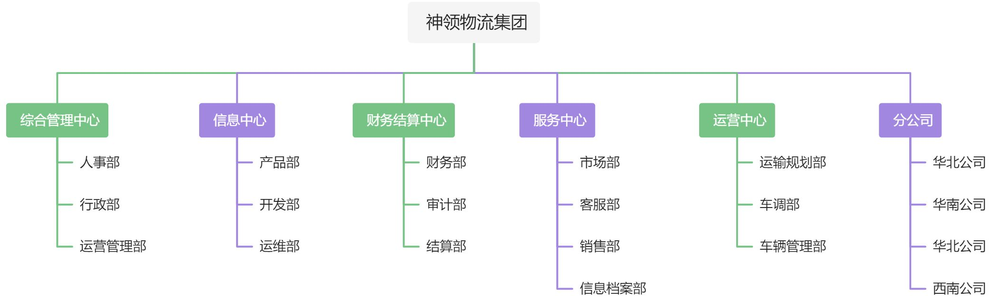

Java开发人员所在的一级部门为信息中心，主要负责集团新系统的研发、维护、更新迭代。信息中心下设3个2级部门，产品部、运维部以及开发部门，开发部门总计42人，按照以业务线划分为4个组、TMS项目组之外、WMS项目组、OMS项目、CRM组。

TMS(Transportation Management System 运输管理系统) 项目组目前共8人，其中前端3人，后端5人。后端人员根据以下功能模块拆分进行任务分配，实际业务中也不可能是一人包打天下，分工合作才是常态化操作。

## 2.3、产品说明

神领物流系统类似顺丰速运，是向C端用户提供快递服务的系统。竞品有：顺丰、中通、圆通、京东快递等。
项目产品主要有4端产品：

- 用户端：基于微信小程序开发，外部客户使用，可以寄件、查询物流信息等。
- 快递员端：基于安卓开发的手机APP，公司内部的快递员使用，可以接收取派件任务等。
- 司机端：基于安卓开发的手机APP，公司内部的司机使用，可以接收运输任务、上报位置信息等。
- 后台系统管理：基于vue开发，PC端使用，公司内部管理员用户使用，可以进行基础数据维护、订单管理、运单管理等。

# 3、物流行业系统

从广度上来说，物流系统可以理解为由多个子系统组成，这里我们以一般综合型物流系统举例，在整体框架上可以分为仓储系统WMS、运配系统TMS、单据系统OMS和计费系统BMS。

这四大系统本质上解决了物流行业的四大核心问题：怎么存放、怎么运送、怎么跟进、怎么结算。

神领物流系统，是TMS运配系统，本质上解决的是怎样运送的问题。


# 4、系统架构和技术架构

## 4.1、系统架构

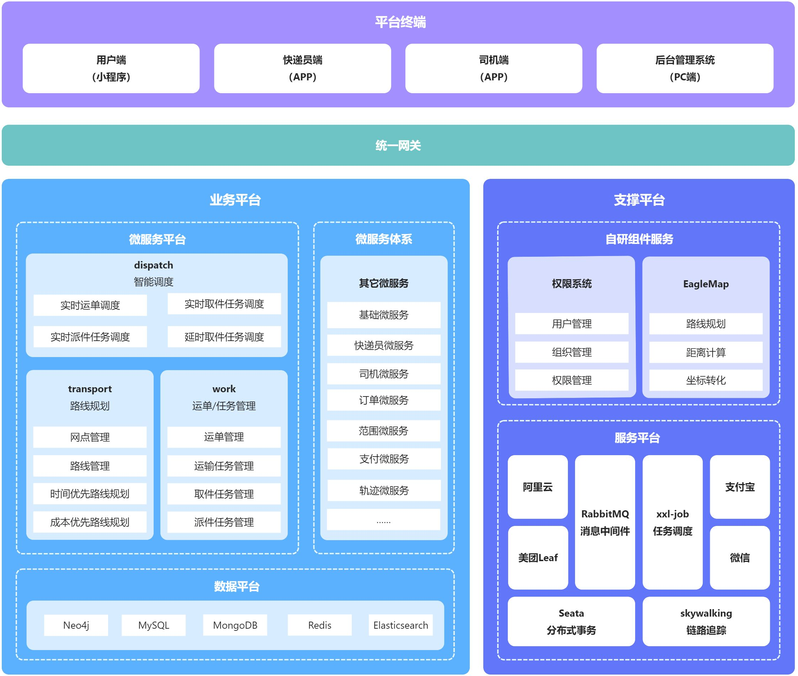

## 4.2、技术架构

下图展现了神领物流项目使用的主要的技术：


# 5、功能演示

## 5.1、需求文档

下面将演示四端的主要功能，更多的功能具体查看各端的需求文档。

| 用户端   | [https://share.lanhuapp.com/#/invite?sid=qx01hbI7](https://share.lanhuapp.com/#/invite?sid=qx01hbI7)      密码: UxGE |
| -------- | ------------------------------------------------------------ |
| 快递员端 | [https://share.lanhuapp.com/#/invite?sid=qxe42Dya](https://share.lanhuapp.com/#/invite?sid=qxe42Dya)     密码: Nomz |
| 司机端   | [https://share.lanhuapp.com/#/invite?sid=qX0NEmro](https://share.lanhuapp.com/#/invite?sid=qX0NEmro)   密码: yrzZ |
| 管理端   | [https://share.lanhuapp.com/#/invite?sid=qX0axVem](https://share.lanhuapp.com/#/invite?sid=qX0axVem)    密码: fh3i |

## 5.2、功能架构

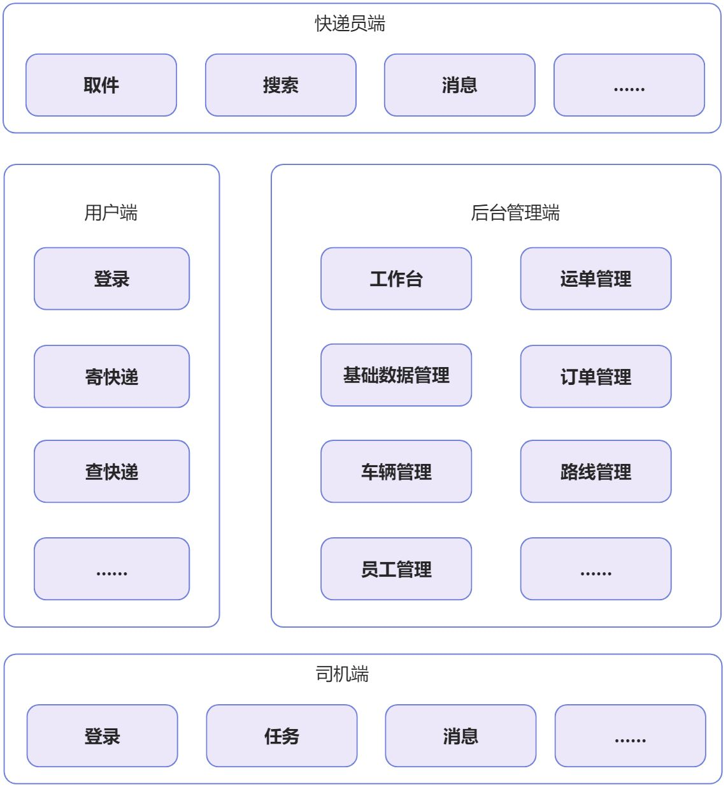

## 5.3、业务功能流程

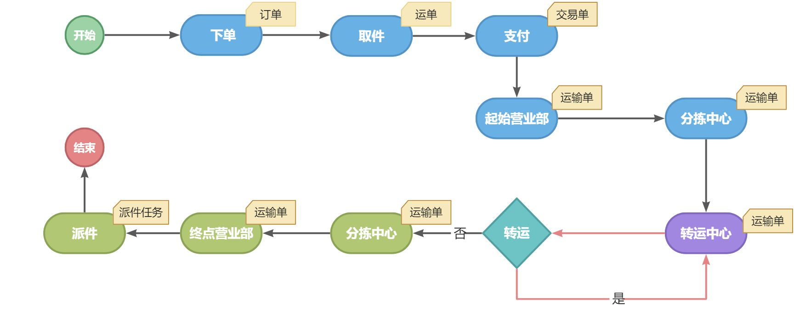

:::info
流程说明：

- 用户在**【用户端】**下单后，生成订单
- 系统会根据订单生成**【取件任务】**，快递员上门取件后成功后生成**【运单】**
- 用户对订单进行支付，会产生**【交易单】**
- 快件开始运输，会经历起始营业部、分拣中心、转运中心、分拣中心、终点营业部之间的转运运输，在此期间会有多个**【运输任务】**
- 到达终点网点后，系统会生成**【派件任务】**，快递员进行派件作业
- 最后，用户将进行签收或拒收操作
  :::

## 5.4、用户端

功能演示操作视频列表：

| 下单操作 | [点击查看](https://yjy-slwl-oss.oss-cn-hangzhou.aliyuncs.com/0c8fc60a-2cf5-4140-9592-124cb3352fd0.mp4) |
| -------- | ------------------------------------------------------------ |
| 取消订单 | [点击查看](https://yjy-slwl-oss.oss-cn-hangzhou.aliyuncs.com/efd2553b-69ab-4ec1-ad71-f0fd27c84165.mp4) |
| 地址簿   | [点击查看](https://yjy-slwl-oss.oss-cn-hangzhou.aliyuncs.com/1fcbdd1e-70bc-461c-9b0e-60ec75edbabb.mp4) |


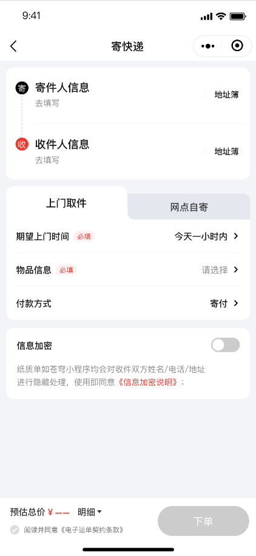
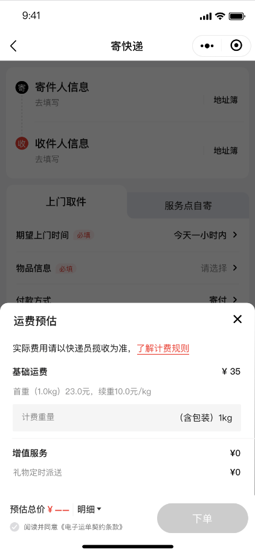
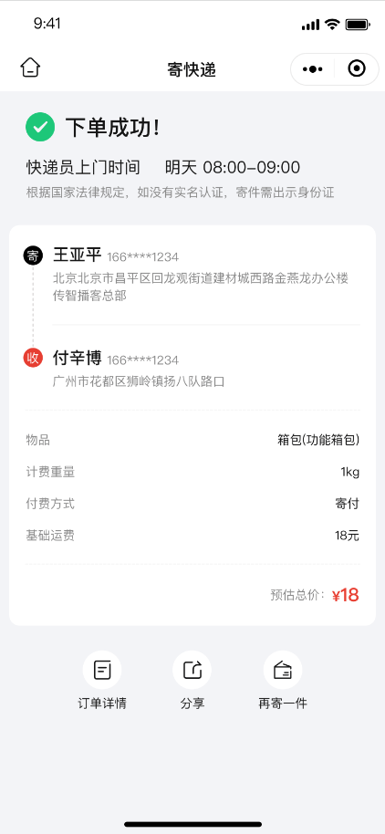

## 5.5、快递员端

功能演示操作视频列表：

| 派件操作流程     | [点击查看](https://yjy-slwl-oss.oss-cn-hangzhou.aliyuncs.com/7bb3000d-69b8-473f-9d6b-d391b8c28a9f.mp4) |
| ---------------- | ------------------------------------------------------------ |
| 取件操作流程     | [点击查看](https://yjy-slwl-oss.oss-cn-hangzhou.aliyuncs.com/7767cda8-8e83-4c5c-a976-634815ec0a10.mp4) |
| 全部取派操作流程 | [点击查看](https://outin-ffd84744973f11eb806300163e038793.oss-cn-beijing.aliyuncs.com/sv/605f258-1844feb861d/605f258-1844feb861d.mp4) |
| 搜索操作流程     | [点击查看](https://outin-ffd84744973f11eb806300163e038793.oss-cn-beijing.aliyuncs.com/sv/60a0b1bf-1845000a4d0/60a0b1bf-1845000a4d0.mp4) |
| 消息操作流程     | [点击查看](https://outin-ffd84744973f11eb806300163e038793.oss-cn-beijing.aliyuncs.com/sv/38c12638-18450c563db/38c12638-18450c563db.mp4) |

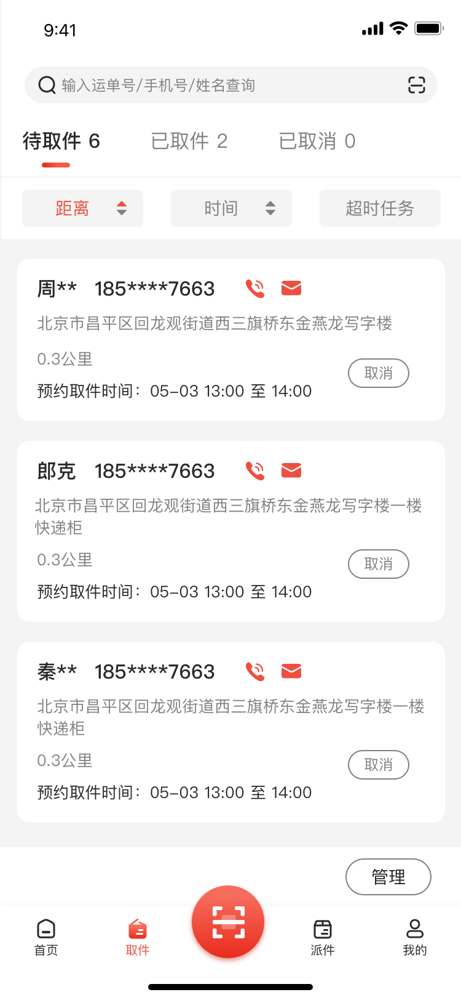
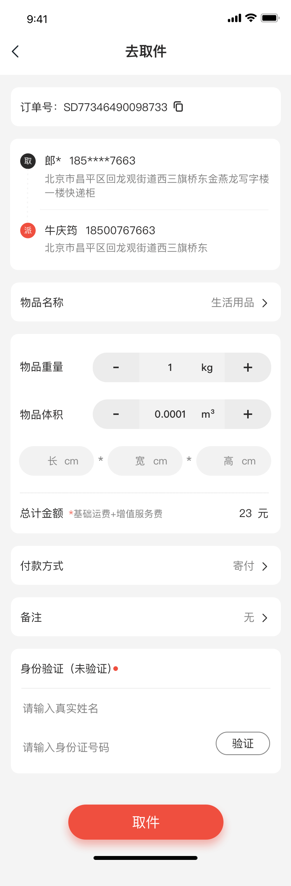
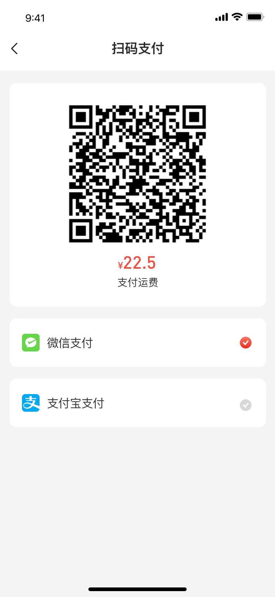
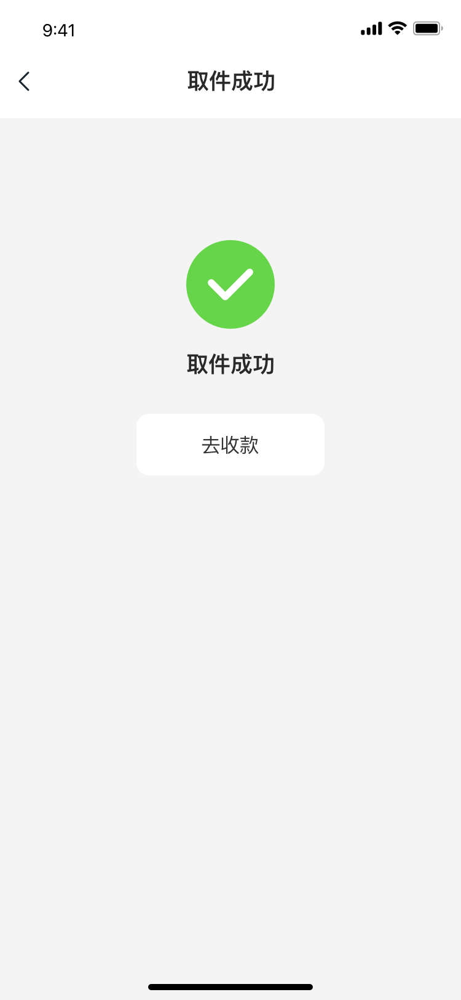

## 5.6、司机端

[点击查看演示视频](https://outin-ffd84744973f11eb806300163e038793.oss-cn-beijing.aliyuncs.com/sv/4ffdd092-184501a12ff/4ffdd092-184501a12ff.mp4)
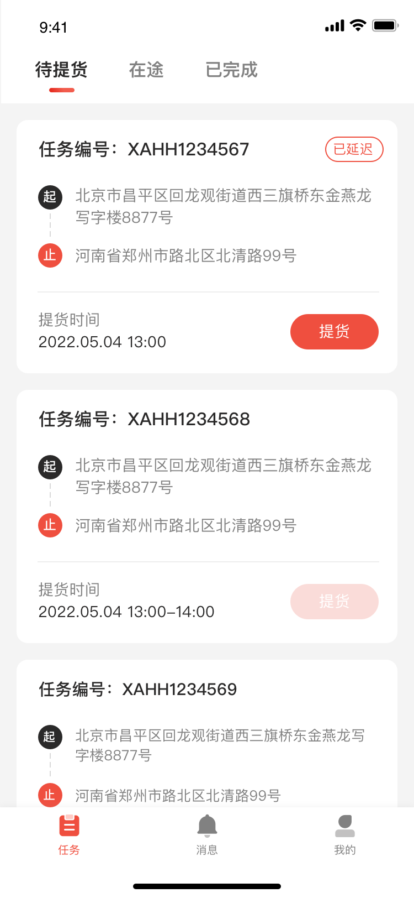
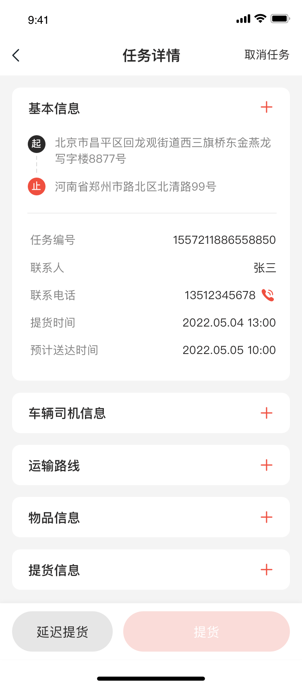
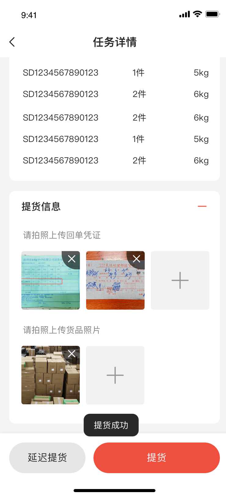
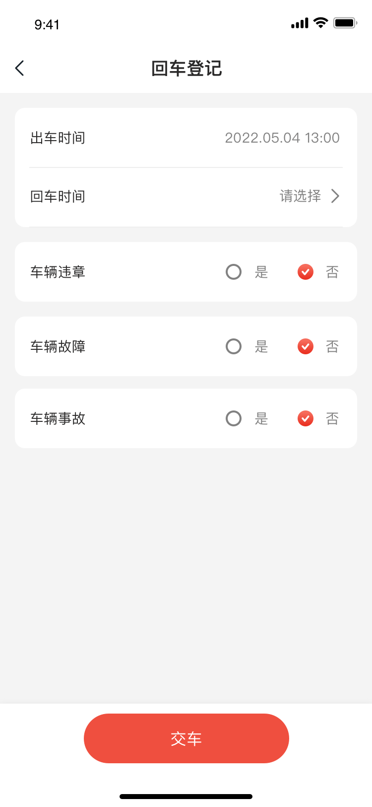
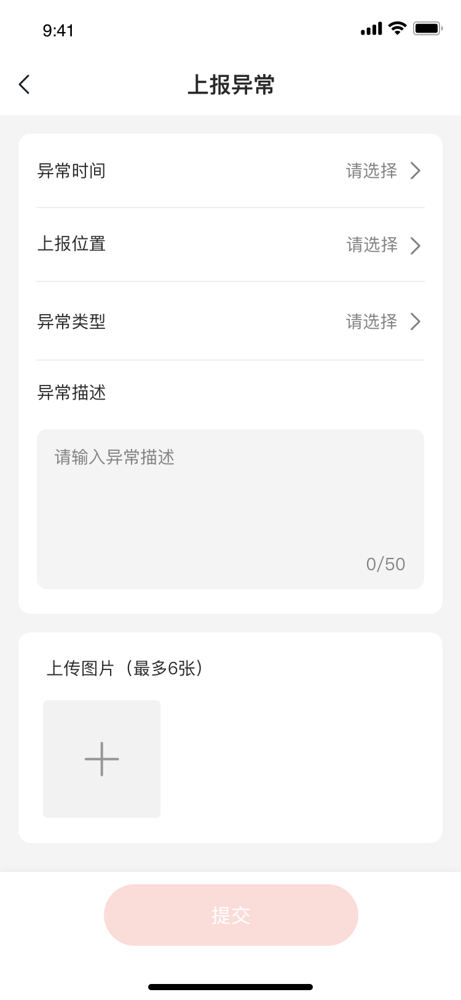

## 5.7、后台管理系统

功能演示操作视频列表：

| 建立机构     | [点击查看](https://yjy-slwl-oss.oss-cn-hangzhou.aliyuncs.com/44443260-b57f-41f8-a1f2-22c44b1c16c1.mp4) |
| ------------ | ------------------------------------------------------------ |
| 新建员工     | [点击查看](https://yjy-slwl-oss.oss-cn-hangzhou.aliyuncs.com/ab24e727-9c1f-458c-a8c3-b2d3cbfce46d.mp4) |
| 绘制作业范围 | [点击查看](https://yjy-slwl-oss.oss-cn-hangzhou.aliyuncs.com/9a1e3679-38eb-4585-b41b-7d9277dc1da0.mp4) |
| 新建线路     | [点击查看](https://yjy-slwl-oss.oss-cn-hangzhou.aliyuncs.com/cd62d82c-7910-4df0-835b-08854ecb0e79.mp4) |
| 启用车辆     | [点击查看](https://yjy-slwl-oss.oss-cn-hangzhou.aliyuncs.com/5d8adc94-201f-43ee-8ef1-7906e5d8f272.mp4) |

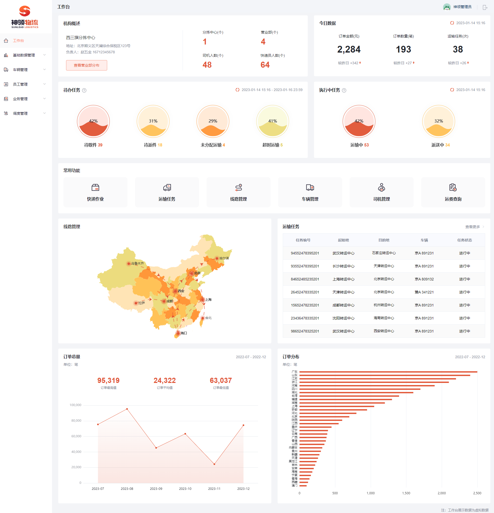
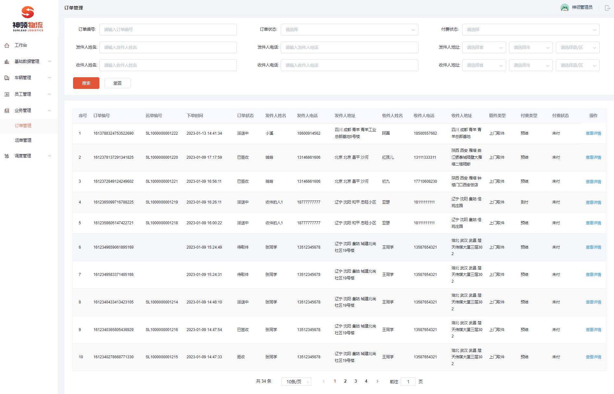
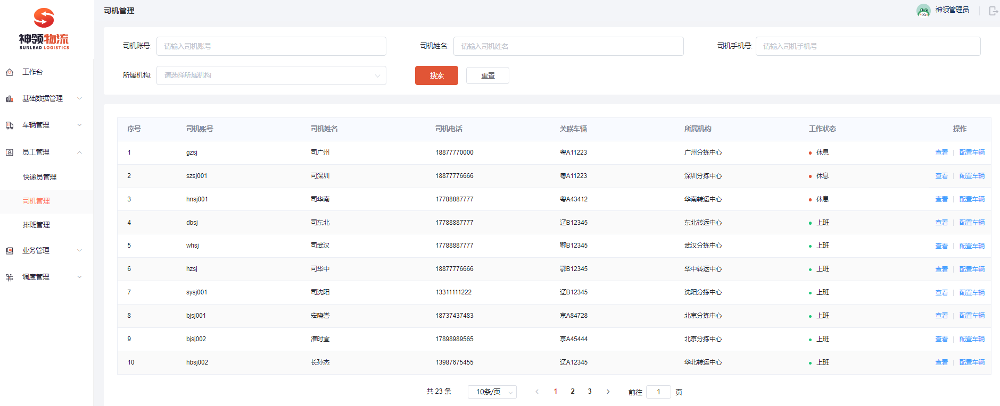
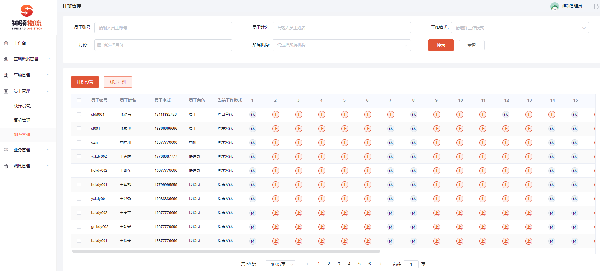
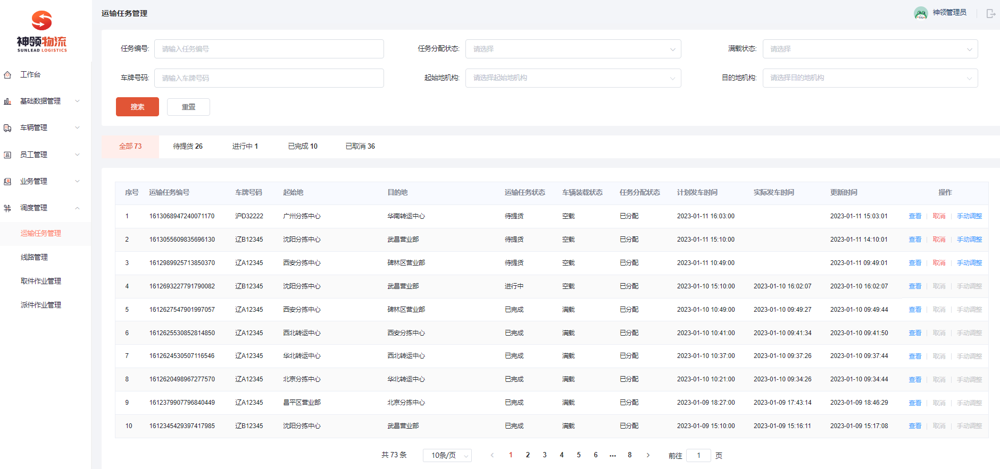
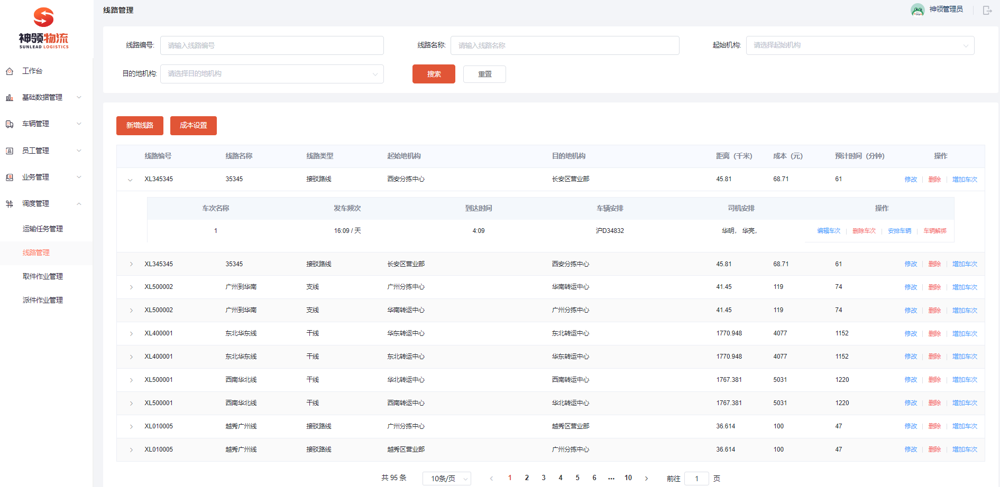
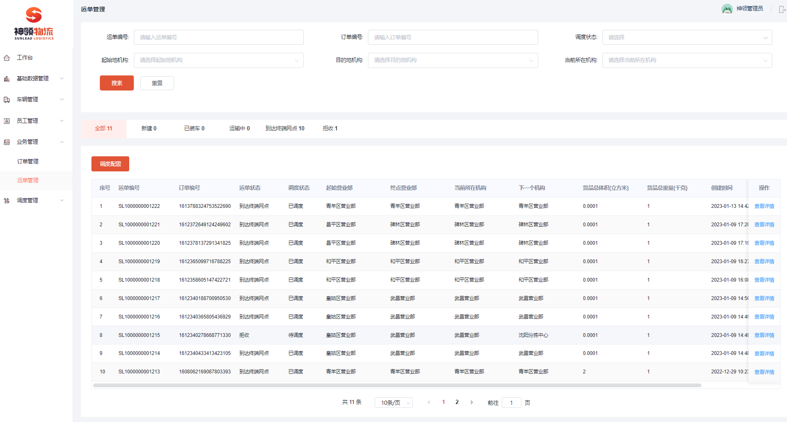
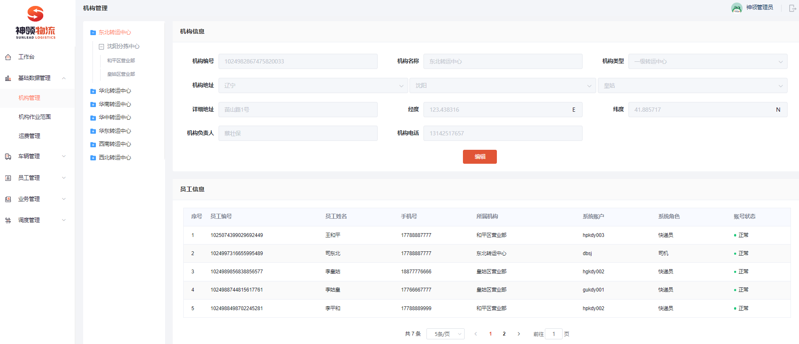
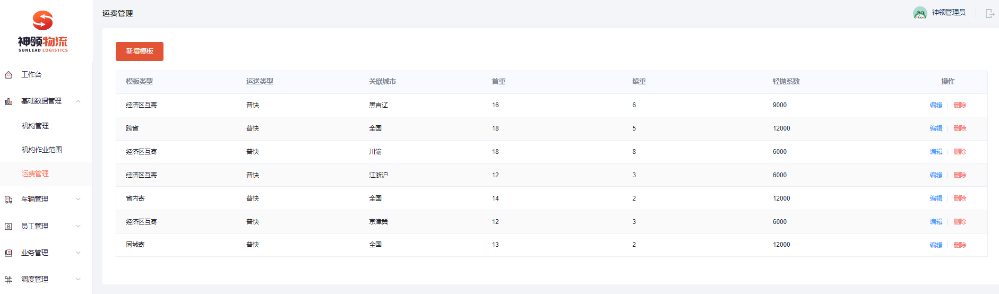

# 6、开发环境

## 6.1、开发模式

在神领物流开发团队中，采用了分组协作开发的模式，整个开发团队分为5个小组，每个小组4~5人，不同的分组负责不同的微服务。

开发环境分为本地开发环境、测试环境、生成环境：

- **本地开发环境：**自己的电脑环境
- **测试环境：**在内网中搭建的一套大家都可以访问使用的环境
- **生成环境：**最终给用户使用的环境

## 6.2、团队分工

目前神领物流项目拥有**19**个微服务，**1**个网关，**1**个parent工程，**2**个公共依赖工程，这些工程由上述的**5**个小组共同维护开发。

**新入职的你，加入到了开发一组。**

| 开发组/负责模块                                              | 开发一组 | 开发二组 | 开发三组 | 开发四组 | 开发五组 | 说明           |
| ------------------------------------------------------------ | -------- | -------- | -------- | -------- | -------- | -------------- |
| [sl-express-parent](http://git.sl-express.com/sl/sl-express-parent.git) | ●        |          |          |          |          | 父工程         |
| [sl-express-common](http://git.sl-express.com/sl/sl-express-common.git) | ●        |          |          |          |          | 通用工程       |
| [sl-express-mq](http://git.sl-express.com/sl/sl-express-mq.git) | ●        |          |          |          |          | 统一消息代码   |
| [sl-express-gateway](http://git.sl-express.com/sl/sl-express-gateway.git) | ●        |          |          |          |          | 网关           |
| [sl-express-ms-base](http://git.sl-express.com/sl/sl-express-ms-base-service.git) | ●        |          |          |          |          | 基础微服务     |
| [sl-express-ms-carriage](http://git.sl-express.com/sl/sl-express-ms-carriage-service.git) |          | ●        |          |          |          | 运费微服务     |
| [sl-express-ms-courier](http://git.sl-express.com/sl/sl-express-ms-courier-service.git) |          | ●        |          |          |          | 快递员微服务   |
| [sl-express-ms-dispatch](http://git.sl-express.com/sl/sl-express-ms-dispatch-service.git) |          |          | ●        |          |          | 调度微服务     |
| [sl-express-ms-driver](http://git.sl-express.com/sl/sl-express-ms-driver-service.git) |          |          |          | ●        |          | 司机微服务     |
| [sl-express-ms-oms](http://git.sl-express.com/sl/sl-express-ms-oms-service.git) |          | ●        |          |          |          | 订单微服务     |
| [sl-express-ms-service-scope](http://git.sl-express.com/sl/sl-express-ms-service-scope-service.git) |          |          |          | ●        |          | 服务范围微服务 |
| [sl-express-ms-sms](http://git.sl-express.com/sl/sl-express-ms-sms-service.git) |          |          |          | ●        |          | 短信微服务     |
| [sl-express-ms-track](http://git.sl-express.com/sl/sl-express-ms-track-service.git) |          | ●        |          |          |          | 轨迹微服务     |
| [sl-express-ms-trade](http://git.sl-express.com/sl/sl-express-ms-trade-service.git) |          |          | ●        |          |          | 支付微服务     |
| [sl-express-ms-transport](http://git.sl-express.com/sl/sl-express-ms-transport-service.git) |          |          | ●        |          |          | 路线微服务     |
| [sl-express-ms-transport-info](http://git.sl-express.com/sl/sl-express-ms-transport-info-service.git) |          |          | ●        |          |          | 物流信息微服务 |
| [sl-express-ms-user](http://git.sl-express.com/sl/sl-express-ms-user-service.git) |          |          |          |          | ●        | 用户微服务     |
| [sl-express-ms-web-courier](http://git.sl-express.com/sl/sl-express-ms-web-courier.git) |          | ●        |          |          |          | 快递员web服务  |
| [sl-express-ms-web-customer](http://git.sl-express.com/sl/sl-express-ms-web-customer.git) |          |          |          |          | ●        | 用户web服务    |
| [sl-express-ms-web-driver](http://git.sl-express.com/sl/sl-express-ms-web-driver.git) |          |          |          | ●        |          | 司机web服务    |
| [sl-express-ms-web-manager](http://git.sl-express.com/sl/sl-express-ms-web-manager.git) |          |          |          |          | ●        | 后台web服务    |
| [sl-express-ms-work](http://git.sl-express.com/sl/sl-express-ms-work-service.git) |          |          | ●        |          |          | 运单微服务     |
| [sl-express-ms-search](http://git.sl-express.com/sl/sl-express-ms-search-service.git) |          |          |          |          | ●        | 搜索微服务     |

:::info
**思考：**是否需要把所有的工程代码都拉取到本地进行编译运行？

不需要的。你只需要将自己将要负责的开发任务相关的代码拉取到本地进行开发即可，其他的服务都可以调用测试环境正在运行的服务。

 另外，你有可能是没有权限拉取到其他开发组的代码的。
:::

微服务间调用关系如下：
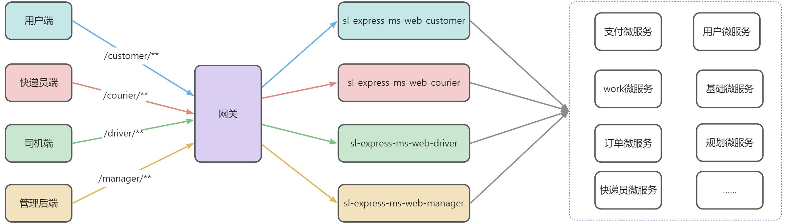

> 可以看到，四个端的请求都会统一进入网关，再分发到对应的四个web微服务，再由web微服务请求其他微服务完成业务。


[查看微服务间的依赖关系](https://sl-express.itheima.net/#/zh-cn/modules/%E7%A5%9E%E9%A2%86%E7%89%A9%E6%B5%81%E5%BE%AE%E6%9C%8D%E5%8A%A1%E4%BE%9D%E8%B5%96%E5%85%B3%E7%B3%BB)

## 6.3、软件环境

为了模拟企业中的开发环境，所以我们需要通过VMware导入linux虚拟机，该虚拟机中已经安装了课程中所需要的各种环境，包括，git、maven私服、Jenkins、MySQL、RabbitMQ等。

:::info
关于JDK版本的说明：神领物流项目使用的JDK版本为11，需要同学们统一下环境，JDK11的安装包在资料中有提供。
目录：资料\软件包\jdk-11.0.15.1_windows-x64_bin.exe
:::

> 🔔关闭本地开发环境的防火墙（很重要！）

### 6.3.1、导入虚拟机

具体参考文档：[虚拟机导入手册](https://www.yuque.com/zhangzhijun-91vgw/xze2gr/gav9r8x8kvd2eyxg)
:::danger
注意：只要按照文档导入虚拟机即可，其他软件无需自己安装，都已经安装了，并且开机自启。
:::
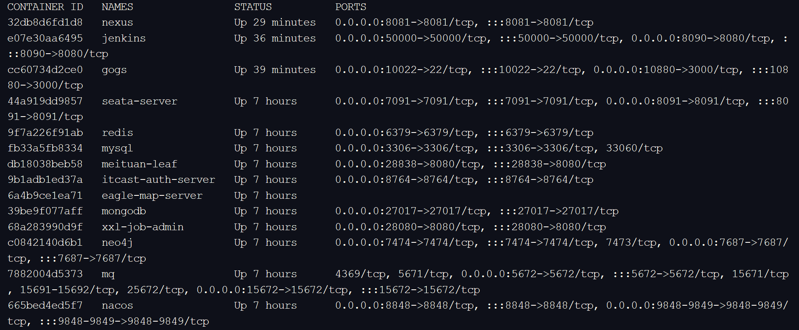
:::info
通过dps命令可以查询上述列表，dps是自定义命令。
自定义命令方法如下：
:::

```shell
vim ~/.bashrc

#增加如下内容
alias dps='docker ps --format "table{{.ID}}\t{{.Names}}\t{{.Status}}\t{{.Ports}}"'
#保存退出

#生效
source ~/.bashrc
```

### 6.3.2、配置本机hosts

在本机hosts文件中设置如下配置：

```shell
192.168.150.101 git.sl-express.com
192.168.150.101 maven.sl-express.com
192.168.150.101 jenkins.sl-express.com
192.168.150.101 auth.sl-express.com
192.168.150.101 rabbitmq.sl-express.com
192.168.150.101 nacos.sl-express.com
192.168.150.101 neo4j.sl-express.com
192.168.150.101 xxl-job.sl-express.com
192.168.150.101 eaglemap.sl-express.com
192.168.150.101 seata.sl-express.com
192.168.150.101 skywalking.sl-express.com
192.168.150.101 api.sl-express.com
192.168.150.101 admin.sl-express.com
```

打开浏览器测试：[http://git.sl-express.com/](http://git.sl-express.com/)
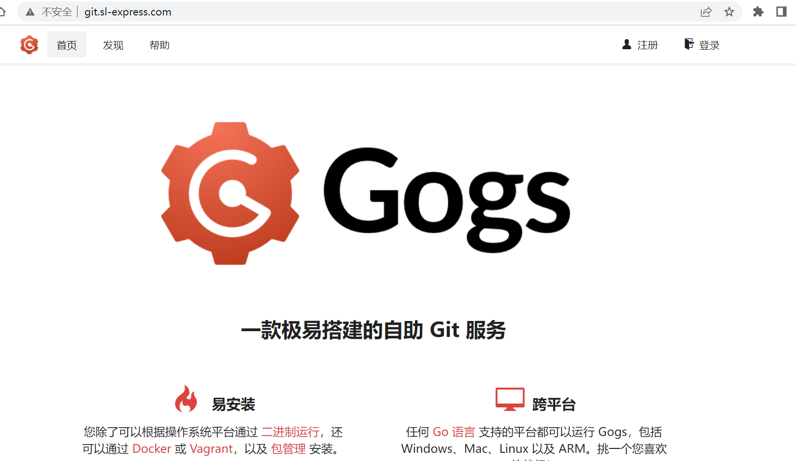

看到这个页面就说明hosts已经生效。（也可以再试试其他的，比如：maven私服、jenkins等）

### 6.3.3、服务列表

:::danger
说明：如果通过域名访问，无需设置端口。
:::

| 名称       | 地址                                                         | 用户名/密码    | 端口  |
| ---------- | ------------------------------------------------------------ | -------------- | ----- |
| git        | [http://git.sl-express.com/](http://git.sl-express.com/)     | sl/sl123       | 10880 |
| maven      | [http://maven.sl-express.com/nexus/](http://maven.sl-express.com/nexus/) | admin/admin123 | 8081  |
| jenkins    | [http://jenkins.sl-express.com/](http://jenkins.sl-express.com/) | root/123       | 8090  |
| 权限管家   | [http://auth.sl-express.com/api/authority/static/index.html](http://auth.sl-express.com/api/authority/static/index.html) | admin/123456   | 8764  |
| RabbitMQ   | [http://rabbitmq.sl-express.com/](http://rabbitmq.sl-express.com/) | sl/sl321       | 15672 |
| MySQL      | -                                                            | root/123       | 3306  |
| nacos      | [http://nacos.sl-express.com/nacos/](http://nacos.sl-express.com/nacos/) | nacos/nacos    | 8848  |
| neo4j      | [http://neo4j.sl-express.com/browser/](http://neo4j.sl-express.com/browser/) | neo4j/neo4j123 | 7474  |
| xxl-job    | [http://xxl-job.sl-express.com/xxl-job-admin](http://xxl-job.sl-express.com/xxl-job-admin) | admin/123456   | 28080 |
| EagleMap   | [http://eaglemap.sl-express.com/](http://eaglemap.sl-express.com/) | eagle/eagle    | 8484  |
| seata      | [http://seata.sl-express.com/](http://seata.sl-express.com/) | seata/seata    | 7091  |
| Gateway    | [http://api.sl-express.com/](http://api.sl-express.com/)     | -              | 9527  |
| admin      | [http://admin.sl-express.com/](http://admin.sl-express.com/) | -              | 80    |
| skywalking | [http://skywalking.sl-express.com/](http://skywalking.sl-express.com/) | -              | 48080 |
| Redis      | -                                                            | 123321         | 6379  |
| MongoDB    | -                                                            | sl/123321      | 27017 |

### 6.3.4、配置Maven私服

在本地的maven（建议版本为3.6.x）配置中配置上述的私服，配置文件参考如下：
settings.xml文件：

```xml
<?xml version="1.0" encoding="UTF-8"?>
<settings
        xmlns="http://maven.apache.org/SETTINGS/1.0.0"
        xmlns:xsi="http://www.w3.org/2001/XMLSchema-instance"
        xsi:schemaLocation="http://maven.apache.org/SETTINGS/1.0.0 http://maven.apache.org/xsd/settings-1.0.0.xsd">

    <!-- 本地仓库 -->
    <localRepository>F:\maven\repository</localRepository>

    <!-- 配置私服中deploy的账号 -->
    <servers>
        <server>
            <id>sl-releases</id>
            <username>deployment</username>
            <password>deployment123</password>
        </server>
        <server>
            <id>sl-snapshots</id>
            <username>deployment</username>
            <password>deployment123</password>
        </server>
    </servers>

    <!-- 使用阿里云maven镜像，排除私服资源库 -->
    <mirrors>
        <mirror>
            <id>mirror</id>
            <mirrorOf>central,jcenter,!sl-releases,!sl-snapshots</mirrorOf>
            <name>mirror</name>
            <url>https://maven.aliyun.com/nexus/content/groups/public</url>
        </mirror>
    </mirrors>

    <profiles>
        <profile>
            <id>sl</id>
            <!-- 配置项目deploy的地址 -->
            <properties>
                <altReleaseDeploymentRepository>
                    sl-releases::default::http://maven.sl-express.com/nexus/content/repositories/releases/
                </altReleaseDeploymentRepository>
                <altSnapshotDeploymentRepository>
                    sl-snapshots::default::http://maven.sl-express.com/nexus/content/repositories/snapshots/
                </altSnapshotDeploymentRepository>
            </properties>
            <!-- 配置项目下载依赖的私服地址 -->
            <repositories>
                <repository>
                    <id>sl-releases</id>
                    <url>http://maven.sl-express.com/nexus/content/repositories/releases/</url>
                    <releases>
                        <enabled>true</enabled>
                    </releases>
                    <snapshots>
                        <enabled>false</enabled>
                    </snapshots>
                </repository>
                <repository>
                    <id>sl-snapshots</id>
                    <url>http://maven.sl-express.com/nexus/content/repositories/snapshots/</url>
                    <releases>
                        <enabled>false</enabled>
                    </releases>
                    <snapshots>
                        <enabled>true</enabled>
                    </snapshots>
                </repository>
            </repositories>
        </profile>
    </profiles>

    <activeProfiles>
         <!-- 激活配置 -->
        <activeProfile>sl</activeProfile>
    </activeProfiles>

</settings>
```

### 6.3.5、服务版本

| **服务名**        | **版本号**   |
| ----------------- | ------------ |
| sl-express-parent | 1.4          |
| sl-express-common | 1.2-SNAPSHOT |
| 其他微服务        | 1.1-SNAPSHOT |

# 7、开发任务

## 7.1、任务描述

接下来是你加入到开发一组后接到的第一个任务，具体内容是：
后台管理系统只允许管理员登录，非管理员（司机或快递员）是没有权限登录的，现在的情况是，任何角色的人都能登录到后台管理系统，应该是当非管理员登录时需要提示没有权限。
这个可以算是一个bug修复的工作。接下来，你需要思考下，该如何解决这个问题。

解决步骤：

- 先确定鉴权工作是在哪里完成的 
  - 通过前面的系统架构，可以得知是在网关中完成的
- 拉取到网关的代码
- 阅读鉴权的业务逻辑
- 了解权限系统
- 动手编码解决问题
- 部署，功能测试

### 7.1.1、部署后台管理系统

后台管理系统的部署是使用101机器的Jenkins部署的，具体参考[前端部署文档](https://www.yuque.com/zhangzhijun-91vgw/xze2gr/rhyie35xipdqk9dg)。部署完成后，就可以看到登录页面。
地址：[http://admin.sl-express.com/](http://admin.sl-express.com/)
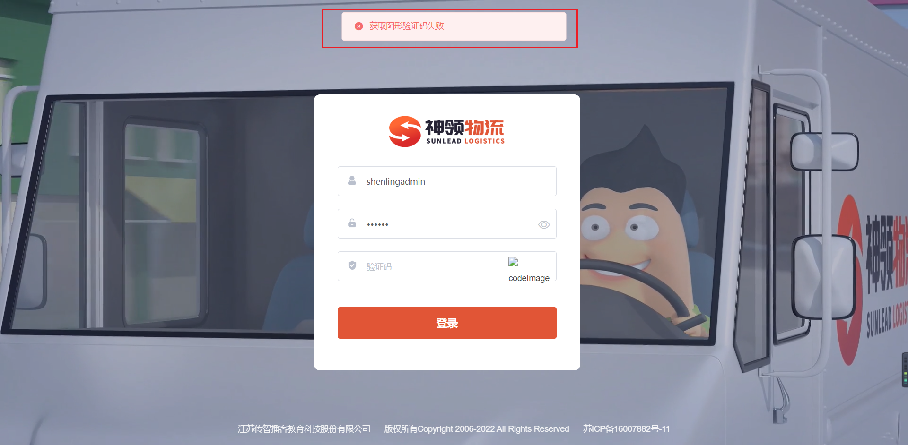
可以看到这个页面是可以正常访问，只是没有获取到验证码，是因为验证码的获取是需要后端服务支撑的，目前并没有启动后端服务。

### 7.1.2、部署后端服务

后端服务需要启动如下几个服务：

目前，只启动了`itcast-auth-server`，其他均未启动：
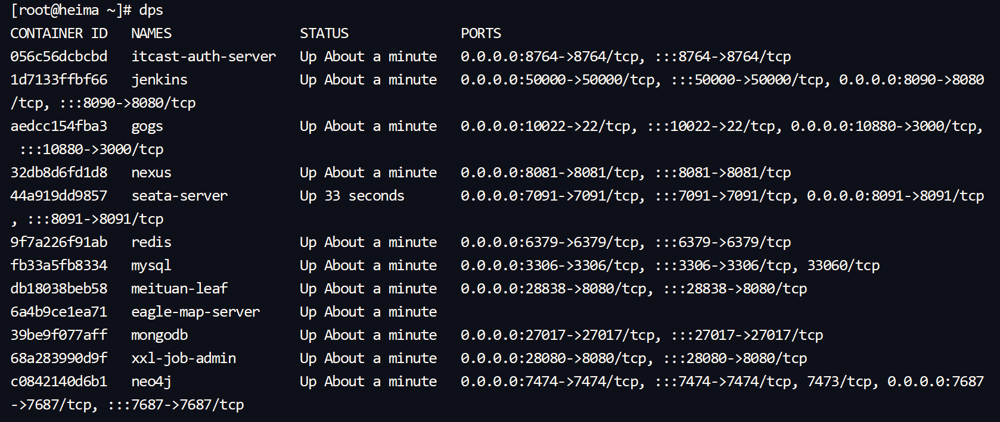
所以需要在Jenkins中，依次启动这几个服务，类似如下构建（需要找到对应的构建任务进行构建）：
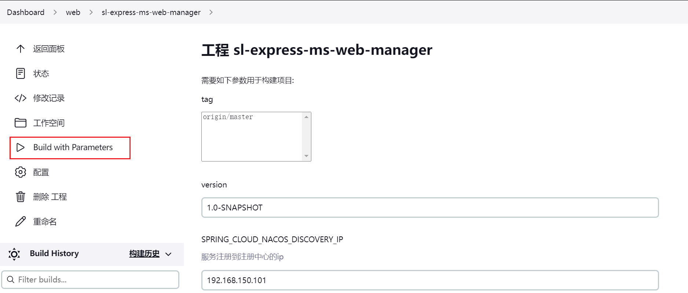

启动完成：
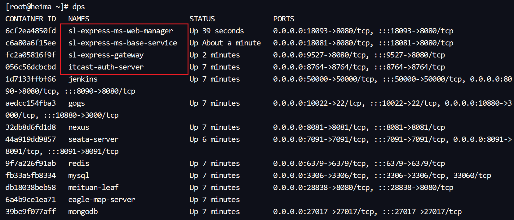
在nacos中已经完成了服务的注册：
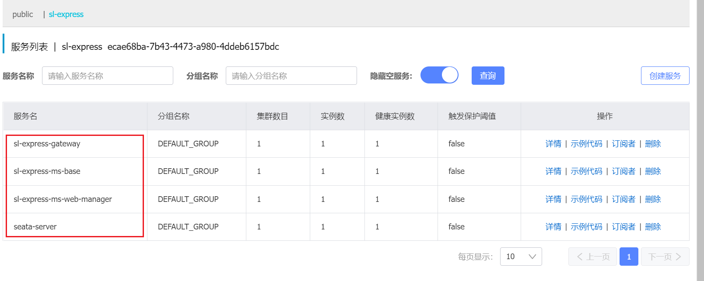

### 7.1.3、测试

刷新后台管理系统页面，即可成功看到验证码，说明所需要的服务已经启动完成了。
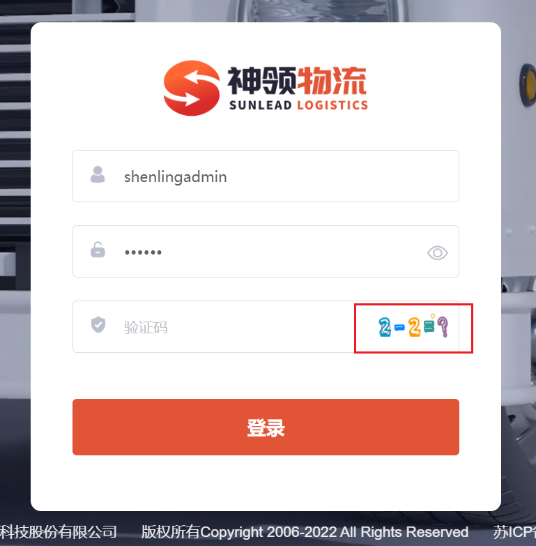
使用默认账号，shenlingadmin/123456 即可完成登录：
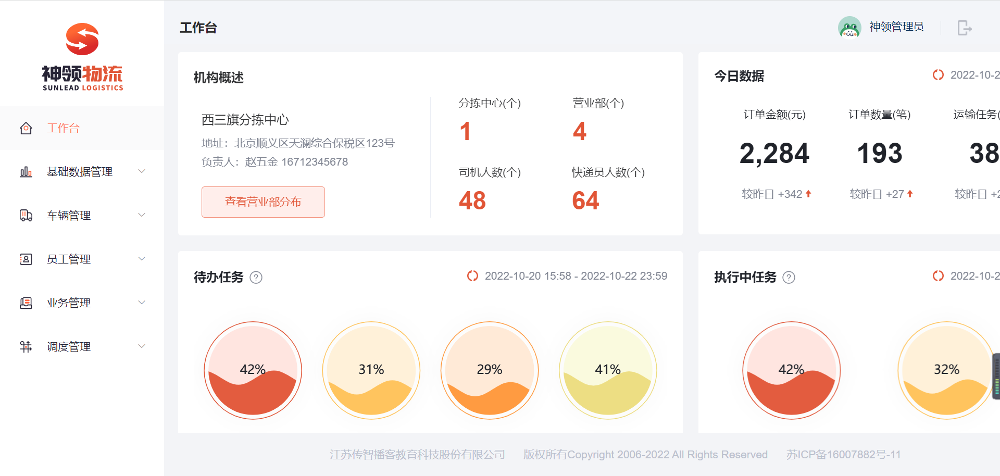

使用非管理员账号进行测试，例如：gzsj/123456 （司机账号） 或  hdkdy001/123456 （快递员账号） 进行测试，发现依然是可以登录的。
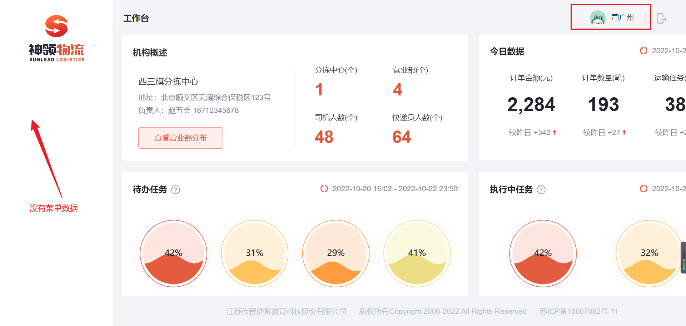
这样，这个问题就重现了。

## 7.2、拉取代码

拉取代码步骤：

- 在本地创建 sl-express 文件夹，该目录存放项目课程期间所有的代码
- 启动idea，打开该目录
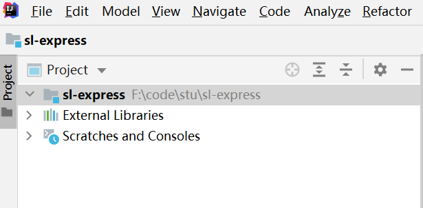
- 登录 [git](http://git.sl-express.com/) 服务，找到 sl-express-gateway 工程，拷贝地址，在idea中拉取代码（注意存储路径）
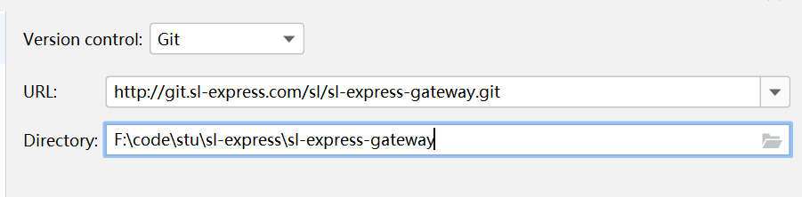
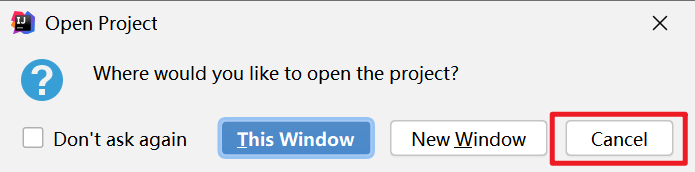
- 拉取到代码后，设置jdk版本为11
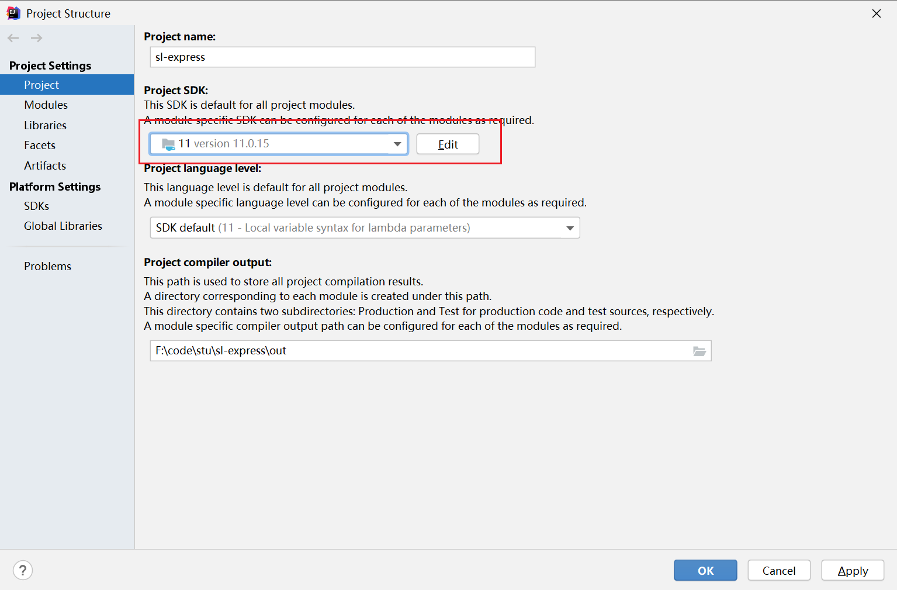
- 添加modules，将sl-express-gateway加入进来
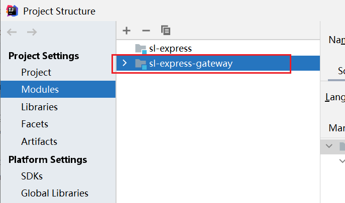
- 成功拉取代码
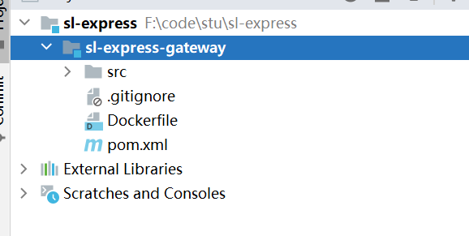
- 说明：该工程会依赖 sl-express-parent，此maven依赖是通过[私服](http://maven.sl-express.com/nexus/)拉取到的。

## 7.3、权限管家

在神领物流项目中，快递员、司机、管理人员都是在权限管家中进行管理的，所以他们的登录都是需要对接权限管家完成的。

具体权限管家的介绍说明参见：[权限管家使用说明](https://www.yuque.com/zhangzhijun-91vgw/xze2gr/pseyizoo073plvox)

## 7.4、测试用户登录

前面已经了解了权限管家，接下来我们将基于权限管家在`sl-express-gateway`中进行测试用户的登录以及对于token的校验。

### 7.4.1、依赖说明

对接权限管家需要引入依赖：

```xml
<dependency>
    <groupId>com.itheima.em.auth</groupId>
    <artifactId>itcast-auth-spring-boot-starter</artifactId>
</dependency>
```

:::info
该依赖已经导入，并且在parent中指定了版本号。

该依赖已经上传到maven中央仓库，可以直接下载，地址：[https://mvnrepository.com/artifact/com.itheima.em.auth/itcast-auth-spring-boot-starter](https://mvnrepository.com/artifact/com.itheima.em.auth/itcast-auth-spring-boot-starter)
:::

### 7.4.2、解读配置

在bootstrap-local.yml配置文件中配置了nacos配置中心，一些参数存放到了nacos中，这些参数一般都是不同环境不一样配置的。

sl-express-gateway.properties如下：

```properties
#权限系统的配置
authority.host = 192.168.150.101
authority.port = 8764
authority.timeout = 10000
#应用id
authority.applicationId = 981194468570960001

#角色id
role.manager = 986227712144197857,989278284569131905,996045142395786081,996045927523359809
#快递员角色
role.courier = 989559057641637825
#司机角色
role.driver = 989559028277315009

#RSA公钥
sl.jwt.public-key = MIGfMA0GCSqGSIb3DQEBAQUAA4GNADCBiQKBgQDC6of/EqnM2008gRpFAJJd3iGF5o6P6SuJOcKq4iJQ+62EF4WKGIGQunJjPwVNQFqDuT7ko9bRFZNnMba9A5GrFELtAK7tzO9l19JgFcCBQoU3J6ehPCCunRKz52qJuzS0yiJp0dbB2i6cb7mSCftwZavmcpzhsBaOGQd23AnAmQIDAQAB
```

其中applicationId、角色id都是需要在权限系统中找到。

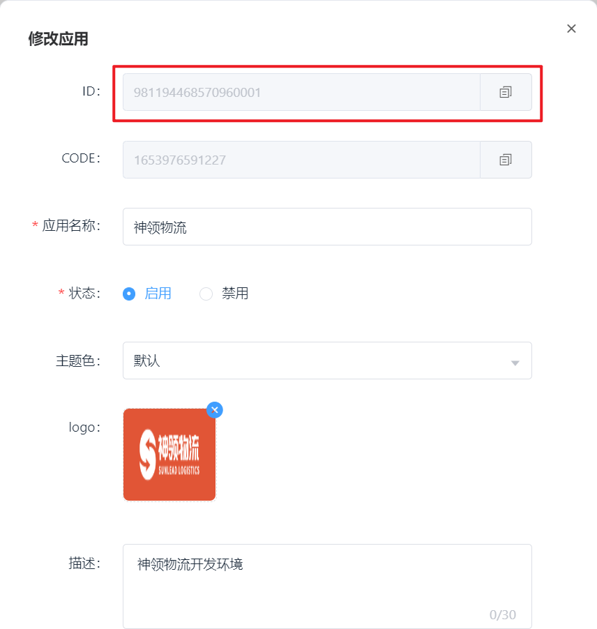

角色id需要在数据库表中查询，表为：itcast_auth.itcast_auth_role
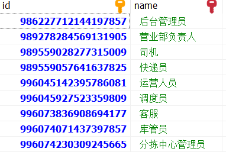

### 7.4.3、测试

测试用例在AuthTemplateTest中：

```java
    @Test
    public void testLogin() {
        //登录
        Result<LoginDTO> result = this.authTemplate.opsForLogin()
                .token("shenlingadmin", "123456");

        String token = result.getData().getToken().getToken();
        System.out.println("token为：" + token);

        UserDTO user = result.getData().getUser();
        System.out.println("user信息：" + user);

        //查询角色
        Result<List<Long>> resultRole = AuthTemplateFactory.get(token).opsForRole()
                .findRoleByUserId(user.getId());
        System.out.println(resultRole);
    }
```

token校验测试：

```java
    @Test
    public void checkToken() {
        String token = "xxx.xx.xxx"; //上面方法中生成的token
        AuthUserInfoDTO authUserInfo = this.tokenCheckService.parserToken(token);
        System.out.println(authUserInfo);

        System.out.println(JSONUtil.toJsonStr(authUserInfo));
    }
```

:::danger
**说明：**权限管家生成的token采用的是RSA非对称加密方式，项目中配置的公钥一定要与权限系统中使用的公钥一致，否则会出现无法校验token的情况。
:::
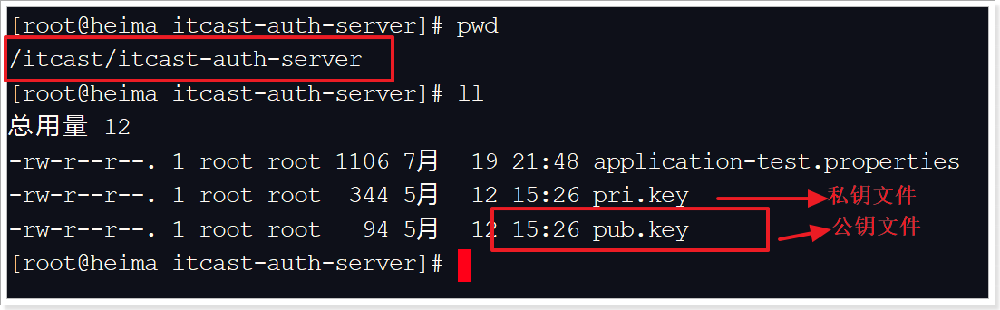
项目中的公钥文件：
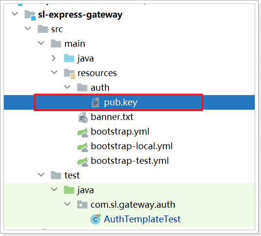

## 7.5、阅读鉴权代码

### 7.5.1、整体流程

首先需要明确的一点是四个终端都是通过`sl-express-gateway`进行验证与鉴权的，下面以管理员请求流程为例，其他的流程类似。
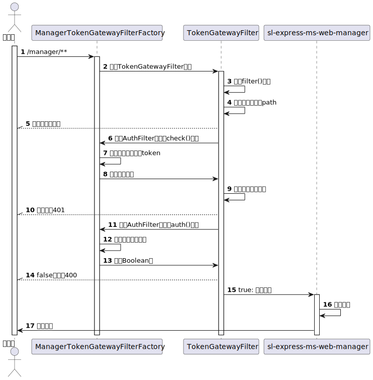
不同终端进入Gateway的请求路径是不一样的，并且不同的终端对于token的校验和鉴权逻辑是不一样的，所以需要在网关中对于各个终端创建不同的过滤器来实现。
请求路径如下：

- 快递员端：`/courier/**`
- 用户端：`/customer/**`
- 司机端：`/driver/**`
- 管理端：`/manager/**`

具体的配置文件内容如下：

```yaml
server:
  port: 9527
  tomcat:
    uri-encoding: UTF-8
    threads:
      max: 1000
      min-spare: 30
spring:
  cloud:
    nacos:
      username: nacos
      password: nacos
      server-addr: 192.168.150.101:8848
      discovery:
        namespace: ecae68ba-7b43-4473-a980-4ddeb6157bdc
        ip: 192.168.150.1
      config:
        namespace: ecae68ba-7b43-4473-a980-4ddeb6157bdc
    gateway:
      globalcors:
        cors-configurations:
          '[/**]':
            allowed-origin-patterns: "*"
            allowed-headers: "*"
            allow-credentials: true
            allowed-methods:
              - GET
              - POST
              - DELETE
              - PUT
              - OPTION
      discovery:
        locator:
          enabled: true #表明gateway开启服务注册和发现的功能，并且spring cloud gateway自动根据服务发现为每一个服务创建了一个router，这个router将以服务名开头的请求路径转发到对应的服务
      routes:
        - id: sl-express-ms-web-courier
          uri: lb://sl-express-ms-web-courier
          predicates:
            - Path=/courier/**
          filters:
            - StripPrefix=1
            - CourierToken
            - AddRequestHeader=X-Request-From, sl-express-gateway
        - id: sl-express-ms-web-customer
          uri: lb://sl-express-ms-web-customer
          predicates:
            - Path=/customer/**
          filters:
            - StripPrefix=1
            - CustomerToken
            - AddRequestHeader=X-Request-From, sl-express-gateway
        - id: sl-express-ms-web-driver
          uri: lb://sl-express-ms-web-driver
          predicates:
            - Path=/driver/**
          filters:
            - StripPrefix=1
            - DriverToken
            - AddRequestHeader=X-Request-From, sl-express-gateway
        - id: sl-express-ms-web-manager
          uri: lb://sl-express-ms-web-manager
          predicates:
            - Path=/manager/**
          filters:
            - StripPrefix=1
            - ManagerToken
            - AddRequestHeader=X-Request-From, sl-express-gateway
        - id: sl-express-ms-trade
          uri: lb://sl-express-ms-trade
          predicates:
            - Path=/trade/notify/**
          filters:
            - StripPrefix=1
            - AddRequestHeader=X-Request-From, sl-express-gateway
itcast:
  authority:
    host: ${authority.host} #authority服务地址,根据实际情况更改
    port: ${authority.port} #authority服务端口
    timeout: ${authority.timeout} #http请求的超时时间
    public-key-file: auth/pub.key
    applicationId: ${authority.applicationId}

#角色id
role:
  manager: ${role.manager}
  courier: ${role.courier}
  driver: ${role.driver}

sl:
  noAuthPaths:
    - /courier/login/account
    - /courier/swagger-ui.html
    - /courier/webjars/
    - /courier/swagger-resources
    - /courier/v2/api-docs
    - /courier/doc.html
    - /customer/user/login
    - /customer/user/refresh
    - /customer/swagger-ui.html
    - /customer/webjars/
    - /customer/swagger-resources
    - /customer/v2/api-docs
    - /customer/doc.html
    - /driver/login/account
    - /driver/swagger-ui.html
    - /driver/webjars/
    - /driver/swagger-resources
    - /driver/v2/api-docs
    - /driver/doc.html
    - /manager/login
    - /manager/webjars/
    - /manager/swagger-resources
    - /manager/v2/api-docs
    - /manager/doc.html
    - /manager/captcha
  jwt:
    public-key: ${sl.jwt.user-secret-key}
```

可以看到，在配置文件中配置了注册中心、cors跨域、自定义过滤器、自定义配置、白名单路径等信息。
其中，自定义过滤器配置了4个，与处理类对应关系如下：

- CourierToken **->** com.sl.gateway.filter.CourierTokenGatewayFilterFactory
- CustomerToken **->** com.sl.gateway.filter.CustomerTokenGatewayFilterFactory
- DriverToken **-> **com.sl.gateway.filter.DriverTokenGatewayFilterFactory
- ManagerToken **-> **com.sl.gateway.filter.ManagerTokenGatewayFilterFactory

在GatewayFilterFactory中，继承AbstractGatewayFilterFactory类，实现GatewayFilterFactory接口中的apply()方法，返回GatewayFilter对象，即可在filter()方法中实现具体的业务逻辑。
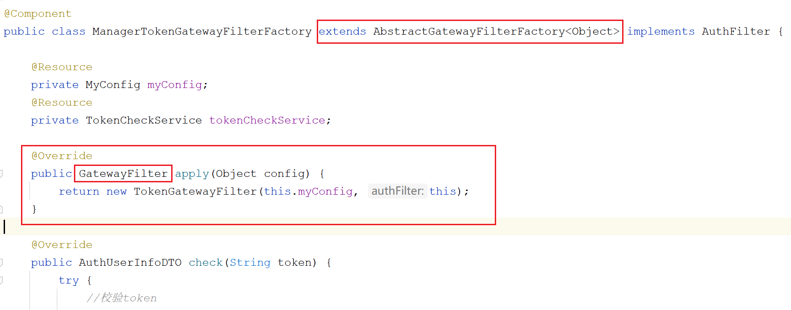
具体的业务逻辑，在自定义`TokenGatewayFilter`类中完成。
:::info
**❓思考：**
四个终端都共用`TokenGatewayFilter`类，而各个终端的校验逻辑是不一样的，该怎么做呢？
:::

### 7.5.3、TokenGatewayFilter

`TokenGatewayFilter`过滤器是整个项目中的校验/ 鉴权流程的具体实现，由于存在不同的终端，导致具体的校验和鉴权逻辑不一样，所以需要通过自定义接口`AuthFilter`实现，也就是4个端的`TokenGatewayFilterFactory`同时也需要实现`AuthFilter`接口。

在向下游服务转发请求时，会携带2个头信息，分别是userInfo和token，也就是会将用户信息和token传递下去。

```java
package com.sl.gateway.filter;

import cn.hutool.core.util.ObjectUtil;
import cn.hutool.core.util.StrUtil;
import cn.hutool.json.JSONUtil;
import com.itheima.auth.sdk.dto.AuthUserInfoDTO;
import com.sl.gateway.config.MyConfig;
import com.sl.transport.common.constant.Constants;
import lombok.extern.slf4j.Slf4j;
import org.springframework.cloud.gateway.filter.GatewayFilter;
import org.springframework.cloud.gateway.filter.GatewayFilterChain;
import org.springframework.core.Ordered;
import org.springframework.http.HttpStatus;
import org.springframework.web.server.ServerWebExchange;
import reactor.core.publisher.Mono;

@Slf4j
public class TokenGatewayFilter implements GatewayFilter, Ordered {

    private MyConfig myConfig;
    private AuthFilter authFilter;

    public TokenGatewayFilter(MyConfig myConfig, AuthFilter authFilter) {
        this.myConfig = myConfig;
        this.authFilter = authFilter;
    }

    @Override
    public Mono<Void> filter(ServerWebExchange exchange, GatewayFilterChain chain) {
        //获取请求路径
        String path = exchange.getRequest().getPath().toString();
        //查看请求路径是否在白名单中
        if (StrUtil.startWithAny(path, myConfig.getNoAuthPaths())) {
            //无需校验，直接放行
            return chain.filter(exchange);
        }

        //获取header的参数
        String token = exchange.getRequest().getHeaders().getFirst(this.authFilter.tokenHeaderName());
        if (StrUtil.isEmpty(token)) {
            //没有权限
            exchange.getResponse().setStatusCode(HttpStatus.UNAUTHORIZED);
            return exchange.getResponse().setComplete();
        }

        //校验token
        AuthUserInfoDTO authUserInfoDTO = null;
        try { //捕获token校验异常
            authUserInfoDTO = this.authFilter.check(token);
        } catch (Exception e) {
            log.error("令牌校验失败，token = {}, path= {}", token, path, e);
        }
        if (ObjectUtil.isEmpty(authUserInfoDTO)) {
            //token失效 或 伪造，响应401
            exchange.getResponse().setStatusCode(HttpStatus.UNAUTHORIZED);
            return exchange.getResponse().setComplete();
        }

        //鉴权
        Boolean result = false;
        try { //捕获鉴权异常
            result = this.authFilter.auth(token, authUserInfoDTO, path);
        } catch (Exception e) {
            log.error("权限校验失败，token = {}, path= {}", token, path, e);
        }
        if (!result) {
            //没有权限，响应400
            exchange.getResponse().setStatusCode(HttpStatus.BAD_REQUEST);
            return exchange.getResponse().setComplete();
        }

        //增加参数，向下游微服务传递参数
        exchange.getRequest().mutate().header(Constants.GATEWAY.USERINFO, JSONUtil.toJsonStr(authUserInfoDTO));
        exchange.getRequest().mutate().header(Constants.GATEWAY.TOKEN, token);

        //校验通过放行
        return chain.filter(exchange);
    }

    @Override
    public int getOrder() {
        //指定了拦截器的顺序，设置最小值确定第一个被执行
        return Integer.MIN_VALUE;
    }

}

```

### 7.5.4、AuthFilter

AuthFilter是自定义接口，用于不同客户端（用户端、司机端、快递员端、管理端）校验/鉴权逻辑的实现，该接口定义了3个方法：

- `check()`方法用于校验token
- `auth()`方法用于鉴权
- `tokenHeaderName()`方法是默认实现，默认请求头中token参数的名为：Authorization
- 执行流程是先校验token的有效性，再进行鉴权。

```java
package com.sl.gateway.filter;

import com.itheima.auth.sdk.dto.AuthUserInfoDTO;
import com.sl.transport.common.constant.Constants;

/**
 * 鉴权业务的回调，具体逻辑由 GatewayFilterFactory 具体完成
 */
public interface AuthFilter {

    /**
     * 校验token
     *
     * @param token 请求中的token
     * @return token中携带的数据
     */
    AuthUserInfoDTO check(String token);

    /**
     * 鉴权
     *
     * @param token        请求中的token
     * @param authUserInfo token中携带的数据
     * @param path         当前请求的路径
     * @return 是否通过
     */
    Boolean auth(String token, AuthUserInfoDTO authUserInfo, String path);

    /**
     * 请求中携带token的名称
     *
     * @return 头名称
     */
    default String tokenHeaderName() {
        return Constants.GATEWAY.AUTHORIZATION;
    }

}

```

### 7.5.5、管理员校验实现

```java
package com.sl.gateway.filter;

import com.itheima.auth.sdk.dto.AuthUserInfoDTO;
import com.itheima.auth.sdk.service.TokenCheckService;
import com.sl.gateway.config.MyConfig;
import org.springframework.cloud.gateway.filter.GatewayFilter;
import org.springframework.cloud.gateway.filter.factory.AbstractGatewayFilterFactory;
import org.springframework.stereotype.Component;

import javax.annotation.Resource;

/**
 * 后台管理员token拦截处理
 */
@Component
public class ManagerTokenGatewayFilterFactory extends AbstractGatewayFilterFactory<Object> implements AuthFilter {

    @Resource
    private MyConfig myConfig;
    @Resource
    private TokenCheckService tokenCheckService;

    @Override
    public GatewayFilter apply(Object config) {
        //由于实现了AuthFilter接口，所以可以传递this对象到TokenGatewayFilter中
        return new TokenGatewayFilter(this.myConfig, this);
    }

    @Override
    public AuthUserInfoDTO check(String token) {
        //校验token
        return tokenCheckService.parserToken(token);
    }

    @Override
    public Boolean auth(String token, AuthUserInfoDTO authUserInfoDTO, String path) {
        return true;
    }
}

```

:::info
**🔔分析：**
由于`auth()`方法直接返回true，导致所有角色都能通过校验，也就是所有角色的用户都能登录到后台管理系统，这里就是bug原因的根本所在。
:::

## 7.6、解决bug

### 7.6.1、实现

:::info
**思路：**
想让管理员角色的用户通过，而非管理员角色不能通过，这里就需要对auth()方法进行实现了，现在的实现是都返回true，那当然是所有的都通过了。
所以，需要查询出当前用户的角色，查看是否具备管理员角色，如果有就放行，否则拒绝。
:::

具体代码实现：

```java
package com.sl.gateway.filter;

import cn.hutool.core.collection.CollUtil;
import com.itheima.auth.factory.AuthTemplateFactory;
import com.itheima.auth.sdk.AuthTemplate;
import com.itheima.auth.sdk.dto.AuthUserInfoDTO;
import com.itheima.auth.sdk.service.TokenCheckService;
import com.sl.gateway.config.MyConfig;
import org.springframework.beans.factory.annotation.Value;
import org.springframework.cloud.gateway.filter.GatewayFilter;
import org.springframework.cloud.gateway.filter.factory.AbstractGatewayFilterFactory;
import org.springframework.stereotype.Component;

import javax.annotation.Resource;
import java.util.Collection;
import java.util.List;

/**
 * 后台管理员token拦截处理
 */
@Component
public class ManagerTokenGatewayFilterFactory extends AbstractGatewayFilterFactory<Object> implements AuthFilter {

    @Resource
    private MyConfig myConfig;
    @Resource
    private TokenCheckService tokenCheckService;
    //获取配置文件中的管理员角色id
    @Value("${role.manager}")
    private List<Long> managerRoleIds;

    @Override
    public GatewayFilter apply(Object config) {
        //由于实现了AuthFilter接口，所以可以传递this对象到TokenGatewayFilter中
        return new TokenGatewayFilter(this.myConfig, this);
    }

    @Override
    public AuthUserInfoDTO check(String token) {
        //校验token
        return tokenCheckService.parserToken(token);
    }

    @Override
    public Boolean auth(String token, AuthUserInfoDTO authUserInfoDTO, String path) {
        //获取AuthTemplate对象
        AuthTemplate authTemplate = AuthTemplateFactory.get(token);
        //查询该用户的角色
        List<Long> roleIds = authTemplate.opsForRole().findRoleByUserId(authUserInfoDTO.getUserId()).getData();

        //取交集，判断是否有交集即可判断出是否有权限
        Collection<Long> intersection = CollUtil.intersection(roleIds, this.managerRoleIds);
        return CollUtil.isNotEmpty(intersection);
    }
}

```

### 7.6.2、测试

测试分两种方法，分别是接口测试和功能测试，我们首先进行功能测试，然后再进行接口测试（swagger接口）。
测试无误后，可以将代码提交到git中。

#### 7.6.2.1、功能测试

由于本地启动服务后，会在nacos中注册了2个服务：
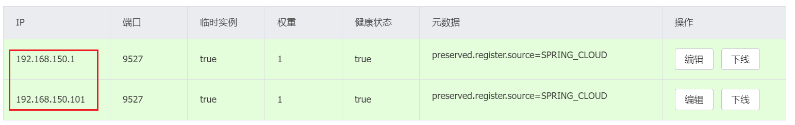
所以需要将101服务器上的网关停止掉再进行测试。`docker stop sl-express-gateway`
另外，需要修改101服务器上的nginx配置，让 api.sl-express.com 对应的服务指向到本地的9527端口服务（测试完成后再改回来）。
修改nginx配置：

```shell
cd /usr/local/src/nginx/conf
vim nginx.conf
#由于目前nginx正在运行中，nginx.conf是只读的，所以需要通过 wq! 命令强制保存

#配置生效
nginx -s reload
```

修改内容如下：
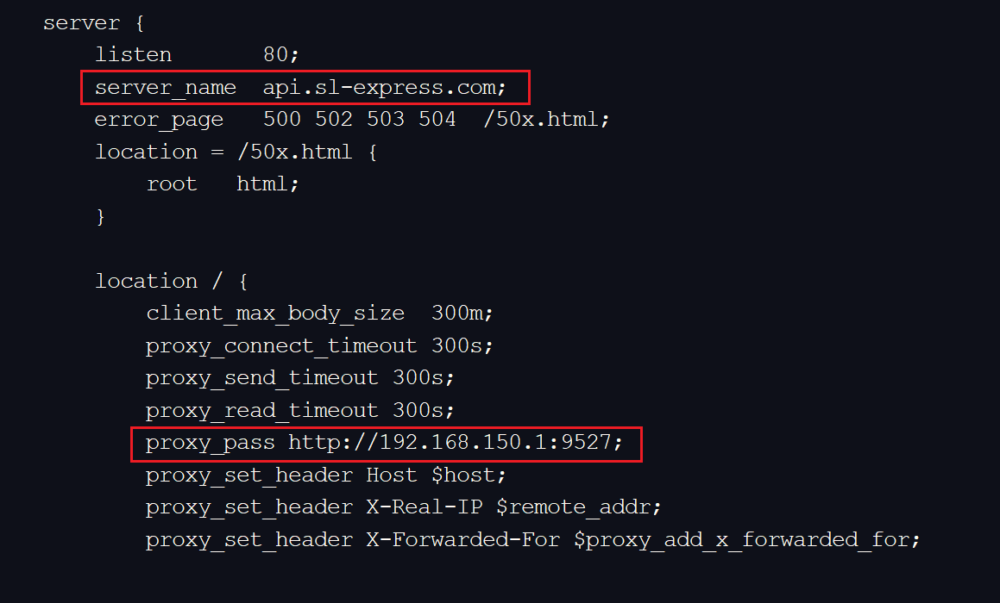
使用司机账号进行测试：
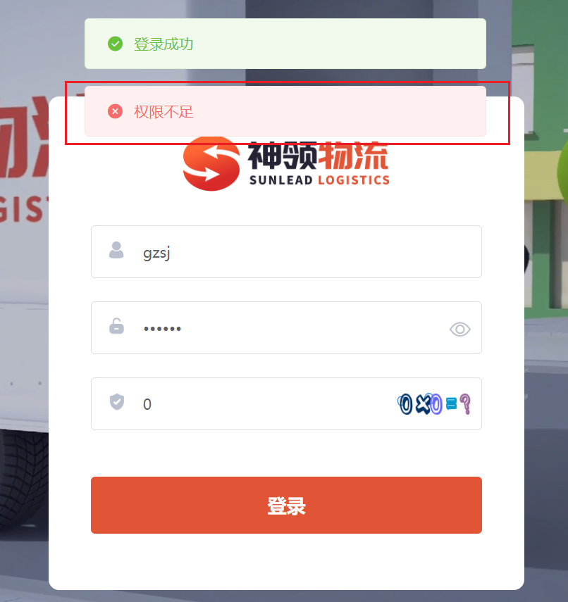
可以看到，司机账号无法登录。
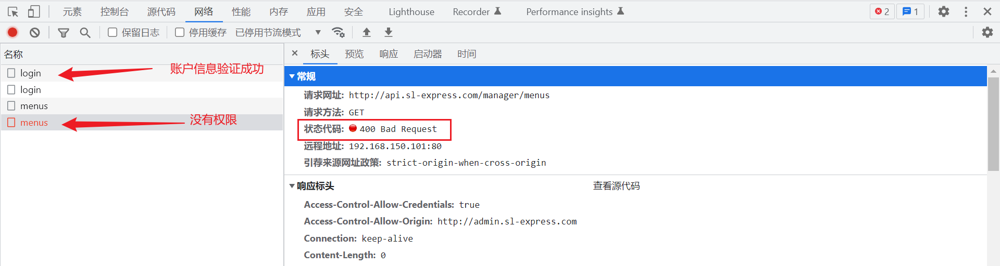

#### 7.6.2.2、接口测试

测试步骤：

- 首先，测试管理员的登录，获取到token
- 接着测试管理员请求接口资源（期望结果：正常获取到数据）
- 更换成司机用户进行登录，并且测试请求接口资源（期望结果：响应400，没有权限）

将本地Gateway服务启动起来，访问 [http://127.0.0.1:9527/manager/doc.html](http://127.0.0.1:9527/manager/doc.html) 即可看到【管理后台微服务接口文档】
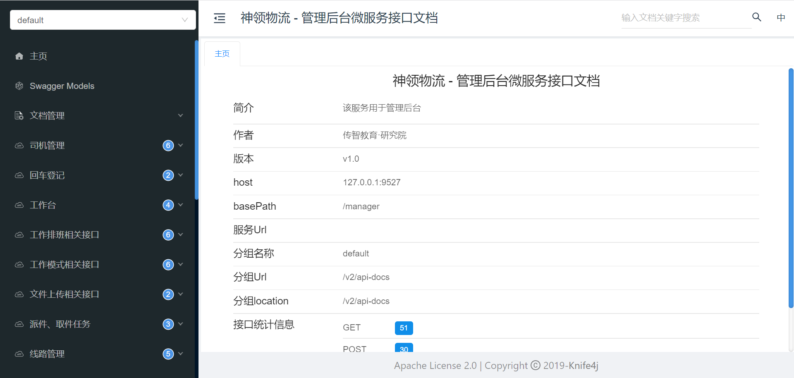
随便测试个接口，会发现响应401：
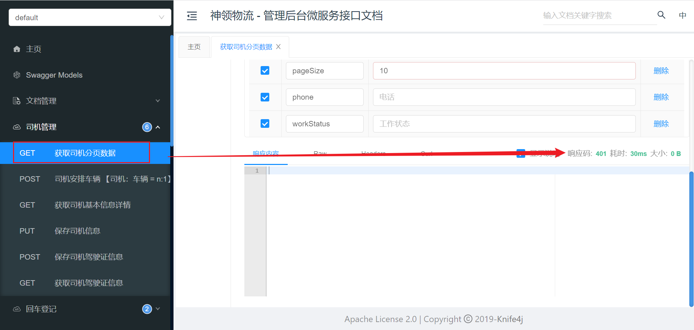
测试登录接口，需要先获取验证码再进行登录：
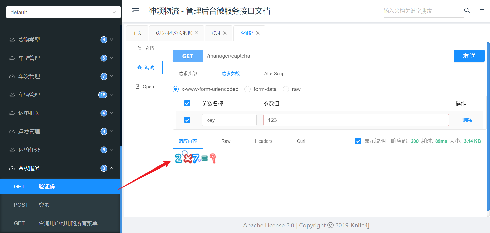
登录成功：
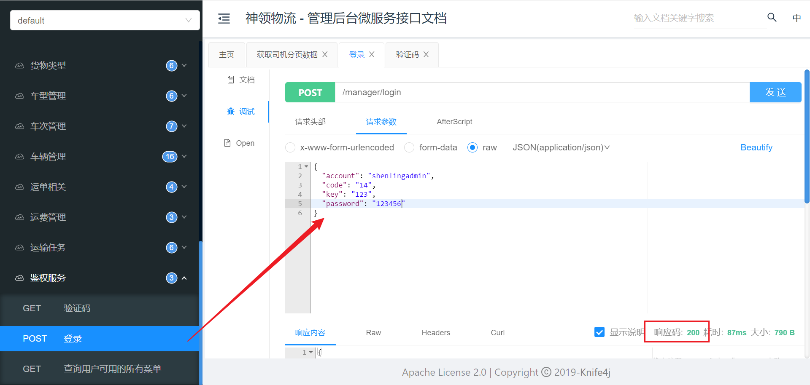
获取到token：
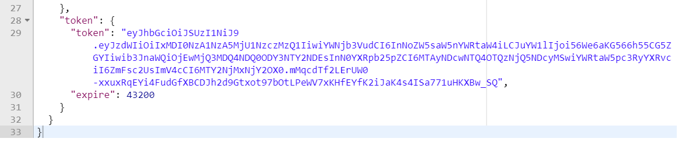
设置请求头：Authorization
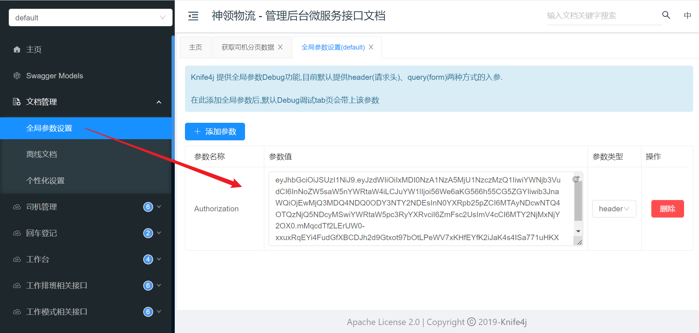
进行功能测试：
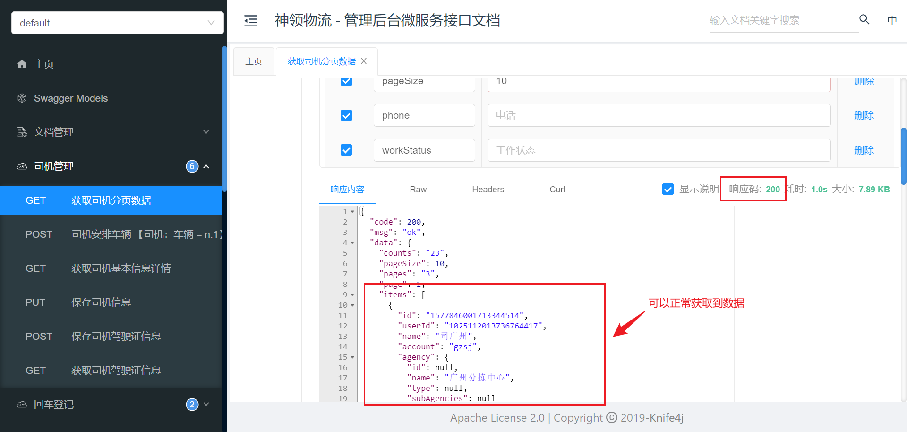
更换成司机账户测试：
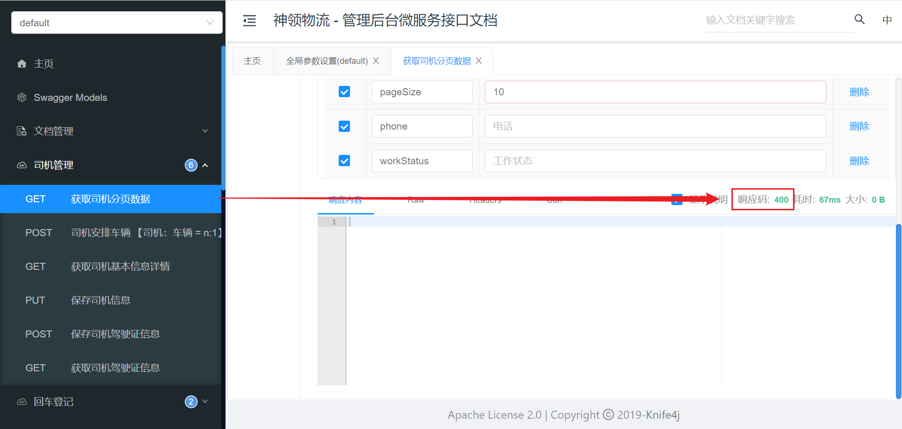
会发现，更换成司机账户后会响应400，符合我们的预期。

### 7.6.3、部署

项目的发布，我们采用Jenkins持续集成的方式，在提供的虚拟机中已经部署好了Jenkins，我们只需要进行简单的操作即可完成部署。
第一步，浏览器打开：[http://jenkins.sl-express.com/](http://jenkins.sl-express.com/)  （账号：root/123）
第二步，按照如下数字标识进行操作
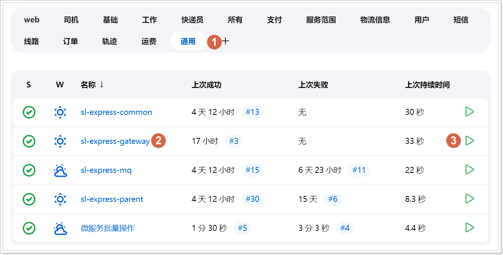
选择默认参数：
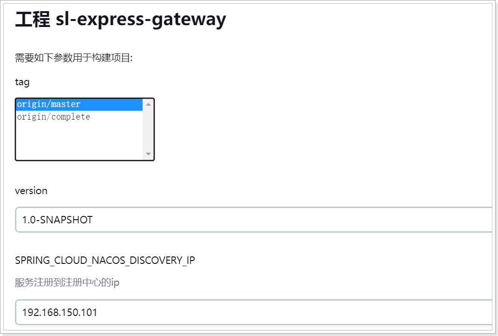
第三步，查看部署控制台，点击【sl-express-gateway】进入任务详情，左侧下方查看构建历史，点击最近的一个构建图标：
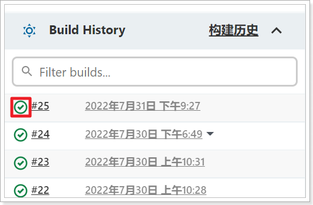
看到如下内容，说明以及部署成功。
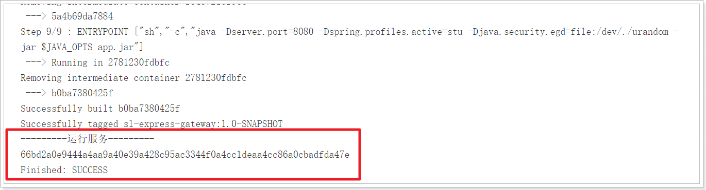
部署成功后，可以进行正常功能测试。

# 8、课后练习

## 8.1、练习一：快递员的鉴权

难度系数：★☆☆☆☆

提示：快递员端的鉴权与管理端的鉴权类似，只是角色id不同。如果想要通过App进行登录测试，请参考[前端部署文档](https://www.yuque.com/zhangzhijun-91vgw/xze2gr/rhyie35xipdqk9dg)。

## 8.2、练习二：司机端的鉴权

难度系数：★☆☆☆☆

提示：司机端的鉴权与管理端的鉴权类似，只是角色id不同。如果想要通过App进行登录测试，请参考[前端部署文档](https://www.yuque.com/zhangzhijun-91vgw/xze2gr/rhyie35xipdqk9dg)。

# 9、面试连环问

:::info
面试官问：

- 简单介绍下你做的物流项目。
- 微服务项目团队如何协作？你们多少个小组开发？
- 项目中是如何进行持续集成的？提交git后如何自动进行构建？
- 说说统一网关中是如何进行认证与鉴权工作的？在网关中如何自定义过滤器？
- 项目中的用户权限是如何管理的？如何与权限管家对接？
  :::
