# 课程安排

- 了解运费的业务需求
- 了解运费模板表的设计
- 实现运费计算的业务逻辑
- 完成部署服务以及功能测试
# 1、背景说明

现在出现了新的情况，开发二组一名负责运费微服务的同事小张离职了，开发二组目前人手不足，需要借调去接手这个任务，你需要知道的是，运费计算微服务是核心的微服务，不能出现计算错误，毕竟是钱挂钩的。
对了，小张离职前已经将该微服务的基本框架搭建完成了，你只需要实现核心的业务逻辑就可以了，这对你来说可能是个好消息……


# 2、需求分析

接到开发任务后，首先需要了解需求，再动手开发。

运费的计算是分不同地区的，比如：同城、省内、跨省，计算规则是不一样的，所以针对不同的类型需要设置不同的运费规则，这其实就是所谓的模板。
## 2.1、模板列表
产品需求中的运费模板列表：
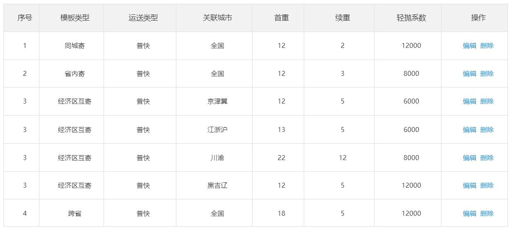

:::info
**轻抛系数名称解释：**
 在计算运费时，包裹有两个维度，体积和重量，二者谁大取谁进行计算，但是体积和重量不是一个单位怎么比较呢？一般的做法就是将体积转化成重量，公式：体积 / 轻抛系数 = 重量，这样就可以比较了。
 也就是说，相同的体积，轻抛系数越大计算出的重量就越小，反之就越大。
:::

## 2.2、计费规则

**重量计算方法：**
取重量和体积两者间较大的数值，体积计算方法：长(cm)×_宽(cm)_×高(cm) / 轻抛系数

**普快：**
同城互寄：12000
省内寄件：8000
跨省寄件：12000
经济区互寄（京津翼、江浙沪）：6000
经济区互寄（黑吉辽）：12000
经济区互寄（川渝）：8000

---

**计费重量小数点规则：**

不满1kg，按1kg计费；
10KG以下：以0.1kg为计重单位，四舍五入保留 1 位小数；
10-100KG：续重以0.5kg为计重单位，不足0.5kg按0.5kg算，四舍五入保留 1 位小数；
100KG及以上：四舍五入取整；

> **举例：**
> 8.4kg按照8.4kg收费
8.5kg按照8.5kg收费
8.8kg按照8.8kg收费
18.1kg按照18.5kg收费
18.5kg按照18.5kg收费
18.7kg按照19kg收费
108.4kg按照108kg收费
108.5kg按照109kg收费
108.6kg按照109kg收费


总运费小数点规则：**按四舍五入计算，精确到小数点后一位**

---

模板不可重复设置，需确保唯一值。
如已设置同城寄、跨省寄、省内寄，则只可修改，不可再新增
如已设置经济区互寄某个城市，下次添加不可再关联此经济区城市
## 2.3、新增模板

运费模板有4种类型，分别为：
同城寄：同城寄件运费计算模板，全国统一定价
省内寄：省内寄件运费计算模板，全国统一定价
跨省寄：不同省份间的运费计算模板，全国统一定价
经济区互寄：4个经济区（京津翼、江沪浙皖、川渝、黑吉辽），经济区间寄件可设置优惠价格
### 2.3.1、全国范围
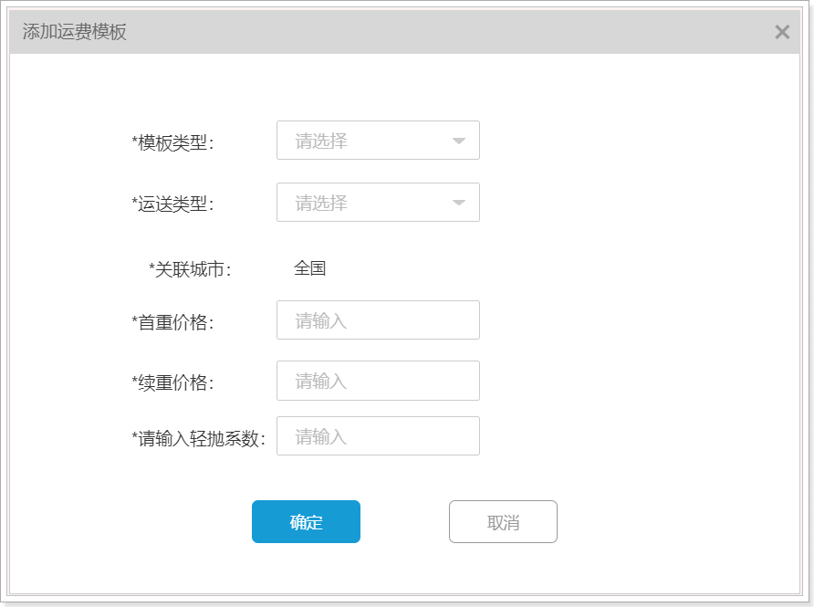

此模板为‘同城寄/省内寄/跨省’三个类型的运费模板
模板类型：可选择同城寄/省内寄/跨省/经济区互寄
运送类型：可选择运送类型，目前业务只支持普快
关联城市：
同城寄/省内寄/跨省：全国统一定价（如上图）
首重价格：保留小数点后一位，可输入1-999间任意数值
续重价格：保留小数点后一位，可输入1-999间任意数值
轻抛系数：整数，可输入1-99999间，任意数值

### 2.3.2、经济区互寄
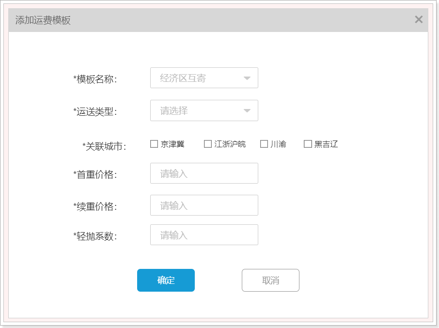

此模板为‘经济区互寄’类型的运费模板
模板类型：可选择同城寄/省内寄/跨省/经济区互寄
运送类型：可选择运送类型，目前业务只支持普快
关联城市：
经济区互寄：可设置单个或多个经济区价格（如上图）
首重价格：保留小数点后一位，可输入1-999间任意数值
续重价格：保留小数点后一位，可输入1-999间任意数值
轻抛系数：整数，可输入1-99999间，任意数值
# 3、运费模板表

运费模板是需要存储到表中的，所以首先需要设计表结构，具体表结构语句如下：

```sql
CREATE TABLE `sl_carriage` (
  `id` bigint NOT NULL COMMENT '运费模板id',
  `template_type` tinyint NOT NULL COMMENT '模板类型，1-同城寄 2-省内寄 3-经济区互寄 4-跨省',
  `transport_type` tinyint NOT NULL COMMENT '运送类型，1-普快 2-特快',
  `associated_city` varchar(20) CHARACTER SET utf8mb4 COLLATE utf8mb4_general_ci NOT NULL COMMENT '关联城市，1-全国 2-京津冀 3-江浙沪 4-川渝 5-黑吉辽',
  `first_weight` double NOT NULL COMMENT '首重价格',
  `continuous_weight` double NOT NULL DEFAULT '1' COMMENT '续重价格',
  `light_throwing_coefficient` int NOT NULL COMMENT '轻抛系数',
  `created` datetime DEFAULT NULL COMMENT '创建时间',
  `updated` datetime DEFAULT NULL COMMENT '更新时间',
  PRIMARY KEY (`id`) USING BTREE
) ENGINE=InnoDB DEFAULT CHARSET=utf8mb4 COLLATE=utf8mb4_general_ci ROW_FORMAT=DYNAMIC COMMENT='运费模板表';
```

:::danger
说明：由于该表数据比较少，所以就不需要添加索引字段了。
:::
在数据库中已经预存了7条数据：

> 🚨 特别需要注意associated_city字段，如果多个经济区互寄城市共用一套模板，其数据是通过逗号分割存储的，如下：


# 4、拉取代码
需要拉取的工程有3个：

| 工程名 | git地址 |
| --- | --- |
| sl-express-ms-carriage-domain | [http://git.sl-express.com/sl/sl-express-ms-carriage-domain.git](http://git.sl-express.com/sl/sl-express-ms-carriage-domain.git) |
| sl-express-ms-carriage-api | [http://git.sl-express.com/sl/sl-express-ms-carriage-api.git](http://git.sl-express.com/sl/sl-express-ms-carriage-api.git) |
| sl-express-ms-carriage-service | [http://git.sl-express.com/sl/sl-express-ms-carriage-service.git](http://git.sl-express.com/sl/sl-express-ms-carriage-service.git) |

# 5、实现业务
接下来我们要编写代码实现具体的业务了，同事小张已经完成基本的代码框架，包括Controller、Service接口等，我们只需要实现CarriageService即可。需要实现4个方法，如下：
```java
package com.sl.ms.carriage.service;

import com.baomidou.mybatisplus.extension.service.IService;
import com.sl.ms.carriage.domain.dto.CarriageDTO;
import com.sl.ms.carriage.domain.dto.WaybillDTO;
import com.sl.ms.carriage.entity.CarriageEntity;

import java.util.List;

/**
 * 运费管理表 服务类
 */
public interface CarriageService extends IService<CarriageEntity> {

    /**
     * 新增/修改运费模板
     *
     * @param carriageDto 新增/修改运费对象
     *                    必填字段：templateType、transportType
     *                    更新时传入id字段
     */
    CarriageDTO saveOrUpdate(CarriageDTO carriageDto);

    /**
     * 获取全部运费模板
     *
     * @return 运费模板对象列表
     */
    List<CarriageDTO> findAll();

    /**
     * 运费计算
     *
     * @param waybillDTO 运费计算对象
     * @return 运费模板对象，不仅包含模板数据还包含：computeWeight、expense 字段
     */
    CarriageDTO compute(WaybillDTO waybillDTO);


    /**
     * 根据模板类型查询模板，经济区互寄不通过该方法查询模板
     *
     * @param templateType 模板类型：1-同城寄，2-省内寄，4-跨省
     * @return 运费模板
     */
    CarriageEntity findByTemplateType(Integer templateType);

}

```
## 5.1、查询模板列表
编写`com.sl.ms.carriage.service.impl.CarriageServiceImpl`实现类：

```java
@Service
public class CarriageServiceImpl extends ServiceImpl<CarriageMapper, CarriageEntity>
        implements CarriageService {

    @Override
    public CarriageDTO saveOrUpdate(CarriageDTO carriageDto) {
        return null;
    }

    @Override
    public List<CarriageDTO> findAll() {
        return null;
    }

    @Override
    public CarriageDTO compute(WaybillDTO waybillDTO) {
        return null;
    }
            
    @Override
    public CarriageEntity findByTemplateType(Integer templateType) {
        if (ObjectUtil.equals(templateType, CarriageConstant.ECONOMIC_ZONE)) {
            throw new SLException(CarriageExceptionEnum.METHOD_CALL_ERROR);
        }
        LambdaQueryWrapper<CarriageEntity> queryWrapper = Wrappers.lambdaQuery(CarriageEntity.class)
                .eq(CarriageEntity::getTemplateType, templateType)
                .eq(CarriageEntity::getTransportType, CarriageConstant.REGULAR_FAST);
        return super.getOne(queryWrapper);
    }
}
```

查询列表，需要按照创建时间倒序排序：

```java
    @Override
    public List<CarriageDTO> findAll() {
        // 构造查询条件，按创建时间倒序
        LambdaQueryWrapper<CarriageEntity> queryWrapper = Wrappers.<CarriageEntity>lambdaQuery()
                .orderByDesc(CarriageEntity::getCreated);

        // 查询数据库
        List<CarriageEntity> list = super.list(queryWrapper);

        // 将结果转换为DTO类型
        return list.stream().map(CarriageUtils::toDTO).collect(Collectors.toList());
    }
```

编写测试用例：

:::danger
如果工程中不存在test目录，需要先创建test目录再编写测试用例：
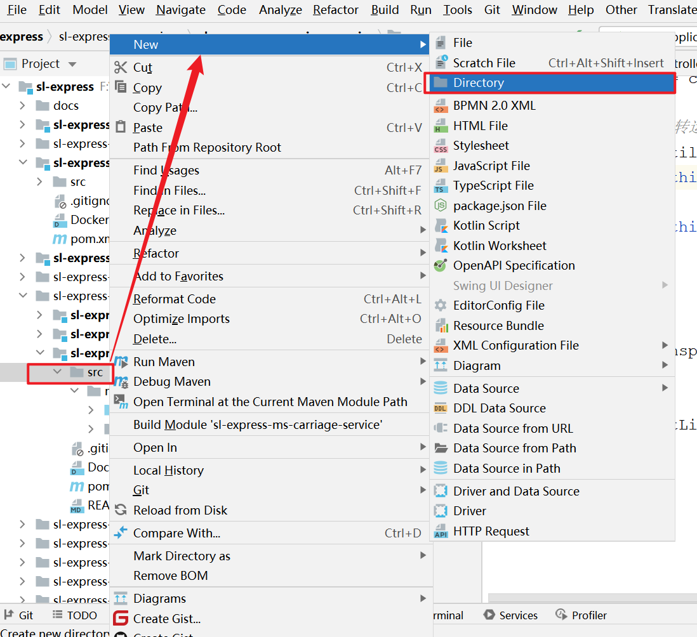
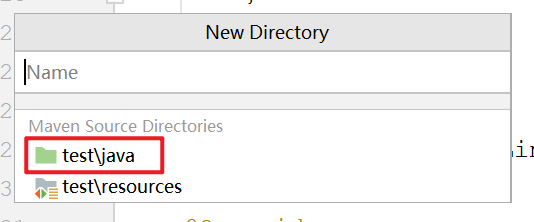
:::

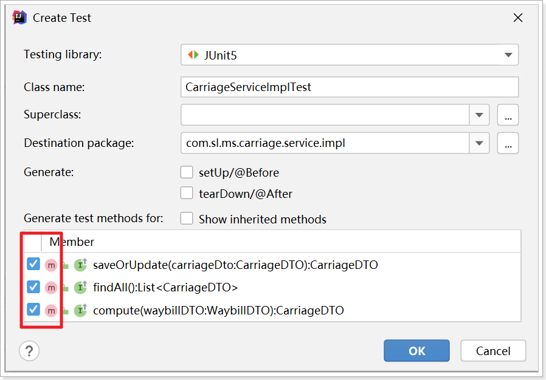

```java
package com.sl.ms.carriage.service;

import com.sl.ms.carriage.domain.constant.CarriageConstant;
import com.sl.ms.carriage.domain.dto.CarriageDTO;
import com.sl.ms.carriage.entity.CarriageEntity;
import org.junit.jupiter.api.Test;
import org.springframework.boot.test.context.SpringBootTest;

import javax.annotation.Resource;

import java.util.List;

import static org.junit.jupiter.api.Assertions.*;

@SpringBootTest
class CarriageServiceTest {

    @Resource
    private CarriageService carriageService;

    @Test
    void saveOrUpdate() {
    }

    @Test
    void findAll() {
        List<CarriageDTO> list = this.carriageService.findAll();
        for (CarriageDTO carriageDTO : list) {
            System.out.println(carriageDTO);
        }
    }

    @Test
    void compute() {
    }

    @Test
    void findByTemplateType() {
        CarriageEntity carriageEntity = this.carriageService.findByTemplateType(CarriageConstant.SAME_CITY);
        System.out.println(carriageEntity);
    }
}
```

测试结果：
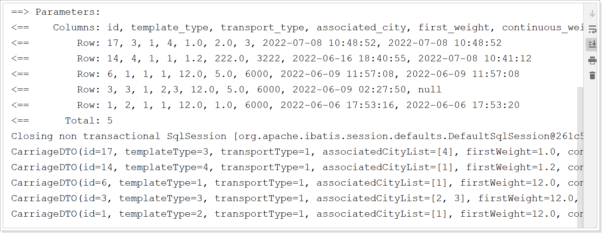
也可以基于swagger测试：

url地址：[http://127.0.0.1:18094/doc.html](http://127.0.0.1:18094/doc.html)

可以看到，已经查询到了数据：


整合到后台管理系统中：

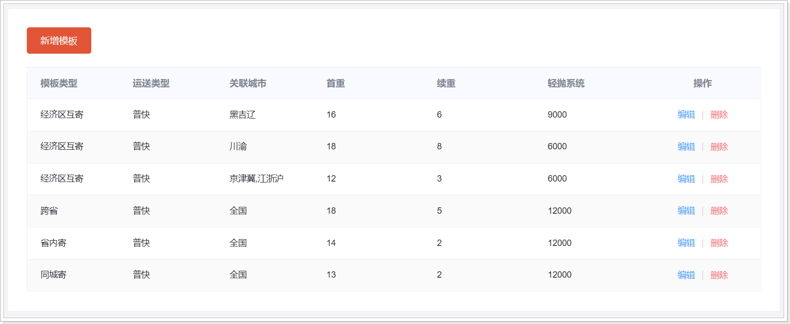
## 5.2、新增或更新
### 5.2.1、整体流程
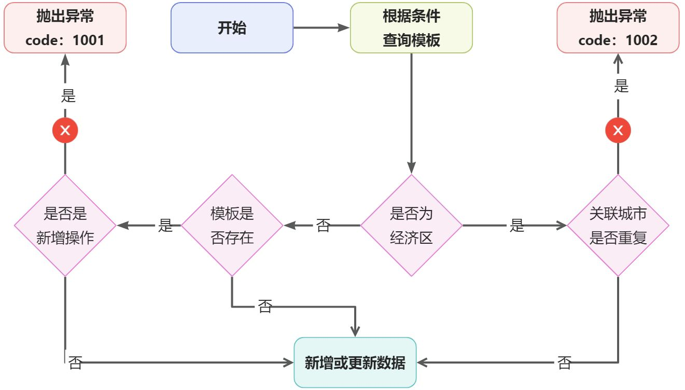

流程说明：

- 根据传入的CarriageDTO对象参数进行查询模板，并且判断是否为经济区
- 如果是非经济区互寄，需要进一步判断模板是否存在，如果存在需要判断是否为新增操作，如果是新增操作就抛出异常，其他情况都可以进行落库
- 如果是经济区互寄，需要判断关联城市是否重复，如果重复抛出异常，否则进行落库操作
:::danger
❓模板为什么不能重复？
因为运费的计算是通过模板进行的，如果存在多个模板，该基于哪个模板计算呢？所以模板是不能重复的。
:::
### 5.2.2、代码实现

```java
    @Override
    public CarriageDTO saveOrUpdate(CarriageDTO carriageDto) {
        log.info("新增运费模板 --> {}", carriageDto);
        //思路：首先根据条件查询运费模板，判断模板是否存在，如果不存在直接新增
        //如果存在，需要判断是否为经济区互寄，如果不是，抛出异常，如果是，需要进一步判断所关联的城市是否重复
        //如果重复，抛出异常，如果不重复进行新增或更新
        LambdaQueryWrapper<CarriageEntity> queryWrapper = Wrappers.<CarriageEntity>lambdaQuery()
                .eq(CarriageEntity::getTemplateType, carriageDto.getTemplateType())
                .eq(CarriageEntity::getTransportType, CarriageConstant.REGULAR_FAST);

        //查询到模板列表
        List<CarriageEntity> carriageList = super.list(queryWrapper);

        if (ObjectUtil.notEqual(carriageDto.getTemplateType(), CarriageConstant.ECONOMIC_ZONE)) {
            // 非经济区互寄的情况下，需要判断查询的模板是否为空
            // 如果不为空并且入参的参数id为空，说明是新增操作，非经济区只能有一个模板，需要抛出异常
            if (ObjectUtil.isNotEmpty(carriageList) && ObjectUtil.isEmpty(carriageDto.getId())) {
                // 新增操作，模板重复，抛出异常
                throw new SLException(CarriageExceptionEnum.NOT_ECONOMIC_ZONE_REPEAT);
            }
            //新增或更新非经济区模板
            return this.saveOrUpdateCarriage(carriageDto);
        }

        //判断模板所关联的城市是否有重复
        //查询其他模板中所有的经济区列表
        List<String> associatedCityList = StreamUtil.of(carriageList)
                //排除掉自己，检查与其他模板是否存在冲突
                .filter(carriageEntity -> ObjectUtil.notEqual(carriageEntity.getId(), carriageDto.getId()))
                //获取关联城市
                .map(CarriageEntity::getAssociatedCity)
                //将关联城市按照逗号分割
                .map(associatedCity -> StrUtil.split(associatedCity, ','))
                //将上面得到的集合展开，得到字符串
                .flatMap(StreamUtil::of)
                //收集到集合中
                .collect(Collectors.toList());

        //查看当前新增经济区是否存在重复，取交集来判断是否重复
        Collection<String> intersection = CollUtil.intersection(associatedCityList, carriageDto.getAssociatedCityList());
        if (CollUtil.isNotEmpty(intersection)) {
            //有重复
            throw new SLException(CarriageExceptionEnum.ECONOMIC_ZONE_CITY_REPEAT);
        }
        //新增或更新经济区模板
        return this.saveOrUpdateCarriage(carriageDto);
    }
```

### 5.2.3、测试
编写测试用例：
```java
    @Resource
    private CarriageService carriageService;

    @Test
    void saveOrUpdate() {
        CarriageDTO carriageDTO = new CarriageDTO();
        carriageDTO.setTemplateType(3);
        carriageDTO.setTransportType(1);
        carriageDTO.setAssociatedCityList(Arrays.asList("5"));
        carriageDTO.setFirstWeight(12d);
        carriageDTO.setContinuousWeight(1d);
        carriageDTO.setLightThrowingCoefficient(6000);

        CarriageDTO dto = this.carriageService.saveOrUpdate(carriageDTO);
        System.out.println(dto);
    }
```
## 5.3、运费计算
### 5.3.1、整体流程
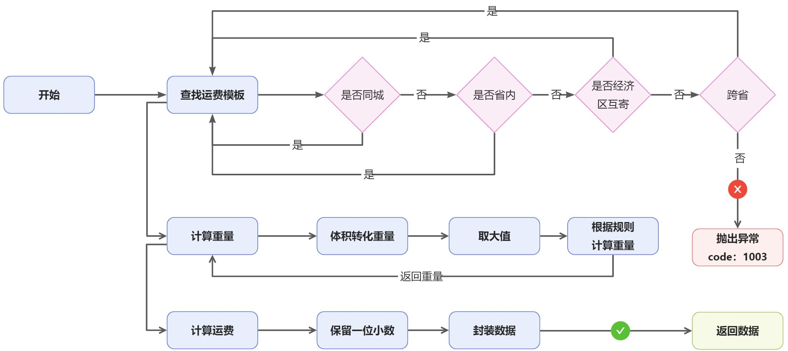

:::info
说明：

- 运费模板优先级：同城>省内>经济区互寄>跨省
- 将体积转化成重量，与重量比较，取大值
:::

### 5.3.2、查找模板
在上述的流程图中可以看出，计算运费的第一步逻辑就是需要查找到对应的运费模板，否则不能进行计算，如何实现比较好呢，我们这里采用【责任链】模式进行代码编写。
之所以采用【责任链】模式，是因为在查找模板时，不同的模板处理逻辑不同，并且这些逻辑组成了一条处理链，有开头有结尾，只要能找到符合条件的模板即结束。

首先，定义运费模板处理链，这是一个抽象类：
```java
package com.sl.ms.carriage.handler;

import com.sl.ms.carriage.domain.dto.WaybillDTO;
import com.sl.ms.carriage.entity.CarriageEntity;

/**
 * 运费模板处理链的抽象定义
 */
public abstract class AbstractCarriageChainHandler {

    private AbstractCarriageChainHandler nextHandler;

    /**
     * 执行过滤方法，通过输入参数查找运费模板
     *
     * @param waybillDTO 输入参数
     * @return 运费模板
     */
    public abstract CarriageEntity doHandler(WaybillDTO waybillDTO);

    /**
     * 执行下一个处理器
     *
     * @param waybillDTO     输入参数
     * @param carriageEntity 上个handler处理得到的对象
     * @return
     */
    protected CarriageEntity doNextHandler(WaybillDTO waybillDTO, CarriageEntity carriageEntity) {
        if (nextHandler == null || carriageEntity != null) {
            //如果下游Handler为空 或 上个Handler已经找到运费模板就返回
            return carriageEntity;
        }
        return nextHandler.doHandler(waybillDTO);
    }

    /**
     * 设置下游Handler
     *
     * @param nextHandler 下游Handler
     */
    public void setNextHandler(AbstractCarriageChainHandler nextHandler) {
        this.nextHandler = nextHandler;
    }
}

```
下面针对不同的模板策略编写具体的实现类，同城寄：
```java
package com.sl.ms.carriage.handler;

import com.sl.ms.carriage.domain.constant.CarriageConstant;
import com.sl.ms.carriage.domain.dto.WaybillDTO;
import com.sl.ms.carriage.entity.CarriageEntity;
import com.sl.ms.carriage.service.CarriageService;
import com.sl.transport.common.util.ObjectUtil;
import org.springframework.core.annotation.Order;
import org.springframework.stereotype.Component;

import javax.annotation.Resource;

/**
 * 同城寄
 */
@Order(100) //定义顺序
@Component
public class SameCityChainHandler extends AbstractCarriageChainHandler {

    @Resource
    private CarriageService carriageService;

    @Override
    public CarriageEntity doHandler(WaybillDTO waybillDTO) {
        CarriageEntity carriageEntity = null;
        if (ObjectUtil.equals(waybillDTO.getReceiverCityId(), waybillDTO.getSenderCityId())) {
            //同城
            carriageEntity = this.carriageService.findByTemplateType(CarriageConstant.SAME_CITY);
        }
        return doNextHandler(waybillDTO, carriageEntity);
    }
}

```
省内寄：
```java
package com.sl.ms.carriage.handler;

import com.sl.ms.base.api.common.AreaFeign;
import com.sl.ms.carriage.domain.constant.CarriageConstant;
import com.sl.ms.carriage.domain.dto.WaybillDTO;
import com.sl.ms.carriage.entity.CarriageEntity;
import com.sl.ms.carriage.service.CarriageService;
import com.sl.transport.common.util.ObjectUtil;
import org.springframework.core.annotation.Order;
import org.springframework.stereotype.Component;

import javax.annotation.Resource;

/**
 * 省内寄
 */
@Order(200) //定义顺序
@Component
public class SameProvinceChainHandler extends AbstractCarriageChainHandler {

    @Resource
    private CarriageService carriageService;
    @Resource
    private AreaFeign areaFeign;

    @Override
    public CarriageEntity doHandler(WaybillDTO waybillDTO) {
        CarriageEntity carriageEntity = null;
        // 获取收寄件地址省份id
        Long receiverProvinceId = this.areaFeign.get(waybillDTO.getReceiverCityId()).getParentId();
        Long senderProvinceId = this.areaFeign.get(waybillDTO.getSenderCityId()).getParentId();
        if (ObjectUtil.equal(receiverProvinceId, senderProvinceId)) {
            //省内
            carriageEntity = this.carriageService.findByTemplateType(CarriageConstant.SAME_PROVINCE);
        }
        return doNextHandler(waybillDTO, carriageEntity);
    }
}

```
经济区互寄：
```java
package com.sl.ms.carriage.handler;

import cn.hutool.core.util.ArrayUtil;
import cn.hutool.core.util.EnumUtil;
import com.baomidou.mybatisplus.core.conditions.query.LambdaQueryWrapper;
import com.baomidou.mybatisplus.core.toolkit.Wrappers;
import com.sl.ms.base.api.common.AreaFeign;
import com.sl.ms.carriage.domain.constant.CarriageConstant;
import com.sl.ms.carriage.domain.dto.WaybillDTO;
import com.sl.ms.carriage.domain.enums.EconomicRegionEnum;
import com.sl.ms.carriage.entity.CarriageEntity;
import com.sl.ms.carriage.service.CarriageService;
import com.sl.transport.common.util.ObjectUtil;
import org.springframework.core.annotation.Order;
import org.springframework.stereotype.Component;

import javax.annotation.Resource;
import java.util.LinkedHashMap;

/**
 * 经济区互寄
 */
@Order(300) //定义顺序
@Component
public class EconomicZoneChainHandler extends AbstractCarriageChainHandler {

    @Resource
    private CarriageService carriageService;
    @Resource
    private AreaFeign areaFeign;

    @Override
    public CarriageEntity doHandler(WaybillDTO waybillDTO) {
        CarriageEntity carriageEntity = null;

        // 获取收寄件地址省份id
        Long receiverProvinceId = this.areaFeign.get(waybillDTO.getReceiverCityId()).getParentId();
        Long senderProvinceId = this.areaFeign.get(waybillDTO.getSenderCityId()).getParentId();

        //获取经济区城市配置枚举
        LinkedHashMap<String, EconomicRegionEnum> EconomicRegionMap = EnumUtil.getEnumMap(EconomicRegionEnum.class);
        EconomicRegionEnum economicRegionEnum = null;
        for (EconomicRegionEnum regionEnum : EconomicRegionMap.values()) {
            //该经济区是否全部包含收发件省id
            boolean result = ArrayUtil.containsAll(regionEnum.getValue(), receiverProvinceId, senderProvinceId);
            if (result) {
                economicRegionEnum = regionEnum;
                break;
            }
        }

        if (ObjectUtil.isNotEmpty(economicRegionEnum)) {
            //根据类型编码查询
            LambdaQueryWrapper<CarriageEntity> queryWrapper = Wrappers.lambdaQuery(CarriageEntity.class)
                    .eq(CarriageEntity::getTemplateType, CarriageConstant.ECONOMIC_ZONE)
                    .eq(CarriageEntity::getTransportType, CarriageConstant.REGULAR_FAST)
                    .like(CarriageEntity::getAssociatedCity, economicRegionEnum.getCode());
            carriageEntity = this.carriageService.getOne(queryWrapper);
        }

        return doNextHandler(waybillDTO, carriageEntity);
    }
}

```
跨省寄：
```java
package com.sl.ms.carriage.handler;

import com.sl.ms.carriage.domain.constant.CarriageConstant;
import com.sl.ms.carriage.domain.dto.WaybillDTO;
import com.sl.ms.carriage.entity.CarriageEntity;
import com.sl.ms.carriage.service.CarriageService;
import org.springframework.core.annotation.Order;
import org.springframework.stereotype.Component;

import javax.annotation.Resource;

/**
 * 跨省
 */
@Order(400) //定义顺序
@Component
public class TransProvinceChainHandler extends AbstractCarriageChainHandler {

    @Resource
    private CarriageService carriageService;

    @Override
    public CarriageEntity doHandler(WaybillDTO waybillDTO) {
        CarriageEntity carriageEntity = this.carriageService.findByTemplateType(CarriageConstant.TRANS_PROVINCE);
        return doNextHandler(waybillDTO, carriageEntity);
    }
}

```
组装处理链，按照`@Order`注解中的值，由小到大排序。
```java
package com.sl.ms.carriage.handler;

import cn.hutool.core.collection.CollUtil;
import com.sl.ms.carriage.domain.dto.WaybillDTO;
import com.sl.ms.carriage.entity.CarriageEntity;
import com.sl.transport.common.exception.SLException;
import org.springframework.stereotype.Component;

import javax.annotation.PostConstruct;
import javax.annotation.Resource;
import java.util.List;

/**
 * 查找运费模板处理链 @Order注解
 */
@Component
public class CarriageChainHandler {

    /**
     * 利用Spring注入特性，按照 @Order 从小到达排序注入到集合中
     */
    @Resource
    private List<AbstractCarriageChainHandler> chainHandlers;

    private AbstractCarriageChainHandler firstHandler;

    /**
     * 组装处理链
     */
    @PostConstruct
    private void constructChain() {
        if (CollUtil.isEmpty(chainHandlers)) {
            throw new SLException("not found carriage chain handler!");
        }
        //处理链中第一个节点
        firstHandler = chainHandlers.get(0);
        for (int i = 0; i < chainHandlers.size(); i++) {
            if (i == chainHandlers.size() - 1) {
                //最后一个处理链节点
                chainHandlers.get(i).setNextHandler(null);
            } else {
                //设置下游节点
                chainHandlers.get(i).setNextHandler(chainHandlers.get(i + 1));
            }
        }
    }

    public CarriageEntity findCarriage(WaybillDTO waybillDTO) {
        //从第一个节点开始处理
        return firstHandler.doHandler(waybillDTO);
    }

}

```
测试：
```java
package com.sl.ms.carriage.handler;

import com.sl.ms.carriage.domain.dto.WaybillDTO;
import com.sl.ms.carriage.entity.CarriageEntity;
import org.junit.jupiter.api.Test;
import org.springframework.boot.test.context.SpringBootTest;

import javax.annotation.Resource;

@SpringBootTest
class CarriageChainHandlerTest {

    @Resource
    private CarriageChainHandler carriageChainHandler;

    @Test
    void findCarriage() {
        WaybillDTO waybillDTO = WaybillDTO.builder()
                .senderCityId(2L) //北京
                .receiverCityId(161793L) //上海
                .volume(1)
                .weight(1d)
                .build();

        CarriageEntity carriage = this.carriageChainHandler.findCarriage(waybillDTO);
        System.out.println(carriage);
    }
}
```
注入的处理链集合对象：

测试结果，查询到跨省的模板，结果符合预期：

### 5.3.3、计算运费
```java
    @Override
    public CarriageDTO compute(WaybillDTO waybillDTO) {
        //根据参数查找运费模板
        CarriageEntity carriage = this.carriageChainHandler.findCarriage(waybillDTO);

        //计算重量，确保最小重量为1kg
        double computeWeight = this.getComputeWeight(waybillDTO, carriage);

        //计算运费，首重 + 续重
        double expense = carriage.getFirstWeight() + ((computeWeight - 1) * carriage.getContinuousWeight());

        //保留一位小数
        expense = NumberUtil.round(expense, 1).doubleValue();

        //封装运费和计算重量到DTO，并返回
        CarriageDTO carriageDTO = CarriageUtils.toDTO(carriage);
        carriageDTO.setExpense(expense);
        carriageDTO.setComputeWeight(computeWeight);
        return carriageDTO;
    }

    /**
     * 根据体积参数与实际重量计算计费重量
     *
     * @param waybillDTO 运费计算对象
     * @param carriage   运费模板
     * @return 计费重量
     */
    private double getComputeWeight(WaybillDTO waybillDTO, CarriageEntity carriage) {
        //计算体积，如果传入体积不需要计算
        Integer volume = waybillDTO.getVolume();
        if (ObjectUtil.isEmpty(volume)) {
            try {
                //长*宽*高计算体积
                volume = waybillDTO.getMeasureLong() * waybillDTO.getMeasureWidth() * waybillDTO.getMeasureHigh();
            } catch (Exception e) {
                //计算出错设置体积为0
                volume = 0;
            }
        }

        // 计算体积重量，体积 / 轻抛系数
        BigDecimal volumeWeight = NumberUtil.div(volume, carriage.getLightThrowingCoefficient(), 1);

        //取大值
        double computeWeight = NumberUtil.max(volumeWeight.doubleValue(), NumberUtil.round(waybillDTO.getWeight(), 1).doubleValue());

        //计算续重，规则：不满1kg，按1kg计费；10kg以下续重以0.1kg计量保留1位小数；10-100kg续重以0.5kg计量保留1位小数；100kg以上四舍五入取整
        if (computeWeight <= 1) {
            return 1;
        }

        if (computeWeight <= 10) {
            return computeWeight;
        }

        // 举例：
        // 108.4kg按照108kg收费
        // 108.5kg按照109kg收费
        // 108.6kg按照109kg收费
        if (computeWeight >= 100) {
            return NumberUtil.round(computeWeight, 0).doubleValue();
        }

        //0.5为一个计算单位，举例：
        // 18.8kg按照19收费，
        // 18.4kg按照18.5kg收费
        // 18.1kg按照18.5kg收费
        // 18.6kg按照19收费
        int integer = NumberUtil.round(computeWeight, 0, RoundingMode.DOWN).intValue();
        if (NumberUtil.sub(computeWeight, integer) == 0) {
            return integer;
        }
        
        if (NumberUtil.sub(computeWeight, integer) <= 0.5) {
            return NumberUtil.add(integer, 0.5);
        }
        return NumberUtil.add(integer, 1);
    }
```

### 5.3.4、测试
可以通过单元测试或者swagger测试：
```java
    @Test
    void compute() {
        WaybillDTO waybillDTO = new WaybillDTO();
        waybillDTO.setReceiverCityId(7363L); //天津
        waybillDTO.setSenderCityId(2L); //北京
        waybillDTO.setWeight(3.8); //重量
        waybillDTO.setVolume(125000); //体积

        CarriageDTO compute = this.carriageService.compute(waybillDTO);
        System.out.println(compute);
    }
```
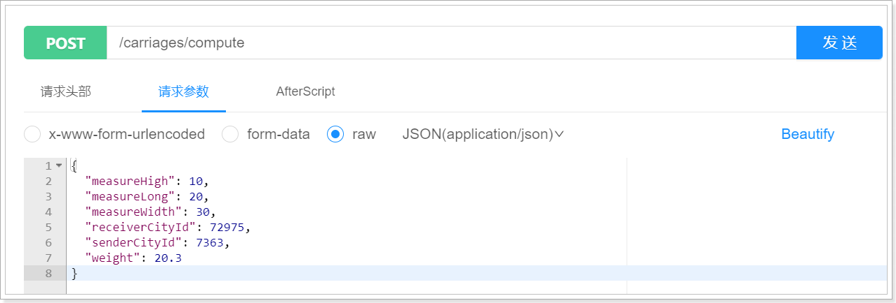

可以看到已经得到计算结果。
### 5.3.5、异常
可能会出现如下异常：
```shell
2022-08-04 19:27:01.712 - [http-nio-18094-exec-6] - ERROR - c.s.t.common.handler.GlobalExceptionHandler - 其他未知异常 -> 
feign.RetryableException: Connection refused: connect executing GET http://sl-express-ms-base/area/72975
	at feign.FeignException.errorExecuting(FeignException.java:268)
	at feign.SynchronousMethodHandler.executeAndDecode(SynchronousMethodHandler.java:129)
	at feign.SynchronousMethodHandler.invoke(SynchronousMethodHandler.java:89)
	at feign.ReflectiveFeign$FeignInvocationHandler.invoke(ReflectiveFeign.java:100)
	at com.sun.proxy.$Proxy120.get(Unknown Source)
	at com.sl.ms.carriage.service.impl.CarriageServiceImpl.findEconomicCarriage(CarriageServiceImpl.java:234)
```

由于在计算服务中使用base微服务，但是101机器的base服务没有启动，会导致如上异常，将base启动即可。
```shell
#启动命令
docker start sl-express-ms-base-service

#查看日志
docker logs -f sl-express-ms-base-service
```

### 5.3.6、测试举例

**举例1：**跨省寄（不足1kg）
从北京寄到上海一件物品，物品重量0.8千克，1立方厘米（长*宽*高：1cm*1cm*1cm）：
计算：
重量：不足1千克按照一千克计算
体积：跨省轻抛系数为12000，1立方厘米计算则为：1/12000
对比重量和体积，取大值
按照1公斤来计算，则运费为跨省寄运费，18元

---

**举例2：**跨省寄(超过 1kg)
从北京寄到上海一件物品，物品重量1.8千克，1立方厘米（长*宽*高：1cm*1cm*1cm）：
计算：
重量：1.8千克
体积：跨省轻抛系数为12000，1立方厘米计算则为：1/12000
对比重量和体积，取大值
按照1.8公斤来计算运费，则运费为跨省寄运费，
1公斤（首重）+0.8公斤（续重）
根据运费计算规则，10公斤以下以0.1为续重单位，则
首重+续重=1*18（首重价格）+0.8*5=18+4=22元

---

**举例3：**跨省寄（按体积计费）
从北京寄到上海一件物品，物品重量3.8千克，125000立方厘米（长*宽*高：50cm*50cm*50cm）：
计算：
重量：3.8千克=3（首重）+0.8（续重）
体积：跨省轻抛系数为12000，125000立方厘米：125000/12000=10.41
对比重量和体积，取大值10.41
根据运费计算规则，10-100公斤以0.5为计重单位，则10.41为10.5
首重+续重=1*18（首重价格）+9.5*5=18+47.5=65.5元

---

**举例4：**同城寄（按体积计费）
从北京东城寄到北京西城一件物品，物品重量3.8kg，125000立方厘米（长*宽*高：50cm*50cm*50cm）：
计算：
重量：3.8kg=1kg（首重）+2.8kg（续重）
体积：同城轻抛系数为12000，换算成重量125000立方厘米：125000/12000=10.41kg
对比重量（3.8kg）和体积（10.41kg），取大值10.41kg
根据运费计算规则，10-100kg以0.5kg为计重单位，则10.41kg为10.5kg
首重+续重=1kg*12元（首重价格）+9.5kg*2元(续重价格)=12+19=31元

---

**举例5：**经济区互寄（按体积计费）
从北京寄到天津一件物品，物品重量3.8kg，125000立方厘米（长*宽*高：50cm*50cm*50cm）：
计算：
重量：3.8kg=1kg（首重）+2.8kg（续重）
体积：经济区互寄（京津翼）轻抛系数为6000，换算成体积125000立方厘米：125000/6000=20.83kg
对比重量(3.8kg)和体积(20.83kg)，取大值20.83kg
根据运费计算规则，10-100kg以0.5kg为计重单位，则20.83为21kg
首重+续重=1*12元（首重价格）+20*5元(续重价格)=12+100=112元

---

**举例6：**省内寄（按重量计费）
从石家庄寄到秦皇岛一件物品，物品重量3.8kg，5000立方厘米（长*宽*高：50cm*10cm*10cm）：
计算：
重量：3.8kg=1kg（首重）+2.8kg（续重）
体积：省内寄轻抛系数为8000，换算成体积5000立方厘米：5000/6000=0.8kg
对比重量(3.8kg)和体积(0.8kg)，取大值3.8kg
根据运费计算规则，10kg以下以0.1kg为计重单位，则3.8kg为3.8kg
首重+续重=1*12元（首重价格）+2.8*3元(续重价格)=12+8.4=20.4元
## 5.4、部署

已经将该服务的部署脚本写到Jenkins中，直接使用即可。

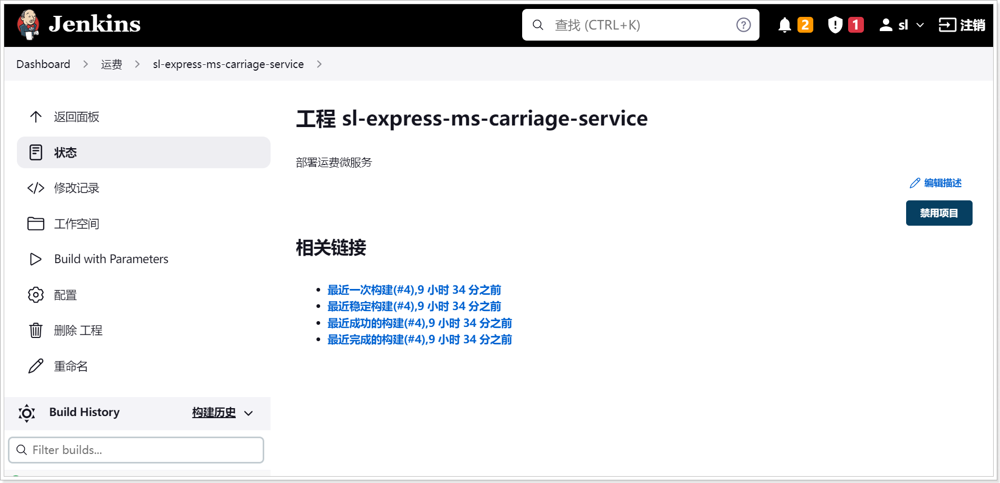

部署成功后进行测试，结果与本地一样。
## 5.5、用户端测试

用户下单时，需要根据收发地址计算运费，所以需要将用户端运行起来进行功能测试。
用户端的部署参考[《前端部署文档》](https://www.yuque.com/docs/share/90dee639-d6a5-48c7-a644-4829db1e47ae)。

需要启动如下所需要的服务，进行测试：


如果出现如下错误，是因为 `sl-express-ms-oms-service` 服务没有启动。

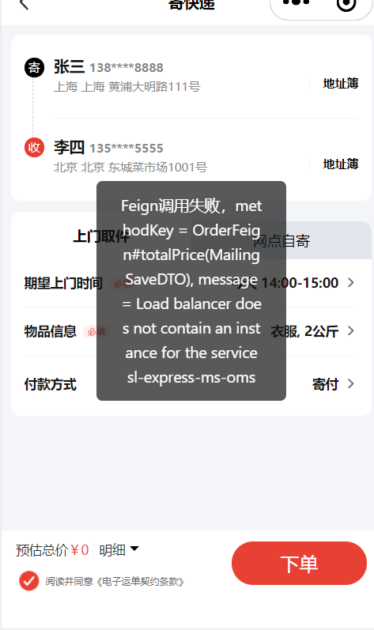

测试结果如下：


# 6、练习

需求：计算运费的第一步就是根据参数查询运费模板，而这个动作会访问数据库，并且是比较频繁的，然而运费模板的变更并不频繁，需要可以将运费模板缓存起来，以提高效率。

提示：

- 需要引入redis相关的依赖
- 增加redis相关的配置
- 编码实现缓存相关逻辑
# 7、面试连环问
:::info
面试官问：

- 你们的运费是怎么计算的？体积和重量怎么计算，到底以哪个为准？
- 详细聊聊你们的运费模板是做什么的？
- 有没有针对运费计算做什么优化？
:::
