# 课程安排

- 路线规划需求分析
- 熟悉路线规划项目工程
- 实现机构数据同步
- 实现路线管理
- 综合功能测试
# 1、背景说明
通过前面的Neo4j的学习，你已经基本掌握了Neo4j的使用，接下来就需要应用Neo4j来实现路线规划微服务了。
目前路线规划微服务中的代码框架基本上已经写好了，但是具体的实现并没有编写，所以就需要你来填充这些关键核心的代码。

# 2、需求分析
对于运输路线规划，总的需求有两个，一个是机构管理，一个是路线管理。
其中，机构的管理是需要与【权限管家】系统中的【组织管理】中的数据进行同步，该同步是需要通过MQ完成的。

路线管理，主要提供路线的维护，最核心的服务是提供路线规划查询服务。

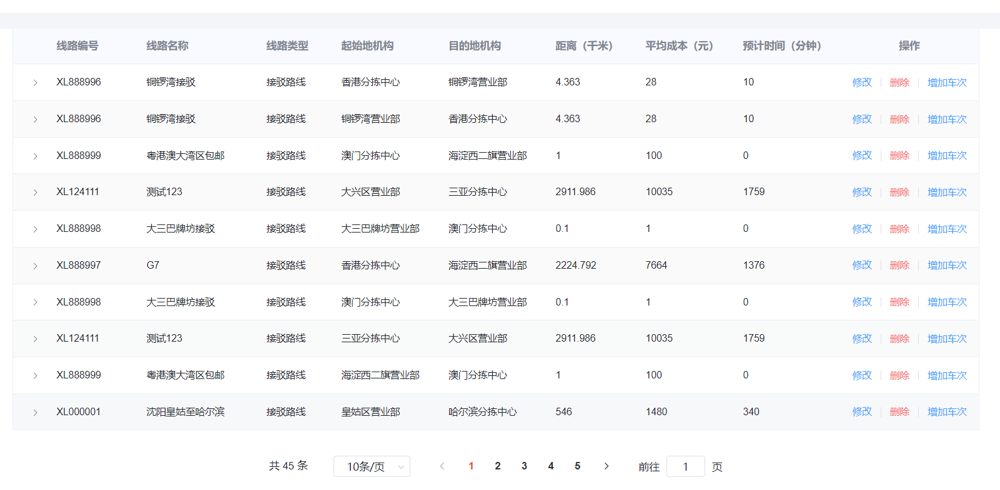
:::danger
需要说明的是，一个完整的运输路线是由多个转运节点组合完成的，并且每一个转运路线都是双向往返的，也就是A与B节点直接的路线必须是成对创建的。
:::
# 3、项目工程
## 3.1、拉取代码
拉取`sl-express-ms-transport`相关的代码：

| 工程名 | git地址 |
| --- | --- |
| sl-express-ms-transport-api | [http://git.sl-express.com/sl/sl-express-ms-transport-api](http://git.sl-express.com/sl/sl-express-ms-transport-api) |
| sl-express-ms-transport-domain | [http://git.sl-express.com/sl/sl-express-ms-transport-domain.git](http://git.sl-express.com/sl/sl-express-ms-transport-domain.git) |
| sl-express-ms-transport-service | [http://git.sl-express.com/sl/sl-express-ms-transport-service.git](http://git.sl-express.com/sl/sl-express-ms-transport-service.git) |


## 3.2、配置文件
在配置文件中引入了如下共享配置：

| 文件名 | 说明 |
| --- | --- |
| shared-spring-rabbitmq.yml | 关于rabbitmq的统一配置，其中有对于消息消费失败处理的配置项 |
| shared-spring-eaglemap.yml | 自研对接地图服务商的中台服务EagleMap的配置 |
| shared-spring-neo4j.yml | neo4j的相关配置 |

### 3.2.1、shared-spring-rabbitmq.yml
```yaml
#rabbitmq的基础配置
spring:
  rabbitmq: #mq的配置
    host: 192.168.150.101
    port: 5672
    username: sl
    password: sl321
    virtual-host: /dispatch
    publisher-confirm-type: correlated #发送消息的异步回调，记录消息是否发送成功
    publisher-returns: true #开启publish-return功能，消息到达交换机，但是没有到达对列表
    template:
      mandatory: true #消息路由失败时的策略, true: 调用ReturnCallback, false：丢弃消息
    listener:
      simple:
        acknowledge-mode: auto #，出现异常时返回nack，消息回滚到mq；没有异常，返回ack
        retry:
          enabled: true # 开启消费者失败重试
          initial-interval: 1000 # 初识的失败等待时长为1秒
          multiplier: 1 # 失败的等待时长倍数，下次等待时长 = multiplier * last-interval
          max-attempts: 3 # 最大重试次数
          stateless: true # true无状态；false有状态。如果业务中包含事务，这里改为false
```
### 3.2.2、shared-spring-eaglemap.yml
:::info
关于EagleMap使用，在后面讲解。
:::
```yaml
eagle:
  host: 192.168.150.101 #EagleMap服务地址
  port: 8484 #EagleMap服务端口
  timeout: 20000 #http请求的超时时间
```
### 3.2.3、shared-spring-neo4j.yml
```yaml
spring:
  data:
    neo4j:
      database: ${neo4j.database}
  neo4j:
    authentication:
      username: ${neo4j.username}
      password: ${neo4j.password}
    uri: ${neo4j.uri}
```
具体的参数值在`sl-express-transport.properties`文件中：
```properties
neo4j.uri=neo4j://192.168.150.101:7687
neo4j.username=neo4j
neo4j.password=neo4j123
neo4j.database=neo4j

jdbc.url = jdbc:mysql://192.168.150.101:3306/sl_transport?useUnicode=true&characterEncoding=utf8&autoReconnect=true&allowMultiQueries=true&useSSL=false
jdbc.username = root
jdbc.password = 123

#权限系统对接的交换机
rabbitmq.exchange = itcast-auth
```
## 3.3、代码结构
下面是路线规划微服务代码结构，主要是实现下面选中的部分：

:::danger
关于Entity，与sl-express-sdn工程的类似，只是属性多了一些，按照项目的业务需求制定的。
:::
Feign接口定义：

domain定义：

## 3.4、sl-express-mq
在项目中，为了统一使用RabbitMQ，所以将MQ的使用进行了封装，使用方法参考文档《[sl-express-mq使用手册](https://sl-express.itheima.net/#/zh-cn/modules/sl-express-mq)》
### 3.4.1、发送消息
对于发送消息的场景，正常情况没有问题，直接发送即可：
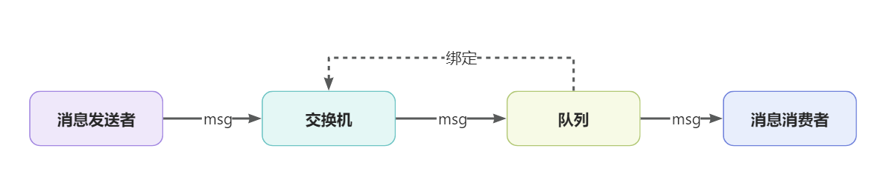
如果是非正常情况就需要特殊处理了，一般会有三种非正常情况需要处理：

- 第一种情况，消息发送到交换机（exchange），但是没有队列与交换机绑定，消息会丢失。
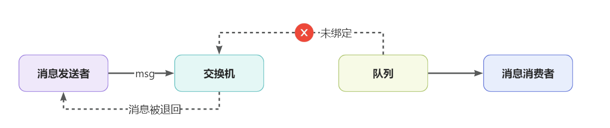
- 第二种情况，在消息的发送后进行确认，如果发送失败需要将消息持久化，例如：发送的交换机不存在的情况。

- 第三种情况，由于网络、MQ服务宕机等原因导致消息没有发送到MQ服务器。
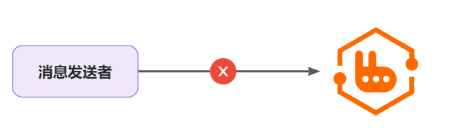

**第一种情况：**
对于消息只是到了交换机，并没有到达队列，这种情况记录日志即可，因为我们也不确定哪个队列需要这个消息。
配置如下（nacos中的`shared-spring-rabbitmq.yml`文件）：

```java
package com.sl.mq.config;

import cn.hutool.core.util.StrUtil;
import com.sl.transport.common.constant.Constants;
import lombok.extern.slf4j.Slf4j;
import org.springframework.amqp.rabbit.core.RabbitTemplate;
import org.springframework.beans.BeansException;
import org.springframework.context.ApplicationContext;
import org.springframework.context.ApplicationContextAware;
import org.springframework.context.annotation.Configuration;

@Slf4j
@Configuration
public class MessageConfig implements ApplicationContextAware {

    /**
     * 发送者回执 没有路由到队列的情况
     *
     * @param applicationContext 应用上下文
     * @throws BeansException 异常
     */
    @Override
    public void setApplicationContext(ApplicationContext applicationContext) throws BeansException {
        // 获取RabbitTemplate
        RabbitTemplate rabbitTemplate = applicationContext.getBean(RabbitTemplate.class);
        // 设置ReturnCallback
        rabbitTemplate.setReturnsCallback(message -> {
            if (StrUtil.contains(message.getExchange(), Constants.MQ.DELAYED_KEYWORD)) {
                //延迟消息没有发到队列是正常情况，无需记录日志
                return;
            }
            // 投递失败，记录日志
            log.error("消息没有投递到队列，应答码：{}，原因：{}，交换机：{}，路由键：{},消息：{}",
                    message.getReplyCode(), message.getReplyText(), message.getExchange(), message.getRoutingKey(), message.getMessage());
        });
    }

}

```
**第二种情况：**
在配文件中开启配置`publisher-confirm-type`，即可在发送消息时添加回调方法：

在代码中进行处理，将消息数据持久化到数据库中，后续通过xxl-job进行处理，将消息进行重新发送。

同样，如果出现异常情况也是将消息持久化：
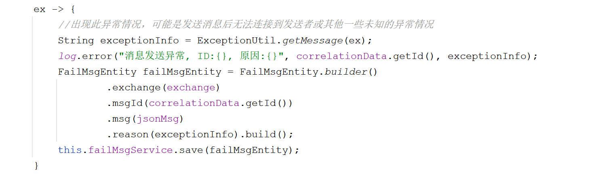
**第三种情况：**
将发送消息的代码进行try{}catch{}处理，如果出现异常会通过Spring-retry机制进重试，最多重试3次，如果依然失败就将消息数据进行持久化：
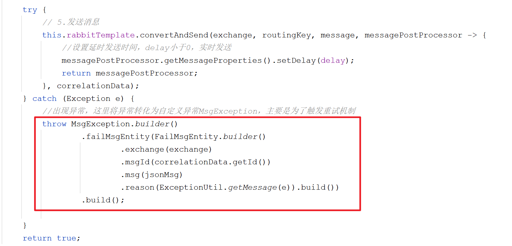
设置重试：

最终的落库操作：
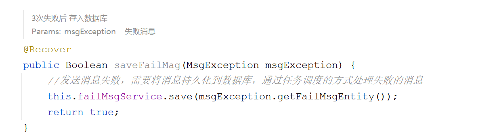
xxl-job任务，主要负责从数据库中查询出错误消息数据然后进行重试：
```java
package com.sl.mq.job;

import cn.hutool.core.collection.CollUtil;
import com.baomidou.mybatisplus.core.conditions.query.LambdaQueryWrapper;
import com.sl.mq.entity.FailMsgEntity;
import com.sl.mq.service.FailMsgService;
import com.sl.mq.service.MQService;
import com.xxl.job.core.handler.annotation.XxlJob;
import lombok.extern.slf4j.Slf4j;
import org.springframework.boot.autoconfigure.condition.ConditionalOnBean;
import org.springframework.stereotype.Component;

import javax.annotation.Resource;
import java.util.List;

/**
 * 失败消息的处理任务
 */
@Slf4j
@Component
@ConditionalOnBean({MQService.class, FailMsgService.class})
public class FailMsgJob {

    @Resource
    private FailMsgService failMsgService;
    @Resource
    private MQService mqService;

    @XxlJob("failMsgJob")
    public void execute() {
        //查询失败的数据，每次最多处理100条错误消息
        LambdaQueryWrapper<FailMsgEntity> queryWrapper = new LambdaQueryWrapper<FailMsgEntity>()
                .orderByAsc(FailMsgEntity::getCreated)
                .last("limit 100");
        List<FailMsgEntity> failMsgEntityList = this.failMsgService.list(queryWrapper);
        if (CollUtil.isEmpty(failMsgEntityList)) {
            return;
        }

        for (FailMsgEntity failMsgEntity : failMsgEntityList) {
            try {
                //发送消息
                this.mqService.sendMsg(failMsgEntity.getExchange(), failMsgEntity.getRoutingKey(), failMsgEntity.getMsg());
                //删除数据
                this.failMsgService.removeById(failMsgEntity.getId());
            } catch (Exception e) {
                log.error("处理错误消息失败, failMsgEntity = {}", failMsgEntity);
            }
        }
    }
}

```
xxl-job中的任务调度：

### 3.4.2、消费消息
对于消息的消费，首先采用的自动确认策略：

如果出现消费错误，会进行重试，最多重试3次：

如果3次后依然失败，需要将消息发送到指定的队列，为了区分不同的微服务，所以会针对不同微服务创建不同的队列，但是交换机是同一个：
```java
package com.sl.mq.config;

import com.sl.transport.common.constant.Constants;
import org.springframework.amqp.core.Binding;
import org.springframework.amqp.core.BindingBuilder;
import org.springframework.amqp.core.Queue;
import org.springframework.amqp.core.TopicExchange;
import org.springframework.amqp.rabbit.core.RabbitTemplate;
import org.springframework.amqp.rabbit.retry.MessageRecoverer;
import org.springframework.amqp.rabbit.retry.RepublishMessageRecoverer;
import org.springframework.beans.factory.annotation.Value;
import org.springframework.context.annotation.Bean;
import org.springframework.context.annotation.Configuration;

@Configuration
public class ErrorMessageConfig {

    @Value("${spring.application.name}") //获取微服务的名称
    private String appName;

    @Bean
    public TopicExchange errorMessageExchange() {
        //定义错误消息的交换机，类型为：topic
        return new TopicExchange(Constants.MQ.Exchanges.ERROR, true, false);
    }

    @Bean
    public Queue errorQueue() {
        //【前缀+微服务】名作为错误消息存放的队列名称，并且开启了持久化
        return new Queue(Constants.MQ.Queues.ERROR_PREFIX + appName, true);
    }

    @Bean
    public Binding errorBinding(Queue errorQueue, TopicExchange errorMessageExchange) {
        //完成绑定关系
        return BindingBuilder.bind(errorQueue).to(errorMessageExchange).with(appName);
    }

    @Bean
    public MessageRecoverer republishMessageRecoverer(RabbitTemplate rabbitTemplate) {
        //设置全部重试失败后进行重新发送消息，指定了交换机以及路由key
        //需要注意的是，路由key是应用名称，与上述的绑定关系中的路由key一致
        return new RepublishMessageRecoverer(rabbitTemplate, Constants.MQ.Exchanges.ERROR, appName);
    }
}

```
最终会以微服务名称创建队列：

其绑定关系如下：

### 3.4.3、统一封装
为了在各个微服务中方便发送消息，所以在`sl-express-ms-base`微服务中进行了封装，使用时`com.sl.ms.base.api.common.MQFeign`调用即可。
在base微服务中添加了配置以及启用Spring-retry机制：


使用示例如下：
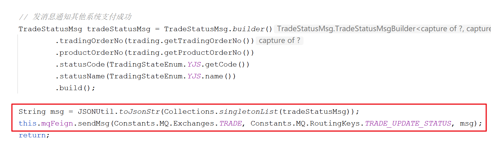
> **发送时指定交换机、路由key、消息内容、延时时间（毫秒）即可。**

# 4、机构同步
机构的新增、更新、删除是在权限管家中完成的，需要是操作后同步到路线规划微服务中，这里采用的是MQ消息通知的方式。
## 4.1、业务流程

权限管家的MQ配置是在 `/itcast/itcast-auth-server/application-test.properties`文件中，如下：

可以看出，消息发往的交换机为：itcast-auth，交换机的类型为：topic
发送消息的规则如下：
:::info

- 消息为json字符串
   - 如：{"type":"ORG","content":[{"managerId":"1","parentId":"0","name":"测试组织","id":"973902113476182273","status":true}],"operation":"UPDATE"}
- type表示变更的对象，比如组织：ORG 
- content为更改对象列表
- operation类型列表
   - 新增-ADD
   - 修改-UPDATE
   - 删除-DEL
   :::
   所以，对应的在`sl-express-transport.properties`中配置相同的交换机。
## 4.3、业务规范

上图是在权限管家中新增组织的界面，可以从界面中看出，添加的组织并没有标识是【网点】还是【转运中心】，所以，在这里我们做一下约定，按照机构名称的后缀进行区分，具体规则如下：

- xxx转运中心  →  一级转运中心（OLT）
- xxx分拣中心 →  二级转运中心 （TLT）
- xxx营业部  →  网点（AGENCY）
## 4.4、具体实现
```java
package com.sl.transport.mq;

import cn.hutool.core.util.StrUtil;
import cn.hutool.json.JSONObject;
import cn.hutool.json.JSONUtil;
import com.sl.transport.common.constant.Constants;
import com.sl.transport.entity.node.AgencyEntity;
import com.sl.transport.entity.node.BaseEntity;
import com.sl.transport.entity.node.OLTEntity;
import com.sl.transport.entity.node.TLTEntity;
import com.sl.transport.enums.OrganTypeEnum;
import com.sl.transport.service.IService;
import com.sl.transport.utils.OrganServiceFactory;
import lombok.extern.slf4j.Slf4j;
import org.springframework.amqp.core.ExchangeTypes;
import org.springframework.amqp.core.TopicExchange;
import org.springframework.amqp.rabbit.annotation.Exchange;
import org.springframework.amqp.rabbit.annotation.Queue;
import org.springframework.amqp.rabbit.annotation.QueueBinding;
import org.springframework.amqp.rabbit.annotation.RabbitListener;
import org.springframework.beans.factory.annotation.Value;
import org.springframework.context.annotation.Bean;
import org.springframework.stereotype.Component;

/**
 * 对于权限管家系统消息的处理
 */
@Slf4j
@Component
public class AuthMQListener {

    @RabbitListener(bindings = @QueueBinding(
            value = @Queue(name = Constants.MQ.Queues.AUTH_TRANSPORT),
            exchange = @Exchange(name = "${rabbitmq.exchange}", type = ExchangeTypes.TOPIC),
            key = "#"
    ))
    public void listenAgencyMsg(String msg) {
        //{"type":"ORG","operation":"ADD","content":[{"id":"977263044792942657","name":"55","parentId":"0","managerId":null,"status":true}]}
        log.info("接收到消息 -> {}", msg);
        JSONObject jsonObject = JSONUtil.parseObj(msg);
        String type = jsonObject.getStr("type");
        if (!StrUtil.equalsIgnoreCase(type, "ORG")) {
            //非机构消息
            return;
        }
        String operation = jsonObject.getStr("operation");
        JSONObject content = (JSONObject) jsonObject.getJSONArray("content").getObj(0);
        String name = content.getStr("name");
        Long parentId = content.getLong("parentId");

        IService iService;
        BaseEntity entity;
        if (StrUtil.endWith(name, "转运中心")) {
            //一级转运中心
            iService = OrganServiceFactory.getBean(OrganTypeEnum.OLT.getCode());
            entity = new OLTEntity();
            entity.setParentId(0L);
        } else if (StrUtil.endWith(name, "分拣中心")) {
            //二级转运中心
            iService = OrganServiceFactory.getBean(OrganTypeEnum.TLT.getCode());
            entity = new TLTEntity();
            entity.setParentId(parentId);
        } else if (StrUtil.endWith(name, "营业部")) {
            //网点
            iService = OrganServiceFactory.getBean(OrganTypeEnum.AGENCY.getCode());
            entity = new AgencyEntity();
            entity.setParentId(parentId);
        } else {
            return;
        }

        //设置参数
        entity.setBid(content.getLong("id"));
        entity.setName(name);
        entity.setStatus(content.getBool("status"));

        switch (operation) {
            case "ADD": {
                iService.create(entity);
                break;
            }
            case "UPDATE": {
                iService.update(entity);
                break;
            }
            case "DEL": {
                iService.deleteByBid(entity.getBid());
                break;
            }
        }

    }

}

```
:::danger
由于Service还没有具体实现，暂时不对代码测试，后面实现后进行测试。
:::
# 5、IService
在Service中一些方法是通用的，比如新增、更新、删除等，这个通用的方法可以写到一个Service中，其他的Service继承该Service即可。
## 5.1、IService
接口定义：
```java
package com.sl.transport.service;

import com.sl.transport.entity.node.BaseEntity;

/**
 * 基础服务实现
 */
public interface IService<T extends BaseEntity> {

    /**
     * 根据业务id查询数据
     *
     * @param bid 业务id
     * @return 节点数据
     */
    T queryByBid(Long bid);

    /**
     * 新增节点
     *
     * @param t 节点数据
     * @return 新增的节点数据
     */
    T create(T t);

    /**
     * 更新节点
     *
     * @param t 节点数据
     * @return 更新的节点数据
     */
    T update(T t);

    /**
     * 根据业务id删除数据
     *
     * @param bid 业务id
     * @return 是否删除成功
     */
    Boolean deleteByBid(Long bid);

}

```
## 5.2、ServiceImpl
下面编写具体的实现类：
```java
package com.sl.transport.service.impl;

import cn.hutool.core.bean.BeanUtil;
import cn.hutool.core.bean.copier.CopyOptions;
import com.sl.transport.common.util.ObjectUtil;
import com.sl.transport.entity.node.BaseEntity;
import com.sl.transport.repository.BaseRepository;
import com.sl.transport.service.IService;
import org.springframework.beans.factory.annotation.Autowired;

/**
 * 基础服务的实现
 */
public class ServiceImpl<R extends BaseRepository, T extends BaseEntity> implements IService<T> {

    @Autowired
    private R repository;

    @Override
    public T queryByBid(Long bid) {
        return (T) this.repository.findByBid(bid).orElse(null);
    }

    @Override
    public T create(T t) {
        t.setId(null);//id由neo4j自动生成
        return (T) this.repository.save(t);
    }

    @Override
    public T update(T t) {
        //先查询，再更新
        T tData = this.queryByBid(t.getBid());
        if (ObjectUtil.isEmpty(tData)) {
            return null;
        }
        BeanUtil.copyProperties(t, tData, CopyOptions.create().ignoreNullValue().setIgnoreProperties("id", "bid"));
        return (T) this.repository.save(tData);
    }

    @Override
    public Boolean deleteByBid(Long bid) {
        return this.repository.deleteByBid(bid) > 0;
    }
}

```
## 5.3、AgencyServiceImpl
网点服务实现类：
```java
package com.sl.transport.service.impl;

import com.sl.transport.entity.node.AgencyEntity;
import com.sl.transport.repository.AgencyRepository;
import com.sl.transport.service.AgencyService;
import org.springframework.stereotype.Service;

@Service
public class AgencyServiceImpl extends ServiceImpl<AgencyRepository, AgencyEntity> implements AgencyService {

}

```
## 5.4、OLTServiceImpl
一级转运中心服务实现类：
```java
package com.sl.transport.service.impl;

import com.sl.transport.entity.node.OLTEntity;
import com.sl.transport.repository.OLTRepository;
import com.sl.transport.service.OLTService;
import org.springframework.stereotype.Service;

@Service
public class OLTServiceImpl extends ServiceImpl<OLTRepository, OLTEntity>
        implements OLTService {
}

```
## 5.5、TLTServiceImpl
二级转运中心服务实现类：
```java
package com.sl.transport.service.impl;

import com.sl.transport.entity.node.TLTEntity;
import com.sl.transport.repository.TLTRepository;
import com.sl.transport.service.TLTService;
import org.springframework.stereotype.Service;

@Service
public class TLTServiceImpl extends ServiceImpl<TLTRepository, TLTEntity>
        implements TLTService {

}

```
## 5.6、单元测试
编写测试用例：
```java
package com.sl.transport.service;

import com.sl.transport.entity.node.AgencyEntity;
import org.junit.jupiter.api.Test;
import org.springframework.boot.test.context.SpringBootTest;

import javax.annotation.Resource;

@SpringBootTest
class AgencyServiceTest {

    @Resource
    private AgencyService agencyService;

    @Test
    public void testQueryByBid(){
        AgencyEntity agencyEntity = this.agencyService.queryByBid(25073L);
        System.out.println(agencyEntity);
		//AgencyEntity(super=BaseEntity(id=18, parentId=null, bid=25073, name=江苏省南京市玄武区紫金墨香苑, managerName=null, phone=025-58765331,025-83241955,025-83241881, address=栖霞区燕尧路100号, location=Point [x=32.117016, y=118.863193], status=null, extra=null))
    }

}
```
> 🚨注意：需要将OrganController、TransportLineController中的@RestController注释掉才能测试，否则会抛出异常。

## 5.7、测试机构同步
将Neo4j中的数据全部删除：`MATCH (n) DETACH DELETE n`
创建机构：
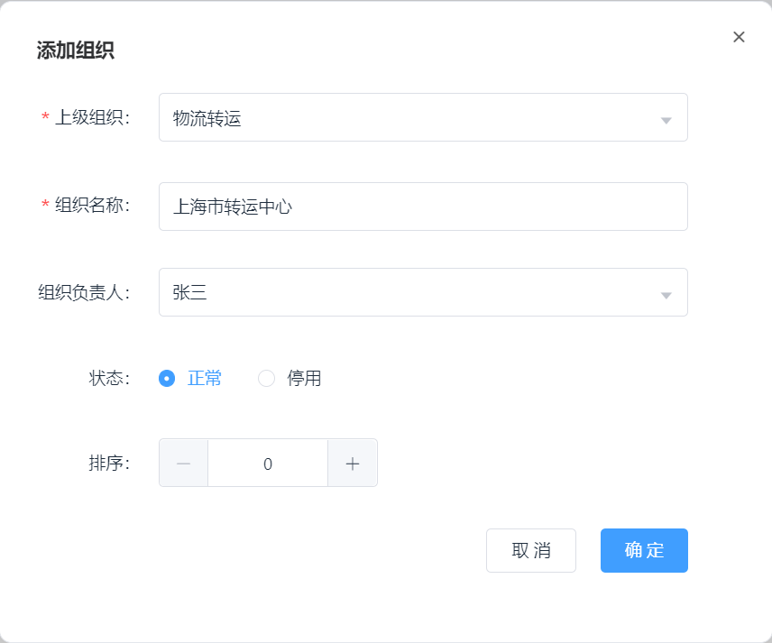
可以看到对应的Neo4j中已经有数据：

同理可以测试更新、删除操作。
# 6、机构管理
按照业务系统的需求，会通过bid查询机构，无需指定type，也就是说，我们需要将网点和转运中心都看作是机构，需要实现两个查询方法：

- 根据bid查询
- 查询机构列表
## 6.1、接口定义
```java
package com.sl.transport.service;

import com.sl.transport.domain.OrganDTO;

import java.util.List;

/**
 * @author zzj
 * @version 1.0
 */
public interface OrganService {

    /**
     * 无需指定type，根据id查询
     *
     * @param bid 机构id
     * @return 机构信息
     */
    OrganDTO findByBid(Long bid);

    /**
     * 无需指定type，根据ids查询
     *
     * @param bids 机构ids
     * @return 机构信息
     */
    List<OrganDTO> findByBids(List<Long> bids);

    /**
     * 查询所有的机构，如果name不为空的按照name模糊查询
     *
     * @param name 机构名称
     * @return 机构列表
     */
    List<OrganDTO> findAll(String name);

    /**
     * 查询机构树
     * @return 机构树
     */
    String findAllTree();
}

```
## 6.2、具体实现
```java
package com.sl.transport.service.impl;

import cn.hutool.core.bean.BeanUtil;
import cn.hutool.core.collection.CollUtil;
import cn.hutool.core.lang.tree.Tree;
import cn.hutool.core.lang.tree.TreeUtil;
import cn.hutool.core.util.ObjectUtil;
import com.fasterxml.jackson.core.JsonProcessingException;
import com.fasterxml.jackson.databind.ObjectMapper;
import com.sl.transport.common.exception.SLException;
import com.sl.transport.domain.OrganDTO;
import com.sl.transport.enums.ExceptionEnum;
import com.sl.transport.repository.OrganRepository;
import com.sl.transport.service.OrganService;
import org.springframework.stereotype.Service;

import javax.annotation.Resource;
import java.util.List;

@Service
public class OrganServiceImpl implements OrganService {
    @Resource
    private OrganRepository organRepository;
    @Resource
    private ObjectMapper objectMapper;

    @Override
    public OrganDTO findByBid(Long bid) {
        OrganDTO organDTO = this.organRepository.findByBid(bid);
        if (ObjectUtil.isNotEmpty(organDTO)) {
            return organDTO;
        }
        throw new SLException(ExceptionEnum.ORGAN_NOT_FOUND);
    }

    @Override
    public List<OrganDTO> findByBids(List<Long> bids) {
        List<OrganDTO> organDTOS = this.organRepository.findByBids(bids);
        if (ObjectUtil.isNotEmpty(organDTOS)) {
            return organDTOS;
        }
        throw new SLException(ExceptionEnum.ORGAN_NOT_FOUND);
    }

    @Override
    public List<OrganDTO> findAll(String name) {
        return this.organRepository.findAll(name);
    }

    @Override
    public String findAllTree() {
        return "";
    }
}

```
## 6.3、OrganRepositoryImpl
下面对于OrganRepository接口进行实现：
```java
package com.sl.transport.repository.impl;

import cn.hutool.core.bean.BeanUtil;
import cn.hutool.core.collection.CollUtil;
import cn.hutool.core.collection.ListUtil;
import cn.hutool.core.util.ObjectUtil;
import cn.hutool.core.util.StrUtil;
import com.sl.transport.domain.OrganDTO;
import com.sl.transport.enums.OrganTypeEnum;
import com.sl.transport.repository.OrganRepository;
import org.neo4j.driver.internal.InternalPoint2D;
import org.springframework.data.neo4j.core.Neo4jClient;
import org.springframework.stereotype.Component;

import javax.annotation.Resource;
import java.util.List;
import java.util.Map;

@Component
public class OrganRepositoryImpl implements OrganRepository {

    @Resource
    private Neo4jClient neo4jClient;

    @Override
    public OrganDTO findByBid(Long bid) {
        String cypherQuery = StrUtil.format("MATCH (n)\n" +
                "WHERE n.bid = {}\n" +
                "RETURN n", bid);
        return CollUtil.getFirst(executeQuery(cypherQuery));
    }

    @Override
    public List<OrganDTO> findByBids(List<Long> bids) {
        String cypherQuery = StrUtil.format("MATCH (n)\n" +
                "WHERE n.bid in {}\n" +
                "RETURN n", bids);
        return executeQuery(cypherQuery);
    }

    @Override
    public List<OrganDTO> findAll(String name) {
        name = StrUtil.removeAll(name, '\'', '"');
        String cypherQuery = StrUtil.isEmpty(name) ?
                "MATCH (n) RETURN n" :
                StrUtil.format("MATCH (n) WHERE n.name CONTAINS '{}' RETURN n", name);
        return executeQuery(cypherQuery);
    }

    private List<OrganDTO> executeQuery(String cypherQuery) {
        return ListUtil.toList(this.neo4jClient.query(cypherQuery)
                .fetchAs(OrganDTO.class) //设置响应的类型
                .mappedBy((typeSystem, record) -> { //对结果进行封装处理
                    Map<String, Object> map = record.get("n").asMap();
                    OrganDTO organDTO = BeanUtil.toBean(map, OrganDTO.class);
                    InternalPoint2D location = (InternalPoint2D) map.get("location");
                    if (ObjectUtil.isNotEmpty(location)) {
                        organDTO.setLongitude(location.x());
                        organDTO.setLatitude(location.y());
                    }
                    //获取类型
                    String type = CollUtil.getFirst(record.get("n").asNode().labels());
                    organDTO.setType(OrganTypeEnum.valueOf(type).getCode());
                    return organDTO;
                }).all());
    }
}

```
## 6.4、测试用例
```java
package com.sl.transport.service;

import com.sl.transport.domain.OrganDTO;
import org.junit.jupiter.api.Test;
import org.springframework.boot.test.context.SpringBootTest;

import javax.annotation.Resource;

import java.util.List;

import static org.junit.jupiter.api.Assertions.*;

@SpringBootTest
class OrganServiceTest {

    @Resource
    private OrganService organService;

    @Test
    void findByBid() {
		//bid值要改成自己neo4j中的值
        OrganDTO organDTO = this.organService.findByBid(1012479939628238305L);
        System.out.println(organDTO);
    }

    @Test
    void findAll() {
		//查询包含“上海”关键字的机构
        List<OrganDTO> list = this.organService.findAll("上海");
        list.forEach(System.out::println);
    }
}
```
## 6.5、整合测试
基于swagger接口进行测试：[http://127.0.0.1:18083/doc.html](http://127.0.0.1:18083/doc.html)
:::danger
测试时，由于部分Service还没有实现，会导致启动报错，所以需要将报错Controller中的@RestController注释掉。
:::

## 6.6、树形结构
在后台系统中，对于机构数据的展现需要通过树形结构展现，如下：

所以在`com.sl.transport.service.OrganService`中`findAllTree()`方法中封装了树形结构。
具体的封装逻辑采用hutool工具包中的TreeUtil，参考文档：[点击查看](https://www.hutool.cn/docs/#/core/%E8%AF%AD%E8%A8%80%E7%89%B9%E6%80%A7/%E6%A0%91%E7%BB%93%E6%9E%84/%E6%A0%91%E7%BB%93%E6%9E%84%E5%B7%A5%E5%85%B7-TreeUtil)
代码实现如下：
```java
    @Override
    public String findAllTree() {
        List<OrganDTO> organList = this.findAll(null);
        if (CollUtil.isEmpty(organList)) {
            return "";
        }

        //构造树结构
        List<Tree<Long>> treeNodes = TreeUtil.build(organList, 0L,
                (organDTO, tree) -> {
                    tree.setId(organDTO.getId());
                    tree.setParentId(organDTO.getParentId());
                    tree.putAll(BeanUtil.beanToMap(organDTO));
                    tree.remove("bid");
                });

        try {
            return this.objectMapper.writeValueAsString(treeNodes);
        } catch (JsonProcessingException e) {
            throw new SLException("序列化json出错！", e);
        }
    }
```
数据类似这样：
```json
[
    {
        "id": "1012438698496623009",
        "parentId": "0",
        "name": "上海市转运中心",
        "type": 1,
        "phone": null,
        "address": null,
        "latitude": null,
        "longitude": null,
        "managerName": null,
        "extra": null,
        "status": true,
        "children": [
            {
                "id": "1012479939628238305",
                "parentId": "1012438698496623009",
                "name": "浦东区分拣中心",
                "type": 2,
                "phone": null,
                "address": null,
                "latitude": null,
                "longitude": null,
                "managerName": null,
                "extra": null,
                "status": true
            }
        ]
    },
    {
        "id": "1012479716659037537",
        "parentId": "0",
        "name": "北京市转运中心",
        "type": 1,
        "phone": null,
        "address": null,
        "latitude": null,
        "longitude": null,
        "managerName": null,
        "extra": null,
        "status": true
    }
]
```
功能测试：

> 🔔如果测试没有数据，需要自行在权限管家中创建相对应的网点、转运中心等数据，进行测试。

## 6.7、编辑机构
在后台系统中可以对机构数据进行编辑，主要是填充一些属性数据，例如：经纬度、详细地址。如下：
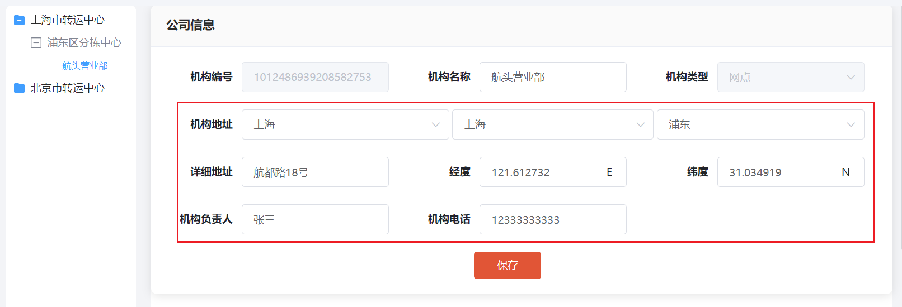
经纬度是如何计算出来的呢？这里使用的是高德地图的API进行查询的，将中文字段转化为经纬度值，我们是直接调用的高德地图的API吗，不是的，我们是通过EagleMap调用的。
### 6.7.1、EagleMap介绍
EagleMap是黑马程序员研究院自研的地图中台服务，它可以对接多个地图服务商，目前已经完成百度地图和高德地图的对接。
目前EagleMap已经部署安装在101机器中，配置文件所在的位置：`/itcast/eaglemap/app/application.yml`
:::danger
在这里强烈建议将高德地图的ak改成自己的，不要使用默认的，因为使用人多了可能会被封号，将不能正常使用。更改了ak后，要记得重启EagleMap服务`docker restart eagle-map-server`

**web API的申请：**[https://lbs.amap.com/dev/key](https://lbs.amap.com/dev/key)
**申请时注意【服务平台】选项，需要申请【Web端(JS API)】和【Web服务】的key。**
:::
具体的使用，参考sdk使用手册：
# 7、路线管理
路线管理是在路线规划中核心的功能，用户在下单时、订单转运单时会进行调用路线规划，后台系统对路线进行维护管理。路线类型如下：

- **干线**
   - 一级转运中心到一级转运中心
- **支线**
   - 一级转运中心与二级转运中心之间线路
- **接驳路线**
   - 二级转运中心到网点
- **专线（暂时不支持）**
   - 任务城市到任意城市
- **临时线路（暂时不支持）**
   - 任意转运中心到任意转运中心
   :::danger
    新增路线业务规则：干线：起点终点无顺序，支线：起点必须是二级转运中心，接驳路线：起点必须是网点  
   :::
## 7.1、业务流程

### 7.2.1、接口定义
```java
package com.sl.transport.repository;

import com.sl.transport.common.util.PageResponse;
import com.sl.transport.domain.TransportLineNodeDTO;
import com.sl.transport.domain.TransportLineSearchDTO;
import com.sl.transport.entity.line.TransportLine;
import com.sl.transport.entity.node.AgencyEntity;
import com.sl.transport.entity.node.BaseEntity;

import java.util.List;

/**
 * 运输路线查询
 */
public interface TransportLineRepository {

    /**
     * 查询两个网点之间最短的路线，查询深度为：10
     *
     * @param start 开始网点
     * @param end   结束网点
     * @return 路线
     */
    TransportLineNodeDTO findShortestPath(AgencyEntity start, AgencyEntity end);

    /**
     * 查询两个网点之间最短的路线，最大查询深度为：10
     *
     * @param start 开始网点
     * @param end   结束网点
     * @param depth 查询深度，最大为：10
     * @return 路线
     */
    TransportLineNodeDTO findShortestPath(AgencyEntity start, AgencyEntity end, int depth);

    /**
     * 查询两个网点之间的路线列表，成本优先 > 转运节点优先
     *
     * @param start 开始网点
     * @param end   结束网点
     * @param depth 查询深度
     * @param limit 返回路线的数量
     * @return 路线
     */
    List<TransportLineNodeDTO> findPathList(AgencyEntity start, AgencyEntity end, int depth, int limit);

    /**
     * 查询数据节点之间的关系数量
     *
     * @param firstNode  第一个节点
     * @param secondNode 第二个节点
     * @return 数量
     */
    Long queryCount(BaseEntity firstNode, BaseEntity secondNode);

    /**
     * 新增路线
     *
     * @param firstNode     第一个节点
     * @param secondNode    第二个节点
     * @param transportLine 路线数据
     * @return 新增关系的数量
     */
    Long create(BaseEntity firstNode, BaseEntity secondNode, TransportLine transportLine);

    /**
     * 更新路线
     *
     * @param transportLine 路线数据
     * @return 更新的数量
     */
    Long update(TransportLine transportLine);

    /**
     * 删除路线
     *
     * @param lineId 关系id
     * @return 删除关系的数量
     */
    Long remove(Long lineId);

    /**
     * 分页查询路线
     *
     * @param transportLineSearchDTO 搜索参数
     * @return 路线列表
     */
    PageResponse<TransportLine> queryPageList(TransportLineSearchDTO transportLineSearchDTO);


    /**
     * 根据ids批量查询路线
     *
     * @param ids id列表
     * @return 路线列表
     */
    List<TransportLine> queryByIds(Long... ids);

    /**
     * 根据id查询路线
     *
     * @param id 路线id
     * @return 路线数据
     */
    TransportLine queryById(Long id);
}

```
### 7.2.2、接口实现
```java
package com.sl.transport.repository.impl;

import cn.hutool.core.bean.BeanUtil;
import cn.hutool.core.collection.CollUtil;
import cn.hutool.core.collection.ListUtil;
import cn.hutool.core.convert.Convert;
import cn.hutool.core.map.MapUtil;
import cn.hutool.core.util.ObjectUtil;
import cn.hutool.core.util.PageUtil;
import cn.hutool.core.util.StrUtil;
import com.sl.transport.common.util.PageResponse;
import com.sl.transport.domain.TransportLineNodeDTO;
import com.sl.transport.domain.TransportLineSearchDTO;
import com.sl.transport.entity.line.TransportLine;
import com.sl.transport.entity.node.AgencyEntity;
import com.sl.transport.entity.node.BaseEntity;
import com.sl.transport.repository.TransportLineRepository;
import com.sl.transport.utils.TransportLineUtils;
import org.neo4j.driver.Record;
import org.neo4j.driver.internal.value.PathValue;
import org.neo4j.driver.types.Relationship;
import org.springframework.data.neo4j.core.Neo4jClient;
import org.springframework.data.neo4j.core.schema.Node;
import org.springframework.stereotype.Component;

import javax.annotation.Resource;
import java.util.Collection;
import java.util.List;
import java.util.Map;
import java.util.Optional;

/**
 * 对于路线的各种操作
 */
@Component
public class TransportLineRepositoryImpl implements TransportLineRepository {

    @Resource
    private Neo4jClient neo4jClient;

    @Override
    public TransportLineNodeDTO findShortestPath(AgencyEntity start, AgencyEntity end) {
        return this.findShortestPath(start, end, 10);
    }

    @Override
    public TransportLineNodeDTO findShortestPath(AgencyEntity start, AgencyEntity end, int depth) {
        //获取网点数据在Neo4j中的类型
        String type = AgencyEntity.class.getAnnotation(Node.class).value()[0];
        //构造查询语句
        String cypherQuery = StrUtil.format(
                "MATCH path = shortestPath((start:{}) -[*..{}]-> (end:{}))\n" +
                        "WHERE start.bid = $startId AND end.bid = $endId AND start.status = true AND end.status = true\n" +
                        "RETURN path", type, depth, type);
        Collection<TransportLineNodeDTO> transportLineNodeDTOS = this.executeQueryPath(cypherQuery, start, end);
        if (CollUtil.isEmpty(transportLineNodeDTOS)) {
            return null;
        }
        for (TransportLineNodeDTO transportLineNodeDTO : transportLineNodeDTOS) {
            return transportLineNodeDTO;
        }
        return null;
    }

    private List<TransportLineNodeDTO> executeQueryPath(String cypherQuery, AgencyEntity start, AgencyEntity end) {
        return ListUtil.toList(this.neo4jClient.query(cypherQuery)
                .bind(start.getBid()).to("startId") //设置参数
                .bind(end.getBid()).to("endId") //设置参数
                .fetchAs(TransportLineNodeDTO.class) //设置响应的类型
                .mappedBy((typeSystem, record) -> { //对结果进行封装处理
                    PathValue pathValue = (PathValue) record.get(0);
                    return TransportLineUtils.convert(pathValue);
                }).all());
    }

    @Override
    public List<TransportLineNodeDTO> findPathList(AgencyEntity start, AgencyEntity end, int depth, int limit) {
        //获取网点数据在Neo4j中的类型
        String type = AgencyEntity.class.getAnnotation(Node.class).value()[0];
        //构造查询语句
        String cypherQuery = StrUtil.format(
                "MATCH path = (start:{}) -[*..{}]-> (end:{})\n" +
                        "WHERE start.bid = $startId AND end.bid = $endId AND start.status = true AND end.status = true\n" +
                        "UNWIND relationships(path) AS r\n" +
                        "WITH sum(r.cost) AS cost, path\n" +
                        "RETURN path ORDER BY cost ASC, LENGTH(path) ASC LIMIT {}", type, depth, type, limit);
        return this.executeQueryPath(cypherQuery, start, end);
    }

    @Override
    public Long queryCount(BaseEntity firstNode, BaseEntity secondNode) {
        String firstNodeType = firstNode.getClass().getAnnotation(Node.class).value()[0];
        String secondNodeType = secondNode.getClass().getAnnotation(Node.class).value()[0];
        String cypherQuery = StrUtil.format(
                "MATCH (m:{}) -[r]- (n:{})\n" +
                        "WHERE m.bid = $firstBid AND n.bid = $secondBid\n" +
                        "RETURN count(r) AS c", firstNodeType, secondNodeType);
        Optional<Long> optional = this.neo4jClient.query(cypherQuery)
                .bind(firstNode.getBid()).to("firstBid")
                .bind(secondNode.getBid()).to("secondBid")
                .fetchAs(Long.class)
                .mappedBy((typeSystem, record) -> Convert.toLong(record.get("c")))
                .one();
        return optional.orElse(0L);
    }

    @Override
    public Long create(BaseEntity firstNode, BaseEntity secondNode, TransportLine transportLine) {
        String firstNodeType = firstNode.getClass().getAnnotation(Node.class).value()[0];
        String secondNodeType = secondNode.getClass().getAnnotation(Node.class).value()[0];
        String cypherQuery = StrUtil.format(
                "MATCH (m:{} {bid : $firstBid})\n" +
                        "WITH m\n" +
                        "MATCH (n:{} {bid : $secondBid})\n" +
                        "WITH m,n\n" +
                        "CREATE\n" +
                        " (m) -[r:IN_LINE {cost:$cost, number:$number, type:$type, name:$name, distance:$distance, time:$time, extra:$extra, startOrganId:$startOrganId, endOrganId:$endOrganId,created:$created, updated:$updated}]-> (n),\n" +
                        " (m) <-[:OUT_LINE {cost:$cost, number:$number, type:$type, name:$name, distance:$distance, time:$time, extra:$extra, startOrganId:$endOrganId, endOrganId:$startOrganId, created:$created, updated:$updated}]- (n)\n" +
                        "RETURN count(r) AS c", firstNodeType, secondNodeType);
        Optional<Long> optional = this.neo4jClient.query(cypherQuery)
                .bindAll(BeanUtil.beanToMap(transportLine))
                .bind(firstNode.getBid()).to("firstBid")
                .bind(secondNode.getBid()).to("secondBid")
                .fetchAs(Long.class)
                .mappedBy((typeSystem, record) -> Convert.toLong(record.get("c")))
                .one();
        return optional.orElse(0L);
    }

    @Override
    public Long update(TransportLine transportLine) {
        String cypherQuery = "MATCH () -[r]-> ()\n" +
                "WHERE id(r) = $id\n" +
                "SET r.cost = $cost , r.number = $number, r.name = $name ,r.distance = $distance ,r.time = $time, r.startOrganId = $startOrganId, r.endOrganId = $endOrganId, r.updated = $updated , r.extra = $extra \n" +
                "RETURN count(r) AS c";
        Optional<Long> optional = this.neo4jClient.query(cypherQuery)
                .bindAll(BeanUtil.beanToMap(transportLine))
                .fetchAs(Long.class)
                .mappedBy((typeSystem, record) -> Convert.toLong(record.get("c")))
                .one();
        return optional.orElse(0L);
    }

    @Override
    public Long remove(Long lineId) {
        String cypherQuery = "MATCH () -[r]-> ()\n" +
                "WHERE id(r) = $lineId\n" +
                "DETACH DELETE r\n" +
                "RETURN count(r) AS c";
        Optional<Long> optional = this.neo4jClient.query(cypherQuery)
                .bind(lineId).to("lineId")
                .fetchAs(Long.class)
                .mappedBy((typeSystem, record) -> Convert.toLong(record.get("c")))
                .one();
        return optional.orElse(0L);
    }

    @Override
    public PageResponse<TransportLine> queryPageList(TransportLineSearchDTO transportLineSearchDTO) {
        int page = Math.max(transportLineSearchDTO.getPage(), 1);
        int pageSize = transportLineSearchDTO.getPageSize();
        int skip = (page - 1) * pageSize;
        Map<String, Object> searchParam = BeanUtil.beanToMap(transportLineSearchDTO, false, true);
        MapUtil.removeAny(searchParam, "page", "pageSize");
        //构建查询语句，第一个是查询数据，第二个是查询数量
        String[] cyphers = this.buildPageQueryCypher(searchParam);
        String cypherQuery = cyphers[0];

        //数据
        List<TransportLine> list = ListUtil.toList(this.neo4jClient.query(cypherQuery)
                .bind(skip).to("skip")
                .bind(pageSize).to("limit")
                .bindAll(searchParam)
                .fetchAs(TransportLine.class)
                .mappedBy((typeSystem, record) -> {
                    //封装数据
                    return this.toTransportLine(record);
                }).all());

        // 数据总数
        String countCypher = cyphers[1];
        Long total = this.neo4jClient.query(countCypher)
                .bindAll(searchParam)
                .fetchAs(Long.class)
                .mappedBy((typeSystem, record) -> Convert.toLong(record.get("c")))
                .one().orElse(0L);

        PageResponse<TransportLine> pageResponse = new PageResponse<>();
        pageResponse.setPage(page);
        pageResponse.setPageSize(pageSize);
        pageResponse.setItems(list);
        pageResponse.setCounts(total);
        Long pages = Convert.toLong(PageUtil.totalPage(Convert.toInt(total), pageSize));
        pageResponse.setPages(pages);

        return pageResponse;
    }

    private String[] buildPageQueryCypher(Map<String, Object> searchParam) {
        String queryCypher;
        String countCypher;
        if (CollUtil.isEmpty(searchParam)) {
            //无参数
            queryCypher = "MATCH (m) -[r]-> (n) RETURN m,r,n ORDER BY id(r) DESC SKIP $skip LIMIT $limit";
            countCypher = "MATCH () -[r]-> () RETURN count(r) AS c";
        } else {
            //有参数
            String cypherPrefix = "MATCH (m) -[r]-> (n)";
            StringBuilder sb = new StringBuilder();
            sb.append(cypherPrefix).append(" WHERE 1=1 ");
            for (String key : searchParam.keySet()) {
                Object value = searchParam.get(key);
                if (value instanceof String) {
                    if (StrUtil.isNotBlank(Convert.toStr(value))) {
                        sb.append(StrUtil.format("AND r.{} CONTAINS ${} \n", key, key));
                    }
                } else {
                    sb.append(StrUtil.format("AND r.{} = ${} \n", key, key));
                }
            }
            String cypher = sb.toString();
            queryCypher = cypher + "RETURN m,r,n ORDER BY id(r) DESC SKIP $skip LIMIT $limit";
            countCypher = cypher + "RETURN count(r) AS c";
        }
        return new String[]{queryCypher, countCypher};
    }

    @Override
    public List<TransportLine> queryByIds(Long... ids) {
        String cypherQuery = "MATCH (m) -[r]-> (n)\n" +
                "WHERE id(r) in $ids\n" +
                "RETURN m,r,n";
        return ListUtil.toList(this.neo4jClient.query(cypherQuery)
                .bind(ids).to("ids")
                .fetchAs(TransportLine.class)
                .mappedBy((typeSystem, record) -> {
                    //封装数据
                    return this.toTransportLine(record);
                }).all());
    }

    private TransportLine toTransportLine(Record record) {
        org.neo4j.driver.types.Node startNode = record.get("m").asNode();
        org.neo4j.driver.types.Node endNode = record.get("n").asNode();
        Relationship relationship = record.get("r").asRelationship();
        Map<String, Object> map = relationship.asMap();

        TransportLine transportLine = BeanUtil.toBeanIgnoreError(map, TransportLine.class);
        transportLine.setStartOrganName(startNode.get("name").asString());
        transportLine.setStartOrganId(startNode.get("bid").asLong());
        transportLine.setEndOrganName(endNode.get("name").asString());
        transportLine.setEndOrganId(endNode.get("bid").asLong());
        transportLine.setId(relationship.id());
        return transportLine;
    }

    @Override
    public TransportLine queryById(Long id) {
        List<TransportLine> transportLines = this.queryByIds(id);
        if (CollUtil.isNotEmpty(transportLines)) {
            return transportLines.get(0);
        }
        return null;
    }

}

```
## 7.3、路线Service
### 7.3.1、接口定义
```java
package com.sl.transport.service;

import com.sl.transport.common.util.PageResponse;
import com.sl.transport.domain.TransportLineNodeDTO;
import com.sl.transport.domain.TransportLineSearchDTO;
import com.sl.transport.entity.line.TransportLine;

import java.util.List;

/**
 * 计算路线相关业务
 */
public interface TransportLineService {

    /**
     * 新增路线
     *
     * @param transportLine 路线数据
     * @return 是否成功
     */
    Boolean createLine(TransportLine transportLine);

    /**
     * 更新路线
     *
     * @param transportLine 路线数据
     * @return 是否成功
     */
    Boolean updateLine(TransportLine transportLine);

    /**
     * 删除路线
     *
     * @param id 路线id
     * @return 是否成功
     */
    Boolean deleteLine(Long id);

    /**
     * 分页查询路线
     *
     * @param transportLineSearchDTO 搜索参数
     * @return 路线列表
     */
    PageResponse<TransportLine> queryPageList(TransportLineSearchDTO transportLineSearchDTO);

    /**
     * 查询两个网点之间最短的路线，最大查询深度为：10
     *
     * @param startId 开始网点id
     * @param endId   结束网点id
     * @return 路线
     */
    TransportLineNodeDTO queryShortestPath(Long startId, Long endId);

    /**
     * 查询两个网点之间成本最低的路线，最大查询深度为：10
     *
     * @param startId 开始网点id
     * @param endId   结束网点id
     * @return 路线集合
     */
    TransportLineNodeDTO findLowestPath(Long startId, Long endId);

    /**
     * 根据调度策略查询路线
     *
     * @param startId 开始网点id
     * @param endId   结束网点id
     * @return 路线
     */
    TransportLineNodeDTO queryPathByDispatchMethod(Long startId, Long endId);

    /**
     * 根据ids批量查询路线
     *
     * @param ids id列表
     * @return 路线列表
     */
    List<TransportLine> queryByIds(Long... ids);

    /**
     * 根据id查询路线
     *
     * @param id 路线id
     * @return 路线数据
     */
    TransportLine queryById(Long id);

}

```
### 7.3.2、接口实现
```java
package com.sl.transport.service.impl;

import cn.hutool.core.bean.BeanUtil;
import cn.hutool.core.bean.copier.CopyOptions;
import cn.hutool.core.collection.CollUtil;
import cn.hutool.core.convert.Convert;
import cn.hutool.core.map.MapUtil;
import cn.hutool.core.util.NumberUtil;
import cn.hutool.core.util.ObjectUtil;
import cn.hutool.core.util.StrUtil;
import cn.hutool.json.JSONObject;
import cn.hutool.json.JSONUtil;
import com.itheima.em.sdk.EagleMapTemplate;
import com.itheima.em.sdk.enums.ProviderEnum;
import com.itheima.em.sdk.vo.Coordinate;
import com.sl.transport.common.exception.SLException;
import com.sl.transport.common.util.PageResponse;
import com.sl.transport.domain.*;
import com.sl.transport.entity.line.TransportLine;
import com.sl.transport.entity.node.AgencyEntity;
import com.sl.transport.entity.node.BaseEntity;
import com.sl.transport.entity.node.OLTEntity;
import com.sl.transport.entity.node.TLTEntity;
import com.sl.transport.enums.DispatchMethodEnum;
import com.sl.transport.enums.ExceptionEnum;
import com.sl.transport.enums.TransportLineEnum;
import com.sl.transport.repository.TransportLineRepository;
import com.sl.transport.service.CostConfigurationService;
import com.sl.transport.service.DispatchConfigurationService;
import com.sl.transport.service.OrganService;
import com.sl.transport.service.TransportLineService;
import org.springframework.stereotype.Service;

import javax.annotation.Resource;
import java.util.List;
import java.util.Map;
import java.util.stream.Collectors;

/**
 * 路线相关业务
 *
 * @author zzj
 * @version 1.0
 */
@Service
public class TransportLineServiceImpl implements TransportLineService {

    @Resource
    private TransportLineRepository transportLineRepository;
    @Resource
    private EagleMapTemplate eagleMapTemplate;
    @Resource
    private OrganService organService;
    @Resource
    private DispatchConfigurationService dispatchConfigurationService;
    @Resource
    private CostConfigurationService costConfigurationService;

    // 新增路线业务规则：干线：起点终点无顺序，支线：起点必须是二级转运中心，接驳路线：起点必须是网点
    @Override
    public Boolean createLine(TransportLine transportLine) {
        TransportLineEnum transportLineEnum = TransportLineEnum.codeOf(transportLine.getType());
        if (null == transportLineEnum) {
            throw new SLException(ExceptionEnum.TRANSPORT_LINE_TYPE_ERROR);
        }

        if (ObjectUtil.equal(transportLine.getStartOrganId(), transportLine.getEndOrganId())) {
            //起点终点不能相同
            throw new SLException(ExceptionEnum.TRANSPORT_LINE_ORGAN_CANNOT_SAME);
        }

        BaseEntity firstNode;
        BaseEntity secondNode;
        switch (transportLineEnum) {
            case TRUNK_LINE: {
                // 干线
                firstNode = OLTEntity.builder().bid(transportLine.getStartOrganId()).build();
                secondNode = OLTEntity.builder().bid(transportLine.getEndOrganId()).build();
                break;
            }
            case BRANCH_LINE: {
                // 支线，起点必须是 二级转运中心
                firstNode = TLTEntity.builder().bid(transportLine.getStartOrganId()).build();
                secondNode = OLTEntity.builder().bid(transportLine.getEndOrganId()).build();
                break;
            }
            case CONNECT_LINE: {
                // 接驳路线，起点必须是 网点
                firstNode = AgencyEntity.builder().bid(transportLine.getStartOrganId()).build();
                secondNode = TLTEntity.builder().bid(transportLine.getEndOrganId()).build();
                break;
            }
            default: {
                throw new SLException(ExceptionEnum.TRANSPORT_LINE_TYPE_ERROR);
            }
        }

        if (ObjectUtil.hasEmpty(firstNode, secondNode)) {
            throw new SLException(ExceptionEnum.START_END_ORGAN_NOT_FOUND);
        }

        //判断路线是否已经存在
        Long count = this.transportLineRepository.queryCount(firstNode, secondNode);
        if (count > 0) {
            throw new SLException(ExceptionEnum.TRANSPORT_LINE_ALREADY_EXISTS);
        }

        transportLine.setId(null);
        transportLine.setCreated(System.currentTimeMillis());
        transportLine.setUpdated(transportLine.getCreated());
        //补充信息
        this.infoFromMap(firstNode, secondNode, transportLine);

        count = this.transportLineRepository.create(firstNode, secondNode, transportLine);
        return count > 0;
    }

    /**
     * 通过地图查询距离、时间，计算成本
     *
     * @param firstNode     开始节点
     * @param secondNode    结束节点
     * @param transportLine 路线对象
     */
    private void infoFromMap(BaseEntity firstNode, BaseEntity secondNode, TransportLine transportLine) {
        //查询节点数据
        OrganDTO startOrgan = this.organService.findByBid(firstNode.getBid());
        if (ObjectUtil.hasEmpty(startOrgan, startOrgan.getLongitude(), startOrgan.getLatitude())) {
            throw new SLException("请先完善机构信息");
        }
        OrganDTO endOrgan = this.organService.findByBid(secondNode.getBid());
        if (ObjectUtil.hasEmpty(endOrgan, endOrgan.getLongitude(), endOrgan.getLatitude())) {
            throw new SLException("请先完善机构信息");
        }

        //查询地图服务商
        Coordinate origin = new Coordinate(startOrgan.getLongitude(), startOrgan.getLatitude());
        Coordinate destination = new Coordinate(endOrgan.getLongitude(), endOrgan.getLatitude());
        //设置高德地图参数，默认是不返回预计耗时的，需要额外设置参数
        Map<String, Object> param = MapUtil.<String, Object>builder().put("show_fields", "cost").build();
        String driving = this.eagleMapTemplate.opsForDirection().driving(ProviderEnum.AMAP, origin, destination, param);
        if (StrUtil.isEmpty(driving)) {
            return;
        }
        JSONObject jsonObject = JSONUtil.parseObj(driving);
        //时间，单位：秒
        Long duration = Convert.toLong(jsonObject.getByPath("route.paths[0].cost.duration"), -1L);
        transportLine.setTime(duration);
        //距离，单位：米
        Double distance = Convert.toDouble(jsonObject.getByPath("route.paths[0].distance"), -1d);
        transportLine.setDistance(NumberUtil.round(distance, 0).doubleValue());

        // 总成本 = 每公里平均成本 * 距离（单位：米） / 1000
        Double cost = costConfigurationService.findCostByType(transportLine.getType());
        transportLine.setCost(NumberUtil.round(cost * distance / 1000, 2).doubleValue());
    }

    @Override
    public Boolean updateLine(TransportLine transportLine) {
        // 先查后改
        TransportLine transportLineData = this.queryById(transportLine.getId());
        if (null == transportLineData) {
            throw new SLException(ExceptionEnum.TRANSPORT_LINE_NOT_FOUND);
        }

        //拷贝数据，忽略null值以及不能修改的字段
        BeanUtil.copyProperties(transportLine, transportLineData, CopyOptions.create().setIgnoreNullValue(true)
                .setIgnoreProperties("type", "startOrganId", "startOrganName", "endOrganId", "endOrganName"));

        transportLineData.setUpdated(System.currentTimeMillis());
        Long count = this.transportLineRepository.update(transportLineData);
        return count > 0;
    }

    @Override
    public Boolean deleteLine(Long id) {
        Long count = this.transportLineRepository.remove(id);
        return count > 0;
    }

    @Override
    public PageResponse<TransportLine> queryPageList(TransportLineSearchDTO transportLineSearchDTO) {
        return this.transportLineRepository.queryPageList(transportLineSearchDTO);
    }

    @Override
    public TransportLineNodeDTO queryShortestPath(Long startId, Long endId) {
        AgencyEntity start = AgencyEntity.builder().bid(startId).build();
        AgencyEntity end = AgencyEntity.builder().bid(endId).build();
        if (ObjectUtil.hasEmpty(start, end)) {
            throw new SLException(ExceptionEnum.START_END_ORGAN_NOT_FOUND);
        }
        return this.transportLineRepository.findShortestPath(start, end);
    }

    @Override
    public TransportLineNodeDTO findLowestPath(Long startId, Long endId) {
        AgencyEntity start = AgencyEntity.builder().bid(startId).build();
        AgencyEntity end = AgencyEntity.builder().bid(endId).build();

        if (ObjectUtil.hasEmpty(start, end)) {
            throw new SLException(ExceptionEnum.START_END_ORGAN_NOT_FOUND);
        }

        List<TransportLineNodeDTO> pathList = this.transportLineRepository.findPathList(start, end, 10, 1);
        if (CollUtil.isNotEmpty(pathList)) {
            return pathList.get(0);
        }
        return null;
    }

    /**
     * 根据调度策略查询路线
     *
     * @param startId 开始网点id
     * @param endId   结束网点id
     * @return 路线
     */
    @Override
    public TransportLineNodeDTO queryPathByDispatchMethod(Long startId, Long endId) {
        //调度方式配置
        DispatchConfigurationDTO configuration = this.dispatchConfigurationService.findConfiguration();
        int method = configuration.getDispatchMethod();

        //调度方式，1转运次数最少，2成本最低
        if (ObjectUtil.equal(DispatchMethodEnum.SHORTEST_PATH.getCode(), method)) {
            return this.queryShortestPath(startId, endId);
        } else {
            return this.findLowestPath(startId, endId);
        }
    }

    @Override
    public List<TransportLine> queryByIds(Long... ids) {
        return this.transportLineRepository.queryByIds(ids);
    }

    @Override
    public TransportLine queryById(Long id) {
        return this.transportLineRepository.queryById(id);
    }
}

```
## 7.4、路线成本
### 7.4.1、需求
在后台系统中，可以针对路线成本进行设置：

计算路线成本：距离 * 每公里平均成本
### 7.4.2、Controller
```java
package com.sl.transport.controller;

import com.sl.transport.domain.CostConfigurationDTO;
import com.sl.transport.service.CostConfigurationService;
import io.swagger.annotations.Api;
import io.swagger.annotations.ApiOperation;
import org.springframework.validation.annotation.Validated;
import org.springframework.web.bind.annotation.*;

import javax.annotation.Resource;
import java.util.List;

/**
 * 成本配置相关业务对外提供接口服务
 */
@Api(tags = "成本配置")
@RequestMapping("cost-configuration")
@Validated
@RestController
public class CostConfigurationController {
    @Resource
    private CostConfigurationService costConfigurationService;

    @ApiOperation(value = "查询成本配置")
    @GetMapping
    public List<CostConfigurationDTO> findConfiguration() {
        return costConfigurationService.findConfiguration();
    }

    @ApiOperation(value = "保存成本配置")
    @PostMapping
    public void saveConfiguration(@RequestBody List<CostConfigurationDTO> dto) {
        costConfigurationService.saveConfiguration(dto);
    }
}

```
### 7.4.3、Service
```java
package com.sl.transport.service;

import com.sl.transport.domain.CostConfigurationDTO;

import java.util.List;

/**
 * 成本配置相关业务
 */
public interface CostConfigurationService {
    /**
     * 查询成本配置
     *
     * @return 成本配置
     */
    List<CostConfigurationDTO> findConfiguration();

    /**
     * 保存成本配置
     * @param dto 成本配置
     */
    void saveConfiguration(List<CostConfigurationDTO> dto);

    /**
     * 查询成本根据类型
     * @param type 类型
     * @return 成本
     */
    Double findCostByType(Integer type);
}

```
### 7.4.4、ServiceImpl
```java
package com.sl.transport.service.impl;

import cn.hutool.core.convert.Convert;
import cn.hutool.core.util.ObjectUtil;
import com.sl.transport.common.exception.SLException;
import com.sl.transport.domain.CostConfigurationDTO;
import com.sl.transport.enums.ExceptionEnum;
import com.sl.transport.enums.TransportLineEnum;
import com.sl.transport.service.CostConfigurationService;
import org.springframework.data.redis.core.StringRedisTemplate;
import org.springframework.stereotype.Service;

import javax.annotation.Resource;
import java.util.List;
import java.util.Map;
import java.util.stream.Collectors;

/**
 * 成本配置相关业务
 */
@Service
public class CostConfigurationServiceImpl implements CostConfigurationService {

    /**
     * 成本配置 redis key
     */
    private static final String SL_TRANSPORT_COST_REDIS_KEY = "SL_TRANSPORT_COST_CONFIGURATION";

    /**
     * 默认成本配置
     */
    private static final Map<Object, Object> DEFAULT_COST = Map.of(
            TransportLineEnum.TRUNK_LINE.getCode(), 0.8,
            TransportLineEnum.BRANCH_LINE.getCode(), 1.2,
            TransportLineEnum.CONNECT_LINE.getCode(), 1.5);

    @Resource
    private StringRedisTemplate stringRedisTemplate;

    /**
     * 查询成本配置
     *
     * @return 成本配置
     */
    @Override
    public List<CostConfigurationDTO> findConfiguration() {
        Map<Object, Object> entries = stringRedisTemplate.opsForHash().entries(SL_TRANSPORT_COST_REDIS_KEY);
        if (ObjectUtil.isEmpty(entries)) {
            // 使用默认值
            entries = DEFAULT_COST;
        }
        // 返回
        return entries.entrySet().stream()
                .map(v -> new CostConfigurationDTO(Convert.toInt(v.getKey()), Convert.toDouble(v.getValue())))
                .collect(Collectors.toList());
    }

    /**
     * 保存成本配置
     *
     * @param dto 成本配置
     */
    @Override
    public void saveConfiguration(List<CostConfigurationDTO> dto) {
        Map<Object, Object> map = dto.stream().collect(Collectors.toMap(v -> v.getTransportLineType().toString(), v -> v.getCost().toString()));
        stringRedisTemplate.opsForHash().putAll(SL_TRANSPORT_COST_REDIS_KEY, map);
    }

    /**
     * 查询成本根据类型
     *
     * @param type 类型
     * @return 成本
     */
    @Override
    public Double findCostByType(Integer type) {
        if (ObjectUtil.isEmpty(type)) {
            throw new SLException(ExceptionEnum.TRANSPORT_LINE_TYPE_ERROR);
        }
        // 查询redis
        Object o = stringRedisTemplate.opsForHash().get(SL_TRANSPORT_COST_REDIS_KEY, type.toString());
        if (ObjectUtil.isNotEmpty(o)) {
            return Convert.toDouble(o);
        }
        // 返回默认值
        return Convert.toDouble(DEFAULT_COST.get(type));
    }
}

```
## 
## 7.5、测试
新增路线：

新增成功：

同理可以测试其他类型路线。
查询路线列表：

查询到数据：

# 8、综合测试
## 8.1、功能测试
下面我们可以整合到后台管理系统中进行测试。
查询路线：
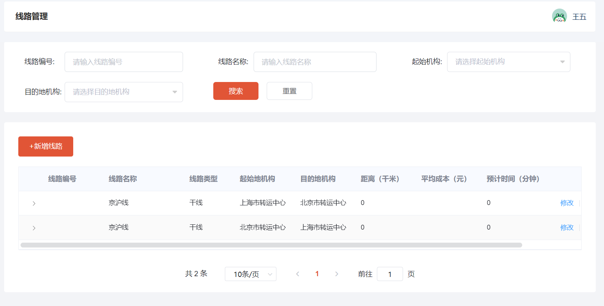
新增路线：
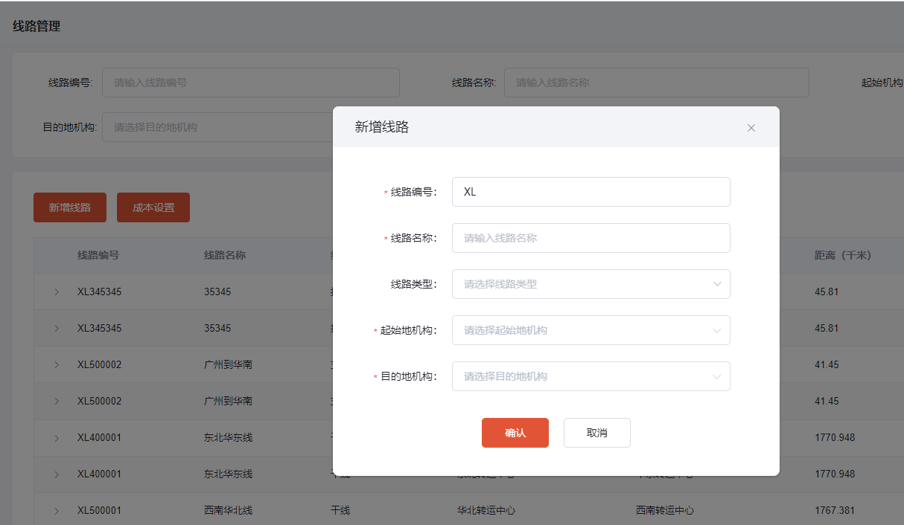
:::danger
新增路线时路线的距离和成本系统会自动进行计算，距离是通过高德地图服务查询的实际距离，成本按照所设置的成本进行计算（同一标准在计算路线时是可行的，但是不能作为真实的成本进行利润计算），在编辑路线时可以修改距离和成本。
:::

完善下数据：


## 8.2、Jenkins构建任务
如果在路线下没有service的构建任务，就需要创建一个构建任务：
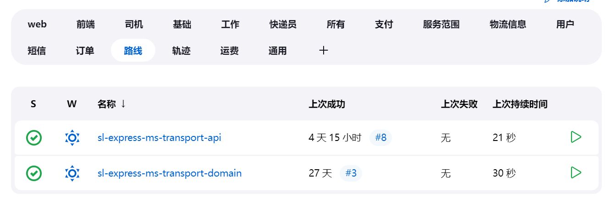
点击新建任务：

输入任务名称，名称与工程名一致：

选择复制一个已有的任务：

设置描述：
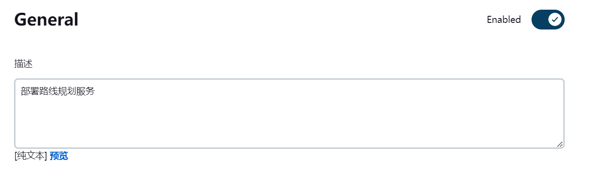
端口设置为：18083：

设置名称：

设置git地址：

点击保存：

测试构建：
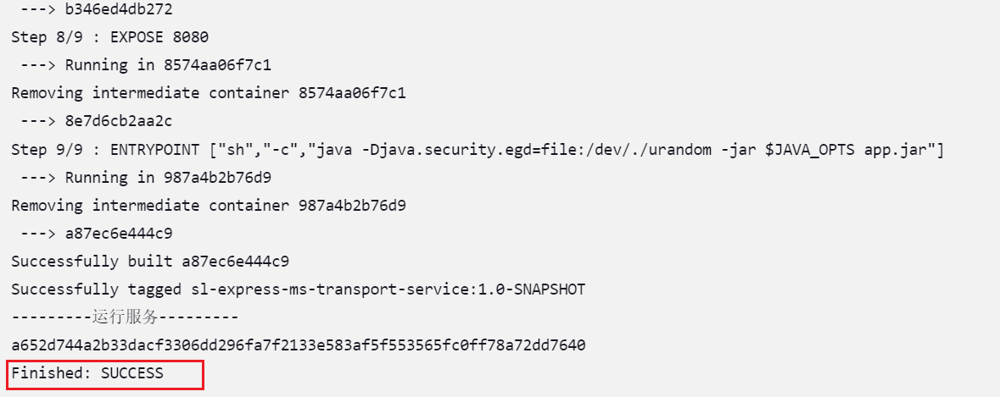
测试：[http://192.168.150.101:18083/doc.html](http://192.168.150.101:18083/doc.html)
可以正常查询到数据：
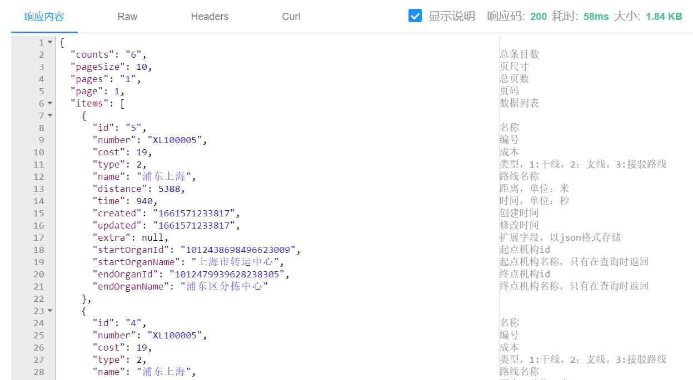
## 8.3、导入数据
前面都是基于测试数据进行测试的，实际上我们已经构造了一些初始数据，可以直接导入使用，具体命令如下：
```shell
#停止neo4j微服务
docker stop neo4j

#将数据文件neo4j.dump上传到挂载目录下：/var/lib/docker/volumes/neo4j/_data

#执行如下命令进行导入
#参数：--from：指定dump文件路径，--force：强制替换现有库
docker run -it --rm -v neo4j:/data neo4j:4.4.5 neo4j-admin load --from=/data/neo4j.dump --force

#启动neo4j微服务
docker start neo4j

#在管理工具中查询：match (n) return n

#如果需要备份数据，可以用dump命令进行导出数据（导出也是需要先停止服务），示例如下：
docker run -it --rm -v neo4j:/data neo4j:4.4.5 neo4j-admin dump --to=/data/neo4j2.dump --database=neo4j
```
导入的数据如下：

> 由于导入数据会覆盖之前插入的测试数据，会导致数据只存在权限系统中，出现脏数据，需要手动删除权限系统中对应的测试数据。

# 9、练习
## 9.1、练习1
今日代码量较大，动手编写代码实现相关的业务功能。
## 9.2、练习2
自己构造数据，进一步的完善数据和熟悉业务流程。
# 10、面试连环问
:::info
面试官问：

- 你们物流项目中的路线规划是怎么做的？
- 如何确定路线的成本和距离？成本计算规则是什么？该成本会计算到公司利润核算中吗？
- 对于路线的往返你们是怎么设计的？为什么成对创建的？
- 路线支持修改起点或终点机构吗？请说明理由。
:::

