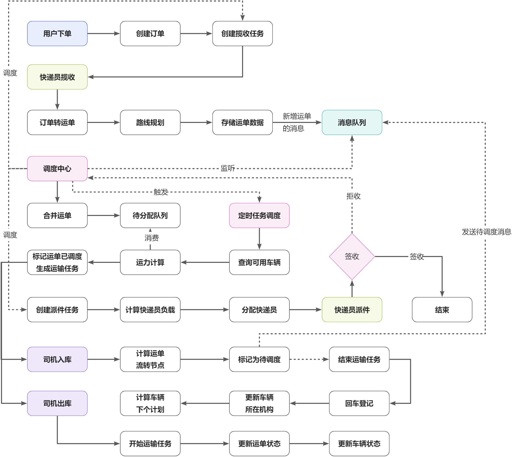
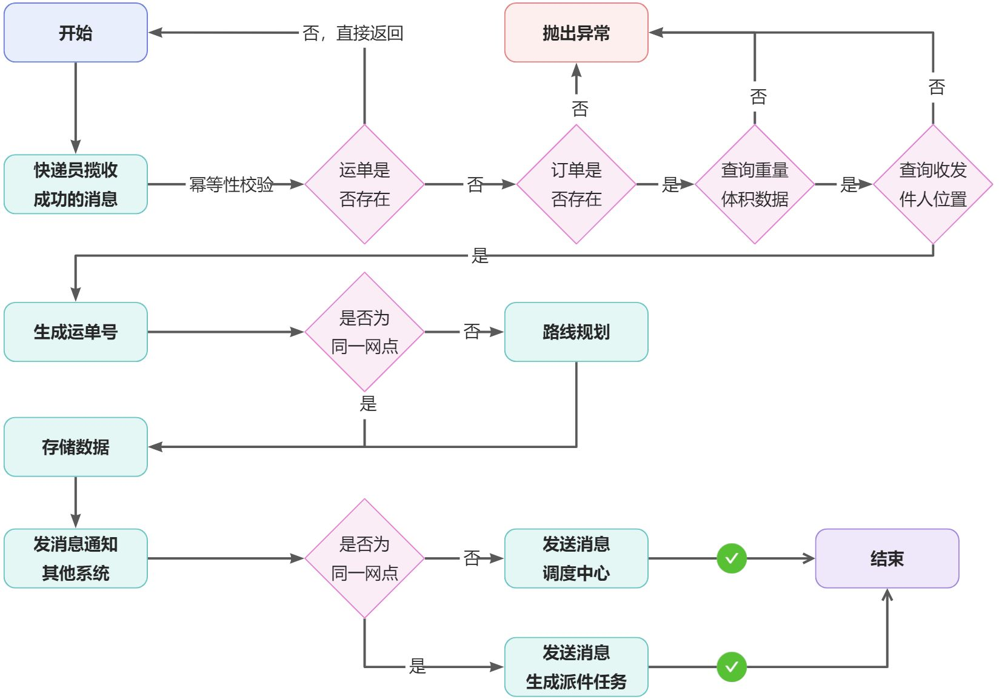
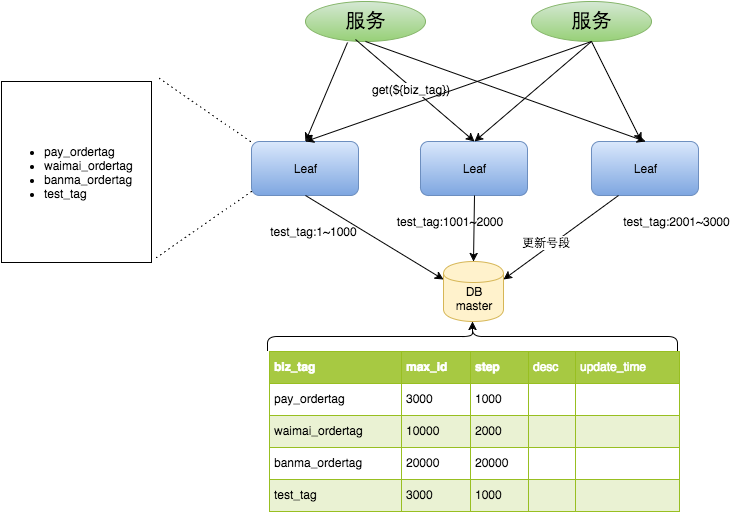
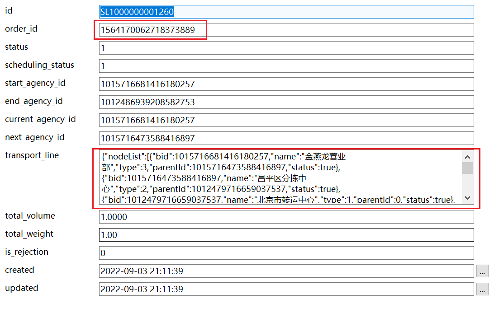
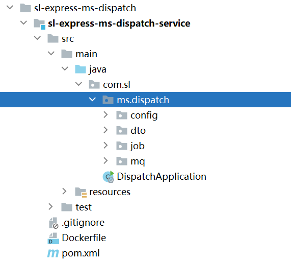

# 课程安排

- 什么是智能调度
- 实现订单转运单
- 美团Leaf使用入门
- 完善运单服务
- 合并运单
# 1、背景说明
通过前面的学习，已经掌握了路线规划的核心实现，有了路线规划之后就可以对运单进行调度了，这将是物流项目最为核心的内容，一个好的调度系统可以高效的管理着运单、运输任务、司机作业单、快递员取派件任务等，接下来你将参与智能调度的开发中，其中一部分业务功能已经实现，但核心的业务逻辑是需要你来实现的。
这部分内容的难度是比较大的，加油~

# 2、智能调度
在神领物流项目中，采用智能调度的方式对车辆任务、快递员的取派件任务进行调度管理，这样更加有效的进行管理，降低企业运营成本。
## 2.1、为什么需要调度？
可能你会这样的疑问，用户下单了，快递员上门取件，取件后送回网点，网点有车辆运走，再经过车辆的一系列的运输，最后进行派件，对方就能收到快件，不就是这么简单的流程吗？为什么需要调度？
没错，看起来是简单的流程，实际上通过仔细的分析就会发现这个过程并不简单，甚至会非常的复杂，比如：

- 用户下单后，应该哪个网点的快递员上门呢？
   - 这样就需要通过用户的发件人地址信息定位到所属服务范围内的网点进行服务
   - 紧接着又会有一个问题，确定了网点后，这个网点有多个快递员，这个取件任务应该是指派谁呢？
   - 这里就需要对快递员的工作情况以及排班情况进行分析，才能确定哪个快递员进行服务。
- 快递员把快件拿回到网点后，假设这个快件是从上海寄往北京的，是网点直接开车送到北京吗？
   - 显然不是的，直接送的话成本太高了，怎么样成本最低呢？显然是车辆尽可能的满载，集中化运输（这个车上装的都是从A点→B点的快件，这里的A和B可能代表的网点或转运中心，而非全路线）

   - 一般物流公司会有很多的车辆、路线、司机，而每个路线都会设置不同的车次，如何能够将快件合理的分配到车辆上，分配时需要参考车辆的载重、司机的排班，车辆的状态以及车次等信息
- 快件到收件人地址所在服务范围内的网点了，系统该如何分配快递员？
- 还有一些其他的情况，比如：快件拒收应该怎么处理？车辆故障不能使用怎么处理？一车多个司机，运输任务是如何划分？等等
- 基于以上的问题分析，这就需要系统进行计算处理，这就是我们所说的【智能调度系统】，就是让整个物流流程中的参与者都通过系统的计算，可以井然有序的工作。
## 2.2、整体核心业务流程

:::danger
关键流程说明：

- 用户下单后，会产生取件任务，该任务也是由调度中心进行调度的
- 订单转运单后，会发送消息到调度中心，在调度中心中对相同节点的运单进行合并（这里是指最小转运单元）
- 调度中心同样也会对派件任务进行调度，用于生成快递员的派件任务
- 司机的出库和入库操作也是流程中的核心动作，尤其是入库操作，是推动运单流转的关键
:::
# 3、订单转运单
快递员上门取件成功后，会将订单转成运单，后续将进行一系列的转运流程。
## 3.1、业务流程

## 3.2、运单表结构
运单表是在sl_work数据库中，表名为：sl_transport_order，结构如下：
```sql
CREATE TABLE `sl_transport_order` (
  `id` varchar(18) CHARACTER SET utf16 COLLATE utf16_general_ci NOT NULL DEFAULT '' COMMENT 'id',
  `order_id` bigint NOT NULL COMMENT '订单ID',
  `status` int DEFAULT NULL COMMENT '运单状态(1.新建 2.已装车 3.运输中 4.到达终端网点 5.已签收 6.拒收)',
  `scheduling_status` int DEFAULT NULL COMMENT '调度状态(1.待调度2.未匹配线路3.已调度)',
  `start_agency_id` bigint DEFAULT NULL COMMENT '起始网点id',
  `end_agency_id` bigint DEFAULT NULL COMMENT '终点网点id',
  `current_agency_id` bigint DEFAULT NULL COMMENT '当前所在机构id',
  `next_agency_id` bigint DEFAULT NULL COMMENT '下一个机构id',
  `transport_line` text CHARACTER SET utf8mb4 COLLATE utf8mb4_general_ci COMMENT '完整的运输路线',
  `total_volume` decimal(32,4) DEFAULT NULL COMMENT '货品总体积，单位：立方米',
  `total_weight` decimal(32,2) DEFAULT NULL COMMENT '货品总重量，单位：kg',
  `is_rejection` tinyint(1) DEFAULT NULL COMMENT '是否为拒收运单',
  `created` datetime DEFAULT NULL COMMENT '创建时间',
  `updated` datetime DEFAULT NULL COMMENT '更新时间',
  PRIMARY KEY (`id`) USING BTREE,
  KEY `order_id` (`order_id`) USING BTREE,
  KEY `created` (`created`) USING BTREE,
  KEY `status` (`status`) USING BTREE,
  KEY `scheduling_status` (`scheduling_status`) USING BTREE
) ENGINE=InnoDB DEFAULT CHARSET=utf8mb4 COLLATE=utf8mb4_general_ci ROW_FORMAT=DYNAMIC COMMENT='运单表';
```
## 3.3、揽收成功的消息
订单转运单的业务的触发点在于快递员的揽收成功，这个通过是通过消息传递的，之所以通过消息是为了减少系统间的耦合度。
### 3.3.1、发送消息
快递员揽件成功后，发出消息，这个逻辑是在`sl-express-ms-web-courier`工程的`com.sl.ms.web.courier.service.impl.TaskServiceImpl#pickup()`方法中实现的。如下：

:::info
消息的交换机名称、路由key均是在sl-express-common工程中的Constants.MQ常量类中定义的。
:::
### 3.3.2、消费消息
消息的消费是在`sl-express-ms-work-service`工程中的`com.sl.ms.work.mq.CourierMQListener#listenCourierPickupMsg()`方法中完成。具体实现如下：
```java
    /**
     * 快递员取件成功
     *
     * @param msg 消息
     */
    @RabbitListener(bindings = @QueueBinding(
            value = @Queue(name = Constants.MQ.Queues.WORK_COURIER_PICKUP_SUCCESS),
            exchange = @Exchange(name = Constants.MQ.Exchanges.COURIER, type = ExchangeTypes.TOPIC),
            key = Constants.MQ.RoutingKeys.COURIER_PICKUP
    ))
    public void listenCourierPickupMsg(String msg) {
        log.info("接收到快递员取件成功的消息 >>> msg = {}", msg);
        //解析消息
        CourierMsg courierMsg = JSONUtil.toBean(msg, CourierMsg.class);

        //订单转运单
        this.transportOrderService.orderToTransportOrder(courierMsg.getOrderId());

        //TODO 发送运单跟踪消息
    }
```
:::danger
该消息监听中的交换机、路由key必须与上述消息发送的一致，否则接收不到消息。队列名唯一，不能与其他业务共用。
_发送运单跟踪消息的业务逻辑我们将在后面做实现，现在暂时不做实现。_
:::
## 3.4、生成运单号
对于运单号的生成有特殊的要求，格式：SL+13位数字，例如：SL1000000000760，对于这个需求，如果采用MP提供的雪花id生成是19位，是不能满足需求的，所以我们需要自己生成id，并且要确保唯一不能重复。
在这里我们采用美团的Leaf作为id生成服务，其源码托管于GitHub：
这里有个美团的技术播客，专门介绍了Leaf：
> 目前Leaf覆盖了美团点评公司内部金融、餐饮、外卖、酒店旅游、猫眼电影等众多业务线。在4C8G VM基础上，通过公司RPC方式调用，QPS压测结果近5w/s，TP999 1ms。
> Leaf 提供两种生成的ID的方式（segment模式和snowflake模式），我们采用segment模式（号段）来生成运单号。

```shell
# get请求，获取到id
http://192.168.150.101:28838/api/segment/get/transport_order
```
### 3.4.1、号段模式
号段模式采用的是基于MySQL数据生成id的，它并不是基于MySQL表中的自增长实现的，因为基于MySQL的自增长方案对于数据库的依赖太大了，性能不好，Leaf的号段模式是基于一张表来实现，每次获取一个号段，生成id时从内存中自增长，当号段用完后再去更新数据库表，如下：

字段说明：

- biz_tag：业务标签，用来区分业务
- max_id：表示该biz_tag目前所被分配的ID号段的最大值
- step：表示每次分配的号段长度。如果把step设置得足够大，比如1000，那么只有当1000个号被消耗完了之后才会去重新读写一次数据库。
- description：描述
- update_time：更新时间

Leaf架构图：

说明：test_tag在第一台Leaf机器上是1~1000的号段，当这个号段用完时，会去加载另一个长度为step=1000的号段，假设另外两台号段都没有更新，这个时候第一台机器新加载的号段就应该是3001~4000。同时数据库对应的biz_tag这条数据的max_id会从3000被更新成4000，更新号段的SQL语句如下：

Leaf 取号段的时机是在号段消耗完的时候进行的，也就意味着号段临界点的ID下发时间取决于下一次从DB取回号段的时间，并且在这期间进来的请求也会因为DB号段没有取回来，导致线程阻塞。如果请求DB的网络和DB的性能稳定，这种情况对系统的影响是不大的，但是假如取DB的时候网络发生抖动，或者DB发生慢查询就会导致整个系统的响应时间变慢。
Leaf为此做了优化，增加了双buffer优化。
:::info
当号段消费到某个点时就异步的把下一个号段加载到内存中。而不需要等到号段用尽的时候才去更新号段。这样做就可以很大程度上的降低系统的TP999指标。
:::

采用双buffer的方式，Leaf服务内部有两个号段缓存区segment。当前号段已下发10%时，如果下一个号段未更新，则另启一个更新线程去更新下一个号段。当前号段全部下发完后，如果下个号段准备好了则切换到下个号段为当前segment接着下发，循环往复。

- 每个biz-tag都有消费速度监控，通常推荐segment长度设置为服务高峰期发号QPS（秒处理事务数）的600倍（10分钟），这样即使DB宕机，Leaf仍能持续发号10-20分钟不受影响。
- 每次请求来临时都会判断下个号段的状态，从而更新此号段，所以偶尔的网络抖动不会影响下个号段的更新。
### 3.4.2、部署服务
我们只用到了号段的方式，并没有使用雪花方式，所以只需要创建数据库表即可，无需安装ZooKeeper。
:::danger
Leaf官方是没有docker镜像的，我们将其进行了镜像制作，并且上传到阿里云仓库，可以直接下载使用。目前已经在101机器部署完成。
:::
```shell
docker run \
-d \
-v /itcast/meituan-leaf/leaf.properties:/app/conf/leaf.properties \
--name meituan-leaf \
-p 28838:8080 \
--restart=always \
registry.cn-hangzhou.aliyuncs.com/itheima/meituan-leaf:1.0.1
```
```properties
leaf.name=leaf-server
leaf.segment.enable=true
leaf.jdbc.url=jdbc:mysql://192.168.150.101:3306/sl_leaf?useUnicode=true&characterEncoding=utf8&autoReconnect=true&allowMultiQueries=true&useSSL=false
leaf.jdbc.username=root
leaf.jdbc.password=123

leaf.snowflake.enable=false
#leaf.snowflake.zk.address=
#leaf.snowflake.port=
```
创建sl_leaf数据库脚本：
```sql
CREATE TABLE `leaf_alloc` (
  `biz_tag` varchar(128) CHARACTER SET utf8mb4 COLLATE utf8mb4_0900_ai_ci NOT NULL DEFAULT '',
  `max_id` bigint NOT NULL DEFAULT '1',
  `step` int NOT NULL,
  `description` varchar(256) CHARACTER SET utf8mb4 COLLATE utf8mb4_0900_ai_ci DEFAULT NULL,
  `update_time` timestamp NOT NULL DEFAULT CURRENT_TIMESTAMP ON UPDATE CURRENT_TIMESTAMP,
  PRIMARY KEY (`biz_tag`) USING BTREE
) ENGINE=InnoDB DEFAULT CHARSET=utf8mb4 COLLATE=utf8mb4_0900_ai_ci;

-- 插入运单号生成规划数据
INSERT INTO `leaf_alloc` (`biz_tag`, `max_id`, `step`, `description`, `update_time`) VALUES ('transport_order', 1000000000001, 100, 'Test leaf Segment Mode Get Id', '2022-07-07 11:32:16');

```
测试：
```shell
# transport_order 与 biz_tag字段的值相同
http://192.168.150.101:28838/api/segment/get/transport_order

#监控
http://192.168.150.101:28838/cache
```
### 3.4.3、封装服务
在项目中，已经将Leaf集成到`sl-express-common`工程中，代码如下：
```java
package com.sl.transport.common.service;

import cn.hutool.core.util.StrUtil;
import cn.hutool.http.HttpRequest;
import cn.hutool.http.HttpResponse;
import com.sl.transport.common.enums.IdEnum;
import com.sl.transport.common.exception.SLException;
import org.springframework.beans.factory.annotation.Value;
import org.springframework.stereotype.Service;

/**
 * id服务，用于生成自定义的id
 */
@Service
public class IdService {

    @Value("${sl.id.leaf:}")
    private String leafUrl;

    /**
     * 生成自定义id
     *
     * @param idEnum id配置
     * @return id值
     */
    public String getId(IdEnum idEnum) {
        String idStr = this.doGet(idEnum);
        return idEnum.getPrefix() + idStr;
    }

    private String doGet(IdEnum idEnum) {
        if (StrUtil.isEmpty(this.leafUrl)) {
            throw new SLException("生成id，sl.id.leaf配置不能为空.");
        }
        //访问leaf服务获取id
        String url = StrUtil.format("{}/api/{}/get/{}", this.leafUrl, idEnum.getType(), idEnum.getBiz());
        //设置超时时间为10s
        HttpResponse httpResponse = HttpRequest.get(url)
                .setReadTimeout(10000)
                .execute();
        if (httpResponse.isOk()) {
            return httpResponse.body();
        }
        throw new SLException(StrUtil.format("访问leaf服务出错，leafUrl = {}, idEnum = {}", this.leafUrl, idEnum));
    }

}

```
```java
package com.sl.transport.common.enums;

public enum IdEnum implements BaseEnum {

    TRANSPORT_ORDER(1, "运单号", "transport_order", "segment", "SL");

    private Integer code;
    private String value;
    private String biz; //业务名称
    private String type; //类型：自增长（segment），雪花id（snowflake）
    private String prefix;//id前缀

    IdEnum(Integer code, String value, String biz, String type, String prefix) {
        this.code = code;
        this.value = value;
        this.biz = biz;
        this.type = type;
        this.prefix = prefix;
    }

    @Override
    public Integer getCode() {
        return this.code;
    }

    @Override
    public String getValue() {
        return this.value;
    }

    public String getBiz() {
        return biz;
    }

    public String getType() {
        return type;
    }

    public String getPrefix() {
        return prefix;
    }

    @Override
    public String toString() {
        final StringBuffer sb = new StringBuffer("IdEnum{");
        sb.append("code=").append(code);
        sb.append(", value='").append(value).append('\'');
        sb.append(", biz='").append(biz).append('\'');
        sb.append(", type='").append(type).append('\'');
        sb.append(", prefix='").append(prefix).append('\'');
        sb.append('}');
        return sb.toString();
    }
}

```
使用步骤：

- 在配置文件中进行配置`sl.id.leaf`为： http://192.168.150.101:28838
- 在Service中注入IdService，调用getId()方法即可，例如：`idService.getId(IdEnum.TRANSPORT_ORDER)`
## 3.5、编码实现
订单转运单的实现是在`sl-express-ms-work-service`微服务中完成的，git地址：[http://git.sl-express.com/sl/sl-express-ms-work-service.git](http://git.sl-express.com/sl/sl-express-ms-work-service.git)
具体编码实现：
```java
    @Override
    @Transactional
    public TransportOrderEntity orderToTransportOrder(Long orderId) {
        //幂等性校验
        TransportOrderEntity transportOrderEntity = this.findByOrderId(orderId);
        if (ObjectUtil.isNotEmpty(transportOrderEntity)) {
            return transportOrderEntity;
        }

        //查询订单
        OrderDetailDTO detailByOrder = this.orderFeign.findDetailByOrderId(orderId);
        if (ObjectUtil.isEmpty(detailByOrder)) {
            throw new SLException(WorkExceptionEnum.ORDER_NOT_FOUND);
        }

        //校验货物的重量和体积数据
        OrderCargoDTO cargoDto = detailByOrder.getOrderDTO().getOrderCargoDto();
        if (ObjectUtil.isEmpty(cargoDto)) {
            throw new SLException(WorkExceptionEnum.ORDER_CARGO_NOT_FOUND);
        }

        //校验位置信息
        OrderLocationDTO orderLocationDTO = detailByOrder.getOrderLocationDTO();
        if (ObjectUtil.isEmpty(orderLocationDTO)) {
            throw new SLException(WorkExceptionEnum.ORDER_LOCATION_NOT_FOUND);
        }

        Long sendAgentId = Convert.toLong(orderLocationDTO.getSendAgentId());//起始网点id
        Long receiveAgentId = Convert.toLong(orderLocationDTO.getReceiveAgentId());//终点网点id

        //默认参与调度
        boolean isDispatch = true;
        TransportLineNodeDTO transportLineNodeDTO = null;
        if (ObjectUtil.equal(sendAgentId, receiveAgentId)) {
            //起点、终点是同一个网点，不需要规划路线，直接发消息生成派件任务即可
            isDispatch = false;
        } else {
            //根据起始机构规划运输路线
            transportLineNodeDTO = this.transportLineFeign.queryPathByDispatchMethod(sendAgentId, receiveAgentId);
            if (ObjectUtil.isEmpty(transportLineNodeDTO) || CollUtil.isEmpty(transportLineNodeDTO.getNodeList())) {
                throw new SLException(WorkExceptionEnum.TRANSPORT_LINE_NOT_FOUND);
            }
        }

        //创建新的运单对象
        TransportOrderEntity transportOrder = new TransportOrderEntity();

        transportOrder.setId(this.idService.getId(IdEnum.TRANSPORT_ORDER)); //设置id
        transportOrder.setOrderId(orderId);//订单ID
        transportOrder.setStartAgencyId(sendAgentId);//起始网点id
        transportOrder.setEndAgencyId(receiveAgentId);//终点网点id
        transportOrder.setCurrentAgencyId(sendAgentId);//当前所在机构id

        if (ObjectUtil.isNotEmpty(transportLineNodeDTO)) {
            transportOrder.setStatus(TransportOrderStatus.CREATED);//运单状态(1.新建 2.已装车 3.运输中 4.到达终端网点 5.已签收 6.拒收)
            transportOrder.setSchedulingStatus(TransportOrderSchedulingStatus.TO_BE_SCHEDULED);//调度状态(1.待调度2.未匹配线路3.已调度)
            transportOrder.setNextAgencyId(transportLineNodeDTO.getNodeList().get(1).getId());//下一个机构id
            transportOrder.setTransportLine(JSONUtil.toJsonStr(transportLineNodeDTO));//完整的运输路线
        } else {
            //下个网点就是当前网点
            transportOrder.setNextAgencyId(sendAgentId);
            transportOrder.setStatus(TransportOrderStatus.ARRIVED_END);//运单状态(1.新建 2.已装车 3.运输中 4.到达终端网点 5.已签收 6.拒收)
            transportOrder.setSchedulingStatus(TransportOrderSchedulingStatus.SCHEDULED);//调度状态(1.待调度2.未匹配线路3.已调度)
        }

        transportOrder.setTotalVolume(cargoDto.getVolume());//货品总体积，单位m^3
        transportOrder.setTotalWeight(cargoDto.getWeight());//货品总重量，单位kg
        transportOrder.setIsRejection(false); //默认非拒收订单

        boolean result = super.save(transportOrder);
        if (result) {

            if (isDispatch) {
                //发送消息到调度中心，进行调度
                this.sendTransportOrderMsgToDispatch(transportOrder);
            } else {
                // 不需要调度 发送消息更新订单状态
                this.sendUpdateStatusMsg(ListUtil.toList(transportOrder.getId()), TransportOrderStatus.ARRIVED_END);
                //不需要调度，发送消息生成派件任务
                this.sendDispatchTaskMsgToDispatch(transportOrder);
            }

            //发消息通知其他系统，运单已经生成
            String msg = TransportOrderMsg.builder()
                    .id(transportOrder.getId())
                    .orderId(transportOrder.getOrderId())
                    .created(DateUtil.current())
                    .build().toJson();
            this.mqFeign.sendMsg(Constants.MQ.Exchanges.TRANSPORT_ORDER_DELAYED,
                    Constants.MQ.RoutingKeys.TRANSPORT_ORDER_CREATE, msg, Constants.MQ.NORMAL_DELAY);

            return transportOrder;
        }
        //保存失败
        throw new SLException(WorkExceptionEnum.TRANSPORT_ORDER_SAVE_ERROR);
    }
```
发送消息的代码实现：
```java
    /**
     * 发送运单消息到调度中，参与调度
     */
    private void sendTransportOrderMsgToDispatch(TransportOrderEntity transportOrder) {
        Map<Object, Object> msg = MapUtil.builder()
                .put("transportOrderId", transportOrder.getId())
                .put("currentAgencyId", transportOrder.getCurrentAgencyId())
                .put("nextAgencyId", transportOrder.getNextAgencyId())
                .put("totalWeight", transportOrder.getTotalWeight())
                .put("totalVolume", transportOrder.getTotalVolume())
                .put("created", System.currentTimeMillis()).build();
        String jsonMsg = JSONUtil.toJsonStr(msg);
        //发送消息，延迟5秒，确保本地事务已经提交，可以查询到数据
        this.mqFeign.sendMsg(Constants.MQ.Exchanges.TRANSPORT_ORDER_DELAYED,
                Constants.MQ.RoutingKeys.JOIN_DISPATCH, jsonMsg, Constants.MQ.LOW_DELAY);
    }

    /**
     * 发送生成取派件任务的消息
     *
     * @param transportOrder 运单对象
     */
    private void sendDispatchTaskMsgToDispatch(TransportOrderEntity transportOrder) {
        //预计完成时间，如果是中午12点到的快递，当天22点前，否则，第二天22点前
        int offset = 0;
        if (LocalDateTime.now().getHour() >= 12) {
            offset = 1;
        }
        LocalDateTime estimatedEndTime = DateUtil.offsetDay(new Date(), offset)
                .setField(DateField.HOUR_OF_DAY, 22)
                .setField(DateField.MINUTE, 0)
                .setField(DateField.SECOND, 0)
                .setField(DateField.MILLISECOND, 0).toLocalDateTime();

        //发送分配快递员派件任务的消息
        OrderMsg orderMsg = OrderMsg.builder()
                .agencyId(transportOrder.getCurrentAgencyId())
                .orderId(transportOrder.getOrderId())
                .created(DateUtil.current())
                .taskType(PickupDispatchTaskType.DISPATCH.getCode()) //派件任务
                .mark("系统提示：派件前请于收件人电话联系.")
                .estimatedEndTime(estimatedEndTime).build();

        //发送消息
        this.sendPickupDispatchTaskMsgToDispatch(transportOrder, orderMsg);
    }

    /**
     * 发送消息到调度中心，用于生成取派件任务
     *
     * @param transportOrder 运单
     * @param orderMsg       消息内容
     */
    @Override
    public void sendPickupDispatchTaskMsgToDispatch(TransportOrderEntity transportOrder, OrderMsg orderMsg) {
        //查询订单对应的位置信息
        OrderLocationDTO orderLocationDTO = this.orderFeign.findOrderLocationByOrderId(orderMsg.getOrderId());

        //(1)运单为空：取件任务取消，取消原因为返回网点；重新调度位置取寄件人位置
        //(2)运单不为空：生成的是派件任务，需要根据拒收状态判断位置是寄件人还是收件人
        // 拒收：寄件人  其他：收件人
        String location;
        if (ObjectUtil.isEmpty(transportOrder)) {
            location = orderLocationDTO.getSendLocation();
        } else {
            location = transportOrder.getIsRejection() ? orderLocationDTO.getSendLocation() : orderLocationDTO.getReceiveLocation();
        }

        Double[] coordinate = Convert.convert(Double[].class, StrUtil.split(location, ","));
        Double longitude = coordinate[0];
        Double latitude = coordinate[1];

        //设置消息中的位置信息
        orderMsg.setLongitude(longitude);
        orderMsg.setLatitude(latitude);

        //发送消息,用于生成取派件任务
        this.mqFeign.sendMsg(Constants.MQ.Exchanges.ORDER_DELAYED, Constants.MQ.RoutingKeys.ORDER_CREATE,
                orderMsg.toJson(), Constants.MQ.NORMAL_DELAY);
    }

    private void sendUpdateStatusMsg(List<String> ids, TransportOrderStatus transportOrderStatus) {
        String msg = TransportOrderStatusMsg.builder()
                .idList(ids)
                .statusName(transportOrderStatus.name())
                .statusCode(transportOrderStatus.getCode())
                .build().toJson();

        //将状态名称写入到路由key中，方便消费方选择性的接收消息
        String routingKey = Constants.MQ.RoutingKeys.TRANSPORT_ORDER_UPDATE_STATUS_PREFIX + transportOrderStatus.name();
        this.mqFeign.sendMsg(Constants.MQ.Exchanges.TRANSPORT_ORDER_DELAYED, routingKey, msg, Constants.MQ.LOW_DELAY);
    }
```
## 3.6、测试
测试订单转运单功能，需要启动所必须的一些服务，base、oms、transport服务，启动命令如下：
```shell
#在101机器执行如下命令

docker start sl-express-ms-base-service
docker start sl-express-ms-oms-service
docker start sl-express-ms-transport-service
```
编写测试用例：
```java
package com.sl.ms.work.mq;

import cn.hutool.json.JSONUtil;
import com.sl.transport.common.vo.CourierMsg;
import org.junit.jupiter.api.Test;
import org.springframework.boot.test.context.SpringBootTest;

import javax.annotation.Resource;

import static org.junit.jupiter.api.Assertions.*;


@SpringBootTest
class CourierMQListenerTest {

    @Resource
    private CourierMQListener courierMQListener;

    @Test
    void listenCourierTaskMsg() {
    }

    @Test
    void listenCourierPickupMsg() {
        CourierMsg courierMsg = new CourierMsg();
        //目前只用到订单id
        courierMsg.setOrderId(1564170062718373889L);

        String msg = JSONUtil.toJsonStr(courierMsg);
        this.courierMQListener.listenCourierPickupMsg(msg);
    }
}
```
:::danger
测试时，需要确保在sl_oms数据库中的sl_order、sl_order_cargo、sl_order_location表中有对应的订单数据。
如果没有数据，可以通过以下SQL插入测试数据或者通过用户端进行下单。
另外，还没有PickupDispatchTaskService的实现类，直接测试会报错，所以需要把对应controller上面的注解注掉`@RestController`
:::
```sql
use `sl_oms`;
INSERT INTO `sl_order` (`id`, `trading_order_no`, `trading_channel`, `payment_method`, `payment_status`, `amount`, `refund`, `is_refund`, `order_type`, `pickup_type`, `create_time`, `member_id`, `receiver_member_id`, `receiver_province_id`, `receiver_city_id`, `receiver_county_id`, `receiver_address`, `receiver_address_id`, `receiver_name`, `receiver_phone`, `sender_province_id`, `sender_city_id`, `sender_county_id`, `sender_address`, `sender_address_id`, `sender_name`, `sender_phone`, `current_agency_id`, `estimated_arrival_time`, `mark`, `estimated_start_time`, `distance`, `status`, `created`, `updated`) VALUES (1590586236289646594, 0, '0', 1, 1, 12.00, 0.00, NULL, 1, 0, '2022-11-10 14:04:45', 1555110960890843137, NULL, 545532, 545533, 545763, '西华大道16号', 1575682056178180097, '吴思涵', '15645237852', 545532, 545533, 545669, '光华大道一段1666号', 1575763704869625857, '邓诗涵', '15745678521', 1024771753995515873, '2022-11-14 14:04:45', NULL, '2022-11-10 15:04:00', 11265, 23000, '2022-11-10 14:04:45', '2022-11-10 14:04:45');
INSERT INTO `sl_order` (`id`, `trading_order_no`, `trading_channel`, `payment_method`, `payment_status`, `amount`, `refund`, `is_refund`, `order_type`, `pickup_type`, `create_time`, `member_id`, `receiver_member_id`, `receiver_province_id`, `receiver_city_id`, `receiver_county_id`, `receiver_address`, `receiver_address_id`, `receiver_name`, `receiver_phone`, `sender_province_id`, `sender_city_id`, `sender_county_id`, `sender_address`, `sender_address_id`, `sender_name`, `sender_phone`, `current_agency_id`, `estimated_arrival_time`, `mark`, `estimated_start_time`, `distance`, `status`, `created`, `updated`) VALUES (1590586360180998146, 0, '0', 1, 1, 12.00, 0.00, NULL, 1, 0, '2022-11-10 14:05:15', 1555110960890843137, NULL, 545532, 545533, 545669, '光华大道一段1666号', 1575763704869625857, '邓诗涵', '15745678521', 545532, 545533, 545669, '光华大道一段1666号', 1575681460301799425, '李成百', '15812357412', 1024771753995515873, '2022-11-14 14:05:15', NULL, '2022-11-10 15:05:00', 1, 23000, '2022-11-10 14:05:15', '2022-11-10 14:05:15');
INSERT INTO `sl_order` (`id`, `trading_order_no`, `trading_channel`, `payment_method`, `payment_status`, `amount`, `refund`, `is_refund`, `order_type`, `pickup_type`, `create_time`, `member_id`, `receiver_member_id`, `receiver_province_id`, `receiver_city_id`, `receiver_county_id`, `receiver_address`, `receiver_address_id`, `receiver_name`, `receiver_phone`, `sender_province_id`, `sender_city_id`, `sender_county_id`, `sender_address`, `sender_address_id`, `sender_name`, `sender_phone`, `current_agency_id`, `estimated_arrival_time`, `mark`, `estimated_start_time`, `distance`, `status`, `created`, `updated`) VALUES (1590587504731062273, 0, '0', 1, 1, 18.00, 0.00, NULL, 2, 0, '2022-11-10 14:09:47', 1555110960890843137, NULL, 161792, 161793, 165026, '上海迪士尼度假区', 1590587449528274946, '吕奉先', '18512345678', 545532, 545533, 545669, '光华大道一段1666号', 1575763704869625857, '邓诗涵', '15745678521', 1024771753995515873, '2022-11-14 14:09:47', NULL, '2022-11-10 15:09:00', 1990898, 23000, '2022-11-10 14:09:47', '2022-11-10 14:09:47');

INSERT INTO `sl_order_cargo` (`id`, `order_id`, `tran_order_id`, `goods_type_id`, `name`, `unit`, `cargo_value`, `cargo_barcode`, `quantity`, `volume`, `weight`, `remark`, `total_volume`, `total_weight`, `created`, `updated`) VALUES (1590586236767797249, 1590586236289646594, NULL, '1552846618315661320', '单肩包', NULL, NULL, NULL, 1, 1.0000000000, 1.0000000000, NULL, 1.0000000000, 1.0000000000, '2022-11-10 14:04:45', '2022-11-10 14:04:45');
INSERT INTO `sl_order_cargo` (`id`, `order_id`, `tran_order_id`, `goods_type_id`, `name`, `unit`, `cargo_value`, `cargo_barcode`, `quantity`, `volume`, `weight`, `remark`, `total_volume`, `total_weight`, `created`, `updated`) VALUES (1590586360294244354, 1590586360180998146, NULL, '1552846618315661321', '项链', NULL, NULL, NULL, 1, 1.0000000000, 1.0000000000, NULL, 1.0000000000, 1.0000000000, '2022-11-10 14:05:15', '2022-11-10 14:05:15');
INSERT INTO `sl_order_cargo` (`id`, `order_id`, `tran_order_id`, `goods_type_id`, `name`, `unit`, `cargo_value`, `cargo_barcode`, `quantity`, `volume`, `weight`, `remark`, `total_volume`, `total_weight`, `created`, `updated`) VALUES (1590587504747839490, 1590587504731062273, NULL, '1552846618315661323', '跑步鞋', NULL, NULL, NULL, 1, 1.0000000000, 1.0000000000, NULL, 1.0000000000, 1.0000000000, '2022-11-10 14:09:47', '2022-11-10 14:09:47');

INSERT INTO `sl_order_location` (`id`, `order_id`, `send_location`, `receive_location`, `send_agent_id`, `receive_agent_id`, `status`, `created`, `updated`) VALUES (1590586238537793537, 1590586236289646594, '103.960686,30.671626', '104.034504,30.721027', '1024771753995515873', '1024771466287232801', '1', '2022-11-10 14:04:46', '2022-11-10 14:04:46');
INSERT INTO `sl_order_location` (`id`, `order_id`, `send_location`, `receive_location`, `send_agent_id`, `receive_agent_id`, `status`, `created`, `updated`) VALUES (1590586360315215874, 1590586360180998146, '103.960686,30.671626', '103.960686,30.671626', '1024771753995515873', '1024771753995515873', '1', '2022-11-10 14:05:15', '2022-11-10 14:05:15');
INSERT INTO `sl_order_location` (`id`, `order_id`, `send_location`, `receive_location`, `send_agent_id`, `receive_agent_id`, `status`, `created`, `updated`) VALUES (1590587504756228097, 1590587504731062273, '103.960686,30.671626', '121.661735,31.141333', '1024771753995515873', '1024981295454874273', '1', '2022-11-10 14:09:47', '2022-11-10 14:09:47');
```
测试结果，运单已经写入到了sl_transport_order表中：

# 4、完善运单服务
前面已经完成了订单转运单的功能，接下来我们将完善运单中的其他基本的实现，这部分代码以阅读、理解为主。
:::info
其中pageQueryByTaskId()、updateByTaskId()方法在学习运输任务相关业务时进行实现。
:::
## 4.1、获取运单分页数据
接口定义：
```java
    /**
     * 获取运单分页数据
     *
     * @return 运单分页数据
     */
    Page<TransportOrderEntity> findByPage(TransportOrderQueryDTO transportOrderQueryDTO);
```
service实现：
```java
    @Override
    public Page<TransportOrderEntity> findByPage(TransportOrderQueryDTO transportOrderQueryDTO) {

        Page<TransportOrderEntity> iPage = new Page<>(transportOrderQueryDTO.getPage(), transportOrderQueryDTO.getPageSize());

        //设置查询条件
        LambdaQueryWrapper<TransportOrderEntity> lambdaQueryWrapper = new LambdaQueryWrapper<>();
        lambdaQueryWrapper.like(ObjectUtil.isNotEmpty(transportOrderQueryDTO.getId()), TransportOrderEntity::getId, transportOrderQueryDTO.getId());
        lambdaQueryWrapper.like(ObjectUtil.isNotEmpty(transportOrderQueryDTO.getOrderId()), TransportOrderEntity::getOrderId, transportOrderQueryDTO.getOrderId());
        lambdaQueryWrapper.eq(ObjectUtil.isNotEmpty(transportOrderQueryDTO.getStatus()), TransportOrderEntity::getStatus, transportOrderQueryDTO.getStatus());
        lambdaQueryWrapper.eq(ObjectUtil.isNotEmpty(transportOrderQueryDTO.getSchedulingStatus()), TransportOrderEntity::getSchedulingStatus, transportOrderQueryDTO.getSchedulingStatus());

        lambdaQueryWrapper.eq(ObjectUtil.isNotEmpty(transportOrderQueryDTO.getStartAgencyId()), TransportOrderEntity::getStartAgencyId, transportOrderQueryDTO.getStartAgencyId());
        lambdaQueryWrapper.eq(ObjectUtil.isNotEmpty(transportOrderQueryDTO.getEndAgencyId()), TransportOrderEntity::getEndAgencyId, transportOrderQueryDTO.getEndAgencyId());
        lambdaQueryWrapper.eq(ObjectUtil.isNotEmpty(transportOrderQueryDTO.getCurrentAgencyId()), TransportOrderEntity::getCurrentAgencyId, transportOrderQueryDTO.getCurrentAgencyId());
        lambdaQueryWrapper.orderByDesc(TransportOrderEntity::getCreated);

        return super.page(iPage, lambdaQueryWrapper);
    }
```
## 4.2、订单id获取运单信息
接口定义：
```java
    /**
     * 通过订单id获取运单信息
     *
     * @param orderId 订单id
     * @return 运单信息
     */
    TransportOrderEntity findByOrderId(Long orderId);

    /**
     * 通过订单id列表获取运单列表
     *
     * @param orderIds 订单id列表
     * @return 运单列表
     */
    List<TransportOrderEntity> findByOrderIds(Long[] orderIds);
```
service实现：
```java
    @Override
    public TransportOrderEntity findByOrderId(Long orderId) {
        LambdaQueryWrapper<TransportOrderEntity> queryWrapper = new LambdaQueryWrapper<>();
        queryWrapper.eq(TransportOrderEntity::getOrderId, orderId);
        return super.getOne(queryWrapper);
    }

    @Override
    public List<TransportOrderEntity> findByOrderIds(Long[] orderIds) {
        LambdaQueryWrapper<TransportOrderEntity> queryWrapper = new LambdaQueryWrapper<>();
        queryWrapper.in(TransportOrderEntity::getOrderId, orderIds);
        return super.list(queryWrapper);
    }
```
## 4.3、运单ids获取运单列表
接口定义：
```java
    /**
     * 通过运单id列表获取运单列表
     *
     * @param ids 订单id列表
     * @return 运单列表
     */
    List<TransportOrderEntity> findByIds(String[] ids);
```
service实现：
```java
    @Override
    public List<TransportOrderEntity> findByIds(String[] ids) {
        LambdaQueryWrapper<TransportOrderEntity> queryWrapper = new LambdaQueryWrapper<>();
        queryWrapper.in(TransportOrderEntity::getId, ids);
        return super.list(queryWrapper);
    }
```
## 4.4、根据运单号搜索运单
接口定义：
```java
    /**
     * 根据运单号搜索运单
     *
     * @param id 运单号
     * @return 运单列表
     */
    List<TransportOrderEntity> searchById(String id);
```
service实现：
```java
    @Override
    public List<TransportOrderEntity> searchById(String id) {
        LambdaQueryWrapper<TransportOrderEntity> queryWrapper = new LambdaQueryWrapper<>();
        queryWrapper.like(TransportOrderEntity::getId, id);
        return super.list(queryWrapper);
    }
```
## 4.5、统计状态的数量
接口定义：
```java
    /**
     * 统计各个状态的数量
     *
     * @return 状态数量数据
     */
    List<TransportOrderStatusCountDTO> findStatusCount();
```
service实现：
```java
    @Override
    public List<TransportOrderStatusCountDTO> findStatusCount() {
        //将所有的枚举状态放到集合中
        List<TransportOrderStatusCountDTO> statusCountList = Arrays.stream(TransportOrderStatus.values())
                .map(transportOrderStatus -> TransportOrderStatusCountDTO.builder()
                        .status(transportOrderStatus)
                        .statusCode(transportOrderStatus.getCode())
                        .count(0L)
                        .build())
                .collect(Collectors.toList());

        //将数量值放入到集合中，如果没有的数量为0
        List<TransportOrderStatusCountDTO> statusCount = super.baseMapper.findStatusCount();
        for (TransportOrderStatusCountDTO transportOrderStatusCountDTO : statusCountList) {
            for (TransportOrderStatusCountDTO countDTO : statusCount) {
                if (ObjectUtil.equal(transportOrderStatusCountDTO.getStatusCode(), countDTO.getStatusCode())) {
                    transportOrderStatusCountDTO.setCount(countDTO.getCount());
                    break;
                }
            }
        }

        return statusCountList;
    }
```
## 4.6、更新状态
在更新运单状态时需要考虑三件事：

- 如果更新运单为拒收状态，需要将快递退回去，也就是原路返回
- 在更新状态时，需要同步更新物流信息，通过发送消息的方式完成（先TODO，后面实现）
- 更新状态后需要通知其他系统（消息通知）

接口定义：
```java
    /**
     * 修改运单状态
     *
     * @param ids                  运单id列表
     * @param transportOrderStatus 修改的状态
     * @return 是否成功
     */
    boolean updateStatus(List<String> ids, TransportOrderStatus transportOrderStatus);
```
service实现：
```java
    @Override
    public boolean updateStatus(List<String> ids, TransportOrderStatus transportOrderStatus) {
        if (CollUtil.isEmpty(ids)) {
            return false;
        }

        if (TransportOrderStatus.CREATED == transportOrderStatus) {
            //修改订单状态不能为 新建 状态
            throw new SLException(WorkExceptionEnum.TRANSPORT_ORDER_STATUS_NOT_CREATED);
        }

        List<TransportOrderEntity> transportOrderList;
        //判断是否为拒收状态，如果是拒收需要重新查询路线，将包裹逆向回去
        if (TransportOrderStatus.REJECTED == transportOrderStatus) {
            //查询运单列表
            transportOrderList = super.listByIds(ids);
            for (TransportOrderEntity transportOrderEntity : transportOrderList) {
                //设置为拒收运单
                transportOrderEntity.setIsRejection(true);
                //根据起始机构规划运输路线，这里要将起点和终点互换
                Long sendAgentId = transportOrderEntity.getEndAgencyId();//起始网点id
                Long receiveAgentId = transportOrderEntity.getStartAgencyId();//终点网点id

                //默认参与调度
                boolean isDispatch = true;
                if (ObjectUtil.equal(sendAgentId, receiveAgentId)) {
                    //相同节点，无需调度，直接生成派件任务
                    isDispatch = false;
                } else {
                    TransportLineNodeDTO transportLineNodeDTO = this.transportLineFeign.queryPathByDispatchMethod(sendAgentId, receiveAgentId);
                    if (ObjectUtil.hasEmpty(transportLineNodeDTO, transportLineNodeDTO.getNodeList())) {
                        throw new SLException(WorkExceptionEnum.TRANSPORT_LINE_NOT_FOUND);
                    }

                    //删除掉第一个机构，逆向回去的第一个节点就是当前所在节点
                    transportLineNodeDTO.getNodeList().remove(0);
                    transportOrderEntity.setSchedulingStatus(TransportOrderSchedulingStatus.TO_BE_SCHEDULED);//调度状态：待调度
                    transportOrderEntity.setCurrentAgencyId(sendAgentId);//当前所在机构id
                    transportOrderEntity.setNextAgencyId(transportLineNodeDTO.getNodeList().get(0).getId());//下一个机构id

                    //获取到原有节点信息
                    TransportLineNodeDTO transportLineNode = JSONUtil.toBean(transportOrderEntity.getTransportLine(), TransportLineNodeDTO.class);
                    //将逆向节点追加到节点列表中
                    transportLineNode.getNodeList().addAll(transportLineNodeDTO.getNodeList());
                    //合并成本
                    transportLineNode.setCost(NumberUtil.add(transportLineNode.getCost(), transportLineNodeDTO.getCost()));
                    transportOrderEntity.setTransportLine(JSONUtil.toJsonStr(transportLineNode));//完整的运输路线
                }
                transportOrderEntity.setStatus(TransportOrderStatus.REJECTED);

                if (isDispatch) {
                    //发送消息参与调度
                    this.sendTransportOrderMsgToDispatch(transportOrderEntity);
                } else {
                    //不需要调度，发送消息生成派件任务
                    transportOrderEntity.setStatus(TransportOrderStatus.ARRIVED_END);
                    this.sendDispatchTaskMsgToDispatch(transportOrderEntity);
                }
            }
        } else {
            //根据id列表封装成运单对象列表
            transportOrderList = ids.stream().map(id -> {
                //获取将发往的目的地机构
                Long nextAgencyId = this.getById(id).getNextAgencyId();
                OrganDTO organDTO = organFeign.queryById(nextAgencyId);

                //构建消息实体类
                String info = CharSequenceUtil.format("快件发往【{}】", organDTO.getName());
                String transportInfoMsg = TransportInfoMsg.builder()
                        .transportOrderId(id)//运单id
                        .status("运送中")//消息状态
                        .info(info)//消息详情
                        .created(DateUtil.current())//创建时间
                        .build().toJson();
                //发送运单跟踪消息
                this.mqFeign.sendMsg(Constants.MQ.Exchanges.TRANSPORT_INFO, Constants.MQ.RoutingKeys.TRANSPORT_INFO_APPEND, transportInfoMsg);

                //封装运单对象
                TransportOrderEntity transportOrderEntity = new TransportOrderEntity();
                transportOrderEntity.setId(id);
                transportOrderEntity.setStatus(transportOrderStatus);
                return transportOrderEntity;
            }).collect(Collectors.toList());
        }

        //批量更新数据
        boolean result = super.updateBatchById(transportOrderList);

        //发消息通知其他系统运单状态的变化
        this.sendUpdateStatusMsg(ids, transportOrderStatus);

        return result;
    }
```
拒收退回的物流信息：

# 5、合并运单
## 5.1、实现分析
运单在运输过程中，虽然快件的起点与终点都不一定相同，但是在中间转运环节有一些运输节点是相同的，如下：

可以看出，A→E与A→G的运单，在A→B和B→C的转运是相同的，所以在做任务调度时，首先要做的事情就是将相同转运的运单进行合并，以供后续调度中心进行调度。
合并之后的结果存储在哪里呢？我们可以想一下，后续处理的需求：

- 先进行合并处理的运单按照顺序进行调度
- 此次运单调度处理完成后就应该将其删除掉，表示已经处理完成

根据以上两点的需求，很容易想到队列的存储方式，先进先出，实现队列的技术方案有很多，在这里我们采用Redis的List作为队列，将相同节点转运的订单放到同一个队列中，可以使用其`LPUSH`放进去，`RPOP`弹出数据，这样就可以确保先进先出，并且弹出后数据将删除，因此符合我们的需求。

## 5.2、代码实现
### 5.2.1、准备环境
合并运单与调度的业务逻辑都放到`sl-express-ms-dispatch-service`工程中，git地址：[http://git.sl-express.com/sl/sl-express-ms-dispatch-service.git](http://git.sl-express.com/sl/sl-express-ms-dispatch-service.git)，检出代码如下：

### 5.2.2、编码实现
> 实现中，需要考虑消息的幂等性，防止重复数据的产生。

代码实现：
```java
package com.sl.ms.dispatch.mq;

import cn.hutool.core.map.MapUtil;
import cn.hutool.core.util.ObjectUtil;
import cn.hutool.core.util.StrUtil;
import cn.hutool.json.JSONUtil;
import com.sl.ms.dispatch.dto.DispatchMsgDTO;
import com.sl.transport.common.constant.Constants;
import lombok.extern.slf4j.Slf4j;
import org.springframework.amqp.core.ExchangeTypes;
import org.springframework.amqp.rabbit.annotation.Exchange;
import org.springframework.amqp.rabbit.annotation.Queue;
import org.springframework.amqp.rabbit.annotation.QueueBinding;
import org.springframework.amqp.rabbit.annotation.RabbitListener;
import org.springframework.data.redis.core.StringRedisTemplate;
import org.springframework.stereotype.Component;

import javax.annotation.Resource;

/**
 * 对于待调度运单消息的处理
 */
@Slf4j
@Component
public class TransportOrderDispatchMQListener {

    @Resource
    private StringRedisTemplate stringRedisTemplate;

    @RabbitListener(bindings = @QueueBinding(
            value = @Queue(name = Constants.MQ.Queues.DISPATCH_MERGE_TRANSPORT_ORDER),
            exchange = @Exchange(name = Constants.MQ.Exchanges.TRANSPORT_ORDER_DELAYED, type = ExchangeTypes.TOPIC, delayed = Constants.MQ.DELAYED),
            key = Constants.MQ.RoutingKeys.JOIN_DISPATCH
    ))
    public void listenDispatchMsg(String msg) {
        // {"transportOrderId":"SL1000000000560","currentAgencyId":100280,"nextAgencyId":90001,"totalWeight":3.5,"totalVolume":2.1,"created":1652337676330}
        log.info("接收到新运单的消息 >>> msg = {}", msg);
        DispatchMsgDTO dispatchMsgDTO = JSONUtil.toBean(msg, DispatchMsgDTO.class);
        if (ObjectUtil.isEmpty(dispatchMsgDTO)) {
            return;
        }

        Long startId = dispatchMsgDTO.getCurrentAgencyId();
        Long endId = dispatchMsgDTO.getNextAgencyId();
        String transportOrderId = dispatchMsgDTO.getTransportOrderId();

        //消息幂等性处理，将相同起始节点的运单存放到set结构的redis中，在相应的运单处理完成后将其删除掉
        String setRedisKey = this.getSetRedisKey(startId, endId);
        if (this.stringRedisTemplate.opsForSet().isMember(setRedisKey, transportOrderId)) {
            //重复消息
            return;
        }

        //存储数据到redis，采用list结构，从左边写入数据，读取数据时从右边读取
        //key =>  DISPATCH_LIST_CurrentAgencyId_NextAgencyId
        //value =>  {"transportOrderId":111222, "totalVolume":0.8, "totalWeight":2.1, "created":111222223333}

        String listRedisKey = this.getListRedisKey(startId, endId);
        String value = JSONUtil.toJsonStr(MapUtil.builder()
                .put("transportOrderId", transportOrderId)
                .put("totalVolume", dispatchMsgDTO.getTotalVolume())
                .put("totalWeight", dispatchMsgDTO.getTotalWeight())
                .put("created", dispatchMsgDTO.getCreated()).build()
        );

        //存储到redis
        this.stringRedisTemplate.opsForList().leftPush(listRedisKey, value);
        this.stringRedisTemplate.opsForSet().add(setRedisKey, transportOrderId);
    }

    public String getListRedisKey(Long startId, Long endId) {
        return StrUtil.format("DISPATCH_LIST_{}_{}", startId, endId);
    }

    public String getSetRedisKey(Long startId, Long endId) {
        return StrUtil.format("DISPATCH_SET_{}_{}", startId, endId);
    }

}

```
## 5.3、测试
将`DispatchApplication`启动后，观察RabbitMQ服务，发现`sl.queue.dispatch.mergeTransportOrder`队列已经绑定到`sl.exchange.topic.transportOrder.delayed`交换机。


测试方法：
在work微服务中的测试用例进行订单转运单的操作，让其发出消息，在dispatch微服务中进行断点跟踪，最终数据存储到了redis：


# 6、练习
## 6.1、练习一：编写代码
难度系数：★★★★☆
完成本节课中所编写的业务代码。
## 6.2、练习二：阅读代码
难度系数：★★★☆☆
需求：阅读快递员服务中的【取件】业务功能，主要阅读代码逻辑如下：
  1）理解取件业务的逻辑
  2）理解实名认证的方法
  3）理解更新订单状态的业务逻辑
# 7、面试连环问
:::info
面试官问：

- 物流项目中你参与了核心的功能开发吗？能说一下核心的业务逻辑吗？
- 你们的运单号是怎么生成的？如何确保性能？
- 能说一下订单转运单的业务逻辑吗？生成运单后如何与调度中心整合在一起的？
- 合并运单为什么使用Redis的List作为队列？如何确保消息的幂等性的？
:::

