# 课程安排

- 了解快递员取派件任务需求
- 递员取派件任务相关功能开发
- 调度中心任务调度
- 整体业务功能测试
# 1、背景说明
通过前面的学习，可以通过作业范围来确定网点或快递员，下面要做的事情就是需要为快递员生成取派件任务，这样快递员才能够进行相关的取件或派件作业。

# 2、需求分析
快递员在登录到APP后，可以查看取派件任务列表：
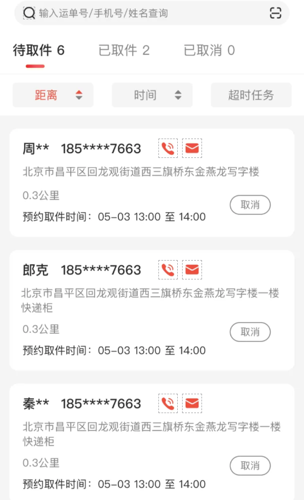
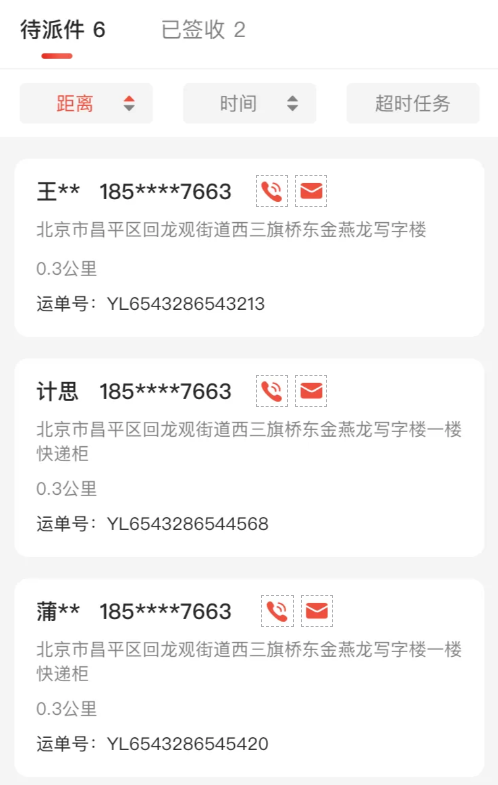
具体需求参见《快递员端产品》文档。
# 3、实现分析
## 3.1、表结构
对于快递员的取件和派件动作，除了类型不同外其他的属性基本都是一样的，所以我们可以将存储在一张表中。
取派件任务存储在sl_work数据库中。
```sql
CREATE TABLE `sl_pickup_dispatch_task` (
  `id` bigint NOT NULL COMMENT 'id',
  `order_id` bigint NOT NULL COMMENT '关联订单id',
  `task_type` tinyint DEFAULT NULL COMMENT '任务类型，1为取件任务，2为派件任务',
  `status` int DEFAULT NULL COMMENT '任务状态，1为新任务、2为已完成、3为已取消',
  `sign_status` int DEFAULT '0' COMMENT '签收状态(0为未签收, 1为已签收，2为拒收)',
  `sign_recipient` tinyint DEFAULT '0' COMMENT '签收人，1本人，2代收',
  `agency_id` bigint DEFAULT NULL COMMENT '网点ID',
  `courier_id` bigint DEFAULT NULL COMMENT '快递员ID',
  `estimated_start_time` datetime DEFAULT NULL COMMENT '预计取/派件开始时间',
  `actual_start_time` datetime DEFAULT NULL COMMENT '实际开始时间',
  `estimated_end_time` datetime DEFAULT NULL COMMENT '预计完成时间',
  `actual_end_time` datetime DEFAULT NULL COMMENT '实际完成时间',
  `cancel_time` datetime DEFAULT NULL COMMENT '取消时间',
  `cancel_reason` int DEFAULT NULL COMMENT '取消原因',
  `cancel_reason_description` varchar(100) CHARACTER SET armscii8 COLLATE armscii8_general_ci DEFAULT NULL COMMENT '取消原因具体描述',
  `assigned_status` int NOT NULL COMMENT '任务分配状态(1未分配2已分配3待人工分配)',
  `mark` varchar(50) CHARACTER SET utf8mb4 COLLATE utf8mb4_general_ci DEFAULT NULL COMMENT '备注',
  `created` datetime DEFAULT NULL COMMENT '创建时间',
  `updated` datetime DEFAULT NULL COMMENT '更新时间',
  `is_deleted` int DEFAULT '0' COMMENT '删除：0-否，1-是',
  PRIMARY KEY (`id`) USING BTREE,
  KEY `order_id` (`order_id`) USING BTREE,
  KEY `created` (`created`) USING BTREE,
  KEY `task_type` (`task_type`) USING BTREE,
  KEY `courier_id` (`courier_id`) USING BTREE
) ENGINE=InnoDB DEFAULT CHARSET=utf8mb4 COLLATE=utf8mb4_general_ci ROW_FORMAT=DYNAMIC COMMENT='取件、派件任务信息表';
```
## 3.2、业务流程
### 3.2.1、取件任务流程
用户在下单后，订单微服务会发消息出来，消息会在dispatch微服务中进行调度计算，最终会向work微服务发送消息，用于生成快递员的取件任务。
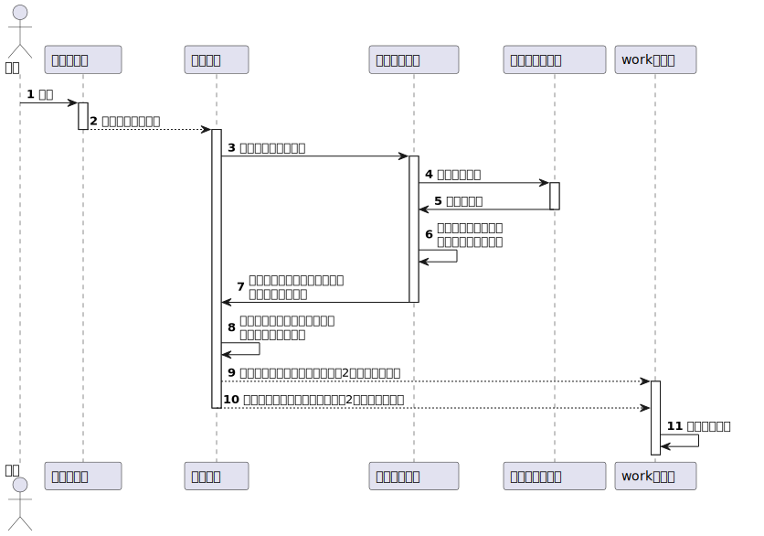
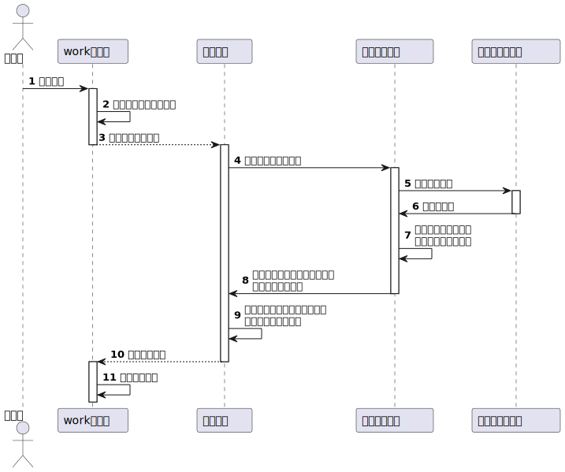
派件任务会在两个场景下生成：

- 场景一，司机入库时，运单流转到最后一个节点，需要快递员派件
- 场景二，发件人与收件人的服务网点是同一个网点时，无需转运，直接生成派件任务

场景一：
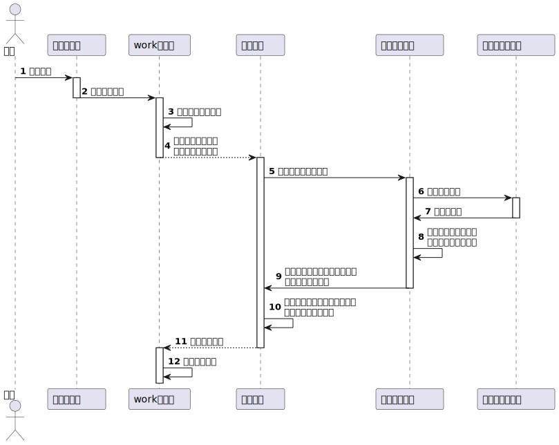
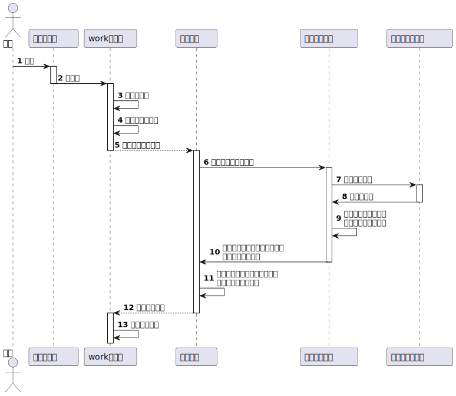
针对于取派件任务进行相应的数据管理，下面我们将逐一进行实现。
## 4.1、新增取派件任务
新增取派件任务不对外开放，所以在Controller中是没有方法定义的，只是在消息处理中进行调用生成任务。
### 4.1.1、定义方法
```java
    /**
     * 新增取派件任务
     *
     * @param taskPickupDispatch 取派件任务信息
     * @return 取派件任务信息
     */
    PickupDispatchTaskEntity saveTaskPickupDispatch(PickupDispatchTaskEntity taskPickupDispatch);
```
### 4.1.2、实现方法
```java
    @Override
    public PickupDispatchTaskEntity saveTaskPickupDispatch(PickupDispatchTaskEntity taskPickupDispatch) {
        // 设置任务状态为新任务
        taskPickupDispatch.setStatus(PickupDispatchTaskStatus.NEW);
        boolean result = super.save(taskPickupDispatch);

        if (result) {
            //TODO 同步快递员任务到es

            //TODO 生成运单跟踪消息和快递员端取件/派件消息通知
            return taskPickupDispatch;
        }
        throw new SLException(WorkExceptionEnum.PICKUP_DISPATCH_TASK_SAVE_ERROR);
    }
```
## 4.2、分页查询取派件任务
### 4.2.1、Controller
```java
    @PostMapping("page")
    @ApiOperation(value = "分页查询", notes = "获取取派件任务分页数据")
    public PageResponse<PickupDispatchTaskDTO> findByPage(@RequestBody PickupDispatchTaskPageQueryDTO dto) {
        return this.pickupDispatchTaskService.findByPage(dto);
    }
```
### 4.2.2、Service
```java
    /**
     * 分页查询取派件任务
     *
     * @param dto 查询条件
     * @return 分页结果
     */
    PageResponse<PickupDispatchTaskDTO> findByPage(PickupDispatchTaskPageQueryDTO dto);
```
### 4.2.3、ServiceImpl
```java
    /**
     * 分页查询取派件任务
     *
     * @param dto 查询条件
     * @return 分页结果
     */
    @Override
    public PageResponse<PickupDispatchTaskDTO> findByPage(PickupDispatchTaskPageQueryDTO dto) {
        //1.构造条件
        Page<PickupDispatchTaskEntity> iPage = new Page<>(dto.getPage(), dto.getPageSize());
        LambdaQueryWrapper<PickupDispatchTaskEntity> queryWrapper = Wrappers.<PickupDispatchTaskEntity>lambdaQuery()
                .like(ObjectUtil.isNotEmpty(dto.getId()), PickupDispatchTaskEntity::getId, dto.getId())
                .like(ObjectUtil.isNotEmpty(dto.getOrderId()), PickupDispatchTaskEntity::getOrderId, dto.getOrderId())
                .eq(ObjectUtil.isNotEmpty(dto.getAgencyId()), PickupDispatchTaskEntity::getAgencyId, dto.getAgencyId())
                .eq(ObjectUtil.isNotEmpty(dto.getCourierId()), PickupDispatchTaskEntity::getCourierId, dto.getCourierId())
                .eq(ObjectUtil.isNotEmpty(dto.getTaskType()), PickupDispatchTaskEntity::getTaskType, dto.getTaskType())
                .eq(ObjectUtil.isNotEmpty(dto.getStatus()), PickupDispatchTaskEntity::getStatus, dto.getStatus())
                .eq(ObjectUtil.isNotEmpty(dto.getAssignedStatus()), PickupDispatchTaskEntity::getAssignedStatus, dto.getAssignedStatus())
                .eq(ObjectUtil.isNotEmpty(dto.getSignStatus()), PickupDispatchTaskEntity::getSignStatus, dto.getSignStatus())
                .eq(ObjectUtil.isNotEmpty(dto.getIsDeleted()), PickupDispatchTaskEntity::getIsDeleted, dto.getIsDeleted())
                .between(ObjectUtil.isNotEmpty(dto.getMinEstimatedEndTime()), PickupDispatchTaskEntity::getEstimatedEndTime, dto.getMinEstimatedEndTime(), dto.getMaxEstimatedEndTime())
                .between(ObjectUtil.isNotEmpty(dto.getMinActualEndTime()), PickupDispatchTaskEntity::getActualEndTime, dto.getMinActualEndTime(), dto.getMaxActualEndTime())
                .orderByDesc(PickupDispatchTaskEntity::getUpdated);

        //2.分页查询
        Page<PickupDispatchTaskEntity> result = super.page(iPage, queryWrapper);

        //3.实体类转为dto
        return PageResponse.of(result, PickupDispatchTaskDTO.class);
    }
```
## 4.3、按照时间查询任务数
### 4.3.1、Controller
```java
    @GetMapping("count")
    @ApiOperation(value = "任务数量查询", notes = "按照当日快递员id列表查询每个快递员的取派件任务数")
    @ApiImplicitParams({
            @ApiImplicitParam(name = "courierIds", value = "订单id列表", required = true),
            @ApiImplicitParam(name = "taskType", value = "任务类型", required = true),
            @ApiImplicitParam(name = "date", value = "日期，格式：yyyy-MM-dd 或 yyyyMMdd", required = true)
    })
    public List<CourierTaskCountDTO> findCountByCourierIds(@RequestParam("courierIds") List<Long> courierIds,
                                                           @RequestParam("taskType") PickupDispatchTaskType taskType,
                                                           @RequestParam("date") String date) {
        return this.pickupDispatchTaskService.findCountByCourierIds(courierIds, taskType, date);
    }
```
### 4.3.2、Service
```java
    /**
     * 按照当日快递员id列表查询每个快递员的取派件任务数
     *
     * @param courierIds             快递员id列表
     * @param pickupDispatchTaskType 任务类型
     * @param date                   日期，格式：yyyy-MM-dd 或 yyyyMMdd
     * @return 任务数
     */
    List<CourierTaskCountDTO> findCountByCourierIds(List<Long> courierIds, PickupDispatchTaskType pickupDispatchTaskType, String date);

```
### 4.2.3、ServiceImpl
```java
    @Override
    public List<CourierTaskCountDTO> findCountByCourierIds(List<Long> courierIds, PickupDispatchTaskType pickupDispatchTaskType, String date) {
        //计算一天的时间的边界
        DateTime dateTime = DateUtil.parse(date);
        LocalDateTime startDateTime = DateUtil.beginOfDay(dateTime).toLocalDateTime();
        LocalDateTime endDateTime = DateUtil.endOfDay(dateTime).toLocalDateTime();
        return this.taskPickupDispatchMapper
                .findCountByCourierIds(courierIds, pickupDispatchTaskType.getCode(), startDateTime, endDateTime);
    }
```
### 4.2.4、定义SQL
此方法的实现，调用自定义Mapper中的SQL实现。
```xml
    <select id="findCountByCourierIds" resultType="com.sl.ms.work.domain.dto.CourierTaskCountDTO">
        SELECT
            COUNT(1) `count`,
            courier_id
        FROM sl_pickup_dispatch_task t
        WHERE
            t.courier_id IN  <foreach collection="courierIds" item="courierId" open="(" close=")" separator=",">#{courierId}</foreach>
        AND t.created BETWEEN #{startDateTime} AND #{endDateTime}
        AND t.task_type = #{type}
        GROUP BY courier_id
    </select>
```
## 4.4、根据订单查询任务
根据订单id查询取派件任务。
### 4.4.1、Controller
```java
    @GetMapping("/orderId/{orderId}/{taskType}")
    @ApiOperation(value = "订单id查询", notes = "根据订单id获取取派件任务信息")
    @ApiImplicitParams({
            @ApiImplicitParam(name = "orderId", value = "订单id"),
            @ApiImplicitParam(name = "taskType", value = "任务类型")
    })
    public List<PickupDispatchTaskDTO> findByOrderId(@PathVariable("orderId") Long orderId,
                                                     @PathVariable("taskType") PickupDispatchTaskType taskType) {
        List<PickupDispatchTaskEntity> entities = pickupDispatchTaskService.findByOrderId(orderId, taskType);
        return BeanUtil.copyToList(entities, PickupDispatchTaskDTO.class);
    }
```
### 4.4.2、Service
```java
    /**
     * 根据订单id查询取派件任务
     *
     * @param orderId  订单id
     * @param taskType 任务类型
     * @return 任务
     */
    List<PickupDispatchTaskEntity> findByOrderId(Long orderId, PickupDispatchTaskType taskType);

```
### 4.4.3、ServiceImpl
```java
    @Override
    public List<PickupDispatchTaskEntity> findByOrderId(Long orderId, PickupDispatchTaskType taskType) {
        LambdaQueryWrapper<PickupDispatchTaskEntity> wrapper = Wrappers.<PickupDispatchTaskEntity>lambdaQuery()
                .eq(PickupDispatchTaskEntity::getOrderId, orderId)
                .eq(PickupDispatchTaskEntity::getTaskType, taskType)
                .orderByAsc(PickupDispatchTaskEntity::getCreated);
        return this.list(wrapper);
    }
```
## 4.5、id批量删除
根据id批量删除取派件任务信息（逻辑删除）
### 4.5.1、Controller
```java
    @DeleteMapping("ids")
    @ApiOperation(value = "id批量删除", notes = "根据id批量删除取派件任务信息（逻辑删除）")
    @ApiImplicitParams({
            @ApiImplicitParam(name = "ids", value = "任务id列表")
    })
    public boolean deleteByIds(@RequestParam("ids") List<Long> ids) {
        return this.pickupDispatchTaskService.deleteByIds(ids);
    }
```
### 4.5.2、Service
```java
    /**
     * 根据id批量删除取派件任务信息（逻辑删除）
     *
     * @param ids id列表
     * @return 是否成功
     */
    boolean deleteByIds(List<Long> ids);
```
### 4.5.3、ServiceImpl
```java
    @Override
    public boolean deleteByIds(List<Long> ids) {
        if (CollUtil.isEmpty(ids)) {
            return false;
        }

        // 通过id列表构造对象列表
        List<PickupDispatchTaskEntity> list = ids.stream().map(id -> {
            PickupDispatchTaskEntity dispatchTaskEntity = new PickupDispatchTaskEntity();
            dispatchTaskEntity.setId(id);
            dispatchTaskEntity.setIsDeleted(PickupDispatchTaskIsDeleted.IS_DELETED);

            //TODO 发送消息，同步更新快递员任务（ES）
            return dispatchTaskEntity;
        }).collect(Collectors.toList());

        return super.updateBatchById(list);
    }
```
## 4.6、改派快递员
场景：本来属于A快递员的取件任务，由于某种原因，A快递员不能执行，此时A快递员可以改派给其他快递员，会用到此接口。
另外，派件不支持直接改派，需要客服在后台操作。
### 4.6.1、Controller
```java
    @PutMapping("courier")
    @ApiOperation(value = "改派快递员", notes = "改派快递员")
    @ApiImplicitParams({
            @ApiImplicitParam(name = "id", value = "任务id", required = true),
            @ApiImplicitParam(name = "originalCourierId", value = "原快递员id", required = true),
            @ApiImplicitParam(name = "targetCourierId", value = "目标快递员id", required = true),
    })
    public Boolean updateCourierId(@RequestParam("id") Long id,
                                   @RequestParam("originalCourierId") Long originalCourierId,
                                   @RequestParam("targetCourierId") Long targetCourierId) {
        return this.pickupDispatchTaskService.updateCourierId(id, originalCourierId, targetCourierId);
    }
```
### 4.6.2、Service
```java
    /**
     * 改派快递员
     *
     * @param ids               任务id列表
     * @param originalCourierId 原快递员id
     * @param targetCourierId   目标快递员id
     * @return 是否成功
     */
    Boolean updateCourierId(List<Long> ids, Long originalCourierId, Long targetCourierId);
```
### 4.6.3、ServiceImpl
```java
    @Override
    public Boolean updateCourierId(List<Long> ids, Long originalCourierId, Long targetCourierId) {
        if (ObjectUtil.hasEmpty(ids, targetCourierId, originalCourierId)) {
            throw new SLException(WorkExceptionEnum.UPDATE_COURIER_PARAM_ERROR);
        }
        if (ObjectUtil.equal(originalCourierId, targetCourierId)) {
            throw new SLException(WorkExceptionEnum.UPDATE_COURIER_EQUAL_PARAM_ERROR);
        }

        List<PickupDispatchTaskEntity> entities = super.listByIds(ids);
        if (CollUtil.isEmpty(entities)) {
            throw new SLException(WorkExceptionEnum.PICKUP_DISPATCH_TASK_NOT_FOUND);
        }

        entities.forEach(entity -> {
            //校验原快递id是否正确（本来无快递员id的情况除外）
            if (ObjectUtil.isNotEmpty(entity.getCourierId())
                    && ObjectUtil.notEqual(entity.getCourierId(), originalCourierId)) {
                throw new SLException(WorkExceptionEnum.UPDATE_COURIER_ID_PARAM_ERROR);
            }

            //更改快递员id
            entity.setCourierId(targetCourierId);

            // 标识已分配状态
            entity.setAssignedStatus(PickupDispatchTaskAssignedStatus.DISTRIBUTED);
        });

        //批量更新
        List<Long> taskIds = entities.stream().map(PickupDispatchTaskEntity::getId).collect(Collectors.toList());
        LambdaUpdateWrapper<PickupDispatchTaskEntity> updateWrapper = Wrappers.<PickupDispatchTaskEntity>lambdaUpdate()
                .in(PickupDispatchTaskEntity::getId, taskIds)
                .set(PickupDispatchTaskEntity::getCourierId, targetCourierId)
                .set(PickupDispatchTaskEntity::getAssignedStatus, PickupDispatchTaskAssignedStatus.DISTRIBUTED);
        boolean result = super.update(updateWrapper);

        if (result) {
            //TODO 发送消息，同步更新快递员任务（ES）

        }
        return result;
    }
```
## 4.7、更新取派件状态
实现更新取派件任务状态功能时，需要考虑如下几点：

- 更新的状态不能为【新任务】状态
- 更新状态为【已完成】并且任务类型为派件任务时，必须设置签收状态和签收人
- 更新状态为【已取消】，是取件任务的操作，根据不同的原因有不同的处理逻辑
   - 【因个人无法取件，退回到网点】，需要发送消息重新生成取件任务
   - 【用户取消投递】，需要取消订单
   - 其他原因（用户恶意下单、禁用品、重复下单等），需要关闭订单

快递员取消时选择的原因：
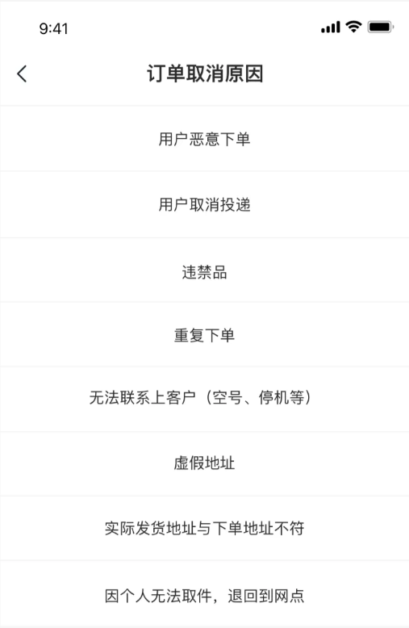
### 4.7.1、Controller
```java
    @PutMapping
    @ApiOperation(value = "更新取派件任务状态", notes = "更新状态，不允许 NEW 状态")
    public Boolean updateStatus(@RequestBody PickupDispatchTaskDTO pickupDispatchTaskDTO) {
        return this.pickupDispatchTaskService.updateStatus(pickupDispatchTaskDTO);
    }
```
### 4.7.2、Service
```java
    /**
     * 更新取派件状态，不允许 NEW 状态
     *
     * @param pickupDispatchTaskDTO 修改的数据
     * @return 是否成功
     */
    Boolean updateStatus(PickupDispatchTaskDTO pickupDispatchTaskDTO);

```
### 4.7.3、ServiceImpl
```java
    @Override
    @Transactional
    public Boolean updateStatus(PickupDispatchTaskDTO pickupDispatchTaskDTO) {
        WorkExceptionEnum paramError = WorkExceptionEnum.PICKUP_DISPATCH_TASK_PARAM_ERROR;
        if (ObjectUtil.hasEmpty(pickupDispatchTaskDTO.getId(), pickupDispatchTaskDTO.getStatus())) {
            throw new SLException("更新取派件任务状态，id或status不能为空", paramError.getCode());
        }

        PickupDispatchTaskEntity pickupDispatchTask = super.getById(pickupDispatchTaskDTO.getId());

        switch (pickupDispatchTaskDTO.getStatus()) {
            case NEW: {
                throw new SLException(WorkExceptionEnum.PICKUP_DISPATCH_TASK_STATUS_NOT_NEW);
            }
            case COMPLETED: {
                //任务完成
                pickupDispatchTask.setStatus(PickupDispatchTaskStatus.COMPLETED);
                //设置完成时间
                pickupDispatchTask.setActualEndTime(LocalDateTime.now());

                if (PickupDispatchTaskType.DISPATCH == pickupDispatchTask.getTaskType()) {
                    //如果是派件任务的完成，已签收需要设置签收状态和签收人，拒收只需要设置签收状态
                    if (ObjectUtil.isEmpty(pickupDispatchTaskDTO.getSignStatus())) {
                        throw new SLException("完成派件任务，签收状态不能为空", paramError.getCode());
                    }
                    pickupDispatchTask.setSignStatus(pickupDispatchTaskDTO.getSignStatus());

                    if (PickupDispatchTaskSignStatus.RECEIVED == pickupDispatchTaskDTO.getSignStatus()) {
                        if (ObjectUtil.isEmpty(pickupDispatchTaskDTO.getSignRecipient())) {
                            throw new SLException("完成派件任务，签收人不能为空", paramError.getCode());
                        }
                        pickupDispatchTask.setSignRecipient(pickupDispatchTaskDTO.getSignRecipient());
                    }
                }
                break;
            }
            case CANCELLED: {
                //任务取消
                if (ObjectUtil.isEmpty(pickupDispatchTaskDTO.getCancelReason())) {
                    throw new SLException("取消任务，原因不能为空", paramError.getCode());
                }
                pickupDispatchTask.setStatus(PickupDispatchTaskStatus.CANCELLED);
                pickupDispatchTask.setCancelReason(pickupDispatchTaskDTO.getCancelReason());
                pickupDispatchTask.setCancelReasonDescription(pickupDispatchTaskDTO.getCancelReasonDescription());
                pickupDispatchTask.setCancelTime(LocalDateTime.now());

                if (pickupDispatchTaskDTO.getCancelReason() == PickupDispatchTaskCancelReason.RETURN_TO_AGENCY) {
                    //发送分配快递员派件任务的消息
                    OrderMsg orderMsg = OrderMsg.builder()
                            .agencyId(pickupDispatchTask.getAgencyId())
                            .orderId(pickupDispatchTask.getOrderId())
                            .created(DateUtil.current())
                            .taskType(PickupDispatchTaskType.PICKUP.getCode()) //取件任务
                            .mark(pickupDispatchTask.getMark())
                            .estimatedEndTime(pickupDispatchTask.getEstimatedEndTime()).build();

                    //发送消息（取消任务发生在取件之前，没有运单，参数直接填入null）
                    this.transportOrderService.sendPickupDispatchTaskMsgToDispatch(null, orderMsg);
                } else if (pickupDispatchTaskDTO.getCancelReason() == PickupDispatchTaskCancelReason.CANCEL_BY_USER) {
                    //原因是用户取消，则订单状态改为取消
                    orderFeign.updateStatus(ListUtil.of(pickupDispatchTask.getOrderId()), OrderStatus.CANCELLED.getCode());
                } else {
                    //其他原因则关闭订单
                    orderFeign.updateStatus(ListUtil.of(pickupDispatchTask.getOrderId()), OrderStatus.CLOSE.getCode());
                }
                break;
            }
            default: {
                throw new SLException("其他未知状态，不能完成更新操作", paramError.getCode());
            }
        }

        //TODO 发送消息，同步更新快递员任务
        return super.updateById(pickupDispatchTask);
    }
```
## 4.8、今日任务分类计数
场景：用于统计今日的任务数量。
### 4.8.1、Controller
```java
    @GetMapping("todayTasks/count")
    @ApiOperation(value = "今日任务分类计数")
    @ApiImplicitParams({
            @ApiImplicitParam(name = "courierId", value = "快递员id", required = true, dataTypeClass = Long.class),
            @ApiImplicitParam(name = "taskType", value = "任务类型，1为取件任务，2为派件任务", dataTypeClass = PickupDispatchTaskType.class),
            @ApiImplicitParam(name = "status", value = "任务状态,1新任务，2已完成，3已取消", dataTypeClass = PickupDispatchTaskStatus.class),
            @ApiImplicitParam(name = "isDeleted", value = "是否逻辑删除", dataTypeClass = PickupDispatchTaskIsDeleted.class)
    })
    public Integer todayTasksCount(@RequestParam(value = "courierId") Long courierId,
                                   @RequestParam(value = "taskType", required = false) PickupDispatchTaskType taskType,
                                   @RequestParam(value = "status", required = false) PickupDispatchTaskStatus status,
                                   @RequestParam(value = "isDeleted", required = false) PickupDispatchTaskIsDeleted isDeleted) {
        return pickupDispatchTaskService.todayTasksCount(courierId, taskType, status, isDeleted);
    }
```
### 4.8.2、Service
```java
    /**
     * 今日任务分类计数
     *
     * @param courierId 快递员id
     * @param taskType  任务类型，1为取件任务，2为派件任务
     * @param status    任务状态,1新任务，2已完成，3已取消
     * @param isDeleted 是否逻辑删除
     * @return 任务数量
     */
    Integer todayTasksCount(Long courierId, PickupDispatchTaskType taskType, PickupDispatchTaskStatus status, PickupDispatchTaskIsDeleted isDeleted);

```
### 4.8.3、ServiceImpl
```java
    /**
     * 今日任务分类计数
     *
     * @param courierId 快递员id
     * @param taskType  任务类型，1为取件任务，2为派件任务
     * @param status    任务状态,1新任务，2已完成，3已取消
     * @param isDeleted 是否逻辑删除
     * @return 任务数量
     */
    @Override
    public Integer todayTasksCount(Long courierId, PickupDispatchTaskType taskType, PickupDispatchTaskStatus status, PickupDispatchTaskIsDeleted isDeleted) {
        //构建查询条件
        LambdaQueryWrapper<PickupDispatchTaskEntity> queryWrapper = Wrappers.<PickupDispatchTaskEntity>lambdaQuery()
                .eq(ObjectUtil.isNotEmpty(courierId), PickupDispatchTaskEntity::getCourierId, courierId)
                .eq(ObjectUtil.isNotEmpty(taskType), PickupDispatchTaskEntity::getTaskType, taskType)
                .eq(ObjectUtil.isNotEmpty(status), PickupDispatchTaskEntity::getStatus, status)
                .eq(ObjectUtil.isNotEmpty(isDeleted), PickupDispatchTaskEntity::getIsDeleted, isDeleted);

        //根据任务状态限定查询的日期条件
        LocalDateTime startTime = LocalDateTimeUtil.of(DateUtil.beginOfDay(new Date()));
        LocalDateTime endTime = LocalDateTimeUtil.of(DateUtil.endOfDay(new Date()));
        if (status == null) {
            //没有任务状态,查询任务创建时间
            queryWrapper.between(PickupDispatchTaskEntity::getCreated, startTime, endTime);
        } else if (status == PickupDispatchTaskStatus.NEW) {
            //新任务状态，查询预计结束时间
            queryWrapper.between(PickupDispatchTaskEntity::getEstimatedEndTime, startTime, endTime);
        } else if (status == PickupDispatchTaskStatus.COMPLETED) {
            //完成状态，查询实际完成时间
            queryWrapper.between(PickupDispatchTaskEntity::getActualEndTime, startTime, endTime);
        } else if (status == PickupDispatchTaskStatus.CANCELLED) {
            //取消状态，查询取消时间
            queryWrapper.between(PickupDispatchTaskEntity::getCancelTime, startTime, endTime);
        }

        //结果返回integer类型值
        return Convert.toInt(super.count(queryWrapper));
    }
```
## 4.9、条件查询所有
### 4.9.1、Controller
```java
    @GetMapping("/all")
    @ApiOperation(value = "条件查询所有")
    @ApiImplicitParams({
            @ApiImplicitParam(name = "courierId", value = "快递员id", dataTypeClass = Long.class),
            @ApiImplicitParam(name = "taskType", value = "任务类型，1为取件任务，2为派件任务", dataTypeClass = PickupDispatchTaskType.class),
            @ApiImplicitParam(name = "taskStatus", value = "任务状态,1新任务，2已完成，3已取消", dataTypeClass = PickupDispatchTaskStatus.class),
            @ApiImplicitParam(name = "isDeleted", value = "是否逻辑删除", dataTypeClass = PickupDispatchTaskIsDeleted.class)
    })
    public List<PickupDispatchTaskDTO> findAll(@RequestParam(name = "courierId", required = false) Long courierId,
                                               @RequestParam(name = "taskType", required = false) PickupDispatchTaskType taskType,
                                               @RequestParam(name = "taskStatus", required = false) PickupDispatchTaskStatus taskStatus,
                                               @RequestParam(name = "isDeleted", required = false) PickupDispatchTaskIsDeleted isDeleted) {
        return pickupDispatchTaskService.findAll(courierId, taskType, taskStatus, isDeleted);
    }
```
### 4.9.2、Service
```java
    /**
     * 条件查询所有
     *
     * @param courierId  快递员id
     * @param taskType   任务类型，1为取件任务，2为派件任务
     * @param taskStatus 任务状态,1新任务，2已完成，3已取消
     * @param isDeleted  是否逻辑删除
     * @return 取派件任务列表
     */
    List<PickupDispatchTaskDTO> findAll(Long courierId, PickupDispatchTaskType taskType, PickupDispatchTaskStatus taskStatus, PickupDispatchTaskIsDeleted isDeleted);

```
### 4.9.3、ServiceImpl
```java
    /**
     * 条件查询所有
     *
     * @param courierId  快递员id
     * @param taskType   任务类型，1为取件任务，2为派件任务
     * @param taskStatus 任务状态,1新任务，2已完成，3已取消
     * @param isDeleted  是否逻辑删除
     * @return 取派件任务列表
     */
    @Override
    public List<PickupDispatchTaskDTO> findAll(Long courierId, PickupDispatchTaskType
            taskType, PickupDispatchTaskStatus taskStatus, PickupDispatchTaskIsDeleted isDeleted) {
        //构建查询条件
        LambdaQueryWrapper<PickupDispatchTaskEntity> queryWrapper = Wrappers.<PickupDispatchTaskEntity>lambdaQuery()
                .eq(ObjectUtil.isNotEmpty(courierId), PickupDispatchTaskEntity::getCourierId, courierId)
                .eq(ObjectUtil.isNotEmpty(taskType), PickupDispatchTaskEntity::getTaskType, taskType)
                .eq(ObjectUtil.isNotEmpty(taskStatus), PickupDispatchTaskEntity::getStatus, taskStatus)
                .eq(ObjectUtil.isNotEmpty(isDeleted), PickupDispatchTaskEntity::getIsDeleted, isDeleted);

        List<PickupDispatchTaskEntity> entities = super.list(queryWrapper);
        return BeanUtil.copyToList(entities, PickupDispatchTaskDTO.class);
    }
```
## 4.10、今日任务分类统计
### 4.10.1、Controller
```java
    @GetMapping("/todayTasksStatistics")
    @ApiOperation(value = "今日任务分类统计")
    @ApiImplicitParams({
            @ApiImplicitParam(name = "courierId", value = "快递员id", dataTypeClass = Long.class)
    })
    public PickupDispatchTaskStatisticsDTO todayTasksStatistics(@RequestParam(value = "courierId", required = false) Long courierId) {
        return pickupDispatchTaskService.todayTaskStatistics(courierId);
    }
```
### 4.10.2、Service
```java
    /**
     * 今日任务分类统计
     *
     * @param courierId 快递员id
     * @return 统计结果
     */
    PickupDispatchTaskStatisticsDTO todayTaskStatistics(Long courierId);
```
### 4.10.3、ServiceImpl
```java
    /**
     * 今日任务分类统计
     *
     * @param courierId 快递员id
     * @return 统计结果
     */
    @Override
    public PickupDispatchTaskStatisticsDTO todayTaskStatistics(Long courierId) {
        PickupDispatchTaskStatisticsDTO taskStatisticsDTO = new PickupDispatchTaskStatisticsDTO();
        //今日取件任务数量
        taskStatisticsDTO.setPickupNum(todayTasksCount(courierId, PickupDispatchTaskType.PICKUP, null, PickupDispatchTaskIsDeleted.NOT_DELETED));

        //今日待取件任务数量
        taskStatisticsDTO.setNewPickUpNum(todayTasksCount(courierId, PickupDispatchTaskType.PICKUP, PickupDispatchTaskStatus.NEW, PickupDispatchTaskIsDeleted.NOT_DELETED));

        //今日已取件任务数量
        taskStatisticsDTO.setCompletePickUpNum(todayTasksCount(courierId, PickupDispatchTaskType.PICKUP, PickupDispatchTaskStatus.COMPLETED, PickupDispatchTaskIsDeleted.NOT_DELETED));

        //今日已取消取件任务数量
        taskStatisticsDTO.setCancelPickUpNum(todayTasksCount(courierId, PickupDispatchTaskType.PICKUP, PickupDispatchTaskStatus.CANCELLED, PickupDispatchTaskIsDeleted.NOT_DELETED));

        //今日派件任务数量
        taskStatisticsDTO.setDispatchNum(todayTasksCount(courierId, PickupDispatchTaskType.DISPATCH, null, PickupDispatchTaskIsDeleted.NOT_DELETED));

        //今日待派件任务数量
        taskStatisticsDTO.setNewDispatchNum(todayTasksCount(courierId, PickupDispatchTaskType.DISPATCH, PickupDispatchTaskStatus.NEW, PickupDispatchTaskIsDeleted.NOT_DELETED));

        //今日已签收任务数量
        taskStatisticsDTO.setSignedNum(todayTasksCount(courierId, PickupDispatchTaskType.DISPATCH, PickupDispatchTaskStatus.COMPLETED, PickupDispatchTaskIsDeleted.NOT_DELETED));

        //今日已取消派件任务数量
        taskStatisticsDTO.setCancelDispatchNum(todayTasksCount(courierId, PickupDispatchTaskType.DISPATCH, PickupDispatchTaskStatus.CANCELLED, PickupDispatchTaskIsDeleted.NOT_DELETED));
        return taskStatisticsDTO;
    }
```
## 4.11、测试
可以通过编写单元测试或swagger接口进程测试。
```java
package com.sl.ms.work.service;

import com.sl.ms.work.domain.enums.pickupDispatchtask.PickupDispatchTaskAssignedStatus;
import com.sl.ms.work.domain.enums.pickupDispatchtask.PickupDispatchTaskSignStatus;
import com.sl.ms.work.domain.enums.pickupDispatchtask.PickupDispatchTaskType;
import com.sl.ms.work.entity.PickupDispatchTaskEntity;
import org.junit.jupiter.api.Test;
import org.springframework.boot.test.context.SpringBootTest;

import javax.annotation.Resource;

@SpringBootTest
class PickupDispatchTaskServiceTest {

    @Resource
    private PickupDispatchTaskService pickupDispatchTaskService;

    /**
     * 测试新增取件任务
     */
    @Test
    void saveTaskPickupDispatch() {
        PickupDispatchTaskEntity pickupDispatchTaskEntity = new PickupDispatchTaskEntity();
        pickupDispatchTaskEntity.setCourierId(1019618890088508577L);
        pickupDispatchTaskEntity.setOrderId(1564170062718373889L);
        pickupDispatchTaskEntity.setAgencyId(1015716681416180257L);
        pickupDispatchTaskEntity.setTaskType(PickupDispatchTaskType.PICKUP);
        pickupDispatchTaskEntity.setMark("带包装");
        pickupDispatchTaskEntity.setSignStatus(PickupDispatchTaskSignStatus.NOT_SIGNED);
        pickupDispatchTaskEntity.setAssignedStatus(PickupDispatchTaskAssignedStatus.DISTRIBUTED);
        PickupDispatchTaskEntity pickupDispatchTask = this.pickupDispatchTaskService.saveTaskPickupDispatch(pickupDispatchTaskEntity);
        System.out.println(pickupDispatchTask);
    }

}
```
基于swagger的测试：
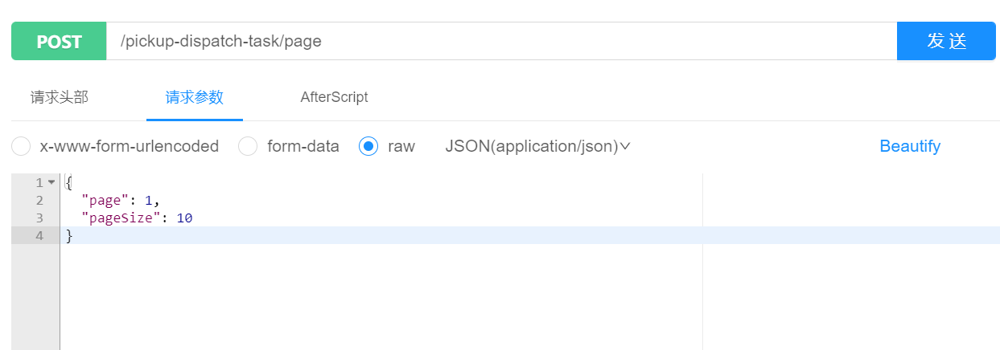
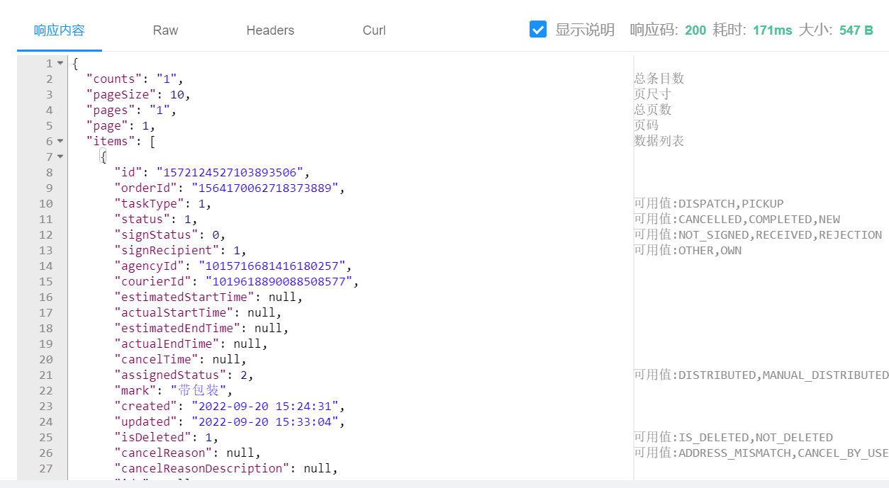
# 5、调度中心
在调度中心中对于生成取派件任务的消息进行处理，消息内容类似这样：
```json
{
    "orderId": 123,
    "agencyId": 8001,
    "taskType": 1,
    "mark": "带包装",
    "longitude": 116.111,
    "latitude": 39.00,
    "created": 1654224658728,
    "estimatedStartTime": 1654224658728
}
```
实现的关键点：

- 如果只查询到一个快递员，直接分配即可
- 如果是多个快递员，需要查询这些快递员当日的任务数，按照最少的进行分配，这样可以做到相对均衡
- 如果没有快递员，设置快递员id为空，可以在后台系统中，人为的进行调配快递员
- 对于取件任务而言，需要考虑用户选择的【期望上门时间】
   - 与当前时间相比，大于2小时发送延时消息，否则发送实时消息
## 5.1、编码实现
难度系数：★★★☆☆
```java
package com.sl.ms.dispatch.mq;

import cn.hutool.core.collection.CollUtil;
import cn.hutool.core.convert.Convert;
import cn.hutool.core.date.DateUtil;
import cn.hutool.core.date.LocalDateTimeUtil;
import cn.hutool.core.util.ObjectUtil;
import cn.hutool.json.JSONUtil;
import com.sl.ms.api.CourierFeign;
import com.sl.ms.base.api.common.MQFeign;
import com.sl.ms.work.api.PickupDispatchTaskFeign;
import com.sl.ms.work.domain.dto.CourierTaskCountDTO;
import com.sl.ms.work.domain.enums.pickupDispatchtask.PickupDispatchTaskType;
import com.sl.transport.common.constant.Constants;
import com.sl.transport.common.vo.CourierTaskMsg;
import com.sl.transport.common.vo.OrderMsg;
import lombok.extern.slf4j.Slf4j;
import org.springframework.amqp.core.ExchangeTypes;
import org.springframework.amqp.rabbit.annotation.Exchange;
import org.springframework.amqp.rabbit.annotation.Queue;
import org.springframework.amqp.rabbit.annotation.QueueBinding;
import org.springframework.amqp.rabbit.annotation.RabbitListener;
import org.springframework.stereotype.Component;

import javax.annotation.Resource;
import java.time.LocalDateTime;
import java.time.temporal.ChronoUnit;
import java.util.List;
import java.util.stream.Collectors;

/**
 * 订单业务消息，接收到新订单后，根据快递员的负载情况，分配快递员
 */
@Slf4j
@Component
public class OrderMQListener {

    @Resource
    private MQFeign mqFeign;

    @Resource
    private CourierFeign courierFeign;

    @Resource
    private PickupDispatchTaskFeign pickupDispatchTaskFeign;

    /**
     * 如果有多个快递员，需要查询快递员今日的取派件数，根据此数量进行计算
     * 计算的逻辑：优先分配取件任务少的，取件数相同的取第一个分配
     * <p>
     * 发送生成取件任务时需要计算时间差，如果小于2小时，实时发送；大于2小时，延时发送
     * 举例：
     * 1、现在10:30分，用户期望：11:00 ~ 12:00上门，实时发送
     * 2、现在10:30分，用户期望：13:00 ~ 14:00上门，延时发送，12点发送消息，延时1.5小时发送
     *
     * @param msg 消息内容
     */
    @RabbitListener(bindings = @QueueBinding(
            value = @Queue(name = Constants.MQ.Queues.DISPATCH_ORDER_TO_PICKUP_DISPATCH_TASK),
            exchange = @Exchange(name = Constants.MQ.Exchanges.ORDER_DELAYED, type = ExchangeTypes.TOPIC, delayed = Constants.MQ.DELAYED),
            key = Constants.MQ.RoutingKeys.ORDER_CREATE
    ))
    public void listenOrderMsg(String msg) {
        //{"orderId":123, "agencyId": 8001, "taskType":1, "mark":"带包装", "longitude":116.111, "latitude":39.00, "created":1654224658728, "estimatedStartTime": 1654224658728}
        log.info("接收到订单的消息 >>> msg = {}", msg);
        OrderMsg orderMsg = JSONUtil.toBean(msg, OrderMsg.class);
        Long agencyId = orderMsg.getAgencyId(); //网点id
        // 通过快递员微服务查询 可以为发件人服务的快递员（正常上班、服务范围内）
        Double longitude = orderMsg.getLongitude();
        Double latitude = orderMsg.getLatitude();

        Long selectedCourierId = null;
        List<Long> courierIds = this.courierFeign.queryCourierIdListByCondition(agencyId, longitude, latitude, LocalDateTimeUtil.toEpochMilli(orderMsg.getEstimatedEndTime()));
        log.info("快递员微服务查出的ids：{}", courierIds);
        if (CollUtil.isNotEmpty(courierIds)) {
            //选中快递员
            selectedCourierId = this.selectCourier(courierIds, orderMsg.getTaskType());
            log.info("根据当日任务选出的快递员id：{}", selectedCourierId);
        }

        //发送消息
        CourierTaskMsg courierTaskMsg = CourierTaskMsg.builder()
                .courierId(selectedCourierId)
                .agencyId(agencyId)
                .taskType(orderMsg.getTaskType())
                .orderId(orderMsg.getOrderId())
                .mark(orderMsg.getMark())
                .estimatedEndTime(orderMsg.getEstimatedEndTime())
                .created(System.currentTimeMillis())
                .build();

        //计算时间差
        long between = LocalDateTimeUtil.between(LocalDateTime.now(), orderMsg.getEstimatedEndTime(), ChronoUnit.MINUTES);

        int delay = Constants.MQ.DEFAULT_DELAY; //默认实时发送
        if (between > 120 && ObjectUtil.equal(orderMsg.getTaskType(), 1)) {
            //计算延时时间，单位毫秒
            LocalDateTime sendDataTime = LocalDateTimeUtil.offset(orderMsg.getEstimatedEndTime(), -2, ChronoUnit.HOURS);
            delay = Convert.toInt(LocalDateTimeUtil.between(LocalDateTime.now(), sendDataTime, ChronoUnit.MILLIS));
        }
        this.mqFeign.sendMsg(Constants.MQ.Exchanges.PICKUP_DISPATCH_TASK_DELAYED,
                Constants.MQ.RoutingKeys.PICKUP_DISPATCH_TASK_CREATE, courierTaskMsg.toJson(), delay);
    }


    /**
     * 根据当日的任务数选取快递员
     *
     * @param courierIds 快递员列个表
     * @param taskType   任务类型
     * @return 选中的快递员id
     */
    private Long selectCourier(List<Long> courierIds, Integer taskType) {
        if (courierIds.size() == 1) {
            return courierIds.get(0);
        }

        String date = DateUtil.date().toDateStr();
        List<CourierTaskCountDTO> courierTaskCountDTOS = this.pickupDispatchTaskFeign
                .findCountByCourierIds(courierIds, PickupDispatchTaskType.codeOf(taskType), date);
        if (CollUtil.isEmpty(courierTaskCountDTOS)) {
            //没有查到任务数量，默认给第一个快递员分配任务
            return courierIds.get(0);
        }

        //查看任务数是否与快递员数相同，如果不相同需要补齐，设置任务数为0，这样就可以确保每个快递员都能分配到任务
        if (ObjectUtil.notEqual(courierIds.size(), courierTaskCountDTOS.size())) {
            List<CourierTaskCountDTO> dtoList = courierIds.stream()
                    .filter(courierId -> {
                        int index = CollUtil.indexOf(courierTaskCountDTOS, dto -> ObjectUtil.equal(courierId, dto.getCourierId()));
                        return index == -1;
                    })
                    .map(courierId -> CourierTaskCountDTO.builder()
                            .courierId(courierId)
                            .count(0L).build())
                    .collect(Collectors.toList());
            //补齐到集合中
            courierTaskCountDTOS.addAll(dtoList);
        }

        //选中任务数最小的快递员进行分配
        CollUtil.sortByProperty(courierTaskCountDTOS, "count");
        return courierTaskCountDTOS.get(0).getCourierId();
    }

}

```
## 5.2、测试
对于`OrderMQListener`的测试，需要启动必要的服务，因为需要查询快递员（不查询也可以，就是无快递员的逻辑），此时就需要确保有快递员数据（确保在服务范围内或有所在机构的快递员），准备完成后，先进行单元测试，后面再进行整合测试。
```shell
docker start sl-express-gateway
docker start sl-express-ms-base-service
docker start sl-express-ms-courier-service
docker start sl-express-ms-web-manager
docker start sl-express-ms-service-scope-service
```
启动之后，可以查看快递员的排班情况：
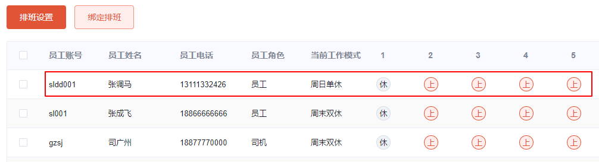
快递员有所属的机构：
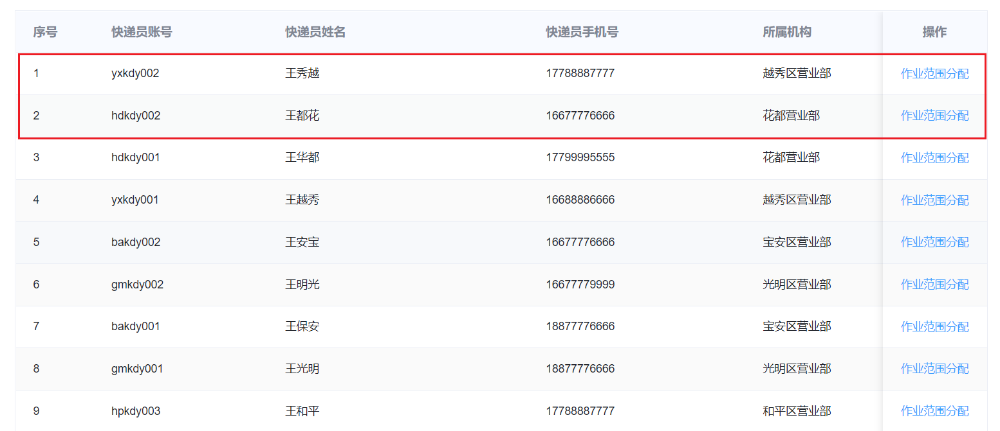
编写单元测试：
```java
package com.sl.ms.dispatch.mq;

import cn.hutool.core.date.LocalDateTimeUtil;
import cn.hutool.json.JSONUtil;
import com.sl.transport.common.vo.OrderMsg;
import org.junit.jupiter.api.Test;
import org.springframework.boot.test.context.SpringBootTest;

import javax.annotation.Resource;

import java.time.LocalDate;

import static org.junit.jupiter.api.Assertions.*;

@SpringBootTest
class OrderMQListenerTest {

    @Resource
    private OrderMQListener orderMQListener;

	@Test
	void listenOrderMsg() {
	    OrderMsg orderMsg = OrderMsg.builder()
	            .agencyId(1024981239465110017L)
	            .orderId(1590586236289646594L)
	            .estimatedEndTime(LocalDateTimeUtil.parse("2023-01-13 23:00:00", "yyyy-MM-dd HH:mm:ss"))
	            .longitude(116.41338)
	            .latitude(39.91092)
	            .created(System.currentTimeMillis())
	            .taskType(1)
	            .mark("带包装")
	            .build();
	    this.orderMQListener.listenOrderMsg(JSONUtil.toJsonStr(orderMsg));
	}
}
```
查询到快递员：
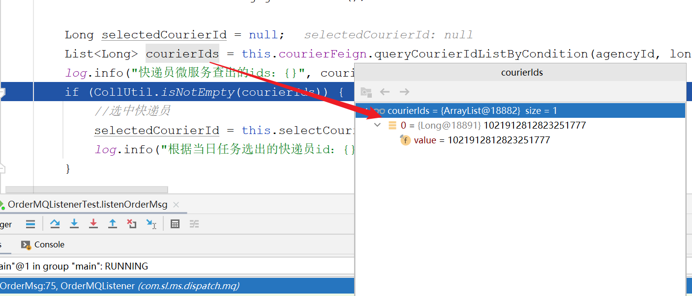
延时发送：
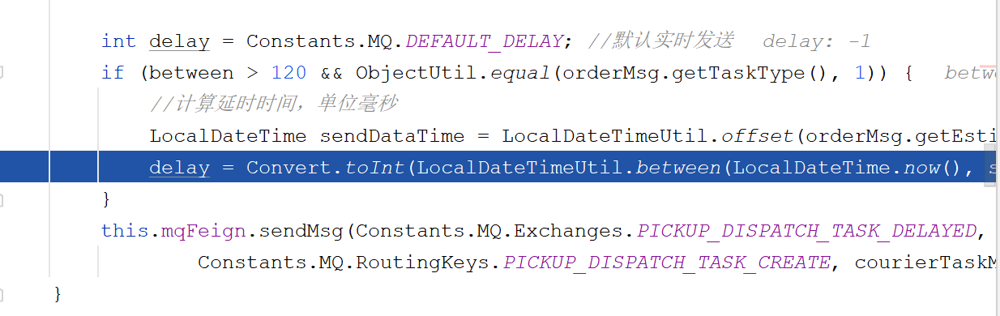
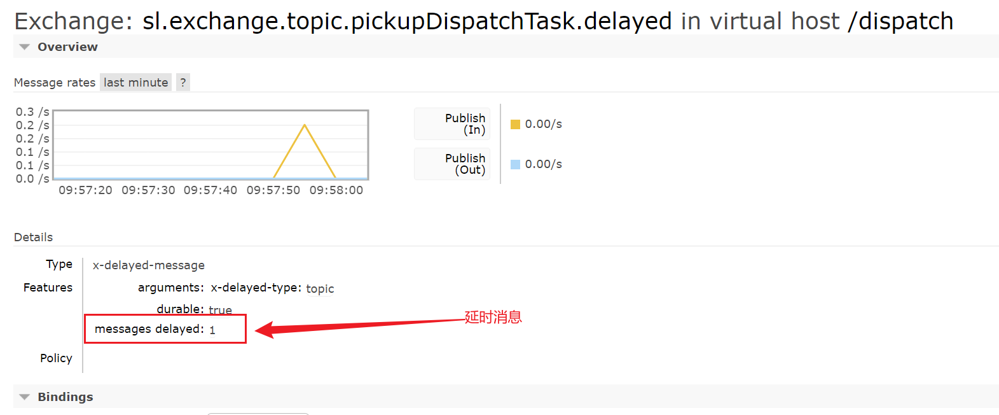
wok中接收到调度中心发来的消息：
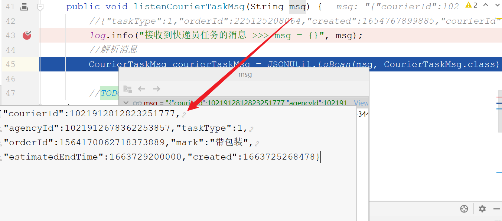
# 6、生成任务
在work微服务中可以接收到来自调度中心的消息，接下来，我们需要编写消费消息的逻辑，生成快递员的取派件任务。
## 6.1、消费消息
```java
    /**
     * 生成快递员取派件任务
     *
     * @param msg 消息
     */
    @RabbitListener(bindings = @QueueBinding(
            value = @Queue(name = Constants.MQ.Queues.WORK_PICKUP_DISPATCH_TASK_CREATE),
            exchange = @Exchange(name = Constants.MQ.Exchanges.PICKUP_DISPATCH_TASK_DELAYED, type = ExchangeTypes.TOPIC, delayed = Constants.MQ.DELAYED),
            key = Constants.MQ.RoutingKeys.PICKUP_DISPATCH_TASK_CREATE
    ))
    public void listenCourierTaskMsg(String msg) {
        //{"taskType":1,"orderId":225125208064,"created":1654767899885,"courierId":1001,"agencyId":8001,"estimatedStartTime":1654224658728,"mark":"带包装"}
        log.info("接收到快递员任务的消息 >>> msg = {}", msg);
        //解析消息
        CourierTaskMsg courierTaskMsg = JSONUtil.toBean(msg, CourierTaskMsg.class);

        //幂等性处理：判断订单对应的取派件任务是否存在，判断条件：订单号+任务状态
        List<PickupDispatchTaskEntity> list = this.pickupDispatchTaskService.findByOrderId(courierTaskMsg.getOrderId(), PickupDispatchTaskType.codeOf(courierTaskMsg.getTaskType()));
        for (PickupDispatchTaskEntity pickupDispatchTaskEntity : list) {
            if (pickupDispatchTaskEntity.getStatus() == PickupDispatchTaskStatus.NEW) {
                //消息重复消费
                return;
            }
        }

        // 订单不存在 不进行调度
        OrderDTO orderDTO = orderFeign.findById(courierTaskMsg.getOrderId());
        if (ObjectUtil.isEmpty(orderDTO)) {
            return;
        }
        // 如果已经取消或者删除 则不进行调度
        if (orderDTO.getStatus().equals(OrderStatus.CANCELLED.getCode()) || orderDTO.getStatus().equals(OrderStatus.DEL.getCode())) {
            return;
        }

        PickupDispatchTaskEntity pickupDispatchTask = BeanUtil.toBean(courierTaskMsg, PickupDispatchTaskEntity.class);
        //任务类型
        pickupDispatchTask.setTaskType(PickupDispatchTaskType.codeOf(courierTaskMsg.getTaskType()));

        //预计开始时间，结束时间向前推一小时
        LocalDateTime estimatedStartTime = LocalDateTimeUtil.offset(pickupDispatchTask.getEstimatedEndTime(), -1, ChronoUnit.HOURS);
        pickupDispatchTask.setEstimatedStartTime(estimatedStartTime);
        // 默认未签收状态
        pickupDispatchTask.setSignStatus(PickupDispatchTaskSignStatus.NOT_SIGNED);

        //分配状态
        if (ObjectUtil.isNotEmpty(pickupDispatchTask.getCourierId())) {
            pickupDispatchTask.setAssignedStatus(PickupDispatchTaskAssignedStatus.DISTRIBUTED);
        } else {
            pickupDispatchTask.setAssignedStatus(PickupDispatchTaskAssignedStatus.MANUAL_DISTRIBUTED);
        }

        PickupDispatchTaskEntity result = this.pickupDispatchTaskService.saveTaskPickupDispatch(pickupDispatchTask);
        if (result == null) {
            //保存任务失败
            throw new SLException(StrUtil.format("快递员任务保存失败 >>> msg = {}", msg));
        }
    }
```
## 6.2、测试
测试时，需要启动oms服务：
```shell
docker start sl-express-ms-oms-service
```
测试方法：通过`com.sl.ms.dispatch.mq.OrderMQListenerTest#listenOrderMsg()`的测试发出消息，在work中消费消息，生成取件任务。
测试结果：
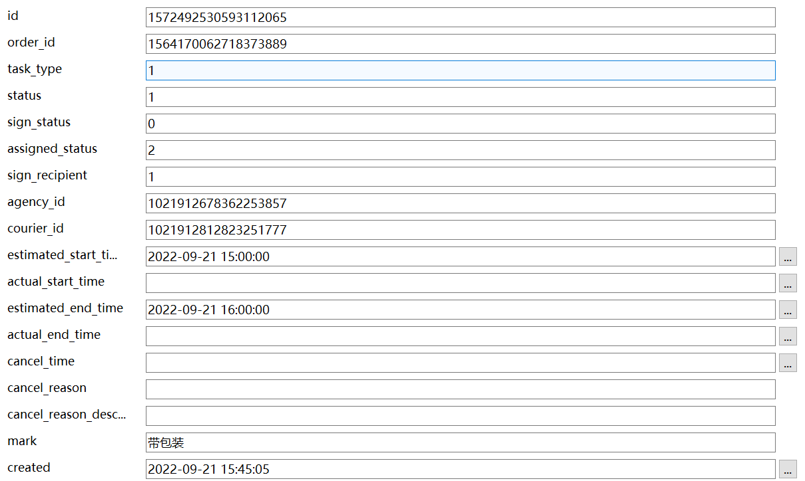
# 7、整体测试
将相应的服务启动，基于四端进行测试。测试整个主流程，下单 → 取件任务 → 运输任务 → 转运 → 派件任务 → 签收。
# 8、练习
## 8.1、练习1
难度系数：★★☆☆☆
描述：阅读订单微服务中下单的业务逻辑代码。
## 8.2、练习2
难度系数：★★☆☆☆
描述：阅读快递员微服务中查询范围内快递员的代码。
# 9、面试连环问
:::info
面试官问：

- 用户下单后，是如何确认上门取件的快递员的？如果有多个快递员怎么处理？
- 系统分配给快递员的取件任务，快递员如果将任务取消后，该如何处理？
- 生成取件任务，为什么会用到延时队列？
- 生成取派件任务为什么不在work中直接生成，而是发消息到调度中心，再发消息到work中？
:::
