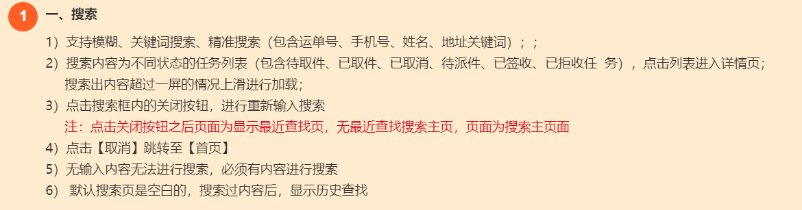
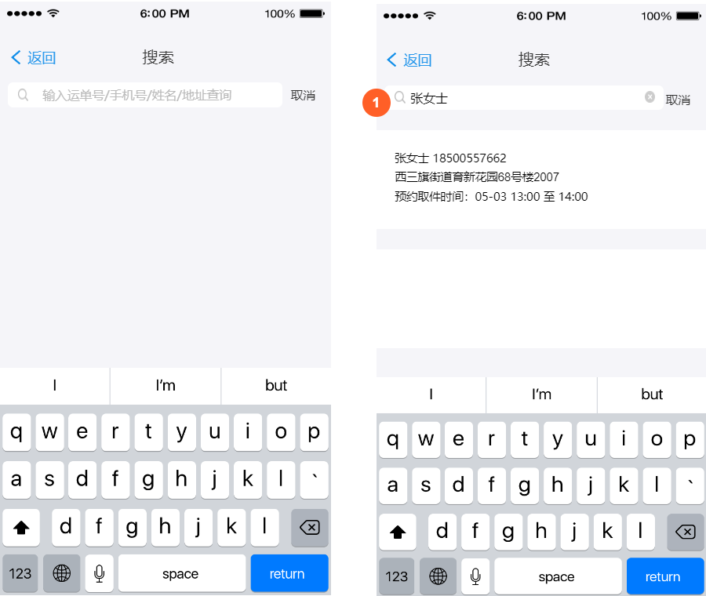
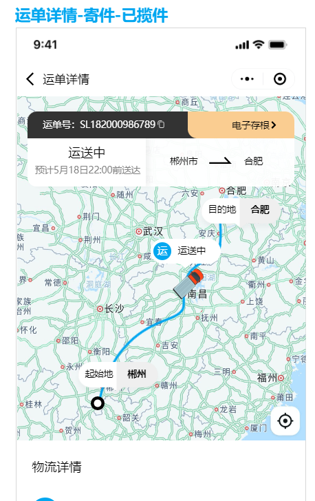
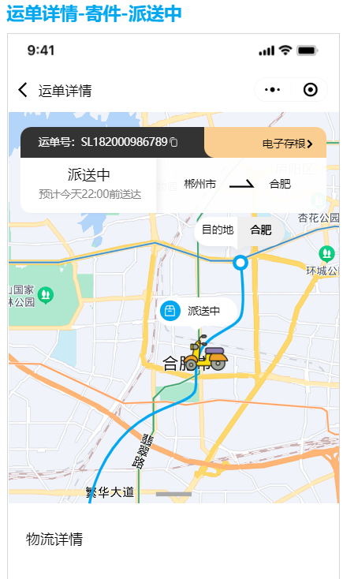
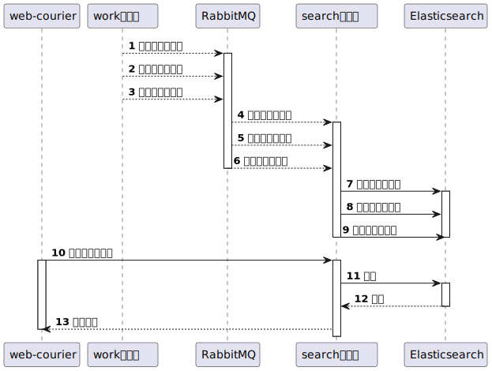
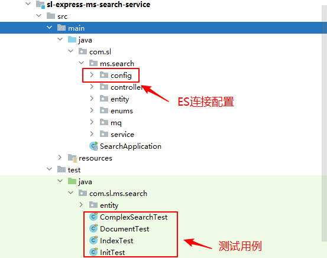
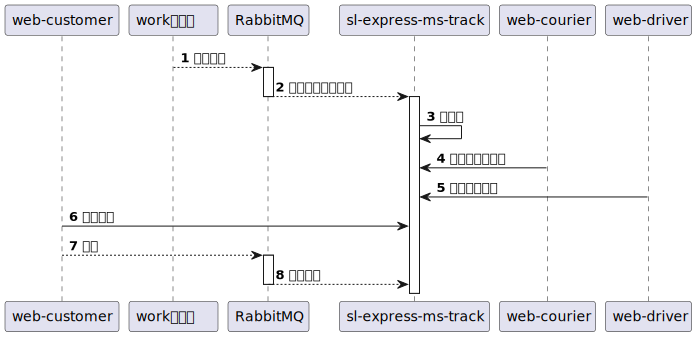
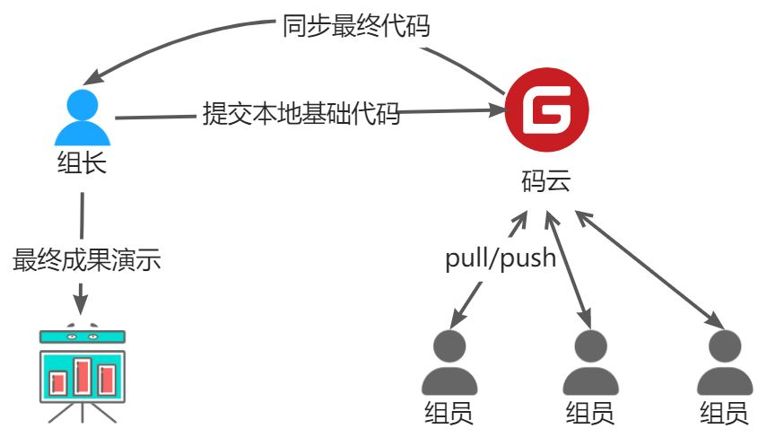

# 1、背景说明

通过前面课程的学习，我们已经掌握了神领物流项目相关业务的开发，也参与了核心调度中心的开发，对于项目有了更深的理解，在此阶段中，我们将基于神领物流项目本身的基础之上扩展新的功能，这些新的功能将由你来完成。加油~

# 2、功能需求
项目分组实战，目标是完成三个需求，实现三个微服务，分别是

- 取派件任务搜索微服务	（★★★★☆）
- 车辆轨迹微服务		（★★★☆☆）
- 短信微服务			（★★☆☆☆）
   - 快递员派件时，下发短信通知收件人
   - 快递员取件后，用户超时1小时未付款，下发短信通知付款
   - 收件人签收后，下发短信邀请为快递员评价
   - ……
## 2.1、取派件任务搜索
取派件任务搜索是在快递员端的操作，主要包含两个功能，分别是【任务搜索】和【最近搜索】，其中【最近搜索】已经在`sl-express-ms-web-courier`中实现，所以在实战中，只需要实现【任务搜索】即可。
任务搜索的需求如下：（仔细阅读需求）

功能界面：

## 2.2、车辆轨迹
车辆轨迹，首先是在创建运单后会对整个运输路线进行规划（借助高德地图服务），规划完成后轨迹点数据存于MongoDB，用于展现轨迹。（具体需求可参考需求文档）
车辆在运输中、快递员在派件中会上报位置自己的位置，具体由各自的APP进行上报，用于展现当前车辆所在的位置。
功能效果图如下：


# 3、实现分析
## 3.1、取派件任务搜索
关于搜索的实现的，可以参考文档：[https://sl-express.itheima.net/#/zh-cn/modules/sl-express-ms-search](https://sl-express.itheima.net/#/zh-cn/modules/sl-express-ms-search)
### 3.1.1、业务流程


- 快递员的取派件任务都是通过work微服务发出消息与Elasticsearch中的数据同步的
- 快递员端微服务通过搜索微服务的查询，可以查询到符合条件的数据
### 3.1.2、基础代码
在git中提供搜索微服务的基础代码，仅供实战参考。（学生可自行设计代码，不要求必须一样，能够实现业务功能即可）

| 工程名 | git地址 |
| --- | --- |
| sl-express-ms-search-api | [http://git.sl-express.com/sl/sl-express-ms-search-api.git](http://git.sl-express.com/sl/sl-express-ms-search-api.git) |
| sl-express-ms-search-domain | [http://git.sl-express.com/sl/sl-express-ms-search-domain.git](http://git.sl-express.com/sl/sl-express-ms-search-domain.git) |
| sl-express-ms-search-service | [http://git.sl-express.com/sl/sl-express-ms-search-service.git](http://git.sl-express.com/sl/sl-express-ms-search-service.git) |

### 3.1.3、实现提示
#### 3.1.3.1、新版Java API学习
ElasticSearch自7.15版本以后，废弃了 RestHighLevelClient ，官方推荐使用 ElasticsearchClient ，该客户端的使用示例均已做了测试用例。
如下图中，IndexTest 是索引相关测试用例，DocumentTest 是文档相关测试用例，ComplexSearchTest 是复杂搜索相关测试用例。
另外，同学们也可参考官方文档进行自主学习：[https://www.elastic.co/guide/en/elasticsearch/client/java-api-client/7.17/searching.html](https://www.elastic.co/guide/en/elasticsearch/client/java-api-client/7.17/searching.html)

#### 3.1.3.2、分词器学习
搜索微服务中，我们对于运单号、手机号、姓名字段进行搜索。运单号和手机号字段使用Ngram分词器，姓名字段先使用Ngram分词器，再使用拼音分词器。
以上两种分词器可参考官方文档进行自主学习：

- Ngram分词器官方文档：[https://www.elastic.co/guide/en/elasticsearch/reference/6.8/analysis-ngram-tokenizer.html](https://www.elastic.co/guide/en/elasticsearch/reference/6.8/analysis-ngram-tokenizer.html)
- 拼音分词器官方文档：[https://github.com/medcl/elasticsearch-analysis-pinyin](https://github.com/medcl/elasticsearch-analysis-pinyin)
#### 3.1.3.3、索引库结构
在kibana中，创建索引库和映射（仅供参考，可自行调整）：
```shell
PUT courier_task
{
  "settings": {
    "index.max_ngram_diff":12,// ngram分词器设置最大最小步长间隔
    "analysis": {
      "analyzer": {// 自定义分词器
        "code_analyzer": {// 编码类分词器，适用于手机号和运单号
          "tokenizer": "code_tokenizer"
        },
        "name_analyzer":{// 姓名分词器
          "tokenizer": "name_tokenizer",
          "filter": "py" // 分词后再用拼音分词器过滤
        }
      },
      "tokenizer": {
        "code_tokenizer": {
          "type": "ngram",
          "min_gram": 4,
          "max_gram": 15,
          "token_chars": [
            "letter",
            "digit"
          ]
        },
        "name_tokenizer": {
          "type": "ngram",
          "min_gram": 2,
          "max_gram": 10,
          "token_chars": [
            "letter",
            "digit"
          ]
        }
      },
      "filter": {// 自定义tokenizer filter
        "py":{// 过滤器名称
          "type": "pinyin",// 过滤器类型，这个自定义的过滤器使用的是pinyin分词器
          "keep_full_pinyin": false,//不要把单个字ch
          "keep_joined_full_pinyin": true,//把词语转成全拼
          "keep_original": true,//转完之后的中文保留
          "limit_first_letter_length": 16,//转成的拼音首字母不能超过16个
          "remove_duplicated_term": true,//转成的拼音不能有重复的，重复的删掉
          "none_chinese_pinyin_tokenize": false
        }
      }
    }
  },
  "mappings": {
    "properties": {
      "actualEndTime" : {
        "type" : "date",
        "format" : "yyyy-MM-dd HH:mm:ss"
      },
      "actualStartTime" : {
        "type" : "date",
        "format" : "yyyy-MM-dd HH:mm:ss"
      },
      "address" : {
        "type" : "text"
      },
      "agencyId" : {
        "type" : "long"
      },
      "courierId" : {
        "type" : "long"
      },
      "created" : {
        "type" : "date",
        "format" : "yyyy-MM-dd HH:mm:ss"
      },
      "estimatedEndTime" : {
        "type" : "date",
        "format" : "yyyy-MM-dd HH:mm:ss"
      },
      "estimatedStartTime" : {
        "type" : "date",
        "format" : "yyyy-MM-dd HH:mm:ss"
      },
      "id" : {
        "type" : "keyword"
      },
      "isDeleted" : {
        "type" : "keyword"
      },
      "name" : {
        "type" : "text",
        "analyzer": "name_analyzer",
        "search_analyzer": "keyword"
      },
      "orderId" : {
        "type" : "long"
      },
      "phone" : {
        "type" : "text",
        "analyzer": "code_analyzer",
        "search_analyzer": "keyword"
      },
      "status" : {
        "type" : "keyword"
      },
      "taskType" : {
        "type" : "keyword"
      },
      "transportOrderId" : {
        "type" : "text",
        "analyzer": "code_analyzer",
        "search_analyzer": "keyword"
      },
      "updated" : {
        "type" : "date",
        "format" : "yyyy-MM-dd HH:mm:ss"
      }
    }
  }
}
```
## 3.2、车辆轨迹
### 3.2.1、业务流程

在git中提供车辆轨迹微服务的基础代码，仅供实战参考。（学生可自行设计代码，不要求必须一样，能够实现业务功能即可）

| 工程名 | git地址 |
| --- | --- |
| sl-express-ms-track-api | [http://git.sl-express.com/sl/sl-express-ms-track-api.git](http://git.sl-express.com/sl/sl-express-ms-track-api.git) |
| sl-express-ms-track-domain | [http://git.sl-express.com/sl/sl-express-ms-track-domain.git](http://git.sl-express.com/sl/sl-express-ms-track-domain.git) |
| sl-express-ms-track-service | [http://git.sl-express.com/sl/sl-express-ms-track-service.git](http://git.sl-express.com/sl/sl-express-ms-track-service.git) |

### 3.2.3、实现提示
实现思路：

- 根据收发件人的地址通过高德地图查询路线数据，需要将转运节点作为途经点
- 解析高德返回的数据存储到MongoDB中，解析有一定难度
# 3.3、短信微服务
项目中需要搭建短信微服务，需要发送短信进行通知，在这里主要实现的业务是，运单开始派送时发送短信通知收件人。
基础代码，仅供实战参考。（学生可自行设计代码，不要求必须一样，能够实现业务功能即可）

| 工程名 | git地址 |
| --- | --- |
| sl-express-ms-sms-domain | [http://git.sl-express.com/sl/sl-express-ms-sms-domain.git](http://git.sl-express.com/sl/sl-express-ms-sms-domain.git) |
| sl-express-ms-sms-api | [http://git.sl-express.com/sl/sl-express-ms-sms-api.git](http://git.sl-express.com/sl/sl-express-ms-sms-api.git) |
| sl-express-ms-sms-service | [http://git.sl-express.com/sl/sl-express-ms-sms-service.git](http://git.sl-express.com/sl/sl-express-ms-sms-service.git) |

> 关于短信发送渠道，自行选择，不做强制要求。建议选择阿里云平台。

# 4、项目分组
## 4.1、时间安排
此次项目实战安排2天课时（可以加一天自习调整为3天），具体的时间安排如下：

- 第一天上午，由讲师带领学生了解项目实战中的内容
- 第一天的下午，第二天，第三天上午，这些时间段是学生实战开发的时间
- 第三天下午，成果演示
## 4.2、分组安排

- 将一个班的学生分成若干小组，每个小组成员5~6人，最多不超过8人。
- 每个小组选取一名组长，组长负责组员的任务分工。
- 每个组员都要参与开发，不得以任何接口拒绝组长安排的任务。
- 每个小组都需要完成实战中的三个功能（搜索、车辆轨迹、短信）的开发。
## 4.3、代码管理
在项目开发的过程中，我们都是基于虚拟机中的git提交代码的，在分组实战中，需要将代码共享，同组人员公共修改代码，此时虚拟机中的git就无法满足需求了，在这里，可以借助[码云](https://gitee.com/)来完成共享。基本的架构如下：

说明：

- 组长在码云中创建相应的项目，并且邀请组员成为开发者
- 组长将本地虚拟机环境中的git代码提交到码云（只需要提交实战中涉及到工程即可）
- 组员代码拉取到本地，即可进行项目开发，在开发完成后将代码提交到码云
- 待所有的功能开发完成后，组长将代码同步到本地虚拟机中的git中，最终基于组长的环境进行功能演示
- 同样，组员也将最终的代码同步到自己的本地环境中，提交到虚拟机中的git服务中
- 最终，所有人的本地虚拟机中的代码都应该是一致的
# 5、成果演示

- 每个组都需要准备一个演示ppt，在成果演示阶段使用，ppt风格不限
- 演示时，不仅是通过接口演示功能，还要通过四端进行演示，能够将完整的物流流程走通
- 如果有额外实现一些相关的功能，会有加分

