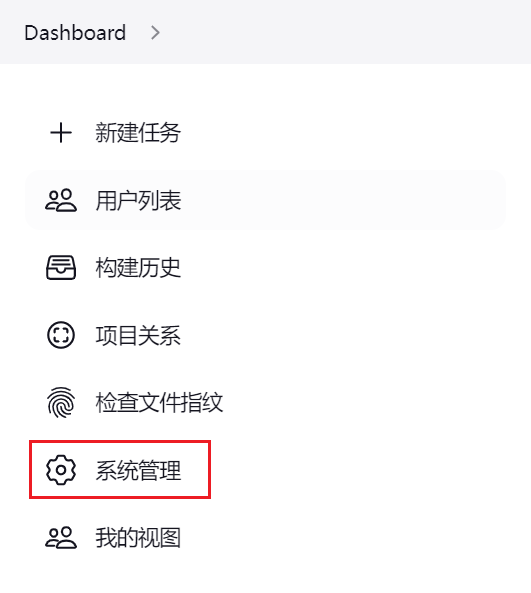
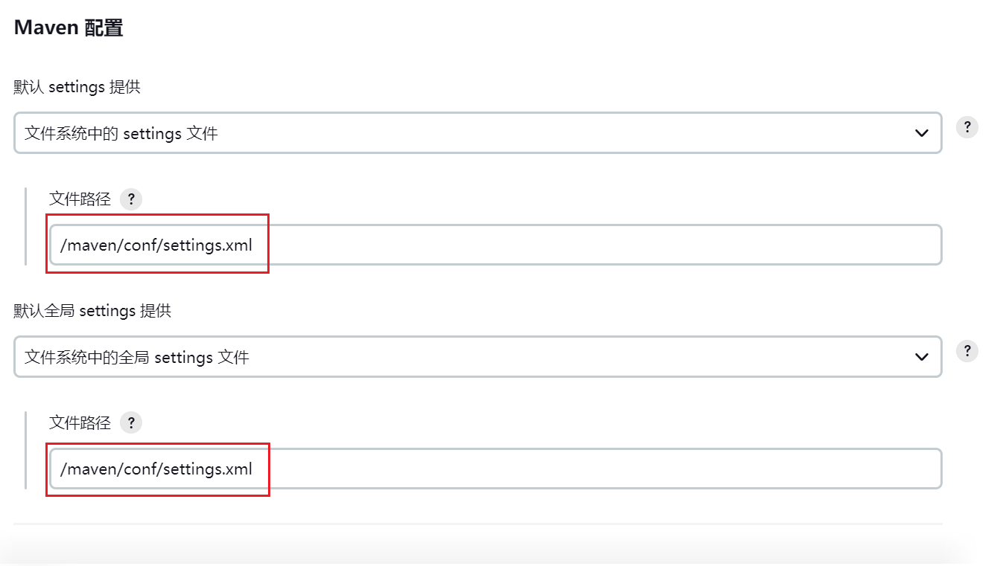
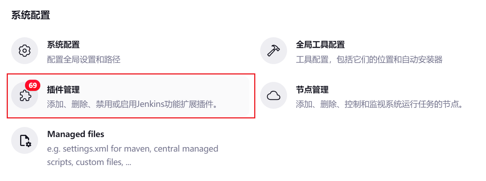
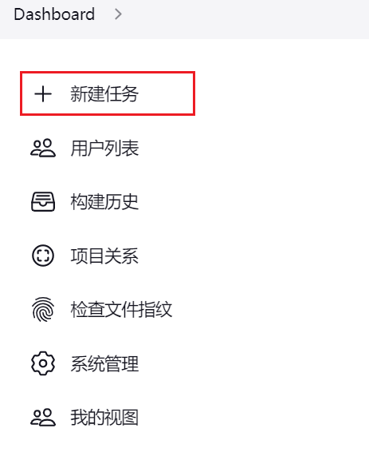
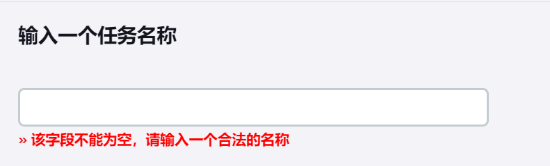
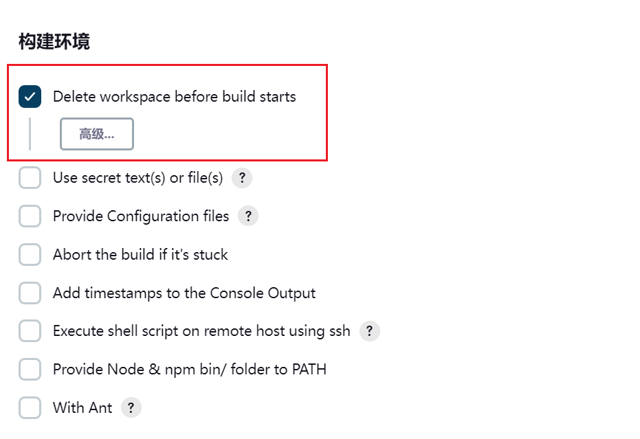
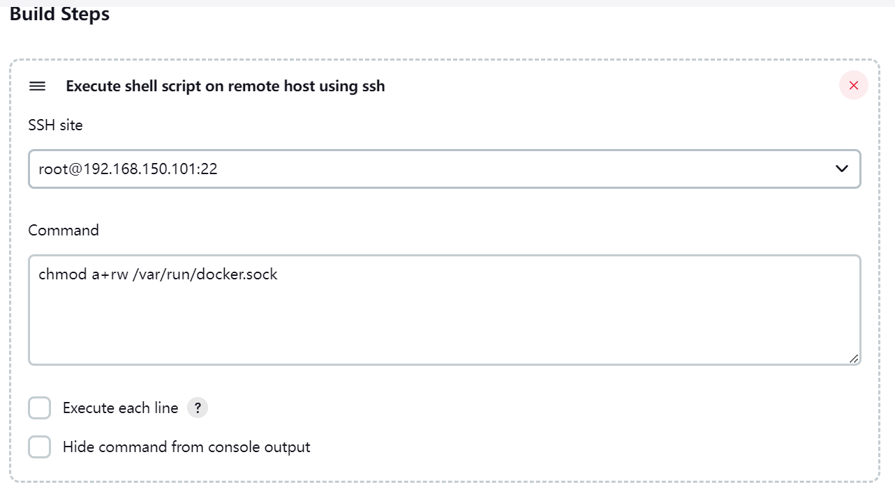

## 1、Jenkins介绍


Jenkins 是一款流行的开源持续集成（Continuous Integration）工具，广泛用于项目开发，具有自动化构建、测试和部署等功能。官网： [http://jenkins-ci.org/](http://jenkins-ci.org/)。
Jenkins的特征：

- 开源的 Java语言开发持续集成工具，支持持续集成，持续部署。
- 易于安装部署配置：可通过 yum安装,或下载war包以及通过docker容器等快速实现安装部署，可方便web界面配置管理。
- 消息通知及测试报告：集成 RSS/E-mail通过RSS发布构建结果或当构建完成时通过e-mail通知，生成JUnit/TestNG测试报告。
- 分布式构建：支持 Jenkins能够让多台计算机一起构建/测试。
- 文件识别： Jenkins能够跟踪哪次构建生成哪些jar，哪次构建使用哪个版本的jar等。
- 丰富的插件支持：支持扩展插件，你可以开发适合自己团队使用的工具，如 git，svn，maven，docker等。

Jenkins安装和持续集成环境配置


- 首先，开发人员每天进行代码提交，提交到Git仓库
- 然后，Jenkins作为持续集成工具，使用Git工具到Git仓库拉取代码到集成服务器，再配合JDK，Maven等软件完成代码编译，代码测试与审查，测试，打包等工作，在这个过程中每一步出错，都重新再执行一次整个流程。
- 最后，Jenkins把生成的jar或war包分发到测试服务器或者生产服务器，测试人员或用户就可以访问应用。
## 2、部署安装
在神领物流项目中采用Docker方式部署Jenkins，部署脚本如下：
```shell
docker run -d \
-p 8090:8080 \
-p 50000:50000 \
-v /usr/local/src/jenkins:/var/jenkins_home \
-v  /maven:/maven \
-v /etc/localtime:/etc/localtime \
-v /usr/bin/docker:/usr/bin/docker \
-v /var/run/docker.sock:/var/run/docker.sock \
--privileged \
--name jenkins \
-e TZ=Asia/Shanghai \
--restart=always \
--add-host=git.sl-express.com:192.168.150.101 \
--add-host=maven.sl-express.com:192.168.150.101 \
jenkins/jenkins:lts-jdk11
```
在部署脚本中指定了时区、hosts并且将宿主机的docker服务映射到容器内部。
访问地址：[http://jenkins.sl-express.com/](http://jenkins.sl-express.com/)  用户名密码为：root/123
## 3、系统配置
Jenkins安装完成后，需要进行一些配置才能正常使用。
### 3.1、配置Maven




在【系统管理】中的【全局工具配置】中进行配置。
指定Maven配置文件：



配置文件内容如下：

```xml
<?xml version="1.0" encoding="UTF-8"?>
<settings
    xmlns="http://maven.apache.org/SETTINGS/1.0.0"
    xmlns:xsi="http://www.w3.org/2001/XMLSchema-instance"
          xsi:schemaLocation="http://maven.apache.org/SETTINGS/1.0.0 http://maven.apache.org/xsd/settings-1.0.0.xsd">
    
   <localRepository>/maven/repository</localRepository>

    <pluginGroups></pluginGroups>
    <proxies></proxies>

    <servers>
        <server>
            <id>sl-releases</id>
            <username>deployment</username>
            <password>deployment123</password>
        </server>
        <server>
            <id>sl-snapshots</id>
            <username>deployment</username>
            <password>deployment123</password>
        </server>
    </servers>
    
	<mirrors>
        <mirror>
            <id>mirror</id>
            <mirrorOf>central,jcenter,!sl-releases,!sl-snapshots</mirrorOf>
            <name>mirror</name>
            <url>https://maven.aliyun.com/nexus/content/groups/public</url>
        </mirror>
    </mirrors>
    
	<profiles>
        <profile>
            <id>sl</id>
            <properties>
                <altReleaseDeploymentRepository>
					sl-releases::default::http://maven.sl-express.com/nexus/content/repositories/releases/
				</altReleaseDeploymentRepository>
                <altSnapshotDeploymentRepository>
					sl-snapshots::default::http://maven.sl-express.com/nexus/content/repositories/snapshots/
				</altSnapshotDeploymentRepository>
            </properties>
        </profile>
    </profiles>
    
	<activeProfiles>
        <activeProfile>sl</activeProfile>
    </activeProfiles>

</settings>

```
### 3.2、配置Git


### 3.3、安装Gogs插件
我们使用的Git管理工具是Gogs，需要在用户提交代码之后触发自动构建，需要安装Gogs插件。



搜索Gogs安装即可。


在Gogs中的仓库设置钩子，例如：


格式：`http://jenkins.sl-express.com/gogs-webhook/?job=xxxx`

## 4、构建任务
在提供的虚拟机环境中虽然已经创建好了构建任务，如果不满足需求，可以执行创建任务，可以通过复制的方式完成。
首先点击【新建任务】：



输入任务的名称，建议名称就是微服务的名字。



选择已有的构建任务：


输入任务的名称：


设置Gogs钩子：


设置构建参数，主要用于构建时的脚本使用：


设置git地址，每个项目都不一样，一定要修改！


设置构建开始前将workspace删除，确保没有之前编译产物的干扰：



设置ssh执行命令，主要是宿主机安装的docker服务具备权限，可以在容器内执行：



设置maven打包命令：


设置部署的ssh脚本，主要是完成微服务打包成docker镜像进行部署：


执行命令如下：
```shell
#!/bin/bash
# 微服务名称
SERVER_NAME=${serverName}

# 服务版本
SERVER_VERSION=${version}

# 服务版本
SERVER_PORT=${port}

# 源jar名称，mvn打包之后，target目录下的jar包名称
JAR_NAME=$SERVER_NAME-$SERVER_VERSION

# jenkins下的目录
JENKINS_HOME=/var/jenkins_home/workspace/$SERVER_NAME

cd $JENKINS_HOME

# 修改文件权限
chmod 755 target/$JAR_NAME.jar

docker -v

echo "---------停止容器（$SERVER_NAME）---------"
docker stop $SERVER_NAME

echo "---------删除容器（$SERVER_NAME）---------"
docker rm $SERVER_NAME

echo "---------删除镜像（$SERVER_NAME:$SERVER_VERSION）---------"
docker rmi $SERVER_NAME:$SERVER_VERSION

echo "---------打包镜像（$SERVER_NAME:$SERVER_VERSION）---------"
docker build -t $SERVER_NAME:$SERVER_VERSION .

echo "---------运行服务---------"
docker run -d -p $SERVER_PORT:8080 --name $SERVER_NAME -e SERVER_PORT=8080 -e SPRING_CLOUD_NACOS_DISCOVERY_IP=${SPRING_CLOUD_NACOS_DISCOVERY_IP} -e  SPRING_CLOUD_NACOS_DISCOVERY_PORT=${port} -e SPRING_PROFILES_ACTIVE=stu $SERVER_NAME:$SERVER_VERSION
```
最后，保存即可。
