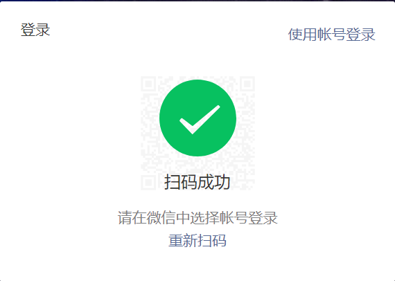
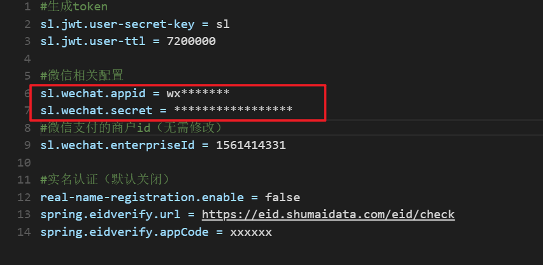
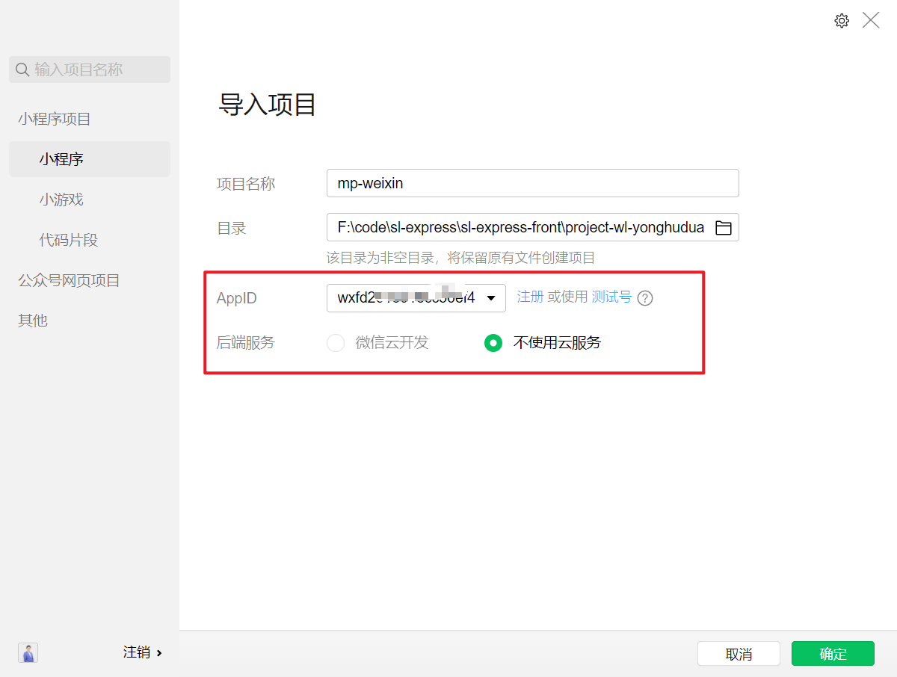
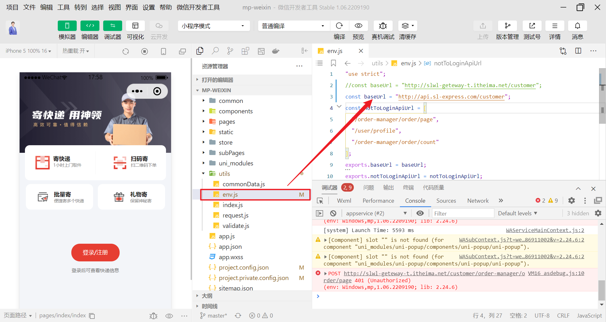
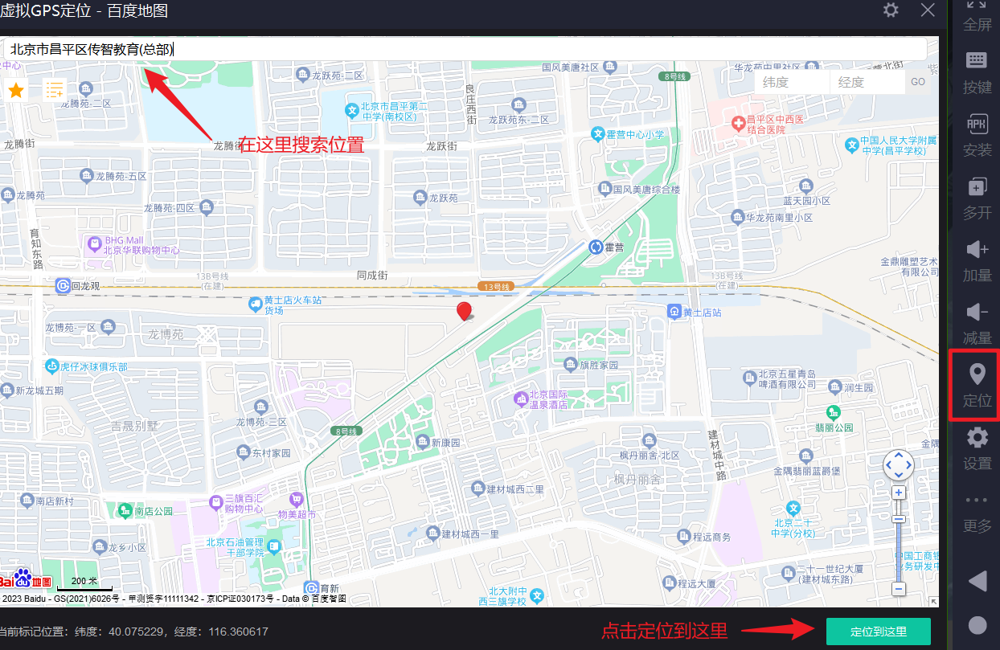
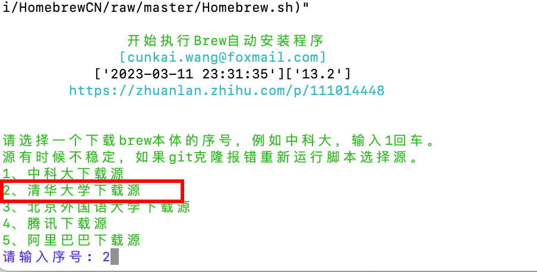
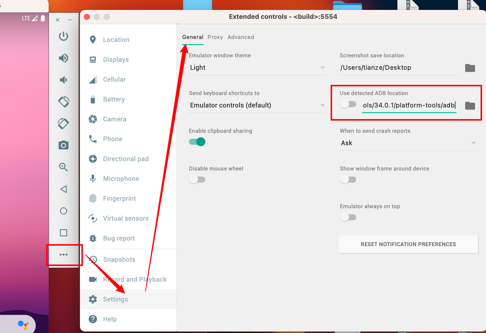
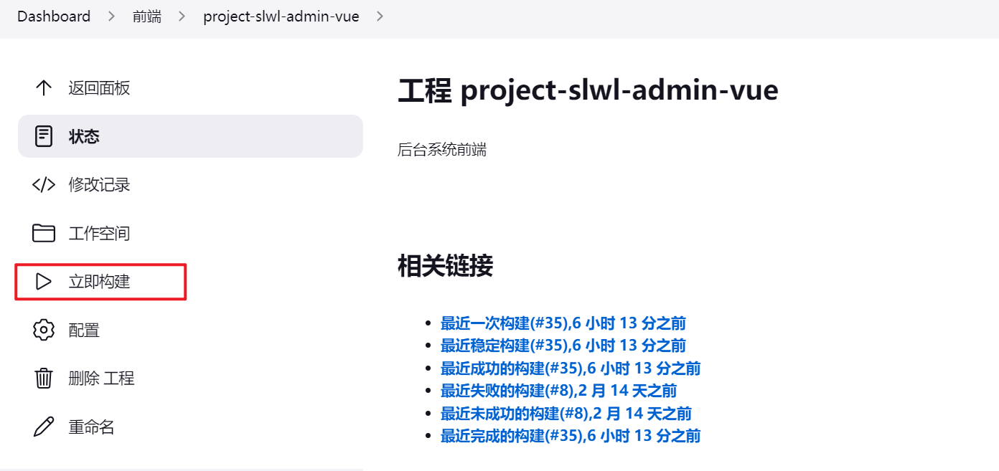

## 1、说明

前端包括4个端，分别是：

- 用户端（微信小程序）
- 快递员端（安卓app）
- 司机端（安卓app）
- 后台管理端（pc web）
## 2、用户端
### 2.1、开发者工具
用户端是基于微信小程序开发的，首先需要下载并安装微信开发者工具：


可以使用课程资料中提供的安装包或在线下载，[点击下载](https://developers.weixin.qq.com/miniprogram/dev/devtools/stable.html)

### 2.2、申请测试账号
接下来，申请微信小程序的测试账号，[点击申请](https://mp.weixin.qq.com/wxamp/sandbox)，通过手机微信扫码进行操作。


申请成功后，进行登录，[点击登录](https://mp.weixin.qq.com/)，如下：


通过手机微信进行扫码登录：



即可看到测试账号信息：


需要将AppID和AppSecret保存到nacos配置中心的 `sl-express-ms-web-customer.properties`中：



### 2.3、导入代码
从git拉取代码，地址：[http://git.sl-express.com/sl/project-wl-yonghuduan-uniapp-vue3](http://git.sl-express.com/sl/project-wl-yonghuduan-uniapp-vue3)


打开微信开发者工具（需要通过手机上的微信客户端进行扫码登录，不要使用游客身份登录），导入代码，注意导入的目录为：`project-wl-yonghuduan-uniapp-vue3\unpackage\dist\dev\mp-weixin`，使用测试账号：



导入完成后，需要修改`env.js`配置文件，将`baseUrl`变量设置为：`http://api.sl-express.com/customer`，此链接为与后端服务交互的地址，入口为网关地址：（修改完成后需要点击【编译】按钮进行重新编译）



如果需要完成登录，需要确保如下服务保持启动状态：


测试登录：


登录成功：


## 3、司机、快递员端

司机和快递员端都是安卓app的，可以安装在手机或通过模拟器进行使用，这里介绍模拟器的方式进行使用。（如果使用手机的话，需要通过内网穿透的方式访问网关）

### 3.1、模拟器

#### 3.1.1、联想模拟器

在Windows平台推荐使用【联想模拟器】，安装包在`资料\软件包\模拟器`中找到。（如果联想模拟器不能正常使用也可以使用其他的模拟器）
安装完成后，设置分辨率为【手机 720 * 1280】：


效果如下：（安装apk直接拖入即可）


模拟器中的共享目录：


在模拟器的定位功能中可以设定位置信息，主要用于app中获取定位，在项目用于车辆位置上报等场景：



#### 3.1.2、官方模拟器
如果使用的是苹果Mac电脑并且是M1、M2芯片的同学，可以安装官方的模拟器进行使用。
在资料文件夹中找到`android-emulator-m1-preview-v3.dmg`安装包，进行安装。
安装完成后，还不能安装apk，需要安装android-sdk，这里通过brew命令安装，首先安装brew，在命令控制台输入命令：
`/bin/zsh -c "$(curl -fsSL https://gitee.com/cunkai/HomebrewCN/raw/master/Homebrew.sh)" `
推荐使用2号安装：




> 如果没有安装git，在提示框中选择安装即可。


执行命令立即生效：`source /Users/tianze/.zprofile`
接下来安装android-sdk：

```shell
#先安装android-sdk，再安装android-platform-tools
brew install --cask android-sdk

brew install android-platform-tools

#查看
brew list android-sdk
brew list android-platform-tools
```
可以看到在`/opt/homebrew/Caskroom`目录下有`android-platform-tools`和`android-sdk`两个文件夹：


在模拟器中设置adb路径：`/opt/homebrew/Caskroom/android-platform-tools/34.0.1/platform-tools/adb`



设置完成后，即可拖入apk进行安装：


### 3.2、启动服务
测试登录的话，需要确保如下的服务处于启动状态：


### 3.3、快递员端
在app中设置接口地址：`http://192.168.150.101:9527/courier`


使用正确的用户密码即可登录：


### 3.4、司机端
司机端与快递员端类似，需要配置url为：`http://192.168.150.101:9527/driver`
输入正确的用户名密码即可登录成功：


## 4、pc管理端
pc管理端是需要将前端开发的vue进行编译，发布成html，然后通过nginx进行访问，这个过程已经在Jenkins中配置，执行点击发布即可。
地址：[http://jenkins.sl-express.com/view/%E5%89%8D%E7%AB%AF/job/project-slwl-admin-vue/](http://jenkins.sl-express.com/view/%E5%89%8D%E7%AB%AF/job/project-slwl-admin-vue/)



vue打包命令：


将打包后的html等静态文件拷贝到指定目录下：


nginx中的配置：


nginx所在目录：`/usr/local/src/nginx/conf`
输入地址进行测试：[http://admin.sl-express.com/#/login](http://admin.sl-express.com/#/login)


确保如下服务是启动状态：


