## 1、方案说明

神领物流项目需要使用配套的虚拟机环境才能学习，在虚拟机中提供了各种开发需要的环境，比如：git、maven私服、jenkins、mysql等（具体[点击查看](https://sl-express.itheima.net/#/zh-cn/base-service)），由于学生的电脑品牌、配置存在较大的差异，所以在这里提供了三种使用虚拟机方案，如下：

**方案一：**windows电脑环境安装虚拟机，此方案适用于大部分学生的环境，在自己的win电脑安装安装Vmware软件导入虚拟机即可。
**方案二：**苹果电脑（M1、M2芯片）安装虚拟机，此方案适用于部分学生使用新款苹果电脑的方案，在电脑中安装Vmware Fusion导入虚拟机即可。
**方案三：**电脑配置低（内存低于16GB）或使用旧款苹果电脑（配置低的Inter芯片），此方案需要再借（或买或租）一台电脑（建议win系统）配合完成，基本思路是在这台电脑中导入虚拟机，通过网络连接到这台机器，进行开发学习。

## 2、方案一：windows环境

VMware安装过程省略，建议版本使用15.5以上版本。
默认虚拟机设置的内存大小内8G，虚拟内存为16GB，建议保持此配置，不建议进行调整。

### 2.1.配置VMware网络

因为虚拟机配置了静态IP地址为192.168.150.101，因此需要VMware软件的虚拟网卡采用与虚拟机相同的网段。

#### 2.1.1.配置VMware

首先，在VMware中选择编辑，虚拟网络编辑器：

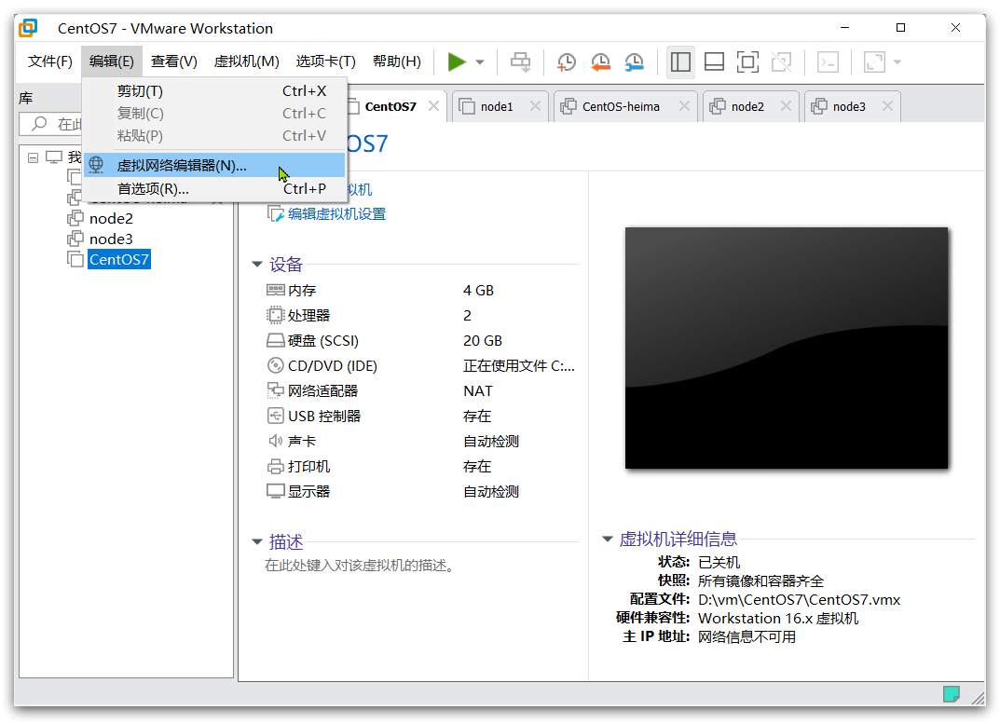

这里需要管理员权限，因此要点击更改设置：

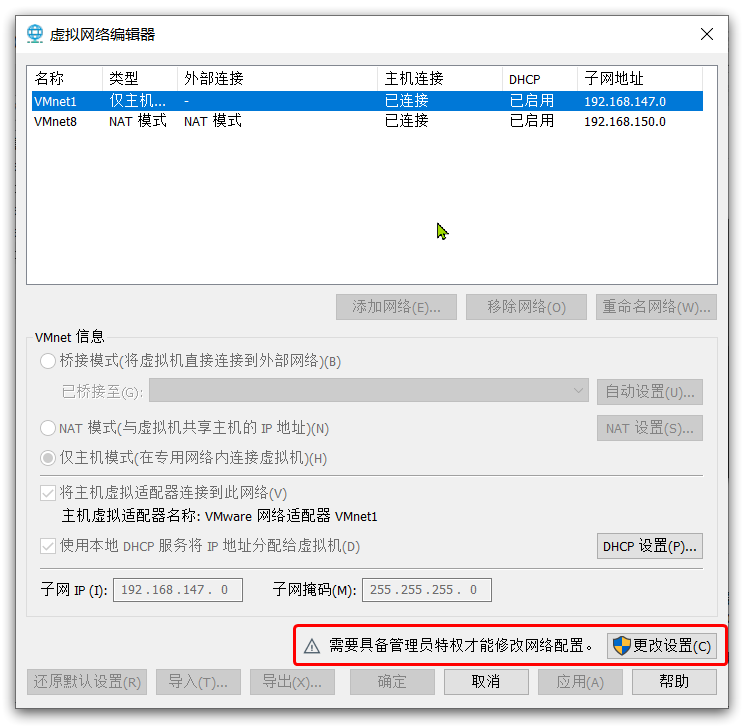

接下来，就可以修改虚拟网卡的IP地址了，流程如图：

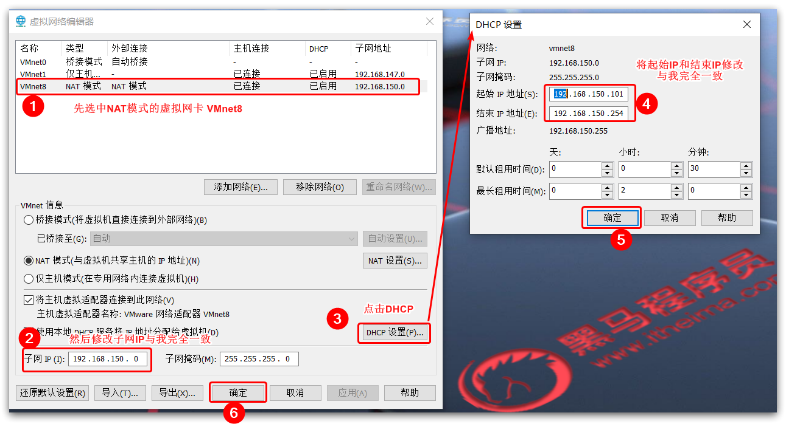

注意：一定要严格按照标号顺序修改，并且IP地址也要保持一致！

#### 2.1.2.验证

点击确定后，等待一段时间，VMware会重置你的虚拟网卡。完成后，可以在windows的网络控制面板看到：

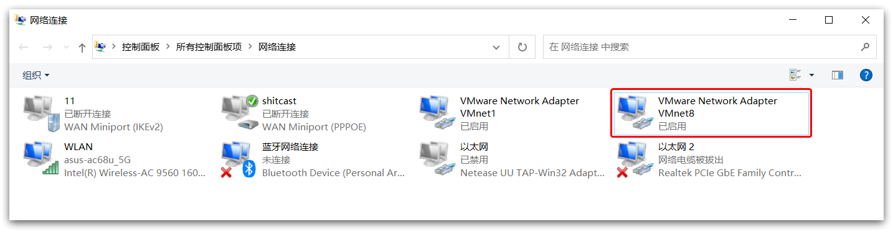

选中该网卡，右键点击，在菜单中选择状态，并在弹出的状态窗口中选择详细信息：

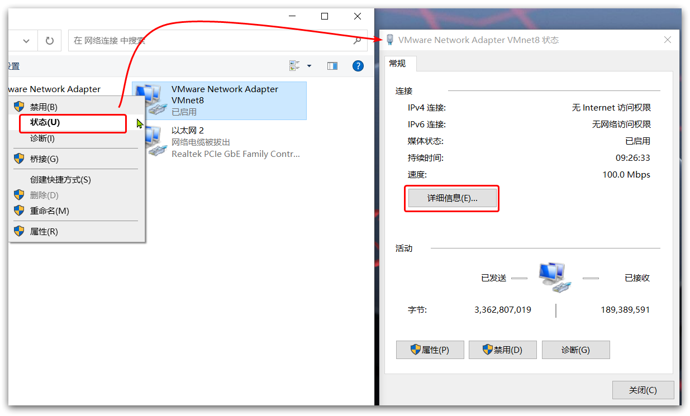

在详细信息中，查看IPv4地址是否是 `192.168.150.1`:

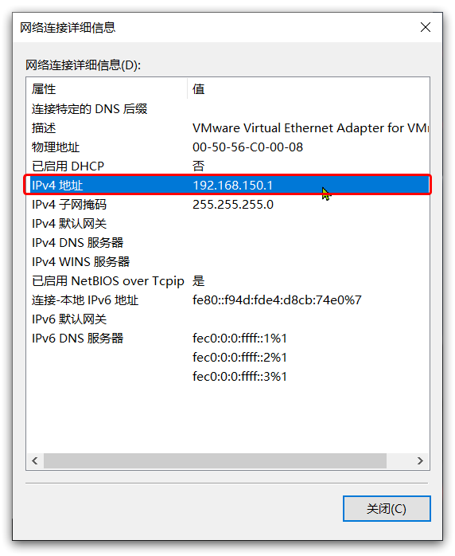

如果与我一致，则证明配置成功！

### 2.2.导入虚拟机

#### 2.2.1.导入

资料中提供了一个虚拟机文件：


打开VMware，选择文件，然后打开，找到之前提供的虚拟机文件夹，进入文件夹后，选中CentOS7.vmx文件，然后点击打开：

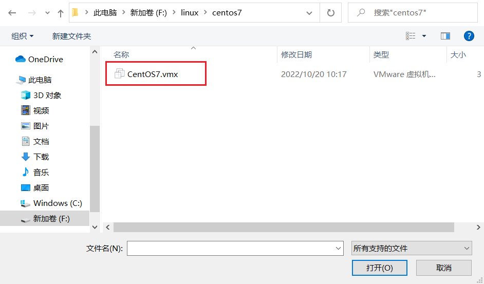

导入成功：

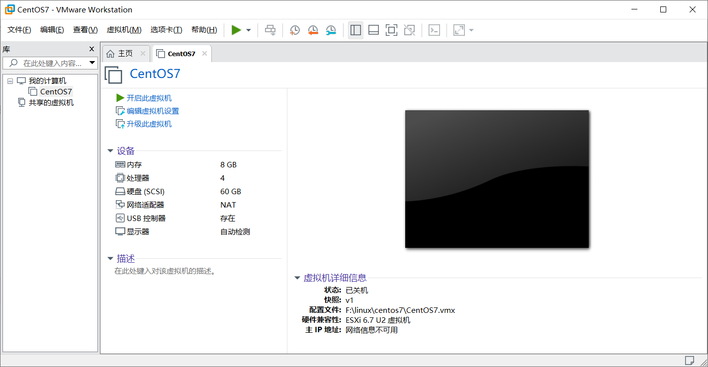

启动虚拟机，选择【我已复制该虚拟机】：

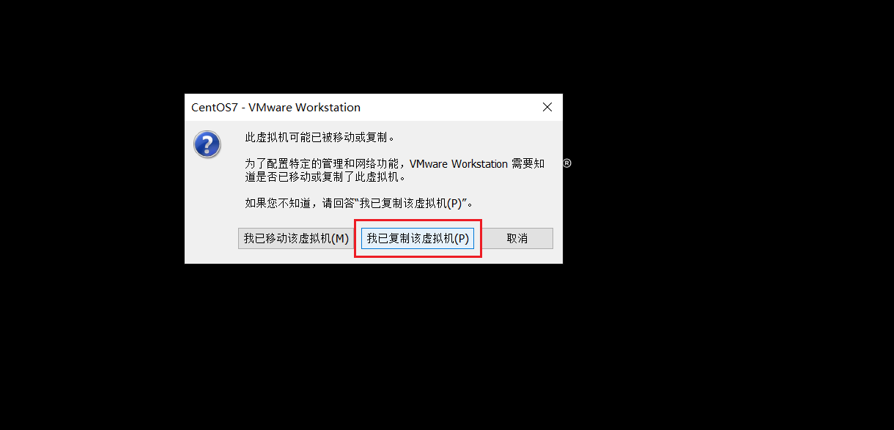

#### 2.2.2.登入

虚拟机登入信息如下：

```shell
# 用户名
root
# 密码
123321
```
### 2.3.测试网络

最后，通过命令测试网络是否畅通：

```
ping baidu.com
```
## 3、方案二：MacBook M1 M2

此方案适用于新款苹果MacBook的M系列芯片电脑，需要在电脑中安装VMware Fusion，建议版本为13.x以上。
默认虚拟机设置的内存大小内8G，虚拟内存为16GB，建议保持此配置，不建议进行调整。

### 3.1、配置网络

在Mac系统中进行网络设置：

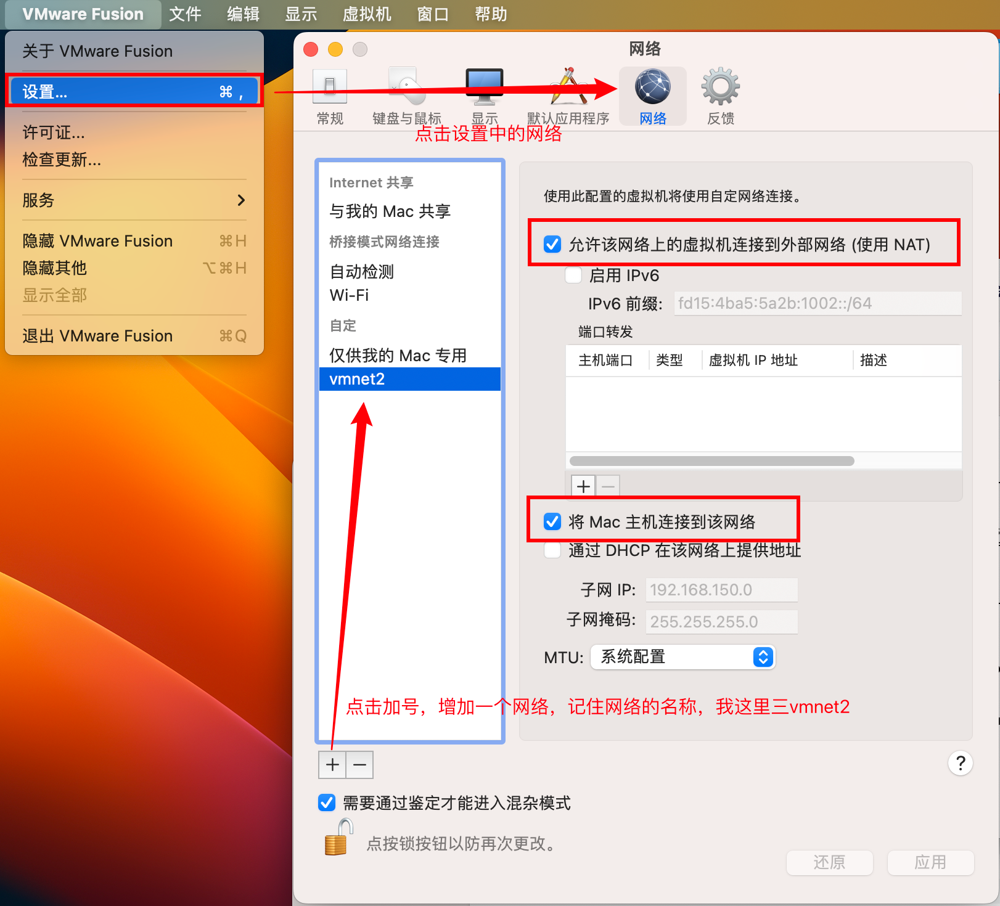

修改网络配置文件，命令：`sudo vi /Library/Preferences/VMware\ Fusion/networking`

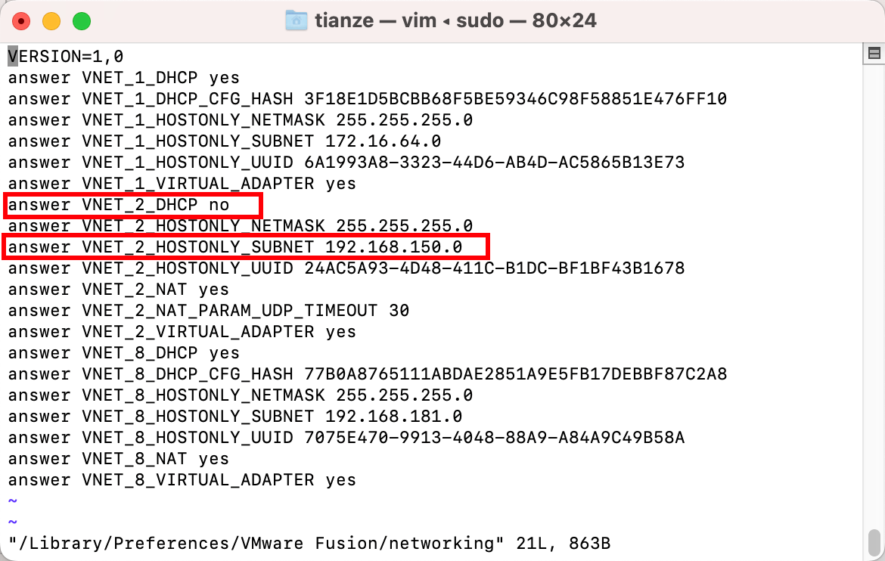

主要是修改以上两处内容，需要注意两点：

- 对应你的网络名称进行修改，我对应的是VNET_2
- ip地址**必须**为：`192.168.150.0`，虚拟机的ip地址固定为：`192.168.150.101`

修改完成后，退出VMware Fusion，然后重新打开VMware Fusion软件。

以上操作完成后，检查网关是否正确，如果显示`192.168.150.2`表示设置成功，查看命令（修改成自己的网络名称）：
`sudo vi /Library/Preferences/VMware\ Fusion/vmnet2/nat.conf`

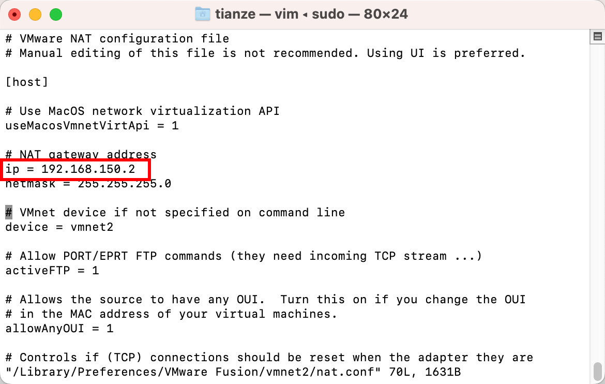

### 3.2、导入虚拟机

在VMware Fusion中，选择文件 -> 打开，找到资料中提供的【Centos7-sl-x】文件，点击打开即可。

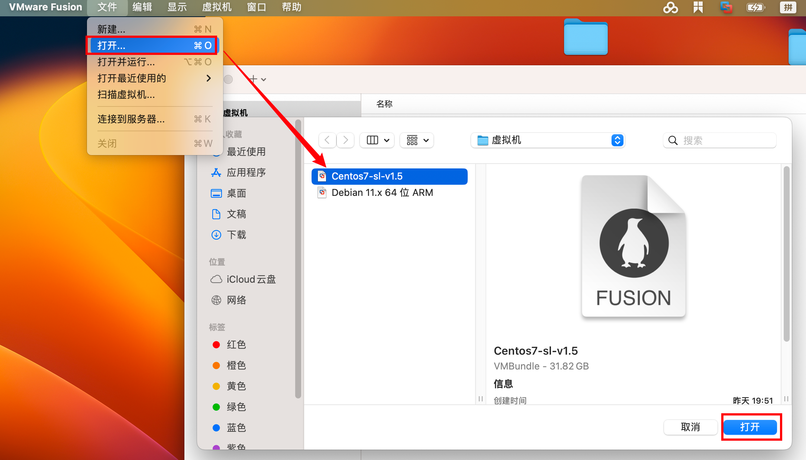

设置虚拟机网络为自定义网络：

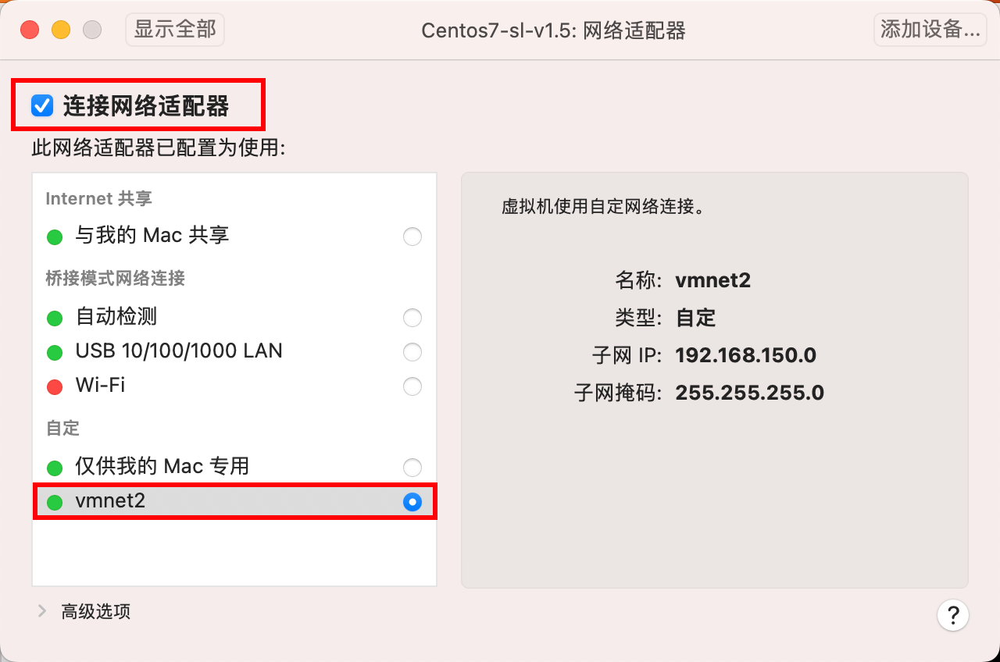

启动虚拟机，通过 `root/123321 `登陆到虚拟机：

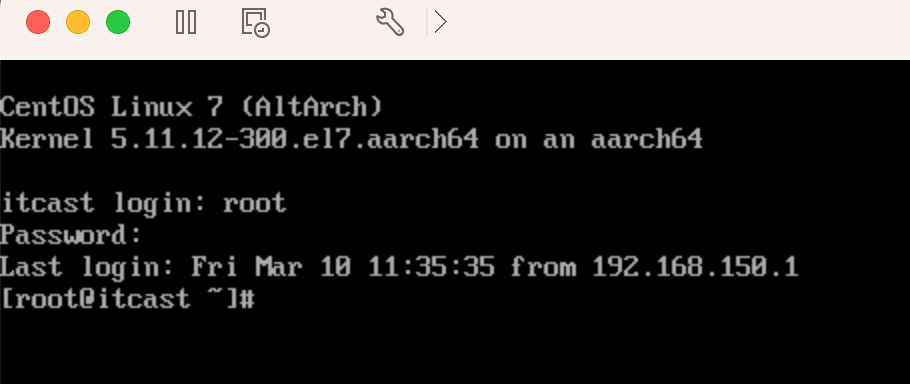

测试网络是否正常：

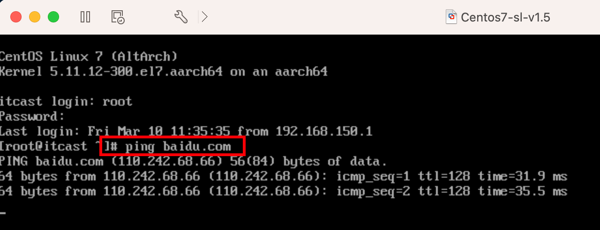

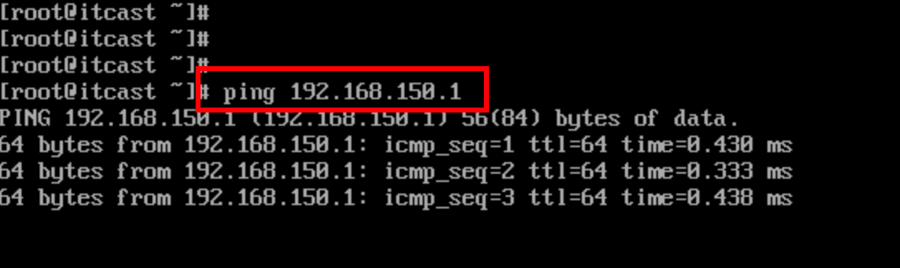

查看正在运行的服务：

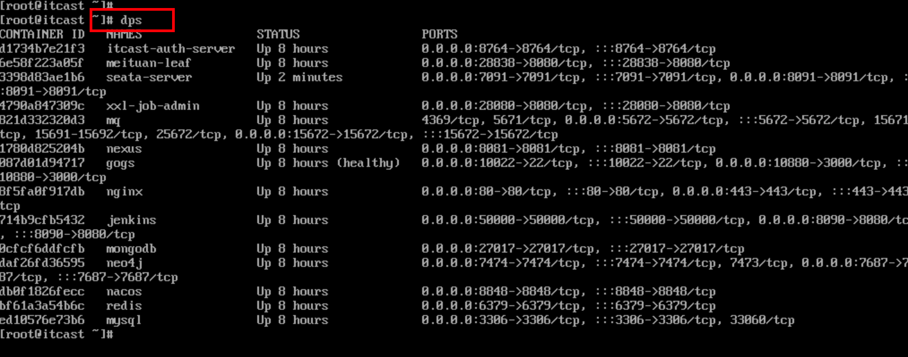

如果你的测试结果与上述一致，说明虚拟机导入成功。

## 4、方案三：双电脑方案
此方案需要借助于另外一台电脑安装虚拟机环境，自己的电脑做开发学习使用，其原理如图所示：


### 4.1、MacBook
按照官方文档进行设置网络共享：[https://support.apple.com/zh-cn/guide/mac-help/mchlp1540/mac](https://support.apple.com/zh-cn/guide/mac-help/mchlp1540/mac)

下面，修改配置文件，目的是修改为192.168.150.x网段：
在`/Library/Preferences/SystemConfiguration/com.apple.nat.plist`文件增加如下内容：
```xml
<key>SharingNetworkMask</key>
<string>255.255.255.0</string>
<key>SharingNetworkNumberEnd</key>
<string>192.168.150.254</string>
<key>SharingNetworkNumberStart</key>
<string>192.168.150.2</string>
```
修改示例：

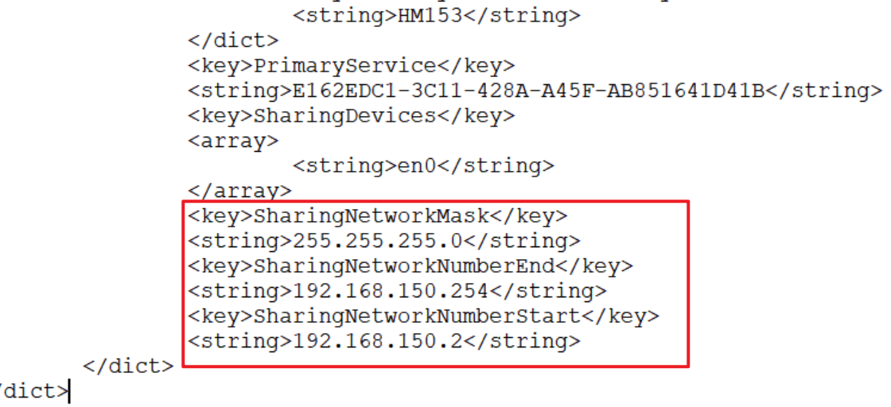

本地的ip地址为192.168.150.2，所以在本地跑微服务时注册的ip地址为：192.168.150.2。

 

