# day01-初始项目

## 1.学习背景

各位同学大家好，经过前面的学习我们已经掌握了《微服务架构》的核心技术栈。相信大家也体会到了微服务架构相对于项目一的单体架构要复杂很多，你的脑袋里也会有很多的问号：

- 微服务架构该如何拆分？
- 到了公司中我需要自己搭建微服务项目吗？
- 如果公司已经有了一个复杂的微服务项目，我该如何快速上手？
- 我该从哪里拉取代码？
- 开发的规范有哪些？
- 微服务开发的环境与传统项目有什么差异？
- ...

别担心，通过项目二的学习，上述问题你都能找到答案。

在大多数情况下，我们进入公司接手的都是一个成熟的，或者说开发中的微服务项目。所以如何快速熟悉项目、熟悉业务流程、融入开发团队就成了我们的必修课。

因此，项目二模拟的正是这样的开发场景：你刚刚进入了一家公司，进入了一个微服务项目组，参与一个微服务项目开发。我们会带着大家拉取代码、搭建开发环境、熟悉项目代码、熟悉业务流程、修改项目BUG、开发新功能、完成项目优化。通过整个项目的学习，真正掌握微服务架构技术栈，有能力解决微服务架构的各种问题。

## 2.天机学堂介绍

天机学堂是一个基于微服务架构的**生产级**在线教育项目，核心用户不是K12群体，而是面向成年人的**非学历职业技能培训**平台。相比之前的项目课程，其业务完整度、真实度、复杂度都非常的高，与企业真实项目非常接近。

通过天机学堂项目，你能学习到在线教育中核心的学习辅助系统、考试系统，电商类项目的促销优惠系统等等。更能学习到微服务开发中的各种热点问题，以及不同场景对应的解决方案。学完以后你会收获很多的“哇塞”。

### 2.1.行业背景

2021年7月，国务院颁布《关于进一步减轻义务教育阶段学生作业负担和校外培训负担的意见》，简称“双减”政策。在该政策影响下，多年来占据我国教育培训行业半壁江山的课外辅导培训遭到毁灭性打击。相对的，职业教育培训的市场规模持续增长：

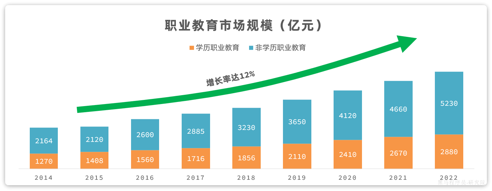

职业教育的市场规模持续增长，增长率保持在12%以上，总规模即将突破万亿，可见职业教育前景大好。职业教育培训分为有学历和非学历两大类：

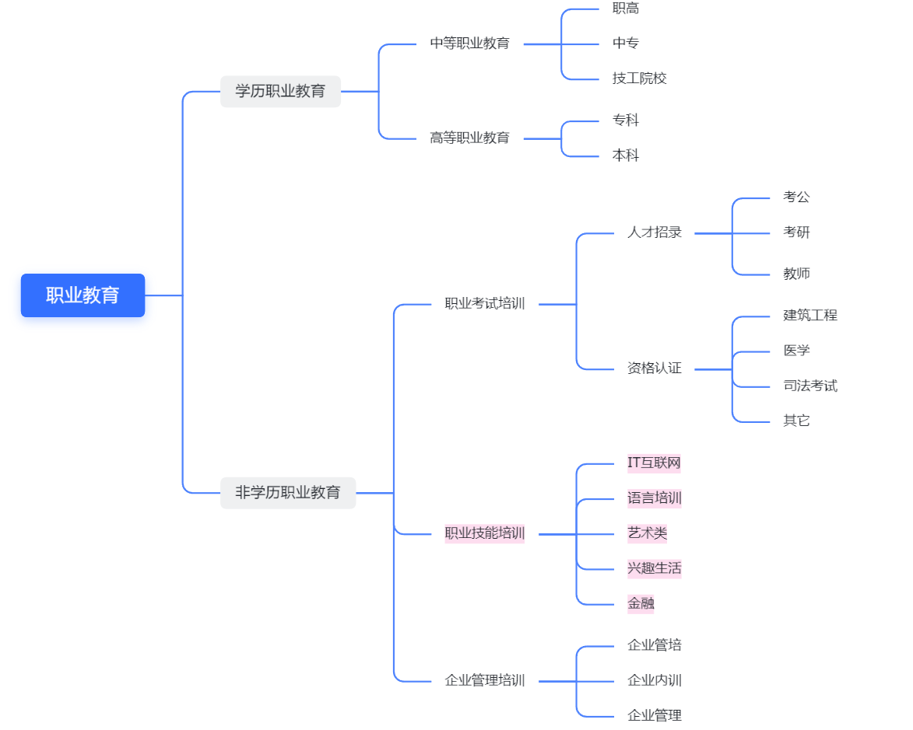

天机学堂的核心业务就是非学历的**职业技能培训**。

另外，职业教育有线上和线下之分，随着互联网发展，传统行业也逐渐网络化发展。再加上疫情的影响，很多职业技能培训企业都开始发展在线教育。相比于传统线下培训，在线教育有成本更低，学习时间碎片化，教育资源能充分利用。因此，在线教育市场规模不断增长，前景巨大。


### 2.2.行业图谱

职业教育产业图谱：

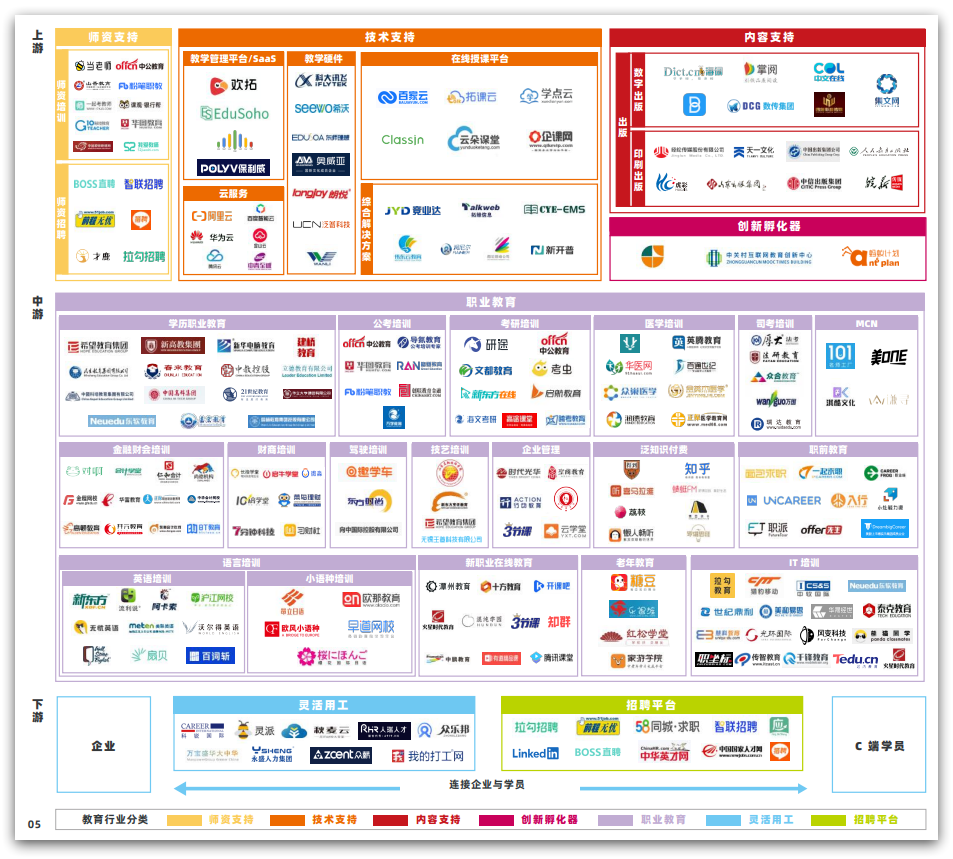

职业教育产业链分为三大部分：

上游：由配套服务商、平台服务商、师资服务商和内容服务商构成。

中游：由学历和非学历的职业教育服务商 构成， 主要提供教育和培训服务。

下游：是职业教育需求方， 其中现阶段学历职业教育主要面向 15-22 岁的 C 端学生， 非学历职业培训的受众则更为广泛，基本覆盖了中考毕业以后所有年龄阶层的学生，此外职业技能培训和企业培训公司还向 B 端企业提供服务  

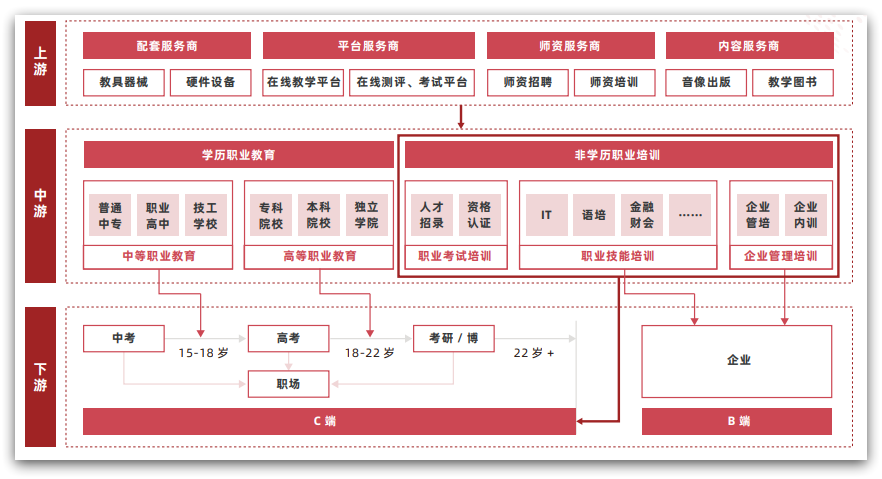

天机学堂正是属于中游的非学历职业技能培训的一家企业。

### 2.3.系统架构

天机学堂目前是一个B2C类型的教育网站，因此分为两个端：

- 后台管理端
- 用户端（PC网站）

整体架构如下：

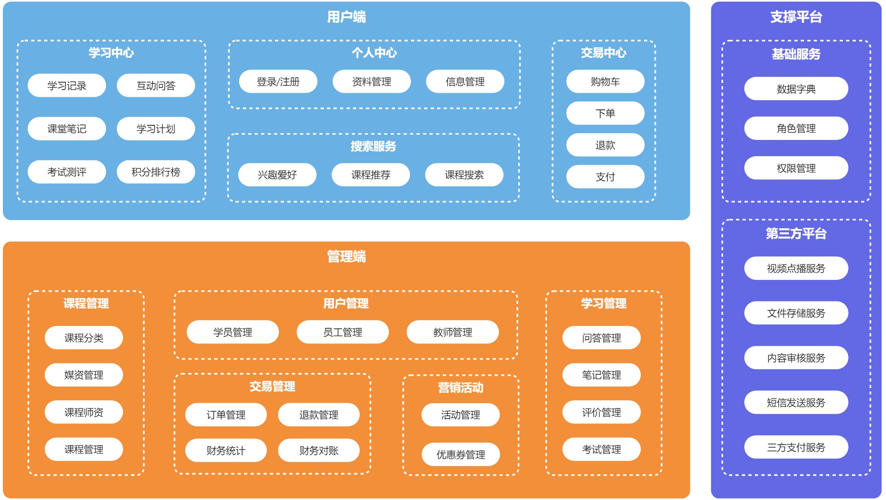

### 2.4.技术架构

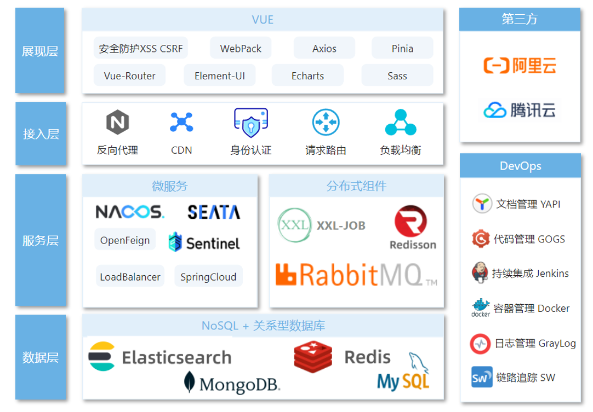

### 2.5.功能演示

天机学堂分为两部分：

- 学生端：其核心业务主体就是学员，所有业务围绕着学员的展开
- 管理端：其核心业务主体包括老师、管理员、其他员工，核心业务围绕着老师展开

具体可参考课前资料提供的功能演示视频。

#### 2.5.1.老师核心业务

例如，老师的核心业务流程有：

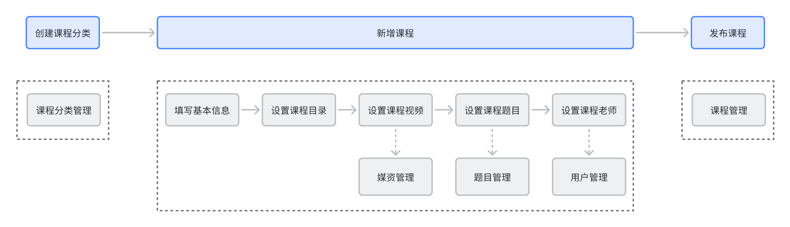

虽然流程并不复杂，但其中包含的业务繁多，例如：

- 课程分类管理：课程分类的增删改查
- 媒资管理：媒资的增删改查、媒资审核
- 题目管理：试题的增删改查、试题批阅、审核
- 课程管理：课程增删改查、课程上下架、课程审核、发布等等

#### 2.5.2.学员核心业务

学员的核心业务就是买课、学习，基本流程如下：

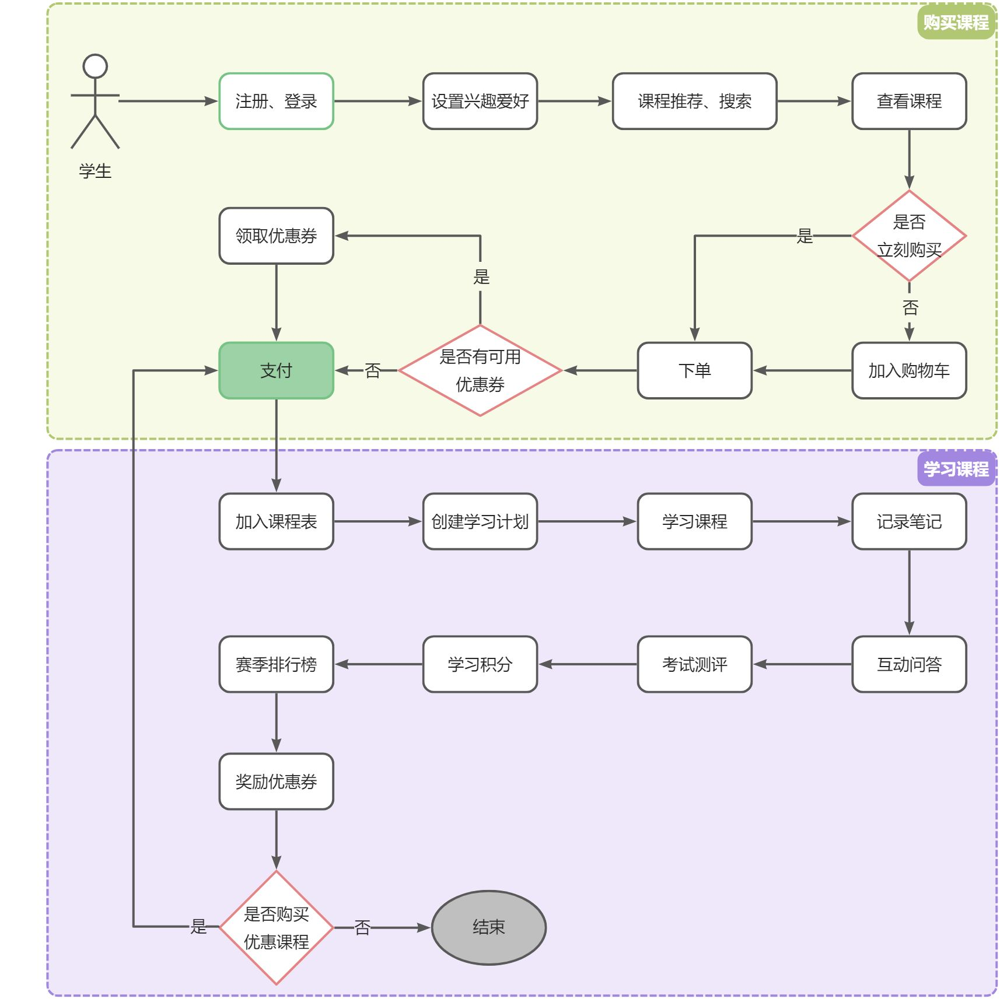

## 3.项目环境搭建

为了模拟真实的开发场景，我们设定的场景是这样的：天机学堂项目已经完成1.0.0版本60%的功能开发，能够实现项目的课程管理、课程购买等业务流程。现在需要加入课程学习、优惠促销、评价等功能。

相关微服务及1.0.0版本的完成状态如下：

|  微服务名称  | 功能描述 | 完成状态 |
| :----------: | :------: | :------: |
|  tj-parent   |  父工程  |  **√**   |
|  tj-common   | 通用工程 |  **√**   |
|  tj-message  | 消息中心 |  **√**   |
|  tj-gateway  |   网关   |  **√**   |
|   tj-auth    | 权限服务 |  **√**   |
|   tj-user    | 用户服务 |  **√**   |
|    tj-pay    | 支付服务 |  **√**   |
|  tj-course   | 课程服务 |  **√**   |
|   tj-exam    | 考试服务 |  **O**   |
|  tj-search   | 搜索服务 |  **√**   |
|   tj-trade   | 交易服务 |  **O**   |
| tj-learning  | 学习服务 |  **X**   |
| tj-promotion | 促销服务 |  **X**   |
|   tj-media   | 媒资服务 |  **√**   |
|   tj-data    | 数据服务 |  **O**   |
|  tj-remark   | 评价服务 |  **X**   |

### 3.1.导入虚拟机

为了模拟企业中的开发环境，我们利用虚拟机搭建了一套开发环境，其中部署了开发常用的组件：

- Git私服（gogs）：代码全部提交带了自己的Git私服，模拟企业开发的代码管理，大家也需要自行到私服拉取代码
- jenkins：持续集成，目前已经添加了所有部署脚本和Git钩子，代码推送会自动编译，可以根据需求手动部署
- nacos：服务注册中心、统一配置管理，大多数共享的配置都已经交给nacos处理
- seata：分布式事务管理
- xxl-job：分布式任务系统
- es：索引库
- redis：缓存库
- mysql：数据库
- kibana：es控制台

如图：

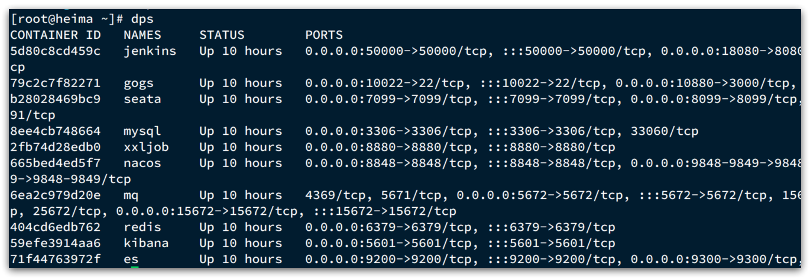

导入方式有两种：

- 方式一：下载完整虚拟机并导入，参考文档《虚拟机导入说明》
- 方式二：下载基础DockerCompose文件，及基础数据，利用脚本一键部署。参考文档《自定义部署》

注意：导入虚拟机后所有软件即可使用，无需重复安装，VMware一定要按照文档中设置IP，不要私自修改。一定要关闭windows防火墙。

### 3.2.配置本机hosts

为了模拟使用域名访问，我们需要在本地配置hosts：


```java
192.168.150.101 git.tianji.com
192.168.150.101 jenkins.tianji.com
192.168.150.101 mq.tianji.com
192.168.150.101 nacos.tianji.com
192.168.150.101 xxljob.tianji.com
192.168.150.101 es.tianji.com
192.168.150.101 api.tianji.com
192.168.150.101 www.tianji.com
192.168.150.101 manage.tianji.com
```


当我们访问上述域名时，请求实际是发送到了虚拟机，而虚拟机中的Nginx会对这些域名做反向代理，这样我们就能请求到对应的组件了：


在浏览器中输入对应域名，即可查看到对应服务，例如Git私服地址：http://git.tianji.com

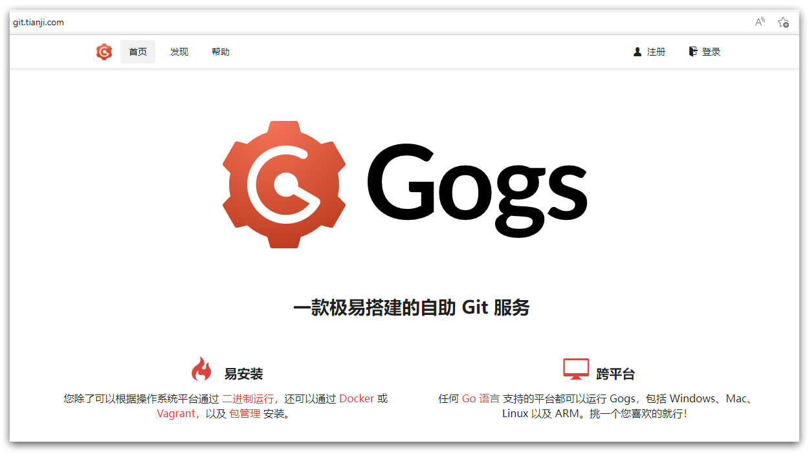

每个域名对应的服务列表如下：

|       名称       |        域名        |     账号     | 端口  |
| :--------------: | :----------------: | :----------: | :---: |
|     Git私服      |   git.tianji.com   | tjxt/123321  | 10880 |
| Jenkins持续集成  | jenkins.tianji.com |   root/123   | 18080 |
|     RabbitMQ     |   mq.tianji.com    | tjxt/123321  | 15672 |
|   Nacos控制台    |  nacos.tianji.com  | nacos/nacos  | 8848  |
|  xxl-job控制台   | xxljob.tianji.com  | admin/123456 | 8880  |
| ES的Kibana控制台 |   es.tianji.com    |      -       | 5601  |
|    微服务网关    |   api.tianji.com   |      -       | 10010 |
|    用户端入口    |   www.tianji.com   |      -       | 18081 |
|    管理端入口    | manage.tianji.com  |      -       | 18082 |

同样，我们访问用户端或者管理端页面时，也会被Nginx反向代理：

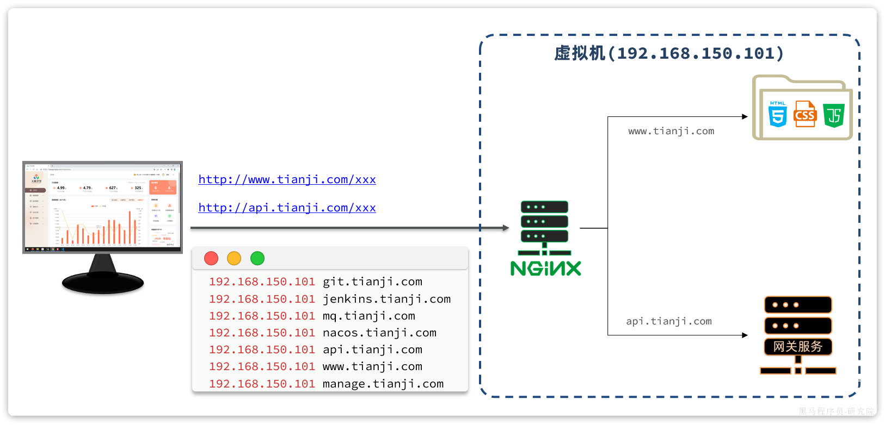

当我们访问www.tianji.com时，请求会被代理到虚拟机中的` /usr/local/src/tj-portal`目录中的静态资源

当页面访问api.tianji.com时，请求会被代理到虚拟机中的网关服务。

### 3.3.部署

在企业开发中，微服务项目非常庞大，往往有十几个，甚至数十个，数百个微服务。而这些微服务也会交给不同的开发组去完成开发。你可能只参与其中的某几个微服务开发，那么问题来了：

如果我的微服务需要访问其它微服务怎么办？

难道说我需要把所有的微服务都部署到自己的电脑吗？

很明显，这样做是不现实的。第一，不是所有的代码你都有访问的权限；第二，你的电脑可能无法运行这数十、数百的微服务。

因此，公司往往会给我们部署一套开发环境，在上面运行那些经过测试的可部署的微服务。而多数情况下我们是面向接口编程，功能自测完成后再与公司开发环境的其它微服务联调。

为了模拟真实环境，我们在虚拟机中已经提供了一套持续集成的开发环境，代码一旦自测完成，push到Git私服后即可自动编译部署。

而开发我们负责的微服务时，则需要在本地启动运行部分微服务。

#### 3.3.1.虚拟机部署

项目已经基于Jenkins实现了持续集成，每当我们push代码时，就会触发项目完成自动编译和打包。而需要运行某个微服务时，我们只需要经过两步：

- 第一步，访问jenkins控制台：http://jenkins.tianji.com (账号：root/123)
- 第二步，点击对应微服务后面的运行按钮

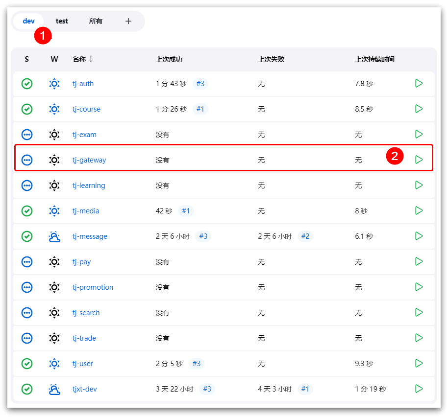

构建过程中，可以在页面左侧看到构建进度，如果没有说明构建已经结束了（你的机器速度太快了！）：

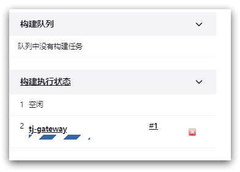

完成后，点击对应的微服务名称【例如tj-gateway】，即可进入构建任务的详情页面，在页面左侧可以看到构建历史：

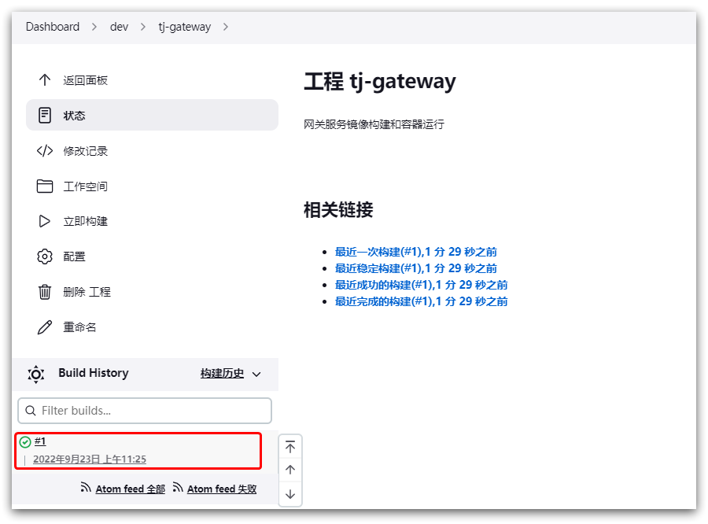

其中#1代表第一次构建，点击前面的√即可查看构建日志：

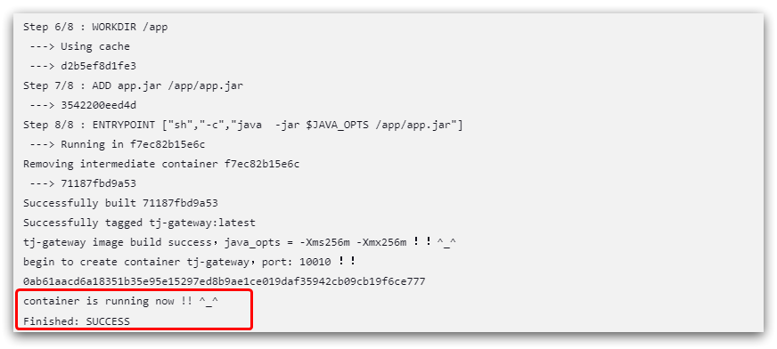

看到上面的日志，说明构建已经成功，容器也成功运行了。

我们需要分别启动几个开发完成的微服务：

- tj-user
- tj-auth
- tj-gateway
- tj-course
- tj-media
- tj-search
- tj-exam
- tj-data

此时访问Nacos控制台，可以看到微服务都成功注册了：

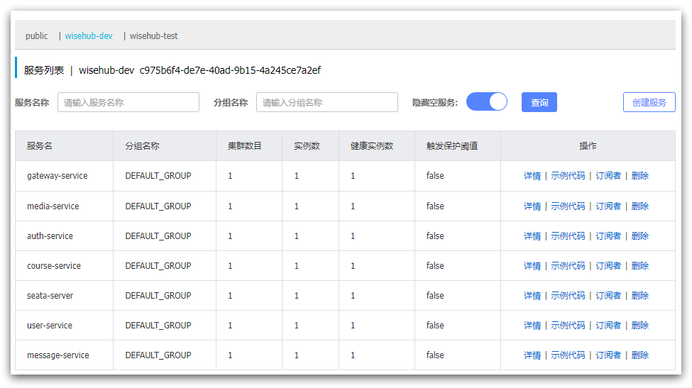

此时访问 http://www.tianji.com 即可看到用户端页面：


此时访问 http://manage.tianji.com 即可看到管理端页面：

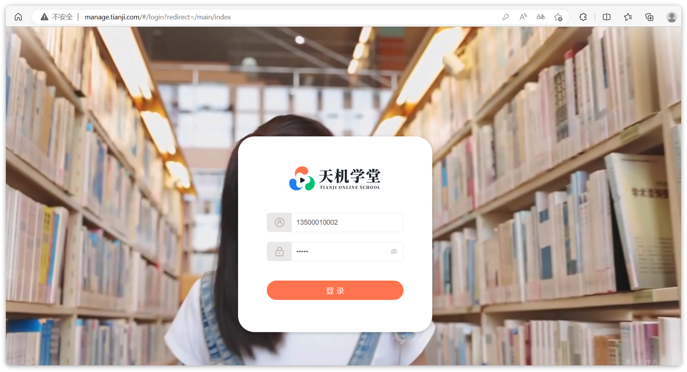

如果想要知道微服务具备哪些API接口，可以访问网关中的swagger页面，路径如下：

http://api.tianji.com/doc.html

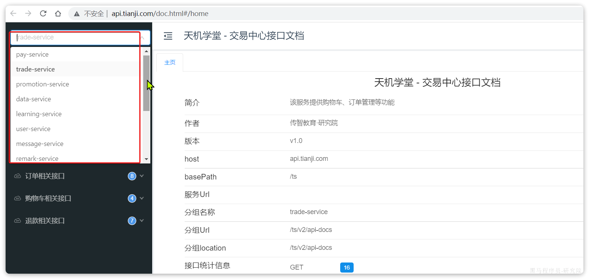

其中可以查看所有微服务的接口信息

#### 3.3.2.本地部署

对于需要开发功能的微服务，则需要在本地部署，不过首先我们要把代码拉取下来。

查看Git私服的代码：http://git.tianji.com/tjxt/tianji ：

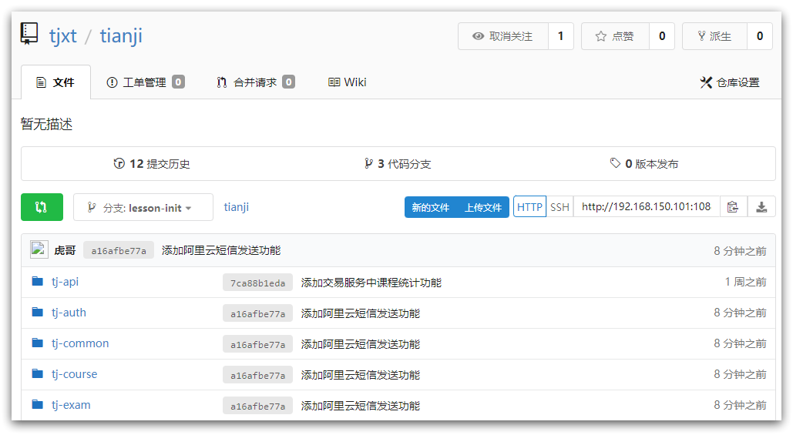

利用命令将代码克隆到你的IDEA工作空间中：

```bash
git clone http://192.168.150.101:10880/tjxt/tianji.git -b lesson-init
```

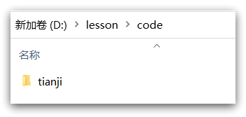

注意，开发时需要使用dev分支，因此我们需要创建新的分支：


```bash
# 进入项目目录
cd tianji
# 创建新的分支
git checkout -b dev
```


为了方便我们教学，目前所有微服务代码都聚合在了一个Project中，如图：

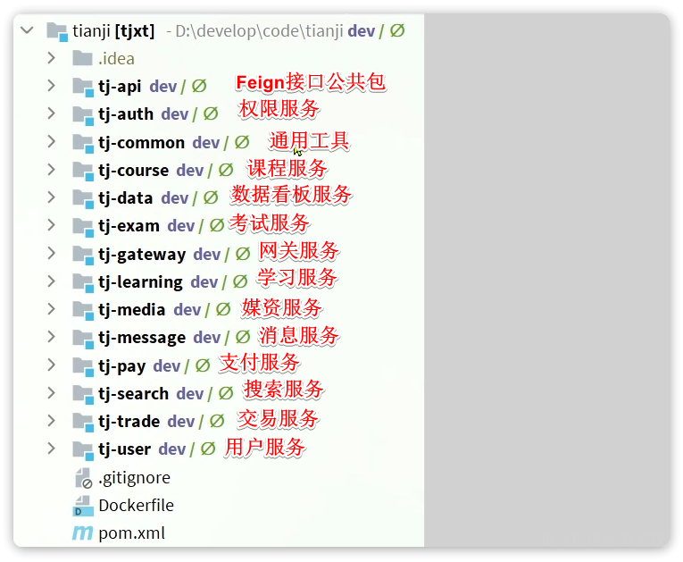

在默认情况下，微服务启用的是dev配置，如果要在本地运行，需要设置profile为local：

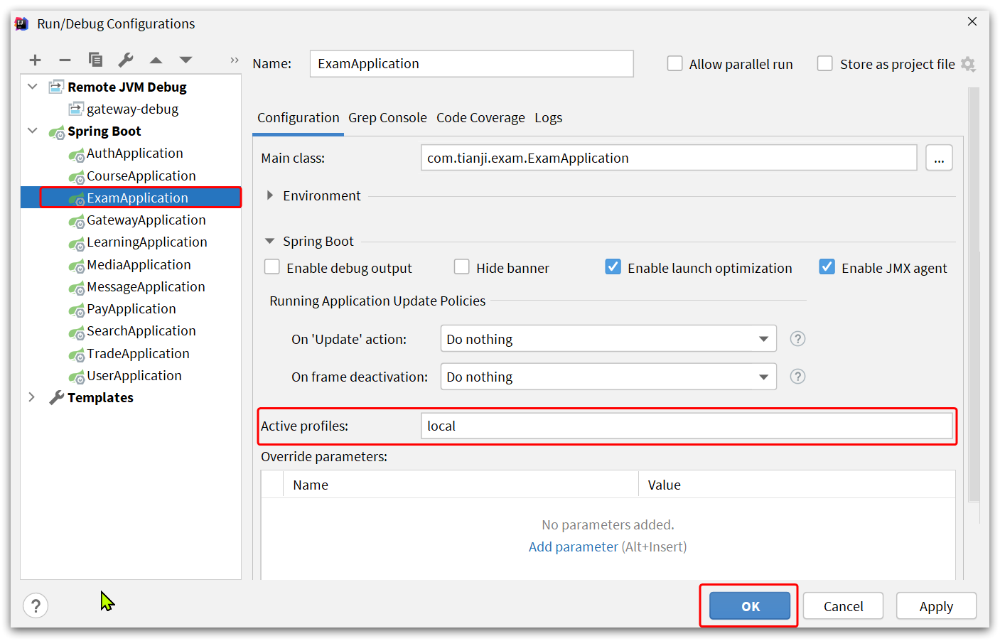

可以在本地启动`ExamApplication`，然后我们去Nacos控制台查看exam-service，可以看到有两个实例，分别是虚拟机IP和宿主机IP：

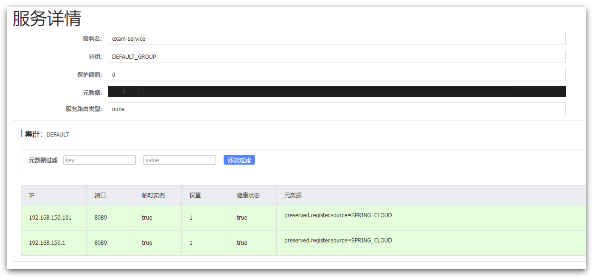

## 4.修复BUG

在刚刚进入项目组后，一般不会布置开发任务，而是先熟悉项目代码。为了帮助大家熟悉整个项目，我们预留了一个BUG，让大家在修复BUG的过程中熟悉项目代码。

一般修复BUG的过程是这样的：

- 熟悉项目
- 阅读源码
- 分析解决
- 测试部署

因此，解决BUG的过程，就是熟悉项目的过程。

### 4.1.熟悉项目

熟悉项目的第一步是熟悉项目的结构、用到的技术、编码的一些规范等。

#### 4.1.1.项目结构

我们先来看看项目结构，目前企业微服务开发项目结构有两种模式：

- 1）项目下的每一个微服务，都创建为一个独立的Project，有独立的Git仓库，尽可能降低耦合
- 2）项目创建一个Project，项目下的每一个微服务都是一个Module，方便管理

方案一更适合于大型项目，架构更为复杂，管理和维护成本都比较高；

方案二更适合中小型项目，架构更为简单，管理和维护成本都比较低；

天机学堂采用的正是第二种模式，结构如图：

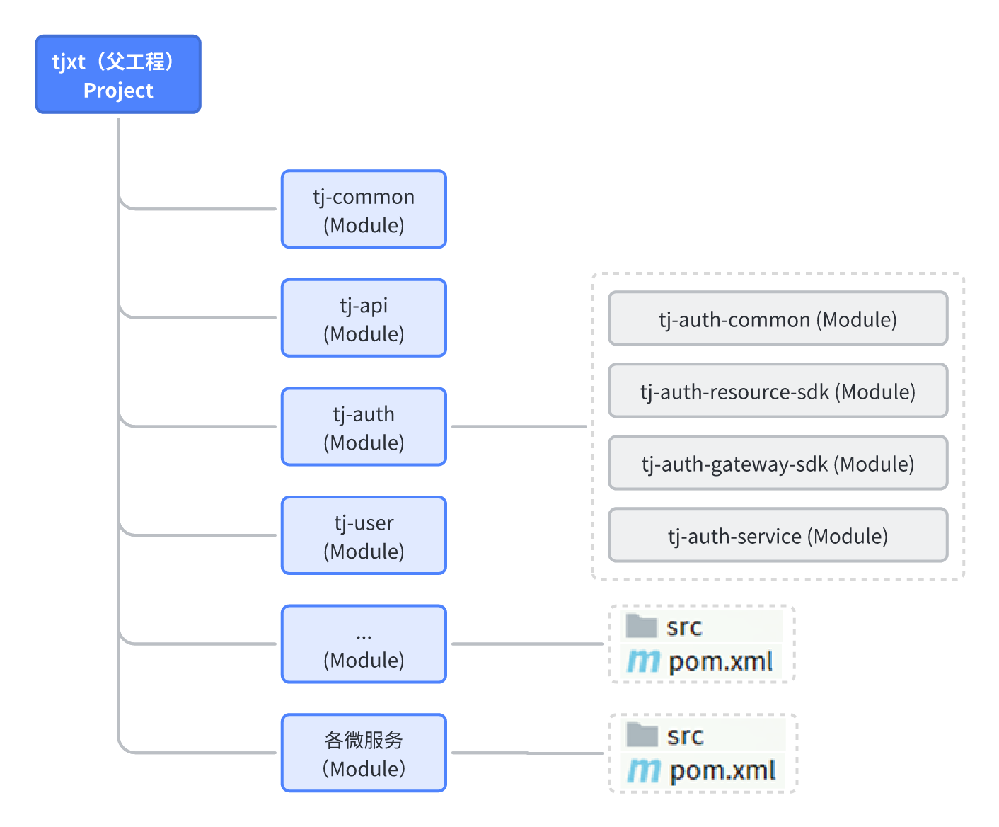

对应到我们项目中每个模块及功能如下：

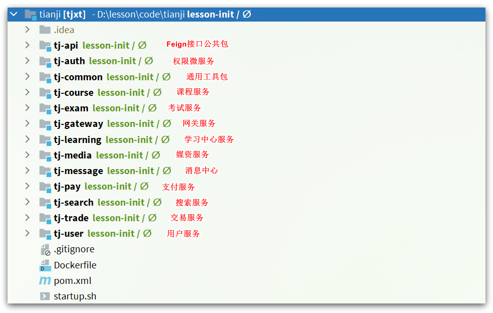

当我们要创建新的微服务时，也必须以`tjxt`为父工程，创建一个子`module`. 例如交易微服务：

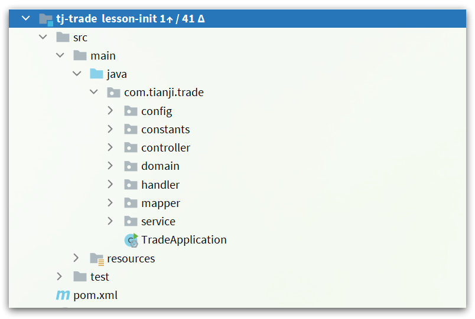

微服务`module`中如果有对外暴露的Feign接口，需要定义到`tj-api`模块中：

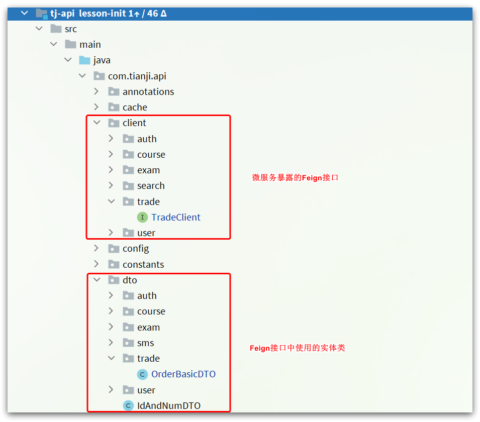

#### 4.1.2.实体类规范

在天机学堂项目中，所有实体类按照所处领域不同，划分为4种不同类型：

- DTO：数据传输对象，在客户端与服务端间传递数据，例如微服务之间的请求参数和返回值、前端提交的表单
- PO：持久层对象，与数据库表一一对应，作为查询数据库时的返回值
- VO：视图对象，返回给前端用于封装页面展示的数据
- QUERY：查询对象，一般是用于封装复杂查询条件

例如交易服务：

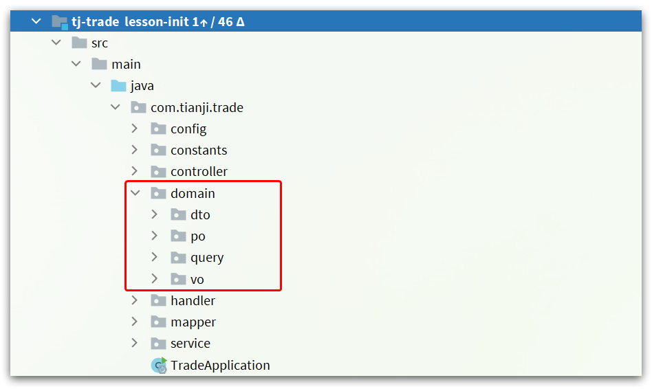

#### 4.1.3.依赖注入

Spring提供了依赖注入的功能，方便我们管理和使用各种Bean，常见的方式有：

- 字段注入（`@Autowired` 或 `@Resource`）
- 构造函数注入
- set方法注入

在以往代码中，我们经常利用Spring提供的`@Autowired`注解来实现依赖注入：

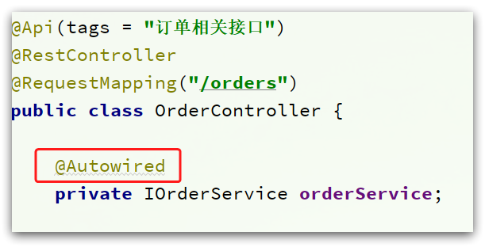

不过，这种模式是不被Spring推荐的，Spring推荐的是基于构造函数注入，像这样：

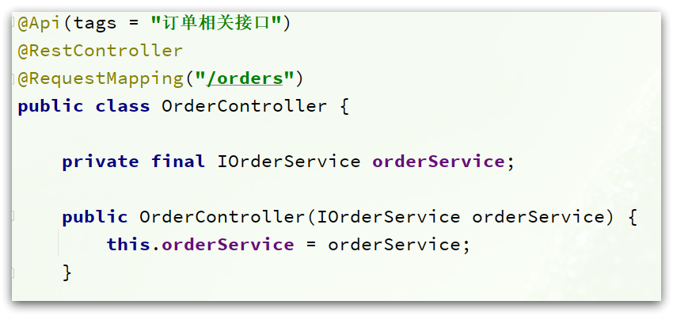

但是，如果需要注入的属性较多，构造函数就会非常臃肿，代码写起来也比较麻烦。

好在Lombok提供了一个注解`@RequiredArgsConstructor`，可以帮我们生成构造函数，简化代码：

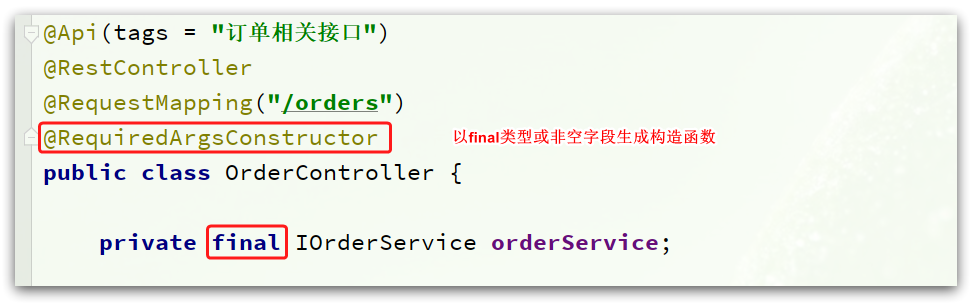

这样一来，不管需要注入的字段再多，我们也只需要一个注解搞定：

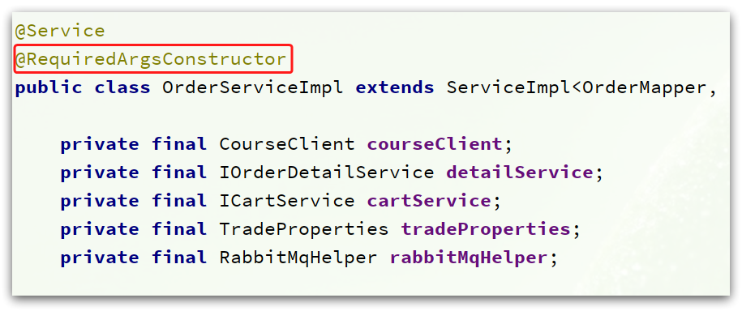

#### 4.1.4.异常处理

在项目运行过程中，或者业务代码流程中，可能会出现各种类型异常，为了加以区分，我们定义了一些自定义异常对应不同场景：

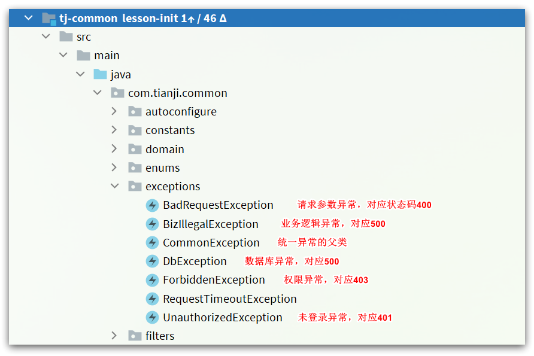

在开发业务的过程中，如果出现对应类型的问题，应该优先使用这些自定义异常。

当微服务抛出这些异常时，需要一个统一的异常处理类，同样在`tj-common`模块中定义了：

```java
@RestControllerAdvice
@Slf4j
public class CommonExceptionAdvice {

    @ExceptionHandler(DbException.class)
    public Object handleDbException(DbException e) {
        log.error("mysql数据库操作异常 -> ", e);
        return processResponse(e.getStatus(), e.getCode(), e.getMessage());
    }

    @ExceptionHandler(CommonException.class)
    public Object handleBadRequestException(CommonException e) {
        log.error("自定义异常 -> {} , 状态码：{}, 异常原因：{}  ",e.getClass().getName(), e.getStatus(), e.getMessage());
        log.debug("", e);
        return processResponse(e.getStatus(), e.getCode(), e.getMessage());
    }

    @ExceptionHandler(FeignException.class)
    public Object handleFeignException(FeignException e) {
        log.error("feign远程调用异常 -> ", e);
        return processResponse(e.status(), e.status(), e.contentUTF8());
    }

    @ExceptionHandler(MethodArgumentNotValidException.class)
    public Object handleMethodArgumentNotValidException(MethodArgumentNotValidException e) {
        String msg = e.getBindingResult().getAllErrors()
                .stream().map(ObjectError::getDefaultMessage)
                .collect(Collectors.joining("|"));
        log.error("请求参数校验异常 -> {}", msg);
        log.debug("", e);
        return processResponse(400, 400, msg);
    }
    @ExceptionHandler(BindException.class)
    public Object handleBindException(BindException e) {
        log.error("请求参数绑定异常 ->BindException， {}", e.getMessage());
        log.debug("", e);
        return processResponse(400, 400, "请求参数格式错误");
    }

    @ExceptionHandler(NestedServletException.class)
    public Object handleNestedServletException(NestedServletException e) {
        log.error("参数异常 -> NestedServletException，{}", e.getMessage());
        log.debug("", e);
        return processResponse(400, 400, "请求参数异常");
    }

    @ExceptionHandler(ConstraintViolationException.class)
    public Object handViolationException(ConstraintViolationException e) {
        log.error("请求参数异常 -> ConstraintViolationException, {}", e.getMessage());

        return processResponse( HttpStatus.OK.value(), HttpStatus.BAD_REQUEST.value(),
                e.getConstraintViolations().stream().map(ConstraintViolation::getMessage).distinct().collect(Collectors.joining("|"))
                );
    }

    @ExceptionHandler(Exception.class)
    public Object handleRuntimeException(Exception e) {
        log.error("其他异常 uri : {} -> ", WebUtils.getRequest().getRequestURI(), e);
        return processResponse(500, 500, "服务器内部异常");
    }

    private Object processResponse(int status, int code, String msg){
        // 1.标记响应异常已处理（避免重复处理）
        WebUtils.setResponseHeader(Constant.BODY_PROCESSED_MARK_HEADER, "true");
        // 2.如果是网关请求，http状态码修改为200返回，前端基于业务状态码code来判断状态
        // 如果是微服务请求，http状态码基于异常原样返回，微服务自己做fallback处理
        return WebUtils.isGatewayRequest() ?
                R.error(code, msg).requestId(MDC.get(Constant.REQUEST_ID_HEADER))
                : ResponseEntity.status(status).body(msg);
    }
}
```

#### 4.1.5.配置文件

SpringBoot的配置文件支持多环境配置，在天机学堂中也基于不同环境有不同配置文件：

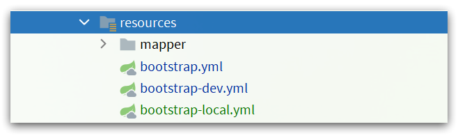

说明：

|      **文件**       |                        **说明**                        |
| :-----------------: | :----------------------------------------------------: |
|    bootstrap.yml    | 通用配置属性，包含服务名、端口、日志等等各环境通用信息 |
|  bootstrap-dev.yml  |         线上开发环境配置属性，虚拟机中部署使用         |
| bootstrap-local.yml |     本地开发环境配置属性，本地开发、测试、部署使用     |

项目中的很多共性的配置都放到了Nacos配置中心管理：

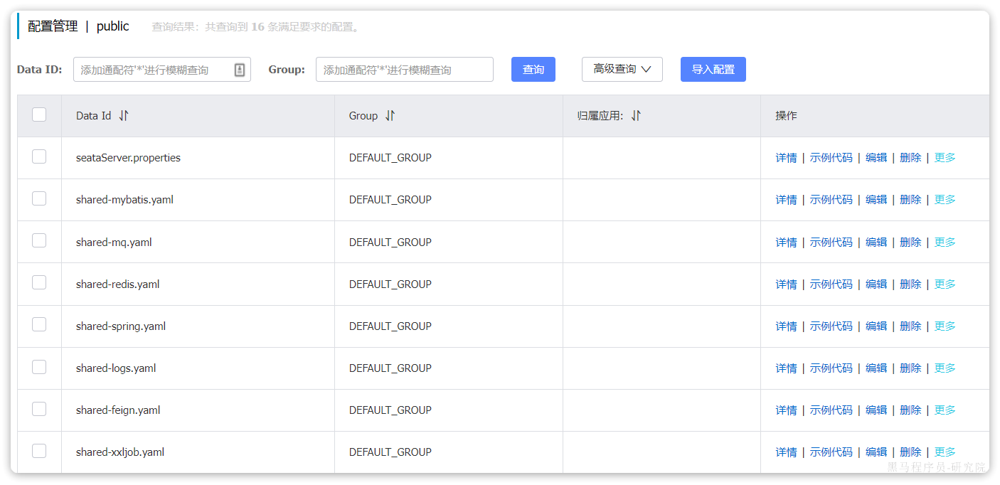

例如`mybatis`、`mq`、`redis`等，都有对应的`shared-xxx.yaml`共享配置文件。在微服务中如果用到了相关技术，无需重复配置，只要引用上述共享配置即可：

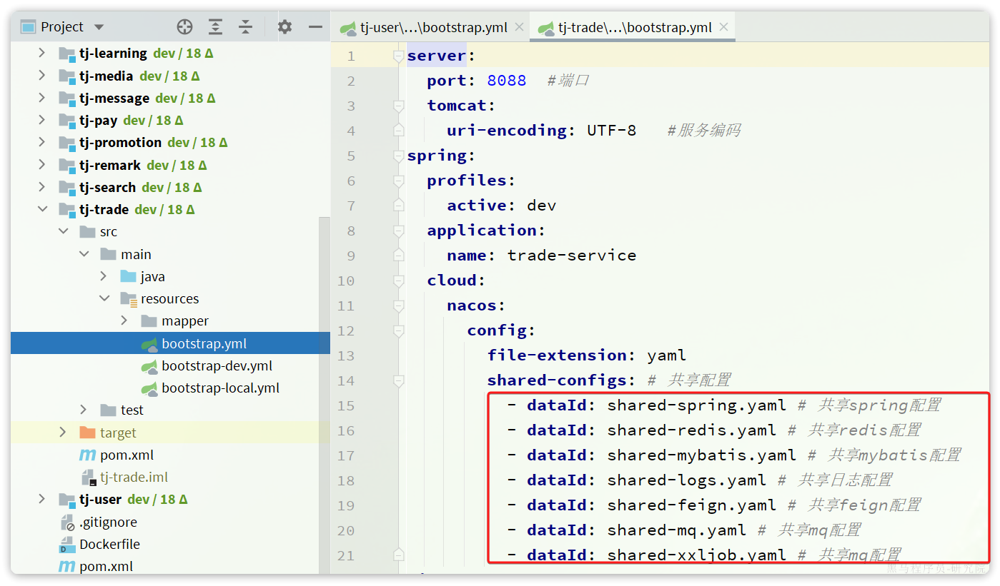

##### 4.1.5.1.bootstrap.yml

我们来看看`bootstrap.yml`文件的基本内容：

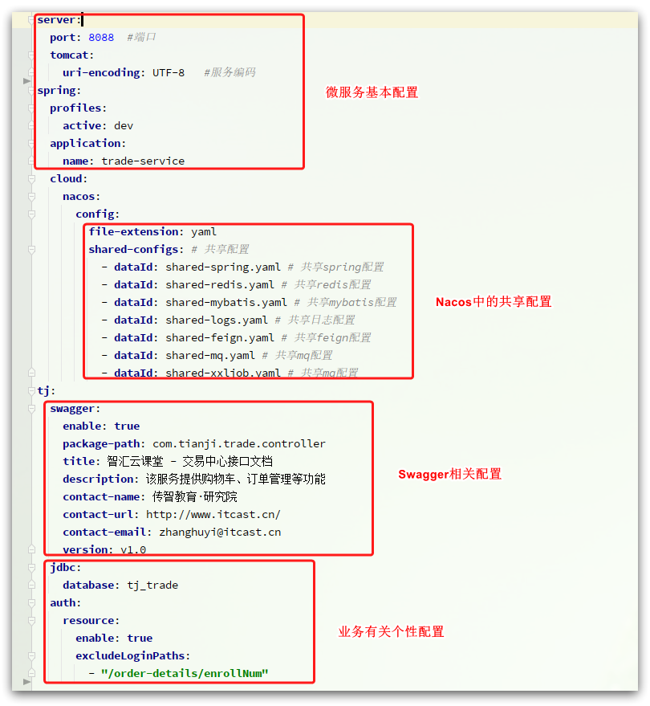

接下来，我们就分别看看每一个共享的配置文件内容。

##### 4.1.5.2.shared-spring.yml

```yaml
spring:
  jackson:
    default-property-inclusion: non_null # 忽略json处理时的空值字段
  main:
    allow-bean-definition-overriding: true # 允许同名Bean重复定义
  mvc:
    pathmatch:
      # 解决异常：swagger Failed to start bean 'documentationPluginsBootstrapper'; nested exception is java.lang.NullPointerException
      # 因为Springfox使用的路径匹配是基于AntPathMatcher的，而Spring Boot 2.6.X使用的是PathPatternMatcher
      matching-strategy: ant_path_matcher
```

##### 4.1.5.3.shared-mybatis.yaml

```yaml
mybatis-plus:
  configuration: # 默认的枚举处理器
    default-enum-type-handler: com.baomidou.mybatisplus.core.handlers.MybatisEnumTypeHandler
  global-config:
    field-strategy: 0 
    db-config:
      logic-delete-field: deleted # mybatis逻辑删除字段
      id-type: assign_id # 默认的id策略是雪花算法id
spring:
  datasource:
    driver-class-name: com.mysql.cj.jdbc.Driver # 数据库驱动
    url: jdbc:mysql://${tj.jdbc.host:192.168.150.101}:${tj.jdbc.port:3306}/${tj.jdbc.database}?useUnicode=true&characterEncoding=UTF-8&autoReconnect=true&serverTimezone=Asia/Shanghai
    username: ${tj.jdbc.username:root}
    password: ${tj.jdbc.password:123}
```

注意到这里把mybatis的datasource都配置了，不过由于jdbc连接时的数据库ip、端口，数据库名、用户名、密码是不确定的，这里做了参数映射：

|    **参数名**    |      **描述**      |           **默认值**            |
| :--------------: | :----------------: | :-----------------------------: |
|   tj.jdbc.host   |       主机名       | 192.168.150.101，也就是虚拟机ip |
|   tj.jdbc.port   |     数据库端口     |              3306               |
| tj.jdbc.database | 数据库database名称 |               无                |
| tj.jdbc.username |    数据库用户名    |              root               |
| tj.jdbc.password |     数据库密码     |               123               |

除了`tj.jdbc.database`外，其它参数都有默认值，在没有配置的情况下会按照默认值来配置，也可以按照参数名来自定义这些参数值。其中`tj.jdbc.database`是必须自定义的值，例如在交易服务中：

```yaml
tj:
  jdbc:
    database: tj_trade
```

##### 4.1.5.4.shared-mq.yaml

```yaml
spring:
  rabbitmq:
    host: ${tj.mq.host:192.168.150.101} # mq的IP
    port: ${tj.mq.port:5672}
    virtual-host: ${tj.mq.vhost:/tjxt}
    username: ${tj.mq.username:tjxt}
    password: ${tj.mq.password:123321}
    listener:
      simple:
        retry:
          enabled: ${tj.mq.listener.retry.enable:true} # 开启消费者失败重试
          initial-interval: ${tj.mq.listener.retry.interval:1000ms} # 初始的失败等待时长为1秒
          multiplier: ${tj.mq.listener.retry.multiplier:1} # 失败的等待时长倍数，下次等待时长 = multiplier * last-interval
          max-attempts: ${tj.mq.listener.retry.max-attempts:3} # 最大重试次数
          stateless: ${tj.mq.listener.retry.stateless:true} # true无状态；false有状态。如果业务中包含事务，这里改为false
```

这里配置了mq的基本配置，例如地址、端口等，默认就是tjxt的地址，不需要修改。另外还配置类消费者的失败重试机制，如有需要可以按需修改。

##### 4.1.5.5.shared-redis.yaml

```yaml
spring:
  redis:
    host: ${tj.redis.host:192.168.150.101}
    password: ${tj.redis.password:123321}
    lettuce:
      pool:
        max-active: ${tj.redis.pool.max-active:8}
        max-idle: ${tj.redis.pool.max-idle:8}
        min-idle: ${tj.redis.pool.min-idle:1}
        max-wait: ${tj.redis.pool.max-wait:300}
```

注意配置了Redis的基本地址和连接池配置，省去了我们大部分的工作

##### 4.1.5.6.shared-feign.yaml

```yaml
feign:
  client:
    config:
      default: # default全局的配置
        loggerLevel: BASIC # 日志级别，BASIC就是基本的请求和响应信息
  httpclient:
    enabled: true # 开启feign对HttpClient的支持
    max-connections: 200 # 最大的连接数
    max-connections-per-route: 50 # 每个路径的最大连接数
```

这里配置了默认的Feign日志级别以及连接池配置，一般不需要修改。

##### 4.1.5.7.shared-xxljob.yaml

```yaml
tj:
  xxl-job:
    access-token: tianji
    admin:
      address: http://192.168.150.101:8880/xxl-job-admin
    executor:
      appname: ${spring.application.name}
      log-retention-days: 10
      logPath: job/${spring.application.name}
```

这里配置了xxl-job组件的地址等信息，一般不需要修改。

### 4.2.阅读源码

阅读源码也不是闷头乱找，而是有一定的技巧。一般阅读源码的流程如下：

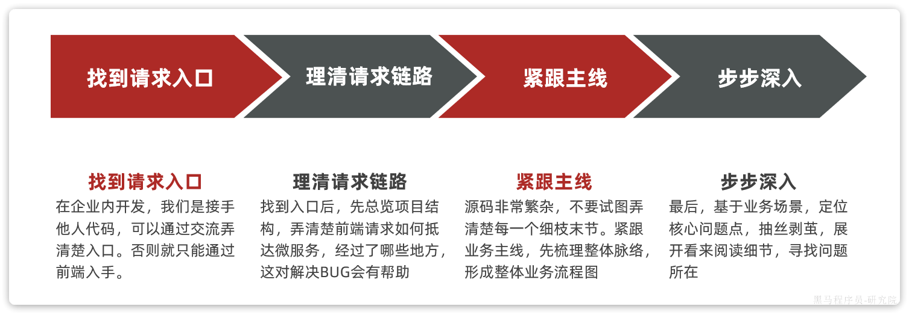

#### 4.2.1.BUG重现

首先，我们来看还原一下BUG现场。

我们用杰克用户登录（jack/123），删除一个订单，发现删除成功：

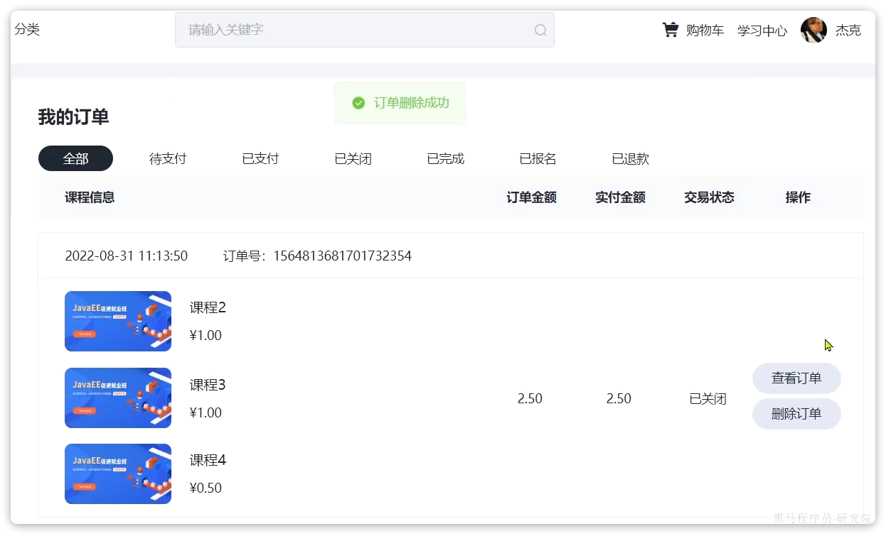

我们切换到萝丝用户登录（rose/123456），再次删除一个订单：

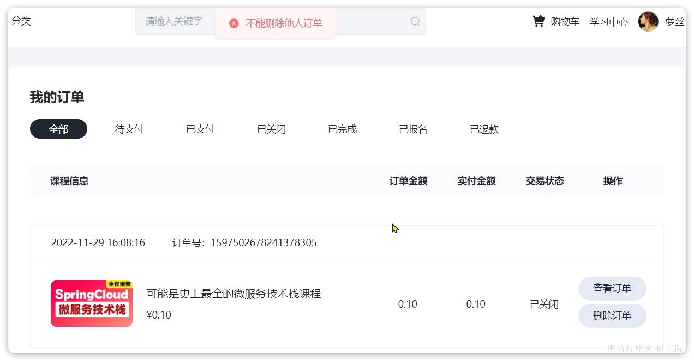

发现删除失败，这是什么情况？？

#### 4.2.2.理清请求链路

如果是我们自己写的代码，肯定很容易找到业务入口、整个业务线路。但现在我们是接手他人项目，所以只能通过其它途径来梳理业务：

- 1）如果开发业务的同事还在，直接与开发该业务的同事交流
- 2）如果开发者已离职，可以查看相关接口文档
- 3）如果没有文档，也可以查看前端请求，顺藤摸瓜

此处由于我们没有人可以交流，只能通过查看前端请求来分析了。经过查看，页面删除订单的请求如下：

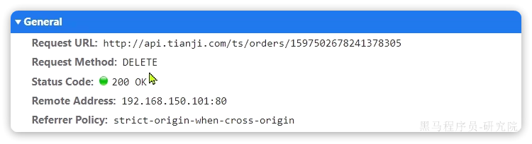

按照之前我们的环境部署方案，api.tianji.com这个域名会被解析到`192.168.150.101`这个地址，然后被Nginx反向代理到网关微服务。

而网关则会根据请求路径和路由规则，把请求再路由到具体微服务。这里请求路径以`/ts`开头，对应的微服务是`trade-service`，也就是交易微服务。

这样，整个请求链路就比较清楚了：

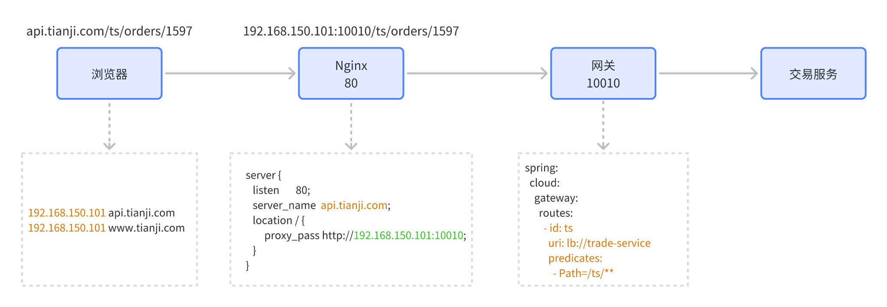

找到了具体的微服务，接下来，我们就进入微服务，查看对应源码，找出问题即可。

请求到达交易服务后的路径是` ``/orders/{id}`，对应的`controller`是：

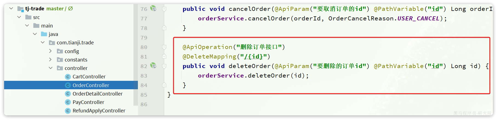

跟入service代码：

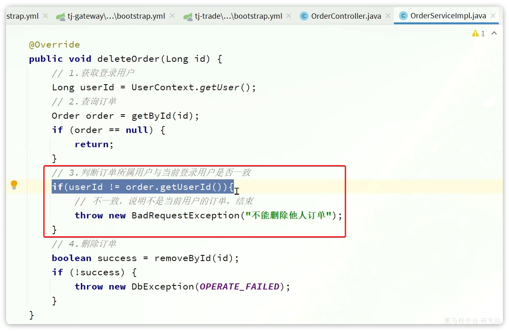

这样就找到了BUG发生的代码块了，现在只需要通过DEBUG调试来发现问题产生的原因就可以了。

### 4.3.远程调试

由于交易服务属于开发环境已经部署的服务，我们无法在本地调试，这在今后的开发中会经常碰到。遇到这样的情况我们就需要利用IDEA提供的远程调试功能。

#### 4.3.1.本地配置

首先，我们需要对本地启动项做一些配置：

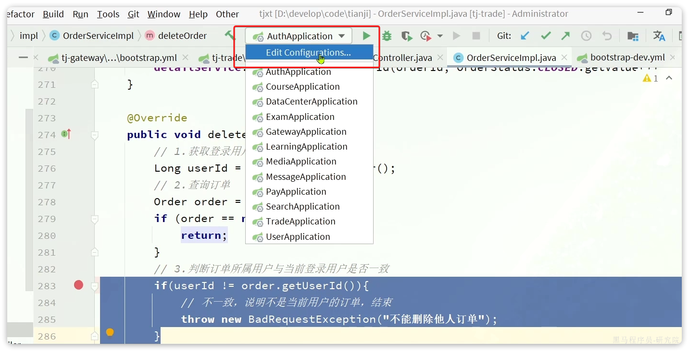

然后添加一个新的启动项：

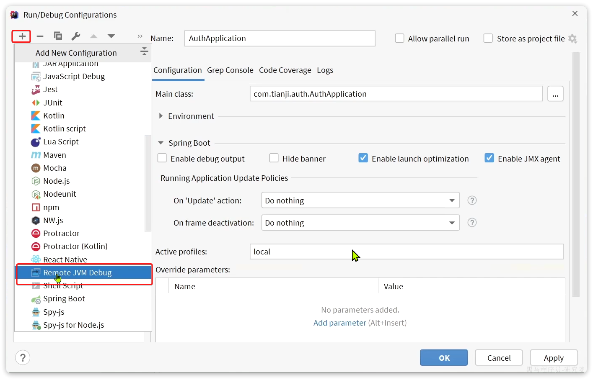

在新建的`Configuration`中填写信息：

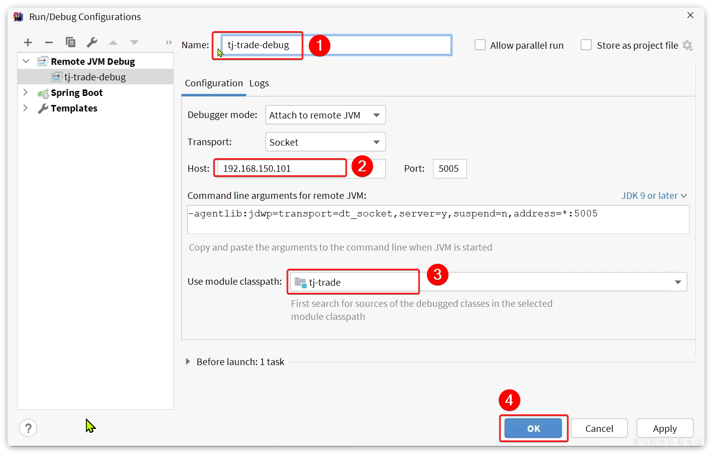

 此时，就可以在启动项中看到我们配置的远程调试项目了：

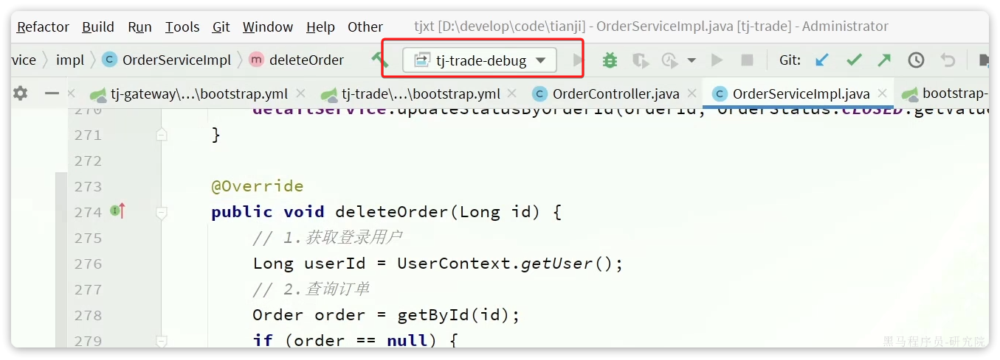

#### 4.3.2.远程调试的部署脚本

仅仅本地配置还不够，我们还需要在虚拟机中部署时，添加一段配置到部署脚本中，这段配置IDEA已经提供给我们了：

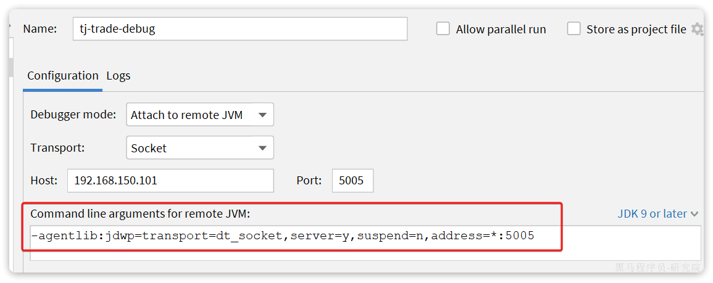

我们需要在启动时加上这段参数，像这样：

```shell
java -jar -agentlib:jdwp=transport=dt_socket,server=y,suspend=n,address=*:5005 xx.jar
```

不过我们的项目都是基于Jenkins来部署的，因此需要修改Jenkins部署脚本。部署脚本我也已经帮大家配置好了，我们直接运行即可：

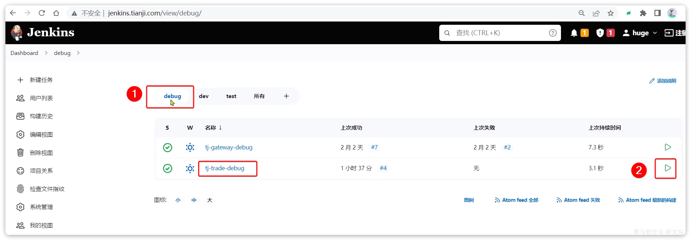

部署完成后，可以看到`tj-trade`多暴露了一个5005端口，就是远程调试的端口了：

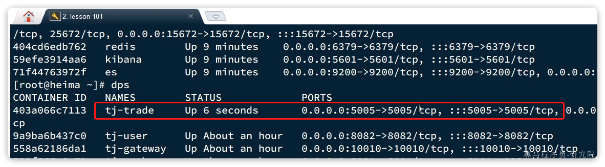

#### 4.3.3.开始调试

现在，我们就可以在需要的地方打上断点，然后DEBUG运行了：

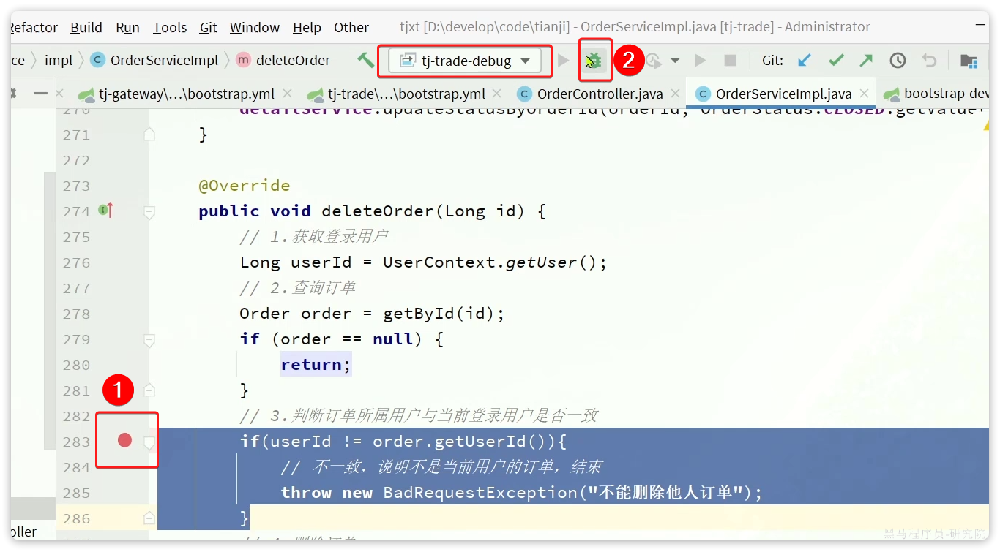

 

访问页面请求，就可以进入DEBUG断点了。

经过断点，可以发现断点所属用户判断出现问题的原因了：

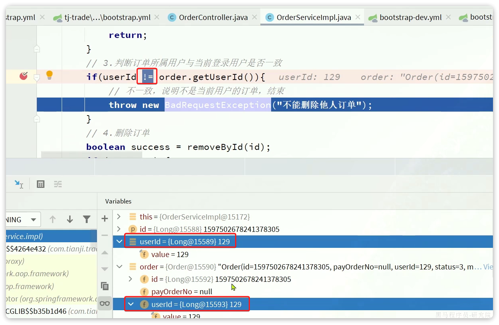

我们在判断用户id时使用了`!=`来判断，由于id是Long 类型，因此判断的是id对应的地址而不是值，所以萝丝用户的userId虽然都是129，但地址不同，判断自然不成立。

但问题来了，为什么杰克用户就可以删除成功呢？

再次以杰克发起请求，进入断点：

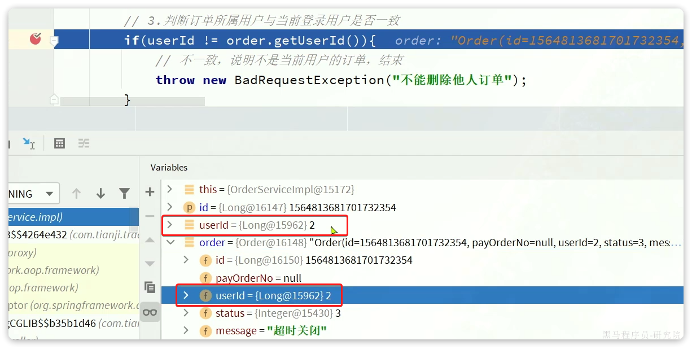

可以发现杰克的id是2，两个userId的地址是一样的！！

为什么userId为2的时候判断相等可以成立，而userId是129的时候判断相等不成立呢？

这是因为userId是Long类型包装类。包装类为了提高性能，减少内存占用，采用了享元模式，提前将-128~127之间的Long包装类提前创建出来，共享使用。

因此只要大小范围在者之间的数字，只要值相同，使用的都是享元模式中提供的同一个对象。杰克的id是2，恰好在范围内；而萝丝的id是129，刚好超过了这个范围。这就导致了杰克可以删除自己订单，而萝丝无法删除的现象。

这就说明，我们此处判断userId是否相等的方式是错误的，不能基于`!=`来判断，而是应该比较值，使用equals。

### 4.4.修复BUG

既然找到了BUG产生的原因，接下来就可以来修复BUG了。

#### 4.4.1.分支管理

一般我们不建议大家直接在Dev分支直接修改代码。在企业中都有一套分支管理机制，称为GitFlow，大概如图所示：


说明：

- **Master**：主分支，用于正式发布的分支。不可直接基于该分支提交。只有经过严格审核测试后的Develop或Hotfix分支可以合并到master
- **Develop**：开发分支，从Master创建得来。功能开发的基础分支。
- **Feature**：功能分支，从Develop分支创建得来。开发测试完成后会合并到Develop分支。
- **Release**：预发布分支，当Develop上积累了一定的功能特性后，从Develop分支创建一个Release分支，做一些发布前的准备工作，不可开发功能。最终合并到Master分支和Develop分支。
- **Hotfix**：热修复分支，当Master出现紧急BUG时，基于Master临时创建的分支，修复完成后合并到Develop和Master分支。

在咱们项目中，master分支用来给大家提供完整版本代码了，而lesson-init分支作为初始化分支。因此一般不使用master分支，而是把lesson-init当做master分支来用。开发用的dev分支就等于GitFlow中的Develop分支。

因此，这里建议大家在dev分支基础上创建一个Hotfix分支，用以修改BUG，可以通过命令来创建该分支：

```shell
git checkout -b hotfix-delete-order-error
```

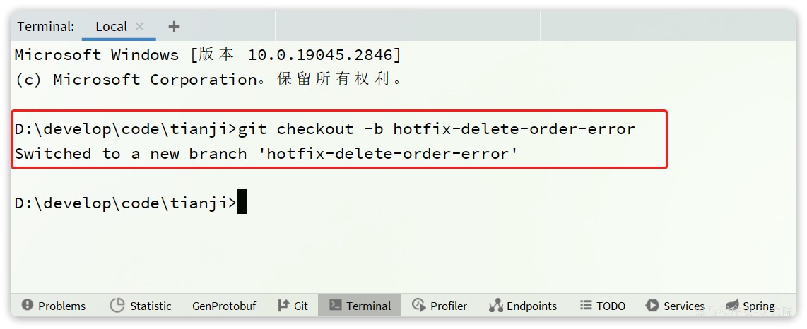

#### 4.4.2.修复BUG

接下来，就可以修复BUG了，其实非常简单，不要使用`!=`判断，而是改用`equals`即可：

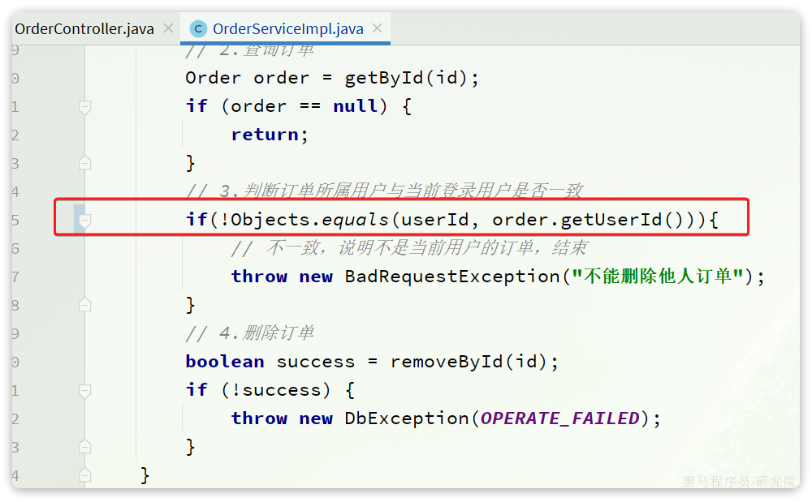

接下来，提交代码：

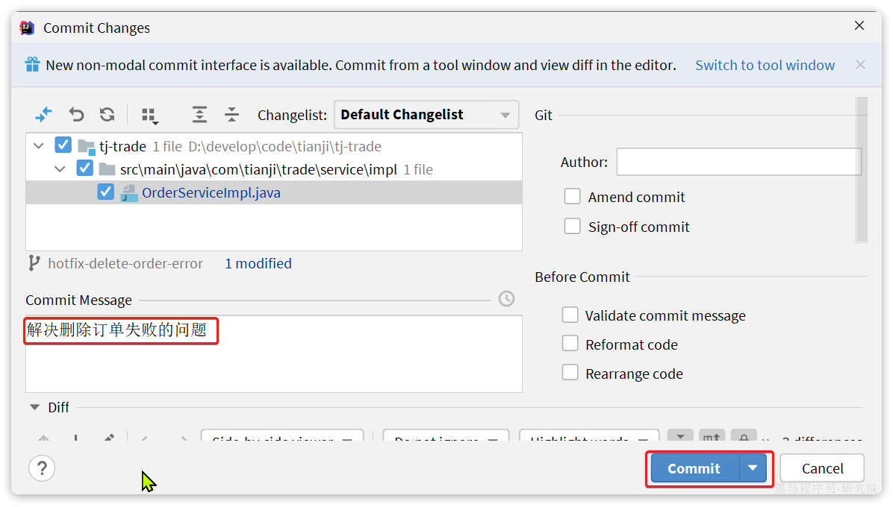

然后切换会Dev分支，并将hotfix-delete-order-error分支合并到dev分支，然后删除：

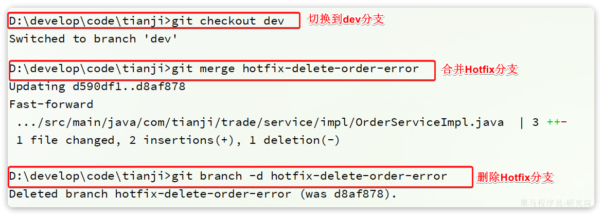

### 4.5.测试部署

一般的测试步骤是这样的：

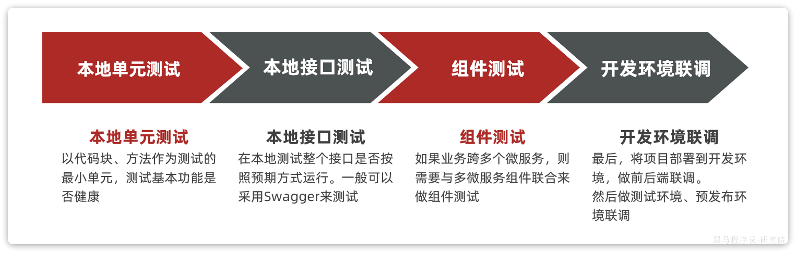

由于我们这里的修改比较简单，这里就不做单元测试了。

#### 4.5.1.接口测试

我们首先基于swagger做本地接口测试，在本地启动tj-trade项目，然后访问swagger页面：

http://localhost:8088/doc.html ，找到删除订单接口：

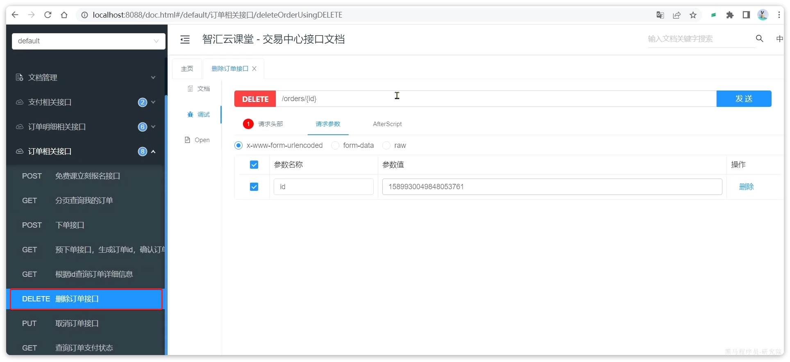

由于删除订单时需要对登录用户做校验，因此需要先设置用户id的全局参数：

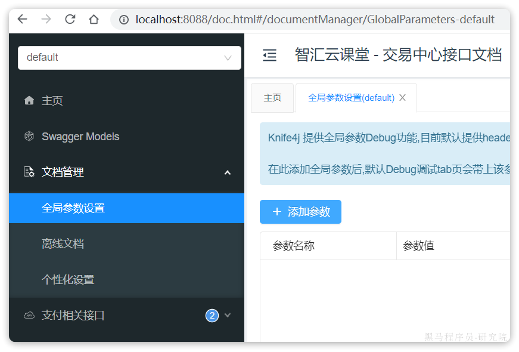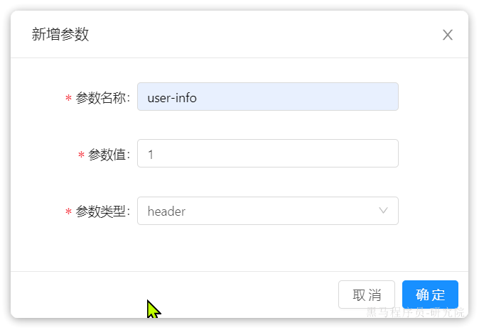

微服务获取用户是基于请求头来传递的，因此我们设置全局参数时添加一个user-info的请求头参数即可。

然后**刷新页面**，来再次找到删除订单接口，进行调试，发现当用户id不对时，删除会失败：

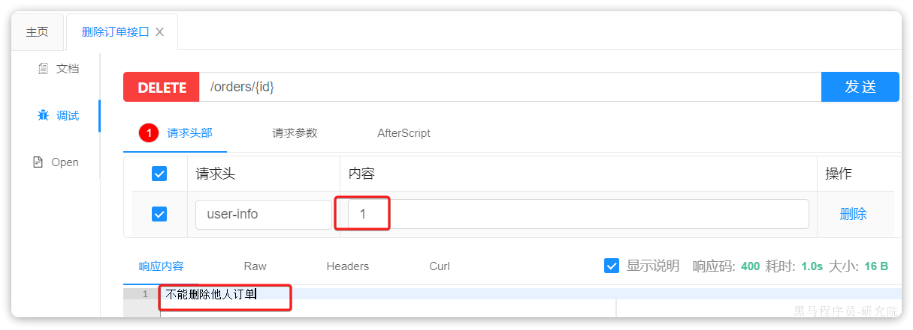

当用户id正确时，删除成功：

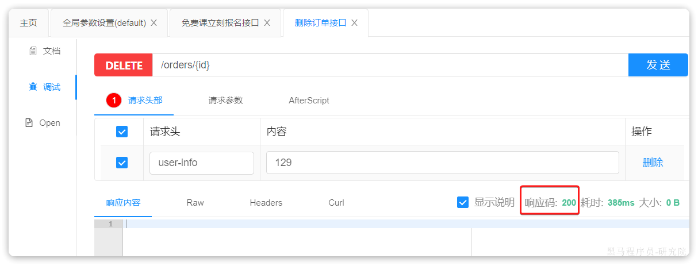

#### 4.5.2.组件测试

接下来让我们的服务与网关联调，再次测试。

不过问题来了，现在我们在本地启动了交易服务，而虚拟机中也启动了交易服务：

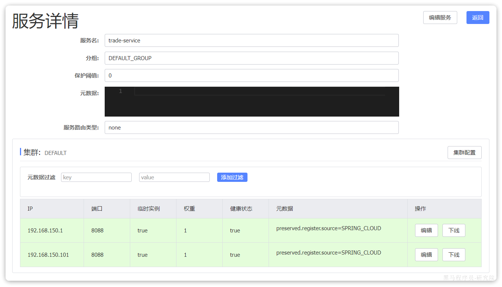

当我们请求网关时，如何保证请求一定进入本地启动的服务呢？

这里有两种办法：

- 关停虚拟机中启动的交易服务
- 将虚拟机中启动的交易服务权重设置为0

权重设置：

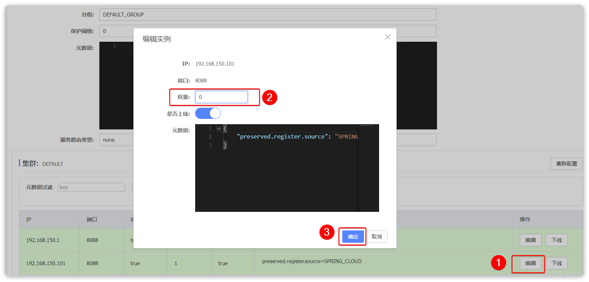

接下来，通过浏览器访问前端页面，然后点击删除订单测试即可。

#### 4.5.3.部署联调

最后，测试没有问题，我们就可以将代码部署到开发环境去了。

我们在Jenkins中配置了web钩子，代码推送后自动触发构建。不过需要注意的是，默认情况下我们推送的代码不管是哪个分支都会触发构建，而且构建默认是基于lesson-init分支，需要重新配置。

我们找到Jenkins控制台中的tjxt-dev-build任务：

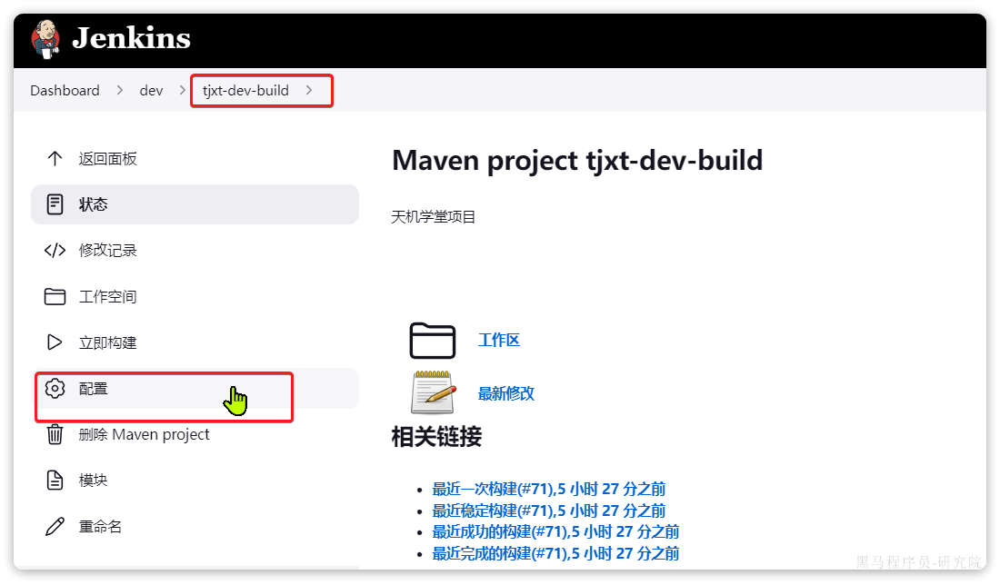

修改其中的配置。

第一个是哪些分支变化以后触发构建：

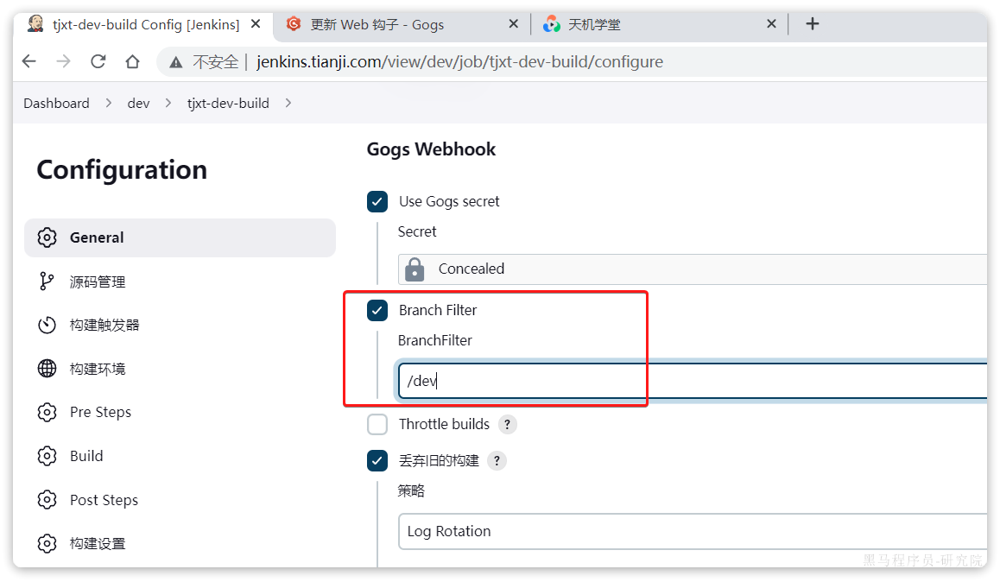

第二个是构建时基于哪个分支构建：

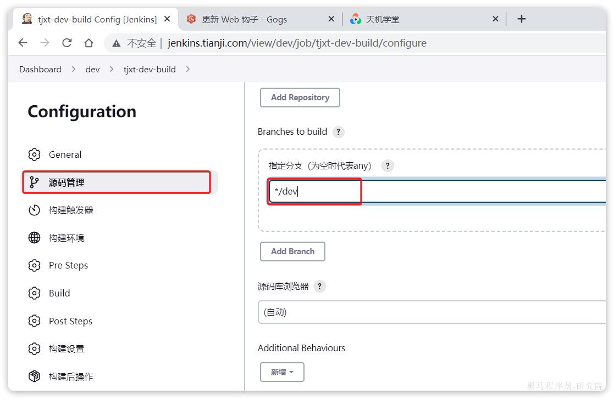

然后选择提交dev分支，并push到远端仓库：

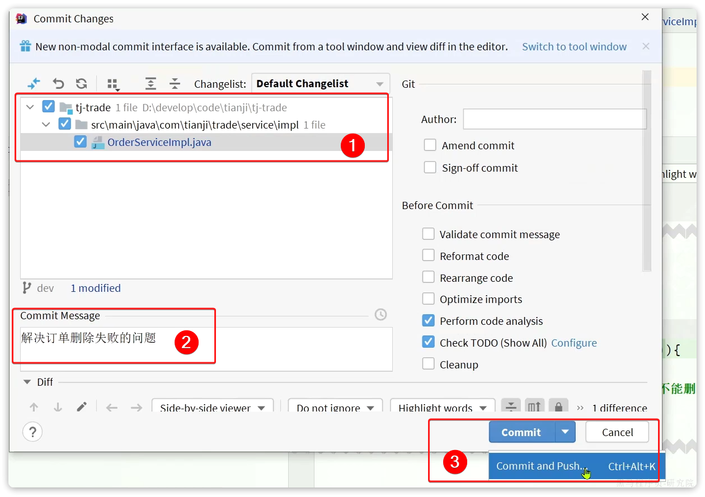

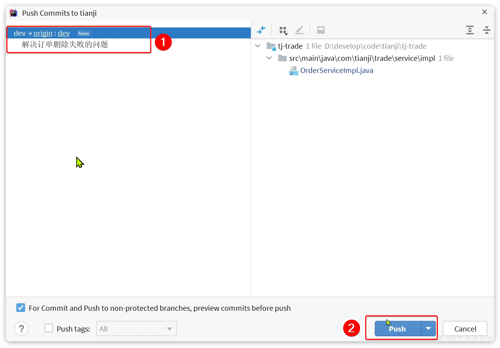

然后到控制台，重新构建`tj-trade`服务：

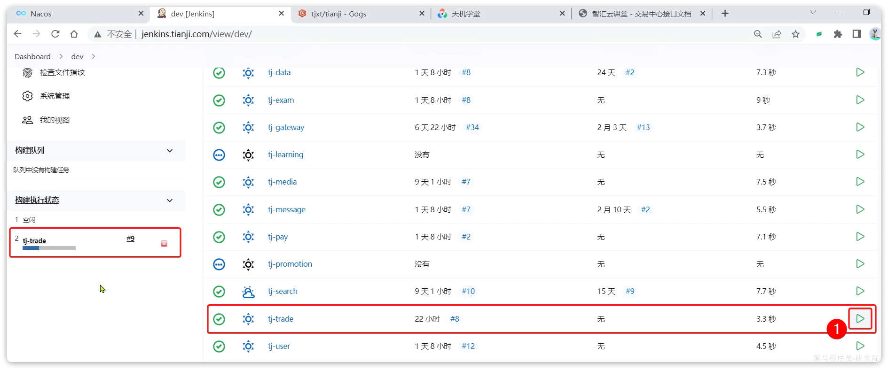

将本地服务停止，修改nacos中的虚拟机中的tj-trade实例权重为1：

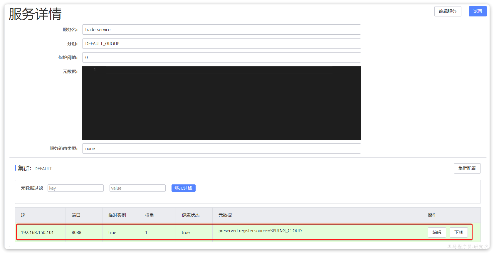

再次测试即可。
