# day02-我的课表

在昨天的学习中，我们解决了一个简单的BUG。并且演示了整个项目的核心业务流程。现在，你对项目有了基本的了解，是时候动手开发一些业务功能了。

**场景**是这样的：

你进入公司以后，组长给你分配了一些简单的BUG修复功能，帮助你熟悉了整个项目。接下来你们小组接收了一个正式的开发任务：**开发天机学堂项目的学习辅助相关功能**。

不要小看这部分功能，作为一个在线教育项目，学习是核心。而怎样让学员有一个好的学习体验，持续有动力的学习，就显得非常关键。我们要实现的学习辅助功能，就是要起到激励、促进学员、帮助学员学习的功能，非常重要。

那么从哪里入手呢？

我们来回顾一下，在演示项目业务流程时，我们发现搜索课程、报名课程等流程都已经完成开发了。并且在《个人中心-我的订单》页面可以看到我们下单报名的课程：

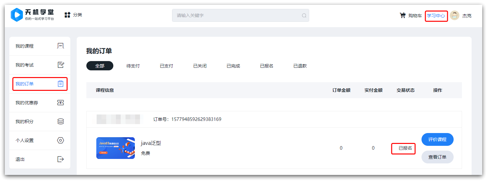

然而，在我的课程页面中，却看不到这些课程：

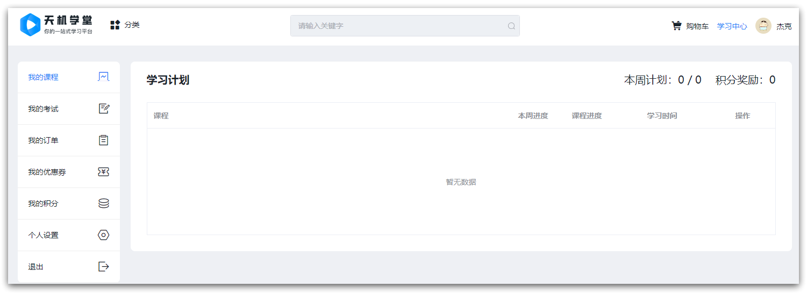

看不到课程自然就无法学习。所以今天我们要完成的任务就是开发学习中心的《我的课程表》相关接口，让学员看到课程，然后才可以学习课程。

但是，很多同学进入公司以后，接手一个任务，根本毫无头绪，不知道从何做起。事实上，接口开发是有一些固定套路的。

企业实际开发中，一般的流程是这样的：

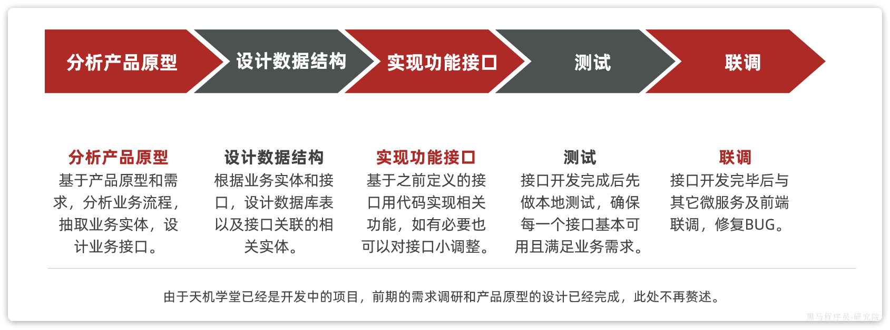

需要强调的一点是，开发中最重要的环节其实是前两步：

- 原型分析、接口设计
- 数据库设计

只要前两步分析完成，功能开发就比较简单了。

那为什么要先设计接口呢？原因有两点：

- 第一：目前企业开发的模式往往是前后端分离，前后端并行开发。前端开发需要调用后端接口，后端需要开发接口返回数据给前端，要想并行开发，就必须有一套接口标准，前后端基于接口完成开发。
- 第二：设计接口的过程就是分析业务的过程，弄清楚了业务的细节，更有助于我们设计数据库结构，开发接口功能。

因此，我们将遵循企业开发的流程，先分析原型、设计接口，再设计数据库结构，最后再开发接口功能。

通过今天的学习，我们要达成的目标如下：

- 完成我的课程表相关功能
- 学会阅读产品原型，分析需求
- 能根据需求设计接口
- 能根据需求设计数据库表
- 学会跨微服务的业务开发

## 1.接口设计

天机学堂是一个开发中的项目，前期的需求分析已经完成，并且产品经理也设计出了产品原型，地址：

天机学堂-管理后台：https://lanhuapp.com/link/#/invite?sid=qx03viNU   密码: Ssml 天机学堂-用户端：https://lanhuapp.com/link/#/invite?sid=qx0Fy3fa  密码: ZsP3

我们可以基于产品原型来分析业务。

### 1.1.分析业务流程

在用户的《个人中心》，有一个《我的课程》列表页，如图：

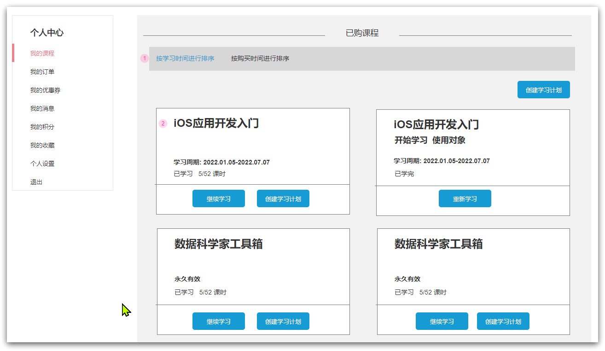

那么这些课程是从何而来的，原型的页面说明中有告诉我们：

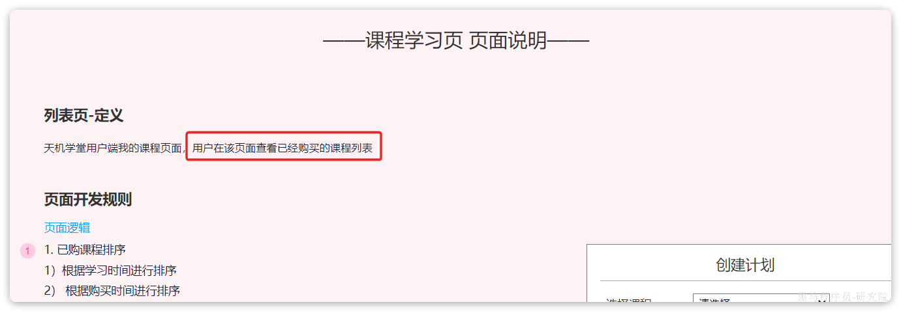

从这里可以看出，凡是**购买过的课程，都应该加入到课程列表**中。

需要注意的是，刚刚加入课表的课程处于未学习状态，这个时候学员可以创建一个学习计划，规划后期的学习节奏：

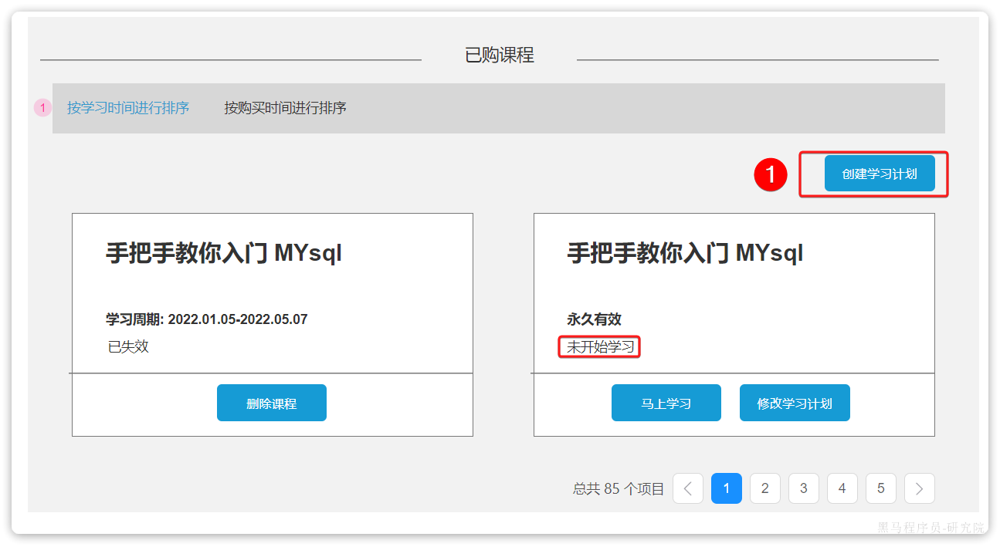

所谓的学习计划，就是规划自己的学习频率：

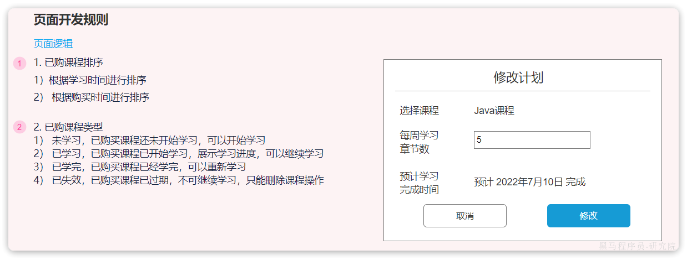

一旦有了计划，系统就可以统计学习进度，并且提示用户，督促用户抓紧时间学习：

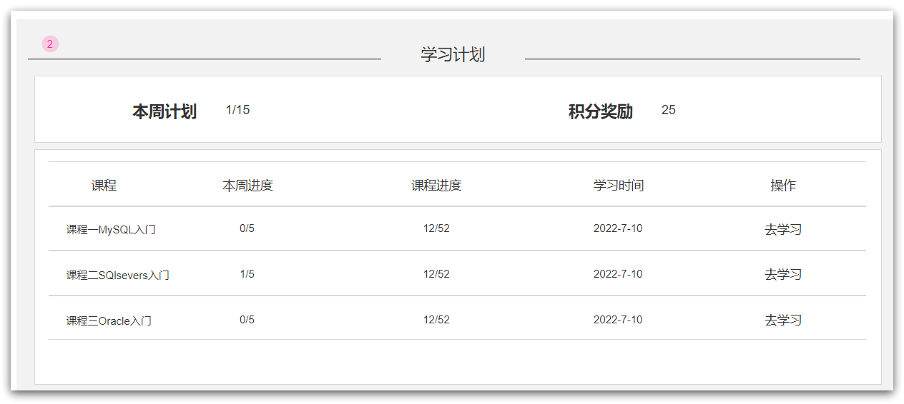

当然，在学习的过程中，课程的状态会不断发生变化：

::: warning

页面开发规则

1. 已购课程状态变化

1） 未学习，已购买课程还未开始学习，可以开始学习

2） 已学习，已购买课程已开始学习，展示学习进度，可以继续学习

3） 已学完，已购买课程已经学完，可以重新学习

4） 已失效，已购买课程已过期，不可继续学习，只能删除课程操作

:::

由上述跟课程表有关的内容，我们可以推测出《课程表》的业务流转过程是这样的：

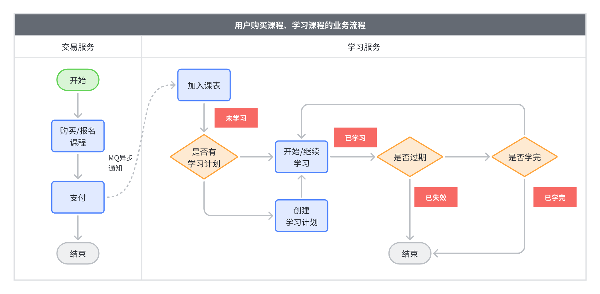

在今天的任务中，我们先完成《课程表》相关功能，《学习计划》暂放一边。

### 1.2.接口统计

我们来梳理一下在整个过程中学员可能要做哪些事情，这些事情将来就可能是我们要实现的服务端接口。梳理的方式就是查看原型图，分析哪里可能产生用户交互行为。

#### 1.2.1.加入课表

首先，用户支付完成后，需要将购买的课程加入课表：


而支付成功后，交易服务会基于MQ通知的方式，通知学习服务来执行加入课表的动作。因此，我们要实现的第一个接口就是：

> 支付或报名课程后，监听到MQ通知，将课程加入课表。

#### 1.2.2.分页查询课表

在加入课表以后，用户就可以在个人中心查看到这些课程：

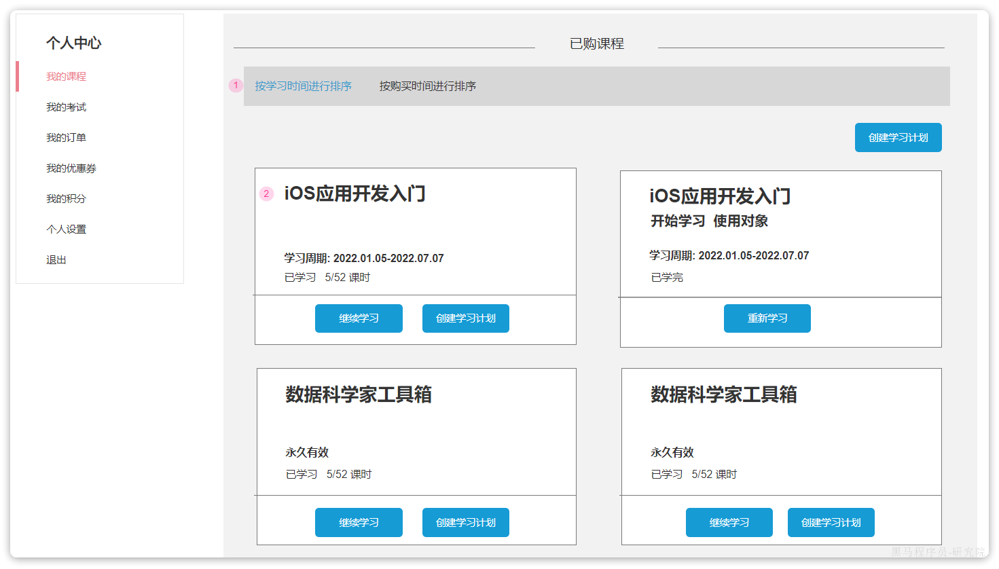

因此，这里就需要第二个接口：

> 分页查询我的课表

当然，在这个页面大家还能看到跟**学习计划**有关的按钮，不过本节课我们暂时不讨论学习计划的相关功能实现。

另外，当课程学完后，可以选择删除课程：

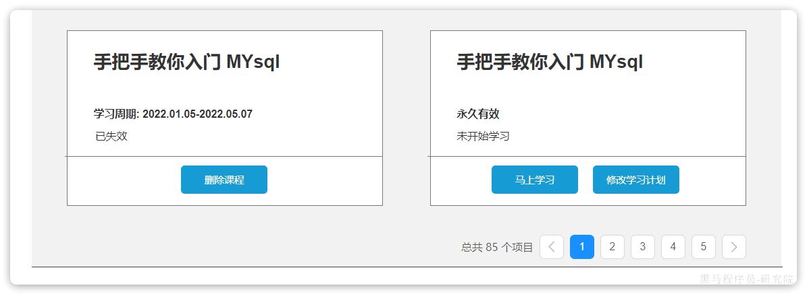

所以，还要有删除课程的接口：

> 删除指定课程

除此以外，如果用户退款，也应该删除课表中的课程，这里同样是通过MQ通知来实现：

> 退款后，监听到MQ通知，删除指定课程

#### 1.2.3.查询学习进度

在个人中心，我的课表页面，还能看到用户最近的学习进度：

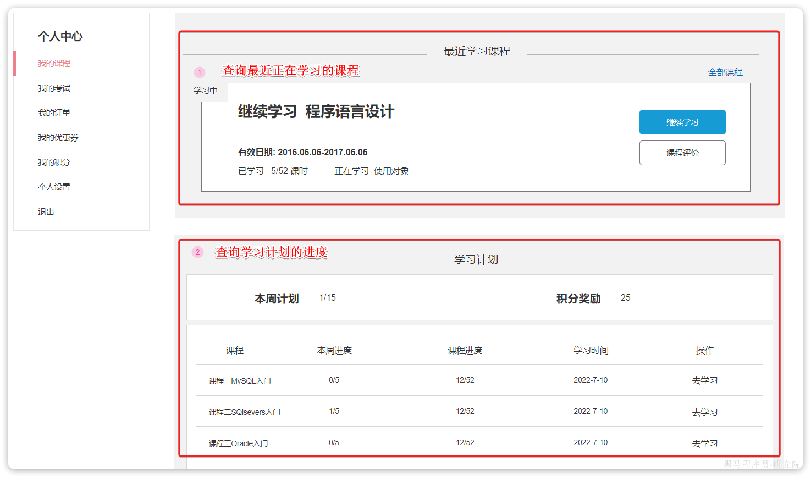

这里就包含两个接口：

::: warning

1. 查询最近正在学习的课程
2. 查询学习计划的进度（学习计划相关，暂不实现）

:::

#### 1.2.4.查询指定课程学习状态

还有，在课程详情页面，如果当前课程已经购买，也要展示出课程的学习进度：

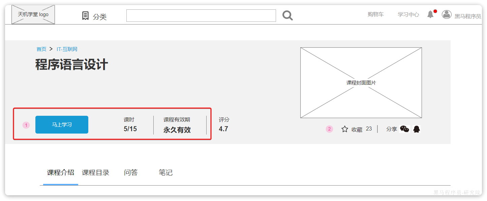

因此，这里还需要一个接口：

> 根据id查询指定课程的学习状态

#### 1.2.5.内部访问接口

除了页面原型中看到的接口以外，其它微服务也对`tj-learning`服务有数据需求，并且也定义了一些需要我们实现的Feign接口。

在天机学堂的项目中，所有Feign接口都定义在了`tj-api`模块下，`learning`服务的接口定义在`com.tianji.api.client.learning`模块下：

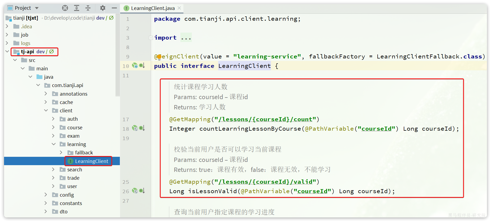

这里包含两个接口：

::: warning

1. 统计某课程的报名人数：后台管理的某些地方需要知道课程的报名人数
2. 校验当前用户是否报名了指定课程：用户学习课程的前提是报名了课程，某些业务中需要做校验

:::

#### 1.2.6.总结

综上，与我的课表有关的接口有：

| **编号** |                  **接口简述**                   | **请求方式** |       **请求路径**        |
| :------: | :---------------------------------------------: | :----------: | :-----------------------: |
|    1     |         支付或报名课程后，立刻加入课表          |    MQ通知    |                           |
|    2     |                分页查询我的课表                 |     GET      |       /lessons/page       |
|    3     |            查询我最近正在学习的课程             |     GET      |       /lessons/now        |
|    4     |          根据id查询指定课程的学习状态           |     GET      |    /lessons/{courseId}    |
|    5     |               删除课表中的某课程                |    DELETE    |    /lessons/{courseId}    |
|    6     |          退款后，立刻移除课表中的课程           |    MQ通知    |                           |
|    7     | 校验指定课程是否是课表中的有效课程（Feign接口） |     GET      | /lessons/{courseId}/valid |
|    8     |          统计课程学习人数（Feign接口）          |     GET      | /lessons/{courseId}/count |

那么接下来，我们就一起来分析、设计、实现这些接口吧。

### 1.3.接口分析设计

那么问题来了，我们该如何分析、设计一个接口呢？

#### 1.3.1.接口分析和设计的一般方法

企业开发中往往会通过一些工具来设计API接口，比如比较常见的一款API接口工具：YAPI

http://yapi.smart-xwork.cn/

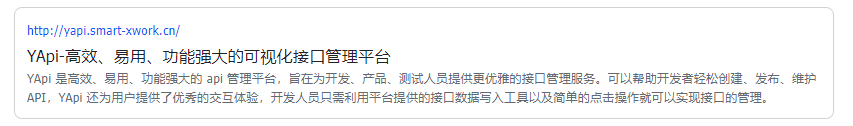

我们先来看一下这个工具的接口设计页面，它分成三大部分：

- 基本设置
- 请求参数设置
- 返回数据设置

首先是基本设置：

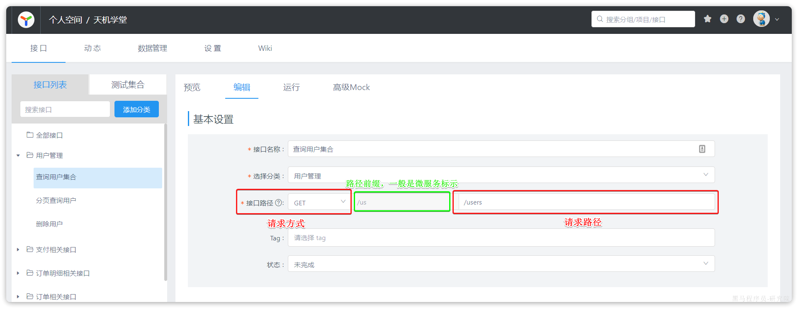

在这里要填写的是某个接口的基本信息，例如接口名字、分类（或者叫分组）、状态等。但其中最重要的就是接口的路径。路径中需要填写的核心有两部分：

- 请求方式：也就是http请求的方式，本例中是GET
- 请求路径：也就是请求的资源路径，本例中是/users

知道了这些信息，前端就知道该**向哪里发送请求了**。

然后是当前接口的请求参数设置：

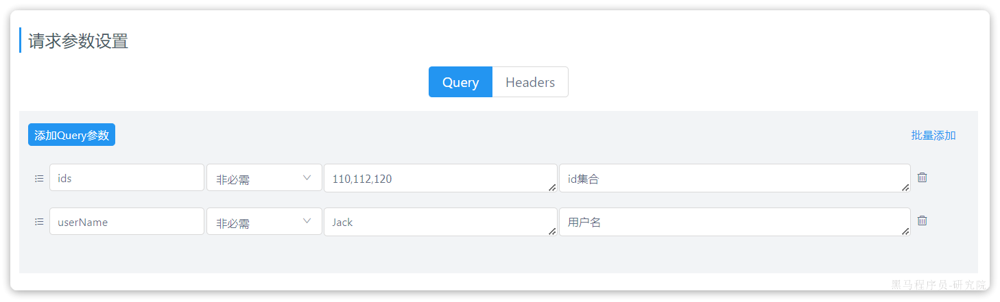

这里主要描述查询参数的基本信息，包括：

- 参数名称
- 参数是否必须
- 参数示例
- 参数描述

由于这里是查询用户集合，请求方式是GET，因此查询参数就是普通的QUERY参数，也就是路径后的`?`

拼接参数。如果是POST或者PUT请求，这里还可以传递更复杂的参数格式，比如FORM表单、JSON等

知道了这些，前端就知道**发送请求时，要携带哪些参数**了。

最后一部分就是返回数据设置：

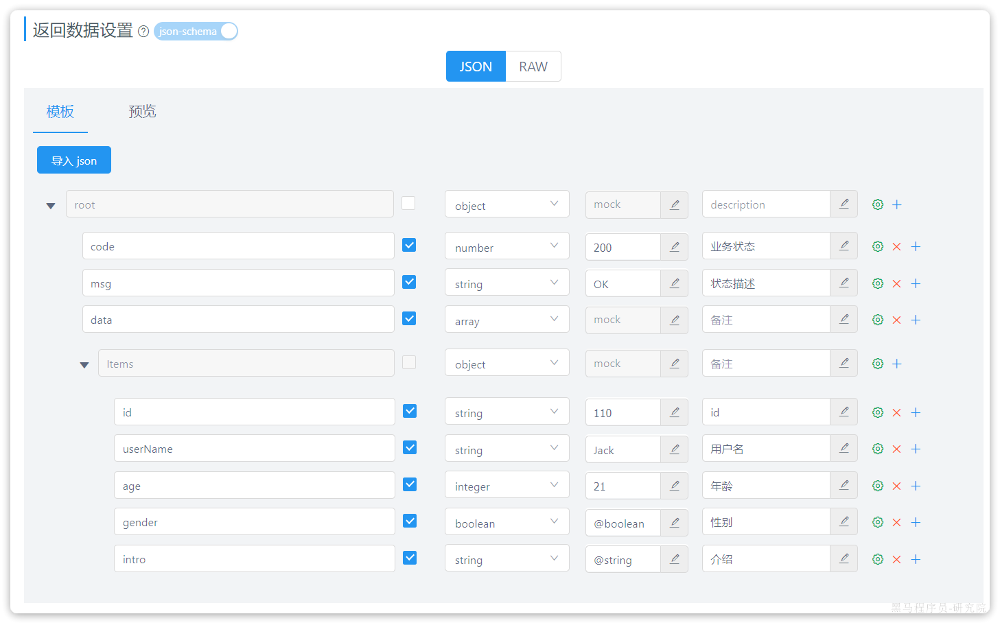

这里就定义了返回的详细信息：

- 字段名称
- 字段类型
- 字段示例

知道了这些信息，前端就知道**渲染时可以使用的字段**了。

综上所述，接口设计的核心要素包括：

- 请求方式
- 请求路径
- 请求参数格式
- 返回值格式

知道了上述信息，前端就知道该向哪里发请求、请求要携带哪些参数、请求可以得到什么结果。而后端也能根据这些信息定义Controller接口、知道接口方式和路径、方法的参数、方法的返回值格式了。

但问题来了，上述要素我们该如何得知呢？

一般来说，可以按照下面的思路来设计：

- **请求方式**和**请求路径**：这一部分只要遵循Restful风格即可
- **请求参数**和**返回值格式**：结合页面原型和需求，与前端、后端、产品的同事共同协商决定。

::: warning

这里比较复杂的就是参数和返回值，在分析的时候切忌自己臆想，**不确定的地方一定要跟****产品经理****反复确认，最好邮件确认**，避免以后扯皮。

然后与前端协商，或者跟调用你接口的后端同事协商。看页面渲染、其它服务需要哪些数据，而我们要查询这些数据需要哪些参数，最终确定接口的参数和返回值格式。

注意，上述过程不是一蹴而就的，很有可能会经过多次调整，这是非常正常的现象，核心思想就是**一定要多沟通，多确认，不要自己任意妄为**。

:::

由于教学需要，我们的前端全部都已经开发完成，无法沟通协商来修改了。因此我们重点是根据页面原型来分析参数和返回值需要的字段。

具体到字段的名字，我会告诉大家，大家按照我给出的字段来设计即可（因为前端字段名称都已经写死）。

#### 1.3.2.分页查询我的课表

按照Restful风格，查询请求应该使用`GET`方式。

请求路径一般是资源名称，比如这里资源是课表，所以资源名可以使用`lessons`，同时这里是分页查询，可以在路径后跟一个`/page`，代表分页查询

请求参数，因为是分页查询，首先肯定要包含分页参数，一般有两个：

- pageNo：页码
- pageSize：每页大小

同时还要看页面是否有其它过滤条件，查看原型：

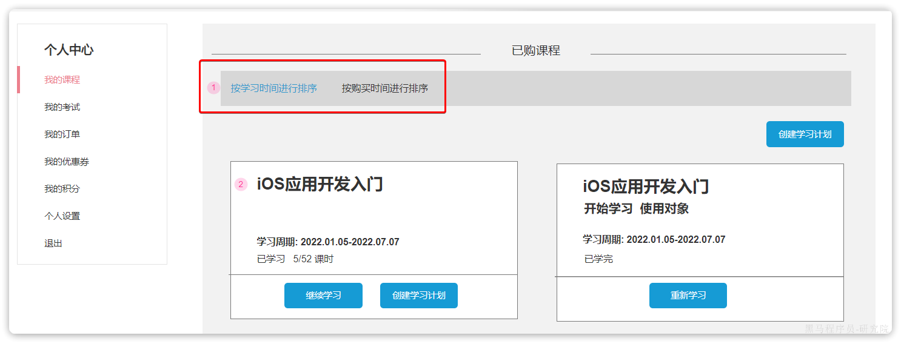

可以发现，这里只有两个排序条件，没有过滤条件，因此加上两个排序字段即可：

- sortBy：排序方式
- isAsc：是否升序

而返回值则复杂一些，需要结合页面需要展示的信息来看：

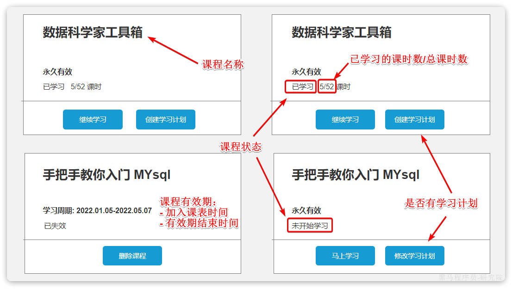

肉眼可见的字段就包含：

- 课程名称
- 课程加入课表时间
- 课程有效期结束时间
- 课程状态
- 课程已学习小节数
- 课程总小节数
- 课程是否创建了学习计划

还有一些字段是页面中没有的，但是可以从功能需要中推测出来，例如：

- 课程id：因为我们点击卡片，需要跳转到对应课程页面，必须知道课程id
- 课程封面：页面渲染时为了美观，一定会展示一个课程的封面图片
- 学习计划频率：当用户点击修改学习计划时，需要回显目前的学习计划频率
- 课表id，当前课程在课表中的对应id，当用户点击继续学习，或创建集合，需要根据课表来操作

综上，最终的接口信息如下：

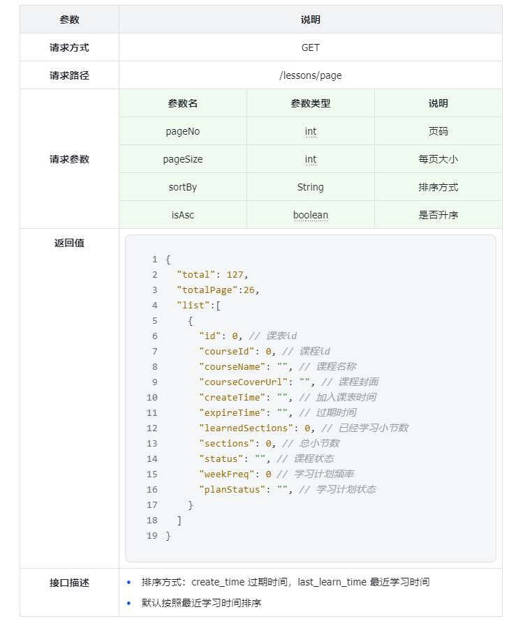

后续所有的接口设计都可以参考这种思路来做。

与这个接口对应的，我们需要定义一下几个实体：

- 统一的分页请求Query实体
- 统一的分页结果DTO实体
- 课表分页VO实体

由于分页请求、分页结果比较常见，我们提前在tj-common模块定义好了。

其中，统一分页请求实体，称为PageQuery：

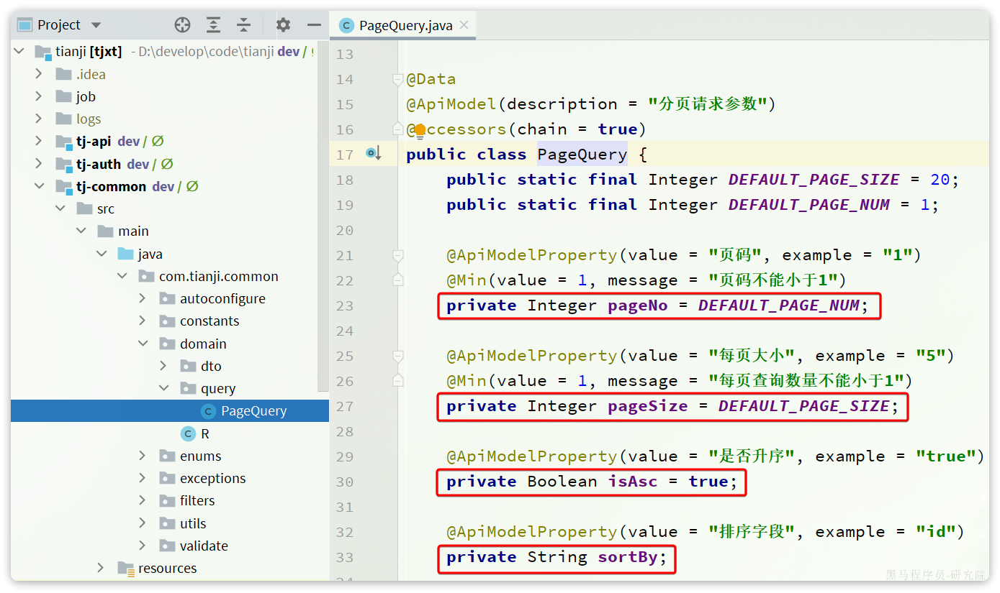

统一分页结果实体，称为PageDTO：

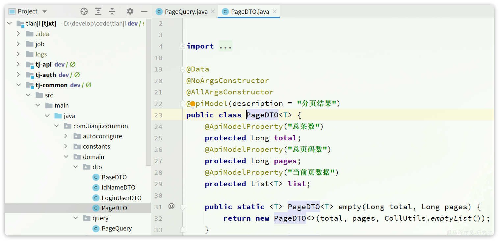

最后，返回结果中的课表VO实体，在课前资料已经提供给大家了：

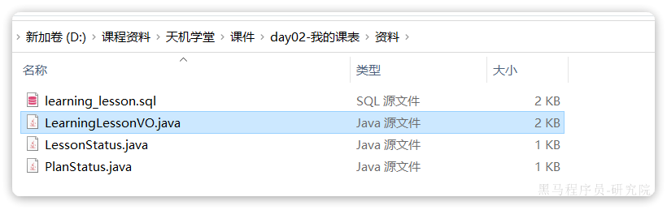

#### 1.3.3.添加课程到课表

当用户支付完成或者报名免费课程后，应该立刻将课程加入到课表中。交易服务会通过MQ通知学习服务，我们需要查看交易服务的源码，查看MQ通知的消息格式，来确定监听消息的格式。

我们以免费报名课程为例来看：

在`trade-service`的`OrderController`中，有一个报名免费课程的接口：

```java
@ApiOperation("免费课立刻报名接口")
@PostMapping("/freeCourse/{courseId}")
public PlaceOrderResultVO enrolledFreeCourse(
    @ApiParam("免费课程id") @PathVariable("courseId") Long courseId) {
    return orderService.enrolledFreeCourse(courseId);
}
```

可以看到这里调用了`OrderService`的`enrolledFreeCourse()`方法：

```java
@Override
@Transactional
public PlaceOrderResultVO enrolledFreeCourse(Long courseId) {
    Long userId = UserContext.getUser();
    // 1.查询课程信息
    List<Long> cIds = CollUtils.singletonList(courseId);
    List<CourseSimpleInfoDTO> courseInfos = getOnShelfCourse(cIds);
    if (CollUtils.isEmpty(courseInfos)) {
        // 课程不存在
        throw new BizIllegalException(TradeErrorInfo.COURSE_NOT_EXISTS);
    }
    CourseSimpleInfoDTO courseInfo = courseInfos.get(0);
    if(!courseInfo.getFree()){
        // 非免费课程，直接报错
        throw new BizIllegalException(TradeErrorInfo.COURSE_NOT_FREE);
    }
    // 2.创建订单
    Order order = new Order();
    // 2.1.基本信息
    order.setUserId(userId);
    order.setTotalAmount(0);
    order.setDiscountAmount(0);
    order.setRealAmount(0);
    order.setStatus(OrderStatus.ENROLLED.getValue());
    order.setFinishTime(LocalDateTime.now());
    order.setMessage(OrderStatus.ENROLLED.getProgressName());
    // 2.2.订单id
    Long orderId = IdWorker.getId(order);
    order.setId(orderId);

    // 3.订单详情
    OrderDetail detail = packageOrderDetail(courseInfo, order);

    // 4.写入数据库
    saveOrderAndDetails(order, CollUtils.singletonList(detail));

    // 5.发送MQ消息，通知报名成功
    rabbitMqHelper.send(
            MqConstants.Exchange.ORDER_EXCHANGE,
            MqConstants.Key.ORDER_PAY_KEY,
            OrderBasicDTO.builder().orderId(orderId).userId(userId).courseIds(cIds).build());
    // 6.返回vo
    return PlaceOrderResultVO.builder()
            .orderId(orderId)
            .payAmount(0)
            .status(order.getStatus())
            .build();
}
```

其中，通知报名成功的逻辑是这部分：

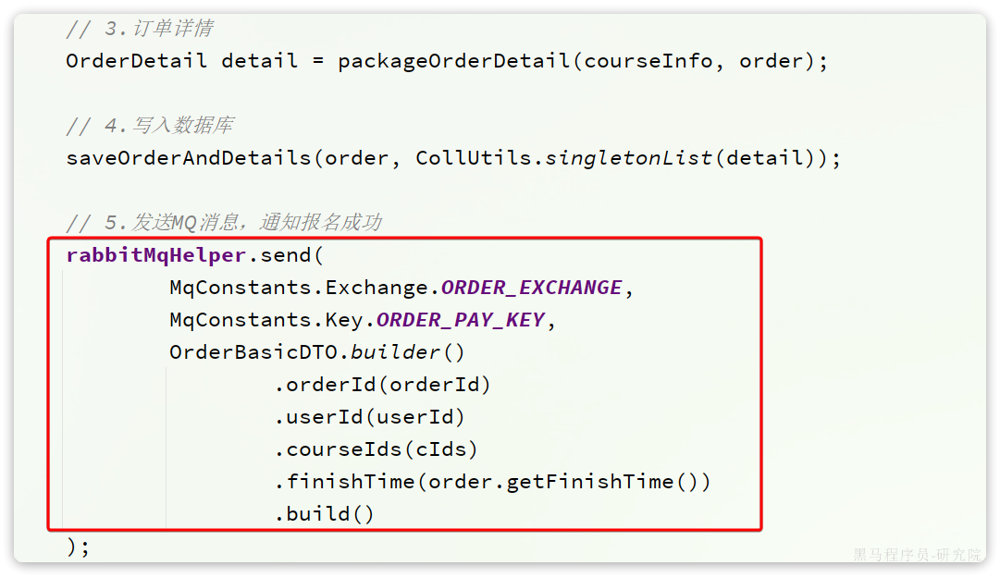

由此，我们可以得知发送消息的Exchange、RoutingKey，以及消息体。消息体的格式是OrderBasicDTO，包含四个字段：

- orderId：订单id
- userId：下单的用户id
- courseIds：购买的课程id集合
- finishTime：支付完成时间

因此，在学习服务，我们需要编写的消息监听接口规范如下：


其中的请求参数实体，由于是与交易服务公用的数据传递实体，也就是DTO，因此已经提前定义到了`tj-api`模块下的DTO包了。

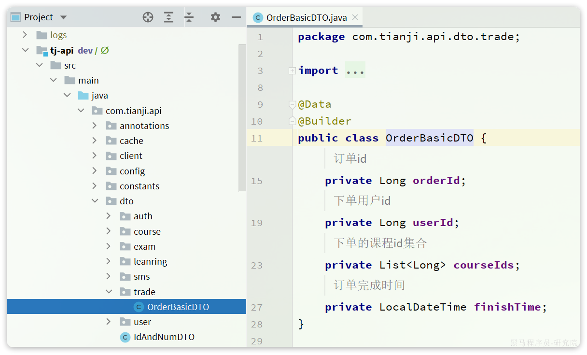

#### 1.3.4.查询正在学习的课程

页面原型中，有两个地方需要查看正在学习的课程。

第一个，在个人中心-我的课程：

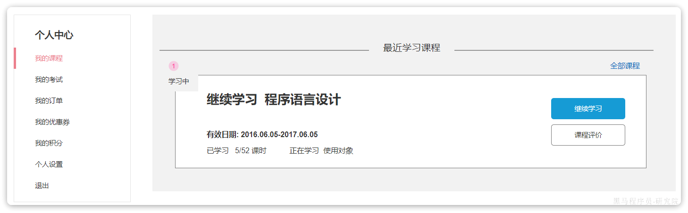

另一个，在已登录情况下，首页的悬浮窗中：

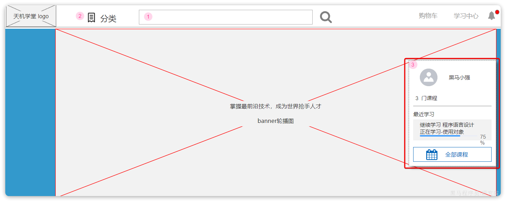

与之前类似，我们需要定义出：请求方式、请求路径、请求参数、返回值类型等信息。

- 请求方式：Http请求，GET
- 请求路径：`/lessons/now`，代表的含义是正在学习的课表
- 请求参数：查询的是当前用户的课表，所以参数就是当前登录用户，无需传递，我们可以从登录凭证获取
- 返回值：返回的数据在页面就能看到：
  - 课程id
  - 课程名称
  - 课程封面
  - 课程有效期（起始-终止）
  - 课程总课时数
  - 课程已学习课时数
  - 课表中总课程数
  - 正在学习的小节名称
  - 正在学习的小节序号（让用户知道自己在学第几节）

因此，最终的接口规则如下：

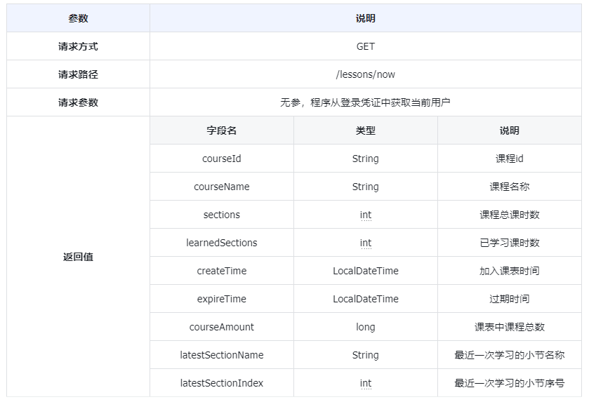

可以看到返回值结果与分页查询的课表VO基本类似，因此这里可以复用LearningLessonVO实体，但是需要添加几个字段：

- courseAmount
- latestSectionName
- latestSectionIndex

#### 1.3.5.根据id查询某课程学习状态

在课程详情页，课程展示有两种不同形式：

- 对于未购买的课程：展示为立刻购买或加入购物车

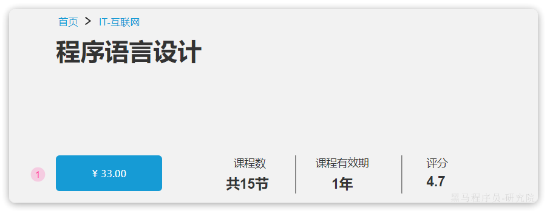

- 对于已经购买的课程：展示为马上学习，并且显示学习的进度、有效期

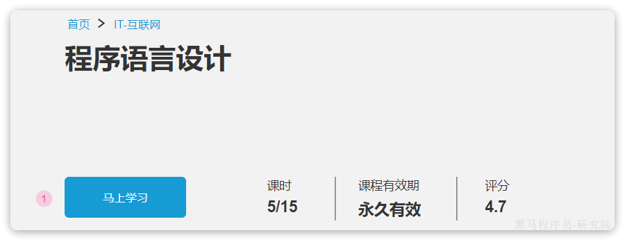

因此，进入详情页以后，前端需要查询用户的课表中是否有该课程，如果有该课程则需要返回课程的学习进度、课程有效期等信息。

按照Restful风格，请求方式是GET，请求路径是资源名称lessons，不过这里要根据id查询，因此可以利用路径占位符传参，最终路径就变为：`/lessons/{courseId}`

返回的字段如页面所示，包含：

- 课程id
- 课程状态
- 已学习小节数
- 加入课表时间、有效期结束时间

因此，最终的接口设计如下：

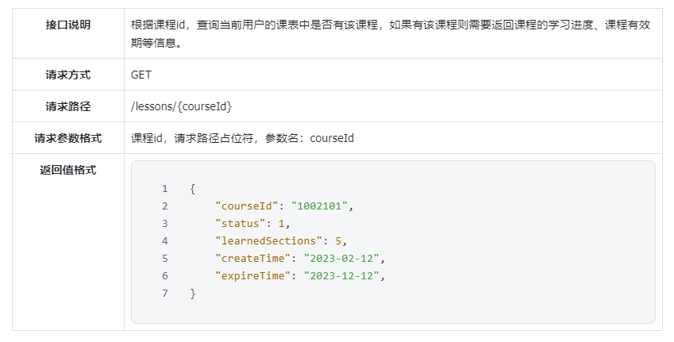

这里的返回值VO结构在之前定义的LearningLessonVO中都包含了，因此可以直接复用该VO，不再重复定义。

#### 1.3.6.其它

其它几个接口的设计就留给大家作为练习了。

## 2.数据结构

基于之前的分析，我们已经知道了业务基本流程、用户的交互行为。而用户的这些行为必然产生数据，需要保存到数据库中。这些数据在保存时必须有设定好的结构，这样才能支撑我们完成各种接口功能。

接下来，我们就分析一下课表相关的业务对应的数据结构。

### 2.1.字段分析

课表要记录的是用户的学习状态，所谓学习状态就是记录**谁**在学习**哪个课程**，**学习的进度**如何。

- 其中，谁在学习哪个课程，就是一种关系。也就是说课表就是用户和课程的中间关系表。因此一定要包含三个字段：
  - userId：用户id，也就是**谁**
  - courseId：课程id，也就是学的**课程**
  - id：唯一主键
- 而学习进度，则是一些附加的功能字段，页面需要哪些功能就添加哪些字段即可：
  - status：课程学习状态。0-未学习，1-学习中，2-已学完，3-已过期
    - 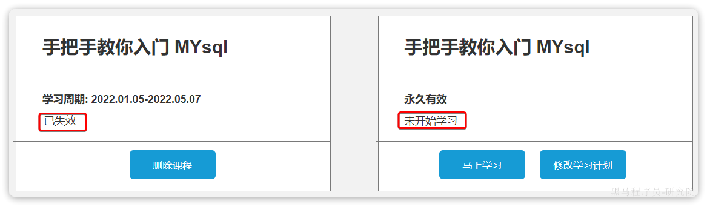
  - planStatus：学习计划状态，0-没有计划，1-计划进行中
  - weekFreq：计划的学习频率
    - 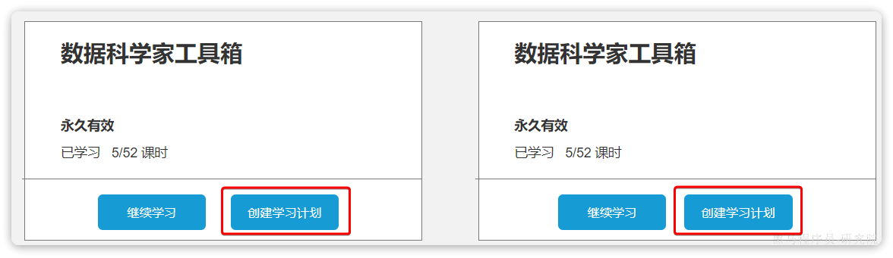
  - learnedSections：已学习小节数量，注意，课程总小节数、课程名称、封面等可由课程id查询得出，无需重复记录
    - 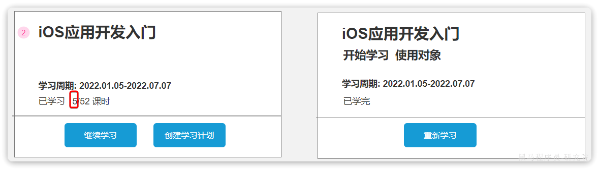
  - latestSectionId：最近一次学习的小节id，方便根据id查询最近学习的课程正在学第几节
    - 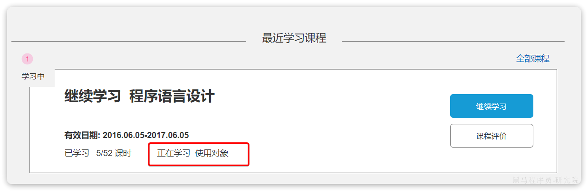
  - latestLearnTime：最近一次学习时间，用于分页查询的排序：
    - 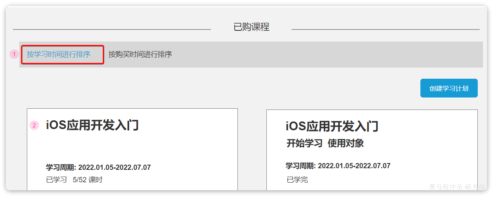
  - createTime和expireTime，也就是课程加入时间和过期时间
    - 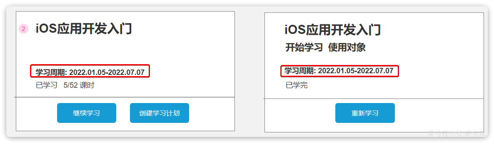

### 2.2.ER图

我们可以结合原型图中包含的信息来画一个ER图，分析我的课表包含的信息：

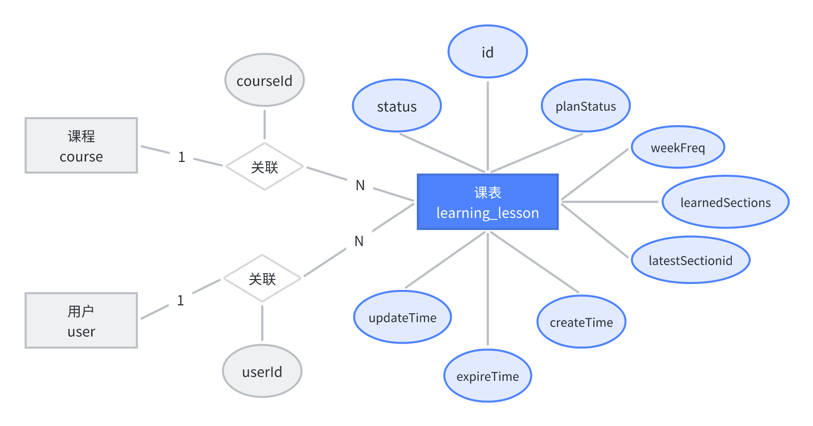

### 2.3.表结构

基于ER图，课表对应的数据库结构应该是这样的：

```sql
CREATE TABLE learning_lesson (
  id bigint NOT NULL COMMENT '主键',
  user_id bigint NOT NULL COMMENT '学员id',
  course_id bigint NOT NULL COMMENT '课程id',
  status tinyint DEFAULT '0' COMMENT '课程状态，0-未学习，1-学习中，2-已学完，3-已失效',
  week_freq tinyint DEFAULT NULL COMMENT '每周学习频率，每周3天，每天2节，则频率为6',
  plan_status tinyint NOT NULL DEFAULT '0' COMMENT '学习计划状态，0-没有计划，1-计划进行中',
  learned_sections int NOT NULL DEFAULT '0' COMMENT '已学习小节数量',
  latest_section_id bigint DEFAULT NULL COMMENT '最近一次学习的小节id',
  latest_learn_time datetime DEFAULT NULL COMMENT '最近一次学习的时间',
  create_time datetime NOT NULL DEFAULT CURRENT_TIMESTAMP COMMENT '创建时间',
  expire_time datetime NOT NULL COMMENT '过期时间',
  update_time datetime NOT NULL DEFAULT CURRENT_TIMESTAMP ON UPDATE CURRENT_TIMESTAMP COMMENT '更新时间',
  PRIMARY KEY (id),
  UNIQUE KEY idx_user_id (user_id,course_id) USING BTREE
) ENGINE=InnoDB DEFAULT CHARSET=utf8mb4 COLLATE=utf8mb4_0900_ai_ci COMMENT='学生课表';
```

我们要创建一个名为`tj_learning`的database，并且执行上面的SQL语句，创建`learning_lesson`表：

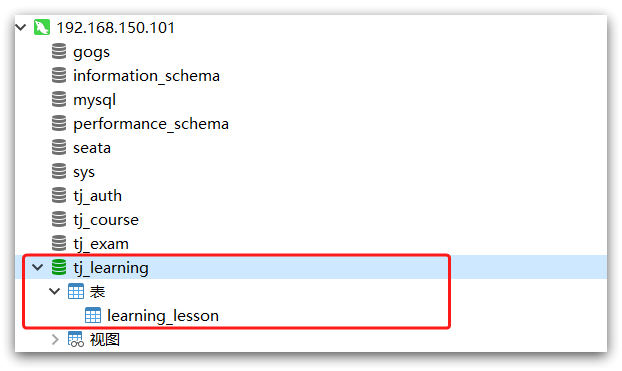

当然，课前资料也提供了这张表对应的SQL语句：

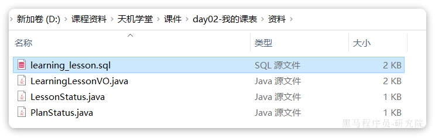

### 2.4.创建分支

一般开发新功能都需要创建一个feature类型分支，不能在DEV分支直接开发，因此这里我们新建一个功能分支。我们在项目目录中打开terminal控制台，输入命令：

```shell
git checkout -b feature-lessons
```

发现整个项目都切换到了新的功能分支：

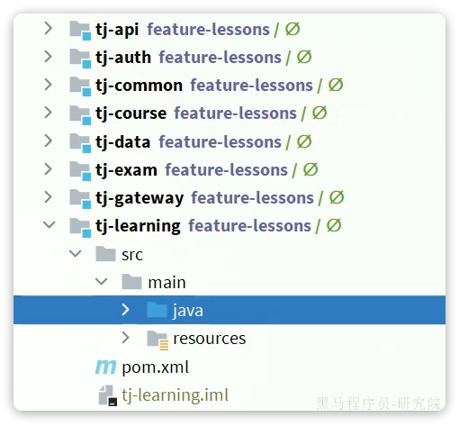

### 2.5.代码生成

在天机学堂项目中，我们使用的是Mybatis作为持久层框架，并且引入了MybatisPlus来简化开发。因此，在创建据库以后，就需要创建对应的实体类、mapper、service等。

这些代码格式固定，编写起来又比较费时。好在IDEA中提供了一个MP插件，可以生成这些重复代码：

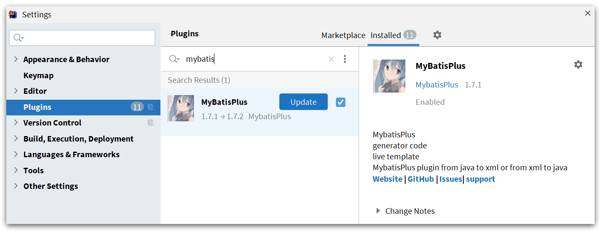

安装完成以后，我们先配置一下数据库地址：

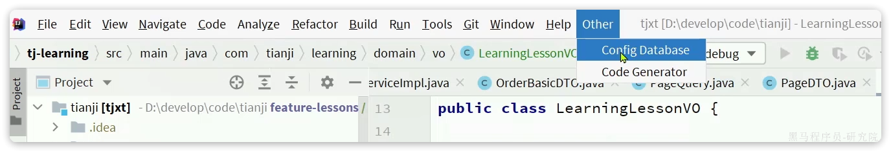

特别注意，数据库名不要填写错误：

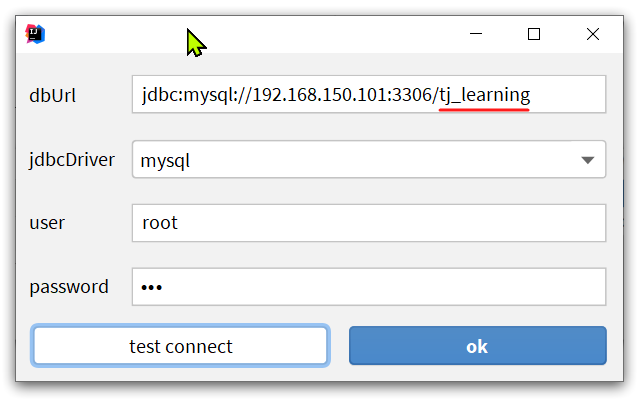

然后配置代码自动生成的设置：

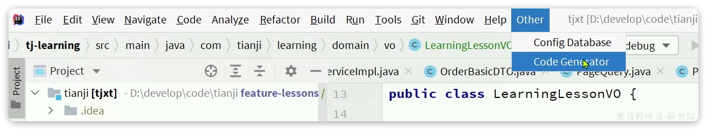

严格按照下图的模式去设置（图片放大后更清晰），不要填错项目名称和包名称：

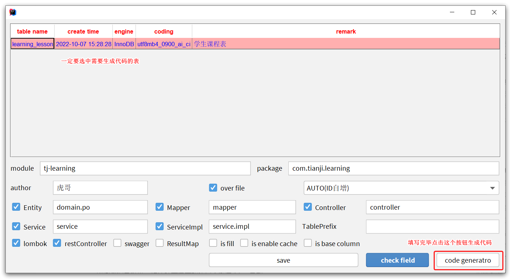

最后，点击`code generatro`按钮，即可生成代码：

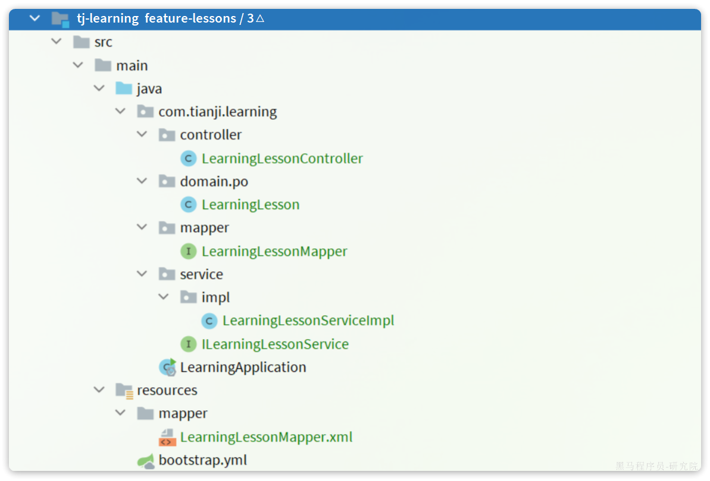

要注意的是，默认情况下PO的主键ID策略是自增长，而天机学堂项目默认希望采用雪花算法作为ID，因此这里需要对`LearningLesson`的ID策略做修改：

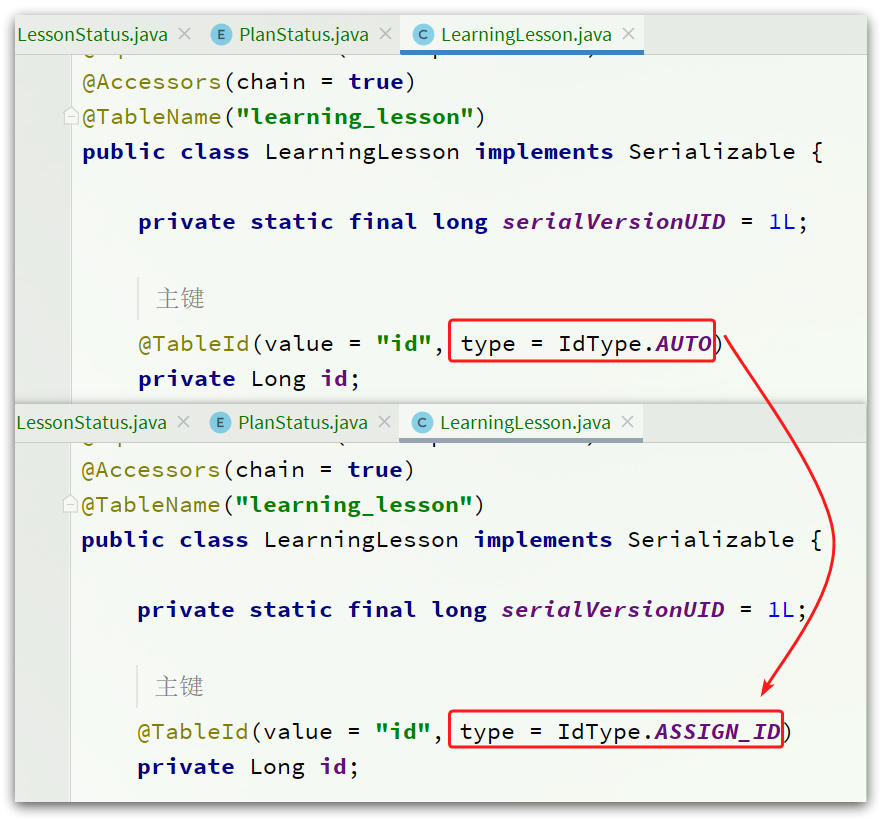

除此之外，我们还要按照Restful风格，对请求路径做修改：

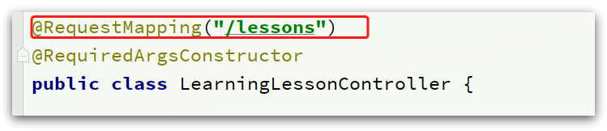

### 2.6.状态枚举

在数据结构中，课表是有学习状态的，学习计划也有状态：

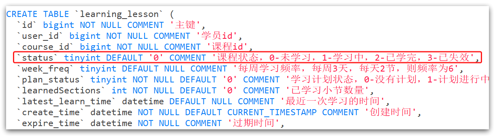

这些状态如果每次编码都手写很容易写错，因此一般都会定义出枚举：

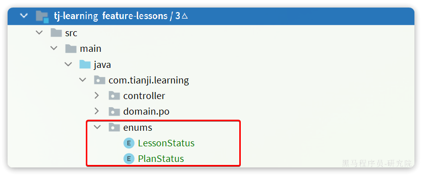

在课前资料中已经提供给大家了：

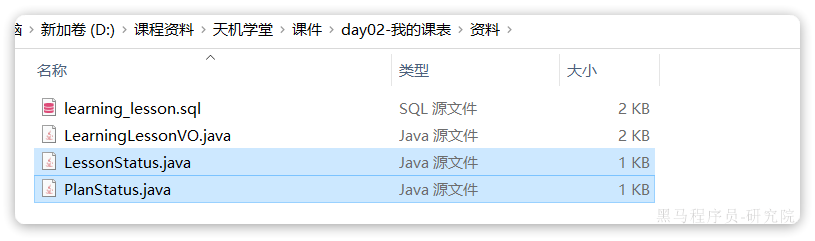

首先是课表状态`LessonStatus`：

```java
@Getter
public enum LessonStatus implements BaseEnum {
    NOT_BEGIN(0, "未学习"),
    LEARNING(1, "学习中"),
    FINISHED(2, "已学完"),
    EXPIRED(3, "已过期"),
    ;
    @JsonValue // 指定JSON序列化枚举时用的值
    @EnumValue // 指定与数据库交互时要做类型转换的值
    int value;
    String desc;

    LessonStatus(int value, String desc) {
        this.value = value;
        this.desc = desc;
    }

    @JsonCreator(mode = JsonCreator.Mode.DELEGATING) // 指定JSON反序列化时使用的函数
    public static LessonStatus of(Integer value){
        if (value == null) {
            return null;
        }
        for (LessonStatus status : values()) {
            if (status.equalsValue(value)) {
                return status;
            }
        }
        return null;
    }
}
```

然后是学习计划的状态`PlanStatus`：

```java
@Getter
public enum PlanStatus implements BaseEnum {
    NO_PLAN(0, "没有计划"),
    PLAN_RUNNING(1, "计划进行中"),
    ;
    
    @JsonValue // 指定JSON序列化枚举时用的值
    @EnumValue // 指定与数据库交互时要做类型转换的值
    int value;
    String desc;

    PlanStatus(int value, String desc) {
        this.value = value;
        this.desc = desc;
    }

    @JsonCreator(mode = JsonCreator.Mode.DELEGATING) // 指定JSON反序列化时使用的函数
    public static PlanStatus of(Integer value){
        if (value == null) {
            return null;
        }
        for (PlanStatus status : values()) {
            if (status.equalsValue(value)) {
                return status;
            }
        }
        return null;
    }
}
```

这样以来，我们就需要修改PO对象，用枚举类型替代原本的`Integer`类型：

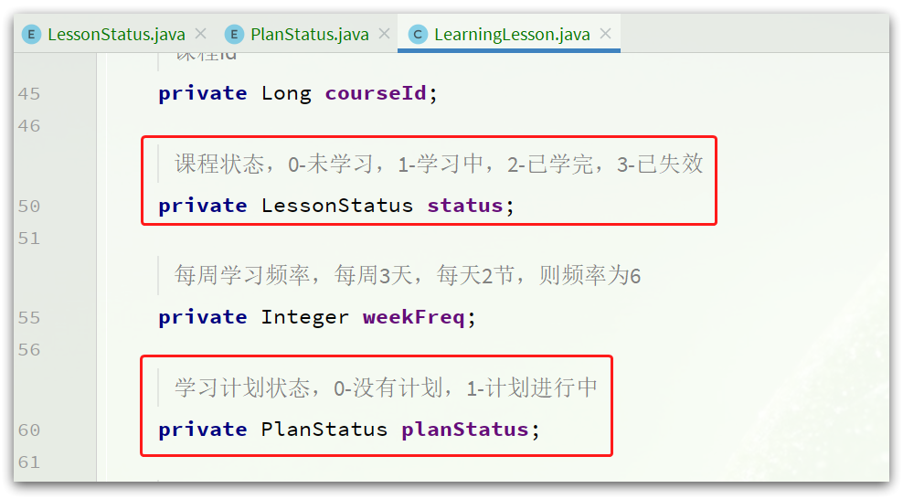

`MybatisPlus`会在我们与数据库交互时实现自动的数据类型转换，无需我们操心。

## 3.实现接口功能

由于时间有限，这里我们只带着大家实现2个接口：

- 添加课程到课表
- 分页查询我的课表

### 3.1.添加课程到课表

回顾一下接口信息：

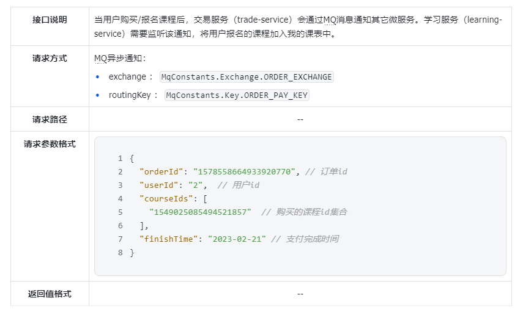

其中的`Exchange`、`RoutingKey`都已经在`tj-common`中的`MqConstants`内定义好了：

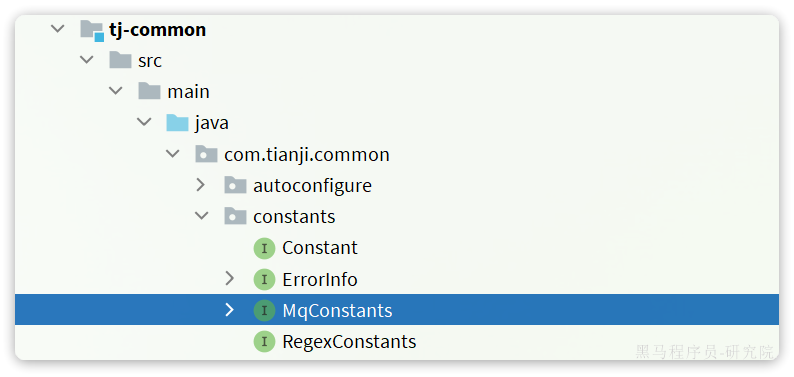

我们只需要定义消息监听器就可以了。

#### 3.1.1.定义消息监听器

我们在tj-learning服务中定义一个MQ的监听器：

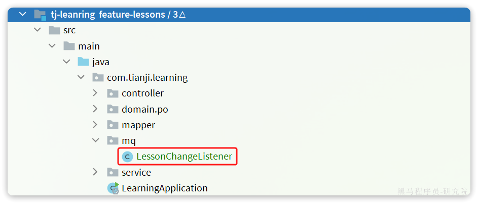

代码如下：

```java
package com.tianji.learning.mq;

import com.tianji.api.dto.trade.OrderBasicDTO;
import com.tianji.common.constants.MqConstants;
import com.tianji.common.utils.CollUtils;
import com.tianji.learning.service.ILearningLessonService;
import lombok.RequiredArgsConstructor;
import lombok.extern.slf4j.Slf4j;
import org.springframework.amqp.core.ExchangeTypes;
import org.springframework.amqp.rabbit.annotation.Exchange;
import org.springframework.amqp.rabbit.annotation.Queue;
import org.springframework.amqp.rabbit.annotation.QueueBinding;
import org.springframework.amqp.rabbit.annotation.RabbitListener;
import org.springframework.stereotype.Component;

@Slf4j
@Component
@RequiredArgsConstructor
public class LessonChangeListener {

    private final ILearningLessonService lessonService;

    /**
     * 监听订单支付或课程报名的消息
     * @param order 订单信息
     */
    @RabbitListener(bindings = @QueueBinding(
            value = @Queue(value = "learning.lesson.pay.queue", durable = "true"),
            exchange = @Exchange(name = MqConstants.Exchange.ORDER_EXCHANGE, type = ExchangeTypes.TOPIC),
            key = MqConstants.Key.ORDER_PAY_KEY
    ))
    public void listenLessonPay(OrderBasicDTO order){
        // 1.健壮性处理
        if(order == null || order.getUserId() == null || CollUtils.isEmpty(order.getCourseIds())){
            // 数据有误，无需处理
            log.error("接收到MQ消息有误，订单数据为空");
            return;
        }
        // 2.添加课程
        log.debug("监听到用户{}的订单{}，需要添加课程{}到课表中", order.getUserId(), order.getOrderId(), order.getCourseIds());
        lessonService.addUserLessons(order.getUserId(), order.getCourseIds());
    }
}
```

订单中与课表有关的字段就是userId、courseId，因此这里要传递的就是这两个参数。

注意，这里添加课程的核心逻辑是在`ILearningLessonService`中实现的，首先是接口声明：

```java
package com.tianji.learning.service;

import com.baomidou.mybatisplus.extension.service.IService;
import com.tianji.learning.domain.po.LearningLesson;

import java.util.List;

/**
 * <p>
 * 学生课程表 服务类
 * </p>
 */
public interface ILearningLessonService extends IService<LearningLesson> {
    void addUserLessons(Long userId, List<Long> courseIds);
}
```

然后是对应的实现类：

```java
@Service
public class LearningLessonServiceImpl extends ServiceImpl<LearningLessonMapper, LearningLesson> implements ILearningLessonService {

    @Override
    public void addUserLessons(Long userId, List<Long> courseIds) {
        // TODO 添加课程信息到用户课程表
    }
}
```

#### 3.1.2.添加课表的流程分析

接下来，我们来分析一下添加课表逻辑的业务流程。首先来对比一下请求参数和数据库字段：

参数：

- Long userId
- `List<Long> courseIds`

数据表：

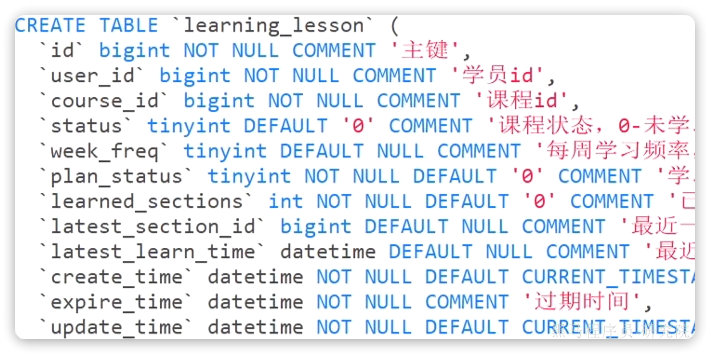

一个userId和一个courseId是learning_lesson表中的一条数据。而订单中一个用户可能购买多个课程。因此请求参数中的courseId集合就需要逐个处理，将来会有多条课表数据。

另外，可以发现参数中只有userId和courseId，表中的其它字段都需要我们想办法来组织：

- status：课程状态，可以默认为0，代表未学习
- week_freq：学习计划频率，可以为空，代表没有设置学习计划
- plan_status：学习计划状态，默认为0，代表没有设置学习计划
- learned_sections：已学习小节数，默认0，代表没有学习
- latest_section_id：最近学习小节id，可以为空，代表最近没有学习任何小节
- latest_learn_time：最近学习时间，可以为空，代表最近没有学习
- create_time：创建时间，也就是当前时间
- **expire_time**：过期时间，这个要结合课程来计算。每个课程都有自己的有效期（valid_duration），因此过期时间就是create_time加上课程的有效期
- update_time：更新时间，默认当前时间，有数据库实时更新，不用管

可见在整张表中，需要我们在新增时处理的字段就剩下过期时间`expire_time`了。而要知道这个就必须根据courseId查询课程的信息，找到其中的课程有效期（`valid_duration`）。课程表结构如图：

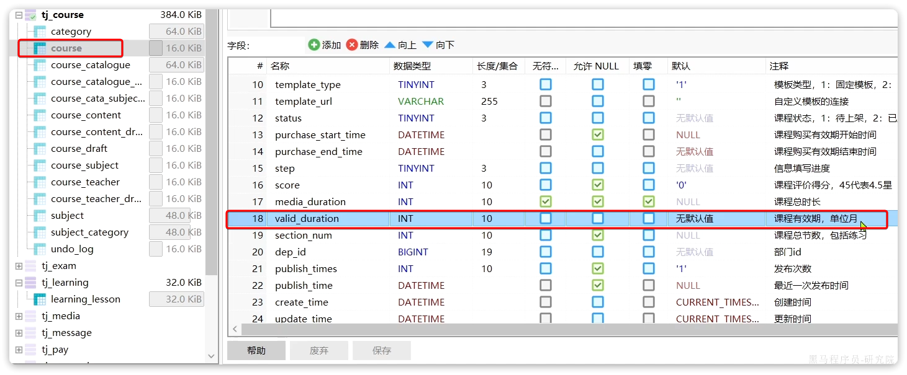

因此，我们要做的事情就是根据courseId集合查询课程信息，然后分别计算每个课程的有效期，组织多个LearingLesson的数据，形成集合。最终批量新增到数据库即可。

流程如图：

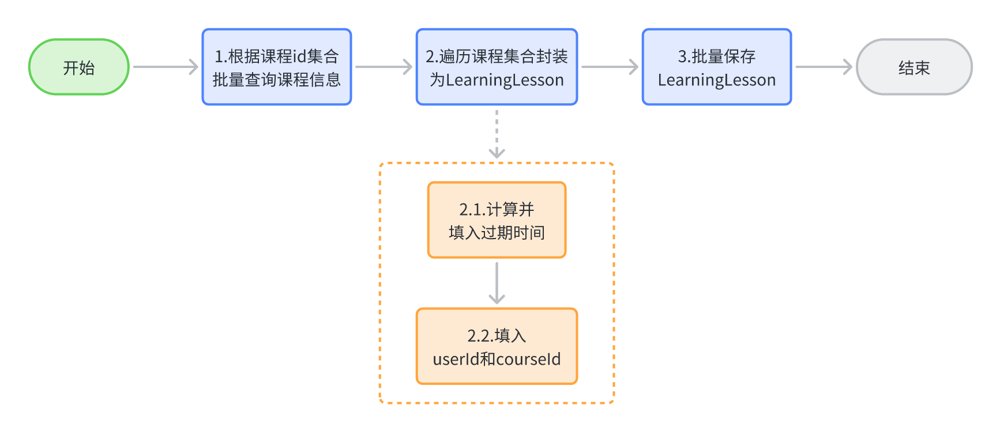

那么问题来了，我们该如何根据课程id查询课程信息呢？

#### 3.1.3.获取课程信息

课程（course）的信息是由课程服务（course-service）来维护的，目前已经开发完成并部署到了虚拟机的开发环境中。

我们现在需要查询课程信息，自然需要调用课程服务暴露的Feign接口。如果没有这样的接口，则需要联系维护该服务的同事，**协商**开发相关接口。

在咱们的项目中，课程微服务已经暴露了一些接口。我们有三种方式可以查看已经开放的接口：

- 与开发的同事**交流沟通**
- 通过网关中的Swagger**文档**来查看
- 直接查看课程服务的**源码**

首先，我们来看一下swagger文档：

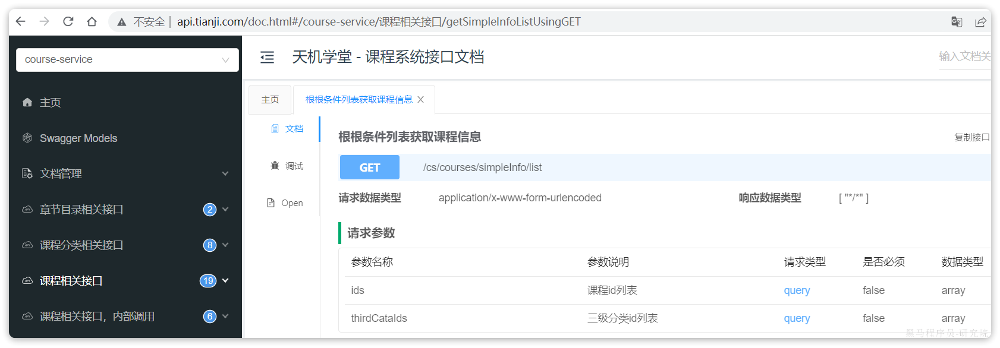

不过这种方式查看到的接口数量非常多，有很多是给前端用的。不一定有对应的Feign接口。

要查看Feign接口，需要到`tj-api`中查看：

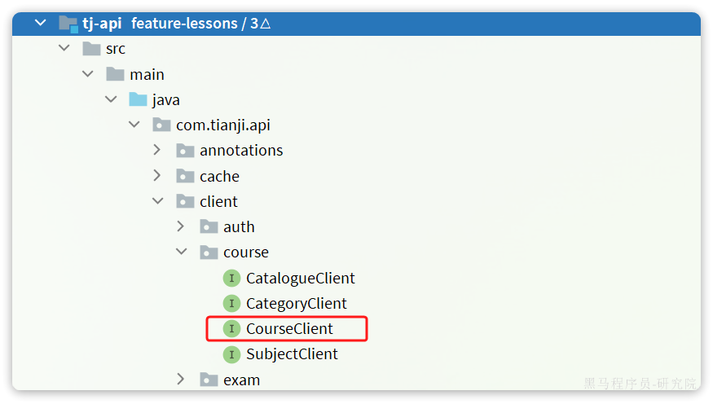

检索其中的API，可以发现一个这样的接口：

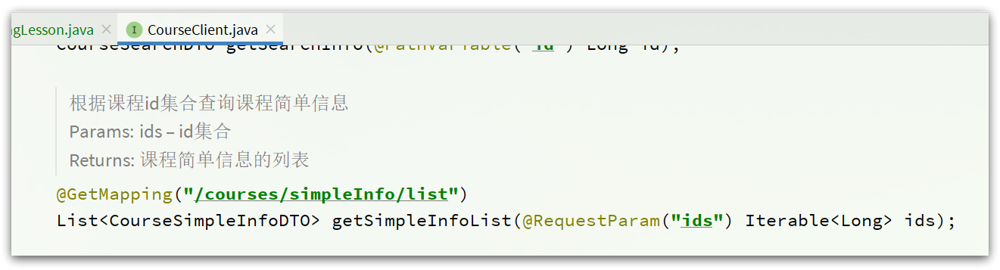

根据id批量查询课程的基本信息，而在课程基本信息（`CourseSimpleInfoDTO`）中，就有有效期信息：

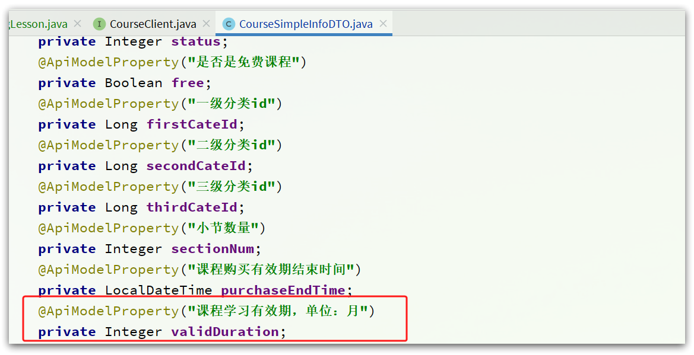

#### 3.1.4.实现添加课程到课表

现在，我们正式实现`LearningLessonServiceImpl`中的`addUserLessons`方法：

```java
package com.tianji.learning.service.impl;

// 略

@SuppressWarnings("ALL")
@Service
@RequiredArgsConstructor
@Slf4j
public class LearningLessonServiceImpl extends ServiceImpl<LearningLessonMapper, LearningLesson> implements ILearningLessonService {

    private final CourseClient courseClient;

    @Override
    @Transactional
    public void addUserLessons(Long userId, List<Long> courseIds) {
        // 1.查询课程有效期
        List<CourseSimpleInfoDTO> cInfoList = courseClient.getSimpleInfoList(courseIds);
        if (CollUtils.isEmpty(cInfoList)) {
            // 课程不存在，无法添加
            log.error("课程信息不存在，无法添加到课表");
            return;
        }
        // 2.循环遍历，处理LearningLesson数据
        List<LearningLesson> list = new ArrayList<>(cInfoList.size());
        for (CourseSimpleInfoDTO cInfo : cInfoList) {
            LearningLesson lesson = new LearningLesson();
            // 2.1.获取过期时间
            Integer validDuration = cInfo.getValidDuration();
            if (validDuration != null && validDuration > 0) {
                LocalDateTime now = LocalDateTime.now();
                lesson.setCreateTime(now);
                lesson.setExpireTime(now.plusMonths(validDuration));
            }
            // 2.2.填充userId和courseId
            lesson.setUserId(userId);
            lesson.setCourseId(cInfo.getId());
            list.add(lesson);
        }
        // 3.批量新增
        saveBatch(list);
    }
}
```

### 3.2.分页查询我的课表

首先回顾一下接口信息：


#### 3.2.1.实体

在实现接口的时候，往往需要先把接口的**请求参数**、**返回值**对应的实体类声明出来。

##### 3.2.1.1.Query实体

在这个接口中，请求参数是一个通用的分页参数，我们在`tj-common`已经声明了：

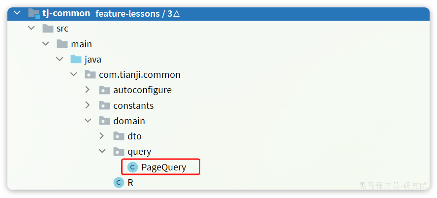

主要的四个字段如下：

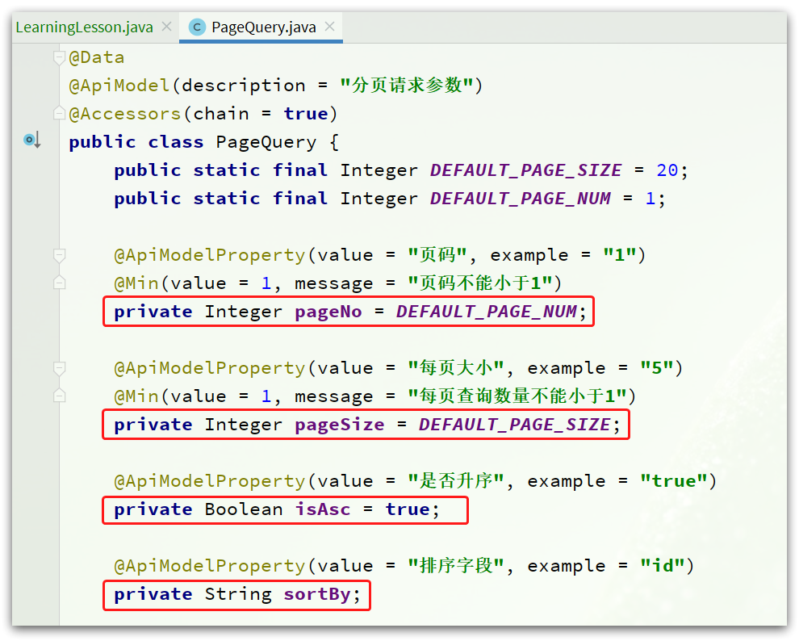

其中有几个方法，可以便捷的把PageQuery对象转换为MybatisPlus中的Page对象：

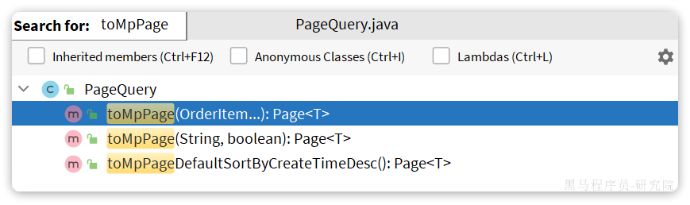

##### 3.2.1.2.DTO实体

返回值是一个分页结果，因为分页太常用了，所以我们在`tj-common`定义了一个通用的分页结果类：

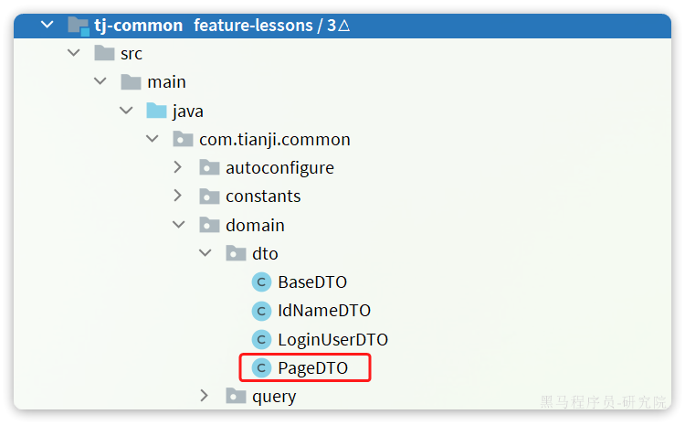

其中的核心代码如下：

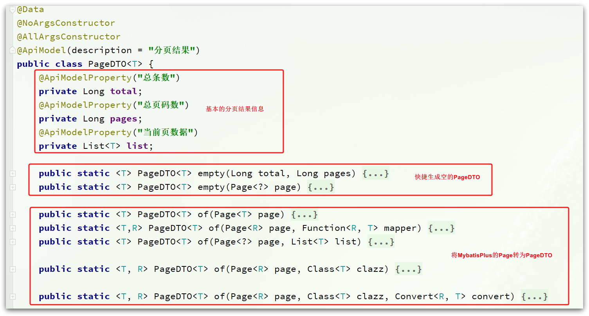

##### 3.2.1.3.VO实体

返回值的分页结果中有一个实体集合，也就是VO实体，我们在课前资料也提供好了：


将其复制到项目中：

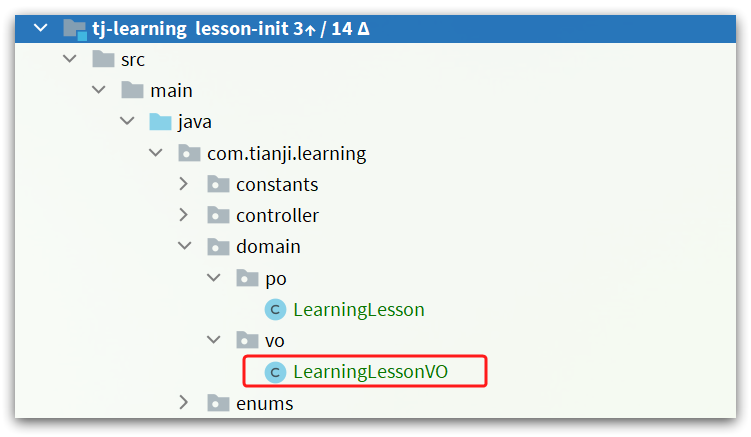

#### 3.2.2.接口声明

万事具备，接下来根据我们分析的接口来定义和实现接口。

首先是controller，`tj-learning`服务的`LearningLessonController`：

```java
@Api(tags = "我的课表相关接口")
@RestController
@RequestMapping("/lessons")
@RequiredArgsConstructor
public class LearningLessonController {
    
    private final ILearningLessonService lessonService;

    @ApiOperation("查询我的课表，排序字段 latest_learn_time:学习时间排序，create_time:购买时间排序")
    @GetMapping("/page")
    public PageDTO<LearningLessonVO> queryMyLessons(PageQuery query) {
        return lessonService.queryMyLessons(query);
    }
}
```

需要注意的是，这里添加了Swagger相关注解，标记接口信息。

然后是service的接口，`tj-learning`服务的`ILearningLessonService`：

```java
PageDTO<LearningLessonVO> queryMyLessons(PageQuery query);
```

最后是实现类，tj-learning服务的LearningLessonServiceImpl：

```java
@Override
public PageDTO<LearningLessonVO> queryMyLessons(PageQuery query) {
    // TODO 分页查询我的课表
    return null;
}
```

#### 3.2.3.获取登录用户

既然是分页查询我的课表，除了分页信息以外，我还必须知道当前登录的用户是谁。那么，该从哪里获取用户信息呢？

##### 3.2.3.1.实现思路

天机学堂是基于JWT实现登录的，登录信息就保存在请求头的token中。因此要获取当前登录用户，只要获取请求头，解析其中的token即可。

但是，每个微服务都可能需要登录用户信息，在每个微服务都做token解析就属于重复编码了。因此我们的把token解析的行为放到了网关中，然后**由****网关****把用户信息放入请求头，传递给下游**微服务。

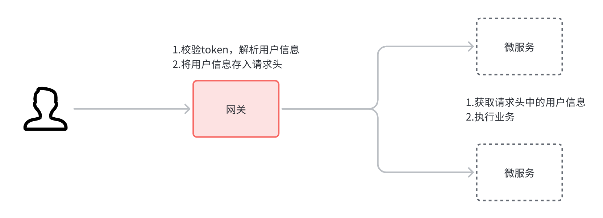

每个微服务要从请求头拿出用户信息，在业务中使用，也比较麻烦，所以我们定义了一个HandlerInterceptor，拦截进入微服务的请求，并获取用户信息，存入UserContext（底层基于ThreadLocal）。这样后续的业务处理时就能直接从UserContext中获取用户了：

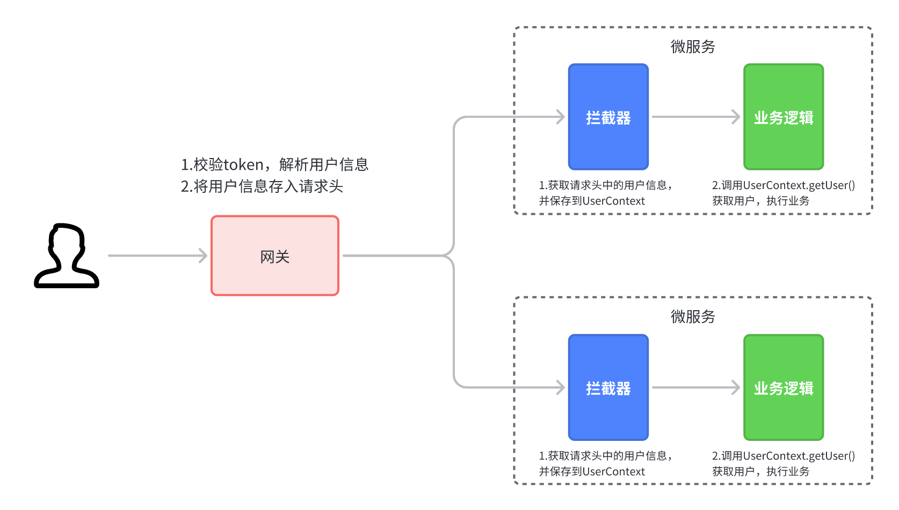

以上就是天机学堂中获取用户信息的基本实现思路。

##### 3.2.3.2.网关鉴权

接下来我们一起来看看具体实现的代码。

首先是网关登录校验、传递用户信息的逻辑，`tj-gateway`中的`AccountAuthFilter`：

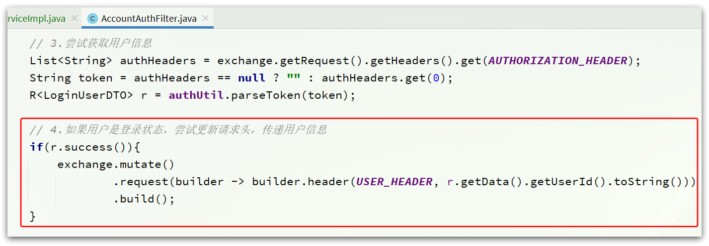

可以看到，网关将登录的**用户信息放入请求头**中传递到了下游的微服务。因此，我们只要在微服务中获取请求头，即可拿到登录的用户信息。

##### 3.2.3.3.用户信息上下文

然后是微服务中的获取请求头中的用户信息的拦截器。由于这个拦截器在每个微服务中都需要，与其重复编写，不如抽取到一个模块中。

所以在`tj-auth`模块中，有一个`tj-auth-resource-sdk`模块，已经把拦截器定义好了:

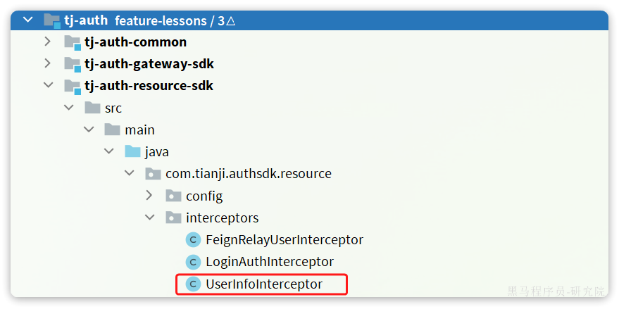

具体代码如下：

```java
@Slf4j
public class UserInfoInterceptor implements HandlerInterceptor {

    @Override
    public boolean preHandle(HttpServletRequest request, HttpServletResponse response, Object handler) throws Exception {
        // 1.尝试获取头信息中的用户信息
        String authorization = request.getHeader(JwtConstants.USER_HEADER);
        // 2.判断是否为空
        if (authorization == null) {
            return true;
        }
        // 3.转为用户id并保存到UserContext中
        try {
            Long userId = Long.valueOf(authorization);
            UserContext.setUser(userId);
            return true;
        } catch (NumberFormatException e) {
            log.error("用户身份信息格式不正确，{}, 原因：{}", authorization, e.getMessage());
            return true;
        }
    }

    @Override
    public void afterCompletion(HttpServletRequest request, HttpServletResponse response, Object handler, Exception ex) throws Exception {
        // 清理用户信息
        UserContext.removeUser();
    }
}
```

在这个拦截器中，获取到用户信息后保存到了`UserContext`中，这是一个基于`ThreadLocal`的工具，可以确保不同的请求之间互不干扰，避免线程安全问题发生：

```java
package com.tianji.common.utils;

public class UserContext {
    private static final ThreadLocal<Long> TL = new ThreadLocal<>();

    /**
     * 保存用户信息
     * @param userId 用户id
     */
    public static void setUser(Long userId){
        TL.set(userId);
    }

    /**
     * 获取用户
     * @return 用户id
     */
    public static Long getUser(){
        return TL.get();
    }

    /**
     * 移除用户信息
     */
    public static void removeUser(){
        TL.remove();
    }
}
```

梳理一下，登录信息传递的过程是这样的：

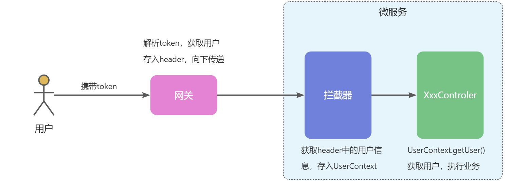

所以，以后在开发业务的时候，只需要在通过`UserContext`提供的`getUser()`方法就可以拿到用户`id`了。

#### 3.2.4.实现查询我的课表

修改之前的`tj-learning`中的`LearningLessonServiceImpl`的`queryMyLessons`方法：

```java
@Override
public PageDTO<LearningLessonVO> queryMyLessons(PageQuery query) {
    // 1.获取当前登录用户
    Long userId = UserContext.getUser();
    // 2.分页查询
    // select * from learning_lesson where user_id = #{userId} order by latest_learn_time limit 0, 5
    Page<LearningLesson> page = lambdaQuery()
            .eq(LearningLesson::getUserId, userId) // where user_id = #{userId}
            .page(query.toMpPage("latest_learn_time", false));
    List<LearningLesson> records = page.getRecords();
    if (CollUtils.isEmpty(records)) {
        return PageDTO.empty(page);
    }
    // 3.查询课程信息
    Map<Long, CourseSimpleInfoDTO> cMap = queryCourseSimpleInfoList(records);

    // 4.封装VO返回
    List<LearningLessonVO> list = new ArrayList<>(records.size());
    // 4.1.循环遍历，把LearningLesson转为VO
    for (LearningLesson r : records) {
        // 4.2.拷贝基础属性到vo
        LearningLessonVO vo = BeanUtils.copyBean(r, LearningLessonVO.class);
        // 4.3.获取课程信息，填充到vo
        CourseSimpleInfoDTO cInfo = cMap.get(r.getCourseId());
        vo.setCourseName(cInfo.getName());
        vo.setCourseCoverUrl(cInfo.getCoverUrl());
        vo.setSections(cInfo.getSectionNum());
        list.add(vo);
    }
    return PageDTO.of(page, list);
}

private Map<Long, CourseSimpleInfoDTO> queryCourseSimpleInfoList(List<LearningLesson> records) {
    // 3.1.获取课程id
    Set<Long> cIds = records.stream().map(LearningLesson::getCourseId).collect(Collectors.toSet());
    // 3.2.查询课程信息
    List<CourseSimpleInfoDTO> cInfoList = courseClient.getSimpleInfoList(cIds);
    if (CollUtils.isEmpty(cInfoList)) {
        // 课程不存在，无法添加
        throw new BadRequestException("课程信息不存在！");
    }
    // 3.3.把课程集合处理成Map，key是courseId，值是course本身
    Map<Long, CourseSimpleInfoDTO> cMap = cInfoList.stream()
            .collect(Collectors.toMap(CourseSimpleInfoDTO::getId, c -> c));
    return cMap;
}
```

### 3.3.查询正在学习的课程

首先回顾一下接口信息：

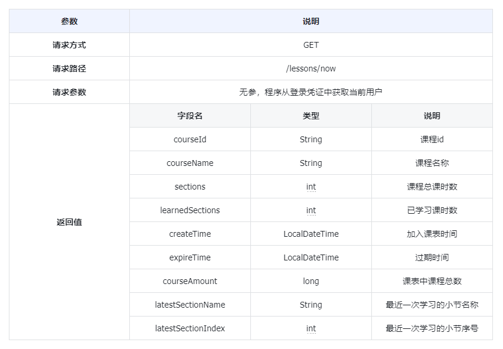

可以看到返回值结果与分页查询的课表VO基本类似，因此这里可以复用LearningLessonVO实体，但是需要添加几个字段：

- courseAmount
- latestSectionName
- latestSectionIndex

#### 3.3.1.查询章节信息

小节名称、序号信息都在课程微服务（course-service）中，因此可以通过课程微服务提供的接口来查询：

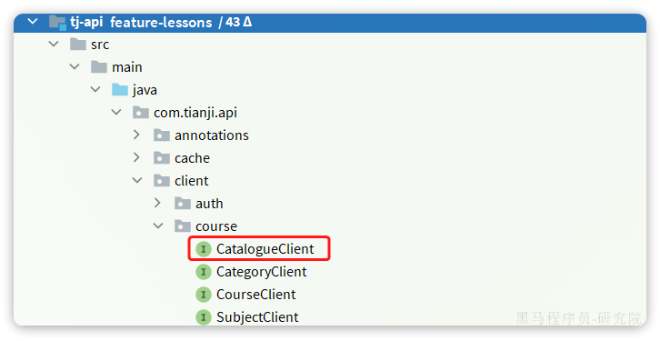

接口：

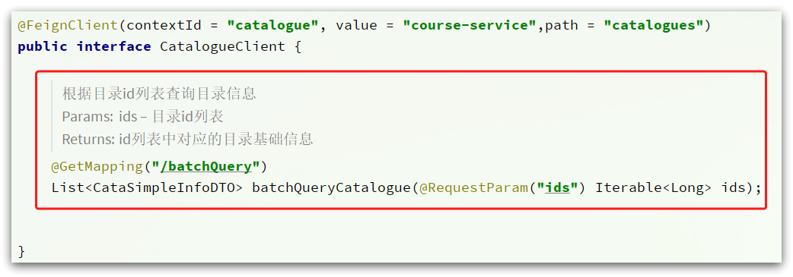

其中`CataSimpleInfoDTO`中就包含了章节信息：

```java
@Data
public class CataSimpleInfoDTO {
    @ApiModelProperty("目录id")
    private Long id;
    @ApiModelProperty("目录名称")
    private String name;
    @ApiModelProperty("数字序号，不包含章序号")
    private Integer cIndex;
}
```

#### 3.3.2.代码实现

首先是controller，`tj-learning`服务的`LearningLessonController`：

```java
@Api(tags = "我的课表相关接口")
@RestController
@RequestMapping("/lessons")
@RequiredArgsConstructor
public class LearningLessonController {
    
    private final ILearningLessonService lessonService;

    // 。。。略

    @GetMapping("/now")
    @ApiOperation("查询我正在学习的课程")
    public LearningLessonVO queryMyCurrentLesson() {
        return lessonService.queryMyCurrentLesson();
    }
}
```

需要注意的是，这里添加了Swagger相关注解，标记接口信息。

然后是service的接口，`tj-learning`服务的`ILearningLessonService`：

```java
LearningLessonVO queryMyCurrentLesson();
```

最后是实现类，`tj-learning`服务的`LearningLessonServiceImpl`：

```java
private final CatalogueClient catalogueClient;

@Override
public LearningLessonVO queryMyCurrentLesson() {
    // 1.获取当前登录的用户
    Long userId = UserContext.getUser();
    // 2.查询正在学习的课程 select * from xx where user_id = #{userId} AND status = 1 order by latest_learn_time limit 1
    LearningLesson lesson = lambdaQuery()
            .eq(LearningLesson::getUserId, userId)
            .eq(LearningLesson::getStatus, LessonStatus.LEARNING.getValue())
            .orderByDesc(LearningLesson::getLatestLearnTime)
            .last("limit 1")
            .one();
    if (lesson == null) {
        return null;
    }
    // 3.拷贝PO基础属性到VO
    LearningLessonVO vo = BeanUtils.copyBean(lesson, LearningLessonVO.class);
    // 4.查询课程信息
    CourseFullInfoDTO cInfo = courseClient.getCourseInfoById(lesson.getCourseId(), false, false);
    if (cInfo == null) {
        throw new BadRequestException("课程不存在");
    }
    vo.setCourseName(cInfo.getName());
    vo.setCourseCoverUrl(cInfo.getCoverUrl());
    vo.setSections(cInfo.getSectionNum());
    // 5.统计课表中的课程数量 select count(1) from xxx where user_id = #{userId}
    Integer courseAmount = lambdaQuery()
            .eq(LearningLesson::getUserId, userId)
            .count();
    vo.setCourseAmount(courseAmount);
    // 6.查询小节信息
    List<CataSimpleInfoDTO> cataInfos =
            catalogueClient.batchQueryCatalogue(CollUtils.singletonList(lesson.getLatestSectionId()));
    if (!CollUtils.isEmpty(cataInfos)) {
        CataSimpleInfoDTO cataInfo = cataInfos.get(0);
        vo.setLatestSectionName(cataInfo.getName());
        vo.setLatestSectionIndex(cataInfo.getCIndex());
    }
    return vo;
}
```

## 4.练习

### 4.1.删除课表中课程（练习）

#### 4.4.1.业务分析

删除课表中的课程有两种场景：

- 用户直接删除已失效的课程
- 用户退款后触发课表自动删除

##### 4.4.1.1.退款通知

其中用户退款与用户报名课程类似，都是基于MQ通知的方式。具体代码是在`tj-trade`模块的`RefundApplySerivceImpl`类的`handleRefundResult`方法中：

```java
@Override
@Transactional
public void handleRefundResult(RefundResultDTO result) {
    // 1.查询退款申请记录
    RefundApply refundApply = getById(result.getBizRefundOrderId());
    if (refundApply == null) {
        return;
    }
    UserContext.setUser(refundApply.getApprover());
    // 2.判断结果，支付宝支付有可能直接返回退款成功结果，微信只会返回退款中
    RefundApply r = new RefundApply();
    r.setId(refundApply.getId());
    r.setRefundChannel(result.getRefundChannel());
    r.setRefundOrderNo(result.getRefundOrderNo());
    // 2.1.判断状态是否退款中
    int status = result.getStatus();
    if(status == RefundResultDTO.RUNNING){
        // 退款中，结果未知，将其它数据写入数据库即可
        updateById(r);
        return;
    }

    // 2.2.判断退款成功还是失败
    if(status == RefundResultDTO.SUCCESS){
        // 退款成功，记录状态
        r.setStatus(RefundStatus.SUCCESS.getValue());
        r.setMessage(RefundStatus.SUCCESS.getProgressName());
    }else {
        // 2.3.退款失败，需要记录状态及退款失败原因
        r.setStatus(RefundStatus.FAILED.getValue());
        r.setMessage(RefundStatus.FAILED.getProgressName());
        r.setFailedReason(result.getMsg());
    }

    // 2.4.更新数据库
    r.setFinishTime(LocalDateTime.now());
    updateById(r);

    // 3.更新子订单状态
    detailService.updateRefundStatusById(refundApply.getOrderDetailId(), r.getStatus());

    // 4.如果是退款成功，要取消用户报名的课程
    if (status == RefundResultDTO.SUCCESS) {
        // 4.1.查询子订单信息
        OrderDetail detail = detailService.getById(refundApply.getOrderDetailId());
        // 4.2.发送MQ消息，通知报名成功
        rabbitMqHelper.send(
                MqConstants.Exchange.ORDER_EXCHANGE,
                MqConstants.Key.ORDER_REFUND_KEY,
                OrderBasicDTO.builder()
                        .orderId(refundApply.getOrderId())
                        .userId(refundApply.getUserId())
                        .courseIds(CollUtils.singletonList(detail.getCourseId())).build());
    }
}
```

发送通知的核心代码如下：

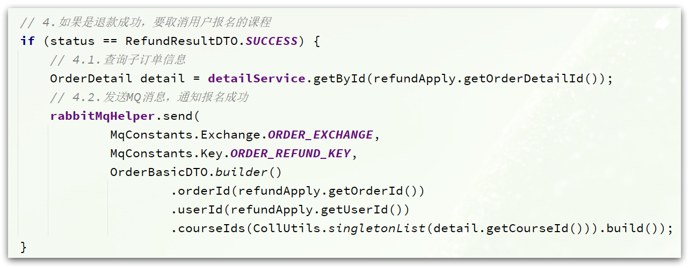

与报名成功的通知类似，一样是OrderBasicDTO，参数信息包含三个：

- orderId：退款的订单id
- userId：用户id
- courseIds：退款的课程id

请参考报名课程通知的处理逻辑来编写退款通知处理的功能。

##### 4.4.1.2.用户删除课程

用户可以直接删除《已失效》的课程：

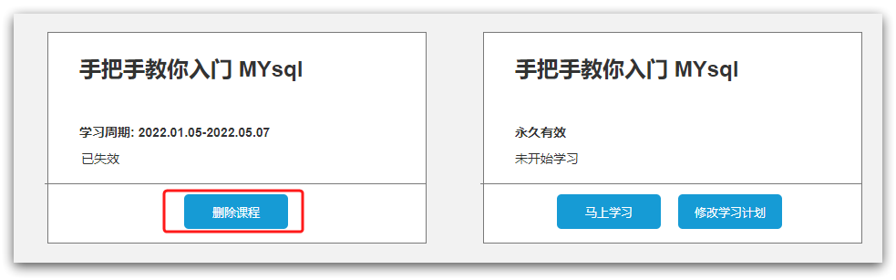

这里我们可以按照Restful的规范来定义这个删除接口：

- 请求方式：删除业务的请求方式都是DELETE
- 请求路径：一般是资源名 + 标示，这里删除的是课表中的课程，因此：`/ls/lessons/{courseId}`
- 请求参数：自然是路径中传递的课程id
- 返回值：无

同学们可以尝试自己定义接口信息，实现接口功能

#### 4.4.2.接口信息

同学们自行设计

### 4.5.检查课程是否有效（练习-必做）

这是一个微服务内部接口，当用户学习课程时，可能需要播放课程视频。此时提供视频播放功能的媒资系统就需要校验`用户是否有播放视频的资格`。所以，开发媒资服务（`tj-media`）的同事就请你提供这样一个接口。

#### 4.5.1.业务分析

用户要想有播放视频的资格，那就必须满足两个条件：

- 用户课表中是否有该课程
- 课程状态是否是有效的状态（未过期）

所以这个接口很简单，就是查询用户课表，做一个非空和状态的判断即可。

#### 4.5.2.接口信息

接口信息如下：

| **接口说明**     | 根据课程id，检查当前用户的课表中是否有该课程，课程状态是否有效。 |
| ---------------- | ------------------------------------------------------------ |
| **请求方式**     | Http请求，GET                                                |
| **请求路径**     | /ls/lessons/{courseId}/valid                                 |
| **请求参数格式** | 课程id，请求路径占位符，参数名：courseId                     |
| **返回值格式**   | 课表lessonId，如果是报名了则返回lessonId，否则返回空         |

具体参考`tj-api`模块下的`com.tianji.api.client.learning.LearningClient`接口：

```java
/**
 * 校验当前用户是否可以学习当前课程
 * @param courseId 课程id
 * @return lessonId，如果是报名了则返回lessonId，否则返回空
 */
@GetMapping("/lessons/{courseId}/valid")
Long isLessonValid(@PathVariable("courseId") Long courseId);
```

### 4.6.查询用户课表中指定课程状态（练习）

#### 4.6.1.业务分析

在课程详情页，课程展示有两种不同形式：

- 对于已经购买的课程：展示为马上学习，并且显示学习的进度、有效期
  - 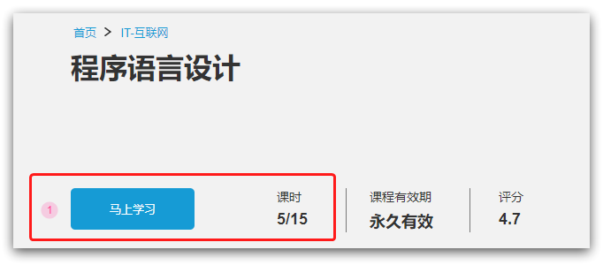
- 对于未购买的课程：展示为立刻购买或加入购物车
  - 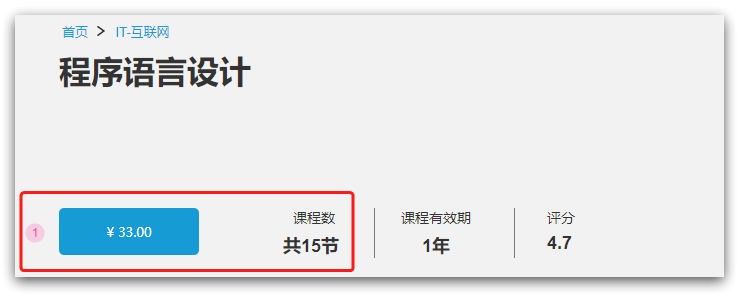

因此，进入详情页以后，前端需要查询用户的课表中是否有该课程，如果有该课程则需要返回课程的学习进度、课程有效期等信息。

#### 4.6.2.接口信息

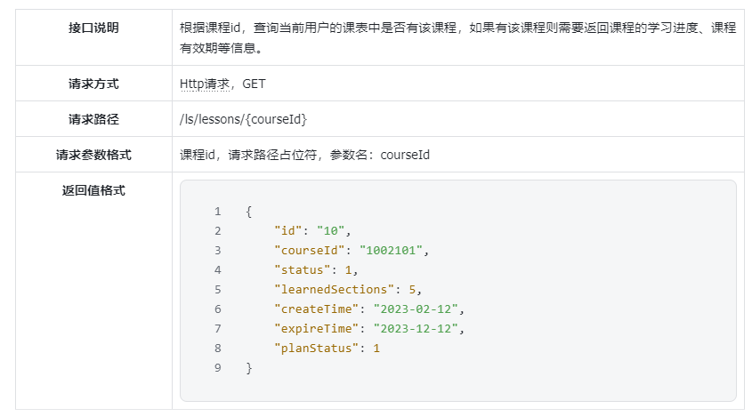

### 4.7.统计课程的学习人数（练习）

课程微服务中需要统计每个课程的报名人数，同样是一个内部调用接口，在tj-api模块中已经定义好了：

```java
/**
 * 统计课程学习人数
 * @param courseId 课程id
 * @return 学习人数
 */
@GetMapping("/lessons/{courseId}/count")
Integer countLearningLessonByCourse(@PathVariable("courseId") Long courseId);
```
