# day03-学习计划和进度

经过前面的努力，我们已经完成了《我的课程表》相关的功能的基础部分，不过还有功能实现的并不完善。还记得昨天给大家的练习题吗？《查询我正在学习的课程》，在原型图中有这样的一个需求： 

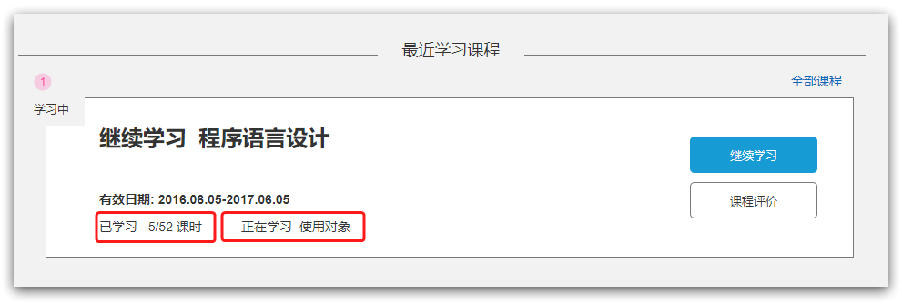

我们需要在查询结果中返回已学习课时数、正在学习的章节名称。虽然我们在learning_lesson表中设计了两个字段：

- learned_sections：已学习章节数
- latest_learn_time：最近学习时间

但是，这几个字段默认都是空或0，我们该如何得知用户到底学习了几节？最近一次学习是什么时候？最近一次学习的是第几章节呢？

以上的问题归纳下来，就是一个**学习进度统计**问题，这在在线教育、视频播放领域是一个非常常见的问题。因此，学会了解决这套解决方案，你就能游刃有余的应对相关行业的类似问题了。

大家在学习这套解决方案的同时，也可以增强下面的能力：

- 需求分析和表设计能力
- 复杂SQL的编写能力
- 处理高并发写数据库的能力

# 1.分析产品原型

大部分人的学习自律性是比较差的，属于“买了就算会了”的状态。如果学员学习积极性下降，学习结果也会不尽人意，从而产生挫败感。导致购买课程的欲望也会随之下降，形成恶性循环，不利于我们卖课。

所以，我们推出学习计划的功能，让学员制定一套学习计划，每周要学几节课。系统会做数据统计，每一周计划是否达标，达标后给予奖励，未达标则提醒用户，达到督促用户持续学习的目的。

用户学习效果好了，产生了好的结果，就会有继续学习、购买课程的欲望，形成良性循环。

因此，学习计划、学习进度统计其实是学习辅助中必不可少的环节。

## 1.1.分析业务流程

我们从两个业务点来分析：

- 学习计划
- 学习进度统计

### 1.1.1.学习计划

在我的课程页面，可以对有效的课程添加学习计划：

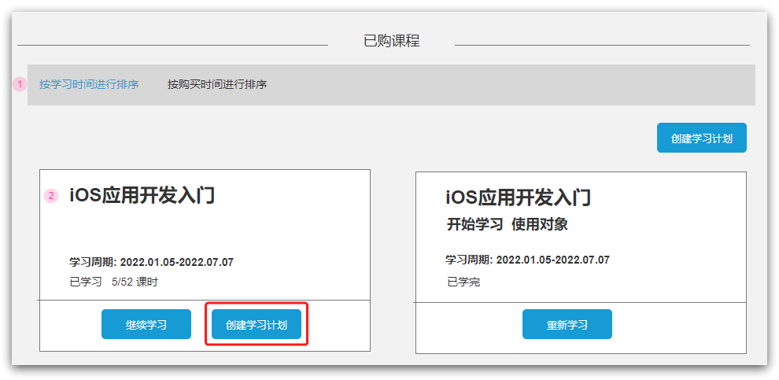

学习计划就是简单设置一下用户每周计划学习几节课：

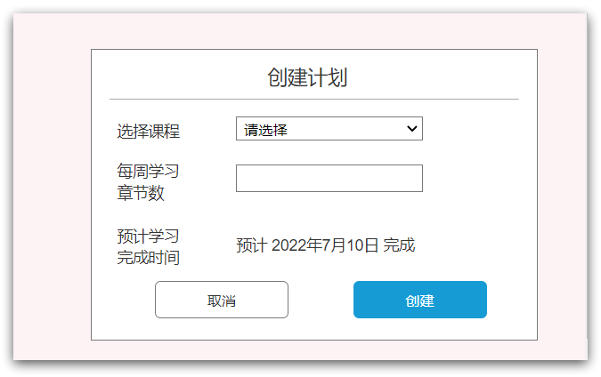

这个在昨天的数据库设计中已经有对应的字段了，只不过功能尚未完成。

有了计划以后，我们就可以在我的课程页面展示用户计划的完成情况，提醒用户尽快学习：


可以看到，在学习计划中是需要统计用户“已经学习的课时数量”的。那么我们该如何统计用户学了多少课时呢？

### 1.1.2.学习进度统计

要统计学习进度，需要先弄清楚用户学习的方式，学习的内容。在原型图《课程学习页-录播课-课程学习页-目录》中，可以看到学习课程的原型图：

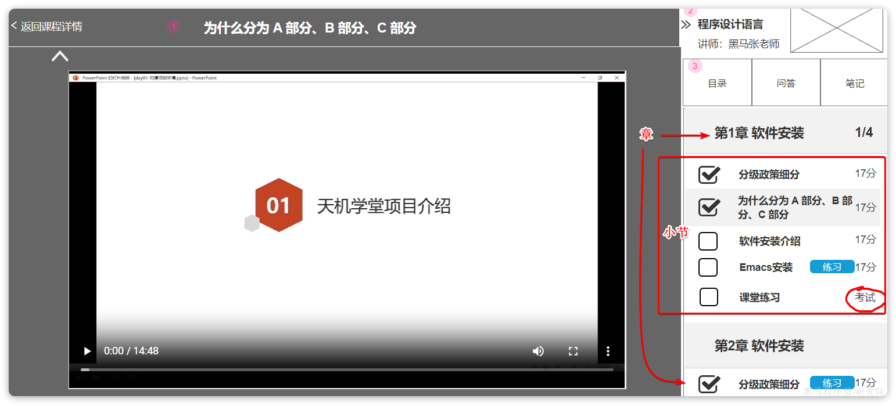

一个课程往往包含很多个**章（chapter）**，每一章下又包含了很多**小节（section）**。章本身没有课程内容，只是划分课程的一个概念，因此统计学习进度就是看用户学了多少个小节。

小节也分两种，一种是**视频**；一种是每章最后的阶段**考试**。用户学完一个视频，或者参加了最终的考试都算学完了一个小节。

考试只要提交了就算学完了，比较容易判断是否学完。但是视频该如何统计呢？达到什么样的标准才算这一小节的视频学完了呢？

这里我们不能要求用户一定要播放进度到100%，太苛刻了。所以，天机学堂的产品是这样设计的：

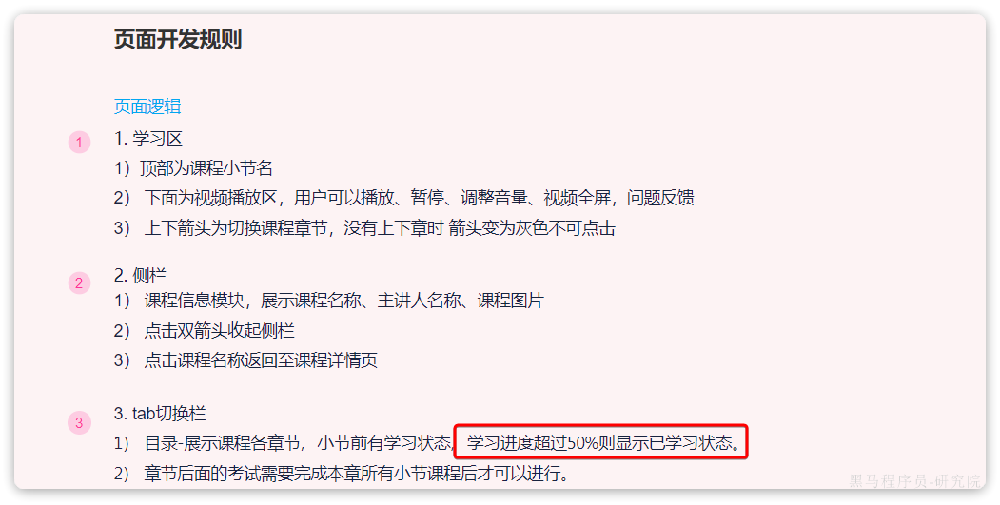

因此，只要视频播放进度达到**50%**就算是完成本节学习了。所以用户在播放视频的过程中，需要不断提交视频的播放进度，当我们发现视频进度超过50%时就可以标记这一小节为**已学完**。

当然，我们不能仅仅记录视频是否学完，还应该记录用户具体播放的进度到了**第几秒**。只有这样在用户关闭视频，再次播放时我们才能实现视频自动续播功能，用户体验会比较好。

也就是说，要记录用户学习进度，需要记录下列核心信息：

- 小节的基础信息（id、关联的课程id等）
- 当前的播放进度（第几秒）
- 当前小节是否已学完（播放进度是否超50%）

用户每学习一个小节，就会新增一条学习记录，当该课程的全部小节学习完毕，则该课程就从**学习中**进入**已学完**状态了。整体流程如图：

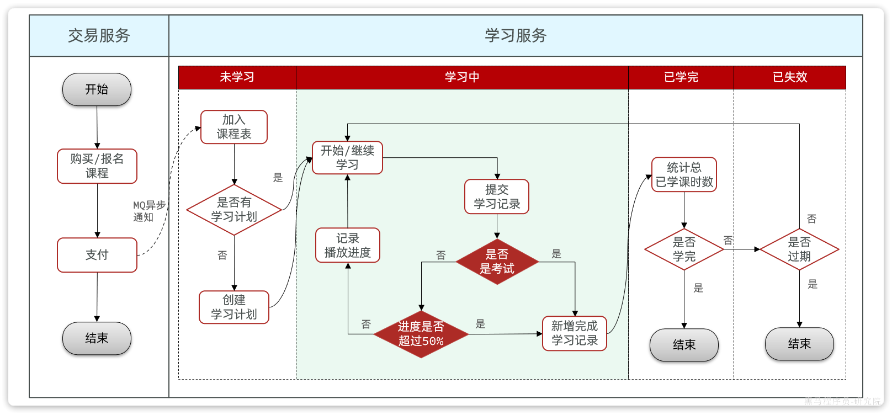

## 1.2.业务接口统计

接下来我们分析一下这部分功能相关的接口有哪些，按照用户的学习顺序，依次有下面几个接口：

- 创建学习计划
- 查询学习记录
- 提交学习记录
- 查询我的计划

### 1.2.1.创建学习计划

在个人中心的我的课表列表中，没有学习计划的课程都会有一个**创建学习计划**的按钮，在原型图就能看到：


创建学习计划，本质就是让用户设定自己每周的学习频率：

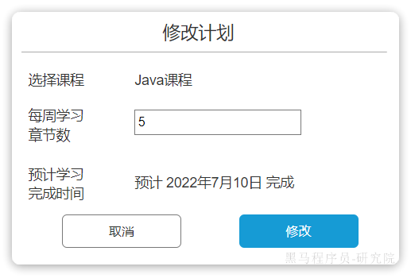

而学习频率我们在设计learning_lesson表的时候已经有两个字段来表示了：

```sql
CREATE TABLE `learning_lesson`  (
  `id` bigint NOT NULL COMMENT '主键',
  `user_id` bigint NOT NULL COMMENT '学员id',
  `course_id` bigint NOT NULL COMMENT '课程id',
  `status` tinyint NULL DEFAULT 0 COMMENT '课程状态，0-未学习，1-学习中，2-已学完，3-已失效',
  `week_freq` tinyint NULL DEFAULT NULL COMMENT '每周学习频率，每周3天，每天2节，则频率为6',
  `plan_status` tinyint NOT NULL DEFAULT 0 COMMENT '学习计划状态，0-没有计划，1-计划进行中',
  `learned_sections` int NOT NULL DEFAULT 0 COMMENT '已学习小节数量',
  `latest_section_id` bigint NULL DEFAULT NULL COMMENT '最近一次学习的小节id',
  `latest_learn_time` datetime NULL DEFAULT NULL COMMENT '最近一次学习的时间',
  `create_time` datetime NOT NULL DEFAULT CURRENT_TIMESTAMP COMMENT '创建时间',
  `expire_time` datetime NOT NULL COMMENT '过期时间',
  `update_time` datetime NOT NULL DEFAULT CURRENT_TIMESTAMP ON UPDATE CURRENT_TIMESTAMP COMMENT '更新时间',
  PRIMARY KEY (`id`) USING BTREE,
  UNIQUE INDEX `idx_user_id`(`user_id`, `course_id`) USING BTREE
) ENGINE = InnoDB CHARACTER SET = utf8mb4 COLLATE = utf8mb4_0900_ai_ci COMMENT = '学生课程表' ROW_FORMAT = Dynamic;
```

当我们创建学习计划时，就是更新`learning_lesson`表，写入`week_freq`并更新`plan_status`为计划进行中即可。因此请求参数就是课程的id、每周学习频率。

再按照Restful风格，最终接口如下：

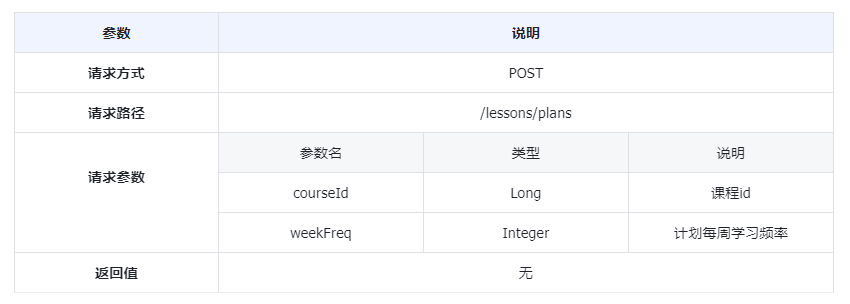

### 1.2.2.查询学习记录

用户创建完计划自然要开始学习课程，在用户学习视频的页面，首先要展示课程的一些基础信息。例如课程信息、章节目录以及每个小节的学习进度：

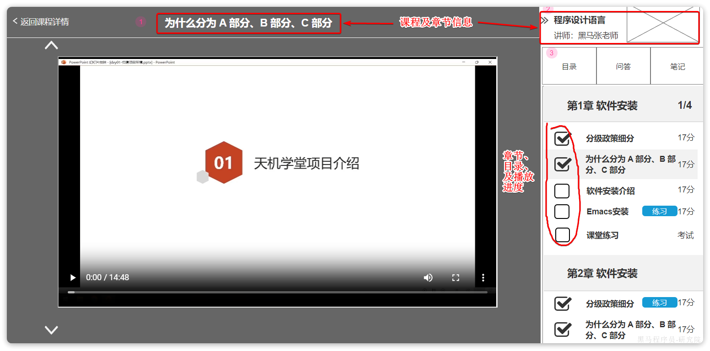

其中，课程、章节、目录信息等数据都在课程微服务，而学习进度肯定是在学习微服务。**课程信息是必备的，而学习进度却不一定存在**。

因此，查询这个接口的请求肯定是请求到课程微服务，查询课程、章节信息，再由课程微服务向学习微服务查询学习进度，合并后一起返回给前端即可。

所以，学习中心要提供一个查询章节学习进度的Feign接口，事实上这个接口已经在tj-api模块的LearningClient中定义好了：

```java
/**
 * 查询当前用户指定课程的学习进度
 * @param courseId 课程id
 * @return 课表信息、学习记录及进度信息
 */
@GetMapping("/learning-records/course/{courseId}")
LearningLessonDTO queryLearningRecordByCourse(@PathVariable("courseId") Long courseId);
```

对应的DTO也都在tj-api模块定义好了，因此整个接口规范如下：

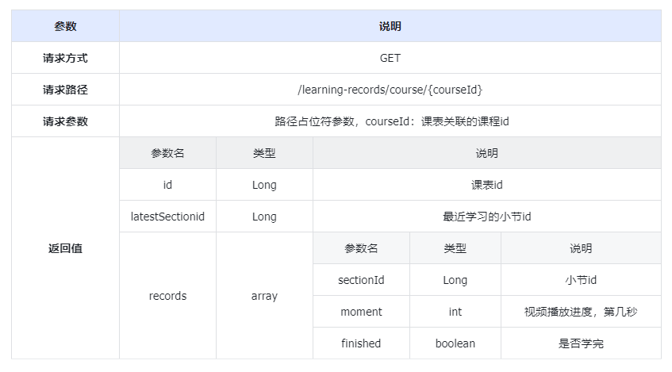

### 1.2.3.提交学习记录

之前分析业务流程的时候已经聊过，学习记录就是用户当前学了哪些小节，以及学习到该小节的进度如何。而小节类型分为考试、视频两种。

- 考试比较简单，只要提交了就说明这一节学完了。
- 视频比较麻烦，需要记录用户的播放进度，进度超过50%才算学完。因此视频播放的过程中需要不断提交播放进度到服务端，而服务端则需要保存学习记录到数据库。

只要记录了用户学过的每一个小节，以及小节对应的学习进度、是否学完。无论是**视频续播**、还是**统计学习计划进度**，都可以轻松实现了。

因此，提交学习记录就是提交小节的信息和小节的学习进度信息。考试提交一次即可，视频则是播放中频繁提交。提交的信息包括两大部分：

- 小节的基本信息
  - 小节id
  - lessonId
  - 小节类型：可能是视频，也可能是考试。考试无需提供播放进度信息
  - 提交时间
- 播放进度信息
  - 视频时长：时长结合播放进度可以判断有没有超过50%
  - 视频播放进度：也就是第几秒

综上，提交学习记录的接口信息如下：

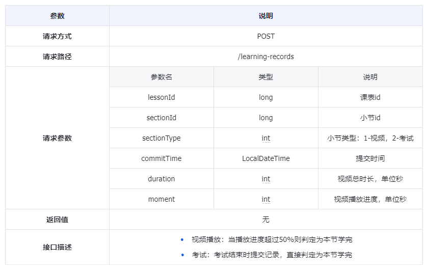

### 1.2.4.查询我的学习计划

在个人中心的我的课程页面，会展示用户的学习计划及**本周**的学习进度，原型如图：


需要注意的是这个查询其实是一个分页查询，因为页面最多展示10行，而学员同时在学的课程可能会超过10个，这个时候就会分页展示，当然这个分页可能是滚动分页，所以没有进度条。另外，查询的是**我的**学习计划，隐含的查询条件就是当前登录用户，这个无需传递，通过请求头即可获得。

因此查询参数只需要**分页**参数即可。

查询结果中有很多对于已经学习的小节数量的统计，因此将来我们一定要保存用户对于每一个课程的**学习记录**，哪些小节已经学习了，哪些已经学完了。只有这样才能统计出学习进度。

查询的结果如页面所示，分上下两部分。：

总的统计信息：

- 本周已完成总章节数：需要对学习记录做统计
- 课程总计划学习数量：累加课程的总计划学习频率即可
- 本周学习积分：积分暂不实现

正在学习的N个课程信息的集合，其中每个课程包含下列字段：

- 该课程本周学了几节：统计学习记录
- 计划学习频率：在learning_lesson表中有对应字段
- 该课程总共学了几节：在learning_lesson表中有对应字段
- 课程总章节数：查询课程微服务
- 该课程最近一次学习时间：在learning_lesson表中有对应字段

综上，查询学习计划进度的接口信息如下：

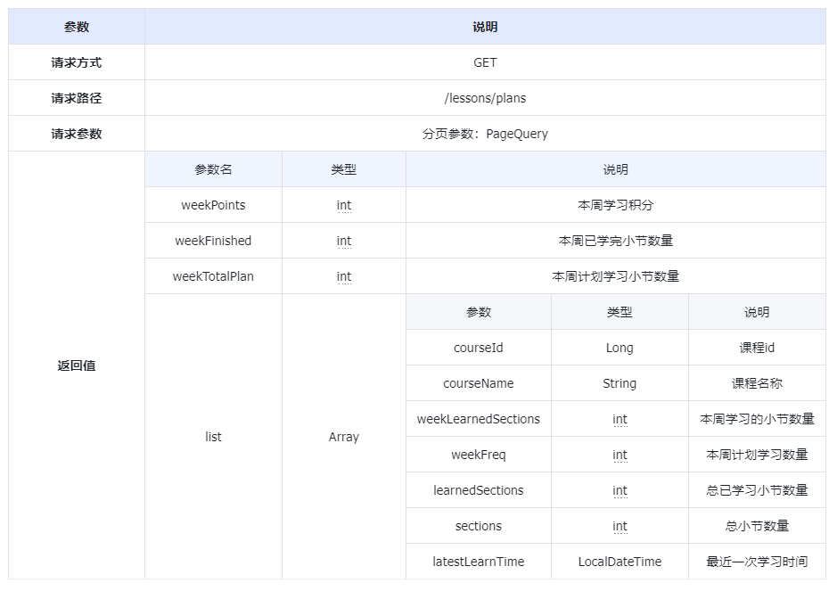

## 1.3.设计数据库

数据表的设计要满足学习计划、学习进度的功能需求。学习计划信息在`learning_lesson`表中已经设计，因此我们关键是设计学习进度记录表即可。

按照之前的分析，用户学习的课程包含多个小节，小节的类型包含两种：

- 视频：视频播放进度超过50%就算当节学完
- 考试：考完就算一节学完

学习进度除了要记录哪些小节学完，还要记录学过的小节、每小节的播放的进度（方便续播）。因此，需要记录的数据就包含以下部分：

- 学过的小节的基础信息
  - 小节id
  - 小节对应的lessonId
  - 用户id：学习课程的人
- 小节的播放进度信息
  - 视频播放进度：也就是播放到了第几秒
  - 是否已经学完：播放进度有没有超过50%
  - 第一次学完的时间：用户可能重复学习，第一次从未学完到学完的时间要记录下来

再加上一些表基础字段，整张表结构就出来了：

```sql
CREATE TABLE IF NOT EXISTS `learning_record` (
  `id` bigint NOT NULL COMMENT '学习记录的id',
  `lesson_id` bigint NOT NULL COMMENT '对应课表的id',
  `section_id` bigint NOT NULL COMMENT '对应小节的id',
  `user_id` bigint NOT NULL COMMENT '用户id',
  `moment` int DEFAULT '0' COMMENT '视频的当前观看时间点，单位秒',
  `finished` bit(1) NOT NULL DEFAULT b'0' COMMENT '是否完成学习，默认false',
  `create_time` datetime NOT NULL DEFAULT CURRENT_TIMESTAMP COMMENT '第一次观看时间',
  `update_time` datetime NOT NULL DEFAULT CURRENT_TIMESTAMP ON UPDATE CURRENT_TIMESTAMP COMMENT '更新时间（最近一次观看时间）',
  PRIMARY KEY (`id`) USING BTREE,
  KEY `idx_update_time` (`update_time`) USING BTREE,
  KEY `idx_user_id` (`user_id`) USING BTREE,
  KEY `idx_lesson_id` (`lesson_id`,`section_id`) USING BTREE
) ENGINE=InnoDB DEFAULT CHARSET=utf8mb4 COLLATE=utf8mb4_0900_ai_ci ROW_FORMAT=DYNAMIC COMMENT='学习记录表';
```

课前资料也提供了对应的SQL语句：

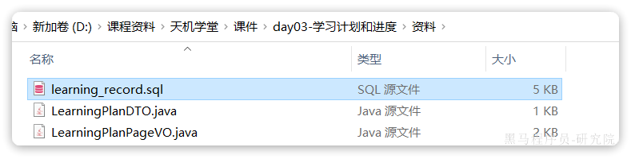

## 1.4.生成基础代码

接下来我们就可以生成数据库实体对应的基础代码了。

### 1.4.1.创建新分支

动手之前，不要忘了开发新功能需要创建新的分支。这里我们依然在`DEV`分支基础上，创建一个新的`feature`类型分支：`feature-learning-records`

我们可以选择用命令:

```shell
git checkout -b feature-learning-records
```

也可以选择图形界面方式：

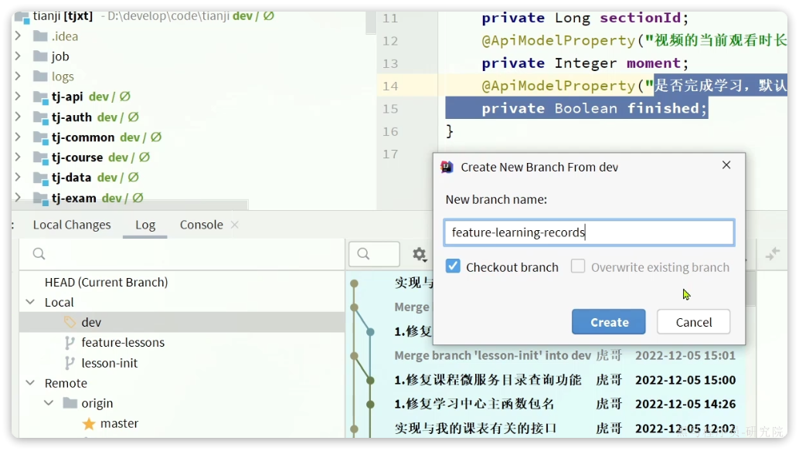

### 1.4.2.代码生成

同样是使用MybatisPlus插件，这里不再赘述。效果如下：

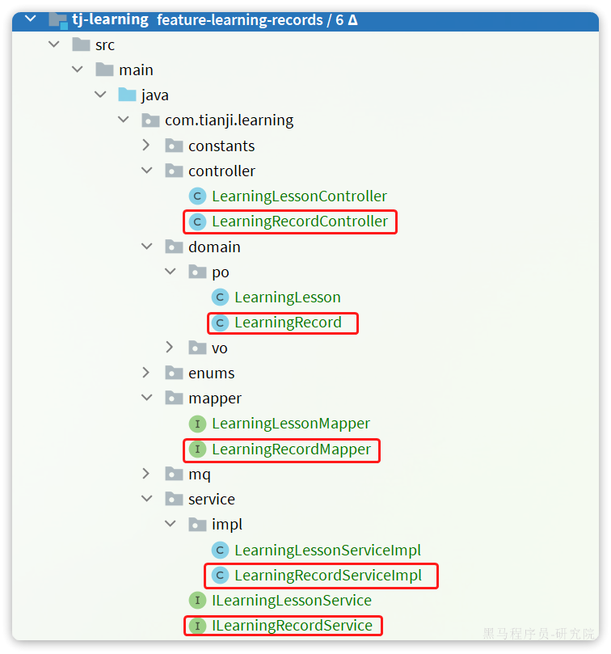

需要注意的是，我们同样需要把生成的实体类的ID策略改成雪花算法：

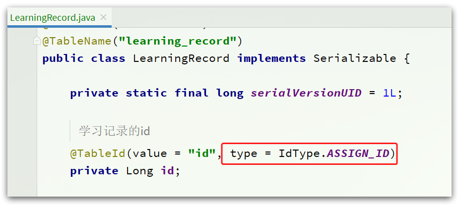

另外，按照Restful风格， 把controller的路径做修改：

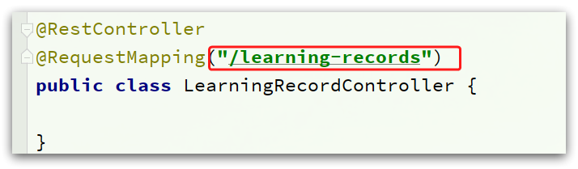

### 1.4.3.类型枚举

在昨天学习的课表中，有一种状态枚举，就是把课程的状态通过枚举定义出来，避免出现错误。而在学习记录中，有一个section_type字段，代表记录的小节有两种类型：

- 1，视频类型
- 2，考试类型

为了方便我们也定义为枚举，称为类型枚举：

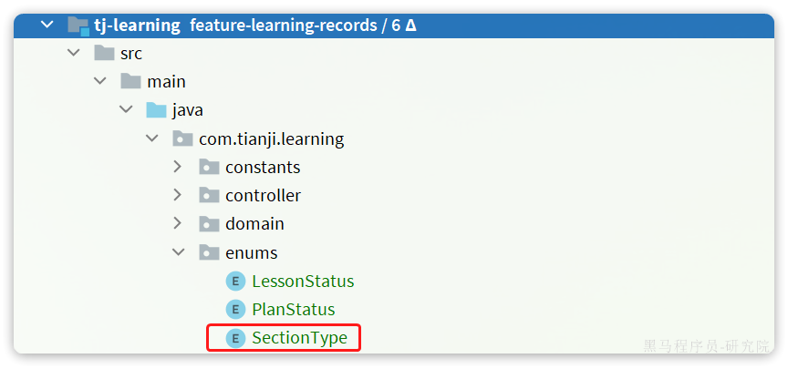

具体代码：

```java
package com.tianji.learning.enums;

import com.baomidou.mybatisplus.annotation.EnumValue;
import com.fasterxml.jackson.annotation.JsonCreator;
import com.fasterxml.jackson.annotation.JsonValue;
import com.tianji.common.enums.BaseEnum;
import lombok.Getter;

@Getter
public enum SectionType implements BaseEnum {
    VIDEO(1, "视频"),
    EXAM(2, "考试"),
    ;
    @JsonValue
    @EnumValue
    int value;
    String desc;

    SectionType(int value, String desc) {
        this.value = value;
        this.desc = desc;
    }


    @JsonCreator(mode = JsonCreator.Mode.DELEGATING)
    public static SectionType of(Integer value){
        if (value == null) {
            return null;
        }
        for (SectionType status : values()) {
            if (status.equalsValue(value)) {
                return status;
            }
        }
        return null;
    }
}
```

# 2.实现接口

## 2.1.查询学习记录

首先回顾一下接口基本信息：

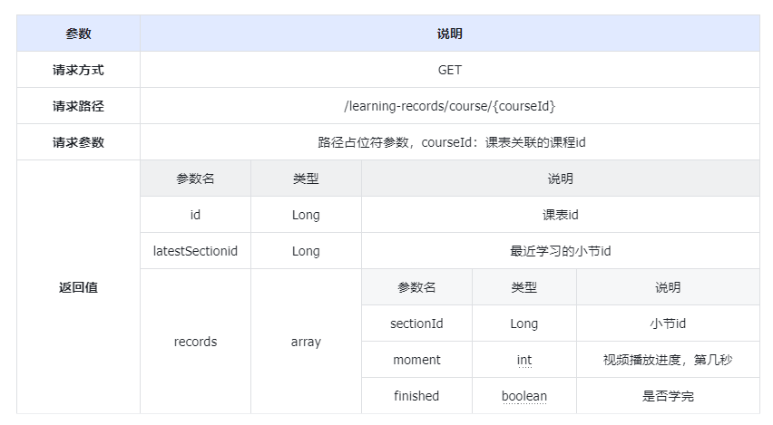

### 2.1.1.思路分析

做个接口是给课程微服务调用的，因此在tj-api模块的LearningClient中定义好了：

```java
/**
 * 查询当前用户指定课程的学习进度
 * @param courseId 课程id
 * @return 课表信息、学习记录及进度信息
 */
@GetMapping("/learning-records/course/{courseId}")
LearningLessonDTO queryLearningRecordByCourse(@PathVariable("courseId") Long courseId);
```

对应的DTO也都在tj-api模块定义好了。我们直接实现接口即可。

由于请求参数是`courseId`，而返回值中包含`lessonId`和`latestSectionid`都在`learning_lesson`表中，因此我们需要根据courseId和userId查询出lesson信息。然后再根据lessonId查询学习记录。整体流程如下：

- 获取当前登录用户id
- 根据courseId和userId查询LearningLesson
- 判断是否存在或者是否过期
  - 如果不存在或过期直接返回空
  - 如果存在并且未过期，则继续
- 查询lesson对应的所有学习记录

### 2.1.2.代码实现

首先在`tj-learning`模块下的`com.tianji.learning.controller.LearningRecordController`下定义接口：

```java
package com.tianji.learning.controller;


import com.tianji.api.dto.leanring.LearningLessonDTO;
import com.tianji.learning.service.ILearningRecordService;
import io.swagger.annotations.Api;
import io.swagger.annotations.ApiOperation;
import io.swagger.annotations.ApiParam;
import lombok.RequiredArgsConstructor;
import org.springframework.web.bind.annotation.*;

/**
 * <p>
 * 学习记录表 前端控制器
 * </p>
 */
@RestController
@RequestMapping("/learning-records")
@Api(tags = "学习记录的相关接口")
@RequiredArgsConstructor
public class LearningRecordController {

    private final ILearningRecordService recordService;

    @ApiOperation("查询指定课程的学习记录")
    @GetMapping("/course/{courseId}")
    public LearningLessonDTO queryLearningRecordByCourse(
            @ApiParam(value = "课程id", example = "2") @PathVariable("courseId") Long courseId){
        return recordService.queryLearningRecordByCourse(courseId);
    }
}
```

然后在`com.tianji.learning.service.ILearningRecordService`中定义方法：

```java
package com.tianji.learning.service;

import com.baomidou.mybatisplus.extension.service.IService;
import com.tianji.api.dto.leanring.LearningLessonDTO;
import com.tianji.learning.domain.po.LearningRecord;

/**
 * <p>
 * 学习记录表 服务类
 * </p>
 */
public interface ILearningRecordService extends IService<LearningRecord> {

    LearningLessonDTO queryLearningRecordByCourse(Long courseId);
}
```

最后在com.tianji.learning.service.impl.LearningRecordServiceImpl中定义实现类：

```java
package com.tianji.learning.service.impl;

import com.baomidou.mybatisplus.extension.service.impl.ServiceImpl;
import com.tianji.api.dto.leanring.LearningLessonDTO;
import com.tianji.api.dto.leanring.LearningRecordDTO;
import com.tianji.common.utils.BeanUtils;
import com.tianji.common.utils.UserContext;
import com.tianji.learning.domain.po.LearningLesson;
import com.tianji.learning.domain.po.LearningRecord;
import com.tianji.learning.mapper.LearningRecordMapper;
import com.tianji.learning.service.ILearningLessonService;
import com.tianji.learning.service.ILearningRecordService;
import lombok.RequiredArgsConstructor;
import org.springframework.stereotype.Service;

import java.util.List;

/**
 * <p>
 * 学习记录表 服务实现类
 * </p>
 *
 * @author 虎哥
 * @since 2022-12-10
 */
@Service
@RequiredArgsConstructor
public class LearningRecordServiceImpl extends ServiceImpl<LearningRecordMapper, LearningRecord> implements ILearningRecordService {

    private final ILearningLessonService lessonService;

    @Override
    public LearningLessonDTO queryLearningRecordByCourse(Long courseId) {
        // 1.获取登录用户
        Long userId = UserContext.getUser();
        // 2.查询课表
        LearningLesson lesson = lessonService.queryByUserAndCourseId(userId, courseId);
        // 3.查询学习记录
        // select * from xx where lesson_id = #{lessonId}
        List<LearningRecord> records = lambdaQuery()
                            .eq(LearningRecord::getLessonId, lesson.getId()).list();
        // 4.封装结果
        LearningLessonDTO dto = new LearningLessonDTO();
        dto.setId(lesson.getId());
        dto.setLatestSectionId(lesson.getLatestSectionId());
        dto.setRecords(BeanUtils.copyList(records, LearningRecordDTO.class));
        return dto;
    }
}
```

其中查询课表的时候，需要调用`ILessonService`中的`queryByUserAndCourseId()`方法，该方法代码如下：

```java
@Override
public LearningLesson queryByUserAndCourseId(Long userId, Long courseId) {
    return getOne(buildUserIdAndCourseIdWrapper(userId, courseId));
}

private LambdaQueryWrapper<LearningLesson> buildUserIdAndCourseIdWrapper(Long userId, Long courseId) {
    LambdaQueryWrapper<LearningLesson> queryWrapper = new QueryWrapper<LearningLesson>()
            .lambda()
            .eq(LearningLesson::getUserId, userId)
            .eq(LearningLesson::getCourseId, courseId);
    return queryWrapper;
}
```

## 2.2.提交学习记录

回顾一下接口信息：

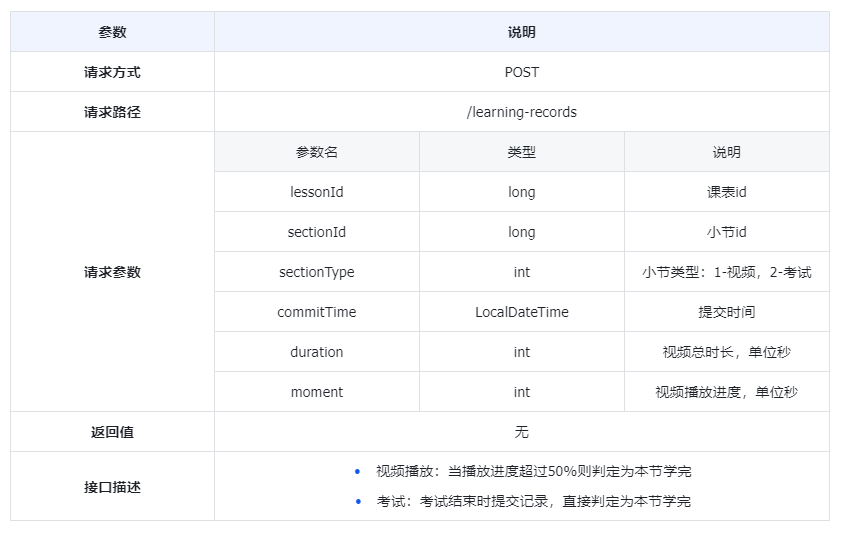

### 2.2.1.思路分析

学习记录就是用户当前学了哪些小节，以及学习到该小节的进度如何。而小节类型分为考试、视频两种。

- 考试比较简单，只要提交了就说明这一节学完了。
- 视频比较麻烦，需要记录用户的播放进度，进度超过50%才算学完。因此视频播放的过程中需要不断提交播放进度到服务端，而服务端则需要保存学习记录到数据库。

以上信息都需要保存到learning_record表中。

特别需要**注意**的是，学习记录learning_record表记录的是每一个小节的学习进度。而在learning_lesson表也需要记录一些学习进度相关字段：

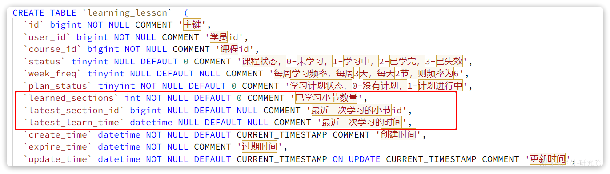

这些字段是整个课程的进度统计：

- learned_sections：已学习小节数量
- latest_section_id：最近一次学习的小节id
- latest_learn_time：最近一次学习时间

::: warning

​	每当有一个小节被学习，都应该更新`latest_section_id`和`latest_learn_time`；每当有一个小节学习完后，`learned_sections`都应该累加1。不过这里有一点容易出错的地方：

- 考试只会被参加一次，考试提交则小节学完，`learned_sections`累加1
- 视频可以被重复播放，只有在第一次学完一个视频时，`learned_sections`才需要累加1

那么问题来了，如何判断视频是否是第一次学完？我认为应该同时满足两个条件：

- 视频播放进度超过50%
- 之前学习记录的状态为未学完

:::

另外，随着learned_sections字段不断累加，最终会到达课程的最大小节数，这就意味着当前课程被全部学完了。那么课程状态需要从“学习中”变更为“已学完”。

综上，最终的提交学习记录处理流程如图：

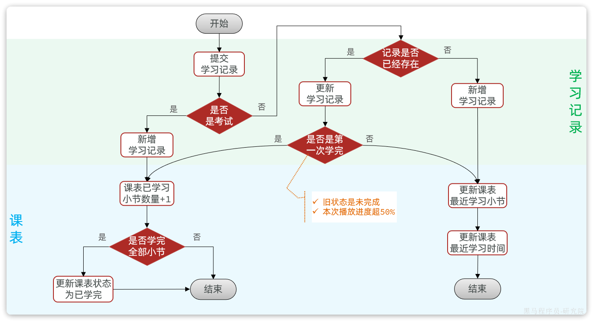

### 2.2.2.表单实体

请求参数比较多，所以需要定义一个表单DTO实体，这个在课前资料已经提供好了：

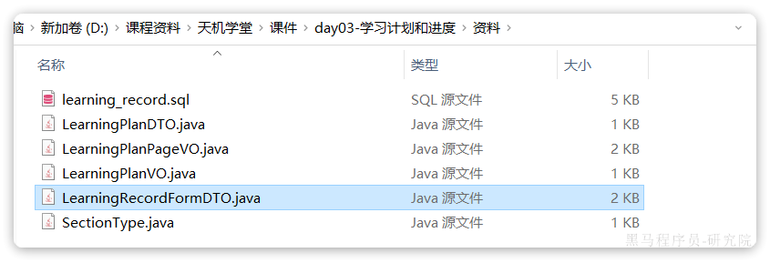

具体代码如下：

```java
package com.tianji.learning.domain.dto;

import com.tianji.common.validate.annotations.EnumValid;
import com.tianji.learning.enums.SectionType;
import io.swagger.annotations.ApiModel;
import io.swagger.annotations.ApiModelProperty;
import lombok.Data;

import javax.validation.constraints.NotNull;
import java.time.LocalDateTime;

@Data
@ApiModel(description = "学习记录")
public class LearningRecordFormDTO {

    @ApiModelProperty("小节类型：1-视频，2-考试")
    @NotNull(message = "小节类型不能为空")
    @EnumValid(enumeration = {1, 2}, message = "小节类型错误，只能是：1-视频，2-考试")
    private SectionType sectionType;

    @ApiModelProperty("课表id")
    @NotNull(message = "课表id不能为空")
    private Long lessonId;

    @ApiModelProperty("对应节的id")
    @NotNull(message = "节的id不能为空")
    private Long sectionId;

    @ApiModelProperty("视频总时长，单位秒")
    private Integer duration;

    @ApiModelProperty("视频的当前观看时长，单位秒，第一次提交填0")
    private Integer moment;

    @ApiModelProperty("提交时间")
    private LocalDateTime commitTime;
}
```

### 2.2.3.代码实现

首先在`tj-learning`模块下的`com.tianji.learning.controller.LearningRecordController`下定义接口：

```java
package com.tianji.learning.controller;


import com.tianji.api.dto.leanring.LearningLessonDTO;
import com.tianji.learning.domain.dto.LearningRecordFormDTO;
import com.tianji.learning.service.ILearningRecordService;
import io.swagger.annotations.Api;
import io.swagger.annotations.ApiOperation;
import io.swagger.annotations.ApiParam;
import lombok.RequiredArgsConstructor;
import org.springframework.web.bind.annotation.*;

/**
 * <p>
 * 学习记录表 前端控制器
 * </p>
 *
 * @author 虎哥
 * @since 2022-12-10
 */
@RestController
@RequestMapping("/learning-records")
@Api(tags = "学习记录的相关接口")
@RequiredArgsConstructor
public class LearningRecordController {

    private final ILearningRecordService recordService;

    @ApiOperation("查询指定课程的学习记录")
    @GetMapping("/course/{courseId}")
    public LearningLessonDTO queryLearningRecordByCourse(
            @ApiParam(value = "课程id", example = "2") @PathVariable("courseId") Long courseId){
        return recordService.queryLearningRecordByCourse(courseId);
    }

    @ApiOperation("提交学习记录")
    @PostMapping
    public void addLearningRecord(@RequestBody LearningRecordFormDTO formDTO){
        recordService.addLearningRecord(formDTO);
    }
}
```

然后在`com.tianji.learning.service.ILearningRecordService`中定义方法：

```java
package com.tianji.learning.service;

import com.baomidou.mybatisplus.extension.service.IService;
import com.tianji.api.dto.leanring.LearningLessonDTO;
import com.tianji.learning.domain.dto.LearningRecordFormDTO;
import com.tianji.learning.domain.po.LearningRecord;

/**
 * <p>
 * 学习记录表 服务类
 * </p>
 *
 * @author 虎哥
 * @since 2022-12-10
 */
public interface ILearningRecordService extends IService<LearningRecord> {

    LearningLessonDTO queryLearningRecordByCourse(Long courseId);

    void addLearningRecord(LearningRecordFormDTO formDTO);
}
```

最后在`com.tianji.learning.service.impl.LearningRecordServiceImpl`中定义实现类：

```java
package com.tianji.learning.service.impl;

import com.baomidou.mybatisplus.extension.service.impl.ServiceImpl;
import com.tianji.api.client.course.CourseClient;
import com.tianji.api.dto.course.CourseFullInfoDTO;
import com.tianji.api.dto.leanring.LearningLessonDTO;
import com.tianji.api.dto.leanring.LearningRecordDTO;
import com.tianji.common.exceptions.BizIllegalException;
import com.tianji.common.exceptions.DbException;
import com.tianji.common.utils.BeanUtils;
import com.tianji.common.utils.UserContext;
import com.tianji.learning.domain.dto.LearningRecordFormDTO;
import com.tianji.learning.domain.po.LearningLesson;
import com.tianji.learning.domain.po.LearningRecord;
import com.tianji.learning.enums.LessonStatus;
import com.tianji.learning.enums.SectionType;
import com.tianji.learning.mapper.LearningRecordMapper;
import com.tianji.learning.service.ILearningLessonService;
import com.tianji.learning.service.ILearningRecordService;
import lombok.RequiredArgsConstructor;
import org.springframework.stereotype.Service;
import org.springframework.transaction.annotation.Transactional;

import java.util.List;

/**
 * <p>
 * 学习记录表 服务实现类
 * </p>
 */
@Service
@RequiredArgsConstructor
public class LearningRecordServiceImpl extends ServiceImpl<LearningRecordMapper, LearningRecord> implements ILearningRecordService {

    private final ILearningLessonService lessonService;

    private final CourseClient courseClient;

    // 。。。略

    @Override
    @Transactional
    public void addLearningRecord(LearningRecordFormDTO recordDTO) {
        // 1.获取登录用户
        Long userId = UserContext.getUser();
        // 2.处理学习记录
        boolean finished = false;
        if (recordDTO.getSectionType() == SectionType.VIDEO) {
            // 2.1.处理视频
            finished = handleVideoRecord(userId, recordDTO);
        }else{
            // 2.2.处理考试
            finished = handleExamRecord(userId, recordDTO);
        }

        // 3.处理课表数据
        handleLearningLessonsChanges(recordDTO, finished);
    }

    private void handleLearningLessonsChanges(LearningRecordFormDTO recordDTO, boolean finished) {
        // 1.查询课表
        LearningLesson lesson = lessonService.getById(recordDTO.getLessonId());
        if (lesson == null) {
            throw new BizIllegalException("课程不存在，无法更新数据！");
        }
        // 2.判断是否有新的完成小节
        boolean allLearned = false;
        if(finished){
            // 3.如果有新完成的小节，则需要查询课程数据
            CourseFullInfoDTO cInfo = courseClient.getCourseInfoById(lesson.getCourseId(), false, false);
            if (cInfo == null) {
                throw new BizIllegalException("课程不存在，无法更新数据！");
            }
            // 4.比较课程是否全部学完：已学习小节 >= 课程总小节
            allLearned = lesson.getLearnedSections() + 1 >= cInfo.getSectionNum();     
        }
        // 5.更新课表
        lessonService.lambdaUpdate()
                .set(lesson.getLearnedSections() == 0, LearningLesson::getStatus, LessonStatus.LEARNING.getValue())
                .set(allLearned, LearningLesson::getStatus, LessonStatus.FINISHED.getValue())
                .set(!finished, LearningLesson::getLatestSectionId, recordDTO.getSectionId())
                .set(!finished, LearningLesson::getLatestLearnTime, recordDTO.getCommitTime())
                .setSql(finished, "learned_sections = learned_sections + 1")
                .eq(LearningLesson::getId, lesson.getId())
                .update();
    }

    private boolean handleVideoRecord(Long userId, LearningRecordFormDTO recordDTO) {
        // 1.查询旧的学习记录
        LearningRecord old = queryOldRecord(recordDTO.getLessonId(), recordDTO.getSectionId());
        // 2.判断是否存在
        if (old == null) {
            // 3.不存在，则新增
            // 3.1.转换PO
            LearningRecord record = BeanUtils.copyBean(recordDTO, LearningRecord.class);
            // 3.2.填充数据
            record.setUserId(userId);
            // 3.3.写入数据库
            boolean success = save(record);
            if (!success) {
                throw new DbException("新增学习记录失败！");
            }
            return false;
        }
        // 4.存在，则更新
        // 4.1.判断是否是第一次完成
        boolean finished = !old.getFinished() && recordDTO.getMoment() * 2 >= recordDTO.getDuration();
        // 4.2.更新数据
        boolean success = lambdaUpdate()
                .set(LearningRecord::getMoment, recordDTO.getMoment())
                .set(finished, LearningRecord::getFinished, true)
                .set(finished, LearningRecord::getFinishTime, recordDTO.getCommitTime())
                .eq(LearningRecord::getId, old.getId())
                .update();
        if(!success){
            throw new DbException("更新学习记录失败！");
        }
        return finished ;
    }

    private LearningRecord queryOldRecord(Long lessonId, Long sectionId) {
        return lambdaQuery()
                .eq(LearningRecord::getLessonId, lessonId)
                .eq(LearningRecord::getSectionId, sectionId)
                .one();
    }

    private boolean handleExamRecord(Long userId, LearningRecordFormDTO recordDTO) {
        // 1.转换DTO为PO
        LearningRecord record = BeanUtils.copyBean(recordDTO, LearningRecord.class);
        // 2.填充数据
        record.setUserId(userId);
        record.setFinished(true);
        record.setFinishTime(recordDTO.getCommitTime());
        // 3.写入数据库
        boolean success = save(record);
        if (!success) {
            throw new DbException("新增考试记录失败！");
        }
        return true;
    }
}
```

## 2.3.创建学习计划

回顾下接口信息：

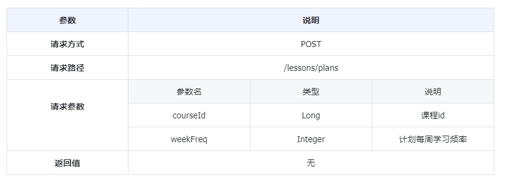

### 2.3.1.思路分析

创建学习计划，本质就是让用户设定自己每周的学习频率：


虽说接口是创建学习计划，但本质这是一个更新的接口。因为学习计划字段都保存在learning_lesson表中。

```sql
CREATE TABLE `learning_lesson`  (
  `id` bigint NOT NULL COMMENT '主键',
  `user_id` bigint NOT NULL COMMENT '学员id',
  `course_id` bigint NOT NULL COMMENT '课程id',
  `status` tinyint NULL DEFAULT 0 COMMENT '课程状态，0-未学习，1-学习中，2-已学完，3-已失效',
  `week_freq` tinyint NULL DEFAULT NULL COMMENT '每周学习频率，每周3天，每天2节，则频率为6',
  `plan_status` tinyint NOT NULL DEFAULT 0 COMMENT '学习计划状态，0-没有计划，1-计划进行中',
  `learned_sections` int NOT NULL DEFAULT 0 COMMENT '已学习小节数量',
  `latest_section_id` bigint NULL DEFAULT NULL COMMENT '最近一次学习的小节id',
  `latest_learn_time` datetime NULL DEFAULT NULL COMMENT '最近一次学习的时间',
  `create_time` datetime NOT NULL DEFAULT CURRENT_TIMESTAMP COMMENT '创建时间',
  `expire_time` datetime NOT NULL COMMENT '过期时间',
  `update_time` datetime NOT NULL DEFAULT CURRENT_TIMESTAMP ON UPDATE CURRENT_TIMESTAMP COMMENT '更新时间',
  PRIMARY KEY (`id`) USING BTREE,
  UNIQUE INDEX `idx_user_id`(`user_id`, `course_id`) USING BTREE
) ENGINE = InnoDB CHARACTER SET = utf8mb4 COLLATE = utf8mb4_0900_ai_ci COMMENT = '学生课程表' ROW_FORMAT = Dynamic;
```

当我们创建学习计划时，就是更新`learning_lesson`表，写入`week_freq`并更新`plan_status`为计划进行中即可。

### 2.3.2.表单实体

表单包含两个字段：

- courseId
- weekFreq

前端是以JSON方式提交，我们需要定义一个表单DTO实体。在课前资料中已经提供给大家了：

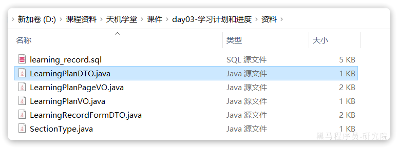

具体代码：

```java
package com.tianji.learning.domain.dto;

import io.swagger.annotations.ApiModel;
import io.swagger.annotations.ApiModelProperty;
import lombok.Data;
import org.hibernate.validator.constraints.Range;

import javax.validation.constraints.Min;
import javax.validation.constraints.NotNull;

@Data
@ApiModel(description = "学习计划表单实体")
public class LearningPlanDTO {
    @NotNull
    @ApiModelProperty("课程表id")
    @Min(1)
    private Long courseId;
    @NotNull
    @Range(min = 1, max = 50)
    @ApiModelProperty("每周学习频率")
    private Integer freq;
}
```

### 2.3.3.代码实现

首先，在`com.tianji.learning.controller.LearningLessonController`中添加一个接口：

```java
package com.tianji.learning.controller;

import com.tianji.learning.domain.dto.LearningPlanDTO;
import com.tianji.learning.service.ILearningLessonService;
import io.swagger.annotations.Api;
import io.swagger.annotations.ApiOperation;
import io.swagger.annotations.ApiParam;
import lombok.RequiredArgsConstructor;
import org.springframework.web.bind.annotation.*;

import javax.validation.Valid;

/**
 * <p>
 * 学生课程表 前端控制器
 * </p>
 *
 * @author 虎哥
 * @since 2022-12-02
 */
@RestController
@RequestMapping("/lessons")
@Api(tags = "我的课表相关接口")
@RequiredArgsConstructor
public class LearningLessonController {

    private final ILearningLessonService lessonService;

    // 略。。。

    @ApiOperation("创建学习计划")
    @PostMapping("/plans")
    public void createLearningPlans(@Valid @RequestBody LearningPlanDTO planDTO){
        lessonService.createLearningPlan(planDTO.getCourseId(), planDTO.getFreq());
    }
}
```

然后，在`com.tianji.learning.service.ILearningLessonService`中定义service方法：

```java
package com.tianji.learning.service;

import com.baomidou.mybatisplus.extension.service.IService;
import com.tianji.learning.domain.po.LearningLesson;

import java.util.List;

/**
 * <p>
 * 学生课程表 服务类
 * </p>
 */
public interface ILearningLessonService extends IService<LearningLesson> {
    // ... 略

    void createLearningPlan(Long courseId, Integer freq);
}
```

最后，在`com.tianji.learning.service.impl.LearningLessonServiceImpl`中实现方法：

```java
// ... 略

@Override
public void createLearningPlan(Long courseId, Integer freq) {
    // 1.获取当前登录的用户
    Long userId = UserContext.getUser();
    // 2.查询课表中的指定课程有关的数据
    LearningLesson lesson = queryByUserAndCourseId(userId, courseId);
    AssertUtils.isNotNull(lesson, "课程信息不存在！");
    // 3.修改数据
    LearningLesson l = new LearningLesson();
    l.setId(lesson.getId());
    l.setWeekFreq(freq);
    if(lesson.getPlanStatus() == PlanStatus.NO_PLAN) {
        l.setPlanStatus(PlanStatus.PLAN_RUNNING);
    }
    updateById(l);
}

// ... 略
```

## 2.4.查询学习计划进度

页面原型如图：

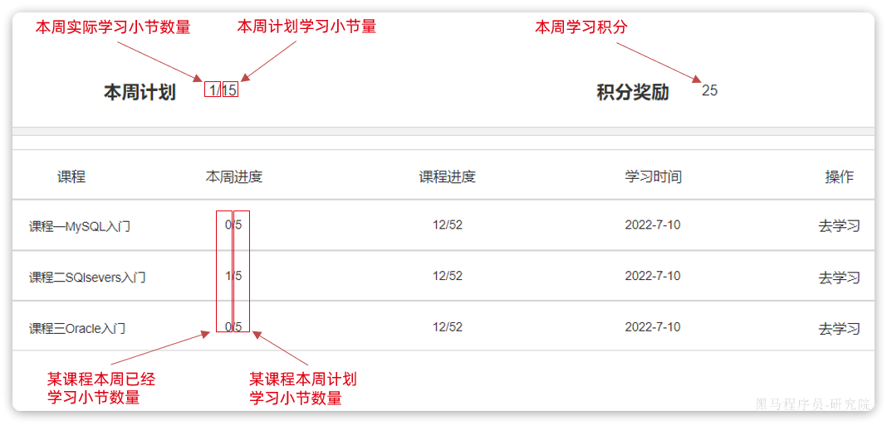

接口回顾：


### 2.4.1.思路分析

要查询的数据分为两部分：

- 本周计划学习的每个课程的学习进度
- 本周计划学习的课程总的学习进度

对于**本周计划学习的每个课程的学习进度，**首先需要查询出学习中的LearningLesson的信息，查询条件包括：

- 属于当前登录用户
- 学习计划进行中

查询到的LearningLesson可能有多个，而且查询到的PO数据跟最终的VO相比还有差距:

PO：

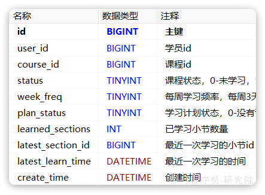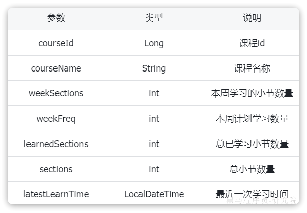

VO：

具体来说，PO中缺少了courseName和weekSections两个字段。其中courseName可以通过courseId去课程微服务查询。weekSections只能对学习记录做统计得到。

因此，我们需要搜集查询到的课表中的courseId，查询出对应的课程信息；还需要搜集查询到的课表的id，去learning_record中统计每个课表**本周**已学习的小节数量。

最终遍历处理每个PO，转换为VO格式。

除了本周每个课程的学习进度以外，我们还要统计**本周计划学习的课程总的学习进度**。其中的积分数据暂时不管，剩下的两个需要分别对两张表统计：

- weekTotalPlan：对learning_lesson表统计，查询计划学习的课程的weekFreq字段做累加即可
- weekFinished：对learning_record表，对已学完的小节记录做count即可

::: warning

**注意**：

虽然这里是分页查询，但是每个用户购买的课程其实是有限的，为了便于数据统计，建议采用查询全部数据，然后手动逻辑分页的方式。这样在统计全部课程学习进度的时候会方便很多。

:::

### 2.4.2.实体

VO实体已经在课前资料中给出：

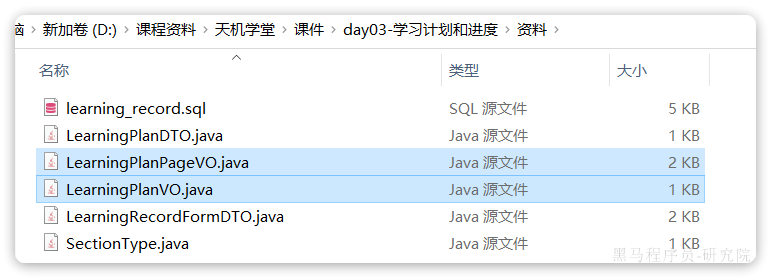

### 2.4.3.代码实现

首先在`tj-learning`模块的`com.tianji.learning.controller.LearningLessonController`中定义`controller`接口：

```java
@ApiOperation("查询我的学习计划")
@GetMapping("/plans")
public LearningPlanPageVO queryMyPlans(PageQuery query){
    return lessonService.queryMyPlans(query);
}
```

然后在`com.tianji.learning.service.ILearningLessonService`中定义service方法：

```java
LearningPlanPageVO queryMyPlans(PageQuery query);
```

最后在`com.tianji.learning.service.impl.LearningLessonServiceImpl`中实现该方法：

版本1：物理分页，分别统计，效率较低

```java
@Override
public LearningPlanPageVO queryMyPlans(PageQuery query) {
    LearningPlanPageVO result = new LearningPlanPageVO();
    // 1.获取当前登录用户
    Long userId = UserContext.getUser();
    // 2.获取本周起始时间
    LocalDate now = LocalDate.now();
    LocalDateTime begin = DateUtils.getWeekBeginTime(now);
    LocalDateTime end = DateUtils.getWeekEndTime(now);
    // 3.查询总的统计数据
    // 3.1.本周总的已学习小节数量
    Integer weekFinished = recordMapper.selectCount(new LambdaQueryWrapper<LearningRecord>()
            .eq(LearningRecord::getUserId, userId)
            .eq(LearningRecord::getFinished, true)
            .gt(LearningRecord::getFinishTime, begin)
            .lt(LearningRecord::getFinishTime, end)
    );
    result.setWeekFinished(weekFinished);
    // 3.2.本周总的计划学习小节数量
    Integer weekTotalPlan = getBaseMapper().queryTotalPlan(userId);
    result.setWeekTotalPlan(weekTotalPlan);
    // TODO 3.3.本周学习积分

    // 4.查询分页数据
    // 4.1.分页查询课表信息以及学习计划信息
    Page<LearningLesson> p = lambdaQuery()
            .eq(LearningLesson::getUserId, userId)
            .eq(LearningLesson::getPlanStatus, PlanStatus.PLAN_RUNNING)
            .in(LearningLesson::getStatus, LessonStatus.NOT_BEGIN, LessonStatus.LEARNING)
            .page(query.toMpPage("latest_learn_time", false));
    List<LearningLesson> records = p.getRecords();
    if (CollUtils.isEmpty(records)) {
        return result.emptyPage(p);
    }
    // 4.2.查询课表对应的课程信息
    Map<Long, CourseSimpleInfoDTO> cMap = queryCourseSimpleInfoList(records);
    // 4.3.统计每一个课程本周已学习小节数量
    List<IdAndNumDTO> list = recordMapper.countLearnedSections(userId, begin, end);
    Map<Long, Integer> countMap = IdAndNumDTO.toMap(list);
    // 4.4.组装数据VO
    List<LearningPlanVO> voList = new ArrayList<>(records.size());
    for (LearningLesson r : records) {
        // 4.4.1.拷贝基础属性到vo
        LearningPlanVO vo = BeanUtils.copyBean(r, LearningPlanVO.class);
        // 4.4.2.填充课程详细信息
        CourseSimpleInfoDTO cInfo = cMap.get(r.getCourseId());
        if (cInfo != null) {
            vo.setCourseName(cInfo.getName());
            vo.setSections(cInfo.getSectionNum());
        }
        // 4.4.3.每个课程的本周已学习小节数量
        vo.setWeekLearnedSections(countMap.getOrDefault(r.getId(), 0));
        voList.add(vo);
    }
    return result.pageInfo(p.getTotal(), p.getPages(), voList);
}
```

版本2：逻辑分页，统一统计，效率较高

```java
@Override
public LearningPlanPageVO queryMyPlans(PageQuery query) {
    LearningPlanPageVO result = new LearningPlanPageVO();
    // 1.获取当前登录用户
    Long userId = UserContext.getUser();
    // 2.获取本周起始时间
    LocalDate now = LocalDate.now();
    LocalDateTime begin = DateUtils.getWeekBeginTime(now);
    LocalDateTime end = DateUtils.getWeekEndTime(now);
    // 3.查询本周计划学习的所有课程，满足三个条件：属于当前用户、有学习计划、学习中
    List<LearningLesson> lessons = lambdaQuery()
            .eq(LearningLesson::getUserId, userId)
            .eq(LearningLesson::getPlanStatus, PlanStatus.PLAN_RUNNING)
            .in(LearningLesson::getStatus, LessonStatus.NOT_BEGIN, LessonStatus.LEARNING)
            .list();
    if (CollUtils.isEmpty(lessons)) {
        return null;
    }
    // 4.统计当前用户每个课程的已学习小节数量
    List<IdAndNumDTO> list = recordMapper.countLearnedSections(userId, begin, end);
    Map<Long, Integer> countMap = IdAndNumDTO.toMap(list);

    // 5.查询总的统计数据
    // 5.1.本周总的已学习小节数量
    int weekFinished = lessons.stream()
            .map(LearningLesson::getId)
            .mapToInt(id -> countMap.getOrDefault(id, 0))
            .sum();
    result.setWeekFinished(weekFinished);
    // 5.2.本周总的计划学习小节数量
    int weekTotalPlan = lessons.stream().mapToInt(LearningLesson::getWeekFreq).sum();
    result.setWeekTotalPlan(weekTotalPlan);
    // TODO 5.3.本周学习积分

    // 6.处理分页数据
    // 6.1.分页查询课表信息以及学习计划信息
    Page<LearningLesson> p = new Page<>(query.getPageNo(), query.getPageSize(), lessons.size());
    List<LearningLesson> records = CollUtils.sub(lessons, query.from(), query.from() + query.getPageSize());
    if (CollUtils.isEmpty(records)) {
        return result.emptyPage(p);
    }
    // 6.2.查询课表对应的课程信息
    Map<Long, CourseSimpleInfoDTO> cMap = queryCourseSimpleInfoList(records);
    // 6.3.组装数据VO
    List<LearningPlanVO> voList = new ArrayList<>(records.size());
    for (LearningLesson r : records) {
        // 6.4.1.拷贝基础属性到vo
        LearningPlanVO vo = BeanUtils.copyBean(r, LearningPlanVO.class);
        // 6.4.2.填充课程详细信息
        CourseSimpleInfoDTO cInfo = cMap.get(r.getCourseId());
        if (cInfo != null) {
            vo.setCourseName(cInfo.getName());
            vo.setSections(cInfo.getSectionNum());
        }
        // 6.4.3.每个课程的本周已学习小节数量
        vo.setWeekLearnedSections(countMap.getOrDefault(r.getId(), 0));
        voList.add(vo);
    }
    return result.pageInfo(p.getTotal(), p.getPages(), voList);
}
```

# 3.练习

## 3.1.课程过期

编写一个SpringTask定时任务，定期检查learning_lesson表中的课程是否过期，如果过期则将课程状态修改为已过期。

## 3.2.方案思考

思考题：思考一下目前提交学习记录功能可能存在哪些问题？有哪些可以改进的方向？

# 4.面试题

**面试官：你在开发中参与了哪些功能开发让你觉得比较有挑战性？**

::: warning

答：我参与了整个学习中心的功能开发，其中有很多的学习辅助功能都很有特色。比如视频播放的进度记录。我们网站的课程是以录播视频为主，为了提高用户的学习体验，需要实现视频续播功能。这个功能本身并不复杂，只不过我们产品提出的要求比较高：

- 首先续播时间误差要控制在30秒以内。
- 而且要做到用户突然断开，甚至切换设备后，都可以继续上一次播放

要达成这个目的，使用传统的手段显然是不行的。

首先，要做到切换设备后还能续播，用户的播放进度必须保存在服务端，而不是客户端。

其次，用户突然断开或者切换设备，续播的时间误差不能超过30秒，那播放进度的记录频率就需要比较高。我们会在前端每隔15秒就发起一次心跳请求，提交最新的播放进度，记录到服务端。这样用户下一次续播时直接读取服务端的播放进度，就可以将时间误差控制在15秒左右。

注：此时面试官会追问：播放进度写到服务端保存在哪里？如果写在数据库，那写数据库的压力是不是太大了？等一系列问题，这个会在下一节内容中讲解。

:::
