# day04-高并发优化

昨天我们实现了学习计划和学习进度的统计功能。特别是学习进度部分，为了更精确的记录用户上一次播放的进度，我们采用的方案是：前端每隔15秒就发起一次请求，将播放记录写入数据库。

但问题是，提交播放记录的业务太复杂了，其中涉及到大量的数据库操作：

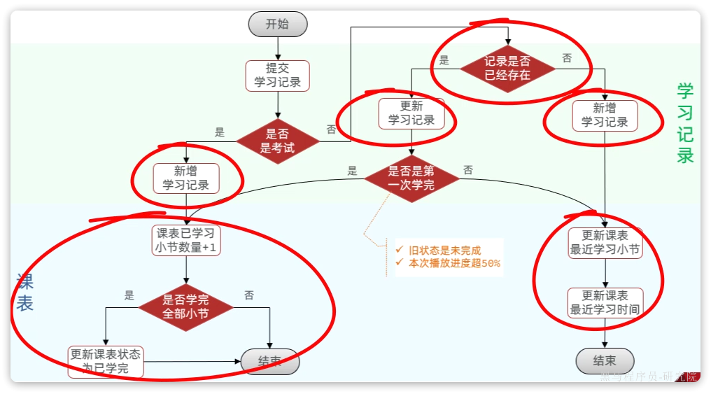

在并发较高的情况下，会给数据库带来非常大的压力。该怎么解决呢？

今天我们就来分析一下，当碰到高并发的数据库写业务时，该如何优化。通过今天的学习，大家可以掌握下面的技能：

- 理解高并发优化的常见方案
- 掌握Redis合并写请求的方案
- 掌握DelayQueue的使用

特别是其中的高并发优化方案，在很多的业务场景下都可以用到。

# 1.高并发优化方案

解决高并发问题从宏观角度来说有3个方向：

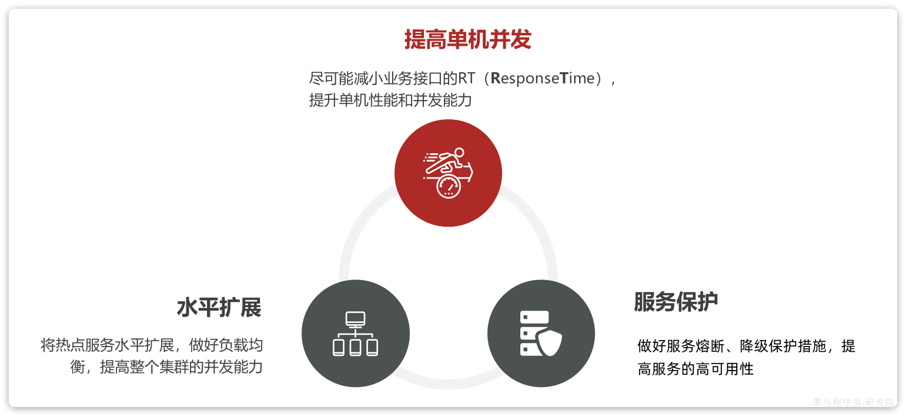

其中，水平扩展和服务保护侧重的是运维层面的处理。而提高单机并发能力侧重的则是业务层面的处理，也就是我们程序员在开发时可以做到的。

因此，我们本章重点讨论如何通过编码来提供业务的单机并发能力。

## 1.1.单机并发能力

在机器性能一定的情况下，提高单机并发能力就是要尽可能缩短业务的响应时间（**R**esponse**T**ime），而对响应时间影响最大的往往是对数据库的操作。而从数据库角度来说，我们的业务无非就是**读**或**写**两种类型。

对于读多写少的业务，其优化手段大家都比较熟悉了，主要包括两方面：

- 优化代码和SQL
- 添加缓存

对于写多读少的业务，大家可能较少碰到，优化的手段可能也不太熟悉，这也是我们要讲解的重点。

对于高并发写的优化方案有：

- 优化代码及SQL
- 变同步写为异步写
- 合并写请求

代码和SQL优化与读优化类似，我们就不再赘述了，接下来我们着重分析一下变同步为异步、合并写请求两种优化方案。

## 1.2.变同步为异步

假如一个业务比较复杂，需要有多次数据库的写业务，如图所示：

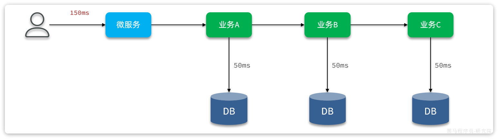

由于各个业务之间是同步串行执行，因此整个业务的响应时间就是每一次数据库写业务的响应时间之和，并发能力肯定不会太好。

优化的思路很简单，我们之前讲解MQ的时候就说过，利用MQ可以把同步业务变成异步，从而提高效率。

- 当我们接收到用户请求后，可以先不处理业务，而是发送MQ消息并返回给用户结果。
- 而后通过消息监听器监听MQ消息，处理后续业务。

如图：

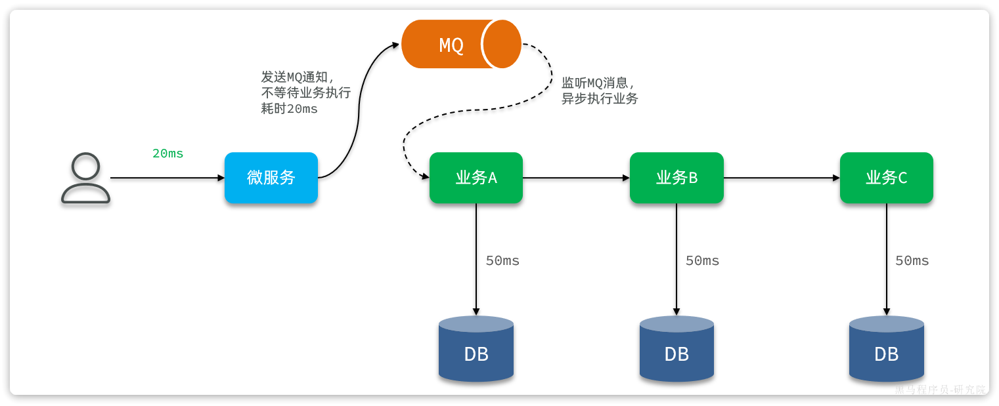

这样一来，用户请求处理和后续数据库写就从同步变为异步，用户无需等待后续的数据库写操作，响应时间自然会大大缩短。并发能力自然大大提高。

::: warning

**优点**：

- 无需等待复杂业务处理，大大减少响应时间
- 利用MQ暂存消息，起到流量削峰整形作用
- 降低写数据库频率，减轻数据库并发压力

**缺点**：

- 依赖于MQ的可靠性
- 降低了些频率，但是没有减少数据库写次数

**应用场景**：

- 比较适合应用于业务复杂， 业务链较长，有多次数据库写操作的业务。

:::

## 1.3.合并写请求

合并写请求方案其实是参考高并发读的优化思路：当读数据库并发较高时，我们可以把数据缓存到Redis，这样就无需访问数据库，大大减少数据库压力，减少响应时间。

既然读数据可以建立缓存，那么写数据可以不可以也缓存到Redis呢？

答案是肯定的，合并写请求就是指当写数据库并发较高时，不再直接写到数据库。而是先将数据缓存到Redis，然后定期将缓存中的数据批量写入数据库。

如图：

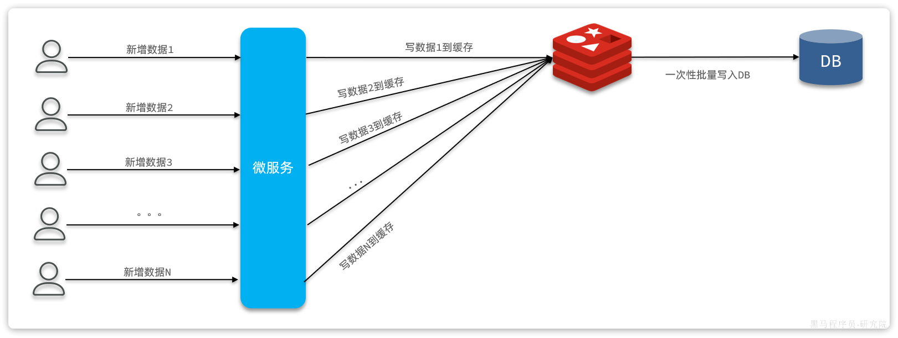

由于Redis是内存操作，写的效率也非常高，这样每次请求的处理速度大大提高，响应时间大大缩短，并发能力肯定有很大的提升。

而且由于数据都缓存到Redis了，积累一些数据后再批量写入数据库，这样数据库的写频率、写次数都大大减少，对数据库压力小了非常多！

::: warning

**优点：**

- 写缓存速度快，响应时间大大减少
- 降低数据库的写频率和写次数，大大减轻数据库压力

**缺点：**

- 实现相对复杂
- 依赖Redis可靠性
- 不支持事务和复杂业务

**场景：**

- 写频率较高、写业务相对简单的场景

:::

# 2.播放进度记录方案改进

播放进度统计包含大量的数据库读、写操作。不过保存播放记录还是以写数据库为主。因此优化的方向还是以高并发写优化为主。

大家思考一下，针对播放进度记录业务来说，应该采用哪种优化方案呢？

- 变同步为异步？
- 合并写？

## 2.1.优化方案选择

虽然播放进度记录业务较为复杂，但是我们认真思考一下整个业务分支：

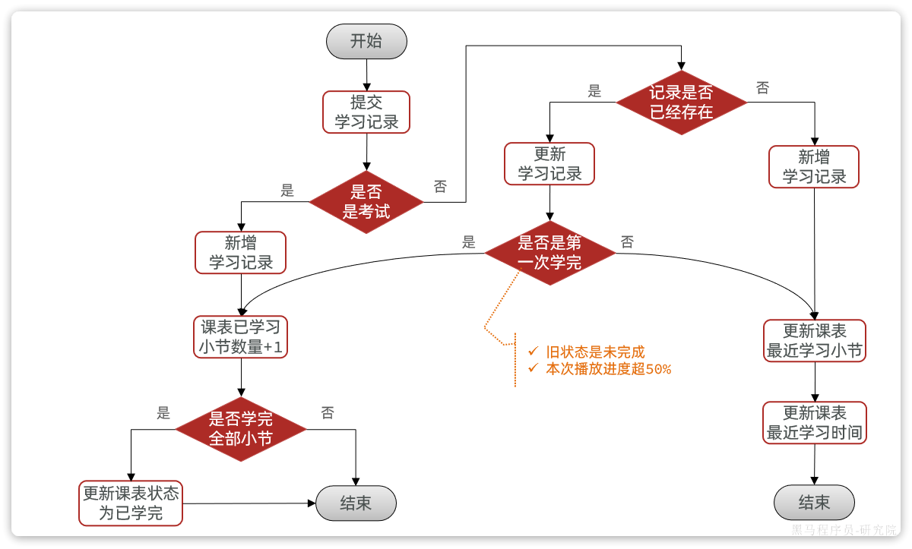

- 考试：每章只能考一次，还不能重复考试。因此属于低频行为，可以忽略
- 视频进度：前端每隔15秒就提交一次请求。在一个视频播放的过程中，可能有数十次请求，但完播（进度超50%）的请求只会有一次。因此多数情况下都是更新一下播放进度即可。

也就是说，95%的请求都是在更新`learning_record`表中的`moment`字段，以及`learning_lesson`表中的正在学习的小节id和时间。


而播放进度信息，不管更新多少次，下一次续播肯定是从最后的一次播放进度开始续播。也就是说我们只需要记住最后一次即可。因此可以采用合并写方案来降低数据库写的次数和频率，而异步写做不到。

综上，提交播放进度业务虽然看起来复杂，但大多数请求的处理很简单，就是更新播放进度。并且播放进度数据是可以合并的（覆盖之前旧数据）。我们建议采用合并写请求方案：

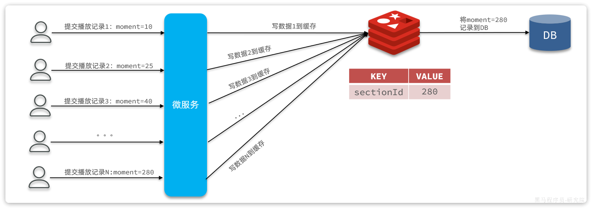

## 2.2.Redis数据结构设计

我们先讨论下Redis缓存中需要记录哪些数据。

我们的优化方案要处理的不是所有的提交学习记录请求。仅仅是视频播放时的高频更新播放进度的请求，对应的业务分支如图：

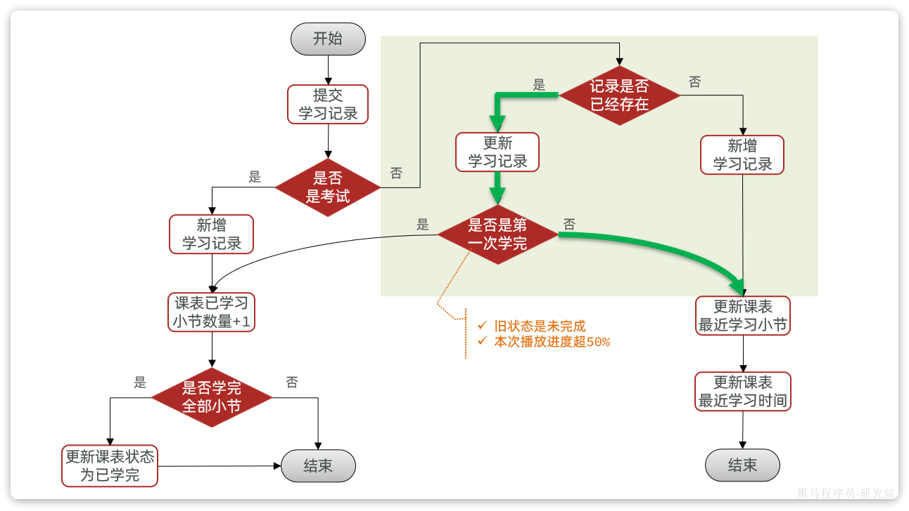

这条业务支线的流程如下：

- 查询播放记录，判断是否存在
  - 如果不存在，新增一条记录
  - 如果存在，则更新学习记录
- 判断当前进度是否是第一次学完
  - 播放进度要超过50%
  - 原本的记录状态是未学完
- 更新课表中最近学习小节id、学习时间

这里有多次数据库操作，例如：

- 查询播放记录：需要知道播放记录是否存在、播放记录当前的完成状态
- 更新播放记录：更新播放进度
- 更新最近学习小节id、时间

一方面我们要缓存写数据，减少写数据库频率；另一方面我们要缓存播放记录，减少查询数据库。因此，缓存中至少要包含3个字段：

- 记录id：id，用于根据id更新数据库
- 播放进度：moment，用于缓存播放进度
- 播放状态（是否学完）：finished，用于判断是否是第一次学完

既然一个小节要保存多个字段，是不是可以考虑使用Hash结构来保存这些数据，如图：

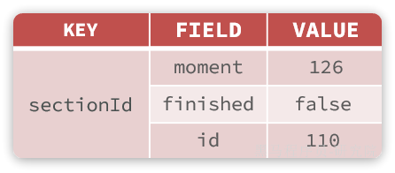

不过，这样设计有一个问题。课程有很多，每个课程的小节也非常多。每个小节都是一个独立的KEY，需要创建的KEY也会非常多，浪费大量内存。

而且，用户学习视频的过程中，可能会在多个视频之间来回跳转，这就会导致频繁的创建缓存、缓存过期，影响到最终的业务性能。该如何解决呢？

既然一个课程包含多个小节，我们完全可以把一个课程的多个小节作为一个KEY来缓存，如图：

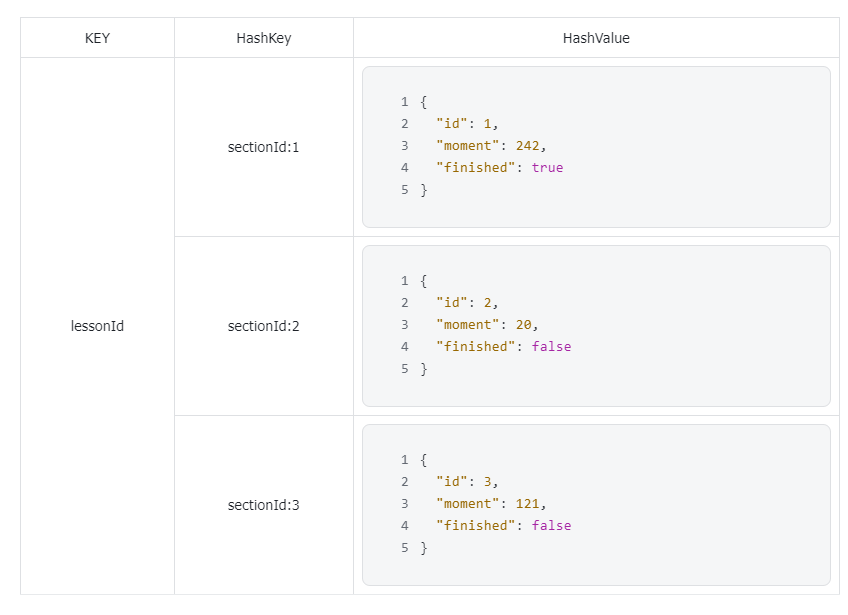

这样做有两个好处：

- 可以大大减少需要创建的KEY的数量，减少内存占用。
- 一个课程创建一个缓存，当用户在多个视频间跳转时，整个缓存的有效期都会被延续，不会频繁的创建和销毁缓存数据

添加缓存以后，学习记录提交的业务流程就需要发生一些变化了，如图：

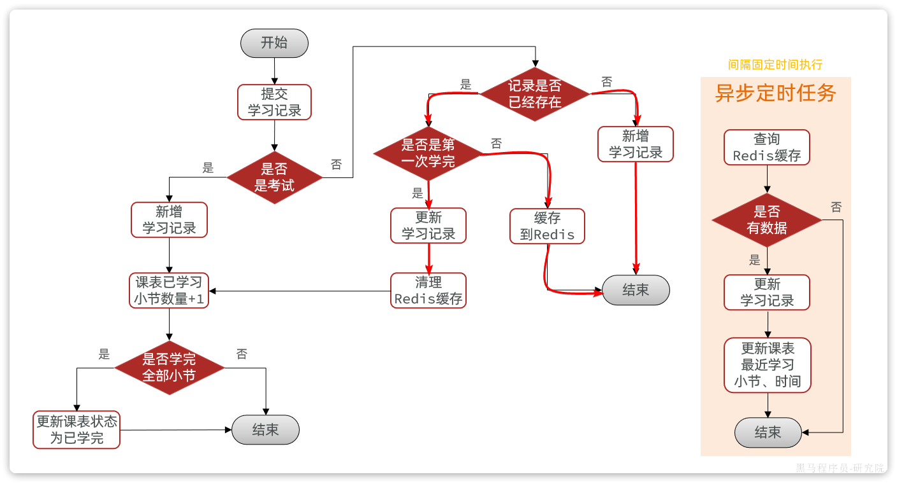

变化最大的有两点：

- 提交播放进度后，如果是更新播放进度则不写数据库，而是写缓存
- 需要一个定时任务，定期将缓存数据写入数据库

变化后的业务具体流程为：

- 1.提交学习记录
- 2.判断是否是考试
  - 是：新增学习记录，并标记有小节被学完。走步骤8
  - 否：走视频流程，步骤3
- 3.查询播放记录缓存，如果缓存不存在则查询数据库并建立缓存
- 4.判断记录是否存在
  - 4.1.否：新增一条学习记录
  - 4.2.是：走更新学习记录流程，步骤5
- 5.判断是否是第一次学完（进度超50%，旧的状态是未学完）
  - 5.1.否：仅仅是要更新播放进度，因此直接写入Redis并结束
  - 5.2.是：代表小节学完，走步骤6
- 6.更新学习记录状态为已学完
- 7.清理Redis缓存：因为学习状态变为已学完，与缓存不一致，因此这里清理掉缓存，这样下次查询时自然会更新缓存，保证数据一致。
- 8.更新课表中已学习小节的数量+1
- 9.判断课程的小节是否全部学完
  - 是：更新课表状态为已学完
  - 否：结束

## 2.3.持久化思路

对于合并写请求方案，一定有一个步骤就是持久化缓存数据到数据库。一般采用的是定时任务持久化：


但是定时任务的持久化方式在播放进度记录业务中存在一些问题，主要就是时效性问题。我们的产品要求视频续播的时间误差不能超过30秒。

- 假如定时任务间隔较短，例如20秒一次，对数据库的更新频率太高，压力太大
- 假如定时任务间隔较长，例如2分钟一次，更新频率较低，续播误差可能超过2分钟，不满足需求

::: warning

**注意**：

如果产品对于时间误差要求不高，定时任务处理是最简单，最可靠的一种方案，推荐大家使用。

:::

那么问题来了，有什么办法能够在不增加数据库压力的情况下，保证时间误差较低吗？

假如一个视频时长为20分钟，我们从头播放至15分钟关闭，每隔15秒提交一次播放进度，大概需要提交60次请求。

但是下一次我们再次打开该视频续播的时候，肯定是从最后一次提交的播放进度来续播。也就是说**续播进度之前的N次播放进度都是没有意义的**，都会被覆盖。

既然如此，我们完全没有必要定期把这些播放进度写到数据库，只需要将用户最后一次提交的播放进度写入数据库即可。

但问题来了，我们怎么知道哪一次提交是最后一次提交呢？

::: warning

只要用户一直在提交记录，Redis中的播放进度就会一直变化。如果Redis中的播放进度不变，肯定是停止了播放，是最后一次提交。

:::

因此，我们只要能判断Redis中的播放进度是否变化即可。怎么判断呢？

每当前端提交播放记录时，我们可以设置一个延迟任务并保存这次提交的进度。等待20秒后（因为前端每15秒提交一次，20秒就是等待下一次提交），检查Redis中的缓存的进度与任务中的进度是否一致。

- 不一致：说明持续在提交，无需处理
- 一致：说明是最后一次提交，更新学习记录、更新课表最近学习小节和时间到数据库中

流程如下：

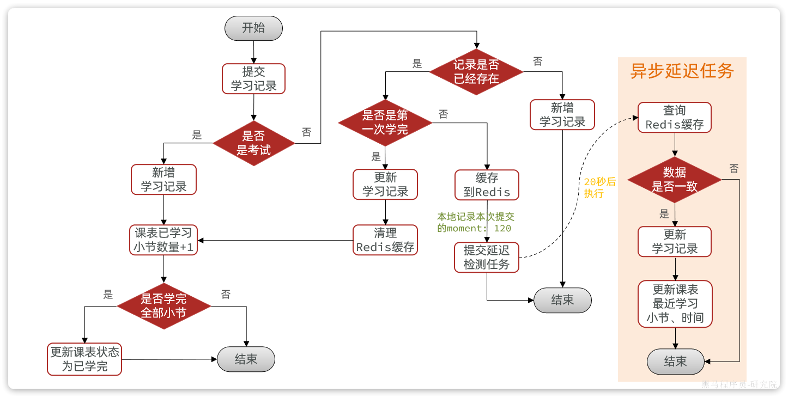

# 3.延迟任务

为了确定用户提交的播放记录是否变化，我们需要将播放记录保存为一个延迟任务，等待超过一个提交周期（20s）后检查播放进度。

那么延迟任务该如何实现呢？

## 3.1.延迟任务方案

延迟任务的实现方案有很多，常见的有四类：

|          |             DelayQueue              |                 Redisson                 |                  MQ                  |            时间轮             |
| :------: | :---------------------------------: | :--------------------------------------: | :----------------------------------: | :---------------------------: |
| **原理** | JDK自带延迟队列，基于阻塞队列实现。 | 基于Redis数据结构模拟JDK的DelayQueue实现 | 利用MQ的特性。例如RabbitMQ的死信队列 |          时间轮算法           |
| **优点** |          不依赖第三方服务           |    分布式系统下可用<br/>不占用JVM内存    |  分布式系统下可以<br/>不占用JVM内存  | 不依赖第三方服务<br/>性能优异 |
| **缺点** |    占用JVM内存<br/>只能单机使用     |              依赖第三方服务              |            依赖第三方服务            |         只能单机使用          |

以上四种方案都可以解决问题，不过本例中我们会使用DelayQueue方案。因为这种方案使用成本最低，而且不依赖任何第三方服务，减少了网络交互。

但缺点也很明显，就是需要占用JVM内存，在数据量非常大的情况下可能会有问题。但考虑到任务存储时间比较短（只有20秒），因此也可以接收。

如果你们的数据量非常大，DelayQueue不能满足业务需求，大家也可以替换为其它延迟队列方式，例如Redisson、MQ等

## 3.2.DelayQueue的原理

首先来看一下DelayQueue的源码：


```java
public class DelayQueue<E extends Delayed> extends AbstractQueue<E>
    implements BlockingQueue<E> {

    private final transient ReentrantLock lock = new ReentrantLock();
    private final PriorityQueue<E> q = new PriorityQueue<E>();
    
    // ... 略
}
```


可以看到DelayQueue实现了BlockingQueue接口，是一个阻塞队列。队列就是容器，用来存储东西的。DelayQueue叫做延迟队列，其中存储的就是**延迟执行的任务**。

我们可以看到DelayQueue的泛型定义：

```java
DelayQueue<E extends Delayed>
```

这说明存入`DelayQueue`内部的元素必须是`Delayed`类型，这其实就是一个延迟任务的规范接口。来看一下：

```java
public interface Delayed extends Comparable<Delayed> {

    /**
     * Returns the remaining delay associated with this object, in the
     * given time unit.
     *
     * @param unit the time unit
     * @return the remaining delay; zero or negative values indicate
     * that the delay has already elapsed
     */
    long getDelay(TimeUnit unit);
}
```

从源码中可以看出，Delayed类型必须具备两个方法：

- `getDelay()`：获取延迟任务的剩余延迟时间
- `compareTo(T t)`：比较两个延迟任务的延迟时间，判断执行顺序

可见，Delayed类型的延迟任务具备两个功能：获取剩余延迟时间、比较执行顺序。当然，我们可以对Delayed做实现和功能扩展，比如添加延迟任务的数据。

将来每一次提交播放记录，就可以将播放记录保存在这样的一个`Delayed`类型的延迟任务里并设定20秒的延迟时间。然后交给`DelayQueue`队列。`DelayQueue`会调用`compareTo`方法，根据剩余延迟时间对任务排序。剩余延迟时间越短的越靠近队首，这样就会被优先执行。

## 3.3.DelayQueue的用法

首先定义一个Delayed类型的延迟任务类，要能保持任务数据。

```java
package com.tianji.learning.utils;

import lombok.Data;

import java.time.Duration;
import java.util.concurrent.Delayed;
import java.util.concurrent.TimeUnit;

@Data
public class DelayTask<D> implements Delayed {
    private D data;
    private long deadlineNanos;

    public DelayTask(D data, Duration delayTime) {
        this.data = data;
        this.deadlineNanos = System.nanoTime() + delayTime.toNanos();
    }

    @Override
    public long getDelay(TimeUnit unit) {
        return unit.convert(Math.max(0, deadlineNanos - System.nanoTime()), TimeUnit.NANOSECONDS);
    }

    @Override
    public int compareTo(Delayed o) {
        long l = getDelay(TimeUnit.NANOSECONDS) - o.getDelay(TimeUnit.NANOSECONDS);
        if(l > 0){
            return 1;
        }else if(l < 0){
            return -1;
        }else {
            return 0;
        }
    }
}
```

接下来就可以创建延迟任务，交给延迟队列保存：

```java
package com.tianji.learning.utils;

import lombok.extern.slf4j.Slf4j;
import org.junit.jupiter.api.Test;

import java.time.Duration;
import java.util.concurrent.DelayQueue;

@Slf4j
class DelayTaskTest {
    @Test
    void testDelayQueue() throws InterruptedException {
        // 1.初始化延迟队列
        DelayQueue<DelayTask<String>> queue = new DelayQueue<>();
        // 2.向队列中添加延迟执行的任务
        log.info("开始初始化延迟任务。。。。");
        queue.add(new DelayTask<>("延迟任务3", Duration.ofSeconds(3)));
        queue.add(new DelayTask<>("延迟任务1", Duration.ofSeconds(1)));
        queue.add(new DelayTask<>("延迟任务2", Duration.ofSeconds(2)));
        // TODO 3.尝试执行任务
        
    }
}
```

最后，补上执行任务的代码：

```java
package com.tianji.learning.utils;

import lombok.extern.slf4j.Slf4j;
import org.junit.jupiter.api.Test;

import java.time.Duration;
import java.util.concurrent.DelayQueue;

@Slf4j
class DelayTaskTest {
    @Test
    void testDelayQueue() throws InterruptedException {
        // 1.初始化延迟队列
        DelayQueue<DelayTask<String>> queue = new DelayQueue<>();
        // 2.向队列中添加延迟执行的任务
        log.info("开始初始化延迟任务。。。。");
        queue.add(new DelayTask<>("延迟任务3", Duration.ofSeconds(3)));
        queue.add(new DelayTask<>("延迟任务1", Duration.ofSeconds(1)));
        queue.add(new DelayTask<>("延迟任务2", Duration.ofSeconds(2)));
        // 3.尝试执行任务
        while (true) {
            DelayTask<String> task = queue.take();
            log.info("开始执行延迟任务：{}", task.getData());
        }
    }
}
```

::: warning

**注意**：

这里我们是直接同一个线程来执行任务了。当没有任务的时候线程会被阻塞。而在实际开发中，我们会准备线程池，开启多个线程来执行队列中的任务。

:::

# 4.代码改造

接下来，我们就可以按照之前分析的方案来改造代码了。

## 4.1.定义延迟任务工具类

首先，我们要定义一个工具类，帮助我们改造整个业务。在提交学习记录业务中，需要用到异步任务和缓存的地方有以下几处：

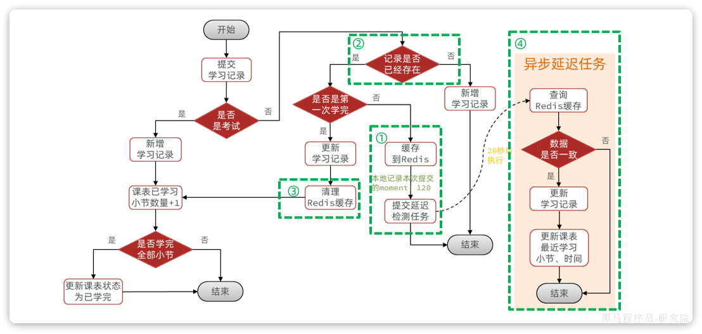

因此，我们的工具类就应该具备上述4个方法：

- ① 添加播放记录到Redis，并添加一个延迟检测任务到DelayQueue
- ② 查询Redis缓存中的指定小节的播放记录
- ③ 删除Redis缓存中的指定小节的播放记录
- ④ 异步执行DelayQueue中的延迟检测任务，检测播放进度是否变化，如果无变化则写入数据库

工具类代码如下：

```java
package com.tianji.learning.utils;

import com.tianji.common.utils.JsonUtils;
import com.tianji.common.utils.StringUtils;
import com.tianji.learning.domain.po.LearningLesson;
import com.tianji.learning.domain.po.LearningRecord;
import com.tianji.learning.mapper.LearningRecordMapper;
import com.tianji.learning.service.ILearningLessonService;
import lombok.Data;
import lombok.NoArgsConstructor;
import lombok.RequiredArgsConstructor;
import lombok.extern.slf4j.Slf4j;
import org.springframework.data.redis.core.StringRedisTemplate;
import org.springframework.stereotype.Component;

import javax.annotation.PostConstruct;
import javax.annotation.PreDestroy;
import java.time.Duration;
import java.time.LocalDateTime;
import java.util.Objects;
import java.util.concurrent.CompletableFuture;
import java.util.concurrent.DelayQueue;

@Slf4j
@Component
@RequiredArgsConstructor
public class LearningRecordDelayTaskHandler {

    private final StringRedisTemplate redisTemplate;
    private final LearningRecordMapper recordMapper;
    private final ILearningLessonService lessonService;
    private final DelayQueue<DelayTask<RecordTaskData>> queue = new DelayQueue<>();
    private final static String RECORD_KEY_TEMPLATE = "learning:record:{}";
    private static volatile boolean begin = true;

    @PostConstruct
    public void init(){
        CompletableFuture.runAsync(this::handleDelayTask);
    }
    @PreDestroy
    public void destroy(){
        begin = false;
        log.debug("延迟任务停止执行！");
    }

    public void handleDelayTask(){
        while (begin) {
            try {
                // 1.获取到期的延迟任务
                DelayTask<RecordTaskData> task = queue.take();
                RecordTaskData data = task.getData();
                // 2.查询Redis缓存
                LearningRecord record = readRecordCache(data.getLessonId(), data.getSectionId());
                if (record == null) {
                    continue;
                }
                // 3.比较数据，moment值
                if(!Objects.equals(data.getMoment(), record.getMoment())) {
                    // 不一致，说明用户还在持续提交播放进度，放弃旧数据
                    continue;
                }

                // 4.一致，持久化播放进度数据到数据库
                // 4.1.更新学习记录的moment
                record.setFinished(null);
                recordMapper.updateById(record);
                // 4.2.更新课表最近学习信息
                LearningLesson lesson = new LearningLesson();
                lesson.setId(data.getLessonId());
                lesson.setLatestSectionId(data.getSectionId());
                lesson.setLatestLearnTime(LocalDateTime.now());
                lessonService.updateById(lesson);
            } catch (Exception e) {
                log.error("处理延迟任务发生异常", e);
            }
        }
    }

    public void addLearningRecordTask(LearningRecord record){
        // 1.添加数据到Redis缓存
        writeRecordCache(record);
        // 2.提交延迟任务到延迟队列 DelayQueue
        queue.add(new DelayTask<>(new RecordTaskData(record), Duration.ofSeconds(20)));
    }

    public void writeRecordCache(LearningRecord record) {
        log.debug("更新学习记录的缓存数据");
        try {
            // 1.数据转换
            String json = JsonUtils.toJsonStr(new RecordCacheData(record));
            // 2.写入Redis
            String key = StringUtils.format(RECORD_KEY_TEMPLATE, record.getLessonId());
            redisTemplate.opsForHash().put(key, record.getSectionId().toString(), json);
            // 3.添加缓存过期时间
            redisTemplate.expire(key, Duration.ofMinutes(1));
        } catch (Exception e) {
            log.error("更新学习记录缓存异常", e);
        }
    }

    public LearningRecord readRecordCache(Long lessonId, Long sectionId){
        try {
            // 1.读取Redis数据
            String key = StringUtils.format(RECORD_KEY_TEMPLATE, lessonId);
            Object cacheData = redisTemplate.opsForHash().get(key, sectionId.toString());
            if (cacheData == null) {
                return null;
            }
            // 2.数据检查和转换
            return JsonUtils.toBean(cacheData.toString(), LearningRecord.class);
        } catch (Exception e) {
            log.error("缓存读取异常", e);
            return null;
        }
    }

    public void cleanRecordCache(Long lessonId, Long sectionId){
        // 删除数据
        String key = StringUtils.format(RECORD_KEY_TEMPLATE, lessonId);
        redisTemplate.opsForHash().delete(key, sectionId.toString());
    }

    @Data
    @NoArgsConstructor
    private static class RecordCacheData{
        private Long id;
        private Integer moment;
        private Boolean finished;

        public RecordCacheData(LearningRecord record) {
            this.id = record.getId();
            this.moment = record.getMoment();
            this.finished = record.getFinished();
        }
    }
    @Data
    @NoArgsConstructor
    private static class RecordTaskData{
        private Long lessonId;
        private Long sectionId;
        private Integer moment;

        public RecordTaskData(LearningRecord record) {
            this.lessonId = record.getLessonId();
            this.sectionId = record.getSectionId();
            this.moment = record.getMoment();
        }
    }
}
```

## 4.2.改造提交学习记录功能

接下来，改造提交学习记录的功能：

```java
package com.tianji.learning.service.impl;

import com.baomidou.mybatisplus.extension.service.impl.ServiceImpl;
import com.tianji.api.client.course.CourseClient;
import com.tianji.api.dto.course.CourseFullInfoDTO;
import com.tianji.api.dto.leanring.LearningLessonDTO;
import com.tianji.api.dto.leanring.LearningRecordDTO;
import com.tianji.common.exceptions.BizIllegalException;
import com.tianji.common.exceptions.DbException;
import com.tianji.common.utils.BeanUtils;
import com.tianji.common.utils.UserContext;
import com.tianji.learning.domain.dto.LearningRecordFormDTO;
import com.tianji.learning.domain.po.LearningLesson;
import com.tianji.learning.domain.po.LearningRecord;
import com.tianji.learning.enums.LessonStatus;
import com.tianji.learning.enums.SectionType;
import com.tianji.learning.mapper.LearningRecordMapper;
import com.tianji.learning.service.ILearningLessonService;
import com.tianji.learning.service.ILearningRecordService;
import com.tianji.learning.utils.LearningRecordDelayTaskHandler;
import lombok.RequiredArgsConstructor;
import org.springframework.stereotype.Service;
import org.springframework.transaction.annotation.Transactional;

import java.time.LocalDateTime;
import java.util.List;

/**
 * <p>
 * 学习记录表 服务实现类
 * </p>
 *
 * @author 虎哥
 * @since 2022-12-10
 */
@Service
@RequiredArgsConstructor
public class LearningRecordServiceImpl extends ServiceImpl<LearningRecordMapper, LearningRecord> implements ILearningRecordService {

    private final ILearningLessonService lessonService;

    private final CourseClient courseClient;

    private final LearningRecordDelayTaskHandler taskHandler;

    @Override
    public LearningLessonDTO queryLearningRecordByCourse(Long courseId) {
        // 1.获取登录用户
        Long userId = UserContext.getUser();
        // 2.查询课表
        LearningLesson lesson = lessonService.queryByUserAndCourseId(userId, courseId);
        // 3.查询学习记录
        // select * from xx where lesson_id = #{lessonId}
        List<LearningRecord> records = lambdaQuery().eq(LearningRecord::getLessonId, lesson.getId()).list();
        // 4.封装结果
        LearningLessonDTO dto = new LearningLessonDTO();
        dto.setId(lesson.getId());
        dto.setLatestSectionId(lesson.getLatestSectionId());
        dto.setRecords(BeanUtils.copyList(records, LearningRecordDTO.class));
        return dto;
    }

    @Override
    @Transactional
    public void addLearningRecord(LearningRecordFormDTO recordDTO) {
        // 1.获取登录用户
        Long userId = UserContext.getUser();
        // 2.处理学习记录
        boolean finished = false;
        if (recordDTO.getSectionType() == SectionType.VIDEO) {
            // 2.1.处理视频
            finished = handleVideoRecord(userId, recordDTO);
        } else {
            // 2.2.处理考试
            finished = handleExamRecord(userId, recordDTO);
        }
        if (!finished) {
            // 没有新学完的小节，无需更新课表中的学习进度
            return;
        }
        // 3.处理课表数据
        handleLearningLessonsChanges(recordDTO);
    }

    private void handleLearningLessonsChanges(LearningRecordFormDTO recordDTO) {
        // 1.查询课表
        LearningLesson lesson = lessonService.getById(recordDTO.getLessonId());
        if (lesson == null) {
            throw new BizIllegalException("课程不存在，无法更新数据！");
        }
        // 2.判断是否有新的完成小节
        boolean allLearned = false;

        // 3.如果有新完成的小节，则需要查询课程数据
        CourseFullInfoDTO cInfo = courseClient.getCourseInfoById(lesson.getCourseId(), false, false);
        if (cInfo == null) {
            throw new BizIllegalException("课程不存在，无法更新数据！");
        }
        // 4.比较课程是否全部学完：已学习小节 >= 课程总小节
        allLearned = lesson.getLearnedSections() + 1 >= cInfo.getSectionNum();

        // 5.更新课表
        lessonService.lambdaUpdate()
                .set(lesson.getLearnedSections() == 0, LearningLesson::getStatus, LessonStatus.LEARNING.getValue())
                .set(allLearned, LearningLesson::getStatus, LessonStatus.FINISHED.getValue())
                .set(allLearned, LearningLesson::getFinishTime, LocalDateTime.now())
                .setSql("learned_sections = learned_sections + 1")
                .eq(LearningLesson::getId, lesson.getId())
                .update();
    }

    private boolean handleVideoRecord(Long userId, LearningRecordFormDTO recordDTO) {
        // 1.查询旧的学习记录
        LearningRecord old = queryOldRecord(recordDTO.getLessonId(), recordDTO.getSectionId());
        // 2.判断是否存在
        if (old == null) {
            // 3.不存在，则新增
            // 3.1.转换PO
            LearningRecord record = BeanUtils.copyBean(recordDTO, LearningRecord.class);
            // 3.2.填充数据
            record.setUserId(userId);
            // 3.3.写入数据库
            boolean success = save(record);
            if (!success) {
                throw new DbException("新增学习记录失败！");
            }
            return false;
        }
        // 4.存在，则更新
        // 4.1.判断是否是第一次完成
        boolean finished = !old.getFinished() && recordDTO.getMoment() * 2 >= recordDTO.getDuration();
        if (!finished) {
            LearningRecord record = new LearningRecord();
            record.setLessonId(recordDTO.getLessonId());
            record.setSectionId(recordDTO.getSectionId());
            record.setMoment(recordDTO.getMoment());
            record.setId(old.getId());
            record.setFinished(old.getFinished());
            taskHandler.addLearningRecordTask(record);
            return false;
        }
        // 4.2.更新数据
        boolean success = lambdaUpdate()
                .set(LearningRecord::getMoment, recordDTO.getMoment())
                .set(LearningRecord::getFinished, true)
                .set(LearningRecord::getFinishTime, recordDTO.getCommitTime())
                .eq(LearningRecord::getId, old.getId())
                .update();
        if (!success) {
            throw new DbException("更新学习记录失败！");
        }
        // 4.3.清理缓存
        taskHandler.cleanRecordCache(recordDTO.getLessonId(), recordDTO.getSectionId());
        return true;
    }

    private LearningRecord queryOldRecord(Long lessonId, Long sectionId) {
        // 1.查询缓存
        LearningRecord record = taskHandler.readRecordCache(lessonId, sectionId);
        // 2.如果命中，直接返回
        if (record != null) {
            return record;
        }
        // 3.未命中，查询数据库
        record = lambdaQuery()
                .eq(LearningRecord::getLessonId, lessonId)
                .eq(LearningRecord::getSectionId, sectionId)
                .one();
        // 4.写入缓存
        taskHandler.writeRecordCache(record);
        return record;
    }

    private boolean handleExamRecord(Long userId, LearningRecordFormDTO recordDTO) {
        // 1.转换DTO为PO
        LearningRecord record = BeanUtils.copyBean(recordDTO, LearningRecord.class);
        // 2.填充数据
        record.setUserId(userId);
        record.setFinished(true);
        record.setFinishTime(recordDTO.getCommitTime());
        // 3.写入数据库
        boolean success = save(record);
        if (!success) {
            throw new DbException("新增考试记录失败！");
        }
        return true;
    }
}
```

# 5.练习

## 5.1.线程池的使用

目前我们的延迟任务执行还是单线程模式，大家将其改造为线程池模式，核心线程数与CPU核数一致即可。

## 5.2.定时任务方案

课堂中我们讲解了基于延迟任务的持久化方案，但定时任务方案也是非常常用的一种。大家可以尝试利用定时任务的方式来解决数据持久化问题。

## 5.3.预习

参考产品原型中与课程互动问答有关的功能：

https://lanhuapp.com/web/#/item/project/product?tid=b688242e-152e-4c39-8737-575cdc992579&pid=4c3fbd53-c67d-4931-8f99-315014a17258&versionId=e46cbec9-556b-4d37-b139-0cef86afc708&docId=9cc41e5c-ae3c-4cf4-b998-d8a73191e649&docType=axure&pageId=ecf09af83b2c44ffad5a032712e0a471&image_id=9cc41e5c-ae3c-4cf4-b998-d8a73191e649&parentId=41070af9-3008-4fae-af7c-0ad1d34ad3fb

还有：

https://lanhuapp.com/web/#/item/project/product?tid=b688242e-152e-4c39-8737-575cdc992579&pid=4c3fbd53-c67d-4931-8f99-315014a17258&versionId=e46cbec9-556b-4d37-b139-0cef86afc708&docId=9cc41e5c-ae3c-4cf4-b998-d8a73191e649&docType=axure&pageId=c4ad6768f647416580bdf2de9a712f6f&image_id=9cc41e5c-ae3c-4cf4-b998-d8a73191e649&parentId=0d006c9d110d4b4dbfea743694c9ca7b

以及后台管理页面：

https://lanhuapp.com/web/#/item/project/product?tid=b688242e-152e-4c39-8737-575cdc992579&pid=ab7fe2ae-9227-48f0-a568-34bd5e3253e5&versionId=3b2e1709-16bc-4e51-a827-567ed194e4a1&docId=4de5995a-c2df-47a9-9466-d471093366bc&docType=axure&pageId=2ef3e5b67dc942ba9a7eb21073635e2b&image_id=4de5995a-c2df-47a9-9466-d471093366bc&parentId=9b0b4862-6d93-40ba-ad14-7334f4fef34e

https://lanhuapp.com/web/#/item/project/product?tid=b688242e-152e-4c39-8737-575cdc992579&pid=ab7fe2ae-9227-48f0-a568-34bd5e3253e5&versionId=3b2e1709-16bc-4e51-a827-567ed194e4a1&docId=4de5995a-c2df-47a9-9466-d471093366bc&docType=axure&pageId=018d93b5ee2e431092c2c43305226d02&image_id=4de5995a-c2df-47a9-9466-d471093366bc&parentId=9b0b4862-6d93-40ba-ad14-7334f4fef34e

思考一下两个问题：

- 互动问答相关接口可能有哪些？
- 互动问答的数据库表该如何设计？

# 6.面试

**面试官：你在开发中参与了哪些功能开发让你觉得比较有挑战性？**

::: warning

答：我参与了整个学习中心的功能开发，其中有很多的学习辅助功能都很有特色。比如视频播放的进度记录。我们网站的课程是以录播视频为主，为了提高用户的学习体验，需要实现视频续播功能。这个功能本身并不复杂，只不过我们产品提出的要求比较高：

- 首先续播时间误差要控制在30秒以内。
- 而且要做到用户突然断开，甚至切换设备后，都可以继续上一次播放

要达成这个目的，使用传统的手段显然是不行的。

首先，要做到切换设备后还能续播，用户的播放进度必须保存在服务端，而不是客户端。

其次，用户突然断开或者切换设备，续播的时间误差不能超过30秒，那播放进度的记录频率就需要比较高。我们会在前端每隔15秒就发起一次心跳请求，提交最新的播放进度，记录到服务端。这样用户下一次续播时直接读取服务端的播放进度，就可以将时间误差控制在15秒左右。

:::

**面试官：那播放进度在服务端保存在哪里呢？是数据库吗？如果是数据库，如何解决高频写入给数据库带来巨大压力？**

::: warning

答：

提交播放记录最终肯定是要保存到数据库中的。因为我们不仅要做视频续播，还有用户学习计划、学习进度统计等功能，都需要用到用户的播放记录数据。

但确实如你所说，前端每隔15秒一次请求，如果在用户量较大时，直接全部写入数据库，对数据库压力会比较大。因此我们采用了合并写请求的方案，当用户提交播放进度时会先缓存在Redis中，后续再将数据保存到数据库即可。

由于播放进度会不断覆盖，只保留最后一次即可。这样就可以大大减少对于数据库的访问次数和访问频率了。

:::
