# day05-问答系统

一个人学习总是孤独的，而且往往难以坚持。

所以我们的系统设计了一些学习辅助的功能，增强学习的氛围感。包括：

- 互动问答系统
- 学习笔记系统
- 学习评测系统
- 学习积分系统
- 榜单排名系统

通过这套系统让用户感觉到自己不是一个人在学习，有互助、有竞争、有评测，刺激用户持续学习，提升学习效果和用户粘度。

这套系统中包含了很多企业中非常实用的解决方案和技术手段，可以为大家以后的工作提供很大帮助。例如：

- 互动问答功能：在社交类型、学习类型的互联网项目中都有用到
- 点赞功能：电商、社交、学习等等都会用到
- 积分系统：电商、社交、学习等项目中用到
- 排行榜系统：游戏、社交、学习等项目中都有用到
- 学习评测系统：考试、学习类型的项目会用到

在这些解决方案中你能解锁Redis、MQ等热门中间件的各种各样的使用方式。

今天我们首先来看看互动问答系统的设计与实现。

# 1.需求分析

经过几天学习，相信大家对于业务开发已经轻车熟路了，整体流程与以往一样：

- 需求和原型图分析
- 接口统计和设计
- 数据结构设计
- 接口的实现

## 1.1.产品原型

我们首先看看与互动问答有关的原型页面。

### 1.1.1.课程详情页

在用户已经登录的情况下，如果用户购买了课程，在课程详情页可以看到一个互动问答的选项卡：

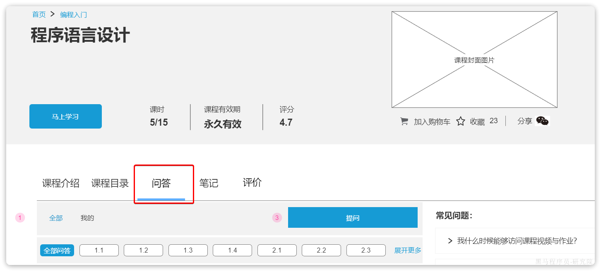

问答选项卡如下：

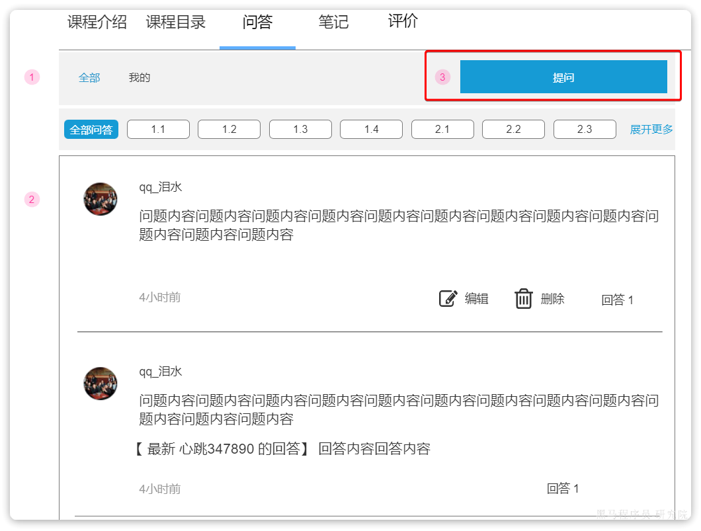

::: warning

1、**问答列表**

- 问答列表可以选择`全部问题`还是`我的问题`，选择`我的问题`则只展示我提问的问题。默认是全部
- 选择章节序号，根据章节号查看章节下对应问答。默认展示所有章节的问题
- 对于我提问的问题，可以做删除、修改操作

2、**跳转逻辑**

- 点击提问按钮，进入问题编辑页面
- 点击问题标题，进入问题详情页
- 点击问题下的回答，进入回答表单

:::

点击提问或编辑按钮会进入问题编辑页面：

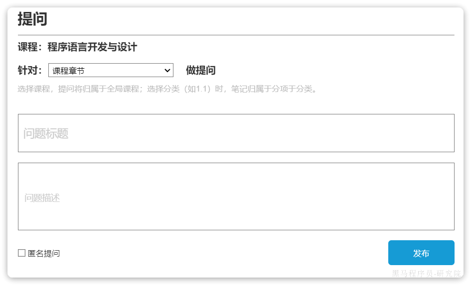

::: warning

**1、表单内容**

- 课程：问题一定关联提问时所在的课程，无需选择
- 章节：可以选择提问知识点对应的章节，也可以不选
- 问题标题：一个概括性描述
- 问题详情：详细问题信息，富文本
- 是否匿名：用户可以选择匿名提问，其它用户不可见提问者信息

:::

点击某个问题，则会进入问题详情页面：

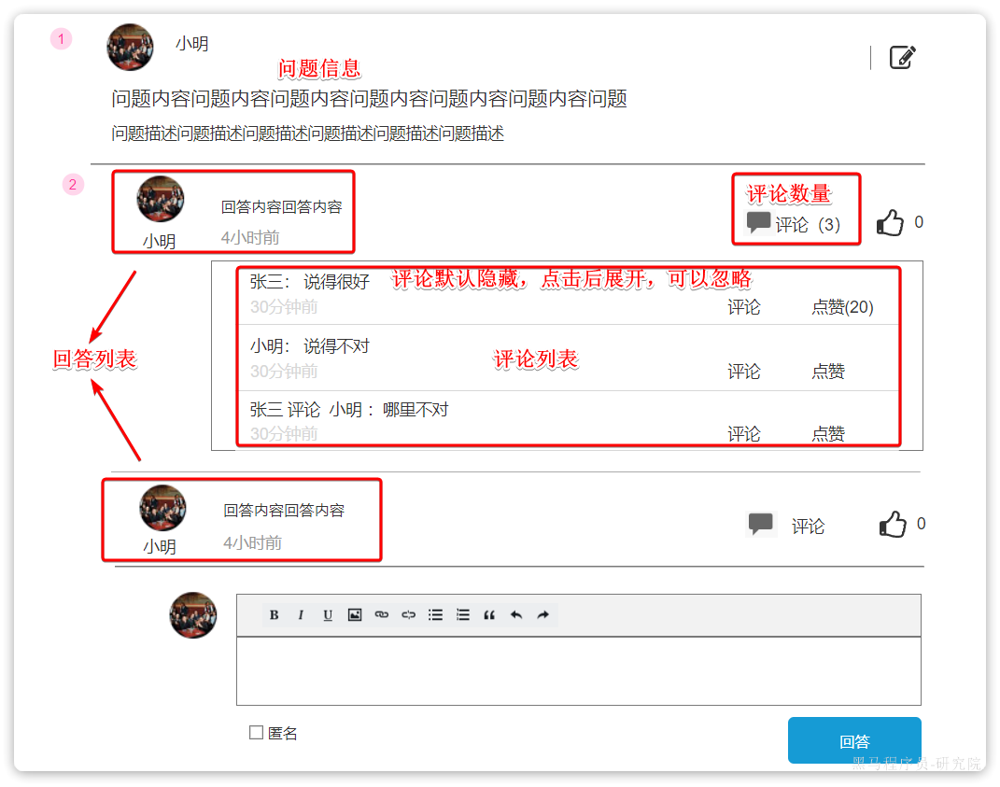

::: warning

1、**页面内容**

- 顶部展示问题相关详细信息
- 任何人都可以对问题做回复，也可以对他人的回答再次回复，无限叠楼。
- 也没渲染只分两层：
  - 对问题的一级回复，称为回答
  - 对回答的回复、对回复的回复，作为第二级，称为评论
- 问题详情页下面展示问题下的所有回答
- 点击回答下的详情才展示二级评论
- 可以对评论、回答点赞

:::

### 1.1.2.视频学习页

另外，在视频学习页面中同样可以看到互动问答功能：

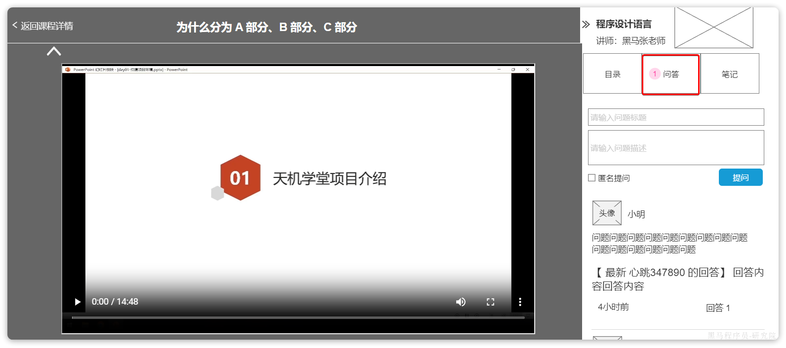

这个页面与课程详情页功能类似，只不过是在观看视频的过程中操作。用户产生学习疑问是可以快速提问，不用退回到课程详情页，用户体验较好。

::: warning

1. **页面逻辑**

- 默认展示视频播放小节下的问答
- 用户可以在这里提问问题，自动与当前课程、当前视频对应章节关联。其它参数与课程详情页的问题表单类似。
- 问答列表默认只显示问题，点击后进入问题详情页才能查看具体答案

:::

### 1.1.3.管理端问答管理页

除了用户端以外，管理端也可以管理互动问答，首先是一个列表页：

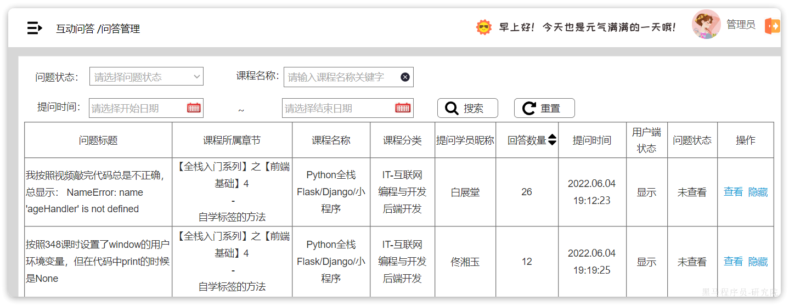

::: warning

**1、搜索**

- 管理员可以搜索用户提出的所有问题
- 搜索结果可以基于页面过滤条件做过滤
  - 问题状态：已查看、未查看两种。标示是否已经被管理员查看过。每当学员在问题下评论，状态重置为未查看
  - 课程名称：由于问题是提问在课程下的，所以会跟课程关联。管理员输入课程名称，搜索该课程下的所有问题
  - 提问时间：提出问题的时间

**2、页面列表**

- 默认按照提问时间倒序排列；点击回答数量时可以根据回答数量排序
- 课程分类：需要展示问题所属课程的三级分类的名称的拼接
- 课程所属章节：如果是在视频页面提问，则问题会与视频对应的章、节关联，则此处显示章名称、节名称。
- 课程名称：提问是针对某个课程的，因此此处显示对应的课程名称
- 回答数量：该问题下的一级回复，称为回答。此处显示问题下的回答的数量，其它评论不统计。
- 用户端状态：隐藏/显示。表示是否在用户端展示，对于一些敏感话题，管理员可以直接隐藏问题。

**3、操作**

- 点击查看：会将该问题标记为已查看状态，并且跳转到问题详情页
- 点击隐藏或显示：控制该问题是否在用户端显示。隐藏问题，则问题下的所有回答和恢复都被隐藏

:::

点击查看按钮，会进入一个问题详情页面：

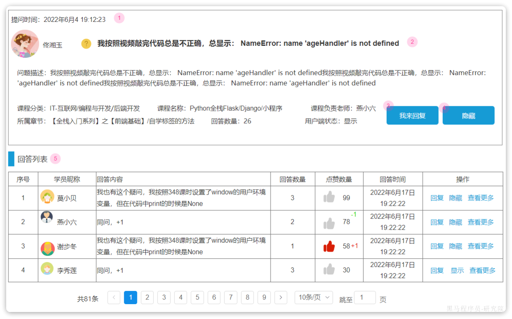

::: warning

**1、问题详情**

- 页面顶部是问题详情，展示信息与问题列表页基本一致
- 点击评论，老师可以回答问题
- 点击隐藏/显示，可以隐藏或显示问题

**2、回答列表**

- 分页展示问题下的回答（一级回复）
- 可以对回答点赞、评论、隐藏
- 点击查看，则进入回答详情页

:::

继续点击查看更多按钮，可以进入回答详情页：

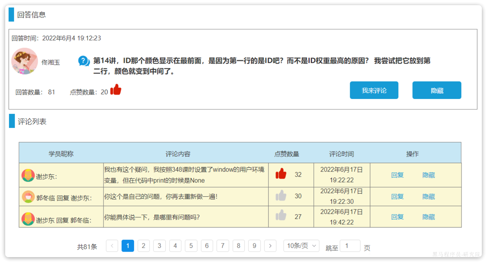

::: warning

**1、回答详情**

- 页面顶部是回答详情，展示信息与回答列表页基本一致
- 点击我来评论，老师可以评论该回答
- 点击隐藏/显示，可以隐藏或显示该回答，该回答下的所有评论也都会被隐藏或显示

**2、评论列表**

- 分页展示回答下的评论
- 可以对评论点赞、回复、隐藏

:::

### 1.1.4.流程总结

整体来说，流程是这样的：

- 学员在学习的过程中可以随时提问问题
- 老师、其他学员都可以回答问题
- 老师、学员也都可以对回答多次回复
- 老师、学员也都可以对评论多次回复
- 老师可以在管理端管理问题、回答、评论的状态

业务流程并不复杂。

## 1.2.接口统计

理论上我们应该先设计所有接口，再继续设计接口对应的表结构。不过由于接口较多，这里我们先对接口做简单统计。然后直接设计数据库，最后边设计接口，边实现接口。

### 1.2.1.问题的CRUD

首先第一个页面，列表展示页：

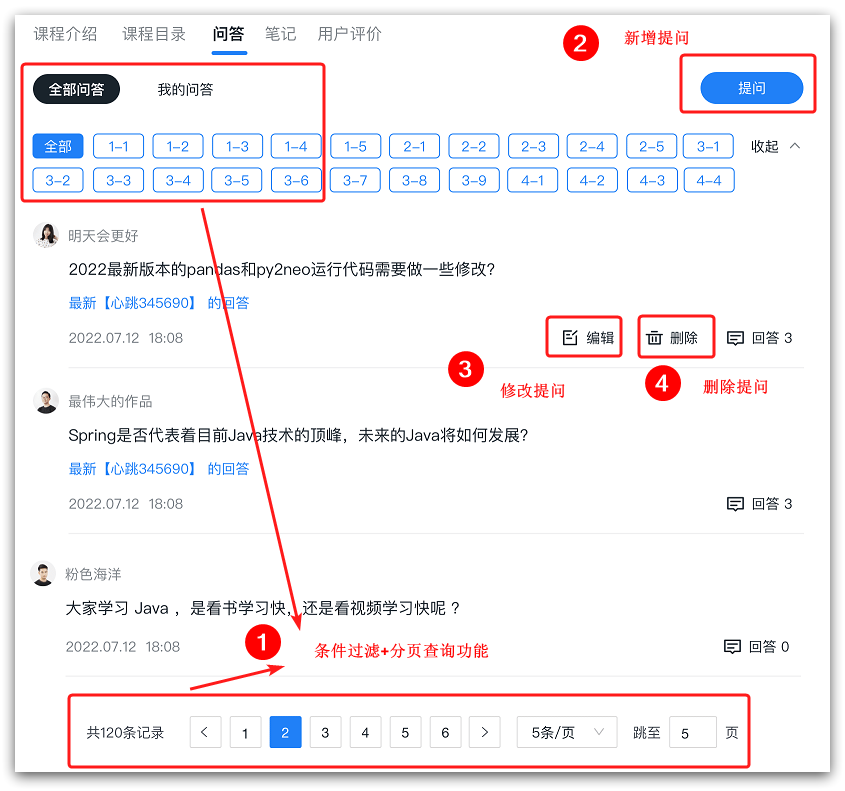

结合原型设计图我们可以看到这里包含4个接口：

- 带条件过滤的分页查询
- 新增提问
- 修改提问
- 删除提问

这些都是基本的CRUD，应该不难。

### 1.2.2.问题的回答和评论

进入问答详情页再看：

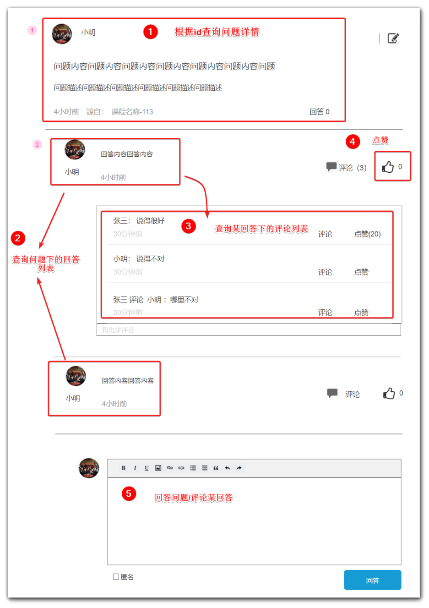

可以看到页面中包含5个接口：

- 根据id查询问题详情
- 分页查询问题下的所有回答
- 分页查询回答下的评论
- 点赞/取消点赞某个回答或评论
- 回答某个提问、评论他人回答

除了点赞功能外，其它接口也都是基本的增删改查，并不复杂。

### 1.2.3.管理端接口

刚才分析的都是用户端的相关接口，这些接口部分可以与管理端共用，但管理端也有自己的特有需求。

管理端也可以分页查询问题列表，而且过滤条件、查询结果会有很大不同：

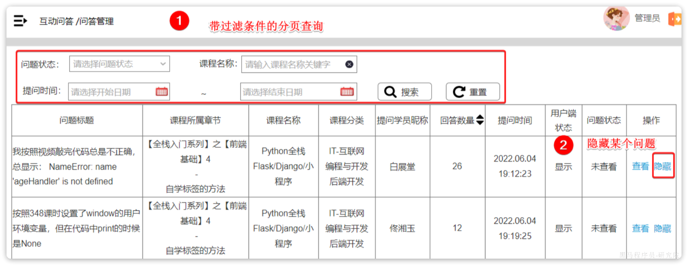

比较明显的有两个接口：

- 管理端分页查询问题列表：与用户端分页查询不通用，功能更复杂，查询条件更多
- 隐藏或显示指定问题

除此以外，这里有一个问题状态字段，表示管理员是否查看了该问题以及问题中的回答。默认是未查看状态；当管理员点击查看后，状态会变化为已查看；当**学员**再次回答或评论，状态会再次变为未查看。

因此，需要注意的是：

- 每当用户点击查看按钮，需要根据根据id查询问题详情，此时应标记问题状态为已查看
- 每当**学员**回答或评论时，需要将问题标记为未查看

管理端也会有回答列表、评论列表。另外，回答和评论同样有隐藏功能。

问题详情和回答列表：

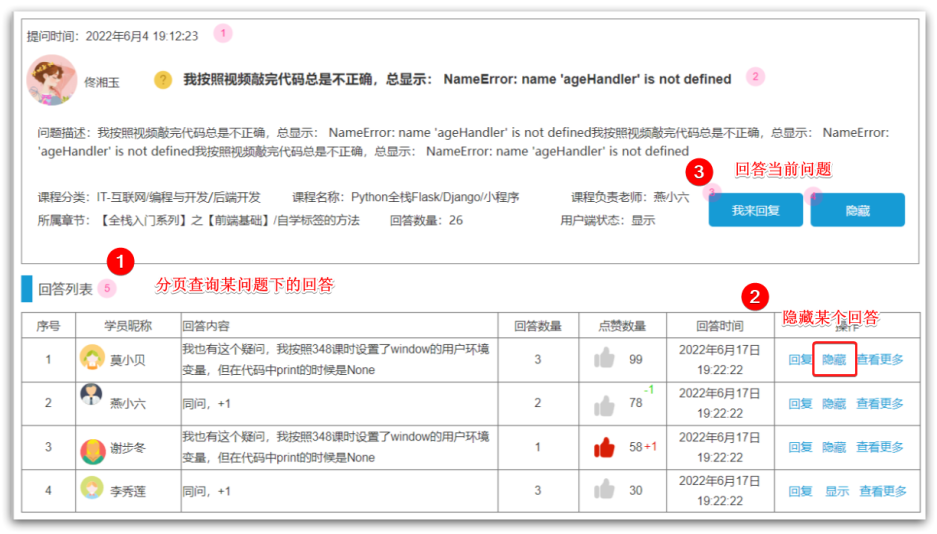

还有评论列表：

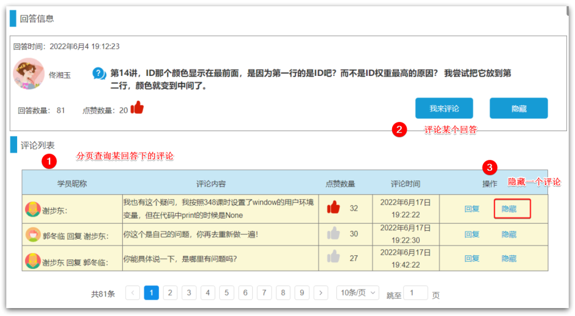

总结一下，回答和评论包含的接口有：

- 管理端根据id查询问题详情
- 分页查询问题下的回答
- 分页查询回答下的评论
- 点赞/取消点赞某个回答或评论
- 隐藏/显示指定回答或评论
- 回答某个提问、评论他人回答、评论（与用户端共用）

### 1.2.4.总结

综上，与问答系统有关的接口有：

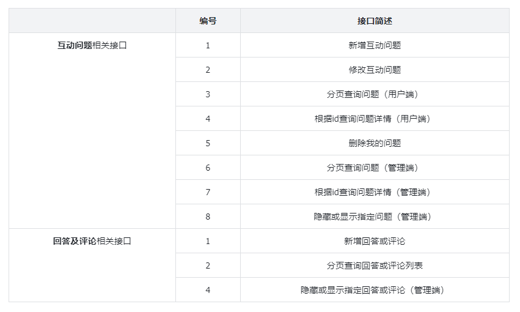

# 2.数据结构

从原型图不难看出，这部分功能主要涉及两个实体：

- 问题
- 回答/评论：回答、评论可以看做一类实体

因此核心要设计的就是这两张表。

## 2.1.ER图

### 2.1.1.问题

首先是`问题`，通过新增提问的表单可以看出`问题`包含的属性：

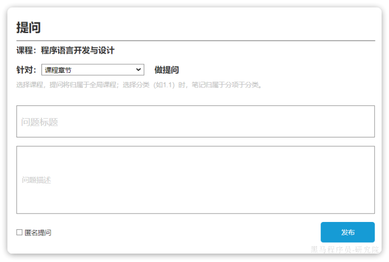

基本属性：

- 标题
- 描述

关联信息：

- 用户id：也就是提问的人
- 课程id
- 章id
- 节id

功能字段：

- 是否是匿名

另外，在问题列表中，需要知道问题最新的一个回答的信息：

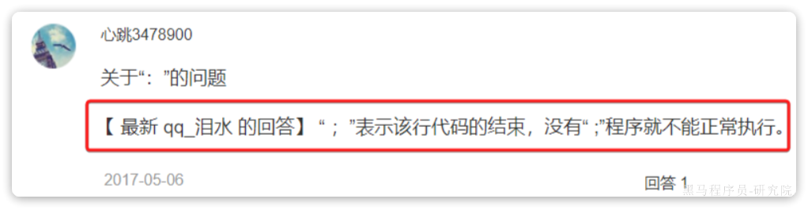

如果每次分页查询问题的时候再去统计最新的回答是哪个，效率比较低。我们可以直接在每次有新回答时将这个id记录到问题表中。因此问题表中需要添加这样一个字段：

- 最新一次回答的id

除了这些字段以外，管理端分页查询问题列表时也有一些功能字段：

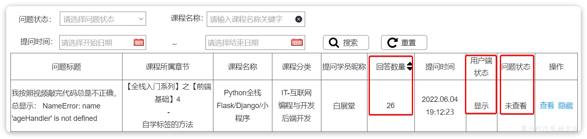

功能字段：

- 问题下的回答数量
- 用户端显示状态：是否被隐藏
- 问题状态：管理端是否已经查看

综上，问题的ER图如下：

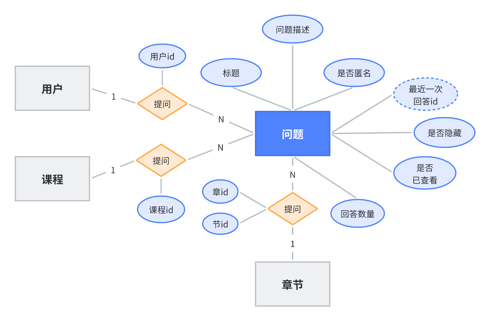

### 2.1.2.回答、评论

回答和评论的属性基本一致，差别就是：

- 回答的对象是问题
- 评论的对象是其它回答或评论

来看下原型图：

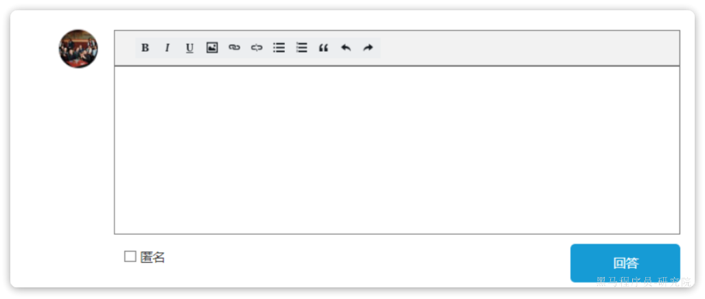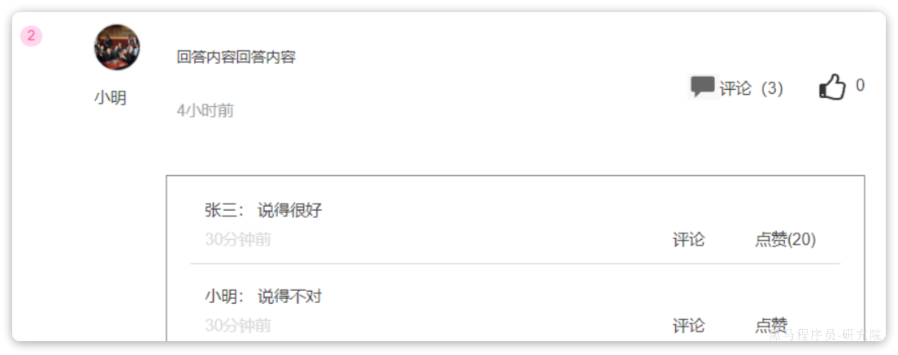

首先是基本属性：

- 回答的内容

功能字段：

- 是否是匿名
- 点赞数量

然后是关联信息：

- 用户id：也就是回答的人
- 问题id：无论是回答、评论，都属于某个问题

接下来是评论的特有属性：

- 回答id：一个回答下会有很多评论，评论之间也会相互评论，但我们把回答下所有评论作为一层来展示。因此该回答下的所有评论都应记住所属的回答的id
- 目标用户id：评论针对的目标用户，页面显示为 `张三评论了李四`
- 目标评论id：评论针对的目标评论的id

综上，评论的ER图为：

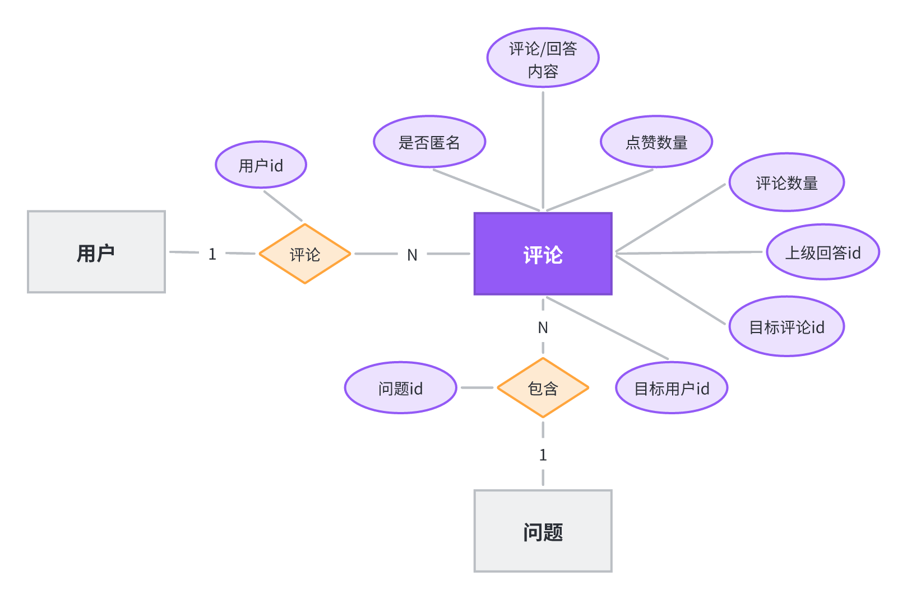

## 2.2.数据库表

结合ER图，表结构就非常清楚了，会包含两张表：

- 问题表
- 回复表：回答和评论都是回复，在一张表

### 2.2.1.问题表

首先是问题表：

```sql
CREATE TABLE IF NOT EXISTS `interaction_question` (
  `id` bigint NOT NULL COMMENT '主键，互动问题的id',
  `title` varchar(255) CHARACTER SET utf8mb4 COLLATE utf8mb4_0900_ai_ci NOT NULL COMMENT '互动问题的标题',
  `description` varchar(2048) CHARACTER SET utf8mb4 COLLATE utf8mb4_0900_ai_ci NOT NULL DEFAULT '' COMMENT '问题描述信息',
  `course_id` bigint NOT NULL COMMENT '所属课程id',
  `chapter_id` bigint NOT NULL COMMENT '所属课程章id',
  `section_id` bigint NOT NULL COMMENT '所属课程节id',
  `user_id` bigint NOT NULL COMMENT '提问学员id',
  `latest_answer_id` bigint DEFAULT NULL COMMENT '最新的一个回答的id',
  `answer_times` int unsigned NOT NULL DEFAULT '0' COMMENT '问题下的回答数量',
  `anonymity` bit(1) NOT NULL DEFAULT b'0' COMMENT '是否匿名，默认false',
  `hidden` bit(1) NOT NULL DEFAULT b'0' COMMENT '是否被隐藏，默认false',
  `status` tinyint DEFAULT '0' COMMENT '管理端问题状态：0-未查看，1-已查看',
  `create_time` datetime NOT NULL DEFAULT CURRENT_TIMESTAMP COMMENT '提问时间',
  `update_time` datetime NOT NULL DEFAULT CURRENT_TIMESTAMP ON UPDATE CURRENT_TIMESTAMP COMMENT '更新时间',
  PRIMARY KEY (`id`) USING BTREE,
  KEY `idx_course_id` (`course_id`) USING BTREE,
  KEY `section_id` (`section_id`),
  KEY `user_id` (`user_id`)
) ENGINE=InnoDB DEFAULT CHARSET=utf8mb4 COLLATE=utf8mb4_0900_ai_ci ROW_FORMAT=DYNAMIC COMMENT='互动提问的问题表';
```

### 2.2.3.回答或评论

回答和评论合为一张表，称为评论表：

```sql
CREATE TABLE IF NOT EXISTS `interaction_reply` (
  `id` bigint NOT NULL COMMENT '互动问题的回答id',
  `question_id` bigint NOT NULL COMMENT '互动问题问题id',
  `answer_id` bigint DEFAULT '0' COMMENT '回复的上级回答id',
  `user_id` bigint NOT NULL COMMENT '回答者id',
  `content` varchar(255) CHARACTER SET utf8mb4 COLLATE utf8mb4_0900_ai_ci NOT NULL COMMENT '回答内容',
  `target_user_id` bigint DEFAULT '0' COMMENT '回复的目标用户id',
  `target_reply_id` bigint DEFAULT '0' COMMENT '回复的目标回复id',
  `reply_times` int NOT NULL DEFAULT '0' COMMENT '评论数量',
  `liked_times` int NOT NULL DEFAULT '0' COMMENT '点赞数量',
  `hidden` bit(1) NOT NULL DEFAULT b'0' COMMENT '是否被隐藏，默认false',
  `anonymity` bit(1) NOT NULL DEFAULT b'0' COMMENT '是否匿名，默认false',
  `create_time` datetime NOT NULL DEFAULT CURRENT_TIMESTAMP COMMENT '创建时间',
  `update_time` datetime NOT NULL DEFAULT CURRENT_TIMESTAMP ON UPDATE CURRENT_TIMESTAMP COMMENT '更新时间',
  PRIMARY KEY (`id`) USING BTREE,
  KEY `idx_question_id` (`question_id`) USING BTREE
) ENGINE=InnoDB DEFAULT CHARSET=utf8mb4 COLLATE=utf8mb4_0900_ai_ci ROW_FORMAT=DYNAMIC COMMENT='互动问题的回答或评论';
```

## 2.3.代码生成

接下来，利用MP插件自动代码生成对应的代码。不过在这之前，不要忘了创建新的功能分支。这里我们是互动问答功能，我们在dev分支基础上创建一个问答分支：`feature-qa`

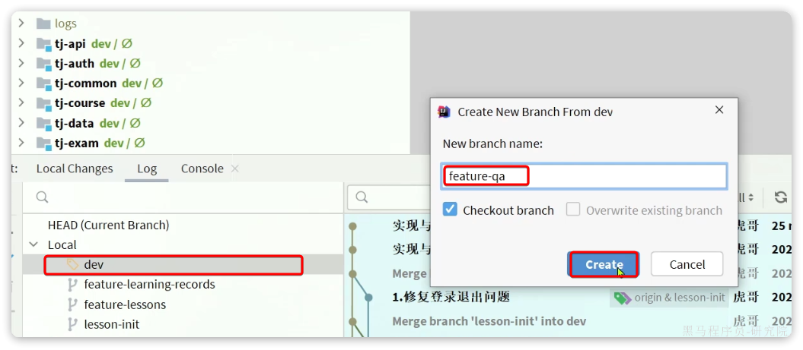

然后再生成代码即可。

### 2.3.1.controller

注意把controller路径修改为Restful风格：

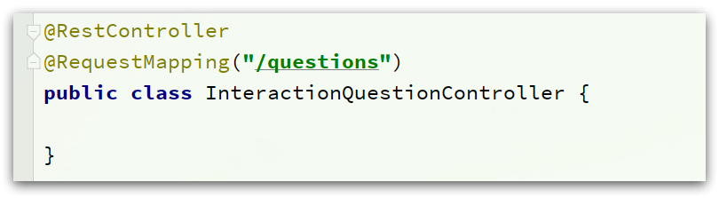

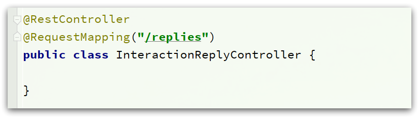

### 2.3.2.ID策略

问题和评论的id都采用雪花算法：

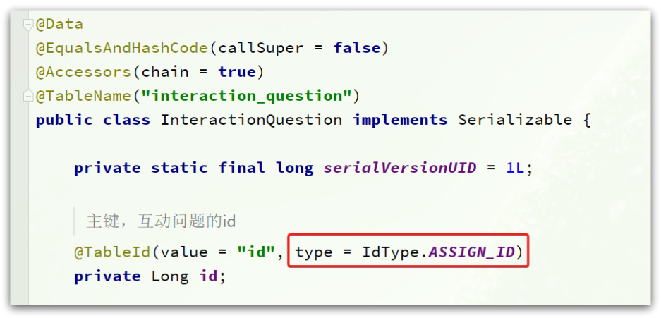

评论：

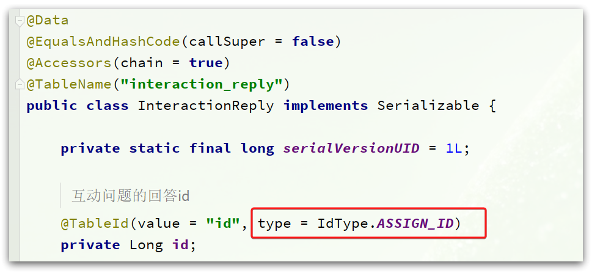

### 2.3.3.状态枚举

问题存在已查看和未查看两种状态，我们定义出一个枚举来标示：

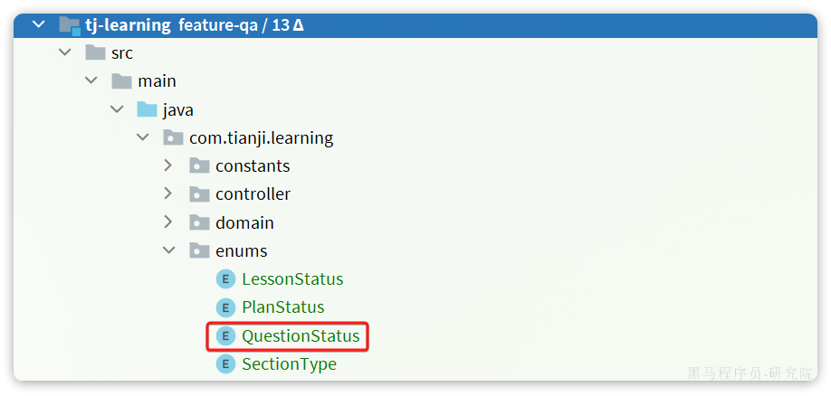

具体代码：

```java
@Getter
public enum QuestionStatus implements BaseEnum {
    UN_CHECK(0, "未查看"),
    CHECKED(1, "已查看"),
    ;
    @JsonValue
    @EnumValue
    int value;
    String desc;

    QuestionStatus(int value, String desc) {
        this.value = value;
        this.desc = desc;
    }

    @JsonCreator(mode = JsonCreator.Mode.DELEGATING)
    public static QuestionStatus of(Integer value){
        if (value == null) {
            return null;
        }
        for (QuestionStatus status : values()) {
            if (status.equalsValue(value)) {
                return status;
            }
        }
        return null;
    }
}
```

然后把`InteractionQuestion`类中的状态修改为枚举类型：

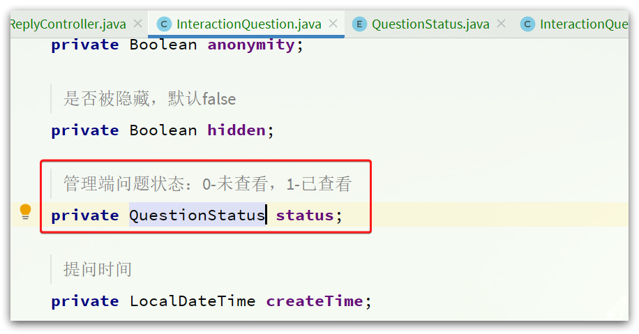

# 3.问题相关接口

问题相关接口在管理端和用户端存在一些差异，在设计接口时一定要留意。另外，此处我们只带大家实现其中的部分接口：

- 新增互动问题
- 用户端分页查询问题
- 根据id查询问题详情
- 管理端分页查询问题

其它的接口留给大家作为练习，包括：

- 管理端根据id查询问题详情
- 修改问题
- 删除问题
- 管理端隐藏或显示问题
- 新增回答或评论
- 分页查询回答或评论
- 管理端分页查询回答或评论
- 管理端隐藏或显示回答、评论

## 3.1.新增问题

### 3.1.1.接口分析

首先还是看原型图，新增的表单如下：


通过新增的问题的表单即可分析出接口的请求参数信息了，然后按照Restful的风格设计即可：

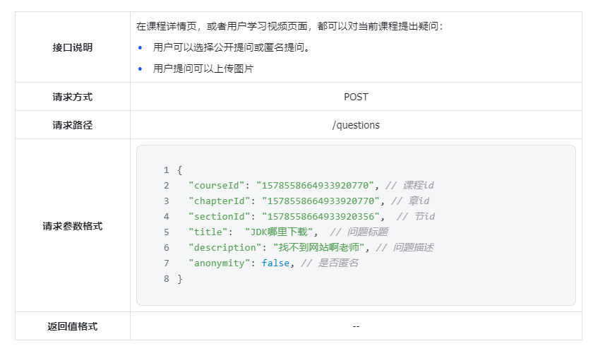

### 3.1.2.实体类

新增业务中无返回值，只需要设计出入参对应的DTO即可，在课前资料中已经提供好了：

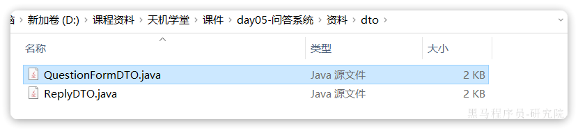

复制到`tj-learning`模块下的`domain`下的`dto`包下：

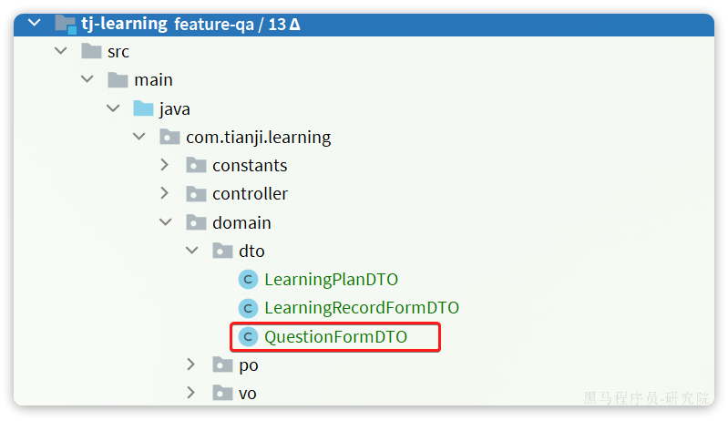

### 3.1.3.代码实现

首先是`tj-learning`中的`InteractionQuestionController`：

```java
@RestController
@RequestMapping("/questions")
@RequiredArgsConstructor
public class InteractionQuestionController {

    private final IInteractionQuestionService questionService;

    @ApiOperation("新增提问")
    @PostMapping
    public void saveQuestion(@Valid @RequestBody QuestionFormDTO questionDTO){
        questionService.saveQuestion(questionDTO);
    }
}
```

然后是`tj-learning`中的`IInteractionQuestionService`接口：

```java
public interface IInteractionQuestionService extends IService<InteractionQuestion> {
    void saveQuestion(QuestionFormDTO questionDTO);
}
```

最后是`tj-learning`中的`InteractionQuestionServiceImpl`实现类：

```java
@Service
@RequiredArgsConstructor
public class InteractionQuestionServiceImpl extends ServiceImpl<InteractionQuestionMapper, InteractionQuestion> implements IInteractionQuestionService {
    
    private final IInteractionQuestionDetailService detailService;

    @Override
    @Transactional
    public void saveQuestion(QuestionFormDTO questionDTO) {
        // 1.获取登录用户
        Long userId = UserContext.getUser();
        // 2.数据转换
        InteractionQuestion question = BeanUtils.toBean(questionDTO, InteractionQuestion.class);
        // 3.补充数据
        question.setUserId(userId);
        // 4.保存问题
        save(question);

        // 5.问题详情
        InteractionQuestionDetail detail = new InteractionQuestionDetail();
        detail.setId(question.getId());
        detail.setDescription(questionDTO.getDescription());
        detailService.save(detail);
    }
}
```

## 3.2.修改问题（练习）

### 3.2.1.接口分析

修改与新增表单基本类似，此处不再分析。我们可以参考新增的接口，然后按照Restful的风格设计为更新即可：

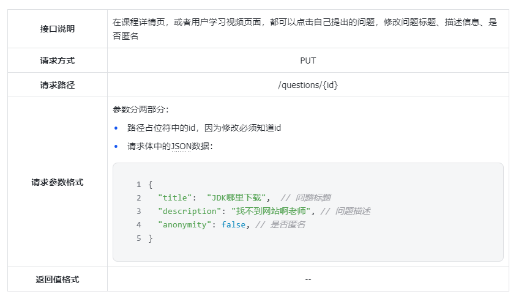

虽然修改问题时提交的JSON参数会少一些，不过依然可以沿用新增时的DTO.

### 3.2.2.代码实现（练习）

## 3.3.用户端分页查询问题

### 3.1.1.接口分析

先看原型图：

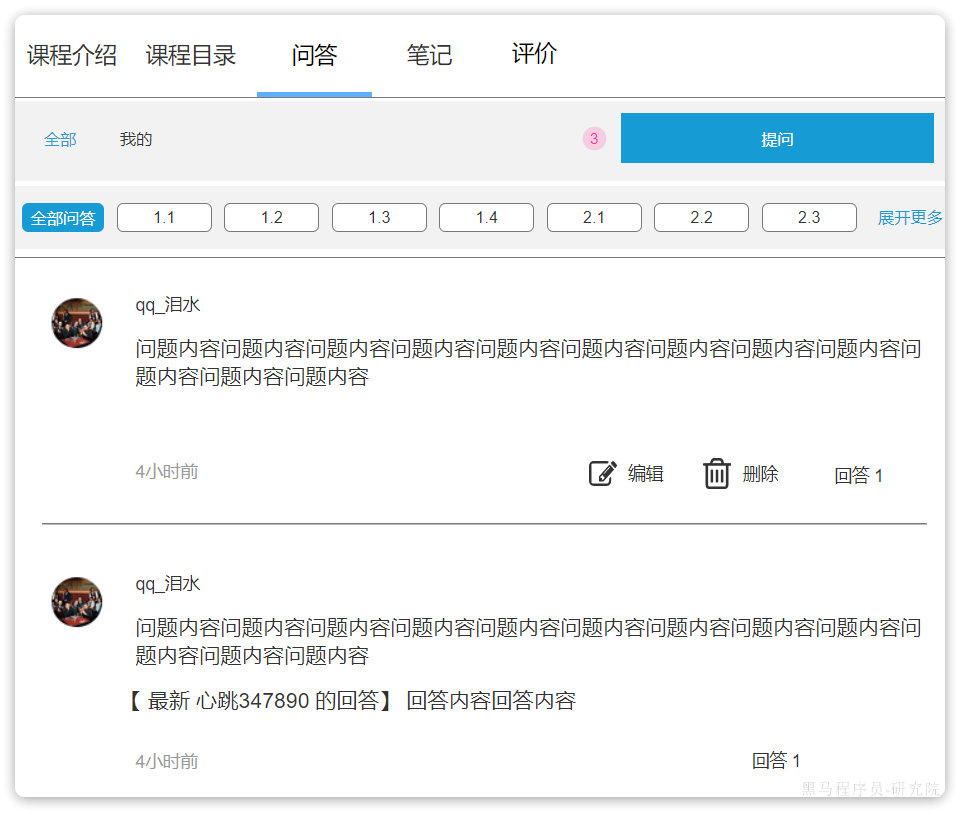

这就是一个典型的分页查询。主要分析请求参数和返回值就行了。

请求参数就是过滤条件，页面可以看到的条件有：

- 分页条件
- 全部回答/我的回答：也就是要不要基于用户id过滤
- 课程id：隐含条件，因为问题列表是在某课程详情页面查看的，所以一定要以课程id为条件
- 章节id：可选条件，当用户点击小节时传递

返回值格式，从页面可以看到属性有：

- 是否匿名：如果提交问题是选择了匿名，则页面不能展示用户信息
- 用户id：匿名则不显示
- 用户头像：匿名则不显示
- 用户名称：匿名则不显示
- 问题标题
- 提问时间
- 回答数量
- 最近一次回答的信息：
  - 回答人名称
  - 回答内容

综上，按照Restful来设计接口，信息如下：

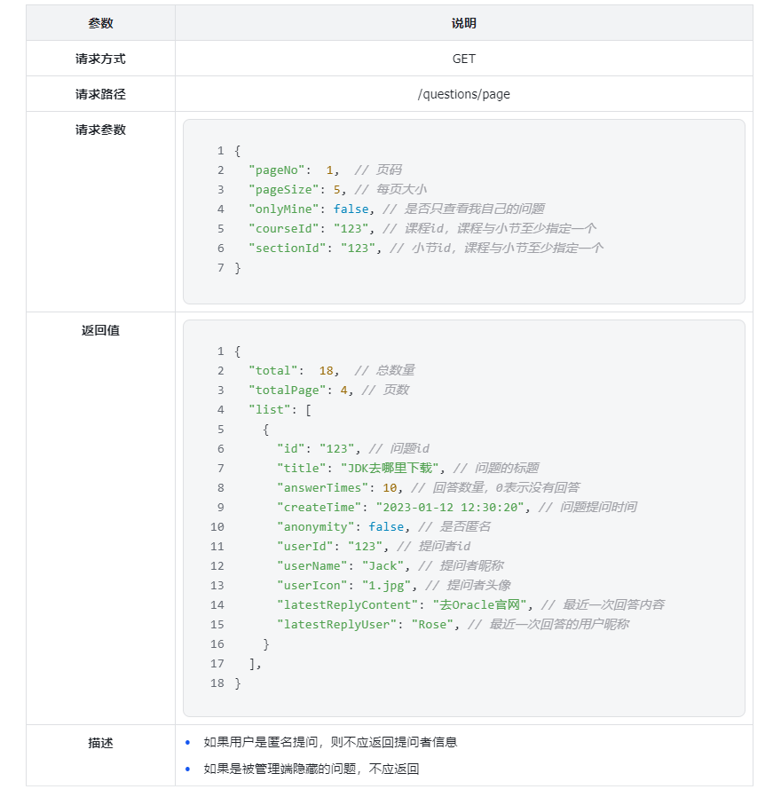

### 3.1.2.实体类

首先是请求参数，查询类型我们定义为Query，在课前资料中已经提供了：

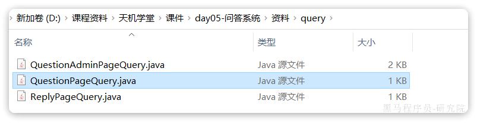

需要注意的是，`QuestionPageQuery`是继承自`tj-common`中通用的`PageQuery`，这样就无需重复定义分页查询参数了：

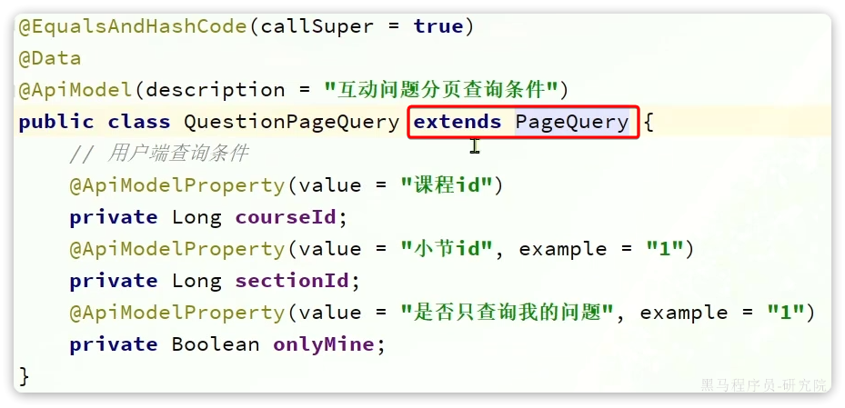

然后是返回值，页面视图对象，我们定义为VO，在课前资料中已经提供了：

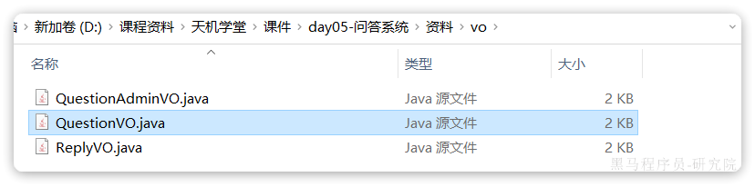

我们将VO和Query实体分别放到domain包的vo包和query包下：

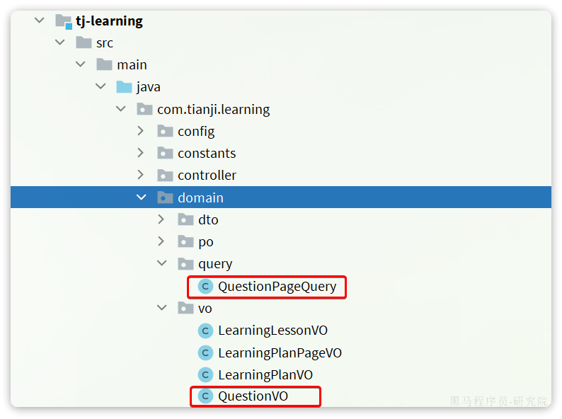

### 3.1.3.声明接口

首先是`tj-learning`中的`com.tianji.learning.controller.InteractionQuestionController`

```java
package com.tianji.learning.controller;


import com.tianji.common.domain.dto.PageDTO;
import com.tianji.learning.domain.query.QuestionPageQuery;
import com.tianji.learning.domain.vo.QuestionVO;
import com.tianji.learning.service.IInteractionQuestionService;
import io.swagger.annotations.Api;
import io.swagger.annotations.ApiOperation;
import io.swagger.annotations.ApiParam;
import lombok.RequiredArgsConstructor;
import org.springframework.web.bind.annotation.*;

/**
 * <p>
 * 互动提问的问题表 前端控制器
 * </p>
 */
@RestController
@RequestMapping("/questions")
@Api(tags = "互动问答相关接口")
@RequiredArgsConstructor
public class InteractionQuestionController {

    private final IInteractionQuestionService questionService;

    @ApiOperation("分页查询互动问题")
    @GetMapping("page")
    public PageDTO<QuestionVO> queryQuestionPage(QuestionPageQuery query){
        return questionService.queryQuestionPage(query);
    }

}
```

然后是`tj-learning`中的`com.tianji.learning.service.IInteractionQuestionService`接口：

```java
package com.tianji.learning.service;

import com.baomidou.mybatisplus.extension.service.IService;
import com.tianji.common.domain.dto.PageDTO;
import com.tianji.learning.domain.query.QuestionPageQuery;
import com.tianji.learning.domain.vo.QuestionVO;

/**
 * <p>
 * 互动提问的问题表 服务类
 * </p>
 */
public interface IInteractionQuestionService extends IService<InteractionQuestion> {

    PageDTO<QuestionVO> queryQuestionPage(QuestionPageQuery query);
}
```

最后是`tj-learning`中的`com.tianji.learning.service.impl.InteractionQuestionServiceImpl`实现类：

```java
package com.tianji.learning.service.impl;

import com.tianji.learning.domain.query.QuestionPageQuery;
import com.tianji.learning.domain.vo.QuestionVO;
import com.tianji.learning.service.IInteractionQuestionService;
import org.springframework.stereotype.Service;

import java.time.LocalDateTime;
import java.util.*;

/**
 * <p>
 * 互动提问的问题表 服务实现类
 * </p>
 */
@Service
@RequiredArgsConstructor
public class InteractionQuestionServiceImpl extends ServiceImpl<InteractionQuestionMapper, InteractionQuestion> implements IInteractionQuestionService {

    @Override
    public PageDTO<QuestionVO> queryQuestionPage(QuestionPageQuery query) {
        
        return null;
    }
}
```

### 3.1.4.查询用户信息

由于页面VO中需要提问者信息、最近一次回答信息，都需要查询出用户昵称、头像等。而数据库中仅仅保存了提问人的id、回答人的id。

这就要求我们能够根据用户id去查询出用户的详细信息。

而用户信息全部都在`tj-user`模块对应的`user-service`服务中。所以我们需要远程调用`user-service`以获取这些数据。

好在user-service已经提供了查询用户的Feign客户端，并且统一定义到了`tj-api`模块中：

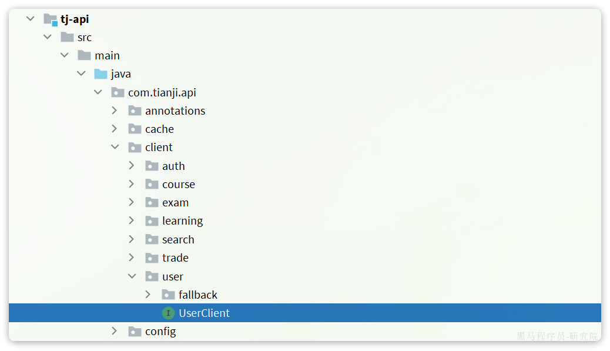

其中有这样的一个API：

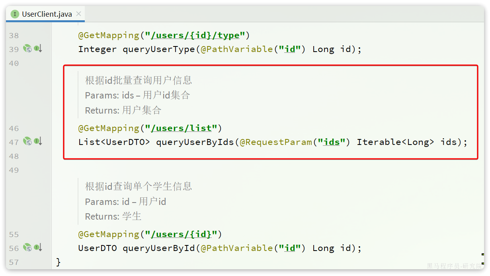

恰好就能实现根据id集合查询用户信息集合的功能。

而且返回的UserDTO中数据非常丰富，完全能够满足我们的需要：

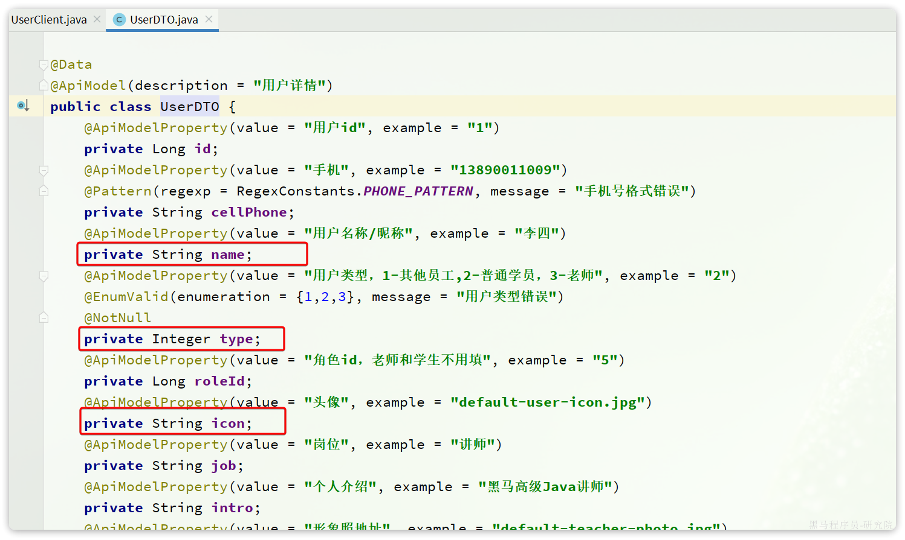

### 3.1.5.实现查询逻辑

查询的实现逻辑如下：

```java
package com.tianji.learning.service.impl;

import com.baomidou.mybatisplus.core.conditions.query.QueryWrapper;
import com.baomidou.mybatisplus.extension.plugins.pagination.Page;
import com.baomidou.mybatisplus.extension.service.impl.ServiceImpl;
import com.tianji.api.cache.CategoryCache;
import com.tianji.api.client.user.UserClient;
import com.tianji.api.dto.user.UserDTO;
import com.tianji.common.domain.dto.PageDTO;
import com.tianji.common.exceptions.BadRequestException;
import com.tianji.common.utils.BeanUtils;
import com.tianji.common.utils.CollUtils;
import com.tianji.common.utils.StringUtils;
import com.tianji.common.utils.UserContext;
import com.tianji.learning.domain.po.InteractionQuestion;
import com.tianji.learning.domain.po.InteractionReply;
import com.tianji.learning.domain.query.QuestionPageQuery;
import com.tianji.learning.domain.vo.QuestionVO;
import com.tianji.learning.mapper.InteractionQuestionMapper;
import com.tianji.learning.mapper.InteractionReplyMapper;
import com.tianji.learning.service.IInteractionQuestionService;
import lombok.RequiredArgsConstructor;
import org.springframework.stereotype.Service;

import java.time.LocalDateTime;
import java.util.*;
import java.util.stream.Collectors;

/**
 * <p>
 * 互动提问的问题表 服务实现类
 * </p>
 *
 * @author 虎哥
 */
@Service
@RequiredArgsConstructor
public class InteractionQuestionServiceImpl extends ServiceImpl<InteractionQuestionMapper, InteractionQuestion> implements IInteractionQuestionService {

    private final InteractionReplyMapper replyMapper;
    private final UserClient userClient;
    
    @Override
    public PageDTO<QuestionVO> queryQuestionPage(QuestionPageQuery query) {
        // 1.参数校验，课程id和小节id不能都为空
        Long courseId = query.getCourseId();
        Long sectionId = query.getSectionId();
        if (courseId == null && sectionId == null) {
            throw new BadRequestException("课程id和小节id不能都为空");
        }
        // 2.分页查询
        Page<InteractionQuestion> page = lambdaQuery()
                .select(InteractionQuestion.class, info -> !info.getProperty().equals("description"))
                .eq(query.getOnlyMine(), InteractionQuestion::getUserId, UserContext.getUser())
                .eq(courseId != null, InteractionQuestion::getCourseId, courseId)
                .eq(sectionId != null, InteractionQuestion::getSectionId, sectionId)
                .eq(InteractionQuestion::getHidden, false)
                .page(query.toMpPageDefaultSortByCreateTimeDesc());
        List<InteractionQuestion> records = page.getRecords();
        if (CollUtils.isEmpty(records)) {
            return PageDTO.empty(page);
        }
        // 3.根据id查询提问者和最近一次回答的信息
        Set<Long> userIds = new HashSet<>();
        Set<Long> answerIds = new HashSet<>();
        // 3.1.得到问题当中的提问者id和最近一次回答的id
        for (InteractionQuestion q : records) {
            if(!q.getAnonymity()) { // 只查询非匿名的问题
                userIds.add(q.getUserId());
            }
            answerIds.add(q.getLatestAnswerId());
        }
        // 3.2.根据id查询最近一次回答
        answerIds.remove(null);
        Map<Long, InteractionReply> replyMap = new HashMap<>(answerIds.size());
        if(CollUtils.isNotEmpty(answerIds)) {
            List<InteractionReply> replies = replyMapper.selectBatchIds(answerIds);
            for (InteractionReply reply : replies) {
                replyMap.put(reply.getId(), reply);
                if(!reply.getAnonymity()){ // 匿名用户不做查询
                    userIds.add(reply.getUserId());
                }
            }
        }

        // 3.3.根据id查询用户信息（提问者）
        userIds.remove(null);
        Map<Long, UserDTO> userMap = new HashMap<>(userIds.size());
        if(CollUtils.isNotEmpty(userIds)) {
            List<UserDTO> users = userClient.queryUserByIds(userIds);
            userMap = users.stream()
                    .collect(Collectors.toMap(UserDTO::getId, u -> u));
        }

        // 4.封装VO
        List<QuestionVO> voList = new ArrayList<>(records.size());
        for (InteractionQuestion r : records) {
            // 4.1.将PO转为VO
            QuestionVO vo = BeanUtils.copyBean(r, QuestionVO.class);
            voList.add(vo);
            // 4.2.封装提问者信息
            if(!r.getAnonymity()){
                UserDTO userDTO = userMap.get(r.getUserId());
                if (userDTO != null) {
                    vo.setUserName(userDTO.getName());
                    vo.setUserIcon(userDTO.getIcon());
                }
            }

            // 4.3.封装最近一次回答的信息
            InteractionReply reply = replyMap.get(r.getLatestAnswerId());
            if (reply != null) {
                vo.setLatestReplyContent(reply.getContent());
                if(!reply.getAnonymity()){// 匿名用户直接忽略
                    UserDTO user = userMap.get(reply.getUserId());
                    vo.setLatestReplyUser(user.getName());
                }

            }
        }

        return PageDTO.of(page, voList);
    }
}
```

## 3.4.根据id查询问题详情

### 3.4.1.接口分析

先看下详情页原型图：

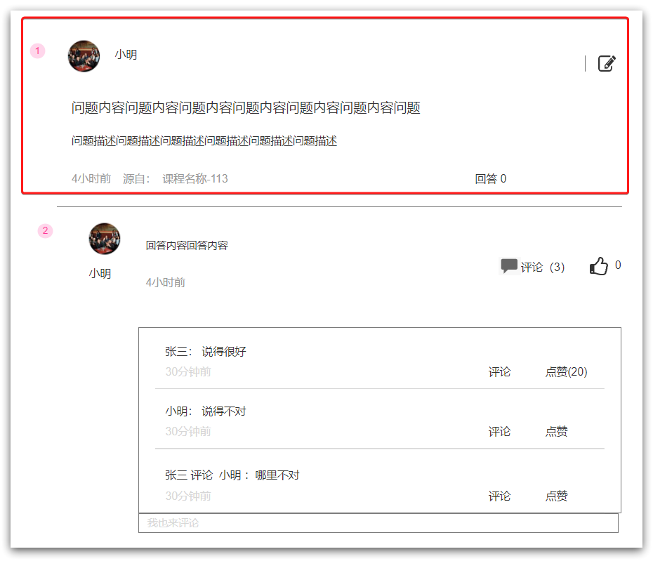

由此可以看出详情页所需要的信息相比分页时，主要多了问题详情，主要字段有：

- 是否匿名
- 用户id：匿名则不显示
- 用户头像：匿名则不显示
- 用户 名称：匿名则不显示
- 问题标题
- 提问时间
- 回答数量
- **问题描述详情**

而请求参数则更加简单了，就是问题的id

然后，再按照Restful风格设计，接口就出来了：

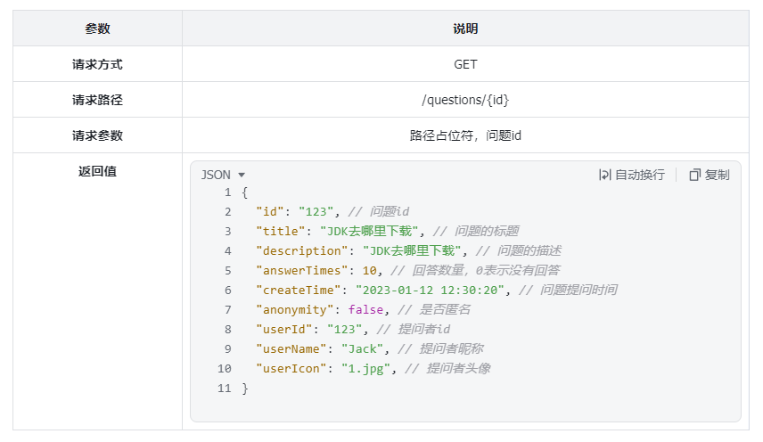

### 3.4.2.实体类

既然仅仅比分页时多了一个字段，我们可以沿用之前分页查询时的VO对象，添加一个新属性即可：

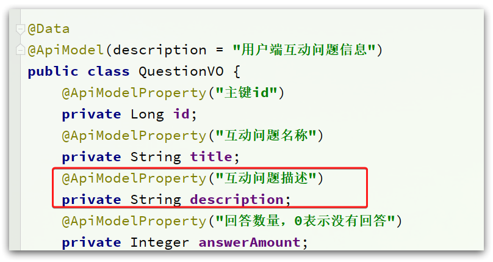

### 3.4.3.代码实现

首先是`tj-learning`中的`InteractionQuestionController`：

```java
@ApiOperation("根据id查询问题详情")
@GetMapping("/{id}")
public QuestionVO queryQuestionById(@ApiParam(value = "问题id", example = "1") @PathVariable("id") Long id){
    return questionService.queryQuestionById(id);
}
```

然后是`tj-learning`中的`IInteractionQuestionService`接口：

```java
QuestionVO queryQuestionById(Long id);
```

最后是`tj-learning`中的`InteractionQuestionServiceImpl`实现类：

```java
@Override
public QuestionVO queryQuestionById(Long id) {
    // 1.根据id查询数据
    InteractionQuestion question = getById(id);
    // 2.数据校验
    if(question == null || question.getHidden()){
        // 没有数据或者是被隐藏了
        return null;
    }
    // 3.查询提问者信息
    UserDTO user = null;
    if(!question.getAnonymity()){
        user = userClient.queryUserById(question.getUserId());
    }
    // 4.封装VO
    QuestionVO vo = BeanUtils.copyBean(question, QuestionVO.class);
    if (user != null) {
        vo.setUserName(user.getName());
        vo.setUserIcon(user.getIcon());
    }
    return vo;
}
```

## 3.5.删除我的问题（练习）

### 3.5.1.接口分析

用户可以删除自己提问的问题，如图：

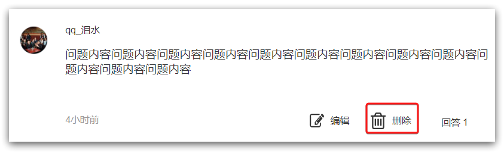

需要注意的是，当用户删除某个问题时，也需要删除问题下的回答、评论。

整体业务流程如下：

- 查询问题是否存在
- 判断是否是当前用户提问的
- 如果不是则报错
- 如果是则删除问题
- 然后删除问题下的回答及评论

接口信息如下：

- **接口地址**:`/questions/{id}`
- **请求方式**:`DELETE`
- **请求参数**: 基于路径占位符，问题id

### 3.5.2.代码实现（练习）

## 3.6.管理端分页查询问题

### 3.6.1.接口分析

在管理端后台存在问答管理列表页，与用户端类似都是分页查询，但是请求参数和返回值有较大差别：

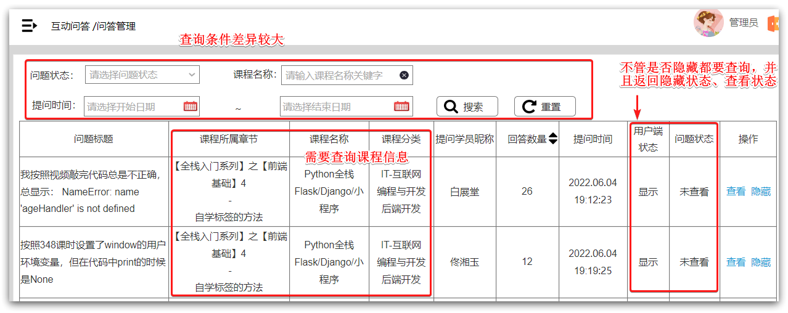

从请求参数来看，除了分页参数，还包含3个：

- 问题的查看状态
- 课程名称
- 提问时间

从返回值来看，比用户端多了一些字段：

- 是否匿名: 管理端不关心，全都展示
- 提问者信息：
  - 用户id
  - 用户头像：匿名则不显示
  - 用户 名称：匿名则不显示
- 问题标题
- 提问时间
- 回答数量
- 最近一次回答的信息：
  - 回答人名称
  - 回答内容
- 问题关联的课程名称
- 问题关联的章、节名称
- 问题关联课程的分类名称

由于请求入参和返回值与用户端有较大差异，因此我们需要设计一个新的接口：

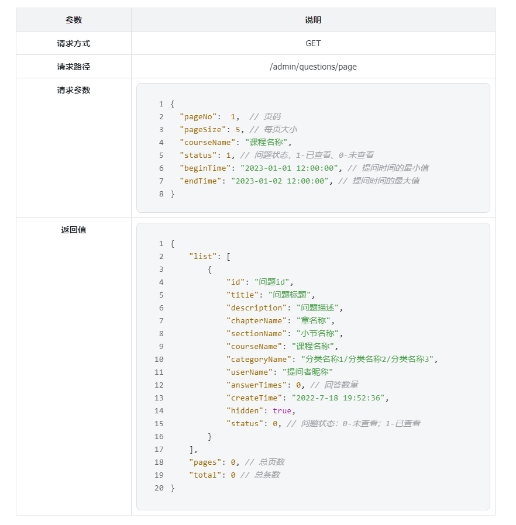

### 3.6.2.实体类

与用户端分页查询问题类似，这里也需要定义Query实体、VO实体。课前资料中已经提供好了：

首先是Query：

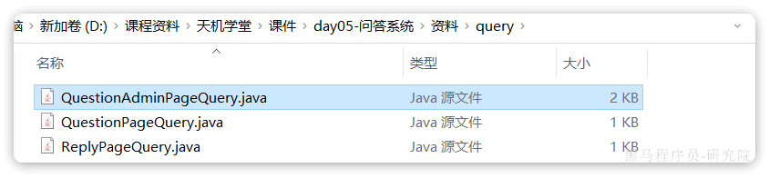

然后是VO：

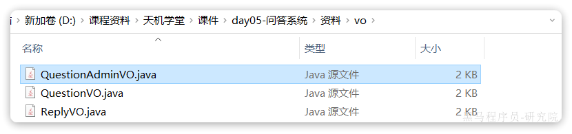

### 3.6.3.接口声明

为了与用户端加以区分，我们定义一个新的controller：

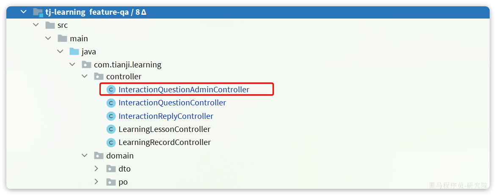

代码如下：

```java
package com.tianji.learning.controller;


import com.tianji.common.domain.dto.PageDTO;
import com.tianji.learning.domain.query.QuestionAdminPageQuery;
import com.tianji.learning.domain.vo.QuestionAdminVO;
import com.tianji.learning.service.IInteractionQuestionService;
import io.swagger.annotations.Api;
import io.swagger.annotations.ApiOperation;
import io.swagger.annotations.ApiParam;
import lombok.RequiredArgsConstructor;
import org.springframework.web.bind.annotation.*;

/**
 * <p>
 * 互动提问的问题表 前端控制器
 * </p>
 *
 * @author 虎哥
 */
@RestController
@RequestMapping("/admin/questions")
@Api(tags = "互动问答相关接口")
@RequiredArgsConstructor
public class InteractionQuestionAdminController {

    private final IInteractionQuestionService questionService;

    @ApiOperation("管理端分页查询互动问题")
    @GetMapping("page")
    public PageDTO<QuestionAdminVO> queryQuestionPageAdmin(QuestionAdminPageQuery query){
        return questionService.queryQuestionPageAdmin(query);
    }
}
```

然后在`tj-learning`的`com.tianji.learning.service.IInteractionQuestionService`中添加方法声明：

```java
PageDTO<QuestionAdminVO> queryQuestionPageAdmin(QuestionAdminPageQuery query);
```

在实现类`com.tianji.learning.service.impl.InteractionQuestionServiceImpl`中实现方法：

```java
@Override
public PageDTO<QuestionAdminVO> queryQuestionsPageForAdmin(QuestionAdminPageQuery query) {
    // TODO
    return null;
}
```

### 3.6.4.课程名称模糊搜索

在管理端的查询条件中有一个根据课程名称搜索：

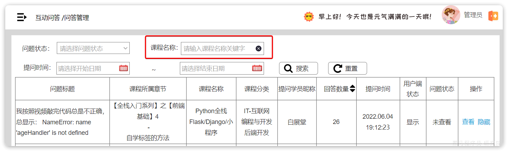

但是，在interaction_question表中，并没有课程名称字段，只有课程id：

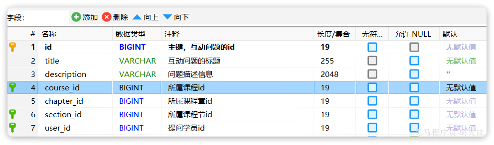

那我们该如何实现模糊搜索呢？

在天机学堂项目中，所有上线的课程数据都会存储到`Elasticsearch`中，方便用户检索课程。并且在`tj-search`模块中提供了相关的查询接口。

其中就有根据课程名称搜索课程信息的功能，并且这个功能还对外开放了一个Feign客户端方便我们调用：

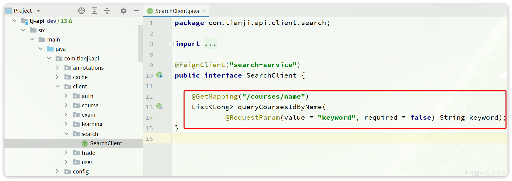

这个接口的请求参数就是课程**名称关键字**，其内部会利用elasticsearch的全文检索功能帮我们查询相关课程，并返回课程id集合。这不正是我们所需要的嘛！

因此，如果前端传递了课程名称关键字，我们的搜索流程如下：

- 首先调用SearchClient接口，根据名称关键字搜索，获取courseId集合
- 判断结果是否为空
  - 如果为空，直接结束，代表没有搜索到
  - 如果不为空，则把得到的courseId集合作为条件，结合其它条件，分页查询问题即可

### 3.6.5.课程分类数据

#### 3.6.5.1.查询思路分析

前面分析过，管理端除了要查询到问题，还需要返回问题所属的一系列信息：

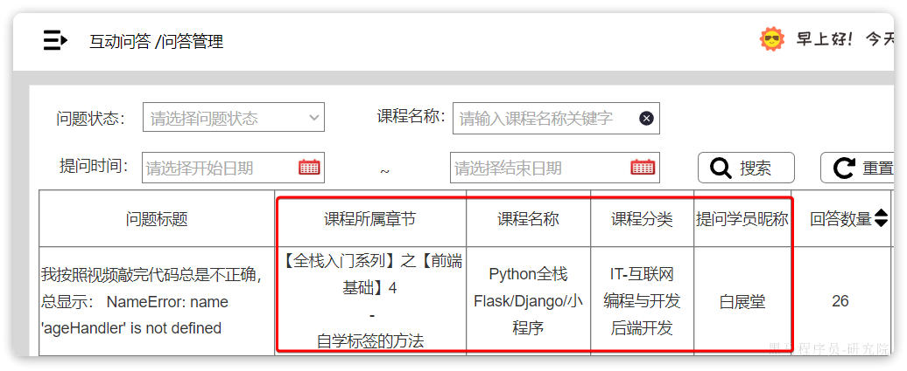

这些数据对应到interaction_question表中，只包含一些id字段：

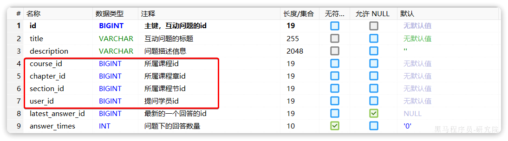

那么我们该如何获取其名称数据呢？

- 课程名称：根据course_id到课程微服务查询
- 章节名称：根据chapter_id和section_id到课程微服务查询
- **分类**：未知
- 提问者名称：根据user_id到用户微服务查询

其中，课程、章节、提问者等信息的查询在以往的业务中我们已经涉及到，不再赘述。但是课程分类信息以前没有查询过。

课程分类在首页就能看到，共分为3级：

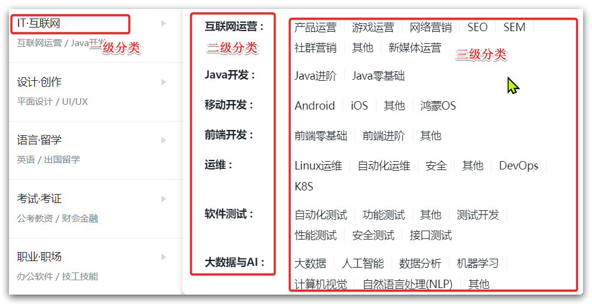

每一个课程都与第三级分类关联，因此向上级追溯，也有对应的二级、一级分类。在课程微服务提供的查询课程的接口中，可以看到返回的课程信息中就包含了关联的一级、二级、三级分类：

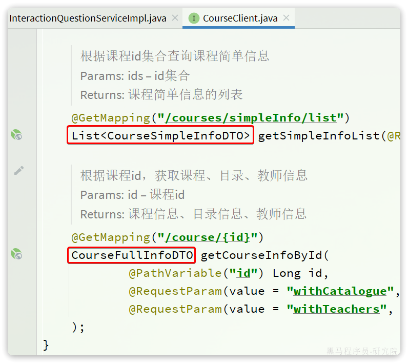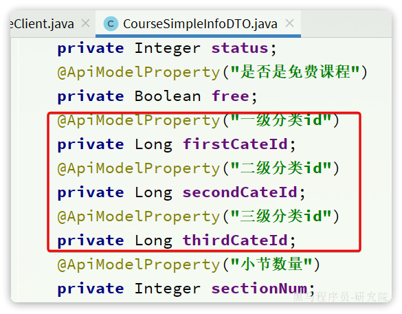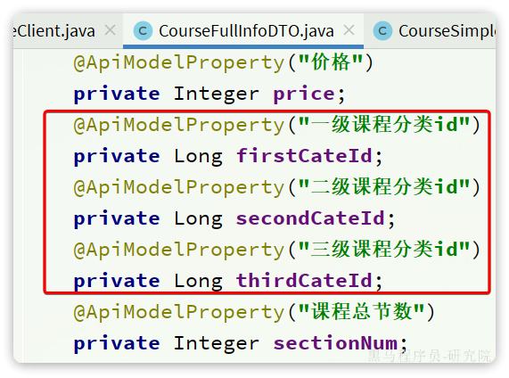

因此，**只要我们查询到了问题所属的课程，就能知道课程关联的三级分类id**，接下来只需要根据分类id查询出分类名称即可。

而在course-service服务中提供了一个接口，可以查询到所有的分类：

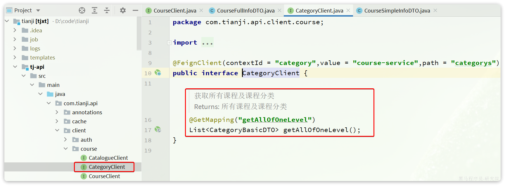

需要注意的是：这个返回的是所有课程分类的集合，而课程中只包含3个分类id。因此我们需要自己从所有分类集合中找出课程有关的这三个。

分析到这里大家应该知道如何做了。不过这里有一个值得思考的点：

- 课程分类数据在很多业务中都需要查询，这样的数据如此频繁的查询，有没有性能优化的办法呢？

#### 3.6.5.2.多级缓存

相信很多同学都能想到借助于Redis缓存来提高性能，减少数据库压力。非常好！不过，Redis虽然能提高性能，但每次查询缓存还是会**增加网络带宽消耗**，也会存在**网络延迟**。

而分类数据具备两大特点：

- 数据量小
- 长时间不会发生变化。

像这样的数据，除了建立Redis缓存以外，还非常适合做本地缓存（Local Cache）。这样就可以形成多级缓存机制：

- 数据查询时优先查询本地缓存
- 本地缓存不存在，再查询Redis缓存
- Redis不存在，再去查询数据库。

如图：

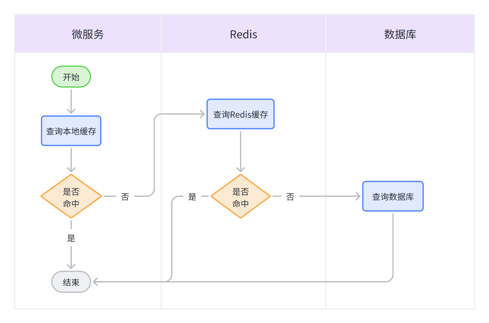

那么，本地缓存究竟是什么呢？又该如何实现呢？

本地缓存简单来说就是JVM内存的缓存，比如你建立一个HashMap，把数据库查询的数据存入进去。以后优先从这个HashMap查询，一个本地缓存就建立好了。

本地缓存优点：

- 读取本地内存，没有网络开销，速度更快

本地缓存缺点：

- 数据同步困难，一般采用自动过期方案
- 存储容量有限、可靠性较低、无法共享

本地缓存由于无需网络查询，速度非常快。不过由于上述缺点，本地缓存往往适用于**数据量小**、**更新不频繁**的数据。而课程分类恰好符合。

#### 3.6.5.3.Caffeine

当然，我们真正创建本地缓存的时候并不是直接使用HashMap之类的集合，因为维护起来不太方便。而且内存淘汰机制实现起来也比较麻烦。

所以，我们会使用成熟的框架来完成，比如Caffeine：

**Caffeine**是一个基于Java8开发的，提供了近乎最佳命中率的高性能的本地缓存库。目前Spring内部的缓存使用的就是Caffeine。GitHub地址：https://github.com/ben-manes/caffeine

Caffeine的性能非常好，下图是官方给出的几种常见的本地缓存实现方案的性能对比：

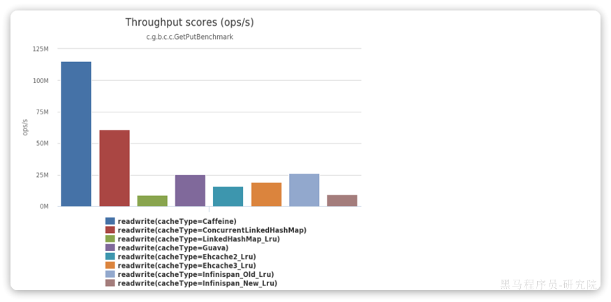

可以看到Caffeine的性能遥遥领先！

缓存使用的基本API：

```java
@Test
void testBasicOps() {
    // 构建cache对象
    Cache<String, String> cache = Caffeine.newBuilder().build();

    // 存数据
    cache.put("gf", "迪丽热巴");

    // 取数据
    String gf = cache.getIfPresent("gf");
    System.out.println("gf = " + gf);

    // 取数据，包含两个参数：
    // 参数一：缓存的key
    // 参数二：Lambda表达式，表达式参数就是缓存的key，方法体是查询数据库的逻辑
    // 优先根据key查询JVM缓存，如果未命中，则执行参数二的Lambda表达式
    String defaultGF = cache.get("defaultGF", key -> {
        // 根据key去数据库查询数据
        return "柳岩";
    });
    System.out.println("defaultGF = " + defaultGF);
}
```

Caffeine既然是缓存的一种，肯定需要有缓存的清除策略，不然的话内存总会有耗尽的时候。

Caffeine提供了三种缓存驱逐策略：

-  **基于容量**：设置缓存的数量上限 

```java
// 创建缓存对象
Cache<String, String> cache = Caffeine.newBuilder()
    .maximumSize(1) // 设置缓存大小上限为 1
    .build();
```

 

-  **基于时间**：设置缓存的有效时间 

```java
// 创建缓存对象
Cache<String, String> cache = Caffeine.newBuilder()
    // 设置缓存有效期为 10 秒，从最后一次写入开始计时 
    .expireAfterWrite(Duration.ofSeconds(10)) 
    .build();
```

 

-  **基于引用**：设置缓存为软引用或弱引用，利用GC来回收缓存数据。性能较差，不建议使用。 

**注意**：在默认情况下，当一个缓存元素过期的时候，Caffeine不会自动立即将其清理和驱逐。而是在一次读或写操作后，或者在空闲时间完成对失效数据的驱逐。

#### 3.6.5.4.课程分类的本地缓存

其实，在`tj-api`模块中，已经定义好了商品分类的本地缓存：

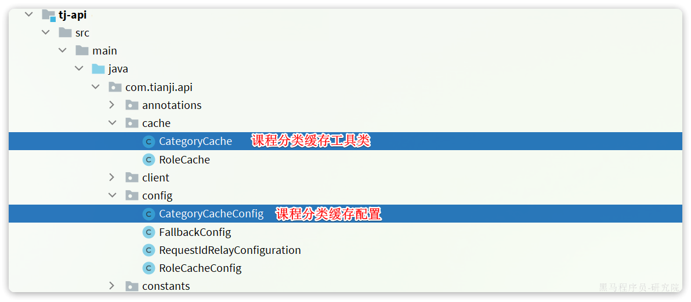

其中`CategoryCacheConfig`是Caffeine的缓存配置：

```java
package com.tianji.api.config;

import com.github.benmanes.caffeine.cache.Cache;
import com.github.benmanes.caffeine.cache.Caffeine;
import com.tianji.api.cache.CategoryCache;
import com.tianji.api.client.course.CategoryClient;
import com.tianji.api.dto.course.CategoryBasicDTO;
import org.springframework.context.annotation.Bean;

import java.time.Duration;
import java.util.Map;

public class CategoryCacheConfig {
    /**
     * 课程分类的caffeine缓存
     */
    @Bean
    public Cache<String, Map<Long, CategoryBasicDTO>> categoryCaches(){
        return Caffeine.newBuilder()
                .initialCapacity(1) // 容量限制
                .maximumSize(10_000) // 最大内存限制
                .expireAfterWrite(Duration.ofMinutes(30)) // 有效期
                .build();
    }
    /**
     * 课程分类的缓存工具类
     */
    @Bean
    public CategoryCache categoryCache(
            Cache<String, Map<Long, CategoryBasicDTO>> categoryCaches, CategoryClient categoryClient){
        return new CategoryCache(categoryCaches, categoryClient);
    }
}
```

而`CategoryCache`则是缓存使用的工具类。由于商品分类经常需要根据id查询，因此我根据id查询分类的各种API：

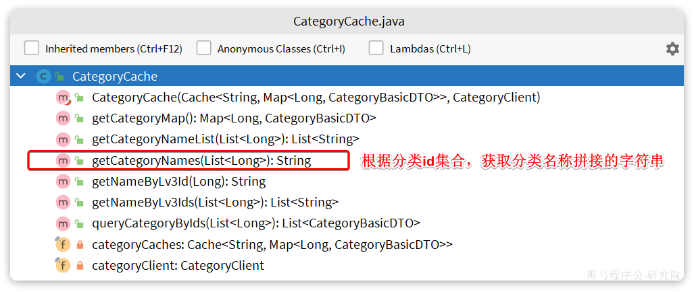

这样，在任何微服务中，只要引入`tj-api`，我们就能非常方便并且高性能的获取分类名称了。

::: warning

**注意**：

在CategoryCache中我们只利用Caffeine实现了本地缓存。当缓存未命中时，我们会去调用course-service提供的CategoryClient提供的方法查询分类数据，而不是去查询Redis。

如果要实现多级缓存，可以在course-service服务中实现分类查询的接口内添加Redis缓存，大家可以自行实现。

:::

#### 3.6.5.5.实现分页查询

最终，`InteractionQuestionServiceImpl`代码如下：

```java
@Override
public PageDTO<QuestionAdminVO> queryQuestionPageAdmin(QuestionAdminPageQuery query) {
    // 1.处理课程名称，得到课程id
    List<Long> courseIds = null;
    if (StringUtils.isNotBlank(query.getCourseName())) {
        courseIds = searchClient.queryCoursesIdByName(query.getCourseName());
        if (CollUtils.isEmpty(courseIds)) {
            return PageDTO.empty(0L, 0L);
        }
    }
    // 2.分页查询
    Integer status = query.getStatus();
    LocalDateTime begin = query.getBeginTime();
    LocalDateTime end = query.getEndTime();
    Page<InteractionQuestion> page = lambdaQuery()
            .in(courseIds != null, InteractionQuestion::getCourseId, courseIds)
            .eq(status != null, InteractionQuestion::getStatus, status)
            .gt(begin != null, InteractionQuestion::getCreateTime, begin)
            .lt(end != null, InteractionQuestion::getCreateTime, end)
            .page(query.toMpPageDefaultSortByCreateTimeDesc());
    List<InteractionQuestion> records = page.getRecords();
    if (CollUtils.isEmpty(records)) {
        return PageDTO.empty(page);
    }

    // 3.准备VO需要的数据：用户数据、课程数据、章节数据
    Set<Long> userIds = new HashSet<>();
    Set<Long> cIds = new HashSet<>();
    Set<Long> cataIds = new HashSet<>();
    // 3.1.获取各种数据的id集合
    for (InteractionQuestion q : records) {
        userIds.add(q.getUserId());
        cIds.add(q.getCourseId());
        cataIds.add(q.getChapterId());
        cataIds.add(q.getSectionId());
    }
    // 3.2.根据id查询用户
    List<UserDTO> users = userClient.queryUserByIds(userIds);
    Map<Long, UserDTO> userMap = new HashMap<>(users.size());
    if (CollUtils.isNotEmpty(users)) {
        userMap = users.stream().collect(Collectors.toMap(UserDTO::getId, u -> u));
    }

    // 3.3.根据id查询课程
    List<CourseSimpleInfoDTO> cInfos = courseClient.getSimpleInfoList(cIds);
    Map<Long, CourseSimpleInfoDTO> cInfoMap = new HashMap<>(cInfos.size());
    if (CollUtils.isNotEmpty(cInfos)) {
        cInfoMap = cInfos.stream().collect(Collectors.toMap(CourseSimpleInfoDTO::getId, c -> c));
    }

    // 3.4.根据id查询章节
    List<CataSimpleInfoDTO> catas = catalogueClient.batchQueryCatalogue(cataIds);
    Map<Long, String> cataMap = new HashMap<>(catas.size());
    if (CollUtils.isNotEmpty(catas)) {
        cataMap = catas.stream()
                .collect(Collectors.toMap(CataSimpleInfoDTO::getId, CataSimpleInfoDTO::getName));
    }


    // 4.封装VO
    List<QuestionAdminVO> voList = new ArrayList<>(records.size());
    for (InteractionQuestion q : records) {
        // 4.1.将PO转VO，属性拷贝
        QuestionAdminVO vo = BeanUtils.copyBean(q, QuestionAdminVO.class);
        voList.add(vo);
        // 4.2.用户信息
        UserDTO user = userMap.get(q.getUserId());
        if (user != null) {
            vo.setUserName(user.getName());
        }
        // 4.3.课程信息以及分类信息
        CourseSimpleInfoDTO cInfo = cInfoMap.get(q.getCourseId());
        if (cInfo != null) {
            vo.setCourseName(cInfo.getName());
            vo.setCategoryName(categoryCache.getCategoryNames(cInfo.getCategoryIds()));
        }
        // 4.4.章节信息
        vo.setChapterName(cataMap.getOrDefault(q.getChapterId(), ""));
        vo.setSectionName(cataMap.getOrDefault(q.getSectionId(), ""));
    }
    return PageDTO.of(page, voList);
```

## 3.7.管理端隐藏或显示问题（练习）

### 3.7.1.接口分析

在管理端的互动问题列表中，管理员可以隐藏某个问题，这样就不会在用户端页面展示了：

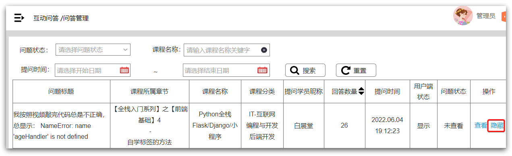

由于`interaction_question`表中有一个`hidden`字段来表示是否隐藏：

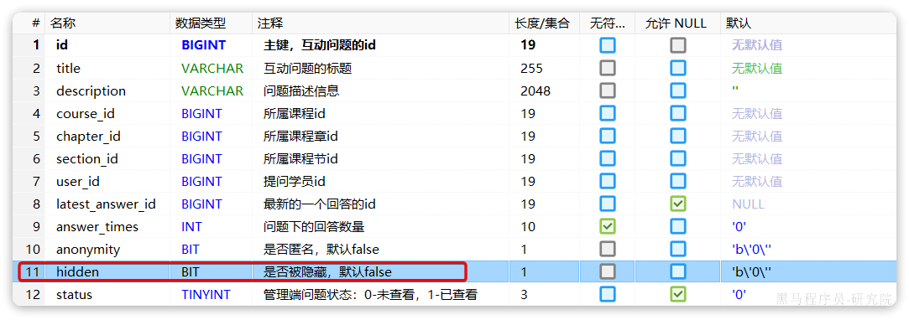

因此，本质来说，这个接口是一个修改某字段值的接口，并不复杂。

我们按照Restful的风格来设定，接口信息如下：

- **接口地址**:`/admin/questions/{id}/hidden/{hidden}`
- **请求方式**:`PUT`
- **请求参数**: 路径占位符参数
  - id：问题id
  - hidden：是否隐藏

### 3.7.2.代码实现（练习）

## 3.8.管理端根据id查询问题详情（练习）

### 3.8.1.接口分析

在管理端的问题管理页面，点击查看按钮就会进入问题详情页：

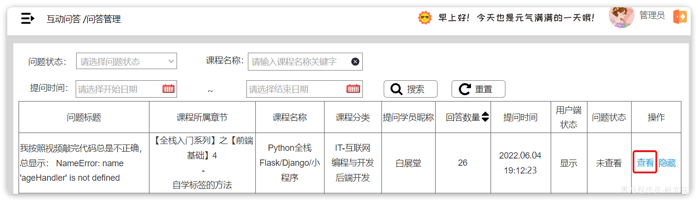

问题详情页如下：

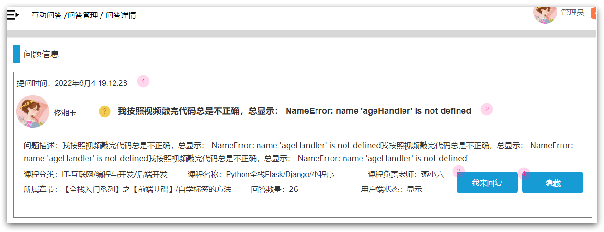

可以看到，这里需要查询的数据还是比较多的，包含：

- 问题标题
- 问题描述
- 提问者信息
  - id
  - 昵称
  - 头像
- 课程三级分类
- 课程名称
- **课程负责老师**
- 课程所属章节
- 回答数量
- 用户端是否显示

返回值与管理端分页查询基本一致，多了一个课程负责老师信息。所以我们沿用之前的`QuestionAdminVO`即可。但是需要添加一个课程负责老师的字段：

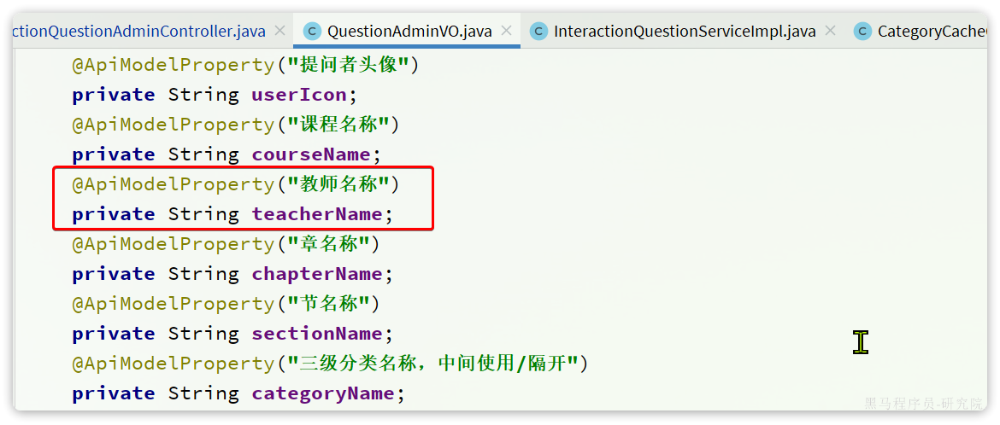

虽然用户端也有根据id查询问题，但是返回值与用户端存在较大差异，所以我们需要另外设计一个接口。

按照Restful风格，接口信息如下：

- **接口地址**: `/admin/questions/{id}`
- **请求方式**: `GET`
- **请求参数**: 路径占位符格式
- **返回值**：与分页查询共享VO，这里不再赘述

::: warning

**注意**：

问题表中有一个status字段，标记管理员是否已经查看过该问题。因此每当调用根据id查询问题接口，我们可以认为管理员查看了该问题，应该将问题status标记为**已查看**。

:::

### 3.8.2.代码实现（练习）

# 4.评论相关接口（练习）

评论相关接口有四个：

- 新增回答或评论
- 分页查询回答或评论
- 管理端分页查询回答或评论
- 管理端隐藏或显示回答或评论

## 4.1.新增回答或评论（练习）

### 4.1.1.接口分析

先来看下回答或评论的表单原型图：

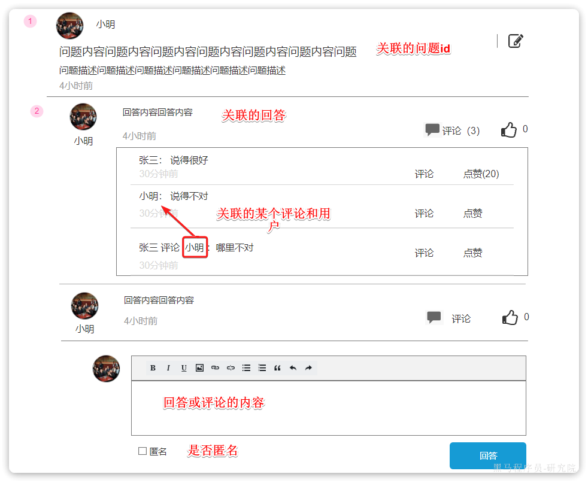

回复本身只有一个简单属性：

- 回复内容

一个功能属性：

- 是否匿名

一个关联属性：

- 问题id：回答要关联某个问题

如果是针对某个回答发表的评论，则有新的关联属性：

- 回答id：评论是在哪个回答下面的
- 目标评论id：当前评论是针对哪一条评论的
- 目标用户id：当前评论是针对哪一个用户的

如果是回答，则只需要前3个属性即可。如果是评论，则还需要补充最后的3个属性。

由于我们把会回答和评论接口合并，因此以上属性都应该作为表单参数。

需要注意的是，在新增回答或评论时，除了要把数据写入`interaction_reply`表，还有几件事情要做：

- 判断当前提交的是否是回答，如果是需要在`interaction_question`中记录最新一次回答的id
- 判断提交评论的用户是否是学生，如果是标记问题状态为未查看

因此我们的业务流程应该是这样的：

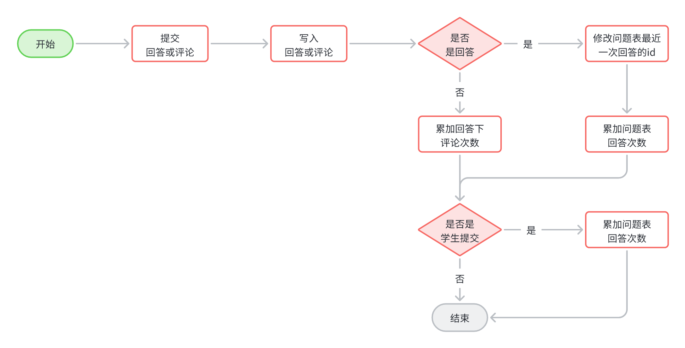

为了方便判断是否是学生提交的回答，我们可以在前端传递一个参数：

- isStudent：标记当前回答是否是学生提交的

综上，按照Restful的规范设计，接口信息如下：

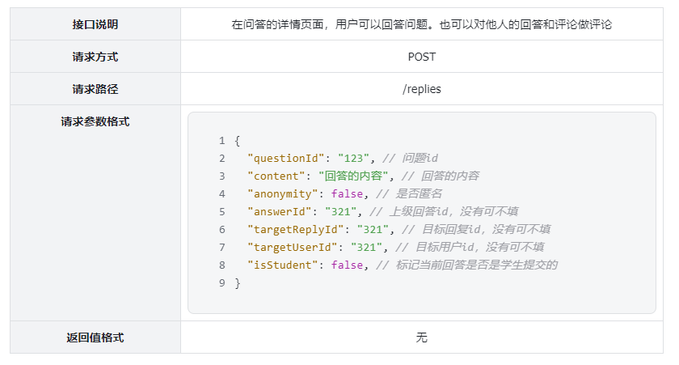

### 4.1.2.实体类

按照前面的接口分析，首先定义请求参数DTO，在课前资料中已经提供了：

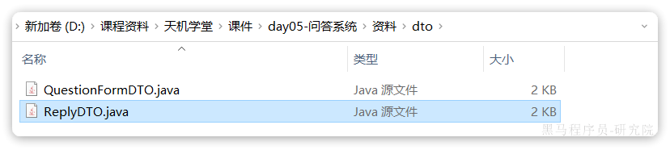

### 4.1.3.代码实现

## 4.2.分页查询回答或评论列表（练习）

### 4.2.1.接口分析

在问题详情页，除了展示问题详情外，最重要的就是回答列表了，原型图如下：


我们先来分析回答列表，需要展示的内容包括：

- 回答id
- 回答内容
- 是否匿名
- 回答人信息（如果是匿名，则无需返回）
  - id
  - 昵称
  - 头像
- 回答时间
- 评论数量
- 点赞数量

请求参数就是问题的id。不过需要注意的是，一个问题下的回答比较多，所以一次只能展示一部分，更多数据会采用滚动懒加载模式。简单来说说就是分页查询，所以也要带上分页参数。

再来看一下回答下的评论列表：

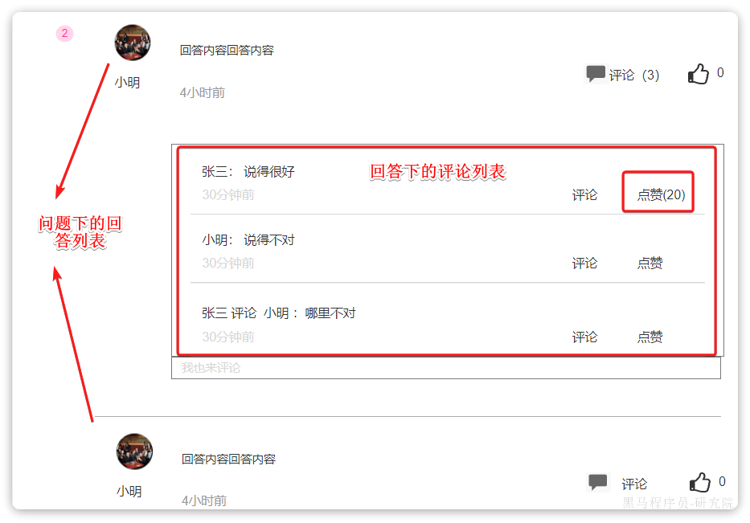

仔细观察后可以发现，需要展示的数据与回答及其相似，都包括：

- 评论id
- 评论内容
- 是否匿名
- 评论人信息（如果是匿名，则无需返回）
  - id
  - 昵称
  - 头像
- 回答时间
- 评论数量(无）
- 点赞数量
- **目标用户昵称（评论特有）**

从返回结果来看：相比回答列表，评论无需展示评论下的评论数量，但是需要展示目标用户的昵称，因为评论是针对某个目标的。

从查询参数来看：查询评论需要知道回答的id，这点与查询回答列表不太一样。

综上，按照Restful的规范设计，接口信息如下：

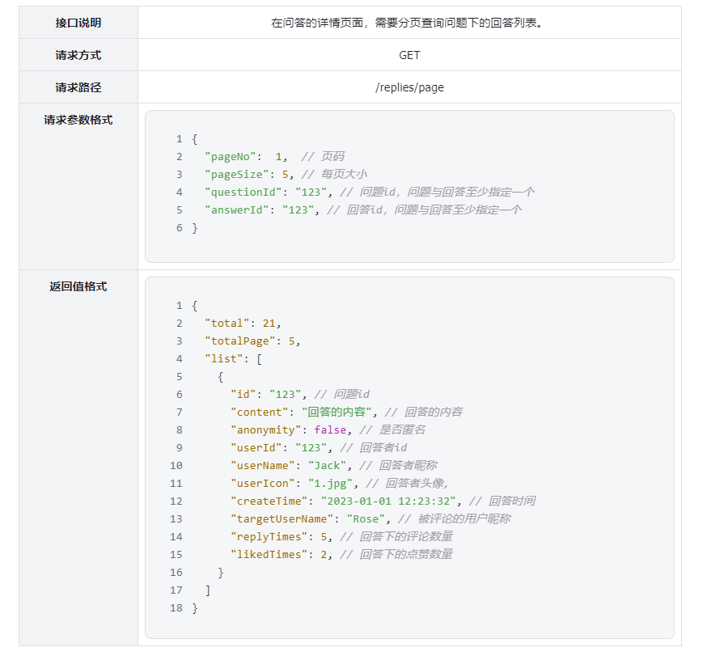

::: warning

**注意：**

分页查询时默认要按照点赞次数排序。

页面展示点赞按钮时，如果点赞过会高亮显示。因此我们要在返回值中标记当前用户是否点赞过这条评论或回答。

但点赞功能我们暂未实现，这两部分大家暂时无需实现。

:::

### 4.2.2.实体类

请求入参，是一个Query实体，在课前资料的query目录下：

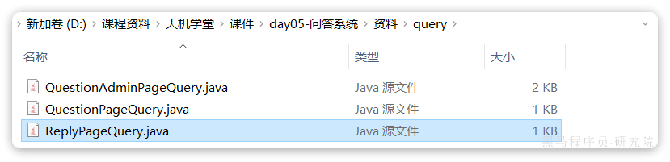

返回值，是一个VO实体，在课前资料的vo目录下：

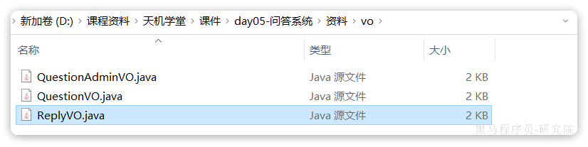

### 4.2.3.代码实现

## 4.3.管理端分页查询回答或评论列表（练习）

### 4.3.1.接口分析

管理端查询回答列表原型如下：

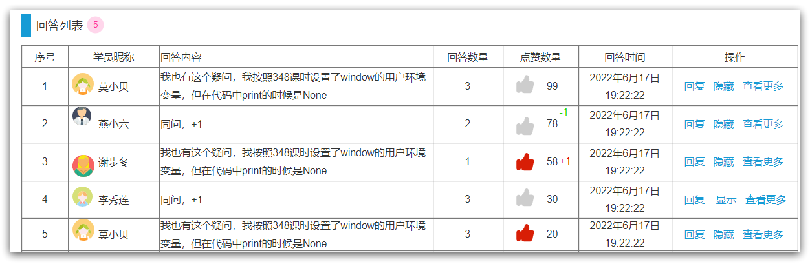

可以看到，返回的数据格式包含：

- 评论id
- 评论内容
- 评论人信息
  - id
  - 昵称
  - 头像
  - 类型
- 回答时间
- 评论数量（回答时有）
- 点赞数量
- 目标用户昵称（评论特有）
- **是否被隐藏（管理端特有）**

与用户端查询几乎完全一致。

那有同学会有疑问了，这里为什么不使用同一个接口？

原因有两点：

- 管理端在统计评论数量的时候，被隐藏的评论也要统计（用户端不统计隐藏回答）
- 管理端无视匿名，所有评论都要返回用户信息；用户端匿名评论不返回用户信息。

所以大家在实现的时候，基本逻辑可以与用户端分页一致，但统计评论数量、处理用户信息时，需要区别对待。

**为了减少代码重复，大家可以对代码做改造抽取，不要重复copy代码**。

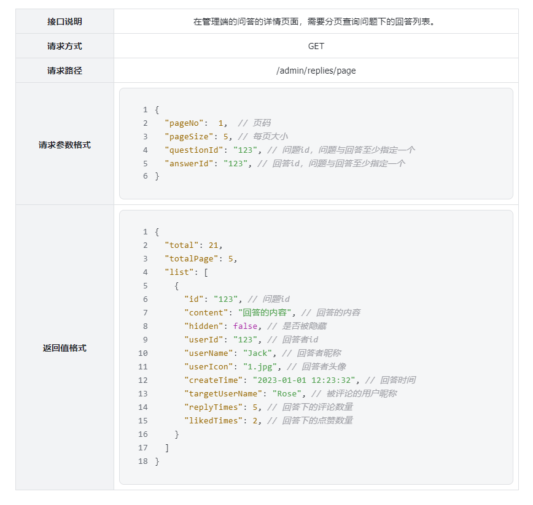

### 4.3.2.实体

请求参数和返回值实体与用户端分页查询基本一致，因此这里不再重复定义实体。不过返回值VO中要添加`hidden`字段，标示评论是否被隐藏。

## 4.4.管理端显示或隐藏评论（练习）

### 4.4.1.接口分析

与问题类似，管理员也可以显示或隐藏某个评论或评论：

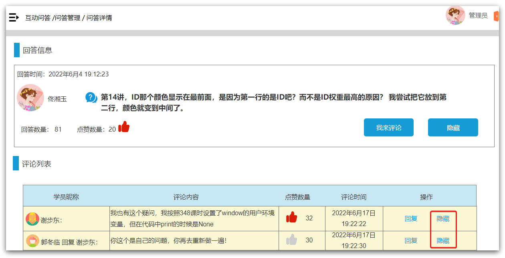

与隐藏问题类似，同样是修改hidden字段。因此按照Restful风格设计接口如下：

- **接口地址：**`/admin/replies/{id}/hidden/{hidden}`
- **请求方式：**`PUT`
- **请求参数：**路径占位符参数
  - id：回答或评论id
  - hidden：是否被隐藏

**注意**：如果隐藏的是回答，则回答下的评论也要隐藏

### 4.4.2.代码实现（练习）
