# day06-点赞系统

我们已经实现了学习辅助中的互动问答功能，不过存在一个问题，仅仅靠老师来给学生回答问题存在一些弊端：

- 老师可能忙不过来
- 难以调动所有学员互动热情
- 互动的氛围感较差

因此，产品提出了新的需求：

> 当热心用户或者老师给学生回答了问题以后，所有学员可以给自己心仪的回答点赞，点赞越高，排名也越靠前。

这样一来，用户回答和评论的欲望就会增加，网站的活跃度也会越来越高。

点赞功能是社交、电商等几乎所有的互联网项目中都广泛使用。虽然看起来简单，不过蕴含的技术方案和手段还是比较多的。 

今天，我们就一起来揭开点赞功能的神秘面纱。

# 1.需求分析

点赞功能与其它功能不同，没有复杂的原型和需求，仅仅是一个点赞、取消点赞的操作。所以，今天我们就不需要从原型图来分析，而是仅仅从这个功能的实现方案来思考。

## 1.1.业务需求

首先我们来分析整理一下点赞业务的需求，一个通用点赞系统需要满足下列特性：


- 通用：点赞业务在设计的时候不要与业务系统耦合，必须同时支持不同业务的点赞功能
- 独立：点赞功能是独立系统，并且不依赖其它服务。这样才具备可迁移性。
- 并发：一些热点业务点赞会很多，所以点赞功能必须支持高并发
- 安全：要做好并发安全控制，避免重复点赞

## 1.2.实现思路

要保证安全，避免重复点赞，我们就必须保存每一次点赞记录。只有这样在下次用户点赞时我们才能查询数据，判断是否是重复点赞。同时，因为业务方经常需要根据点赞数量排序，因此每个业务的点赞数量也需要记录下来。

综上，点赞的基本思路如下：

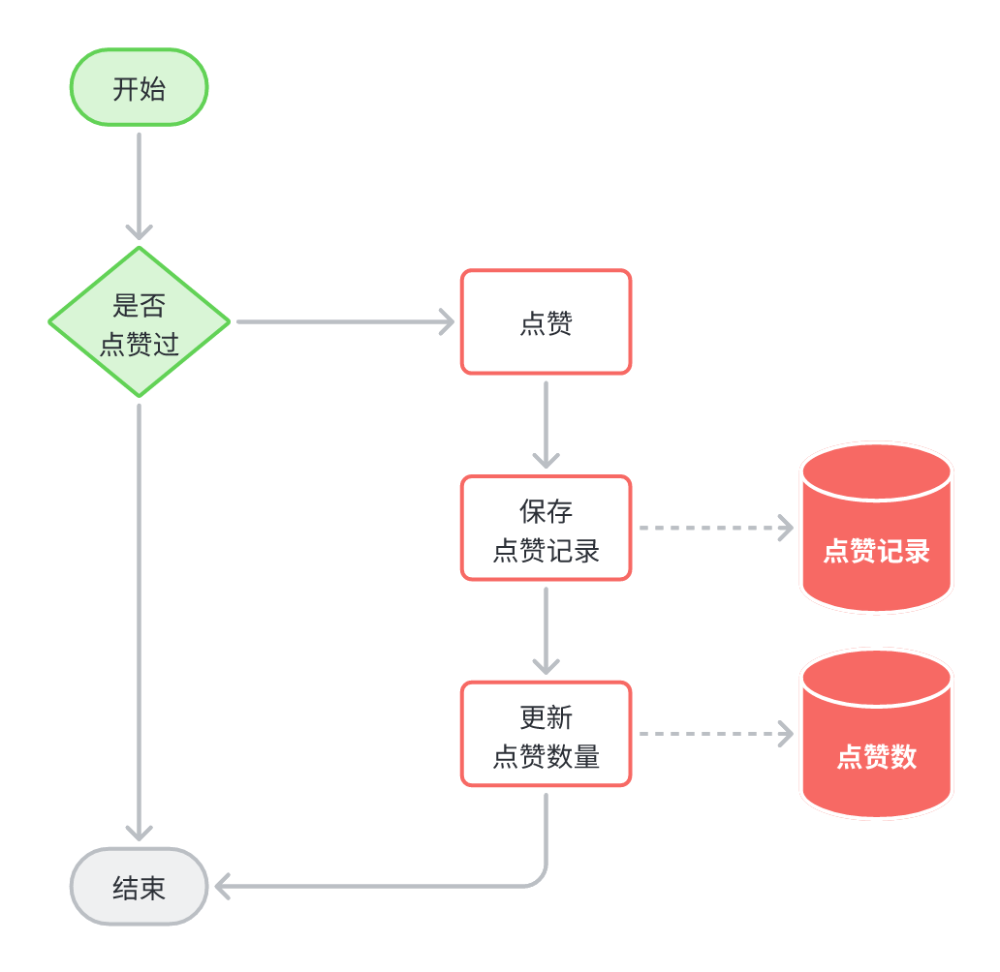

但问题来了，我们说过点赞服务必须独立，因此必须抽取为一个**独立服务**。多个其它微服务业务的点赞数据都有点赞系统来维护。但是问题来了：

> 如果业务方需要根据点赞数排序，就必须在数据库中维护点赞数字段。但是点赞系统无法修改其它业务服务的数据库，否则就出现了业务耦合。该怎么办呢？

点赞系统可以在点赞数变更时，通过MQ通知业务方，这样业务方就可以更新自己的点赞数量了。并且还避免了点赞系统与业务方的耦合。

于是，实现思路变成了这样：

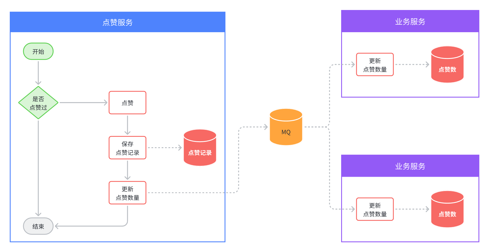

# 2.数据结构

点赞的数据结构分两部分，一是**点赞记录**，二是与业务关联的**点赞数**。

点赞数自然是与具体业务表关联在一起记录，比如互动问答的点赞，自然是在问答表中记录点赞数。学员笔记点赞，自然是在笔记表中记录点赞数。

在之前实现互动问答的时候，我们已经给回答表设计了点赞数字段了：


其它业务也是类似的。

因此，本节我们只需要实现点赞记录的表结构设计即可。

## 2.1.ER图

点赞记录本质就是记录**谁给什么内容点了赞**，所以核心属性包括：

- 点赞目标id
- 点赞人id

不过点赞的内容多种多样，为了加以区分，我们还需要把点赞内的类型记录下来：

- 点赞对象类型（为了通用性）

当然还有点赞时间，综上对应的数据库ER图如下：

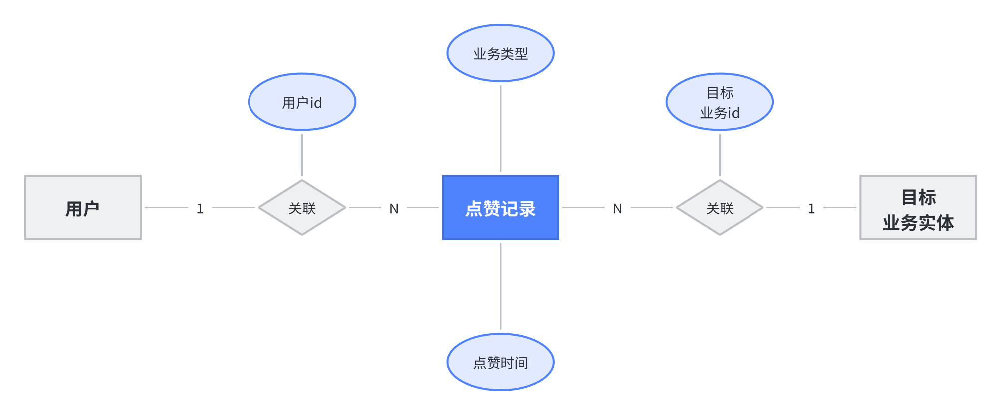

## 2.2.表结构

由于点赞系统是独立于其它业务的，这里我们需要创建一个新的数据库：`tj_remark`

```sql
CREATE DATABASE tj_remark CHARACTER SET 'utf8mb4';
```

然后在ER图基础上，加上一些通用属性，点赞记录表结构如下：

```sql
CREATE TABLE IF NOT EXISTS `liked_record` (
  `id` bigint NOT NULL AUTO_INCREMENT COMMENT '主键id',
  `user_id` bigint NOT NULL COMMENT '用户id',
  `biz_id` bigint NOT NULL COMMENT '点赞的业务id',
  `biz_type` VARCHAR(16) NOT NULL COMMENT '点赞的业务类型',
  `create_time` datetime NOT NULL DEFAULT CURRENT_TIMESTAMP COMMENT '创建时间',
  `update_time` datetime NOT NULL DEFAULT CURRENT_TIMESTAMP ON UPDATE CURRENT_TIMESTAMP COMMENT '更新时间',
  PRIMARY KEY (`id`),
  UNIQUE KEY `idx_biz_user` (`biz_id`,`user_id`)
) ENGINE=InnoDB AUTO_INCREMENT=8 DEFAULT CHARSET=utf8mb4 COLLATE=utf8mb4_0900_ai_ci COMMENT='点赞记录表';
```

## 2.3.代码生成

由于点赞系统是一个独立微服务，我们需要创建一个新的微服务模块。

### 2.3.1.创建微服务

创建模块：


选择maven模块：


填写项目名称：

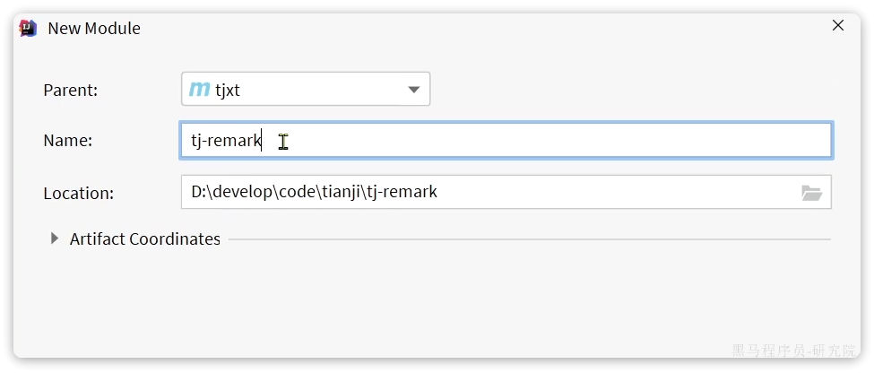

在pom.xml中填入依赖：

```xml
<?xml version="1.0" encoding="UTF-8"?>
<project xmlns="http://maven.apache.org/POM/4.0.0"
         xmlns:xsi="http://www.w3.org/2001/XMLSchema-instance"
         xsi:schemaLocation="http://maven.apache.org/POM/4.0.0 http://maven.apache.org/xsd/maven-4.0.0.xsd">
    <parent>
        <artifactId>tjxt</artifactId>
        <groupId>com.tianji</groupId>
        <version>1.0.0</version>
    </parent>
    <modelVersion>4.0.0</modelVersion>

    <artifactId>tj-remark</artifactId>

    <properties>
        <maven.compiler.source>11</maven.compiler.source>
        <maven.compiler.target>11</maven.compiler.target>
    </properties>
    <dependencies>
        <!--auth-sdk-->
        <dependency>
            <groupId>com.tianji</groupId>
            <artifactId>tj-auth-resource-sdk</artifactId>
            <version>1.0.0</version>
        </dependency>
        <!--api-->
        <dependency>
            <groupId>com.tianji</groupId>
            <artifactId>tj-api</artifactId>
            <version>1.0.0</version>
        </dependency>
        <!--web-->
        <dependency>
            <groupId>org.springframework.boot</groupId>
            <artifactId>spring-boot-starter-web</artifactId>
        </dependency>
        <!--mybatis-->
        <dependency>
            <groupId>com.baomidou</groupId>
            <artifactId>mybatis-plus-boot-starter</artifactId>
        </dependency>
        <dependency>
            <groupId>mysql</groupId>
            <artifactId>mysql-connector-java</artifactId>
        </dependency>
        <!--Redis-->
        <dependency>
            <groupId>org.springframework.boot</groupId>
            <artifactId>spring-boot-starter-data-redis</artifactId>
        </dependency>
        <!--discovery-->
        <dependency>
            <groupId>com.alibaba.cloud</groupId>
            <artifactId>spring-cloud-starter-alibaba-nacos-discovery</artifactId>
        </dependency>
        <!--config-->
        <dependency>
            <groupId>com.alibaba.cloud</groupId>
            <artifactId>spring-cloud-starter-alibaba-nacos-config</artifactId>
        </dependency>
        <!--mq-->
        <dependency>
            <groupId>org.springframework.boot</groupId>
            <artifactId>spring-boot-starter-amqp</artifactId>
        </dependency>
        <!--loadbalancer-->
        <dependency>
            <groupId>org.springframework.cloud</groupId>
            <artifactId>spring-cloud-starter-loadbalancer</artifactId>
        </dependency>
    </dependencies>
    <build>
        <finalName>${project.artifactId}</finalName>
        <plugins>
            <plugin>
                <groupId>org.springframework.boot</groupId>
                <artifactId>spring-boot-maven-plugin</artifactId>
                <executions>
                    <execution>
                        <goals>
                            <goal>build-info</goal>
                        </goals>
                    </execution>
                </executions>
                <configuration>
                    <mainClass>com.tianji.remark.RemarkApplication</mainClass>
                </configuration>
            </plugin>
        </plugins>
    </build>
</project>
```

然后是配置文件：`bootstrap.yml`

```yaml
server:
  port: 8091  #端口
  tomcat:
    uri-encoding: UTF-8   #服务编码
spring:
  profiles:
    active: dev
  application:
    name: remark-service
  cloud:
    nacos:
      config:
        file-extension: yaml
        shared-configs: # 共享配置
          - data-id: shared-spring.yaml # 共享spring配置
            refresh: false
          - data-id: shared-redis.yaml # 共享redis配置
            refresh: false
          - data-id: shared-mybatis.yaml # 共享mybatis配置
            refresh: false
          - data-id: shared-logs.yaml # 共享日志配置
            refresh: false
          - data-id: shared-feign.yaml # 共享feign配置
            refresh: false
          - data-id: shared-mq.yaml # 共享mq配置
            refresh: false
tj:
  swagger:
    enable: true
    enableResponseWrap: true
    package-path: com.tianji.remark.controller
    title: 天机学堂 - 评价中心接口文档
    description: 该服务包含评价、点赞等功能
    contact-name: 传智教育·研究院
    contact-url: http://www.itcast.cn/
    contact-email: zhanghuyi@itcast.cn
    version: v1.0
  jdbc:
    database: tj_remark
  auth:
    resource:
      enable: true # 登录拦截功能
```

接着是`bootstrap-dev.yml`:

```yaml
spring:
  cloud:
    nacos:
      server-addr: 192.168.150.101:8848 # nacos注册中心
      discovery:
        namespace: f923fb34-cb0a-4c06-8fca-ad61ea61a3f0
        group: DEFAULT_GROUP
        ip: 192.168.150.101
logging:
  level:
    com.tianji: debug
```

然后是`bootstrap-local.yml`:

```yaml
spring:
  cloud:
    nacos:
      server-addr: 192.168.150.101:8848 # nacos注册中心
      discovery:
        namespace: f923fb34-cb0a-4c06-8fca-ad61ea61a3f0
        group: DEFAULT_GROUP
        ip: 192.168.150.1
logging:
  level:
    com.tianji: debug
```

最后，新建一个启动类：

```java
package com.tianji.remark;

import lombok.extern.slf4j.Slf4j;
import org.mybatis.spring.annotation.MapperScan;
import org.springframework.boot.SpringApplication;
import org.springframework.boot.autoconfigure.SpringBootApplication;
import org.springframework.boot.builder.SpringApplicationBuilder;
import org.springframework.core.env.Environment;
import org.springframework.scheduling.annotation.EnableScheduling;

import java.net.InetAddress;
import java.net.UnknownHostException;

@Slf4j
@EnableScheduling
@SpringBootApplication
@MapperScan("com.tianji.remark.mapper")
public class RemarkApplication {
    public static void main(String[] args) throws UnknownHostException {
        SpringApplication app = new SpringApplicationBuilder(RemarkApplication.class).build(args);
        Environment env = app.run(args).getEnvironment();
        String protocol = "http";
        if (env.getProperty("server.ssl.key-store") != null) {
            protocol = "https";
        }
        log.info("--/\n---------------------------------------------------------------------------------------\n\t" +
                        "Application '{}' is running! Access URLs:\n\t" +
                        "Local: \t\t{}://localhost:{}\n\t" +
                        "External: \t{}://{}:{}\n\t" +
                        "Profile(s): \t{}" +
                        "\n---------------------------------------------------------------------------------------",
                env.getProperty("spring.application.name"),
                protocol,
                env.getProperty("server.port"),
                protocol,
                InetAddress.getLocalHost().getHostAddress(),
                env.getProperty("server.port"),
                env.getActiveProfiles());
    }
}
```

项目结构：


微服务搭建后，一定不要忘了在网关配置服务路由，找到`tj-gateway`服务的`bootstrap.yml`文件，添加以下内容：

```yaml
# 。。。其它略
spring:
        # 。。。其它略
  cloud:
          # 。。。其它略
    gateway:
      routes:
        - id: rs
          uri: lb://remark-service
          predicates:
            - Path=/rs/**
              # 。。。其它略
      default-filters:
        - StripPrefix=1
# 。。。其它略
```

为了方便本地启动测试，最后给remark-service添加一个SpringBoot启动项：


### 2.3.2.代码生成

利用MybatisPlus的插件生成实体、mapper、service、controller等代码。

注意要先配置数据库地址：


填写数据库信息：

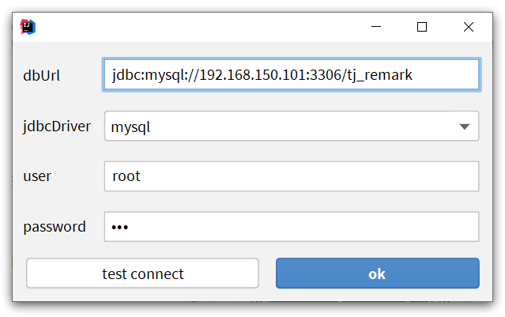

然后生成代码：


代码结构如下：

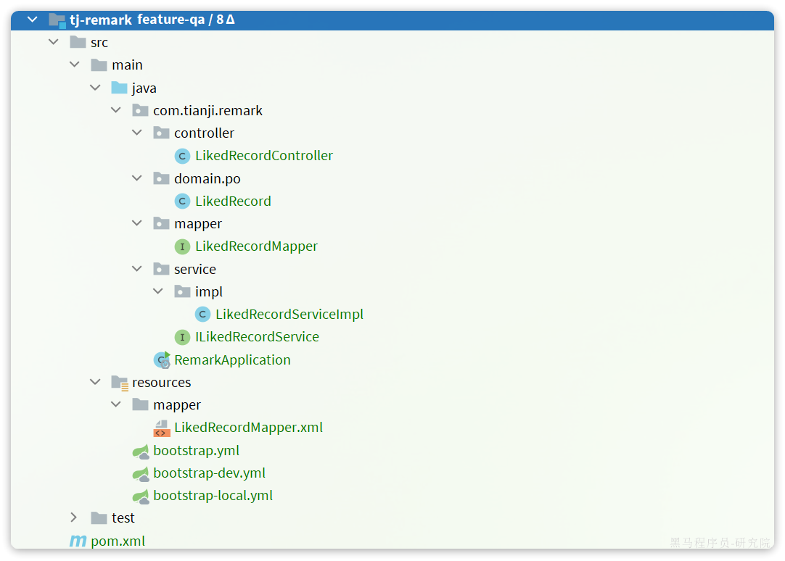

# 3.实现点赞功能

从表面来看，点赞功能要实现的接口就是一个点赞接口。不过仔细观察所有的点赞页面，你会发现点赞按钮有灰色和点亮两种状态。

也就是说我们还需要实现查询用户点赞状态的接口，这样前端才能根据点赞状态渲染不同效果。因此我们要实现的接口包括：

- 点赞/取消点赞
- 根据多个业务id批量查询用户是否点赞多个业务

## 3.1.点赞或取消点赞

### 3.1.1.接口信息

当用户点击点赞按钮的时候，第一次点击是点赞，按钮会高亮；第二次点击是取消，点赞按钮变灰：


从后台实现来看，点赞就是新增一条点赞记录，取消就是删除这条记录。为了方便前端交互，这两个合并为一个接口即可。

因此，请求参数首先要包含点赞有关的数据，并且要标记是点赞还是取消：

- 点赞的目标业务id：bizId
- 谁在点赞（就是登陆用户，可以不用提交）
- 点赞还是取消

除此以外，我们之前说过，在问答、笔记等功能中都会出现点赞功能，所以点赞必须具备通用性。因此还需要在提交一个参数标记点赞的类型：

- 点赞目标的类型

返回值有两种设计：

- 方案一：无返回值，200就是成功，页面直接把点赞数+1展示给用户即可
- 方案二：返回点赞数量，页面渲染

这里推荐使用方案一，因为每次统计点赞数量也有很大的性能消耗。

综上，按照Restful风格设计，接口信息如下：

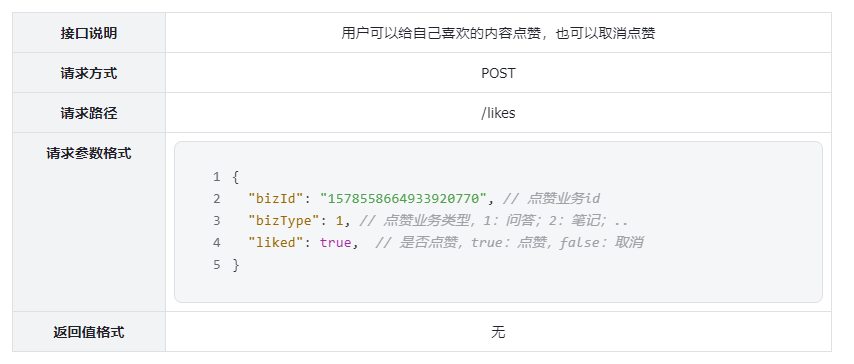

### 3.1.2.实体

请求参数需要定义一个DTO实体类来接收，在课前资料已经提供了：

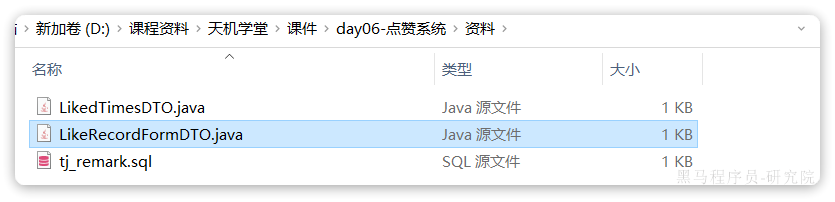

### 3.1.3.代码实现

首先是`tj-remark`的`com.tianji.remark.controller.LikedRecordController`：

```java
package com.tianji.remark.controller;

import com.tianji.remark.domain.dto.LikeRecordFormDTO;
import com.tianji.remark.service.ILikedRecordService;
import io.swagger.annotations.Api;
import io.swagger.annotations.ApiOperation;
import lombok.RequiredArgsConstructor;
import org.springframework.web.bind.annotation.*;

import javax.validation.Valid;
import java.util.List;
import java.util.Set;

/**
 * <p>
 * 点赞记录表 控制器
 * </p>
 */
@RestController
@RequiredArgsConstructor
@RequestMapping("/likes")
@Api(tags = "点赞业务相关接口")
public class LikedRecordController {

    private final ILikedRecordService likedRecordService;

    @PostMapping
    @ApiOperation("点赞或取消点赞")
    public void addLikeRecord(@Valid @RequestBody LikeRecordFormDTO recordDTO) {
        likedRecordService.addLikeRecord(recordDTO);
    }
}
```

然后是`tj-remark`的`com.tianji.remark.service.ILikedRecordService`：

```java
public interface ILikedRecordService extends IService<LikedRecord> {

    void addLikeRecord(LikeRecordFormDTO recordFormDTO);
}
```

最后是`tj-remark`的实现类`com.tianji.remark.service.impl.LikedRecordServiceImpl`：

```java
@Service
public class LikedRecordServiceImpl extends ServiceImpl<LikedRecordMapper, LikedRecord> implements ILikedRecordService {

    @Override
    public void addLikeRecord(LikeRecordFormDTO recordFormDTO) {
        // TODO 实现点赞或取消点赞
    }
}
```

### 3.1.4.业务流程

我们先梳理一下点赞业务的几点需求：

- 点赞就新增一条点赞记录，取消点赞就删除记录
- 用户不能重复点赞
- 点赞数由具体的业务方保存，需要通知业务方更新点赞数

由于业务方的类型很多，比如互动问答、笔记、课程等。所以通知方式必须是**低耦合**的，这里建议使用MQ来实现。

当点赞或取消点赞后，点赞数发生变化，我们就发送MQ通知。整体业务流程如图：

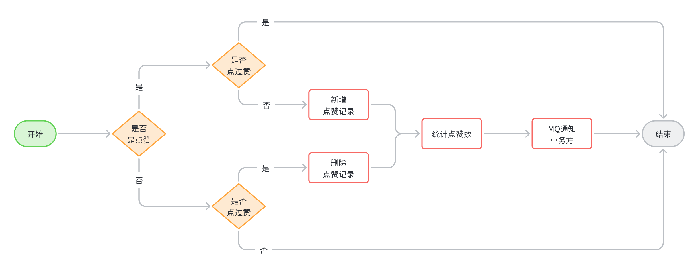

需要注意的是，由于**每次点赞的业务类型不同，所以没有必要通知到所有业务方，而是仅仅通知与当前点赞业务关联的业务方即可**。

在RabbitMQ中，利用TOPIC类型的交换机，结合不同的RoutingKey，可以实现通知对象的变化。我们需要让不同的业务方监听不同的RoutingKey，然后发送通知时根据点赞类型不同，发送不同RoutingKey：

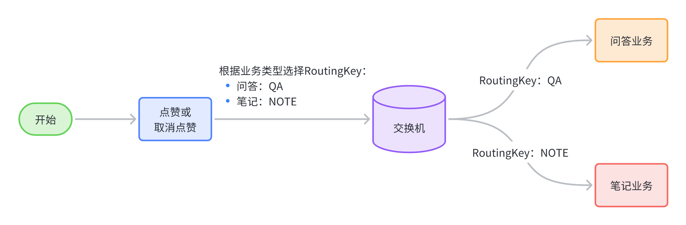

当然，真实的RoutingKey不一定如图中所示，这里只是做一个示意。

其实在tj-common中，我们已经定义了MQ的常量：

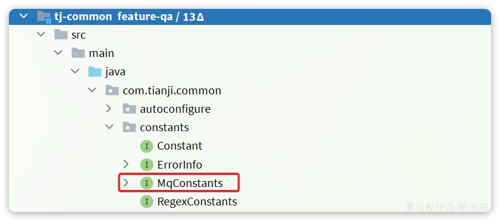

并且定义了点赞有关的`Exchange`和`RoutingKey`常量：


其中的`RoutingKey`只是一个模板，其中`{}`部分是占位符，不同业务类型就填写不同的具体值。

### 3.1.5.实现完整业务

首先我们需要定义一个MQ通知的消息体，由于这个消息体会在各个相关微服务中使用，需要定义到公用的模块中，这里我们定义到`tj-api`模块：

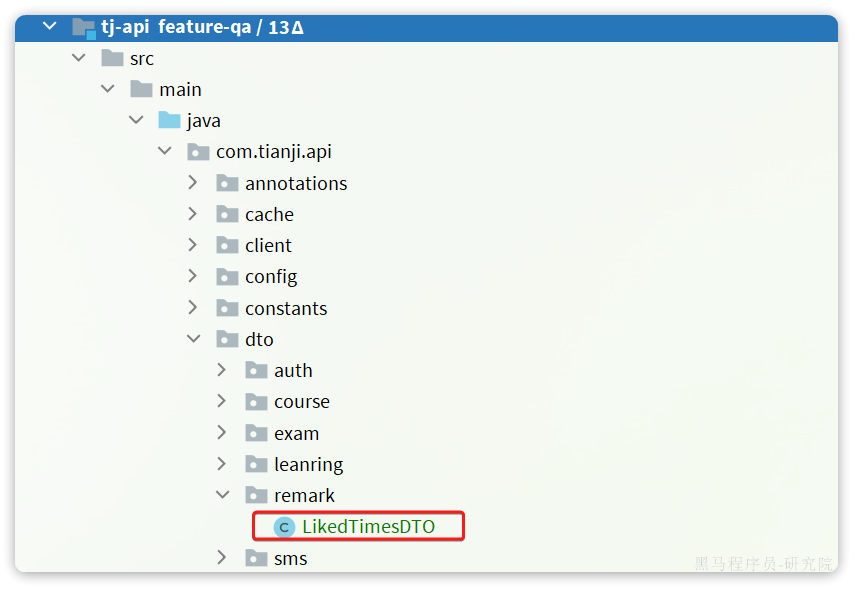

具体代码如下：

```java
@Data
@NoArgsConstructor
@AllArgsConstructor
public class LikedTimesDTO {
    /**
     * 点赞的业务id
     */
    private Long bizId;
    /**
     * 总的点赞次数
     */
    private Integer likedTimes;
}
```

在课前资料中已经提供了：

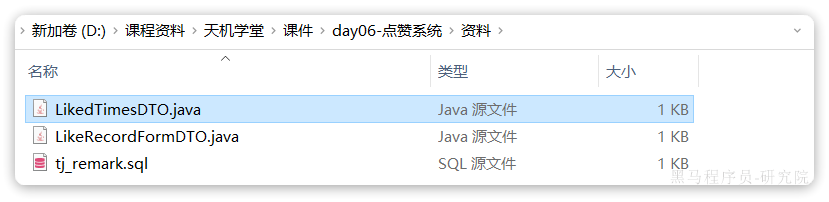

然后是`com.tianji.remark.service.impl.LikedRecordServiceImpl`完整的业务逻辑：

```java
package com.tianji.remark.service.impl;

import com.baomidou.mybatisplus.core.conditions.query.QueryWrapper;
import com.baomidou.mybatisplus.extension.service.impl.ServiceImpl;
import com.tianji.common.autoconfigure.mq.RabbitMqHelper;
import com.tianji.common.utils.StringUtils;
import com.tianji.common.utils.UserContext;
import com.tianji.remark.domain.dto.LikeRecordFormDTO;
import com.tianji.remark.domain.po.LikedRecord;
import com.tianji.remark.mapper.LikedRecordMapper;
import com.tianji.remark.service.ILikedRecordService;
import lombok.RequiredArgsConstructor;

import java.util.List;
import java.util.Set;
import java.util.stream.Collectors;

import static com.tianji.common.constants.MqConstants.Exchange.LIKE_RECORD_EXCHANGE;
import static com.tianji.common.constants.MqConstants.Key.LIKED_TIMES_KEY_TEMPLATE;

/**
 * <p>
 * 点赞记录表 服务实现类
 * </p>
 */
@Service
@RequiredArgsConstructor
public class LikedRecordServiceImpl extends ServiceImpl<LikedRecordMapper, LikedRecord> implements ILikedRecordService {

    private final RabbitMqHelper mqHelper;

    @Override
    public void addLikeRecord(LikeRecordFormDTO recordDTO) {
        // 1.基于前端的参数，判断是执行点赞还是取消点赞
        boolean success = recordDTO.getLiked() ? like(recordDTO) : unlike(recordDTO);
        // 2.判断是否执行成功，如果失败，则直接结束
        if (!success) {
            return;
        }
        // 3.如果执行成功，统计点赞总数
        Integer likedTimes = lambdaQuery()
                .eq(LikedRecord::getBizId, recordDTO.getBizId())
                .count();
        // 4.发送MQ通知
        mqHelper.send(
                LIKE_RECORD_EXCHANGE,
                StringUtils.format(LIKED_TIMES_KEY_TEMPLATE, recordDTO.getBizType()),
                LikedTimesDTO.of(recordDTO.getBizId(), likedTimes));
    }

    private boolean unlike(LikeRecordFormDTO recordDTO) {
        return remove(new QueryWrapper<LikedRecord>().lambda()
                .eq(LikedRecord::getUserId, UserContext.getUser())
                .eq(LikedRecord::getBizId, recordDTO.getBizId()));
    }

    private boolean like(LikeRecordFormDTO recordDTO) {
        Long userId = UserContext.getUser();
        // 1.查询点赞记录
        Integer count = lambdaQuery()
                .eq(LikedRecord::getUserId, userId)
                .eq(LikedRecord::getBizId, recordDTO.getBizId())
                .count();
        // 2.判断是否存在，如果已经存在，直接结束
        if (count > 0) {
            return false;
        }
        // 3.如果不存在，直接新增
        LikedRecord r = new LikedRecord();
        r.setUserId(userId);
        r.setBizId(recordDTO.getBizId());
        r.setBizType(recordDTO.getBizType());
        save(r);
        return true;
    }
}
```

## 3.2.批量查询点赞状态

由于这个接口是供其它微服务调用，实现完成接口后，还需要定义对应的FeignClient

### 3.2.1.接口信息

这里是查询多个业务的点赞状态，因此请求参数自然是业务id的集合。由于是查询当前用户的点赞状态，因此无需传递用户信息。

经过筛选判断后，我们把点赞过的业务id集合返回即可。

综上，按照Restful来设计该接口，接口信息如下：

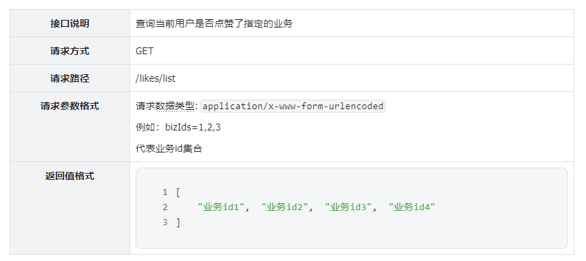

### 3.3.2.代码

首先是`tj-remark`的`com.tianji.remark.controller.LikedRecordController`：

```java
package com.tianji.remark.controller;

import com.tianji.remark.domain.dto.LikeRecordFormDTO;
import com.tianji.remark.service.ILikedRecordService;
import io.swagger.annotations.Api;
import io.swagger.annotations.ApiOperation;
import lombok.RequiredArgsConstructor;
import org.springframework.web.bind.annotation.*;

import javax.validation.Valid;
import java.util.List;
import java.util.Set;

/**
 * <p>
 * 点赞记录表 控制器
 * </p>
 */
@RestController
@RequiredArgsConstructor
@RequestMapping("/likes")
@Api(tags = "点赞业务相关接口")
public class LikedRecordController {

    private final ILikedRecordService likedRecordService;

    @PostMapping
    @ApiOperation("点赞或取消点赞")
    public void addLikeRecord(@Valid @RequestBody LikeRecordFormDTO recordDTO) {
        likedRecordService.addLikeRecord(recordDTO);
    }

    @GetMapping("list")
    @ApiOperation("查询指定业务id的点赞状态")
    public Set<Long> isBizLiked(@RequestParam("bizIds") List<Long> bizIds){
        return likedRecordService.isBizLiked(bizIds);
    }
}
```

然后是`tj-remark`的`com.tianji.remark.service.ILikedRecordService`：

```java
package com.tianji.remark.service;

import com.tianji.remark.domain.dto.LikeRecordFormDTO;
import com.tianji.remark.domain.po.LikedRecord;
import com.baomidou.mybatisplus.extension.service.IService;

import java.util.List;
import java.util.Set;

/**
 * <p>
 * 点赞记录表 服务类
 * </p>
 */
public interface ILikedRecordService extends IService<LikedRecord> {

    void addLikeRecord(LikeRecordFormDTO recordDTO);

    Set<Long> isBizLiked(List<Long> bizIds);
}
```

最后是`tj-remark`的实现类`com.tianji.remark.service.impl.LikedRecordServiceImpl`：

```java
@Override
public Set<Long> isBizLiked(List<Long> bizIds) {
    // 1.获取登录用户id
    Long userId = UserContext.getUser();
    // 2.查询点赞状态
    List<LikedRecord> list = lambdaQuery()
            .in(LikedRecord::getBizId, bizIds)
            .eq(LikedRecord::getUserId, userId)
            .list();
    // 3.返回结果
    return list.stream().map(LikedRecord::getBizId).collect(Collectors.toSet());
}
```

### 3.3.3.暴露Feign接口

由于该接口是给其它微服务调用的，所以必须暴露出Feign客户端，并且定义好fallback降级处理：

我们在tj-api模块中定义一个客户端：

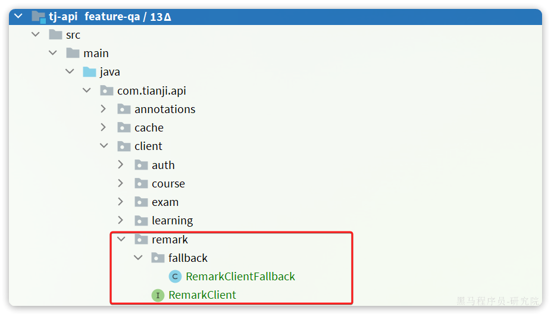

其中RemarkClient如下：

```java
package com.tianji.api.client.remark;

import com.tianji.api.client.remark.fallback.RemarkClientFallback;
import org.springframework.cloud.openfeign.FeignClient;
import org.springframework.web.bind.annotation.GetMapping;
import org.springframework.web.bind.annotation.RequestParam;

import java.util.Set;

@FeignClient(value = "remark-service", fallbackFactory = RemarkClientFallback.class)
public interface RemarkClient {
    @GetMapping("/likes/list")
    Set<Long> isBizLiked(@RequestParam("bizIds") Iterable<Long> bizIds);
}
```

对应的fallback逻辑：

```java
package com.tianji.api.client.remark.fallback;

import com.tianji.api.client.remark.RemarkClient;
import com.tianji.common.utils.CollUtils;
import lombok.extern.slf4j.Slf4j;
import org.springframework.cloud.openfeign.FallbackFactory;

import java.util.Set;

@Slf4j
public class RemarkClientFallback implements FallbackFactory<RemarkClient> {

    @Override
    public RemarkClient create(Throwable cause) {
        log.error("查询remark-service服务异常", cause);
        return new RemarkClient() {

            @Override
            public Set<Long> isBizLiked(Iterable<Long> bizIds) {
                return CollUtils.emptySet();
            }
        };
    }
}
```

由于`RemarkClientFallback`是定义在`tj-api`的`com.tianji.api`包，由于每个微服务扫描包不一致。因此其它引用`tj-api`的微服务是无法通过扫描包加载到这个类的。

我们需要通过SpringBoot的自动加载机制来加载这些fallback类：

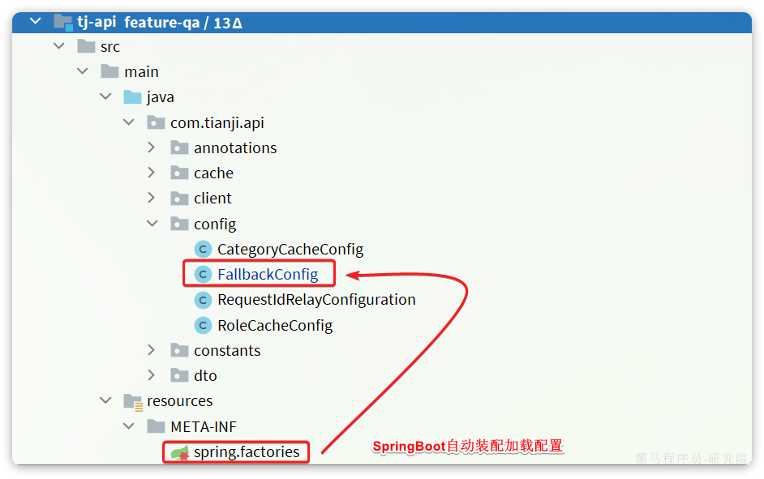

由于SpringBoot会在启动时读取`/META-INF/spring.factories`文件，我们只需要在该文件中指定了要加载

`FallbackConig`类：

```java
@Configuration
public class FallbackConfig {
    @Bean
    public LearningClientFallback learningClientFallback(){
        return new LearningClientFallback();
    }

    @Bean
    public TradeClientFallback tradeClientFallback(){
        return new TradeClientFallback();
    }

    @Bean
    public RemarkClientFallback remarkClientFallback(){
        return new RemarkClientFallback();
    }
}
```

这样所有在其中定义的fallback类都会被加载了。

### 3.3.3.改造查询回复接口

开发查询点赞状态接口的目的，是为了在查询用户回答和评论时，能看到当前用户是否点赞了。所以我们需要改造之前实现的分页查询回答或评论的接口。

首先找到`tj-api`中的`com.tianji.learning.service.impl.InteractionReplyServiceImpl`，注入评价服务的Feign客户端：


然后改造分页查询回答的业务即可，由于分页查询回答是大家各自实现的，这部分改造也有大家来实现。

## 3.4.监听点赞变更的消息

既然点赞后会发送MQ消息通知业务服务，那么每一个有关的业务服务都应该监听点赞数变更的消息，更新本地的点赞数量。

例如互动问答，我们需要在`tj-learning`服务中定义MQ监听器：

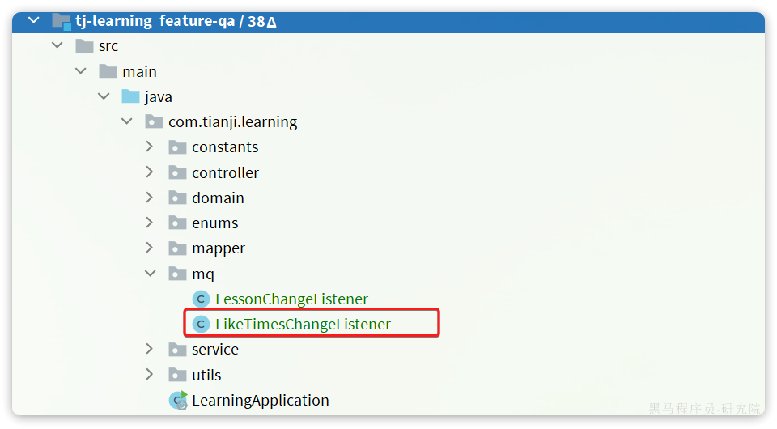

具体代码如下：

```java
package com.tianji.learning.mq;

import com.tianji.api.dto.remark.LikedTimesDTO;
import com.tianji.learning.domain.po.InteractionReply;
import com.tianji.learning.service.IInteractionReplyService;
import lombok.RequiredArgsConstructor;
import lombok.extern.slf4j.Slf4j;
import org.springframework.amqp.core.ExchangeTypes;
import org.springframework.amqp.rabbit.annotation.Exchange;
import org.springframework.amqp.rabbit.annotation.Queue;
import org.springframework.amqp.rabbit.annotation.QueueBinding;
import org.springframework.amqp.rabbit.annotation.RabbitListener;
import org.springframework.stereotype.Component;

import java.util.ArrayList;
import java.util.List;

import static com.tianji.common.constants.MqConstants.Exchange.LIKE_RECORD_EXCHANGE;
import static com.tianji.common.constants.MqConstants.Key.QA_LIKED_TIMES_KEY;

@Slf4j
@Component
@RequiredArgsConstructor
public class LikeTimesChangeListener {

    private final IInteractionReplyService replyService;

    @RabbitListener(bindings = @QueueBinding(
            value = @Queue(name = "qa.liked.times.queue", durable = "true"),
            exchange = @Exchange(name = LIKE_RECORD_EXCHANGE, type = ExchangeTypes.TOPIC),
            key = QA_LIKED_TIMES_KEY
    ))
    public void listenReplyLikedTimesChange(LikedTimesDTO dto){
        log.debug("监听到回答或评论{}的点赞数变更:{}", dto.getBizId(), dto.getLikedTimes());

        List<InteractionReply> list = new ArrayList<>(likedTimesDTOs.size());
        InteractionReply r = new InteractionReply();
        r.setId(dto.getBizId());
        r.setLikedTimes(dto.getLikedTimes());
        replyService.updateById(r);
    }
}
```

# 4.点赞功能改进

虽然我们初步实现了点赞功能，不过有一个非常严重的问题，点赞业务包含多次数据库读写操作：


更重要的是，点赞操作波动较大，有可能会在短时间内访问量激增。例如有人非常频繁的点赞、取消点赞。这样就会给数据库带来非常大的压力。

怎么办呢？

## 4.1.改进思路分析

其实在实现提交学习记录的时候，我们就给大家分析过高并发问题的处理方案。点赞业务与提交播放记录类似，都是高并发写操作。

按照之前我们讲的，高并发写操作常见的优化手段有：

- 优化SQL和代码
- 变同步写为异步写
- 合并写请求

有同学可能会说，我们更新业务方点赞数量的时候，不就是利用MQ异步写来实现的吗？

没错，确实如此，虽然异步写减少了业务执行时间，降低了数据库写频率。不过此处更重要的是利用MQ来解耦。而且数据库的写次数没有减少，压力依然很大。

所以，我们应该像之前播放记录业务一样，采用合并写请求的方案。当然，现在的异步处理也保留，这样就兼顾了**异步写**、**合并写**的优势。

需要注意的是，合并写是有使用场景的，必须是对中间的N次写操作不敏感的情况下。点赞业务是否符合这一需求呢？

无论用户中间执行点赞、取消、再点赞、再取消多少次，点赞次数发生了多少次变化，业务方只关注最终的点赞结果即可：

- 用户是否点赞了
- 业务的总点赞次数

因此，点赞功能可以使用合并写方案。最终我们的点赞业务流程变成这样：


合并写请求有两个关键点要考虑：

- 数据如何缓存
- 缓存何时写入数据库

### 4.1.1.点赞数据缓存

点赞记录中最两个关键信息：

- 用户是否点赞
- 某业务的点赞总次数

这两个信息需要分别记录，也就是说我们需要在Redis中设计两种数据结构分别存储。

#### 4.1.1.1.用户是否点赞

要知道某个用户是否点赞某个业务，就必须记录业务id以及给业务点赞的所有用户id . 由于一个业务可以被很多用户点赞，显然是需要一个集合来记录。而Redis中的集合类型包含四种：

- List
- Set
- SortedSet
- Hash

而要判断用户是否点赞，就是判断存在且唯一。显然，Set集合是最合适的。我们可以用业务id为Key，创建Set集合，将点赞的所有用户保存其中，格式如下：

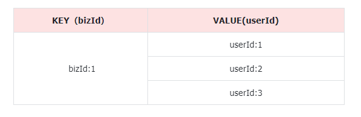

可以使用Set集合的下列命令完成点赞功能：

```shell
# 判断用户是否点赞
SISMEMBER bizId userId
# 点赞，如果返回1则代表点赞成功，返回0则代表点赞失败
SADD bizId userId
# 取消点赞，就是删除一个元素
SREM bizId userId
# 统计点赞总数
SCARD bizId
```

由于Redis本身具备持久化机制，AOF提供的数据可靠性已经能够满足点赞业务的安全需求，因此我们完全可以用Redis存储来代替数据库的点赞记录。

也就是说，用户的一切点赞行为，以及将来查询点赞状态我们可以都走Redis，不再使用数据库查询。

::: warning

有同学会担心，如果点赞数据非常庞大，达到数百亿，那么该怎办呢？

大多数企业根本达不到这样的规模，如果真的达到也没有关系。这个时候我们可以将Redis与数据库结合。

- 先利用Redis来记录点赞状态，并设置缓存过期时间
- 并且定期的将Redis中的点赞状态持久化到数据库
- 当某个记录点赞时，优先去Redis查询并判断，如果Redis中不存在，再去查询数据库数据并缓存到Redis。

:::

#### 4.1.1.2.点赞次数

由于点赞次数需要在业务方持久化存储到数据库，因此Redis只起到缓存作用即可。

由于需要记录业务id、业务类型、点赞数三个信息：

- 一个业务类型下包含多个业务id
- 每个业务id对应一个点赞数。

因此，我们可以把每一个业务类型作为一组，使用Redis的一个key，然后业务id作为键，点赞数作为值。这样的键值对集合，有两种结构都可以满足：

- Hash：传统键值对集合，无序
- SortedSet：基于Hash结构，并且增加了跳表。因此可排序，但更占用内存

如果是从节省内存角度来考虑，Hash结构无疑是最佳的选择；但是考虑到将来我们要从Redis读取点赞数，然后移除（避免重复处理）。为了保证线程安全，查询、移除操作必须具备原子性。而SortedSet则提供了几个移除并获取的功能，天生具备原子性。并且我们每隔一段时间就会将数据从Redis移除，并不会占用太多内存。因此，这里我们计划使用SortedSet结构。

格式如下：

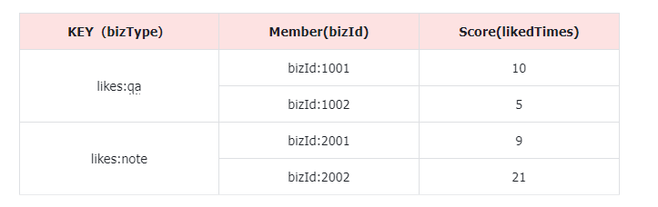

当用户对某个业务点赞时，我们统计点赞总数，并将其缓存在Redis中。这样一来在一段时间内，不管有多少用户对该业务点赞（热点业务数据，比如某个微博大V），都只在Redis中修改点赞总数，无需修改数据库。

### 4.1.2.点赞数据入库

点赞数据写入缓存了，但是这里有一个新的问题：

何时把缓存的点赞数，通过MQ通知到业务方，持久化到业务方的数据库呢？

在之前的提交播放记录业务中，由于播放记录是定期每隔15秒发送一次请求，频率固定。因此我们可以通过接收到播放记录后延迟20秒检测数据变更来确定是否有新数据到达。

但是点赞则不然，用户何时点赞、点赞频率如何完全不确定。因此无法采用延迟检测这样的手段。怎么办？

事实上这也是大多数**合并写请求**业务面临的问题，而多数情况下，我们只能通过**定时任务**，定期将缓存的数据持久化到数据库中。

### 4.1.3.流程图

综上所述，基于Redis做写缓存后，点赞流程如下：


## 4.2.改造点赞逻辑

需要改造的内容包括：

- `tj-remark`中所有点赞有关接口
  - 点赞接口
  - 查询单个点赞状态
  - 批量查询点赞状态
- `tj-remark`处理点赞数据持久化的定时任务
- `tj-learning`监听点赞数变更消息的业务

由于需要访问Redis，我们提前定义一个常量类，把Redis相关的Key定义为常量：

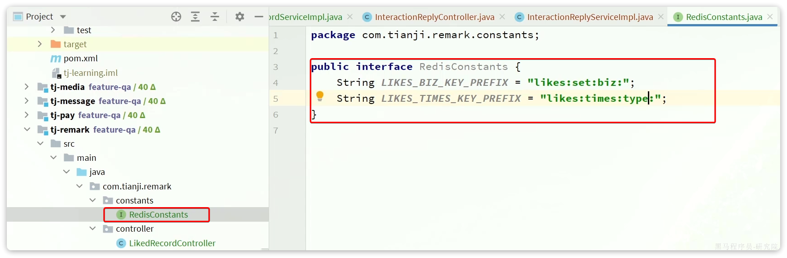

代码如下：

```java
public interface RedisConstants {
    /*给业务点赞的用户集合的KEY前缀，后缀是业务id*/
    String LIKE_BIZ_KEY_PREFIX = "likes:set:biz:";
    /*业务点赞数统计的KEY前缀，后缀是业务类型*/
    String LIKE_COUNT_KEY_PREFIX = "likes:times:type:";
}
```

### 4.2.1.点赞接口

接下来，我们定义一个新的点赞业务实现类：


并将LikedRecordServiceImpl注释：


代码如下：

```java
package com.tianji.remark.service.impl;

import com.baomidou.mybatisplus.extension.service.impl.ServiceImpl;
import com.tianji.api.dto.remark.LikedTimesDTO;
import com.tianji.common.autoconfigure.mq.RabbitMqHelper;
import com.tianji.common.utils.CollUtils;
import com.tianji.common.utils.StringUtils;
import com.tianji.common.utils.UserContext;
import com.tianji.remark.constants.RedisConstants;
import com.tianji.remark.domain.dto.LikeRecordFormDTO;
import com.tianji.remark.domain.po.LikedRecord;
import com.tianji.remark.mapper.LikedRecordMapper;
import com.tianji.remark.service.ILikedRecordService;
import lombok.RequiredArgsConstructor;
import org.springframework.data.redis.connection.StringRedisConnection;
import org.springframework.data.redis.core.RedisCallback;
import org.springframework.data.redis.core.StringRedisTemplate;
import org.springframework.data.redis.core.ZSetOperations;
import org.springframework.stereotype.Service;

import java.util.ArrayList;
import java.util.List;
import java.util.Set;
import java.util.stream.Collectors;
import java.util.stream.IntStream;

import static com.tianji.common.constants.MqConstants.Exchange.LIKE_RECORD_EXCHANGE;
import static com.tianji.common.constants.MqConstants.Key.LIKED_TIMES_KEY_TEMPLATE;

/**
 * <p>
 * 点赞记录表 服务实现类
 * </p>
 */
@Service
@RequiredArgsConstructor
public class LikedRecordServiceRedisImpl extends ServiceImpl<LikedRecordMapper, LikedRecord> implements ILikedRecordService {

    private final RabbitMqHelper mqHelper;
    private final StringRedisTemplate redisTemplate;

    @Override
    public void addLikeRecord(LikeRecordFormDTO recordDTO) {
        // 1.基于前端的参数，判断是执行点赞还是取消点赞
        boolean success = recordDTO.getLiked() ? like(recordDTO) : unlike(recordDTO);
        // 2.判断是否执行成功，如果失败，则直接结束
        if (!success) {
            return;
        }
        // 3.如果执行成功，统计点赞总数
        Long likedTimes = redisTemplate.opsForSet()
                .size(RedisConstants.LIKES_BIZ_KEY_PREFIX + recordDTO.getBizId());
        if (likedTimes == null) {
            return;
        }
        // 4.缓存点总数到Redis
        redisTemplate.opsForZSet().add(
                RedisConstants.LIKES_TIMES_KEY_PREFIX + recordDTO.getBizType(),
                recordDTO.getBizId().toString(),
                likedTimes
        );
    }

    private boolean unlike(LikeRecordFormDTO recordDTO) {
        // 1.获取用户id
        Long userId = UserContext.getUser();
        // 2.获取Key
        String key = RedisConstants.LIKES_BIZ_KEY_PREFIX + recordDTO.getBizId();
        // 3.执行SREM命令
        Long result = redisTemplate.opsForSet().remove(key, userId.toString());
        return result != null && result > 0;
    }

    private boolean like(LikeRecordFormDTO recordDTO) {
        // 1.获取用户id
        Long userId = UserContext.getUser();
        // 2.获取Key
        String key = RedisConstants.LIKES_BIZ_KEY_PREFIX + recordDTO.getBizId();
        // 3.执行SADD命令
        Long result = redisTemplate.opsForSet().add(key, userId.toString());
        return result != null && result > 0;
    }
}
```

### 4.2.2.批量查询点赞状态统计

目前我们的Redis点赞记录数据结构如下：

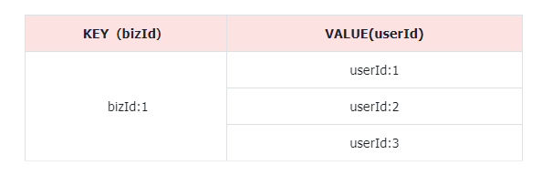

当我们判断某用户是否点赞时，需要使用下面命令：

```shell
# 判断用户是否点赞
SISMEMBER bizId userId
```

需要注意的是，这个命令只能判断**一个用户对某一个业务**的点赞状态。而我们的接口是要查询当前用户对多个业务的点赞状态。

因此，我们就需要多次调用`SISMEMBER`命令，也就需要向Redis多次发起网络请求，给网络带宽带来非常大的压力，影响业务性能。

那么，有没有办法能够一个命令完成多个业务点赞状态判断呢？

非常遗憾，答案是没有！只能多次执行`SISMEMBER`命令来判断。

不过，Redis中提供了一个功能，可以在一次请求中执行多个命令，实现批处理效果。这个功能就是Pipeline 

https://redis.io/docs/manual/pipelining/

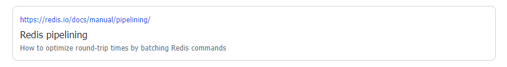

中文文档：

https://www.redis.com.cn/topics/pipelining.html

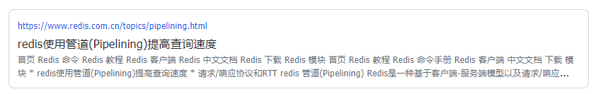

> 不要在一次批处理中传输太多命令，否则单次命令占用带宽过多，会导致网络阻塞

Spring提供的RedisTemplate也具备pipeline功能，最终批量查询点赞状态功能实现如下：

```java
@Override
public Set<Long> isBizLiked(List<Long> bizIds) {
    // 1.获取登录用户id
    Long userId = UserContext.getUser();
    // 2.查询点赞状态
    List<Object> objects = redisTemplate.executePipelined((RedisCallback<Object>) connection -> {
        StringRedisConnection src = (StringRedisConnection) connection;
        for (Long bizId : bizIds) {
            String key = RedisConstants.LIKES_BIZ_KEY_PREFIX + bizId;
            src.sIsMember(key, userId.toString());
        }
        return null;
    });
    // 3.返回结果
    return IntStream.range(0, objects.size()) // 创建从0到集合size的流
            .filter(i -> (boolean) objects.get(i)) // 遍历每个元素，保留结果为true的角标i
            .mapToObj(bizIds::get)// 用角标i取bizIds中的对应数据，就是点赞过的id
            .collect(Collectors.toSet());// 收集
}
```

### 4.2.3.定时任务

点赞成功后，会更新点赞总数并写入Redis中。而我们需要定时读取这些点赞总数的变更数据，通过MQ发送给业务方。这就需要定时任务来实现了。

定时任务的实现方案有很多，简单的例如：

- SpringTask
- Quartz

还有一些依赖第三方服务的分布式任务框架：

- Elastic-Job
- XXL-Job

此处我们先使用简单的SpringTask来实现并测试效果。

首先，在`tj-remark`模块的`RemarkApplication`启动类上添加注解：


其作用就是启用Spring的定时任务功能。

然后，定义一个定时任务处理器类：


代码如下：

```java
package com.tianji.remark.task;

import com.tianji.remark.service.ILikedRecordService;
import lombok.RequiredArgsConstructor;
import org.springframework.scheduling.annotation.Scheduled;
import org.springframework.stereotype.Component;

import java.util.List;

@Component
@RequiredArgsConstructor
public class LikedTimesCheckTask {

    private static final List<String> BIZ_TYPES = List.of("QA", "NOTE");
    private static final int MAX_BIZ_SIZE = 30;

    private final ILikedRecordService recordService;

    @Scheduled(fixedDelay = 20000)
    public void checkLikedTimes(){
        for (String bizType : BIZ_TYPES) {
            recordService.readLikedTimesAndSendMessage(bizType, MAX_BIZ_SIZE);
        }
    }
}
```

由于可能存在多个业务类型，不能厚此薄彼只处理部分业务。所以我们会遍历多种业务类型，分别处理。同时为了避免一次处理的业务过多，这里设定了每次处理的业务数量为30，当然这些都是可以调整的。

真正处理业务的逻辑封装到了`ILikedRecordService`中：

```java
public interface ILikedRecordService extends IService<LikedRecord> {
   // ... 略

    void readLikedTimesAndSendMessage(String bizType, int maxBizSize);
}
```

其实现类：

```java
@Override
public void readLikedTimesAndSendMessage(String bizType, int maxBizSize) {
    // 1.读取并移除Redis中缓存的点赞总数
    String key = RedisConstants.LIKES_TIMES_KEY_PREFIX + bizType;
    Set<ZSetOperations.TypedTuple<String>> tuples = redisTemplate.opsForZSet().popMin(key, maxBizSize);
    if (CollUtils.isEmpty(tuples)) {
        return;
    }
    // 2.数据转换
    List<LikedTimesDTO> list = new ArrayList<>(tuples.size());
    for (ZSetOperations.TypedTuple<String> tuple : tuples) {
        String bizId = tuple.getValue();
        Double likedTimes = tuple.getScore();
        if (bizId == null || likedTimes == null) {
            continue;
        }
        list.add(LikedTimesDTO.of(Long.valueOf(bizId), likedTimes.intValue()));
    }
    // 3.发送MQ消息
    mqHelper.send(
            LIKE_RECORD_EXCHANGE,
            StringUtils.format(LIKED_TIMES_KEY_TEMPLATE, bizType),
            list);
}
```

### 4.2.4.监听点赞数变更

需要注意的是，由于在定时任务中一次最多处理20条数据，这些数据就需要通过MQ一次发送到业务方，也就是说MQ的消息体变成了一个集合：

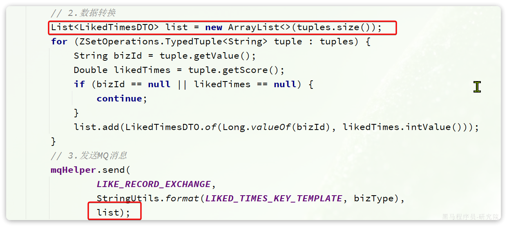

因此，作为业务方，在监听MQ消息的时候也必须接收集合格式。

我们修改`tj-learning`中的类`com.tianji.learning.mq.LikeTimesChangeListener`：

```java
package com.tianji.learning.mq;

import com.tianji.api.dto.remark.LikedTimesDTO;
import com.tianji.learning.domain.po.InteractionReply;
import com.tianji.learning.service.IInteractionReplyService;
import lombok.RequiredArgsConstructor;
import lombok.extern.slf4j.Slf4j;
import org.springframework.amqp.core.ExchangeTypes;
import org.springframework.amqp.rabbit.annotation.Exchange;
import org.springframework.amqp.rabbit.annotation.Queue;
import org.springframework.amqp.rabbit.annotation.QueueBinding;
import org.springframework.amqp.rabbit.annotation.RabbitListener;
import org.springframework.stereotype.Component;

import java.util.ArrayList;
import java.util.List;

import static com.tianji.common.constants.MqConstants.Exchange.LIKE_RECORD_EXCHANGE;
import static com.tianji.common.constants.MqConstants.Key.QA_LIKED_TIMES_KEY;

@Slf4j
@Component
@RequiredArgsConstructor
public class LikeTimesChangeListener {

    private final IInteractionReplyService replyService;

    @RabbitListener(bindings = @QueueBinding(
            value = @Queue(name = "qa.liked.times.queue", durable = "true"),
            exchange = @Exchange(name = LIKE_RECORD_EXCHANGE, type = ExchangeTypes.TOPIC),
            key = QA_LIKED_TIMES_KEY
    ))
    public void listenReplyLikedTimesChange(List<LikedTimesDTO> likedTimesDTOs){
        log.debug("监听到回答或评论的点赞数变更");

        List<InteractionReply> list = new ArrayList<>(likedTimesDTOs.size());
        for (LikedTimesDTO dto : likedTimesDTOs) {
            InteractionReply r = new InteractionReply();
            r.setId(dto.getBizId());
            r.setLikedTimes(dto.getLikedTimes());
            list.add(r);
        }
        replyService.updateBatchById(list);
    }
}
```

# 5.练习

## 5.1.完善互动问答功能

在互动问答功能中，有一些与点赞有关的之前暂未实现，请补充完整

## 5.2.点赞业务类型的动态配置

目前，点赞业务类型是写死在代码中的。将其定义到配置文件，交给nacos管理，实现动态加载效果。并将业务中与点赞类型有关的“魔法值”去除，改为读取配置文件中的业务类型。

## 5.3.点赞记录持久化（难度较大，选做）

思考一下，如果要把点赞记录定期持久化到数据库，查询时再加载，该如何实现？讲解一下你的思路。

如果有能力的话自己尝试实现一下。

## 5.4.定时任务（难度较大，选做）

研究一下XXL-JOB这个定时任务框架，尝试利用它来代替SpringTask。

# 6.面试

**面试官：看你项目中介绍，你负责点赞功能的设计和开发，那你能不能讲讲你们的点赞系统是如何设计的？**

::: tip

答：首先在设计之初我们分析了一下点赞业务可能需要的一些要求。

例如，在我们项目中需要用到点赞的业务不止一个，因此点赞系统必须具备通用性，独立性，不能跟具体业务耦合。

再比如，点赞业务可能会有较高的并发，我们要考虑到高并发写库的压力问题。

所以呢，我们在设计的时候，就将点赞功能抽离出来作为独立服务。当然这个服务中除了点赞功能以外，还有与之关联的评价功能，不过这部分我就没有参与了。在数据层面也会用业务类型对不同点赞数据做隔离。

从具体实现上来说，为了减少数据库压力，我们会利用Redis来保存点赞记录、点赞数量信息。然后利用定时任务定期的将点赞数量同步给业务方，持久化到数据库中。

:::

注意事项：回答时要先说自己的思考过程，再说具体设计，彰显你的逻辑清晰。设计的时候先不说细节，只说大概，停顿一下，吸引面试官去追问细节。如果面试官不追问，停顿一下后，自己接着说下面的

**面试官追问：那你们Redis中具体使用了哪种数据结构呢？**

::: tip

答：我们使用了两种数据结构，set和zset

首先保存点赞记录，使用了set结构，key是业务类型+业务id，值是点赞过的用户id。当用户点赞时就`SADD`用户id进去，当用户取消点赞时就`SREM`删除用户id。当判断是否点赞时使用`SISMEMBER`即可。当要统计点赞数量时，只需要`SCARD`就行，**而Redis的SET结构会在头信息中保存元素数量，因此SCARD直接读取该值，时间复杂度为O(1)**，性能非常好。

不过这里存在一个问题，就是页面需要判断当前用户有没有对某些业务点赞。这个时候会传来多个业务id的集合，而SISMEMBER只能一次判断一个业务的点赞状态，要判断多个业务的点赞状态，就必须多次调用SISMEMBER命令，与Redis多次交互，这显然是不合适的。（此处略停顿，等待面试官追问，面试官可能会问“那你们怎么解决的”。如果没追问，自己接着说），所以呢我们就采用了Pipeline管道方式，这样就可以一次请求实现多个业务点赞状态的判断了。

:::

**面试官追问（可能会）：那你ZSET干什么用的？**

::: tip

答：严格来说ZSET并不是用来实现点赞业务的，因为点赞只靠SET就能实现了。但是这里有一个问题，我们要定期将业务方的点赞总数通过MQ同步给业务方，并持久化到数据库。但是如果只有SET，我没办法知道哪些业务的点赞数发生了变化，需要同步到业务方。

因此，我们又添加了一个ZSET结构，用来记录点赞数变化的业务及对应的点赞总数。可以理解为一个待持久化的点赞任务队列。

每当业务被点赞，除了要缓存点赞记录，还要把业务id及点赞总数写入ZSET。这样定时任务开启时，只需要从ZSET中获取并移除数据，然后发送MQ给业务方，并持久化到数据库即可。

:::

面试官追问（可能会，没追问就自己说）：那为什么一定要用ZSET结构，把更新过的业务扔到一个List中不行吗？


::: tip

答：扔到List结构中虽然也能实现，但是存在一些问题：

首先，假设定时任务每隔2分钟执行一次，一个业务如果在2分钟内多次被点赞，那就会多次向List中添加同一个业务及对应的点赞总数，数据库也要持久化多次。这显然是多余的，因为只有最后一次才是有效的。而使用ZSET则因为member的唯一性，多次添加会覆盖旧的点赞数量，最终也只会持久化一次。

（面试官可能说：“那就改为SET结构，SET中只放业务id，业务方收到MQ通知后再次查询不就行了。”如果没问就自己往下说）

当然要解决这个问题，也可以用SET结构代替List，然后当业务被点赞时，只存业务id到SET并通知业务方。业务方接收到MQ通知后，根据id再次查询点赞总数从而避免多次更新的问题。但是这种做法会导致多次网络通信，增加系统网络负担。而ZSET则可以同时保存业务id及最新点赞数量，避免多次网络查询。

不过，并不是说ZSET方案就是完全没问题的，**毕竟ZSET底层是哈希结构+跳表**，对内存会有额外的占用。但是考虑到我们的定时任务每次会查询并删除ZSET数据，ZSET中的数据量始终会维持在一个较低级别，内存占用也是可以接受的。

:::

注意：加黑的地方一定要说，彰显你对Redis底层数据结构和算法有深入了解。
