# day07-积分系统

学习是需要正反馈的，这样学员才能有源源不断的动力去继续学习。

为了激励学员，我们需要设定一个学习**积分的排行榜**系统。优秀的学员给予一定的奖励，比如奖励优惠券。大家互相比拼的，刺激学员持续学习，互相卷起来。

而且不仅在天机学堂项目，很多其它类型项目中也都会有积分、排行榜功能。因此这套方案适用性很广，可以给大家以后实现相关功能提供思路。

# 1.需求分析

与以往类似，我们先类分析一下产品原型，统计一下要实现的接口，然后设计数据库表结构。

## 1.1.概念和规则

首先我们要知道几个概念：

- 积分：用户在天机学堂网站的各种交互行为都可以产生积分，积分值与行为类型有关
- 学霸天梯榜：按照每个学员的总积分排序得到的排行榜，称为学霸天梯榜。排名前三的有奖励。天梯榜每个自然月为一个赛季，月初清零。

具体的积分获取的细则如下：

::: warning

​                                      **积分获取规则**

1、签到规则

连续7天奖励10分  连续14天 奖励20  连续28天奖励40分， 每月签到进度当月第一天重置

2、学习规则

每学习一小节，积分+10，每天获得上限50分

3、交互规则（有效交互数据参与积分规则，无效数据会被删除）

- 写评价 积分+10 
- 写问答 积分+5 每日获得上限为20分
- 写笔记 积分+3 每次被采集+2 每日获得上限为20分

:::

用户获取积分的途径有5种：

- 签到：在个人积分页面可以每日签到，每次签到得1分，连续签到有额外积分奖励。
- 学习：也就是看视频
- 写回答：就是给其他学员提问的问题回答，给回答做评论是没有积分的。
- 写笔记：就是学习的过程中记录公开的学习笔记，分享给所有人看。或者你的笔记被人点赞。
- 写评价：对你学习过的课程评价，可以获取积分。但课程只能评价一次。


## 1.2.产品原型和接口统计

在用户的《个人中心》-《我的积分》页面，会有积分相关内容，原型页面如下：

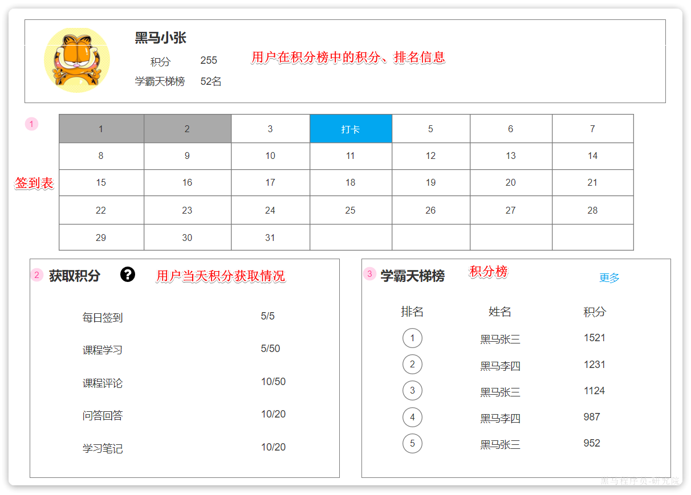

这个页面信息比较密集，从上往下来看分三部分：

- 顶部：当前用户在榜单中的信息
- 中部：签到表
- 下部：分为左右两侧
  - 左侧：用户当天获取的积分明细
  - 右侧：榜单

### 1.2.1.榜单

顶部展示的当前用户在榜单中的信息，其实也属于排行榜信息的一部分。因为排行榜查出来了，当前用户是第几名，积了多少分也就知道了。

因此，这里可以合并为一个接口：**查询当前赛季的积分排行榜信息。**

为什么说是当前赛季呢？

因为积分榜是以自然月为赛季的。页面说明中有讲：

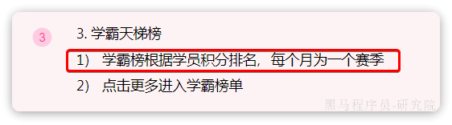

当我们点击更多时，会进入历史榜单页面：


在这里首先可以通过下拉选框选择历史赛季，当选定以后就可以展示对应赛季的历史榜单。

因此，这里有两个接口：

- **查询历史赛季列表**
- **查询历史榜单信息**

### 1.2.2.积分

那么问题来了，用户积分是如何获取的呢？之前分析过，获取积分的途径有五种之多：

- 签到：每次1分，连续签到有奖励
- 学习：学一个视频10分，每日上限50分
- 回答问题：回答一个问题5分，每日上限20分
- 写笔记：记录笔记得3分，笔记被采集得2分，每日上限20分
- 评论：得10分

可以看到，签到、评论受到业务本身的限制，有次数限制，因此没有积分上限。但学习、回答、笔记都有每日积分上限。因此当用户产生了积分行为时，我们必须判断当然该行为产生的积分是否已经达到上限，如果没有达到才能增加积分。

但问题来了：我们该如何知道用户的这类行为是否达到积分上限呢？

除非，我们详细记录下用户每一次获取积分的明细信息：

- 获取积分方式
- 获取积分分值
- 获取积分时间

只有这样，我们才能统计出用户当日每一种方式已经获取的积分，才能判断积分是否到达上限。

因此，第三个接口就是：**记录用户积分明细**。

除了这个接口以外，在个人积分页面，还需要统计用户当日的积分情况：


这是积分相关的第二个接口：**统计用户当日获取积分情况**。

### 1.2.3.签到

回到个人积分页面，在页面中部有一个签到表：


可以看到这就是一个日历，对应了每一天的签到情况。日历中当天的日期会高亮显示为《打卡》状态，点击即可完成当日打卡，服务端自然要记录打卡情况。

因此这里就有一个接口需要实现：**签到接口**

除此以外，可以看到本月第一天到今天为止的所有打卡日期也都高亮显示标记出来了。也就是说页面还需要知道本月到今天为止每一天的打卡情况。这样对于了一个接口：**查询本月签到记录**

### 1.2.4.总结

综上，我们要实现的接口有：

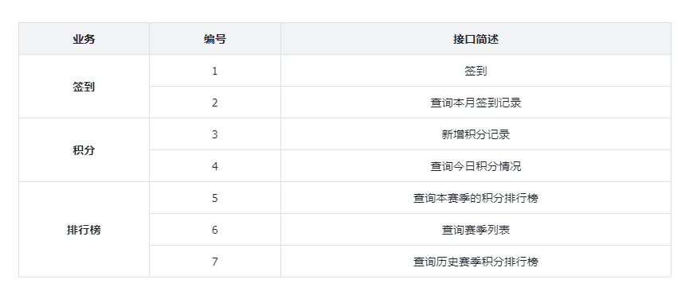

## 1.3.数据库设计

我们要实现的接口关联的实体有三类：

- 签到记录
- 积分记录
- 排行榜

因此，在设计数据库表的时候主要包含这三张表。

### 1.3.1.签到记录

签到最核心的包含两个要素：

- 谁签到：用户id
- 什么时候签的：签到日期

同时要考虑一些功能要素，比如：

- 补签功能，所以要有补签标示
- 按照年、月统计的功能：所以签到日期可以按照年、月、日分离保存

最终，签到的ER图如下：

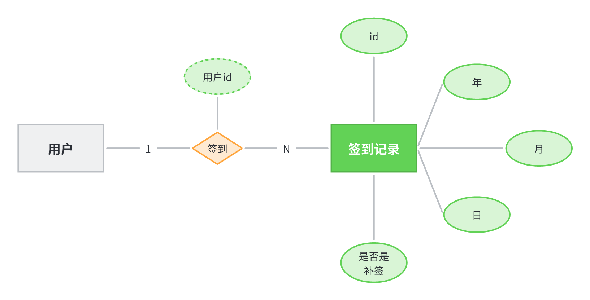

对应的数据库表结构：

```sql
 CREATE TABLE `sign_record` (
  `id` bigint NOT NULL AUTO_INCREMENT COMMENT '主键',
  `user_id` bigint NOT NULL COMMENT '用户id',
  `year` year NOT NULL COMMENT '签到年份',
  `month` tinyint NOT NULL COMMENT '签到月份',
  `date` date NOT NULL COMMENT '签到日期',
  `is_backup` bit(1) NOT NULL COMMENT '是否补签',
  PRIMARY KEY (`id`),
) ENGINE=InnoDB DEFAULT CHARSET=utf8mb4 COMMENT='签到记录表';
```

### 1.3.2.积分记录

积分记录的目的有两个：一个是统计用户当日某一种方式获取的积分是否达到上限；一个是统计积分排行榜。

要达成上述目的我们至少要记录下列信息：

- 本次得到积分值
- 积分方式
- 获取积分时间
- 获取积分的人

因此，积分记录的ER图如下：

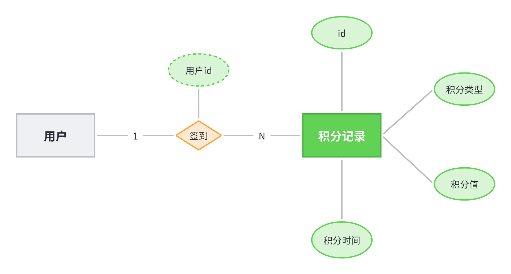

对应的数据库表结构：

```sql
CREATE TABLE IF NOT EXISTS `points_record` (
  `id` bigint NOT NULL AUTO_INCREMENT COMMENT '积分记录表id',
  `user_id` bigint NOT NULL COMMENT '用户id',
  `type` tinyint NOT NULL COMMENT '积分方式：1-课程学习，2-每日签到，3-课程问答， 4-课程笔记，5-课程评价',
  `points` tinyint NOT NULL COMMENT '积分值',
  `create_time` datetime NOT NULL DEFAULT CURRENT_TIMESTAMP COMMENT '创建时间',
  PRIMARY KEY (`id`) USING BTREE,
  KEY `idx_user_id` (`user_id`,`type`) USING BTREE,
  KEY `idx_create_time` (`create_time`) USING BTREE
) ENGINE=InnoDB AUTO_INCREMENT=41 DEFAULT CHARSET=utf8mb4 COLLATE=utf8mb4_0900_ai_ci ROW_FORMAT=DYNAMIC COMMENT='学习积分记录，每个月底清零';
```

### 1.3.3.排行榜

排行榜是分赛季的，而且页面也需要查询到历史赛季的列表。因此赛季也是一个实体，用来记录每一个赛季的信息。当然赛季信息非常简单：

- 赛季名称
- 赛季开始时间
- 赛季结束时间

因此赛季表非常简单：

```sql
CREATE TABLE IF NOT EXISTS `points_board_season` (
  `id` int NOT NULL AUTO_INCREMENT COMMENT '自增长id，season标示',
  `name` varchar(32) CHARACTER SET utf8mb4 COLLATE utf8mb4_0900_ai_ci DEFAULT NULL COMMENT '赛季名称，例如：第1赛季',
  `begin_time` date NOT NULL COMMENT '赛季开始时间',
  `end_time` date NOT NULL COMMENT '赛季结束时间',
  PRIMARY KEY (`id`) USING BTREE
) ENGINE=InnoDB AUTO_INCREMENT=13 DEFAULT CHARSET=utf8mb4 COLLATE=utf8mb4_0900_ai_ci ROW_FORMAT=DYNAMIC;
```

排行榜也不复杂，核心要素包括：

- 用户id
- 本赛季当前积分
- 本赛季当前排名

当然，由于要区分赛季，还应该关联赛季信息：

- 赛季id

因此，排行榜的ER图如下：

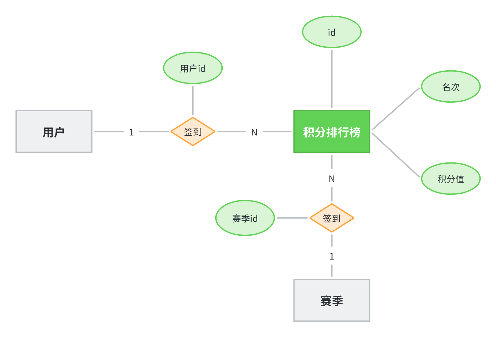

对应的数据库表结构：

```sql
CREATE TABLE IF NOT EXISTS `points_board` (
  `id` bigint NOT NULL COMMENT '榜单id',
  `user_id` bigint NOT NULL COMMENT '学生id',
  `points` int NOT NULL COMMENT '积分值',
  `rank` tinyint NOT NULL COMMENT '名次，只记录赛季前100',
  `season` smallint NOT NULL COMMENT '赛季，例如 1,就是第一赛季，2-就是第二赛季',
  PRIMARY KEY (`id`) USING BTREE,
  UNIQUE KEY `idx_season_user` (`season`,`user_id`) USING BTREE
) ENGINE=InnoDB DEFAULT CHARSET=utf8mb4 COLLATE=utf8mb4_0900_ai_ci ROW_FORMAT=DYNAMIC COMMENT='学霸天梯榜';
```

## 1.4.基础代码

### 1.4.1.创建分支

首先在DEV分支基础上创建一个新的功能分支：

```bash
git checkout -b feature-points-board
```

### 1.4.2.生成代码

然后利用mp插件自动生成代码即可。这里不再赘述。

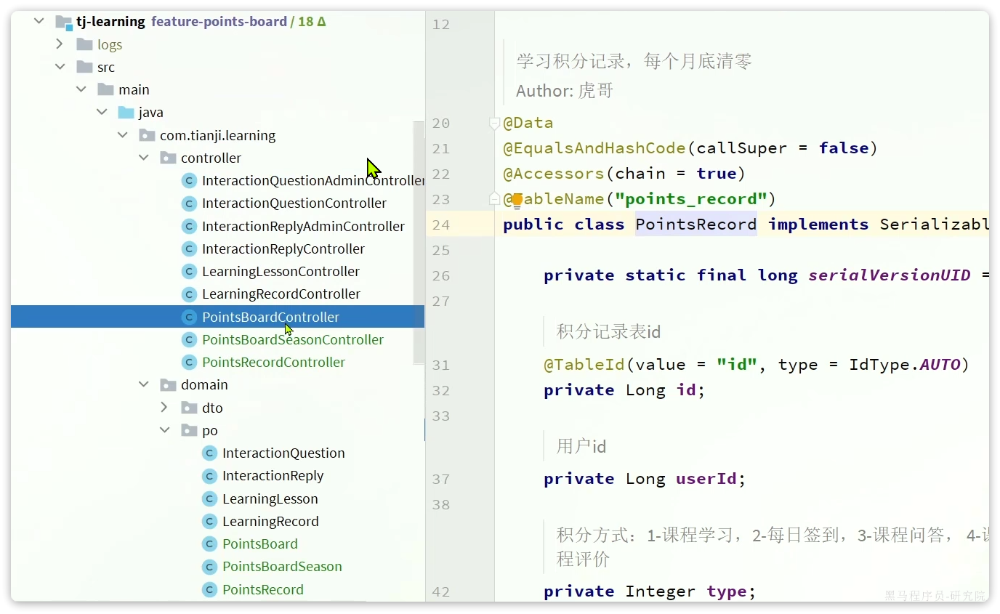

### 1.4.3.类型枚举

产生积分的业务类型从大的来说有5种，我们定义成一个枚举。在课前资料中已经提供了：

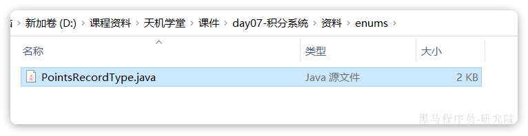

具体代码：

```java
package com.tianji.learning.enums;

import com.baomidou.mybatisplus.annotation.EnumValue;
import com.fasterxml.jackson.annotation.JsonCreator;
import com.fasterxml.jackson.annotation.JsonValue;
import com.tianji.common.enums.BaseEnum;
import lombok.Getter;

@Getter
public enum PointsRecordType implements BaseEnum {
    LEARNING(1, "课程学习", 50),
    SIGN(2, "每日签到", 0),
    QA(3, "课程问答", 20),
    NOTE(4, "课程笔记", 20),
    COMMENT(5, "课程评价", 0),
    ;
    @EnumValue
    @JsonValue
    int value;
    String desc;
    int maxPoints;

    PointsRecordType(int value, String desc, int maxPoints) {
        this.value = value;
        this.desc = desc;
        this.maxPoints = maxPoints;
    }

    @JsonCreator(mode = JsonCreator.Mode.DELEGATING)
    public static PointsRecordType of(Integer value){
        if (value == null) {
            return null;
        }
        for (PointsRecordType status : values()) {
            if (status.equalsValue(value)) {
                return status;
            }
        }
        return null;
    }
}
```

需要特别注意的是，在枚举中除了枚举对应的int值外，还记录了每种类型的积分上限，方便后续业务中做判断：

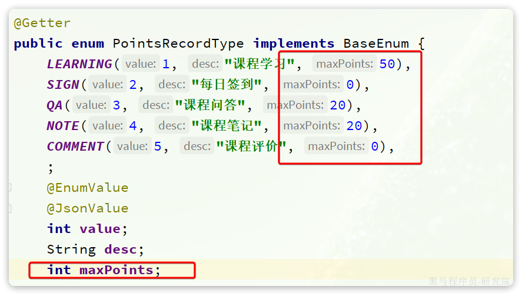

当然这个积分上限也可以不定义在枚举，而是交给Nacos做动态配置，实现线上热加载。如果有兴趣的话大家可以自己实现。

# 2.签到功能

## 2.1.思路分析

之前我们设计了签到功能对应的数据库表：

```sql
 CREATE TABLE `sign_record` (
  `id` bigint NOT NULL AUTO_INCREMENT COMMENT '主键',
  `user_id` bigint NOT NULL COMMENT '用户id',
  `year` year NOT NULL COMMENT '签到年份',
  `month` tinyint NOT NULL COMMENT '签到月份',
  `date` date NOT NULL COMMENT '签到日期',
  `is_backup` bit(1) NOT NULL COMMENT '是否补签',
  PRIMARY KEY (`id`),
) ENGINE=InnoDB DEFAULT CHARSET=utf8mb4 COMMENT='签到记录表';
```

这张表中的一条记录是一个用户一次的签到记录。假如一个用户1年签到100次，而网站有100万用户，就会产生1亿条记录。

随着用户量增多、时间的推移，这张表中的数据只会越来越多，占用的空间也会越来越大。

有没有什么办法能够减少签到的数据记录，减少空间占用呢？

大家回忆一下，小时候上补习班时的签到卡：


在这张小小的卡片上面，就记录了从一个月的第一天到最后一天的所有的签到情况。诶，你今天来上课了那就勾一下，没来就空着。这样呢，通过一个小小的卡片就能够记录一个同学这一个月的签到的情况了。虽然很原始，但是非常高效。

如果我们能用程序来模拟这样的签到卡，用一行数据去记录一个用户一个月的签到情况，可想而知，那比这种数据库的方式是不是要大大地节省空间。

那么问题来了，我们该怎么样去模拟这样的一个签到卡？

其实并不复杂，你想嘛？一个用户签到的情况无非就两种，要么签了，要么没签。这就像我们电路当中的这个二极管，那要么通电，要么不通，那用程序怎么表示这种状态呢？

没错，就是 0 或者1

如果我们按月来统计用户签到信息，签到记录为1，未签到则记录为0，就可以用一个长度为31位的二级制数来表示一个用户一个月的签到情况。最终效果如下：

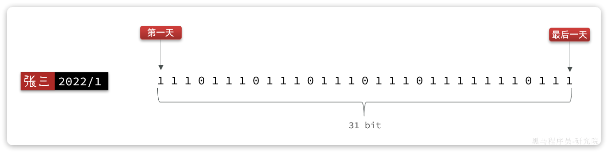

我们知道二进制是计算机底层最基础的存储方式了，其中的每一位数字就是计算机信息量的最小单位了，称之为bit，一个月最多也就 31 天，因此一个月的签到记录最多也就使用 31 bit 就能保存了，还不到 4 个字节。

而如果用到我们前面讲的数据库方式来保存相同数据，则要使用数百字节，是这种方式的上百倍都不止。

可见，这种用二进制位保存签到记录的方式，是不是非常高效啊！

像这种把每一个二进制位，与某些业务数据一一映射（本例中是与一个月的每一天映射），然后用二进制位上的数字0和1来标识业务状态的思路，称为**位图**。也叫做**BitMap**.

这种数据统计的方式非常节省空间，因此经常用来做各种数据统计。比如大名鼎鼎的布隆过滤器就是基于BitMap来实现的。

OK，那么利用BitMap我们就能直接实现签到功能，并且非常节省内存，还很高效。所以就无需通过数据库来操作了。

那么BitMap该怎么使用呢？

## 2.2.BitMap用法

Redis中就提供了BitMap这种结构以及一些相关的操作命令。

https://redis.io/commands/?group=bitmap

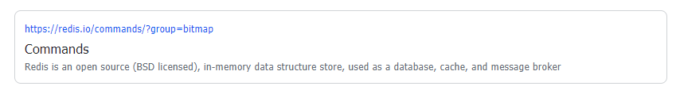

例如，修改某个bit位上的数据：


- offset：要修改第几个bit位的数据
- value：0或1

如果要签到就可以利用上面的这个命令，例如这个月的第1、2、3、6、7、8几天签到了，就可以这样：

```shell
# 第1天签到
SETBIT bm 0 1
# 第2天签到
SETBIT bm 1 1
# 第3天签到
SETBIT bm 2 1
# 第6天签到
SETBIT bm 5 1
# 第7天签到
SETBIT bm 6 1
# 第8天签到
SETBIT bm 7 1
```

最终Redis中保存的效果：


中间有两天空着没签，所以是0

那如果我们要查询签到记录怎么办？

那就是要读取BitMap中的数据，可以用这个命令：


这个命令比较复杂，是一个组合命令，可以实现查询、修改等多种操作。不过我们只关心读取，所以只看第一种操作，GET即可:

```bash
BITFIELD key GET encoding offset
```

- key：就是BitMap的key
- GET：代表查询
- encoding：返回结果的编码方式，BitMap中是二进制保存，而返回结果会转为10进制，但需要一个转换规则，也就是这里的编码方式
  - u：无符号整数，例如 u2，代表读2个bit位，转为无符号整数返回
  - i：又符号整数，例如 i2，代表读2个bit位，转为有符号整数返回
- offset：从第几个bit位开始读取，例如0：代表从第一个bit位开始

例如，我想查询从第1天到第3天的签到记录，可以这样：

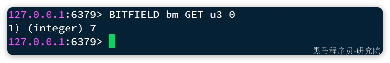

可以看到，返回的结果是7.  为什么是7呢？

签到记录是 11100111，从0开始，取3个bit位，刚好是111，转无符号整数，刚好是7

OK，这样BitMap的基本用法我们就学会了，将来我们就可以利用SETBIT命令来实现签到，利用BITFIELD命令来实现查询签到记录功能了。

::: warning

**拓展：**

Redis最基础的数据类型只有5种：String、List、Set、SortedSet、Hash，其它特殊数据结构大多都是基于以上5这种数据类型。

BitMap也不例外，它是基于String结构的。因为Redis的String类型底层是SDS，也会存在一个字节数组用来保存数据。而Redis就提供了几个按位操作这个数组中数据的命令，实现了BitMap效果。

由于String类型的最大空间是512MB，也就是2的31次幂个bit，因此可以保存的数据量级是十分恐怖的。

:::

想要了解Redis的SDS结构，可以参考下面视频：

https://www.bilibili.com/video/BV1cr4y1671t?p=146&vd_source=1ff0c1b434581723cf696ccc2f59ceaa

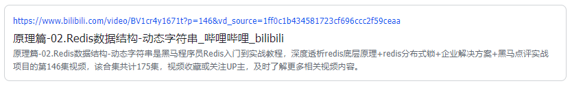

## 2.3.签到接口

在个人中心的积分页面，用户每天都可以签到一次，连续签到则有积分奖励，请实现签到接口，记录用户每天签到信息，方便做签到统计。

### 2.3.1.接口设计和分析

在个人中心的积分页面，用户每天都可以签到一次：

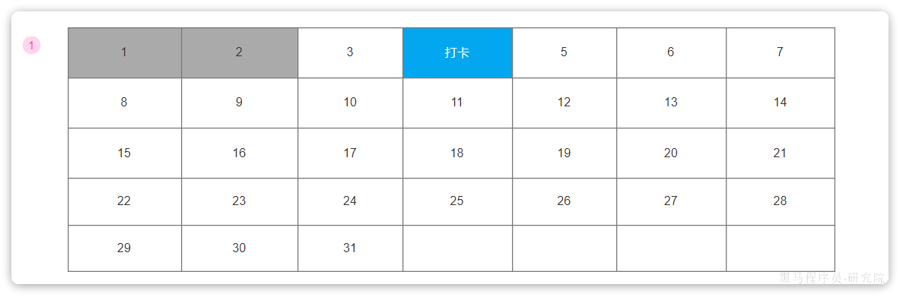

而在后台，要做的事情就是把BitMap中的与签到日期对应的bit位，置为1.

另外，为了便于统计，我们计划每个月为每个用户生成一个独立的KEY，因此KEY中必须包含用户信息、月份信息，长这样：

```shell
sign:uid:xxx:202401
```

我们可以提前定义这样一个KEY前缀的常量：


由KEY的结构可知，要签到，就必须知道是**谁**在**哪一天**签到，也就是两个信息：

- 当前用户
- 当前时间

这两个信息我们都可以自己获取，因此签到时，前端无需传递任何参数。

那么签到以后是否需要返回数据呢？

需求中说连续签到会有积分奖励，那么为了提升用户体验，在用户签到成功以后是不是应该返回连续签到天数和获取的积分奖励呢。

综上，最终签到的接口信息如下：

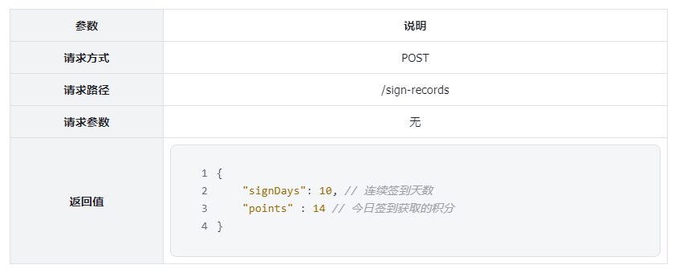

### 2.3.2.实体

签到接口只需要一个返回值VO，在课前资料中已经提供了：


具体代码：

```java
package com.tianji.learning.domain.vo;

import com.fasterxml.jackson.annotation.JsonIgnore;
import io.swagger.annotations.ApiModel;
import io.swagger.annotations.ApiModelProperty;
import lombok.Data;

@Data
@ApiModel(description = "签到结果")
public class SignResultVO {
    @ApiModelProperty("连续签到天数")
    private Integer signDays;
    @ApiModelProperty("签到得分")
    private Integer signPoints = 1;
    @ApiModelProperty("连续签到奖励积分，连续签到超过7天以上才有奖励")
    private Integer rewardPoints;

    @JsonIgnore
    public int totalPoints(){
        return signPoints + rewardPoints;
    }
}
```

需要注意的是，这里竟然是3个字段：

- signDays：连续签到天数
- signPoints：签到得分，固定为1
- rewardPoints：连续签到的奖励积分

这与产品的需求是一致的，正常签到得1分，连续签到则有积分奖励。这里是把积分明细返回了，前端可以根据自己的需求展示。

那么问题来了，我们该如何统计用户连续签到了几天呢？

### 2.3.3.连续签到统计

如何得到连续签到天数？需要下面几步：

- 获取本月到今天为止的所有签到数据
- 从今天开始，向前统计，直到遇到第一次未签到为止，计算总的签到次数，就是连续签到天数

如图：


如果用一个伪代码来表示，大概是这样：

```shell
int count = 0; // 定义一个计数器
for(/*从后向前遍历签到记录中的每一个bit位*/){
    // 判断是否是1
    // 如果是，则count++
}
```

这里存在几个问题：

- 如何才能得到本月到今天为止的所有签到记录？
- 如何从后向前遍历每一个bit位？

至于签到记录，可以利用我们之前讲的BITFIELD命令来获取，从0开始，到今天为止的记录，命令是这样的：

```shell
BITFIELD key GET u[dayOfMonth] 0
```

但是遍历bit位该怎么操作？我们从没学过二进制数字的遍历啊！

**你可以把二进制数中的每一个bit位当做弹夹中的一个个的子弹。遍历bit位的过程，就是打空弹夹的过程**：

- 将弹夹最上方的子弹上膛（找到最后一个bit位，并获取它）
- 发射子弹（移除这个bit位，下一个bit位就成为最后一个）
- 回到步骤1

最终，每一发子弹都会从备发射，这就像每一个bit位都会被遍历。

因此，现在问题就转化为两件事情：

- 如何找到并获取签到记录中最后一个bit位
  - 任何数与1做与运算，得到的结果就是它本身。因此我们让签到记录与1做与运算，就得到了最后一个bit位
- 如何移除这个bit位
  - 把数字右移一位，最后一位到了小数点右侧，由于我们保留整数，最后一位自然就被丢弃了

### 2.3.4.实现接口

首先，在`tj-learning`服务中的`com.tianji.learning.controller.SignRecordController`中定义接口：

```java
package com.tianji.learning.controller;

import com.tianji.learning.domain.vo.SignResultVO;
import com.tianji.learning.service.ISignRecordService;
import io.swagger.annotations.Api;
import io.swagger.annotations.ApiOperation;
import lombok.RequiredArgsConstructor;
import org.springframework.web.bind.annotation.GetMapping;
import org.springframework.web.bind.annotation.PostMapping;
import org.springframework.web.bind.annotation.RequestMapping;
import org.springframework.web.bind.annotation.RestController;

@Api(tags = "签到相关接口")
@RestController
@RequestMapping("sign-records")
@RequiredArgsConstructor
public class SignRecordController {

    private final ISignRecordService recordService;

    @PostMapping
    @ApiOperation("签到功能接口")
    public SignResultVO addSignRecords(){
        return recordService.addSignRecords();
    }
}
```

然后，在`com.tianji.learning.service.ISignRecordService`中定义service方法：

```java
package com.tianji.learning.service;

import com.tianji.learning.domain.vo.SignResultVO;

public interface ISignRecordService {
    SignResultVO addSignRecords();
}
```

最后，在`com.tianji.learning.service.impl.SignRecordServiceImpl`中实现方法：

```java
package com.tianji.learning.service.impl;

import com.tianji.common.autoconfigure.mq.RabbitMqHelper;
import com.tianji.common.constants.MqConstants;
import com.tianji.common.exceptions.BizIllegalException;
import com.tianji.common.utils.BooleanUtils;
import com.tianji.common.utils.CollUtils;
import com.tianji.common.utils.DateUtils;
import com.tianji.common.utils.UserContext;
import com.tianji.learning.constants.RedisConstants;
import com.tianji.learning.domain.vo.SignResultVO;
import com.tianji.learning.mq.message.SignInMessage;
import com.tianji.learning.service.ISignRecordService;
import lombok.RequiredArgsConstructor;
import org.springframework.data.redis.connection.BitFieldSubCommands;
import org.springframework.data.redis.core.StringRedisTemplate;
import org.springframework.stereotype.Service;

import java.time.LocalDate;
import java.util.List;

@Service
@RequiredArgsConstructor
public class SignRecordServiceImpl implements ISignRecordService {

    private final StringRedisTemplate redisTemplate;

    @Override
    public SignResultVO addSignRecords() {
        // 1.签到
        // 1.1.获取登录用户
        Long userId = UserContext.getUser();
        // 1.2.获取日期
        LocalDate now = LocalDate.now();
        // 1.3.拼接key
        String key = RedisConstants.SIGN_RECORD_KEY_PREFIX
                + userId
                + now.format(DateUtils.SIGN_DATE_SUFFIX_FORMATTER);
        // 1.4.计算offset
        int offset = now.getDayOfMonth() - 1;
        // 1.5.保存签到信息
        Boolean exists = redisTemplate.opsForValue().setBit(key, offset, true);
        if (BooleanUtils.isTrue(exists)) {
            throw new BizIllegalException("不允许重复签到！");
        }
        // 2.计算连续签到天数
        int signDays = countSignDays(key, now.getDayOfMonth());
        // 3.计算签到得分
        int rewardPoints = 0;
        switch (signDays) {
            case 7:
                rewardPoints = 10;
                break;
            case 14:
                rewardPoints = 20;
                break;
            case 28:
                rewardPoints = 40;
                break;
        }
        // TODO 4.保存积分明细记录 
        
        // 5.封装返回
        SignResultVO vo = new SignResultVO();
        vo.setSignDays(signDays);
        vo.setRewardPoints(rewardPoints);
        return vo;
    }

    private int countSignDays(String key, int len) {
        // 1.获取本月从第一天开始，到今天为止的所有签到记录
        List<Long> result = redisTemplate.opsForValue()
                .bitField(key, BitFieldSubCommands.create().get(
                        BitFieldSubCommands.BitFieldType.unsigned(len)).valueAt(0));
        if (CollUtils.isEmpty(result)) {
            return 0;
        }
        int num = result.get(0).intValue();
        // 2.定义一个计数器
        int count = 0;
        // 3.循环，与1做与运算，得到最后一个bit，判断是否为0，为0则终止，为1则继续
        while ((num & 1) == 1) {
            // 4.计数器+1
            count++;
            // 5.把数字右移一位，最后一位被舍弃，倒数第二位成了最后一位
            num >>>= 1;
        }
        return count;
    }
}
```

# 3.积分功能

 用户签到、学习、参与互动问答、提交学习笔记等行为都可以产生积分，并基于积分形成排行榜。积分当月有效，月底清零。

具体积分规则如下：


::: warning

​										**积分获取规则**

1、签到规则

连续7天奖励10分  连续14天 奖励20  连续28天奖励40分， 每月签到进度当月第一天重置

2、学习规则

每学习一小节，积分+10，每天获得上限50分

3、交互规则（有效交互数据参与积分规则，无效数据会被删除）

- 写评价 积分+10 
- 写问答 积分+5 每日获得上限为20分
- 写笔记 积分+3 每次被采集+2 每日获得上限为20分

:::

## 3.1.新增积分

由积分规则可知，获取积分的行为多种多样，而且每一种行为都有自己的独立业务。而这些行为产生的时候需要保存一条积分明细到数据库。

我们显然不能要求其它业务的开发者在开发时帮我们新增一条积分记录，这样会导致原有业务与积分业务耦合。因此必须采用异步方式，将原有业务与积分业务解耦。

如果有必要，甚至可以将积分业务抽离，作为独立微服务。

### 3.1.1.思路分析

异步解耦的方式有很多，比如：

- 利用Spring的`@EventListener`功能：往往在同一个服务内使用
- 利用MQ：往往用在跨服务业务中使用

虽然我们积分功能目前是在学习中心实现的，不过考虑的以后的扩展性，此处我们还是考虑使用MQ来实现异步解耦。

大概的通信模式是这样的：

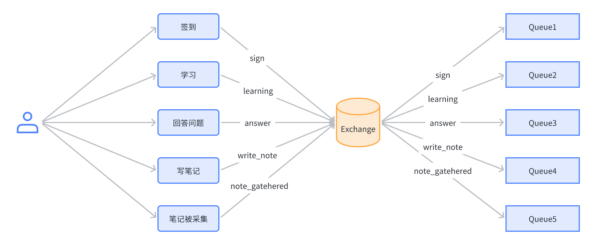

因此，我们需要为每一种积分行为定义一个不同的RoutingKey，在tj-common模块中已经定义好了：

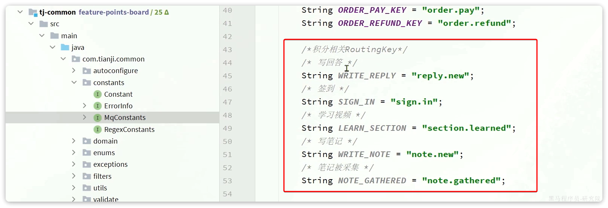

那现在只需要考虑MQ传递的消息格式就可以了。

最后保存的积分记录格式如下：

```sql
CREATE TABLE IF NOT EXISTS `points_record` (
  `id` bigint NOT NULL AUTO_INCREMENT COMMENT '积分记录表id',
  `user_id` bigint NOT NULL COMMENT '用户id',
  `type` tinyint NOT NULL COMMENT '积分方式：1-课程学习，2-每日签到，3-课程问答， 4-课程笔记，5-课程评价',
  `points` tinyint NOT NULL COMMENT '积分值',
  `create_time` datetime NOT NULL DEFAULT CURRENT_TIMESTAMP COMMENT '创建时间',
  PRIMARY KEY (`id`) USING BTREE,
  KEY `idx_user_id` (`user_id`,`type`) USING BTREE,
  KEY `idx_create_time` (`create_time`) USING BTREE
) ENGINE=InnoDB AUTO_INCREMENT=41 DEFAULT CHARSET=utf8mb4 COLLATE=utf8mb4_0900_ai_ci ROW_FORMAT=DYNAMIC COMMENT='学习积分记录，每个月底清零';
```

我们需要知道：

- userId：用户信息，必须传递
- type：积分类型，由于不同类型通过不同的RoutingKey来发送，通过RoutingKey可以判断积分类型，无需传递
- points：积分值，积分值也随积分方式变化，无需传递
- createTime：时间，就是当前时间，无需传递

综上，在MQ中我们只需要传递用户id一个参数即可。

### 3.1.2.发送MQ消息

接下来，我们就可以改造之前的业务，再所有可以获取积分的业务中发送MQ消息了。包括下列地方：

- 签到
- 完成一小节的学习（视频、考试均可）
- 回答问题
- 写笔记（未实现）
- 笔记被采集（未实现）

这里我们以签到功能为例，给大家示范一下消息发送的代码。签到功能比较特殊，因为签到积分不是固定的，我们无法确定，必须由业务方通过MQ消息传递给我们。因此需要先定义一个MQ消息体：


结构如下：

```java
package com.tianji.learning.mq.message;

import lombok.AllArgsConstructor;
import lombok.Data;
import lombok.NoArgsConstructor;

@Data
@NoArgsConstructor
@AllArgsConstructor(staticName = "of")
public class SignInMessage {
    private Long userId;
    private Integer points;
}
```

然后改造`com.tianji.learning.service.impl.SignRecordServiceImpl`中的签到功能：

```java
package com.tianji.learning.service.impl;

// ... 略

@Service
@RequiredArgsConstructor
public class SignRecordServiceImpl implements ISignRecordService {

    private final StringRedisTemplate redisTemplate;

    private final RabbitMqHelper mqHelper;

    @Override
    public SignResultVO addSignRecords() {
        // 1.签到
        // 1.1.获取登录用户
        Long userId = UserContext.getUser();
        // 1.2.获取日期
        LocalDate now = LocalDate.now();
        // 1.3.拼接key
        String key = RedisConstants.SIGN_RECORD_KEY_PREFIX
                + userId
                + now.format(DateUtils.SIGN_DATE_SUFFIX_FORMATTER);
        // 1.4.计算offset
        int offset = now.getDayOfMonth() - 1;
        // 1.5.保存签到信息
        Boolean exists = redisTemplate.opsForValue().setBit(key, offset, true);
        if (BooleanUtils.isTrue(exists)) {
            throw new BizIllegalException("不允许重复签到！");
        }
        // 2.计算连续签到天数
        int signDays = countSignDays(key, now.getDayOfMonth());
        // 3.计算签到得分
        int rewardPoints = 0;
        switch (signDays) {
            case 7:
                rewardPoints = 10;
                break;
            case 14:
                rewardPoints = 20;
                break;
            case 28:
                rewardPoints = 40;
                break;
        }
        // 4.保存积分明细记录
        mqHelper.send(
                MqConstants.Exchange.LEARNING_EXCHANGE,
                MqConstants.Key.SIGN_IN,
                SignInMessage.of(userId, rewardPoints + 1));// 签到积分是基本得分+奖励积分
        // 5.封装返回
        SignResultVO vo = new SignResultVO();
        vo.setSignDays(signDays);
        vo.setRewardPoints(rewardPoints);
        return vo;
    }
}
```

### 3.1.3.编写消息监听器

接下来，就可以去编写消息监听器了。6种不同积分获取方式，就需要6种消息监听器，这里我们先实现两个：

- 签到
- 写互动问答

剩下的大家自己完成。

在`tj-learning`模块定义一个消息监听器类：


具体代码如下：

```java
package com.tianji.learning.mq;

import com.tianji.common.constants.MqConstants;
import com.tianji.learning.enums.PointsRecordType;
import com.tianji.learning.mq.message.SignInMessage;
import com.tianji.learning.service.IPointsRecordService;
import lombok.RequiredArgsConstructor;
import org.springframework.amqp.core.ExchangeTypes;
import org.springframework.amqp.rabbit.annotation.Exchange;
import org.springframework.amqp.rabbit.annotation.Queue;
import org.springframework.amqp.rabbit.annotation.QueueBinding;
import org.springframework.amqp.rabbit.annotation.RabbitListener;
import org.springframework.stereotype.Component;

@Component
@RequiredArgsConstructor
public class LearningPointsListener {

    private final IPointsRecordService recordService;
    // 监听新增互动问答事件
    @RabbitListener(bindings = @QueueBinding(
            value = @Queue(name = "qa.points.queue", durable = "true"),
            exchange = @Exchange(name = MqConstants.Exchange.LEARNING_EXCHANGE, type = ExchangeTypes.TOPIC),
            key = MqConstants.Key.WRITE_REPLY
    ))
    public void listenWriteReplyMessage(Long userId){
        recordService.addPointsRecord(userId, 5, PointsRecordType.QA);
    }
    // 监听签到事件
    @RabbitListener(bindings = @QueueBinding(
            value = @Queue(name = "sign.points.queue", durable = "true"),
            exchange = @Exchange(name = MqConstants.Exchange.LEARNING_EXCHANGE, type = ExchangeTypes.TOPIC),
            key = MqConstants.Key.SIGN_IN
    ))
    public void listenSignInMessage(SignInMessage message){
        recordService.addPointsRecord(message.getUserId(), message.getPoints(), PointsRecordType.SIGN);
    }
}
```

监听到消息后，这里并没有写后续的业务处理，而是交给了`com.tianji.learning.service.IPointsRecordService`类中的`addPointsRecord`方法来处理，并且传递了3个参数：

- 用户id
- 积分值
- 积分类型枚举：其中包含了积分的最大值，方便做业务处理。

我们在tj-learning模块的`com.tianji.learning.service.IPointsRecordService`中添加service方法：

```java
package com.tianji.learning.service;

import com.baomidou.mybatisplus.extension.service.IService;
import com.tianji.learning.domain.po.PointsRecord;
import com.tianji.learning.enums.PointsRecordType;

import java.util.List;

/**
 * <p>
 * 学习积分记录，每个月底清零 服务类
 * </p>
 *
 * @author 虎哥
 */
public interface IPointsRecordService extends IService<PointsRecord> {
    void addPointsRecord(Long userId, int points, PointsRecordType type);
}
```

然后在`com.tianji.learning.service.impl.PointsRecordServiceImpl`中实现该方法：

```java
package com.tianji.learning.service.impl;

// ... 略
import java.util.List;

/**
 * <p>
 * 学习积分记录，每个月底清零 服务实现类
 * </p>
 */
@Service
@RequiredArgsConstructor
public class PointsRecordServiceImpl extends ServiceImpl<PointsRecordMapper, PointsRecord> implements IPointsRecordService {

    @Override
    public void addPointsRecord(Long userId, int points, PointsRecordType type) {
        // TODO 保存积分明细
    }
}
```

### 3.1.4.保存积分明细

在监听到消息通知后，不能说直接保存积分明细到数据库。因为积分规则中很多类型的积分是有上限的：

::: warning

​										**积分获取规则**

1、签到规则	

连续7天奖励10分  连续14天 奖励20  连续28天奖励40分， 每月签到进度当月第一天重置

2、学习规则

每学习一小节，积分+10，**每天获得上限50分**

3、交互规则（有效交互数据参与积分规则，无效数据会被删除）

- 写评价 积分+10 
- 写问答 积分+5 **每日获得上限为20分**
- 写笔记 积分+3 每次被采集+2 **每日获得上限为20分**

:::

因此，我们需要在保存到数据库之前，先判断是否超过积分上限。

如何判断呢？

第一，我们要知道积分上限。这个在积分类型枚举中定义了，算是已知。

第二，我们要知道用户今天已经得了多少分。这个就要去数据库查询统计了。

综上，我们最终的业务流程应该是这样的：

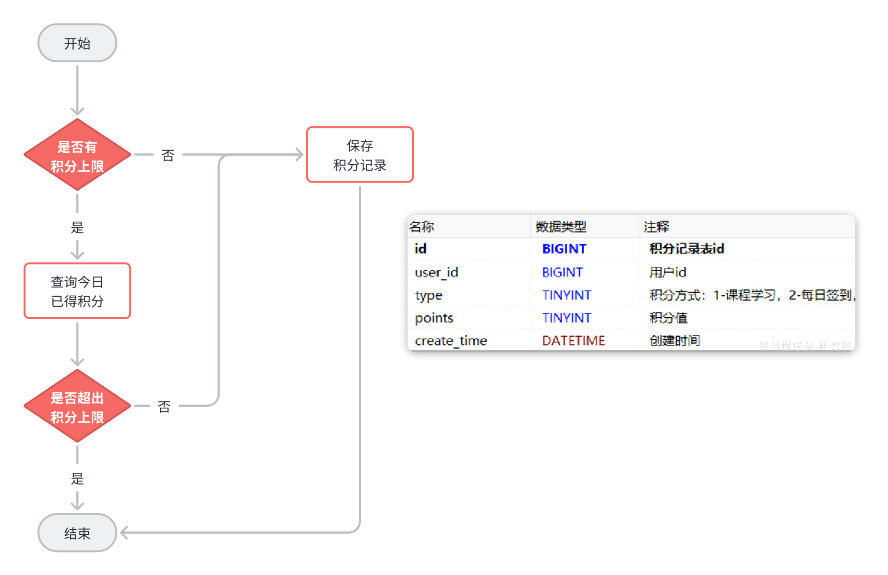

接下来，在`com.tianji.learning.service.impl.PointsRecordServiceImpl`中实现这段逻辑：

```java
@Override
public void addPointsRecord(Long userId, int points, PointsRecordType type) {
    LocalDateTime now = LocalDateTime.now();
    int maxPoints = type.getMaxPoints();
    // 1.判断当前方式有没有积分上限
    int realPoints = points;
    if(maxPoints > 0) {
        // 2.有，则需要判断是否超过上限
        LocalDateTime begin = DateUtils.getDayStartTime(now);
        LocalDateTime end = DateUtils.getDayEndTime(now);
        // 2.1.查询今日已得积分
        int currentPoints = queryUserPointsByTypeAndDate(userId, type, begin, end);
        // 2.2.判断是否超过上限
        if(currentPoints >= maxPoints) {
            // 2.3.超过，直接结束
            return;
        }
        // 2.4.没超过，保存积分记录
        if(currentPoints + points > maxPoints){
            realPoints = maxPoints - currentPoints;
        }
    }
    // 3.没有，直接保存积分记录
    PointsRecord p = new PointsRecord();
    p.setPoints(realPoints);
    p.setUserId(userId);
    p.setType(type);
    save(p);
}

private int queryUserPointsByTypeAndDate(
        Long userId, PointsRecordType type, LocalDateTime begin, LocalDateTime end) {
    // 1.查询条件
    QueryWrapper<PointsRecord> wrapper = new QueryWrapper<>();
    wrapper.lambda()
            .eq(PointsRecord::getUserId, userId)
            .eq(type != null, PointsRecord::getType, type)
            .between(begin != null && end != null, PointsRecord::getCreateTime, begin, end);
    // 2.调用mapper，查询结果
    Integer points = getBaseMapper().queryUserPointsByTypeAndDate(wrapper);
    // 3.判断并返回
    return points == null ? 0 : points;
}
```

注意，这里统计积分的时候需要自定义SQL，因此要在`com.tianji.learning.mapper.PointsRecordMapper`中定义方法：

```java
package com.tianji.learning.mapper;

import com.baomidou.mybatisplus.core.conditions.query.QueryWrapper;
import com.baomidou.mybatisplus.core.mapper.BaseMapper;
import com.baomidou.mybatisplus.core.toolkit.Constants;
import com.tianji.learning.domain.po.PointsRecord;
import org.apache.ibatis.annotations.Param;
import org.apache.ibatis.annotations.Select;

import java.util.List;

/**
 * <p>
 * 学习积分记录，每个月底清零 Mapper 接口
 * </p>
 */
public interface PointsRecordMapper extends BaseMapper<PointsRecord> {

    @Select("SELECT SUM(points) FROM points_record ${ew.customSqlSegment}")
    Integer queryUserPointsByTypeAndDate(@Param(Constants.WRAPPER) QueryWrapper<PointsRecord> wrapper);
}
```

## 3.2.查询今日积分情况

### 3.2.1.思路分析

在个人中心，用户可以查看当天各种不同类型的已获得的积分和积分上限：

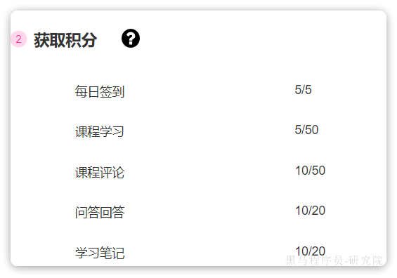

可以看到，页面需要的数据：

- 积分类型描述
- 今日已获取积分值
- 积分上限

而且积分类型不止一个，所以结果应该是集合。

另外，这个请求是查询当前用户的积分信息，所以只需要知道当前用户即可， 无需传参。

综上，接口信息如下：

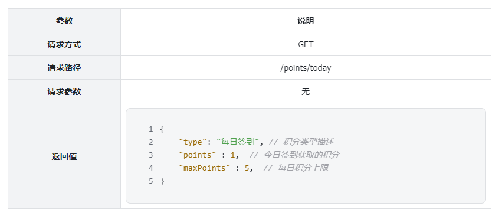

### 3.2.2.实现接口

在tj-learning模块的`com.tianji.learning.controller.PointsRecordController`中定义接口：

```java
package com.tianji.learning.controller;

import com.tianji.learning.domain.vo.PointsStatisticsVO;
import com.tianji.learning.service.IPointsRecordService;
import io.swagger.annotations.Api;
import io.swagger.annotations.ApiOperation;
import lombok.RequiredArgsConstructor;
import org.springframework.web.bind.annotation.GetMapping;
import org.springframework.web.bind.annotation.RequestMapping;
import org.springframework.web.bind.annotation.RestController;

import java.util.List;

/**
 * <p>
 * 学习积分记录，每个月底清零 控制器
 * </p>
 */
@RestController
@RequiredArgsConstructor
@RequestMapping("/points")
@Api(tags = "积分相关接口")
public class PointsRecordController {

    private final IPointsRecordService pointsRecordService;

    @ApiOperation("查询我的今日积分")
    @GetMapping("today")
    public List<PointsStatisticsVO> queryMyPointsToday(){
        return pointsRecordService.queryMyPointsToday();
    }
}
```

然后在中定义service方法：

```java
package com.tianji.learning.service;

import com.baomidou.mybatisplus.extension.service.IService;
import com.tianji.learning.domain.po.PointsRecord;
import com.tianji.learning.domain.vo.PointsStatisticsVO;
import com.tianji.learning.enums.PointsRecordType;

import java.util.List;

/**
 * <p>
 * 学习积分记录，每个月底清零 服务类
 * </p>
 */
public interface IPointsRecordService extends IService<PointsRecord> {
    
    void addPointsRecord(Long userId, int points, PointsRecordType type);

    List<PointsStatisticsVO> queryMyPointsToday();

}
```

然后在`com.tianji.learning.service.impl.PointsRecordServiceImpl`中实现该方法：

```java
@Override
public List<PointsStatisticsVO> queryMyPointsToday() {
    // 1.获取用户
    Long userId = UserContext.getUser();
    // 2.获取日期
    LocalDateTime now = LocalDateTime.now();
    LocalDateTime begin = DateUtils.getDayStartTime(now);
    LocalDateTime end = DateUtils.getDayEndTime(now);
    // 3.构建查询条件
    QueryWrapper<PointsRecord> wrapper = new QueryWrapper<>();
    wrapper.lambda()
            .eq(PointsRecord::getUserId, userId)
            .between(PointsRecord::getCreateTime, begin, end);
    // 4.查询
    List<PointsRecord> list = getBaseMapper().queryUserPointsByDate(wrapper);
    if (CollUtils.isEmpty(list)) {
        return CollUtils.emptyList();
    }
    // 5.封装返回
    List<PointsStatisticsVO> vos = new ArrayList<>(list.size());
    for (PointsRecord p : list) {
        PointsStatisticsVO vo = new PointsStatisticsVO();
        vo.setType(p.getType().getDesc());
        vo.setMaxPoints(p.getType().getMaxPoints());
        vo.setPoints(p.getPoints());
        vos.add(vo);
    }
    return vos;
}
```

注意，这里统计积分的时候需要自定义SQL，因此要在`com.tianji.learning.mapper.PointsRecordMapper`中定义方法：

```java
package com.tianji.learning.mapper;

import com.baomidou.mybatisplus.core.conditions.query.QueryWrapper;
import com.baomidou.mybatisplus.core.mapper.BaseMapper;
import com.baomidou.mybatisplus.core.toolkit.Constants;
import com.tianji.learning.domain.po.PointsRecord;
import org.apache.ibatis.annotations.Param;
import org.apache.ibatis.annotations.Select;

import java.util.List;

/**
 * <p>
 * 学习积分记录，每个月底清零 Mapper 接口
 * </p>
 *
 */
public interface PointsRecordMapper extends BaseMapper<PointsRecord> {

    @Select("SELECT SUM(points) FROM points_record ${ew.customSqlSegment}")
    Integer queryUserPointsByTypeAndDate(@Param(Constants.WRAPPER) QueryWrapper<PointsRecord> wrapper);

    @Select("SELECT type, SUM(points) AS points FROM points_record ${ew.customSqlSegment} GROUP BY type")
    List<PointsRecord> queryUserPointsByDate(@Param(Constants.WRAPPER) QueryWrapper<PointsRecord> wrapper);
}
```

# 4.练习

## 4.1.查询签到记录

在签到日历中，需要把本月第一天到今天为止的所有签到过的日期高亮显示。因此我们必须把签到记录返回，具体来说就是每一天是否签到的数据。是否签到，就是0或1，刚好在前端0和1代表false和true，也就是签到或没签到。

因此，每一天的签到结果就是一个0或1的数字，我们最终返回的结果是一个0或1组成的数组，对应从本月第1天到今天为止每一天的签到情况。

综上，最终的接口如下：

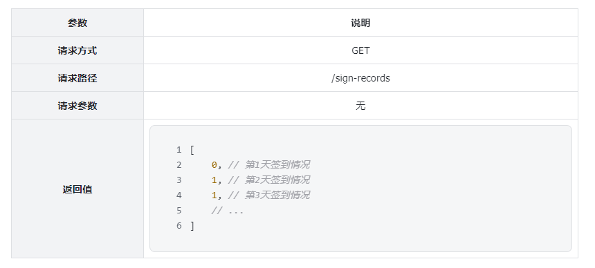

## 4.2.完善积分功能

用户的5类（细分是6类）不同行为都可以产生积分：

- 签到
- 回答问题
- 学习（视频或考试）
- 写笔记
- 笔记被采集
- 评论

其中，**笔记**、**评论**功能暂未实现，先不考虑。我们课堂上实现了签到的积分功能，还剩下**回答**、**学习**功能需要完善。

- 第一是编写在回答、学习完成一节后发送MQ消息
- 第二是编写消息监听器，处理积分累加事件

## 4.3.查询赛季列表功能

在历史赛季榜单中，有一个下拉选框，可以选择历史赛季信息：


因此，我们需要实现一个接口，把历史赛季全部查询出来。

接口信息如下：

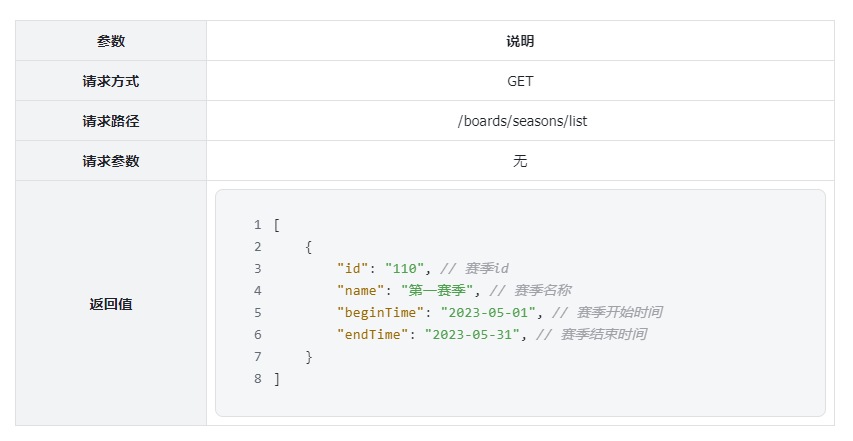

## 4.4.思考题

目前积分功能我们已经实现，用户积分明细也记录下来了。大家需要思考一下，积分排行榜该如何实现？

# 5.面试

**面试官：你项目中使用过Redis的那些数据结构啊？**

::: warning

答：很多，比如String、Hash、Set、SortedSet、BitMap等

:::

**面试官追问：能不能具体说说使用的场景？**

::: warning

答：比如很多的缓存，我们就使用了String结构来存储。还有点赞功能，我们用了Set结构和SortedSet结构。签到功能，我们用了BitMap结构。

就拿签到来说吧。因为签到数据量非常大嘛，而BitMap则是用bit位来表示签到数据，31bit位就能表示1个月的签到记录，非常节省空间，而且查询效率也比较高。

:::

**面试官追问：你使用Redis保存签到记录，那如果Redis宕机怎么办？**

::: warning

答：对于Redis的高可用数据安全问题，有很多种方案。

比如：我们可以给Redis添加数据持久化机制，比如使用AOF持久化。这样宕机后也丢失的数据量不多，可以接受。

或者呢，我们可以搭建Redis主从集群，再结合Redis哨兵。主节点会把数据持续的同步给从节点，当即后也会有哨兵重新选主，基本不用担心数据丢失问题。

当然，如果对于数据的安全性要求非常高。肯定还是要用传统数据库来实现的。但是为了解决签到数据量较大的问题，我们可能就需要对数据做分表处理了。或者及时将历史数据存档。

总的来说，签到数据使用Redis的BitMap无论是安全性还是数据内存占用情况，都是可以接受的。但是具体是选择Redis还是数据库方案，最终还是要看公司的要求来选择。

:::
