同学们，之前几天我们实现的都是学习辅助功能。学习辅助的目的是提升用户的学习体验，维护好老用户。而一个网站要想长久发展，除了要服务好老用户，还必须能吸引新用户，也就是拉新。而拉新最常见的手段就是优惠促销，比如优惠券。

从今天开始，我们就一起来实现一个优惠券管理的服务。优惠券功能比较复杂，包含的业务亮点也非常多，例如：

- 优惠券的优惠策略设计
- 优惠券的兑换码算法
- 优惠券领取的并发安全问题及解决方案
- 优惠券叠加方案的智能推荐
- 多商品、多券叠加时的优惠金额计算
- 多商品订单退款的拆单和退券问题

等等。。

这些方案不仅仅是在咱们项目，在所有电商类型的项目中都是热点、难点问题，在接下来几天的学习中我们会逐一分析和解决。

# 1.需求分析

需求分析的流程与以往类似，还是基于产品原型，三步走：

- 分析业务流程
- 统计业务接口
- 设计数据库表

## 1.1.业务流程梳理

优惠券包括两大部分功能：

- 优惠券管理和发放（管理端）
- 优惠券的领取和使用（用户端）

我们今天先实现管理端的功能。在后台管理营销中心的优惠券管理页面，可以看到一个优惠券列表页：

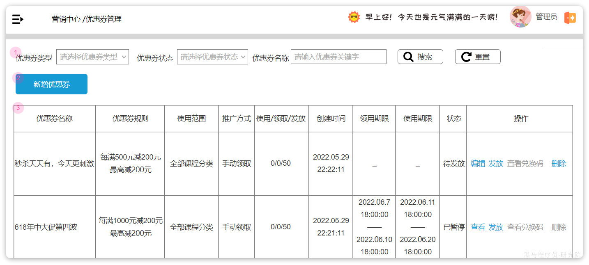

我们可以在这里实现优惠券的基础的**增删改查**功能。

不过，新增的优惠券并不会立刻出现在用户端页面，管理员还需要对优惠券信息做**审核，**审核通过后则可以通过发放按钮来发布优惠券。

而优惠券的发布也有两种不同的方式：

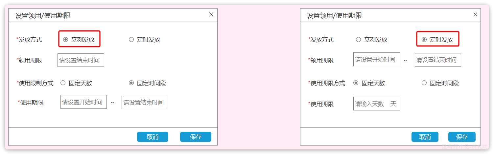

一个是立刻发放，一个是定时发放。

顾明思议，立刻发放就是优惠券立刻生效，会直接出现在用户端页面供用户领取。定时发放则需要指定一个发放开始时间，时间到期后才会进入出现在用户端页面。

而且无论是哪种发放方式，都需要指定一个过期时间，当优惠券过期后就会进入已结束状态，用户端页面无法领取。

当然，除了过期导致的结束发放以外，管理员也可以手动点击暂停发放：

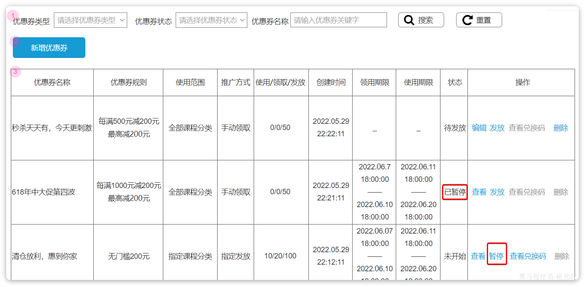

也可以在需要的时候重新发放优惠券。

特别需要注意的是，优惠券的领取方式有两种，来看一下优惠券的新增表单：

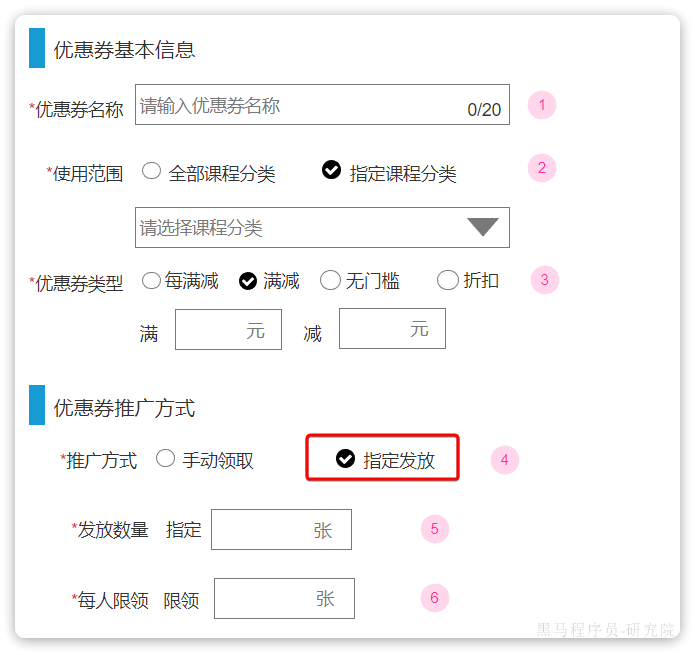

领取方式有两种：

- **手动领取**：就是展示在用户端页面，由用户自己手动点击领取
- **指定方法**：就是兑换码模式，后台给优惠券生成N张兑换码，由管理员发放给指定用户。

这就要求我们在发放优惠券的时候做判断，如果发现是指定发放模式，则需要提前生成兑换码。

综上，优惠券管理的业务流程和优惠券的状态转换如图：

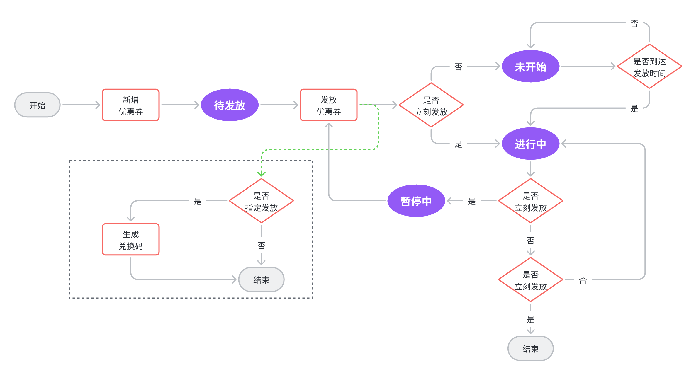

## 1.2.接口统计

首先，在优惠券的列表页：

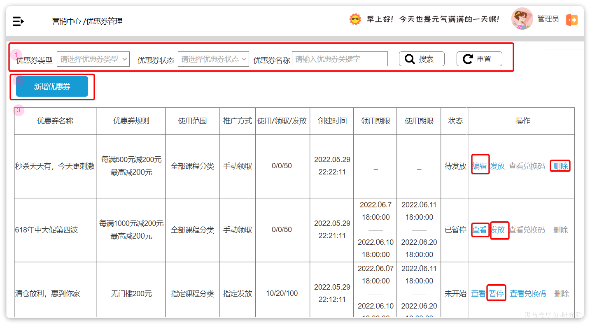

页面规范如下：

::: warning

1、搜索条件

- 优惠类型：天机学堂支持的类型有 1：满减，2：每满减，3：折扣，4：无门槛
- 优惠券状态：包括 1：待发放，2：未开始   3：进行中，4：已结束，5：暂停

2、列表显示

- 默认显示10条
- 默认按照创建时间倒序排序
- 使用/领取/发放：优惠券数量统计，已使用的数量/已领取的数量/总发放数量
- 领用期限：就是券领取的开始和结束时间

:::

可见这个列表就是一个典型的带过滤条件的分页查询。其它增删改查接口都比较简单，不再赘述。

所有接口在页面都一目了然：

- 优惠券的基本管理接口：
  - 分页查询优惠券列表
  - 新增优惠券
  - 编辑优惠券
  - 查看优惠券（根据id查询优惠券）
  - 删除优惠券
- 优惠券的方法接口：
  - 发放优惠券
  - 暂停发放优惠券

另外有几个比较隐蔽的接口。一个是方法优惠券时，如果选择的是定时方法，则需要指定发放时间，到期后才发放。这就需要一个定时任务，检索优惠券表，找到发放时间到期的券，完成发放功能。

另一个也是发放券问题，券除了有发放时间，还有过期时间，因此需要一个定时任务，检查券的过期时间，发现到期后需要更新券状态。

以上两个都是定时任务接口：

- 定时发放优惠券
- 定时结束优惠券发放

还有一个是跟兑换码有关。就是在发放优惠券的时候，如果发现优惠券的领取方式是指定发放，则需要生成兑换码。因此页面有一个查询兑换码功能：

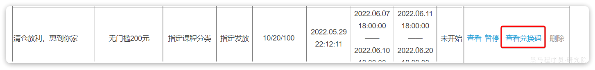

当我们点击查看兑换码时，就会进入一个兑换码展示页面：

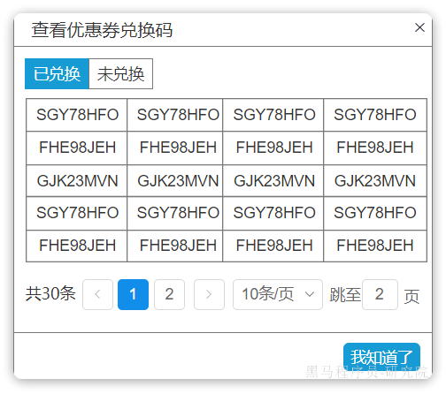

可以看出来，这是一个有过滤条件的分页查询功能。

综上，优惠券相关接口包括：

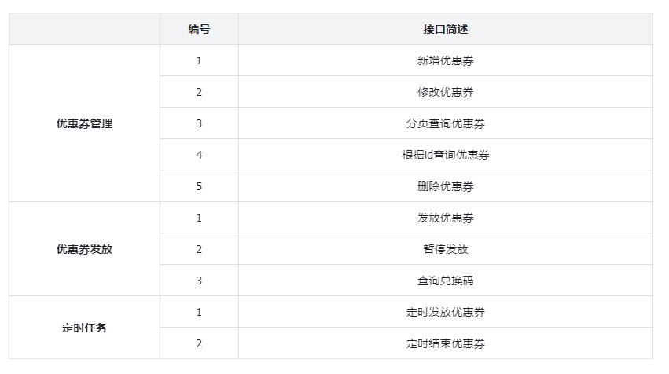

## 1.3.表结构设计

通过前面的接口分析，发现接口主要跟两个实体有关：

- 优惠券
- 兑换码

所以，接下来要设计的表就是以上两张表。

### 1.3.1.优惠券

首先从优惠券的新增表单来分析，表单页面如下：


其中的字段包含：

- 优惠券名称：一个普通字符串
- 使用范围：这里有两种选择：全部课程、指定课程分类，也就是不限定课程、限定课程，可以用布尔类型来表示。不过一旦选定了课程分类，就需要指定真正限定的分类。
  - 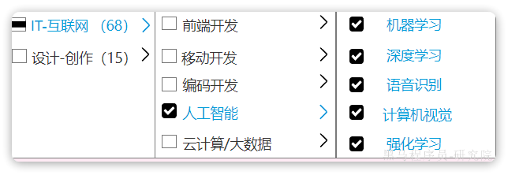

  -  此处是允许多选的，也就是说一个优惠券可以限定多个课程分类。而一个分类也可能被不同的券作为限定范围。因此优惠券与限定的分类是多对多关系。需要一张中间表来保存关系。这个以后再说。
- 优惠券类型：包含满减、每满减、满折扣、无门槛四种，例如：
  - 满100减15
  - 每满100减10
  - 满200打8折，不超过50
  - 直减20

可以看出来，虽然规则不同，但都可以用以下几部分来表示：

- 优惠的门槛：比如满100的100
- 优惠值：比如减15的15、打8折的8
- 优惠上限：比如不超过50

 因此，我们完全要表示完整优惠策略就需要四个字段：优惠类型、优惠门槛、优惠值、优惠上限

- 推广方式：手动领取和指定发放
- 发放数量
- 每人限领数量

OK，表单中的字段就这么多。然后再看看分页页码：

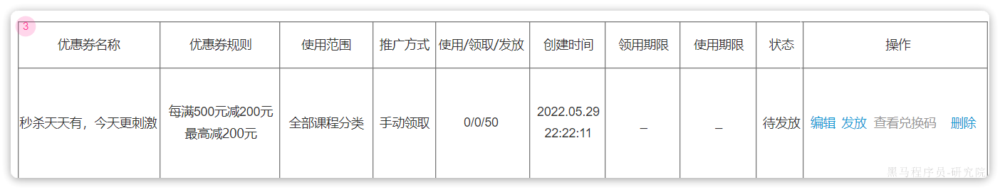

与新增页面重复的就不再赘述了，这里多出的一些字段有：

- 已领取数量
- 已使用数量
- 领用期限：也就是优惠券开始发放、结束发放的时间
- 使用期限：用户领取券后的使用期限，有两种方式：
  - 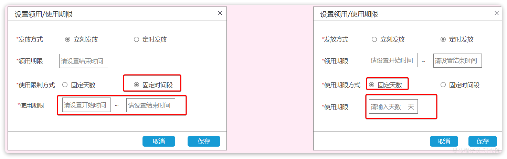

  - 固定时间段：需要指定开始时间、结束时间
  - 固体天数：指定天数，从用户领取之日起计算
- 优惠券状态

综上，优惠券表结构如下：

```sql
-- 导出  表 tj_promotion.coupon 结构
CREATE TABLE IF NOT EXISTS `coupon` (
  `id` bigint NOT NULL AUTO_INCREMENT COMMENT '优惠券id',
  `name` varchar(100) CHARACTER SET utf8mb4 COLLATE utf8mb4_0900_ai_ci NOT NULL DEFAULT '0' COMMENT '优惠券名称，可以和活动名称保持一致',
  `type` tinyint NOT NULL DEFAULT '1' COMMENT '优惠券类型，1：普通券。目前就一种，保留字段',
  `discount_type` tinyint NOT NULL COMMENT '折扣类型，1：满减，2：每满减，3：折扣，4：无门槛',
  `specific` bit(1) NOT NULL DEFAULT b'0' COMMENT '是否限定作用范围，false：不限定，true：限定。默认false',
  `discount_value` int NOT NULL DEFAULT '1' COMMENT '折扣值，如果是满减则存满减金额，如果是折扣，则存折扣率，8折就是存80',
  `threshold_amount` int NOT NULL DEFAULT '0' COMMENT '使用门槛，0：表示无门槛，其他值：最低消费金额',
  `max_discount_amount` int NOT NULL DEFAULT '0' COMMENT '最高优惠金额，满减最大，0：表示没有限制，不为0，则表示该券有金额的限制',
  `obtain_way` tinyint NOT NULL DEFAULT '0' COMMENT '获取方式：1：手动领取，2：兑换码',
  `issue_begin_time` datetime DEFAULT NULL COMMENT '开始发放时间',
  `issue_end_time` datetime DEFAULT NULL COMMENT '结束发放时间',
  `term_days` int NOT NULL DEFAULT '0' COMMENT '优惠券有效期天数，0：表示有效期是指定有效期的',
  `term_begin_time` datetime DEFAULT NULL COMMENT '优惠券有效期开始时间',
  `term_end_time` datetime DEFAULT NULL COMMENT '优惠券有效期结束时间',
  `status` tinyint DEFAULT '1' COMMENT '优惠券配置状态，1：待发放，2：未开始   3：进行中，4：已结束，5：暂停',
  `total_num` int NOT NULL DEFAULT '0' COMMENT '总数量，不超过5000',
  `issue_num` int NOT NULL DEFAULT '0' COMMENT '已发行数量，用于判断是否超发',
  `used_num` int NOT NULL DEFAULT '0' COMMENT '已使用数量',
  `user_limit` int NOT NULL DEFAULT '1' COMMENT '每个人限领的数量，默认1',
  `ext_param` json DEFAULT NULL COMMENT '拓展参数字段，保留字段',
  `create_time` datetime NOT NULL DEFAULT CURRENT_TIMESTAMP COMMENT '创建时间',
  `update_time` datetime NOT NULL DEFAULT CURRENT_TIMESTAMP ON UPDATE CURRENT_TIMESTAMP COMMENT '更新时间',
  `creater` bigint NOT NULL COMMENT '创建人',
  `updater` bigint NOT NULL COMMENT '更新人',
  PRIMARY KEY (`id`) USING BTREE
) ENGINE=InnoDB AUTO_INCREMENT=1630563495906942979 DEFAULT CHARSET=utf8mb4 COLLATE=utf8mb4_0900_ai_ci COMMENT='优惠券的规则信息';
```

另外，用来表示优惠券使用范围时，需要一个优惠券与课程分类的中间关系表：

```sql
CREATE TABLE IF NOT EXISTS `coupon_scope` (
  `id` bigint NOT NULL AUTO_INCREMENT,
  `type` tinyint NOT NULL COMMENT '范围限定类型：1-分类，2-课程，等等',
  `coupon_id` bigint NOT NULL COMMENT '优惠券id',
  `biz_id` bigint NOT NULL COMMENT '优惠券作用范围的业务id，例如分类id、课程id',
  PRIMARY KEY (`id`),
  KEY `idx_coupon` (`coupon_id`)
) ENGINE=InnoDB AUTO_INCREMENT=19 DEFAULT CHARSET=utf8mb4 COLLATE=utf8mb4_0900_ai_ci COMMENT='优惠券作用范围信息';
```

### 1.3.2.兑换码

兑换码的作用是让用户拿着这个码来兑换一张优惠券。因此一定与两个实体有关：

- 优惠券
- 用户

也就是说，我们需要知道将来是**谁**来兑换的券，可以兑换**哪张券。**当然，兑换码的码肯定也要保持到数据库，长这样：


除此以外，为了避免码被重复兑换，我们还需要记录码的状态：

- 码状态：已兑换、未兑换

最后，兑换码同样是有过期时间的，这个时间应该跟优惠券的过期时间一致。

综上，兑换码的最终表结构：

```sql
CREATE TABLE IF NOT EXISTS `exchange_code` (
  `id` int NOT NULL COMMENT '兑换码id',
  `code` varchar(10) CHARACTER SET utf8mb4 COLLATE utf8mb4_0900_ai_ci NOT NULL COMMENT '兑换码',
  `status` tinyint NOT NULL DEFAULT '1' COMMENT '兑换码状态， 1：待兑换，2：已兑换，3：兑换活动已结束',
  `user_id` bigint NOT NULL DEFAULT '0' COMMENT '兑换人',
  `type` tinyint NOT NULL DEFAULT '1' COMMENT '兑换类型，1：优惠券，以后再添加其它类型',
  `exchange_target_id` bigint NOT NULL DEFAULT '0' COMMENT '兑换码目标id，例如兑换优惠券，该id则是优惠券的配置id',
  `create_time` datetime NOT NULL DEFAULT CURRENT_TIMESTAMP COMMENT '创建时间',
  `expired_time` datetime NOT NULL COMMENT '兑换码过期时间',
  `update_time` datetime NOT NULL DEFAULT CURRENT_TIMESTAMP ON UPDATE CURRENT_TIMESTAMP COMMENT '更新时间',
  PRIMARY KEY (`id`) USING BTREE,
  KEY `index_status` (`status`) USING BTREE,
  KEY `index_config_id` (`exchange_target_id`) USING BTREE
) ENGINE=InnoDB DEFAULT CHARSET=utf8mb4 COLLATE=utf8mb4_0900_ai_ci COMMENT='兑换码';
```

所有的SQL文件都在课前资料中提供了：

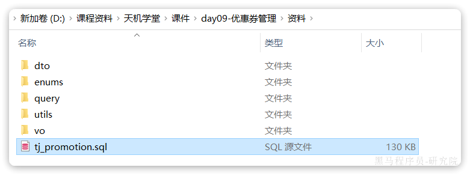

## 1.4.代码生成

首先，在DEV分支的基础上创建一个新的功能分支：

```shell
git checkout -b feature-promotions
```

### 1.4.1.创建新的模块

优惠券功能属于优惠促销的一部分，在项目中肯定属于独立的功能模块。我们需要创建一个新的module：

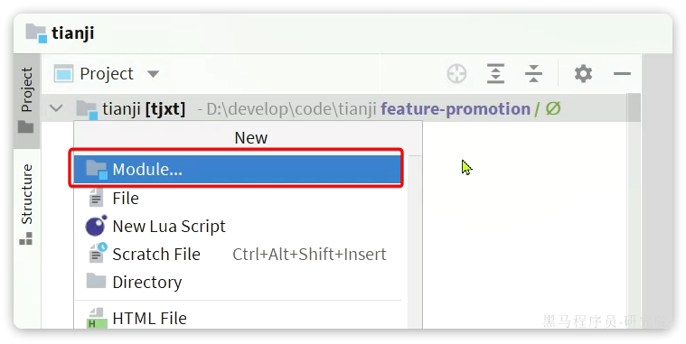

选择Maven工程：

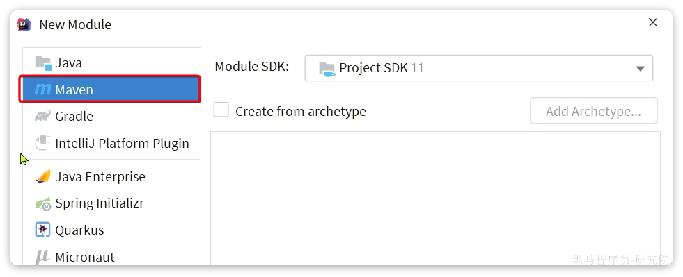

然后填写项目信息：

 


点击Finish，完成模块创建：

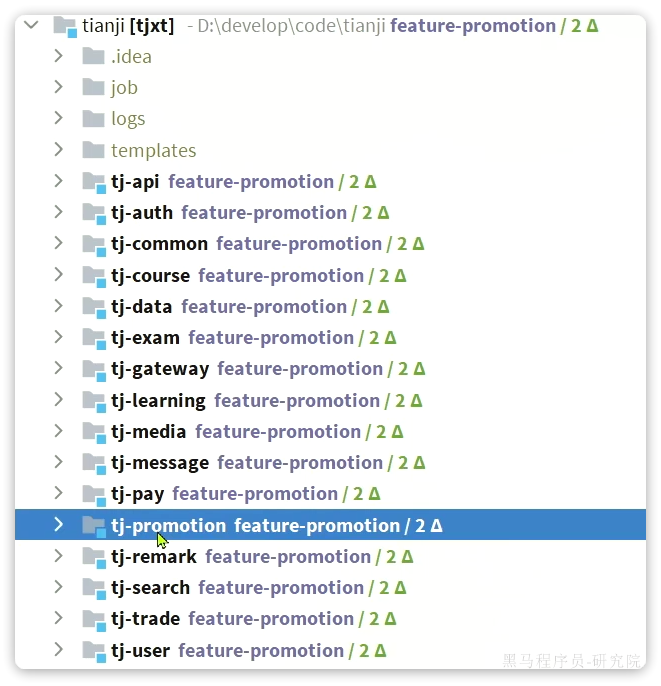

### 1.4.2.基础配置

项目创建完毕后，需要引入依赖，POM文件内容如下：

```xml
 <?xml version="1.0" encoding="UTF-8"?>
<project xmlns="http://maven.apache.org/POM/4.0.0"
         xmlns:xsi="http://www.w3.org/2001/XMLSchema-instance"
         xsi:schemaLocation="http://maven.apache.org/POM/4.0.0 http://maven.apache.org/xsd/maven-4.0.0.xsd">
    <parent>
        <artifactId>tjxt</artifactId>
        <groupId>com.tianji</groupId>
        <version>1.0.0</version>
    </parent>
    <modelVersion>4.0.0</modelVersion>

    <artifactId>tj-promotion</artifactId>

    <properties>
        <maven.compiler.source>11</maven.compiler.source>
        <maven.compiler.target>11</maven.compiler.target>
    </properties>
    <dependencies>
        <!--auth-sdk-->
        <dependency>
            <groupId>com.tianji</groupId>
            <artifactId>tj-auth-resource-sdk</artifactId>
            <version>1.0.0</version>
        </dependency>
        <!--api-->
        <dependency>
            <groupId>com.tianji</groupId>
            <artifactId>tj-api</artifactId>
            <version>1.0.0</version>
        </dependency>
        <!--web-->
        <dependency>
            <groupId>org.springframework.boot</groupId>
            <artifactId>spring-boot-starter-web</artifactId>
        </dependency>
        <!--mybatis-->
        <dependency>
            <groupId>com.baomidou</groupId>
            <artifactId>mybatis-plus-boot-starter</artifactId>
        </dependency>
        <dependency>
            <groupId>mysql</groupId>
            <artifactId>mysql-connector-java</artifactId>
        </dependency>
        <!--Redis-->
        <dependency>
            <groupId>org.springframework.boot</groupId>
            <artifactId>spring-boot-starter-data-redis</artifactId>
        </dependency>
        <!--redisson-->
        <dependency>
            <groupId>org.redisson</groupId>
            <artifactId>redisson</artifactId>
        </dependency>
        <!--discovery-->
        <dependency>
            <groupId>com.alibaba.cloud</groupId>
            <artifactId>spring-cloud-starter-alibaba-nacos-discovery</artifactId>
        </dependency>
        <!--config-->
        <dependency>
            <groupId>com.alibaba.cloud</groupId>
            <artifactId>spring-cloud-starter-alibaba-nacos-config</artifactId>
        </dependency>
        <!--caffeine本地缓存-->
        <dependency>
            <groupId>com.github.ben-manes.caffeine</groupId>
            <artifactId>caffeine</artifactId>
        </dependency>
        <!--xxl-job-->
        <dependency>
            <groupId>com.xuxueli</groupId>
            <artifactId>xxl-job-core</artifactId>
        </dependency>
        <!--loadbalancer-->
        <dependency>
            <groupId>org.springframework.cloud</groupId>
            <artifactId>spring-cloud-starter-loadbalancer</artifactId>
        </dependency>
    </dependencies>
    <build>
        <finalName>${project.artifactId}</finalName>
        <plugins>
            <plugin>
                <groupId>org.springframework.boot</groupId>
                <artifactId>spring-boot-maven-plugin</artifactId>
                <executions>
                    <execution>
                        <goals>
                            <goal>build-info</goal>
                        </goals>
                    </execution>
                </executions>
                <configuration>
                    <mainClass>com.tianji.promotion.PromotionApplication</mainClass>
                </configuration>
            </plugin>
        </plugins>
    </build>
</project>
```

然后是配置文件:

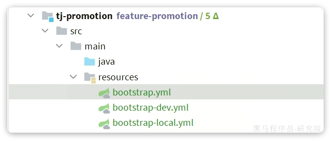

首先是bootstrap.yaml：

```yaml
server:
  port: 8092  #端口
  tomcat:
    uri-encoding: UTF-8   #服务编码
spring:
  profiles:
    active: dev
  application:
    name: promotion-service
  cloud:
    nacos:
      config:
        file-extension: yaml
        shared-configs: # 共享配置
          - data-id: shared-spring.yaml # 共享spring配置
            refresh: false
          - data-id: shared-redis.yaml # 共享redis配置
            refresh: false
          - data-id: shared-mybatis.yaml # 共享mybatis配置
            refresh: false
          - data-id: shared-logs.yaml # 共享日志配置
            refresh: false
          - data-id: shared-feign.yaml # 共享feign配置
            refresh: false
          - data-id: shared-xxljob.yaml # 共享mq配置
            refresh: false
tj:
  swagger:
    enable: true
    enableResponseWrap: true
    package-path: com.tianji.promotion.controller
    title: 天机课堂 - 促销中心接口文档
    description: 该服务包含优惠促销有关的功能
    contact-name: 传智教育·研究院
    contact-url: http://www.itcast.cn/
    contact-email: zhanghuyi@itcast.cn
    version: v1.0
  jdbc:
    database: tj_promotion
  auth:
    resource:
      enable: true # 开启登录拦截的功能
```

然后是bootstrap-dev.yml：

```yaml
spring:
  cloud:
    nacos:
      server-addr: 192.168.150.101:8848 # nacos注册中心
      discovery:
        namespace: f923fb34-cb0a-4c06-8fca-ad61ea61a3f0
        group: DEFAULT_GROUP
        ip: 192.168.150.101
logging:
  level:
    com.tianji: debug
```

然后是bootstrap-local.yml：

```yaml
spring:
  cloud:
    nacos:
      server-addr: 192.168.150.101:8848 # nacos注册中心
      discovery:
        namespace: f923fb34-cb0a-4c06-8fca-ad61ea61a3f0
        group: DEFAULT_GROUP
        ip: 192.168.150.1
logging:
  level:
    com.tianji: debug
```

启动类：

 


代码如下：

```java
package com.tianji.promotion;


import lombok.extern.slf4j.Slf4j;
import org.mybatis.spring.annotation.MapperScan;
import org.springframework.boot.SpringApplication;
import org.springframework.boot.autoconfigure.SpringBootApplication;
import org.springframework.boot.builder.SpringApplicationBuilder;
import org.springframework.core.env.Environment;

import java.net.InetAddress;
import java.net.UnknownHostException;

@SpringBootApplication
@MapperScan("com.tianji.promotion.mapper")
@Slf4j
public class PromotionApplication {
    public static void main(String[] args) throws UnknownHostException {
        SpringApplication app = new SpringApplicationBuilder(PromotionApplication.class).build(args);
        Environment env = app.run(args).getEnvironment();
        String protocol = "http";
        if (env.getProperty("server.ssl.key-store") != null) {
            protocol = "https";
        }
        log.info("--/\n---------------------------------------------------------------------------------------\n\t" +
                        "Application '{}' is running! Access URLs:\n\t" +
                        "Local: \t\t{}://localhost:{}\n\t" +
                        "External: \t{}://{}:{}\n\t" +
                        "Profile(s): \t{}" +
                        "\n---------------------------------------------------------------------------------------",
                env.getProperty("spring.application.name"),
                protocol,
                env.getProperty("server.port"),
                protocol,
                InetAddress.getLocalHost().getHostAddress(),
                env.getProperty("server.port"),
                env.getActiveProfiles());
    }
}
```

配置启动项，关键是设置运行环境为local：

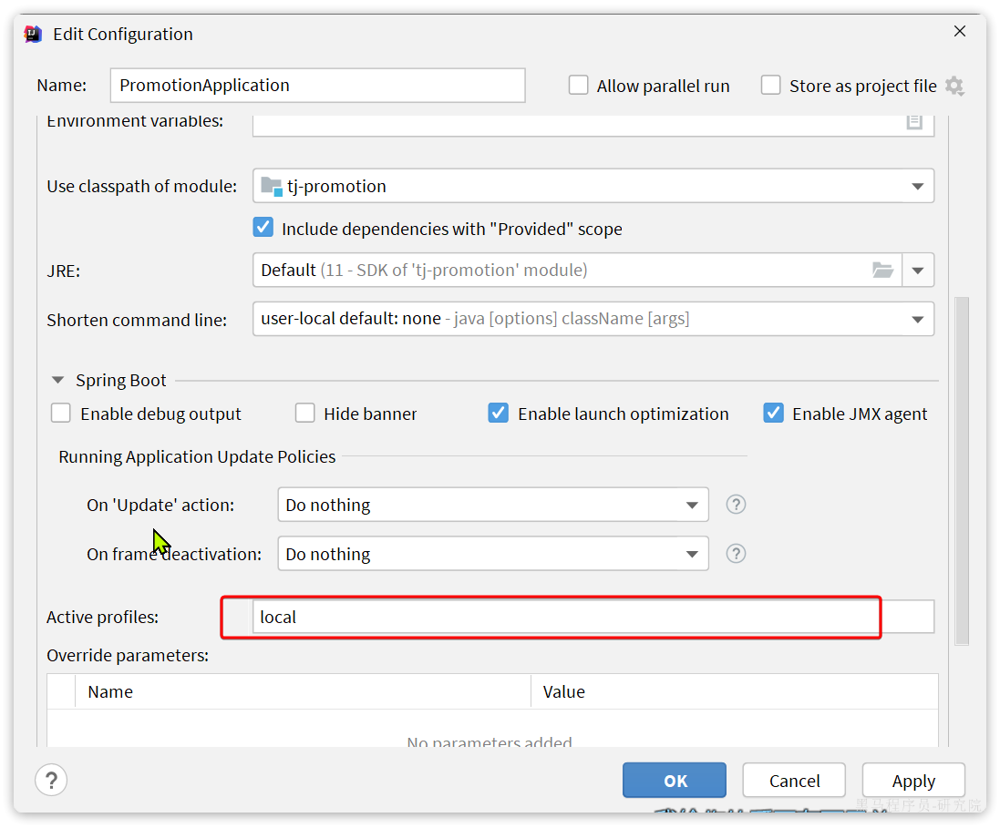

### 1.4.3.生成代码

然后利用MybatisPlus生成基础代码，这里不再赘述，最终结果：


### 1.4.4.枚举

在优惠券实体中，有很多的类型或状态枚举：

- 折扣类型
- 优惠券状态
- 领取方式

兑换码中也有一个状态字段。

这些都需要定义为枚举，在课前资料中已经给大家准备好了 ：

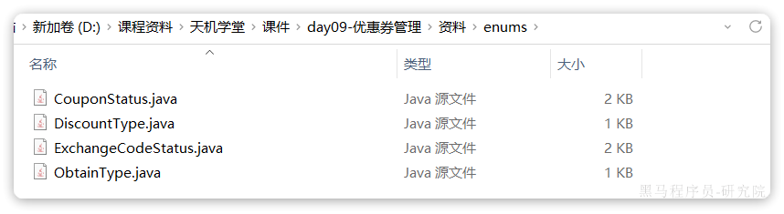

拷贝到项目中：

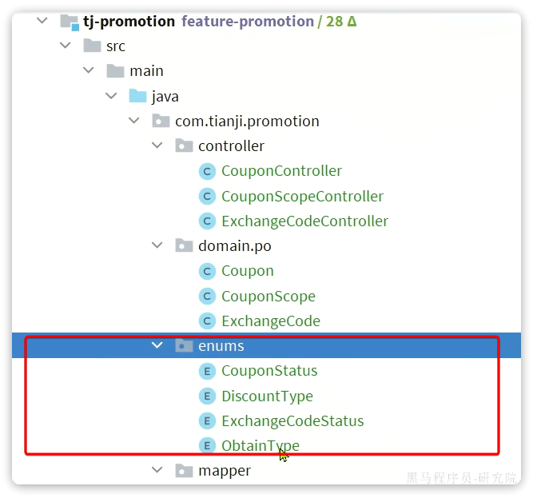

最后，别忘了修改PO中对应的字段，首先是`Coupon`中：

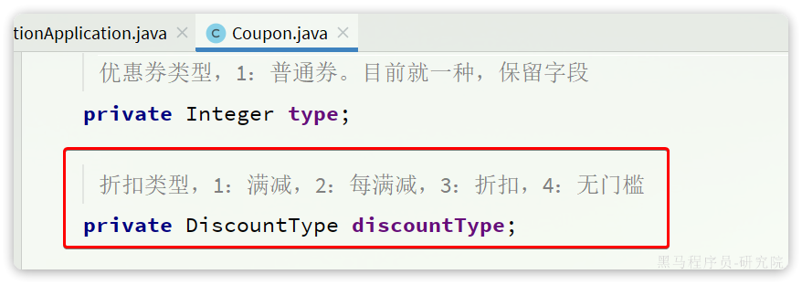

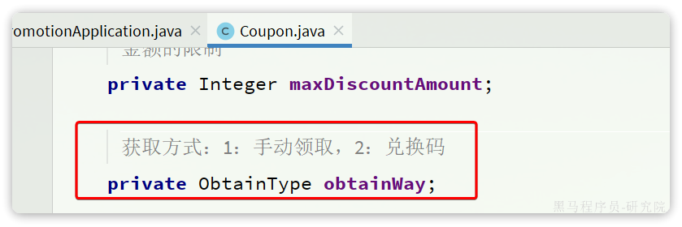

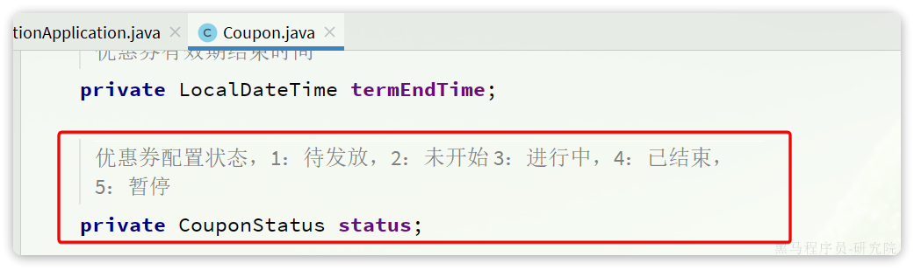

然后是兑换码实体，`ExchangeCode`：

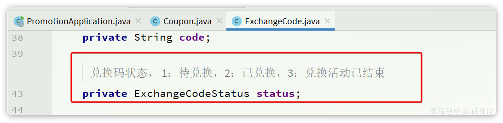

# 2.优惠券管理

优惠券的管理接口有

- 分页查询优惠券列表
- 新增优惠券
- 编辑优惠券
- 查看优惠券（根据id查询优惠券）
- 删除优惠券

大部分都是基本的CRUD，这里我们讲解其中的两个接口：

- 新增优惠券
- 分页查询优惠券

## 2.1.新增优惠券

新增表单原型如图：


### 2.1.1.接口分析

一个基本的新增接口，按照Restful风格设计即可，关键是请求参数。之前表分析时已经详细介绍过这个页面及其中的字段，这里不再赘述。

需要特别注意的是，如果优惠券限定了使用范围，则需要保存限定的课程分类。而这些信息不再coupon表，而是一张中间关系表：coupon_scope

综上，新增优惠券的接口设计如下：

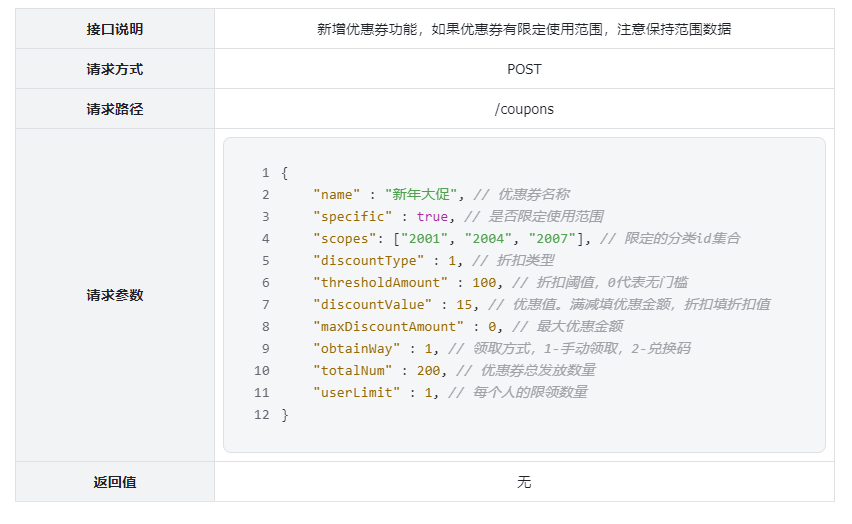

### 2.1.2.实体

请求参数比较复杂，需要定义一个对应的Form表单实体。在课前资料已经提供好了：

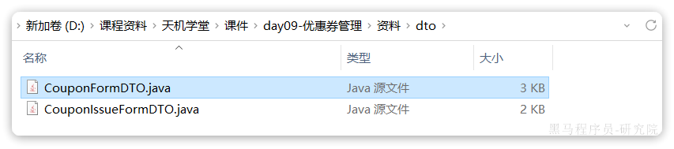

将其复制到`com.tianji.promotion.domain.dto`包下：

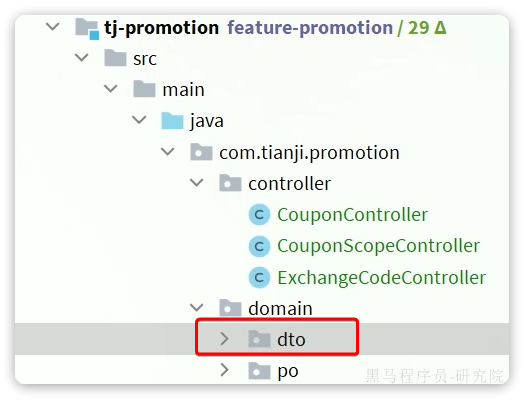

需要特别注意的是，Coupon这个PO实体中有一个字段叫`specific`，这个字段与数据库关键字冲突，需要做特殊处理：

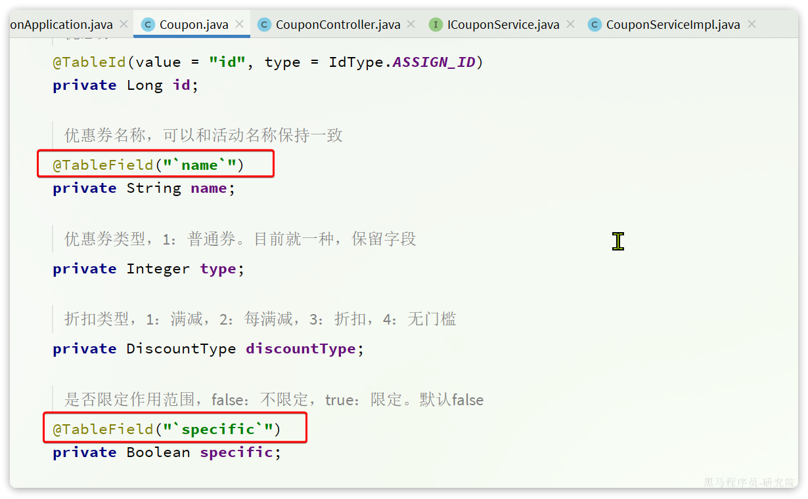

### 2.1.3.接口实现

首先，在tj-promotion模块下的`com.tianji.promotion.controller.CouponController`中定义controller接口：

```java
package com.tianji.promotion.controller;

import com.tianji.promotion.domain.dto.CouponFormDTO;
import com.tianji.promotion.service.ICouponService;
import io.swagger.annotations.Api;
import io.swagger.annotations.ApiOperation;
import io.swagger.annotations.ApiParam;
import lombok.RequiredArgsConstructor;
import org.springframework.web.bind.annotation.*;

import javax.validation.Valid;
import java.util.List;

@RestController
@RequiredArgsConstructor
@RequestMapping("/coupons")
@Api(tags = "优惠券相关接口")
public class CouponController {

    private final ICouponService couponService;

    @ApiOperation("新增优惠券接口")
    @PostMapping
    public void saveCoupon(@RequestBody @Valid CouponFormDTO dto){
        couponService.saveCoupon(dto);
    }
}
```

接下来，在`com.tianji.promotion.service.ICouponService`中定义service方法：

```java
package com.tianji.promotion.service;

import com.baomidou.mybatisplus.extension.service.IService;
import com.tianji.promotion.domain.dto.CouponFormDTO;

import java.util.List;

public interface ICouponService extends IService<Coupon> {
    void saveCoupon(CouponFormDTO dto);
}
```

最后，在`com.tianji.promotion.service.impl.CouponServiceImpl`中实现service方法：

```java
package com.tianji.promotion.service.impl;

import com.baomidou.mybatisplus.core.conditions.query.LambdaQueryWrapper;
import com.baomidou.mybatisplus.extension.service.impl.ServiceImpl;
import com.tianji.promotion.mapper.CouponMapper;
import com.tianji.promotion.service.ICouponScopeService;
import com.tianji.promotion.service.ICouponService;
import lombok.RequiredArgsConstructor;
import org.springframework.stereotype.Service;
import org.springframework.transaction.annotation.Transactional;

import java.util.*;
import java.util.stream.Collectors;

@Service
@RequiredArgsConstructor
public class CouponServiceImpl extends ServiceImpl<CouponMapper, Coupon> implements ICouponService {

    private final ICouponScopeService scopeService;

    @Override
    @Transactional
    public void saveCoupon(CouponFormDTO dto) {
        // 1.保存优惠券
        // 1.1.转PO
        Coupon coupon = BeanUtils.copyBean(dto, Coupon.class);
        // 1.2.保存
        save(coupon);

        if (!dto.getSpecific()) {
            // 没有范围限定
            return;
        }
        Long couponId = coupon.getId();
        // 2.保存限定范围
        List<Long> scopes = dto.getScopes();
        if (CollUtils.isEmpty(scopes)) {
            throw new BadRequestException("限定范围不能为空");
        }
        // 2.1.转换PO
        List<CouponScope> list = scopes.stream()
                .map(bizId -> new CouponScope().setBizId(bizId).setCouponId(couponId))
                .collect(Collectors.toList());
        // 2.2.保存
        scopeService.saveBatch(list);
    }
}
```

## 2.2.分页查询优惠券

页面原型如图：

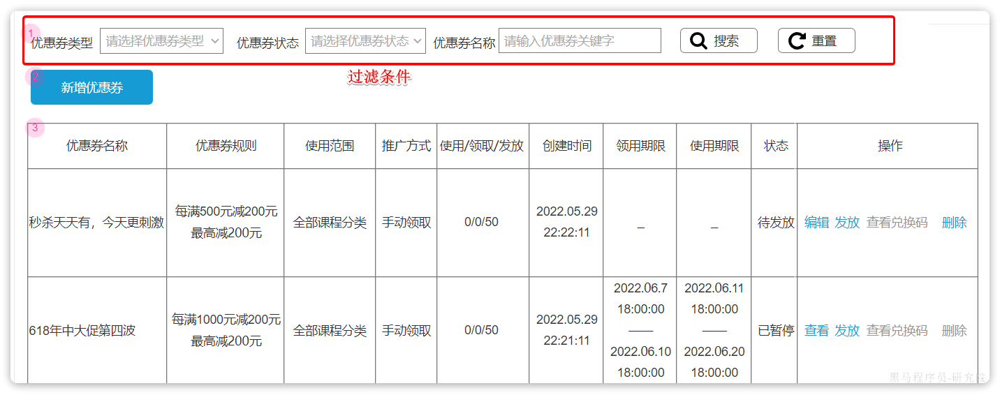

### 2.2.1.接口分析

一个典型的带过滤条件的分页查询，非常简单。按照Restful风格设计即可，我们关注的点有两个：

- 请求参数
- 返回值格式

请求参数包含两部分，一个是分页参数，另一个是过滤条件，包含：

- 优惠券的折扣类型
- 优惠券状态
- 优惠券名称关键字

而返回值则如列表中字段所属，需要特别注意的有两点：

- 优惠券规则：这里是对优惠规则的描述，而数据库中保存的是具体的优惠金额；这里我们不组装描述返回，仅仅返回优惠金额信息，由前端自己组织返回即可。
- 使用范围：这里无需展示真正的限定范围，只要告诉前端有没有限定范围即可

其它字段没什么特殊的，此处不再赘述了。

综上，新增优惠券的接口设计如下：

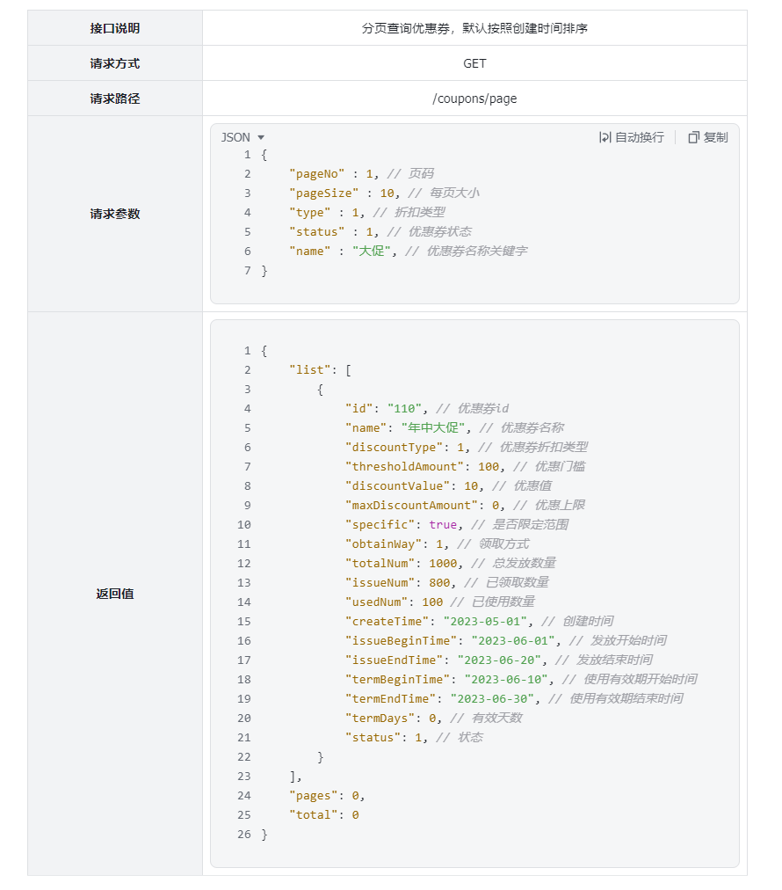

### 2.1.2.实体

这里需要两个实体，一个是请求参数QUERY是，一个是返回值VO实体。在课前资料都已经提供给大家了。

QUERY实体：

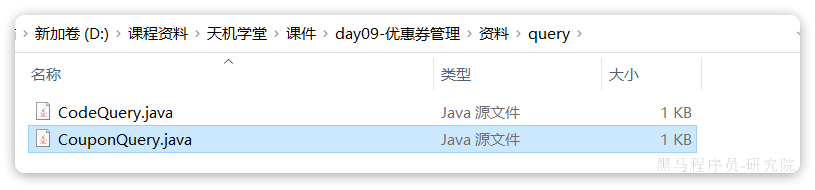

VO实体：

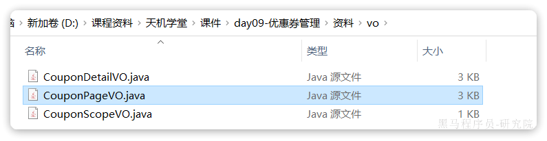

将其复制到`com.tianji.promotion.domain`包下的query和vo包下：

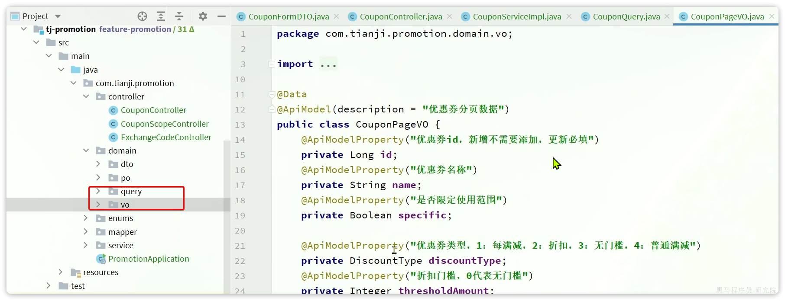

### 2.1.3.接口实现

首先，在tj-promotion模块下的`com.tianji.promotion.controller.CouponController`中定义controller接口：

```java
@ApiOperation("分页查询优惠券接口")
@GetMapping("/page")
public PageDTO<CouponPageVO> queryCouponByPage(CouponQuery query){
    return couponService.queryCouponByPage(query);
}
```

接下来，在`com.tianji.promotion.service.ICouponService`中定义service方法：

```java
PageDTO<CouponPageVO> queryCouponByPage(CouponQuery query);
```

最后，在`com.tianji.promotion.service.impl.CouponServiceImpl`中实现service方法：

```java
@Override
public PageDTO<CouponPageVO> queryCouponByPage(CouponQuery query) {
    Integer status = query.getStatus();
    String name = query.getName();
    Integer type = query.getType();
    // 1.分页查询
    Page<Coupon> page = lambdaQuery()
            .eq(type != null, Coupon::getDiscountType, type)
            .eq(status != null, Coupon::getStatus, status)
            .like(StringUtils.isNotBlank(name), Coupon::getName, name)
            .page(query.toMpPageDefaultSortByCreateTimeDesc());
    // 2.处理VO
    List<Coupon> records = page.getRecords();
    if (CollUtils.isEmpty(records)) {
        return PageDTO.empty(page);
    }
    List<CouponPageVO> list = BeanUtils.copyList(records, CouponPageVO.class);
    // 3.返回
    return PageDTO.of(page, list);
}
```

# 3.优惠券发放

优惠券新增之后并不会直接展示在用户端，而是处于一个待发放状态，等待管理员核对信息后，点击方法才行。而发放的方式也分为立刻发放、定时发放两种。

对于定时发放的优惠券，还需要通过定时任务来定期完成发放功能。

另外，由于优惠券的领取方式不同，基于兑换码的优惠券还需要在发放时生成兑换码。

## 3.1.发放优惠券

处于**暂停**状态，或者**待发放**状态的优惠券，在优惠券列表中才会出现发放按钮，可以被发放：

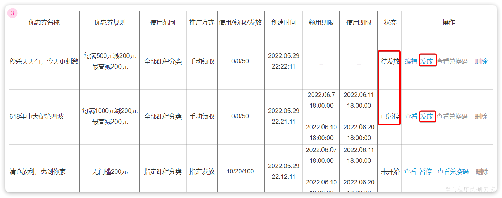

### 3.1.1.接口分析

当我们点击发放按钮时，会弹出一个表单：

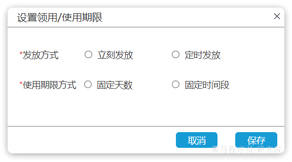

需要我们选择**发放方式**，**使用期限**。

发放方式分为两种：**立刻发放**和**定时发放**；使用期限也分两种：**固定天数**、**固定时间段**。如图：

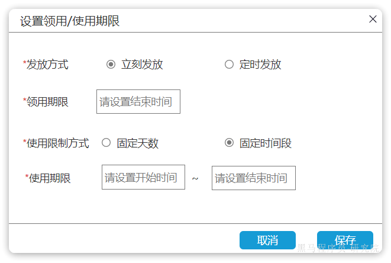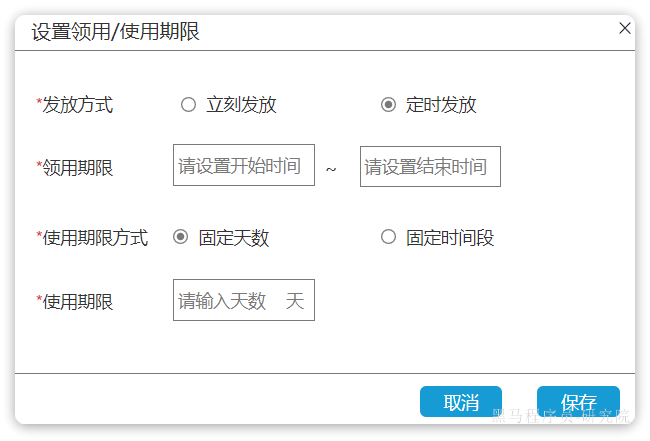

因此，在提交这个表单时，参数包括：

- 发放（领用）开始时间：如果为空说明是立刻方法，开始时间就是当前时间
- 发放（领域）结束时间
- 有效期天数：如果为空说明是固定有效期
- 使用期限开始时间：如果为空说明是固定天数有效期
- 使用期限结束时间：如果为空说明是固定天数有效期

最后，肯定要带上**优惠券id**，我们才知道发放的是哪张券，当然这个可以通过路径占位符传参。

综上，新增优惠券的接口设计如下：

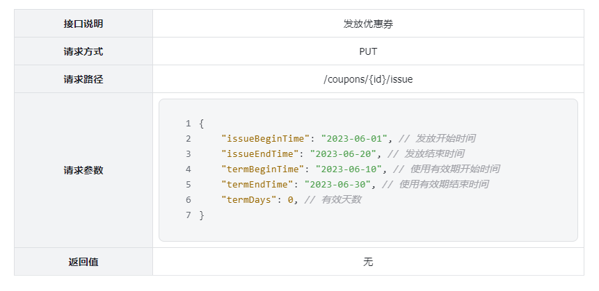

### 3.1.2.实体

这里需要一个请求参数的DTO实体，在课前资料中已经提供了：

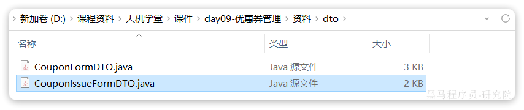

将其复制到`com.tianji.promotion.domain.dto`包即可。

### 3.1.3.接口实现

首先，在tj-promotion模块下的`com.tianji.promotion.controller.CouponController`中定义controller接口：

```java
@ApiOperation("发放优惠券接口")
@PutMapping("/{id}/issue")
public void beginIssue(@RequestBody @Valid CouponIssueFormDTO dto) {
    couponService.beginIssue(dto);
}
```

接下来，在`com.tianji.promotion.service.ICouponService`中定义service方法：

```java
void beginIssue(CouponIssueFormDTO dto);
```

最后，在`com.tianji.promotion.service.impl.CouponServiceImpl`中实现service方法：

```java
@Transactional
@Override
public void beginIssue(CouponIssueFormDTO dto) {
    // 1.查询优惠券
    Coupon coupon = getById(dto.getId());
    if (coupon == null) {
        throw new BadRequestException("优惠券不存在！");
    }
    // 2.判断优惠券状态，是否是暂停或待发放
    if(coupon.getStatus() != CouponStatus.DRAFT && coupon.getStatus() != PAUSE){
        throw new BizIllegalException("优惠券状态错误！");
    }
    // 3.判断是否是立刻发放
    LocalDateTime issueBeginTime = dto.getIssueBeginTime();
    LocalDateTime now = LocalDateTime.now();
    boolean isBegin = issueBeginTime == null || !issueBeginTime.isAfter(now);
    // 4.更新优惠券
    // 4.1.拷贝属性到PO
    Coupon c = BeanUtils.copyBean(dto, Coupon.class);
    // 4.2.更新状态
    if (isBegin) {
        c.setStatus(ISSUING);
        c.setIssueBeginTime(now);
    }else{
        c.setStatus(UN_ISSUE);
    }
    // 4.3.写入数据库
    updateById(c);

    // TODO 兑换码生成
}
```

## 3.2.兑换码生成算法

优惠券的领取有两种方式：手动领取和指定发放：

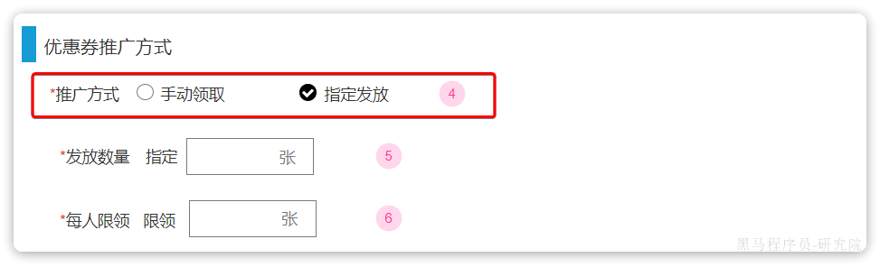

指定发放模式是指使用兑换码来兑换优惠券。因此必须在优惠券发放的同时，生成兑换码。兑换码的格式如图：

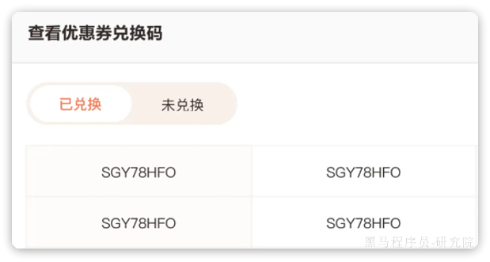

但是兑换码该如何生成呢？

是不是一个简单的字符串就行？

这就本节要讨论的内容了。

### 3.2.1.兑换码的需求

兑换码并不是简单的一个字符串，它其实有很多的需求：

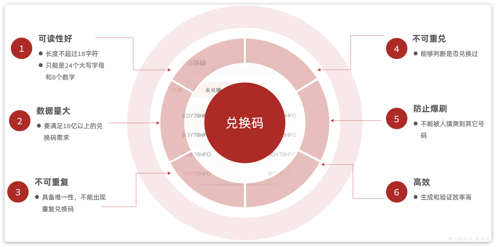

要求如下：

- **可读性好**：兑换码是要给用户使用的，用户需要输入兑换码，因此可读性必须好。我们的要求：
  - 长度不超过10个字符
  - 只能是24个大写字母和8个数字：ABCDEFGHJKLMNPQRSTUVWXYZ23456789
- **数据量大**：优惠活动比较频繁，必须有充足的兑换码，最好有10亿以上的量
- **唯一性**：10亿兑换码都必须唯一，不能重复，否则会出现兑换混乱的情况
- **不可重兑**：兑换码必须便于校验兑换状态，避免重复兑换
- **防止爆刷**：兑换码的规律性不能很明显，不能轻易被人猜测到其它兑换码
- **高效**：兑换码生成、验证的算法必须保证效率，避免对数据库带来较大的压力

### 3.2.2.算法分析

要满足唯一性，很多同学会想到以下技术：

- UUID
- Snowflake
- 自增id

我们的兑换码要求是24个大写字母和8个数字。而以上算法最终生成的结果都是数值类型，并不符合我们的需求！

有没有什么办法，可以把数字转为我们要求的格式呢？

#### 3.2.2.1.Base32转码

当然可以了，大家思考一下，假如我们将24个字母和8个数字放到数组中，如下：

| **角标** | 0    | 1    | 2    | 3    | 4    | 5    | 6    | 7    | 8    | 9    | 10   | 11   | 12   | 13   | 14   | 15   |
| -------- | ---- | ---- | ---- | ---- | ---- | ---- | ---- | ---- | ---- | ---- | ---- | ---- | ---- | ---- | ---- | ---- |
| **字符** | A    | B    | C    | D    | E    | F    | G    | H    | J    | K    | L    | M    | N    | P    | Q    | R    |
| **角标** | 16   | 17   | 18   | 19   | 20   | 21   | 22   | 23   | 24   | 25   | 26   | 27   | 28   | 29   | 30   | 31   |
| **字符** | S    | T    | U    | V    | W    | X    | Y    | Z    | 2    | 3    | 4    | 5    | 6    | 7    | 8    | 9    |

这样，0~31的角标刚好对应了我们的32个字符！而2的5次幂刚好就是32，因此5个二级制位的结果就是0~31

那因此，只要我们让数字转为二进制的形式，然后每5个二进制位为一组，转10进制的结果是不是刚好对应一个角标，就能找到一个对应的字符呢？

这样是不是就把一个数字转为我们想要的字符个数了。这种把二进制数经过加密得到字符的算法就是Base32法，类似的还有Base64法。

举例：假如我们经过自增id计算出一个复杂数字，转为二进制，并每5位一组，结果如下：

```shell
01001 00010 01100 10010 01101 11000 01101 00010 11110 11010
```

此时，我们看看每一组的结果：

- 01001转10进制是9，查数组得字符为：**K**
- 00010转10进制是2，查数组得字符为：**C**
- 01100转10进制是12，查数组得字符为：**N**
- 10010转10进制是18，查数组得字符为：**B**
- 01101转10进制是13，查数组得字符为：**P**
- 11000转10进制是24，查数组得字符为：**2**
- ...

依此类推，最终那一串二进制数得到的结果就是KCNBP2PC84，刚好符合我们的需求。

但是大家思考一下，我们最终要求字符不能超过10位，而每个字符对应5个bit位，因此二进制数不能超过50个bit位。

UUID和Snowflake算法得到的结果，一个是128位，一个是64位，都远远超出了我们的要求。

那自增id算法符合我们的需求呢？

自增id从1增加到Integer的最大值，可以达到40亿以上个数字，而占用的字节仅仅4个字节，也就是32个bit位，距离50个bit位的限制还有很大的剩余，符合要求！

综上，我们可以利用自增id作为兑换码，但是要利用Base32加密，转为我们要求的格式。此时就符合了我们的几个要求了：

- **可读性好**：可以转为要求的字母和数字的格式，长度还不超过10个字符
- **数据量大**：可以应对40亿以上的数据规模
- **唯一性**：自增id，绝对唯一

#### 3.2.2.2.重兑校验算法

那重兑问题该如何判断呢？此处有两种方案：

- 基于数据库：我们在设计数据库时有一个字段就是标示兑换码状态，每次兑换时可以到数据库查询状态，避免重兑。
  - 优点：简单
  - 缺点：对数据库压力大
- 基于BitMap：兑换或没兑换就是两个状态，对应0和1，而兑换码使用的是自增id.我们如果每一个自增id对应一个bit位，用每一个bit位的状态表示兑换状态，是不是完美解决问题。而这种算法恰好就是BitMap的底层实现，而且Redis中的BitMap刚好能支持2^32个bit位。
  - 优点：简答、高效、性能好
  - 缺点：依赖于Redis

 

OK，**重兑、高效**的两个特性都满足了！

现在，就剩下防止爆刷了。我们的兑换码规律性不能太明显，否则很容易被人猜测到其它兑换码。但是，如果我们使用了自增id，那规律简直太明显了，岂不是很容易被人踩到其它兑换码？！

所以，我们采用自增id的同时，还需要利用某种校验算法对id做加密验证，避免他人找出规律，猜测到其它兑换码，甚至伪造、篡改兑换码。

那该采用哪种校验算法呢？

#### 3.2.2.3.防刷校验算法

非常可惜，没有一种现成的算法能满足我们的需求，我们必须自己**设计一种算法**来实现这个功能。

不过大家不用害怕，我们可以模拟其它验签的常用算法。比如大家熟悉的JWT技术。我们知道JWT分为三部分组成：

- Header：记录算法
- Payload：记录用户信息
- Verify Signature：验签，用于验证整个token

JWT中的的Header和Payload采用的是Base64算法，与我们Base32类似，几乎算是明文传输，难道不怕其他人伪造、篡改token吗？

为了解决这个问题，JWT中才有了第三部分，**验证签名**。这个签名是有一个秘钥，结合Header、Payload，利用MD5或者RSA算法生成的。因此：

- 只要秘钥不泄露，其他人就无法伪造签名，也就无法伪造token。
- 有人篡改了token，验签时会根据header和payload再次计算签名。数据被篡改，计算的到的签名肯定不一致，就是无效token

因此，我们也可以模拟这种思路：

- 首先准备一个秘钥
- 然后利用秘钥对自增id做加密，生成签名
- 将签名、自增id利用Base32转码后生成兑换码

只要秘钥不泄露，就没有人能伪造兑换码。只要兑换码被篡改，就会导致验签不通过。

 当然，这里我们不能采用MD5和RSA算法来生成签名，因为这些算法得到的签名都太长了，一般都是128位以上，超出了长度限制。

因此，这里我们必须采用一种特殊的签名算法。由于我们的兑换码核心是自增id，也就是数字，因此这里我们打算采用按位加权的签名算法：

- 将自增id（32位）每4位分为一组，共8组，都转为10进制
- 每一组给不同权重
- 把每一组数加权求和，得到的结果就是签名

举例：

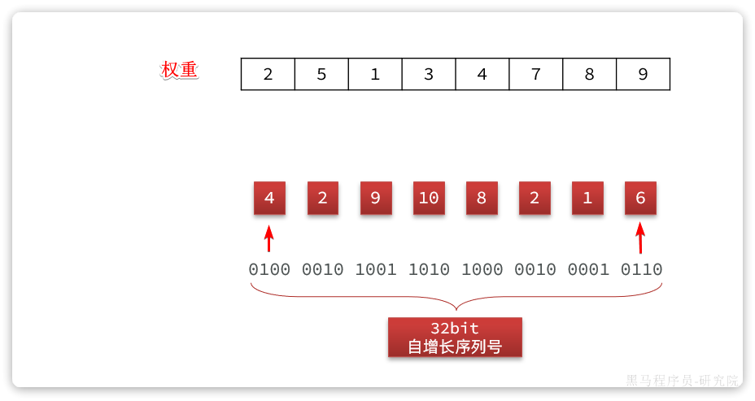

最终的加权和就是：4*2 + 2*5 + 9*1 + 10*3 + 8*4 + 2*7 + 1*8 + 6*9 = 165 

这里的权重数组就可以理解为加密的**秘钥**。

当然，为了避免秘钥被人猜测出规律，我们可以准备16组秘钥。在兑换码自增id前拼接一个4位的**新鲜值**，可以是随机的。这个值是多少，就取第几组秘钥。

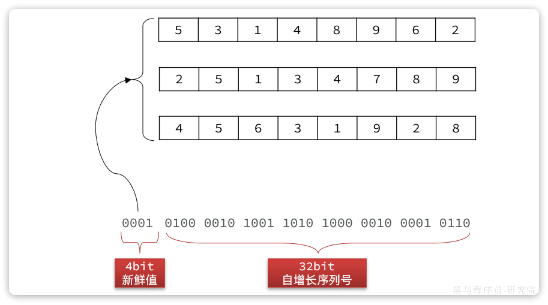

这样就进一步增加了兑换码的复杂度。

最后，把加权和，也就是签名也转二进制，拼接到最前面，最终的兑换码就是这样：

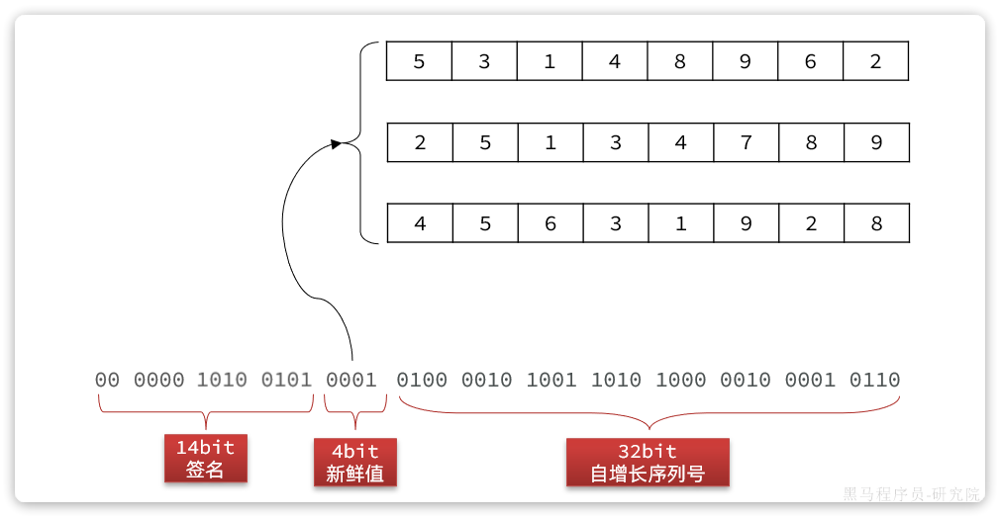

### 3.2.3.算法实现

最终的算法实现在课前资料中已经提供了：

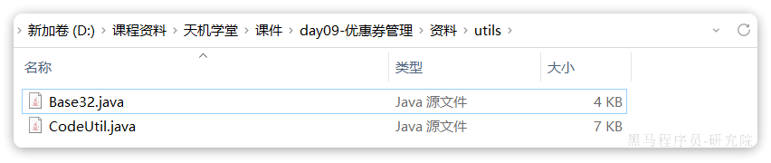

其中：

- Base32.java：是Base32工具类
- CodeUtil.java：是签名工具

我们重点关注CodeUtil的实现，代码如下：

```java
package com.tianji.promotion.utils;

import com.tianji.common.constants.RegexConstants;
import com.tianji.common.exceptions.BadRequestException;

/**
 * <h1 style='font-weight:500'>1.兑换码算法说明：</h1>
 * <p>兑换码分为明文和密文，明文是50位二进制数，密文是长度为10的Base32编码的字符串 </p>
 * <h1 style='font-weight:500'>2.兑换码的明文结构：</h1>
 * <p style='padding: 0 15px'>14(校验码) + 4 (新鲜值) + 32(序列号) </p>
 *   <ul style='padding: 0 15px'>
 *       <li>序列号：一个单调递增的数字，可以通过Redis来生成</li>
 *       <li>新鲜值：可以是优惠券id的最后4位，同一张优惠券的兑换码就会有一个相同标记</li>
 *       <li>载荷：将新鲜值（4位）拼接序列号（32位）得到载荷</li>
 *       <li>校验码：将载荷4位一组，每组乘以加权数，最后累加求和，然后对2^14求余得到</li>
 *   </ul>
 *  <h1 style='font-weight:500'>3.兑换码的加密过程：</h1>
 *     <ol type='a' style='padding: 0 15px'>
 *         <li>首先利用优惠券id计算新鲜值 f</li>
 *         <li>将f和序列号s拼接，得到载荷payload</li>
 *         <li>然后以f为角标，从提前准备好的16组加权码表中选一组</li>
 *         <li>对payload做加权计算，得到校验码 c  </li>
 *         <li>利用c的后4位做角标，从提前准备好的异或密钥表中选择一个密钥：key</li>
 *         <li>将payload与key做异或，作为新payload2</li>
 *         <li>然后拼接兑换码明文：f (4位) + payload2（36位）</li>
 *         <li>利用Base32对密文转码，生成兑换码</li>
 *     </ol>
 * <h1 style='font-weight:500'>4.兑换码的解密过程：</h1>
 * <ol type='a' style='padding: 0 15px'>
 *      <li>首先利用Base32解码兑换码，得到明文数值num</li>
 *      <li>取num的高14位得到c1，取num低36位得payload </li>
 *      <li>利用c1的后4位做角标，从提前准备好的异或密钥表中选择一个密钥：key</li>
 *      <li>将payload与key做异或，作为新payload2</li>
 *      <li>利用加密时的算法，用payload2和s1计算出新校验码c2，把c1和c2比较，一致则通过 </li>
 * </ol>
 */
public class CodeUtil {
    /**
     * 异或密钥表，用于最后的数据混淆
     */
    private final static long[] XOR_TABLE = {
            45139281907L, 61261925523L, 58169127203L, 27031786219L,
            64169927199L, 46169126943L, 32731286209L, 52082227349L,
            59169127063L, 36169126987L, 52082200939L, 61261925739L,
            32731286563L, 27031786427L, 56169127077L, 34111865001L,
            52082216763L, 61261925663L, 56169127113L, 45139282119L,
            32731286479L, 64169927233L, 41390251661L, 59169127121L,
            64169927321L, 55139282179L, 34111864881L, 46169127031L,
            58169127221L, 61261925523L, 36169126943L, 64169927363L,
    };
    /**
     * fresh值的偏移位数
     */
    private final static int FRESH_BIT_OFFSET = 32;
    /**
     * 校验码的偏移位数
     */
    private final static int CHECK_CODE_BIT_OFFSET = 36;
    /**
     * fresh值的掩码，4位
     */
    private final static int FRESH_MASK = 0xF;
    /**
     * 验证码的掩码，14位
     */
    private final static int CHECK_CODE_MASK = 0b11111111111111;
    /**
     * 载荷的掩码，36位
     */
    private final static long PAYLOAD_MASK = 0xFFFFFFFFFL;
    /**
     * 序列号掩码，32位
     */
    private final static long SERIAL_NUM_MASK = 0xFFFFFFFFL;
    /**
     * 序列号加权运算的秘钥表
     */
    private final static int[][] PRIME_TABLE = {
            {23, 59, 241, 61, 607, 67, 977, 1217, 1289, 1601},
            {79, 83, 107, 439, 313, 619, 911, 1049, 1237},
            {173, 211, 499, 673, 823, 941, 1039, 1213, 1429, 1259},
            {31, 293, 311, 349, 431, 577, 757, 883, 1009, 1657},
            {353, 23, 367, 499, 599, 661, 719, 929, 1301, 1511},
            {103, 179, 353, 467, 577, 691, 811, 947, 1153, 1453},
            {213, 439, 257, 313, 571, 619, 743, 829, 983, 1103},
            {31, 151, 241, 349, 607, 677, 769, 823, 967, 1049},
            {61, 83, 109, 137, 151, 521, 701, 827, 1123},
            {23, 61, 199, 223, 479, 647, 739, 811, 947, 1019},
            {31, 109, 311, 467, 613, 743, 821, 881, 1031, 1171},
            {41, 173, 367, 401, 569, 683, 761, 883, 1009, 1181},
            {127, 283, 467, 577, 661, 773, 881, 967, 1097, 1289},
            {59, 137, 257, 347, 439, 547, 641, 839, 977, 1009},
            {61, 199, 313, 421, 613, 739, 827, 941, 1087, 1307},
            {19, 127, 241, 353, 499, 607, 811, 919, 1031, 1301}
    };

    /**
     * 生成兑换码
     *
     * @param serialNum 递增序列号
     * @return 兑换码
     */
    public static String generateCode(long serialNum, long fresh) {
        // 1.计算新鲜值
        fresh = fresh & FRESH_MASK;
        // 2.拼接payload，fresh（4位） + serialNum（32位）
        long payload = fresh << FRESH_BIT_OFFSET | serialNum;
        // 3.计算验证码
        long checkCode = calcCheckCode(payload, (int) fresh);
        // 4.payload做大质数异或运算，混淆数据
        payload ^= XOR_TABLE[(int) (checkCode & 0b11111)];
        // 5.拼接兑换码明文: 校验码（14位） + payload（36位）
        long code = checkCode << CHECK_CODE_BIT_OFFSET | payload;
        // 6.转码
        return Base32.encode(code);
    }

    private static long calcCheckCode(long payload, int fresh) {
        // 1.获取码表
        int[] table = PRIME_TABLE[fresh];
        // 2.生成校验码，payload每4位乘加权数，求和，取最后13位结果
        long sum = 0;
        int index = 0;
        while (payload > 0) {
            sum += (payload & 0xf) * table[index++];
            payload >>>= 4;
        }
        return sum & CHECK_CODE_MASK;
    }

    public static long parseCode(String code) {
        if (code == null || !code.matches(RegexConstants.COUPON_CODE_PATTERN)) {
            // 兑换码格式错误
            throw new BadRequestException("无效兑换码");
        }
        // 1.Base32解码
        long num = Base32.decode(code);
        // 2.获取低36位，payload
        long payload = num & PAYLOAD_MASK;
        // 3.获取高14位，校验码
        int checkCode = (int) (num >>> CHECK_CODE_BIT_OFFSET);
        // 4.载荷异或大质数，解析出原来的payload
        payload ^= XOR_TABLE[(checkCode & 0b11111)];
        // 5.获取高4位，fresh
        int fresh = (int) (payload >>> FRESH_BIT_OFFSET & FRESH_MASK);
        // 6.验证格式：
        if (calcCheckCode(payload, fresh) != checkCode) {
            throw new BadRequestException("无效兑换码");
        }
        return payload & SERIAL_NUM_MASK;
    }
}
```

核心的两个方法：

- `generateCode(long serialNum, long fresh)`：根据自增id生成兑换码。两个参数
  - serialNum：兑换码序列号，也就是自增id
  - fresh：新鲜值，这里建议使用兑换码对应的优惠券id做新鲜值
- `parseCode(String code)`：验证并解析兑换码，返回的是兑换码的序列号，也就是自增id

## 3.3.异步生成兑换码

### 3.3.1.思路分析

在发放优惠券的时候，如果发现优惠券的领取方式是兑换码方式，则需要生成兑换码。

不过，需要注意的是，**优惠券发放以后是可以暂停的，暂停之后还可以再次发放**。

假如一个优惠券是通过兑换码方式领取。第一次发放时我们生产了兑换码，然后被暂停，然后再次发放，如果我们再次生成兑换码，这就重复了。

因此，判断是否需要生成兑换码，要同时满足两个要求：

- 领取方式必须是兑换码方式
- 之前的状态必须是待发放，不能是暂停

而且，由于生成兑换码的数量较多，可能比较耗时，这里推荐基于线程池异步生成。

流程如下：

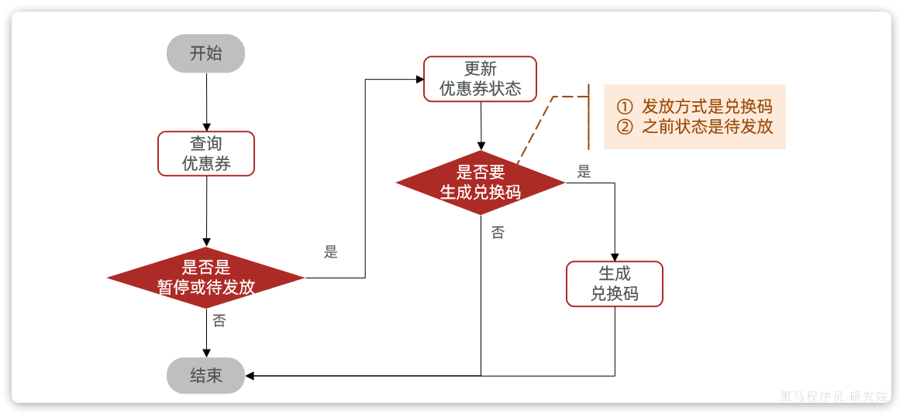

### 3.3.2.代码实现

首先，我们要定义一个线程池，用于异步生成兑换码：

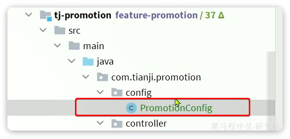

具体代码如下：

```java
package com.tianji.promotion.config;

import lombok.extern.slf4j.Slf4j;
import org.springframework.context.annotation.Bean;
import org.springframework.context.annotation.Configuration;
import org.springframework.scheduling.concurrent.ThreadPoolTaskExecutor;

import java.util.concurrent.Executor;
import java.util.concurrent.ThreadPoolExecutor;

@Slf4j
@Configuration
public class PromotionConfig {

    @Bean
    public Executor generateExchangeCodeExecutor(){
        ThreadPoolTaskExecutor executor = new ThreadPoolTaskExecutor();
        // 1.核心线程池大小
        executor.setCorePoolSize(2);
        // 2.最大线程池大小
        executor.setMaxPoolSize(5);
        // 3.队列大小
        executor.setQueueCapacity(200);
        // 4.线程名称
        executor.setThreadNamePrefix("exchange-code-handler-");
        // 5.拒绝策略
        executor.setRejectedExecutionHandler(new ThreadPoolExecutor.CallerRunsPolicy());
        executor.initialize();
        return executor;
    }
}
```

同时，在启动类添加`@EnableAsync`注解，开启异步功能：

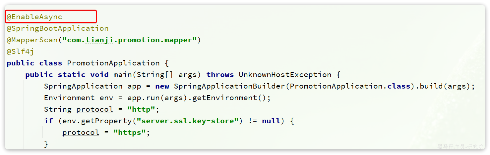

然后，我们要改造`com.tianji.promotion.service.impl.CouponServiceImpl`中的发放优惠券功能，参见黄色高亮部分：

```java
private final IExchangeCodeService codeService;

@Transactional
@Override
public void beginIssue(CouponIssueFormDTO dto) {
    // 1.查询优惠券
    Coupon coupon = getById(dto.getId());
    if (coupon == null) {
        throw new BadRequestException("优惠券不存在！");
    }
    // 2.判断优惠券状态，是否是暂停或待发放
    if(coupon.getStatus() != CouponStatus.DRAFT && coupon.getStatus() != PAUSE){
        throw new BizIllegalException("优惠券状态错误！");
    }
    // 3.判断是否是立刻发放
    LocalDateTime issueBeginTime = dto.getIssueBeginTime();
    LocalDateTime now = LocalDateTime.now();
    boolean isBegin = issueBeginTime == null || !issueBeginTime.isAfter(now);
    // 4.更新优惠券
    // 4.1.拷贝属性到PO
    Coupon c = BeanUtils.copyBean(dto, Coupon.class);
    // 4.2.更新状态
    if (isBegin) {
        c.setStatus(ISSUING);
        c.setIssueBeginTime(now);
    }else{
        c.setStatus(UN_ISSUE);
    }
    // 4.3.写入数据库
    updateById(c);

    // 5.判断是否需要生成兑换码，优惠券类型必须是兑换码，优惠券状态必须是待发放
    if(coupon.getObtainWay() == ObtainType.ISSUE && coupon.getStatus() == CouponStatus.DRAFT){
        coupon.setIssueEndTime(c.getIssueEndTime());
        codeService.asyncGenerateCode(coupon);
    }
}
```

然后，在`com.tianji.promotion.service.IExchangeCodeService`中添加生成兑换码的方法：

```java
package com.tianji.promotion.service;

import com.baomidou.mybatisplus.extension.service.IService;
import com.tianji.promotion.domain.po.Coupon;
import com.tianji.promotion.domain.po.ExchangeCode;

/**
 * <p>
 * 兑换码 服务类
 * </p>
 */
public interface IExchangeCodeService extends IService<ExchangeCode> {
    void asyncGenerateCode(Coupon coupon);
}
```

最后，在`com.tianji.promotion.service.impl.ExchangeCodeServiceImpl`中实现该方法：

```java
package com.tianji.promotion.service.impl;

import com.baomidou.mybatisplus.extension.service.impl.ServiceImpl;
import com.tianji.common.utils.CollUtils;
import com.tianji.promotion.domain.po.Coupon;
import com.tianji.promotion.domain.po.ExchangeCode;
import com.tianji.promotion.mapper.ExchangeCodeMapper;
import com.tianji.promotion.service.IExchangeCodeService;
import com.tianji.promotion.utils.CodeUtil;
import org.springframework.data.redis.core.BoundValueOperations;
import org.springframework.data.redis.core.StringRedisTemplate;
import org.springframework.scheduling.annotation.Async;
import org.springframework.stereotype.Service;

import java.util.ArrayList;
import java.util.List;
import java.util.Set;

import static com.tianji.promotion.constants.PromotionConstants.*;

/**
 * <p>
 * 兑换码 服务实现类
 * </p>
 *
 * @author 虎哥
 */
@Service
public class ExchangeCodeServiceImpl extends ServiceImpl<ExchangeCodeMapper, ExchangeCode> implements IExchangeCodeService {

    private final StringRedisTemplate redisTemplate;
    private final BoundValueOperations<String, String> serialOps;

    public ExchangeCodeServiceImpl(StringRedisTemplate redisTemplate) {
        this.redisTemplate = redisTemplate;
        this.serialOps = redisTemplate.boundValueOps(COUPON_CODE_SERIAL_KEY);
    }

    @Override
    @Async("generateExchangeCodeExecutor")
    public void asyncGenerateCode(Coupon coupon) {
        // 发放数量
        Integer totalNum = coupon.getTotalNum();
        // 1.获取Redis自增序列号
        Long result = serialOps.increment(totalNum);
        if (result == null) {
            return;
        }
        int maxSerialNum = result.intValue();
        List<ExchangeCode> list = new ArrayList<>(totalNum);
        for (int serialNum = maxSerialNum - totalNum + 1; serialNum <= maxSerialNum; serialNum++) {
            // 2.生成兑换码
            String code = CodeUtil.generateCode(serialNum, coupon.getId());
            ExchangeCode e = new ExchangeCode();
            e.setCode(code);
            e.setId(serialNum);
            e.setExchangeTargetId(coupon.getId());
            e.setExpiredTime(coupon.getIssueEndTime());
            list.add(e);
        }
        // 3.保存数据库
        saveBatch(list);

        // 4.写入Redis缓存，member：couponId，score：兑换码的最大序列号
        redisTemplate.opsForZSet().add(COUPON_RANGE_KEY, coupon.getId().toString(), maxSerialNum);
    }
}
```

# 4.练习

## 4.1.修改优惠券

修改优惠券接口的请求信息如下：

- 请求方式：PUT
- 请求路径：/coupons/{id}
- 请求参数：与新增类似，参考新增接口。
- 返回值：无

需要注意的页面规则，只有处于待发放状态的优惠券是可以修改的：

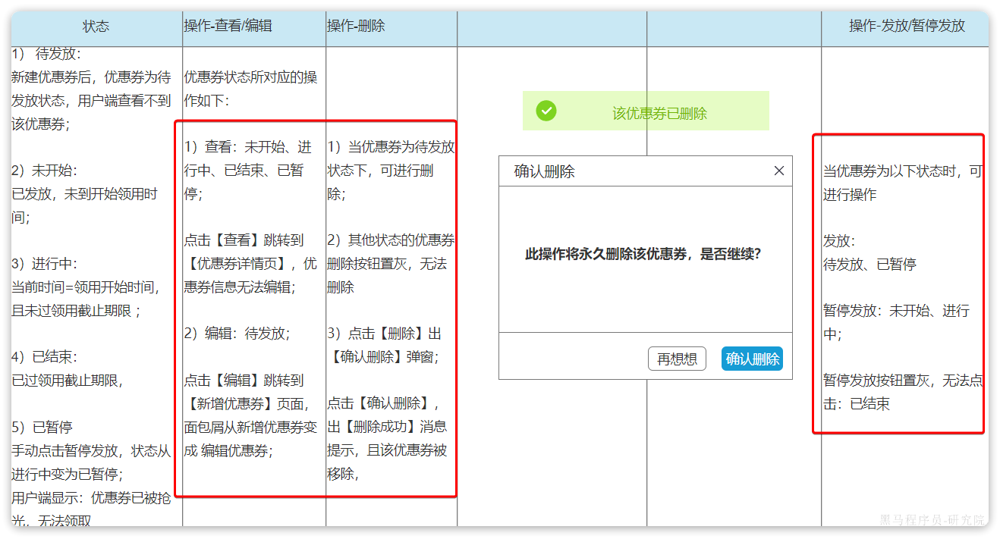

## 4.2.删除优惠券

- 请求方式：PUT
- 请求路径：/coupons/{id}
- 请求参数：与新增类似，参考新增接口。
- 返回值：无

需要注意的页面规则，只有处于待发放状态的优惠券是可以删除的：


## 4.3.根据id查询优惠券

### 4.3.1.接口分析

需求：在管理控制台的优惠券分页列表中，点击某个优惠券或者修改某个优惠券时，都需要根据id查询优惠券的详细信息

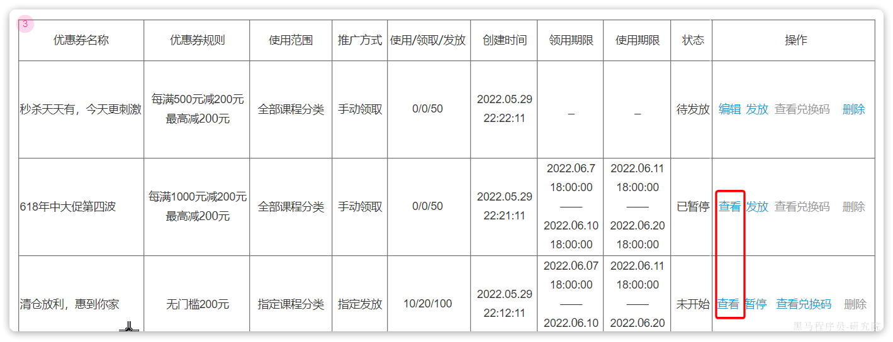

表单回显页面可以参考新增表单。

查看优惠券详情页面如下：

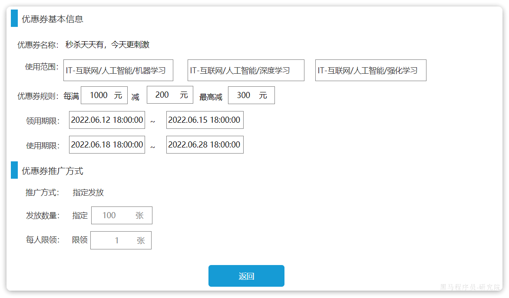

最终的接口信息如下：

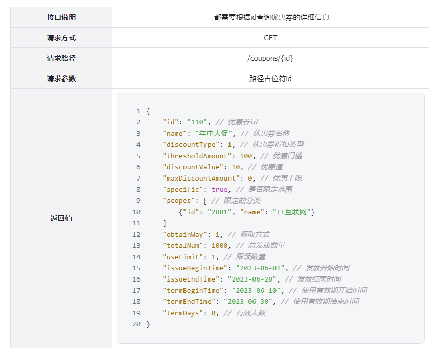

### 4.3.2.接口实现

## 4.4.定时开始发放优惠券

提示：

- 由于发放优惠券时已经把大部分操作完成。因此这里只需要更新优惠券状态，从未开始，修改到进行中即可。
- 不需要把整张表扫描一遍，只要找到那些处于未开始的，并且发放时间早于当前时间的即可。
- 注意利用XXL-JOB的数据分片功能，不要重复处理数据

## 4.5.定时结束发放优惠券

## 4.6.暂停发放

需求：管理员可以将一个发放中的优惠券状态修改为暂停， 暂停后学员无法领取或兑换该优惠券。用户端页面也不会展示。

- **请求方式**：PUT
- **请求路径**：/coupons/{id}/pause
- **请求参数**：路径占位符id
- **返回值**：无

注意：只要进行中的优惠券可以被暂停。暂停就是修改优惠券状态，从进行中变为暂停中

## 4.7.查询兑换码

需求：在发放优惠券的时候，如果发现优惠券的领取方式是指定发放，则需要生成兑换码。因此页面有一个查询兑换码功能：


### 4.7.1.接口分析

当我们点击查看兑换码时，就会进入一个兑换码展示页面：


是一个带过滤条件的分页查询。

- **请求方式**：GET
- **请求路径**：/codes/page
- **请求参数**：
  - 分页参数
  - 兑换码状态
  - 有一个隐含条件，就是优惠券id，毕竟查询的是某一个优惠券的兑换码。
- **返回值**：传统分页结果，分页数据保护两个字段：
  - code：兑换码
  - id：兑换码id

### 4.7.2.接口实现

# 5.面试

**面试官：你们优惠券支持兑换码的方式是吧，哪兑换码是如何生成的呢？（请设计一个优惠券兑换码生成方案，可以支持20亿以上的唯一兑换码，兑换码长度不超过10，只能包含字母数字，并且要保证生成和校验算法的高效）**

::: warning

答：

首先要考虑兑换码的验证的高效性，最佳的方案肯定是用自增序列号。因为自增序列号可以借助于BitMap验证兑换状态，完全不用查询数据库，效率非常高。

要满足20亿的兑换码需求，只需要31个bit位就够了，也就是在Integer的取值范围内，非常节省空间。我们就按32位来算，支持42亿数据规模。

不过，仅仅使用自增序列还不够，因为容易被人爆刷。所以还需要设计一个加密验签算法。算法有很多，比如可以使用按位加权方案。32位的自增序列，可以每4位一组，转为10进制，这样就有8个数字。提前准备一个长度为8的加权数组，作为秘钥。对自增序列的8个数字按位加权求和，得到的结果作为签名。

当然，考虑到秘钥的安全性，我们也可以准备多组加权数组，比如准备16组。然后生成兑换码时随机生成一个4位的新鲜值，取值范围刚好是0~15，新鲜值是几，我们就取第几组加权数组作为秘钥。然后把新鲜值、自增序列拼接后按位加权求和，得到签名。

最后把签名值的后14位、新鲜值（4位）、自增序列（32位）拼接，得到一个50位二进制数，然后与一个较大的质数做异或运算加以混淆，再基于Base32或Base64转码，即可的对兑换码。

如果是基于Base32转码，得到的兑换码恰好10位，符合要求。

需要注意的是，用来做异或的大质数、加权数组都属于秘钥，千万不能泄露。如有必要，也可以定期更换。

当我们要验签的时候，首先将结果 利用Base32转码为数字。然后与大质数异或得到原始数值。

接着取高14位，得到签名；取后36位得到新鲜值与自增序列的拼接结果。取中4位得到新鲜值。

根据新鲜值找到对应的秘钥（加权数组），然后再次对后36位加权求和，得到签名。与高14位的签名比较是否一致，如果不一致证明兑换码被篡改过，属于无效兑换码。如果一致，证明是有效兑换码。

接着，取出低32位，得到兑换码的自增序列号。利用BitMap验证兑换状态，是否兑换过即可。

整个验证过程完全不用访问数据库，效率非常高。

:::

**面试官：你在项目中哪些地方用到过线程池？**

::: warning

答：很多地方，比如我在实现优惠券的兑换码生成的时候。

当我们在发放优惠券的时候，会判断优惠券的领取方式，我们有基于页面手动领取，基于兑换码兑换领取等多种方式。

如果发现是兑换码领取，则会在发放的同时，生成兑换码。但由于兑换码数量比较多，如果在发放优惠券的同时生成兑换码，业务耗时会比较久。

因此，我们会采用线程池异步生成兑换码的方式。

:::

**面试官可能会追问：那你的线程池参数是怎么设置的？**

::: warning

答：线程池的常见参数包括：核心线程、最大线程、队列、线程名称、拒绝策略等。

这里核心线程数我们配置的是2，最大线程数是CPU核数。之所以这么配置是因为发放优惠券并不是高频业务，这里基于线程池做异步处理仅仅是为了减少业务耗时，提高用户体验。所以线程数无需特别高。

队列的大小设置的是200，而拒绝策略采用的是交给调用线程处理的方式。

由于业务访问频率较低，所以基本不会出现线程耗尽的情况，如果真的出现了，就交给调用线程处理，让客户稍微等待一下也行。

:::
