# day10-领取优惠券

同学们，在昨天的学习中我们实现了优惠券的管理、发放的功能。发放成功的优惠券需要展示在用户端页面，然后用户就可以去领取优惠券、使用优惠券了。

由于优惠券的发放数量限制、每人限领数量限制，因此在领取优惠券的过程中必须判断优惠券的库存以及当前用户的领取数量。也就是避免出现超发现象，这跟电商中的库存超卖是处理是类似的。

通过今天的学习，希望大家可以达成下列目标：

- 掌握库存超卖问题的处理方案
- 熟悉并发安全问题的常见处理方案
- 理解锁失效、事务失效的常见原因及对应的解决方案

# 1.需求分析

与之前类似，我们首先要做的还是需求分析。三步走：

- 产品原型及业务流程分析
- 接口分析
- 数据库设计

只不过今天是领券优惠券功能，因此主要分析的产品原型是用户端页面原型。

## 1.1.原型分析

在用户端页面首页，会有一个《优惠券领取》的按钮：

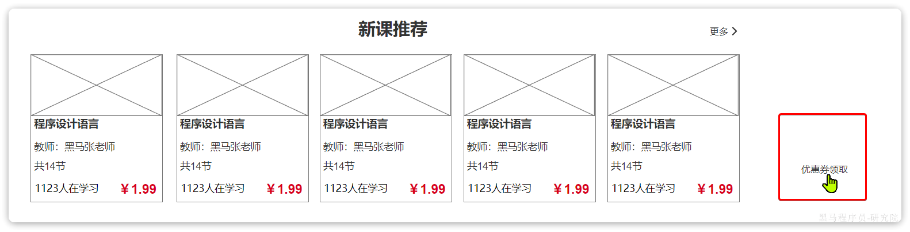

点击后就会进入领取优惠券的页面。

### 1.1.1.查询优惠券列表

在这里就会展示出所有可以**手动领取**的，**发放中**的优惠券：

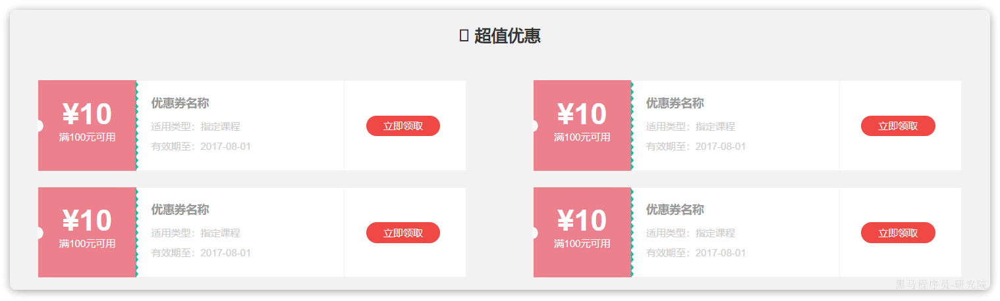

这其实就是一个**查询优惠券列表的功能**，而且查询的条件有两个：

- 发放中的优惠券
- 领取方式是手动领取的

兑换码的优惠券是无需展示的，只要输入兑换码即可领取，不在当前页面中。

### 1.1.2.领取优惠券

当我们点击《立即领取》按钮时，就需要给用户发放一张优惠券，这个发放给用户的券我们可以成为**用户券**。它与昨天我们讲解的优惠券，也就是现在页面展示的券不是一回事。

- 优惠券：是用来封装优惠信息的实体，不属于任何人，因此不能在消费时使用
- 用户券：是某个优惠券发放给某个用户后得到的实体，属于某一个用户，可以在消费时使用。一个优惠券可以分发出1~N张用户券，这取决于优惠券的发放数量。

一个优惠券可以对应多个用户券，是一对多关系。

所以，**用户券可以看做是用户和券的关系，即：谁领了哪张券**。当然不仅仅是关系，因为它还要记录用户领完券后的使用情况。

因此，我们需要设计一个用户券的表，用来保存用户和券的关系、使用状态等信息。当用户领取优惠券时，我们需要保存一条数据到用户券表中。这就是**领取优惠券功能**。

### 1.1.3.查询我的优惠券

在用户的个人中心，有一个我的优惠券页面：


这里展示的是当前用户已经领取过的所有优惠券，由于数据较多，将来肯定是要分页查询。而且用户可以点击选项卡（未使用、已使用、已过期）来过滤、查看不同状态的用户券。

这就是第三个接口功能：**分页查询我的优惠券**

### 1.1.4.兑换优惠券

在个人中心，我的优惠券页面上，有一个兑换优惠券按钮：

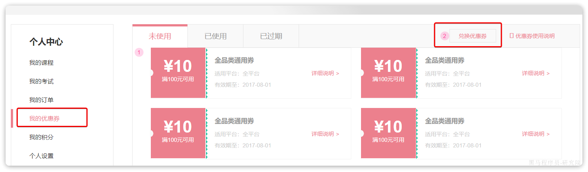

点击兑换优惠券，会弹出一个窗口：

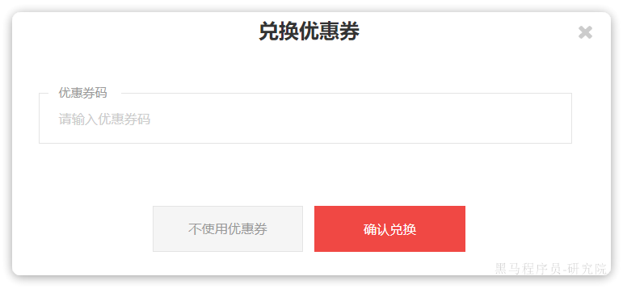

当我们输入兑换码后，即可兑换优惠券。

这也是我们要实现的第四个功能：**兑换优惠券功能**。

### 1.1.5.总结

综上，我们要实现的接口有四个：

- 查询优惠券列表
- 领取优惠券
- 查询我的优惠券
- 兑换优惠券

## 1.2.数据库设计

我们之前说过，领取优惠券，就必须记录**谁**领了**哪张券**。也就是用户和优惠券之间的领取关系。这就是用户券实体要记录的信息。

一个用户可以领取多张优惠券，一个优惠券可以被多个用户领取。因此用户与优惠券之间是多对多关系。而**用户券**实体就是这样的一个**中间关系**实体。所以用户券一定包含两个字段：

- 用户id
- 优惠券id

当然，用户券除了要记录关系以外，用户券还要记录用户领券后的**使用情况**，比如：

- 券的有效期，也就是券的过期时间
- 券的使用状态，包括：已使用、未使用、已过期三种
- 券的使用时间

所以，最终用户券的表结构如下：

```sql
CREATE TABLE IF NOT EXISTS `user_coupon` (
  `id` bigint NOT NULL AUTO_INCREMENT COMMENT '用户券id',
  `user_id` bigint NOT NULL COMMENT '优惠券的拥有者',
  `coupon_id` bigint NOT NULL COMMENT '优惠券模板id',
  `term_begin_time` datetime DEFAULT NULL COMMENT '优惠券有效期开始时间',
  `term_end_time` datetime NOT NULL COMMENT '优惠券有效期结束时间',
  `used_time` datetime DEFAULT NULL COMMENT '优惠券使用时间（核销时间）',
  `status` tinyint NOT NULL DEFAULT '1' COMMENT '优惠券状态，1：未使用，2：已使用，3：已失效',
  `create_time` datetime NOT NULL DEFAULT CURRENT_TIMESTAMP COMMENT '创建时间',
  `update_time` datetime NOT NULL DEFAULT CURRENT_TIMESTAMP ON UPDATE CURRENT_TIMESTAMP COMMENT '更新时间',
  PRIMARY KEY (`id`) USING BTREE,
  KEY `idx_coupon` (`coupon_id`),
  KEY `idx_user_coupon` (`user_id`,`coupon_id`) USING BTREE
) ENGINE=InnoDB AUTO_INCREMENT=4 DEFAULT CHARSET=utf8mb4 COLLATE=utf8mb4_0900_ai_ci COMMENT='用户领取优惠券的记录，是真正使用的优惠券信息';
```

## 1.3.代码生成

接下来，基于MybatisPlus的插件生成代码，此处不再赘述。不过，需要注意两点：

首先，用户券id，建议使用雪花算法：

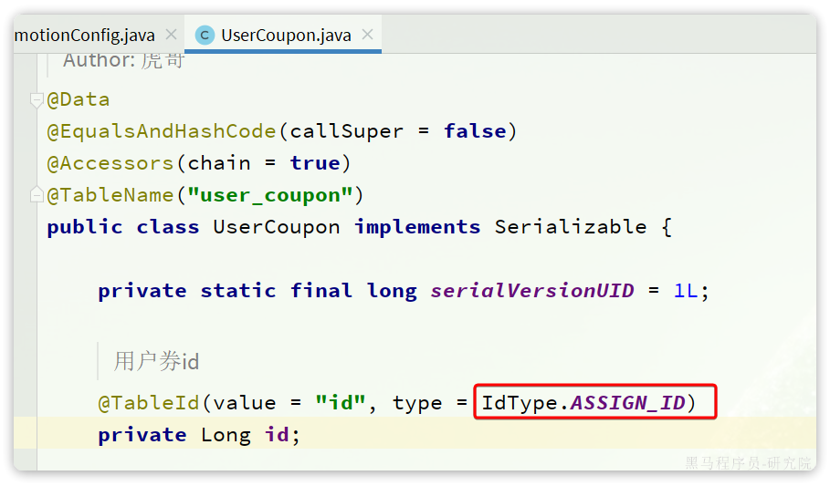

其次，用户券的状态需要定义成枚举，在课前资料已经提供好了：

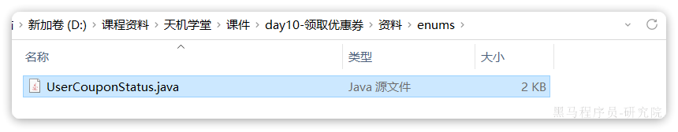

将其复制到`tj-promotion`的`enums`包下。然后修改`UserCoupon`实体中的status字段类型：

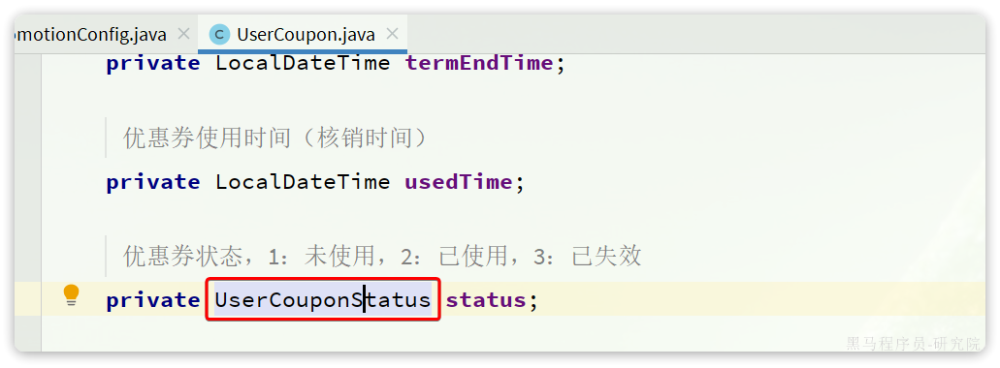

# 2.领取优惠券

## 2.1.查询发放中的优惠券

### 2.1.1.接口分析

先回顾页面原型：


这里要查询的是发放中的，并且领取方式是手动领取的优惠券。这就是一个简单的带条件的批量查询接口。因此按照Restful风格来设计即可，我们要分析的核心就是请求参数和返回值类型。

之前也说过，这里的查询条件包含两个：

- 发放中的优惠券
- 领取方式是手动领取的

不过这都是一些状态信息，不需要前端传递，我们自己在业务中判断即可。也就是说这个查询是无参的。

返回值首先肯定是优惠券集合，而优惠券数据就相对复杂一些，结合页面原型可以发现首先是一些基本字段：

- 优惠券id：领取的时候使用
- 优惠券名称
- 优惠的详细信息，包含四个字段：
  - 优惠的折扣类型
  - 优惠门槛
  - 优惠值
  - 最大优惠值
- 是否限定了范围
- 有效期的结束时间：页面写的是有效期至xxx，也就是说不关系有效期的开始时间，只关心结束时间
- 有效天数：券的使用有效期有两种方式，一种是到期时间；一种是固定天数，也就是自领取之日起算起。

OK，优惠券的基本信息就这么多。但是这里有一些隐含的内容在原型中没有显示出来：大家思考一下，如果这个优惠券我点击过立即领取，并且领取成功以后，页面该如何显示？

难道还是显示立即领取吗？这显然不行，一般优惠券领取完后应该显示为**立即使用**，提醒用户赶紧去买东西。

另外，如果这个券全部领完了呢？还展示立即领取吗？显然不行，这种应该显示为已领完。

这些现象在原型中没有展示，不过在最终的设计稿中有，来看一个前端设计稿图片：

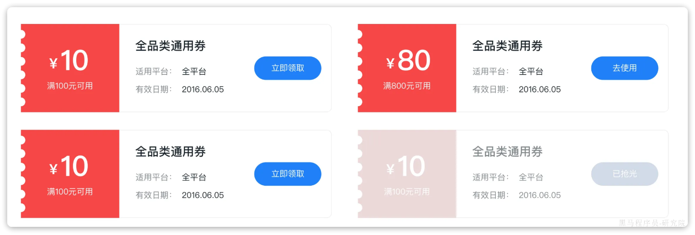

因此，我们应该在返回值中标示优惠券的这些状态：

- 是否可以领取：也就是优惠券还有剩余并且用户已领取数量未超过限领数量。如果为false，展示为**已抢完**
- 是否已经领取：也就是用户是否有已经领取，尚未使用的券。如果有，则显示为**去使用**

如果以上都不成立，则展示为立即领取

综上，结合Restful的风格，查询发放中的优惠券的接口规范如下：

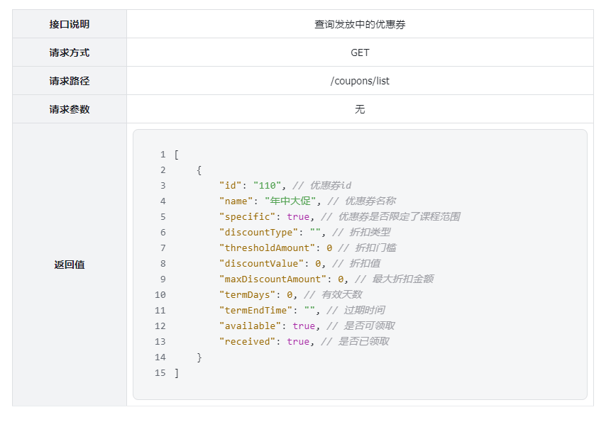

### 2.1.2.实体

这里需要定义一个返回值实体VO，在课前资料中已经提供好了：

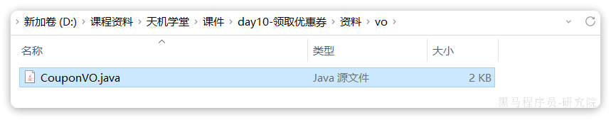

将其复制到`tj-promotion`下的`com.tianji.promotion.domain.vo`下即可。

### 2.1.3.接口实现

首先，在tj-promotion模块下的`com.tianji.promotion.controller.CouponController`中定义controller接口：

```java
@ApiOperation("查询发放中的优惠券列表")
@GetMapping("/list")
public List<CouponVO> queryIssuingCoupons(){
    return couponService.queryIssuingCoupons();
}
```

接下来，在`com.tianji.promotion.service.ICouponService`中定义service方法：

```java
List<CouponVO> queryIssuingCoupons();
```

最后，在`com.tianji.promotion.service.impl.CouponServiceImpl`中实现service方法：

```java
@Override
public List<CouponVO> queryIssuingCoupons() {
    // 1.查询发放中的优惠券列表
    List<Coupon> coupons = lambdaQuery()
            .eq(Coupon::getStatus, ISSUING)
            .eq(Coupon::getObtainWay, ObtainType.PUBLIC)
            .list();
    if (CollUtils.isEmpty(coupons)) {
        return CollUtils.emptyList();
    }
    // 2.统计当前用户已经领取的优惠券的信息
    List<Long> couponIds = coupons.stream().map(Coupon::getId).collect(Collectors.toList());
    // 2.1.查询当前用户已经领取的优惠券的数据
    List<UserCoupon> userCoupons = userCouponService.lambdaQuery()
            .eq(UserCoupon::getUserId, UserContext.getUser())
            .in(UserCoupon::getCouponId, couponIds)
            .list();
    // 2.2.统计当前用户对优惠券的已经领取数量
    Map<Long, Long> issuedMap = userCoupons.stream()
            .collect(Collectors.groupingBy(UserCoupon::getCouponId, Collectors.counting()));
    // 2.3.统计当前用户对优惠券的已经领取并且未使用的数量
    Map<Long, Long> unusedMap = userCoupons.stream()
            .filter(uc -> uc.getStatus() == UserCouponStatus.UNUSED)
            .collect(Collectors.groupingBy(UserCoupon::getCouponId, Collectors.counting()));
    // 3.封装VO结果
    List<CouponVO> list = new ArrayList<>(coupons.size());
    for (Coupon c : coupons) {
        // 3.1.拷贝PO属性到VO
        CouponVO vo = BeanUtils.copyBean(c, CouponVO.class);
        list.add(vo);
        // 3.2.是否可以领取：已经被领取的数量 < 优惠券总数量 && 当前用户已经领取的数量 < 每人限领数量
        vo.setAvailable(
                c.getIssueNum() < c.getTotalNum()
                && issuedMap.getOrDefault(c.getId(), 0L) < c.getUserLimit()
        );
        // 3.3.是否可以使用：当前用户已经领取并且未使用的优惠券数量 > 0
        vo.setReceived(unusedMap.getOrDefault(c.getId(),  0L) > 0);
    }
    return list;
}
```

### 2.1.4.登录拦截放行问题

发放中的优惠券，不管登录还是未登录都应该可以查看。但目前，未登录情况下访问优惠券页面就会报错：


这是怎么回事呢？

在咱们项目中的`tj-auth`模块下，提供了一个`tj-auth-resource-sdk`模块：

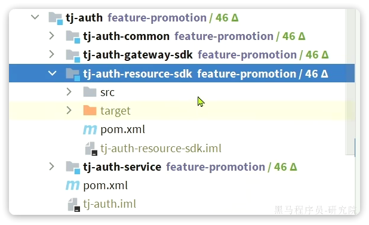

其作用有两个：

- 帮我们获取登录用户信息
- 校验登录状态，未登录则报错

任何微服务只要引入了`tj-auth-resource-sdk`模块，自然就具备了以上两个功能。这两个功能都是基于SpringMVC的拦截器来实现的。

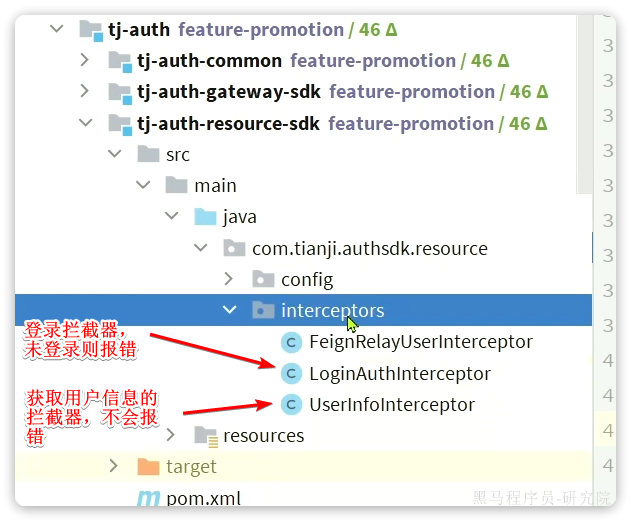

#### 2.1.4.1.UserInfoInterceptor

我们先来看一下用户信息获取的拦截器，源码如下：

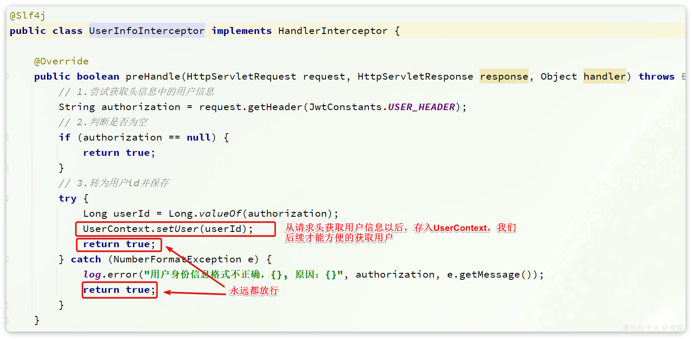

可以看到这个拦截器的核心作用就是从请求头中读取出用户id，然后保存到UserContext中。所以，我们才能在后续的业务逻辑中通过`UserContext.getUser()`来读取当前登录的用户id。

同时，我们可以发现这个拦截器的作用仅仅是**获取用户信息，无论获取成功或者失败，最终都会放行**。不会拦截用户请求。

#### 2.1.4.2.LoginAuthInterceptor

LoginAuthInterceptor是登录拦截器，来看下源码：

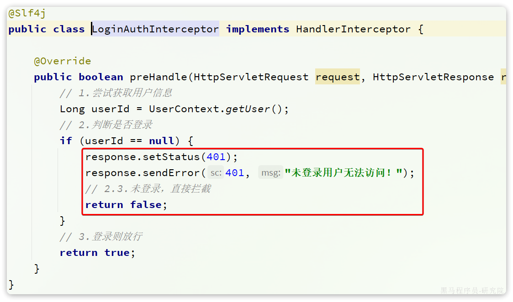

可以看到，这个拦截器就是判断用户是否登录，未登录会直接拦截并且返回错误码。不过这个拦截器是通过`UserContext.getUser()`方法来判断用户是否登录的。也就是说它依赖于UserInfoInterceptor，因此两个拦截器是有先后顺序的，不能搞错。

#### 2.1.4.3.拦截规则配置

那么问题来了：为什么我们要把登录用户信息获取、登录拦截分别写到两个拦截器呢？

这是因为并不是所有的接口都对登录用户有需要，有些接口可能登录或未登录都能访问。比如我们的查询发放中的优惠券功能。而有些接口则是要求必须登录才能访问。

如果把所有功能放在一个拦截器，也就意味着所有接口要么做拦截要求必须登录并且可以获取用户信息，要么不做拦截，无法获取登录用户信息。这不符合实际需求，所以我们将两个拦截器分离。

那么我们该怎么控制是否做登录拦截呢？

要知道，拦截器定义好了以后要想生效必须经过SpringMVC的配置，并且设置要拦截的路径，这些配置同样定义在`tj-auth-resource-sdk`模块下：

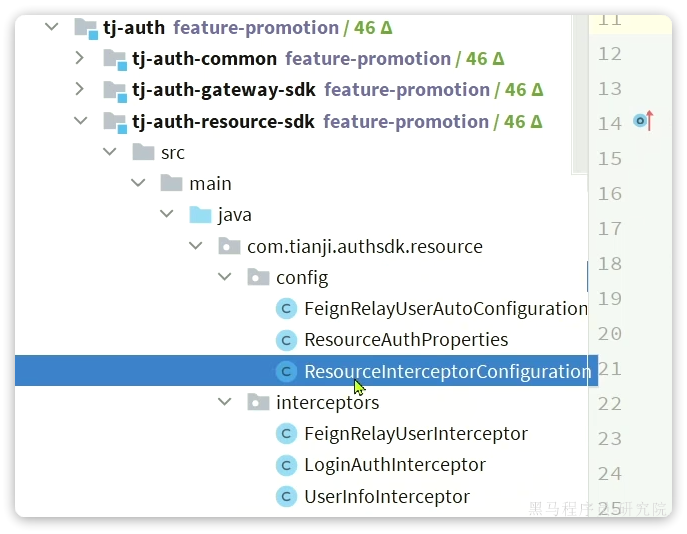

来看一下关键代码：

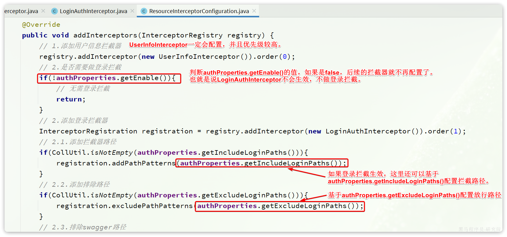

这里有几个关键的点：

- 用户信息获取的拦截器一定会生效。
- 登录拦截器不一定生效，取决于`authProperties.getEnable()`的值，为true则生效，false则不生效
  - 登录拦截生效的前提下，通过`authProperties.getIncludeLoginPaths()`配置要拦截的路径
  - 登录拦截生效的前提下，通过`authProperties.getExcludeLoginPaths()`配置要放行的路径

因此，要不要做登录拦截，要拦截哪些路径，完全取决于authProperties的属性:

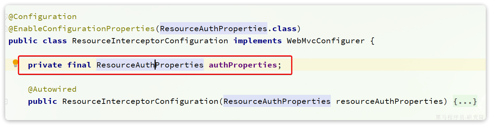

来看一下代码：

```java
@Data
@ConfigurationProperties(prefix = "tj.auth.resource")
public class ResourceAuthProperties {
    private Boolean enable = false;
    private List<String> includeLoginPaths;
    private List<String> excludeLoginPaths;
}
```

可以看出，这里是一个典型的springboot的配置属性，我们完全可以通过配置文件来修改。我们只要把需要放行的接口路径通过tj.auth.resource.excludeLoginPaths配置进去即可。

查询发放中的优惠券，接口路径是：`/coupons/list`，因此，修改`tj-promotion`的`bootstrap.yml`文件，添加下面的配置：

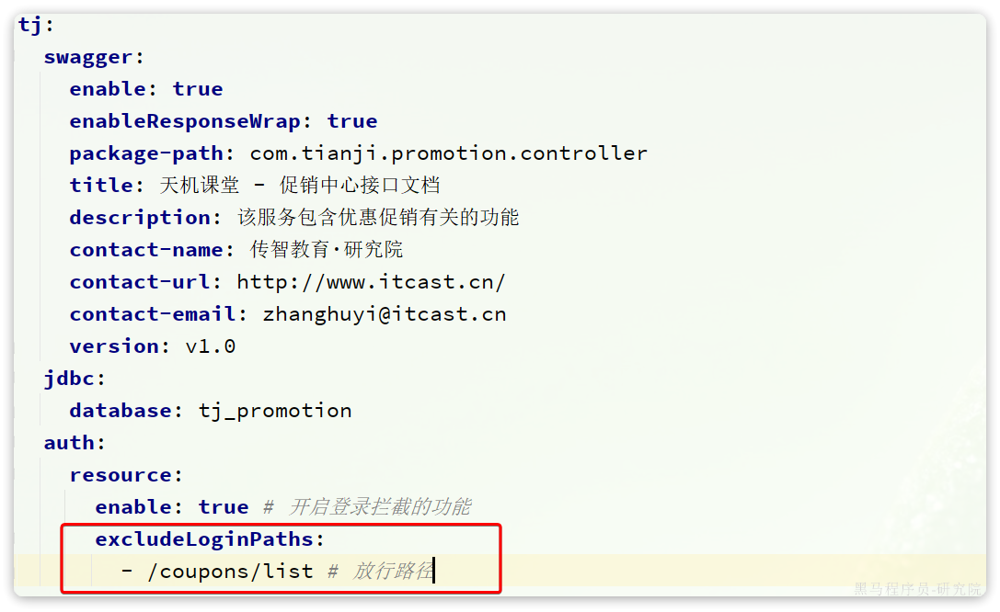

## 2.2.领取优惠券

查询到发放中的优惠券并且展示到页面后，用户就可以去领券了。

### 2.2.1.接口分析

领券的本质就是新增一条记录到user_coupon表，去记录用户和领券的优惠券之间的关系，使用状态等信息。那因此请求的需要两个参数：

- 用户id
- 优惠券id

不过，用户id我们可以自己获取，因此前端只要传递优惠券id即可。只传一个参数，我们可以直接用路径占位符传参。

返回值就更不需要了，因此接口信息非常简单，如下：

| 接口说明 | 领取发放中的优惠券         |
| -------- | -------------------------- |
| 请求方式 | POST                       |
| 请求路径 | /user-coupons/{id}/receive |
| 请求参数 | 路径占位符，优惠券id       |
| 返回值   | 无                         |

不过，需要注意的是，优惠券并不是任何人来了都可以领取的，我们需要做一系列的校验：

- 校验优惠券是否存在，不存在无法领取
- 校验优惠券的发放时间，是不是正在发放中
- 校验优惠券剩余库存是否充足
- 校验优惠券的每人限领数量

只有全部校验通过，才可以领取优惠券，而领券要做两件事：

- 新增一个记录到user_coupon表
- 更新coupon表中已经领取的数量，别忘了在coupon表中是有一些统计字段的：
  - 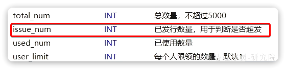

更新发行数量（已领取数量），不仅仅起到统计作用，同时也可以帮助我们判断库存是否充足。

当`issue_num >= total_num`时，那就证明库存已经不足了。

因此领取优惠券的业务流程如下：

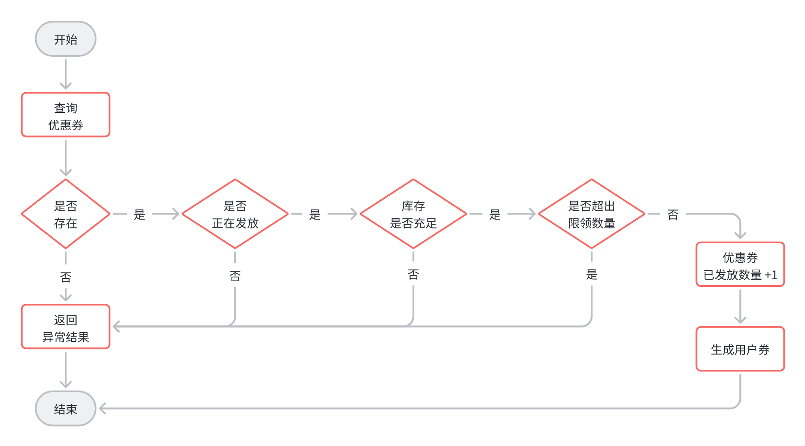

### 2.2.2.接口实现

由于这次是操作的是用户券，因此我们定义接口在`UserCouponController`中。

首先，在tj-promotion模块下的`com.tianji.promotion.controller.UserCouponController`中定义controller接口：

```java
package com.tianji.promotion.controller;

import com.tianji.promotion.service.IUserCouponService;
import io.swagger.annotations.Api;
import io.swagger.annotations.ApiOperation;
import io.swagger.annotations.ApiParam;
import lombok.RequiredArgsConstructor;
import org.springframework.web.bind.annotation.*;

import java.util.List;

@RestController
@RequiredArgsConstructor
@RequestMapping("/user-coupons")
@Api(tags = "优惠券相关接口")
public class UserCouponController {

    private final IUserCouponService userCouponService;

    @ApiOperation("领取优惠券接口")
    @PostMapping("/{couponId}/receive")
    public void receiveCoupon(@PathVariable("couponId") Long couponId){
        userCouponService.receiveCoupon(couponId);
    }
}
```

接下来，在`com.tianji.promotion.service.IUserCouponService`中定义service方法：

```java
package com.tianji.promotion.service;

import com.baomidou.mybatisplus.extension.service.IService;

import java.util.List;

public interface IUserCouponService extends IService<UserCoupon> {
    void receiveCoupon(Long couponId);
}
```

最后，在`com.tianji.promotion.service.impl.UserCouponServiceImpl`中实现service方法：

```java
package com.tianji.promotion.service.impl;

import com.baomidou.mybatisplus.extension.service.impl.ServiceImpl;
import com.tianji.common.exceptions.BizIllegalException;
import com.tianji.common.exceptions.DbException;
import com.tianji.common.utils.BeanUtils;
import com.tianji.common.utils.CollUtils;
import com.tianji.common.utils.NumberUtils;
import com.tianji.common.utils.UserContext;
import com.tianji.promotion.constants.PromotionConstants;
import com.tianji.promotion.domain.dto.UserCouponDTO;
import com.tianji.promotion.domain.po.Coupon;
import com.tianji.promotion.domain.po.UserCoupon;
import com.tianji.promotion.enums.UserCouponStatus;
import com.tianji.promotion.mapper.CouponMapper;
import com.tianji.promotion.mapper.UserCouponMapper;
import com.tianji.promotion.service.IUserCouponService;
import com.tianji.promotion.utils.CodeUtil;
import lombok.RequiredArgsConstructor;
import org.springframework.stereotype.Service;
import org.springframework.transaction.annotation.Transactional;

import java.time.LocalDateTime;
import java.util.*;
import java.util.stream.Collectors;

@Service
@RequiredArgsConstructor
public class UserCouponServiceImpl extends ServiceImpl<UserCouponMapper, UserCoupon> implements IUserCouponService {

    private final CouponMapper couponMapper;

    @Override
    @Transactional
    public void receiveCoupon(Long couponId) {
        // 1.查询优惠券
        Coupon coupon = couponMapper.selectById(couponId);
        if (coupon == null) {
            throw new BadRequestException("优惠券不存在");
        }
        // 2.校验发放时间
        LocalDateTime now = LocalDateTime.now();
        if (now.isBefore(coupon.getIssueBeginTime()) || now.isAfter(coupon.getIssueEndTime())) {
            throw new BadRequestException("优惠券发放已经结束或尚未开始");
        }
        // 3.校验库存
        if (coupon.getIssueNum() >= coupon.getTotalNum()) {
            throw new BadRequestException("优惠券库存不足");
        }
        Long userId = UserContext.getUser();
        // 4.校验每人限领数量
        // 4.1.统计当前用户对当前优惠券的已经领取的数量
        Integer count = lambdaQuery()
                .eq(UserCoupon::getUserId(), userId)
                .eq(UserCoupon::getCouponId(), couponId)
                .count();
        // 4.2.校验限领数量
        if(count != null && count >= coupon.getUserLimit()){
            throw new BadRequestException("超出领取数量");
        }
        // 5.更新优惠券的已经发放的数量 + 1
        couponMapper.incrIssueNum(coupon.getId());
        // 6.新增一个用户券
        saveUserCoupon(coupon, userId);
    }

    private void saveUserCoupon(Coupon coupon, Long userId) {
        // 1.基本信息
        UserCoupon uc = new UserCoupon();
        uc.setUserId(userId);
        uc.setCouponId(coupon.getId());
        // 2.有效期信息
        LocalDateTime termBeginTime = coupon.getTermBeginTime();
        LocalDateTime termEndTime = coupon.getTermEndTime();
        if (termBeginTime == null) {
            termBeginTime = LocalDateTime.now();
            termEndTime = termBeginTime.plusDays(coupon.getTermDays());
        }
        uc.setTermBeginTime(termBeginTime);
        uc.setTermEndTime(termEndTime);
        // 3.保存
        save(uc);
    }
}
```

需要注意的，更新优惠券的已经领取数量需要自定义SQL语句。我们在中新增一个方法，并编写SQL：

```java
package com.tianji.promotion.mapper;

import com.baomidou.mybatisplus.core.mapper.BaseMapper;
import com.tianji.promotion.domain.po.Coupon;
import org.apache.ibatis.annotations.Param;
import org.apache.ibatis.annotations.Update;


public interface CouponMapper extends BaseMapper<Coupon> {
    @Update("UPDATE coupon SET issue_num = issue_num + 1 WHERE id = #{couponId}")
    int incrIssueNum(@Param("couponId") Long couponId);
}
```

## 2.3.兑换码兑换优惠券

兑换码兑换优惠券与直接领取优惠券都是在领券，因此整体流程基本一致。只不过在请求参数上略有不同，资格校验上要多一些对于兑换码的正确性校验。

### 2.3.1.接口分析

首先，从请求参数来说，兑换码校验并不知道优惠券id，只要告诉我们兑换码是什么，我们解析兑换码自然能得到兑换码的id。

根据兑换码id查询exchange_code表中的exchange_target_id字段，即可知道要兑换的优惠券的id了：

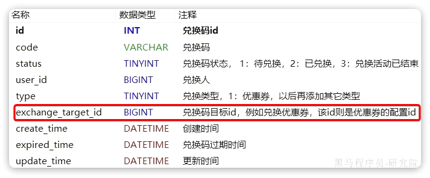

所以，请求参数仅仅需要code即可。

从校验过程来说，我们首先需要校验兑换码的正确性，包括两点：

- 兑换码格式是否正确
- 兑换码是否已经被兑换过

兑换码的格式校验可以基于我们自定义的CodeUtil中好的parseCode方法来完成，这个方法不仅仅可以校验兑换码格式，还可以解析出其中的兑换码id，方便我们根据兑换码id查询数据库。

兑换码是否兑换则要利用BitMap来实现。由于兑换码的id刚好是递增序列，按照约定，兑换码id是几，我们就找BitMap中的第几个bit位，判断是0还是1，就能得知是否兑换过了。

那因此，当我们兑换成功后，一定要利用SETBIT命令将对应的bit位置为1，标识这个兑换码是已兑换的。

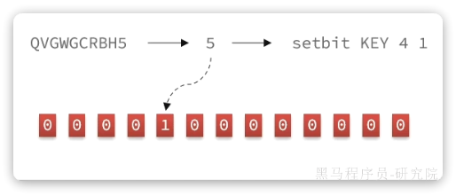

以上校验都通过，接下来就可以去查询兑换码，从而得到优惠券id，然后查询优惠券，完成对优惠券的后续校验了，这些与手动领取优惠券的校验类似，这里不再赘述。

综上，最终兑换码兑换的业务流程如图：

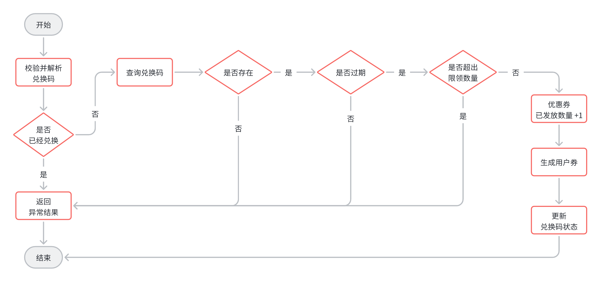

### 2.3.2.接口实现

由于这次是操作yongh，因此我们定义接口在`UserCouponController`中。

首先，在tj-promotion模块下的`com.tianji.promotion.controller.UserCouponController`中定义controller接口：

```java
@ApiOperation("兑换码兑换优惠券接口")
@PostMapping("/{code}/exchange")
public void exchangeCoupon(@PathVariable("code") String code){
    userCouponService.exchangeCoupon(code);
}
```

接下来，在`com.tianji.promotion.service.IUserCouponService`中定义service方法：

```java
void exchangeCoupon(String code);
```

最后，在`com.tianji.promotion.service.impl.UserCouponServiceImpl`中实现service方法：

```java
package com.tianji.promotion.service.impl;

import com.baomidou.mybatisplus.extension.service.impl.ServiceImpl;
import com.tianji.common.exceptions.BizIllegalException;
import com.tianji.common.exceptions.DbException;
import com.tianji.common.utils.BeanUtils;
import com.tianji.common.utils.CollUtils;
import com.tianji.common.utils.NumberUtils;
import com.tianji.common.utils.UserContext;
import com.tianji.promotion.constants.PromotionConstants;
import com.tianji.promotion.domain.dto.UserCouponDTO;
import com.tianji.promotion.domain.po.Coupon;
import com.tianji.promotion.domain.po.UserCoupon;
import com.tianji.promotion.enums.UserCouponStatus;
import com.tianji.promotion.mapper.CouponMapper;
import com.tianji.promotion.mapper.UserCouponMapper;
import com.tianji.promotion.service.IUserCouponService;
import com.tianji.promotion.utils.CodeUtil;
import lombok.RequiredArgsConstructor;
import org.springframework.stereotype.Service;
import org.springframework.transaction.annotation.Transactional;

import java.time.LocalDateTime;
import java.util.*;
import java.util.stream.Collectors;

@Service
@RequiredArgsConstructor
public class UserCouponServiceImpl extends ServiceImpl<UserCouponMapper, UserCoupon> implements IUserCouponService {

    private final CouponMapper couponMapper;

    private final IExchangeCodeService codeService;

    @Override
    @Transactional
    public void receiveCoupon(Long couponId) {
        // 1.查询优惠券
        Coupon coupon = couponMapper.selectById(couponId);
        if (coupon == null) {
            throw new BadRequestException("优惠券不存在");
        }
        // 2.校验发放时间
        LocalDateTime now = LocalDateTime.now();
        if (now.isBefore(coupon.getIssueBeginTime()) || now.isAfter(coupon.getIssueEndTime())) {
            throw new BadRequestException("优惠券发放已经结束或尚未开始");
        }
        // 3.校验库存
        if (coupon.getIssueNum() >= coupon.getTotalNum()) {
            throw new BadRequestException("优惠券库存不足");
        }
        Long userId = UserContext.getUser();
        // 4.校验并生成用户券
        checkAndCreateUserCoupon(coupon, userId, null);
    }

    private void saveUserCoupon(Coupon coupon, Long userId) {
        // 1.基本信息
        UserCoupon uc = new UserCoupon();
        uc.setUserId(userId);
        uc.setCouponId(coupon.getId());
        // 2.有效期信息
        LocalDateTime termBeginTime = coupon.getTermBeginTime();
        LocalDateTime termEndTime = coupon.getTermEndTime();
        if (termBeginTime == null) {
            termBeginTime = LocalDateTime.now();
            termEndTime = termBeginTime.plusDays(coupon.getTermDays());
        }
        uc.setTermBeginTime(termBeginTime);
        uc.setTermEndTime(termEndTime);
        // 3.保存
        save(uc);
    }
    
    private void checkAndCreateUserCoupon(Coupon coupon, Long userId, Integer serialNum){
        // 1.校验每人限领数量
        // 1.1.统计当前用户对当前优惠券的已经领取的数量
        Integer count = lambdaQuery()
                .eq(UserCoupon::getUserId, userId)
                .eq(UserCoupon::getCouponId, coupon.getId())
                .count();
        // 1.2.校验限领数量
        if(count != null && count >= coupon.getUserLimit()){
            throw new BadRequestException("超出领取数量");
        }
        // 2.更新优惠券的已经发放的数量 + 1
        couponMapper.incrIssueNum(coupon.getId());
        // 3.新增一个用户券
        saveUserCoupon(coupon, userId);
        // 4.更新兑换码状态
        if (serialNum != null) {
            codeService.lambdaUpdate()
                    .set(ExchangeCode::getUserId, userId)
                    .set(ExchangeCode::getStatus, ExchangeCodeStatus.USED)
                    .eq(ExchangeCode::getId, serialNum)
                    .update();
        }
    }
    
    @Override
    @Transactional
    public void exchangeCoupon(String code) {
        // 1.校验并解析兑换码
        long serialNum = CodeUtil.parseCode(code);
        // 2.校验是否已经兑换 SETBIT KEY 4 1 ，这里直接执行setbit，通过返回值来判断是否兑换过
        boolean exchanged = codeService.updateExchangeMark(serialNum, true);
        if (exchanged) {
            throw new BizIllegalException("兑换码已经被兑换过了");
        }
        try {
            // 3.查询兑换码对应的优惠券id
            ExchangeCode exchangeCode = codeService.getById(serialNum);
            if (exchangeCode == null) {
                throw new BizIllegalException("兑换码不存在！");
            }
            // 4.是否过期
            LocalDateTime now = LocalDateTime.now();
            if (now.isAfter(exchangeCode.getExpireTime()) {
                throw new BizIllegalException("兑换码已经过期");
            }
            // 5.校验并生成用户券
            // 5.1.查询优惠券
             Coupon coupon = couponMapper.selectById(exchangeCode.getCouponId());
            // 5.2.查询用户
            Long userId = UserContext.getUser();
            // 5.3.校验并生成用户券，更新兑换码状态
            checkAndCreateUserCoupon(coupon, userId, serialNum);
        } catch (Exception e) {
            // 重置兑换的标记 0
            codeService.updateExchangeMark(serialNum, false);
            throw e;
        }
    }
}
```

需要注意的是，其中利用BitMap来标记兑换码的兑换状态功能，属于兑换码功能，我们需要封装到`com.tianji.promotion.service.IExchangeCodeService`中:

```java
boolean updateExchangeMark(long serialNum, boolean mark);
```

然后，在`com.tianji.promotion.service.impl.ExchangeCodeServiceImpl`中实现该方法：

```java
@Override
public boolean updateExchangeMark(long serialNum, boolean mark) {
    Boolean boo = redisTemplate.opsForValue().setBit(COUPON_CODE_MAP_KEY, serialNum, mark);
    return boo != null && boo;
}
```

# 3.并发安全问题

前面几节课我们已经实现了领取优惠券、兑换码兑换优惠券功能。经过测试发现没什么问题。不过，之前的测试都是基于页面UI的功能性测试。

要知道领券的过程中有大量的校验，这些校验逻辑在高并发的场景下很容易出现问题。因此，我们必须对领券功能做并发测试，看看是否会出现并发安全问题。

并发测试，比较常见的一种工具就是Jemeter了，在课前资料中给大家提供了Jemeter的相关资料和入门文档：

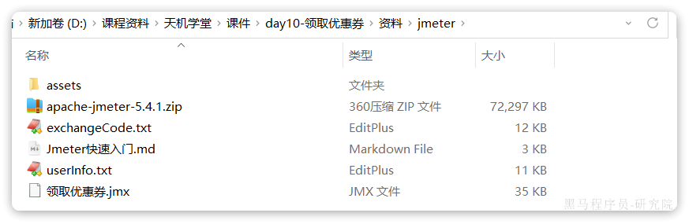

同学们可以参考入门文档学习Jmeter的使用。

同时，我也提供了一个《领取优惠券的.jmx》文件，里面配置了一份测试脚本，将其导入Jemeter中，即可测试领券功能：

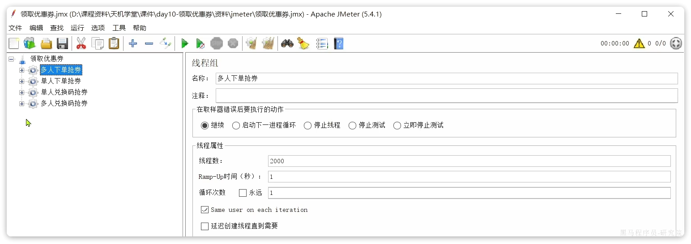

注意，多人抢券的测试中，需要指定N个用户信息，这里我准备了一些虚假信息放到了课前资料中：

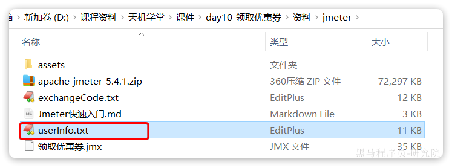

由于每个人的磁盘目录不同，你需要自己加载一下这个文件：

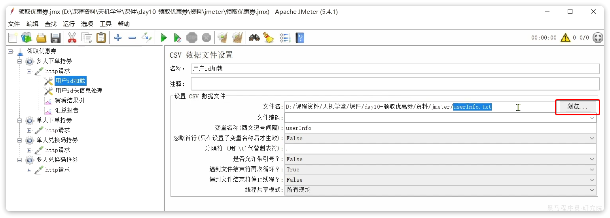

然后运行测试，即可：

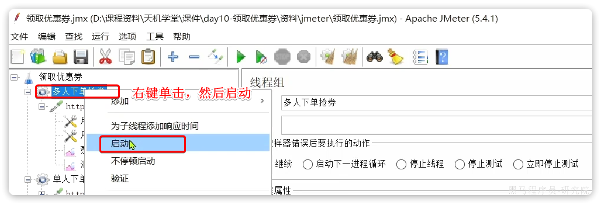

## 3.1.超卖问题

经过测试，确实出现了超卖（或超发）的现象，优惠只有100个库存，结果发放了109张券！！

那么，为什么出现了超卖的现象呢？

### 3.1.1.分析原因

现在我们对于优惠券库存的处理逻辑是这样的：

- 查询优惠券
- 判断库存是否充足（领取数量<总数量）
- 如果充足，更新优惠券领取数量

这里采用的是**先查询，再判断，再更新**的方案，而以上三步操作并不具备原子性。单线程的情况下确实没有问题。但如果是多线程并发运行，如果N个线程同时去查询（N大于剩余库存），此时大概率查询到的库存是充足的，然后判断库存自然没问题。最后一起更新库存，自然就会超卖。

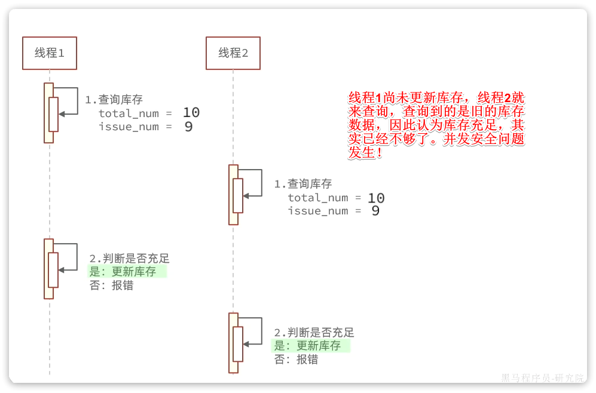

总结一下，原因是：

- 多线程并行运行
- 多行代码操作共享资源，但不具备原子性

这就是典型的线程并发安全问题，相信大家都能想到解决方案吧。

### 3.1.2.解决方案

针对并发安全问题，最广为人知的解决方案就是**加锁。**不过，加锁的方式多种多样，大家熟悉的Synchronized、ReentrantLock只是其中最基础的锁。

我们今天先不讨论具体的锁的实现方式，而是讲讲加锁的**思想**。从实现思想上来说，锁可以分为两大类：

- 悲观锁
- 乐观锁

何为悲观锁？

> 悲观锁是一种独占和排他的锁机制，**保守地认为数据会被其他事务修改**，所以在整个数据处理过程中将数据处于锁定状态。

何为乐观锁？

> 乐观锁是一种较为**乐观的****并发****控制方法，假设多用户并发的不会产生安全问题**，因此无需独占和锁定资源。但在更新数据前，会先检查是否有其他线程修改了该数据，如果有，则认为可能有风险，会放弃修改操作

可见，悲观锁、乐观锁是对并发安全问题的处理态度不同：

- 悲观锁认为安全问题一定会发生，所以直接独占资源。结果就是多个线程会串行执行被保护的代码。
  - 优点：安全性非常高
  - 缺点：性能较差
- 乐观锁则认为安全问题不一定发生，所以不独占资源。结果就是允许多线程并行执行。但如果真的发生并发修改怎么办？？乐观锁采用CAS（**C**ompare **A**nd **S**et）思想，在更新数据前先判断数据与我之前查询到的是否一致，不一致则证明有其它线程也在更新。为了避免出现安全问题，放弃本次更新或者重新尝试一次。

乐观锁听起来比较抽象，我们举个例子。

比如我们现在`total_num`为10，`issue_num`为9，也就是说还剩下1个库存了。现在有两个线程来执行修改操作。

- 线程1、线程2都查询数据，发现`total_num`为10，`issue_num`为9
- 线程1、线程2都判断库存是否充足，`if(issue_num < total_num)`，发现都成立了。
- 线程1和线程2都开始执行数据库写操作，更新`issue_num`。但是由于数据库的事务互斥，肯定有先有后。我们假设线程1先执行。按照乐观锁机制，在更新时要做数据检查（CAS），判断数据是否变化。因此SQL是这样：
  - `UPDATE coupon SET issue_num = issue_num + 1 WHERE id = 1`` AND issue_num = 9`
  -  注意SQL语句结尾的`AND issue_num = 9` , 这里的9就是之前查询的结果，这里就是校验是否变化，假如`issue_num`发生变化，此处不一致，肯定SQL就执行失败。当然线程1是第一个执行的，`issue_num`没有变化，所以这里会成功。因此`issue_num`的值`+1`，变为10
- 紧接着，线程2执行，因为线程2查询的时候issue_num是9，所以线程2执行相同SQL：
  - `UPDATE coupon SET issue_num = issue_num + 1 WHERE id = 1`` AND issue_num = 9`
  - 但线程1已经将`issue_num`的值更新为10，线程2的这条SQL执行时where条件不成立，执行失败，乐观锁生效了。

以上就是乐观锁的工作原理，可以发现乐观锁：

- 优点：性能好、安全性也好
- 缺点：并发较高时，可能出现更新成功率较低的问题（并行的N个线程只会有1个成功）

不过，针对更新成功率低的问题，在优惠券库存这个业务中，有一个乐观锁的改进方案：

> 我们无需判断issue_num是否与原来一致，只要判断issue_num是否小于total_num即可。这样，只要issue_num小于total_num，不管有多少线程来执行，都会成功。

综上，我们最终的执行SQL是这样的：

```sql
UPDATE coupon SET issue_num = issue_num + 1 WHERE id = 1 AND issue_num < total_num
```

### 3.1.3.解决超卖问题

首先，我们要修改`com.tianji.promotion.mapper.CouponMapper`中的更新库存的SQL语句：

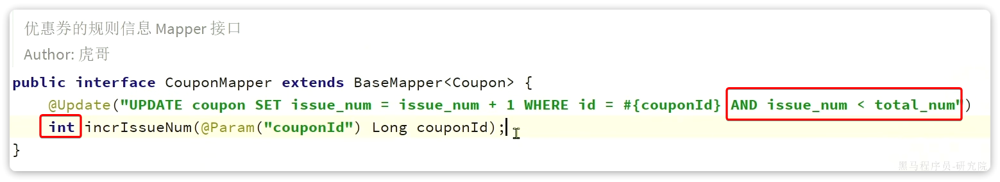

需要注意的是，where条件不成立不会报错，而是更新失败，返回0. 因此，我们还应该对这个方法的返回值做判断，如果返回值是0，则应该抛出异常，触发回滚。

修改`com.tianji.promotion.service.impl.UserCouponServiceImpl`中的`checkAndCreateUserCoupon`方法：

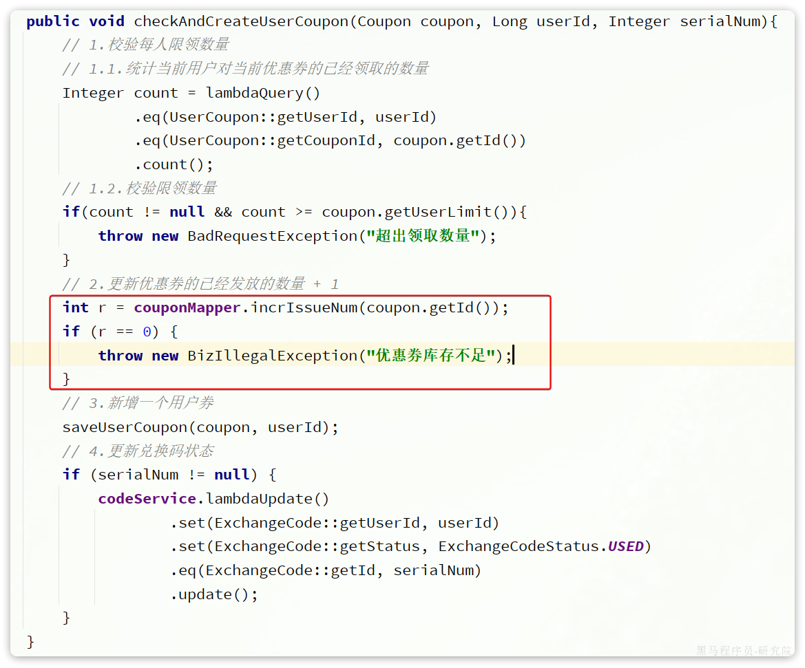

### 3.1.4.总结

 

超卖这样的线程安全问题，解决方案有哪些？

- 悲观锁：添加同步锁，让线程串行执行
  - 优点：简单粗暴
  - 缺点：性能一般
- 乐观锁：不加锁，在更新时判断是否有其它线程在修改
  - 优点：性能好
  - 缺点：存在成功率低的问题

## 3.2.锁失效问题

其实，除了优惠券库存判断，领券时还有对于用户限领数量的判断：

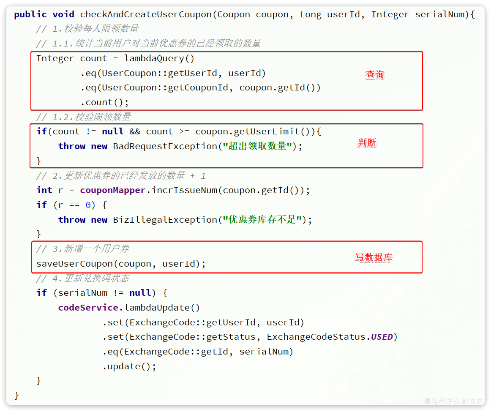

可以看到，这部分逻辑也是按照三步走：

- 查询数据库
- 判断是否超出限领数量
- 新增用户券

这段代码没有加锁，不具备原子性，如果多线程并发访问，肯定会出现安全问题。

怎么办？

是不是跟上节课一样，使用乐观锁解决？

显然不行，因为乐观锁常用在更新，而且这里用户和优惠券的关系并不具备唯一性，因此新增时无法基于乐观锁做判断。

所以，这里只能采用悲观锁方案，也就是大家熟悉的Synchronized或者Lock.

### 3.2.1.锁对象问题

用户限领数量判断是针对单个用户的，因此锁的范围不需要是整个方法，只要锁定某个用户即可。所以这里建议采用Synchronized的代码块，而不是同步方法。并且同步代码块的锁指定为用户id，那么同一个用户并发操作时会被锁定，不同用户互相没有影响，整体效率也是可以接受的。

代码如下：

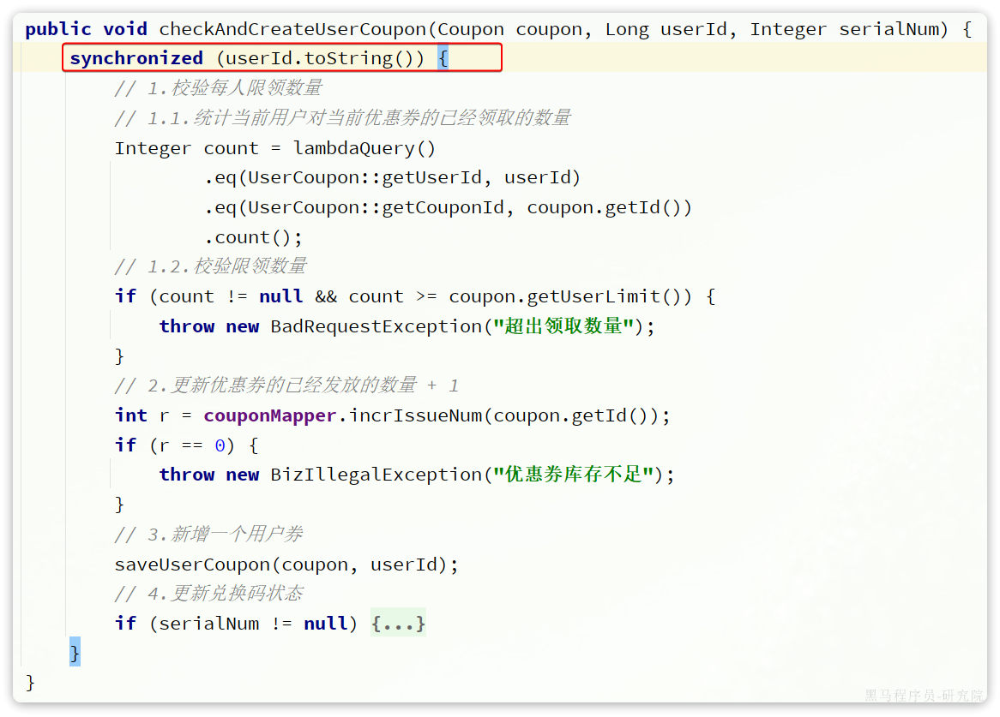

经过测试，发现并发安全问题依然存在，锁没有生效！！！什么情况？

加了锁，但锁没生效，可能的原因是什么？答案是用了不同的锁。

我们期望同一个用户用同一把锁，那就要去锁对象必须是同一个。但是我们刚才的锁是`userId.toString()`;

userId是Long类型，其中toString方法源码如下：

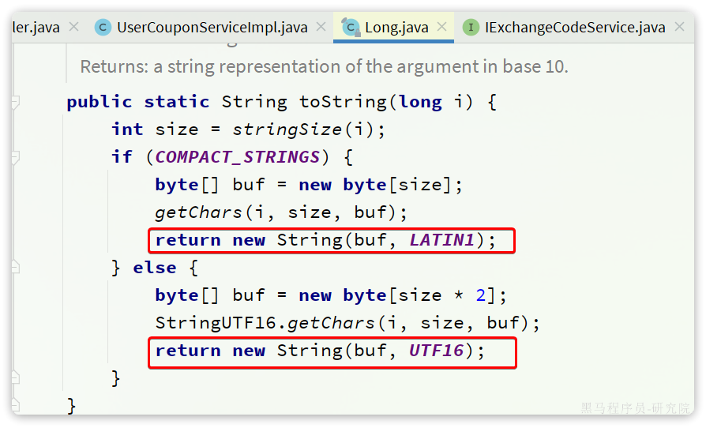

可以看到，这里竟然采用的是new String()的方式。

也就是说，哪怕是同一个用户，其id是一样，但toString()得到的也是多个不同对象！也就是多把不同的锁！

怎么解决呢？

### 3.2.2.解决方案

String类中提供了一个`intern()`方法：

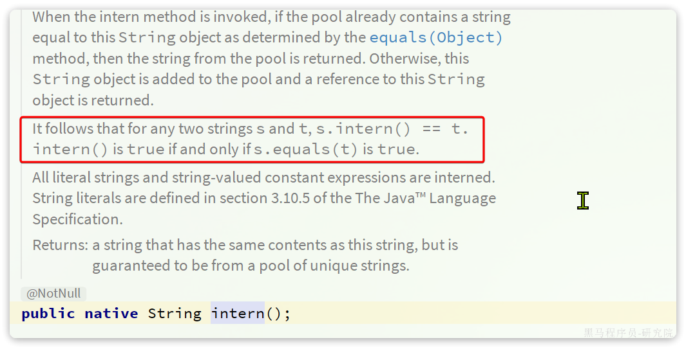

从描述中可以看出，只要两个字符串equals的结果为true，那么intern就能保证得到的结果用 ==判断也是true，其原理就是获取字符串字面值对应到常量池中的字符串常量。因此只要两个字符串一样，intern()返回的一定是同一个对象。

因此，我们这样改造：

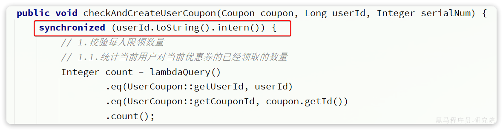

## 3.3.事务边界问题

经过同步锁的改造，理论上用户限领数量判断的逻辑应该已经是解决了。

不过，经过测试后，发现问题依然存在，用户还是会超领。这又是怎么回事呢？

### 3.3.1.分析原因

其实这次的问题并不是由于锁导致的，而是由于事务的隔离导致。

要知道，整个领券发放是加了事务的：

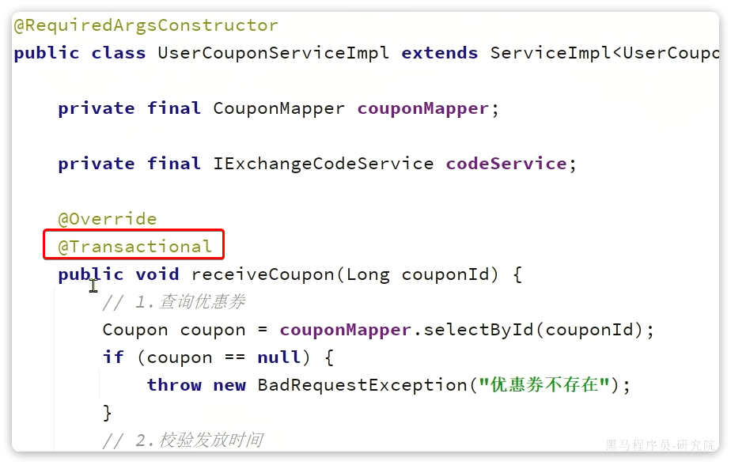

而在发放内部，我们加锁，处理限领数量的判断。

整体业务流程是这样的：

- 开启事务
- 获取锁
- 统计用户已领券的数量
- 判断是否超出限领数量
- 如果没超，新增一条用户券
- 释放锁
- 提交事务

注意，这里是先开启事务，再获取锁；而业务执行完毕后，是**先释放锁，再提交事务**。

假如用户限领数量为1，当前用户没有领过券。但是这个人写了一个抢券程序，用自己的账号并发的来访问我们。

假设此时有两个线程并行执行这段逻辑：

- 线程1开启事务，然后获取锁成功；线程2开启事务，但是获取锁失败，被阻塞
- 线程1执行业务，由于没领过，所有业务都能正常执行，不再赘述
- 线程1释放锁。此时线程2立刻获取锁成功，开始执行业务：
  - 线程2统计用户已领取数量。**由于线程1尚未提交事务，**此时线程2读取不到未提交数据。因此认为当前用户没有领券。
  - 判断限领数量通过，于是也新增一条券
  - 安全问题发生了！

总结：由于锁过早释放，导致了事务尚未提交，判断出现错误，最终导致并发安全问题发生。

这其实就是**事务边界**和**锁边界**的问题。

### 3.3.2.解决方案

解决方案很简单，就是调整边界：

- 业务开始前，先获取锁，再开启事务
- 业务结束后：先提交事务，再释放锁

具体代码如下：

```java
// 。。。略
@Service
@RequiredArgsConstructor
public class UserCouponServiceImpl extends ServiceImpl<UserCouponMapper, UserCoupon> implements IUserCouponService {

    private final CouponMapper couponMapper;

    private final IExchangeCodeService codeService;

    @Override
    // @Transactional 此处的事务注解取消
    public void receiveCoupon(Long couponId) {
        // 1.查询优惠券
        Coupon coupon = couponMapper.selectById(couponId);
        if (coupon == null) {
            throw new BadRequestException("优惠券不存在");
        }
        // 2.校验发放时间
        LocalDateTime now = LocalDateTime.now();
        if (now.isBefore(coupon.getIssueBeginTime()) || now.isAfter(coupon.getIssueEndTime())) {
            throw new BadRequestException("优惠券发放已经结束或尚未开始");
        }
        // 3.校验库存
        if (coupon.getIssueNum() >= coupon.getTotalNum()) {
            throw new BadRequestException("优惠券库存不足");
        }
        Long userId = UserContext.getUser();
        // 4.校验并生成用户券
        synchronized(userId.toString().intern()){ // 这里加锁，这样锁在事务之外
            checkAndCreateUserCoupon(coupon, userId, null);
        }
    }

    @Transactional // 这里进事务，同时，事务方法一定要public修饰
    public void checkAndCreateUserCoupon(Coupon coupon, Long userId, Integer serialNum){
        // 1.校验每人限领数量
        // 1.1.统计当前用户对当前优惠券的已经领取的数量
        Integer count = lambdaQuery()
                .eq(UserCoupon::getUserId, userId)
                .eq(UserCoupon::getCouponId, coupon.getId())
                .count();
        // 1.2.校验限领数量
        if (count != null && count >= coupon.getUserLimit()) {
            throw new BadRequestException("超出领取数量");
        }
        // 2.更新优惠券的已经发放的数量 + 1
        int r = couponMapper.incrIssueNum(coupon.getId());
        if (r == 0) {
            throw new BizIllegalException("优惠券库存不足");
        }
        // 3.新增一个用户券
        saveUserCoupon(coupon, userId);
        // 4.更新兑换码状态
        if (serialNum != null) {
            codeService.lambdaUpdate()
                    .set(ExchangeCode::getUserId, userId)
                    .set(ExchangeCode::getStatus, ExchangeCodeStatus.USED)
                    .eq(ExchangeCode::getId, serialNum)
                    .update();
        }
    }
    
    
    private void saveUserCoupon(Coupon coupon, Long userId) {
        // 1.基本信息
        UserCoupon uc = new UserCoupon();
        uc.setUserId(userId);
        uc.setCouponId(coupon.getId());
        // 2.有效期信息
        LocalDateTime termBeginTime = coupon.getTermBeginTime();
        LocalDateTime termEndTime = coupon.getTermEndTime();
        if (termBeginTime == null) {
            termBeginTime = LocalDateTime.now();
            termEndTime = termBeginTime.plusDays(coupon.getTermDays());
        }
        uc.setTermBeginTime(termBeginTime);
        uc.setTermEndTime(termEndTime);
        // 3.保存
        save(uc);
    }
    // 。。。 略
}
```

由于事务方法需要public修饰，并且被spring管理。因此要把事务方法向上抽取到service接口中：

```java
package com.tianji.promotion.service;

import com.baomidou.mybatisplus.extension.service.IService;
import com.tianji.promotion.domain.po.UserCoupon;

import java.util.List;

/**
 * <p>
 * 用户领取优惠券的记录，是真正使用的优惠券信息 服务类
 * </p>
 *
 * @author 虎哥
 */
public interface IUserCouponService extends IService<UserCoupon> {
    void receiveCoupon(Long couponId);

    void checkAndCreateUserCoupon(Coupon coupon, Long userId, Integer serialNum);

}
```

### 3.3.3.总结

在事务和锁并行存在时，一定要考虑事务和锁的边界问题。由于事务的隔离级别问题，可能会导致不同事务之间数据不可见，往往会产生一些不可预期的现象。

## 3.4.事务失效问题

虽然解决了并发安全问题，但其实我们的改造却埋下了另一个隐患。一起测试一下。

我们在领券业务的最后故意抛出一个异常：

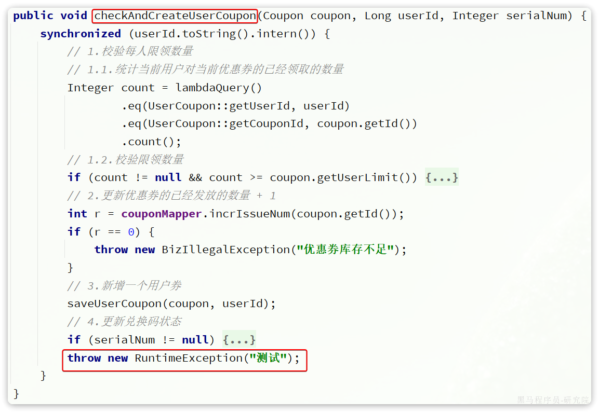

经过测试，发现虽然抛出了异常，但是库存、用户券都没有回滚！事务失效了！

### 3.4.1.分析原因

事务失效的原因有很多，接下来我们就逐一分析一些常见的原因：

#### 3.4.1.1.事务方法非public修饰

由于Spring的事务是基于AOP的方式结合动态代理来实现的。因此事务方法一定要是public的，这样才能便于被Spring做事务的代理和增强。

而且，在Spring内部也会有一个 `org.springframework.transaction.interceptor.AbstractFallbackTransactionAttributeSource`类，去检查事务方法的修饰符：

```java
@Nullable
 protected TransactionAttribute computeTransactionAttribute(
  Method method, @Nullable Class<?> targetClass) {
   // Don't allow non-public methods, as configured.
   if (allowPublicMethodsOnly() && 
  !Modifier.isPublic(method.getModifiers())) {
      return null;
   }

    // ... 略

   return null;
 }
```

所以，事务方法一定要被public修饰！

#### 3.4.1.2.非事务方法调用事务方法

有这样一段代码：

```java
@Service
public class OrderService {
    
    public void createOrder(){
        // ... 准备订单数据
        
        // 生成订单并扣减库存
        insertOrderAndReduceStock();
    }
    
    @Transactional
    public void insertOrderAndReduceStock(){
        // 生成订单
        insertOrder();
        // 扣减库存
        reduceStock();
    }
}
```

可以看到，`insertOrderAndReduceStock`方法是一个事务方法，肯定会被Spring事务管理。Spring会给`OrderService`类生成一个动态代理对象，对`insertOrderAndReduceStock`方法做增加，实现事务效果。

但是现在`createOrder`方法是一个非事务方法，在其中调用了`insertOrderAndReduceStock`方法，这个调用其实隐含了一个`this.`的前缀。也就是说，这里相当于是直接调用原始的OrderService中的普通方法，而非被Spring代理对象的代理方法。那事务肯定就失效了！

#### 3.4.1.3.事务方法的异常被捕获了

示例：

```java
 @Service
 public class OrderService {

    @Transactional
    public void createOrder(){
        // ... 准备订单数据
        // 生成订单
        insertOrder();
        // 扣减库存
        reduceStock();
    }

    private void reduceStock() {
        try {
            // ...扣库存
        } catch (Exception e) {
            // 处理异常
        }
    }

 }
```

在这段代码中，reduceStock方法内部直接捕获了Exception类型的异常，也就是说方法执行过程中即便出现了异常也不会向外抛出。

而Spring的事务管理就是要感知业务方法的异常，当捕获到异常后才会回滚事务。

现在事务被捕获，就会导致Spring无法感知事务异常，自然不会回滚，事务就失效了。

#### 3.4.1.4.事务异常类型不对

示例代码：

```java
@Service
 public class OrderService {

    @Transactional(rollbackFor = RuntimeException.class)
    public void createOrder() throws IOException {
        // ... 准备订单数据
        
        // 生成订单
        insertOrder();
        // 扣减库存
        reduceStock();

        throw new IOException();
    }
 }
```

Spring的事务管理默认感知的异常类型是`RuntimeException`，当事务方法内部抛出了一个`IOException`时，不会被Spring捕获，因此就不会触发事务回滚，事务就失效了。

因此，当我们的业务中会抛出RuntimeException以外的异常时，应该通过`@Transactional`注解中的`rollbackFor`属性来指定异常类型：

```java
@Transactional(rollbackFor = Exception.class)
```

#### 3.4.1.5.事务传播行为不对

示例代码：

```java
@Service
 public class OrderService {
    @Transactional
    public void createOrder(){
        // 生成订单
        insertOrder();
        // 扣减库存
        reduceStock();
        throw new RuntimeException("业务异常");
    }
    @Transactional
    public void insertOrder() {
    }
    @Transactional(propagation = Propagation.REQUIRES_NEW)
    public void reduceStock() {
    }
 }
```

在示例代码中，事务的入口是`createOrder()`方法，会开启一个事务，可以成为外部事务。在createOrder()方法内部又调用了`insertOrder()`方法和`reduceStock()`方法。这两个都是事务方法。

不过，`reduceStock()`方法的事务传播行为是`REQUIRES_NEW`，这会导致在进入`reduceStock()`方法时会创建一个新的事务，可以成为子事务。`insertOrder()`则是默认，因此会与`createOrder()`合并事务。

因此，当`createOrder`方法最后抛出异常时，只会导致`insertOrder`方法回滚，而不会导致`reduceStock`方法回滚，因为`reduceStock`是一个独立事务。

所以，一定要慎用传播行为，注意外部事务与内部事务之间的关系。

#### 3.4.1.6.没有被Spring管理

示例代码：

```java
//  @Service
 public class OrderService {
    @Transactional
    public void createOrder(){
        // 生成订单
        insertOrder();
        // 扣减库存
        reduceStock();
        throw new RuntimeException("业务异常");
    }
    @Transactional
    public void insertOrder() {
    }
    @Transactional
    public void reduceStock() {
    }
 }
```

这个示例属于比较低级的错误，`OrderService`类没有添加`@Service`注解，因此就没有被Spring管理。你在方法上添加的`@Transactional`注解根本不会有人帮你动态代理，事务自然失效。

当然，有同学会说，我不会犯这么低级的错误。这可不一定，有的时候你没有忘了加`@Service`注解，但是你在获取某个对象的时候，可能并不是获取的Spring管理的对象，有可能是其它方式创建的。这同样会导致事务失效。

### 3.4.2.解决方案

结合上节课的分析，大家应该能发现我们的事务失效的原因是什么了。

为了控制事务边界，我们改变了事务注解标记的位置，这就导致了**非事务方法调用了事务方法**。

怎么办？难道再把注解移回去？

这显然不合适，因为移回去就会导致并发安全问题。我们陷入了两难境地。

那么，有没有办法让这个事务再次生效呢？

答案是有的，既然事务失效的原因是方法内部调用走的是this，而不是代理对象。那我们只要**想办法获取代理对象**不就可以了嘛。

这里，我们可以借助AspectJ来实现。

1）引入AspectJ依赖：

```xml
<!--aspecj-->
<dependency>
    <groupId>org.aspectj</groupId>
    <artifactId>aspectjweaver</artifactId>
</dependency>
```

2）暴露代理对象

在启动类上添加注解，暴露代理对象：

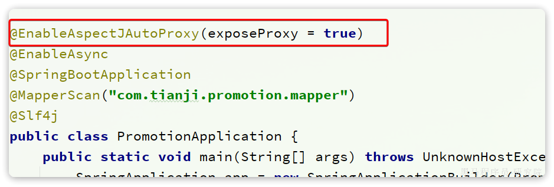

3）使用代理对象

最后，改造领取优惠券的代码，获取代理对象来调用事务方法：

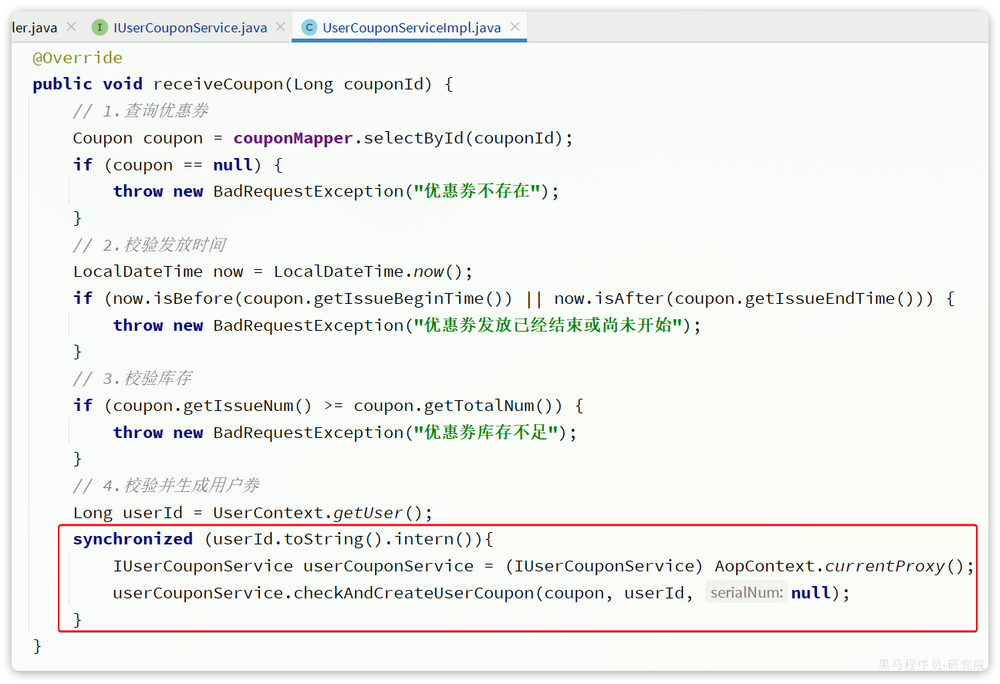

问题解决。

# 4.练习

## 4.1.查询我的优惠券

在个人中心的我的优惠券页面，需要查询出当前用户的所有优惠券。当然，这是一个分页查询，而且可以基于优惠券状态做过滤：

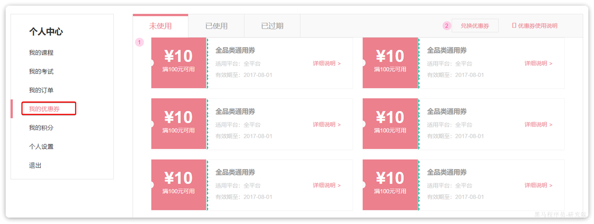

注意，这里不是查询优惠券（coupon）表，而是查询我的优惠券，也就是用户券表（user_coupon）

综上，结合Restful的风格，查询我的优惠券的接口规范如下：

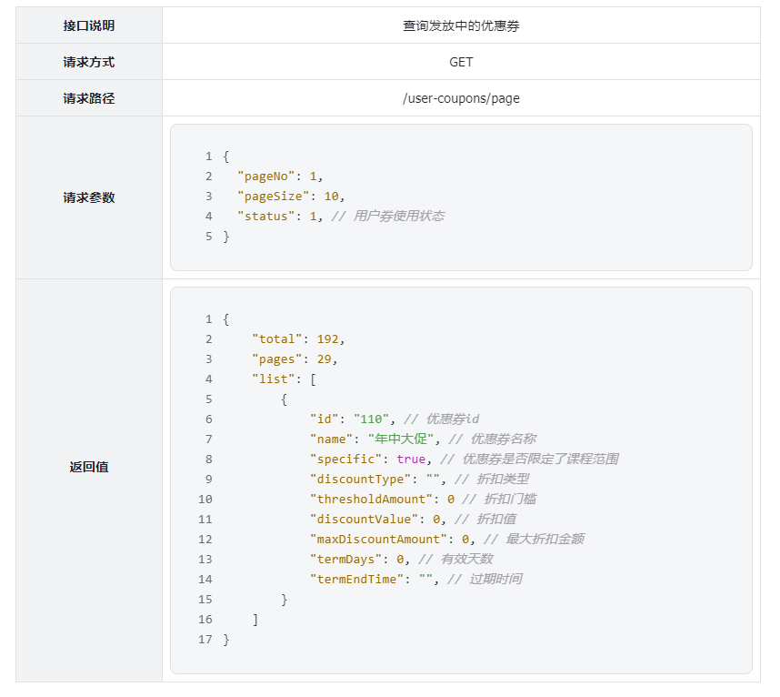

## 4.2.完善兑换优惠券功能

课堂上，我们解决了手动领取优惠券的并发安全问题。但是兑换码兑换方式却没有解决。

需求：大家参考课堂上的方案，对兑换码兑换优惠券的接口做改造，确保线程安全，事务有效。

## 4.3.优惠券过期提醒

优惠券发放给用户后，一定要被用户使用才有意义，才能起到该有的作用。因此，当用户领券以后，一定要及时提醒用户去使用，避免优惠券过期。

需求：自己设计一个方案，在优惠券即将过期前以短信方式提醒用户。

# 5.面试

**面试官：如何解决优惠券的超发问题？**

::: warning

答：超发、超卖问题往往是由于多线程的并发访问导致的。所以解决这个问题的手段就是加锁。可以采用悲观锁，也可以采用乐观锁。

如果并发量不是特别高，就使用悲观锁就可以了。不过性能会受到一定的影响。

如果并发相对较高，对性能有要求，那就可以选择使用乐观锁。

当然，乐观锁也有自己的问题，就是多线程竞争时，失败率比较高的问题。并行访问的N个线程只会有一个线程成功，其它都会失败。

所以，针对这个问题，再结合库存问题的特殊性，我们不一定要是有版本号或者CAS机制实现乐观锁。而是改进为在where条件中加上一个对库存的判断即可。

比如，在where条件中除了优惠券id以外，加上库存必须大于购买数量的条件。这样如果库存不足，where条件不成立，自然也会失败。

这样做借鉴了乐观锁的思想，在线程安全的情况下，保证了并发性能，同时也解决了乐观锁失败率较高的问题，一举多得。

:::

**面试官：Spring事务失效的情况碰到过吗？或者知不知道哪些情况会导致事务失效？**

::: warning

答：Spring事务失效的原因有很多，比如说：

- 事务方法不是public的
- 非事务方法调用事务方法
- 事务方法的异常被捕获了
- 事务方法抛出异常类型不对
- 事务传播行为使用错误
- Bean没有被Spring管理

等等。。

在我们项目中确实有碰到过，我想一想啊。

我记得是在优惠券业务中，一开始我们的优惠券只有一种领取方式，就是发放后展示在页面，让用户手动领取。领取的过程中有各种校验。那时候没碰到什么问题，项目也都正常运行。

后来产品提出了新的需求，要加一个兑换码兑换优惠券的功能。这个功能开发完以后就发现有时候会出现优惠券发放数量跟实际数量对不上的情况，就是实际发放的券总是比设定的要少。一开始一直找不到原因。

后来发现是某些情况下，在领取失败的时候，扣减的优惠券库存没有回滚导致的，也就是事务没有生效。自习排查后发现，原来是在实现兑换码兑换优惠券的时候，由于很多业务逻辑跟手动领取优惠券很像，所以就把其中的一些数据库操作抽取为一个公共方法，然后在两个业务中都调用。因为所有数据库操作都在这个共享的方法中嘛，所以就把事务注解放到了抽取的方法上。当时没有注意，这恰好就是在非事务方法中调用了事务方法，导致了事务失效。

:::

**面试官：在开发中碰到过什么疑难问题，最后是怎么解决的？**

::: warning

答：我想一下啊，问题肯定是碰到过的。

比如在开发优惠券功能的时候，优惠券有一个发放数量的限制，也就是库存。还有一个用户限量数量的限制，这个是设置优惠券的时候管理员配置的。

因此我们在用户领取优惠券的时候必须做库存校验、限领数量的校验。由于库存和领取数量都需要先查询统计，再做判断。因此在多线程时可能会发生并发安全问题。

其中库存校验其实是更新数据库中的已经发放的数量，因此可以直接基于乐观锁来解决安全问题。但领取数量不行，因为要临时统计当前用户已经领取了多少券，然后才能做判断。只能是采用悲观锁的方案。但是这样会影响性能。

所以为了提高性能，我们必须减少锁的范围。我们就把统计已经领取数量、判断、新增用户领券记录的这部分代码加锁，而且锁的对象是用户id。这样锁的范围就非常小了，业务的并发能力就有一定的提升。

想法是很好的，但是在实际测试的时候，我们发现尽管加了锁，但是还会出现用户超领的现象。比如限领2张，用户可能会领取3张、4张，甚至更多。也就是说并发安全问题并没有解决。

锁本身经过测试，肯定是没有问题的，所以一开始这个问题确实觉得挺诡异的。后来调试的时候发现，偶然发现，有的时候，当一个线程完成了领取记录的保存，另一个线程在统计领券数量时，依然统计不到这条记录。

这个时候猜测应该是数据库的事务隔离导致的，因为我们领取的整个业务外面加了事务，而加锁的是其中的限领数量校验的部分。因此业务结束时，会先释放锁，然后等整个业务结束，才会提交事务。这就导致在某些情况下，一个线程新增了领券记录，释放了锁；而另一个线程获取锁时，前一个线程事务尚未提交，因此读取不到未提交的领券记录。

为了解决这个问题，我们将事务的范围缩小，保证了事务先提交，再释放锁，最终线程安全问题不再发生了。

:::
