# day11-领取优惠券的优化

在昨天的学习中，我们已经实现了领取优惠券的功能，并且解决了多线程下的券超发的并发安全问题。不过，之前我们考虑的是单机模式下的多线程问题，解决的思路是基于Synchronized锁。

但是在集群模式下，传统的并发锁是否依然有效呢？因锁带来的性能损耗又该如何解决呢？今天我们就来思考并解决这些问题。

学习目标：

- 理解分布式锁的原理和使用场景
- 掌握Redisson的分布式锁用法
- 能实现基于注解的分布式锁
- 能利用MQ解决高并发写性能问题
- 了解Redis的LUA脚本的作用

# 1.分布式锁

## 1.1.集群下的锁失效问题

在昨天的学习中，我们使用了Synchronized锁来解决并发安全问题。同学们了解Synchronized锁的原理吗？

如果不懂的话，可以参考以下内容来查看：

https://www.bilibili.com/video/BV16J411h7Rd?p=76&vd_source=1ff0c1b434581723cf696ccc2f59ceaa

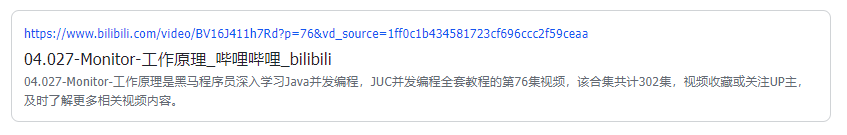

Synchronized中的重量级锁，底层就是基于**锁监视器（Monitor）**来实现的。简单来说就是锁对象头会指向一个锁监视器，而在监视器中则会记录一些信息，比如：

- _owner：持有锁的线程
- _recursions：锁重入次数

因此每一个锁对象，都会指向一个锁监视器，而**每一个锁监视器，同一时刻只能被一个线程持有**，这样就实现了互斥效果。但前提是，**多个线程使用的是同一把锁**。

比如有三个线程来争抢锁资源，线程1获取锁成功，如图所示：

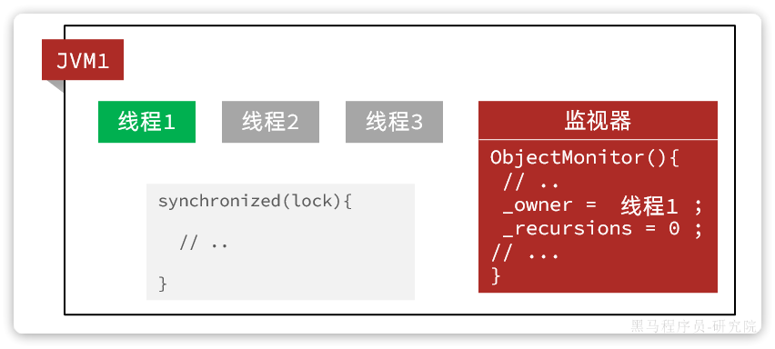

此时其它线程想要获取锁，会发现监视器中的_owner已经有值了，就会获取锁失败。由于咱们代码在锁对象是用户id的字符串常量，因此同一个用户肯定是同一把锁，线程是绝对安全的。

但问题来了，我们的服务将来肯定会多实例不是，形成集群。每一个实例都会有一个自己的JVM运行环境，因此即便是同一个用户，如果并发的发起了多个请求，由于**请求进入了多个JVM，就会出现多个锁对象（用户id对象），自然就有多个锁监视器**。此时就会出现每个JVM内部都有一个线程获取锁成功的情况，没有达到互斥的效果，并发安全问题就可能再次发生了：

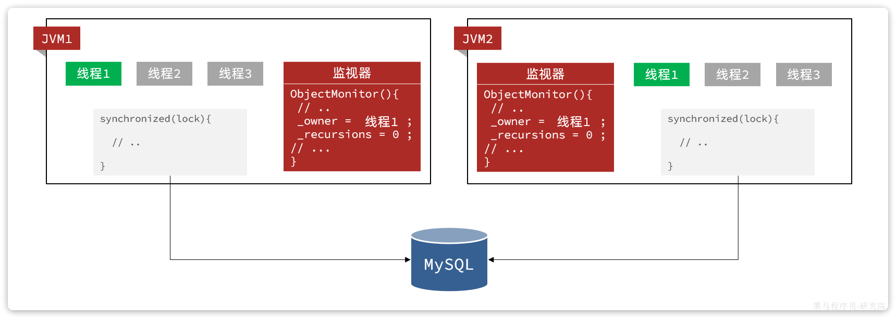

可见，在集群环境下，JVM提供的传统锁机制就不再安全了。

那么该如何解决这个问题呢？

显然，我们不能让每个实例去使用各自的JVM内部锁监视器，而是应该**在多个实例外部寻找一个锁监视器，多个实例争抢同一把锁**。

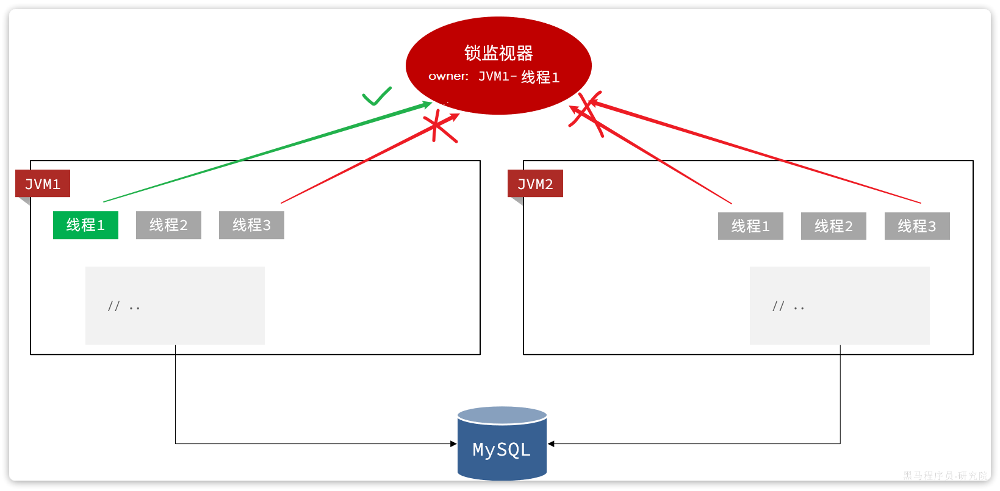

像这样的锁，就称为分布式锁。

分布式锁必须要满足的特征：

- 多JVM实例都可以访问
- 互斥

能满足上述特征的组件有很多，因此实现分布式锁的方式也非常多，例如：

- 基于MySQL
- 基于Redis
- 基于Zookeeper
- 基于ETCD

但目前使用最广泛的还应该是基于Redis的分布式锁。

## 1.2.简单分布式锁

Redis本身可以被任意JVM实例访问，同时Redis中的setnx命令具备互斥性，因此符合分布式锁的需求。不过实现分布式锁的时候还有一些细节需要考虑，绝不仅仅是setnx这么简单。

### 1.2.1.基本原理

Redis的setnx命令是对string类型数据的操作，语法如下：

```shell
# 给key赋值为value
SETNX key value
```

当前仅当key不存在的时候，setnx才能执行成功，并且返回1，其它情况都会执行失败，并且返回0.我们就可以认为返回值是1就是获取锁成功，返回值是0就是获取锁失败，实现互斥效果。

而当业务执行完成时，我们只需要删除这个key即可释放锁。这个时候其它线程又可以再次获取锁（执行setnx成功）了。

```bash
# 删除指定key，用来释放锁
DEL key
```

例如，我们用lock作为某个业务的锁的key，获取锁就执行下面命令：

```bash
# 获取锁，并记录持有锁的线程
SETNX lock thread1
```

假设说一开始lock不存在，有很多线程同时对lock执行setnx命令。由于Redis命令本身是串行执行的，也就是各个线程是串行依次执行。因此当第一个线程执行setnx时，会成功添加这个lock。但其余的线程会发现lock已经存在，自然就执行失败。自然就实现了互斥效果。

当业务执行完毕，直接删除lock，自然就释放锁了：

```bash
# 释放锁
DEL lock
```

不过我们要考虑一种极端情况，比如我们获取锁成功，还未释放锁呢当前实例突然宕机了！那么释放锁的逻辑自然就永远不会被执行，这样lock就永远存在，再也不会有其它线程获取锁成功了！出现了死锁问题。

怎么办？

我们可以利用Redis的KEY过期时间机制，在获取锁时给锁添加一个超时时间：

```bash
# 获取锁，并记录持有锁的线程
SETNX lock thread1
# 设置过期时间，避免死锁
EXPIRE lock 20
```

这里我们设置超时时间为20秒，远超任务执行时间。当业务正常执行时，这个过期时间不起作用，我们通过DEL命令来释放锁。

但是如果当前服务实例宕机，DEL无法执行。但由于我们设置了20秒的过期时间，当超过这个时间时，锁会因为过期被删除，因此就等于释放锁了，从而避免了死锁问题。这种策略就是超时释放锁策略。

但新的问题来了，SETNX和EXPIRE是两条命令，如果我执行完SETNX，还没来得急执行EXPIRE时服务已经宕机了，这样加锁成功，但锁超时时间依然没能设置！死锁问题岂不是再次发生了？！

所以，为了解决这个问题，我们必须保证SETNX和EXPIRE两个操作的原子性。事实上，Redis中的set命令就能同时实现setnx和expire的效果：

```bash
# NX 等同于SETNX lock thread1效果；
# EX 20 等同于 EXPIRE lock 20效果
SET lock thread1 NX EX 20
```

综上，利用Redis实现的简单分布式锁流程如下：

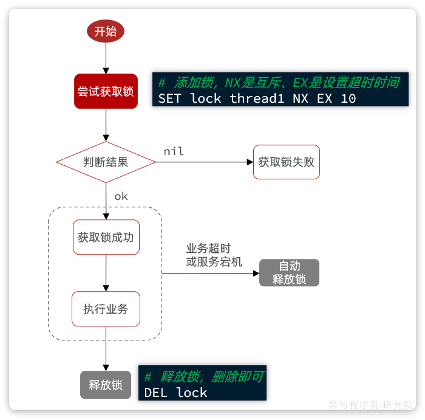

### 1.2.2.代码实现

在tj-promotion的util包下创建一个Redis锁类：

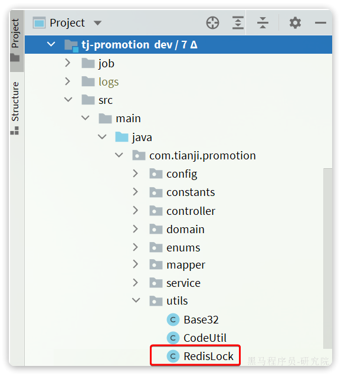

内容如下：

```java
package com.tianji.promotion.utils;

import com.tianji.common.utils.BooleanUtils;
import lombok.RequiredArgsConstructor;
import org.springframework.data.redis.core.StringRedisTemplate;

import java.util.concurrent.TimeUnit;

@RequiredArgsConstructor
public class RedisLock {

    private final String key;
    private final StringRedisTemplate redisTemplate;

    /**
     * 尝试获取锁
     * @param leaseTime 锁自动释放时间
     * @param unit 时间单位
     * @return 是否获取成功，true:获取锁成功;false:获取锁失败
     */
    public boolean tryLock(long leaseTime, TimeUnit unit){
        // 1.获取线程名称
        String value = Thread.currentThread().getName();
        // 2.获取锁
        Boolean success = redisTemplate.opsForValue().setIfAbsent(key, value, leaseTime, unit);
        // 3.返回结果
        return BooleanUtils.isTrue(success);
    }

    /**
     * 释放锁
     */
    public void unlock(){
        redisTemplate.delete(key);
    }
}
```

### 1.2.3.改造业务代码

原本基于Synchronized的代码：


利用RedisLock替代原本的synchronized锁：

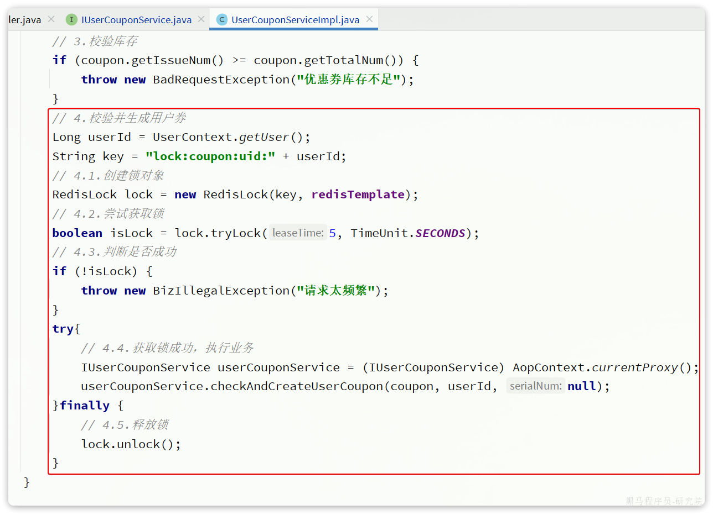

经测试，确实解决了集群下的并发安全问题。

## 1.3.分布式锁的问题

基于setnx的分布式锁实现起来并不复杂，不过却存在一些问题。

### 1.3.1.锁误删问题

第一个问题就是锁误删问题，目前释放锁的操作是基于DEL，但是在极端情况下会出现问题。

例如，有线程1获取锁成功，并且执行完任务，正准备释放锁：

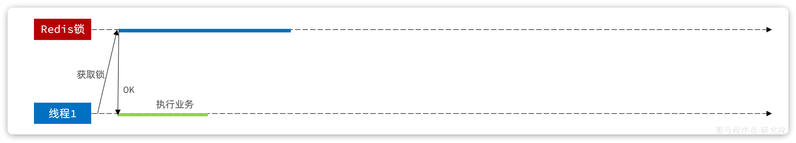

但是因为某种原因导致释放锁的操作被阻塞了，直到锁被超时释放：

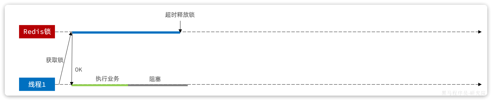

就在此时，有一个新的线程2来尝试获取锁。因为线程1的锁被超时释放，因此线程2是可以获取锁成功的：

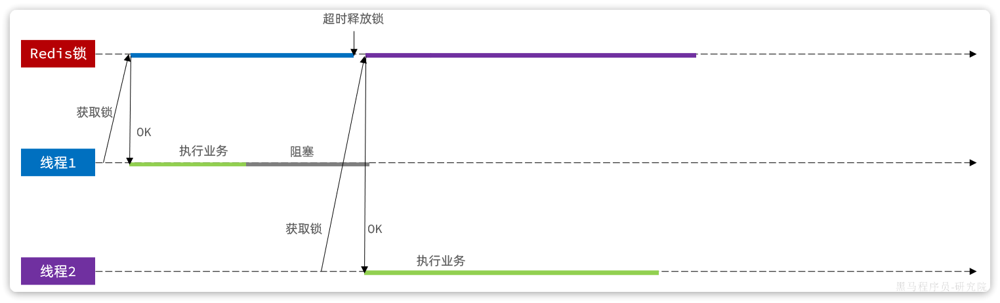

而就在此时，线程1醒来，继续执行释放锁的操作，也就是DEL.结果就把线程2的锁给删除了：

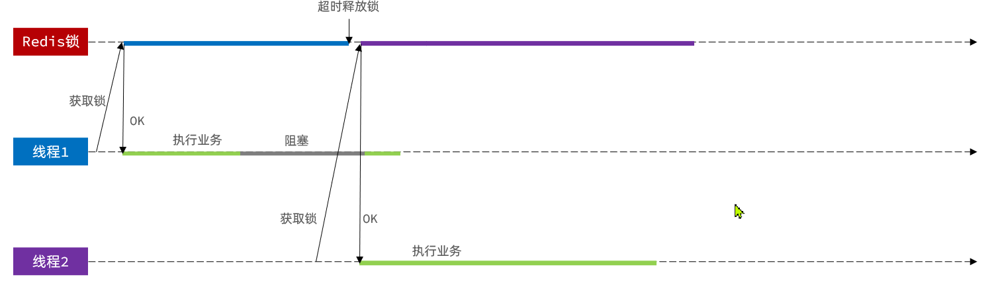

然而此时线程2还在执行任务，如果有其它线程再来获取锁，就会认为无人持有锁从而获取锁成功，于是多个线程再次并行执行，并发安全问题就可能再次发生了：

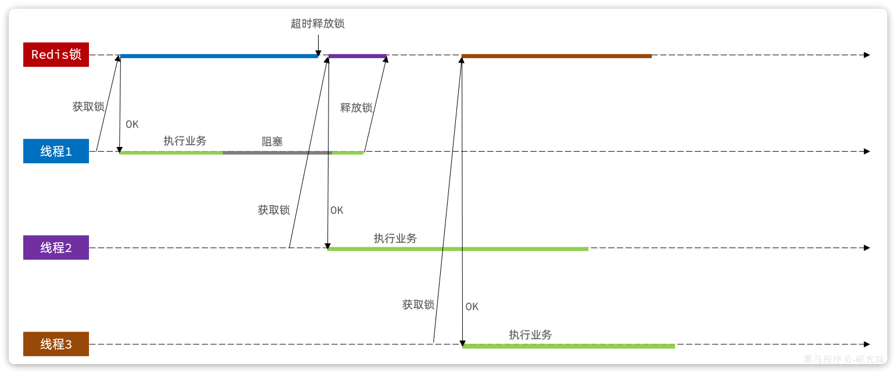

解决思路：

还记得我们set时存入了什么吗？

```bash
SET lock thread1 NX EX 10
```

我们会将持有锁的线程存入lock中。因此，我们应该在删除锁之前判断当前锁的中保存的是否是当前线程标示，如果不是则证明不是自己的锁，则不删除；如果锁标示是当前线程，则可以删除：

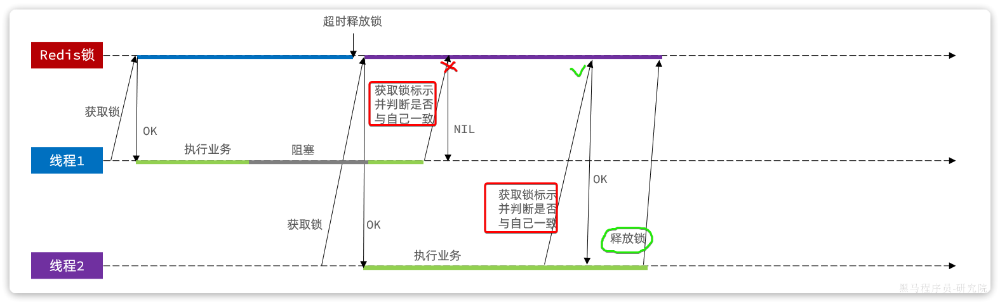

综上，分布式锁的实现逻辑就变化了：

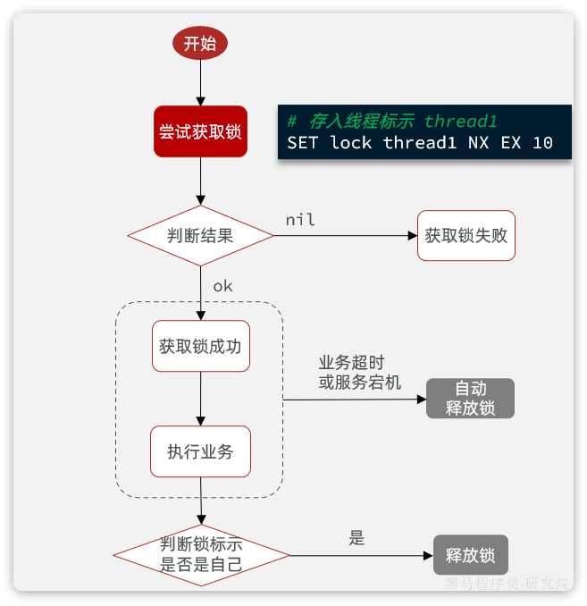

### 1.3.2.超时释放问题

加上了锁标示判断逻辑，可以避免大多数情况下的锁误删问题，但是还有一种极端情况依然会存在误删可能。

例如，线程1获取锁成功，并且执行业务完成，并且也判断了锁标示，确实与自己一致：

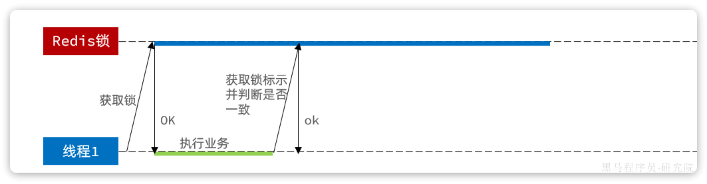

接下来，线程1应该去释放自己的锁了，可就在此时发生了阻塞！直到锁超时释放：

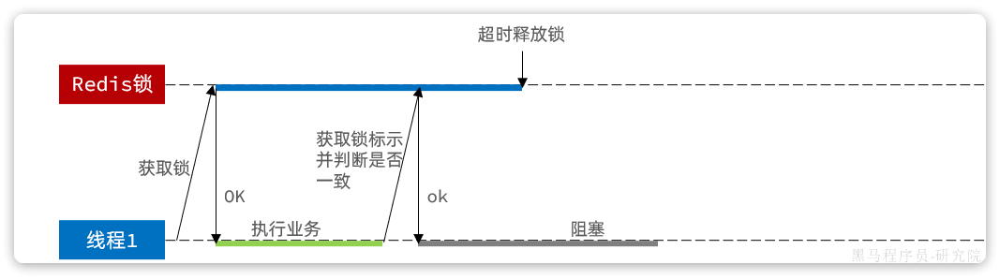

此时，如果有线程2来获取锁，肯定可以获取锁成功：

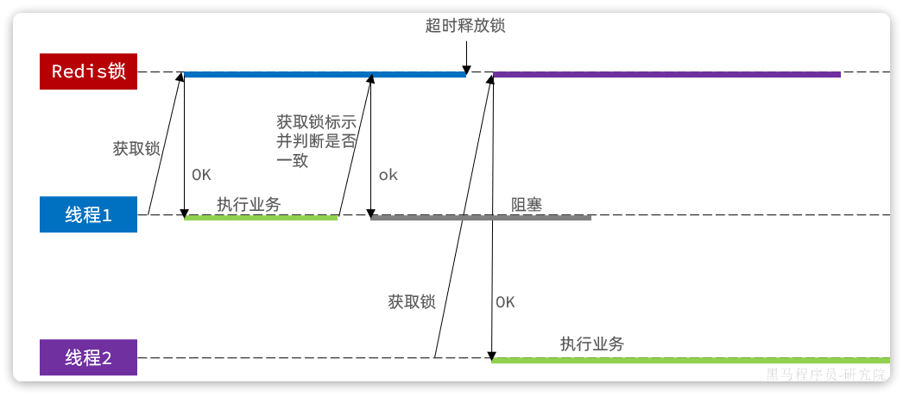

就在线程2获取锁成功后，线程1从阻塞中醒来，继续释放锁。由于在阻塞之前已经完成了锁标示判断，现在就无需判断而是直接删除锁，结果就把线程2的锁删除了：

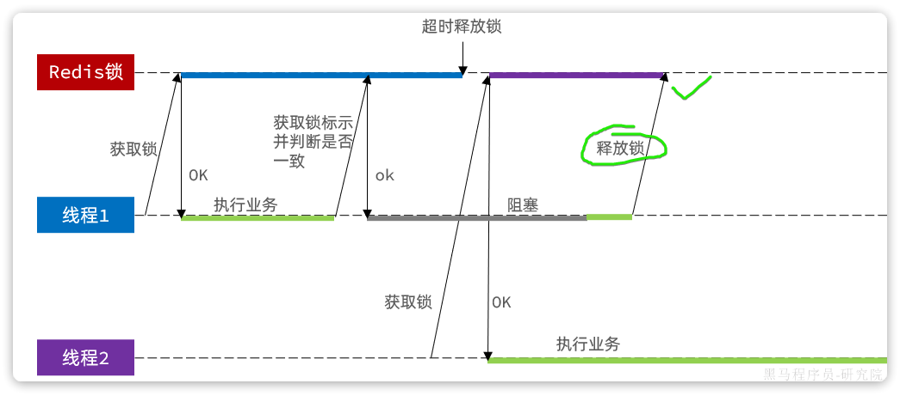

有一次发生了误删问题！！尴尬不

总结一下，误删的原因归根结底是因为什么？

- **超时释放**
- 判断锁标示、删除锁两个动作不是**原子操作**

超时释放不能不做，因为要避免服务宕机导致的死锁，必须加超时时间。但是加了超时时间又出现了误删问题。怎么办？

操作锁的多行命令又该如何确保原子性？

### 1.3.3.其它问题

除了上述问题以外，分布式锁还会碰到一些其它问题：

- 锁的重入问题：同一个线程多次获取锁的场景，目前不支持，可能会导致死锁
- 锁失败的重试问题：获取锁失败后要不要重试？目前是直接失败，不支持重试
- Redis主从的一致性问题：由于主从同步存在延迟，当线程在主节点获取锁后，从节点可能未同步锁信息。如果此时主宕机，会出现锁失效情况。此时会有其它线程也获取锁成功。从而出现并发安全问题。
- ...

当然，上述问题并非无法解决，只不过会比较麻烦。例如：

- **原子性**问题：可以利用Redis的LUA脚本来编写锁操作，确保原子性
- **超时**问题：利用WatchDog（看门狗）机制，获取锁成功时开启一个定时任务，在锁到期前自动续期，避免超时释放。而当服务宕机后，WatchDog跟着停止运行，不会导致死锁。
- **锁重入**问题：可以模拟Synchronized原理，放弃setnx，而是利用Redis的Hash结构来记录锁的**持有者**以及**重入次数**，获取锁时重入次数+1，释放锁是重入次数-1，次数为0则锁删除
- 主从**一致性**问题：可以利用Redis官网推荐的RedLock机制来解决

这些解决方案实现起来比较复杂，因此我们通常会使用一些开源框架来实现分布式锁，而不是自己来编码实现。目前对这些解决方案实现的比较完善的一个第三方组件：**Redisson**

因此，我们只要会使用Redisson，即可解决上述问题，无需自己动手编码了。

注：如果仅仅是面向开发，大家会用Redisson即可。但是如果想在面试时给自己加分，也可以去研究一下Redisson的底层实现。

Redisson的源码解析可以参考黑马的视频：

https://www.bilibili.com/video/BV1cr4y1671t?p=66&vd_source=1ff0c1b434581723cf696ccc2f59ceaa


## 1.4.Redisson

Redisson官网：

https://redisson.org/

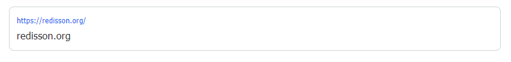

### 1.4.1.介绍

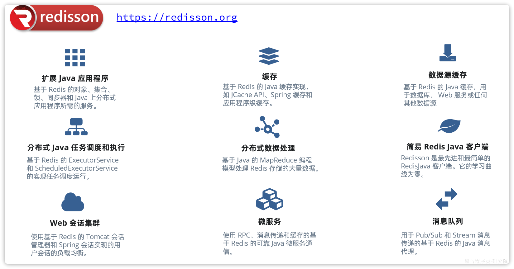

Redisson是一个基于Redis的工具包，功能非常强大。将JDK中很多常见的队列、锁、对象都基于Redis实现了对应的分布式版本。

例如：

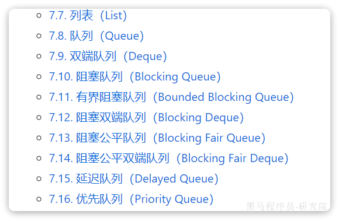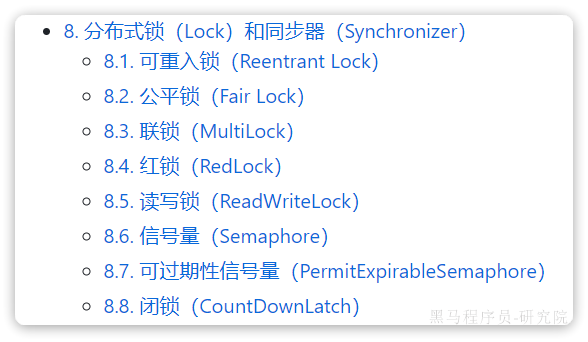

### 1.4.2.快速入门

首先引入依赖：

```xml
<!--redisson-->
<dependency>
    <groupId>org.redisson</groupId>
    <artifactId>redisson</artifactId>
</dependency>
```

然后是配置：

```java
 @Configuration
 public class RedisConfig {
    @Bean
    public RedissonClient redissonClient() {
        // 配置类
        Config config = new Config();
        // 添加redis地址，这里添加了单点的地址，也可以使用config.useClusterServers()添加集群地址 
        config.useSingleServer()
            .setAddress("redis://192.168.150.101:6379")
            .setPassowrd("123321");
        // 创建客户端
        return Redisson.create(config);
    }
 }
```

最后是基本用法：

```java
@Autowired
 private RedissonClient redissonClient;

 @Test
 void testRedisson() throws InterruptedException {
    // 1.获取锁对象，指定锁名称
    RLock lock = redissonClient.getLock("anyLock");
    try {
        // 2.尝试获取锁，参数：waitTime、leaseTime、时间单位
        boolean isLock = lock.tryLock(1, 10, TimeUnit.SECONDS);
        if (!isLock) {
            // 获取锁失败处理 ..
        } else {
            // 获取锁成功处理
        }
    } finally {
        // 4.释放锁
        lock.unlock();
    }
 }
```

利用Redisson获取锁时可以传3个参数：

- waitTime：获取锁的等待时间。当获取锁失败后可以多次重试，直到waitTime时间耗尽。waitTime默认-1，即失败后立刻返回，不重试。
- leaseTime：锁超时释放时间。默认是30，同时会利用WatchDog来不断更新超时时间。需要注意的是，如果手动设置leaseTime值，会导致WatchDog失效。
- TimeUnit：时间单位

### 1.4.3.项目集成

其实在咱们天机学堂项目中，在`tj-common`模块已经完成了Redisson的基础配置：

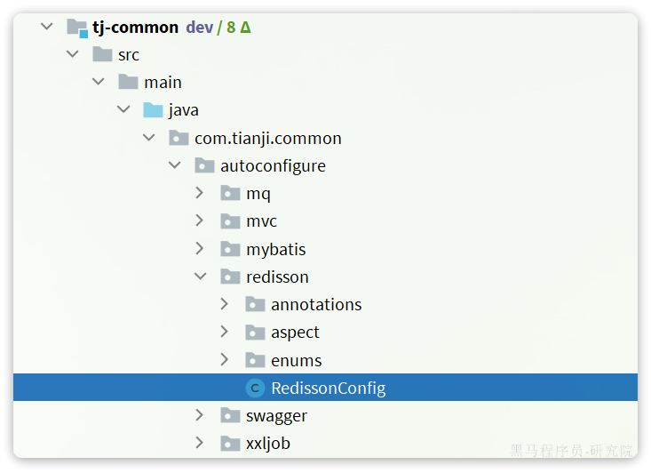

其中的一些关键配置：

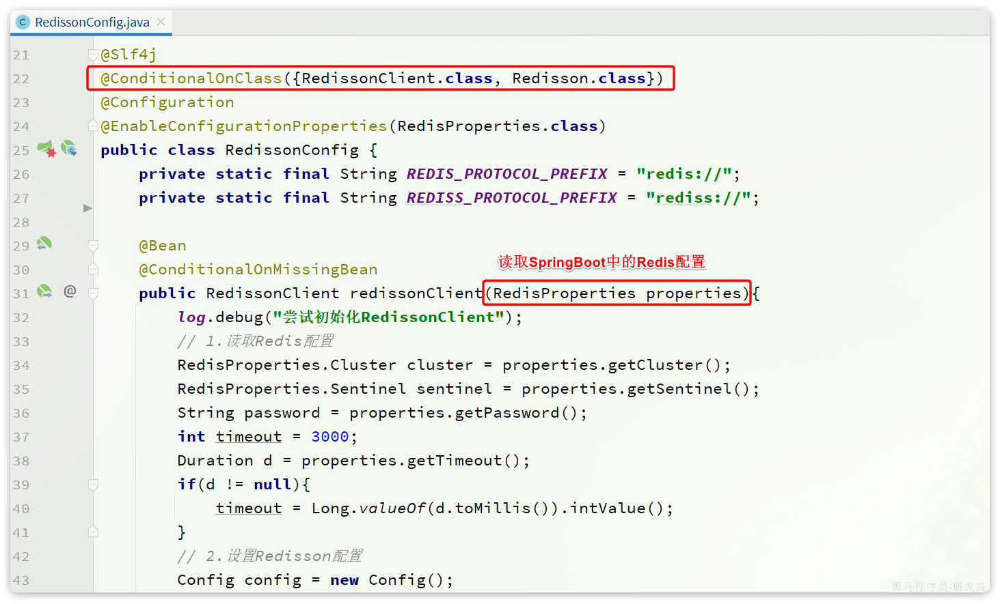

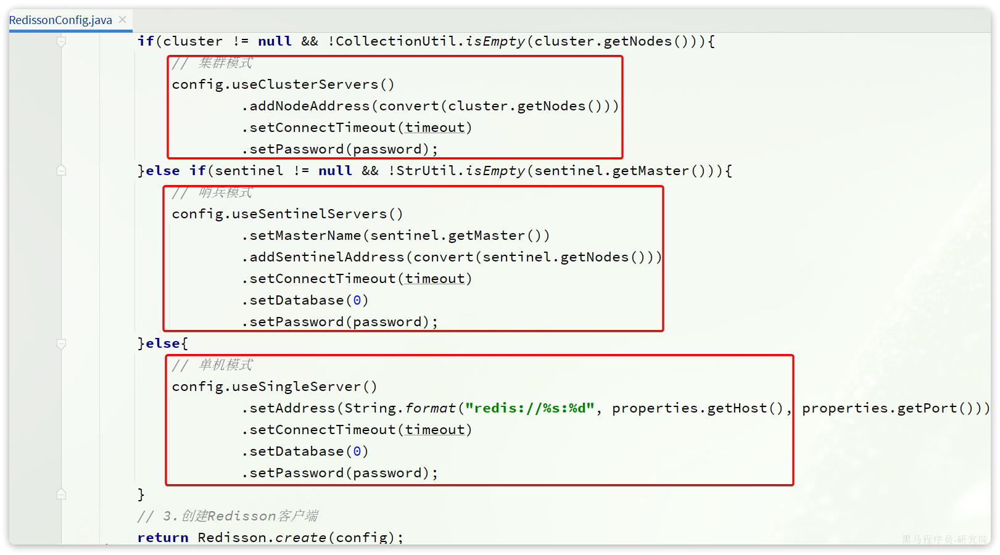

几个关键点：

- 这个配置上添加了条件注解`@ConditionalOnClass({RedissonClient.`**`class`**`, Redisson.`**`class`**`})`  也就是说，只要引用了tj-common，并且引用了Redisson依赖，这套配置就会生效。不引入Redisson依赖，配置自然不会生效，从而实现按需引入。
- RedissonClient的配置无需自定义Redis地址，而是直接基于SpringBoot中的Redis配置即可。而且不管是Redis单机、Redis集群、Redis哨兵模式都可以支持

所以，在微服务中应用的步骤：

- 引入tj-common、Redisson依赖
- 注入RedissonClient，使用分布式锁

应用到项目中：

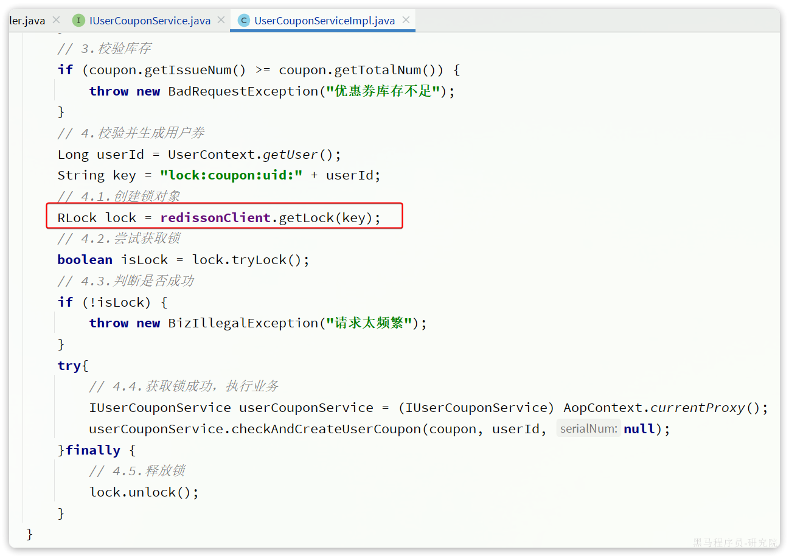

## 1.5.通用分布式锁组件

Redisson的分布式锁使用并不复杂，基本步骤包括：

- 1）创建锁对象
- 2）尝试获取锁
- 3）处理业务
- 4）释放锁

但是，除了第3步以外，其它都是非业务代码，对业务的侵入较多：

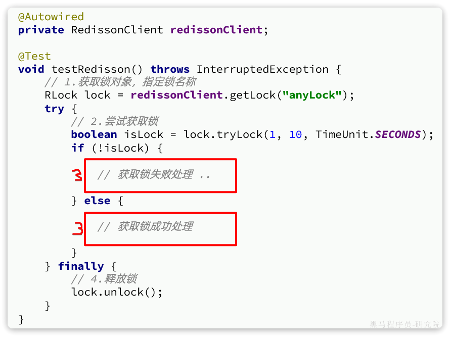

可以发现，非业务代码格式固定，每次获取锁总是在重复编码。我们可不可以对这部分代码进行抽取和简化呢？

### 1.5.1.实现思路分析

要优化这部分代码，需要通过整个流程来分析：

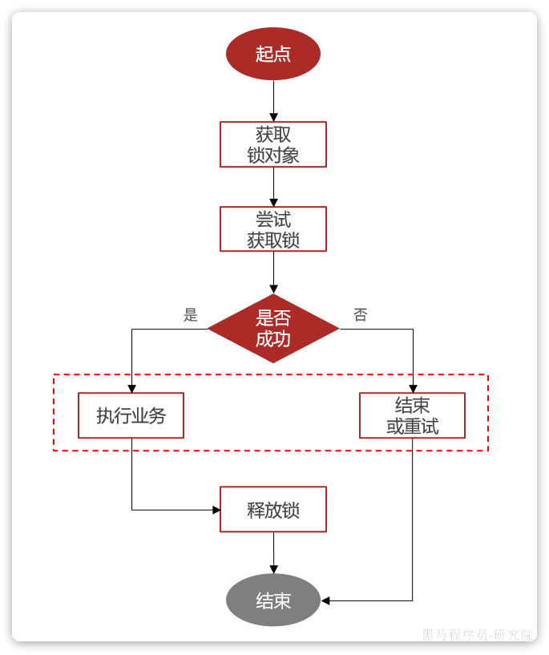

可以发现，只有红框部分是业务功能，业务前、后都是固定的锁操作。既然如此，我们完全可以基于AOP的思想，**将业务部分作为切入点，将业务前后的锁操作作为环绕增强**。

但是，我们该如何标记这些切入点呢？

不是每一个service方法都需要加锁，因此我们不能直接基于类来确定切入点；另外，需要加锁的方法可能也较多，我们不能基于方法名作为切入点，这样太麻烦。因此，最好的办法是把加锁的方法给标记出来，利用标记来确定切入点。如何标记呢？

最常见的办法就是基于**注解**来标记了。同时，加锁时还有一些参数，比如：锁的key名称、锁的waitTime、releaseTime等等，都可以基于注解来传参。

因此，注解的核心作用是两个：

- 标记切入点
- 传递锁参数

综上，我们计划利用注解来标记切入点，传递锁参数。同时利用AOP环绕增强来实现加锁、释放锁等操作。

### 1.5.2.定义注解

注解本身起到标记作用，同时还要带上锁参数：

- 锁名称
- 锁等待时间
- 锁超时时间
- 时间单位

同样定义在util包：

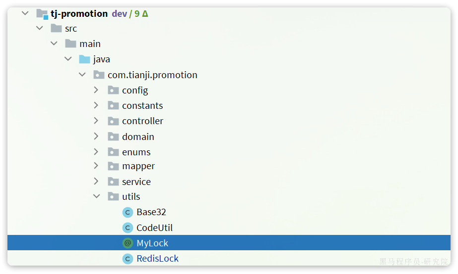

代码如下：

```java
package com.tianji.promotion.utils;

import java.lang.annotation.ElementType;
import java.lang.annotation.Retention;
import java.lang.annotation.RetentionPolicy;
import java.lang.annotation.Target;
import java.util.concurrent.TimeUnit;

@Retention(RetentionPolicy.RUNTIME)
@Target(ElementType.METHOD)
public @interface MyLock {
    String name();

    long waitTime() default 1;

    long leaseTime() default -1;

    TimeUnit unit() default TimeUnit.SECONDS;
}
```

### 1.5.3.定义切面

接下来，我们定义一个环绕增强的切面，实现加锁、释放锁：

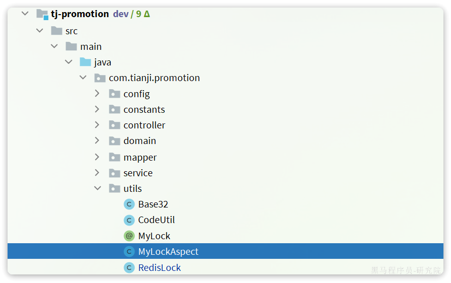

代码实现如下：

```java
package com.tianji.promotion.utils;

import lombok.RequiredArgsConstructor;
import org.aspectj.lang.ProceedingJoinPoint;
import org.aspectj.lang.annotation.Around;
import org.aspectj.lang.annotation.Aspect;
import org.redisson.api.RLock;
import org.redisson.api.RedissonClient;
import org.springframework.stereotype.Component;

@Component
@Aspect
@RequiredArgsConstructor
public class MyLockAspect implements Ordered{

    private final RedissonClient redissonClient;

    @Around("@annotation(myLock)")
    public Object tryLock(ProceedingJoinPoint pjp, MyLock myLock) throws Throwable {
        // 1.创建锁对象
        RLock lock = redissonClient.getLock(myLock.name());
        // 2.尝试获取锁
        boolean isLock = lock.tryLock(myLock.waitTime(), myLock.leaseTime(), myLock.unit());
        // 3.判断是否成功
        if(!isLock) {
            // 3.1.失败，快速结束
            throw new BizIllegalException("请求太频繁");
        }
        try {
            // 3.2.成功，执行业务
            return pjp.proceed();
        } finally {
            // 4.释放锁
            lock.unlock();
        }
    }
    
    @Override
    public int getOrder() {
        return 0;
    }
}
```

::: warning

注意，Spring中的AOP切面有很多，会按照Order排序，按照Order值从小到大依次执行。Spring事务AOP的order值是Integer.MAX_VALUE，优先级最低。

我们的分布式锁一定要先于事务执行，因此，我们的切面一定要实现Ordered接口，指定order值小于Integer.MAX_VALUE即可。

:::

### 1.5.4.使用锁

定义好了锁注解和切面，接下来就可以改造业务了：

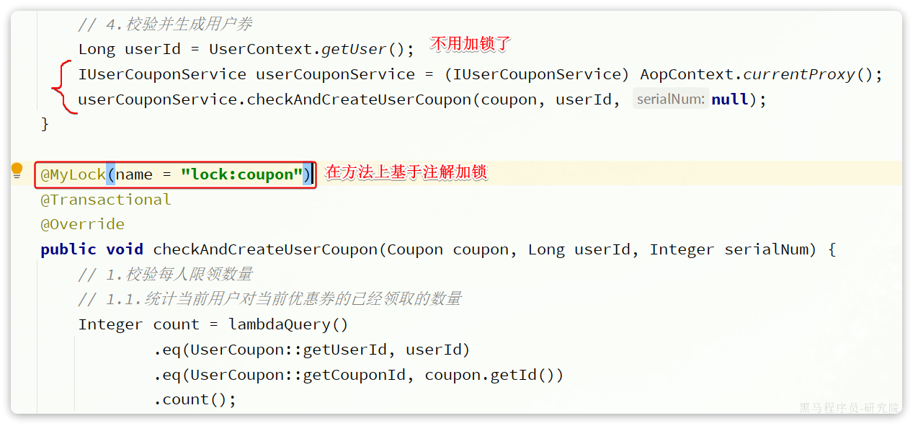

可以看到，业务中无需手动编写加锁、释放锁的逻辑了，没有任何业务侵入，使用起来也非常优雅。

不过呢，现在还存在几个问题：

- Redisson中锁的种类有很多，目前的代码中把锁的类型写死了
- Redisson中获取锁的逻辑有多种，比如获取锁失败的重试策略，目前都没有设置
- 锁的名称目前是写死的，并不能根据方法参数动态变化

所以呢，我们接下来还要对锁的实现进行优化，注意解决上述问题。

### 1.5.5.工厂模式切换锁类型

 Redisson中锁的类型有多种，例如：

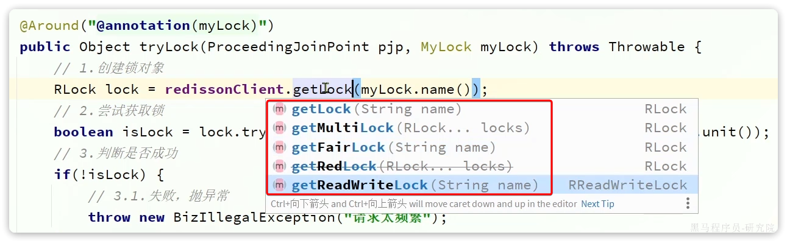

因此，我们不能在切面中把锁的类型写死，而是交给用户自己选择锁类型。

那么问题来了，如何让用户选择锁类型呢？

锁的类型虽然有多种，但类型是有限的几种，完全可以通过**枚举**定义出来。然后把这个枚举作为`MyLock`注解的参数，交给用户去选择自己要用的类型。

而在切面中，我们则需要根据用户选择的锁类型，创建对应的锁对象即可。但是这个逻辑不能通过`if-else`来实现，太low了。

这里我们的需求是根据用户选择的锁类型，创建不同的锁对象。有一种设计模式刚好可以解决这个问题：**简单工厂模式**。

#### 1.5.5.1.锁类型枚举

我们首先定义一个锁类型枚举：

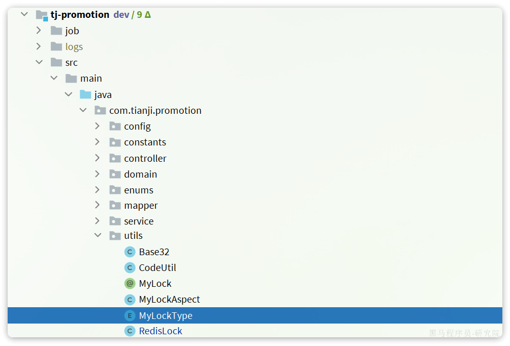

具体代码：

```java
public enum MyLockType {
    RE_ENTRANT_LOCK, // 可重入锁
    FAIR_LOCK, // 公平锁
    READ_LOCK, // 读锁
    WRITE_LOCK, // 写锁
    ;
}
```

然后在自定义注解中添加锁类型这个参数：

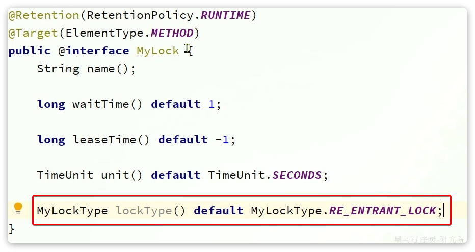

#### 1.5.5.2.锁对象工厂

然后定义一个锁工厂，用于根据锁类型创建锁对象：

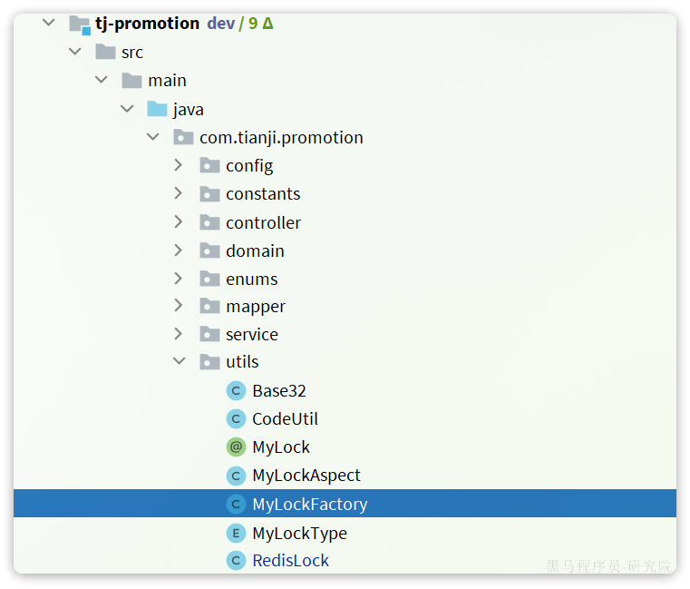

具体代码：

```java
package com.tianji.promotion.utils;

import org.redisson.api.RLock;
import org.redisson.api.RedissonClient;
import org.springframework.stereotype.Component;

import java.util.EnumMap;
import java.util.Map;
import java.util.function.Function;

import static com.tianji.promotion.utils.MyLockType.*;

@Component
public class MyLockFactory {

    private final Map<MyLockType, Function<String, RLock>> lockHandlers;

    public MyLockFactory(RedissonClient redissonClient) {
        this.lockHandlers = new EnumMap<>(MyLockType.class);
        this.lockHandlers.put(RE_ENTRANT_LOCK, redissonClient::getLock);
        this.lockHandlers.put(FAIR_LOCK, redissonClient::getFairLock);
        this.lockHandlers.put(READ_LOCK, name -> redissonClient.getReadWriteLock(name).readLock());
        this.lockHandlers.put(WRITE_LOCK, name -> redissonClient.getReadWriteLock(name).writeLock());
    }

    public RLock getLock(MyLockType lockType, String name){
        return lockHandlers.get(lockType).apply(name);
    }
}
```

::: warning

说明：

- MyLockFactory内部持有了一个Map，key是锁类型枚举，值是创建锁对象的Function。注意这里不是存锁对象，因为锁对象必须是多例的，不同业务用不同锁对象；同一个业务用相同锁对象。
- MyLockFactory内部的Map采用了`EnumMap`。只有当Key是枚举类型时可以使用`EnumMap`，其底层不是hash表，而是简单的数组。由于枚举项数量固定，因此这个数组长度就等于枚举项个数，然后按照枚举项序号作为角标依次存入数组。这样就能根据枚举项序号作为角标快速定位到数组中的数据。

:::

#### 1.5.5.3.改造切面代码

我们将锁对象工厂注入MyLockAspect，然后就可以利用工厂来获取锁对象了：

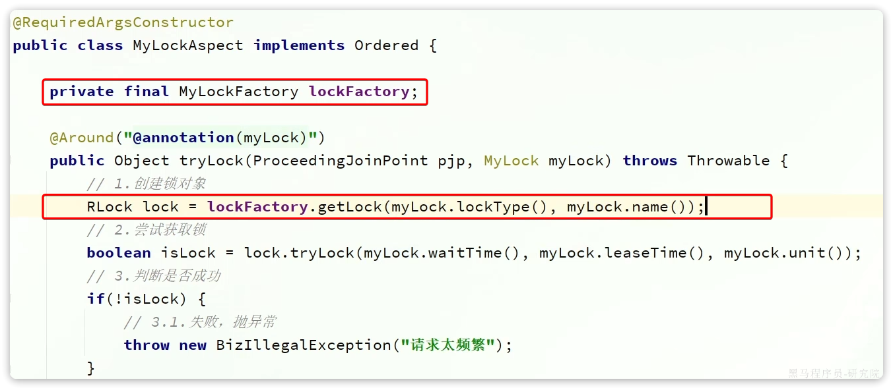

此时，在业务中，就能通过注解来指定自己要用的锁类型了：

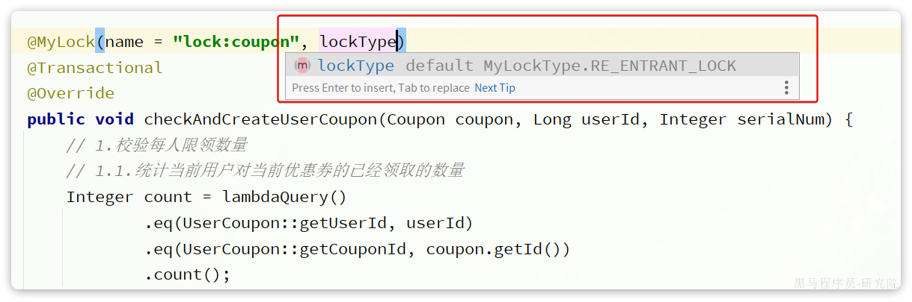

### 1.5.6.锁失败策略

多线程争抢锁，大部分线程会获取锁失败，而失败后的处理方案和策略是多种多样的。目前，我们获取锁失败后就是直接抛出异常，没有其它策略，这与实际需求不一定相符。

#### 1.5.6.1.策略分析

接下来，我们就分析一下锁失败的处理策略有哪些。

大的方面来说，获取锁失败要从两方面来考虑：

- 获取锁失败是否要重试？有三种策略：
  - **不重试**，对应API：`lock.tryLock(0, 10, SECONDS)`，也就是waitTime小于等于0
  - **有限次数重试**：对应API：`lock.tryLock(5, 10, SECONDS)`，也就是waitTime大于0，重试一定waitTime时间后结束
  - **无限重试**：对应API `lock.lock(10, SECONDS) `, lock就是无限重试
- 重试失败后怎么处理？有两种策略：
  - **直接结束**
  - **抛出异常**

对应的API和策略名如下：

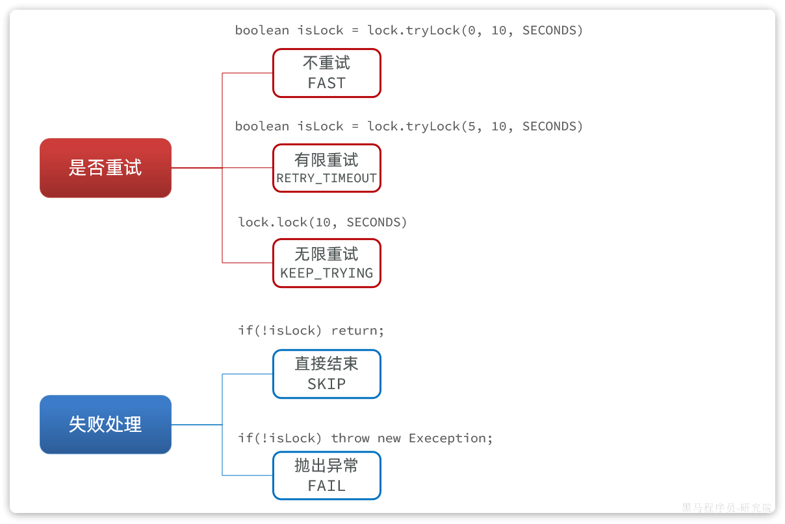

重试策略 + 失败策略组合，总共以下几种情况：

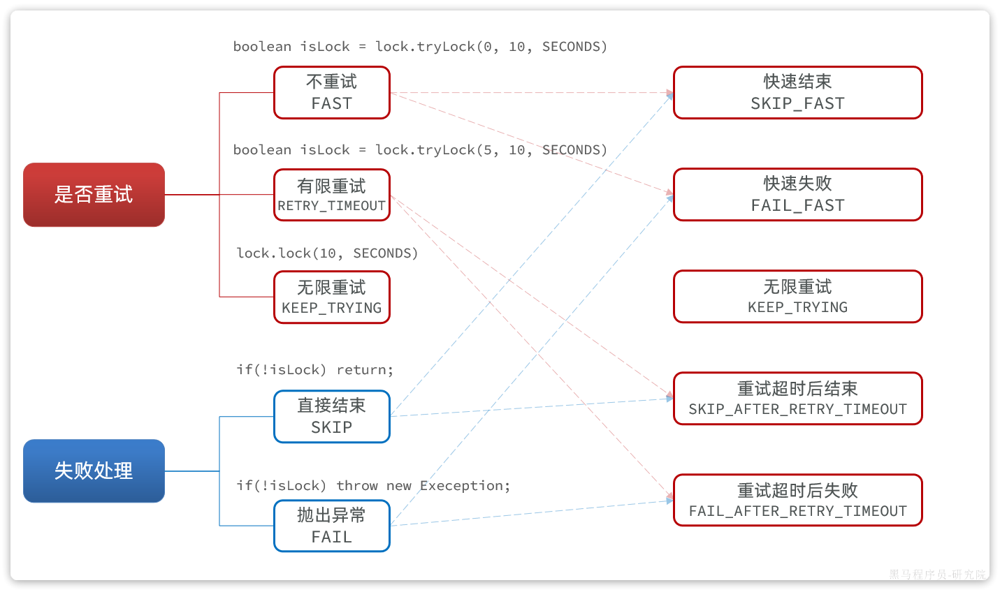

那么该如何用代码来表示这些失败策略，并让用户自由选择呢？

相信大家应该能想到一种设计模式：**策略模式**。同时，我们还需要定义一个失败策略的**枚举。**在MyLock注解中定义这个枚举类型的参数，供用户选择。

::: warning

注：

一般的策略模式大概是这样：

- 定义策略接口
- 定义不同策略实现类
- 提供策略工厂，便于根据策略枚举获取不同策略实现

而在策略比较简单的情况下，我们完全可以**用枚举代替策略工厂**，简化策略模式。

:::

综上，我们可以定义一个基于枚举的策略模式，简化开发。

#### 1.5.6.2.策略实现

我们定义一个失败策略枚举：

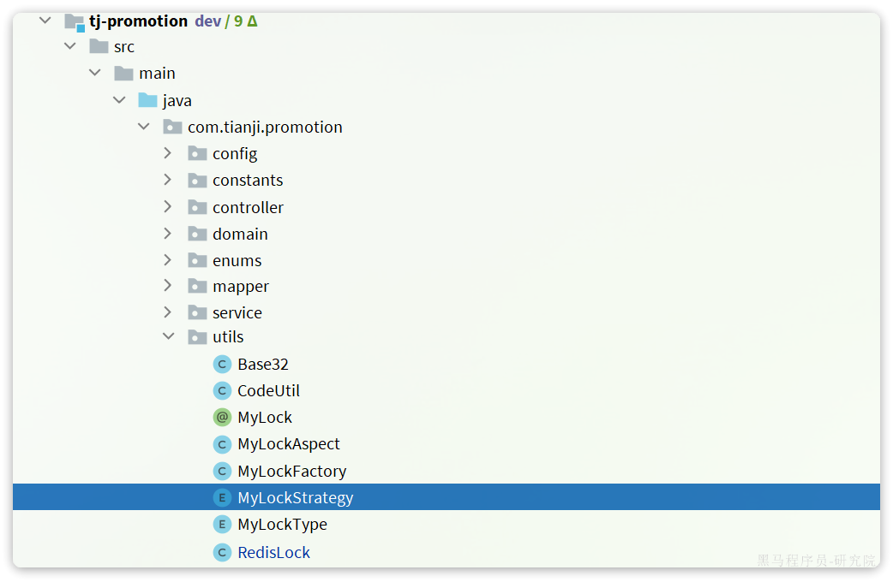

然后直接将失败策略定义到枚举中：

```java
package com.tianji.promotion.utils;

import com.tianji.common.exceptions.BizIllegalException;
import org.redisson.api.RLock;

public enum MyLockStrategy {
    SKIP_FAST(){
        @Override
        public boolean tryLock(RLock lock, MyLock prop) throws InterruptedException {
            return lock.tryLock(0, prop.leaseTime(), prop.unit());
        }
    },
    FAIL_FAST(){
        @Override
        public boolean tryLock(RLock lock, MyLock prop) throws InterruptedException {
            boolean isLock = lock.tryLock(0, prop.leaseTime(), prop.unit());
            if (!isLock) {
                throw new BizIllegalException("请求太频繁");
            }
            return true;
        }
    },
    KEEP_TRYING(){
        @Override
        public boolean tryLock(RLock lock, MyLock prop) throws InterruptedException {
            lock.lock( prop.leaseTime(), prop.unit());
            return true;
        }
    },
    SKIP_AFTER_RETRY_TIMEOUT(){
        @Override
        public boolean tryLock(RLock lock, MyLock prop) throws InterruptedException {
            return lock.tryLock(prop.waitTime(), prop.leaseTime(), prop.unit());
        }
    },
    FAIL_AFTER_RETRY_TIMEOUT(){
        @Override
        public boolean tryLock(RLock lock, MyLock prop) throws InterruptedException {
            boolean isLock = lock.tryLock(prop.waitTime(), prop.leaseTime(), prop.unit());
            if (!isLock) {
                throw new BizIllegalException("请求太频繁");
            }
            return true;
        }
    },
    ;

    public abstract boolean tryLock(RLock lock, MyLock prop) throws InterruptedException;
}
```

然后，在MyLock注解中添加枚举参数：

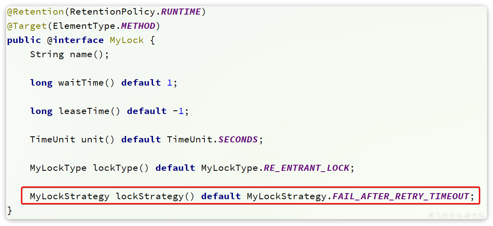

最后，修改切面代码，基于用户选择的策略来处理：

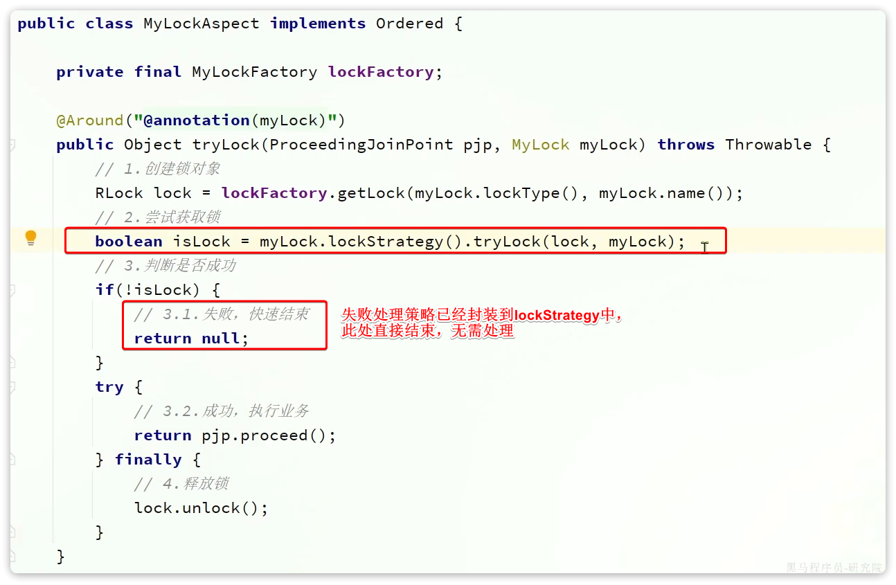

这个时候，我们就可以在使用锁的时候自由选择锁类型、锁策略了：

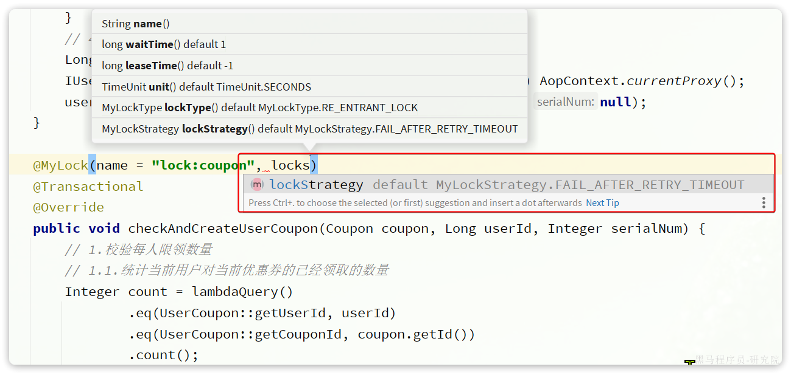

### 1.5.7.基于SPEL的动态锁名

现在还剩下最后一个问题，就是锁名称的问题。

在当前业务中，我们的锁对象本来应该是当前登录用户，是动态获取的。而加锁是基于注解参数添加的，在编码时就需要指定。怎么办？

Spring中提供了一种表达式语法，称为SPEL表达式，可以执行java代码，获取任意参数。

::: warning

**思路**：

我们可以让用户指定锁名称参数时不要写死，而是基于SPEL表达式。在创建锁对象时，解析SPEL表达式，动态获取锁名称。

:::

思路很简单，不过SPEL表达式的解析还是比较复杂的。因此这里就不再让大家自己编写了。

事实上，在`tj-commom`模块中已经定义好了基于注解的分布式锁的全部内容，包括之前我们定义的代码，以及SPEL表达式的动态锁名称获取。我们来看看具体的实现：

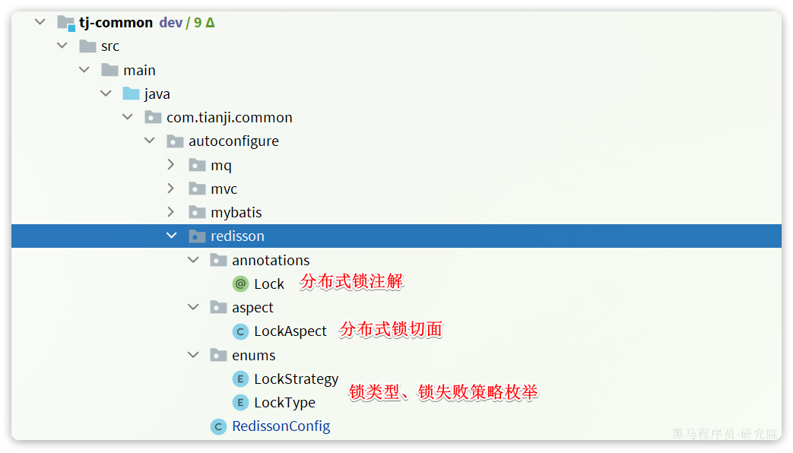

接下来，我们一起看看这套锁的用法，特别是SPEL的解析过程。

#### 1.5.7.1.SPEL表达式

SPEL的表达式语法可以参考官网文档：

https://docs.spring.io/spring-framework/docs/3.0.x/reference/expressions.html

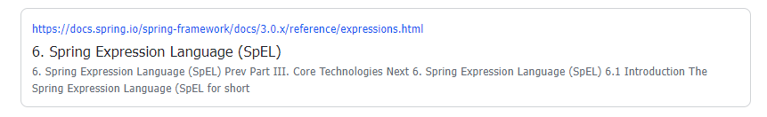

中文文档：

http://itmyhome.com/spring/expressions.html

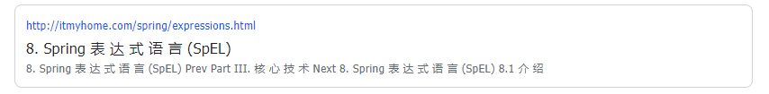

首先，在使用锁注解时，锁名称可以利用SPEL表达式，例如我们指定锁名称中要包含参数中的用户id，则可以这样写：

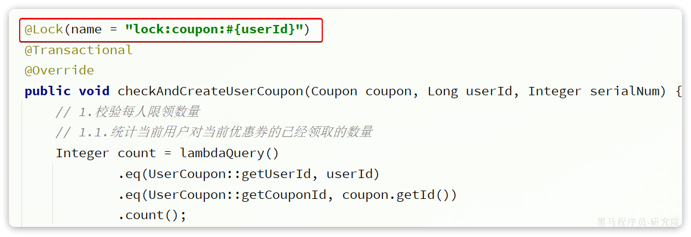

而如果是通过UserContext.getUser()获取，则可以利用下面的语法：

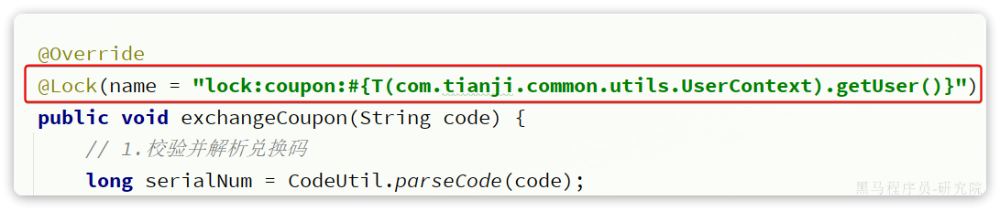

这里`T(类名).方法名()`就是调用静态方法。

#### 1.5.7.2.解析SPEL

在切面中，我们需要基于注解中的锁名称做动态解析，而不是直接使用名称：

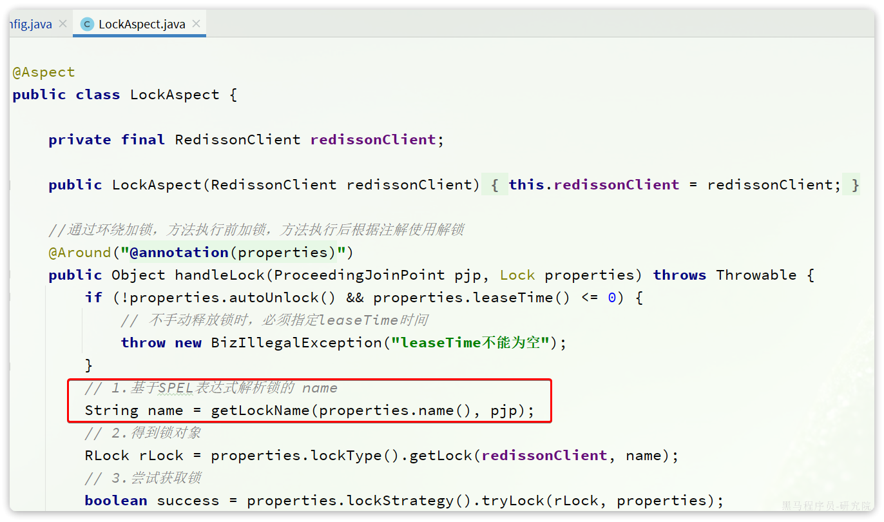

其中获取锁名称用的是`getLockName()`这个方法：

```java
/**
 * SPEL的正则规则
 */
private static final Pattern pattern = Pattern.compile("\\#\\{([^\\}]*)\\}");
/**
 * 方法参数解析器
 */
private static final ParameterNameDiscoverer parameterNameDiscoverer = new DefaultParameterNameDiscoverer();

/**
 * 解析锁名称
 * @param name 原始锁名称
 * @param pjp 切入点
 * @return 解析后的锁名称
 */
private String getLockName(String name, ProceedingJoinPoint pjp) {
    // 1.判断是否存在spel表达式
    if (StringUtils.isBlank(name) || !name.contains("#")) {
        // 不存在，直接返回
        return name;
    }
    // 2.构建context,也就是SPEL表达式获取参数的上下文环境，这里上下文就是切入点的参数列表
    EvaluationContext context = new MethodBasedEvaluationContext(
            TypedValue.NULL, resolveMethod(pjp), pjp.getArgs(), parameterNameDiscoverer);
    // 3.构建SPEL解析器
    ExpressionParser parser = new SpelExpressionParser();
    // 4.循环处理，因为表达式中可以包含多个表达式
    Matcher matcher = pattern.matcher(name);
    while (matcher.find()) {
        // 4.1.获取表达式
        String tmp = matcher.group();
        String group = matcher.group(1);
        // 4.2.这里要判断表达式是否以 T字符开头，这种属于解析静态方法，不走上下文
        Expression expression = parser.parseExpression(group.charAt(0) == 'T' ? group : "#" + group);
        // 4.3.解析出表达式对应的值
        Object value = expression.getValue(context);
        // 4.4.用值替换锁名称中的SPEL表达式
        name = name.replace(tmp, ObjectUtils.nullSafeToString(value));
    }
    return name;
}

private Method resolveMethod(ProceedingJoinPoint pjp) {
    // 1.获取方法签名
    MethodSignature signature = (MethodSignature)pjp.getSignature();
    // 2.获取字节码
    Class<?> clazz = pjp.getTarget().getClass();
    // 3.方法名称
    String name = signature.getName();
    // 4.方法参数列表
    Class<?>[] parameterTypes = signature.getMethod().getParameterTypes();
    return tryGetDeclaredMethod(clazz, name, parameterTypes);
}

private Method tryGetDeclaredMethod(Class<?> clazz, String name, Class<?> ... parameterTypes){
    try {
        // 5.反射获取方法
        return clazz.getDeclaredMethod(name, parameterTypes);
    } catch (NoSuchMethodException e) {
        Class<?> superClass = clazz.getSuperclass();
        if (superClass != null) {
            // 尝试从父类寻找
            return tryGetDeclaredMethod(superClass, name, parameterTypes);
        }
    }
    return null;
}
```

# 2.异步领券

目前我们的领取业务逻辑比较复杂，流程如图：

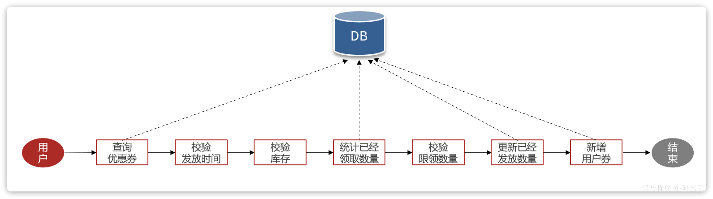

可以看到，其中有大量的对**写数据库**的操作，而且过程中还加锁保证线程安全，接口串行执行导致性能有很大影响。必须想办法提高效率。

那么对于这种**高****并发**写业务，同时逻辑比较长且复杂的业务，该如何做优化呢？

## 2.1.优化思路分析

我们之前给大家分析过高并发写优化的几种思路，例如：

- 异步写：

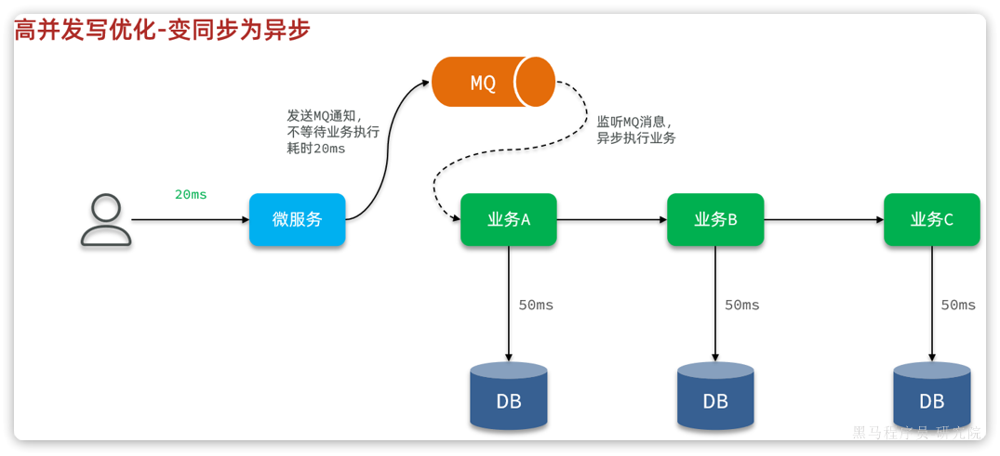

- 合并写：

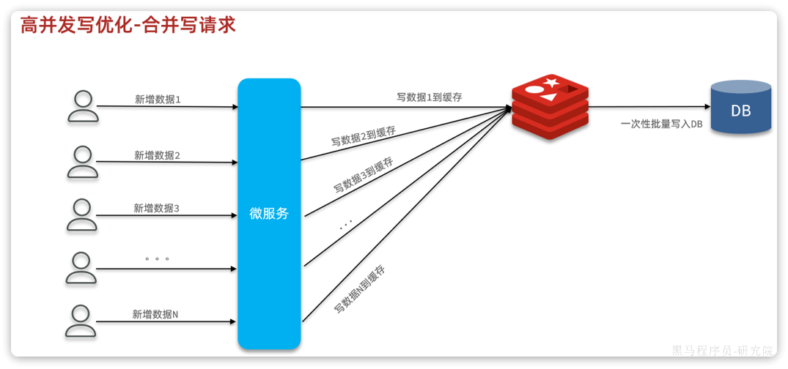

其中，合并写请求比较适合应用在写频率较高，写数据比较简单的场景。而异步写则更适合应用在业务比较复杂，业务链较长的场景。

显然，领券业务更适合使用**异步写**方案。

当用户请求来领券时，不是直接领券，而是通过MQ发送一个领券消息。有一个监听器监听消息，完成领券动作：

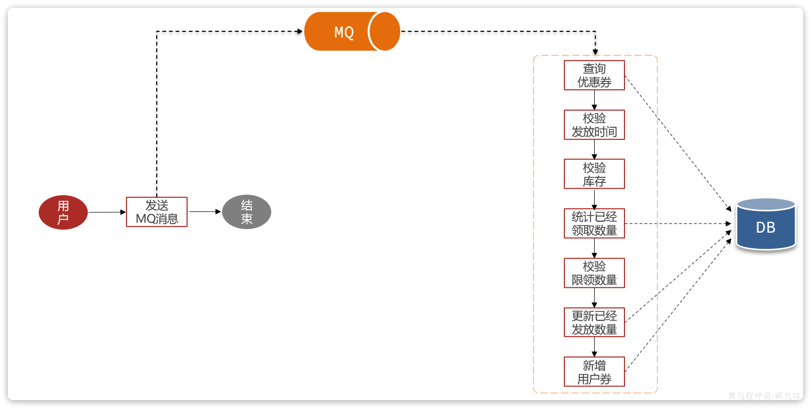

不过这里存在一个问题：

并不是每一个用户都有领券资格，具体要校验了资格才知道。那我们在发送MQ消息后，就要返回给用户结果了，此时该告诉用户是领券成功还是失败呢？

显然，无论告诉他哪种结果都不一定正确。因此，我们应该将校验领券资格的逻辑前置，在校验完成后再发MQ消息，完成数据库写操作：


但是，校验领券资格的部分依然会有多次数据库查询，还需要加锁。效率提升并不明显，怎么办？

为了进一步提高效率，我们可以**把优惠券相关数据缓存到Redis**中，这样就可以基于Redis完成资格校验，不用访问数据库，效率自然会进一步提高了。

## 2.2.优惠券缓存

### 2.2.1.缓存数据结构

优惠券资格校验需要校验的内容包括：

- 优惠券发放时间
- 优惠券库存
- 用户限领数量

因此，为了减少对Redis内存的消耗，在构建优惠券缓存的时候，我们并不需要把所有优惠券信息写入缓存，而是只保存上述字段即可。

::: danger

**特别注意**：

既然要在缓存中保存优惠券库存，并且校验库存是否充足。那就必须在**每次校验通过后，立刻扣减Redis中缓存的库存**，否则缓存中库存一直不变，起不到校验是否超发的目的。

:::

为了便于我们修改缓存中的库存数据，这里建议采用Hash结构，将库存作为Hash的一个字段，将来只需要通过`HINCRBY`命令即可修改。

Redis中的数据结构大概如图：

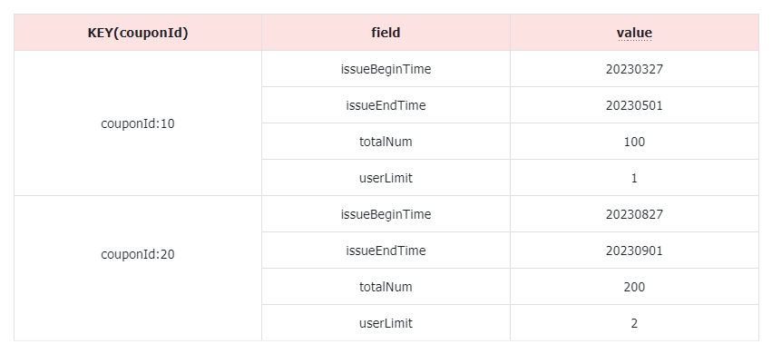

注意，上述结构中记录了券的每人限领数量：userLimit , 但是用户已经领取的数量并没有记录。因此，我们还需要一个数据结构，来记录某张券，每个用户领取的数量。

一个券可能被多个用户领取，每个用户的已领取数量都需要记录。显然，还是Hash结构更加适合：

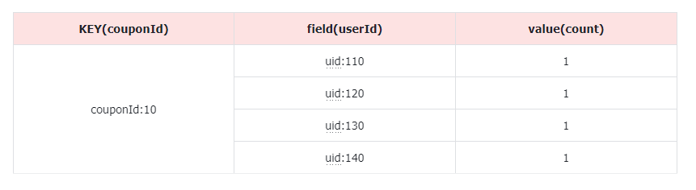

### 2.2.2.缓存KEY前缀

优惠券的缓存该何时添加呢？

::: tip

优惠券一旦发放，就可能有用户来领券，因此应该在**发放优惠券**的同时直接**添加优惠券缓存**。而**暂停发放**时则应该将优惠券的**缓存删除**，下次再次发放时重新添加。

:::

优惠券缓存的KEY格式固定，我们可以提前定义一个KEY的前缀：

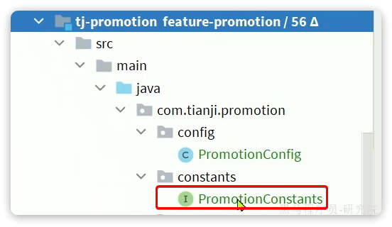

内容如下：

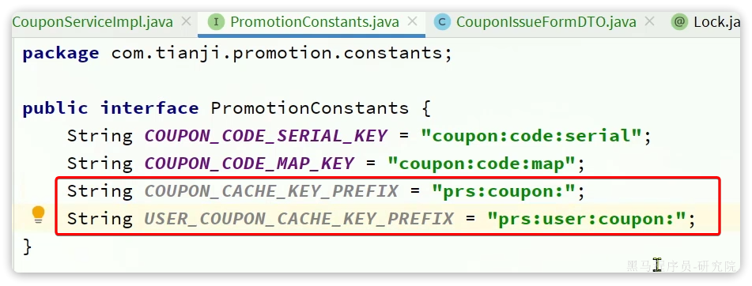

### 2.2.3.添加缓存

在发放优惠券时，并且是立刻方法的优惠券，需要添加缓存。因此，我们修改发放优惠券的逻辑，代码如下：

```java
private final StringRedisTemplate redisTemplate;

@Transactional
@Override
public void beginIssue(CouponIssueFormDTO dto) {
    // 1.查询优惠券
    Coupon coupon = getById(dto.getId());
    if (coupon == null) {
        throw new BadRequestException("优惠券不存在！");
    }
    // 2.判断优惠券状态，是否是暂停或待发放
    if(coupon.getStatus() != CouponStatus.DRAFT && coupon.getStatus() != PAUSE){
        throw new BizIllegalException("优惠券状态错误！");
    }
    // 3.判断是否是立刻发放
    LocalDateTime issueBeginTime = dto.getIssueBeginTime();
    LocalDateTime now = LocalDateTime.now();
    boolean isBegin = issueBeginTime == null || !issueBeginTime.isAfter(now);
    // 4.更新优惠券
    // 4.1.拷贝属性到PO
    Coupon c = BeanUtils.copyBean(dto, Coupon.class);
    // 4.2.更新状态
    if (isBegin) {
        c.setStatus(ISSUING);
        c.setIssueBeginTime(now);
    }else{
        c.setStatus(UN_ISSUE);
    }
    // 4.3.写入数据库
    updateById(c);

    // 5.添加缓存，前提是立刻发放的
    if (isBegin) {
        coupon.setIssueBeginTime(c.getIssueBeginTime());
        coupon.setIssueEndTime(c.getIssueEndTime());
        cacheCouponInfo(coupon);
    }

    // 6.判断是否需要生成兑换码，优惠券类型必须是兑换码，优惠券状态必须是待发放
    if(coupon.getObtainWay() == ObtainType.ISSUE && coupon.getStatus() == CouponStatus.DRAFT){
        coupon.setIssueEndTime(c.getIssueEndTime());
        codeService.asyncGenerateCode(coupon);
    }
}

private void cacheCouponInfo(Coupon coupon) {
    // 1.组织数据
    Map<String, String> map = new HashMap<>(4);
    map.put("issueBeginTime", String.valueOf(DateUtils.toEpochMilli(coupon.getIssueBeginTime())));
    map.put("issueEndTime", String.valueOf(DateUtils.toEpochMilli(coupon.getIssueEndTime())));
    map.put("totalNum", String.valueOf(coupon.getTotalNum()));
    map.put("userLimit", String.valueOf(coupon.getUserLimit()));
    // 2.写缓存
    redisTemplate.opsForHash().putAll(PromotionConstants.COUPON_CACHE_KEY_PREFIX + coupon.getId(), map);
}
```

::: warning

**注意**：

对于延时发放的优惠券，将来需要编写定时任务，扫描发放时间已经到了的优惠券。修改状态为发放中，同时添加优惠券缓存。

这部分功能留给大家实现。

:::

 

### 2.2.4.移除缓存

当优惠券暂停发放，或者优惠券过期时，应该移除优惠券缓存。

这里我们带着大家实现优惠券暂停发放时的清理缓存逻辑：

```java
@Override
@Transactional
public void pauseIssue(Long id) {
    // 1.查询旧优惠券
    Coupon coupon = getById(id);
    if (coupon == null) {
        throw new BadRequestException("优惠券不存在");
    }

    // 2.当前券状态必须是未开始或进行中
    CouponStatus status = coupon.getStatus();
    if (status != UN_ISSUE && status != ISSUING) {
        // 状态错误，直接结束
        return;
    }

    // 3.更新状态
    boolean success = lambdaUpdate()
            .set(Coupon::getStatus, PAUSE)
            .eq(Coupon::getId, id)
            .in(Coupon::getStatus, UN_ISSUE, ISSUING)
            .update();
    if (!success) {
        // 可能是重复更新，结束
        log.error("重复暂停优惠券");
    }

    // 4.删除缓存
    redisTemplate.delete(PromotionConstants.COUPON_CACHE_KEY_PREFIX + id);
}
```

::: tip

至于过期移除缓存，大家需要编写一个定时任务，定期扫描优惠券并判断是否到达过期时间。如果到达则需要将优惠券状态置为**发放结束**，并移除Redis缓存。

:::

## 2.4.异步领券

接下来我们就可以开始实现异步领券了。分为两步：

- 改造领券逻辑，实现基于Redis的领取资格校验，然后发送MQ消息
- 编写MQ监听器，监听到消息后执行领券逻辑

### 2.4.1.定义MQ消息规范

首先，我们定义一下MQ消息通信的规范。来回顾一下异步领券的流程：

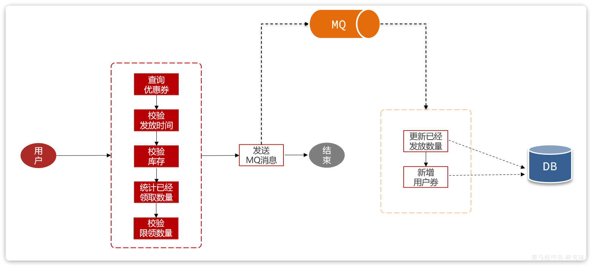

在发送MQ消息之前已经完成了领券资格校验，因此监听到MQ消息时只需要做两件事情：

- 更新券的已发放数量
- 新增用户券

更新券已发放数量只需要知道券id（couponId）即可，而新增用户券则需要知道用户信息（userId），因此我们发送的MQ消息中只要包含这两个字段即可。至于消息发送的交换机和路由key就比较简单了，我们可以自定义。

综上，MQ消息通信规范如下：

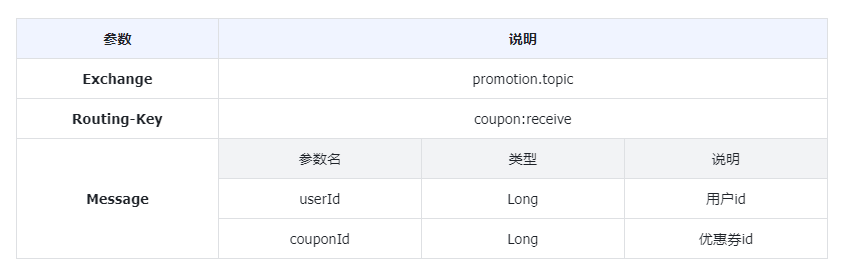

我们现在`tj-common`的`MqConstants`中将`Exchange`和`RoutingKey`定义出来：

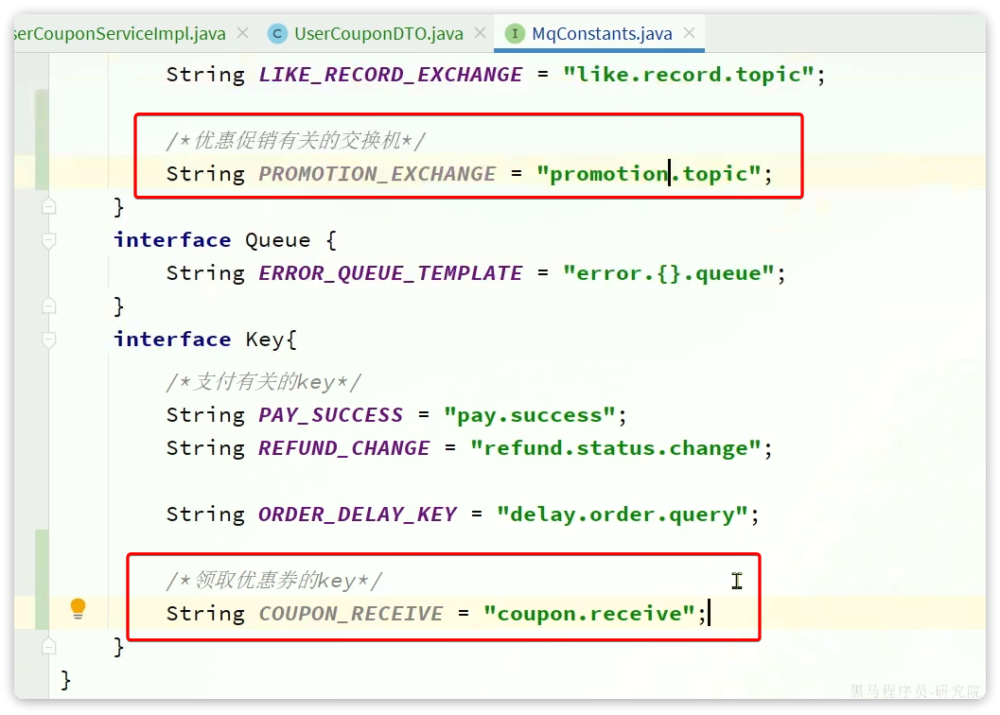

然后在tj-promotion中定义MQ消息传输的DTO（课前资料已经提供）：

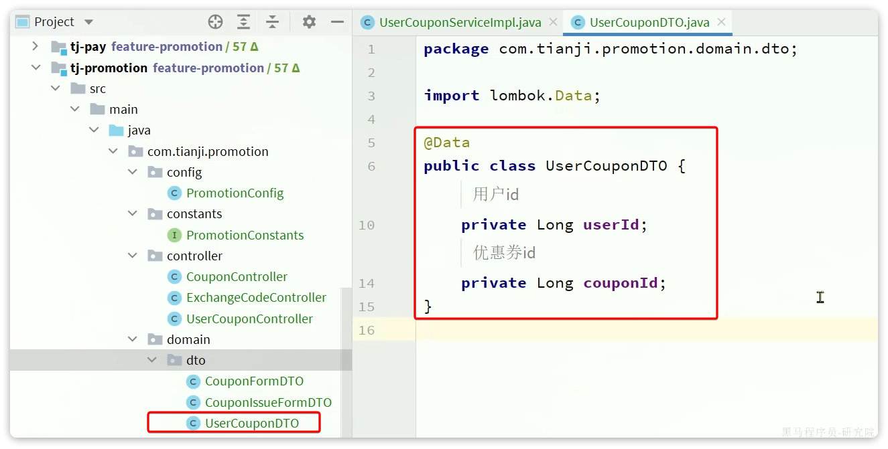

最后，不要忘了在tj-promotion中引入MQ的依赖和配置。

依赖：

```xml
<!--mq-->
<dependency>
    <groupId>org.springframework.boot</groupId>
    <artifactId>spring-boot-starter-amqp</artifactId>
</dependency>
```

配置：

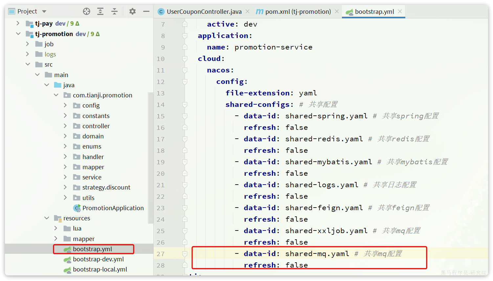

### 2.4.2.基于Redis的领取资格校验

接下来，我们就来完成第一步，改造领取逻辑，实现基于Redis的领取资格校验。校验完成后不是立刻领取，而是发送MQ消息：

```java
package com.tianji.promotion.service.impl;
// ...略

import static com.tianji.promotion.constants.PromotionConstants.COUPON_CODE_MAP_KEY;
import static com.tianji.promotion.constants.PromotionConstants.COUPON_RANGE_KEY;

/**
 * <p>
 * 用户领取优惠券的记录，是真正使用的优惠券信息 服务实现类
 * </p>
 *
 * @author 虎哥
 */
@Service
@RequiredArgsConstructor
public class UserCouponServiceImpl extends ServiceImpl<UserCouponMapper, UserCoupon> implements IUserCouponService {

    private final CouponMapper couponMapper;

    private final IExchangeCodeService codeService;

    private final StringRedisTemplate redisTemplate;

    private final RabbitMqHelper mqHelper;

    @Override
    @Lock(name = "lock:coupon:#{couponId}")
    public void receiveCoupon(Long couponId) {
        // 1.查询优惠券
        Coupon coupon = queryCouponByCache(couponId);
        if (coupon == null) {
            throw new BadRequestException("优惠券不存在");
        }
        // 2.校验发放时间
        LocalDateTime now = LocalDateTime.now();
        if (now.isBefore(coupon.getIssueBeginTime()) || now.isAfter(coupon.getIssueEndTime())) {
            throw new BadRequestException("优惠券发放已经结束或尚未开始");
        }
        // 3.校验库存
        if (coupon.getIssueNum() >= coupon.getTotalNum()) {
            throw new BadRequestException("优惠券库存不足");
        }
        Long userId = UserContext.getUser();
        // 4.校验每人限领数量
        // 4.1.查询领取数量
        String key = PromotionConstants.USER_COUPON_CACHE_KEY_PREFIX + couponId;
        Long count = redisTemplate.opsForHash().increment(key, userId.toString(), 1);
        // 4.2.校验限领数量
        if(count > coupon.getUserLimit()){
            throw new BadRequestException("超出领取数量");
        }
        // 5.扣减优惠券库存
        redisTemplate.opsForHash().increment(
                PromotionConstants.COUPON_CACHE_KEY_PREFIX + couponId, "totalNum", -1);

        // 6.发送MQ消息
        UserCouponDTO uc = new UserCouponDTO();
        uc.setUserId(userId);
        uc.setCouponId(couponId);
        mqHelper.send(MqConstants.Exchange.PROMOTION_EXCHANGE, MqConstants.Key.COUPON_RECEIVE, uc);
    }

    private Coupon queryCouponByCache(Long couponId) {
        // 1.准备KEY
        String key = PromotionConstants.COUPON_CACHE_KEY_PREFIX + couponId;
        // 2.查询
        Map<Object, Object> objMap = redisTemplate.opsForHash().entries(key);
        if (objMap.isEmpty()) {
            return null;
        }
        // 3.数据反序列化
        return BeanUtils.mapToBean(objMap, Coupon.class, false, CopyOptions.create());
    }
    // ...略
}
```

### 2.4.3.监听MQ并领券

最后一步，我们编写一个MQ监听器，监听领券的消息：

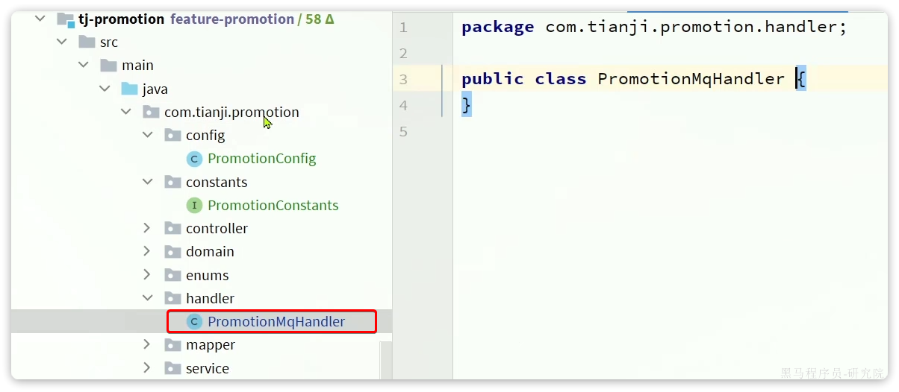

代码如下：

```java
package com.tianji.promotion.handler;

import com.tianji.promotion.domain.dto.UserCouponDTO;
import com.tianji.promotion.service.IUserCouponService;
import lombok.RequiredArgsConstructor;
import org.springframework.amqp.core.ExchangeTypes;
import org.springframework.amqp.rabbit.annotation.Exchange;
import org.springframework.amqp.rabbit.annotation.Queue;
import org.springframework.amqp.rabbit.annotation.QueueBinding;
import org.springframework.amqp.rabbit.annotation.RabbitListener;
import org.springframework.stereotype.Component;

import static com.tianji.common.constants.MqConstants.Exchange.PROMOTION_EXCHANGE;
import static com.tianji.common.constants.MqConstants.Key.COUPON_RECEIVE;

@RequiredArgsConstructor
@Component
public class PromotionMqHandler {

    private final IUserCouponService userCouponService;

    @RabbitListener(bindings = @QueueBinding(
            value = @Queue(name = "coupon.receive.queue", durable = "true"),
            exchange = @Exchange(name = PROMOTION_EXCHANGE, type = ExchangeTypes.TOPIC),
            key = COUPON_RECEIVE
    ))
    public void listenCouponReceiveMessage(UserCouponDTO uc){
        userCouponService.checkAndCreateUserCoupon(uc);
    }
}
```

需要注意到，监听器中并未编写具体业务逻辑，而是直接调用了userCouponService.checkAndCreateUserCoupon()这个方法。

这个方法之前我们定义过，但是现在参数声明做了修改，必须**重构**该方法：

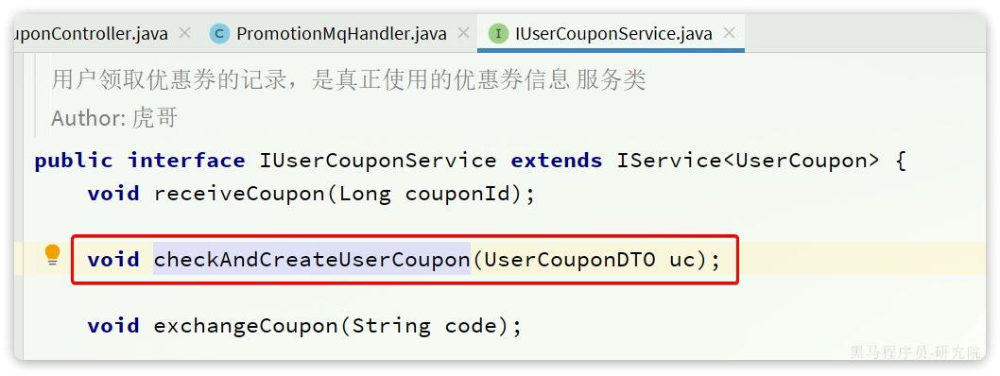

方法的实现也做了部分修改：

```java
// 移除了锁，这里不需要加锁了
@Transactional
@Override
public void checkAndCreateUserCoupon(UserCouponDTO uc) {
    // 1.查询优惠券
    Coupon coupon = couponMapper.selectById(uc.getCouponId());
    if (coupon == null) {
        throw new BizIllegalException("优惠券不存在！");
    }
    // 2.更新优惠券的已经发放的数量 + 1
    int r = couponMapper.incrIssueNum(coupon.getId());
    if (r == 0) {
        throw new BizIllegalException("优惠券库存不足！");
    }
    // 3.新增一个用户券
    saveUserCoupon(coupon, uc.getUserId());
    // 4.更新兑换码状态
    if (serialNum != null) {
        codeService.lambdaUpdate()
                .set(ExchangeCode::getUserId, uc.getUserId())
                .set(ExchangeCode::getStatus, ExchangeCodeStatus.USED)
                .eq(ExchangeCode::getId, uc.getSerialNum())
                .update();
    }
}
```

# 3.课后练习

::: danger

警告：建议练习题尽量自己完成，尽量不要参考下面的答案！！

:::

## 3.1.异步的兑换码领券

具体的实现思路参考资料中的视频讲解：《练习1-兑换码异步兑换的思路分析》，具体的实现流程如图：


结合视频中讲解的实现思路，最终我们要做的有：

- 生成兑换码时，将优惠券及对应兑换码序列号的最大值缓存到Redis中
- 改造兑换优惠券的功能，利用Redis完成资格校验，然后发送MQ消息（消息体中要增加传递**兑换码的****序列号**）
- 改造领取优惠券的MQ监听器，添加标记兑换码状态为已兑换的功能

由于监听到MQ消息后要更新兑换码状态，因此，需要给MQ消息体中添加一个序列号字段：

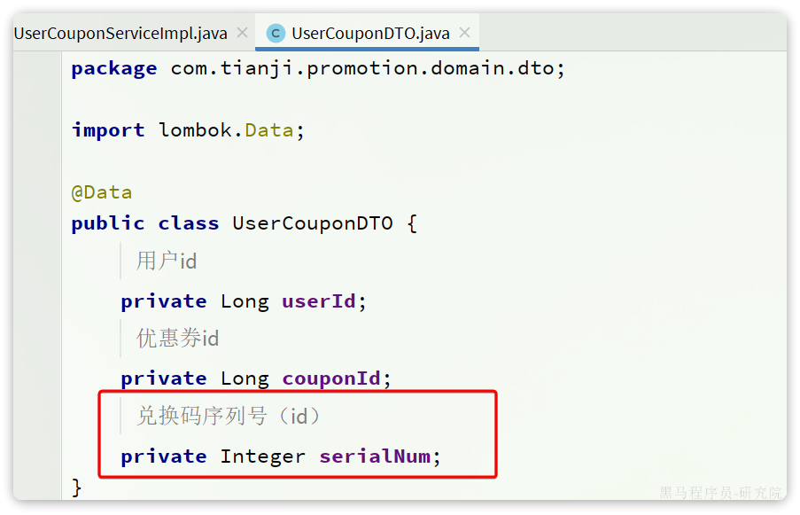

### 3.1.1.缓存兑换码

修改`ExchangeCodeServiceImpl`中的生成兑换码功能：

```java
@Override
@Async("generateExchangeCodeExecutor")
public void asyncGenerateCode(Coupon coupon) {
    // 发放数量
    Integer totalNum = coupon.getTotalNum();
    // 1.获取Redis自增序列号
    Long result = serialOps.increment(totalNum);
    if (result == null) {
        return;
    }
    int maxSerialNum = result.intValue();
    List<ExchangeCode> list = new ArrayList<>(totalNum);
    for (int serialNum = maxSerialNum - totalNum + 1; serialNum <= maxSerialNum; serialNum++) {
        // 2.生成兑换码
        String code = CodeUtil.generateCode(serialNum, coupon.getId());
        ExchangeCode e = new ExchangeCode();
        e.setCode(code);
        e.setId(serialNum);
        e.setExchangeTargetId(coupon.getId());
        e.setExpiredTime(coupon.getIssueEndTime());
        list.add(e);
    }
    // 3.保存数据库
    saveBatch(list);

    // 4.写入Redis缓存，member：couponId，score：兑换码的最大序列号
    redisTemplate.opsForZSet().add(COUPON_RANGE_KEY, coupon.getId().toString(), maxSerialNum);
}
```

### 3.1.2.改造领券功能

改造`com.tianji.promotion.service.impl.UserCouponServiceImpl`中的`exchangeCoupon`方法：

```java
@Override
@Lock(name = "lock:coupon:#{T(com.tianji.common.utils.UserContext).getUser()}")
public void exchangeCoupon(String code) {
    // 1.校验并解析兑换码
    long serialNum = CodeUtil.parseCode(code);
    // 2.校验是否已经兑换 SETBIT KEY 4 1
    boolean exchanged = codeService.updateExchangeMark(serialNum, true);
    if (exchanged) {
        throw new BizIllegalException("兑换码已经被兑换过了");
    }
    try {
        // 3.查询兑换码对应的优惠券id
        Long couponId = codeService.exchangeTargetId(serialNum);
        if (couponId == null) {
            throw new BizIllegalException("兑换码不存在！");
        }
        Coupon coupon = queryCouponByCache(couponId);
        // 4.是否过期
        LocalDateTime now = LocalDateTime.now();
        if (now.isAfter(coupon.getIssueEndTime()) || now.isBefore(coupon.getIssueBeginTime())) {
            throw new BizIllegalException("优惠券活动未开始或已经结束");
        }

        // 5.校验每人限领数量
        Long userId = UserContext.getUser();
        // 5.1.查询领取数量
        String key = PromotionConstants.USER_COUPON_CACHE_KEY_PREFIX + couponId;
        Long count = redisTemplate.opsForHash().increment(key, userId.toString(), 1);
        // 5.2.校验限领数量
        if(count > coupon.getUserLimit()){
            throw new BadRequestException("超出领取数量");
        }

        // 6.发送MQ消息通知
        UserCouponDTO uc = new UserCouponDTO();
        uc.setUserId(userId);
        uc.setCouponId(couponId);
        uc.setSerialNum((int) serialNum);
        mqHelper.send(MqConstants.Exchange.PROMOTION_EXCHANGE, MqConstants.Key.COUPON_RECEIVE, uc);
    } catch (Exception e) {
        // 重置兑换的标记 0
        codeService.updateExchangeMark(serialNum, false);
        throw e;
    }
}
```

其中根据兑换码序列号，查询优惠券id的逻辑封装到了ExchangeCodeService中：

```java
package com.tianji.promotion.service;

import com.baomidou.mybatisplus.extension.service.IService;
import com.tianji.promotion.domain.po.ExchangeCode;

/**
 * <p>
 * 兑换码 服务类
 * </p>
 *
 * @author 虎哥
 */
public interface IExchangeCodeService extends IService<ExchangeCode> {
    // 略 
    Long exchangeTargetId(long serialNum);
}
```

具体的实现在`com.tianji.promotion.service.impl.ExchangeCodeServiceImpl`中：

```java
@Override
public Long exchangeTargetId(long serialNum) {
    // 1.查询score值比当前序列号大的第一个优惠券
    Set<String> results = redisTemplate.opsForZSet().rangeByScore(
            COUPON_RANGE_KEY, serialNum, serialNum + 5000, 0L, 1L);
    if (CollUtils.isEmpty(results)) {
        return null;
    }
    // 2.数据转换
    String next = results.iterator().next();
    return Long.parseLong(next);
}
```

## 3.2.基于LUA脚本的异步领券

之前的异步领券虽然性能上比直接串行访问数据库要好，但也存在一些问题。

### 3.2.1.思路分析

目前的实现思路是这样的：

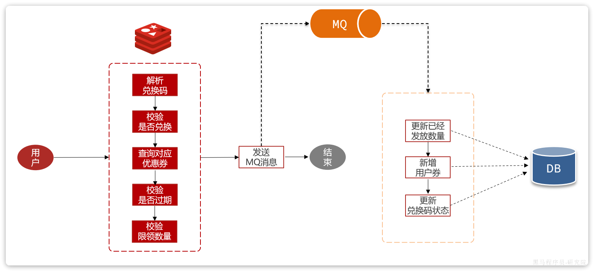

在兑换资格校验的时候，或者领券资格校验的时候，会有多次与Redis的交互，每一次交互都需要发起一次网络请求。在并发较高的时候可能导致网络拥堵，甚至导致业务变慢。

我们能不能在一次请求Redis中完成所有校验呢？

普通的Redis命令做不到，不过Redis提供了一种脚本语法，可以在脚本中编写复杂业务判断。我们只需要向Redis发起一次请求，就可以完成对脚本调用，即可实现复杂业务校验。这个脚本就是**LUA**脚本。

 

### 3.2.2.LUA语法

语法可以参考以下教程

官网教程：

https://www.lua.org/manual/5.4/

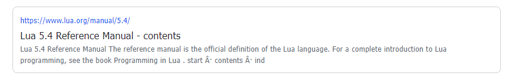

中文教程：

https://www.w3cschool.cn/lua/


### 3.2.3.Redis的LUA脚本

有关Redis的LUA脚本语法，可以参考以下内容：

官方文档：

https://redis.io/docs/manual/programmability/lua-api/


也可以参考一些播客：

https://segmentfault.com/a/1190000039287716


或者黑马的Redis课程：

https://www.bilibili.com/video/BV1cr4y1671t/?p=62&spm_id_from=pageDriver&vd_source=1ff0c1b434581723cf696ccc2f59ceaa


### 3.2.4.SpringDataRedis调用LUA脚本的API

如图：

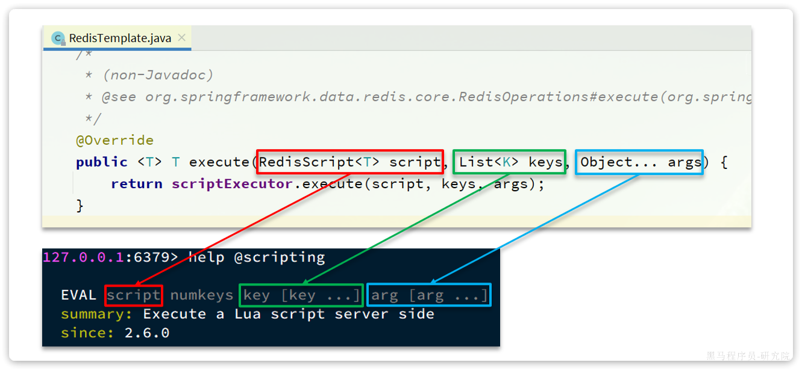

### 3.3.5.领券脚本

领券资格校验的思路和脚本如图：

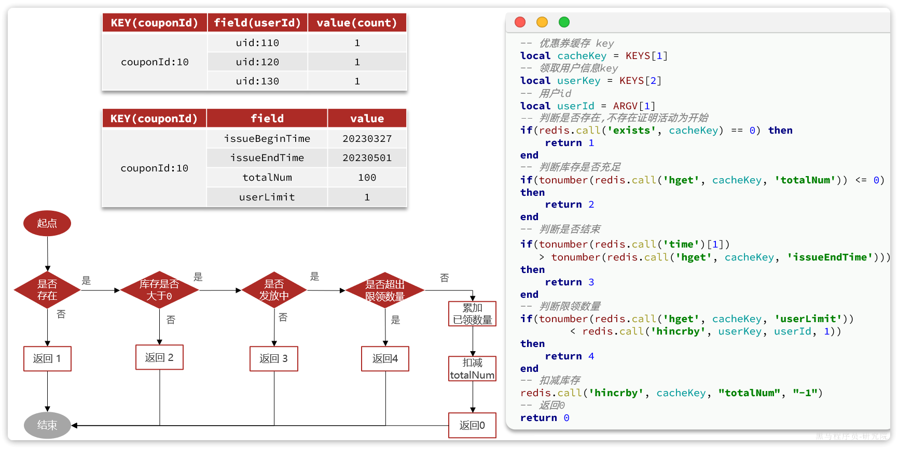

我们通过不同的返回值标记表示不同的校验结果。

实际脚本我们可以去除注释，最终脚本如下：

```lua
if(redis.call('exists', KEYS[1]) == 0) then
    return 1
end
if(tonumber(redis.call('hget', KEYS[1], 'totalNum')) <= 0) then
    return 2
end
if(tonumber(redis.call('time')[1]) > tonumber(redis.call('hget', KEYS[1], 'issueEndTime'))) then
    return 3
end
if(tonumber(redis.call('hget', KEYS[1], 'userLimit')) < redis.call('hincrby', KEYS[2], ARGV[1], 1)) then
    return 4
end
redis.call('hincrby', KEYS[1], "totalNum", "-1")
return 0
```

兑换资格校验的最终脚本：

```lua
if(redis.call('GETBIT', KEYS[1], ARGV[1]) == 1) then
    return "1"
end
local arr = redis.call('ZRANGEBYSCORE', KEYS[2], ARGV[1], ARGV[2], 'LIMIT', 0, 1);
if(#arr == 0) then
    return "2"
end
local cid = arr[1]
local _k1 = "prs:coupon:" .. cid
local _k2 = "prs:user:coupon:" .. cid
if(redis.call('EXISTS', _k1) == 0) then
    return "3"
end
if(tonumber(redis.call('time')[1]) > tonumber(redis.call('HGET', _k1, 'issueEndTime'))) then
    return "4"
end
if(tonumber(redis.call('HGET', _k1, 'userLimit')) < redis.call('HINCRBY', _k2, ARGV[3], 1)) then
    return "5"
end
redis.call('SETBIT', KEYS[1], ARGV[1], "1")
return cid
```

### 3.3.6.改造业务

首先，将LUA脚本保存在项目的resources目录：

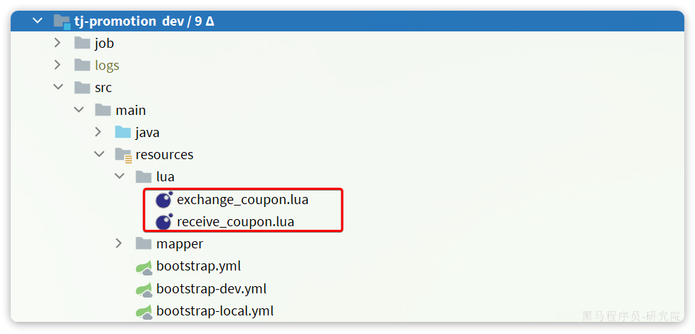

然后，在com.tianji.promotion.service.impl.UserCouponServiceImpl中通过静态代码块加载脚本：

```java
package com.tianji.promotion.service.impl;

import lombok.RequiredArgsConstructor;
import org.springframework.core.io.ClassPathResource;
import org.springframework.data.redis.core.script.RedisScript;
import org.springframework.stereotype.Service;

/**
 * <p>
 * 用户领取优惠券的记录，是真正使用的优惠券信息 服务实现类
 * </p>
 */
@Service
@RequiredArgsConstructor
public class UserCouponServiceImpl extends ServiceImpl<UserCouponMapper, UserCoupon> implements IUserCouponService {

    // ... 略

    private static final RedisScript<Long> RECEIVE_COUPON_SCRIPT;
    private static final RedisScript<String> EXCHANGE_COUPON_SCRIPT;

    static {
        RECEIVE_COUPON_SCRIPT = RedisScript.of(new ClassPathResource("lua/receive_coupon.lua"), Long.class);
        EXCHANGE_COUPON_SCRIPT = RedisScript.of(new ClassPathResource("lua/exchange_coupon.lua"), String.class);
    }
    
    // ... 略
}
```

改造领券、兑换券业务：

```java
// 使用LUA脚本后无需加锁也是线程安全的
@Override
public void receiveCoupon(Long couponId) {
    // 1.执行LUA脚本，判断结果
    // 1.1.准备参数
    String key1 = PromotionConstants.COUPON_CACHE_KEY_PREFIX + couponId;
    String key2 = PromotionConstants.USER_COUPON_CACHE_KEY_PREFIX + couponId;
    Long userId = UserContext.getUser();
    // 1.2.执行脚本
    Long r = redisTemplate.execute(RECEIVE_COUPON_SCRIPT, List.of(key1, key2), userId.toString());
    int result = NumberUtils.null2Zero(r).intValue();
    if (result != 0) {
        // 结果大于0，说明出现异常
        throw new BizIllegalException(PromotionConstants.RECEIVE_COUPON_ERROR_MSG[result - 1]);
    }
    // 2.发送MQ消息
    UserCouponDTO uc = new UserCouponDTO();
    uc.setUserId(userId);
    uc.setCouponId(couponId);
    mqHelper.send(MqConstants.Exchange.PROMOTION_EXCHANGE, MqConstants.Key.COUPON_RECEIVE, uc);
}

// 使用LUA脚本后无需加锁也是线程安全的
@Override
public void exchangeCoupon(String code) {
    // 1.校验并解析兑换码
    long serialNum = CodeUtil.parseCode(code);
    // 2.执行LUA脚本
    Long userId = UserContext.getUser();
    String result = redisTemplate.execute(
            EXCHANGE_COUPON_SCRIPT,
            List.of(COUPON_CODE_MAP_KEY, COUPON_RANGE_KEY),
            String.valueOf(serialNum), String.valueOf(serialNum + 5000), userId.toString());
    long r = NumberUtils.parseLong(result);
    if (r < 10) {
        // 异常结果应该是在1~5之间
        throw new BizIllegalException(PromotionConstants.EXCHANGE_COUPON_ERROR_MSG[(int) (r - 1)]);
    }
    // 3.发送MQ消息通知
    UserCouponDTO uc = new UserCouponDTO();
    uc.setUserId(userId);
    uc.setCouponId(r);
    uc.setSerialNum((int) serialNum);
    mqHelper.send(MqConstants.Exchange.PROMOTION_EXCHANGE, MqConstants.Key.COUPON_RECEIVE, uc);
}

@Transactional
@Override
public void checkAndCreateUserCoupon(UserCouponDTO uc) {
    // 1.查询优惠券
    Coupon coupon = couponMapper.selectById(uc.getCouponId());
    if (coupon == null) {
        throw new BizIllegalException("优惠券不存在！");
    }
    // 2.更新优惠券的已经发放的数量 + 1
    int r = couponMapper.incrIssueNum(coupon.getId());
    if (r == 0) {
        throw new BizIllegalException("优惠券库存不足！");
    }
    // 3.新增一个用户券
    saveUserCoupon(coupon, uc.getUserId());

    // 4.更新兑换码状态
    if (uc.getSerialNum() != null) {
        codeService.lambdaUpdate()
                .set(ExchangeCode::getUserId, uc.getUserId())
                .set(ExchangeCode::getStatus, ExchangeCodeStatus.USED)
                .eq(ExchangeCode::getId, uc.getSerialNum())
                .update();
    }
}
```

# 4.面试题

## 4.1.超发问题

**面试官：你做的优惠券功能如何解决券超发的问题？**

::: warning

答：券超发问题常见的有两种场景：

- 券库存不足导致超发
- 发券时超过了每个用户限领数量

这两种问题产生的原因都是高并发下的线程安全问题。往往需要通过加锁来保证线程安全。不过在处理细节上，会有一些差别。

首先，针对库存不足导致的超发问题，也就是典型的库存超卖问题，我们可以通过乐观锁来解决。也就是在库存扣减的SQL语句中添加对于库存余量的判断。当然这里不必要求必须与查询到的库存一致，因为这样可能导致库存扣减失败率太高。而是判断库存是否大于0即可，这样既保证了安全，也提高了库存扣减的成功率。

其次，对于用户限领数量超出的问题，我们无法采用乐观锁。因为要判断是否超发，需要先查询用户已领取数量，然后判断有没有超过限领数量，没有超过才会新增一条领取记录。这就导致后续的新增操作会影响超发的判断，只能利用悲观锁将查询已领数量、判断超发、新增领取记录几个操作封装为原子操作。这样才能保证线程的安全。

:::

## 4.2.锁实现的问题

**面试官：那你这里聊到悲观锁，是用什么来实现的呢？**

::: warning

由于在我们项目中，优惠券服务是多实例部署形成的负载均衡集群。因此考虑到分布式下JVM锁失效问题，我们采用了基于Redisson的分布式锁。

（此处面试官可能会追问怎么实现的呢？如果没有追问就自己往下说，不要停）

不过Redisson分布式锁的加锁和释放锁逻辑对业务侵入比较多，因此**我**就对其做了二次封装（强调是自己做的），利用**自定义注解**，**AOP**，以及**SPEL**表达式实现了基于注解的分布式锁。（面试官可能会问SPEL用来做什么，没问的话就自己说）

我在封装的时候用了工厂模式来选择不同的锁类型，利用了策略模式来选择锁失败重试策略，利用SPEL表达式来实现动态锁名称。

（面试官可能追问锁失败重试的具体策略，没有就自己往下说）

因为获取锁可能会失败嘛，失败后可以重试，也可以不重试。如果重试结束可以直接报错，也可以快速结束。综合来说可能包含5种不同失败重试策略。例如：失败后直接结束、失败后直接抛异常、失败后重试一段时间然后结束、失败后重试一段时间然后抛异常、失败后一直重试。

（面试官如果追问Redisson原理，可以参考黑马的Redis视频中对于Redisson的讲解）

:::

注意，这个回答也可以用作这个面试题：**你在项目中用过什么设计模式啊**？要学会举一反三。

## 4.3.性能问题

**面试官：加锁以后性能会比较差，有什么好的办法吗？**

::: warning

答：解决性能问题的办法有很多，针对领券问题，我们可以采用MQ来做异步领券，起到一个流量削峰和整型的作用，降低数据库压力。

具体来说，我们可以将优惠券的关键信息缓存到Redis中，用户请求进入后先读取Redis缓存，做好优惠券库存、领取数量的校验，如果校验不通过直接返回失败结果。如果校验通过则通过MQ发送消息，异步去写数据库，然后告诉用户领取成功即可。

当然，前面说的这种办法也存在一个问题，就是可能需要多次与Redis交互。因此还有一种思路就是利用Redis的LUA脚本来编写校验逻辑来代替java编写的校验逻辑。这样就只需要向Redis发一次请求即可完成校验。

:::
