# day12-优惠券使用

现在，用户已经可以页面领取优惠券，并且也能在个人中心查看到自己所有的优惠券了：

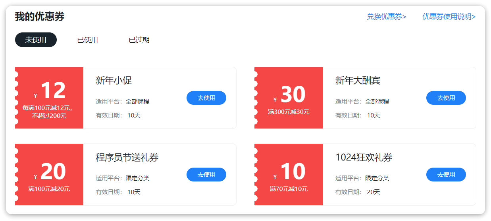

不过，新的问题来了，用户购物的时候自然要选择优惠券来使用。而现在主流的购物网站都会有优惠券的智能推荐功能，那么：

- 优惠券的类型不同，折扣计算规则该如何用代码表示？
- 如何组合优惠券使用才能让用户得到最大优惠？
- 优惠券叠加的计算算法是怎样的？
- 如果下单时使用了优惠券，用户退款时又该如何处理？

这些问题都能在今天的课程中找到答案。

# 1.优惠券规则定义

优惠券的折扣规则有各不相同，如何从其中找到共同点，抽象出程序模型就成了首要任务。我们首先从业务流程入手，找到对优惠券折扣的需求，基于需求来抽取模型。

## 1.1.业务流程分析

优惠券的使用流程就是下单购物的流程，核心流程如下：

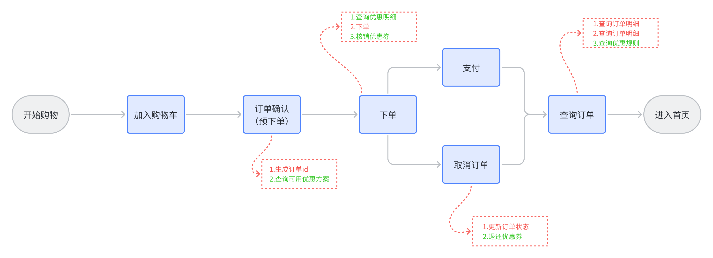

与优惠券有关的核心接口有5个：

- 根据订单查询可用优惠方案
- 根据订单和优惠方案查询优惠明细：
- 核销优惠券
- 退还优惠券
- 查询优惠规则

## 1.2.优惠券规则定义

在订单确认页对需要推荐针对订单的优惠方案，可以看出其中对优惠券的一些功能要求：

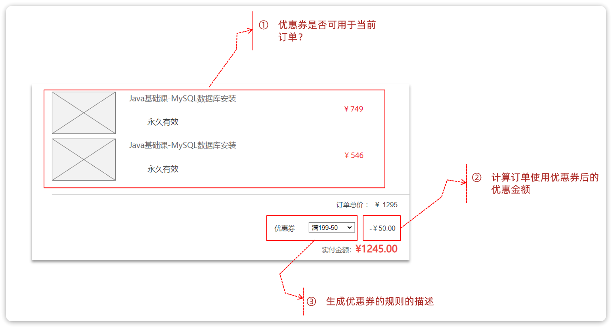

所谓的优惠券方案推荐，就是从用户的所有优惠券中筛选出可用的优惠券，并且计算哪种优惠方案用券最少，优惠金额最高。

因此这里包含了对优惠券的下列需求：

- **判断一个优惠券是否可用**，也就是检查订单金额是否达到优惠券使用门槛
- **按照优惠规则计算优惠金额**，能够计算才能比较并找出最优方案
- **生成优惠券规则描述**，目的是在页面直观的展示各种方案，供用户选择

因此，任何一张优惠券都应该具备上述3个功能，这样就能满足后续对优惠券的计算需求了。

我们抽象一个接口来标示优惠券规则：

```java
package com.tianji.promotion.strategy.discount;

import com.tianji.promotion.domain.po.Coupon;

/**
 * <p>优惠券折扣功能接口</p>
 */
public interface Discount {
    /**
     * 判断当前价格是否满足优惠券使用限制
     * @param totalAmount 订单总价
     * @param coupon 优惠券信息
     * @return 是否可以使用优惠券
     */
    boolean canUse(int totalAmount, Coupon coupon);

    /**
     * 计算折扣金额
     * @param totalAmount 总金额
     * @param coupon 优惠券信息
     * @return 折扣金额
     */
    int calculateDiscount(int totalAmount, Coupon coupon);

    /**
     * 根据优惠券规则返回规则描述信息
     * @return 规则描述信息
     */
    String getRule(Coupon coupon);
}
```

有了规则接口，就需要根据优惠券去实现接口了。不过优惠券成百上千，五花八门，我们不可能为每一张优惠券编写单独的实现类。

其实在天机学堂中，优惠券规则从类型来说就4种：

- 每满减：例如每满100减10
- 折扣：例如满100打9.5折，最大不超过50
- 无门槛：例如直接抵扣10元
- 满减：例如满100减15

优惠类型（discountType）对应到数据库的字段就是discount_type.

另外，优惠券描述中基本都会包含下列字段：

- 优惠门槛（thresholdAmount）：也就是优惠的基本条件，例如满100
- 优惠值（discountValue）：也就是具体折扣，例如减10、打9.5折
- 最大优惠（maxDiscountValue）：最大折扣，限制折扣金额

对应的数据库表结构如下：

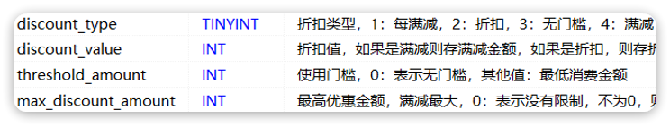

因此各种各样的优惠券其规则都可以用上述4个字段标示，而规则根据优惠类型（discountType）来看就分为4种，不同优惠仅仅是其它3个字段值不同而已。

所以优惠券的规则定义四种不同实现类即可，将来我们可以根据优惠类型不同选择具体的实现类来完成功能。像这种定义使用场景可以利用策略模式来定义规则。

在课前资料中我们提供了写好的优惠规则策略：

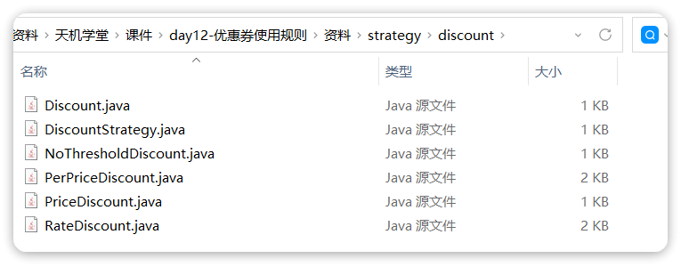

各个类功能如下：

- Discount：规则策略接口
- NoThresholdDiscount：无门槛折扣类型规则
- PerPriceDiscount：每满减折扣类型规则
- PriceDiscount：满减类型规则
- RateDiscount：打折类型规则
- DiscountStrategy：折扣策略的工厂，可以根据DiscountType枚举来获取某个折扣策略对象

# 2.优惠券智能推荐

好了，优惠券规则定义好之后，我们就可以正式开发优惠券的相关功能了。

第一个就是优惠券券方案推荐功能。在订单确认页面，前端会向交易微服务发起**预下单**请求，以获取id和优惠方案列表，页面请求如图：

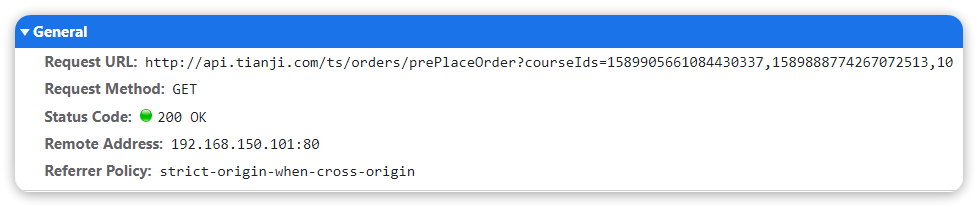

可以看出这个请求的地址是 `/ts/orders`，也就是交易服务。交易服务首先需要查询课程信息，生成订单id，然后还需要调用优惠促销服务。而促销服务则需要根据订单中的课程信息查询当前用户的优惠券，并给出推荐的优惠组合方案，供用户在页面选择：

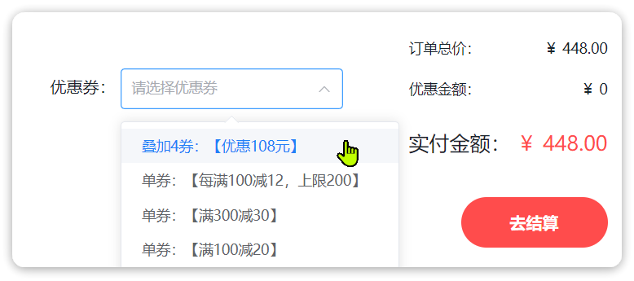

我们要实现的就是优惠券的查询和组合方案推荐的部分。

## 2.1.思路分析

简单来说，这就是一个查询优惠券、计算折扣、筛选最优解的过程。整体流程如下：

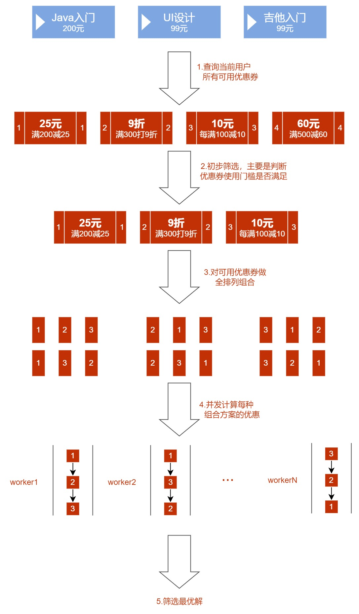

最终找出优惠券组合方案的最优解，需要满足：

- 用券相同时，优惠金额最高的方案
- 优惠金额相同时，用券最少的方案

OK，接下来我们就逐步来完成这个功能，大概步骤包括：

1. 定义接口
2. 查询用户的优惠券
3. 初步筛选
4. 细筛并完成全排列
5. 计算优惠明细
6. 基于CompleteableFuture做并行计算
7. 筛选最优解

## 2.2.定义接口

首先我们按照Restful风格来定义接口

### 2.2.1.接口基础信息

接口基础信息如下：

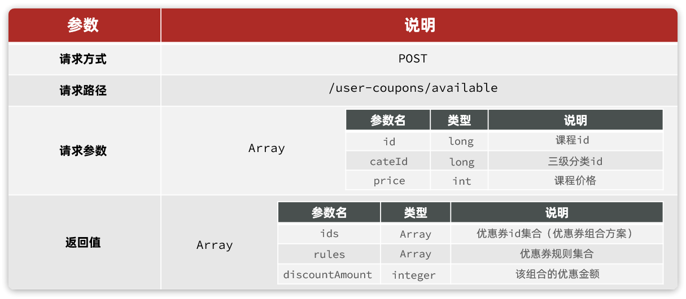

说明：

- **请求方式**：由于请求参数比较复杂，所以请求方式采用了POST，以JSON格式传输
- **请求路径**：资源名称，代表可用优惠券
- **请求参数**：订单中的所有课程信息，因此是一个集合。课程信息主要有：
  - id：主键，区分课程
  - price：价格，用于计算优惠金额
  - cateId：三级分类id，用于筛选优惠券
- **返回值**：多个优惠券的组合方案，因此是一个集合。每一个方案包含下列属性：
  - ids：方案中包含的优惠券id集合
  - rules：方案中的优惠券规则描述集合
  - discountAmount：该方案最终优惠金额

### 2.2.2.接口实体

接口中的请求参数和返回值都需要定义对应的实体，由于接口是微服务之间调用，所以都采用DTO后缀。在课前资料中已经提供了两个实体：

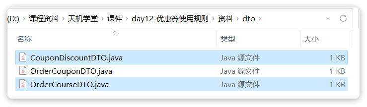

说明：

- OrderCourseDTO：就是请求参数中订单的课程信息
- CouponDiscountDTO：返回值中的优惠方案信息

### 2.2.3.接口代码

OK，接下来就是具体编码了。

由于是用户券的查询和使用，我们将接口定义到`UserCouponController`中：

```java
package com.tianji.promotion.controller;

import com.tianji.api.dto.promotion.CouponDiscountDTO;
import com.tianji.api.dto.promotion.OrderCourseDTO;
// ... 略

/**
 * <p>
 * 用户领取优惠券的记录，是真正使用的优惠券信息 控制器
 * </p>
 *
 * @author 虎哥
 */
@RestController
@RequiredArgsConstructor
@RequestMapping("/user-coupons")
@Api(tags = "优惠券相关接口")
public class UserCouponController {

    private final IUserCouponService userCouponService;

    private final IDiscountService discountService;
    
    // ... 略
    
    @ApiOperation("查询我的优惠券可用方案")
    @PostMapping("/available")
    public List<CouponDiscountDTO> findDiscountSolution(@RequestBody List<OrderCourseDTO> orderCourses){
        return discountService.findDiscountSolution(orderCourses);
    }
}
```

注意，由于这部分业务主要是对优惠方案计算，并且IUserCouponService已经比较复杂，我们将与优惠券方案计算有关的接口定义到一个新的service，IDiscountService中：

```java
package com.tianji.promotion.service;

import com.tianji.api.dto.promotion.CouponDiscountDTO;
import com.tianji.api.dto.promotion.OrderCourseDTO;

import java.util.List;

public interface IDiscountService {
    List<CouponDiscountDTO> findDiscountSolution(List<OrderCourseDTO> orderCourses);
}
```

最后是实现类：

```java
package com.tianji.promotion.service.impl;

import com.tianji.api.dto.promotion.CouponDiscountDTO;
import com.tianji.api.dto.promotion.OrderCourseDTO;
import java.util.*;

@Slf4j
@Service
@RequiredArgsConstructor
public class DiscountServiceImpl implements IDiscountService {

    @Override
    public List<CouponDiscountDTO> findDiscountSolution(List<OrderCourseDTO> orderCourses) {
        return null;
    }
}
```

## 2.3.查询用户券并初步筛选

接下来，我们查询当前用户的优惠券，并基于课程总价做初步筛选。

### 2.3.1.编写查询SQL语句

我们首先实现对用户券（`UserCoupon`）的查询，查询条件有两个：

- 必须属于当前用户
- 券状态必须是未使用

不过，需要注意的是，查询的结果必须包含`Coupon`中的折扣相关信息，因此这条语句是`coupon`表和`user_coupon`表的联合查询，必须手写`SQL`语句。

查询的结果大部分都是`Coupon`中的字段，因此可以用`Coupon`对象接收。不过`UserCoupon`的`id`也需要返回，我们计划用`Coupon`的`creater`字段来接收，因此查询时需要将`UserCoupon的`id起别名为`creater`

首先在`UserCouponMapper`接口中定义方法：

```java
public interface UserCouponMapper extends BaseMapper<UserCoupon> {

    List<Coupon> queryMyCoupons(@Param("userId") Long userId);
}
```

然后在`resource/mapper/UserCouponMapper.xml`中定义SQL语句：

```xml
<?xml version="1.0" encoding="UTF-8"?>
<!DOCTYPE mapper PUBLIC "-//mybatis.org//DTD Mapper 3.0//EN" "http://mybatis.org/dtd/mybatis-3-mapper.dtd">
<mapper namespace="com.tianji.promotion.mapper.UserCouponMapper">

    <select id="queryMyCoupons" resultType="com.tianji.promotion.domain.po.Coupon">
        SELECT c.id, c.discount_type, c.`specific`, c.discount_value, c.threshold_amount,
               c.max_discount_amount, uc.id AS creater
        FROM user_coupon uc
            INNER JOIN coupon c ON uc.coupon_id = c.id
        WHERE uc.user_id = #{userId} AND uc.status = 1
    </select>
</mapper>
```

### 2.3.2.实现查询和初筛

我们首先实现对用户券（UserCoupon）的查询，查询条件有两个：

- 必须属于当前用户
- 券状态必须是未使用

```java
package com.tianji.promotion.service.impl;

import com.tianji.api.dto.promotion.CouponDiscountDTO;
import com.tianji.api.dto.promotion.OrderCourseDTO;
import com.tianji.common.utils.CollUtils;
import com.tianji.common.utils.UserContext;
import com.tianji.promotion.domain.po.Coupon;
import com.tianji.promotion.mapper.UserCouponMapper;
import com.tianji.promotion.service.IDiscountService;
import com.tianji.promotion.strategy.discount.Discount;
import com.tianji.promotion.strategy.discount.DiscountStrategy;
import lombok.RequiredArgsConstructor;
import lombok.extern.slf4j.Slf4j;
import org.springframework.stereotype.Service;

import java.util.*;
import java.util.stream.Collectors;

@Slf4j
@Service
@RequiredArgsConstructor
public class DiscountServiceImpl implements IDiscountService {

    private final UserCouponMapper userCouponMapper;
    
    @Override
    public List<CouponDiscountDTO> findDiscountSolution(List<OrderCourseDTO> orderCourses) {
        // 1.查询我的所有可用优惠券
        List<Coupon> coupons = userCouponMapper.queryMyCoupons(UserContext.getUser());
        if (CollUtils.isEmpty(coupons)) {
            return CollUtils.emptyList();
        }
        // 2.初筛
        // 2.1.计算订单总价
        int totalAmount = orderCourses.stream().mapToInt(OrderCourseDTO::getPrice).sum();
        // 2.2.筛选可用券
        List<Coupon> availableCoupons = coupons.stream()
                .filter(c -> DiscountStrategy.getDiscount(c.getDiscountType()).canUse(totalAmount, c))
                .collect(Collectors.toList());
        if (CollUtils.isEmpty(availableCoupons)) {
            return CollUtils.emptyList();
        }
        // 3.排列组合出所有方案
        // 3.1.细筛（找出每一个优惠券的可用的课程，判断课程总价是否达到优惠券的使用需求）
        
        // 3.2.排列组合
        
        // 4.计算方案的优惠明细

        // 5.筛选最优解
        return null;
    }
}
```

## 2.4.细筛

每个优惠券的都有自己的使用范围（指定的课程分类），而订单中的课程也会有不同的分类，因此每张优惠券可以使用的课程可能不同。

我们之前在初筛时，是基于所有课程计算总价，判断优惠券是否可用，这显然是不合适的。应该超出优惠券限定范围内的课程，然后计算总价，判断是否可用。

因此，细筛步骤有两步：

- 首先要基于优惠券的限定范围对课程筛选，找出可用课程。如果没有可用课程，则优惠券不可用。
- 然后对可用课程计算总价，判断是否达到优惠门槛，没有达到门槛则优惠券不可用

可以发现，细筛需要查询每一张优惠券的限定范围，找出可用课程。这就需要查询`coupon_scope`表，还是比较麻烦的。而且，后期计算优惠明细的时候我们还需要知道每张优惠券的可用课程，因此在细筛完成后，建议把每个优惠券及对应的可用课程缓存到一个`Map`中，形成映射关系，避免后期重复查找。

所以我们在`DiscountServiceImpl`中封装一个方法用以细筛和查询优惠券的使用范围内的课程：

```java
private final ICouponScopeService scopeService;

private Map<Coupon, List<OrderCourseDTO>> findAvailableCoupon(
        List<Coupon> coupons, List<OrderCourseDTO> courses) {
    Map<Coupon, List<OrderCourseDTO>> map = new HashMap<>(coupons.size());
    for (Coupon coupon : coupons) {
        // 1.找出优惠券的可用的课程
        List<OrderCourseDTO> availableCourses = courses;
        if (coupon.getSpecific()) {
            // 1.1.限定了范围，查询券的可用范围
            List<CouponScope> scopes = scopeService.lambdaQuery().eq(CouponScope::getCouponId, coupon.getId()).list();
            // 1.2.获取范围对应的分类id
            Set<Long> scopeIds = scopes.stream().map(CouponScope::getBizId).collect(Collectors.toSet());
            // 1.3.筛选课程
            availableCourses = courses.stream()
                    .filter(c -> scopeIds.contains(c.getCateId())).collect(Collectors.toList());
        }
        if (CollUtils.isEmpty(availableCourses)) {
            // 没有任何可用课程，抛弃
            continue;
        }
        // 2.计算课程总价
        int totalAmount = availableCourses.stream().mapToInt(OrderCourseDTO::getPrice).sum();
        // 3.判断是否可用
        Discount discount = DiscountStrategy.getDiscount(coupon.getDiscountType());
        if (discount.canUse(totalAmount, coupon)) {
            map.put(coupon, availableCourses);
        }
    }
    return map;
}
```

## 2.5.优惠方案全排列组合

在完成优惠券细筛以后，我们就可以拿到所有的优惠券。由于优惠券的使用顺序不同，可能导致最终的优惠金额不同。

我们要找出优惠金额最高的优惠券组合，就必须先找出所有的排列组合，然后分别计算出优惠金额，然后对比并找出最优解。

这里我们采用的思路是这样的：

- 优惠券放在一个List集合中，他们的角标就是0~N的数字
- 找优惠券的全排列组合，就是找N个不重复数字的全排列组合
  - 例如2个数字：[0,1]，排列就包含：[0,1]、[1,0]两种
- 然后按照角标排列优惠券即可

找N个不重复数字的全排列组合可以使用回溯算法，对应的LeetCode练习题：https://leetcode.cn/problems/permutations/

当然，我们课前资料也提供了一个回溯算法的工具类：

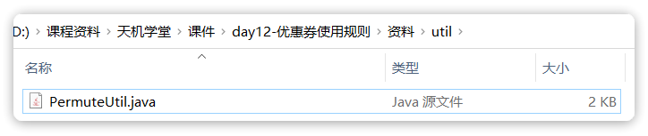

现在，在`DiscountServiceImpl`中添加**细筛**和**全排列**的逻辑：

```java
package com.tianji.promotion.service.impl;

import com.tianji.api.dto.promotion.CouponDiscountDTO;
import com.tianji.api.dto.promotion.OrderCourseDTO;
import com.tianji.common.utils.CollUtils;
import com.tianji.common.utils.UserContext;
import com.tianji.promotion.domain.po.Coupon;
import com.tianji.promotion.domain.po.CouponScope;
import com.tianji.promotion.mapper.UserCouponMapper;
import com.tianji.promotion.service.ICouponScopeService;
import com.tianji.promotion.service.IDiscountService;
import com.tianji.promotion.strategy.discount.Discount;
import com.tianji.promotion.strategy.discount.DiscountStrategy;
import com.tianji.promotion.utils.PermuteUtil;
import lombok.RequiredArgsConstructor;
import lombok.extern.slf4j.Slf4j;
import org.springframework.stereotype.Service;

import java.util.*;
import java.util.concurrent.CompletableFuture;
import java.util.concurrent.CountDownLatch;
import java.util.concurrent.Executor;
import java.util.concurrent.TimeUnit;
import java.util.stream.Collectors;

@Slf4j
@Service
@RequiredArgsConstructor
public class DiscountServiceImpl implements IDiscountService {

    private final UserCouponMapper userCouponMapper;
    private final ICouponScopeService scopeService;
    
    @Override
    public List<CouponDiscountDTO> findDiscountSolution(List<OrderCourseDTO> orderCourses) {
        // 1.查询我的所有可用优惠券
        List<Coupon> coupons = userCouponMapper.queryMyCoupons(UserContext.getUser());
        if (CollUtils.isEmpty(coupons)) {
            return CollUtils.emptyList();
        }
        // 2.初筛
        // 2.1.计算订单总价
        int totalAmount = orderCourses.stream().mapToInt(OrderCourseDTO::getPrice).sum();
        // 2.2.筛选可用券
        List<Coupon> availableCoupons = coupons.stream()
                .filter(c -> DiscountStrategy.getDiscount(c.getDiscountType()).canUse(totalAmount, c))
                .collect(Collectors.toList());
        if (CollUtils.isEmpty(availableCoupons)) {
            return CollUtils.emptyList();
        }
        // 3.排列组合出所有方案
        // 3.1.细筛（找出每一个优惠券的可用的课程，判断课程总价是否达到优惠券的使用需求）
        Map<Coupon, List<OrderCourseDTO>> availableCouponMap = findAvailableCoupon(availableCoupons, orderCourses);
        if (CollUtils.isEmpty(availableCouponMap)) {
            return CollUtils.emptyList();
        }
        // 3.2.排列组合
        availableCoupons = new ArrayList<>(availableCouponMap.keySet());
        List<List<Coupon>> solutions = PermuteUtil.permute(availableCoupons);
        // 3.3.添加单券的方案
        for (Coupon c : availableCoupons) {
            solutions.add(List.of(c));
        }
        
        // 4.计算方案的优惠明细

        // 5.筛选最优解
        return null;
    }
}
```

需要注意的是，全排列中只包含券组合方案，但是页面渲染的时候需要展示单张券供用户选择。因此我们将单张券也作为组合添加进去。

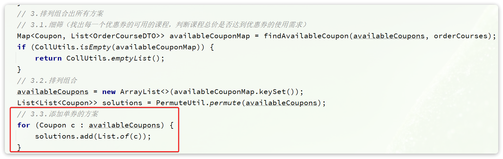

## 2.5.计算优惠明细

### 2.5.1.单张优惠券算法

单张优惠券的优惠金额计算流程如下：

- 1）判断优惠券限定范围，找出范围内的课程
- 2）计算课程总价
- 3）判断券是否可用
- 4）计算优惠金额

例如现在有一些商品：

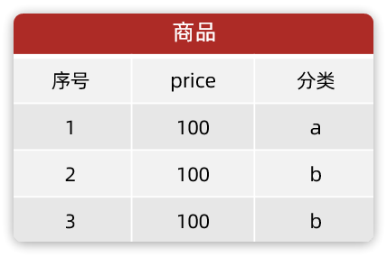

然后有一张优惠券：

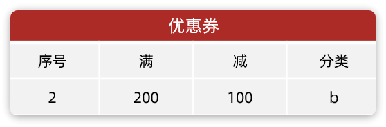

我们按照上述算法来判断：

- 1）判断限定范围：这张券限定分类 b，对应的商品序号是2、3
- 2）计算课程总价：商品序号2、3的总价为200
- 3）判断是否可用：总价刚好达到优惠券满减门槛200，可以使用
- 4）计算优惠：满200减100，因此最终优惠金额就是100元

### 2.5.2.券叠加算法

券叠加就是按照券组合的顺序，依次计算每张券的优惠金额，最终优惠金额就是所有权的优惠累加。

需要注意的是：由于一张券计算完优惠后，商品的金额会发生变化，因此下一张券的计算金额会随之改变，因此券叠加的顺序非常重要。

而且为了方便计算后续券的优惠金额，我们必须知道商品金额具体的变化，也就是弄清楚每一张优惠券使用后，每个商品的具体优惠金额，我们称之为**优惠明细，**我们可以用一个表格来记录**：**

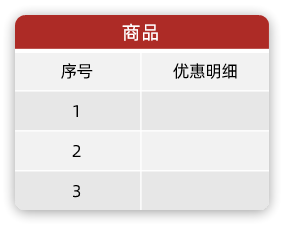

因此，券叠加算法比单券算法需要多一步：

- 1）判断优惠券限定范围，找出范围内的课程
- 2）计算课程总价
- 3）判断券是否可用
- 4）计算优惠金额
- 5）计算优惠明细

例如现在有一些商品：


然后有一组优惠券：

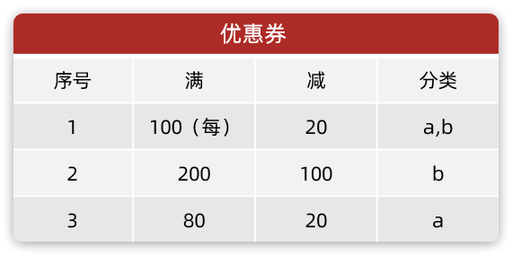

最终的计算步骤如下：

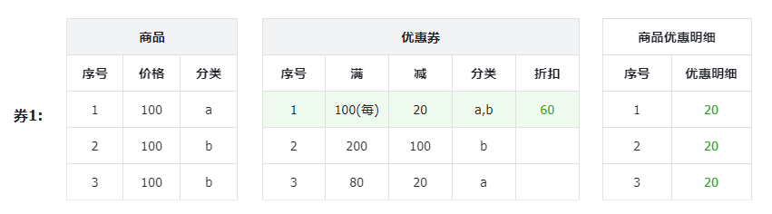


券1的计算步骤如下：

- 1）判断范围：券1可用于所有分类，因此商品序号1、2、3都可以用
- 2）计算总价：所有商品累加共300元
- 3）判断是否可用：券1门槛是100，符合要求
- 4）计算优惠金额：每满100减20，因此总共折扣就是60元
- 5）计算优惠明细：

优惠明细的计算算法如下：

- 正常情况下，按照商品价格在商品总价中的比例，乘以优惠总金额
- 最后一个商品，为了避免出现精度损失导致的金额不一致，最后一个商品的优惠明细等于优惠总金额减去其它商品的优惠明细之和

例如，商品1、2的折扣：（100 / 300）* 60 = 20 ，商品3的折扣等于：60 - 20 - 20 = 20

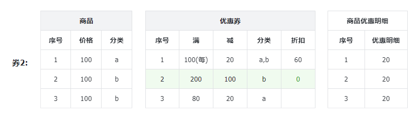

券2的计算步骤如下：

- 1）判断范围：券2可用于分类b，因此商品序号2、3都可以用
- 2）计算总价：商品2已经优惠了20，现在价格是80，商品3已经优惠了20，现在价格是80。因此商品总价是160
- 3）判断是否可用：券2门槛是200，不符合要求，跳过

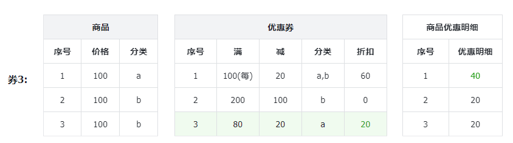

券3的计算步骤如下：

- 1）判断范围：券3可用于所有分类，因此商品序号1可以用
- 2）计算总价：商品1原价100元，已经优惠20，现价80元
- 3）判断是否可用：券3门槛是80，符合要求
- 4）计算优惠金额：满80减20，因此总共折扣就是20元
- 5）计算优惠明细：由于只有商品1可用，商品1优惠明细就是20元

### 2.5.3.编码实现算法

首先是查询优惠方案的主体方法，如下：

```java
package com.tianji.promotion.service.impl;

import com.tianji.api.dto.promotion.CouponDiscountDTO;
import com.tianji.api.dto.promotion.OrderCourseDTO;
import com.tianji.common.utils.CollUtils;
import com.tianji.common.utils.UserContext;
import com.tianji.promotion.domain.po.Coupon;
import com.tianji.promotion.domain.po.CouponScope;
import com.tianji.promotion.mapper.UserCouponMapper;
import com.tianji.promotion.service.ICouponScopeService;
import com.tianji.promotion.service.IDiscountService;
import com.tianji.promotion.strategy.discount.Discount;
import com.tianji.promotion.strategy.discount.DiscountStrategy;
import com.tianji.promotion.utils.PermuteUtil;
import lombok.RequiredArgsConstructor;
import lombok.extern.slf4j.Slf4j;
import org.springframework.stereotype.Service;

import java.util.*;
import java.util.concurrent.CompletableFuture;
import java.util.concurrent.CountDownLatch;
import java.util.concurrent.Executor;
import java.util.concurrent.TimeUnit;
import java.util.stream.Collectors;

@Slf4j
@Service
@RequiredArgsConstructor
public class DiscountServiceImpl implements IDiscountService {

    private final UserCouponMapper userCouponMapper;
    
    @Override
    public List<CouponDiscountDTO> findDiscountSolution(List<OrderCourseDTO> orderCourses) {
        // 1.查询我的所有可用优惠券
        List<Coupon> coupons = userCouponMapper.queryMyCoupons(UserContext.getUser());
        if (CollUtils.isEmpty(coupons)) {
            return CollUtils.emptyList();
        }
        // 2.初筛
        // 2.1.计算订单总价
        int totalAmount = orderCourses.stream().mapToInt(OrderCourseDTO::getPrice).sum();
        // 2.2.筛选可用券
        List<Coupon> availableCoupons = coupons.stream()
                .filter(c -> DiscountStrategy.getDiscount(c.getDiscountType()).canUse(totalAmount, c))
                .collect(Collectors.toList());
        if (CollUtils.isEmpty(availableCoupons)) {
            return CollUtils.emptyList();
        }
        // 3.排列组合出所有方案
        // 3.1.细筛（找出每一个优惠券的可用的课程，判断课程总价是否达到优惠券的使用需求）
        Map<Coupon, List<OrderCourseDTO>> availableCouponMap = findAvailableCoupon(availableCoupons, orderCourses);
        if (CollUtils.isEmpty(availableCouponMap)) {
            return CollUtils.emptyList();
        }
        // 3.2.排列组合
        availableCoupons = new ArrayList<>(availableCouponMap.keySet());
        List<List<Coupon>> solutions = PermuteUtil.permute(availableCoupons);
        // 3.3.添加单券的方案
        for (Coupon c : availableCoupons) {
            solutions.add(List.of(c));
        }
        
        // 4.计算方案的优惠明细
        List<CouponDiscountDTO> list = 
                Collections.synchronizedList(new ArrayList<>(solutions.size()));
        for (List<Coupon> solution : solutions) {
            calculateSolutionDiscount(availableCouponMap, orderCourses, solution);
        }
        // 5.筛选最优解
        return null;
    }
    
    // ... 略
}
```

具体的计算逻辑同样在`DiscountServiceImpl`中，具体如下：

```java
private CouponDiscountDTO calculateSolutionDiscount(
        Map<Coupon, List<OrderCourseDTO>> couponMap, List<OrderCourseDTO> courses, List<Coupon> solution) {
    // 1.初始化DTO
    CouponDiscountDTO dto = new CouponDiscountDTO();
    // 2.初始化折扣明细的映射
    Map<Long, Integer> detailMap = courses.stream().collect(Collectors.toMap(OrderCourseDTO::getId, oc -> 0));
    // 3.计算折扣
    for (Coupon coupon : solution) {
        // 3.1.获取优惠券限定范围对应的课程
        List<OrderCourseDTO> availableCourses = couponMap.get(coupon);
        // 3.2.计算课程总价(课程原价 - 折扣明细)
        int totalAmount = availableCourses.stream()
                .mapToInt(oc -> oc.getPrice() - detailMap.get(oc.getId())).sum();
        // 3.3.判断是否可用
        Discount discount = DiscountStrategy.getDiscount(coupon.getDiscountType());
        if (!discount.canUse(totalAmount, coupon)) {
            // 券不可用，跳过
            continue;
        }
        // 3.4.计算优惠金额
        int discountAmount = discount.calculateDiscount(totalAmount, coupon);
        // 3.5.计算优惠明细
        calculateDiscountDetails(detailMap, availableCourses, totalAmount, discountAmount);
        // 3.6.更新DTO数据
        dto.getIds().add(coupon.getCreater());
        dto.getRules().add(discount.getRule(coupon));
        dto.setDiscountAmount(discountAmount + dto.getDiscountAmount());
    }
    return dto;
}

private void calculateDiscountDetails(Map<Long, Integer> detailMap, List<OrderCourseDTO> courses,
                                      int totalAmount, int discountAmount) {
    int times = 0;
    int remainDiscount = discountAmount;
    for (OrderCourseDTO course : courses) {
        // 更新课程已计算数量
        times++;
        int discount = 0;
        // 判断是否是最后一个课程
        if (times == courses.size()) {
            // 是最后一个课程，总折扣金额 - 之前所有商品的折扣金额之和
            discount = remainDiscount;
        } else {
            // 计算折扣明细（课程价格在总价中占的比例，乘以总的折扣）
            discount = discountAmount * course.getPrice() / totalAmount;
            remainDiscount -= discount;
        }
        // 更新折扣明细
        detailMap.put(course.getId(), discount + detailMap.get(course.getId()));
    }
}
```

## 2.6.CompleteableFuture并发计算

可以发现，上节的优惠券算法还是比较复杂的。而且由于优惠方案很多，目前我们此案有的是for循环逐个方案串行计算，整体性能可想而知。

所以，为了提高计算效率，我们可以利用多线程并行计算。具体步骤如下：

- 定义一个线程池
- for循环将每个方案交给一个线程去任务执行
- 等待所有任务计算完毕，返回结果

这里的难点有两个：

- 1）线程任务是带返回值的任务
- 2）虽然是多线程运行，但是我们要等待所有线程都执行完毕后才返回结果

针对第二个点，我们可以利用`JUC`包提供的工具`CountDownLatch`来实现。

针对第一个点，我们则需要利用一个JDK1.8的新工具：`CompletableFuture`来实现。

CompletableFuture的用法详解：

https://zhuanlan.zhihu.com/p/344431341

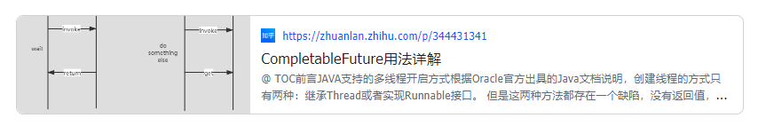

我们首先在`com.tianji.promotion.config.PromotionConfig中`自定义一个线程池：

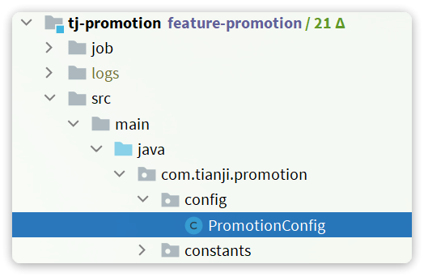

具体代码：

```java
package com.tianji.promotion.config;

import lombok.extern.slf4j.Slf4j;
import org.springframework.context.annotation.Bean;
import org.springframework.context.annotation.Configuration;
import org.springframework.scheduling.concurrent.ThreadPoolTaskExecutor;

import java.util.concurrent.Executor;
import java.util.concurrent.ThreadPoolExecutor;

@Slf4j
@Configuration
public class PromotionConfig {

    // ... 略

    @Bean
    public Executor discountSolutionExecutor(){
        ThreadPoolTaskExecutor executor = new ThreadPoolTaskExecutor();
        // 1.核心线程池大小
        executor.setCorePoolSize(12);
        // 2.最大线程池大小
        executor.setMaxPoolSize(12);
        // 3.队列大小
        executor.setQueueCapacity(99999);
        // 4.线程名称
        executor.setThreadNamePrefix("discount-solution-calculator-");
        // 5.拒绝策略
        executor.setRejectedExecutionHandler(new ThreadPoolExecutor.AbortPolicy());
        executor.initialize();
        return executor;
    }
}
```

然后就是修改DiscountServiceImpl中查询优惠方案的函数主体：

```java
package com.tianji.promotion.service.impl;

import com.tianji.api.dto.promotion.CouponDiscountDTO;
import com.tianji.api.dto.promotion.OrderCourseDTO;
import com.tianji.common.utils.CollUtils;
import com.tianji.common.utils.UserContext;
import com.tianji.promotion.domain.po.Coupon;
import com.tianji.promotion.domain.po.CouponScope;
import com.tianji.promotion.mapper.UserCouponMapper;
import com.tianji.promotion.service.ICouponScopeService;
import com.tianji.promotion.service.IDiscountService;
import com.tianji.promotion.strategy.discount.Discount;
import com.tianji.promotion.strategy.discount.DiscountStrategy;
import com.tianji.promotion.utils.PermuteUtil;
import lombok.RequiredArgsConstructor;
import lombok.extern.slf4j.Slf4j;
import org.springframework.stereotype.Service;

import java.util.*;
import java.util.concurrent.CompletableFuture;
import java.util.concurrent.CountDownLatch;
import java.util.concurrent.Executor;
import java.util.concurrent.TimeUnit;
import java.util.stream.Collectors;

@Slf4j
@Service
@RequiredArgsConstructor
public class DiscountServiceImpl implements IDiscountService {

    private final UserCouponMapper userCouponMapper;
    private final ICouponScopeService scopeService;
    private final Executor discountSolutionExecutor;
    
    @Override
    public List<CouponDiscountDTO> findDiscountSolution(List<OrderCourseDTO> orderCourses) {
        // 1.查询我的所有可用优惠券
        List<Coupon> coupons = userCouponMapper.queryMyCoupons(UserContext.getUser());
        if (CollUtils.isEmpty(coupons)) {
            return CollUtils.emptyList();
        }
        // 2.初筛
        // 2.1.计算订单总价
        int totalAmount = orderCourses.stream().mapToInt(OrderCourseDTO::getPrice).sum();
        // 2.2.筛选可用券
        List<Coupon> availableCoupons = coupons.stream()
                .filter(c -> DiscountStrategy.getDiscount(c.getDiscountType()).canUse(totalAmount, c))
                .collect(Collectors.toList());
        if (CollUtils.isEmpty(availableCoupons)) {
            return CollUtils.emptyList();
        }
        // 3.排列组合出所有方案
        // 3.1.细筛（找出每一个优惠券的可用的课程，判断课程总价是否达到优惠券的使用需求）
        Map<Coupon, List<OrderCourseDTO>> availableCouponMap = findAvailableCoupon(availableCoupons, orderCourses);
        if (CollUtils.isEmpty(availableCouponMap)) {
            return CollUtils.emptyList();
        }
        // 3.2.排列组合
        availableCoupons = new ArrayList<>(availableCouponMap.keySet());
        List<List<Coupon>> solutions = PermuteUtil.permute(availableCoupons);
        // 3.3.添加单券的方案
        for (Coupon c : availableCoupons) {
            solutions.add(List.of(c));
        }
        
        // 4.计算方案的优惠明细
        List<CouponDiscountDTO> list = Collections.synchronizedList(new ArrayList<>(solutions.size()));
        // 4.1.定义闭锁
        CountDownLatch latch = new CountDownLatch(solutions.size());
        for (List<Coupon> solution : solutions) {
            // 4.2.异步计算
            CompletableFuture
                    .supplyAsync(
                            () -> calculateSolutionDiscount(availableCouponMap, orderCourses, solution),
                            discountSolutionExecutor
                    ).thenAccept(dto -> {
                        // 4.3.提交任务结果
                        list.add(dto);
                        latch.countDown();
                    });
        }
        // 4.4.等待运算结束
        try {
            latch.await(1, TimeUnit.SECONDS);
        } catch (InterruptedException e) {
            log.error("优惠方案计算被中断，{}", e.getMessage());
        }
        
        // TODO 5.筛选最优解
        return null;
    }
    
    // ... 略
}
```

## 2.7.筛选最优解

现在，我们计算出了成吨的优惠方案及其优惠金额，但是该如何从其中筛选出最优方案呢？最优方案的标准又是什么呢？

首先来看最优标准：

- 用券相同时，优惠金额最高的方案
- 优惠金额相同时，用券最少的方案

这里的`用券相同`只关心用了哪些券，不关心顺序。例如【1,2,3】、【2,1,3】、【3,1,2】都用了1、2、3这三张券，属于用券相同，我们要找出其中优惠金额最高的方案。再比如：【1,2,3】和【2,3】、【3,1】就是用券不同，就需要分别去找优惠金额更高的。

那么该如何寻找最优解呢？

其实寻找最优解的流程跟找数组中最小值类似：

- 定义一个变量记录最小值
- 逐个遍历数组，判断当前元素是否比最小值更小
- 如果是，则覆盖最小值；如果否，则放弃
- 循环结束，变量中记录的就是最小值

我们寻找最优解可以参考上述过程，不过略有差异，核心原因是：**券组合有多种，因此最优解不止一个**。因此我们不能用一个变量类记录最优解，而是用Map来记录，结构如下：

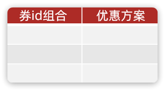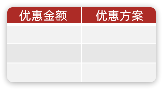

其中：

- 第一个Map用来记录用券相同时，优惠金额最高的方案；
- 第二个Map用来记录优惠金额相同时，用券最少的方案。

最终，两个Map的values的交集就是我们要找的最优解。

具体实现逻辑如下：

```java
package com.tianji.promotion.service.impl;

import com.tianji.api.dto.promotion.CouponDiscountDTO;
import com.tianji.api.dto.promotion.OrderCourseDTO;
import com.tianji.common.utils.CollUtils;
import com.tianji.common.utils.UserContext;
import com.tianji.promotion.domain.po.Coupon;
import com.tianji.promotion.domain.po.CouponScope;
import com.tianji.promotion.mapper.UserCouponMapper;
import com.tianji.promotion.service.ICouponScopeService;
import com.tianji.promotion.service.IDiscountService;
import com.tianji.promotion.strategy.discount.Discount;
import com.tianji.promotion.strategy.discount.DiscountStrategy;
import com.tianji.promotion.utils.PermuteUtil;
import lombok.RequiredArgsConstructor;
import lombok.extern.slf4j.Slf4j;
import org.springframework.stereotype.Service;

import java.util.*;
import java.util.concurrent.CompletableFuture;
import java.util.concurrent.CountDownLatch;
import java.util.concurrent.Executor;
import java.util.concurrent.TimeUnit;
import java.util.stream.Collectors;

@Slf4j
@Service
@RequiredArgsConstructor
public class DiscountServiceImpl implements IDiscountService {

    private final UserCouponMapper userCouponMapper;
    private final ICouponScopeService scopeService;
    private final Executor discountSolutionExecutor;
    
    @Override
    public List<CouponDiscountDTO> findDiscountSolution(List<OrderCourseDTO> orderCourses) {
        // 1.查询我的所有可用优惠券
        List<Coupon> coupons = userCouponMapper.queryMyCoupons(UserContext.getUser());
        if (CollUtils.isEmpty(coupons)) {
            return CollUtils.emptyList();
        }
        // 2.初筛
        // 2.1.计算订单总价
        int totalAmount = orderCourses.stream().mapToInt(OrderCourseDTO::getPrice).sum();
        // 2.2.筛选可用券
        List<Coupon> availableCoupons = coupons.stream()
                .filter(c -> DiscountStrategy.getDiscount(c.getDiscountType()).canUse(totalAmount, c))
                .collect(Collectors.toList());
        if (CollUtils.isEmpty(availableCoupons)) {
            return CollUtils.emptyList();
        }
        // 3.排列组合出所有方案
        // 3.1.细筛（找出每一个优惠券的可用的课程，判断课程总价是否达到优惠券的使用需求）
        Map<Coupon, List<OrderCourseDTO>> availableCouponMap = findAvailableCoupon(availableCoupons, orderCourses);
        if (CollUtils.isEmpty(availableCouponMap)) {
            return CollUtils.emptyList();
        }
        // 3.2.排列组合
        availableCoupons = new ArrayList<>(availableCouponMap.keySet());
        List<List<Coupon>> solutions = PermuteUtil.permute(availableCoupons);
        // 3.3.添加单券的方案
        for (Coupon c : availableCoupons) {
            solutions.add(List.of(c));
        }
        
        // 4.计算方案的优惠明细
        List<CouponDiscountDTO> list = Collections.synchronizedList(new ArrayList<>(solutions.size()));
        // 4.1.定义闭锁
        CountDownLatch latch = new CountDownLatch(solutions.size());
        for (List<Coupon> solution : solutions) {
            // 4.2.异步计算
            CompletableFuture
                    .supplyAsync(
                            () -> calculateSolutionDiscount(availableCouponMap, orderCourses, solution),
                            discountSolutionExecutor
                    ).thenAccept(dto -> {
                        // 4.3.提交任务结果
                        list.add(dto);
                        latch.countDown();
                    });
        }
        // 4.4.等待运算结束
        try {
            latch.await(1, TimeUnit.SECONDS);
        } catch (InterruptedException e) {
            log.error("优惠方案计算被中断，{}", e.getMessage());
        }
        
        // 5.筛选最优解
        return findBestSolution(list);
    }
    
    private List<CouponDiscountDTO> findBestSolution(List<CouponDiscountDTO> list) {
        // 1.准备Map记录最优解
        Map<String, CouponDiscountDTO> moreDiscountMap = new HashMap<>();
        Map<Integer, CouponDiscountDTO> lessCouponMap = new HashMap<>();
        // 2.遍历，筛选最优解
        for (CouponDiscountDTO solution : list) {
            // 2.1.计算当前方案的id组合
            String ids = solution.getIds().stream()
                    .sorted(Long::compare).map(String::valueOf).collect(Collectors.joining(","));
            // 2.2.比较用券相同时，优惠金额是否最大
            CouponDiscountDTO best = moreDiscountMap.get(ids);
            if (best != null && best.getDiscountAmount() >= solution.getDiscountAmount()) {
                // 当前方案优惠金额少，跳过
                continue;
            }
            // 2.3.比较金额相同时，用券数量是否最少
            best = lessCouponMap.get(solution.getDiscountAmount());
            int size = solution.getIds().size();
            if (size > 1 && best != null && best.getIds().size() <= size) {
                // 当前方案用券更多，放弃
                continue;
            }
            // 2.4.更新最优解
            moreDiscountMap.put(ids, solution);
            lessCouponMap.put(solution.getDiscountAmount(), solution);
        }
        // 3.求交集
        Collection<CouponDiscountDTO> bestSolutions = CollUtils
                .intersection(moreDiscountMap.values(), lessCouponMap.values());
        // 4.排序，按优惠金额降序
        return bestSolutions.stream()
                .sorted(Comparator.comparingInt(CouponDiscountDTO::getDiscountAmount).reversed())
                .collect(Collectors.toList());
    }
    
    // ... 略
    
}
```

# 3.练习

用户确认订单信息后，会提交订单，页面如下：

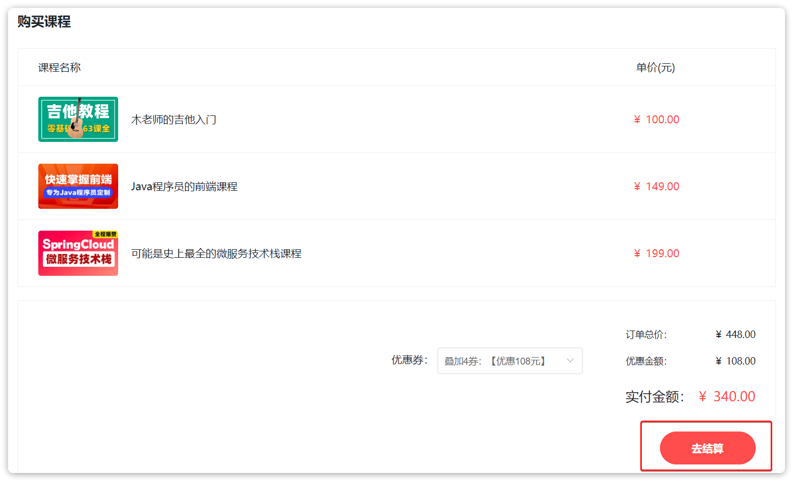

请求会提交到交易服务，交易服务需要做以下事情：

- 查询商品信息
- 查询优惠明细
- 保存订单信息
- 核销优惠券

因此，优惠促销服务需要提供两个接口：

- 一个是根据订单和优惠方案计算优惠明细
- 一个是核销优惠券

## 3.1.根据券方案计算订单优惠明细

用户去下单了，一定是选择了一种优惠方案，也就是一张或几张券的组合。而在下单时需要将优惠明细记录到订单详情中。

因此必须向优惠促销服务查询优惠明细信息，而要计算优惠明细，必须知道订单中的课程以及选择的优惠方案。所以，查询时一定要传递订单中的课程信息、用户选择的优惠方案信息。

### 3.1.1.接口信息

接口信息如下：

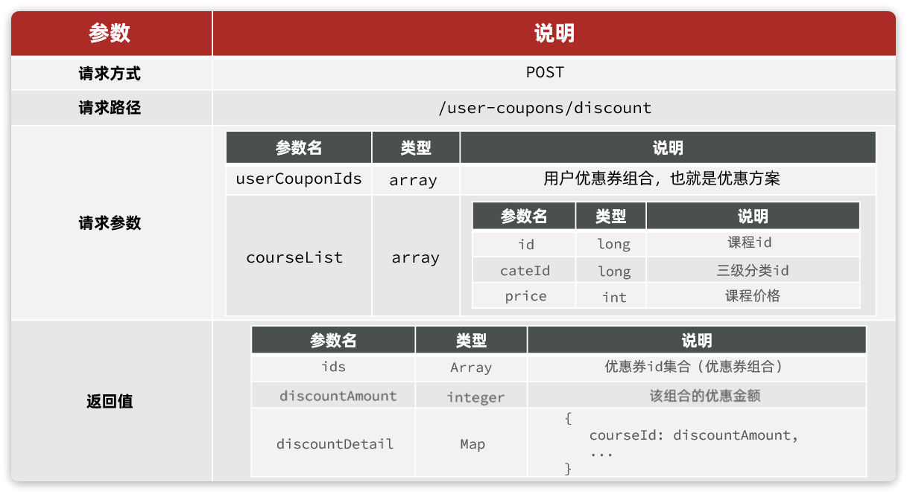

解读：

- **请求方式**：POST，虽说是查询优惠明细，但是由于参数较复杂，为了传参方便，这里使用POST
- **请求路径**：/user-coupons/discount，就是折扣信息的意思
- **请求参数**：订单及订单中的优惠方案
  - userCouponIds：用户使用的优惠券id集合，也就是优惠方案
  - courseList：订单中包含的课程，用于计算优惠金额和优惠明细
- **返回值**：优惠金额以及明细
  - discountAmount：计算出的优惠金额
  - discountDetail：优惠明细，也就是精确到每个课程优惠了多少钱

### 3.1.2.实体

请求参数实体新定义，在课前资料中已经提供了：

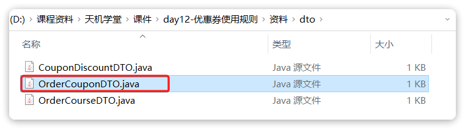

返回值实体可以沿用查询优惠方案时用到的`CouponDiscountDTO`，只不过需要添加一个新的字段：

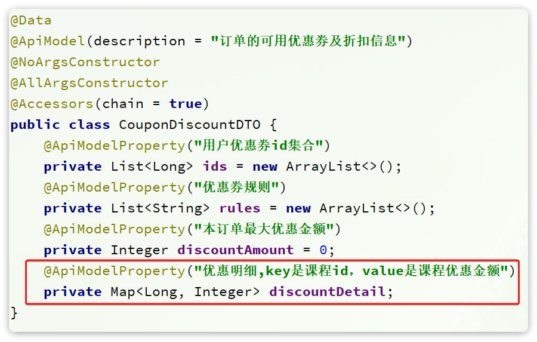

### 3.1.3.实现接口

在`UserCouponController`中定义接口：

```java
@ApiOperation("根据券方案计算订单优惠明细")
@PostMapping("/discount")
public CouponDiscountDTO queryDiscountDetailByOrder(
                            @RequestBody OrderCouponDTO orderCouponDTO){
    return discountService.queryDiscountDetailByOrder(orderCouponDTO);
}
```

然后是在IDiscountService中定义service接口：

```java
public interface IDiscountService {

    List<CouponDiscountDTO> findDiscountSolution(List<OrderCourseDTO> orderCourses);

    CouponDiscountDTO queryDiscountDetailByOrder(OrderCouponDTO orderCouponDTO);
    
}
```

最后是`DiscountServiceImpl`中定义实现：

```java
@Override
public CouponDiscountDTO queryDiscountDetailByOrder(OrderCouponDTO orderCouponDTO) {
    // 1.查询用户优惠券
    List<Long> userCouponIds = orderCouponDTO.getUserCouponIds();
    List<Coupon> coupons = userCouponMapper.queryCouponByUserCouponIds(userCouponIds, UserCouponStatus.UNUSED);
    if (CollUtils.isEmpty(coupons)) {
        return null;
    }
    // 2.查询优惠券对应课程
    Map<Coupon, List<OrderCourseDTO>> availableCouponMap = findAvailableCoupon(coupons, orderCouponDTO.getCourseList());
    if (CollUtils.isEmpty(availableCouponMap)) {
        return null;
    }
    // 3.查询优惠券规则
    return calculateSolutionDiscount(availableCouponMap, orderCouponDTO.getCourseList(), coupons);
}
```

需要注意的有两点：

- 返回的DTO中要添加优惠明细
- 查询用户券的时候是根据id批量查询，需要定义新的SQL

首先是优惠明细处理，我们要修改`calculateSolutionDiscount`方法的逻辑：

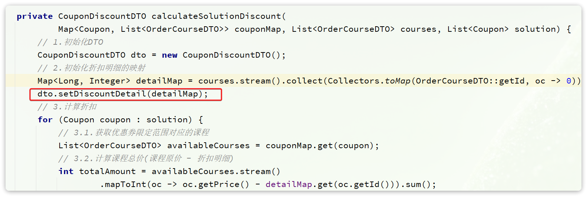

然后是，根据用户券id集合查询优惠券信息，需要多表联合查询。因此我们要定义一个mapper方法和对应的SQL：

```java
public interface UserCouponMapper extends BaseMapper<UserCoupon> {

    List<Coupon> queryMyCoupons(@Param("userId") Long userId);

    List<Coupon> queryCouponByUserCouponIds(
            @Param("userCouponIds") List<Long> userCouponIds,
            @Param("status")  UserCouponStatus status);
}
```

最后是resources/mapper/UserCouponMapper.xml中定义对应的SQL语句：

```xml
<select id="queryCouponByUserCouponIds" resultType="com.tianji.promotion.domain.po.Coupon">
    SELECT c.id, c.discount_type, c.`specific`, c.discount_value, c.threshold_amount,
           c.max_discount_amount,  uc.id AS creater
    FROM user_coupon uc
        INNER JOIN coupon c on uc.coupon_id = c.id
    WHERE uc.id IN
    <foreach collection="userCouponIds" separator="," item="id" open="(" close=")">
        #{id}
    </foreach>
    AND uc.status = #{status}
</select>
```

### 3.1.4.定义FeignClient方法

在`tj-api`模块的`com.tianji.api.client.promotion.PromotionClient`中添加新的接口：

```java
@ApiOperation("根据券方案计算订单优惠明细")
@PostMapping("/user-coupons/discount")
CouponDiscountDTO queryDiscountDetailByOrder(@RequestBody OrderCouponDTO orderCouponDTO);
```

在`tj-api`模块的`com.tianji.api.client.promotion.fallback.PromotionClientFallback`中添加接口的降级逻辑：

```java
package com.tianji.api.client.promotion.fallback;

import com.tianji.api.client.promotion.PromotionClient;
import com.tianji.api.dto.promotion.CouponDiscountDTO;
import com.tianji.api.dto.promotion.OrderCouponDTO;
import com.tianji.api.dto.promotion.OrderCourseDTO;
import com.tianji.common.exceptions.BizIllegalException;
import lombok.extern.slf4j.Slf4j;
import org.springframework.cloud.openfeign.FallbackFactory;

import java.util.Collections;
import java.util.List;

@Slf4j
public class PromotionClientFallback implements FallbackFactory<PromotionClient> {
    @Override
    public PromotionClient create(Throwable cause) {
        log.error("查询促销服务出现异常，", cause);
        return new PromotionClient() {
            @Override
            public List<CouponDiscountDTO> findDiscountSolution(List<OrderCourseDTO> orderCourses) {
                return Collections.emptyList();
            }

            @Override
            public CouponDiscountDTO queryDiscountDetailByOrder(OrderCouponDTO orderCouponDTO) {
                return null;
            }
        };
    }
}
```

### 3.1.5.改造交易服务接口

找到`tj-trade`服务的`com.tianji.trade.service.impl.OrderServiceImpl`类中的`placeOrder`方法，修改其中的代码：

```java
@Override
@Transactional
public PlaceOrderResultVO placeOrder(PlaceOrderDTO placeOrderDTO) {
    Long userId = UserContext.getUser();
    // 1.查询课程费用信息，如果不可购买，这里直接报错
    List<CourseSimpleInfoDTO> courseInfos = getOnShelfCourse(placeOrderDTO.getCourseIds());
    // 2.封装订单信息
    Order order = new Order();
    // 2.1.计算订单金额
    Integer totalAmount = courseInfos.stream()
            .map(CourseSimpleInfoDTO::getPrice).reduce(Integer::sum).orElse(0);
    // 2.2.计算优惠金额
    order.setDiscountAmount(0);
    List<Long> couponIds = placeOrderDTO.getCouponIds();
    CouponDiscountDTO discount = null;
    if (CollUtils.isNotEmpty(couponIds)) {
        List<OrderCourseDTO> orderCourses = courseInfos.stream()
                .map(c -> new OrderCourseDTO().setId(c.getId()).setCateId(c.getThirdCateId()).setPrice(c.getPrice()))
                .collect(Collectors.toList());
        discount = promotionClient.queryDiscountDetailByOrder(new OrderCouponDTO(couponIds, orderCourses));
        if(discount != null) {
            order.setDiscountAmount(discount.getDiscountAmount());
            order.setCouponIds(discount.getIds());
        }
    }
    Integer realAmount = totalAmount - order.getDiscountAmount();
    // 2.3.封装其它信息
    order.setUserId(userId);
    order.setTotalAmount(totalAmount);
    order.setRealAmount(realAmount);
    order.setStatus(OrderStatus.NO_PAY.getValue());
    order.setMessage(OrderStatus.NO_PAY.getProgressName());
    // 2.4.订单id
    Long orderId = placeOrderDTO.getOrderId();
    order.setId(orderId);

    // 3.封装订单详情
    List<OrderDetail> orderDetails = new ArrayList<>(courseInfos.size());
    for (CourseSimpleInfoDTO courseInfo : courseInfos) {
        Integer discountValue = discount == null ?
                0 : discount.getDiscountDetail().getOrDefault(courseInfo.getId(), 0);
        orderDetails.add(packageOrderDetail(courseInfo, order, discountValue));
    }

    // 4.写入数据库
    saveOrderAndDetails(order, orderDetails);

    // 5.删除购物车数据
    cartService.deleteCartByUserAndCourseIds(userId, placeOrderDTO.getCourseIds());

    // 6.构建下单结果
    return PlaceOrderResultVO.builder()
            .orderId(orderId)
            .payAmount(realAmount)
            .status(order.getStatus())
            .payOutTime(LocalDateTime.now().plusMinutes(tradeProperties.getPayOrderTTLMinutes()))
            .build();
}

@Override
@Transactional
public PlaceOrderResultVO enrolledFreeCourse(Long courseId) {
    Long userId = UserContext.getUser();
    // 1.查询课程信息
    List<Long> cIds = CollUtils.singletonList(courseId);
    List<CourseSimpleInfoDTO> courseInfos = getOnShelfCourse(cIds);
    if (CollUtils.isEmpty(courseInfos)) {
        // 课程不存在
        throw new BizIllegalException(TradeErrorInfo.COURSE_NOT_EXISTS);
    }
    CourseSimpleInfoDTO courseInfo = courseInfos.get(0);
    if(!courseInfo.getFree()){
        // 非免费课程，直接报错
        throw new BizIllegalException(TradeErrorInfo.COURSE_NOT_FREE);
    }
    // 2.创建订单
    Order order = new Order();
    // 2.1.基本信息
    order.setUserId(userId);
    order.setTotalAmount(0);
    order.setDiscountAmount(0);
    order.setRealAmount(0);
    order.setStatus(OrderStatus.ENROLLED.getValue());
    order.setFinishTime(LocalDateTime.now());
    order.setMessage(OrderStatus.ENROLLED.getProgressName());
    // 2.2.订单id
    Long orderId = IdWorker.getId(order);
    order.setId(orderId);

    // 3.订单详情
    OrderDetail detail = packageOrderDetail(courseInfo, order, 0);

    // 4.写入数据库
    saveOrderAndDetails(order, CollUtils.singletonList(detail));

    // 5.发送MQ消息，通知报名成功
    rabbitMqHelper.send(
            MqConstants.Exchange.ORDER_EXCHANGE,
            MqConstants.Key.ORDER_PAY_KEY,
            OrderBasicDTO.builder()
                    .orderId(orderId)
                    .userId(userId)
                    .courseIds(cIds)
                    .finishTime(order.getFinishTime())
                    .build()
    );
    // 6.返回vo
    return PlaceOrderResultVO.builder()
            .orderId(orderId)
            .payAmount(0)
            .status(order.getStatus())
            .build();
}


private OrderDetail packageOrderDetail(CourseSimpleInfoDTO courseInfo, Order order, Integer discountValue) {
    OrderDetail detail = new OrderDetail();
    detail.setUserId(order.getUserId());
    detail.setOrderId(order.getId());
    detail.setStatus(order.getStatus());
    detail.setCourseId(courseInfo.getId());
    detail.setPrice(courseInfo.getPrice());
    detail.setCoverUrl(courseInfo.getCoverUrl());
    detail.setName(courseInfo.getName());
    detail.setValidDuration(courseInfo.getValidDuration());
    detail.setDiscountAmount(discountValue);
    detail.setRealPayAmount(courseInfo.getPrice() - detail.getDiscountAmount());
    return detail;
}
```

## 3.2.核销优惠券

在下单完成后需要去核销优惠券。

### 3.2.1.接口信息

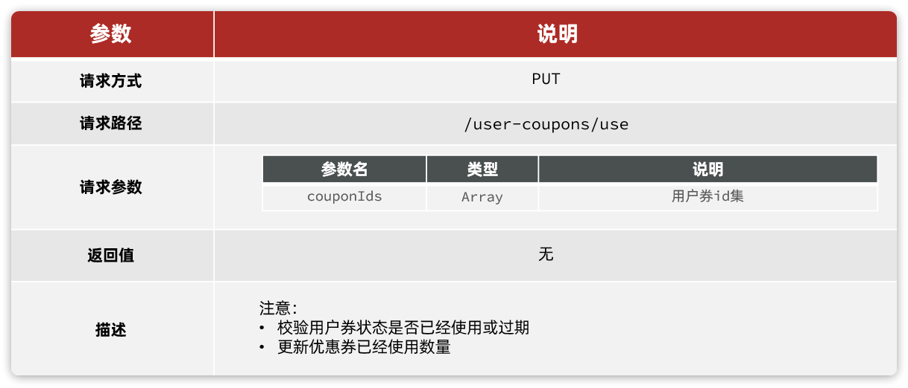

解读：

- **请求方式**：PUT，核销优惠就是更新优惠券状态
- **请求路径**：/user-coupons/use，代表优惠券使用
- **请求参数**：待核销的优惠券的id结合
- **返回值**：无

### 3.2.2.实现接口

在`tj-promotion`的`com.tianji.promotion.controller.UserCouponController`中定义接口：

```java
@ApiOperation("核销指定优惠券")
@PutMapping("/use")
public void writeOffCoupon(@ApiParam("用户优惠券id集合") @RequestParam("couponIds") List<Long> userCouponIds){
    userCouponService.writeOffCoupon(userCouponIds);
}
```

然后是`tj-promotion`的`com.tianji.promotion.service.IUserCouponService`中的方法声明：

```java
void writeOffCoupon(List<Long> userCouponIds);
```

最后是`tj-promotion`的`com.tianji.promotion.service.impl.UserCouponServiceImpl`中的方法实现：

```java
@Override
@Transactional
public void writeOffCoupon(List<Long> userCouponIds) {
    // 1.查询优惠券
    List<UserCoupon> userCoupons = listByIds(userCouponIds);
    if (CollUtils.isEmpty(userCoupons)) {
        return;
    }
    // 2.处理数据
    List<UserCoupon> list = userCoupons.stream()
            // 过滤无效券
            .filter(coupon -> {
                if (coupon == null) {
                    return false;
                }
                if (UserCouponStatus.UNUSED != coupon.getStatus()) {
                    return false;
                }
                LocalDateTime now = LocalDateTime.now();
                return !now.isBefore(coupon.getTermBeginTime()) && !now.isAfter(coupon.getTermEndTime());
            })
            // 组织新增数据
            .map(coupon -> {
                UserCoupon c = new UserCoupon();
                c.setId(coupon.getId());
                c.setStatus(UserCouponStatus.USED);
                return c;
            })
            .collect(Collectors.toList());

    // 4.核销，修改优惠券状态
    boolean success = updateBatchById(list);
    if (!success) {
        return;
    }
    // 5.更新已使用数量
    List<Long> couponIds = userCoupons.stream().map(UserCoupon::getCouponId).collect(Collectors.toList());
    int c = couponMapper.incrUsedNum(couponIds, 1);
    if (c < 1) {
        throw new DbException("更新优惠券使用数量失败！");
    }
}
```

### 3.2.3.定义FeignClient方法

在`tj-api`模块的`com.tianji.api.client.promotion.PromotionClient`中添加新的接口：

```java
@ApiOperation("核销指定优惠券")
@PutMapping("/user-coupons/use")
void writeOffCoupon(@ApiParam("用户优惠券id集合") @RequestParam("couponIds") List<Long> userCouponIds);
```

在`tj-api`模块的`com.tianji.api.client.promotion.fallback.PromotionClientFallback`中添加接口的降级逻辑：

```java
package com.tianji.api.client.promotion.fallback;

import com.tianji.api.client.promotion.PromotionClient;
import com.tianji.api.dto.promotion.CouponDiscountDTO;
import com.tianji.api.dto.promotion.OrderCouponDTO;
import com.tianji.api.dto.promotion.OrderCourseDTO;
import com.tianji.common.exceptions.BizIllegalException;
import lombok.extern.slf4j.Slf4j;
import org.springframework.cloud.openfeign.FallbackFactory;

import java.util.Collections;
import java.util.List;

@Slf4j
public class PromotionClientFallback implements FallbackFactory<PromotionClient> {
    @Override
    public PromotionClient create(Throwable cause) {
        log.error("查询促销服务出现异常，", cause);
        return new PromotionClient() {
            @Override
            public List<CouponDiscountDTO> findDiscountSolution(List<OrderCourseDTO> orderCourses) {
                return Collections.emptyList();
            }

            @Override
            public CouponDiscountDTO queryDiscountDetailByOrder(OrderCouponDTO orderCouponDTO) {
                return null;
            }
            
            @Override
            public void writeOffCoupon(List<Long> userCouponIds) {
                throw new BizIllegalException(500, "核销优惠券异常", cause);
            }
        };
    }
}
```

### 3.2.4.改造交易服务接口

最后，需要改造`tj-trade`中的`com.tianji.trade.service.impl.OrderServiceImpl`下单接口，在最后添加核销优惠券的逻辑：

```java
@Override
@Transactional
public PlaceOrderResultVO placeOrder(PlaceOrderDTO placeOrderDTO) {
    Long userId = UserContext.getUser();
    // 1.查询课程费用信息，如果不可购买，这里直接报错
    List<CourseSimpleInfoDTO> courseInfos = getOnShelfCourse(placeOrderDTO.getCourseIds());
    // 2.封装订单信息
    Order order = new Order();
    // 2.1.计算订单金额
    Integer totalAmount = courseInfos.stream()
            .map(CourseSimpleInfoDTO::getPrice).reduce(Integer::sum).orElse(0);
    // 2.2.计算优惠金额
    order.setDiscountAmount(0);
    List<Long> couponIds = placeOrderDTO.getCouponIds();
    CouponDiscountDTO discount = null;
    if (CollUtils.isNotEmpty(couponIds)) {
        List<OrderCourseDTO> orderCourses = courseInfos.stream()
                .map(c -> new OrderCourseDTO().setId(c.getId()).setCateId(c.getThirdCateId()).setPrice(c.getPrice()))
                .collect(Collectors.toList());
        discount = promotionClient.queryDiscountDetailByOrder(new OrderCouponDTO(couponIds, orderCourses));
        if(discount != null) {
            order.setDiscountAmount(discount.getDiscountAmount());
            order.setCouponIds(discount.getIds());
        }
    }
    Integer realAmount = totalAmount - order.getDiscountAmount();
    // 2.3.封装其它信息
    order.setUserId(userId);
    order.setTotalAmount(totalAmount);
    order.setRealAmount(realAmount);
    order.setStatus(OrderStatus.NO_PAY.getValue());
    order.setMessage(OrderStatus.NO_PAY.getProgressName());
    // 2.4.订单id
    Long orderId = placeOrderDTO.getOrderId();
    order.setId(orderId);

    // 3.封装订单详情
    List<OrderDetail> orderDetails = new ArrayList<>(courseInfos.size());
    for (CourseSimpleInfoDTO courseInfo : courseInfos) {
        Integer discountValue = discount == null ?
                0 : discount.getDiscountDetail().getOrDefault(courseInfo.getId(), 0);
        orderDetails.add(packageOrderDetail(courseInfo, order, discountValue));
    }

    // 4.写入数据库
    saveOrderAndDetails(order, orderDetails);

    // 5.删除购物车数据
    cartService.deleteCartByUserAndCourseIds(userId, placeOrderDTO.getCourseIds());

    // 6.核销优惠券
    promotionClient.writeOffCoupon(couponIds);

    // 7.构建下单结果
    return PlaceOrderResultVO.builder()
            .orderId(orderId)
            .payAmount(realAmount)
            .status(order.getStatus())
            .payOutTime(LocalDateTime.now().plusMinutes(tradeProperties.getPayOrderTTLMinutes()))
            .build();
}
```

### 3.2.5.分布式事务

注意退还优惠券、核销优惠券的分布式事务问题，可以基于Seata来解决。

## 3.3.退还优惠券

当用户取消订单，或者订单被超时取消时，如果用户使用了优惠券，则需要去退还优惠券。

### 3.3.1.接口信息

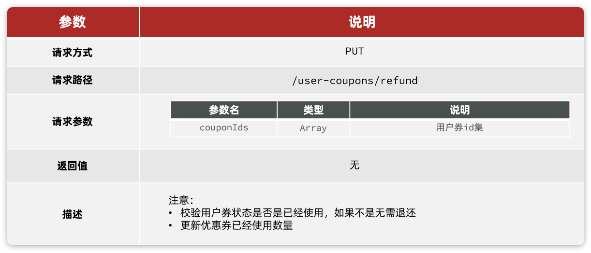

这个接口与核销优惠券类似，不再赘述

### 3.3.2.实现接口

在`tj-promotion`的`com.tianji.promotion.controller.UserCouponController`中定义接口：

```java
@ApiOperation("退还指定优惠券")
@PutMapping("/refund")
public void refundCoupon(@ApiParam("用户优惠券id集合") @RequestParam("couponIds") List<Long> userCouponIds){
    userCouponService.refundCoupon(userCouponIds);
}
```

然后是`tj-promotion`的`com.tianji.promotion.service.IUserCouponService`中的方法声明：

```java
void refundCoupon(List<Long> userCouponIds);
```

最后是`tj-promotion`的`com.tianji.promotion.service.impl.UserCouponServiceImpl`中的方法实现：

```java
@Override
@Transactional
public void refundCoupon(List<Long> userCouponIds) {
    // 1.查询优惠券
    List<UserCoupon> userCoupons = listByIds(userCouponIds);
    if (CollUtils.isEmpty(userCoupons)) {
        return;
    }
    // 2.处理优惠券数据
    List<UserCoupon> list = userCoupons.stream()
            // 过滤无效券
            .filter(coupon -> coupon != null && UserCouponStatus.USED == coupon.getStatus())
            // 更新状态字段
            .map(coupon -> {
                UserCoupon c = new UserCoupon();
                c.setId(coupon.getId());
                // 3.判断有效期，是否已经过期，如果过期，则状态为 已过期，否则状态为 未使用
                LocalDateTime now = LocalDateTime.now();
                UserCouponStatus status = now.isAfter(coupon.getTermEndTime()) ?
                        UserCouponStatus.EXPIRED : UserCouponStatus.UNUSED;
                c.setStatus(status);
                return c;
            }).collect(Collectors.toList());

    // 4.修改优惠券状态
    boolean success = updateBatchById(list);
    if (!success) {
        return;
    }
    // 5.更新已使用数量
    List<Long> couponIds = userCoupons.stream().map(UserCoupon::getCouponId).collect(Collectors.toList());
    int c = couponMapper.incrUsedNum(couponIds, -1);
    if (c < 1) {
        throw new DbException("更新优惠券使用数量失败！");
    }
}
```

### 3.3.3.添加FeignClient方法

在`tj-api`模块的`com.tianji.api.client.promotion.PromotionClient`中添加新的接口：

```java
@ApiOperation("退还指定优惠券")
@PutMapping("/user-coupons/refund")
void refundCoupon(@ApiParam("用户优惠券id集合") @RequestParam("couponIds") List<Long> userCouponIds);
```

在`tj-api`模块的`com.tianji.api.client.promotion.fallback.PromotionClientFallback`中添加接口的降级逻辑：

```java
package com.tianji.api.client.promotion.fallback;

import com.tianji.api.client.promotion.PromotionClient;
import com.tianji.api.dto.promotion.CouponDiscountDTO;
import com.tianji.api.dto.promotion.OrderCouponDTO;
import com.tianji.api.dto.promotion.OrderCourseDTO;
import com.tianji.common.exceptions.BizIllegalException;
import lombok.extern.slf4j.Slf4j;
import org.springframework.cloud.openfeign.FallbackFactory;

import java.util.Collections;
import java.util.List;

@Slf4j
public class PromotionClientFallback implements FallbackFactory<PromotionClient> {
    @Override
    public PromotionClient create(Throwable cause) {
        log.error("查询促销服务出现异常，", cause);
        return new PromotionClient() {
            @Override
            public List<CouponDiscountDTO> findDiscountSolution(List<OrderCourseDTO> orderCourses) {
                return Collections.emptyList();
            }

            @Override
            public CouponDiscountDTO queryDiscountDetailByOrder(OrderCouponDTO orderCouponDTO) {
                return null;
            }
            
            @Override
            public void writeOffCoupon(List<Long> userCouponIds) {
                throw new BizIllegalException(500, "核销优惠券异常", cause);
            }
            
            @Override
            public void refundCoupon(List<Long> userCouponIds) {
                throw new BizIllegalException(500, "退还优惠券异常", cause);
            }
        };
    }
}
```

### 3.3.4.改造交易服务接口

最后，需要改造`tj-trade`中的`com.tianji.trade.service.impl.OrderServiceImpl`取消订单接口，在最后添加取消优惠券的逻辑：

```java
@Override
@Transactional
public void cancelOrder(Long orderId) {
    Long userId = UserContext.getUser();
    // 1.查询订单
    Order order = getById(orderId);
    if (order == null || !userId.equals(order.getUserId())) {
        throw new BadRequestException(ORDER_NOT_EXISTS);
    }
    // 2.判断订单状态是否已经取消，幂等判断
    if(OrderStatus.CLOSED.equalsValue(order.getStatus())){
       // 订单已经取消，无需重复操作
       return;
    }
    // 3.判断订单是否未支付，只有未支付订单才可以取消
    if(!OrderStatus.NO_PAY.equalsValue(order.getStatus())){
        throw new BizIllegalException(ORDER_ALREADY_FINISH);
    }
    // 4.可以更新订单状态为取消了
    boolean success = lambdaUpdate()
            .set(Order::getStatus, OrderStatus.CLOSED.getValue())
            .set(Order::getMessage, "用户取消订单")
            .set(Order::getCloseTime, LocalDateTime.now())
            .eq(Order::getStatus, OrderStatus.NO_PAY.getValue())
            .eq(Order::getId, orderId)
            .update();
    if (!success) {
        return;
    }
    // 5.更新订单条目的状态
    detailService.updateStatusByOrderId(orderId, OrderStatus.CLOSED.getValue());

    // 6.退还优惠券
    promotionClient.refundCoupon(order.getCouponIds());
}
```

### 3.3.5.分布式事务

注意退还优惠券、核销优惠券的分布式事务问题，可以基于Seata来解决。

## 3.4.查询优惠券

在用户中心查询订单详情的时候，需要展示订单使用的优惠券信息：

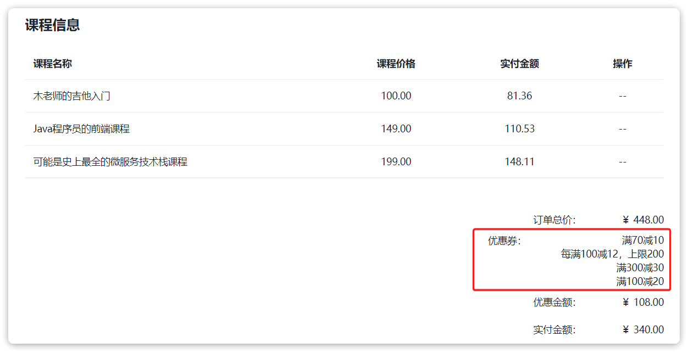

然而订单中只保存了使用过的优惠券的id：

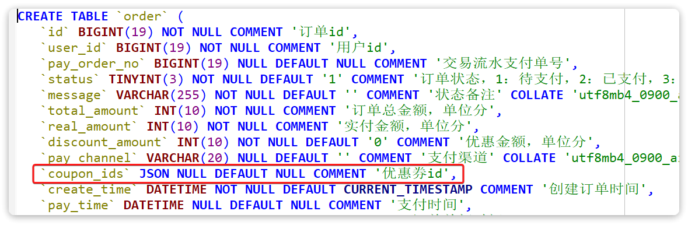

所以，必须在查询订单详情的过程中，根据优惠券id查询优惠规则描述信息。

### 3.4.1.定义接口

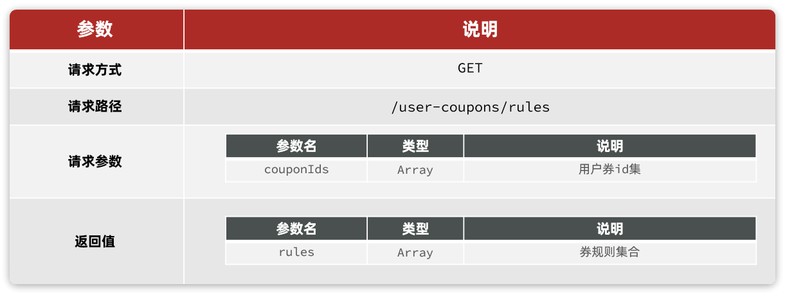

### 3.4.2.实现接口

在`tj-promotion`的`com.tianji.promotion.controller.UserCouponController`中定义接口：

```java
@ApiOperation("分页查询我的优惠券接口")
@GetMapping("/rules")
public List<String> queryDiscountRules(
        @ApiParam("用户优惠券id集合") @RequestParam("couponIds") List<Long> userCouponIds){
    return userCouponService.queryDiscountRules(userCouponIds);
}
```

然后是`tj-promotion`的`com.tianji.promotion.service.IUserCouponService`中的方法声明：

```java
List<String> queryDiscountRules(List<Long> userCouponIds);
```

最后是`tj-promotion`的`com.tianji.promotion.service.impl.UserCouponServiceImpl`中的方法实现：

```java
@Override
public List<String> queryDiscountRules(List<Long> userCouponIds) {
    // 1.查询优惠券信息
    List<Coupon> coupons = baseMapper.queryCouponByUserCouponIds(userCouponIds, UserCouponStatus.USED);
    if (CollUtils.isEmpty(coupons)) {
        return CollUtils.emptyList();
    }
    // 2.转换规则
    return coupons.stream()
            .map(c -> DiscountStrategy.getDiscount(c.getDiscountType()).getRule(c))
            .collect(Collectors.toList());
}
```

### 3.4.3.添加FeignClient方法

在`tj-api`模块的`com.tianji.api.client.promotion.PromotionClient`中添加新的接口：

```java
@ApiOperation("分页查询我的优惠券接口")
@GetMapping("/user-coupons/rules")
List<String> queryDiscountRules(@ApiParam("用户优惠券id集合") @RequestParam("couponIds") List<Long> userCouponIds);
```

在`tj-api`模块的`com.tianji.api.client.promotion.fallback.PromotionClientFallback`中添加接口的降级逻辑：

```java
package com.tianji.api.client.promotion.fallback;

import com.tianji.api.client.promotion.PromotionClient;
import com.tianji.api.dto.promotion.CouponDiscountDTO;
import com.tianji.api.dto.promotion.OrderCouponDTO;
import com.tianji.api.dto.promotion.OrderCourseDTO;
import com.tianji.common.exceptions.BizIllegalException;
import lombok.extern.slf4j.Slf4j;
import org.springframework.cloud.openfeign.FallbackFactory;

import java.util.Collections;
import java.util.List;

@Slf4j
public class PromotionClientFallback implements FallbackFactory<PromotionClient> {
    @Override
    public PromotionClient create(Throwable cause) {
        log.error("查询促销服务出现异常，", cause);
        return new PromotionClient() {
            @Override
            public List<CouponDiscountDTO> findDiscountSolution(List<OrderCourseDTO> orderCourses) {
                return Collections.emptyList();
            }
            
            @Override
            public CouponDiscountDTO queryDiscountDetailByOrder(OrderCouponDTO orderCouponDTO) {
                return null;
            }
            
            @Override
            public void writeOffCoupon(List<Long> userCouponIds) {
                throw new BizIllegalException(500, "核销优惠券异常", cause);
            }
            
            @Override
            public void refundCoupon(List<Long> userCouponIds) {
                throw new BizIllegalException(500, "退还优惠券异常", cause);
            }
            
            @Override
            public List<String> queryDiscountRules(List<Long> userCouponIds) {
                return Collections.emptyList();
            }
        };
    }
}
```

### 3.4.4.改造交易服务接口

最后，需要改造`tj-trade`中的`com.tianji.trade.service.impl.OrderServiceImpl`查询订单详情的接口，添加查询优惠券规则描述的逻辑：

```java
@Override
public OrderVO queryOrderById(Long id) {
    // 1.查询订单
    Order order = getById(id);
    if (order == null) {
        throw new BadRequestException(ORDER_NOT_EXISTS);
    }
    // 2.查询订单详情
    List<OrderDetail> details = detailService.queryByOrderId(id);
    // 3.转换VO
    // 3.1.订单
    OrderVO vo = BeanUtils.toBean(order, OrderVO.class);
    // 3.2.订单详情
    List<OrderDetailVO> dvs = BeanUtils.copyList(details, OrderDetailVO.class, (d, v) -> v.setCanRefund(
            // 订单已经支付，且 退款没有在进行中，标记为可退款状态
            OrderStatus.canRefund(d.getStatus()) && !RefundStatus.inProgress(v.getRefundStatus())
    ));
    vo.setDetails(dvs);
    // 3.3.订单进度
    vo.setProgressNodes(detailService.packageProgressNodes(order, null));

    // 3.4.优惠明细
    List<String> rules = promotionClient.queryDiscountRules(order.getCouponIds());
    vo.setCouponDesc(String.join("/", rules));
    return vo;
}
```

# 4.面试问题

## 4.1.你们的优惠券规则是如何编码实现的？

::: warning

答：我们的优惠规则是基于策略模式来定义的。在初期做调研的时候也考虑过规则引擎，不过考虑到我们的优惠规则并不复杂，而且规则引擎太重，增加了学习和维护成本，最终选择了基于策略模式来自定义规则。

:::

## 4.2.你在项目中有没有使用到设计模式？

::: warning

答：当然用到过，比如在优惠券功能中就使用了策略模式来定义优惠规则。还有我实现的基于注解的通用分布式锁组件，也使用到了策略模式、工厂模式

:::

## 4.3.你在项目中有没有使用到线程池或者并发编程？

::: warning

答：当然，项目中很多地方都有用到。比如在实现优惠券的推荐算法时，我们采用的是排列组合多种优惠方案，然后分别计算，最终筛选出最优解的思路。

由于需要计算的优惠方案可能较多，为了提高计算效率，我们利用了CompletableFuture来实现多方案的并行计算。并且由于要筛选最优解，那就需要等待所有方案都计算完毕，再来筛选。因此就使用了CountdownLatch来做多线程的并行控制。

:::

## 4.4.那你能不能聊一聊CountdownLatch的基本原理？

::: warning

略，参考面试宝典

:::

## 4.5.使用优惠券的订单可能包含多个商品，如果出现部分商品退款的情况，你们如何处理退款金额？优惠券是如何处理的？

::: warning

答：这里处理的方案有很多种，可以选择退券或不退券。不过基于产品的需求，我们采用的是不退券的方案。

具体来说，就是在一开始下单时，就会根据优惠券本身的使用范围，筛选出订单中可以参与优惠的商品，然后计算出每一个被优惠的商品具体的优惠金额分成，以及对应的实付金额。

而在退款的时候，如果用户选择只退部分商品，我们就可以根据每个商品的实付金额来退款，实现订单拆分退款。同时也满足退款不退券的原则。

当然，如果订单未支付，直接取消或者超时关闭，是可以退还优惠券的。

::: warning
