# day13~14-分组实战

# 1.背景说明

经过十多天的学习，我们已经掌握了天机学堂项目的整体业务流程，并且参与了部分微服务的开发，对于整个项目也有了更深的理解。

不过天机学堂中还有部分功能没有开发完成，这些功能就交给大家来完成了。加油！

# 2.功能需求

项目分组实战，目标是完成两个需求，分别是

- 学习中心微服务-学习笔记功能        （★★★☆☆）
- 考试微服务-考试评测功能              （★★★☆☆）

详细功能需求参考页面原型：

用户端：

https://codesign.qq.com/s/JG2mj7n1P3ZVKdM/preview/prototype/XMx86jzyQ1Zbrz3

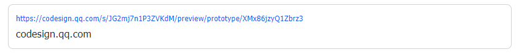

管理端：

https://codesign.qq.com/app/prototype/Q2kY5j3pb9ExNdK/detail

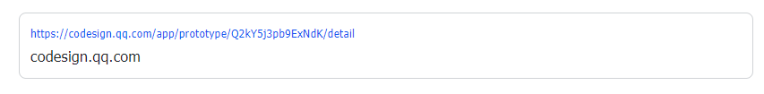

## 2.1.学习笔记功能

学员学习视频的过程中会碰到一些重点知识，为了防止遗忘以及自己方便以后复习，最好把这些知识点快速记录下来。因此我们需要提供一个学习笔记功能，供学员快速记录核心知识点。

而且为了方便后续复习知识，每个笔记都应该带上记录笔记时的视频时间点，与视频播放顺序对应。

### 2.1.1.视频学习页面

学员在学习的视频的过程中，可以记录学习笔记，也可以查看当前**视频小节**下其他同学记录的笔记（公开的）：

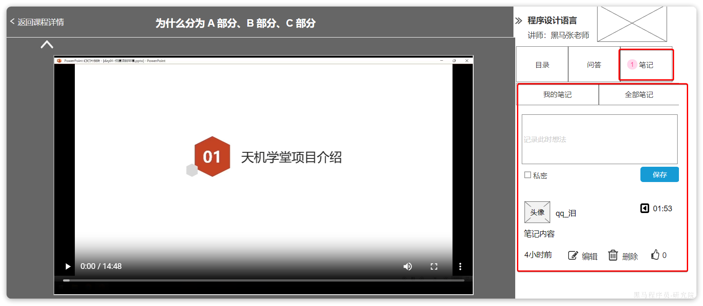

页面需求如下：

::: warning

1. **笔记**

- 我的笔记：用户可以创建笔记 保存笔记会标记视频位置点，根据保存时视频所在位置确定视频时间
- 全部笔记：展示其他用户的非私密笔记、自己的所有笔记（不包含采集他人的）
- 操作：可以对其他人的笔记**点赞**、**采集**操作；可以对自己笔记做编辑、删除操作
- 采集：是将他人笔记复制到我的笔记中且做私密处理，采集他人笔记不会进入到全部笔记中

:::

### 2.1.2.课程详情页面

除了学习页面以外，在课程详情页面同样可以查看**课程**下的所有笔记：

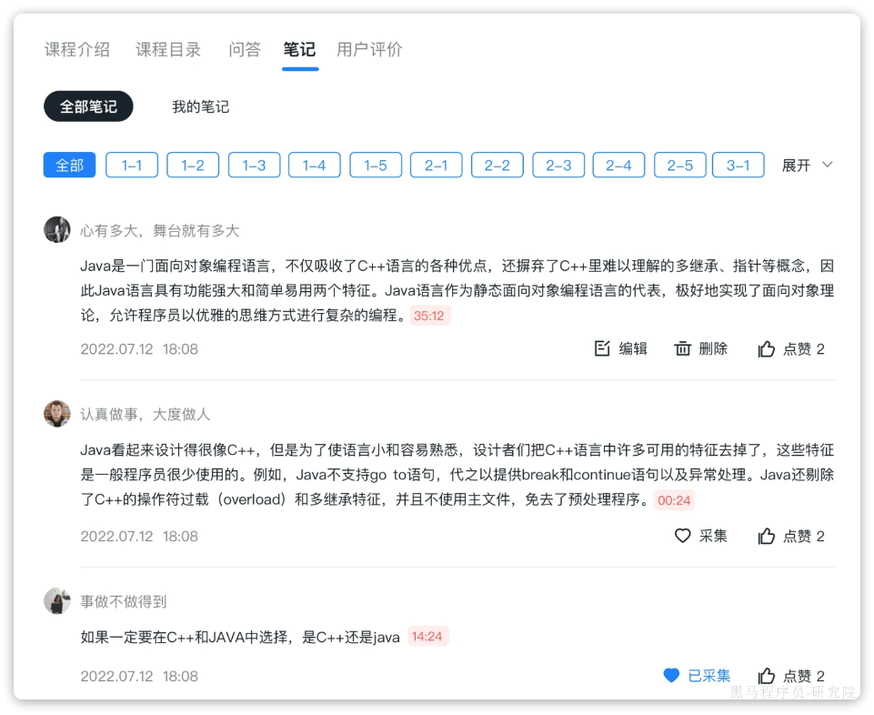

页面需求如下：

::: warning

1、**笔记区**

- 购买课程的用户才可以看到笔记页面 ，未登录或未购买课程的用户无法看到笔记
- 可以查看全部笔记或我的笔记
- 笔记可以根据章节查看，点击展开更多展示全部章节
- 全部笔记中**不展示**私人笔记、自己采集的笔记
- 我的笔记中展示自己写的笔记和自己采集的笔记

2、**笔记详情**

- 笔记详情内容包括 发布笔记人、笔记内容、发布时间、点赞数
- 本人发布的笔记可以进行删除和编辑
- 对其他人发布的笔记可以进行采集操作，采集操作是将他人笔记复制到我的笔记中且做私密处理，采集他人笔记不会进入到全部笔记中
- 笔记-用户可以创建笔记 笔记会标记视频位置点，用户可以点击视频点位查看该视频

:::

### 2.1.3.后台管理页面

后台管理员可以也查看学员笔记，并对笔记进行管理和审核。

笔记列表页：

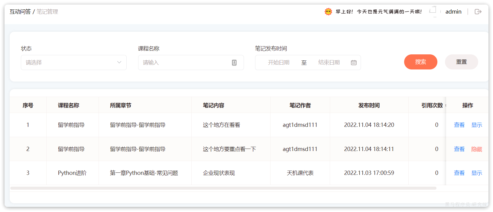

页面需求如下：

::: warning

1、**搜索条**

- 笔记状态：显示或隐藏，是指是否在用户端显示
- 课程名称：根据课程名称关键字模糊搜索，需要搜索到课程下的所有笔记
- 笔记发布时间：就是笔记的创建时间

2、**数据列表**

- 单页默认显示10条笔记
- 数据来源：仅显示用户发布的公开笔记
- 排列顺序：默认按照发布时间倒序排列，用户点击引用次数、点赞次数后，根据对应列排序
- 引用次数：就是被采集的次数

3、**操作**

- 查看：点击后跳转到笔记详情页
- 隐藏：点击隐藏则标记该条笔记为隐藏，在用户端页面不显示
- 显示：已经被隐藏的笔记才会显示该按钮，点击后标记该笔记可以在用户端显示
- 悬停：当鼠标悬停在笔记内容上时，显示完整笔记内容

:::

笔记详情页：

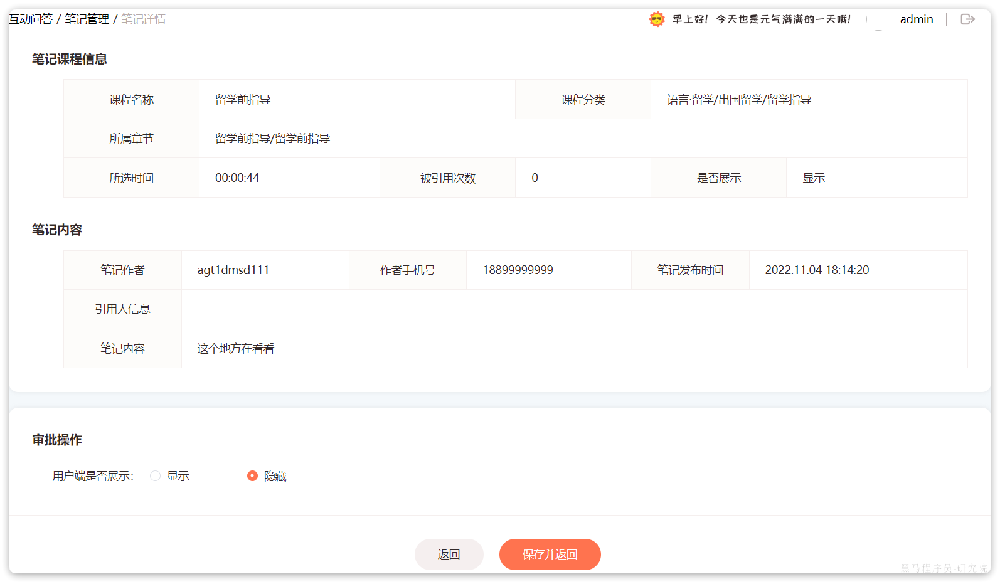

页面需求如下：

::: warning

1、**课程信息**

- 课程名称/分类/所属章节：单行需要完整的展示；
- 所选时间：所截取的视频时间；
- 引用次数：当前引用的总次数；
- 用户端是否显示：显示/隐藏

2、**笔记内容**

- 笔记作者：显示用户的名称；
- 作者手机号：显示用户手机号码；
- 笔记发布时间：显示笔记的提交/更新的时间；
- 引用人信息：显示引用人用户名；单行最多显示30个字，需完整显示所有引用人用户名；

3、**审批操作**

- 用户端是否展示：
  - 默认为显示状态，显示状态下，用户端可以查看该笔记，可进行点赞/引用；
  - 点击【隐藏】，用户端无法查看到该笔记，且该笔记状态从显示 变成 隐藏，出已隐藏的提示；

:::

## 2.2.考试评测功能

学员学完之后肯定需要知道自己对知识的掌握的程度，所以我们提供了考试测评系统。这也是在线教育类网站的必备功能之一。

考试评测系统分为两大部分：

- 管理端：
  - 题目管理
- 学员端：
  - 参加考试
  - 查看考试

其中管理端题目管理部分已经有其他开发人员完成了开发，不过由于工作调动的原因，无法继续后续的开发。因此学员考试等功能就需要我们来完成了。

接手他人工作这样的事情，在你以后的工作中很常见，我们需要适应。

通过这部分功能的实现，你能掌握以下技能：

- 如何接手他人的项目继续开发
- 考试评测系统的设计
- MongoDB的使用

### 2.2.1.试题管理

当我们接手别人的工作时，首先要做的就是阅读源码。不过，我的建议是你最好跟正常开发类似的步骤来走：

- 阅读原型图和需求文档
- 分析数据结构设计
- 阅读接口设计源码（之前是开发）

试题管理属于管理端功能，在管理端的题目管理菜单下，首先是列表查询：

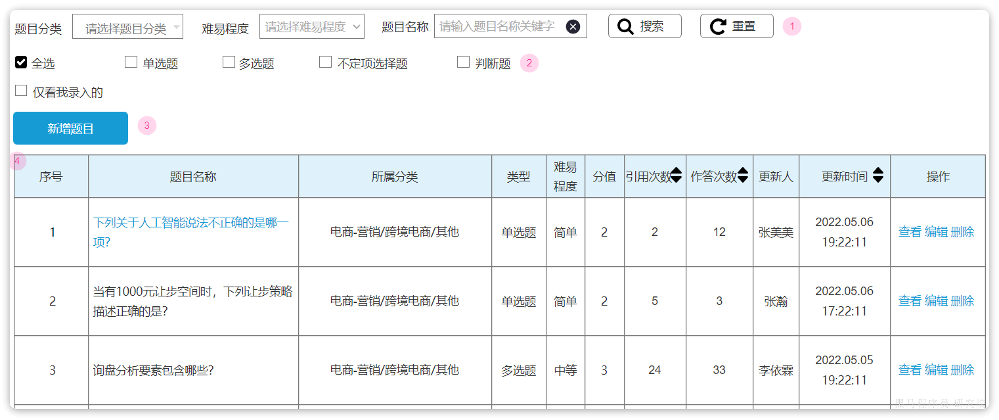

页面需求如下：

::: warning

1、**搜索条件**

- 题目分类：也就是课程分类，可以多选
- 难易程度：困难、中等、简单，单选
- 题目名称：输入题目名称关键字模糊搜索
- 题目类型：复选框，目前不支持主观题
- 仅看我录入：查找creater等于当前用户的题目

2、**数据列表**

- 数据排序：默认按照更新时间倒序排序，单页默认显示10条
- 所属分类：三级分类以“/”拼接的字符串
- 引用次数：课程的章节需要关联题目，这里引用次数就是被课程关联的次数；点击后根据此字段排序
- 作答次数：学员每次考试、测试作答的次数；点击后根据此字段排序
- 更新人：最近修改过该题目的人，数据库中对于updater字段

3、**操作**

- 新增题目：点击【新增题目】跳转到新增表单，填写并保存题目信息
- 查看：点击【查看】跳转到【课程详情页】
- 编辑：点击【编辑】跳转到表单页面，需要回显数据
- 删除：点击【删除】判断引用次数是否=0，若不等于0，出错误提示，无法删除

:::

新增/更新 表单页面如下：

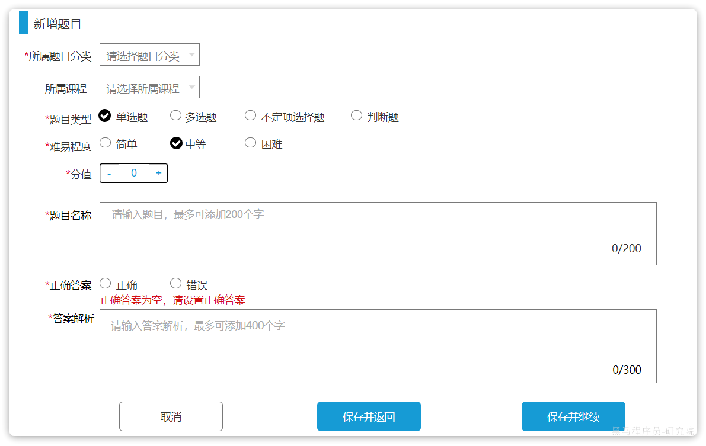

题目详情页：

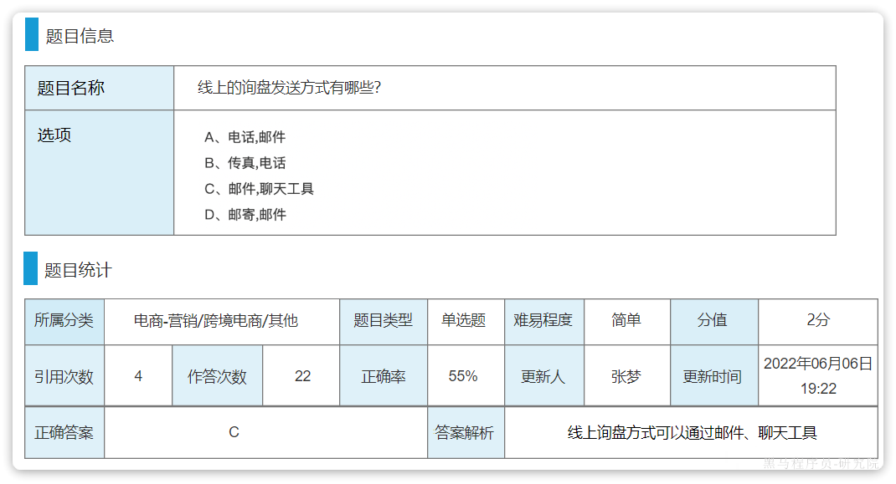

另外，在**添加课程**的过程中，还需要与课程中的小节关联。每一个小节关联10~40道题目，供学生**练习**使用。每一章还可以有一个章节测验，供学生作为**考试**使用。

在课程新增、编辑表单中，就可以关联试题：

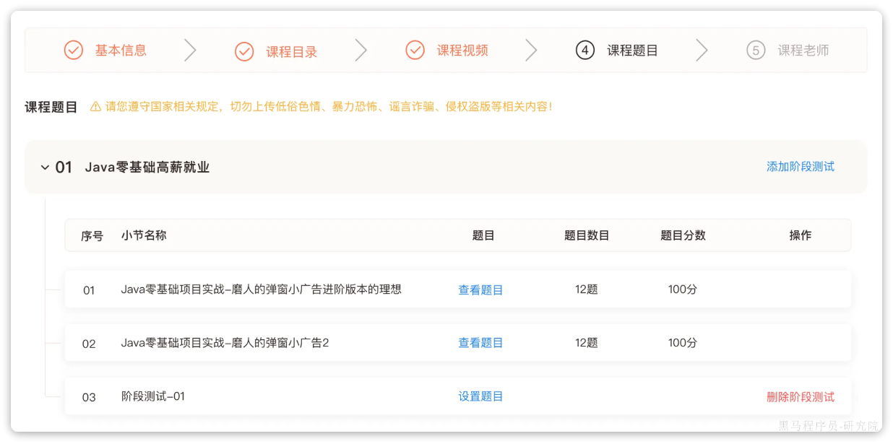

点击【查看题目】，进入题目关联页面：

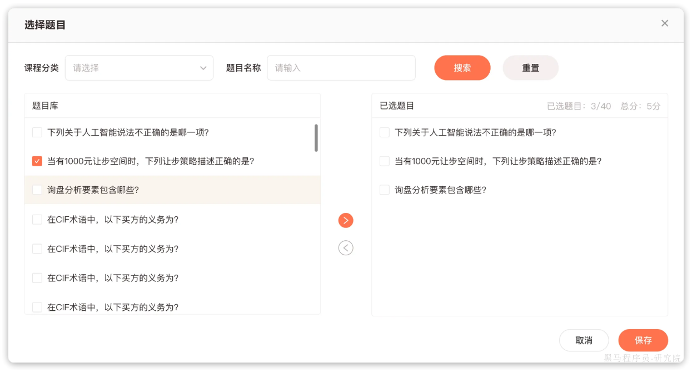

此处需要根据课程分类搜索题目并展示出来，供页面选择。通过穿梭框选择题目后保存，这样小节和题目的关系就持久化到数据库了。

以上就是题目管理的所有页面原型，对应的接口包括：

- 带条件过滤的分页查询题目
- 新增题目
- 修改题目
- 删除题目
- 统计小节的题目数量
- 根据小节id查询题目
- 批量保存小节与题目关系

以上功能对应的数据库表、代码全部都已经实现。大家需要自己查看数据库表结构，并且阅读`tj-exam`中的源码，弄清楚基本的业务逻辑。

### 2.2.2.学员考试

在用户已经登录的情况下，在学习课程视频的页面，可以看到：

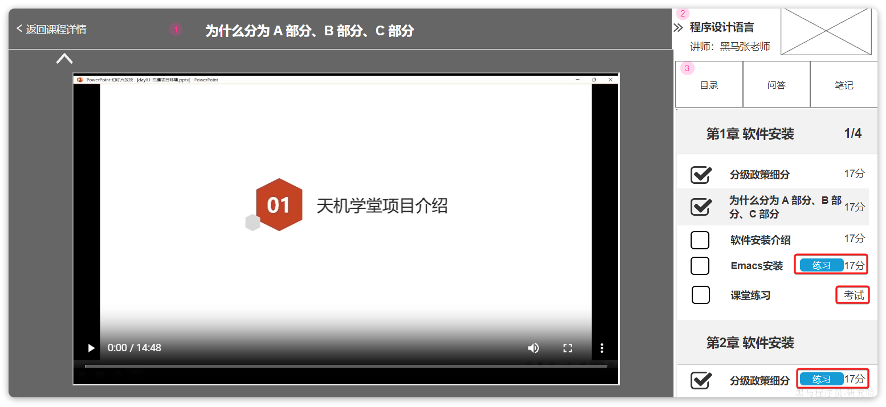

在课程目录中，凡是关联了题目的小节，都会有一个**`练习`**按钮，点击即可开始练习；在每一章的最后一个小节，老师可以设置一个练习小节（不包含视频），作为本章**`考试`**。

点击练习或考试后，会进入考试页面，如图：

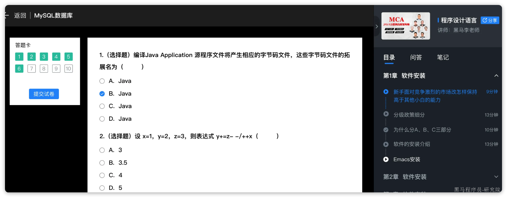

练习、考试的规则如下：

::: warning

1、**考试区**

- 考试类型：分为练习、考试两种
- 练习：如果小节关联了题目，则学员可以做小节练习，练习可以重复多次
- 考试：如果章的最后设置了阶段考试，当该章所有小节学习完成则可以考试，考试只能参加一次
- 时间：练习或考试都需要记录用时
- 结束：练习如果中途离开，不保存做题记录；考试如果中途离开，自动结束并提交当前已完成题目。

2、**目录区**

- 系统后台设置章节有练习时，课程目录后展示练习按钮，用户可以点击进入该小节练习
- 用户在学完本节课程后，如果小节后有练习，则直接弹出练习确认框

:::

### 2.2.3.学员考试记录

在用户的个人中心，可以查看以往的练习、考试记录：

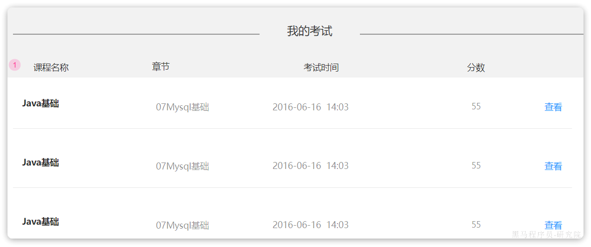

点击查看即可进入考试详情页面：

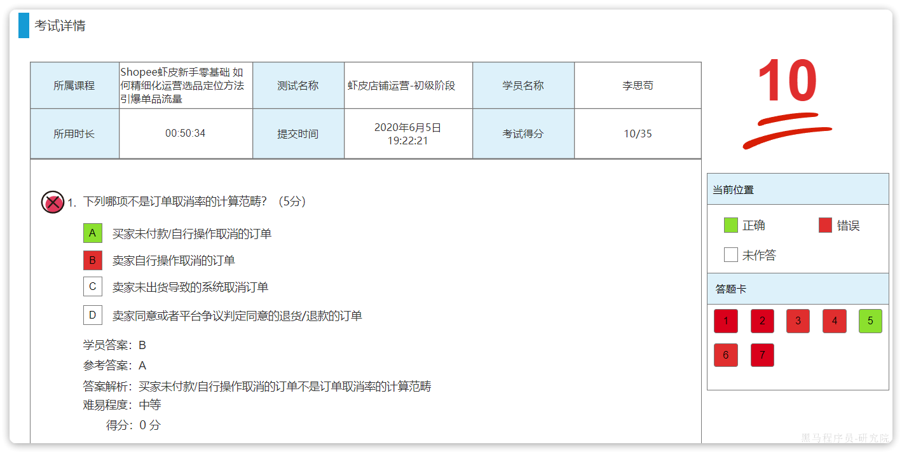

页面需求：

::: warning

1. 考试记录列表

- 数据来源：当前用户的所有考试、练习
- 排序方式：默认按照提交时间倒序排序

:::

## 2.3.其它需求

除了一些页面上能够看到的需求外，还有一些隐含的需求：

::: warning

- 学员考试、写笔记、采集笔记后应该增加用户积分
- 学员提交考试结果后，应该自动批改试卷，并记录考试分数
- 答题的相关信息（回答次数、正确次数）需要实时更新到题目中，方便后续统计
- 考试记录、考试答案信息较多，建议使用MongoDB来存储，MongoDB的用法参考课前资料

:::

# 3.接口规范

由于我们的前端代码已经实现，

## 3.1.学习笔记功能

### 3.1.1.新增笔记

在视频学习的过程中，我们可以随时添加一条学习笔记：

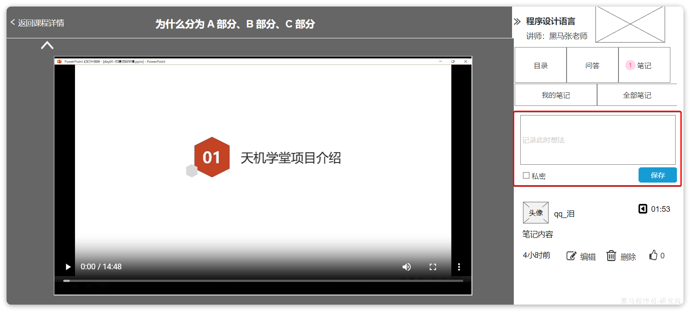

笔记的基本信息包括：

- 笔记内容
- 是否是私密笔记

不过，笔记需要与课程、章节关联，并记录写笔记的具体时间点，因此还需要下列属性：

- 课程id
- 章id
- 节id
- 记录笔记时的视频播放时间

因此，按照Restful来设计，接口如下：

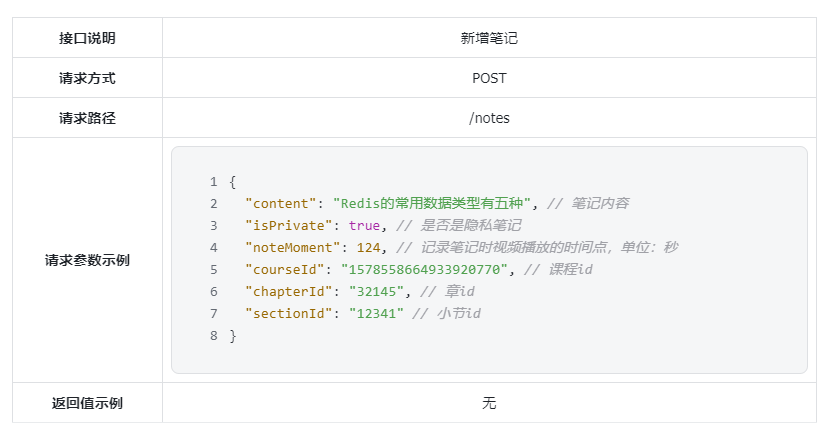

### 3.1.2.采集、取消采集笔记

用户可以查看他人笔记，如果觉得笔记不错，也可以采集笔记：

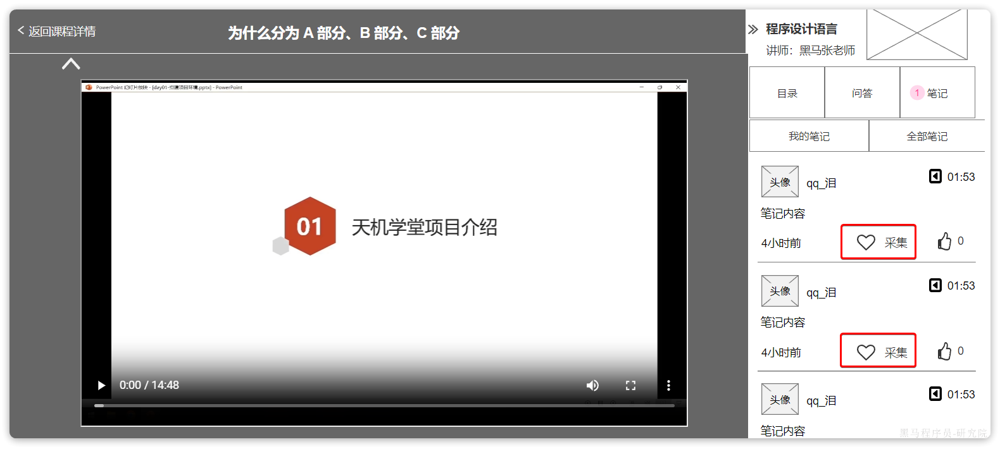

采集笔记就是将他人笔记**复制**到我的笔记中且做**私密**处理。因此请求时只需要知道要采集的笔记id即可。与之对应的还有一个取消采集。

因此，按照Restful来设计，接口如下：

**采集笔记**

| **接口说明**     | 采集笔记                   |
| ---------------- | -------------------------- |
| **请求方式**     | POST                       |
| **请求路径**     | /notes/gathers/{id}        |
| **请求参数示例** | 路径占位符，要采集的笔记id |
| **返回值示例**   | 无                         |

**取消采集笔记**

| **接口说明**     | 取消采集笔记                   |
| ---------------- | ------------------------------ |
| **请求方式**     | DELETE                         |
| **请求路径**     | /notes/gathers/{id}            |
| **请求参数示例** | 路径占位符，要取消采集的笔记id |
| **返回值示例**   | 无                             |

### 3.1.3.编辑、删除笔记

在课程详情页，笔记列表中，我们可以编辑、删除笔记：

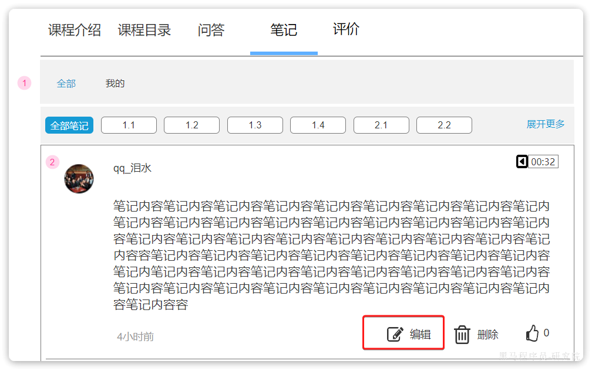

笔记与课程、章节绑定后无法修改，因此编辑的时候，只能对笔记内容、是否私密做修改。

按照Restful的风格，接口信息如下：

因此，按照Restful来设计，编辑笔记的接口如下：

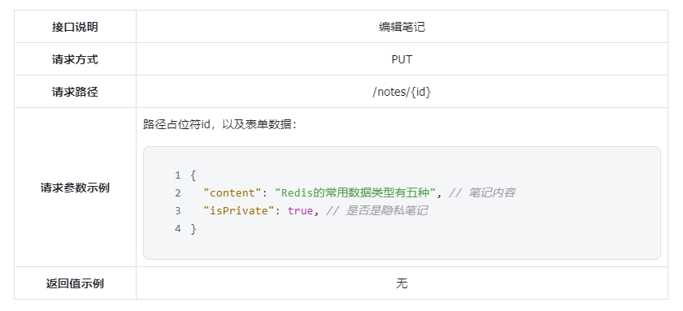

删除笔记的接口如下：

| **接口说明**     | 删除笔记     |
| ---------------- | ------------ |
| **请求方式**     | DELETE       |
| **请求路径**     | /notes/{id}  |
| **请求参数示例** | 路径占位符id |
| **返回值示例**   | 无           |

### 3.1.4.用户端分页查询笔记

在课程详情页，可以查询课程或课程某小节下的一些笔记，分为两种：

- 查询我的笔记
- 查询全部笔记

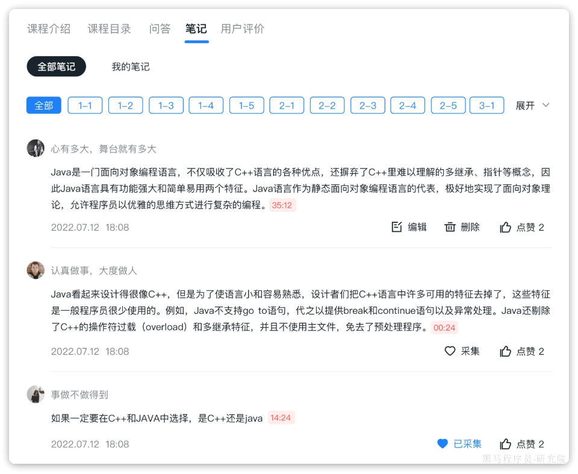

在查询的时候，可能根据课程id、小节id过滤，另外还要区分我的笔记或全部笔记，因此参数包括：

- 课程id：可选
- 小节id：可选
- 是否只查询我的笔记：必填

而返回值则如页面所示，包含下列字段：

- id
- 笔记内容
- 笔记记录时间
- 是否是隐私笔记
- 是否是我采集的笔记
- 作者id
- 作者名字
- 作者头像
- 笔记发布时间

因此，按照Restful来设计，编辑笔记的接口如下：

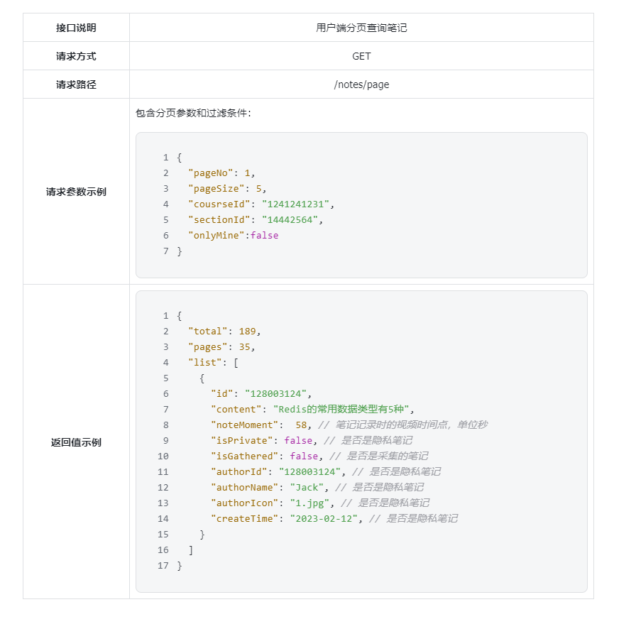

### 3.1.5.管理端分页查询笔记

管理端需要对用户提交的笔记做审核管理，因此有一个分页查询笔记列表的功能：

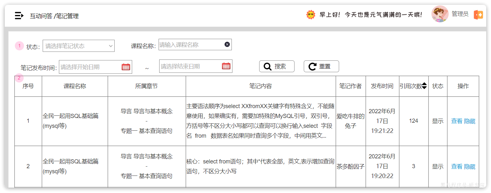

查询条件除了分页条件外，就是顶部过滤项：

- 笔记状态：true或false，标示笔记是否要在用户端隐藏
- 笔记关联的课程名称
- 笔记发布时间

查询结果如原型中的列表所示，包含下列字段：

- 笔记id
- 课程名称
- 课程章、节名称
- 笔记内容
- 笔记作者
- 笔记发布时间
- 引用次数（笔记被采集次数）
- 笔记状态：true或false，标示笔记是否要在用户端隐藏

因此，按照Restful的风格，接口信息如下：

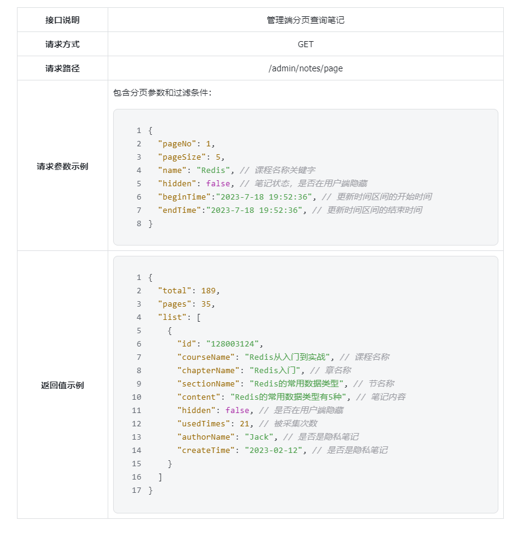

### 3.1.6.管理端查询笔记详情

在管理端的笔记列表页，点击笔记列表中的某一条笔记时，可以进入笔记详情：

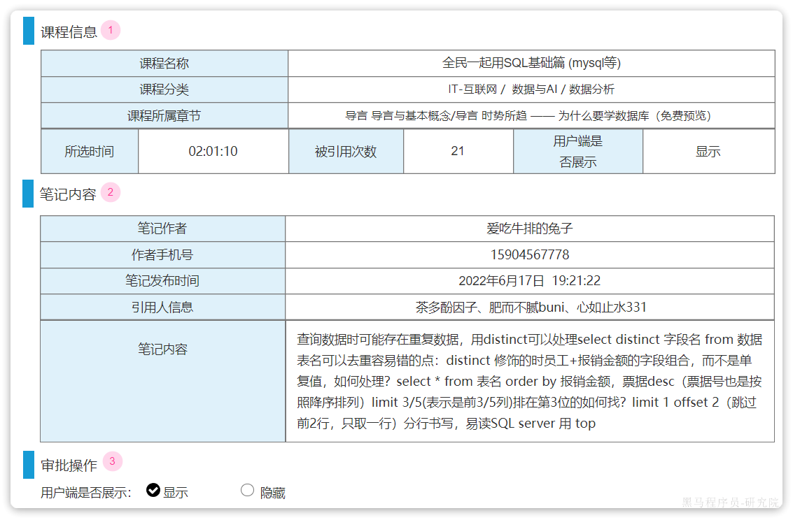

因此，查询条件就是笔记id，而查询结果如原型所示，包含下列字段：

- 笔记id
- 课程名称
- 课程分类名称
- 章、节名称
- 笔记发布时的视频播放时间
- 被引用次数（被采集次数）
- 用户端是否展示（是否隐藏）
- 作者名称
- 作者电话
- 笔记发布时间
- 引用人：采集过当前笔记的用户列表
- 笔记内容

因此，按照Restful的风格，接口信息如下：

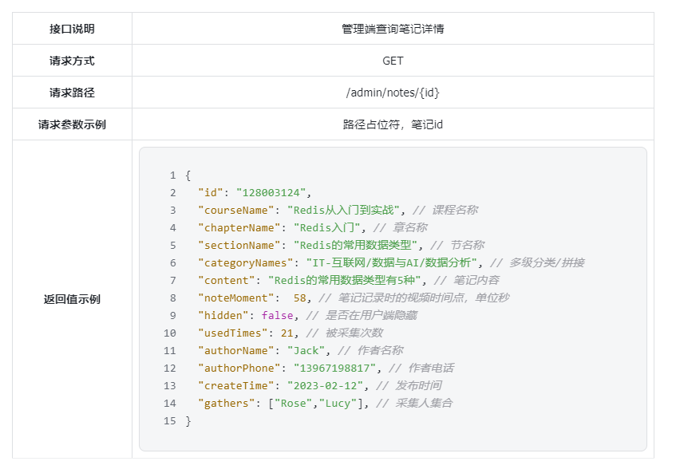

### 3.1.7.隐藏或显示笔记

管理员如果觉得笔记内容有问题，可以在笔记列表页面隐藏笔记：

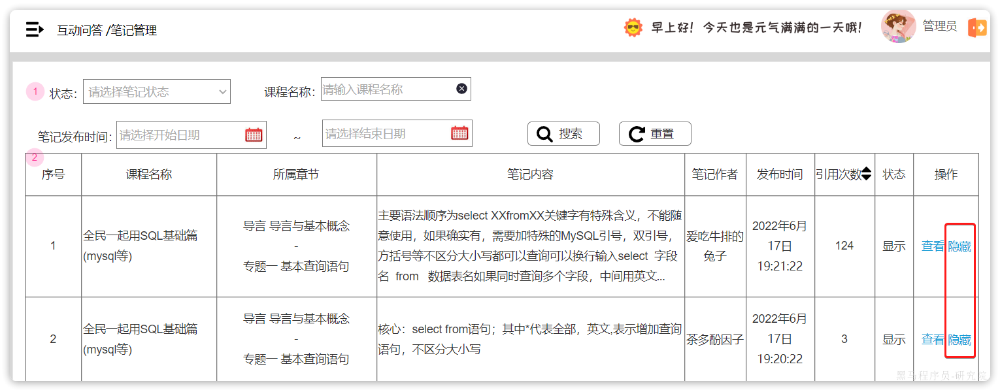

请求参数只需要指定id和是否隐藏即可。

因此，按照Restful来设计，接口如下：

| **接口说明**     | 隐藏或显示笔记                    |
| ---------------- | --------------------------------- |
| **请求方式**     | PUT                               |
| **请求路径**     | /admin/notes/{id}/hidden/{hidden} |
| **请求参数示例** | 路径占位符，要采集的笔记id        |
| **返回值示例**   | 无                                |

## 3.2.考试评测功能

**注意**：考试评测的数据量较大，请使用MongoDB来存储考试记录、学员答案等信息。

### 3.2.1.获取试题并开始考试接口

当用户在视频学习页面点击某个视频小节后面的**`练习`**按钮，或者点击章节末尾的`测试小节`时，就会去读取对应的练习题，展示在页面上：

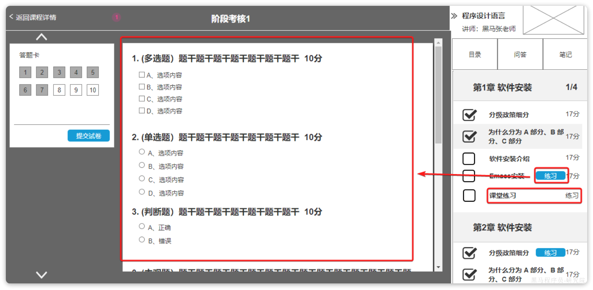

不过，这里不仅仅是查询题目这么简单：

首先，考试是要计时的，我们需要在查询时先插入一条考试记录，记录考试的开始时间。

其次，不能随便什么人来了都能考试，我们要验证用户是否购买了该课程

最后，章节最后的考试每人只能参加一次；普通小节的练习则可以任意参加。

因此，开始考试的整体业务流程是这样的：

.jpg)

为了满足上述业务流程，请求的参数就需要包含：

- 课程id，方便判断用户是否购买课程
- 小节id，方便查询小节下的题目
- 考试类型，判断是练习还是考试

而返回值则应该包含一个考试记录，用于将来提交考试结果做匹配。然后就是考试的题目信息了。

- 考试记录id：考试的唯一标示，交卷的时候用
- 考试题目的列表：
  - 题目id
  - 题目名称
  - 题目选项（如果是选择题的话）
  - 题目类型
  - 题目分值

然后按照Restful来设计，接口如下：

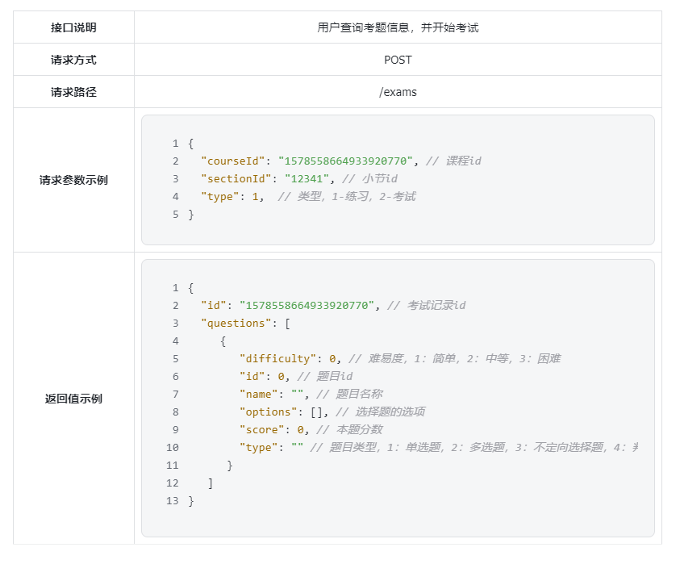

### 3.2.2.提交考试结果

考试完成后，用户点击提交试卷，即可将答题信息提交到后台。

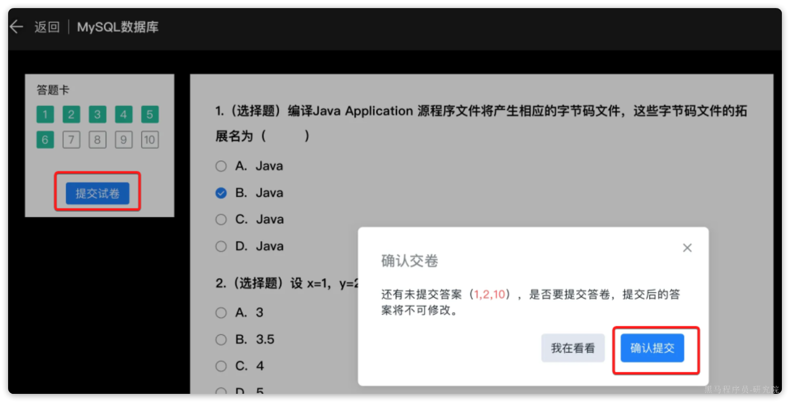

服务端接收到试卷以后，有一系列的动作要做：

- 首先需要校验记录是否存在
- 然后还要做幂等校验，检查是否是重复提交
- 如果没有问题，则需要对试卷做自动批阅（客观题都可以自动批阅，目前1期项目中只包含客观题）
- 批阅完成，将考试得分、答题信息等保存到数据库中

到这里，考试的相关流程就完结了。

不过，**需要注意的是**：考试小节属于课程学习的一部分，在我们之前实现的学习记录中，需要统计已经学习过的小节。因此当用户提交考试后，需要通知到学习微服务，新增一条学习记录。

因此，提交考试的整体业务流程是这样的：

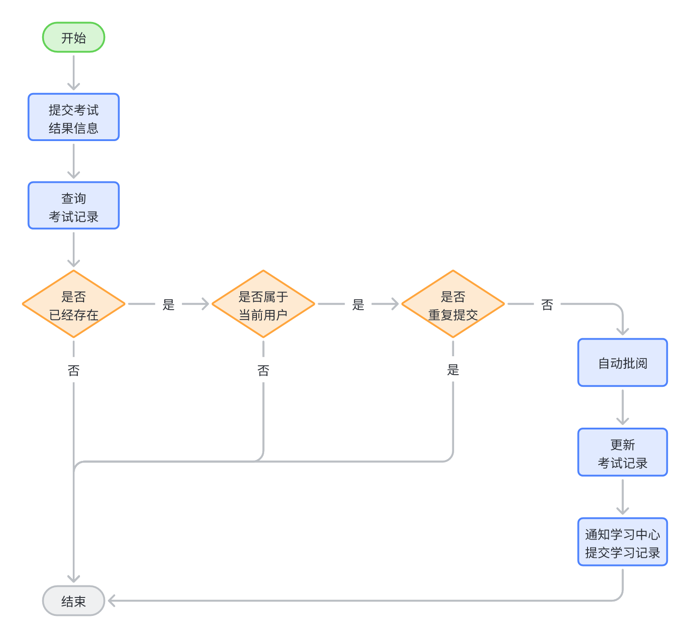

该业务主要是提交信息，无需返回数据。因此主要关注请求参数。而请求参数主要就是用户答题信息：

- 考试记录id：考试的唯一标示，交卷的时候用
- 考试答题信息（数组）：
  - 题目id
  - 题目答案
  - 题目类型

然后按照Restful来设计，接口如下：

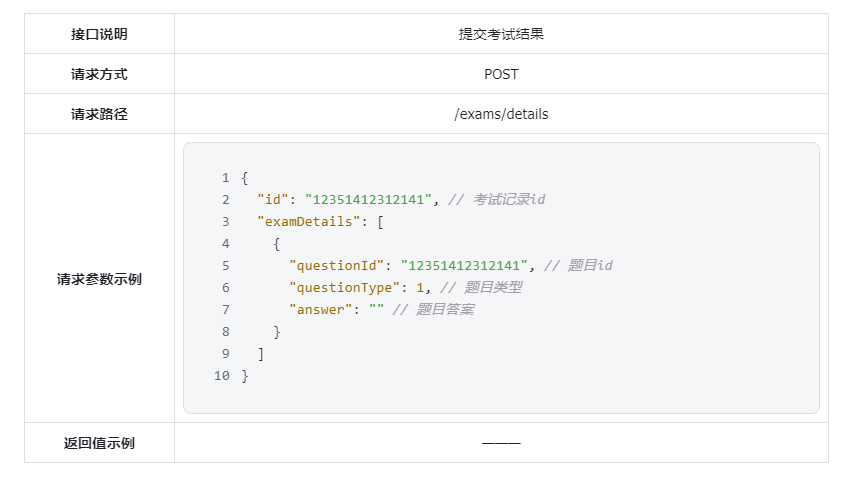

### 3.2.3.分页查询考试记录

在用户的个人中心，可以查看以往的练习、考试记录：

点击查看即可进入考试详情页面：

这个接口就是一个简单的分页查询，请求入参就是基本的分页参数：

- 页码
- 每页大小

而返回值则是分页结果，其中的考试信息有：

- 考试id
- 考试得分
- 考试类型
- 考试提交时间
- 考试用时
- 课程信息
- 章节信息

然后按照Restful来设计，接口如下：

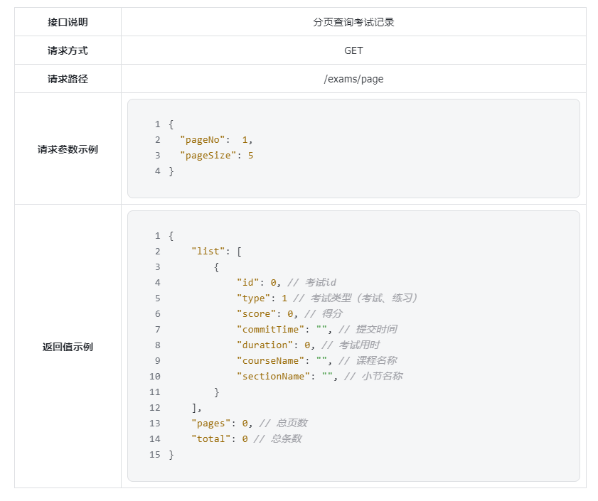

### 3.2.4.查询考试记录详情

在个人中心，用户可以分页查看考试记录。而点击考试记录后，即可查看考试详情：

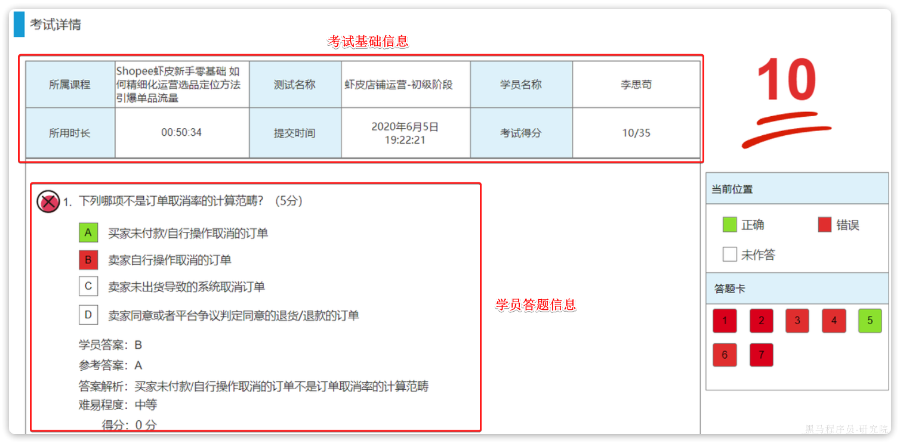

由于考试的基础信息可以从分页列表带过来，因此这里主要是查询题目列表及用户答题信息。包括：

- 题目id
- 学员的答案
- 是否正确
- 学员得分
- 老师评语
- 题目信息：
  - 题目id
  - 题目名称
  - 题目分值
  - 题目选项
  - 题目类型
  - 题目正确答案
  - 答案解析
  - 难易程度

然后按照Restful来设计，接口如下：

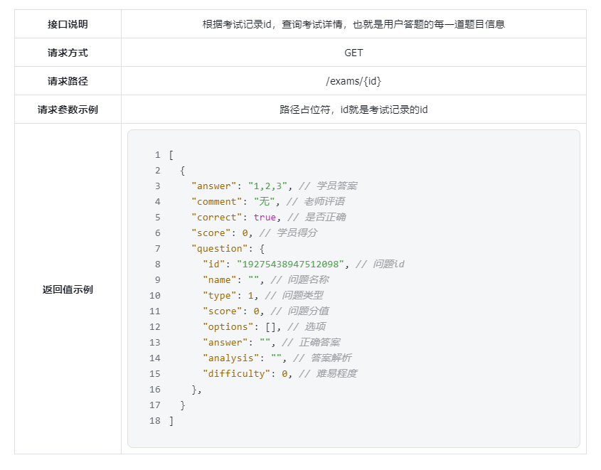

# 4.项目分组

## 4.1.时间安排

此次项目实战安排2天课时（可以加一天自习调整为3天），具体的时间安排如下：

- 第一天上午，由讲师带领学生了解项目实战中的内容
- 第一天的下午，第二天，第三天上午，这些时间段是学生实战开发的时间
- 第三天下午，成果演示

## 4.2.分组安排

- 将一个班的学生分成若干小组，每个小组成员5~6人，最多不超过8人。
- 每个小组选取一名组长，组长负责组员的任务分工。
- 每个组员都要参与开发，不得以任何接口拒绝组长安排的任务。
- 每个小组都需要完成实战中的两个功能的开发。

## 4.3.代码管理

在项目开发的过程中，我们都是基于虚拟机中的git提交代码的，在分组实战中，需要将代码共享，同组人员公共修改代码，此时虚拟机中的git就无法满足需求了，在这里，可以借助[码云](https://gitee.com/)来完成共享。基本的架构如下：

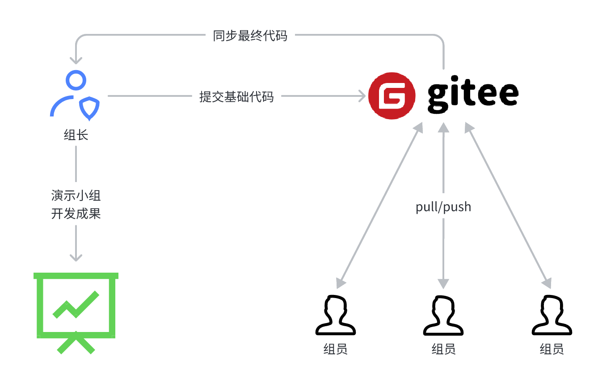

说明：

- 组长在码云中创建相应的项目，并且邀请组员成为开发者
- 组长将本地虚拟机环境中的git代码提交到码云（只需要提交实战中涉及到工程即可）
- 组员代码拉取到本地，即可进行项目开发，在开发完成后将代码提交到码云
- 待所有的功能开发完成后，组长将代码同步到本地虚拟机中的git中，最终基于组长的环境进行功能演示
- 同样，组员也将最终的代码同步到自己的本地环境中，提交到虚拟机中的git服务中
- 最终，所有人的本地虚拟机中的代码都应该是一致的

# 5.成果演示

- 每个组都需要准备一个演示ppt，在成果演示阶段使用，ppt风格不限
- 演示时，需要按照产品原型，满足所有功能要求
- 如果有额外实现一些相关的功能，会有加分
