# 2、天机学堂自定义部署

虚拟机体积较大，如果下载困难，也可以自己搭建虚拟机环境。注意，整套环境运行时内存要求在8~10G左右，购买云服务的同学请酌情处理。

# 1.准备工作

正式部署前需要做一些准备工作，如果已经做过可以跳过。

## 1.1.防火墙

注意，如果是**本地****虚拟机**部署，建议直接**关闭**防火墙。

如果是**云服务**部署，建议**打开**项目所需的各种**端口**，包括：

- 3306
- 5672
- 6379
- 7099
- 8080至8093
- 8099
- 8880
- 9200
- 9300
- 10022
- 10880
- 15672
- 18080
- 50000

## 1.2.清理旧软件

确保虚拟机中的旧的软件、Docker容器都被清除或者关闭开机自启，例如：

- MySQL
- Redis
- Nginx
- JDK（如果已经安装JDK11则无需卸载）

## 1.3.网络

确保网络畅通，可以访问外网，另外最好是把虚拟机的网络IP设置为192.168.150.101，具体可参考虚拟机导入说明中的《配置VMware网络》

## 1.4.Docker镜像

环境中需要安装的软件较多，包括：

| 序号 |    软件名     |              镜像名               |
| :--: | :-----------: | :-------------------------------: |
|  1   | Elasticsearch |       elasticsearch:7.12.1        |
|  2   |     MySQL     |               mysql               |
|  3   |     Redis     |               redis               |
|  4   |   RabbitMQ    |      rabbitmq:3.8-management      |
|  5   |    XXL-JOB    |    xuxueli/xxl-job-admin:2.3.0    |
|  6   |     Nacos     |  nacos/nacos-server:v2.1.0-slim   |
|  7   |     Seata     |       seataio/seata-server        |
|  8   |     Gogs      |          gogs/gogs:0.12           |
|  9   |    Jenkins    | jenkins/jenkins:2.361.1-lts-jdk11 |
|  10  |     Nginx     |               nginx               |
|  11  |      JDK      |    openjdk:11.0**-**jre-buster    |

镜像体积非常大，建议**提前拉取**对应镜像。

当然也可以使用课前资料提供的镜像包：

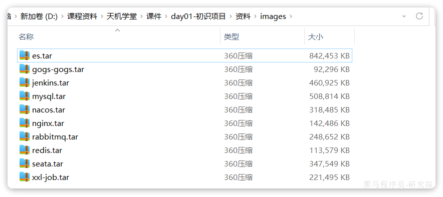

# 2.配置内存

虚拟机占用内存较高，需要10G左右。有条件的同学的可以直接设置16G，其他同学至少配置8G内存。如果是购买云服务的同学，请根据自己的经济实力酌情购买。如果内存确实不足，则需要配置虚拟内存来应对，参考2.2节

## 2.1.配置基础内存

在VMware中设置：

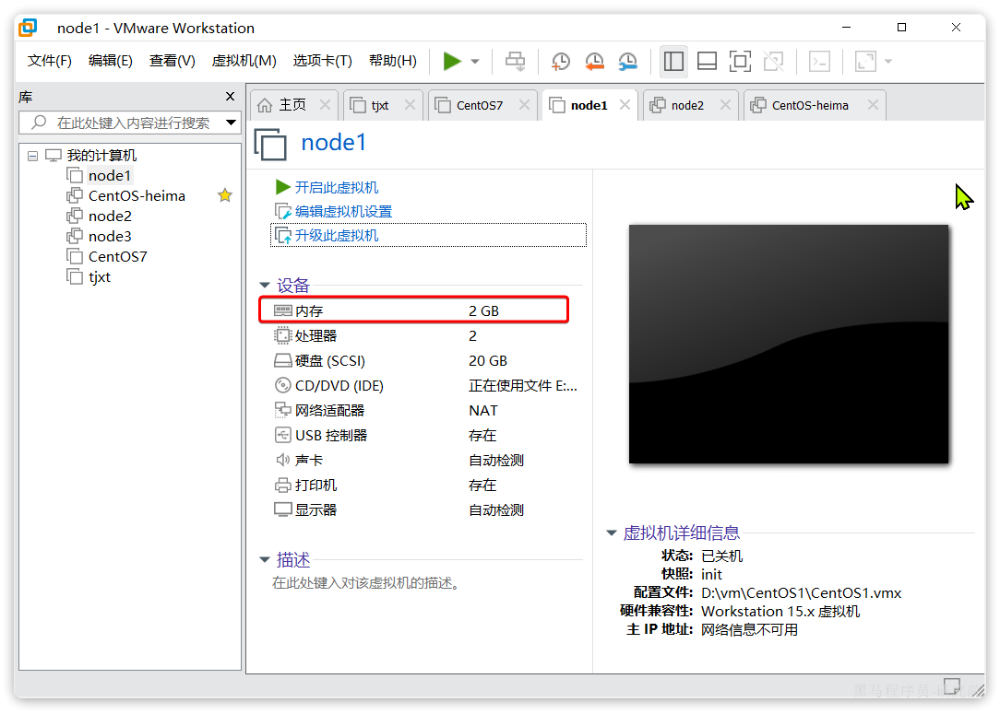

设置内存为8G（有条件的同学选择16G）：

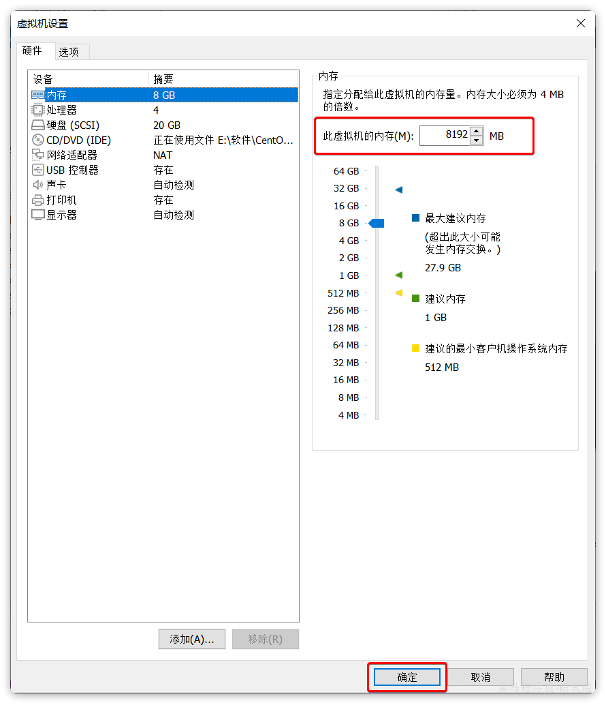

还有CPU核数，有条件的话尽可能调高：

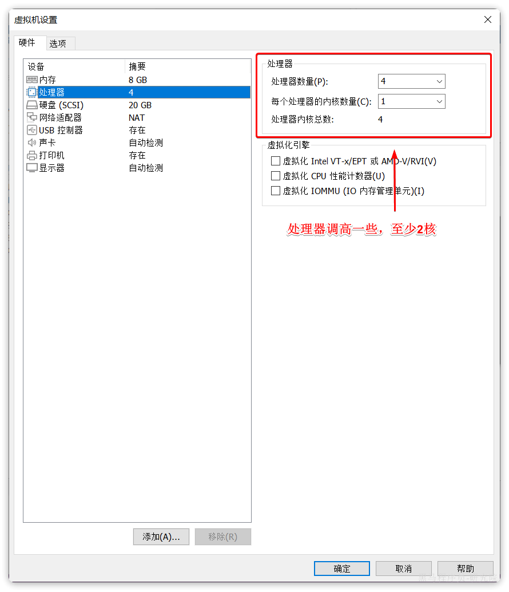

## 2.2.配置虚拟内存

> 如果你的虚拟机已经设置了16G内存，则可以**跳过**下面的步骤。

首先通过命令查看自己的虚拟内存：

```bash
free -h
```

如图：

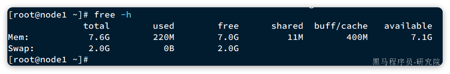

Swap后面的total就是虚拟内存大小。我这台机器已经有2G虚拟内存，有些同学这里可能为0，也有些可能是7.9。

> 如果swap后面的total已经大于5G，则**跳过**后面的步骤。

如果虚拟内存不足，则需要添加虚拟及内存。

首先，创建虚拟机内存文件：

```bash
dd if=/dev/zero of=/root/swapfile bs=1M count=8192
```

此步骤可能会花费较长时间，需要耐心等待。

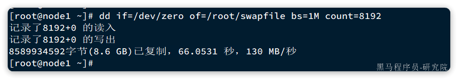

查看/root目录的虚拟机内存文件：

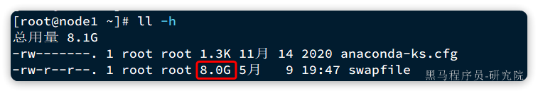

接着我们还需要构建虚拟内存：

```bash
# 构建
mkswap /root/swapfile
#激活
swapon /root/swapfile
```

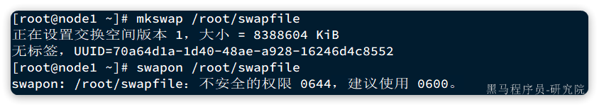

提示说文件权限不安全，需要设置为600，避免非root用户操作文件：

```bash
chmod 600 /root/swapfile
```

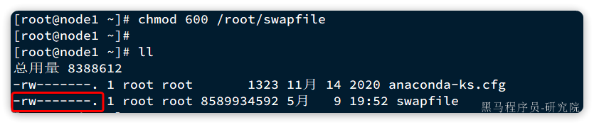

再次通过`free -h`命令查看虚拟内存大小：

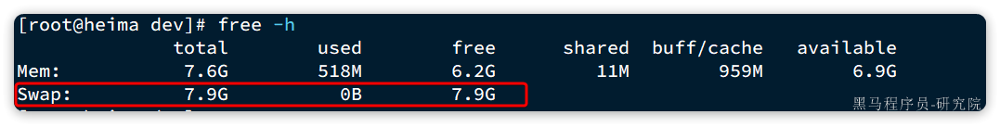

已经达到8G了

# 3.搭建环境

接下来，就可以部署环境了，不过要注意，确保你的虚拟机满足下列条件：

- 安装完成Docker
- 安装完成DockerCompose
- 可以连接网络
- 内存超过达到16G，或者内存+虚拟内存达到16G

接下来，我们就可以部署项目环境了。

## 3.1.上传脚本

首先，我们需要上传课前资料准备的脚本：

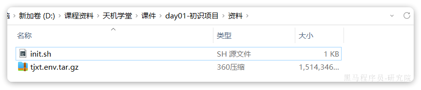

介绍：

- init.sh：搭建环境的脚本
- tjxt.env.tar.gz：项目环境数据

我们将其上传到任意目录，比如 `/root`目录：

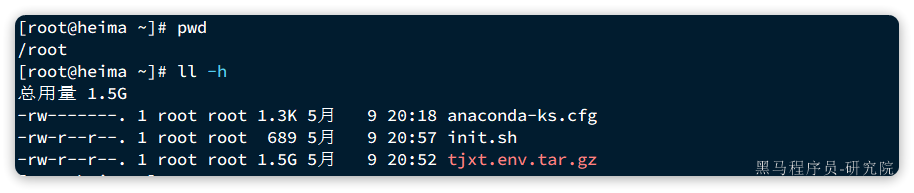

## 3.2.执行脚本

接下来，执行`init.sh`脚本。注意，命令后面的 `-i 192.168.150.101` 需要修改成你自己的虚拟机IP地址

```bash
# 将 192.168.150.101修改成你自己的虚拟机IP地址
sh init.sh -i 192.168.150.101
```

运行效果：

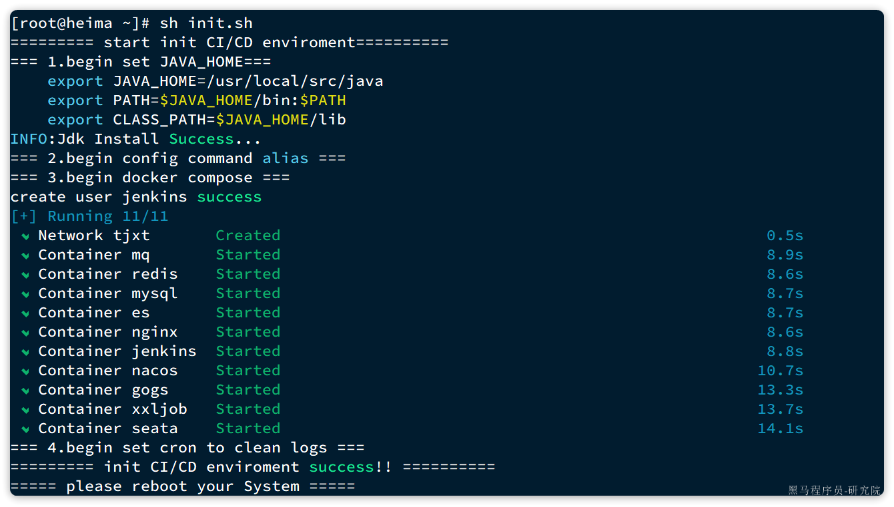

> 注意，脚本运行完成后，请重启自己的虚拟机，让Docker挂载生效


注意，如果发现seata容器启动失败，一般是因为nacos启动太慢导致，可以手动重启seata容器。

```bash
docker restart seata
```

环境中配置了别名，具体映射关系如下：

```shell
alias dps='docker ps --format "table{{.ID}}\t{{.Names}}\t{{.Status}}\t{{.Ports}}"'
alias dis='docker images'
alias dexe='docker exec -it'
alias dlog='docker logs'

alias dc='docker-compose'
```

因此，大家可以利用命令快捷操作，例如：

```shell
# 查看运行中的容器
dps
# 查看镜像
dis

# 启动所有环境中间件，注意，需要在/usr/local/src目录下运行，因为docker-compose.yml文件在这个目录
dc up -d
# 停止所有环境中间件
dc stop
# 停止并移除所有中间件
dc down
```

## 3.3.配置本地hosts

为了方便我们访问环境中提供的MQ、Nacos、GOGS、Jenkins等服务的控制台，我们可以将虚拟机IP映射到一个域名上。

假如你的虚拟机IP地址是192.168.150.101，则映射关系如下：

```shell
192.168.150.101 git.tianji.com
192.168.150.101 jenkins.tianji.com
192.168.150.101 mq.tianji.com
192.168.150.101 nacos.tianji.com
192.168.150.101 xxljob.tianji.com
192.168.150.101 es.tianji.com
192.168.150.101 api.tianji.com
192.168.150.101 www.tianji.com
192.168.150.101 manage.tianji.com
```

将上述内容写入本地的hosts文件即可，不同操作系统hosts文件目录不同：

- Windows：在 `C:\WINDOWS\System32\drivers\etc\HOSTS` 
- Linux/MacOS：`/etc/hosts`

现在，我们访问域名时，就会被请求转发到虚拟机IP地址，而虚拟机中的Nginx则会将请求转发到具体的服务上。

例如，访问代码仓库，使用这个地址：

http://git.tianji.com


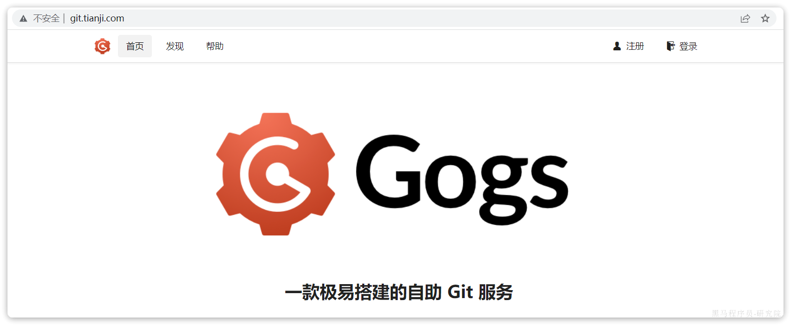

## 3.4.配置WebHook地址

环境中配置了持续集成功能，也就是当我们向Git仓库推送代码时，会自动触发项目构建。但是构建的目标服务器地址无法通过脚本设置，需要大家手动修改。

访问GOGS页面：

http://git.tianji.com/

账户、密码是：tjxt/123321

然后访问tjxt仓库：

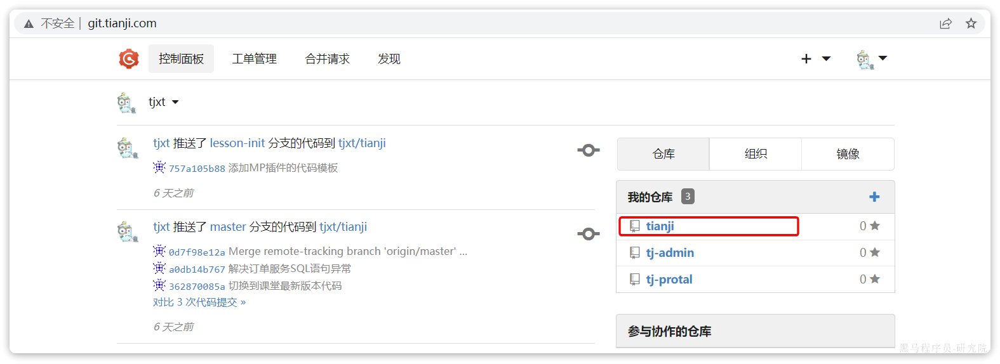

然后进入仓库设置：

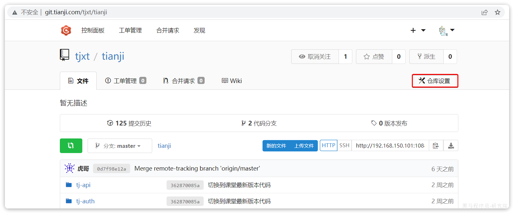

然后进入web钩子设置，可以看到现有的钩子访问的192.168.150.101这个地址：

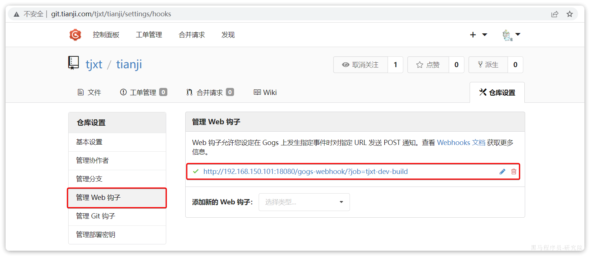

点击修改，进入web钩子页面：

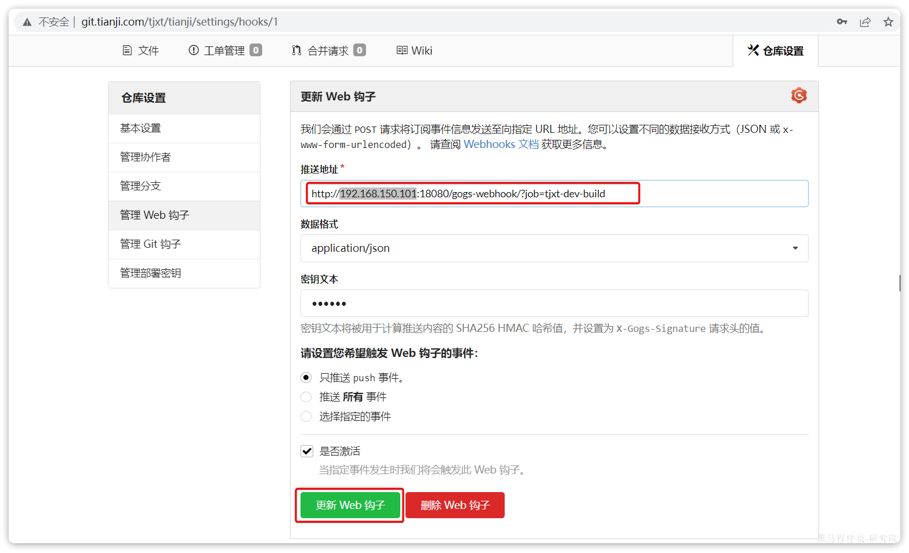

将其中的IP地址修改为你自己的虚拟机地址后，点击更新Web钩子按钮即可。
