# Vue3+TS


## 1 Vue3


### 1.1 概述

Vue 是一款用于**构建用户界面**的渐进式的JavaScript框架。 （官方：https://cn.vuejs.org/）

基于数据渲染出用户看到的界面，如下图

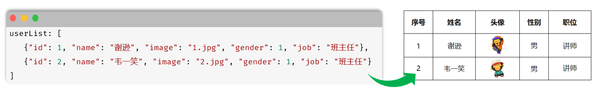

Vue是一个框架，也是一个生态

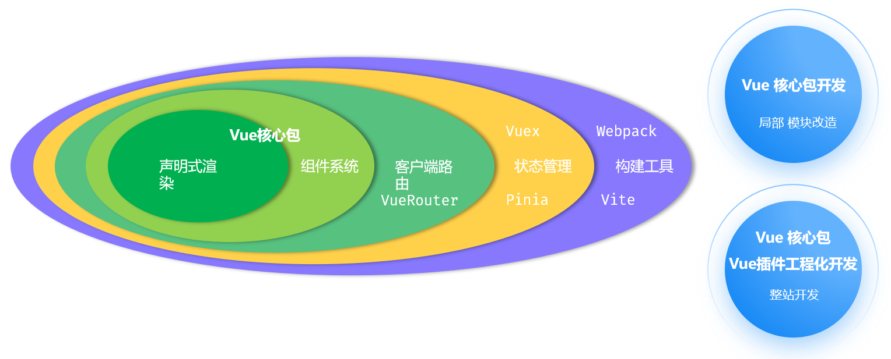

- 框架：就是一套完整的项目解决方案，用于快速构建项目 。
- 优点：大大提升前端项目的开发效率 。
- 缺点：需要理解记忆框架的使用规则 。（参照官网）

今日学习目标：

- 能够独立完成Vue3快速入门案例
- 能够掌握Vue3常见的指令
- 能够掌握使用Axios调用后端接口
- 掌握熟悉Vue3的生命周期
- 能够独立创建Vue3脚手架前端项目
- 能够掌握Vue3脚手架的开发流程
- 能够掌握TypeScript的使用特点
- 能够掌握TypeScript的常见数据类型


### 1.2 快速入门

需求，我们基于下图的效果进行开发，把数据展示在页面中

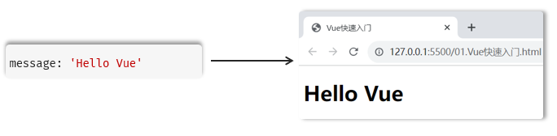

- 
准备

   1. 引入Vue模块（官方提供）
   2. 创建Vue程序的应用实例，控制视图的元素
   3. 准备原色（div），被Vue控制
- 
数据驱动视图

   1. 
准备数据

   2. 
通过插值表达式渲染页面
> 插值表达式：

> - 形式：{{ 表达式 }}。
> - 内容可以是：

>    - 变量
>    - 三元运算符
>    - 函数调用
>    - 算术运算


- 
实例代码：
```javascript
<!DOCTYPE html>
<html lang="en">
<head>
    <meta charset="UTF-8">
    <meta name="viewport" content="width=device-width, initial-scale=1.0">
    <title>Document</title>
</head>
<body>
    <div id = "app">
        <h1>{{message}}</h1>
    </div>
    <script type = "module">
        import { createApp } from 'https://unpkg.com/vue@3/dist/vue.esm-browser.js'
        createApp({
            data(){
                return{
                    message: "hello Vue"
                }
            }
        }).mount("#app");
    </script>
</body>
</html>
```


### 1.3 常用指令


#### 1.3.1 概述

我们先来看一个需求：用户列表数据渲染

将Vue中定义的响应式数据，渲染展示在视图的表格之中。

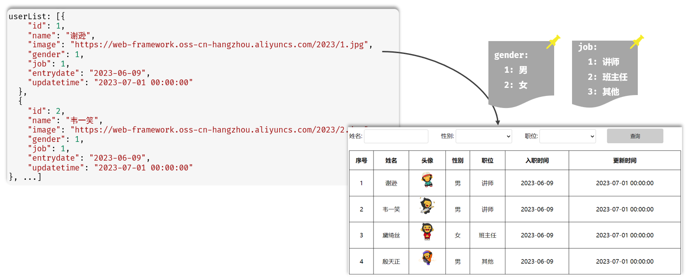

> 素材文件，在资料文件夹中：基础代码


这个使用Vue该怎么实现呢？下面我们就来使用Vue体用的**指令**实现。

指令：HTML标签上带有 **v-前缀**的特殊属性，不同的指令具有不同的含义，可以实现不同的功能。

常用指令：

| **指令** | **作用** |
| --- | --- |
| v-for | 列表渲染，遍历容器的元素或者对象的属性 |
| v-bind | 为HTML标签绑定属性值，如设置 href , css样式等 |
| v-if/v-else-if/v-else | 条件性的渲染某元素，判定为true时渲染,否则不渲染 |
| v-show | 根据条件展示某元素，区别在于切换的是display属性的值 |
| v-model | 在表单元素上创建双向数据绑定 |
| v-on | 为HTML标签绑定事件 |


#### 1.3.2 v-for

- 
作用：列表渲染，遍历容器的元素或者对象的属性

- 
语法： v-for = "(item,index) in items"

   - 
参数说明：

      - 
tems 为遍历的数组

      - 
item 为遍历出来的元素

      - 
index 为索引/下标，从0开始 ；可以省略，省略index语法： v-for = "item in items"

   - 
书写形式：
```javascript
<p v-for="content in contents"> {{content}}</p>
```


可能是下面的效果，包含了多条数据展示

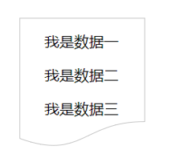
> 遍历的数组，必须在data中定义； 要想让哪个标签循环展示多次，就在哪个标签上使用 v-for 指令。


   - 
需求代码：
```javascript
<tr v-for="(user,index) in userList">
    <td>{{ index + 1 }}</td>
    <td>{{ user.name }}</td>
    <td>  </td>
    <td>{{ user.gender }}</td>
    <td>{{ user.job }}</td>
    <td>{{ user.entrydate }}</td>
    <td>{{ user.updatetime }}</td>
</tr>
```


效果：

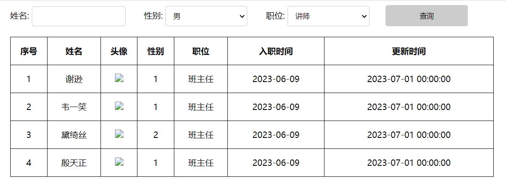
> 图片展示问题，后边使用其他指令解决


**v-for的key**

- 
作用：给元素添加的唯一标识，便于vue进行列表项的正确排序复用

- 
语法： v-for = "(item,index) in items" :key="唯一值"

- 
注意点:

   - key的值只能是字符串 或 数字类型
   - key的值必须具有唯一性
   - 推荐使用id作为key（唯一），不推荐使用index作为key（会变化，不对应）
- 
写法：
```javascript
<p v-for="content in contents" :key="content.id"> {{content}}</p>
```


效果如下：

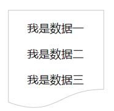
> 官方推荐在使用 v-for 时提供一个key属性，以遍可以追踪每个节点，提升渲染性能。


#### 1.3.3 v-bind

- 
作用：动态为HTML标签绑定属性值，如设置href，src，style样式等。

- 
语法：v-bind:属性名="属性值"

- 
简化：:属性名="属性值"

- 
html标签写法


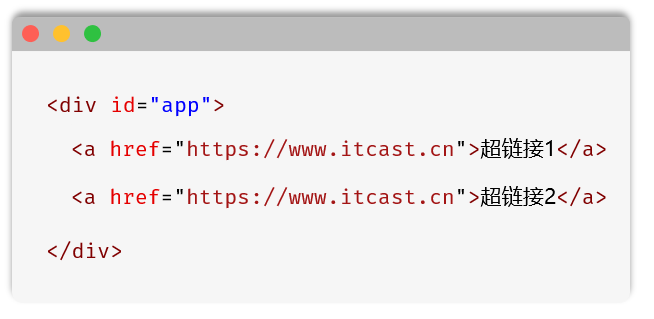

- 
v-bind写法

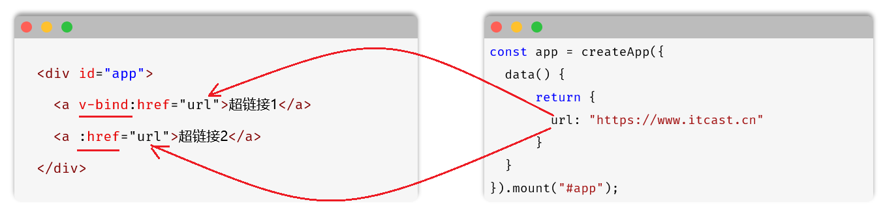


> v-bind所绑定的数据，必须在data中定义


#### 1.3.4 v-if & v-show

- 
作用：这两类指令，都是用来控制元素的显示与隐藏的

- 
v-if

   - 
语法：v-if="表达式"，表达式值为 true，显示；false，隐藏

   - 
原理：基于条件判断，来控制创建或移除元素节点（条件渲染）

   - 
场景：要么显示，要么不显示，不频繁切换的场景

   - 
其它：可以配合 v-else-if / v-else 进行链式调用条件判断

   - 
注意：v-else-if必须出现在v-if之后，可以出现多个； v-else 必须出现在v-if/v-else-if之后

   - 
示例代码：
```javascript
<td v-if="user.gender == 1">男</td>
<td v-else-if="user.gender == 2">女</td>
<td v-else>其他</td>
```


- 
v-show

   - 
语法：v-show="表达式"，表达式值为 true，显示；false，隐藏

   - 
原理：基于CSS样式display来控制显示与隐藏

   - 
场景：频繁切换显示隐藏的场景

   - 
示例代码：

不展示谢逊这条数据
```javascript
<tr v-for="(user,index) in userList" v-show="user.name != '谢逊'">
```


#### 1.3.3 v-model

需求：用户列表数据渲染，获取用户输入的条件

搜索栏中当用户点击查询按钮时，需要获取到用户输入的表单数据，并输出出来 。

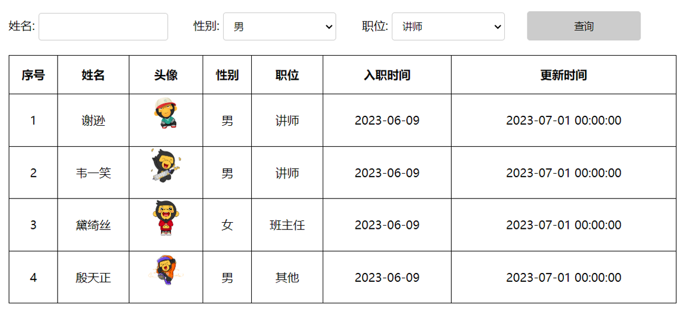

需要想要实现上面这个功能，就需要使用新的指令，v-model

**v-model**

- 
作用：在表单元素上使用，双向数据绑定。可以方便的 获取 或 设置 表单项数据

- 
语法：v-model="变量名"

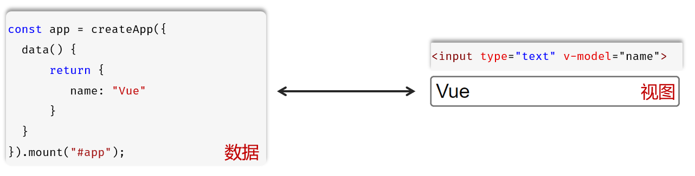
> v-model 中绑定的变量，必须在data中定义。


#### 1.3.3 v-on

- 
作用：为html标签绑定事件（添加时间监听）

- 
语法：

   - 
v-on:事件名="内联语句"

   - 
v-on:事件名="函数名“

   - 
简写为 @事件名="…"

示例1：
```javascript
<div id="app">
  <input type="button" value="点我一下试试" 
	v-on:click="console.log('试试就试试');">
</div>
```


示例2：
```javascript
<div id="app">
   <input type="button" value="点我一下试试" v-on:click="handle">
   <input type="button" value="再点我一下试试" @click="handle">
</div>

   const app = createApp({
      data() {
        return {
          name: "Vue"
        }
      },
      methods: {
        handle() {
          console.log('试试就试试');
        }
      },
    }).mount("#app");
```


### 1.4 Ajax


#### 1.4.1 什么是Ajax

- 
介绍：**A**synchronous **J**avaScript **A**nd **X**ML，异步的JavaScript和XML

- 
作用：

   - 
数据交换：通过Ajax可以给服务器发送请求，并获取服务器响应的数据。

   - 
异步交互：可以在不重新加载整个页面的情况下，与服务器交换数据并更新部分网页的技术，如：搜索联想、用户名是否可用的校验等等。

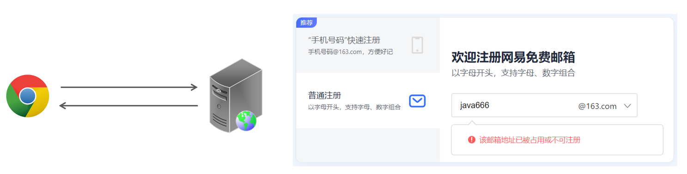

- 
缺点：代码非常繁琐


#### 1.4.2 同步与异步

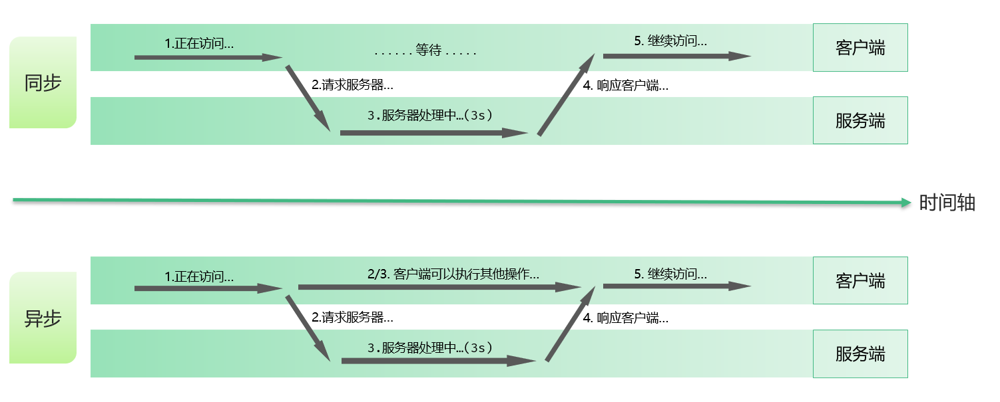


#### 1.4.3 Axios

- 
介绍：Axios 对原生的Ajax进行了封装，简化书写，快速开发。

- 
官网：[https://www.axios-http.cn/](https://www.axios-http.cn/)

- 
使用步骤

   - 引入Axios的js文件（参照官网）
   - 使用Axios发送请求，并获取相应结果

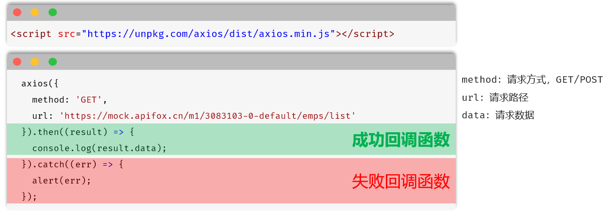
```javascript
<!DOCTYPE html>
<html lang="en">
<head>
    <meta charset="UTF-8">
    <meta name="viewport" content="width=device-width, initial-scale=1.0">
    <title>Document</title>
    <script src="https://unpkg.com/axios/dist/axios.min.js"></script>
</head>
<body>
    <script>
        axios({
            method: 'GET',
            url: 'http://127.0.0.1:4523/m1/3563297-0-default/user/list'
        }).then((result) => {
            console.log(result.data);
        }).catch((err) => {
            alert(err)
        })
    </script>
    
</body>
</html>
```
> 接口可以使用apifox工具进行mock

- 
请求方式别名

   - 
为了方便起见，Axios已经为所有支持的请求方法提供了别名

   - 
格式：axios.请求方式(url [, data [, config]])

      - 
get请求
```javascript
axios.get('http://127.0.0.1:4523/m1/3563297-0-default/user/list').then((result) => {
    console.log(result.data);
}).catch((err) => {
    console.log(err);
});
```


      - 
post请求
```javascript
axios.post('https://mock.apifox.cn/m1/3083103-0-default/emps/update','id=1').then((result) => {
    console.log(result.data);
  }).catch((err) => {
    console.log(err);
  });
```


#### 1.4.4 async & await

我们先来看一个新的需求：页面加载完毕后，默认加载并展示出第一个省、第一个市、第一个区。

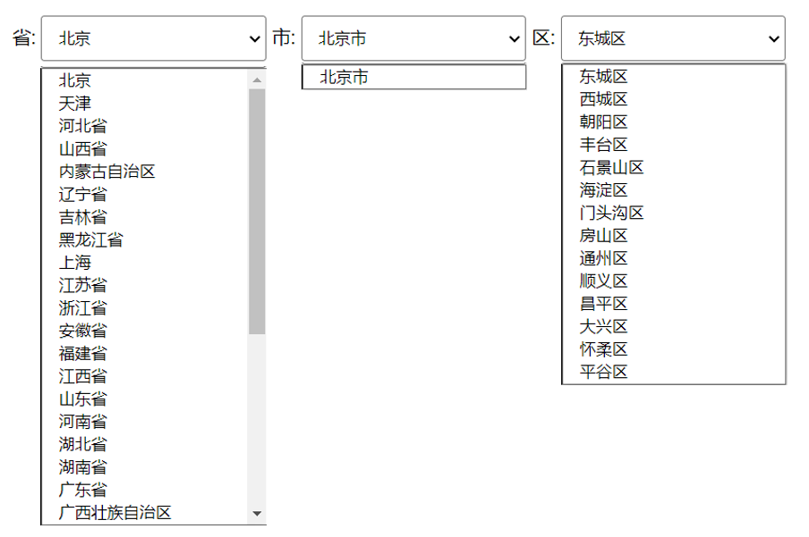

最终的完成代码：

```javascript
methods: {
    search() {
        axios.get(`http://hmajax.itheima.net/api/province`).then((result) => {
            this.provinces = result.data.list;
            this.province = this.provinces[0]; axios.get(`http://hmajax.itheima.net/api/city?pname=${province}`).then((result) => {
                this.cities = result.data.list;
                this.city = this.cities[0];
                axios.get(`http://hmajax.itheima.net/api/area?pname=${province}&cname=${city}`).then((result) => {
                    this.districts = result.data.list;
                    this.district = this.districts[0];
                });
            });
        });
    }
}
```

**回调函数地狱**：这种情况发生在需要执行一系列的异步操作，而每个操作都依赖于前一个操作的返回结果。 导致代码嵌套过深、可读性差、不便于维护。

那该如何解决呢？

可以通过async、await来解决回调函数地狱问题。Async就是来声明一个异步方法，await是用来等待异步任务执行

改造之后的代码如下：

```javascript
<!DOCTYPE html>
<html lang="en">

<head>
    <meta charset="UTF-8">
    <meta name="viewport" content="width=device-width, initial-scale=1.0">
    <title>Document</title>
    <script src="https://unpkg.com/axios/dist/axios.min.js"></script>
</head>

<body>
    <div id="app">
        <button @click="search">按钮</button>

        {{province}}-{{city}}-{{district}}
    </div>
    <script type="module">
        import { createApp } from 'https://unpkg.com/vue@3/dist/vue.esm-browser.js'

        createApp({
            data(){
                return{
                    province:"",
                    city:"",
                    district:""
                }
            },
            methods: {
                async search() {
                    const presult = await axios.get(`http://hmajax.itheima.net/api/province`);
                    this.province = presult.data.list[0];

                    const cresult = await axios.get(`http://hmajax.itheima.net/api/city?pname=${this.province}`);
                    this.city = cresult.data.list[0];

                    const aresult = await axios.get(`http://hmajax.itheima.net/api/area?pname=${this.province}&cname=${this.city}`);
                    this.district = aresult.data.list[0];
                }
            }

        }).mount("#app");
    </script>
</body>

</html>
```

> await关键字只在async函数内有效 。


### 1.4 生命周期

生命周期：指一个对象从创建到销毁的整个过程。

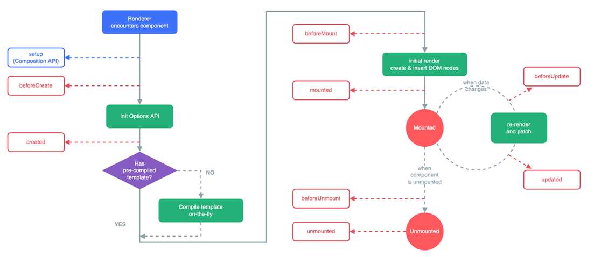

生命周期的八个阶段：每触发一个生命周期事件，会自动执行一个生命周期方法(钩子)。

| **状态** | **阶段周期** |
| --- | --- |
| beforeCreate | 创建前 |
| created | 创建后 |
| beforeMount | 载入前 |
| **mounted** | **挂载完成** |
| beforeUpdate | 数据更新前 |
| updated | 数据更新后 |
| beforeUnmount | 组件销毁前 |
| unmounted | 组件销毁后 |


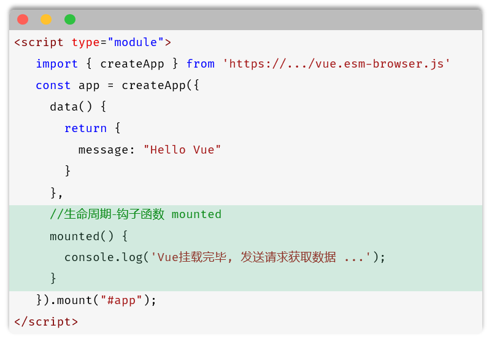


### 1.5 工程化


#### 1.5.1 概述

我们目前的前端开发中，当我们需要使用一些资源时，例如：vue.js，和axios.js文件，都是直接再工程中导入的，如下图所示：

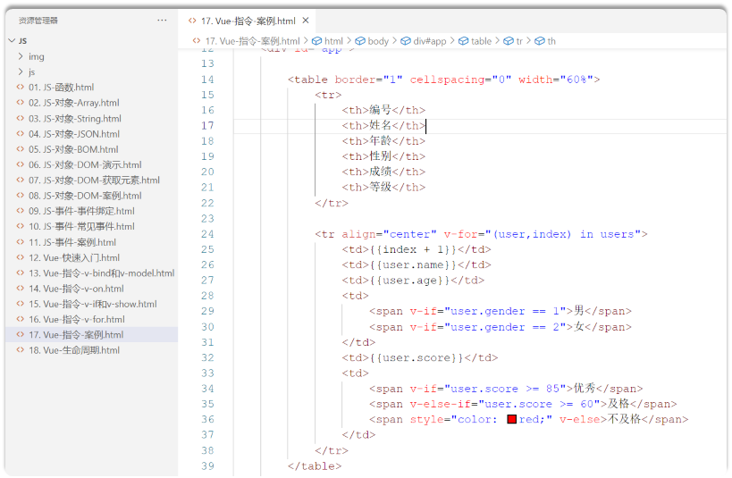

但是上述开发模式存在如下问题：

- **不规范**：每次开发都是从零开始，比较麻烦
- **难复用**：多个页面中的组件共用性不好
- **难维护**：js、图片等资源没有规范化的存储目录，没有统一的标准，不方便维护

所以现在企业开发中更加讲究前端工程化方式的开发，主要包括如下4个特点

- 模块化：将js和css等，做成一个个可复用模块
- 组件化：我们将UI组件，css样式，js行为封装成一个个的组件，便于管理
- 规范化：我们提供一套标准的规范的目录接口和编码规范，所有开发人员遵循这套规范
- 自动化：项目的构建，测试，部署全部都是自动完成

所以对于前端工程化，说白了，就是在企业级的前端项目开发中，把前端开发所需要的工具、技术、流程、经验进行规范化和标准化。从而提升开发效率，降低开发难度等等。接下来我们就需要学习vue的官方提供的脚手架帮我们完成前端的工程化。


#### 1.5.2 环境准备

- 
介绍：create-vue是Vue官方提供的最新的脚手架工具，用于快速生成一个工程化的Vue项目。

- 
create-vue提供了如下功能：

   - 统一的目录结构
   - 本地调试
   - 热部署
   - 单元测试
   - 集成打包上线
- 
依赖环境：NodeJS

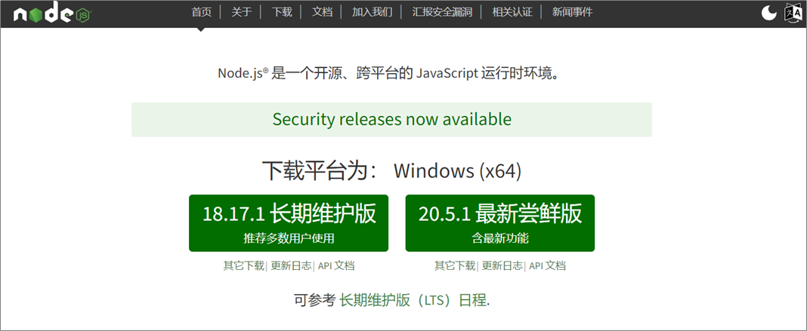

详细安装方式，请查看资料中的**NodeJS安装文档**

- 
npm：**N**ode **P**ackage **M**anager，是NodeJS的软件包管理器。

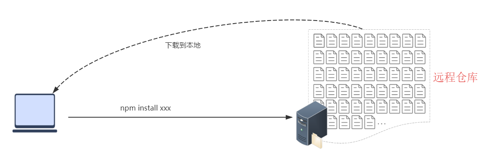


#### 1.5.3 Vue项目-创建

- 
创建一个工程化的Vue项目，执行命令：npm init vue[@latest ](/latest ) 

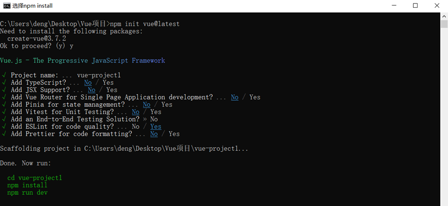

详细步骤说明：

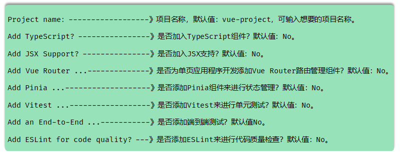

执行上述指令，将会安装并执行 create-vue，它是 Vue 官方的项目脚手架工具

项目创建完成以后，进入项目目录，执行命令安装当前项目的依赖：npm install

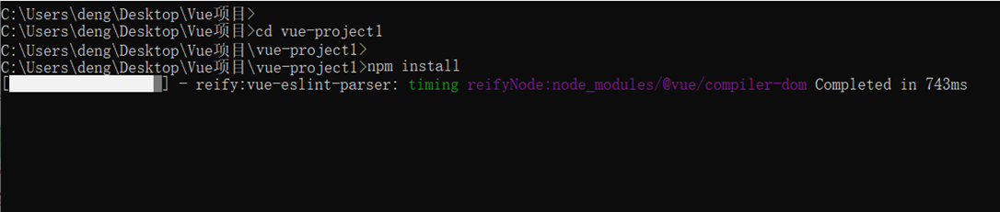
> 创建项目以及安装依赖的过程，都是需要联网的。


- 
Vue项目-目录结构

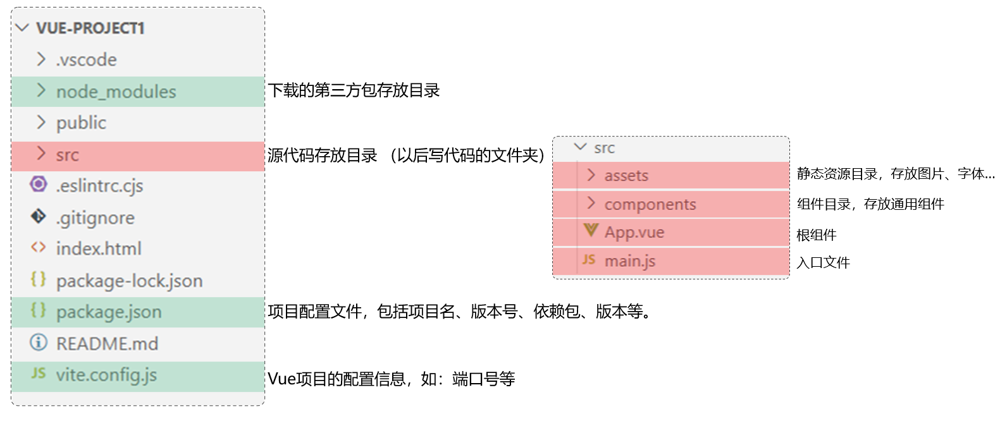

- 
启动项目，执行命令：`npm run dev`

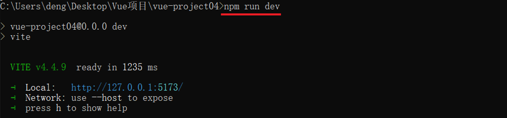

- 
浏览器中可以直接访问，地址：[http://127.0.0.1:5173](http://127.0.0.1:5173)

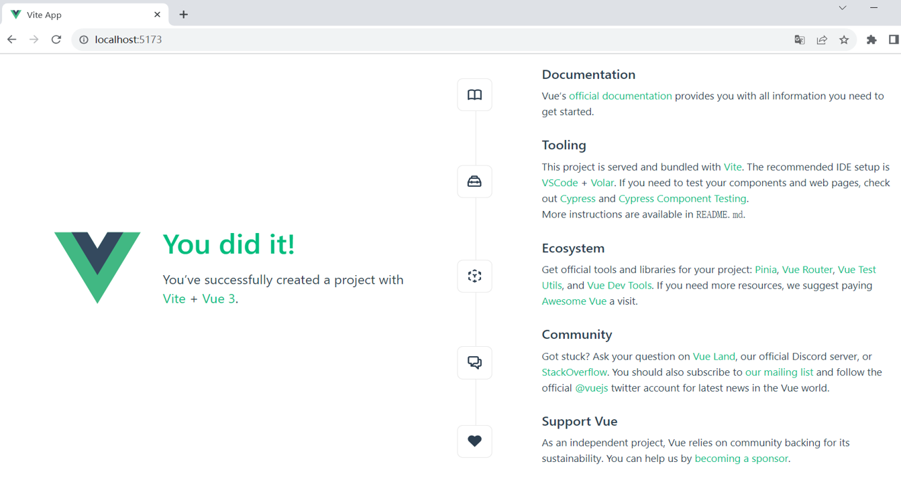


#### 1.5.4 Vue项目开发流程

如下图：

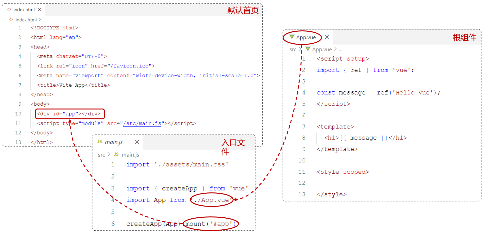

其中`*.vue`是Vue项目中的组件文件，在Vue项目中也称为单文件组件（[SFC](https:_cn.vuejs.org_guide_scaling-up_sfc)，Single-File Components）。Vue 的单文件组件会将一个组件的逻辑 (JS)，模板 (HTML) 和样式 (CSS) 封装在同一个文件里（`*.vue`）

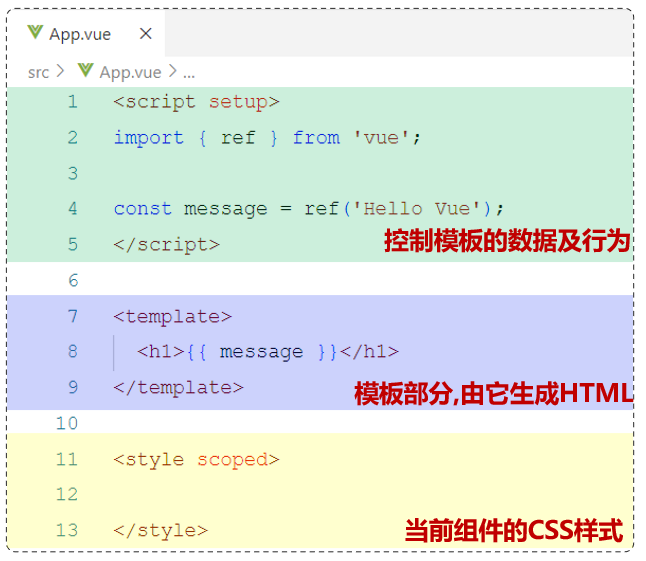


### 1.5 组合式API

组合式API是Vue 3中的一种新的编程模式，它提供了更灵活和可组合的方式来编写Vue组件逻辑，使得代码更加清晰、可维护，并且使得组件的复用更加容易。

官网地址：[https://cn.vuejs.org/api/](https://cn.vuejs.org/api/)

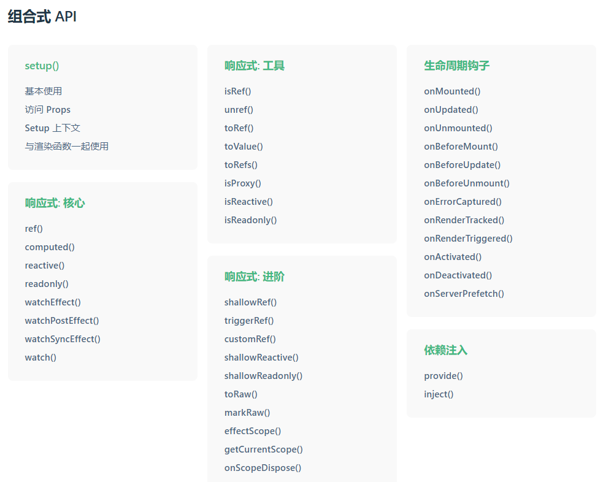

Vue3中提供了很多的组合式API，当然我们平时开发中使用不了那么多，我们重点讲解几个后面项目常用的API，分别是：

- reactive、ref、watch、defineProps、defineEmits


#### 1.5.1 reactive和ref函数

reactive：能将**对象类型**变为【响应式】，对基本类型无效（例如 string，number，boolean）

```vue
<script setup>
// 导入
import { reactive } from 'vue'
// 执行函数 传入参数 变量接收
const state = reactive({
 msg:'this is msg'
})
const setSate = ()=>{
 // 修改数据更新视图
 state.msg = 'this is new msg'
}
</script>

<template>
{{ state.msg }}
<button @click="setState">change msg</button>
</template>
```

ref：接收**简单类型**或者**对象类型**的数据传入并返回一个响应式的对象

```vue
<script setup>
 // 导入
 import { ref } from 'vue'
 // 执行函数 传入参数 变量接收
 const count = ref(0)
 const setCount = ()=>{
   // 修改数据更新视图必须加上.value
   count.value++
 }
</script>

<template>
  <button @click="setCount">{{count}}</button>
</template>
```

> 修改数据更新视图必须加上`.value`


**二者对比：**

1. 都是用来生成响应式数据
2. 不同点

   1. reactive不能处理简单类型的数据
   2. ref参数类型支持更好，但是必须通过.value做访问修改
   3. ref函数内部的实现依赖于reactive函数
3. 在实际工作中的推荐

   1. 推荐使用ref函数，减少记忆负担


#### 1.5.2 watch

侦听一个或者多个数据的变化，数据变化时执行回调函数

案例代码：

```vue
<script setup>
  //导入
  import { ref ,watch} from 'vue'

  const count = ref(0)

  const setCount = () => {
    count.value++
  }

  //侦听单个属性的变化
  watch(count,(newVal,oldVal) => { 
    console.log(`count的值为: newVal: ${newVal},oldVal: ${oldVal }`)
  })

  const user = ref({
    name:"张三"
  })

  const setUser = () =>{
    user.value.name = "李四"
  }

  //侦听对象的单个属性
  watch(()=>user.value.name,(newVal,oldVal) => { 
    console.log(`count的值为: newVal: ${newVal},oldVal: ${oldVal }`)
  })

</script>

<template>
  <button @click="setCount">{{ count }}</button>
  <button @click="setUser">{{ user.name }}</button>
</template>
```


#### 1.5.3 父子组件通信

我们来看下面这个图，有三个组件，组件A的子组件分为是B和C，其中B和C是兄弟关系。我们这次重点研究是父子组件的通信，如果想要实现B和C的通信，需要使用第三方组件pinia才行（不是课程重点）

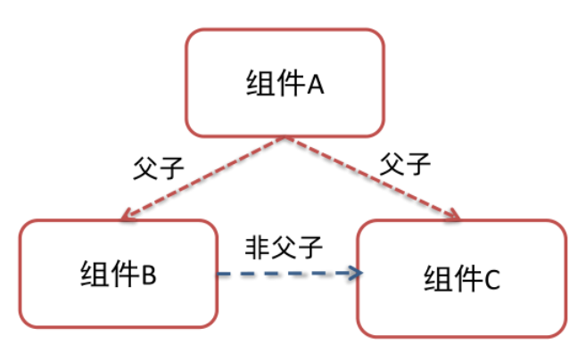

**父组件传递信息到子组件：**

- 父组件中给子组件绑定属性
- 子组件内部通过props选项接收数据

**子组件传递信息到父组价**

- 父组件中给子组件标签通过@绑定事件
- 子组件内部通过 emit 方法触发事件

案例：

父组件

```vue
<script setup>
  //导入
  import { ref ,watch} from 'vue'

  //引入子组件
  import SonCom from '@/components/son-com.vue'

  //定义属性
  const money = ref(100);

  //父组件增加金额
  const incMoney = () =>{
    money.value += 10;
  }

  //子组件减少金额
  const decMoney = (val) =>{
    money.value -= val;
  }

</script>

<template>
  <h3>
    <button @click="incMoney">增加金额</button>
  </h3>
  <SonCom 
  :money = "money"
  @decMoney="decMoney"
  ></SonCom>
 
</template>
```

子组件：son-com.vue

```vue
<script setup>

//接收父组件传递过来的属性
const props = defineProps({
    money :Number
})

//声明父组件传递过来的方法
const emit = defineEmits(['decMoney'])

//调用父组件的方法
const buy = () =>{
    emit('decMoney',20)
}

</script>

<template>
    <div class="son">
        我是子组件 - {{ money }}
        <button @click="buy">减少金额</button>
    </div>
</template>

<style scoped>

.son{
    border: 1px solid #000;
    padding: 80px;
}
</style>
```


## 2 Vue路由


### 2.1 概述

- 
Vue Router：Vue的官方路由。为Vue提供富有表现力、可配置的、方便的路由。

- 
Vue中的路由：路径 与 组件 的对应关系。

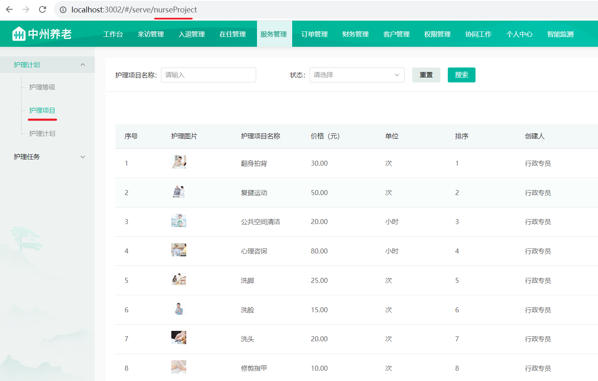

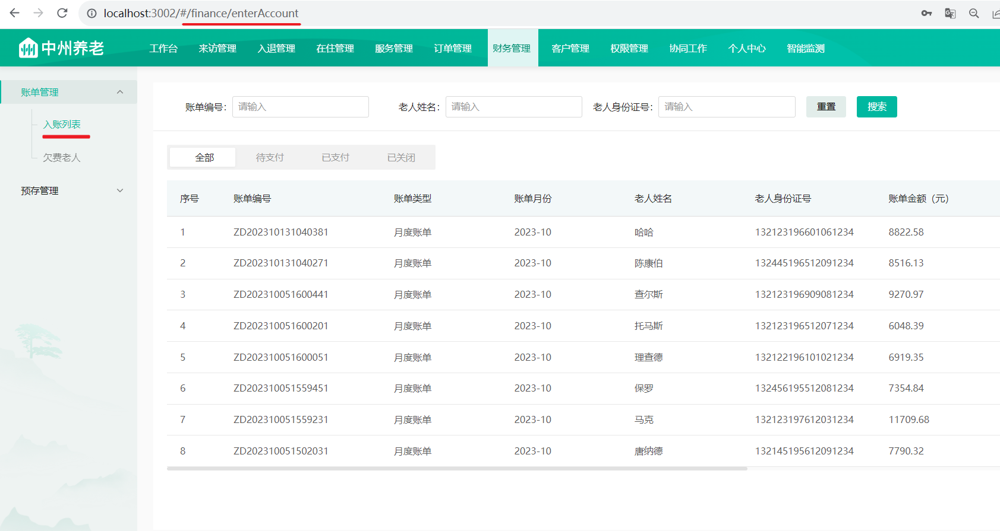

点击不同的菜单，对应了不同的路由，而路由就可以找到对应的vue组件进行加载


### 2.2 组成

- 
Router实例：路由实例，基于createRouter函数创建，维护了应用的路由信息。

- 
`<router-link>`：路由链接组件，浏览器会解析成`<a>`。

- 
`<router-view>`：动态视图组件，用来渲染展示与路由路径对应的组件。

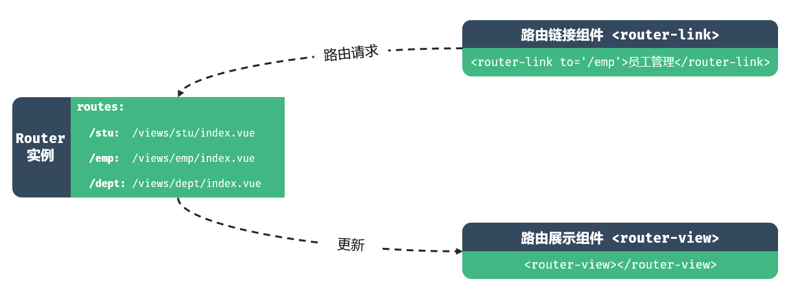


### 2.3 安装vue-router（创建vue项目已选择）

- 
安装命令：`npm install vue-router@4`

- 
定义路由

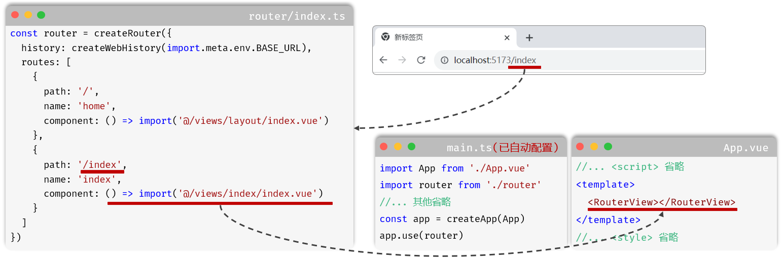


## 3 TS


### 3.1 概述

- 
TypeScript（简称 TS）是JavaScript的超集（继承了JS全部语法），TypeScript = Type + JavaScript。

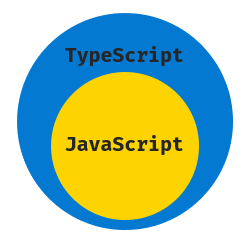

- 
简单说，就是在JS的基础上，为JS添加了类型支持。

- 
TypeScript是微软开发的开源编程语言，可以在任何运行JavaScript的地方运行。

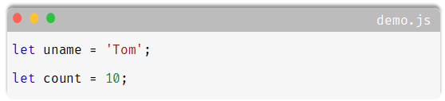

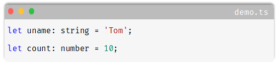

**类型注解**：是指在变量、函数等定义的时候，使用特定语法（: type）来指定其类型，并在代码中限制只能接收特定类型的值。


**为什么要用TypeScript ?**

- 
有利于发现错误（编写时）

- 
有利于代码的静态分析

- 
便于语法提示和自动补全

- 
利于项目维护


### 3.2 快速入门

- 
准备：

- 
安装TS官方提供的编译器：npm install -g typescript (只需要做一次即可)

- 
编码：

   - 
定义ts文件，定义变量，指定类型注解

   - 
编译ts文件，测试程序运行

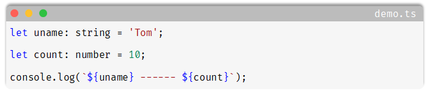

编译命令：`tsc demo.ts`

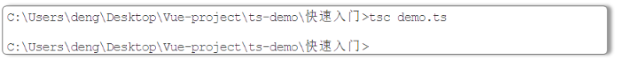

编译之后的文件为：**demo.js**

- 
TS代码编译目标版本为es3(比较低)，可以通过参数 –target 指定编译的目标版本。如：es5、es6、es2016... esnext


### 3.3 常用类型

TS中除了支持JS中的数据类型之外，还提供了新的实用的数据类型。 常见类型如下:

| **类型** | **例子** | **备注** |
| --- | --- | --- |
| 字符串类型 | string |  |
| 数字类型 | number | 整数 、小数 |
| 布尔类型 | boolean | true、false |
| null/undefined类型 | null / undefined | 表示null和undefined本身，意义不大 |
| 任意类型 | any | 没有指定任何类型 |
| 数组类型 | number[] / Array`<number>` |  |
| 联合类型 | number &#124; string | 一个值可以是几种类型之一 |
| 字面量类型 | 'left' &#124; 'center' &#124; 'right' | 限制变量或参数的取值，只能是其中之一 |
| 函数类型 | () => void | 对函数的参数及返回值指定类型 |
| 对象类型 | {...} | 限定对象的结构（属性及方法） |
| 复杂类型 | interface接口 |  |
| 泛型 | `<T>` |  |


#### 3.3.1 基础类型

基础类型：string，number，boolean，null，undefined，any，数组。

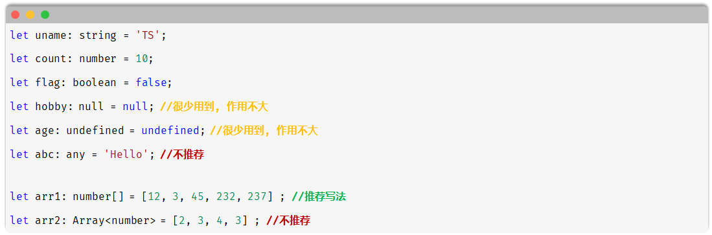

```
<script setup lang="ts">
    let uname: string = 'Tom';
    let count: number = 100;
    let flag: boolean = false;
    let abc: any = 192;
    console.log(`${uname}-${count}-${flag}-${abc}`)
    console.log('----------------------------')
    //数组类型
    let arr: number[] = [1,2,3,4,5,67]
    let arr2: Array<number> = [5,6,7,8];
    console.log(arr)
    console.log(arr2)
    let arr3: (number | string)[] = [2,3,4,'heima','chuanzhi',555];
    let flag2: (boolean | number)= true;
    flag2 = 23
    console. log(arr3)
    console.log(flag2)
    console.log('----------------------------')

</script>

<template>

hello 路由

</template>
```

原则上，不推荐使用any!!! 这会让TypeScript又回到JavaScript(失去TS类型保护的优势)。


#### 3.3.2 联合类型

联合类型：是指由两个或多个其他类型组成的类型，表示可以是其中的任意一种。

写法：类型1 | 类型2

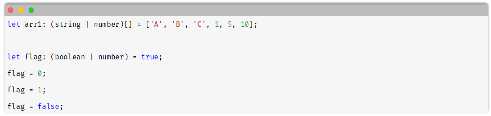

TS中的联合类型中指定的多种类型之间使用 | 分隔，建议使用()括起来。

- 
类型别名：相当于一种自定义类型，为任意类型起别名。

- 
使用场景：当同一类型（复杂）别多次使用时，可以通过类型别名，简化该类型（复杂）的书写。

- 
定义语法：type customType = 指定类型

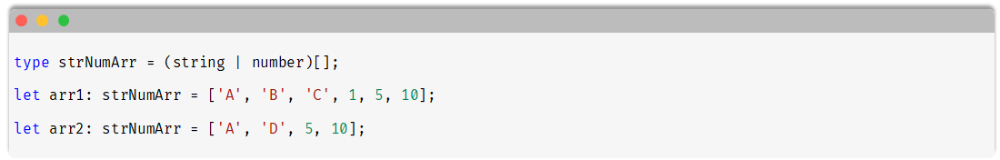

类型别名type，是可以为任意类型指定别名的。


#### 3.3.3 函数类型

- 
函数类型实际上指的是：函数的参数及返回值的类型

- 
语法一：单独指定参数、返回值类型

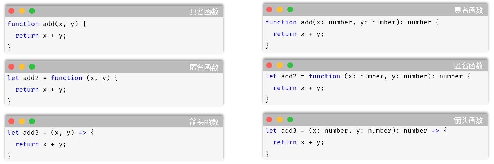

与JS不同，TS中函数调用时传入的参数个数必须与函数定义时参数个数一致。

- 
语法二：书写完成函数类型（同时指定参数、返回值类型）(了解,不常用)

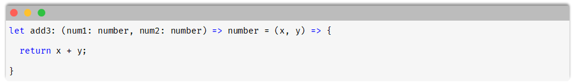

- 
可选参数：在TS里我们可以在参数后使用 问号？实现可选参数的功能。而且可选参数只能出现在参数列表的最后。

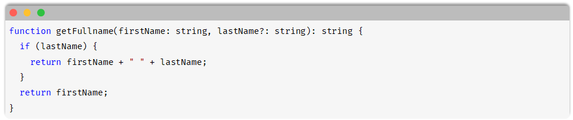

如果函数没有返回值，则函数的返回值类型为：void


#### 3.3.4 对象类型 & 接口interface

**对象类型**

TS中的对象类型就是来描述对应的结构的（有什么类型的属性和方法）

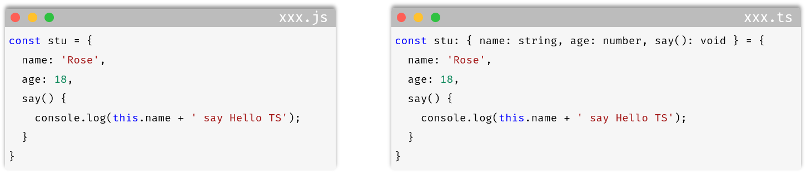

- 说明：

   - 直接使用{}来描述对象的结构。属性采用 属性名:类型 的形式；方法采用 方法名():返回值类型 的形式。
   - 如果方法有参数，就在方法名后面的小括号中指定参数类型（如：say(content:string):void）。
   - 在一行中指定多个属性类型时，可以使用 逗号/分号 来分割。
   - 方法的类型，也可以使用箭头函数形式，比如：say:() => void。
   - 对象的属性或方法，也可以是可选的，此时就可以声明可选属性/方法，使用 ？（问号）来表示。

**接口interface**

当一个对象类型被多次使用时，我们可以使用 接口（interface）来描述对象的类型，达到 复用 的目的。

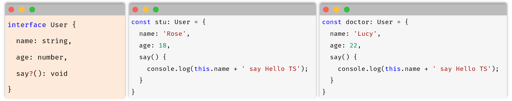

- 说明：

   - 接口使用 interface 关键字来声明，接口名称可以是任意合法的变量名称。
   - 接口中定义的属性或方法，结尾可以使用逗号(,)/分号(;)分隔；如果每一行只有一个属性，后面也可以不写分号（;）。

**Interface（接口） 与 type（类型别名）对比**

- 
相同点：都可以给对象指定类型。

- 
不同点：

   - 
interface（接口），只能为对象指定类型。

   - 
type（类型别名），可以为任意类型指定别名。

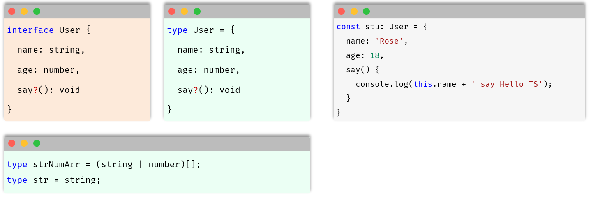


## 4 TDesign

TDesign 具有统一的 [价值观](https://tdesign.tencent.com/design/values)，一致的设计语言和视觉风格，帮助用户形成连续、统一的体验认知。在此基础上，TDesign 提供了开箱即用的 [UI 组件库](https://tdesign.tencent.com/vue/)、[设计指南](https://tdesign.tencent.com/vue/components/button?tab=design) 和相关 [设计资产](https://tdesign.tencent.com/source)，以优雅高效的方式将设计和研发从重复劳动中解放出来，同时方便大家在 TDesign 的基础上扩展，更好的的贴近业务需求。

官网地址：[https://tdesign.tencent.com/](https://tdesign.tencent.com/)

RDesign是传智研究院对腾讯的TDesign组件进行了简易的封装，可以更快的创建脚手架项目，达到快速开发的目的

核心技术栈：Vue 3 + TypeScript +Tdesign + Vite + pinia

入门手册请参考：[https://czri-admin-doc.itheima.net/](https://czri-admin-doc.itheima.net/)

项目样例（在线访问）：[https://czri-admin.itheima.net/](https://czri-admin.itheima.net/)


### 4.1 创建项目及环境说明

请参考RDesign入门手册：[https://czri-admin-doc.itheima.net/](https://czri-admin-doc.itheima.net/)


### 4.2 综合案例


#### 4.2.1 需求说明

- 在创建的好项目中新增路由菜单

   - 主菜单：权限管理
   - 子菜单：用户管理和角色管理
- 在用户管理菜单中新增组件，展示用户列表，如下效果

   - 使用TDesign中的table组件展示数据，并可以查看API列表来实现数据的展示（序号、性别）
   - 使用TDesign中的ImageViewer组件实现图片展示和预览

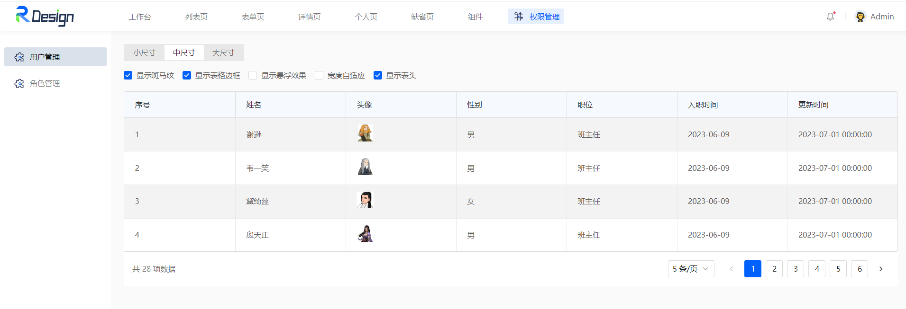


#### 4.2.2 路由创建

在src/router/modules目录下新建文件：permission.ts文件，内容如下：

```tsx
import Layout from '@/layouts/index.vue'

import HomeIcon from '@/assets/test-img/icon_menu_diaodu.svg'
import ModelIcon from '@/assets/test-img/icon_menu_zj.svg'

export default [
  {
    path: '/permission',
    name: 'permission',
    component: Layout,
    redirect: '/permission/index',
    meta: {
      title: '权限管理',
      icon: HomeIcon
    },
    children: [
      {
        path: 'index',
        name: '用户管理',
        component: () => import('@/pages/permission/user/index.vue'),
        meta: {
          title: '用户管理',
          icon: ModelIcon
        }
      },
      {
        path: 'role-index',
        name: '角色管理',
        component: () => import('@/pages/permission/role/index.vue'),
        meta: {
          title: '角色管理',
          icon: ModelIcon
        }
      }
    ]
  }
]
```


#### 4.2.3 页面创建

在src/pages下新建目录permissio，并且在permission下创建两个目录，分别是user和role，效果如下：

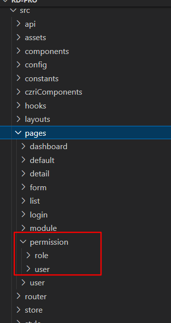

在user目录下新增**index.vue**文件


#### 4.2.4 Table组件

打开TDesign组件中的Table组件，链接：[https://tdesign.tencent.com/vue-next/components/table](https://tdesign.tencent.com/vue-next/components/table)

找到**基础表格**

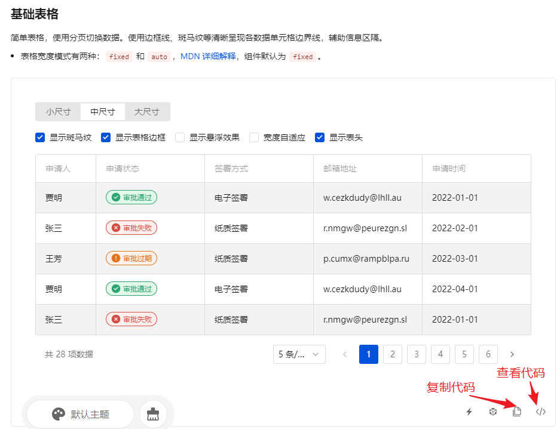

把代码拷贝到新建的index.vue文件中（全部拷贝），代码如下：

```vue
<template>
  <t-space direction="vertical">
    <!-- 按钮操作区域 -->
    <t-radio-group v-model="size" variant="default-filled">
      <t-radio-button value="small">小尺寸</t-radio-button>
      <t-radio-button value="medium">中尺寸</t-radio-button>
      <t-radio-button value="large">大尺寸</t-radio-button>
    </t-radio-group>

    <t-space>
      <t-checkbox v-model="stripe"> 显示斑马纹 </t-checkbox>
      <t-checkbox v-model="bordered"> 显示表格边框 </t-checkbox>
      <t-checkbox v-model="hover"> 显示悬浮效果 </t-checkbox>
      <t-checkbox v-model="tableLayout"> 宽度自适应 </t-checkbox>
      <t-checkbox v-model="showHeader"> 显示表头 </t-checkbox>
    </t-space>

    <!-- 当数据为空需要占位时，会显示 cellEmptyContent -->
    <t-table
      row-key="index"
      :data="data"
      :columns="columns"
      :stripe="stripe"
      :bordered="bordered"
      :hover="hover"
      :table-layout="tableLayout ? 'auto' : 'fixed'"
      :size="size"
      :pagination="pagination"
      :show-header="showHeader"
      cell-empty-content="-"
      resizable
      lazy-load
      @row-click="handleRowClick"
    >
    </t-table>
  </t-space>
</template>

<script setup lang="jsx">
import { ref } from 'vue';
import { ErrorCircleFilledIcon, CheckCircleFilledIcon, CloseCircleFilledIcon } from 'tdesign-icons-vue-next';

const statusNameListMap = {
  0: { label: '审批通过', theme: 'success', icon: <CheckCircleFilledIcon /> },
  1: { label: '审批失败', theme: 'danger', icon: <CloseCircleFilledIcon /> },
  2: { label: '审批过期', theme: 'warning', icon: <ErrorCircleFilledIcon /> },
};
const data = [];
const total = 28;
for (let i = 0; i < total; i++) {
  data.push({
    index: i + 1,
    applicant: ['贾明', '张三', '王芳'][i % 3],
    status: i % 3,
    channel: ['电子签署', '纸质签署', '纸质签署'][i % 3],
    detail: {
      email: ['w.cezkdudy@lhll.au', 'r.nmgw@peurezgn.sl', 'p.cumx@rampblpa.ru'][i % 3],
    },
    matters: ['宣传物料制作费用', 'algolia 服务报销', '相关周边制作费', '激励奖品快递费'][i % 4],
    time: [2, 3, 1, 4][i % 4],
    createTime: ['2022-01-01', '2022-02-01', '2022-03-01', '2022-04-01', '2022-05-01'][i % 4],
  });
}

const stripe = ref(true);
const bordered = ref(true);
const hover = ref(false);
const tableLayout = ref(false);
const size = ref('medium');
const showHeader = ref(true);

const columns = ref([
  { colKey: 'applicant', title: '申请人', width: '100' },
  {
    colKey: 'status',
    title: '申请状态',
    cell: (h, { row }) => {
      return (
        <t-tag shape="round" theme={statusNameListMap[row.status].theme} variant="light-outline">
          {statusNameListMap[row.status].icon}
          {statusNameListMap[row.status].label}
        </t-tag>
      );
    },
  },
  { colKey: 'channel', title: '签署方式' },
  { colKey: 'detail.email', title: '邮箱地址', ellipsis: true },
  { colKey: 'createTime', title: '申请时间' },
]);

const handleRowClick = (e) => {
  console.log(e);
};

const pagination = {
  defaultCurrent: 1,
  defaultPageSize: 5,
  total,
};
</script>
```

上述代码中，columns字段控制表头，for循环中展示的列表数据，目前展示的是案例中自带的内容，我们需要进行改造

- for循环的作用就是data属性进行赋值，我们可以把之前案例的数据直接拷贝过来，删除for循环，最终data的数据为：

```javascript
const data = ref([

    {
        "id": 1,
        "name": "谢逊",
        "image": "https://web-framework.oss-cn-hangzhou.aliyuncs.com/web/1.jpg",
        "gender": 1,
        "job": "班主任",
        "entrydate": "2023-06-09",
        "updatetime": "2023-07-01 00:00:00"
    },
    {
        "id": 2,
        "name": "韦一笑",
        "image": "https://web-framework.oss-cn-hangzhou.aliyuncs.com/web/2.jpg",
        "gender": 1,
        "job": "班主任",
        "entrydate": "2023-06-09",
        "updatetime": "2023-07-01 00:00:00"
    },
    {
        "id": 3,
        "name": "黛绮丝",
        "image": "https://web-framework.oss-cn-hangzhou.aliyuncs.com/web/3.jpg",
        "gender": 2,
        "job": "班主任",
        "entrydate": "2023-06-09",
        "updatetime": "2023-07-01 00:00:00"
    },
    {
        "id": 4,
        "name": "殷天正",
        "image": "https://web-framework.oss-cn-hangzhou.aliyuncs.com/web/4.jpg",
        "gender": 1,
        "job": "班主任",
        "entrydate": "2023-06-09",
        "updatetime": "2023-07-01 00:00:00"
    }
]);
```

- 根据我们的原始数据，可以修改columns字段，如下效果：

```javascript
//表头
const columns = ref([
    { colKey: 'rowIndex', title: "序号" },
    { colKey: 'name', title: '姓名' },
    { colKey: 'image', title: '头像' },
    { colKey: 'gender', title: '性别' },
    { colKey: 'job', title: '职位' },
    { colKey: 'entrydate', title: '入职时间' },
    { colKey: 'updatetime', title: '更新时间' },
]);
```

改造完成后，目前的效果，如下：

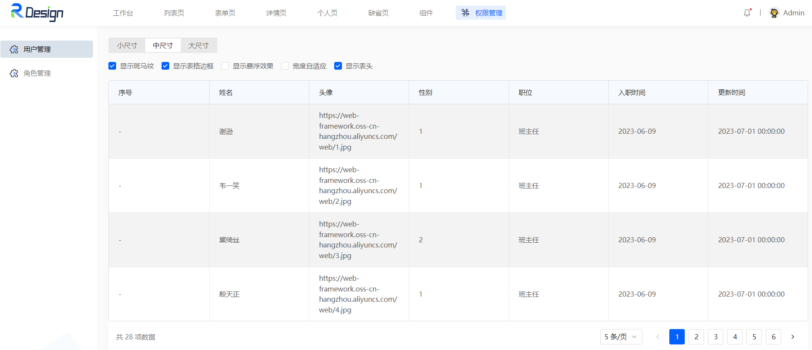

在上面的代码中，主要控制数据显示的是`<t-table>`标签，我们来详细说一下这个标签的内容

```javascript
<t-table
   row-key="index"    
   :data="data"         
   :columns="columns"
   :stripe="stripe"
   :bordered="bordered"
   :hover="hover"
   :table-layout="tableLayout ? 'auto' : 'fixed'"
   :size="size"
   :pagination="pagination"
   :show-header="showHeader"
   cell-empty-content="-"
   resizable
   @row-click="handleRowClick"
>
```

- row-key
- :data     数据源 (数组)
- :columns    列配置(数组)
- :stripe    是否显示斑马纹
- :bordered     是否显示表格边框
- :hover   是否显示鼠标悬浮状态
- :table-layout   表格布局方式       可选项：auto/fixed
- :size   表格尺寸
- :pagination  分页配置， 用于模块内切换内容的控件
- :show-header     是否显示表头
- cell-empty-content  单元格数据为空时呈现的内容
- resizable    是否允许调整列宽
- [@row-click ](/row-click )   行点击时触发，泛型 T 指表格数据类型 

table组件更多的api参考：[https://tdesign.tencent.com/vue-next/components/table?tab=api](https://tdesign.tencent.com/vue-next/components/table?tab=api)

> 大家可以自己试着修改一下，查看效果


#### 4.2.5 序号展示

目前列表中的序号是空白的，我们需要单独处理序号。

在table组件已经提供了序号的功能，有一个默认的字段rowIndex，我们只需要展示即可，默认从0开始

```java
<t-table>
	<template #rowIndex="{ rowIndex }">{{ rowIndex + 1 }}</template>
</t-table>
```

- `<t-table>`标签对中的`<template></template>`可以单独来处理特殊的字段，标签对里面展示列表中的内容
- `#rowIndex`中的`rowIndex`为默认字段


#### 4.2.6 图片展示及预览

目前图片展示的一个url链接，我们现在需要展示为图片，并且由预览功能

其实在TDesign中已经提供了对应的组件：ImageViewer

链接：[https://tdesign.tencent.com/vue-next/components/image-viewer](https://tdesign.tencent.com/vue-next/components/image-viewer)

找到**缩略图图片查看器**

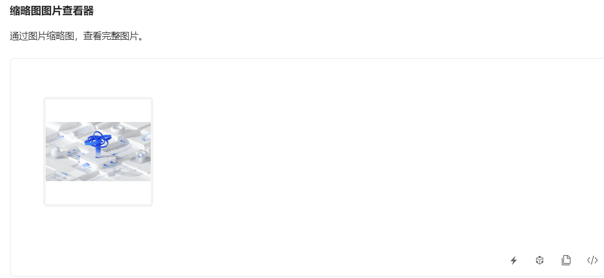

代码中需要修改两处，改为自己的图片地址

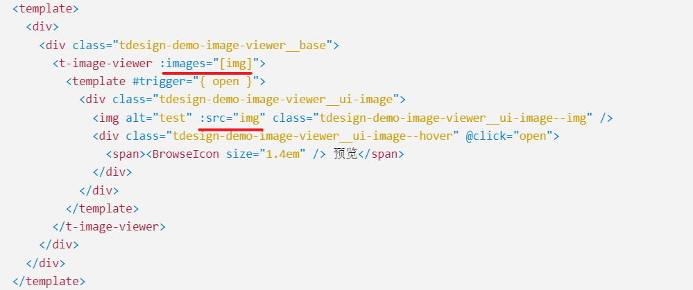

最终的代码如下：

```vue
<template #image="{ row }">
    <div>
         <div class="tdesign-demo-image-viewer__base">
              <t-image-viewer :images="[row.image]">
                  <template #trigger="{ open }">
                     <div class="tdesign-demo-image-viewer__ui-image">
                         
                            <div class="tdesign-demo-image-viewer__ui-image--hover" @click="open">
                              <span>
                                  <BrowseIcon size="1.4em" /> 预览
                              </span>
                           </div>
                      </div>
                   </template>
              </t-image-viewer>
         </div>
    </div>
</template>
```

其中 `#image="{ row }"`中，`image`是字段名字，`row`代表整行数据


#### 4.2.7 性别字段处理

目前性别展示的还是1或2，我们最终希望展示的男或女，这个处理，我们只需要通过插值表达式即可解决

代码如下：

```vue
<template #gender="{ row }">{{ row.gender == 1 ? '男' : '女' }}</template>
```

附最终代码，如下：

```vue
<template>
    <t-space direction="vertical">
        <!-- 按钮操作区域 -->
        <t-radio-group v-model="size" variant="default-filled">
            <t-radio-button value="small">小尺寸</t-radio-button>
            <t-radio-button value="medium">中尺寸</t-radio-button>
            <t-radio-button value="large">大尺寸</t-radio-button>
        </t-radio-group>

        <t-space>
            <t-checkbox v-model="stripe"> 显示斑马纹 </t-checkbox>
            <t-checkbox v-model="bordered"> 显示表格边框 </t-checkbox>
            <t-checkbox v-model="hover"> 显示悬浮效果 </t-checkbox>
            <t-checkbox v-model="tableLayout"> 宽度自适应 </t-checkbox>
            <t-checkbox v-model="showHeader"> 显示表头 </t-checkbox>
        </t-space>

        <!-- 当数据为空需要占位时，会显示 cellEmptyContent -->
        <t-table row-key="index" :data="data" :columns="columns" :stripe="stripe" :bordered="bordered" :hover="hover"
            :table-layout="tableLayout ? 'auto' : 'fixed'" :size="size" :pagination="pagination" :show-header="showHeader"
            cell-empty-content="-" resizable lazy-load @row-click="handleRowClick">

            <template #rowIndex="{ rowIndex }">{{ rowIndex + 1 }}</template>

            <template #image="{ row }">
                <div>
                    <div class="tdesign-demo-image-viewer__base">
                        <t-image-viewer :images="[row.image]">
                            <template #trigger="{ open }">
                                <div class="tdesign-demo-image-viewer__ui-image">
                                    
                                    <div class="tdesign-demo-image-viewer__ui-image--hover" @click="open">
                                        <span>
                                            <BrowseIcon size="1.4em" /> 预览
                                        </span>
                                    </div>
                                </div>
                            </template>
                        </t-image-viewer>
                    </div>
                </div>
            </template>
            <template #gender="{ row }">{{ row.gender == 1 ? '男' : '女' }}</template>


        </t-table>
    </t-space>
</template>
  
<script setup lang="jsx">
import { ref } from 'vue';
const data = ref([

    {
        "id": 1,
        "name": "谢逊",
        "image": "https://web-framework.oss-cn-hangzhou.aliyuncs.com/web/1.jpg",
        "gender": 1,
        "job": "班主任",
        "entrydate": "2023-06-09",
        "updatetime": "2023-07-01 00:00:00"
    },
    {
        "id": 2,
        "name": "韦一笑",
        "image": "https://web-framework.oss-cn-hangzhou.aliyuncs.com/web/2.jpg",
        "gender": 1,
        "job": "班主任",
        "entrydate": "2023-06-09",
        "updatetime": "2023-07-01 00:00:00"
    },
    {
        "id": 3,
        "name": "黛绮丝",
        "image": "https://web-framework.oss-cn-hangzhou.aliyuncs.com/web/3.jpg",
        "gender": 2,
        "job": "班主任",
        "entrydate": "2023-06-09",
        "updatetime": "2023-07-01 00:00:00"
    },
    {
        "id": 4,
        "name": "殷天正",
        "image": "https://web-framework.oss-cn-hangzhou.aliyuncs.com/web/4.jpg",
        "gender": 1,
        "job": "班主任",
        "entrydate": "2023-06-09",
        "updatetime": "2023-07-01 00:00:00"
    }
]);
const total = 28;
const stripe = ref(true);
const bordered = ref(true);
const hover = ref(false);
const tableLayout = ref(false);
const size = ref('medium');
const showHeader = ref(true);

//表头
const columns = ref([
    { colKey: 'rowIndex', title: "序号" },
    { colKey: 'name', title: '姓名' },
    { colKey: 'image', title: '头像' },
    {
        colKey: 'gender', title: '性别'

    },
    { colKey: 'job', title: '职位' },
    { colKey: 'entrydate', title: '入职时间' },
    { colKey: 'updatetime', title: '更新时间' },
]);

const handleRowClick = (e) => {
    console.log(e);
};

const pagination = {
    defaultCurrent: 1,
    defaultPageSize: 5,
    total,
};
</script>
```
