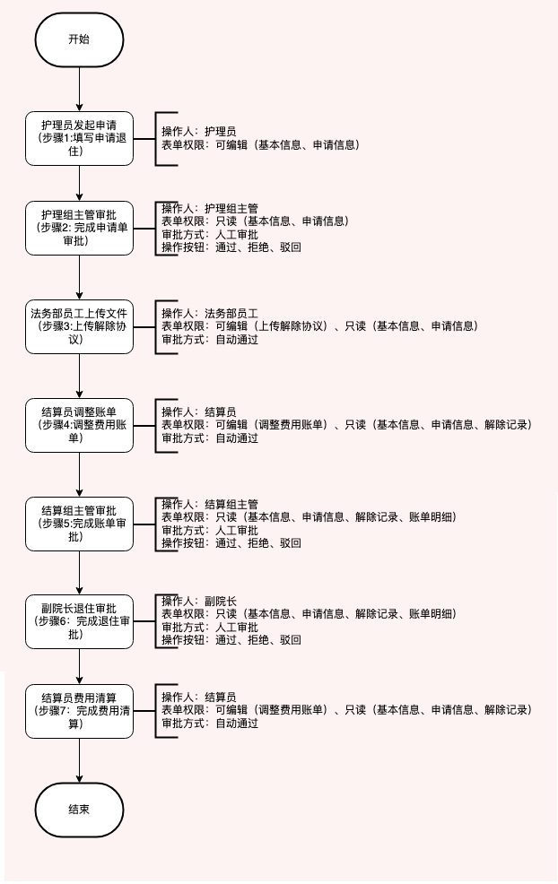
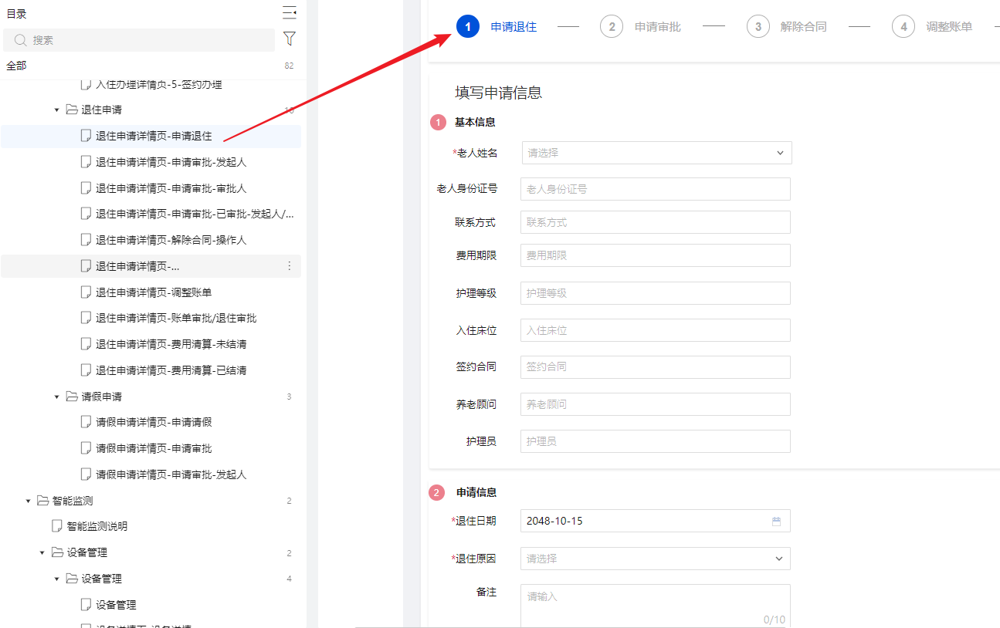
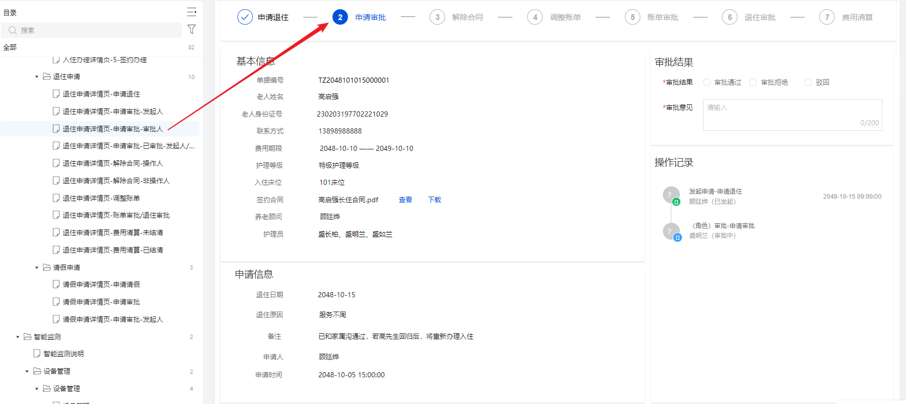
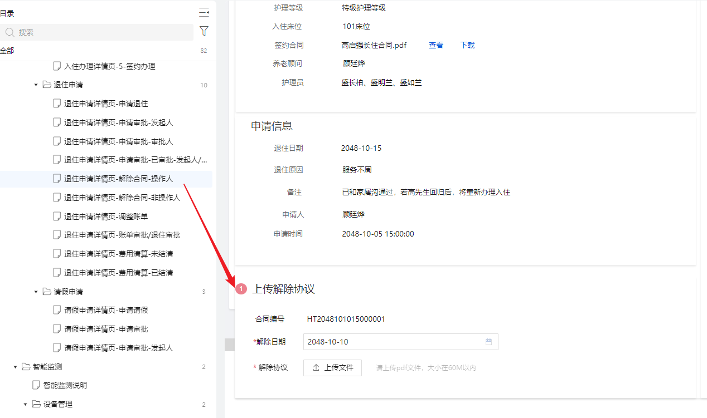
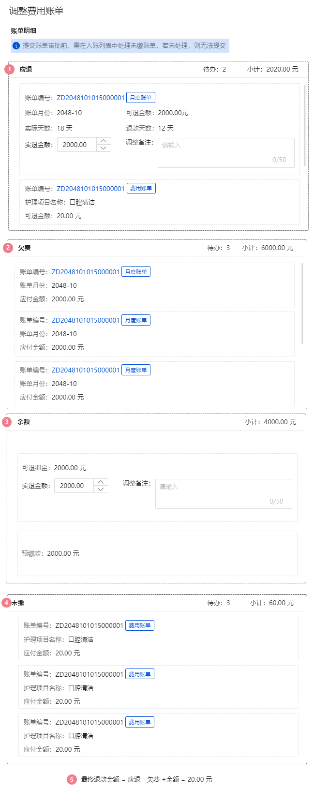
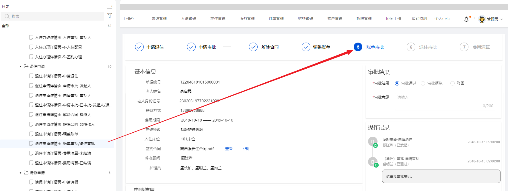
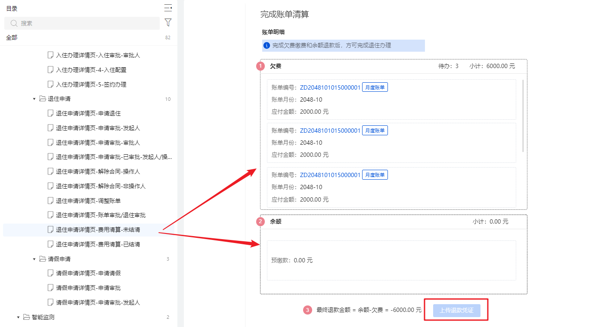
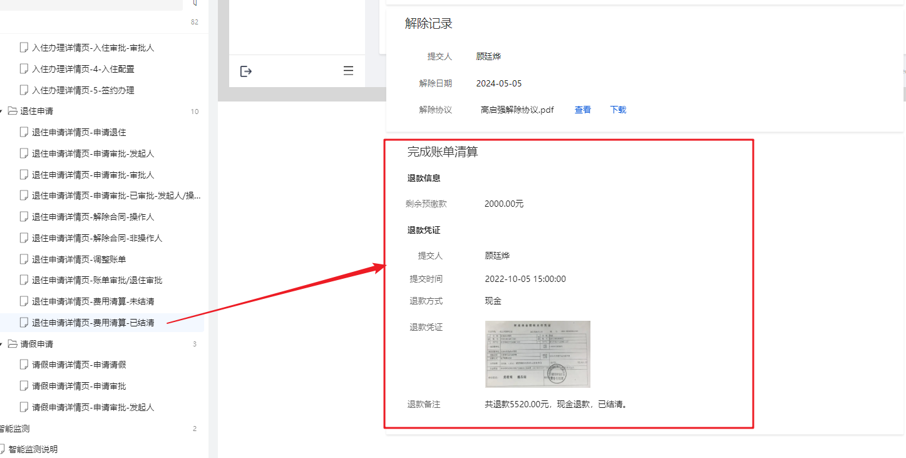
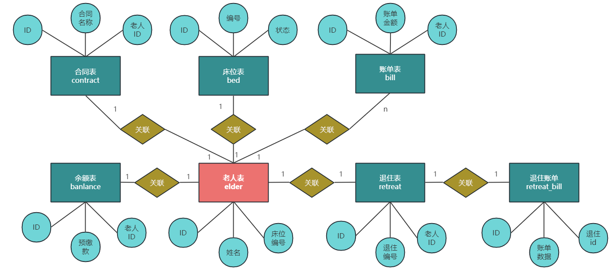

# 入退管理-退住


## 1 目标

经过前几天的努力，我们已经把入住的相关功能实现了，接下来我们要实现的是退住管理，由于退住管理与入住管理都需要使用工作流实现，所以，关于工作流的内容我们不在实现，我们重点讲解退住的业务以及退住流程中的核心流程操作。

所以今天的目标是：

- 能够掌握退住业务的核心流程
- 能够掌握退住业务的表结构关系
- 能够阅读退住的业务流程代码
- 能够完成退住流程中的账单结算功能


## 2 需求分析


### 2.1 整体业务介绍

我们先打开原型图，查看退住申请的流程，如下：



退住的操作步骤更长，并且需要参与审批的角色有很多，并且每一步都挂载了当前步骤的表单数据。


### 2.2 详细业务介绍


#### 2.2.1 申请退住



这一步的操作人是”护理员”，主要作用就是：上传老人相关资料，填写完毕，提交退住申请


#### 2.2.2 申请审批



这一步的操作人是”护理组长”，检查老人的数据正常正常，属于审批操作


#### 2.2.3 解除合同



这一步的操作人是”法务人员”，在线下签订退住协议，上传到系统中


#### 2.2.4 调整账单



这一步的操作人是”财务人员”，由财务人员手动调整账单，账单共分为4类

1. 应退，应退包含了两类账单，一个是月度账单，另外一个是费用账单月度账单

- 月度账单，月度账单=已缴费、账单结束时间>退住时间

   - 若退住日期所属月份等于费用结束日期所属月份

      - 实际天数=退住日期-当月费用开始日期:
      - 退款天数=当月费用结束日期-退住日期:
      - 可退金额=每月应付金额/当月总天数*退住天数;
   - 若退住日期所属月份 不等于 账单所属月份 (已支付账单)

      - 实际天数 = 0；
      - 退款天数 = 当月总天数；
      - 可退金额 = 每月应付金额；
- 费用账单

   - 费用账单=已缴费、未执行；

2. 
欠费

月度账单=截止到退住所属月份前，未缴纳的账单；

3. 
余额

老人缴纳的预缴款余额

4. 
未缴

费用账单：未支付的订单就是未缴


#### 2.2.5 账单审批



这一步的操作人是”结算组长”进行审批账单


#### 2.2.6 退住审批


这一步的操作人是”副院长”进行审批账单


#### 2.2.7 费用算清

这一步是由”财务人员”进行处理，算出最终的价格，给老人退款或者让老人补钱



算清之后的流程就直接结束，效果入下：




## 3 表结构说明

退住与入住有很多的表是有关系的，表结构如下：




## 4 接口分析


### 4.1 退住表单查询

**接口地址**:`/elder`

**请求方式**:`GET`

**请求参数**:

| 参数名称 | 参数说明 | 请求类型 | 是否必须 | 数据类型 | schema |
| --- | --- | --- | --- | --- | --- |
| flowStatus | 流程状态 | query | true | integer(int32) |  |
| retreatCode | 退住编码 | query | true | string |  |
| assigneeId | 处理人ID | query | false | string |  |
| taskId | 任务id | query | false | string |  |


**响应示例**:

```javascript
{
	"code": 0,
	"data": {
		"accraditationRecords": [
			{
				"approverId": 0,
				"approverName": "",
				"approverNameRole": "",
				"auditStatus": 0,
				"bussniessId": 0,
				"createBy": 0,
				"createTime": "",
				"creator": "",
				"currentStep": "",
				"handleType": 0,
				"id": 0,
				"nextApprover": "",
				"nextApproverId": 0,
				"nextApproverRole": "",
				"nextStep": "",
				"opinion": "",
				"remark": "",
				"stepNo": 0,
				"type": 0,
				"updateBy": 0,
				"updateTime": "",
				"updater": ""
			}
		],
		"billJson": "",
		"checkIn": {
			"adminCreator": "",
			"applicat": "",
			"applicatId": 0,
			"bedVo": {
				"adminCreator": "",
				"bedNumber": "",
				"bedStatus": 0,
				"checkInConfigVo": {
					"add1": 0,
					"add2": 0,
					"adminCreator": "",
					"bedCost": 0,
					"bedId": 0,
					"bedNo": "",
					"checkInEndTime": "",
					"checkInEndTimeStr": "",
					"checkInStartTime": "",
					"checkInStartTimeStr": "",
					"code": "",
					"costEndTime": "",
					"costEndTimeStr": "",
					"costStartTime": "",
					"costStartTimeStr": "",
					"createBy": 0,
					"createDay": "",
					"createTime": "",
					"createType": 0,
					"creator": "",
					"dataState": "",
					"depositAmount": 0,
					"elderId": 0,
					"floorId": 0,
					"floorName": "",
					"governmentSubsidy": 0,
					"id": 0,
					"medicalInsurancePayment": 0,
					"monthCost": 0,
					"nursingCost": 0,
					"nursingLevelId": 0,
					"otherCost": 0,
					"remark": "",
					"roomId": 0,
					"updateBy": 0,
					"updateTime": "",
					"updater": ""
				},
				"code": "",
				"createBy": 0,
				"createDay": "",
				"createTime": "",
				"createType": 0,
				"creator": "",
				"dataState": "",
				"deviceVos": [
					{
						"adminCreator": "",
						"bindingLocation": 0,
						"createBy": 0,
						"createDay": "",
						"createTime": "",
						"createType": 0,
						"creator": "",
						"dataState": "",
						"deviceDataVos": [
							{
								"accessLocation": "",
								"adminCreator": "",
								"alarmTime": "",
								"createBy": 0,
								"createDay": "",
								"createTime": "",
								"createType": 0,
								"creator": "",
								"data": "",
								"dataState": "",
								"dataValue": "",
								"deviceName": "",
								"functionName": "",
								"id": 0,
								"noteName": "",
								"processingResult": "",
								"processingTime": "",
								"processor": "",
								"productId": "",
								"productName": "",
								"remark": "",
								"status": 0,
								"updateBy": 0,
								"updateTime": "",
								"updater": ""
							}
						],
						"deviceDescription": "",
						"deviceId": "",
						"deviceName": "",
						"deviceSecret": "",
						"firmwareVersion": "",
						"gmtActive": "",
						"gmtCreate": "",
						"gmtOnline": "",
						"id": 0,
						"iotId": "",
						"ipAddress": "",
						"locationType": 0,
						"nickname": "",
						"nodeType": 0,
						"owner": true,
						"physicalLocationType": 0,
						"productKey": "",
						"productName": "",
						"region": "",
						"remark": "",
						"status": "",
						"updateBy": 0,
						"updateTime": "",
						"updater": "",
						"utcActive": "",
						"utcCreate": "",
						"utcOnline": ""
					}
				],
				"elderId": 0,
				"floorId": 0,
				"floorName": "",
				"id": 0,
				"lname": "",
				"name": "",
				"nursingIds": [],
				"nursingNames": [],
				"price": 0,
				"remark": "",
				"roomId": 0,
				"sort": 0,
				"status": 0,
				"typeName": "",
				"updateBy": 0,
				"updateTime": "",
				"updater": "",
				"userVos": [
					{
						"adminCreator": "",
						"checkedIds": [],
						"createBy": 0,
						"createDay": "",
						"createTime": "",
						"createType": 0,
						"creator": "",
						"dataState": "",
						"dept": "",
						"deptNo": "",
						"email": "",
						"id": 0,
						"mobile": "",
						"nickName": "",
						"openId": "",
						"password": "",
						"post": "",
						"postNo": "",
						"realName": "",
						"remark": "",
						"resourceRequestPaths": [],
						"roleId": 0,
						"roleLabels": [],
						"roleList": [
							{
								"adminCreator": "",
								"checkedDeptNos": [],
								"checkedIds": [],
								"checkedResourceNos": [],
								"createBy": 0,
								"createDay": "",
								"createTime": "",
								"createType": 0,
								"creator": "",
								"dataScope": "",
								"dataState": "",
								"id": 0,
								"label": "",
								"remark": "",
								"roleName": "",
								"sortNo": 0,
								"updateBy": 0,
								"updateTime": "",
								"updater": "",
								"userId": ""
							}
						],
						"roleVoIds": [],
						"sex": "",
						"updateBy": 0,
						"updateTime": "",
						"updater": "",
						"userToken": "",
						"userType": "",
						"username": ""
					}
				]
			},
			"checkInCode": "",
			"checkInConfigVo": {
				"add1": 0,
				"add2": 0,
				"adminCreator": "",
				"bedCost": 0,
				"bedId": 0,
				"bedNo": "",
				"checkInEndTime": "",
				"checkInEndTimeStr": "",
				"checkInStartTime": "",
				"checkInStartTimeStr": "",
				"code": "",
				"costEndTime": "",
				"costEndTimeStr": "",
				"costStartTime": "",
				"costStartTimeStr": "",
				"createBy": 0,
				"createDay": "",
				"createTime": "",
				"createType": 0,
				"creator": "",
				"dataState": "",
				"depositAmount": 0,
				"elderId": 0,
				"floorId": 0,
				"floorName": "",
				"governmentSubsidy": 0,
				"id": 0,
				"medicalInsurancePayment": 0,
				"monthCost": 0,
				"nursingCost": 0,
				"nursingLevelId": 0,
				"otherCost": 0,
				"remark": "",
				"roomId": 0,
				"updateBy": 0,
				"updateTime": "",
				"updater": ""
			},
			"checkInTime": "",
			"contractVo": {
				"adminCreator": "",
				"checkInNo": "",
				"contractNo": "",
				"createBy": 0,
				"createDay": "",
				"createTime": "",
				"createType": 0,
				"creator": "",
				"dataState": "",
				"elderId": 0,
				"elderName": "",
				"elderVo": {
					"adminCreator": "",
					"arrearsAmount": 0,
					"createBy": 0,
					"createDay": "",
					"createTime": "",
					"createType": 0,
					"creator": "",
					"dataState": "",
					"id": 0,
					"idCardNo": "",
					"image": "",
					"name": "",
					"paymentDeadline": "",
					"phone": "",
					"remark": "",
					"status": 0,
					"updateBy": 0,
					"updateTime": "",
					"updater": ""
				},
				"endTime": "",
				"id": 0,
				"levelDesc": "",
				"memberId": 0,
				"memberName": "",
				"memberPhone": "",
				"name": "",
				"pdfUrl": "",
				"releaseDate": "",
				"releasePdfUrl": "",
				"releaseSubmitter": "",
				"remark": "",
				"roomVo": {
					"adminCreator": "",
					"bedVoList": [
						{}
					],
					"code": "",
					"createBy": 0,
					"createDay": "",
					"createTime": "",
					"createType": 0,
					"creator": "",
					"dataState": "",
					"deviceVos": [
						{}
					],
					"floorId": 0,
					"floorName": "",
					"id": 0,
					"occupancyRate": 0,
					"occupiedBeds": 0,
					"price": 0,
					"remark": "",
					"sort": 0,
					"status": 0,
					"totalBeds": 0,
					"typeName": "",
					"updateBy": 0,
					"updateTime": "",
					"updater": ""
				},
				"signDate": "",
				"sort": 0,
				"startTime": "",
				"status": 0,
				"updateBy": 0,
				"updateTime": "",
				"updater": ""
			},
			"counselor": "",
			"createBy": 0,
			"createDay": "",
			"createTime": "",
			"createType": 0,
			"creator": "",
			"dataState": "",
			"deptNo": "",
			"elderDto": {
				"age": "",
				"id": 0,
				"idCardNo": "",
				"image": "",
				"name": "",
				"phone": "",
				"remark": "",
				"sex": "",
				"status": 0
			},
			"elderId": 0,
			"flowStatus": 0,
			"id": 0,
			"isShow": 0,
			"memberElderDtos": [
				{
					"elderId": 0,
					"id": 0,
					"idCard": "",
					"memberId": 0,
					"name": "",
					"phone": "",
					"refId": "",
					"refName": "",
					"remark": ""
				}
			],
			"nursingLevelVo": {
				"adminCreator": "",
				"cid": 0,
				"createBy": 0,
				"createDay": "",
				"createTime": "",
				"createType": 0,
				"creator": "",
				"dataState": "",
				"description": "",
				"fee": 0,
				"id": 0,
				"name": "",
				"planId": 0,
				"planName": "",
				"remark": "",
				"status": 0,
				"updateBy": 0,
				"updateTime": "",
				"updater": ""
			},
			"otherApplyInfo": "",
			"reason": "",
			"remark": "",
			"reviewInfo": "",
			"reviewInfo1": "",
			"reviewInfo2": "",
			"roomVo": {
				"adminCreator": "",
				"bedVoList": [
					{}
				],
				"code": "",
				"createBy": 0,
				"createDay": "",
				"createTime": "",
				"createType": 0,
				"creator": "",
				"dataState": "",
				"deviceVos": [
					{}
				],
				"floorId": 0,
				"floorName": "",
				"id": 0,
				"occupancyRate": 0,
				"occupiedBeds": 0,
				"price": 0,
				"remark": "",
				"sort": 0,
				"status": 0,
				"totalBeds": 0,
				"typeName": "",
				"updateBy": 0,
				"updateTime": "",
				"updater": ""
			},
			"status": 0,
			"title": "",
			"updateBy": 0,
			"updateTime": "",
			"updater": "",
			"url1": "",
			"url2": "",
			"url3": ""
		},
		"isRevocation": true,
		"isShow": 0,
		"nextApprover": "",
		"rescissionContract": {
			"commitor": "",
			"contractUrl": "",
			"relieveTime": "",
			"rescissionContractName": ""
		},
		"retreat": {
			"applicat": "",
			"applicatId": 0,
			"bedNo": "",
			"checkInEndTime": "",
			"checkInStartTime": "",
			"checkOutTime": "",
			"contractName": "",
			"contractNo": "",
			"contractUrl": "",
			"counselor": "",
			"createBy": 0,
			"createTime": "",
			"creator": "",
			"deptNo": "",
			"elderId": 0,
			"flowStatus": 0,
			"id": 0,
			"idCardNo": "",
			"name": "",
			"nursingLevelName": "",
			"nursingName": "",
			"phone": "",
			"reason": "",
			"remark": "",
			"retreatCode": "",
			"status": 0,
			"taskId": "",
			"title": "",
			"updateBy": 0,
			"updateTime": "",
			"updater": ""
		},
		"retreatBill": {
			"billJson": "",
			"createBy": 0,
			"createTime": "",
			"elderId": 0,
			"id": 0,
			"isRefund": 0,
			"refundAmount": 0,
			"refundVoucherUrl": "",
			"remark": "",
			"retreatId": 0,
			"tradingChannel": "",
			"updateBy": 0,
			"updateTime": ""
		},
		"retreatBillVo": {
			"arrearageList": [
				{
					"amount": 0,
					"billMonth": "",
					"code": "",
					"type": 0
				}
			],
			"balanceVo": {
				"adminCreator": "",
				"arrearsAmount": 0,
				"bedNo": "",
				"createBy": 0,
				"createDay": "",
				"createTime": "",
				"createType": 0,
				"creator": "",
				"dataState": "",
				"depositAmount": 0,
				"description": "",
				"elderId": 0,
				"elderName": "",
				"id": 0,
				"paymentDeadline": "",
				"prepaidBalance": 0,
				"remark": "",
				"status": 0,
				"updateBy": 0,
				"updateTime": "",
				"updater": ""
			},
			"dueBackList": [
				{
					"amount": 0,
					"billMonth": "",
					"code": "",
					"dueBackDay": 0,
					"nursingName": "",
					"realAmount": 0,
					"realDay": 0,
					"remark": "",
					"surplusDay": 0,
					"tradingOrderNo": 0,
					"type": 0
				}
			],
			"unpaidList": [
				{
					"amount": 0,
					"code": "",
					"nursingName": "",
					"type": 0
				}
			]
		},
		"type": 0
	},
	"msg": "",
	"operationTime": ""
}
```


### 4.2 驳回

**接口地址**:`/elder`

**请求方式**:`PUT`

**请求参数**:

| 参数名称 | 参数说明 | 请求类型 | 是否必须 | 数据类型 |
| --- | --- | --- | --- | --- |
| message | 驳回消息 | query | true | string |
| retreatCode | 退住编码 | query | true | string |
| taskId | 任务Id | query | true | string |


**响应示例**:

```javascript
{
	"code": 0,
	"data": {},
	"msg": "",
	"operationTime": ""
}
```


### 4.3 撤销

**接口地址**:`/elder/cancel`

**请求方式**:`PUT`

**请求参数**:

| 参数名称 | 参数说明 | 请求类型 | 是否必须 | 数据类型 | schema |
| --- | --- | --- | --- | --- | --- |
| retreatCode | 退住编码 | query | true | string |  |
| taskId | 任务Id | query | true | string |  |


**响应示例**:

```javascript
{
	"code": 0,
	"data": {},
	"msg": "",
	"operationTime": ""
}
```


### 4.4 申请退住

**接口地址**:`/elder/create`

**请求方式**:`POST`

**请求示例**:

```javascript
{
  "applicat": "",
  "applicatId": 0,
  "bedNo": "",
  "checkInEndTime": "",
  "checkInStartTime": "",
  "checkOutTime": "",
  "contractName": "",
  "contractNo": "",
  "contractUrl": "",
  "counselor": "",
  "createBy": 0,
  "createTime": "",
  "creator": "",
  "deptNo": "",
  "elderId": 0,
  "flowStatus": 0,
  "id": 0,
  "idCardNo": "",
  "name": "",
  "nursingLevelName": "",
  "nursingName": "",
  "phone": "",
  "reason": "",
  "remark": "",
  "retreatCode": "",
  "status": 0,
  "taskId": "",
  "title": "",
  "updateBy": 0,
  "updateTime": "",
  "updater": ""
}
```

**响应示例**:

```javascript
{
	"code": 0,
	"data": {},
	"msg": "",
	"operationTime": ""
}
```


### 4.5 审核拒绝

**接口地址**:`/elder/reject`

**请求方式**:`PUT`

**请求参数**:

| 参数名称 | 参数说明 | 请求类型 | 是否必须 | 数据类型 | schema |
| --- | --- | --- | --- | --- | --- |
| reject | 拒绝原因 | query | true | string |  |
| retreatCode | 退退住编码 | query | true | string |  |
| taskId | 任务Id | query | true | string |  |


**响应示例**:

```javascript
{
	"code": 0,
	"data": {},
	"msg": "",
	"operationTime": ""
}
```


### 4.6 撤回

**接口地址**:`/elder/revocation`

**请求方式**:`PUT`

**请求参数**:

| 参数名 | 参数说明 | 请求类型 | 是否必须 | 数据类型 | schema |
| --- | --- | --- | --- | --- | --- |
| flowStatus | 流程状态 | query | true | integer(int32) |  |
| retreatCode | 退住编码 | query | true | string |  |
| taskId | 任务Id | query | true | string |  |


**响应示例**:

```javascript
{
	"code": 0,
	"data": {},
	"msg": "",
	"operationTime": ""
}
```


### 4.7 退住管理

**接口地址**:`/elder/selectByPage`

**请求方式**:`POST`

**请求示例**:

```javascript
{
  "createBy": 0,
  "createTime": "",
  "creator": "",
  "endTime": "",
  "id": 0,
  "idCardNo": "",
  "name": "",
  "pageNum": 0,
  "pageSize": 0,
  "remark": "",
  "retreatCode": "",
  "startTime": "",
  "updateBy": 0,
  "updateTime": "",
  "updater": ""
}
```

**响应示例**:

```javascript
{
	"code": 0,
	"data": {},
	"msg": "",
	"operationTime": ""
}
```


### 4.8 提交退住表单

**接口地址**:`/elder/submit`

**请求方式**:`POST`

**请求示例**:

```javascript
{
  "accraditationRecord": {
    "approverId": 0,
    "approverName": "",
    "approverNameRole": "",
    "auditStatus": 0,
    "bussniessId": 0,
    "createBy": 0,
    "createTime": "",
    "creator": "",
    "currentStep": "",
    "handleType": 0,
    "id": 0,
    "nextApprover": "",
    "nextApproverId": 0,
    "nextApproverRole": "",
    "nextStep": "",
    "opinion": "",
    "remark": "",
    "stepNo": 0,
    "type": 0,
    "updateBy": 0,
    "updateTime": "",
    "updater": ""
  },
  "assigneeId": "",
  "billJson": "",
  "code": "",
  "rescissionContract": {
    "commitor": "",
    "contractUrl": "",
    "relieveTime": "",
    "rescissionContractName": ""
  },
  "retreatBillVo": {
    "arrearageList": [
      {
        "amount": 0,
        "billMonth": "",
        "code": "",
        "type": 0
      }
    ],
    "balanceVo": {
      "adminCreator": "",
      "arrearsAmount": 0,
      "bedNo": "",
      "createBy": 0,
      "createDay": "",
      "createTime": "",
      "createType": 0,
      "creator": "",
      "dataState": "",
      "depositAmount": 0,
      "description": "",
      "elderId": 0,
      "elderName": "",
      "id": 0,
      "paymentDeadline": "",
      "prepaidBalance": 0,
      "remark": "",
      "status": 0,
      "updateBy": 0,
      "updateTime": "",
      "updater": ""
    },
    "dueBackList": [
      {
        "amount": 0,
        "billMonth": "",
        "code": "",
        "dueBackDay": 0,
        "nursingName": "",
        "realAmount": 0,
        "realDay": 0,
        "remark": "",
        "surplusDay": 0,
        "tradingOrderNo": 0,
        "type": 0
      }
    ],
    "unpaidList": [
      {
        "amount": 0,
        "code": "",
        "nursingName": "",
        "type": 0
      }
    ]
  },
  "taskId": ""
}
```

**响应示例**:

```javascript
{
	"code": 0,
	"data": {},
	"msg": "",
	"operationTime": ""
}
```


### 4.9 上传退款凭证数据回显

**接口地址**:`/retreat_bills`

**请求方式**:`GET`

**接口描述**:

**请求参数**:

| 参数名称 | 参数说明 | 请求类型 | 是否必须 | 数据类型 | schema |
| --- | --- | --- | --- | --- | --- |
| retreatId | retreatId | query | false | integer(int64) |  |


**响应示例**:

```javascript
{
	"code": 0,
	"data": {},
	"msg": "",
	"operationTime": ""
}
```


### 4.10 上传退款凭证

**接口地址**:`/retreat_bills/uploadRefundVoucher`

**请求方式**:`PUT`

**请求示例**:

```javascript
{
  "refundAmount": 0,
  "refundVoucherUrl": "",
  "remark": "",
  "retreatCode": "",
  "tradingChannel": ""
}
```

**响应示例**:

```json
{
	"code": 0,
	"data": {},
	"msg": "",
	"operationTime": ""
}
```


## 5 结算功能


### 5.1 账单数据查询


#### 5.1.1 思路分析

结算功能从退住流程的第四步开始


第四步是由结算员来调整账单，我们需要到老人的账单表中去查询老人的账单数据，共有4类，分别是：

- 应退

   - 月度账单
   - 费用账单（暂时不涉及，不考虑）
- 欠费

   - 没有正常缴费的老人
- 余额

   - 押金和预缴款
- 未缴

   - 在小程序端已下单，还未缴费的单子（暂时不涉及，不考虑）

其中第5步和第6步分别都是审核操作，比较关键是第6步，一旦院长审批通过之后，


## 6 其他业务说明
