# 物联网智能监测-IOT产品设备管理


## 1 目标

从今天开始，我们开始一个新的模块开发，叫做**智能监测**，我们可以先来看一张图


老人入住养老院之后，可以通过选择的配置来配备智能硬件设备，它有两类场景：安全场景和健康场景

- 安全场景：防跌倒意外、防走失、睡眠中意外、区域滞留、环境安全
- 健康场景：健康监测、健康小屋；

通过硬件设备来监控老人以及老人活动场所的情况。后台时刻做监控，一旦有意外发生就可以迅速处理解决。

其中关于智能设备的数据传输和上报，采用的阿里云提供的IOT物理网平台，我们也会重点讲解设备如何上报数据到IOT以及如何从IOT平台拉取数据

今日的目标：

- 能够熟悉阿里云IOT平台的特点
- 能够掌握阿里云IOT平台的一些概念，如：产品、设备、物模型等
- 能够掌握使用阿里云IOT平台提供的接口创建设备，并绑定业务数据（老人、位置）
- 能够熟悉智能设备对接阿里云IOT平台上报数据的方式


## 2 阿里云IOT平台

在开发智能监测之前，我们必须要先熟悉和掌握阿里云IOT平台的使用及对接，才能开发我们的项目


### 2.1 什么是物联网

把所有物品通过信息传感设备与互联网连接起来，进行信息交换，即物物相息，以实现智能化识别和管理。

物联网（英文：Internet of Things，缩写：IoT）起源于传媒领域，是信息科技产业的第三次革命。物联网是指通过信息传感设备，按约定的协议，将任何物体与网络相连接，物体通过信息传播媒介进行信息交换和通信，以实现智能化识别、定位、跟踪、监管等功能。

常见的应用场景：

- 
共享充电宝

充电宝设备接入物联网平台后，可上报充电宝电量和借用状态等信息到物联网平台云端。充电宝用户扫码后，云端低延时向充电宝下发指令，使其弹出。同时，企业运营者能够实时获知充电宝的运行状况。

- 
智能音箱

播报音箱接入物联网平台后，用户扫码完成支付后，将支付金额实时通过音箱，向用户和商家进行语音播报。

- 
智能家居

智能家居技术已经成为当今家庭装潢的一大特色。比如，通过智能灯泡，可以实现远程控制灯光和电视等设备，调节温度和湿度，实现智能化生活。

- 
智能农耕

智能农耕可以通过物联网技术来监测、传输、分析、管理农业生产过程中的信息。比如作物的生长情况、土壤的状况等，以提高农业生产的效率，改善利润率，减少污染，节约农业资源。

- 
智能医疗

在智慧医疗中，可以捕捉人的生理状态信息，例如心跳频率、体力消耗、血压高低等。然后对采集数据进行备份、加工和分析，以便个人或医生快速查询。在物联网平台接入传感器设备，采集人体及周边环境参数的信息，通过数据服务处理数据后，反馈给用户。


### 2.2 IOT简介

产品文档：[https://help.aliyun.com/zh/iot/product-overview/?spm=a2c4g.11186623.0.0.32d844a6NPRO9e](https://help.aliyun.com/zh/iot/product-overview/?spm=a2c4g.11186623.0.0.32d844a6NPRO9e)

阿里云物联网平台是一个集成了设备管理、数据安全通信、消息订阅和数据服务等能力的一体化平台。向下支持连接海量设备，采集设备数据上云；向上提供云端API，服务端可通过调用云端API将指令下发至设备端，实现远程控制。

我们作为一个开发者，基本的设备与后台调度思路，如下：


> 更多的介绍可以阅读官方产品文档


### 2.3 开通物联网平台


#### 2.3.1 开通阿里云账号

前往[阿里云官网](https://www.aliyun.com/)注册账号。如果已有注册账号，请跳过此步骤。

进入阿里云首页后，如果没有阿里云的账户需要先进行注册，才可以进行登录。由于注册较为简单，课程和讲义不在进行体现（注册可以使用多种方式，如淘宝账号、支付宝账号等...）。

需要实名认证和活体认证。


#### 2.3.2 开通物理网平台

登录账号以后，我们可以在产品中搜索物联网平台

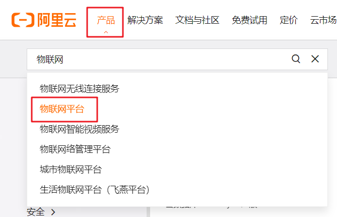

打开之后，点击管理控制台


如果没有开通的话，会提示你开通物联网平台，如下图，直接开通即可


#### 2.3.3 申请公共实例

在IOT中分为了两种实例，一个是**公共实例**，另外一个是**企业实例**，不同的实例收费标准和功能是不一样的

- 公共实例，免费，使用地域为**上海**，支持同时在线设备数为50个，最多可创建500个设备，消息通信TPS为5条/秒
- 企业实例，如果公共实例超出了业务需求资源，可以使用企业实例，企业实例可以按照包年包月方式计算

在我们教学阶段，可以申请使用公共实例使用，如下图

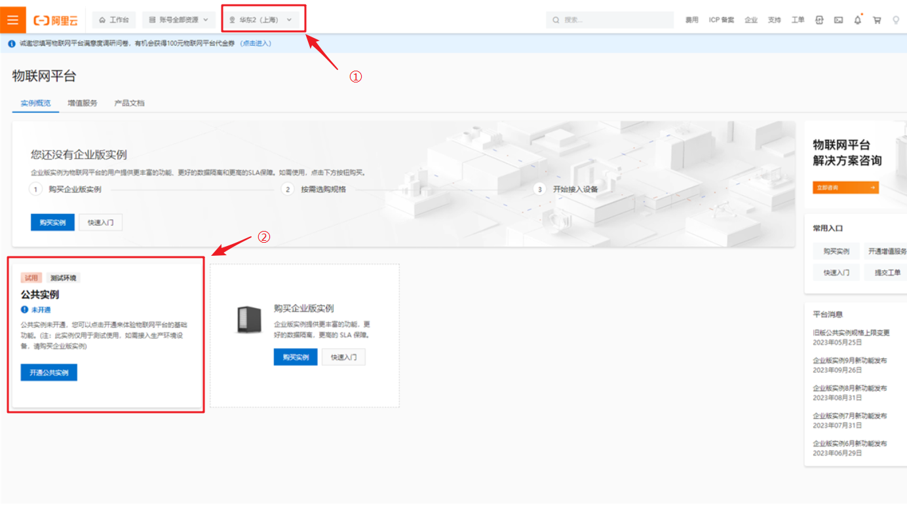

注意：地域必须选择**上海**才能申请公共实例


### 2.4 产品

一旦拥有了公共实例，我们就可以使用临时实例来进行开发，我们先来介绍产品和设备


#### 2.4.1 创建产品

[https://help.aliyun.com/zh/iot/user-guide/create-a-product?spm=a2c4g.11186623.0.0.6ac7133dbo6zWV](https://help.aliyun.com/zh/iot/user-guide/create-a-product?spm=a2c4g.11186623.0.0.6ac7133dbo6zWV)

产品：设备的集合，通常指一组具有相同功能的设备。物联网平台为每个产品颁发全局唯一的ProductKey。

简单说就是某一类产品，比如，手表、大门通道门禁、紧急呼叫报警器、滞留报警器、跌倒报警器

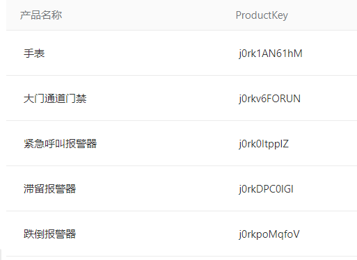

现在我们可以创建产品，找到产品-->创建产品


如下图，输入产品名称，然后选择平台提供好的分类，其他选择默认即可，然后确认创建

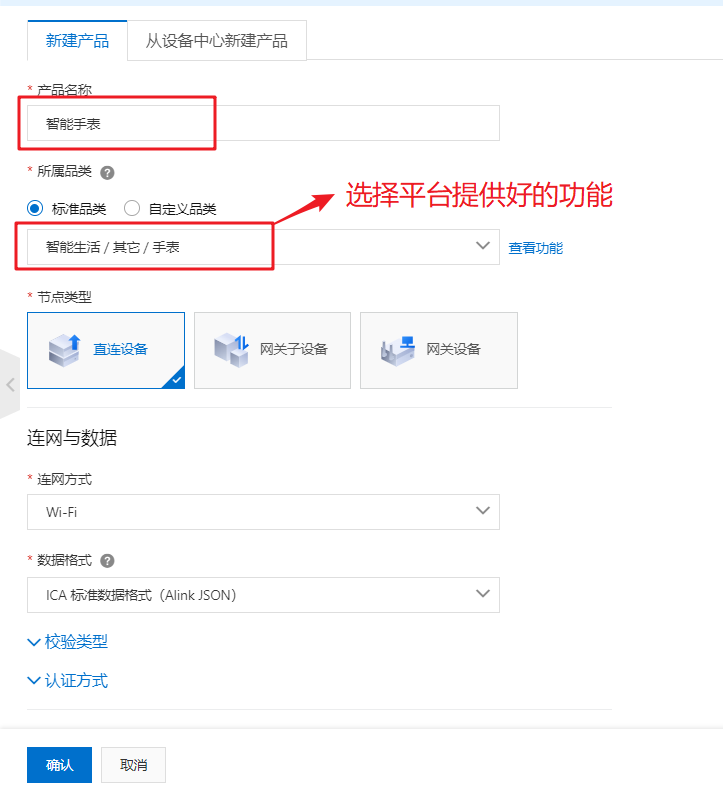

创建成功之后，如下图

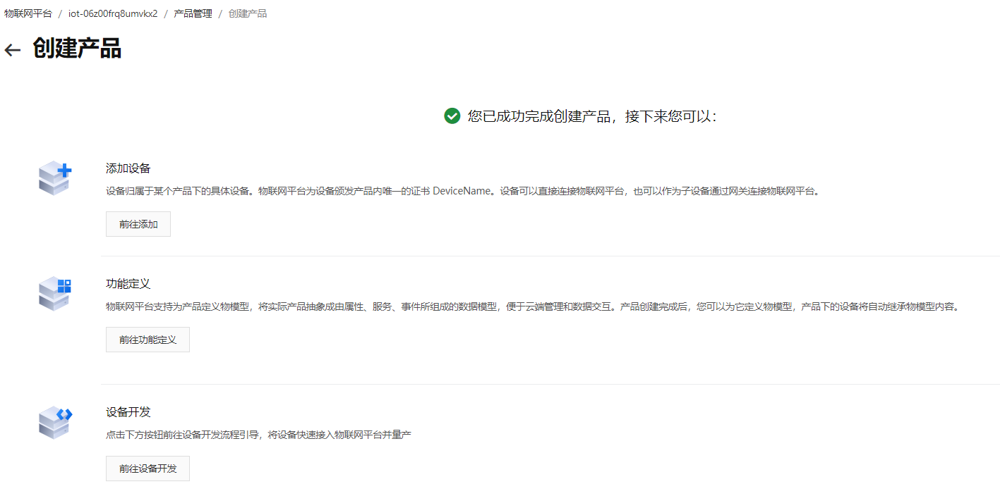

在产品列表中也可以查看，刚刚创建的产品


#### 2.4.2 物模型

[https://help.aliyun.com/zh/iot/user-guide/add-a-tsl-feature?spm=a2c4g.11186623.0.0.9abf6ec2jkNsER](https://help.aliyun.com/zh/iot/user-guide/add-a-tsl-feature?spm=a2c4g.11186623.0.0.9abf6ec2jkNsER)

产品创建好之后，可以给产品添加物模型，也就是给产品定义功能。

比如我们刚才创建的手表产品，可以定义功能，功能也可以分为两类，一个是监测手表本身，一个是因为指标数据

- 
手表本身：耗电量，使用时间

- 
指标数据：身体血压、血氧、体温数据


像这些耗电量、血压、血氧数据都属于产品的功能，也叫做物模型

在IOT平台的物模型中，分为了三类：

| 功能类型 | 说明 |
| --- | --- |
| 属性（Property） | 用于描述设备运行时具体信息和状态。例如，环境监测设备所读取的当前环境温度、智能灯开关状态、电风扇风力等级等。属性可分为读写和只读两种类型。读写类型支持读取和设置属性值，只读类型仅支持读取属性值。 |
| 服务（Service） | 指设备可供外部调用的指令或方法。服务调用中可设置输入和输出参数。输入参数是服务执行时的参数，输出参数是服务执行后的结果。相比于属性，服务可通过一条指令实现更复杂的业务逻辑，例如执行某项特定的任务。 |
| 事件（Event） | 设备运行时，主动上报给云端的信息，一般包含需要被外部感知和处理的信息、告警和故障。事件中可包含多个输出参数。
例如，某项任务完成后的通知信息；设备发生故障时的温度、时间信息；设备告警时的运行状态等。 |


创建手表产品的**耗电量**物模型，如下图：


### 2.5 设备

[https://help.aliyun.com/zh/iot/user-guide/create-a-device?spm=a2c4g.11186623.0.0.4f1b12ackrzdOs](https://help.aliyun.com/zh/iot/user-guide/create-a-device?spm=a2c4g.11186623.0.0.4f1b12ackrzdOs)

产品是设备的集合，通常指一组具有相同功能的设备。创建产品完成后，需在产品下添加设备，获取设备证书。您可在物联网平台上，同时创建一个或多个设备

前提条件：设备是绑定在产品上的，所以必须先创建产品才行

操作步骤：

1. 在左侧导航栏，选择**设备管理**> **设备**。
2. 在**设备**页面，单击**添加设备**。
3. 在**添加设备**对话框中，输入设备信息，单击**确认**。

如下图：


在添加设备的时候有三个参数，解释如下：

| 参数 | 描述 |
| --- | --- |
| 产品 | 选择产品。新创建的设备会继承该产品定义好的功能和特性。 |
| DeviceName | 设置设备名称。 设备名称在产品内具有唯一性。支持英文字母、数字、短划线（-）、下划线（_）、at（@）、英文句号（.）和英文冒号（:），长度限制为4~32个字符。 |
| 备注名称 | 设置备注名称。支持中文、英文字母、日文、数字和下划线（_），长度限制为4~64个字符，一个中文或日文占2个字符。 |


创建设备成功后，会自动弹出**添加完成**对话框。您可以查看、复制设备证书信息。设备证书由设备的ProductKey、DeviceName和DeviceSecret组成，是设备与物联网平台进行通信的重要身份认证。

| 参数 | 说明 |
| --- | --- |
| ProductKey | 设备所属产品的ProductKey，即物联网平台为产品颁发的全局唯一标识符。 |
| DeviceName | 设备在产品内的唯一标识符。DeviceName与设备所属产品的ProductKey组合，作为设备标识，用来与物联网平台进行连接认证和通信。 |
| DeviceSecret | 物联网平台为设备颁发的设备密钥，用于认证加密。需与DeviceName成对使用。 |


### 2.6 设备数据上报

[https://help.aliyun.com/zh/iot/user-guide/devices-retrieve-certificates/?spm=a2c4g.11186623.0.0.671b53felMSmzL](https://help.aliyun.com/zh/iot/user-guide/devices-retrieve-certificates/?spm=a2c4g.11186623.0.0.671b53felMSmzL)

物理设备可通过两种方式获取物联网平台颁发的设备证书（ProductKey、DeviceName和DeviceSecret）：设备厂商在产线上将证书烧录到设备上和设备上电联网后从厂商云服务中获取证书。

> 物联网烧录：是指将特定的程序或数据写入物联网设备中的过程。这些设备可能包括智能家居设备、智能穿戴设备、智能传感器等。通过烧录，可以实现设备的特定功能，例如控制灯光、监测温度、收集数据等。物联网烧录需要使用专业的工具和技术，确保烧录信息的完整性和准确性，以保证设备的正常工作和稳定性。


我们在开发阶段可以使用联网的电脑，来模拟设备的数据上报，比较简答的方式可以使用node来进行链接上报数据，参考代码如下：

```javascript
const mqtt = require('aliyun-iot-mqtt');
// 1. 设备身份信息
var options = {
  productKey: "j0rk1AN61hM",
  deviceName: "watch001",
  deviceSecret: "ea94110e5495bb04b0a7b35b9535a50c",
  host: "iot-06z00frq8umvkx2.mqtt.iothub.aliyuncs.com"
};

// 2. 建立MQTT连接
const client = mqtt.getAliyunIotMqttClient(options);
//订阅云端指令Topic
client.subscribe(`/${options.productKey}/${options.deviceName}/user/get`)
client.subscribe(`/sys/${options.productKey}/${options.deviceName}/thing/event/property/post_reply`)
client.on('message', function (topic, message) {
  console.log("topic " + topic)
  console.log("message " + message)
})

setInterval(function () {
  // 3.定时上报温湿度数据
  client.publish(`/sys/${options.productKey}/${options.deviceName}/thing/event/property/post`, getPostData(), { qos: 0 });
}, 5 * 1000);

var power = 1000;

function getPostData () {
  const payloadJson = {
    id: Date.now(),
    version: "1.0",
    params: {
      PowerConsumption: power--
    },
    method: "thing.event.property.post"

  }
  console.log("payloadJson " + JSON.stringify(payloadJson))
  return JSON.stringify(payloadJson);
}
```

把上述代码保存到一个文件夹下，以js为后缀名，如：iot_device_01.js

然后在js所在的文件夹下，打开cmd窗口，执行

```javascript
node iot_device_01.js
```

启动之后的效果如下：


设备启动后，可以在物联网平台查看刚才创建的设备，现在已在线

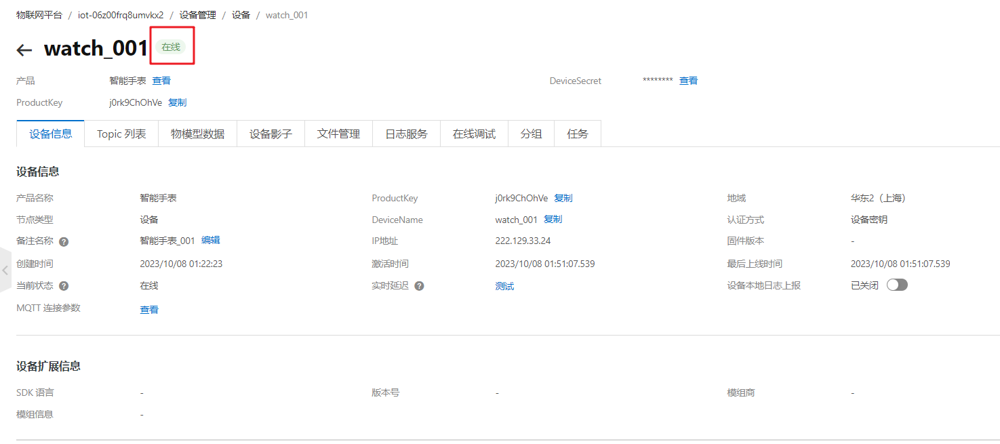

找到物模型数据，可以看到上报之后的数据

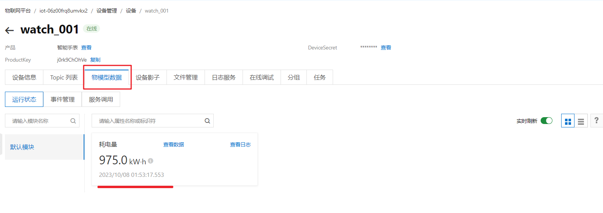


## 3 设备管理

我们熟悉了IOT平台的基本概念以及基本操作后，可以现在来分析后台系统的功能需求，在后台管理系统中，是需要自己维护设备，不需要创建产品，因为产品直接物联网平台创建添加即可

需要单独维护设备的原因是，设备需要跟养老院的老人或者位置进行绑定，才能做到精准的监控

比如：

- 烟雾报警器需要绑定到某个房间
- 智能手表需要绑定某个老人


### 3.1 需求分析


#### 3.1.1 原型图位置

我们打开原型图，找到智能监测


#### 3.1.2 新增设备

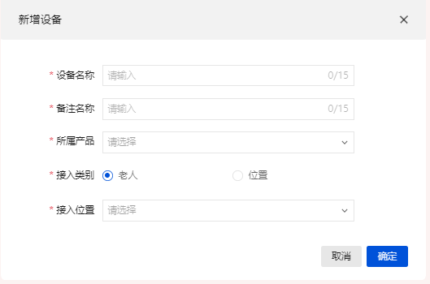

这个页面跟物联网平台有些类似，但是也不同，除了物联网中的三个字段外（设备名称、所属产品、备注名称），还有**接入类别**和**接入位置**

- 
接入类别

   - 老人
   - 位置
- 
接入位置

   - 如果接入类别是老人，在接入位置这边显示老人列表进行选择
   - 如果接入类别是位置，则显示楼层、房间、床位进行选择


#### 3.1.3 设备详情


在设备详情中也可以查看物模型数据

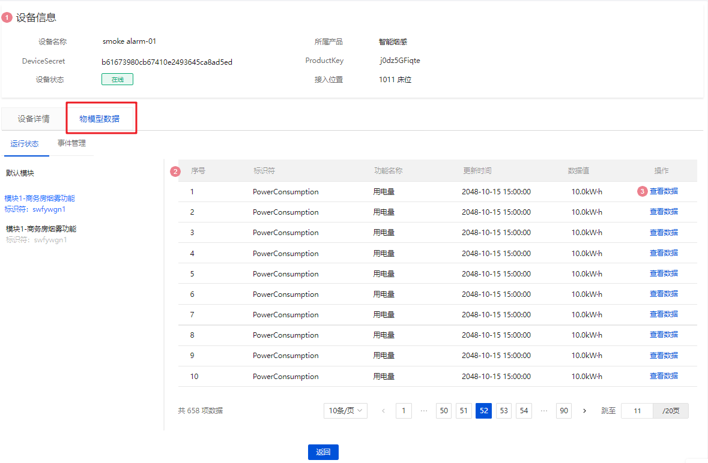

当物模型的列表中，点击**查看数据**按钮，可以按照时间检索物模型数据

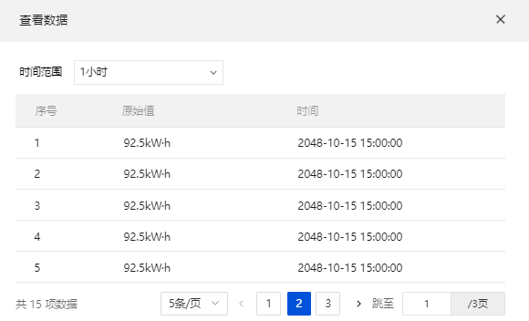


### 3.2 表结构分析

因为在本地需要维护设备数据，所以需要在本地创建设备表，数据也要存储，也需要创建设备数据表，如下：


sql表结构

```sql
CREATE TABLE "device" (
  "id" bigint NOT NULL AUTO_INCREMENT,
  "device_id" varchar(50) CHARACTER SET utf8mb4 COLLATE utf8mb4_unicode_ci DEFAULT NULL COMMENT '设备ID',
  "binding_location" varchar(50) CHARACTER SET utf8mb4 COLLATE utf8mb4_unicode_ci DEFAULT NULL COMMENT '绑定位置',
  "location_type" int DEFAULT NULL COMMENT '位置类型 0 老人 1位置',
  "physical_location_type" int DEFAULT NULL COMMENT '物理位置类型 0楼层 1房间 2床位',
  "device_name" varchar(100) CHARACTER SET utf8mb4 COLLATE utf8mb4_unicode_ci DEFAULT NULL COMMENT '设备名称',
  "note_name" varchar(100) CHARACTER SET utf8mb4 COLLATE utf8mb4_unicode_ci DEFAULT NULL COMMENT '备注名称',
  "product_id" varchar(100) CHARACTER SET utf8mb4 COLLATE utf8mb4_unicode_ci DEFAULT NULL COMMENT '产品key',
  "produce_name" varchar(100) CHARACTER SET utf8mb4 COLLATE utf8mb4_unicode_ci DEFAULT NULL COMMENT '产品名称',
  "device_description" varchar(255) CHARACTER SET utf8mb4 COLLATE utf8mb4_unicode_ci DEFAULT NULL COMMENT '位置备注',
  "create_time" datetime DEFAULT NULL COMMENT '创建时间',
  "update_time" datetime DEFAULT NULL COMMENT '更新时间',
  "is_deleted" tinyint(1) DEFAULT '0' COMMENT '是否删除',
  "create_by" bigint DEFAULT NULL COMMENT '创建人id',
  "update_by" bigint DEFAULT NULL COMMENT '更新人id',
  "remark" varchar(255) CHARACTER SET utf8mb4 COLLATE utf8mb4_0900_ai_ci DEFAULT NULL COMMENT '备注',
  PRIMARY KEY ("id") USING BTREE,
  UNIQUE KEY "binding_location_location_type_physical_location_type_product_id" ("binding_location","location_type","physical_location_type","product_id") USING BTREE,
  KEY "device_id" ("device_id") USING BTREE
) ENGINE=InnoDB AUTO_INCREMENT=133 DEFAULT CHARSET=utf8mb4 COLLATE=utf8mb4_unicode_ci ROW_FORMAT=DYNAMIC;


CREATE TABLE "device_data" (
  "id" bigint NOT NULL AUTO_INCREMENT COMMENT '告警规则ID，自增主键',
  "device_name" varchar(255) CHARACTER SET utf8mb4 COLLATE utf8mb4_unicode_ci DEFAULT NULL COMMENT '设备名称',
  "iot_id" varchar(255) CHARACTER SET utf8mb4 COLLATE utf8mb4_unicode_ci DEFAULT NULL COMMENT '设备ID',
  "note_name" varchar(255) CHARACTER SET utf8mb4 COLLATE utf8mb4_unicode_ci DEFAULT NULL COMMENT '备注名称',
  "product_id" varchar(500) CHARACTER SET utf8mb4 COLLATE utf8mb4_unicode_ci DEFAULT NULL COMMENT '所属产品的key',
  "product_name" varchar(500) CHARACTER SET utf8mb4 COLLATE utf8mb4_unicode_ci DEFAULT NULL COMMENT '产品名称',
  "function_name" varchar(255) CHARACTER SET utf8mb4 COLLATE utf8mb4_unicode_ci DEFAULT NULL COMMENT '功能名称',
  "access_location" varchar(255) CHARACTER SET utf8mb4 COLLATE utf8mb4_unicode_ci DEFAULT NULL COMMENT '接入位置',
  "data_value" varchar(50) CHARACTER SET utf8mb4 COLLATE utf8mb4_unicode_ci DEFAULT NULL COMMENT '数据值',
  "alarm_time" datetime DEFAULT NULL COMMENT '报警时间',
  "processing_result" varchar(255) CHARACTER SET utf8mb4 COLLATE utf8mb4_unicode_ci DEFAULT NULL COMMENT '处理结果',
  "processor" varchar(255) CHARACTER SET utf8mb4 COLLATE utf8mb4_unicode_ci DEFAULT NULL COMMENT '处理人',
  "processing_time" datetime DEFAULT NULL COMMENT '处理时间',
  "status" varchar(20) CHARACTER SET utf8mb4 COLLATE utf8mb4_unicode_ci DEFAULT NULL COMMENT '状态 0 正常 1 异常 2待处理 3已处理',
  "create_time" datetime NOT NULL COMMENT '创建时间',
  "update_time" datetime DEFAULT NULL COMMENT '更新时间',
  "create_by" bigint DEFAULT NULL COMMENT '创建人id',
  "update_by" bigint DEFAULT NULL COMMENT '更新人id',
  "remark" varchar(255) CHARACTER SET utf8mb4 COLLATE utf8mb4_0900_ai_ci DEFAULT NULL COMMENT '备注',
  PRIMARY KEY ("id") USING BTREE,
  KEY "iot_id" ("iot_id") USING BTREE,
  KEY "function_name" ("function_name") USING BTREE
) ENGINE=InnoDB AUTO_INCREMENT=325959 DEFAULT CHARSET=utf8mb4 COLLATE=utf8mb4_unicode_ci ROW_FORMAT=DYNAMIC;
```

实体类

设备实体

```java
package com.zzyl.entity;

import com.aliyun.tea.NameInMap;
import com.zzyl.base.BaseEntity;
import com.zzyl.vo.DeviceDataVo;
import io.swagger.annotations.ApiModelProperty;
import lombok.Data;

import java.util.List;

@Data
public class Device extends BaseEntity {

    /**
     * 设备ID
     */
    private String deviceId;

    /**
     * 绑定位置
     */
    private String bindingLocation;

    /**
     * 位置类型 0 老人 1位置
     */
    private Integer locationType;

    /**
     * 物理位置类型 0楼层 1房间 2床位
     */
    private Integer physicalLocationType;

    /**
     * 设备名称
     */
    private String deviceName;

    /**
     * 位置备注
     */
    private String deviceDescription;

    /**
     * 是否删除
     */
    private Boolean isDeleted;

    /**
     * 备注名称
     */
    private String noteName;

    /**
     * 产品key
     */
    private String productId;

//    private String productName;

    @ApiModelProperty(value = "设备备注名称")
    @NameInMap("Nickname")
    public String nickname;
    @NameInMap("NodeType")
    public Integer nodeType;
    @NameInMap("Owner")
    public Boolean owner;
    @ApiModelProperty(value = "产品key")
    @NameInMap("ProductKey")
    public String productKey;
    @ApiModelProperty(value = "产品名称")
    @NameInMap("ProductName")
    public String productName;
    @NameInMap("Region")
    public String region;
    @NameInMap("Status")
    public String status;
    @NameInMap("UtcActive")
    public String utcActive;
    @NameInMap("UtcCreate")
    public String utcCreate;
    @NameInMap("UtcOnline")
    public String utcOnline;

    private List<DeviceDataVo> deviceDataVos;

}
```

设备数据实体

```java
package com.zzyl.entity;

import com.zzyl.base.BaseEntity;
import lombok.Builder;
import lombok.Data;

import java.time.LocalDateTime;

@Builder
@Data
public class DeviceData extends BaseEntity {

    /**
     * 接入位置
     */
    private String accessLocation;

    /**
     * 报警时间
     */
    private LocalDateTime alarmTime;

    /**
     * 数据值
     */
    private String dataValue;

    /**
     * 设备名称
     */
    private String deviceName;

    /**
     * 功能名称
     */
    private String functionName;

    /**
     * 设备ID
     */
    private String iotId;

    /**
     * 备注名称
     */
    private String noteName;

    /**
     * 处理结果
     */
    private String processingResult;

    /**
     * 处理时间
     */
    private LocalDateTime processingTime;

    /**
     * 处理人
     */
    private String processor;

    /**
     * 所属产品的key
     */
    private String productId;

    /**
     * 产品名称
     */
    private String productName;

    /**
     * 状态 0 正常 1 异常 2待处理 3已处理
     */
    private String status;


}
```


### 3.3 接口分析

依据我们刚才的需求分析，在养老系统中需要维护设备数据，我们需要开发以下接口

- 
查询所有产品列表

- 
新增设备

- 
查询所有设备

- 
查询设备的详细信息

- 
查询设备的状态

- 
查询物模型功能列表

- 
修改设备

- 
删除设备


#### 3.3.1 查询所有产品列表

**接口地址**:`/iot/QueryProductList`

**请求方式**:`POST`

**请求示例**:

```javascript
{
  "currentPage": 0,
  "pageSize": 0,
}
```

**响应示例**:

```javascript
{
    "code": 200,
    "msg": "操作成功",
    "data": {
        "currentPage": 1,
        "list": {
            "productInfo": [
                {
                    "authType": "secret",
                    "dataFormat": 1,
                    "deviceCount": 0,
                    "gmtCreate": "1699832992000",
                    "nodeType": 0,
                    "productKey": "j0rkhjvtSko",
                    "productName": "智能音箱"
                },
                {
                    "authType": "secret",
                    "dataFormat": 1,
                    "deviceCount": 4,
                    "gmtCreate": "1696692518000",
                    "nodeType": 0,
                    "productKey": "j0rk9ChOhVe",
                    "productName": "智能手表"
                }
            ]
        },
        "pageCount": 1,
        "pageSize": 100,
        "total": 12
    }
}
```


#### 3.3.2 新增设备

**接口地址**:`/iot/RegisterDevice`

**请求方式**:`POST`

**请求示例**:

```javascript
{
  "bindingLocation": "7",  //绑定的位置
  "deviceDescription": "1,7", //位置描述
  "deviceName": "yx_01", //设备名称
  "locationType": 1, //位置类型
  "nickname": "音箱_01", //设备昵称
  "physicalLocationType": 1, //位置类别
  "productKey": "j0rkhjvtSko",//产品key
  "registerDeviceRequest": {
    "deviceName": "yx_01",//设备名称
    "nickname": "音箱_01",//设备昵称
    "productKey": "j0rkhjvtSko"//产品key
  },
  "remark": "1楼,107"//位置描述
}
```

**响应示例**:

```javascript
{
	"code": 0,
	"data": {},
	"msg": "",
	"operationTime": ""
}
```


#### 3.3.3 查询所有设备

**接口地址**:`/iot/QueryDevice`

**请求方式**:`POST`

**请求示例**:

```javascript
{
  "currentPage": 0,
  "pageSize": 0,
  "productKey": ""//产品key
}
```

**响应示例**:

```javascript
{
    "code": 200,
    "msg": "操作成功",
    "data": {
        "total": "4",
        "pageSize": 10,
        "pages": "1",
        "page": 1,
        "records": [
            {
                "id": "140",
                "createTime": "2023-10-13 10:43:10",
                "updateTime": "2023-10-13 10:43:10",
                "createBy": "1671403256519078138",
                "remark": "哈哈",
                "creator": "超级管理员",
                "locationType": 0,
                "bindingLocation": "139",
                "deviceName": "watch_03",
                "physicalLocationType": -1,
                "deviceId": "ozgUYc3PSd239inJNiRY",
                "deviceSecret": "18d225b629e401b3faa999a9be62359d",
                "gmtCreate": "Fri, 13-Oct-2023 02:43:10 GMT",
                "iotId": "ozgUYc3PSd239inJNiRYj0rk00",
                "nickname": "智能手表03",
                "productKey": "j0rkM5mCanO",
                "productName": "健康定位报警手表",
                "utcCreate": "2023-10-13T02:43:10.000Z"
            },
            {
                "id": "139",
                "createTime": "2023-10-13 10:42:44",
                "updateTime": "2023-10-13 10:42:44",
                "createBy": "1671403256519078138",
                "remark": "陈康伯",
                "creator": "超级管理员",
                "locationType": 0,
                "bindingLocation": "140",
                "deviceName": "watch_02",
                "physicalLocationType": -1,
                "deviceId": "UJZar5CPXXGDL2X1NjI9",
                "deviceSecret": "4d822b5f5d29321abceda70cd6b6cada",
                "gmtCreate": "Fri, 13-Oct-2023 02:42:44 GMT",
                "iotId": "UJZar5CPXXGDL2X1NjI9j0rk00",
                "nickname": "智能手表02",
                "productKey": "j0rkM5mCanO",
                "productName": "健康定位报警手表",
                "utcCreate": "2023-10-13T02:42:44.000Z"
            },
            {
                "id": "137",
                "createTime": "2023-10-11 14:34:32",
                "createBy": "1671403256519078138",
                "remark": "马克",
                "creator": "超级管理员",
                "locationType": 0,
                "bindingLocation": "134",
                "deviceName": "watch_08",
                "physicalLocationType": -1,
                "deviceId": "OJrGD42y7A0L0WVL7EBw",
                "deviceSecret": "06e979fb4e9a62867c219f1d5c194481",
                "gmtCreate": "Wed, 11-Oct-2023 06:34:32 GMT",
                "iotId": "OJrGD42y7A0L0WVL7EBwj0rk00",
                "nickname": "智能定位手表",
                "productKey": "j0rkM5mCanO",
                "productName": "健康定位报警手表",
                "utcCreate": "2023-10-11T06:34:32.000Z"
            }
        ]
    }
}
```


#### 3.3.4 查询设备的详细信息

**接口地址**:`/iot/QueryDeviceDetail`

**请求方式**:`POST`

**请求示例**:

```javascript
{
  "iotId": "",
  "productKey": ""
}
```

**响应示例**:

```javascript
{
    "code": 200,
    "msg": "操作成功",
    "data": {
        "id": "140",
        "createTime": "2023-10-13 10:43:10",
        "updateTime": "2023-10-13 10:43:10",
        "createBy": "1671403256519078138",
        "remark": "哈哈",
        "creator": "超级管理员",
        "locationType": 0,
        "bindingLocation": "139",
        "deviceName": "watch_03",
        "physicalLocationType": -1,
        "deviceId": "ozgUYc3PSd239inJNiRYj0rk00",
        "deviceSecret": "18d225b629e401b3faa999a9be62359d",
        "gmtActive": "",
        "gmtCreate": "2023-10-13 10:43:10",
        "gmtOnline": "",
        "iotId": "ozgUYc3PSd239inJNiRYj0rk00",
        "nickname": "智能手表03",
        "nodeType": 0,
        "owner": true,
        "productKey": "j0rkM5mCanO",
        "productName": "健康定位报警手表",
        "region": "cn-shanghai",
        "status": "UNACTIVE",
        "utcActive": "",
        "utcCreate": "2023-10-13T02:43:10.000Z",
        "utcOnline": ""
    }
}
```


#### 3.3.5 查询设备的状态

**接口地址**:`/iot/QueryDevicePropertyStatus`

**请求方式**:`POST`

**请求示例**:

```javascript
{
  "deviceName": "",
  "productKey": ""
}
```

**响应示例**:

```javascript
{
	"code": 0,
	"data": {},
	"msg": "",
	"operationTime": ""
}
```


#### 3.3.6 查询物模型功能列表

**接口地址**:`/iot/QueryThingModelPublished`

**请求方式**:`POST`

**请求示例**:

```javascript
{
  "productKey": "",
}
```

**响应示例**:

```javascript
{
	"code": 0,
	"data": {},
	"msg": "",
	"operationTime": ""
}
```


#### 3.3.7 修改设备

**接口地址**:`/iot/UpdateDevice`

**请求方式**:`POST`

**请求示例**:

```javascript
{
  "bindingLocation": "10",  //绑定的位置
  "deviceDescription": "1,7,10", //位置具体参数
  "deviceName": "ds_03", //设备名称
  "id": "149", //主键
  "iotId": "LK0dHs1covCX1Zsf2j95j0rk00",//设备id
  "locationType": 1,//位置列表  0 老人   1 位置
  "nickname": "电视8号", //设备昵称
  "physicalLocationType": 2, //物理位置
  "productKey": "j0rk7e6hJkx", //产品key
  "registerDeviceRequest": { //注册设备请求对象
    "deviceName": "ds_03",
    "nickname": "电视8号",
    "productKey": "j0rk7e6hJkx"
  },
  "remark": "1楼,107,107-1"
}
```

**响应示例**:

```javascript
{
	"code": 0,
	"data": {},
	"msg": "",
	"operationTime": ""
}
```


#### 3.3.8 删除设备

**接口地址**:`/iot/DeleteDevice`

**请求方式**:`DELETE`

**请求示例**:

```javascript
{
  "iotId": "",
  "productKey": ""
}
```

**响应示例**:

```javascript
{
	"code": 0,
	"data": {},
	"msg": "",
	"operationTime": ""
}
```


### 3.4 IOT接口对接

我们刚才分析了功能中涉及到的接口，其中关于设备的维护（新增、删除、修改、查询），我们都需要在IOT平台中去操作，同时也需要在本地去保存一份，那为什么要保存两份呢？

IOT平台中只是维护了基础的设备信息，并没有跟业务数据进行绑定，比如，设备属于哪个位置，绑定了哪个老人。

只有设备绑定了业务数据，后期采集数据之后，我们才能针对性的进行排查问题。

所以，在接口的开发中，我们需要调用远程的接口维护设备，同时也需要在本地进行数据操作。关于远程接口，IOT平台给提供了丰富的API，利于我们去操作。


#### 3.4.1 API列表

API列表：

[https://help.aliyun.com/zh/iot/developer-reference/list-of-operations-by-function?spm=a2c4g.11186623.0.0.23ba960eDJ24rh](https://help.aliyun.com/zh/iot/developer-reference/list-of-operations-by-function?spm=a2c4g.11186623.0.0.23ba960eDJ24rh)

目前业务中所需要的接口文档如下：

- 产品管理的API

   - [QueryProductList](https://help.aliyun.com/zh/iot/developer-reference/api-f8df77#reference-tts-44z-wdb)：查询产品列表。
- 设备管理的API

   - [RegisterDevice](https://help.aliyun.com/zh/iot/developer-reference/api-4e1b88)：注册单个设备
   - [QueryDeviceDetail](https://help.aliyun.com/zh/iot/developer-reference/api-6957f2)：查询设备详情
   - [QueryDevice](https://help.aliyun.com/zh/iot/developer-reference/api-querydevice-2018-01-20)：查询产品的设备列表
   - [GetDeviceStatus](https://help.aliyun.com/zh/iot/developer-reference/api-f67546)：查询设备的运行状态
   - [DeleteDevice](https://help.aliyun.com/zh/iot/developer-reference/api-d657a4)：删除设备
   - [BatchUpdateDeviceNickname](https://help.aliyun.com/zh/iot/developer-reference/api-211c0f)：修改设备
- 物模型管理的API

   - [QueryThingModelPublished](https://help.aliyun.com/zh/iot/developer-reference/api-querythingmodelpublished#doc-api-Iot-QueryThingModelPublished)：查看指定产品的已发布物模型中的功能定义详情。


#### 3.4.2 环境集成

IOT平台目前已经给提供了完整的SDK，我们可以快速集成到项目进行接口的调用，集成方式链接如下：

[https://help.aliyun.com/zh/iot/developer-reference/use-iot-platform-sdk-for-java-1?spm=a2c4g.11186623.0.0.4de85c09n2V2vb](https://help.aliyun.com/zh/iot/developer-reference/use-iot-platform-sdk-for-java-1?spm=a2c4g.11186623.0.0.4de85c09n2V2vb)

在zzyl-service模块导入坐标

```xml
<!-- https://mvnrepository.com/artifact/com.aliyun/iot20180120 -->
<dependency>
    <groupId>com.aliyun</groupId>
    <artifactId>iot20180120</artifactId>
    <version>3.0.8</version>
</dependency>
<dependency>
  <groupId>com.aliyun</groupId>
  <artifactId>tea-openapi</artifactId>
  <version>0.2.2</version>
</dependency>
```

在application.yml文件中添加关于IOT的配置如下：

```yaml
zzyl:
  aliyun:
    accessKeyId: LTAI5tDQKg9F61aJhbmhqVRK
    accessKeySecret: LYUKZH7HQGBoD025pmSq0fQsREaOYD
    consumerGroupId: DEFAULT_GROUP
    regionId: cn-shanghai
    iotInstanceId: iot-06z00frq8umvkx2
    host: iot-06z00frq8umvkx2.amqp.iothub.aliyuncs.com
```

> accessKeyId：阿里云账号的秘钥KEY

> accessKeySecret：阿里云账号的秘钥

> consumerGroupId：消费组，默认是DEFAULT_GROUP，后期接收数据使用

> regionId：区域ID，公共实例默认都是cn-shanghai

> iotInstanceId：公共实例ID

> host：前面公共实例id，后面IOT官网地址（固定）


在zzyl-framework中新增AliIoTConfigProperties来读取配置文件

```java
package com.zzyl.properties;

import lombok.Getter;
import lombok.NoArgsConstructor;
import lombok.Setter;
import lombok.ToString;
import org.springframework.boot.context.properties.ConfigurationProperties;
import org.springframework.context.annotation.Configuration;

@Setter
@Getter
@NoArgsConstructor
@ToString
@Configuration
@ConfigurationProperties(prefix = "zzyl.aliyun")
public class AliIoTConfigProperties {

    /**
     * 访问Key
     */
    private String accessKeyId;
    /**
     * 访问秘钥
     */
    private String accessKeySecret;
    /**
     * 区域id
     */
    private String regionId;
    /**
     * 实例id
     */
    private String iotInstanceId;
    /**
     * 域名
     */
    private String host;

    /**
     * 消费组
     */
    private String consumerGroupId;

}
```

在zzyl-service中添加如下配置：

```java
package com.zzyl.config;

import com.aliyun.iot20180120.Client;
import com.aliyun.teaopenapi.models.Config;
import com.zzyl.properties.AliIoTConfigProperties;
import org.springframework.beans.factory.annotation.Autowired;
import org.springframework.context.annotation.Bean;
import org.springframework.context.annotation.Configuration;

@Configuration
public class IotClientConfig {

    @Autowired
    private AliIoTConfigProperties aliIoTConfigProperties;

    /**
     * LTAI5tDQKg9F61aJhbmhqVRK
     * LYUKZH7HQGBoD025pmSq0fQsREaOYD
     * @return
     * @throws Exception
     */
    @Bean
    public Client instance() throws Exception {
        Config config = new Config();
        config.accessKeyId = aliIoTConfigProperties.getAccessKeyId();
        config.accessKeySecret = aliIoTConfigProperties.getAccessKeySecret();
        // 您的可用区ID 默认上海
        config.regionId = aliIoTConfigProperties.getRegionId();
        return new Client(config);
    }
}
```

测试，在zzyl-web模块下创建单元测试，如下：

```java
package com.zzyl.service.test;

import com.alibaba.fastjson.JSON;
import com.aliyun.iot20180120.Client;
import com.aliyun.iot20180120.models.QueryProductListRequest;
import com.aliyun.iot20180120.models.QueryProductListResponse;
import com.zzyl.properties.AliIoTConfigProperties;
import org.junit.jupiter.api.Test;
import org.springframework.beans.factory.annotation.Autowired;
import org.springframework.boot.test.context.SpringBootTest;

@SpringBootTest
public class IoTDeviceTest {


    @Autowired
    private Client client;

    @Autowired
    private AliIoTConfigProperties aliIoTConfigProperties;

    /**
     * 查询公共实例下的所有产品
     * @throws Exception
     */
    @Test
    public void selectProduceList() throws Exception {

        QueryProductListRequest queryProductListRequest = new QueryProductListRequest();
        //分页条件
        queryProductListRequest.setPageSize(10);
        queryProductListRequest.setCurrentPage(1);
        //公共实例
        queryProductListRequest.setIotInstanceId(aliIoTConfigProperties.getIotInstanceId());
        //查询公共实例下的所有产品
        QueryProductListResponse queryProductListResponse = client.queryProductList(queryProductListRequest);

        //打印数据
        System.out.println(JSON.toJSONString(queryProductListResponse.getBody().getData()));
    }
}
```

测试结果如下


### 3.5 功能实现


#### 3.5.1 查询所有产品列表

IOT接口文档：[https://help.aliyun.com/zh/iot/developer-reference/api-f8df77#reference-tts-44z-wdb](https://help.aliyun.com/zh/iot/developer-reference/api-f8df77#reference-tts-44z-wdb)

因为我们目前使用的是SDK集成开发，现在重点关注的是接口文档中的入参和出参。

- 
必要的入参：

   - CurrentPage   当前页
   - PageSize  每页显示条数
   - IotInstanceId  公共实例ID
- 
出参：


```json
{
  "Data": {
    "PageCount": 92, 
    "PageSize": 2, 
    "List": {
      "ProductInfo": [
        {
          "DataFormat": 1, 
          "ProductKey": "a1A0D4t****", 
          "NodeType": 0, 
          "ProductName": "路灯产品", 
          "DeviceCount": 1, 
          "GmtCreate": 1569233025000, 
          "AuthType": "secret"
        }, 
        {
          "DataFormat": 1, 
          "ProductKey": "a1dEvuQ****", 
          "NodeType": 0, 
          "ProductName": "子设备custom", 
          "DeviceCount": 0, 
          "GmtCreate": 1568690432000,
          "AuthType": "secret"
        }
      ]
    }, 
    "CurrentPage": 1, 
    "Total": 184
  }, 
  "RequestId": "4B4ECF2C-6222-42EC-A4B5-C12202E71CEA", 
  "Success": true
}
```

（1）接口定义

```java
package com.zzyl.controller;

@RestController
@RequestMapping("/iot")
@Api(tags = "智能监控管理相关接口")
public class DeviceController extends BaseController {

    @Resource
    Client client;

    @Value("${zzyl.aliyun.iotInstanceId}")
    private String iotInstanceId;

    @PostMapping("/QueryProductList")
    @ApiOperation(value = "查看所有产品列表", notes = "查看所有产品列表")
    public ResponseResult queryProductList(@RequestBody QueryProductListRequest request) throws Exception {
        request.setIotInstanceId(iotInstanceId);
        QueryProductListResponse queryProductListResponse =
                client.queryProductList(request);
        return ResponseResult.success(queryProductListResponse.getBody().getData());
    }

}
```

- 
我们可以直接使用sdk中的QueryProductListRequest来去接收参数，其中的公共实例ID可以在后端设置，分页数据可以让前端传过来

- 
因为查询产品只需要调用远程接口即可查询出来，无需操作本地数据库，所以，没有业务层代码


（2）测试

在页面中查看产品列表

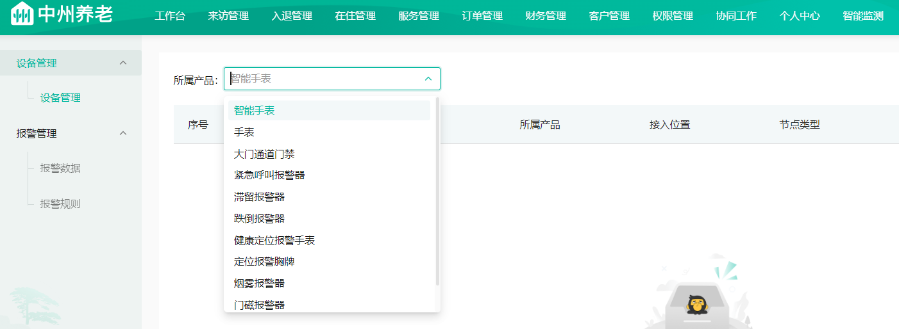


#### 3.5.2 新增设备

实现思路


（1）接口定义

在DeviceController中定义新的方法，如下：

```java
@PostMapping("/RegisterDevice")
@ApiOperation(value = "单个注册设备", notes = "单个注册设备")
public ResponseResult registerDevice(@RequestBody DeviceDto deviceDto) throws Exception {
    return null;
}
```

DeviceDto

```java
package com.zzyl.dto;

import com.aliyun.iot20180120.models.RegisterDeviceRequest;
import com.aliyun.tea.NameInMap;
import com.zzyl.base.BaseDto;
import io.swagger.annotations.ApiModelProperty;
import lombok.Data;

@Data
public class DeviceDto extends BaseDto {

    @ApiModelProperty(value = "注册参数")
    RegisterDeviceRequest registerDeviceRequest;

    @NameInMap("IotId")
    public String iotId;

    @NameInMap("Nickname")
    public String nickname;

    @NameInMap("ProductKey")
    public String productKey;

    @ApiModelProperty(value = "产品名称")
    private String productName;

    @ApiModelProperty(value = "位置名称回显字段")
    private String deviceDescription;

    @ApiModelProperty(value = "位置类型")
    Integer locationType;

    @ApiModelProperty(value = "绑定位置")
    Long bindingLocation;

    @ApiModelProperty(value = "设备名称")
    String deviceName;

    @ApiModelProperty(value = "物理位置类型")
    Integer physicalLocationType;

    @ApiModelProperty(value = "设备ID")
    String deviceId;
}
```

（2）mapper

新增DeviceMapper

```java
package com.zzyl.mapper;


@Mapper
public interface DeviceMapper {

    int insert(Device record);

}
```

映射文件

```xml
<?xml version="1.0" encoding="UTF-8"?>
<!DOCTYPE mapper PUBLIC "-//mybatis.org//DTD Mapper 3.0//EN" "http://mybatis.org/dtd/mybatis-3-mapper.dtd">
<mapper namespace="com.zzyl.mapper.DeviceMapper">
  <resultMap id="BaseResultMap" type="com.zzyl.vo.DeviceVo">
    <id column="id" jdbcType="BIGINT" property="id" />
    <result column="device_id" jdbcType="VARCHAR" property="deviceId" />
    <result column="binding_location" jdbcType="VARCHAR" property="bindingLocation" />
    <result column="location_type" jdbcType="INTEGER" property="locationType" />
    <result column="physical_location_type" jdbcType="INTEGER" property="physicalLocationType" />
    <result column="device_name" jdbcType="VARCHAR" property="deviceName" />
    <result column="device_description" jdbcType="VARCHAR" property="deviceDescription" />
    <result column="create_time" jdbcType="TIMESTAMP" property="createTime" />
    <result column="update_time" jdbcType="TIMESTAMP" property="updateTime" />
    <result column="product_key" jdbcType="VARCHAR" property="productKey" />
    <result column="product_id" jdbcType="VARCHAR" property="productKey" />
    <result column="produce_name" jdbcType="BIT" property="productName" />
    <result column="note_name" jdbcType="BIT" property="nickname" />
    <result column="create_by" jdbcType="BIGINT" property="createBy" />
    <result column="update_by" jdbcType="BIGINT" property="updateBy" />
    <result column="remark" jdbcType="VARCHAR" property="remark" />

  </resultMap>

  <sql id="Base_Column_List">
    id, device_id, binding_location, location_type, physical_location_Type, device_name, 
    device_description, create_time, update_time, is_deleted, create_by, update_by, remark
  </sql>

  <insert id="insert" parameterType="com.zzyl.entity.Device">
    <selectKey keyProperty="id" order="AFTER" resultType="java.lang.Long">
      SELECT LAST_INSERT_ID()
    </selectKey>
    insert into device (device_id, binding_location, location_type, 
      physical_location_Type, device_name, device_description, note_name, product_id, produce_name,
      create_time, update_time, is_deleted, 
      create_by, update_by, remark
      )
    values (#{deviceId,jdbcType=VARCHAR}, #{bindingLocation,jdbcType=VARCHAR}, #{locationType,jdbcType=INTEGER}, 
      #{physicalLocationType,jdbcType=INTEGER}, #{deviceName,jdbcType=VARCHAR}, #{deviceDescription,jdbcType=VARCHAR},
    #{noteName,jdbcType=VARCHAR},#{productId,jdbcType=VARCHAR},#{productName,jdbcType=VARCHAR},
    #{createTime,jdbcType=TIMESTAMP}, #{updateTime,jdbcType=TIMESTAMP}, #{isDeleted,jdbcType=BIT},
      #{createBy,jdbcType=BIGINT}, #{updateBy,jdbcType=BIGINT}, #{remark,jdbcType=VARCHAR}
      )
  </insert>
 

</mapper>
```

（3）业务层

新增DeviceService

```java
package com.zzyl.service;

import com.aliyun.iot20180120.models.DeleteDeviceRequest;
import com.aliyun.iot20180120.models.QueryDeviceDetailRequest;
import com.aliyun.iot20180120.models.QueryDeviceRequest;
import com.zzyl.base.PageResponse;
import com.zzyl.dto.DeviceDto;
import com.zzyl.vo.DeviceVo;

public interface DeviceService {


    /**
     * 注册设备
     * @param deviceDto
     * @throws Exception
     */
    public void registerDevice(DeviceDto deviceDto) throws Exception ;

}
```

实现方法：

```java
package com.zzyl.service.impl;

@Service
public class DeviceServiceImpl implements DeviceService {

    @Resource
    Client client;

    @Resource
    private DeviceMapper deviceMapper;

    @Value("${zzyl.aliyun.iotInstanceId}")
    private String iotInstanceId;

    @Override
    public void registerDevice(DeviceDto deviceDto) throws Exception {
        RegisterDeviceRequest request = deviceDto.getRegisterDeviceRequest();
        request.setIotInstanceId(iotInstanceId);
        RegisterDeviceResponse response = client.registerDevice(request);
        if (Boolean.TRUE.equals(response.getBody().getSuccess())) {
            // 保存位置
            Device device = BeanUtil.toBean(deviceDto, Device.class);
            device.setDeviceId(response.getBody().getData().getIotId());
            device.setProductId(request.getProductKey());
            device.setNoteName(request.getNickname());

            QueryProductRequest productRequest = new QueryProductRequest();
            productRequest.setIotInstanceId(iotInstanceId);
            productRequest.setProductKey(request.getProductKey());
            QueryProductResponse queryProductResponse = client.queryProduct(productRequest);
            String productName = queryProductResponse.getBody().getData().getProductName();
            device.setProductName(productName);
            if (device.getLocationType().equals(0)) {
                device.setPhysicalLocationType(-1);
            }
            try {
                deviceMapper.insert(device);
            }catch (Exception e) {
                DeleteDeviceRequest deleteDeviceRequest = new DeleteDeviceRequest();
                deleteDeviceRequest.setIotInstanceId(iotInstanceId);
                deleteDeviceRequest.setDeviceName(device.getDeviceName());
                deleteDeviceRequest.setIotId(device.getDeviceId());
                deleteDeviceRequest.setProductKey(device.getProductId());
                client.deleteDevice(deleteDeviceRequest);
                throw new BaseException("该老人/位置已绑定该产品，请重新选择");
            }
            return;
        }
        throw new BaseException("设备名称已存在，请重新输入");
    }

}
```

（4）控制层

补全控制层代码：

```java
@Resource
private DeviceService deviceService;

@PostMapping("/RegisterDevice")
@ApiOperation(value = "单个注册设备", notes = "单个注册设备")
public ResponseResult registerDevice(@RequestBody DeviceDto deviceDto) throws Exception {
    deviceService.registerDevice(deviceDto);
    return ResponseResult.success();
}
```

（5）测试

在页面中创建成功以后，可以在阿里云IOT平台进行查看，同时在数据库中也保存了一份


#### 3.5.3 查询所有设备

实现思路

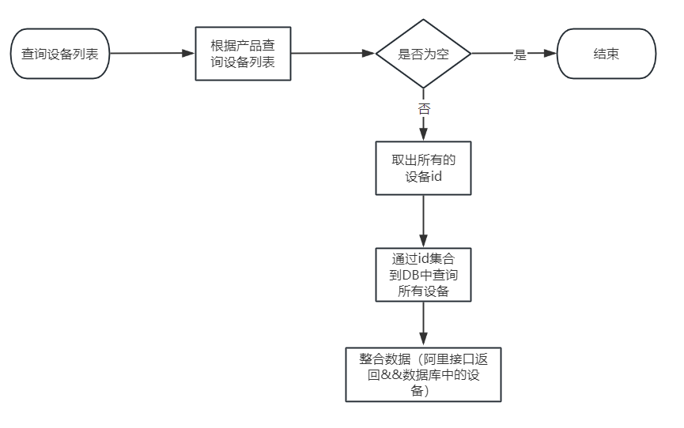

（1）接口定义

在DeviceController中定义新的方法：

```java
@PostMapping("/QueryDevice")
@ApiOperation(value = "查看所有设备", notes = "查看所有产品列表")
public ResponseResult<PageResponse<DeviceVo>> queryDevice(@RequestBody QueryDeviceRequest request) throws Exception {
   
    return null;
}
```

（2）mapper

在DeviceMapper中新增方法

```
List<DeviceVo> selectByDeviceIds(List<String> list);
```

映射文件

```xml
<select id="selectByDeviceIds" resultMap="BaseResultMap">
  select
  d.*
  , tu.real_name as creator
  from device d
  left join sys_user tu on tu.id = d.create_by
  where device_id  in
  <foreach collection="list" item="id" open="(" separator="," close=")">
    #{id}
  </foreach>
</select>
```

（3）业务层

在DeviceService中新增方法，如下：

```java
/**
 * 查询设备
 * @param request
 * @return
 * @throws Exception
 */
public PageResponse<DeviceVo> queryDevice(QueryDeviceRequest request) throws Exception ;
```

实现方法：

```java
@Override
public PageResponse<DeviceVo> queryDevice(QueryDeviceRequest request) throws Exception {
    request.setIotInstanceId(iotInstanceId);
    QueryDeviceResponse queryDeviceResponse = client.queryDevice(request);
    QueryDeviceResponseBody body = queryDeviceResponse.getBody();
    if (Boolean.TRUE.equals(body.getSuccess()) && body.getData() != null) {
        List<QueryDeviceResponseBody.QueryDeviceResponseBodyDataDeviceInfo> deviceInfo = body.getData().getDeviceInfo();
        if (CollUtil.isEmpty(deviceInfo)) {
            return null;
        }
        List<String> list = deviceInfo.stream().map(QueryDeviceResponseBody.QueryDeviceResponseBodyDataDeviceInfo::getIotId).collect(Collectors.toList());

        List<DeviceVo> devices = deviceMapper.selectByDeviceIds(list);
        Map<String, DeviceVo> deviceMap = devices.stream().collect(Collectors.toMap(DeviceVo::getDeviceId, v -> v));
        List<DeviceVo> deviceVoList = new ArrayList<>();
            deviceInfo.forEach(d->{
                if (ObjectUtil.isNotEmpty(deviceVoMap) && ObjectUtil.isNotEmpty(deviceVoMap.get(d.getIotId()))) {
                    DeviceVo deviceVo = deviceVoMap.get(d.getIotId());
                    BeanUtil.copyProperties(d,deviceVo);
                    deviceVoList.add(deviceVo);
                }
            });
        return PageResponse.of(deviceVoList, body.getPage(), body.getPageSize(), (long)body.getPageCount(), (long)body.getTotal());
    }
    return null;
}
```

（4）控制层

补全控制层代码：

```java
@PostMapping("/QueryDevice")
@ApiOperation(value = "查看所有设备", notes = "查看所有产品列表")
public ResponseResult<PageResponse<DeviceVo>> queryDevice(@RequestBody QueryDeviceRequest request) throws Exception {
    PageResponse pageResponse = deviceService.queryDevice(request);
    return ResponseResult.success(pageResponse);
}
```

（5）测试

在页面中查看效果


#### 3.5.4 查询设备的详细信息

（1）接口定义

在DeviceController中新增方法，如下：

```java
@PostMapping("/QueryDeviceDetail")
@ApiOperation(value = "查询指定设备的详细信息", notes = "查询指定设备的详细信息")
public ResponseResult queryDeviceDetail(@RequestBody QueryDeviceDetailRequest request) throws Exception {
    
    return null;
}
```

（2）业务层

在DeviceService新增方法，如下：

```java
/**
* 查询设备详情
* @param request
* @return
* @throws Exception
*/
public DeviceVo queryDeviceDetail(QueryDeviceDetailRequest request) throws Exception;
```

实现方法：

```java
/**
* 查询设备详情
* @param request
* @return
* @throws Exception
*/
@Override
public DeviceVo queryDeviceDetail(QueryDeviceDetailRequest request) throws Exception {
    request.setIotInstanceId(iotInstanceId);
    QueryDeviceDetailResponse queryDeviceDetailResponse = client.queryDeviceDetail(request);
    if (Boolean.TRUE.equals(queryDeviceDetailResponse.getBody().getSuccess())) {

        QueryDeviceDetailResponseBody.QueryDeviceDetailResponseBodyData data = queryDeviceDetailResponse.getBody().getData();
        DeviceVo deviceVo = BeanUtil.toBean(data, DeviceVo.class);
        List<DeviceVo> devices = deviceMapper.selectByDeviceIds(Lists.newArrayList(data.getIotId()));
        if (CollUtil.isNotEmpty(devices)) {
            BeanUtil.copyProperties(devices.get(0), deviceVo, CopyOptions.create().ignoreNullValue());
            deviceVo.setIotId(deviceVo.getDeviceId());
        }
        return deviceVo;
    }
    throw new BaseException(queryDeviceDetailResponse.getBody().getErrorMessage());
}
```

（3）控制层

补全控制层代码

```java
@PostMapping("/QueryDeviceDetail")
@ApiOperation(value = "查询指定设备的详细信息", notes = "查询指定设备的详细信息")
public ResponseResult queryDeviceDetail(@RequestBody QueryDeviceDetailRequest request) throws Exception {
    DeviceVo deviceVo = deviceService.queryDeviceDetail(request);
    return ResponseResult.success(deviceVo);
}
```

（4）测试

在页面中查看设备的详情数据

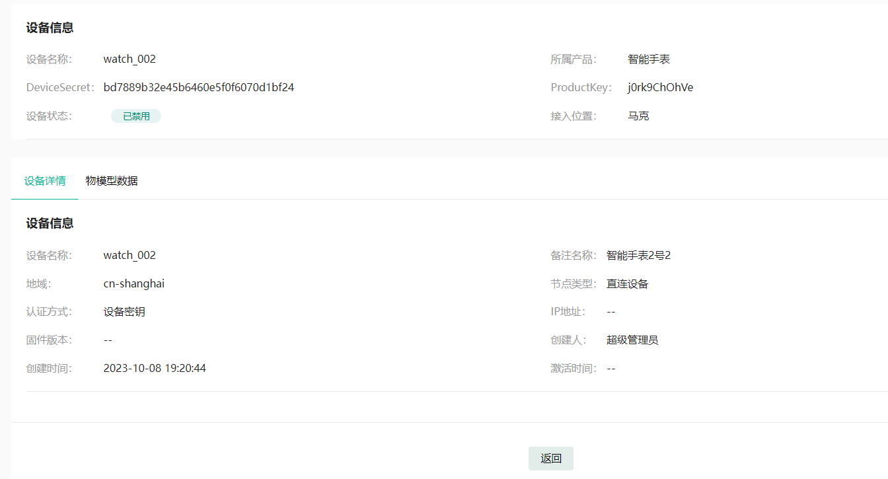


#### 3.5.5 查询设备的状态

在DeviceController中新增方法，如下：

```java
@PostMapping("/QueryDevicePropertyStatus")
@ApiOperation(value = "查询指定设备的状态", notes = "查询指定设备的状态")
public ResponseResult QueryDevicePropertyStatus(@RequestBody QueryDevicePropertyStatusRequest request) throws Exception {
    request.setIotInstanceId(iotInstanceId);
    QueryDevicePropertyStatusResponse deviceStatus = client.queryDevicePropertyStatus(request);
    return ResponseResult.success(deviceStatus.getBody().getData());
}
```

在页面中查看效果

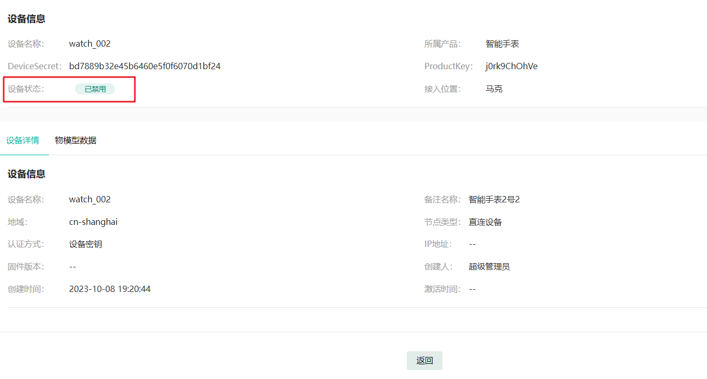


#### 3.5.6 查询物模型功能列表

在DeviceController中新增方法，如下：

```java
@PostMapping("/QueryThingModelPublished")
@ApiOperation(value = "查看指定产品的已发布物模型中的功能定义详情", notes = "查看指定产品的已发布物模型中的功能定义详情")
public ResponseResult queryThingModelPublished(@RequestBody QueryThingModelPublishedRequest request) throws Exception {
    request.setIotInstanceId(iotInstanceId);
    QueryThingModelPublishedResponse response = client.queryThingModelPublished(request);
    return ResponseResult.success(response.getBody().getData());
}
```

在页面中查看效果

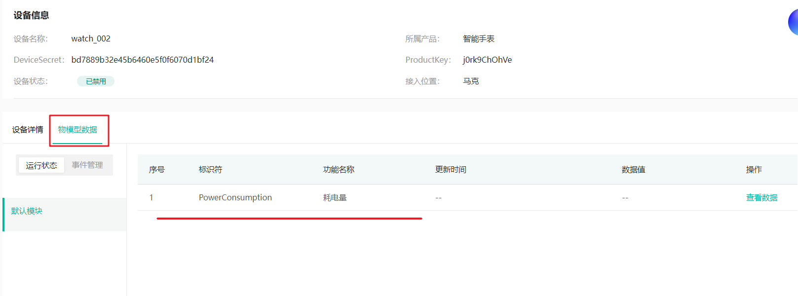


#### 3.5.7 修改设备

自己实现


#### 3.5.8 删除设备

自己实现


## 4 今日作业

完成设备管理中的其他接口开发
