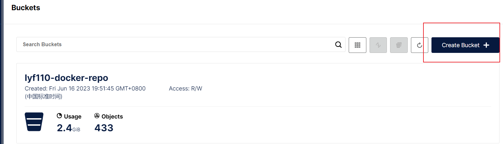

# 八、docker 安装私人镜像仓库


## 1 安装docker-compose

### 1.1 下载

Linux下需要通过命令下载：

```sh
# 安装
curl -L https://github.com/docker/compose/releases/download/1.23.1/docker-compose-`uname -s`-`uname -m` > /usr/local/bin/docker-compose
```

如果下载速度较慢，或者下载失败，可以使用课前资料提供的docker-compose文件：


上传到`/usr/local/bin/`目录也可以。


### 1.2 修改文件权限

修改文件权限：

```sh
# 修改权限
chmod +x /usr/local/bin/docker-compose
```


### 1.3 Base自动补全命令：

```sh
# 补全命令
curl -L https://raw.githubusercontent.com/docker/compose/1.29.1/contrib/completion/bash/docker-compose > /etc/bash_completion.d/docker-compose
```

如果这里出现错误，需要修改自己的hosts文件：

```sh
echo "199.232.68.133 raw.githubusercontent.com" >> /etc/hosts
```


## 2 搭建Docker镜像仓库V1版本（了解即可）

搭建镜像仓库可以基于Docker官方提供的DockerRegistry来实现。

官网地址：https://hub.docker.com/_/registry


### 2.1 简化版镜像仓库

Docker官方的Docker Registry是一个基础版本的Docker镜像仓库，具备仓库管理的完整功能，但是没有图形化界面。

搭建方式比较简单，命令如下：

```sh
docker run -d \
    --restart=always \
    --name registry	\
    -p 5000:5000 \
    -v registry-data:/var/lib/registry \
    registry
```


命令中挂载了一个数据卷registry-data到容器内的/var/lib/registry 目录，这是私有镜像库存放数据的目录。

访问http://YourIp:5000/v2/_catalog 可以查看当前私有镜像服务中包含的镜像


### 2.2 带有图形化界面版本（V1版本，官方说已废弃）

使用DockerCompose部署带有图象界面的DockerRegistry，命令如下：

```yaml
version: '3.0'
services:
  registry:
    image: registry
    volumes:
      - ./registry-data:/var/lib/registry
  ui:
    image: joxit/docker-registry-ui:static
    ports:
      - 8080:80
    environment:
      - REGISTRY_TITLE=传智教育私有仓库
      - REGISTRY_URL=http://registry:5000
    depends_on:
      - registry
```


### 2.3 配置Docker信任地址

我们的私服采用的是http协议，默认不被Docker信任，所以需要做一个配置：

```sh
# 打开要修改的文件
vi /etc/docker/daemon.json
# 添加内容：
"insecure-registries":["http://{centos所在的ip（非dockerip））}:8080"]
# 重加载
systemctl daemon-reload
# 重启docker
systemctl restart docker
```


## 3 搭建Docker镜像仓库V2版本（使用本地存储）

项目地址: [docker-registry-ui](https://github.com/Joxit/docker-registry-ui)

### 3.1 docker-compose.yml

```yaml
version: '3.8'

services:
  registry-ui:
    image: joxit/docker-registry-ui:main
    restart: always
    ports:
      - 80:80
    environment:
      - SINGLE_REGISTRY=true
      - REGISTRY_TITLE=Docker Registry UI
      - DELETE_IMAGES=true
      - SHOW_CONTENT_DIGEST=true
      - NGINX_PROXY_PASS_URL=http://registry-server:5000
      - SHOW_CATALOG_NB_TAGS=true
      - CATALOG_MIN_BRANCHES=1
      - CATALOG_MAX_BRANCHES=1
      - TAGLIST_PAGE_SIZE=100
      - REGISTRY_SECURED=false
      - CATALOG_ELEMENTS_LIMIT=1000
    container_name: registry-ui

  registry-server:
    image: registry:2.8.2
    restart: always
    environment:
      REGISTRY_HTTP_HEADERS_Access-Control-Origin: '["*"]'
      REGISTRY_STORAGE_DELETE_ENABLED: 'true'
    volumes:
      - ./registry/data:/var/lib/registry
    container_name: registry-server
```

### 3.2 使用如下命令启动即可

```shell
docker compose up -d
```

## 4 搭建Docker镜像仓库V2版本（使用S3标准对象存储进行存储）

### 4.1 创建配置文件config.yml

```shell
mkdir ./registry-config
cd ./registry-config
vim config.yml
# 将config.yml中的内容写入即可
```

#### 4.1.1 config.yml

```yaml
version: 0.1

log:
  level: debug
  fields:
    service: registry-server
storage:
  delete:
    enabled: true
  cache:
    blobdescriptor: inmemory
  s3:
    accesskey: admin
    secretkey: admin123456
    region: us-east-1
    regionendpoint: http://minio-server:9000
    bucket: lyf110-docker-repo
    encrypt: false
    secure: false
    v4auth: true
    chunksize: 5242880
    rootdirectory: /
  redirect:
    disable: true
http:
  addr: 0.0.0.0:5000
  headers:
    Access-Control-Allow-Origin: ['*']
health:
  storagedriver:
    enabled: true
    interval: 10s
    threshold: 3

```

### 4.2 docker-compose.yaml

```yaml
version: '3.8'

services:
  minio-server:
    image: registry.cn-hangzhou.aliyuncs.com/lyf110-docker-repo/minio:RELEASE.2023-06-09T07-32-12Z
    restart: always
    ports:
      - 9000:9000
      - 9090:9090
    volumes:
      - ./data/minio/data:/data
      - ./data/minio/minio:/minio
      - ./data/minio/config:/root/.minio
    environment:
      - TZ=Asia/Shanghai
      - LANG=en_US.UTF-8
      - MINIO_ROOT_USER=admin
      - MINIO_ROOT_PASSWORD=admin123456
      - MINIO_REGION=us-east-1
    container_name: minio-server
    command: server /data  --console-address ":9090"

  registry-server:
    image: registry:2.8.2
    restart: always
    volumes:
      - ./registry-data:/var/lib/registry
      - ./registry-config/config.yml:/etc/docker/registry/config.yml
    container_name: registry-server
    depends_on:
      - minio-server

  registry-ui:
    image: joxit/docker-registry-ui
    restart: always
    ports:
      - 8080:80
    environment:
      - SINGLE_REGISTRY=true
      - REGISTRY_TITLE=lyf110的私人仓库
      - DELETE_IMAGES=true

```

### 4.3 使用如下命令启动

```shell
docker compose up -d
```

### 4.4 重要：我们需要手动去S3存储服务器创建bucket

