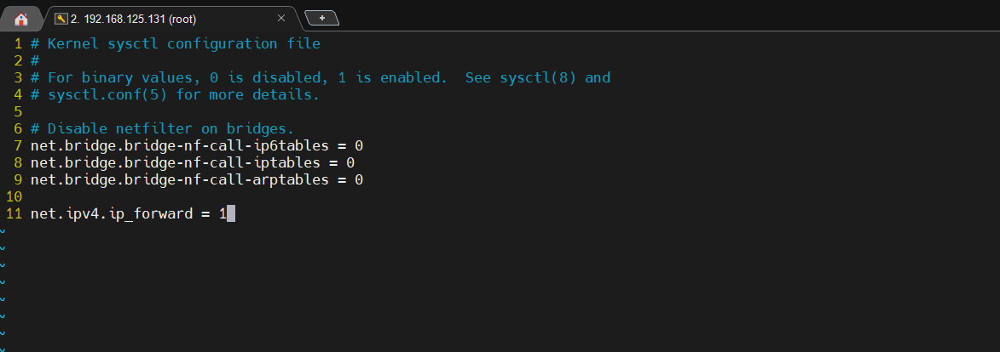

# 七、docker 常见问题记录

## 1 VMware虚拟机挂起后，再次运行以后，之前在windows本地能连上的mysql，现在连不上了

在Centos7 虚拟机内部是可以正常连接的

### 1.1 解决办法1，重启docker（治标不治本）

```shell
systemctl restart docker
```

### 1.2 解决办法2，修改配置（治本）

```shell
# 打开配置文件
vim /usr/lib/sysctl.d/00-system.conf

# 在最后面添加
net.ipv4.ip_forward = 1

# 然后保存退出，接着重启网络服务
systemctl restart network

#重启以后，输入以下命令，查看IPv4转发状态
sysctl net.ipv4.ip_forward

# 显示
net.ipv4.ip_forward=1

# 再次在windows上连接mysql和redis，就已经没问题了。
```




