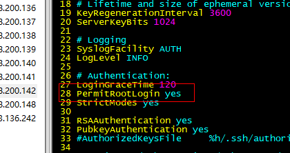

# Ubuntu安装

安装步骤：

- 准备iso镜像文件：略

- 打开VMware workstation软件，选择【新建虚拟机】，然后【下一步】...  

- 最后点击【完成】

- 配置：
  - 设置root（super user）密码命令：sudo passwd root

  - 安装vim编辑器：sudo apt-get install vim

  - 安装ssh服务：sudo apt-get install openssh-server

  - 编辑sshd文件，通过终端工具连接（scrt）：sudo vim /etc/ssh/sshd_config
    - 将PermitRootLogin prohibit-pasdword 改为：PermitRootLogin yes

      

  - 重启ssh服务：sudo /etc/init.d/ssh restart

  - 关闭防火墙：sudo ufw disable

- 查看Ubuntu系统版本：uname -a

- 解决Ubuntu16.04版本下网速慢的问题：

  - sudo gedit /etc/modprobe.d/iwlwifi.conf
  - vim /etc/modprobe.d/iwlwifi.conf
    - 在配置文件的空白处添加：options iwlwifi 11n_disable=1 

  
