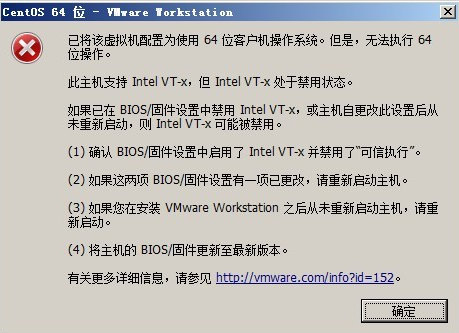
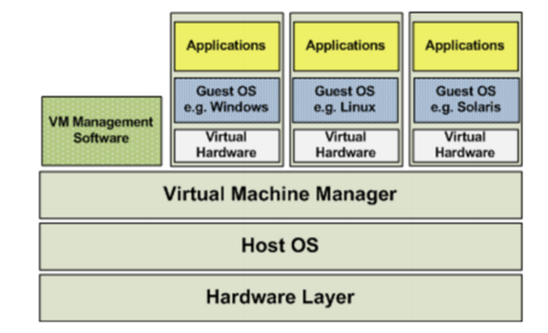
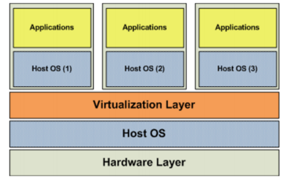
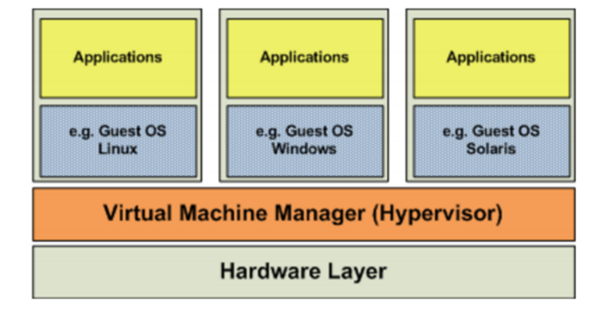
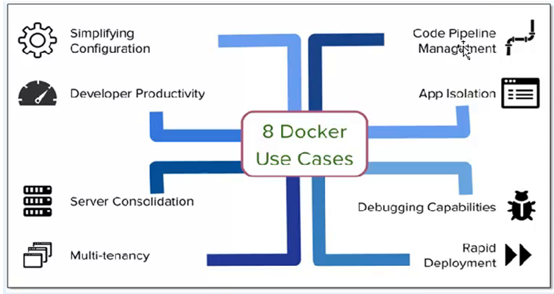
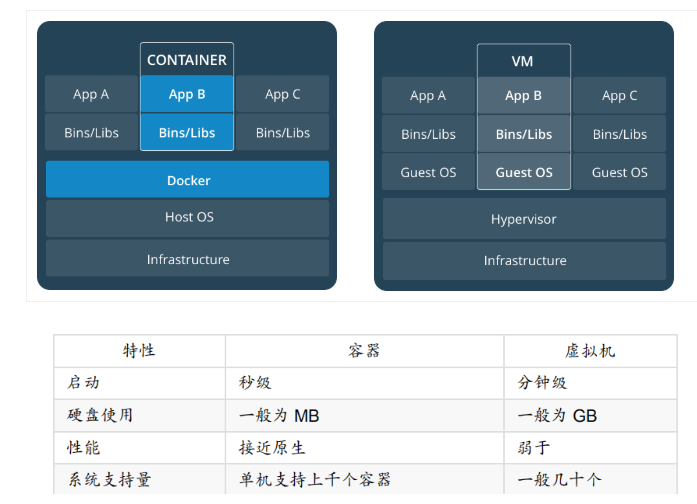
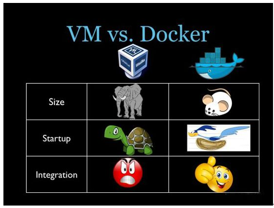
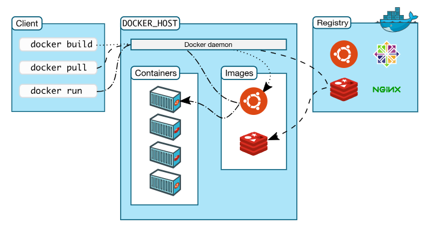

# docker（一）

课程目标：

1、什么是虚拟化

2、docker介绍

3、docker版本以及安装

4、docker架构

5、docker镜像操作

6、docker容器操作

# 1 什么是虚拟化

## 1.1 概念

在计算机中，虚拟化（英语：Virtualization）是一种资源管理技术，是将计算机的各种实体资源，如服务器、网络、内存及存储等，予以抽象、转换后呈现出来，**打破实体结构间的不可切割的障碍，使用户可以比原本的组态更好的方式来应用这些资源**。这些资源的新虚拟部份是不受现有资源的架设方式，地域或物理组态所限制。一般所指的虚拟化资源包括计算能力和资料存储。

在实际的生产环境中，**虚拟化技术主要用来解决高性能的物理硬件产能过剩和老的旧的硬件产能过低的重组重用**，透明化底层物理硬件，从而最大化的利用物理硬件

虚拟化技术种类很多，例如：软件虚拟化、硬件虚拟化、内存虚拟化、网络虚拟化、桌面虚拟化、服务虚拟化、**虚拟机**等等。

## 1.2 虚拟化架构

### 1.2.1 全虚拟化

在全虚拟化的虚拟平台中，GuestOS并不知道自己是一台虚拟机，它会认为自己就是运行在计算机物理硬件设备上的HostOS。因为全虚拟化的VMM会将一个OS所能够操作的CPU、内存、外设等物理设备逻辑抽象成为虚拟CPU、虚拟内存、虚拟外设等虚拟设备后，再交由GuestOS来操作使用。这样的GuestOS会将底层硬件平台视为自己所有的，但是实际上，这些都是VMM为GuestOS制造了这种假象。

### 1.2.2 操作系统虚拟化

操作系统层虚拟化是指通过划分一个宿主操作系统的特定部分，产生一个个隔离的操作执行环境。操作系统层的虚拟化是操作系统内核直接提供的虚报化，虚拟出的操作系统之间共享底层宿主操作系统内核和底层的硬件资源。操作系统虚拟化的关键点在于将操作系统与上层应用隔离开，将对操作系统资源的访问进行虚报化，使上层应用觉得自己独占操作系统。

### 1.2.3 平台虚拟化

平台虚拟化表现为在一个给定的硬件平台上宿主机创造一个模拟的计算机环境虚拟机提供给客户机。客户机软件对于用户应用程序没有限制;许多宿主机允许运行真实的操作系统。客户机就好像直接运行在计算机硬件上，伴随着几个明显的警告。虚拟机对硬件资源(如网络，显示器，键盘，硬盘)的访问被统一管理在一个比处理器和系统内存更有限制性的层次上。客户软件经常被限制访问计算机周边设备，或者被限制在较低的设备性能上，这取决于宿主机硬件访问策略设定。

## 1.3 hypervisor

Hypervisor是一种运行在物理服务器和操作系统之间的中间软件层,可允许多个操作系统和应用共享一套基础物理硬件，因此也可以看作是虚拟环境中的“元”操作系统，它可以协调访问服务器上的所有物理设备和虚拟机，也叫**虚拟机监视器（**Virtual Machine Monitor，VMM）**。Hypervisor是所有虚拟化技术的核心。**当服务器启动并执行Hypervisor时，它会给每一台虚拟机分配适量的内存、CPU、网络和磁盘，并加载所有虚拟机的客户操作系统。

Hypervisor是所有虚拟化技术的核心，软硬件架构和管理更高效、更灵活，硬件的效能能够更好地发挥出来。常见的产品有：VMware、KVM、Xen等等。

# 2 docker介绍

## 2.1 容器技术

在计算机的世界中，容器拥有一段漫长且传奇的历史。容器与管理程序虚拟化（hypervisor virtualization，HV）有所不同，**管理程序虚拟化通过中间层将一台或者多台独立的机器虚拟运行与物理硬件之上，而容器则是直接运行在操作系统内核之上的用户空间**。因此，容器虚拟化也被称为“操作系统级虚拟化”，容器技术可以让多个独立的用户空间运行在同一台宿主机上。

由于“客居”于操作系统，容器只能运行与底层宿主机相同或者相似的操作系统，这看起来并不是非常灵活。例如：可以在Ubuntu服务中运行Redhat Enterprise Linux，但无法再Ubuntu服务器上运行Microsoft Windows。

相对于彻底隔离的管理程序虚拟化，容器被认为是不安全的。而反对这一观点的人则认为，由于虚拟容器所虚拟的是一个完整的操作系统，这无疑增大了攻击范围，而且还要考虑管理程序层潜在的暴露风险。

尽管有诸多局限性，容器还是被广泛部署于各种各样的应用场合。在超大规模的多租户服务部署、轻量级沙盒以及对安全要求不太高的隔离环境中，容器技术非常流行。最常见的一个例子就是“权限隔离监牢”（chroot jail），它创建一个隔离的目录环境来运行进程。如果权限隔离监牢正在运行的进程被入侵者攻破，入侵者便会发现自己“身陷囹圄”，因为权限不足被困在容器所创建的目录中，无法对宿主机进一步破坏。

最新的容器技术引入了OpenVZ、Solaris Zones以及Linux容器（LXC）。使用这些新技术，容器不在仅仅是一个单纯的运行环境。在自己的权限类内，**容器更像是一个完整的宿主机**。**容器和宿主机之间的隔离更加彻底，容器有独立的网络和存储栈，还拥有自己的资源管理能力，使得同一台宿主机中的多个容器可以友好的共存**。

容器被认为是精益技术，因为容器需要的开销有限。和传统虚拟化以及半虚拟化相比，容器不需要模拟层（emulation layer）和管理层（hypervisor layer），而是使用操作系统的系统调用接口。这**降低了运行单个容器所需的开销**，也**使得宿主机中可以运行更多的容器**。

尽管有着光辉的历史，容器仍未得到广泛的认可。一个很重要的原因就是容器技术的复杂性：容器本身就比较复杂，不易安装，管理和自动化也很困难。而Docker就是为了改变这一切而生的。

`<https://www.cnblogs.com/kevingrace> `

## 2.2 docker介绍

Docker is an open platform for developing, shipping, and running applications. Docker enables you to separate your applications from your infrastructure so you can deliver software quickly. With Docker, you can manage your infrastructure in the same ways you manage your applications. By taking advantage of Docker’s methodologies for shipping, testing, and deploying code quickly, you can significantly reduce the delay between writing code and running it in production.

Docker是一个开发，运输和运行应用程序的开放平台。 Docker使您可以将应用程序与基础架构分离，以便快速交付软件。 使用Docker，您可以像管理应用程序一样管理**基础架构**（OS）。 通过利用Docker的方法快速发送，测试和部署代码，您可以显着减少编写代码和在生产中运行代码之间的延迟。（代码改了）

## 2.3 docker好处

容器提供了隔离性，结论是，容器可以为各种测试提供很好的**沙盒环境**。并且，容器本身就具有“标准性”的特征，非常适合为服务创建构建块。Docker的一些应用场景如下：

- 加速本地开发和构建流程，使其更加高效、更加轻量化。本地开发人员可以构建、运行并分享Docker容器。容器可以在开发环境中构建，然后轻松的提交到测试环境中，并最终进入生产环境。 开发人员与运维人员进行职责的逻辑分离

- 能够让独立的服务或应用程序在不同的环境中，得到相同的运行结果。这一点在面向服务的架构和重度依赖微型服务的部署由其实用。

- 用Docker创建隔离的环境来进行测试。例如，用Jenkins CI这样的持续集成工具启动一个用于测试的容器。（持续化集成    war  实际部署：jenkins持续化集成   Jenkins + git ）

- Docker可以让开发者先在本机上构建一个复杂的程序或架构来进行测试，而不是一开始就在生产环境部署、测试。

- 构建一个多用户的平台即服务（**PaaS**）基础设施

- 为开发、测试提供一个轻量级的独立的沙盒环境

- 提供软件即服务（SaaS）应用程序，例如Memcached即服务

- 高性能、超大规模的宿主机部署（可以很多容器）

~~~properties
沙盒：在计算机安全领域，沙盒（英语：sandbox，又译为沙箱）是一种安全机制，为运行中的程序提供的隔离环境。通常是作为一些来源不可信、具破坏力或无法判定程序意图的程序提供实验之用。
~~~

## 2.4 集装箱思想

Docker借鉴了标准**集装箱的概念**。标准集装箱将货物运往世界各地，Dock将这个模型运用到自己的设计中，唯一不同的是：集装箱运输货物，而Docker运输软件、应用程序。

和集装箱一样，Docker在执行上述操作时，**并不关心容器中到底装了什么**，它不管是web服务器，还是数据库，或者是应用程序服务器什么的。所有的容器都按照相同的方式将内容“装载”进去。

Docker也不关心你要把容器运到何方：我们可以在自己的笔记本中构建容器，上传到Registry，然后下载到一个物理的或者虚拟的服务器来测试，在把容器部署到具体的主机中。像标准集装箱一样，Docker容器方便替换，可以叠加，易于分发，并且尽量通用。

## 2.5 container与vm区别

物理机：

虚拟机：

容器：最大化的利用资源。

通过上面这三张抽象图，我们大概可以通过类比概括出： 容器虚拟化的是操作系统而不是硬件，容器之间是共享同一套操作系统资源的。虚拟机技术是虚拟出一套硬件后，在其上运行一个完整操作系统。

容器和虚拟机具有相似的资源隔离和分配优势，但功能有所不同，因为容器虚拟化的是操作系统，而不是硬件，因此容器更容易移植，效率也更高。 

容器在Linux上本机运行，并与其他容器共享主机的内核。 它运行一个独立的进程，不占用任何其他可执行文件的内存，使其轻量级。相比之下，虚拟机（VM）运行一个完整的“客户”操作系统，通过虚拟机管理程序对主机资源进行虚拟访问。 通常，VM提供的环境比大多数应用程序需要的资源更多。

## 2.6 虚拟机已死 容器才是未来

- 容器是一个应用层抽象，用于将代码和依赖资源打包在一起。 多个容器可以在同一台机器上运行，共享操作系统内核，但各自作为独立的进程在用户空间中运行 。与虚拟机相比， 容器占用的空间较少（容器镜像大小通常只有几十兆），瞬间就能完成启动 。
- 虚拟机（VM）是一个物理硬件层抽象，用于将一台服务器变成多台服务器。 管理程序允许多个VM在一台机器上运行。每个VM都包含一整套操作系统、一个或多个应用、必要的二进制文件和库资源，因此占用大量空间。而且VM启动也十分缓慢 。

# 3 docker版本以及安装

docker安装到Ubuntu OS上。   docker是基于Ubuntu发布的。    CentOS：版本要求 CentOS7.x版本。

## 3.1 docker版本介绍

Docker CE 在 17.03 版本之前叫 Docker Engine, Docker Engine 的版本号范围: **0.1.0 ~ 1.13.1** 

在 2017 年 3 月 2 日, docker 团队宣布企业版 Docker Enterprise Edition ( EE ) 发布. 为了一致, 免费的 Docker Engine 改名为 Docker Community Edition ( CE ), 并且采用基于时间的版本号方案. 就在这一天, Docker EE 和 Docker CE 的 17.03 版本发布, 这也是第一个采用新的版本号方案的版本.

Docker CE/EE 每个季度发布一次 **季度版本**, 也就是说每年会发布 4 个季度版本, 17.03, 17.06, 17.09, 17.12 就是 2017 年的 4 个季度版本的版本号, 同时 Docker CE 每个月还会发布一个 EDGE 版本，比如 17.04, 17.05, 17.07, 17.08, 17.10, 17.11 ......

Docker CE 季度版本自发布后会有 4 个月的维护期. 

在基于时间的发布方案中，版本号格式为: `YY.MM.<patch>`，YY.MM 代表年月，patch 代表补丁号，从 0 开始，在季度版本 (如 17.03) 的维护期内，bug 修复相关的更新会以 patch 递增的方式发布, 比如 17.03.0 -> 17.03.1 -> 17.03.2

Docker is available in two editions:

- Community Edition (CE)：社区版
- Enterprise Edition (EE)：企业版

Docker Community Edition (CE) is ideal for individual developers and small teams looking to get started with Docker and experimenting with container-based apps.

Docker Enterprise Edition (EE) is designed for enterprise development and IT teams who build, ship, and run business critical applications in production at scale.

## 3.2 docker安装

### 3.2.1 版本要求

docker对Ubuntu的支持是最好的，因此本次学习的过程中我们在Ubuntu下安装docker ce版本。如果是 CentOS：安装docker  建议7.x及以上版本。

Docker支持在多种平台上使用，包括Mac、Windows、Cloud以及Linux系统上等。由于Docker是基于Ubuntu发布的，所以官方更推荐在Ubuntu上使用Docker，开发者也可以根据自己的实际开发环境选择合适的开发。在不同的平台上安装Docker必须满足不同的先决条件。本次选择在Ubuntu16.04版本上使用Docker。

To install Docker CE, you need the 64-bit version of one of these Ubuntu versions:

- Cosmic 18.10
- Bionic 18.04 (LTS)
- Xenial 16.04 (LTS)

Docker CE is supported on `x86_64` (or `amd64`), `armhf`, `arm64`, `s390x` (IBM Z), and `ppc64le` (IBM Power) architectures.

### 3.2.2 安装步骤

~~~shell
一、安装docker存储库（在新主机上首次安装Docker CE之前，需要设置Docker存储库。之后，您可以从存储库安装和更新Docker）
1、sudo apt-get update
2、sudo apt-get install \
    apt-transport-https \
    ca-certificates \
    curl \
    gnupg-agent \
    software-properties-common
3、curl -fsSL https://download.docker.com/linux/ubuntu/gpg | sudo apt-key add -
4、sudo add-apt-repository \
   "deb [arch=amd64] https://download.docker.com/linux/ubuntu \
   $(lsb_release -cs) \
   stable"

二、安装docker ce
1、sudo apt-get update
2、sudo apt-get install docker-ce docker-ce-cli containerd.io

三、测试
systemctl status docker

sudo docker run hello-world
~~~

### 3.3.3 docker engine

查看帮助文档：

~~~shell
查看docker详细信息
docker info

查看docker版本
docker --version/version(c/s  server：docker engine架构)

启动/停止/重启docker：
sudo systemctl start/stop/restart docker

Ubuntu：开机自动启动
CentOS：手动启动
开机启动：systemctl enable docker

查看docker运行状态
sudo sytemctl status docker
~~~

# 4 docker架构

Docker uses a client-server architecture. The Docker *client* talks to the Docker *daemon*, which does the heavy lifting of building, running, and distributing your Docker containers. The Docker client and daemon *can* run on the same system, or you can connect a Docker client to a remote Docker daemon. The Docker client and daemon communicate using a REST API, over UNIX sockets or a network interface. （Docker使用客户端 - 服务器架构。 Docker客户端与Docker守护进程通信，后者负责构建，运行和分发Docker容器。 Docker客户端和守护程序可以在同一系统上运行，也可以将Docker客户端连接到远程Docker守护程序。 Docker客户端和守护程序使用REST API，通过UNIX套接字或网络接口进行通信。）

## 4.1 docker daemon

The Docker daemon (`dockerd`) listens for Docker API requests and manages Docker objects such as images, containers, networks, and volumes. A daemon can also communicate with other daemons to manage Docker services. (Docker守护程序（dockerd）侦听Docker API请求并管理Docker对象，如图像，容器，网络和卷。 守护程序还可以与其他守护程序通信以管理Docker服务。)

## 4.2 docker client

The Docker client (`docker`) is the primary way that many Docker users interact with Docker. When you use commands such as `docker run`, the client sends these commands to `dockerd`, which carries them out. The `docker` command uses the Docker API. The Docker client can communicate with more than one daemon. (Docker客户端（docker）是许多Docker用户与Docker交互的主要方式。 当您使用诸如docker run之类的命令时，客户端会将这些命令发送到dockerd，后者将其执行。 docker命令使用Docker API。 Docker客户端可以与多个守护进程通信。)

## 4.3 docker registry

A Docker *registry* stores Docker images. Docker Hub is a public registry that anyone can use, and Docker is configured to look for images on Docker Hub by default. You can even run your own private registry. If you use Docker Datacenter (DDC), it includes Docker Trusted Registry (DTR).

When you use the `docker pull` or `docker run` commands, the required images are pulled from your configured registry. When you use the `docker push` command, your image is pushed to your configured registry.(Docker注册表存储Docker镜像。 Docker Hub是任何人都可以使用的公共注册中心，Docker配置为默认在Docker Hub上查找图像。 您甚至可以运行自己的私人注册表。 如果您使用Docker Datacenter（DDC），它包括Docker Trusted Registry（DTR）。使用docker pull或docker run命令时，将从配置的注册表中提取所需的映像。 使用docker push命令时，图像将被推送到配置的注册表。)

# 5 docker镜像操作

Docker 镜像是[容器](https://docs.docker-cn.com/glossary/?term=container)的基础。镜像是一个有序集合，其中包含根文件系统更改和在容器运行时中使用的相应执行参数。镜像通常 包含堆叠在彼此之上的联合分层文件系统。镜像没有状态并且始终不会发生更改。 当运行容器时，使用的镜像如果在本地中不存在，docker 就会自动从 docker 镜像仓库中下载，默认是从 Docker Hub 公共镜像源下载。 

## 5.1 列出镜像

~~~shell
docker images

REPOSITORY          TAG                 IMAGE ID            CREATED             SIZE
hello-world         latest              fce289e99eb9        5 months ago        1.84kB

这些镜像都是存储在Docker宿主机的/var/lib/docker目录下。
~~~

- **REPOSITORY：**表示镜像的仓库源
- **TAG：**镜像的标签（版本），同一仓库源可以有多个 TAG，代表这个仓库源的不同个版本，如ubuntu仓库源里，有15.10、14.04等多个不同的版本。 
- **IMAGE ID：**镜像ID
- **CREATED：**镜像创建时间
- **SIZE：**镜像大小

## 5.2 查找镜像

~~~shell
docker search 镜像名称
NAME                               DESCRIPTION                                     STARS               OFFICIAL            AUTOMATED
centos                             The official build of CentOS.                   5391                [OK]                
ansible/centos7-ansible            Ansible on Centos7                              121                                     [OK]
jdeathe/centos-ssh                 CentOS-6 6.10 x86_64 / CentOS-7 7.5.1804 x86…   110                                     [OK]
consol/centos-xfce-vnc             Centos container with "headless" VNC session…   91                                      [OK]
imagine10255/centos6-lnmp-php56    centos6-lnmp-php56                              56                                      [OK]
centos/mysql-57-centos7            MySQL 5.7 SQL database server                   53                                      
tutum/centos                       Simple CentOS docker image with SSH access      44                                      
centos/postgresql-96-centos7       PostgreSQL is an advanced Object-Relational …   37                                      
kinogmt/centos-ssh                 CentOS with SSH                                 26                                      [OK]
pivotaldata/centos-gpdb-dev        CentOS image for GPDB development. Tag names…   10                                      
drecom/centos-ruby                 centos ruby                                     6                                       [OK]
mamohr/centos-java                 Oracle Java 8 Docker image based on Centos 7    3                                       [OK]
darksheer/centos                   Base Centos Image -- Updated hourly             3                                       [OK]
pivotaldata/centos                 Base centos, freshened up a little with a Do…   3                                       
miko2u/centos6                     CentOS6 日本語環境                                   2                                       [OK]
pivotaldata/centos-mingw           Using the mingw toolchain to cross-compile t…   2                                       
ovirtguestagent/centos7-atomic     The oVirt Guest Agent for Centos 7 Atomic Ho…   2                                       
indigo/centos-maven                Vanilla CentOS 7 with Oracle Java Developmen…   1                                       [OK]
mcnaughton/centos-base             centos base image                               1                                       [OK]
blacklabelops/centos               CentOS Base Image! Built and Updates Daily!     1                                       [OK]
pivotaldata/centos-gcc-toolchain   CentOS with a toolchain, but unaffiliated wi…   1                                       
pivotaldata/centos7-dev            CentosOS 7 image for GPDB development           0                                       
smartentry/centos                  centos with smartentry                          0                                       [OK]
fortinj66/centos7-s2i-nodejs       based off of ryanj/centos7-s2i-nodejs.  Bigg…   0                                       
pivotaldata/centos6.8-dev          CentosOS 6.8 image for GPDB development         0                                       
~~~

**NAME：**镜像仓库源的名称

**DESCRIPTION：**镜像的描述

**starts：**用户评价，反应一个镜像的受欢迎程度 

**OFFICIAL：**是否docker官方发布

**auto commit：**自动构建，表示该镜像由Docker Hub自动构建流程创建的 

## 5.3 拉取镜像

~~~shell
docker pull 镜像名称[:version]
~~~

Docker镜像首页，包括官方镜像和其它公开镜像。Docker Hub上最受欢迎的10大镜像（通过Docker registry API获取不了镜像被pull的个数，只能通过镜像的stars数量，来衡量镜像的流行度。毫无疑问，拥有最高stars数量的库都是官方库。国情的原因，国内下载 Docker HUB 官方的相关镜像比较慢，可以使用国内（docker.io）的一些镜像加速器，镜像保持和官方一致，关键是速度块，推荐使用。配置镜像加速器：

~~~properties
PS：配置镜像加速器（参考该网站具体的文档操作）

- 阿里云（先加入阿里云开发者平台：https://dev.aliyun.com）
- docker中国加速器（https://www.docker-cn.com)
- USTC加速器（https://lug.ustc.edu.cn/wiki/ ）  真正的公共服务（无需任何操作）
- daocloud、网易蜂巢加速器：略

步骤：
sudo vim /etc/docker/daemon.json
	配置内容：
	{
  		"registry-mirrors": ["https://cs913o6k.mirror.aliyuncs.com"]
	}
sudo systemctl daemon-reload
sudo systemctl restart docker

~~~

## 5.4 删除镜像

~~~shell
1、删除一个镜像
docker rmi 镜像名称/id

2、删除多个镜像
docker rmi 镜像名称1/id1 镜像名称2/id2 ...

3、删除所有镜像
docker rmi `docker images -q`  
~~~

## 5.5 推送镜

~~~shell
docker push

PS：将指定的镜像推到到docker仓库中。
~~~

## 5.5 制作镜像

~~~shell
方式一：基于Dockerfile构建
docker builder（需要掌握DSL语法）

方式二：将运行的容器提交为一个新的镜像
docker commit（简单）
~~~

## 5.6 设置镜像标签

~~~shell
docker tag

PS：在推送镜像到docker参库前需要设置该镜像的tag
~~~

# 6 docker容器操作

容器是 [docker 镜像](https://docs.docker-cn.com/glossary/?term=image)的运行时实例。

## 6.1 创建容器

~~~shell
docker run [options] image command [ARG...]
options选项: -i、-t、-d、--name
-i：交互式容器
-t：tty，终端
-d:后台运行，并且打印容器id

sh /usr/local/tomcat7/bin/startup.sh（shell脚本  #/bin/bash  py  rb  lua）
Linux：根的进程：/bin/bash  tree
				/xxx
					/yyy

eg:创建的容器名称不能重复
docker run --name=u1 ubuntu
docker run -i -t --name=u1 ubuntu /bin/bash
docker run -i -t -d --name=u3 ubuntu /bin/bash

~~~

## 6.2 进入容器

~~~shell
方式一：
docker attach 容器名称/id				(ps:exit,容器停止)
eg：docker attach u3

方式二：
docker exec -it 容器名称/id /bin/bash    （ps:exit,容器不会停止）
eg：docker exec -it u3 /bin/bash

~~~

## 6.3 查看容器

~~~shell
docker ps：查看正在运行的容器
docker ps -a：查看运行过的容器（历史）
docker ps -l：最后一次运行的容器
~~~

## 6.4 停止/启动容器

~~~shell
docker start 容器名称/id
docker stop 容器名称/id
~~~

## 6.5 获取容器/镜像的元数据 

~~~shell
查看容器/镜像全部信息：
docker inspect 容器/镜像

查看容器/镜像部分信息：
docker inspect -f='{{.NetworkSettings.IPAddress}}' 容器/镜像
-f：可通过--format代替
~~~

## 6.6 删除容器

~~~shell
删除一个容器：
docker rm 容器名称/id

删除多个容器：
docker rm 容器名称1/id1 容器名称2/id2 ...

删除所有容器
docker rm `docker ps -a -q`

PS：无法删除正在运行的容器
~~~

## 6.7 查看容器日志

~~~shell
docker logs 容器名称/id
~~~
