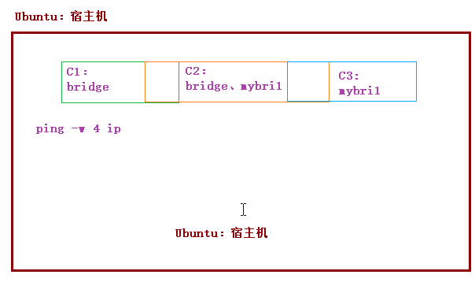
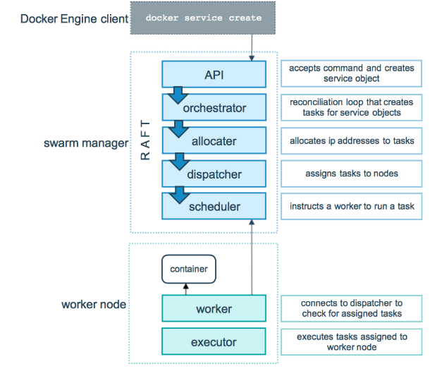

# docker（二）

课程目标：

1、docker镜像制作

2、docker仓库

3、docker网络管理

4、搭建docker swarm集群

5、docker compose编排工具

6、docker的web可视化管理工具

# 1 docker镜像制作

docker官方和个人发布的镜像由于版本等各种原因，漏洞较多，已统计Docker Hub超过30%的官方镜像包含高危漏洞。此外，由于网络等原因也会造成docker pull下载镜像的速度很慢。基于这种情况，我们可以手动定制docker系统镜像。构建镜像的方式有两种：

- 使用docker commit命令
- 使用docker build和Dockerfile文件

## 1.1 docker commit

### 1.1.1 制作步骤

~~~shell
docker commit：提交一个正在运行的容器为一个新的镜像

本例：制作一个tomcat镜像，制作步骤：
1、拉取一个基础镜像（其始就是OS）
docker pull centos

2、创建一个交互式容器
docker run -it --name=mycentos centos:latest

3、软件上传：将宿主机Tomact、jdk上传到容器中
docker cp apache-tomcat-7.0.47.tar.gz mycentos:/root/
docker cp jdk-8u161-linux-x64.tar.gz mycentos:/root/

4、在容器中安装jdk  （yum install java-1.7.0-openjdk）
tar -zxvf jdk-8u161-linux-x64.tar.gz -C /usr/local/
编辑/etc/profile文件，添加如下内容：
JAVA_HOME=/usr/local/jdk1.8.0_161
export PATH=$JAVA_HOME/bin:$PATH

5、在容器中安装tomcat
tar -zxvf apache-tomcat-7.0.47.tar.gz -C /usr/local/
编辑tomcat/bin/setclsspath.sh文件，添加如下内容：
export JAVA_HOME=/usr/local/jdk1.8.0_161
export JRE_HOME=/usr/local/jdk1.8.0_161/jre

6、将正在运行的容器提交为一个新的镜像
docker commit mycentos mytomcat
~~~

### 1.1.2 端口映射

~~~shell
docker run -itd --name=t1 -p 8888:8080 mytomcat /bin/bash
docker exec t1 /usr/local/apache-tomcat-7.0.47/bin/startup.sh
~~~

通过宿主机访问：http://ip:port


### 1.1.3 目录挂载

~~~shell
1、启动容器t1
docker run -itd --name t1 mytomcat

2、完成目录映射
docker cp t1:/usr/local/tomcat7/webapps /opt/
docker cp t1:/uer/local/tomcat7/conf /opt/

3、停止容器t1并删除
docker stop t1
docker rm t1

4、启动一个新容器并且做目录挂载
docker run -itd --name t1 -p 9999:8080 -v /opt/webapps/:/usr/local/tomcat7/webapps -v /opt/conf/:/usr/local/tomcat7/conf mytomcat

3、启动容器中的tomcat
docker exec t1 /usr/local/tomcat7/bin/startup.sh

4、通过浏览器访问

5、设置宿主机/opt/webapps/下文件时，容器自动修改
~~~

效果如下：


### 1.1.4 容器/镜像打包

~~~
镜像打包：
1、镜像打包：
docker save -o /root/tomcat7.tar mytomcat
2、将打包的镜像上传到其他服务器
scp tomcat7.tar 其他服务器ip:/root
3、导入镜像
docker load -i /root/tomcat7.tar

容器打包：
1、容器打包
docker export -o /root/t1.tar t1
2、导入容器
docker import t1.tar mytomcat:latest

~~~


## 1.2 docker builder

Dockerfile使用基本的基于DSL语法的指令来构建一个Docker镜像，之后使用docker builder命令基于该Dockerfile中的指令构建一个新的镜像。

### 1.2.1 DSL语法


~~~properties
DSL语法：

1）FROM（指定基础image）
构建指令，必须指定且需要在Dockerfile其他指令的前面。后续的指令都依赖于该指令指定的image。FROM指令指定的基础image可以是官方远程仓库中的，也可以位于本地仓库。
FROM命令告诉docker我们构建的镜像是以哪个(发行版)镜像为基础的。第一条指令必须是FROM指令。并且，如果在同一个Dockerfile中创建多个镜像时，可以使用多个 FROM 指令。
 
该指令有两种格式：
FROM <image> 
指定基础image为该image的最后修改的版本。或者：
 
FROM <image>:<tag> 
指定基础image为该image的一个tag版本。
 
RUN后面接要执行的命令，比如，我们想在镜像中安装vim，只需在Dockfile中写入 RUN yum install -y vim
 
2）MAINTAINER（用来指定镜像创建者信息）
构建指令，用于将image的制作者相关的信息写入到image中。当我们对该image执行docker inspect命令时，输出中有相应的字段记录该信息。
 
格式：
MAINTAINER <name> 
 
3）RUN（安装软件用）
构建指令，RUN可以运行任何被基础image支持的命令。如基础image选择了ubuntu，那么软件管理部分只能使用ubuntu的命令。
 
该指令有两种格式：
RUN <command>  
RUN ["executable", "param1", "param2" ... ] 
 
4）CMD（设置container启动时执行的操作）
设置指令，用于container启动时指定的操作。该操作可以是执行自定义脚本，也可以是执行系统命令。该指令只能在文件中存在一次，如果有多个，则只执行最后一条。
 
该指令有三种格式：
CMD ["executable","param1","param2"]
CMD command param1 param2
 
当Dockerfile指定了ENTRYPOINT，那么使用下面的格式：
CMD ["param1","param2"]
 
其中：
ENTRYPOINT指定的是一个可执行的脚本或者程序的路径，该指定的脚本或者程序将会以param1和param2作为参数执行。
所以如果CMD指令使用上面的形式，那么Dockerfile中必须要有配套的ENTRYPOINT。
 
5）ENTRYPOINT（设置container启动时执行的操作）
设置指令，指定容器启动时执行的命令，可以多次设置，但是只有最后一个有效。
 
两种格式:
ENTRYPOINT ["executable", "param1", "param2"]
ENTRYPOINT command param1 param2
 
该指令的使用分为两种情况，一种是独自使用，另一种和CMD指令配合使用。
当独自使用时，如果你还使用了CMD命令且CMD是一个完整的可执行的命令，那么CMD指令和ENTRYPOINT会互相覆盖，只有最后一个CMD或者ENTRYPOINT有效。
 
# CMD指令将不会被执行，只有ENTRYPOINT指令被执行 
CMD echo “Hello, World!” 
ENTRYPOINT ls -l 
 
另一种用法和CMD指令配合使用来指定ENTRYPOINT的默认参数，这时CMD指令不是一个完整的可执行命令，仅仅是参数部分；
ENTRYPOINT指令只能使用JSON方式指定执行命令，而不能指定参数。
 
FROM ubuntu 
CMD ["-l"] 
ENTRYPOINT ["/usr/bin/ls"] 
 
6）USER（设置container容器的用户）
设置指令，设置启动容器的用户，默认是root用户。
 
# 指定memcached的运行用户 
ENTRYPOINT ["memcached"] 
USER daemon 
或者
ENTRYPOINT ["memcached", "-u", "daemon"] 
 
7）EXPOSE（指定容器需要映射到宿主机器的端口）
设置指令，该指令会将容器中的端口映射成宿主机器中的某个端口。当你需要访问容器的时候，可以不是用容器的IP地址而是使用宿主机器的IP地址和映射后的端口。
要完成整个操作需要两个步骤，首先在Dockerfile使用EXPOSE设置需要映射的容器端口，然后在运行容器的时候指定-p选项加上EXPOSE设置的端口，这样EXPOSE设置的端口号会被随机映射成宿主机器中的一个端口号。
也可以指定需要映射到宿主机器的那个端口，这时要确保宿主机器上的端口号没有被使用。EXPOSE指令可以一次设置多个端口号，相应的运行容器的时候，可以配套的多次使用-p选项。
 
格式:
EXPOSE <port> [<port>...] 
 
# 映射一个端口 
EXPOSE port1 
# 相应的运行容器使用的命令 
docker run -p port1 image 
   
# 映射多个端口 
EXPOSE port1 port2 port3 
# 相应的运行容器使用的命令 
docker run -p port1 -p port2 -p port3 image 
# 还可以指定需要映射到宿主机器上的某个端口号 
docker run -p host_port1:port1 -p host_port2:port2 -p host_port3:port3 image
 
端口映射是docker比较重要的一个功能，原因在于我们每次运行容器的时候容器的IP地址不能指定而是在桥接网卡的地址范围内随机生成的。
宿主机器的IP地址是固定的，我们可以将容器的端口的映射到宿主机器上的一个端口，免去每次访问容器中的某个服务时都要查看容器的IP的地址。
对于一个运行的容器，可以使用docker port加上容器中需要映射的端口和容器的ID来查看该端口号在宿主机器上的映射端口。
 
8）ENV（用于设置环境变量）
主要用于设置容器运行时的环境变量
 
格式:
ENV <key> <value> 
 
设置了后，后续的RUN命令都可以使用，container启动后，可以通过docker inspect查看这个环境变量，也可以通过在docker run --env key=value时设置或修改环境变量。
 
假如你安装了JAVA程序，需要设置JAVA_HOME，那么可以在Dockerfile中这样写：
ENV JAVA_HOME /path/to/java/dirent
 
9）ADD（从src复制文件到container的dest路径）
主要用于将宿主机中的文件添加到镜像中
构建指令，所有拷贝到container中的文件和文件夹权限为0755，uid和gid为0；如果是一个目录，那么会将该目录下的所有文件添加到container中，不包括目录；
如果文件是可识别的压缩格式，则docker会帮忙解压缩（注意压缩格式）；如果<src>是文件且<dest>中不使用斜杠结束，则会将<dest>视为文件，<src>的内容会写入<dest>；
如果<src>是文件且<dest>中使用斜杠结束，则会<src>文件拷贝到<dest>目录下。
 
格式:
ADD <src> <dest> 
 
<src> 是相对被构建的源目录的相对路径，可以是文件或目录的路径，也可以是一个远程的文件url;
<dest> 是container中的绝对路径
 
10）VOLUME（指定挂载点)）
设置指令，使容器中的一个目录具有持久化存储数据的功能，该目录可以被容器本身使用，也可以共享给其他容器使用。我们知道容器使用的是AUFS，
这种文件系统不能持久化数据，当容器关闭后，所有的更改都会丢失。当容器中的应用有持久化数据的需求时可以在Dockerfile中使用该指令。
 
格式:
VOLUME ["<mountpoint>"]
 
例如：
FROM base 
VOLUME ["/tmp/data"]
 
运行通过该Dockerfile生成image的容器，/tmp/data目录中的数据在容器关闭后，里面的数据还存在。
例如另一个容器也有持久化数据的需求，且想使用上面容器共享的/tmp/data目录，那么可以运行下面的命令启动一个容器：
docker run -t -i -rm -volumes-from container1 image2 bash
 
其中：container1为第一个容器的ID，image2为第二个容器运行image的名字。
 
11）WORKDIR（切换目录）
设置指令，可以多次切换(相当于cd命令)，对RUN,CMD,ENTRYPOINT生效。
 
格式:
WORKDIR /path/to/workdir 
 
# 在/p1/p2下执行vim a.txt 
WORKDIR /p1 WORKDIR p2 RUN vim a.txt 
 
12）ONBUILD（在子镜像中执行）
 
格式：
ONBUILD <Dockerfile关键字> 
 
ONBUILD 指定的命令在构建镜像时并不执行，而是在它的子镜像中执行。
~~~


### 1.2.2 案例

~~~shell
通过dockerfile构建镜像步骤：
1、创建一个目录
2、在目录下创建Dockerfile文件以及其他文件
3、通过docker builder构建镜像
4、通过构建的镜像启动容器


栗子：
1、创建一个目录：/usr/local/rw_test
2、编辑Dockerfile文件,vim Dockerfile
3、编辑内容如下
#pull down centos image
FROM docker.io/centos
MAINTAINER ruanwen onlien033_login@126.com

#install nginx
RUN yum install -y pcre pcre-devel openssl openssl-devel gcc gcc+ wget vim net-tools
RUN useradd www -M -s /sbin/nologin
RUN cd /usr/local/src && wget http://nginx.org/download/nginx-1.8.0.tar.gz && tar -zxvf nginx-1.8.0.tar.gz
RUN cd /usr/local/src/nginx-1.8.0 && ./configure --prefix=/usr/local/nginx --user=www --group=www --with-http_stub_status_module --with-http_ssl_module && make && make install

ENTRYPOINT /usr/local/nginx/sbin/nginx && tail -f /usr/local/nginx/logs/access.log

4、在rw_test目录下构建镜像：
docker build -t rw_nginx --rm=true .
-t    表示选择指定生成镜像的用户名，仓库名和tag
--rm=true    表示指定在生成镜像过程中删除中间产生的临时容器。
注意：上面构建命令中最后的.符号不要漏了，表示使用当前目录下的Dockerfile构建镜像

5、测试
docker run -ti -d --name test_nginx -p 8899:80 rw_nginx /bin/bash
docker exec test_nginx /bin/bash
通过浏览器访问：http://ip:8899
~~~

# 2 docker仓库

Docker仓库（Repository）类似与代码仓库，是Docker集中存放镜像文件的地方。

## 2.1 docker hub

~~~shell
1、打开https://hub.docker.com/
2、注册账号：略
3、创建仓库（Create Repository）：略
4、设置镜像标签
docker tag local-image:tagname new-repo:tagname（设置tag）
eg:docker tag hello-world:latest 108001509033/test-hello-world:v1
5、登录docker hub
docker login(回车，输入账号以及密码)
6、推送镜像
docker push new-repo:tagname
eg：docker push 108001509033/test-hello-world:v1
~~~

## 2.2 阿里云

略：参考官方文档。

~~~shell
步骤：
1、创建阿里云账号
2、创建命名空间
3、创建镜像仓库
4、操作指南
$ sudo docker login --username=[账号名称] registry.cn-hangzhou.aliyuncs.com
$ sudo docker tag [ImageId] registry.cn-hangzhou.aliyuncs.com/360buy/portal:[镜像版本号]
$ sudo docker push registry.cn-hangzhou.aliyuncs.com/360buy/portal:[镜像版本号]
~~~


## 2.3 搭建私有仓库

### 2.3.1 构建私有仓库

~~~shell
1、启动Docker Registry，使用Docker官方提供的Registry镜像就可以搭建本地私有镜像仓库，具体指令如下。
$ docker run -d \
  -p 5000:5000 \
  --restart=always \
  --name registry \
  -v /mnt/registry:/var/lib/registry \
  registry:2

指令参数说明：
-d：表示在后台运行该容器；
-p 5000:5000：表示将私有镜像仓库容器内部默认暴露的5000端口映射到宿主机的5000端口
--restart=always：表示容器启动后自动启动本地私有镜像仓库
--name registry：表示为生成的容器命名为registry
-v /mnt/registry:/var/lib/registry：表示将容器内的默认存储位置/var/lib/registry中的数据挂载到宿主机的/mnt/registry目录下，这样当容器销毁后，在容器中/var/lib/registry目录下的数据会自动备份到宿主机指定目录

小提示：
Docker Registry目前有v1和v2两个版本，v2版本并不是v1版本的简单升级，而是在很多功能上都有了改进和优化。v1版本使用的是Python开发的，而v2版本是用go语言开发的；v1版本本地镜像仓库容器中数据默认挂载点是/tmp/registry，而v2版本的本地镜像仓库容器中数据默认挂载点是/var/lib/registry

2、重命名镜像，之前推送镜像时，都是默认推送到远程镜像仓库，而本次是将指定镜像推送到本地私有镜像仓库。由于推送到本地私有镜像仓库的镜像名必须符合“仓库IP:端口号/repository”的形式，因此需要按照要求修改镜像名称，具体操作指令如下。
$ docker tag hello-world:latest localhost:5000/myhellodocker

3、推送镜像，本地私有镜像仓库搭建并启动完成，同时要推送的镜像也已经准备就绪后，就可以将指定镜像推送到本地私有镜像仓库了，具体操作指令如下
$ docker push localhost:5000/myhellodocker

4、查看本地仓库镜像
http://localhost:5000/v2/myhellodocker/tags/list  （注意：使用该地址时注意镜像名称）

由于做了目录挂载，因此可以在本地的该目录下查看：
/mnt/registry/docker/registry/v2/repositories

~~~

### 2.3.2 配置私有仓库认证

~~~shell
一、配置私有仓库认证
1、查看Docker Registry私有仓库搭建所在服务器地址：ifconfig
例如：服务器地址为：192.168.200.141

2、生成自签名证书（在home目录下执行上述指令后）
要确保Docker Registry本地镜像仓库的安全性，还需要一个安全认证证书，来保证其他Docker机器不能随意访问该机器上的Docker Registry本地镜像仓库，所以需要在搭建Docker Registry本地镜像仓库的Docker主机上先生成自签名证书（如果已购买证书就无需生成），具体操作指令如下。
$ mkdir registry && cd registry && mkdir certs && cd certs
$ openssl req -x509 -days 3650 -subj '/CN=192.168.200.141:5000/' \
    -nodes -newkey rsa:2048 -keyout domain.key -out domain.crt

指令参数说明：
-x509：x509是一个自签发证书的格式
-days 3650：表示证书有效期
192.168.197.141:5000：表示具体部署Docker Registry本地镜像仓库的地址和端口
rsa:2048：是证书算法长度
domain.key和domain.crt：就是生成的证书文件

3、生成用户名和密码
在Docker Registry本地镜像仓库所在的Docker主机上生成自签名证书后，为了确保Docker机器与该Docker Registry本地镜像仓库的交互，还需要生成一个连接认证的用户名和密码，使其他Docker用户只有通过用户名和密码登录后才允许连接到Docker Registry本地镜像仓库
$ cd .. && mkdir auth
$ docker run --entrypoint htpasswd registry:2 -Bbn ruanwen 123456 > auth/htpasswd

4、启动Docker Registry本地镜像仓库服务（将之前创建的容器删除）
$ docker run -d \
  -p 5000:5000 \
  --restart=always \
  --name registry \
  -v /mnt/registry:/var/lib/registry \
  -v `pwd`/auth:/auth \
  -e "REGISTRY_AUTH=htpasswd" \
  -e "REGISTRY_AUTH_HTPASSWD_REALM=Registry Realm" \
  -e REGISTRY_AUTH_HTPASSWD_PATH=/auth/htpasswd \
  -v `pwd`/certs:/certs \
  -e REGISTRY_HTTP_TLS_CERTIFICATE=/certs/domain.crt \
  -e REGISTRY_HTTP_TLS_KEY=/certs/domain.key \
  registry:2

5、配置Docker Registry访问接口
完成Docker Registry本地镜像仓库服务启动后，还需要在搭建了Docker Registry本地镜像仓库所在的Docker主机上配置供其他Docker机器访问的接口，具体指令如下：
$ sudo mkdir -p /etc/docker/certs.d/192.168.200.141:5000
$ sudo cp certs/domain.crt /etc/docker/certs.d/192.168.200.141:5000

6、Docker Registry私有仓库使用登记
在Docker机器终端使用sudo vim /etc/docker/daemon.json命令编辑daemon.json文件，在该文件中添加如下内容
{"insecure-registries":["192.168.200.141:5000"]}

7、重启并加载docker配置文件
$ sudo /etc/init.d/docker restart

二、验证测试
1、装备镜像
$ docker tag hello-world:latest 192.168.200.141:5000/myhelloworld
2、推送镜像
$ docker push 192.168.200.141:5000/myhelloworld

送过程中出现错误，信息提示为：no basic auth credentials（即没有通过身份验证），所以无法进行推送，这也就说明身份验证的配置有效。要想成功推送，需要先登录成功后再推送

3、登录Docker Registry镜像仓库
$ docker login 192.168.200.141:5000

4、再次推送
$ docker push 192.168.200.139:5000/myhelloworld

5、结果验证
由于做了目录挂载，因此可以在本地的该目录下查看：
/mnt/registry/docker/registry/v2/repositories
~~~

# 3 docker网络管理

## 3.1 默认网络

1、查看docker网络：

~~~shell
docker network ls
~~~

Docker中默认的三种网络分别为bridge、host和none，其中名为bridge的网络就是默认的bridge驱动网络，也是容器创建时默认的网络管理方式，配置后可以与宿主机通信从而实现与互联网通信功能，而host和none属于无网络，容器添加到这两个网络时不能与外界网络通信。

这里介绍的三种网络bridge、host和none都是在非集群环境下Docker提供的默认网络，而在Docker Swarm集群环境下，除了这三种默认网络外，Docker还提供了docker_gwbridge和ingress两种默认网络。


2、查看容器使用的网络情况：

~~~shell
docker network inspect bridge
~~~


## 3.2 自定义网络

虽然Docker提供的默认网络的使用比较简单，但是为了保证各容器中应用的安全性，在实际开发中更推荐使用自定义的网络进行容器管理。在Docker中，可以自定义bridge网络、overlay网络，也可以创建network plugin（网络插件）或者远程网络以实现容器网络的完全定制和控制。

### 3.2.1 网络类型

- **Bridge networks**（桥接网络）：

  为了保证容器的安全性，我们可以使用基于bridge的驱动创建新的bridge网络，这种基于bridge驱动的自定义网络可以较好的实现容器隔离。需要说明的是，这种用户自定义的基于bridge驱动的网络对于单主机的小型网络环境管理是一个不错的选择，但是对于大型的网络环境管理（如集群）就需要考虑使用自定义overlay集群网络。

- **Overlay network in swarm mode**（Swarm集群中的覆盖网络）

  在Docker Swarm集群环境下可以创建基于overlay驱动的自定义网络。为了保证安全性，Swarm集群使自定义的overlay网络只适用于需要服务的群集中的节点，而不会对外部其他服务或者Docker主机开放。

- **Custom network plugins**（定制网络插件）

  如果前面几种自定义网络都无法满足需求时，就可以使用Docker提供的插件来自定义网络驱动插件。自定义网络插件会在Docker进程所在主机上作为另一个运行的进程。自定义网络驱动插件与其他插件遵循相同的限制和安装规则，所有插件都使用Docker提供的插件API，并且有一个包含安装、启动、停止和激活的生命周期。由于自定义网络插件使用较少，所以只需了解即可。


### 3.2.2 自定义网络

~~~shell
1、docker network create --driver bridge isolated_nw
创建一个基于bridge驱动的名称为isolated_nw的网络。其中--driver（可简写为-d）用于指定网络驱动类型，isolated_nw就是新创建的网络名称。需要说明的是，--driver bridge可以省略，省略时Docker会默认使用基于bridge驱动来创建新的网络。

2、docker run -itd --name=nwtest --network=isolated_nw busybox
会创建一个名为nwtest的容器，指令中的--network参数指定了该容器的网络连接为自定义的isolated_nw。通过docker inspect nwtest指令可以查看启动后的容器详情，来核查其网络管理方式.

3、docker network connect bridge nwtest
会为容器nwtest另添加一种默认的bridge网络管理方式。再次使用docker inspect nwtest指令查看该容器网络详情 

4、docker network disconnect isolated_nw nwtest
断开网络连接的指令与连接网络的指令类似，在使用时也需要指定网络名称和容器名称

5、docker network rm isolated_nw
移除名称为isolated_nw的自定义网络。当网络移除成功后，会返回网络名称。

~~~


## 3.3 容器间的网络通信

1、创建两个使用默认的bridge网络的容器

```shell
docker run -itd --name=c1 busybox
docker run -itd --name=c2 busybox
```

2、创建一个使用自定义的isolated_nw网络（需要预先创建）的容器

```shell
docker run --network=isolated_nw -itd --name=c3 busybox
```

3、为container2容器新增一个自定义的isolated_nw网络连接

```shell
docker network connect isolated_nw c2
```


4、C1、C2、C3网络分配情况如下：


5、测试容器间通信：分别登录C1、C2、C3容器，通过ping命令判断是否通信。

~~~shell
ping -w 4 ip地址
~~~




6、结论：

~~~properties
不同容器之间想要相互通信必须在同一个网络环境下；使用默认bridge网络管理的容器可以使用容器IP进行通信，但无法使用容器名称进行通信；而使用自定义网络管理的容器则可以使用容器IP进行通信
~~~


# 4 搭建docker swarm集群

## 4.1 swarm介绍

Swarm这个项目名称特别贴切。在Wiki的解释中，Swarm behavior是指动物的群集行为。比如我们常见的蜂群，鱼群，秋天往南飞的雁群都可以称作Swarm behavior。Swarm项目正是这样，通过把多个Docker Engine聚集在一起，形成一个大的docker-engine，对外提供容器的集群服务。同时这个集群对外提供Swarm API，用户可以像使用Docker Engine一样使用Docker集群。


Swarm是Docker公司在2014年12月初发布的容器管理工具，和Swarm一起发布的Docker管理工具还有Machine以及Compose。Swarm是一套较为简单的工具，用以管理Docker集群，使得Docker集群暴露给用户时相当于一个虚拟的整体。Swarm将一群Docker宿主机变成一个单一的，虚拟的主机。Swarm使用标准的Docker API接口作为其前端访问入口，换言之，各种形式的Docker Client(docker client in Go, docker_py, docker等)均可以直接与Swarm通信。Swarm几乎全部用Go语言来完成开发，Swarm0.2版本增加了一个新的策略来调度集群中的容器，使得在可用的节点上传播它们，以及支持更多的Docker命令以及集群驱动。Swarm deamon只是一个调度器（Scheduler）加路由器(router)，Swarm自己不运行容器，它只是接受docker客户端发送过来的请求，调度适合的节点来运行容器，这意味着，即使Swarm由于某些原因挂掉了，集群中的节点也会照常运行，当Swarm重新恢复运行之后，它会收集重建集群信息。  

**docker swarm特点：**

1) 对外以Docker API接口呈现，这样带来的好处是，如果现有系统使用Docker Engine，则可以平滑将Docker Engine切到Swarm上，无需改动现有系统。 

2) Swarm对用户来说，之前使用Docker的经验可以继承过来。非常容易上手，学习成本和二次开发成本都比较低。同时Swarm本身专注于Docker集群管理，非常轻量，占用资源也非常少。简单说，就是插件化机制，Swarm中的各个模块都抽象出了API，可以根据自己一些特点进行定制实现。 

3)  Swarm自身对Docker命令参数支持的比较完善，Swarm目前与Docker是同步发布的。Docker的新功能，都会第一时间在Swarm中体现。

## 4.2 docker swarm架构

Swarm作为一个管理Docker集群的工具，首先需要将其部署起来，可以单独将Swarm部署于一个节点。另外，自然需要一个Docker集群，集群上每一个节点均安装有Docker。


相关术语：

- Swarm Manager：集群的管理工具，通过swarm manager管理多个节点。

- Node：是已加入到swarm的Docker引擎的实例 。

  - manager nodes：也就是管理节点 ，执行集群的管理功能，维护集群的状态，选举一个leader节点去执   行调度任务 

  - worker nodes，也就是工作节点 ，接收和执行任务。参与容器集群负载调度，仅用于承载task 

    

- 一个服务是工作节点上执行任务的定义。创建一个服务，指定了容器所使用的镜像和容器运行的命令。service是运行在worker nodes上的task的描述，service的描述包括使用哪个docker 镜像，以及在使用该镜像的容器中执行什么命令。

  

- task任务：一个任务包含了一个容器及其运行的命令。task是service的执行实体，task启动docker容器并在容器中执行任务

  

## 4.3 docker swarm使用

~~~shell
搭建步骤：

1、环境准备：
1.1、准备三台已近安装docker engine的Ubuntu系统主机（docker版本必须在1.12以上的版本，老版本不支持swarm）
1.2、docker容器主机的ip地址固定，集群中所有工作节点必须能访问该管理节点
1.3、集群管理节点必须使用相应的协议并且保证端口可用
	集群管理通信：TCP，端口2377
	节点通信：TCP和UDP，端口7946
	覆盖型网络：UDP，端口4789   overlay驱动
说明：三台容器主机的ip地址分别为：
192.168.200.138（管理节点）
192.168.200.139（工作节点）
192.168.200.140（工作节点）
主机名称分别为：manager1、work1以及work2
vim /etc/hostname  (修改完成后需要重启)


2、创建docker swarm
2.1、在manager1机器上创建docker swarm集群
docker swarm init --advertise-addr 192.168.200.138
（--advertise-addr将该IP地址的机器设置为集群管理节点；如果是单节点，无需该参数）
2.2、查看管理节点集群信息：
docker node ls

3、向docker swarm中添加工作节点：在两个工作节点中分别执行如下命令，ip地址是manager节点的
3.1、添加两个work节点
docker swarm join --token xxx 192.168.200.138:2377  （worker1）
docker swarm join --token xxx 192.168.200.138:2377  （worker2）
（--token xxx:向指定集群中加入工作节点的认证信息，xxx认证信息是在创建docker swarm时产生的）
3.2、继续查看管理节点集群信息与之前的区别
docker node ls

4、在docker swarm中部署服务
在Docker Swarm集群中部署服务时，既可以使用Docker Hub上自带的镜像来启动服务，也可以使用自己通Dockerfile构建的镜像来启动服务。如果使用自己通过Dockerfile构建的镜像来启动服务那么必须先将镜像推送到Docker Hub中心仓库。为了方便读者的学习，这里以使用Docker Hub上自带的alpine镜像为例来部署集群服务
4.1、部署服务
docker service create --replicas 1 --name helloworld alpine ping docker.com
docker service create指令：用于在Swarm集群中创建一个基于alpine镜像的服务
--replicas参数：指定了该服务只有一个副本实例
--name参数：指定创建成功后的服务名称为helloworld
ping docker.com指令：表示服务启动后执行的命令

5.查看docker swarm集群中的服务
查看服务列表：docker service ls
查看部署具体服务的详细信息：docker service inspect 服务名称
查看服务在集群节点上的分配以及运行情况：docker service ps 服务名称

6、修改副本数量
在manager1上，更改服务副本的数量（创建的副本会随机分配到不同的节点）
docker service scale helloworld=5

7、删除服务（在管理节点）
docker service rm 服务名称

8、访问服务
8.1、查看集群环境下的网络列表：docker network ls
8.2、在manager1上创建一overlay为驱动的网络（默认使用的网络连接ingress）
docker network create -d=overlay my-multi-host-network
8.3、在集群管理节点manager1上部署一个nginx服务
docker service create \
  --network my-multi-host-network \
  --name my-web \
  -p 8080:80 \
  --replicas 2 \
  nginx
8.3、在管理节点查看服务的运行情况：
docker service ps my-web
8.4、访问测试
~~~


# 5 docker compose编排工具

## 5.1 docker compose介绍

根据前面所学的知识可知，想要使用Docker部署应用，就要先在应用中编写Dockerfile文件来构建镜像。同样，在微服务项目中，我们也需要为每一个服务编写Dockerfile文件来构建镜像。构建完成后，就可以根据每一个镜像使用docker run或者docker service create命令创建并启动容器，这样我们就可以访问容器中的服务了。	

虽然使用上述方式可以部署微服务项目，但考虑到微服务项目可能有多个子服务组成，并且每个服务启动过程中都需要配置额外的参数（如-e配置环境变量、--network指定网络、磁盘挂载等等）。这种情况下，每次更新微服务后，都要手动运行指令来重新启动容器，这就显得相当麻烦了。针对这种多服务部署的情况，Docker提供了Docker Compose编排工具来对多服务应用进行统一部署。Compose是Docker的服务编排工具，主要用来构建基于Docker的复杂应用，Compose 通过一个配置文件来管理多个Docker容器，非常适合组合使用多个容器进行开发的场景。 

通过该编排工具，可以使用yml（或yaml）文件来配置应用程序服务，然后只需要一条简单的服务部署指令就可以从配置中创建并启动所有服务。

## 5.2 docker compose安装与卸载

安装docker compose

~~~shell
1、环境要求：Docker Compose是依赖于Docker引擎的，所以在安装Docker Compose之前要确保机器上已经安装了Docker。https://github.com/docker/compose/releases （查看docker compose版本）

2、下载docker-compose工具
curl -L https://github.com/docker/compose/releases/download/1.24.0/docker-compose-`uname -s`-`uname -m` -o /usr/local/bin/docker-compose

3、设置docker compose可执行文件权限
chmod +x /usr/local/bin/docker-compose

4、查看docker compose版本
docker-compose --version


PS:卸载docker compose
sudo rm /usr/local/bin/docker-compose
~~~

## 5.3 docker compose使用

### 5.3.1 例子

~~~shell
步骤：分为三步(在创建的一个空目录下执行)
1、编写Dockerfile文件（为每个服务构建需要的镜像，方便迁移-不是必须的）
2、编写docker-compose.yml文件（编写部署服务相关指令）
3、运行docker-compose up（启动yml文件中服务）

案例：
1、准备：两个镜像（本次演示就不通过Dockerfile构建了）
docker pull mysql:5.7
docker pull wordpress

2、需要新建一个空白目录，例如rwtest。新建一个docker-compose.yml,编辑该文件：
version: '3'
services:
   db:
     image: mysql:5.7
     volumes:
       - db_data:/var/lib/mysql
     restart: always
     environment:
       MYSQL_ROOT_PASSWORD: wordpress
       MYSQL_DATABASE: wordpress
       MYSQL_USER: wordpress
       MYSQL_PASSWORD: wordpress

   wordpress:
     depends_on:
       - db
     image: wordpress:latest
     ports:
       - "8001:80"
     restart: always
     environment:
       WORDPRESS_DB_HOST: db:3306
       WORDPRESS_DB_USER: wordpress
       WORDPRESS_DB_PASSWORD: wordpress
volumes:
    db_data:
        
该文件中内容：新建db和wordpress容器。等同于：
docker run --name db -e MYSQL_ROOT_PASSWORD=123456 -d mysql
docker run --name some-wordpress --link db:mysql -p 8002:80 -d wordpress

3、启动docker compose
docker-compose up

4、浏览器访问：http://ip:8001

5、停止/重启服务：docker-compose stop/restart
~~~


### 5.3.2 docker compose指令说明

~~~shell
 1	version: '3'
 2	services:
 3	  web:
 4	    image: id/imagename:lable
 5	    restart: on-failure
 6	    container_name: my-web-container
 7	    ports:
 8	      - 8080:8080
 9	   	networks:
 10	      - example-net
 11	    depends_on:
 12	      - db
 13	    deploy:
 14	      replicas: 2
 15	      restart_policy:
 16	        condition: on-failure
 17	  db:
 18	    image: mysql:5.6
 19	    restart: on-failure
 20	    container_name: my-mysql-container	
 21	    ports:
 22	      - 3306:3306
 23	    volumes:
 24	      - example-mysql:/var/lib/mysql
 25	    networks:
 26	      - example-net
 27	    environment:
 28	      MYSQL_ROOT_PASSWORD: root
 29	      MYSQL_DATABASE: mysql_database
 30	    deploy:
 31	      replicas: 1
 32	      restart_policy:
 33	        condition: on-failure
 34	      placement:
 35	        constraints: [node.role == manager]
 36	networks:
 37	  example-net:
 38	volumes:
 39	  example-mysql:

~~~

- version：version通常在一个docker-compose.yml文件的最顶部，用来表示文件内容的约束版本（类似于XML文件约束）（版本越高，支持的指令越多）
- services用来声明服务，在services下的所有同缩进的应用名称都代表一个服务，如上面示例中的web和db。在进行多服务部署的时候，有多少个服务需要同时部署，就需要在services参数下面声明并配置多少个服务
  - image：容器启动需要依赖的镜像（如果本地没有会自动pull）
  - restart：服务重启策略
    - restart: "no"    #服务默认值为no，即服务失败后没有任何动作
    - restart: always  #表示服务会一直重新启动
    - restart: on-failure  #表示服务提示失败错误后会重新启动
    - restart: unless-stopped  #表示只有服务在停止后才会重启
  - container_name：指定容器名称
  - ports：指定服务向外暴露的端口
  - networks：指定容器使用的网络
  - depends_on：服务依赖决定了服务的依赖关系，如示例中的web依赖db，所以db服务会先于web服务启动，但并不表示db服务完全启动成功后才启动web服务，它只决定启动的先后顺序而已
  - deploy：deploy参数是Docker Compose针对Swarm集群部署提供的，子参数专门用于指定与服务部署和运行相关的配置
    - replicas：表示服务实例的副本数量 
    - restart_policy：estart_policy参数同前面介绍的restart类似，都是用来配置服务重启策略的，只是该属性配置在deploy参数下，并只在集群环境下生效。该参数包含多个子属性及属性值
      - condition: on-failure #表示服务重启的条件，值有none、on-failure和any
      - delay: 5s  #表示重启服务之间等待时间，默认为0
      - max_attempts: 3  #表示失败后尝试重启的次数
      - window: 120s   #表示等待多久来确定服务是否启动成功
    - placement：placement用来配置指定位置的约束，当服务在Swarm集群环境下部署时会随机分配到管理节点和其他工作节点上。在上述示例中由于将mysql数据挂载到了本机example-mysql数据卷中，所以使用了placement的子参数constraints: [node.role == manager]指定该服务只在manager管理节点上运行 :
  - environment用于配置服务启动时需要的环境变量。如上述示例中MYSQL_ROOT_PASSWORD表示数据库root用户的密码，MYSQL_DATABASE表示数据库启动后自动创建的数据库。 
- networks：用于配置服务网络
- volumes：目录挂载，上述示例中是将mysql数据挂载到本地example-mysql数据卷中，如果该数据卷不存在，服务启动时也会默认创建

其他配置可参考：https://docs.docker.com/compose/compose-file/


# 6 docker的web可视化管理工具

## 6.1 常用工具介绍

当 Docker 部署规模逐步变大后，可视化监控容器环境的性能和健康状态将会变得越来越重要。 Docker的图形化管理工具，提供状态显示面板、应用模板快速部署、容器镜像网络数据卷的基本操作（包括上传下载镜像，创建容器等操作）、事件日志显示、容器控制台操作、Swarm集群和服务等集中管理和操作、登录用户管理和控制等功能。常用工具如下：

1、docker UI（local）

2、shipyard（停止维护了）

3、portainer  

4、daocloud


## 6.2 工具使用

### 6.2.1 docker UI

安装docker UI

~~~shell
1、拉取docker UI镜像
docker pull uifd/ui-for-docker

2、创建容器
docker run -d -p 9000:9000 --privileged -v /var/run/docker.sock:/var/run/docker.sock uifd/ui-for-docker
~~~


- 优点：
  - 支持容器管理
  - 支持镜像管理
  - 基于docker api，自身也是一个容器。
  - 稳定性高
  - 可动态显示显示容器之间关系图
  - 容器管理，增加端口映射，增加系统变量、映射目录等
- 缺点：
  - 没有登录验证，因为没有登录体系，目前解决办法是，只开放本地访问，或者通过TLS来对权限进行控制。
  - 无法分配某容器给某用户。
  - 不支持多主机。
  - 不支持集群swarm等
  - 功能少


### 6.2.2 portainer

#### 6.2.2.1 安装portainer

~~~shell
docker run -d -p 9001:9000 -v /var/run/docker.sock:/var/run/docker.sock portainer/portainer
~~~


#### 6.2.2.2 挂载远程节点（修改远程节点配置）

~~~shell
1、编辑该文件
vim /lib/systemd/system/docker.service

2、删除配置文件中内容
ExecStart=/usr/bin/dockerd xxx(删除这部分内容)

3、在daemon.json文件中添加如下内容：所有服务器都可以访问
"hosts":["tcp://0.0.0.0:2375","unix:///var/run/docker.sock"]

4、重启docker
systemctl daemon-reload
systemctl restart docker


~~~


优点

1. 支持容器管理、镜像管理
2. 轻量级，消耗资源少
3. 基于docker api，安全性高，可指定docker api端口，支持TLS证书认证。
4. 支持权限分配
5. 支持集群

缺点

1. 功能不够强大。
2. 容器创建后，无法通过后台增加端口。


### 6.2.3 daocloud

~~~shell
执行该命令：
curl -sSL https://get.daocloud.io/daomonit/install.sh | sh -s 24a7c865945f25697fe9255dad8e54eb431d785b
~~~


优点：

1. 支持镜像管理、容器管理。
2. 支持控制台命令
3. 容器资源消耗监控
4. 支持集群可以随意增加节点
5. 中文平台
6. 镜像下载
7. 容器扩容、管理

缺点

1. 管理平台无法部署到本地服务器
2. 部分高级功能收费
