# Maven高级

# 学习目标

- [ ] 能够在maven工程中添加依赖
- [ ] 理解传递依赖
- [ ] 掌握如何解决依赖版本冲突解决
- [ ] 能够使用maven构建SSM工程
- [ ] 学习使用maven分模块方式构建工程
- [ ] 了解搭建私服的使用

# 第一章-Maven和SSM回顾

## 回顾-Maven知识点回顾

### 1.目标

​	我们之前已经学过Maven初级课程.我们先把一些重要的知识点进行回顾.

### 2.步骤

1. Maven好处
2. 安装配置 maven
3. 三种仓库
4. 常见的命令
5. 坐标的书写规范
6. 如何添加坐标
7.  依赖范围

### 3.讲解

#### 3.1.Maven好处

1. 节省磁盘空间  
2. 可以一键构建  
3. 可以跨平台  
4. 应用在大型项目时可以提高开发效率

#### 3.2 安装配置 maven
注意： 3.3+版本需要 jdkj.7+以上的支持

#### 3.3 三种仓库
1. 本地仓库
2. 远程仓库（私服）
3. 中央仓库

#### 3.4 常见的命令
1. clean   		清除编译之后的内容(target目录)
2. compile      编译
3. test             执行单元测试
4. package     打包 javase=>jar, javaweb=>war
5. install         打包安装到本地仓库


#### 3.5 坐标的书写规范
- groupId:项目组织唯一的标识符，实际对应JAVA的包的结构 (一般写公司的组织名称 eg:com.itheima,com.alibaba)
- artifactId: 项目的名称
- version：定义项目的当前版本 

例如：要引入druid，只需要在pom.xml配置文件中配置引入junit的坐标即可：

```xml
<!--druid连接池-->
<dependency>
  <groupId>com.alibaba</groupId>
  <artifactId>druid</artifactId>  
  <version>1.0.9</version>
</dependency>
```

#### 3.6 如何添加坐标
1. 在本地仓库中搜索
2. 互联网上搜，推荐网址 http://www.mvnrepository.com/

#### 3.7 依赖范围

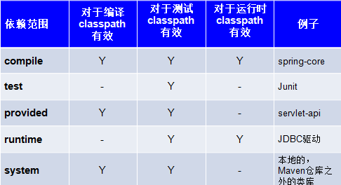

- compile 编译、测试、运行，A在编译时依赖B，并且在测试和运行时也依赖

  例如：strus-core、spring-beans, C3P0,Druid。打到war包或jar包


- provided 编译、和测试有效，A在编译和测试时需要B

   例如：servlet-api就是编译和测试有用，在运行时不用（tomcat容器已提供）

   不会打到war

- runtime：测试、运行有效

   例如：jdbc驱动包 ，在开发代码中针对java的jdbc接口开发，编译不用

   在运行和测试时需要通过jdbc驱动包（mysql驱动）连接数据库，需要的

   会打到war

- test：只是测试有效，只在单元测试类中用

   例如：junit

   不会打到war

- 按照依赖强度，由强到弱来排序：(理解)

  compile> provided> runtime> test

## 案例-使用maven 构建 SSM 工程 

### 1.需求

- [ ] 查询所有的账户

### 2.分析

#### 2.1环境准备

1. 创建数据库,创建表
2. 创建Maven工程(war)
   + 添加坐标
   + 创建实体类
   + 拷贝log4J的配置文件

#### 2.2Controller

1. 创建Controller类, 定义方法, 添加注解
2. 创建springmvc.xml(开启包扫描, 注册视图解析器,忽略静态资源,开启注解驱动)
3. 配置web.xml(配置前端控制器, 编码过滤器)

#### 2.3Service

1. 创建Service接口,类 进行注册
2. 在Controller注入Service
3. 创建applicationContext-service.xml 配置事务
   + 注册事务管理器(注入DataSource)
   + 开启事务注解
   + 在业务类上面添加@Transactional

#### 2.4Dao

1. 创建Dao接口, 定义方法 添加注解
2. 创建SqlMapConfig.xml(空的)
3. 创建applicationContext-dao.xml
   + 注册数据源
   + 注册SqlSessionFactory
   + 注册dao扫描器
4. Service注入Dao


### 3.实现

#### 3.1环境的准备

##### 3.1.1创建数据库和表结构

```mysql
create database ssm;
use ssm;
create table account(
    id int primary key auto_increment,
    name varchar(40),
    money double
)character set utf8 collate utf8_general_ci;

insert into account(name,money) values('zs',1000);
insert into account(name,money) values('ls',1000);
insert into account(name,money) values('ww',1000);
```

##### 3.1.2.创建Maven工程

- 创建web项目

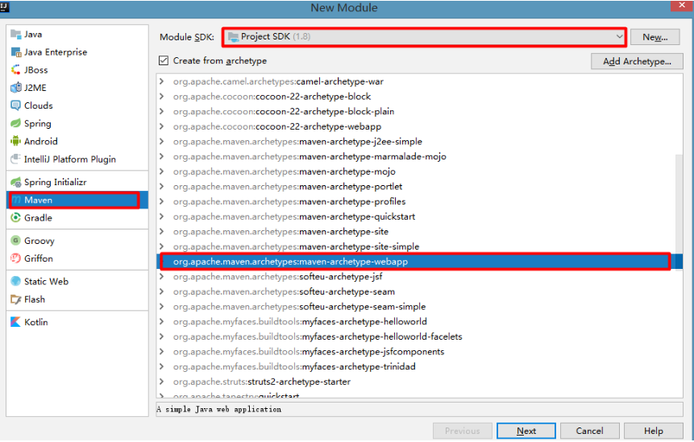

- 导入坐标 

```xml
<properties>
		<spring.version>5.0.2.RELEASE</spring.version>
		<slf4j.version>1.6.6</slf4j.version>
		<log4j.version>1.2.12</log4j.version>
		<mysql.version>5.1.6</mysql.version>
		<mybatis.version>3.4.5</mybatis.version>
</properties>

	<dependencies>

	  <!-- spring -->
    <dependency>
      <groupId>org.aspectj</groupId>
      <artifactId>aspectjweaver</artifactId>
      <version>1.6.8</version>
    </dependency>

    <dependency>
      <groupId>org.springframework</groupId>
      <artifactId>spring-aop</artifactId>
      <version>${spring.version}</version>
    </dependency>

    <dependency>
      <groupId>org.springframework</groupId>
      <artifactId>spring-context</artifactId>
      <version>${spring.version}</version>
    </dependency>

    <dependency>
      <groupId>org.springframework</groupId>
      <artifactId>spring-web</artifactId>
      <version>${spring.version}</version>
    </dependency>

    <dependency>
      <groupId>org.springframework</groupId>
      <artifactId>spring-webmvc</artifactId>
      <version>${spring.version}</version>
    </dependency>

    <dependency>
      <groupId>org.springframework</groupId>
      <artifactId>spring-test</artifactId>
      <version>${spring.version}</version>
    </dependency>

    <dependency>
      <groupId>org.springframework</groupId>
      <artifactId>spring-tx</artifactId>
      <version>${spring.version}</version>
    </dependency>

    <dependency>
      <groupId>org.springframework</groupId>
      <artifactId>spring-jdbc</artifactId>
      <version>${spring.version}</version>
    </dependency>

    <dependency>
      <groupId>junit</groupId>
      <artifactId>junit</artifactId>
      <version>4.12</version>
      <scope>compile</scope>
    </dependency>

    <dependency>
      <groupId>mysql</groupId>
      <artifactId>mysql-connector-java</artifactId>
      <version>${mysql.version}</version>
    </dependency>

    <dependency>
      <groupId>javax.servlet</groupId>
      <artifactId>servlet-api</artifactId>
      <version>2.5</version>
      <scope>provided</scope>
    </dependency>

    <dependency>
      <groupId>javax.servlet.jsp</groupId>
      <artifactId>jsp-api</artifactId>
      <version>2.0</version>
      <scope>provided</scope>
    </dependency>

    <dependency>
      <groupId>jstl</groupId>
      <artifactId>jstl</artifactId>
      <version>1.2</version>
    </dependency>

    <!-- log start -->
    <dependency>
      <groupId>log4j</groupId>
      <artifactId>log4j</artifactId>
      <version>${log4j.version}</version>
    </dependency>

    <dependency>
      <groupId>org.slf4j</groupId>
      <artifactId>slf4j-api</artifactId>
      <version>${slf4j.version}</version>
    </dependency>

    <dependency>
      <groupId>org.slf4j</groupId>
      <artifactId>slf4j-log4j12</artifactId>
      <version>${slf4j.version}</version>
    </dependency>
    <!-- log end -->
    <dependency>
      <groupId>org.mybatis</groupId>
      <artifactId>mybatis</artifactId>
      <version>${mybatis.version}</version>
    </dependency>

    <dependency>
      <groupId>org.mybatis</groupId>
      <artifactId>mybatis-spring</artifactId>
      <version>1.3.0</version>
    </dependency>

    <dependency>
      <groupId>com.alibaba</groupId>
      <artifactId>druid</artifactId>
      <version>1.0.14</version>
    </dependency>

	</dependencies>
```

- 编写实体类 

```java
public class Account implements Serializable {
    private Integer id;
    private String name;
    private double money;

    public Integer getId() {
        return id;
    }

    public void setId(Integer id) {
        this.id = id;
    }

    public String getName() {
        return name;
    }

    public void setName(String name) {
        this.name = name;
    }

    public void setMoney(double money) {
        this.money = money;
    }

    public double getMoney() {
        return money;
    }

    @Override
    public String toString() {
        return "Account{" +
                "id=" + id +
                ", name='" + name + '\'' +
                ", money=" + money +
                '}';
    }
}
```

+ 拷贝log4J的配置文件


#### 3.2.web层(整合SpringMVC)

+ AccountController.java

```java
@Controller
@RequestMapping("/account")
public class AccountController {
    @Autowired
    private AccountService accountService;
    @RequestMapping("/findAll")
    public String findAll(Model model){
        System.out.println("AccountController...findAll()");
        List<Account> list = accountService.findAll();
        model.addAttribute("list",list);
        return  "success";
    }

}
```

+ springmvc.xml

```xml
<?xml version="1.0" encoding="UTF-8"?>
<beans xmlns="http://www.springframework.org/schema/beans"
       xmlns:xsi="http://www.w3.org/2001/XMLSchema-instance"
       xmlns:context="http://www.springframework.org/schema/context"
       xmlns:mvc="http://www.springframework.org/schema/mvc"
       xsi:schemaLocation="http://www.springframework.org/schema/beans http://www.springframework.org/schema/beans/spring-beans.xsd http://www.springframework.org/schema/context http://www.springframework.org/schema/context/spring-context.xsd http://www.springframework.org/schema/mvc http://www.springframework.org/schema/mvc/spring-mvc.xsd">
    <context:component-scan base-package="com.itheima"></context:component-scan>
    <!--配置视图解析器-->
    <bean id="viewResolver" class="org.springframework.web.servlet.view.InternalResourceViewResolver">
        <property name="prefix" value="/WEB-INF/pages/"></property>
        <property name="suffix" value=".jsp"></property>
    </bean>
    <!--注解驱动-->
    <mvc:annotation-driven></mvc:annotation-driven>
    <!-- 设置静态资源不过滤 -->
    <mvc:resources location="/css/" mapping="/css/**"/>  <!-- 样式 -->
    <mvc:resources location="/images/" mapping="/images/**"/>  <!-- 图片 -->
    <mvc:resources location="/js/" mapping="/js/**"/>  <!-- javascript -->
  
    <import resource="classpath:applicationContext.xml"/>
</beans>
```

+ web.xml

```xml
<?xml version="1.0" encoding="UTF-8"?>
<web-app xmlns:xsi="http://www.w3.org/2001/XMLSchema-instance"
         xmlns="http://java.sun.com/xml/ns/javaee"
         xsi:schemaLocation="http://java.sun.com/xml/ns/javaee http://java.sun.com/xml/ns/javaee/web-app_3_0.xsd"
         id="WebApp_ID" version="3.0">
    <welcome-file-list>
        <welcome-file>index.html</welcome-file>
        <welcome-file>index.jsp</welcome-file>
    </welcome-file-list>

    <!--配置SpringMVC的前端控制器-->
    <servlet>
        <servlet-name>DispatcherServlet</servlet-name>
        <servlet-class>org.springframework.web.servlet.DispatcherServlet</servlet-class>
        <!--指定了配置文件-->
        <init-param>
            <param-name>contextConfigLocation</param-name>
            <param-value>classpath:springmvc.xml</param-value>
        </init-param>
        <!--服务器启动的时候就初始化完成-->
        <load-on-startup>1</load-on-startup>
    </servlet>
    <servlet-mapping>
        <servlet-name>DispatcherServlet</servlet-name>
        <url-pattern>/</url-pattern>
    </servlet-mapping>
    <!--处理post乱码-->
    <filter>
        <filter-name>CharacterEncodingFilter</filter-name>
        <filter-class>org.springframework.web.filter.CharacterEncodingFilter</filter-class>
        <init-param>
            <param-name>encoding</param-name>
            <param-value>utf-8</param-value>
        </init-param>
    </filter>
    <filter-mapping>
        <filter-name>CharacterEncodingFilter</filter-name>
        <url-pattern>/*</url-pattern>
    </filter-mapping>
</web-app>

```

#### 3.3.Service层

+ AccountServiceImpl.java

```java
@Service("accountService")
public class AccountServiceImpl implements AccountService {

    @Autowired
    private AccountDao accountDao;
    @Override
    public List<Account> findAll() {
        List<Account> list = accountDao.findAll();
        return list;
    }
}
```

+ applicationContext.xml

```xml
<?xml version="1.0" encoding="UTF-8"?>
<beans xmlns="http://www.springframework.org/schema/beans"
       xmlns:xsi="http://www.w3.org/2001/XMLSchema-instance"
       xmlns:context="http://www.springframework.org/schema/context" xmlns:tx="http://www.springframework.org/schema/tx"
       xmlns:aop="http://www.springframework.org/schema/aop"
       xsi:schemaLocation="http://www.springframework.org/schema/beans http://www.springframework.org/schema/beans/spring-beans.xsd http://www.springframework.org/schema/context http://www.springframework.org/schema/context/spring-context.xsd http://www.springframework.org/schema/tx http://www.springframework.org/schema/tx/spring-tx.xsd http://www.springframework.org/schema/aop http://www.springframework.org/schema/aop/spring-aop.xsd">


    <!--引入jdbc.properties-->
    <context:property-placeholder location="classpath:jdbc.properties"/>

    <!--注册连接池-->
    <bean id="dataSource" class="com.zaxxer.hikari.HikariDataSource" scope="singleton">
        <property name="driverClassName" value="${jdbc.driver}"/>
        <property name="jdbcUrl" value="${jdbc.url}"/>
        <property name="username" value="${jdbc.user}"/>
        <property name="password" value="${jdbc.password}"/>
    </bean>

    <!--************配置事务*************************-->
    <!--1.注册事务管理器(需要依赖数据源)-->
    <bean id="transactionManager" class="org.springframework.jdbc.datasource.DataSourceTransactionManager">
        <property name="dataSource" ref="dataSource"></property>
    </bean>

    <!--2.配置事务建议(规则)-->
    <tx:advice transaction-manager="transactionManager" id="adviceId">
        <tx:attributes>
            <tx:method name="find*" read-only="true"/>
            <tx:method name="select*" read-only="true"/>
            <tx:method name="save*" read-only="false" propagation="REQUIRED"/>
            <tx:method name="update*" read-only="false" propagation="REQUIRED"/>
            <tx:method name="delete*" read-only="false" propagation="REQUIRED"/>
            <tx:method name="insert*" read-only="false" propagation="REQUIRED"/>
        </tx:attributes>
    </tx:advice>

    <!--3.配置AOP-->
    <aop:config>
        <!--配置切入点: 匹配了所有的业务实现类里面的所有的方法-->
        <aop:pointcut id="pointCutId" expression="execution(* com.itheima.service.impl.*.*(..))"></aop:pointcut>
        <!--配置切面-->
        <aop:advisor advice-ref="adviceId" pointcut-ref="pointCutId"></aop:advisor>
    </aop:config>

    <!--************配置事务结束**********************-->
    <!--注册SqlSessionFactory-->
    <bean id="sqlSessionFactory" class="org.mybatis.spring.SqlSessionFactoryBean">
        <!--注入连接池-->
        <property name="dataSource" ref="dataSource"/>
        <!--指定SqlMapConfig配置文件-->
        <property name="configLocation" value="classpath:SqlMapConfig.xml"></property>
    </bean>

    <!--注册Mapper的包扫描 代替了Mappers标签-->
    <bean id="mapperScannerConfigurer" class="org.mybatis.spring.mapper.MapperScannerConfigurer">
        <property name="basePackage" value="com.itheima.dao"/>
    </bean>
</beans>
```

#### 3.4.dao层(整合MyBatis)

+ AccountDao.java

```java
public interface AccountDao {

    @Select("select * from account")
    List<Account> findAll();

}
```

### 4.小结


# 第二章 jar包冲突的解决【重点】

## 知识点-jar包冲突的解决

### 1.目标

- [ ] 理解传递依赖
- [ ] 掌握如何解决依赖版本冲突解决

### 2.路径

1. 什么是依赖传递 
2. 依赖冲突的解决 

### 3.讲解

#### 3.1.什么是依赖传递 

+ 创建一个Maven工程, 先添加 springmvc 的核心依赖的坐标 

```xml
    <dependencies>
        <dependency>
            <groupId>org.springframework</groupId>
            <artifactId>spring-webmvc</artifactId>
            <version>4.2.4.RELEASE</version>
        </dependency>
    </dependencies>
```

​	会发现出现除了 spring-webmvc 以外的其他 jar。 因为我们的项目依赖 spring-webmvc而spring-webmvc会依赖 spring-beans.jar 等等， 所以 spring-beans.jar 这些 jar 包也出现在了我们的 maven 工程中， 这种现象我们称为依赖传递。

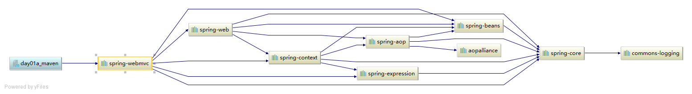

+ 紧接着再添加一个依赖 

```xml
    <dependencies>
        <dependency>
            <groupId>org.springframework</groupId>
            <artifactId>spring-webmvc</artifactId>
            <version>4.2.4.RELEASE</version>
        </dependency>
        <dependency>
            <groupId>org.springframework</groupId>
            <artifactId>spring-context</artifactId>
            <version>5.0.2.RELEASE</version>
        </dependency>
    </dependencies>
```

​	spring-webmvc 依赖 spirng-beans-4.2.4， spring-context 依赖 spring-beans-5.0.2，但是发现spirng-beans-4.2.4 加入到工程中,而我们希望 spring-beans-5.0.2 加入工程。 这就造成了依赖冲突。 

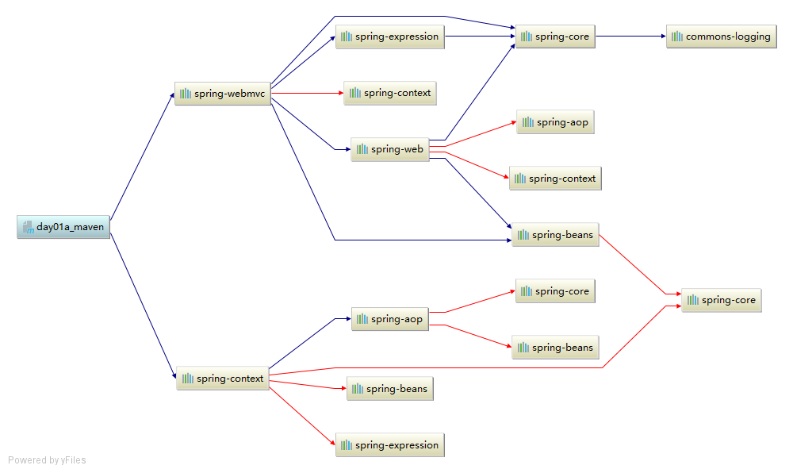


 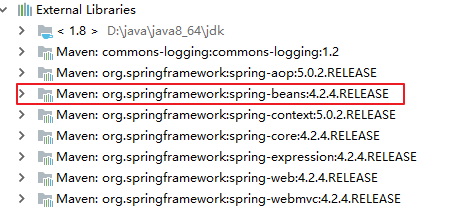

#### 3.2.依赖冲突的解决 

##### 3.2.1第一声明优先原则

+ 哪个jar包在靠上的位置，这个jar包就是先声明的，先声明的jar包下的依赖包，可以优先引入项目中。

+ 测试：

  如果将上边 spring-webmvc 和 spring-context 顺序颠倒，系统将导入 spring-beans-5.0.2。

```xml
    <dependencies>
        <dependency>
            <groupId>org.springframework</groupId>
            <artifactId>spring-context</artifactId>
            <version>5.0.2.RELEASE</version>
        </dependency>
        <dependency>
            <groupId>org.springframework</groupId>
            <artifactId>spring-webmvc</artifactId>
            <version>4.2.4.RELEASE</version>
        </dependency>
    </dependencies>
</dependencies>
```

 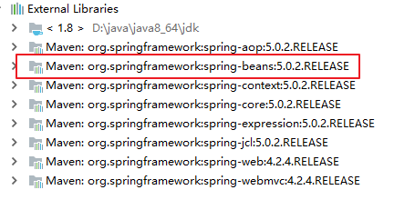

+ 分析

  由于 spring-webmvc 在前边以 spring-webmvc 依赖的 spring-beans-5.0.2 为准


##### 3.2.2路径近者优先原则

+ 直接依赖比传递依赖路径近，你那么最终进入项目的jar包会是路径近的直接依赖包。

  直接依赖：项目中直接导入的jar包就是项目的直接依赖包。

  传递依赖：项目中没有直接导入的jar包，可以通过中直接依赖包传递到项目中去。

  直接依赖>传递依赖(不管第一声明优先原则,和声明顺序没有关系了)

+ 测试

  还是上述情况， spring-contex 和 spring-webmvc 都会传递过来 spirng-beans， 那如果直接把 spring-beans 的依赖直接写到 pom 文件中，那么项目就不会再使用其他依赖传递来的 spring-beans，因为自己直接在 pom 中定义 spring-beans 要比其他依赖传递过来的路径要近。

```xml
    <dependencies>
        <dependency>
            <groupId>org.springframework</groupId>
            <artifactId>spring-context</artifactId>
            <version>5.0.2.RELEASE</version>
        </dependency>
        <dependency>
            <groupId>org.springframework</groupId>
            <artifactId>spring-webmvc</artifactId>
            <version>4.2.4.RELEASE</version>
        </dependency>

        <dependency>
            <groupId>org.springframework</groupId>
            <artifactId>spring-beans</artifactId>
            <version>5.0.0.RELEASE</version>
        </dependency>
    </dependencies>
```

此时优先引入的是直接依赖的引用

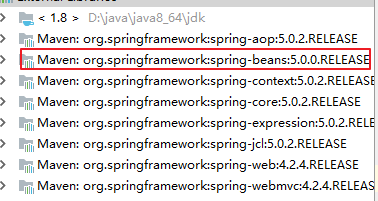 

+ 分析

  在本工程中的 pom 中加入 spirng-beans-5.0.0 的依赖，根据路径近者优先原则，系统将导入spirng-beans-5.0.0：

##### 3.2.3jar包冲突：直接排除法

+ 当我们需要排除某个jar包的依赖时，在配置exclusions标签的时候，内部可以不写版本号。pom.xml依赖如下：

```xml
   <dependencies>
        <dependency>
            <groupId>org.springframework</groupId>
            <artifactId>spring-webmvc</artifactId>
            <version>4.2.4.RELEASE</version>
            <!--直接排除-->
            <exclusions>
                <exclusion>
                    <artifactId>spring-beans</artifactId>
                    <groupId>org.springframework</groupId>
                </exclusion>
            </exclusions>
        </dependency>
        <dependency>
            <groupId>org.springframework</groupId>
            <artifactId>spring-context</artifactId>
            <version>5.0.2.RELEASE</version>
        </dependency>
    </dependencies>
```

依赖导入的jar包如下

 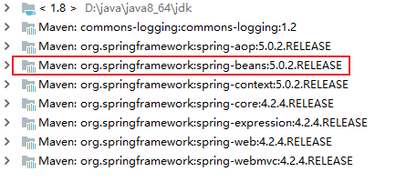


### 4.小结

1. 什么是依赖传递?

   ​	导入一个依赖,而这个依赖要依赖了其它的依赖, 把其它的依赖也导入进来了

2. jar包冲突解决方案?

   + 路径近者优先(直接依赖>间接依赖)
   + 第一声明优先原则(如果都是直接依赖或者都是间接依赖, 谁先声明 就使用谁)
   + 直接排除


# 第三章 工程分层【重点】

## 案例-工程分层开发

### 1.需求

​	将 SSM 工程拆分为多个模块开发

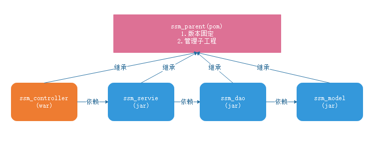  

+ 何为继承

  ​	继承是为了消除重复，如果将 dao、 service、 web 分开创建独立的工程则每个工程的 pom.xml文件中的内容存在重复，比如：设置编译版本、锁定 spring 的版本的等，可以将这些重复的配置提取出来在父工程的 pom.xml 中定义。

+ 何为聚合

  ​	项目开发通常是分组分模块开发， 每个模块开发完成要运行整个工程需要将每个模块聚合在一起运行，比如： dao、 service、 web 三个工程最终会打一个独立的 war 运行。 

### 2.步骤分析

#### 2.1父工程ssm_parent

1. 创建ssm_parent(pom)
2. 在pom.xml里面进行坐标管理(固定版本)

#### 2.2子工程ssm_model

1. 创建ssm_model(jar), 继承ssm_parent
2. 创建pojo

#### 2.3子工程ssm_dao

1. 创建ssm_dao(jar), 继承ssm_parent
2. 在pom.xml添加依赖(MyBatis,连接池,驱动,ssm_model)
3. 创建Dao接口 定义方法 添加注解
4. 创建applicationContext-dao.xml
   + 配置数据源
   + 注册SqlSessionFactory
   + 注册Dao包扫描器

#### 2.4子工程ssm_service

1. 创建ssm_service(jar), 继承ssm_parent
2. 在pom.xml添加依赖(spring容器,事务相关的,ssm_dao)
3. 创建Service接口和实现类 进行注册
4. 在Service里面注入Dao
5. 创建applicationContext-service.xml
   + 配置事务
   + 引入applicationContext-dao.xml

#### 2.5子工程ssm_controller

1. 创建==ssm_controller(war),== 继承ssm_parent
2. 在pom.xml添加依赖(springmvc,web相关, 依赖ssm_service)
3. 创建Controller类, 定义方法 添加注解
4. 创建springmvc.xml
   + 开启包扫描, 视图解析器, 忽略静态资源, 注解驱动
   + 引入applicationContext-service.xml
5. 配置web.xml
   + 前端控制器
   + 编码过滤器

### 3.实现

#### 3.1创建父工程ssm-parent(pom)

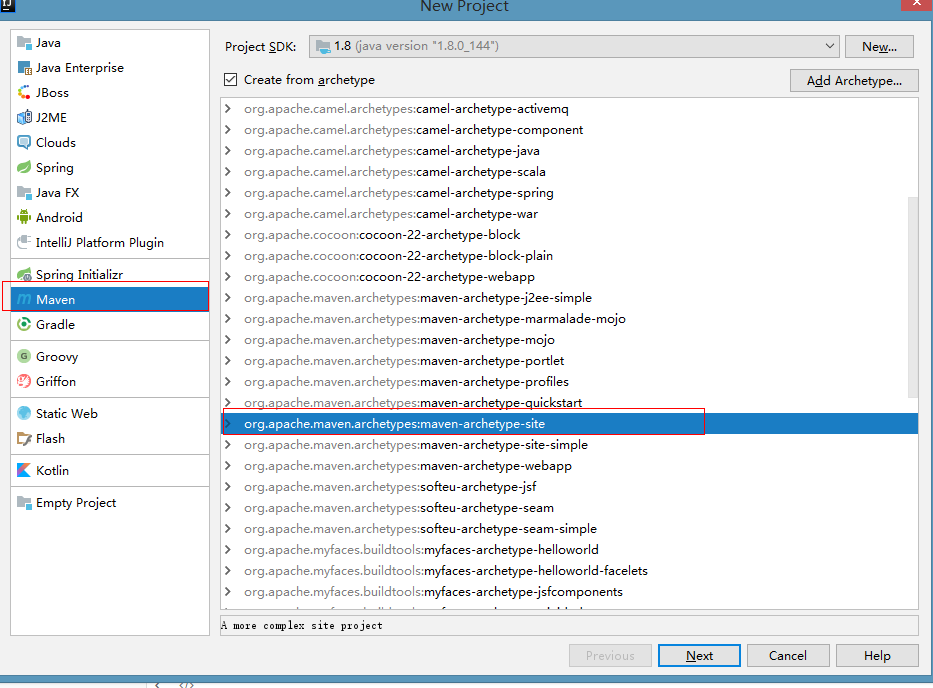


+ pom.xml

```xml
<?xml version="1.0" encoding="UTF-8"?>
<project xmlns="http://maven.apache.org/POM/4.0.0" xmlns:xsi="http://www.w3.org/2001/XMLSchema-instance"
         xsi:schemaLocation="http://maven.apache.org/POM/4.0.0 http://maven.apache.org/xsd/maven-4.0.0.xsd">
    <modelVersion>4.0.0</modelVersion>

    <groupId>com.itheima</groupId>
    <artifactId>ssm_parent</artifactId>
    <version>1.0-SNAPSHOT</version>
    <packaging>pom</packaging>

    <properties>
        <spring.version>5.0.2.RELEASE</spring.version>
        <slf4j.version>1.6.6</slf4j.version>
        <log4j.version>1.2.12</log4j.version>
        <mysql.version>5.1.6</mysql.version>
        <mybatis.version>3.4.5</mybatis.version>
        <aspectjweaver.version>1.6.8</aspectjweaver.version>
        <junit.version>4.12</junit.version>
        <jsp-api.version>2.0</jsp-api.version>
        <servlet-api.version>2.5</servlet-api.version>
        <jstl.version>1.2</jstl.version>
        <mybatis-spring.version>1.3.0</mybatis-spring.version>
        <druid.version>1.0.9</druid.version>
        <!--文件的编码格式和jdk版本-->
        <project.build.sourceEncoding>UTF-8</project.build.sourceEncoding>
        <maven.compiler.source>1.8</maven.compiler.source>
        <maven.compiler.target>1.8</maven.compiler.target>
    </properties>

    <!--jar包管理-->
    <dependencyManagement>
        <!--引入依赖-->
        <dependencies>
            <!-- spring -->
            <dependency>
                <groupId>org.aspectj</groupId>
                <artifactId>aspectjweaver</artifactId>
                <version>${aspectjweaver.version}</version>
            </dependency>

            <dependency>
                <groupId>org.springframework</groupId>
                <artifactId>spring-aop</artifactId>
                <version>${spring.version}</version>
            </dependency>

            <!--spring包-->
            <dependency>
                <groupId>org.springframework</groupId>
                <artifactId>spring-context</artifactId>
                <version>${spring.version}</version>
            </dependency>

            <!--用于SpringMVC-->
            <dependency>
                <groupId>org.springframework</groupId>
                <artifactId>spring-webmvc</artifactId>
                <version>${spring.version}</version>
            </dependency>
            <dependency>
                <groupId>org.springframework</groupId>
                <artifactId>spring-web</artifactId>
                <version>${spring.version}</version>
            </dependency>

            <!--用于数据库源相关操作-->
            <dependency>
                <groupId>org.springframework</groupId>
                <artifactId>spring-jdbc</artifactId>
                <version>${spring.version}</version>
            </dependency>
            <dependency>
                <groupId>org.springframework</groupId>
                <artifactId>spring-tx</artifactId>
                <version>${spring.version}</version>
            </dependency>

            <!--ServletAPI-->
            <dependency>
                <groupId>javax.servlet</groupId>
                <artifactId>servlet-api</artifactId>
                <version>${servlet-api.version}</version>
                <scope>provided</scope>
            </dependency>

            <dependency>
                <groupId>javax.servlet.jsp</groupId>
                <artifactId>jsp-api</artifactId>
                <version>${jsp-api.version}</version>
                <scope>provided</scope>
            </dependency>

            <!--jstl标签-->
            <dependency>
                <groupId>jstl</groupId>
                <artifactId>jstl</artifactId>
                <version>${jstl.version}</version>
            </dependency>

            <!--MySQL数据库驱动-->
            <dependency>
                <groupId>mysql</groupId>
                <artifactId>mysql-connector-java</artifactId>
                <version>${mysql.version}</version>
            </dependency>

            <!--测试框架-->
            <dependency>
                <groupId>org.springframework</groupId>
                <artifactId>spring-test</artifactId>
                <version>${spring.version}</version>
            </dependency>

            <dependency>
                <groupId>junit</groupId>
                <artifactId>junit</artifactId>
                <version>${junit.version}</version>
                <scope>compile</scope>
            </dependency>
            <!-- log start -->
            <dependency>
                <groupId>log4j</groupId>
                <artifactId>log4j</artifactId>
                <version>${log4j.version}</version>
            </dependency>

            <dependency>
                <groupId>org.slf4j</groupId>
                <artifactId>slf4j-api</artifactId>
                <version>${slf4j.version}</version>
            </dependency>

            <dependency>
                <groupId>org.slf4j</groupId>
                <artifactId>slf4j-log4j12</artifactId>
                <version>${slf4j.version}</version>
            </dependency>
            <!-- log end -->

            <!--mybatis-->
            <dependency>
                <groupId>org.mybatis</groupId>
                <artifactId>mybatis</artifactId>
                <version>${mybatis.version}</version>
            </dependency>

            <!--MyBatis集成Spring-->
            <dependency>
                <groupId>org.mybatis</groupId>
                <artifactId>mybatis-spring</artifactId>
                <version>${mybatis-spring.version}</version>
            </dependency>

            <!--数据源-->
            <dependency>
                <groupId>com.alibaba</groupId>
                <artifactId>druid</artifactId>
                <version>${druid.version}</version>
            </dependency>
        </dependencies>
    </dependencyManagement>


</project>

```


#### 3.2创建ssm-model(jar)

+ 创建步骤

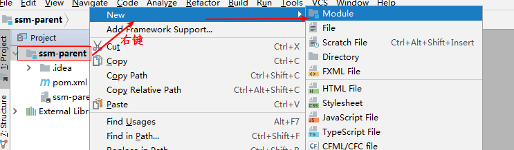


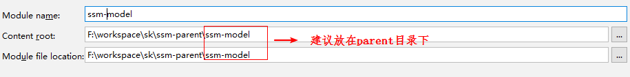

+ pom文件

```xml
<?xml version="1.0" encoding="UTF-8"?>
<project xmlns="http://maven.apache.org/POM/4.0.0"
         xmlns:xsi="http://www.w3.org/2001/XMLSchema-instance"
         xsi:schemaLocation="http://maven.apache.org/POM/4.0.0 http://maven.apache.org/xsd/maven-4.0.0.xsd">
    <parent>
        <artifactId>ssm_parent</artifactId>
        <groupId>com.itheima</groupId>
        <version>1.0-SNAPSHOT</version>
    </parent>
    <modelVersion>4.0.0</modelVersion>

    <artifactId>ssm_model</artifactId>


</project>
```

+ Account

```java
public class Account implements Serializable {
    private Integer id;
    private String name;
    private double money;

    public Integer getId() {
        return id;
    }

    public void setId(Integer id) {
        this.id = id;
    }

    public String getName() {
        return name;
    }

    public void setName(String name) {
        this.name = name;
    }

    public void setMoney(double money) {
        this.money = money;
    }

    public double getMoney() {
        return money;
    }

    @Override
    public String toString() {
        return "Account{" +
                "id=" + id +
                ", name='" + name + '\'' +
                ", money=" + money +
                '}';
    }
}
```


#### 3.3.创建ssm-dao(jar)
+ pom.xml

```xml
<?xml version="1.0" encoding="UTF-8"?>
<project xmlns="http://maven.apache.org/POM/4.0.0"
         xmlns:xsi="http://www.w3.org/2001/XMLSchema-instance"
         xsi:schemaLocation="http://maven.apache.org/POM/4.0.0 http://maven.apache.org/xsd/maven-4.0.0.xsd">
    <parent>
        <artifactId>ssm_parent</artifactId>
        <groupId>com.itheima</groupId>
        <version>1.0-SNAPSHOT</version>
    </parent>
    <modelVersion>4.0.0</modelVersion>

    <artifactId>ssm_dao</artifactId>

    <!--引入依赖-->
    <dependencies>
        <dependency>
            <groupId>com.itheima</groupId>
            <artifactId>ssm_model</artifactId>
            <version>1.0-SNAPSHOT</version>
        </dependency>
        <!--mybatis-->
        <dependency>
            <groupId>org.mybatis</groupId>
            <artifactId>mybatis</artifactId>
        </dependency>
        <!--MyBatis集成Spring-->
        <dependency>
            <groupId>org.mybatis</groupId>
            <artifactId>mybatis-spring</artifactId>
        </dependency>

        <!--数据源-->
        <dependency>
            <groupId>com.alibaba</groupId>
            <artifactId>druid</artifactId>
        </dependency>

        <!--MySQL数据库驱动-->
        <dependency>
            <groupId>mysql</groupId>
            <artifactId>mysql-connector-java</artifactId>
        </dependency>

        <!--SpringJdbc -->
        <dependency>
            <groupId>org.springframework</groupId>
            <artifactId>spring-jdbc</artifactId>
        </dependency>

        <!-- log start -->
        <dependency>
            <groupId>log4j</groupId>
            <artifactId>log4j</artifactId>
        </dependency>

        <dependency>
            <groupId>org.slf4j</groupId>
            <artifactId>slf4j-api</artifactId>
        </dependency>

        <dependency>
            <groupId>org.slf4j</groupId>
            <artifactId>slf4j-log4j12</artifactId>
        </dependency>
        <!-- log end -->
    </dependencies>


</project>
```

+ AccountDao.java

```java
public interface AccountDao {
    @Select("select * from account")
    List<Account> findAll();

}
```

+ spring-dao.xml

```xml
<?xml version="1.0" encoding="UTF-8"?>
<beans xmlns="http://www.springframework.org/schema/beans"
       xmlns:xsi="http://www.w3.org/2001/XMLSchema-instance"
       xmlns:context="http://www.springframework.org/schema/context"
       xsi:schemaLocation="http://www.springframework.org/schema/beans http://www.springframework.org/schema/beans/spring-beans.xsd http://www.springframework.org/schema/context http://www.springframework.org/schema/context/spring-context.xsd">

    <!--引入jdbc.properties-->
    <context:property-placeholder location="classpath:jdbc.properties"></context:property-placeholder>
    <!-- 数据库连接池 -->
    <bean id="dataSource" class="com.alibaba.druid.pool.DruidDataSource"
          destroy-method="close">
        <property name="driverClassName" value="${jdbc.driver}"/>
        <property name="url" value="${jdbc.url}"/>
        <property name="username" value="${jdbc.user}"/>
        <property name="password" value="${jdbc.password}"/>
    </bean>

    <!-- SqlSessionFactoryBean -->
    <bean id="sqlSessionFactory" class="org.mybatis.spring.SqlSessionFactoryBean">
        <!--指定SqlMapConfig配置文件-->
        <property name="configLocation" value="classpath:SqlMapConfig.xml"></property>
        <property name="dataSource" ref="dataSource" />
    </bean>

    <!-- 配置接口扫描包 -->
    <bean class="org.mybatis.spring.mapper.MapperScannerConfigurer">
        <property name="basePackage" value="com.itheima.dao"></property>
    </bean>

</beans>
```

+ jdbc.properties

```properties
jdbc.driver=com.mysql.jdbc.Driver
jdbc.user=root
jdbc.password=123456
jdbc.url=jdbc:mysql://localhost:3306/ssm
```

+ SqlMapConfig.xml

```xml
<?xml version="1.0" encoding="UTF-8" ?>
<!DOCTYPE configuration
        PUBLIC "-//mybatis.org//DTD Config 3.0//EN"
        "http://mybatis.org/dtd/mybatis-3-config.dtd">
<configuration>

</configuration>
```

#### 3.4创建ssm-service(jar)

+ pom.xml

```xml
<?xml version="1.0" encoding="UTF-8"?>
<project xmlns="http://maven.apache.org/POM/4.0.0"
         xmlns:xsi="http://www.w3.org/2001/XMLSchema-instance"
         xsi:schemaLocation="http://maven.apache.org/POM/4.0.0 http://maven.apache.org/xsd/maven-4.0.0.xsd">
    <parent>
        <artifactId>ssm_parent</artifactId>
        <groupId>com.itheima</groupId>
        <version>1.0-SNAPSHOT</version>
    </parent>
    <modelVersion>4.0.0</modelVersion>

    <artifactId>ssm_service</artifactId>

    <!--引入依赖-->
    <dependencies>
        <!--依赖dao-->
        <dependency>
            <groupId>com.itheima</groupId>
            <artifactId>ssm_dao</artifactId>
            <version>1.0-SNAPSHOT</version>
        </dependency>

        <!-- spring -->
        <dependency>
            <groupId>org.aspectj</groupId>
            <artifactId>aspectjweaver</artifactId>
        </dependency>

        <dependency>
            <groupId>org.springframework</groupId>
            <artifactId>spring-aop</artifactId>
        </dependency>

        <dependency>
            <groupId>org.springframework</groupId>
            <artifactId>spring-context</artifactId>
        </dependency>

        <dependency>
            <groupId>org.springframework</groupId>
            <artifactId>spring-tx</artifactId>
        </dependency>
    </dependencies>


</project>
```

+ AccountService.java

```java
public interface AccountService {

    List<Account> findAll();
}
```

+ AccountServiceImpl.java

```java
@Service("accountService")
public class AccountServiceImpl implements AccountService {

    @Autowired
    private AccountDao accountDao;

    public List<Account> findAll() {
        return accountDao.findAll();
    }
}
```

+ spring-service.xml

```xml
<?xml version="1.0" encoding="UTF-8"?>
<beans xmlns="http://www.springframework.org/schema/beans"
       xmlns:xsi="http://www.w3.org/2001/XMLSchema-instance"
       xmlns:tx="http://www.springframework.org/schema/tx"
       xmlns:aop="http://www.springframework.org/schema/aop"
       xsi:schemaLocation="http://www.springframework.org/schema/beans http://www.springframework.org/schema/beans/spring-beans.xsd http://www.springframework.org/schema/context http://www.springframework.org/schema/context/spring-context.xsd http://www.springframework.org/schema/tx http://www.springframework.org/schema/tx/spring-tx.xsd http://www.springframework.org/schema/aop http://www.springframework.org/schema/aop/spring-aop.xsd">


    <!--************配置事务*************************-->
    <!--1.注册事务管理器(需要依赖数据源)-->
    <bean id="transactionManager" class="org.springframework.jdbc.datasource.DataSourceTransactionManager">
        <property name="dataSource" ref="dataSource"></property>
    </bean>

    <!--2.配置事务建议(规则)-->
    <tx:advice transaction-manager="transactionManager" id="adviceId">
        <tx:attributes>
            <tx:method name="find*" read-only="true"/>
            <tx:method name="select*" read-only="true"/>
            <tx:method name="save*" read-only="false" propagation="REQUIRED"/>
            <tx:method name="update*" read-only="false" propagation="REQUIRED"/>
            <tx:method name="delete*" read-only="false" propagation="REQUIRED"/>
            <tx:method name="insert*" read-only="false" propagation="REQUIRED"/>
        </tx:attributes>
    </tx:advice>

    <!--3.配置AOP-->
    <aop:config>
        <!--配置切入点: 匹配了所有的业务实现类里面的所有的方法-->
        <aop:pointcut id="pointCutId" expression="execution(* com.itheima.service.impl.*.*(..))"></aop:pointcut>
        <!--配置切面-->
        <aop:advisor advice-ref="adviceId" pointcut-ref="pointCutId"></aop:advisor>
    </aop:config>

    <!--************配置事务结束**********************-->
    <import resource="classpath*:spring-dao.xml"/>
</beans>
```

#### 3.5创建ssm-web(war)

+ pom.xml

```xml
<?xml version="1.0" encoding="UTF-8"?>
<project xmlns="http://maven.apache.org/POM/4.0.0"
         xmlns:xsi="http://www.w3.org/2001/XMLSchema-instance"
         xsi:schemaLocation="http://maven.apache.org/POM/4.0.0 http://maven.apache.org/xsd/maven-4.0.0.xsd">
    <parent>
        <artifactId>ssm_parent</artifactId>
        <groupId>com.itheima</groupId>
        <version>1.0-SNAPSHOT</version>
    </parent>
    <modelVersion>4.0.0</modelVersion>
    <packaging>war</packaging>
    <artifactId>ssm_web</artifactId>

    <dependencies>
        <!--依赖service-->
        <dependency>
            <groupId>com.itheima</groupId>
            <artifactId>ssm_service</artifactId>
            <version>1.0-SNAPSHOT</version>
        </dependency>
        <dependency>
            <groupId>org.springframework</groupId>
            <artifactId>spring-web</artifactId>
        </dependency>

        <dependency>
            <groupId>org.springframework</groupId>
            <artifactId>spring-webmvc</artifactId>
        </dependency>
        <!--servletAPI -->
        <dependency>
            <groupId>javax.servlet</groupId>
            <artifactId>servlet-api</artifactId>
            <scope>provided</scope>
        </dependency>

        <dependency>
            <groupId>javax.servlet.jsp</groupId>
            <artifactId>jsp-api</artifactId>
            <scope>provided</scope>
        </dependency>

        <dependency>
            <groupId>jstl</groupId>
            <artifactId>jstl</artifactId>
        </dependency>
    </dependencies>

</project>
```


+ AccountController

```java
package com.itheima.web;

import com.itheima.pojo.Account;
import com.itheima.service.AccountService;
import org.springframework.beans.factory.annotation.Autowired;
import org.springframework.stereotype.Controller;
import org.springframework.ui.Model;
import org.springframework.web.bind.annotation.RequestMapping;

import java.util.List;

@Controller
@RequestMapping("/account")
public class AccountController {
    @Autowired
    private AccountService accountService;

    @RequestMapping("/findAll")
    public String findAll(Model model){
        System.out.println("AccountController...findAll()");
        List<Account> list = accountService.findAll();
        model.addAttribute("list",list);
        System.out.println(list);

        return  "success";
    }

}
```

+ springmvc.xml

```xml
<?xml version="1.0" encoding="UTF-8"?>
<beans xmlns="http://www.springframework.org/schema/beans"
       xmlns:xsi="http://www.w3.org/2001/XMLSchema-instance"
       xmlns:context="http://www.springframework.org/schema/context"
       xmlns:mvc="http://www.springframework.org/schema/mvc"
       xsi:schemaLocation="http://www.springframework.org/schema/beans http://www.springframework.org/schema/beans/spring-beans.xsd http://www.springframework.org/schema/context http://www.springframework.org/schema/context/spring-context.xsd http://www.springframework.org/schema/mvc http://www.springframework.org/schema/mvc/spring-mvc.xsd">
    <context:component-scan base-package="com.itheima"></context:component-scan>
    <!--配置视图解析器-->
    <bean id="viewResolver" class="org.springframework.web.servlet.view.InternalResourceViewResolver">
        <property name="prefix" value="/WEB-INF/pages/"></property>
        <property name="suffix" value=".jsp"></property>
    </bean>
    <!--注解驱动-->
    <mvc:annotation-driven></mvc:annotation-driven>
    <!-- 设置静态资源不过滤 -->
    <mvc:resources location="/css/" mapping="/css/**"/>  <!-- 样式 -->
    <mvc:resources location="/images/" mapping="/images/**"/>  <!-- 图片 -->
    <mvc:resources location="/js/" mapping="/js/**"/>  <!-- javascript -->

    <import resource="classpath:spring-service.xml"/>
</beans>
```

+ web.xml

```xml
<?xml version="1.0" encoding="UTF-8"?>
<web-app xmlns:xsi="http://www.w3.org/2001/XMLSchema-instance"
         xmlns="http://java.sun.com/xml/ns/javaee"
         xsi:schemaLocation="http://java.sun.com/xml/ns/javaee http://java.sun.com/xml/ns/javaee/web-app_3_0.xsd"
         id="WebApp_ID" version="3.0">
    <welcome-file-list>
        <welcome-file>index.html</welcome-file>
        <welcome-file>index.jsp</welcome-file>
    </welcome-file-list>

    <!--配置SpringMVC的前端控制器-->
    <servlet>
        <servlet-name>DispatcherServlet</servlet-name>
        <servlet-class>org.springframework.web.servlet.DispatcherServlet</servlet-class>
        <!--指定了配置文件-->
        <init-param>
            <param-name>contextConfigLocation</param-name>
            <param-value>classpath:springmvc.xml</param-value>
        </init-param>
        <!--服务器启动的时候就初始化完成-->
        <load-on-startup>1</load-on-startup>
    </servlet>
    <servlet-mapping>
        <servlet-name>DispatcherServlet</servlet-name>
        <url-pattern>/</url-pattern>
    </servlet-mapping>
    <!--处理post乱码-->
    <filter>
        <filter-name>CharacterEncodingFilter</filter-name>
        <filter-class>org.springframework.web.filter.CharacterEncodingFilter</filter-class>
        <init-param>
            <param-name>encoding</param-name>
            <param-value>utf-8</param-value>
        </init-param>
    </filter>
    <filter-mapping>
        <filter-name>CharacterEncodingFilter</filter-name>
        <url-pattern>/*</url-pattern>
    </filter-mapping>
</web-app>
```

### 4.小结

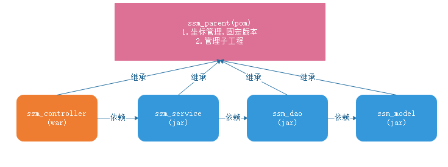  

# 第四章maven 私服

## 知识点- 私服搭建【了解】 

### 1.目标

- [ ] 了解Maven私服搭建

### 2.路径

1. Maven私服概述
2. 搭建私服环境 

### 3.讲解

#### 3.1Maven私服概述

​	==公司在自己的局域网内搭建自己的远程仓库服务器，称为私服==， 私服服务器即是公司内部的 maven 远程仓库， 每个员工的电脑上安装 maven 软件并且连接私服服务器，员工将自己开发的项目打成 jar 并发布到私服服务器，其它项目组从私服服务器下载所依赖的构件（jar）。私服还充当一个代理服务器，当私服上没有 jar 包会从互联网中央仓库自动下载，如下
图 :

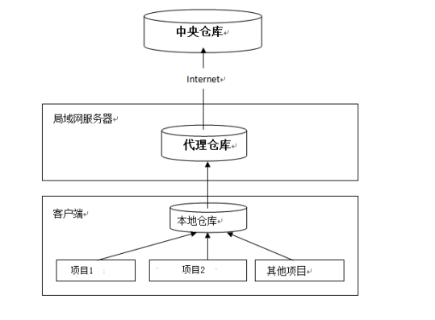

#### 3.2.搭建私服环境 

##### 3.2.1下载 nexus 

​	Nexus 是 Maven 仓库管理器， 通过 nexus 可以搭建 maven 仓库，同时 nexus 还提供强大的仓库管理功能，构件搜索功能等。
​	 下载地址： http://www.sonatype.org/nexus/archived/ 

​	下载： nexus-2.12.0-01-bundle.zip 

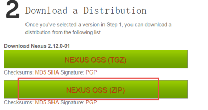

##### 3.2.2安装 nexus 

解压 nexus-2.12.0-01-bundle.zip，进入 bin 目录： 

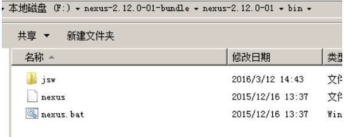

以管理员权限运行命令行,进入 bin 目录，执行 nexus.bat install 

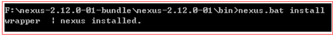

安装成功在服务中查看有 nexus 服务： 


##### 3.2.3卸载nexus 

cmd 进入 nexus 的 bin 目录，执行： nexus.bat uninstall 

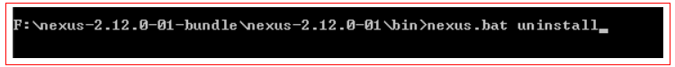

##### 3.2.4启动 nexus 

+ 方式一

  cmd 进入 bin 目录，执行 nexus.bat start 

+ 方式二

  直接启动 nexus 服务 

  

  

##### 3.2.5登录

+ 访问: http://localhost:8081/nexus/ 

  > 查看 nexus 的配置文件 conf/nexus.properties ,里面有端口号

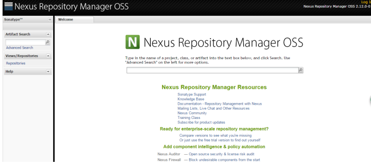

+ 点击右上角的 Log in，输入账号和密码 登陆 (账号admin,密码admin123 )

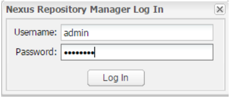

+ 登录成功

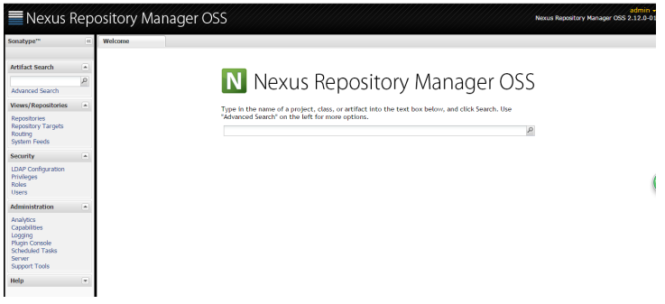

##### 3.2.6仓库类型 

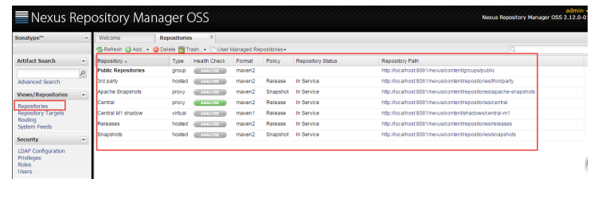

nexus 的仓库有 4 种类型： 

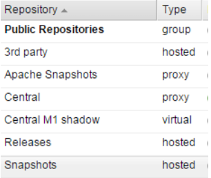

1. hosted，宿主仓库， 部署自己的 jar 到这个类型的仓库，包括 releases 和 snapshot 两部
   分， Releases 公司内部发布版本仓库、 Snapshots 公司内部测试版本仓库
2. proxy，代理仓库， 用于代理远程的公共仓库，如 maven 中央仓库，用户连接私服，私
   服自动去中央仓库下载 jar 包或者插件。
3. group，仓库组，用来合并多个 hosted/proxy 仓库，通常我们配置自己的 maven 连接仓
   库组。
4. virtual(虚拟)：兼容 Maven1 版本的 jar 或者插件 

### 4.小结


## 知识点-Maven私服的使用

### 1.目标

- [ ] 了解Maven私服的使用

### 2.路径

1. 将项目发布到私服 
2. 从私服下载 jar 包 

### 3.讲解

#### 3.1.将项目发布到私服 

##### 3.1.1需求

​	企业中多个团队协作开发通常会将一些公用的组件、开发模块等发布到私服供其它团队或模块开发人员使用。
​	本例子假设多团队分别开发 ssm_dao、 ssm_service、 ssm_web，某个团队开发完在ssm_dao 会将 ssm_dao 发布到私服供 ssm_service 团队使用，本例子会将 ssm_dao 工程打成jar 包发布到私服。 

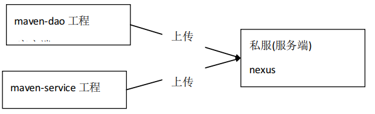

##### 3.1.2配置

​	第一步： 需要在客户端即部署 ssm_dao 工程的电脑上配置 maven环境，并修改 settings.xml文件(Maven配置文件)， 配置连接私服的用户和密码 。此用户名和密码用于私服校验，因为私服需要知道上传的账号和密码是否和私服中的账号和密码一致 (配置到`<servers>`标签下)

```xml
<server>
    <id>releases</id>
    <username>admin</username>
    <password>admin123</password>
</server>
<server>
    <id>snapshots</id>
    <username>admin</username>
    <password>admin123</password>
</server>
```

releases: 连接发布版本项目仓库
snapshots: 连接测试版本项目仓库 

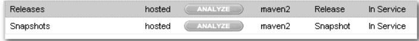

​	

​	第二步： 配置项目 pom.xml . 配置私服仓库的地址，本公司的自己的 jar 包会上传到私服的宿主仓库，根据工程的版本号决定上传到哪个宿主仓库，如果版本为 release 则上传到私服的 release 仓库，如果版本为snapshot 则上传到私服的 snapshot 仓库 .

```xml
<distributionManagement>
    <repository>
        <id>releases</id>
        <url>http://localhost:8081/nexus/content/repositories/releases/</url>
    </repository>
    <snapshotRepository>
        <id>snapshots</id>
        <url>http://localhost:8081/nexus/content/repositories/snapshots/</url>
    </snapshotRepository>
</distributionManagement>
```

+ 注意： pom.xml 这里`<id>` 和 settings.xml 配置 `<id>` 对应！ 

##### 3.1.3测试

将项目 dao 工程打成 jar 包发布到私服：
1、 首先启动 nexus
2、 对 ssm_dao 工程执行 deploy 命令 

​	根据本项目pom.xml中version定义决定发布到哪个仓库，如果version定义为snapshot，执行 deploy后查看 nexus 的 snapshot仓库， 如果 version定义为 release则项目将发布到 nexus的 release 仓库，本项目将发布到 snapshot 仓库： 

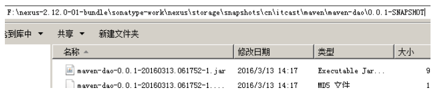

​	也可以通过 http 方式查看： 

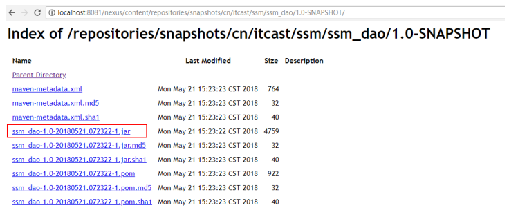

#### 3.2从私服下载 jar 包 

##### 3.2.1需求

​	没有配置 nexus 之前，如果本地仓库没有，去中央仓库下载，通常在企业中会在局域网内部署一台私服服务器， 有了私服本地项目首先去本地仓库找 jar，如果没有找到则连接私服从私服下载 jar 包，如果私服没有 jar 包私服同时作为代理服务器从中央仓库下载 jar 包，这样做的好处是一方面由私服对公司项目的依赖 jar 包统一管理，一方面提高下载速度， 项目连接私服下载 jar 包的速度要比项目连接中央仓库的速度快的多。 

本例子测试从私服下载 ssm_dao 工程 jar 包。 

##### 3.2.2在 setting.xml 中配置仓库 

​	在客户端的 setting.xml 中配置私服的仓库，由于 setting.xml 中没有 repositories 的配置标签需要使用 profile 定义仓库。(==配置在`<profiles>`标签下==)

```xml
<profile>
    <!--profile 的 id-->
    <id>dev</id>
    <repositories>
        <repository>
        <!--仓库 id， repositories 可以配置多个仓库，保证 id 不重复-->
        <id>nexus</id>
        <!--仓库地址，即 nexus 仓库组的地址-->
        <url>http://localhost:8081/nexus/content/groups/public/</url>
        <!--是否下载 releases 构件-->
        <releases>
            <enabled>true</enabled>
        </releases>
        <!--是否下载 snapshots 构件-->
        <snapshots>
            <enabled>true</enabled>
        </snapshots>
    </repository>
    </repositories>
    <pluginRepositories>
        <!-- 插件仓库， maven 的运行依赖插件，也需要从私服下载插件 -->
        <pluginRepository>
            <!-- 插件仓库的 id 不允许重复，如果重复后边配置会覆盖前边 -->
            <id>public</id>
            <name>Public Repositories</name>
            <url>http://localhost:8081/nexus/content/groups/public/</url>
        </pluginRepository>
    </pluginRepositories>
</profile>
```

使用 profile 定义仓库需要激活才可生效。 

```xml
<activeProfiles>
	<activeProfile>dev</activeProfile>
</activeProfiles>
```


##### 3.2.3测试从私服下载 jar 包

+ 删掉本地仓库的ssm_deo


+ 编译ssm-service

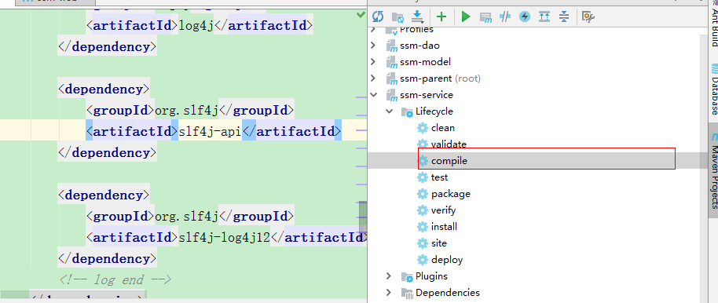

+ 出现如下日志

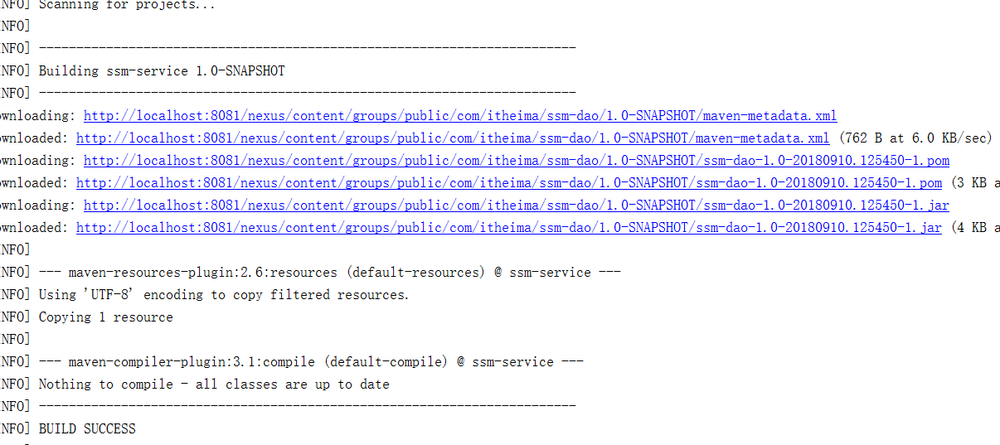

### 4.小结

 

## 知识点-把第三方 jar 包放入本地仓库和私服 

### 1.目标

- [ ] 掌握把第三方 jar 包放入本地仓库和私服 

### 2.路径

1. 导入本地库 
2. 导入私服 
3. 参数说明 

### 3.讲解

#### 3.1.导入本地库 

+ 随便找一个 jar 包测试， 可以先 CMD进入到 jar 包所在位置，运行

```
mvn install:install-file -DgroupId=com.alibaba -DartifactId=fastjson -Dversion=1.1.37 -Dfile=fastjson-1.1.37.jar -Dpackaging=jar
```

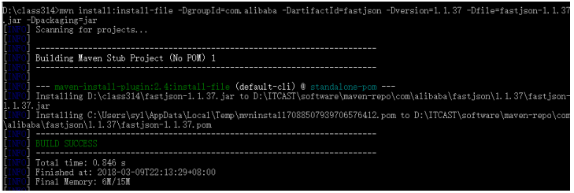

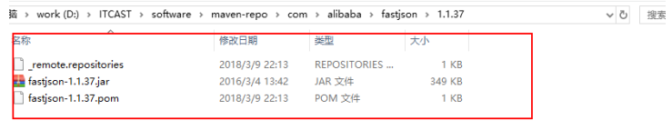

#### 3.2.导入私服 

需要在 maven 软件的核心配置文件 settings.xml 中配置第三方仓库的 server 信息 

```xml
<server>
    <id>thirdparty</id>
    <username>admin</username>
    <password>admin123</password>
</server>
```

才能执行一下命令 

```
mvn deploy:deploy-file -DgroupId=com.alibaba -DartifactId=fastjson -Dversion=1.1.37 -Dpackaging=jar -Dfile=fastjson-1.1.37.jar -Durl=http://localhost:8081/nexus/content/repositories/thirdparty/ -DrepositoryId=thirdparty
```

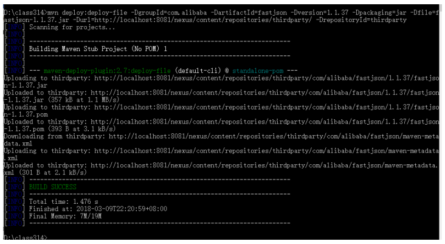

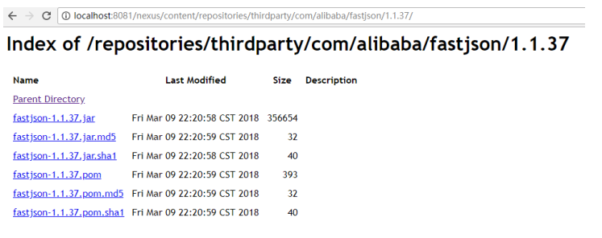

#### 3.3.参数说明 

DgroupId 和 DartifactId 构成了该 jar 包在 pom.xml 的坐标，项目就是依靠这两个属性定位。自己起名字也行。

Dfile 表示需要上传的 jar 包的绝对路径。

Durl 私服上仓库的位置，打开 nexus——>repositories 菜单，可以看到该路径。

DrepositoryId 服务器的表示 id，在 nexus 的 configuration 可以看到。

Dversion 表示版本信息。

关于 jar 包准确的版本：

​	包的名字上一般会带版本号，如果没有那可以解压该包，会发现一个叫 MANIFEST.MF 的文件 

​	这个文件就有描述该包的版本信息。

​	比如 Specification-Version: 2.2 可以知道该包的版本了。

​	上传成功后，在 nexus 界面点击 3rd party 仓库可以看到这包。 

### 4.小结
